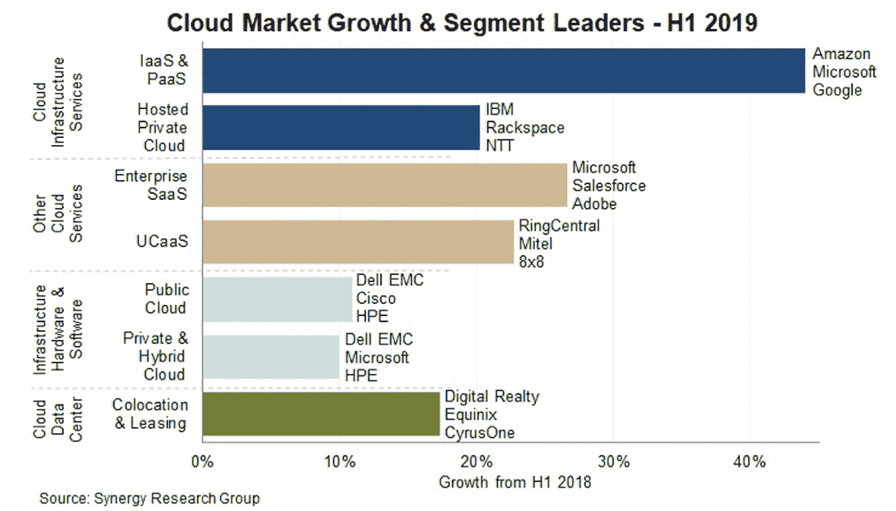
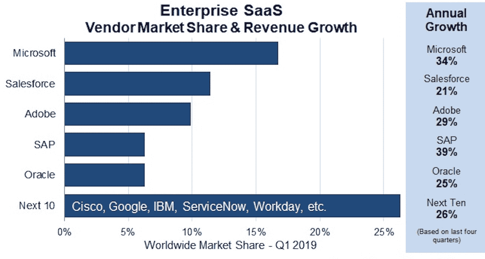
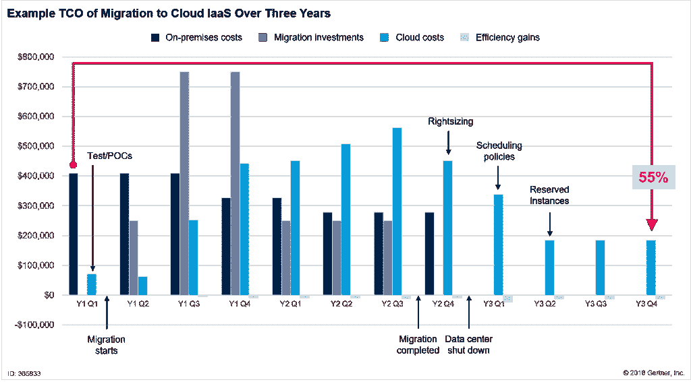

# 云市场份额:2022 年云生态系统展望

> 原文：<https://kinsta.com/blog/cloud-market-share/>

云计算已经发展成为一个庞大而复杂的技术、产品和服务生态系统。催生了数十亿美元的经济，其中许多云提供商都在争夺不断扩大的云市场份额。

作为消费者，导航和理解这个云生态系统变得越来越困难。在行业巨头亚马逊网络服务、[微软 Azure 和谷歌云平台](https://kinsta.com/blog/google-cloud-vs-azure/)之外，云市场对许多人来说仍然是一个谜。

今天，我们将深入探讨并揭开云市场的神秘面纱。我们将解释不同的云服务，确定领先的云提供商，并探索他们在 2022 年的云市场份额。

我们还将帮助您了解企业如何以及为什么迁移到云，相关的好处以及所涉及的成本。

## 了解云计算服务的三种主要类型

在探索云市场和云市场份额之前，首先您必须了解云计算的三种主要类型。每种类型都有自己独特的服务和云提供商，构成了这个市场。三种主要的云计算类型是:

### 基础设施即服务(IaaS)

[IaaS](https://kinsta.com/blog/what-is-iaas/) 是[云计算](https://kinsta.com/blog/types-of-cloud-computing/#iass)的一种产品，供应商向您提供对计算资源(如网络、存储和服务器)的按需访问。在提供商的基础设施中，您可以运行自己的平台和应用。这提供了灵活的[硬件资源，可以根据您的存储和处理需求进行扩展](https://kinsta.com/knowledgebase/dedicated-server/)。

> 需要在这里大声喊出来。Kinsta 太神奇了，我用它做我的个人网站。支持是迅速和杰出的，他们的服务器是 WordPress 最快的。
> 
> <footer class="wp-block-kinsta-client-quote__footer">
> 
> 
> 
> <cite class="wp-block-kinsta-client-quote__cite">Phillip Stemann</cite></footer>

[View plans](https://kinsta.com/plans/)

### 平台即服务(PaaS)

[PaaS](https://kinsta.com/blog/what-is-paas/) 是一种云计算产品，提供商让您可以访问云环境，在其中开发、管理和托管应用程序。您将可以通过该平台使用一系列工具来支持测试和开发。

提供商负责底层基础设施、安全性、操作系统和备份。

### 软件即服务(SaaS)

[SaaS](https://kinsta.com/blog/types-of-cloud-computing/#saas) 是云计算的一种产品，其中[的提供商让你可以访问他们基于云的软件](https://kinsta.com/blog/boosting-wordpress-performance/)。您不用在本地设备上安装软件应用程序，而是使用 web 或 API 访问提供商的应用程序。

(建议阅读:[SaaS 营销的 7 大关键原则](https://kinsta.com/blog/saas-marketing/))。

通过应用程序，您可以存储和分析自己的数据。您不必花费时间来安装、管理或升级软件，这些都由提供商来处理。

在这些服务类别中，您可以选择公共云、私有云和混合云解决方案:

#### 私有云

私有云是您托管在自己的数据中心或内部网的地方。您拥有、管理、更新和升级您自己的云生态系统，包括服务器、网络、软件或平台资源。用您自己的[防火墙和安全解决方案](https://kinsta.com/blog/what-is-a-firewall/)保护这一切。

#### 公共云

公共云是提供商为您提供对其数据中心基础设施的[访问。他们负责所有的管理、维护、安全和升级。](https://kinsta.com/knowledgebase/google-cloud-data-center-locations/)

#### 混合云

混合云是您选择混合使用公共云和私有云解决方案的地方。您负责管理这两种服务的交互方式，尤其是公共云和私有云设置之间数据传输的安全性。

## 2022 年云计算市场概述

云计算市场巨大。来自 [Synergy Research Group](https://www.srgresearch.com/articles/half-yearly-review-shows-150-billion-spent-cloud-services-and-infrastructure) 的新数据，涵盖七个关键的云服务和基础设施细分市场、运营商和供应商，报告 2019 年上半年的收入超过 1500 亿美元。比上一年增长了 24%。

尽管云市场已经变得很大，但仍有巨大的扩张空间。尤其是当你考虑到 Gartner 预测 2019 年全球 IT 支出为 3.79 万亿美元时。

Cloud market growth and segment leaders (Image source: Synergy.com)

仔细看看构成云市场的细分市场，公共云解决方案占了大多数。这与 [RightScale](https://info.flexerasoftware.com/SLO-WP-State-of-the-Cloud-2019) 2019 年云状态报告非常一致。根据调查，91%的企业报告使用公共云服务，72%选择私有云解决方案，69%选择混合解决方案。

根据 IDC 的预测，全球在公共云服务和基础设施上的支出预计将在未来五年翻一番。当你想到云计算带来的好处时，这并不奇怪。从 2019 年的 2290 亿美元增长到 2023 年的近 5000 亿美元。受到五年复合年增长率的推动(CAGR)。

IDC 报告认为 SaaS 是最大的支出类别，在整个预测期内占据了公共云支出的一半以上。据报道，IaaS 是第二大支出类别，增长最快，预计五年 CAGR 为 32.0%。PaaS 是支出最低的类别，第二大五年 CAGR 为 29.9%。

要更详细地了解公共云市场，我们必须求助于替代研究和报告。

### 深入了解 SaaS 公共云市场份额

软件即服务是最成熟的公共云市场，呈现健康增长。来自 [Synergy Research Group](https://www.srgresearch.com/articles/saas-spending-hits-100-billion-annual-run-rate-microsoft-extends-its-leadership) 的最新数据报告称，软件供应商为 Q1 2019 年创造的收入超过 230 亿美元。

使市场的年增长率超过 1000 亿美元。该报告强调了近 30%的年增长率，这与 IDC 前面提到的全球公共云服务支出指南密切相关。

SaaS 市场由五家主要厂商主导。这些 SaaS 供应商总共占据了全球 SaaS 云市场份额的 51%。

领先的是微软，其市场份额为 17%，年增长率高达 34%。微软继续获得市场份额，主要是由于它在高增长的协作领域的主导地位。

Salesforce 以 12%的 SaaS 市场份额和 21%的年增长率紧随其后。紧随其后的是 Adobe，在 SaaS 的市场份额为 10%，年增长率为 29%。接下来是 SAP，凭借其 6%的 SaaS 市场份额和 39%的年增长率(在前五大供应商中最高)逼近上述供应商。最后是甲骨文，也占据了 6%的市场份额，年增长率为 29%。

SaaS market share and revenue growth (Image source: Synergy.com)

接下来的十家厂商占据了 SaaS 市场的 26%,据报道增长率为 26%。这些供应商包括思科、谷歌、IBM、ServiceNow 和 Workday。

### SaaS 市场的演变

尽管 SaaS 市场明显成熟，但仍有巨大的扩张空间。因为目前 SaaS 市场仅占企业软件总支出的大约 20%。由于大部分企业软件支出仍集中在内部软件解决方案上，SaaS 供应商正转向这一市场，以吸引企业采用云设置。

2019 年，SaaS 的供应商格局基本上分为三个阵营——传统企业软件供应商、云端出生的供应商和寻求在市场上扩张的大型 it 供应商:

#### 传统企业软件供应商

这个阵营包括你所期望的大公司，如微软、SAP、甲骨文和 IBM。他们拥有庞大的现有本地消费者基础，他们希望将这些消费者转化为基于 SaaS 的订阅模式。

#### 诞生在云端的供应商

这些相对较新的公司正以更高的增长率快速扩张。它们包括 Zendesk、Workday 和 Atlassian 等。然而，他们缺乏的是这个世界对微软的巨大品牌认知度。

#### 大型 IT 供应商

该集团包括谷歌(Google)和思科(Cisco)等公司，试图进军 SaaS 市场。通过像 Google Workspace 和思科的协作应用这样的服务，在市场上为自己开拓一个利基市场。

## 探索和了解 IaaS 和 PaaS 公共云市场

当谈到获得 IaaS 和 PaaS 市场的准确情况时，事情变得有点棘手。该领域的领先供应商(包括亚马逊和微软)经常报告 IaaS 和 PaaS 的总收入。

此外，他们的细分报告缺乏透明度，因此很容易理解为什么获得市场的真实情况如此具有挑战性。令人欣慰的是，来自领先研究机构——如 Gartner 和 IDC——的报告有助于我们获得更深刻的见解。

## 注册订阅时事通讯

### 想知道我们是怎么让流量增长超过 1000%的吗？

加入 20，000 多名获得我们每周时事通讯和内部消息的人的行列吧！

[Subscribe Now](#newsletter)

### 哪家提供商在公共云基础架构领域拥有最大的市场份额？

来自 Gartner 的关于全球基础设施即服务市场的最新[数据显示年收入为 324 亿美元。较 2017 年的 247 亿美元增长 31.3%。](https://www.gartner.com/en/newsroom/press-releases/2019-07-29-gartner-says-worldwide-iaas-public-cloud-services-market-grew-31point3-percent-in-2018)

根据 Gartner 的数据，该市场由五家供应商主导，它们占 2018 年全球 IaaS 云市场份额的近 80%。这些厂商分别是亚马逊(47.8%)、微软(15.5%)、阿里巴巴(7.7%)、谷歌(4.0%)和 IBM (1.8%)。

#### 表:2017-2018 年全球 IaaS 公共云服务市场份额(百万美元)

| **公司** | **2018****收入** | **2018****市场份额(%)** | **2017****收入** | **2017****市场份额(%)** | **2018-2017****增长率(%)** |
| 亚马孙 | Fifteen thousand four hundred and ninety-five | Forty-seven point eight | Twelve thousand two hundred and twenty-one | Forty-nine point four | Twenty-six point eight |
| 微软 | Five thousand and thirty-eight | Fifteen point five | Three thousand one hundred and thirty | Twelve point seven | Sixty point nine |
| 阿里巴巴 | Two thousand four hundred and ninety-nine | Seven point seven | One thousand two hundred and ninety-eight | Five point three | Ninety-two point six |
| 谷歌 | One thousand three hundred and fourteen | Four | Eight hundred and twenty | Three point three | Sixty point two |
| 国际商用机器公司 | Five hundred and seventy-seven | One point eight | Four hundred and sixty-three | One point nine | Twenty-four point seven |
| 其他人 | Seven thousand five hundred and nineteen | Twenty-three point two | Six thousand seven hundred and sixty-eight | Twenty-seven point four | Eleven point one |
| **总计** | **32441** | **100.0** | **24699** | **100.0** | **31.3** |

让我们仔细看看 2019 年排名前 5 位的公共云基础架构提供商的基础架构。结合来自 Gartner 和提供商各自收入报告的数据。

#### 亚马逊网络服务(AWS)

亚马逊拥有全球近一半的公共云基础设施市场，是明显的市场领导者。2018 年，亚马逊报告营收 154 亿美元，比上年增长 26.8%。将这种优势带入 2019 年，亚马逊报告称 [Q1](https://press.aboutamazon.com/news-releases/news-release-details/amazoncom-announces-first-quarter-sales-17-597-billion) 和 [Q2](https://press.aboutamazon.com/news-releases/news-release-details/amazoncom-announces-second-quarter-sales-20-634-billion) 的 AWS 总收入为 161 亿美元，比 H1 2018 年增长 39%。

#### 微软 Azure

凭借 15.5%的市场份额，Gartner 估计 Azure 的年收入为 50 亿美元，2018 年的增长率为 60.9%，从而提高了 Azure 的市场份额。然而，获得微软公共云基础设施市场份额的真实情况仍然是一个谜。由于微软继续在合并后的“商业云业务”中掩盖 Azure 的收入。

2019 年，微软看起来将占据 [AWS 市场份额](https://kinsta.com/aws-market-share/)，报告 H1 Azure 收入同比增长 70%。总体而言，据报道，微软的 [Q1](https://www.microsoft.com/en-us/Investor/earnings/FY-2019-Q3/press-release-webcast) 和 [Q2](https://www.microsoft.com/en-us/Investor/earnings/FY-2019-Q4/press-release-webcast) 商业云业务总收入目前为 206 亿美元，比 H1 2018 年增长 40%。

#### 阿里巴巴

根据 Gartner 的数据，阿里巴巴拥有 7.7%的公共云市场份额，年收入为 24.9 亿美元，2018 年增长率高达 92.6%。这家中国电子商务巨头在 2019 年继续保持令人印象深刻的增长，报告称 [Q1](https://www.alibabagroup.com/en/news/press_pdf/p190515.pdf) 和 [Q2](https://www.alibabagroup.com/en/news/press_pdf/p190815.pdf) 的总收入为 22 亿美元，增长 66%。这使得该公司的年收入超过 40 亿美元。

#### 谷歌云平台(GCP)

[据 Gartner 估计，谷歌的云平台](https://kinsta.com/blog/google-cloud-hosting/)拥有 4%的公共云市场份额，年收入为 13 亿美元，2018 年增长 60%。今年可能会看到谷歌超过阿里巴巴，谷歌首席执行官桑德尔·皮帅[报告称](https://abc.xyz/investor/static/pdf/2019Q2_alphabet_earnings_release.pdf?cache=3d0a3db)云服务收入有望达到 80 亿美元。这需要有所保留，因为谷歌将 GCP 的收入与 SaaS 的谷歌工作空间结合在一起。

请务必查看我们深入的[谷歌云平台市场份额指南](https://kinsta.com/google-cloud-market-share/)以了解更多信息。

使用我们灵活的 Google Cloud powered 基础设施，将你的 WordPress 站点速度提升 200%。[免费试用 kin sta](https://hubs.ly/H0pklC_0)。

#### 国际商用机器公司

根据 Gartner 的数据，IBM 拥有 1.8%的市场份额，年收入为 5.77 亿美元，增长率为 24。2018 年%。主要以其混合云服务而闻名的 IBM 将在 2019 年撼动市场，此前[以 340 亿美元](https://www.redhat.com/en/about/press-releases/ibm-closes-landmark-acquisition-red-hat-34-billion-defines-open-hybrid-cloud-future)收购了 IaaS 提供商 Red Hat。

### 了解 PaaS 市场中的机会

据 Gartner 预测，到 2019 年，PaaS 市场的收入将超过 200 亿美元。这一数字预计到 2022 年将翻一番。随着超过 360 家供应商和 550 种云平台服务跨越 22 个类别，市场继续增长。

与 IaaS 和 SaaS 不同，PaaS 市场据说几乎不可能占据主导地位。令人难以置信的是，Gartner 报告称，在现有的 360 家 PaaS 供应商中，只有 10 家能够提供报告中概述的 22 种服务中的 10 种或更多。促使大多数供应商专注于单一用途的 PaaS 产品，而不是多用途的解决方案。

对于那些拥有可用资源的人来说，有机会通过开发涵盖所有 22 种服务的多用途解决方案来占据 PaaS 市场的大多数份额。目前，能够在这一领域竞争的供应商屈指可数。毫不奇怪，这些巨型供应商包括亚马逊、SAP、谷歌、甲骨文、微软、Salesforce 和 IBM。

## 为什么企业正在转向云计算

每个企业迁移到云的决定都是独一无二的。然而，有一些共同的原因和自然演变，导致一个公司作出转变。让我们来看看导致您的企业迁移基于云的生态系统的最常见原因:

### 云的附加优势

进行转变的一个最常见的原因是云计算提供的广泛优势。更高的灵活性、可伸缩性和安全性仅仅是一些更受欢迎的原因。我们将在下一节更详细地介绍这些好处。

### 生命终结事件

所有硬件和软件产品都有生命周期。当供应商宣布一个生命周期结束的事件时，这是您考虑替代解决方案的机会。越来越多的企业正在利用这些自然发生的事件从内部迁移到基于云的解决方案。

允许您停用旧的许可证和硬件。更不用说避免在生命周期结束后运行解决方案的安全风险了。

### 商业收购

当公司合并时，由于不同的应用程序和技术环境不兼容，常常会出现挑战。尤其是当您需要考虑跨多个内部数据中心管理这些环境时。

如果您处于这种情况，将这些应用程序和技术迁移到云中可能是理想的解决方案。通过一致的解决方案提供更平稳的过渡，能够无缝适应新的地理位置和员工发展。

### 合同续签

许多企业与私有数据中心、硬件和软件提供商签有合同，必须定期续签。很像一个生命终结事件，这为您提供了一个重新考虑如何部署特定服务和解决方案的机会。

不断增加的成本基础和一系列其他限制因素为您提供了过渡到更具成本效益的基于云的解决方案的机会。

### 服从

如果您在金融服务和医疗保健等行业，数据合规性是业务运营的基石。如果您运营内部解决方案，合规性法规的演变和持续管理可能会带来巨大的资源挑战。

迁移到云允许您选择已经符合要求的服务。如果合规性要求发生变化，云提供商将负责任何升级。

### 安全风险

在一个[网络攻击的严重性和规模不断增加的环境中](https://kinsta.com/blog/wordpress-security/)，您可能会发现您的企业没有做好防御准备。

无论是缺乏工具还是人才，就像许多企业一样，您都会发现公共云为您提供了现成的解决方案来降低风险。更不用说云提供商可以提供大量资源来[抵御威胁](https://kinsta.com/secure-wordpress-hosting/)。

### 容量要求

与许多企业一样，在经历快速增长或巨大的季节性容量变化时，您可能会遇到硬件利用率问题。如果您无法满足业务需求，或者最终要为未充分利用的内部服务付费，成本可能会迅速攀升。

向云的迁移将为您提供快速增加和减少计算的灵活性。通过现收现付模式降低成本。

### 软件和硬件更新周期

管理内部数据中心或软件应用程序，您有责任保持一切最新。在评估即将到来的更新周期时，您可能会发现过渡到云的成本大大降低，而且非常有益。

与昂贵的内部软件许可证和硬件升级相比，SaaS 订阅或应用程序迁移到公共云中可以节省大量成本。

### 从业务角度看，转向云计算服务的好处

现在我们已经讨论了您的企业迁移到云的主要原因，让我们看看相关的好处。

#### 成本节约

许多人转向云的主要动机之一是相关的成本节约，包括直接和间接的成本节约。根据您的业务和您使用云的方式，您可以通过多种方式节省成本。

例如，根据不断变化的需求扩展您的计算，减少管理硬件和软件所花费的资源，或者更深入地了解您的数据。

#### 可量测性

云服务的主要优势之一是可扩展性。云计算使您能够快速扩展计算和存储需求，以满足业务需求。通过现收现付模式，您可以更好地控制成本，扩大或缩小规模以满足季节性需求。

使用我们灵活的 Google Cloud powered 基础设施，将你的 WordPress 站点速度提升 200%。[免费试用 kin sta](https://hubs.ly/H0pklC_0)。

#### 竞争优势

作为一家企业，您的 IT 团队拥有有限的可用资源。迁移到云让您的企业比竞争对手移动得更快。

让您的 IT 团队专注于创造收入的项目，而不是锁在服务器机房管理内部基础架构。事实上，威瑞森的一项研究显示，77%的企业认为云技术让他们比竞争对手更有优势。

请务必查看我们对[为什么试图成为一名系统管理员不是一个好主意的深入探讨](https://kinsta.com/blog/sysadmin/)。

#### 安全性

云提供商为您的企业提供了大幅改进的安全解决方案。例如，微软每天监控超过 6.5 万亿个威胁信号，拥有一个由 3500 名内部安全专家组成的团队，他们的唯一目的是保护您的系统和数据。迁移到云将安全的资源需求交给了提供商，让您的团队可以专注于其他领域。

#### 灾难恢复

企业成功的一个关键因素是确保您的技术保持可操作性。无论您对业务流程的控制力有多强，您的系统最终都会让您失望。在当今市场，即使[有限的停机时间](https://kinsta.com/blog/website-downtime/)也会对您的生产力、收入和品牌声誉产生重大影响。

云技术提供了快速数据恢复的保护，并且大型数据中心能够在发生故障时进行故障转移。

#### 加强合作

云计算可以简化和改善您的业务协作。基于云的平台让您的团队成员能够轻松、安全地创建、编辑、查看和共享信息。内置的移动功能增强了协作，使您的团队可以通过移动设备随时随地保持联系。

#### 流动性

云计算让您的员工随时了解情况，无论他们身在何处。通过支持移动访问，云技术使您的员工能够通过他们的移动设备安全地访问您企业的系统和数据。[支持远程工作](https://kinsta.com/blog/working-remotely/)让您的员工即使在旅途中也能保持联系和高效工作。

#### 见识

在这个数字时代，您现在可以跟踪围绕您的客户交易和与您的业务互动的无数数据点。当然，分析这些数据的商业价值既困难又耗时。

无需巨额投资，合适的云提供商就可以快速提供强大的计算和存储能力，并通过[内置分析来处理、分析和发现数据的价值](https://kinsta.com/help/mykinsta-analytics/)。尤其是最近在人工智能和机器学习的支持下，BI 工具的进步和可用性。

#### 质量管理

缺乏质量和不一致的报告会对企业的成功产生巨大影响。基于云的系统有助于防止这种情况，以单一格式将所有文档存储在一个地方。这些协作系统提供备份和[版本控制](https://kinsta.com/blog/wordpress-version-control/)，让您的员工能够访问相同的信息，同时保持数据的准确性和一致性。

#### 可持续性

在当前的环境状况下，可持续发展已经成为企业的头等大事。选择云提供商将有助于[降低你的碳足迹](https://kinsta.com/blog/zero-carbon-websites/)。作为领先的云技术提供商，支持在其数据中心使用可再生能源。

他们还选择虚拟服务模式，减少对物理产品和硬件的依赖。云计算还提供了远程访问的优势，有助于减少员工通勤相关的排放。

## 计算您企业的云成本

迁移到云的最初动机之一是降低成本。然而，围绕云比内部解决方案更便宜的说法正在发生变化。

到 2022 年，虽然仍有可能通过将运营转移到云来大幅削减支出，但这并不能保证。为您的企业实现成本节约取决于您选择的云定价模式以及您运营云服务的效率。

认识到云迁移和优化的初始投资将在短期内产生负投资回报也很重要。

Gartner 的研究总监 Marco Meinardi，[发表了](https://blogs.gartner.com/marco-meinardi/2018/11/30/public-cloud-cheaper-than-running-your-data-center/)一个将 2500 台虚拟机的工作负载从内部数据中心迁移到 Amazon Web Services EC2 的使用案例。

在对迁移和云优化技术(合理调整规模、调度策略和保留实例)进行初始投资后，与内部部署相比，云 IaaS 的总拥有成本下降了 55%。

Total cost of migration to cloud (Image source: Gartner.com)

当然，在计算云成本时，考虑 it 部门的间接成本节约总是很重要的。这包括您的企业不必执行软件更新、管理故障硬件或维护合规性而节省的时间。

如果您正在考虑向云迁移，有许多工具和定价计算器可以帮助您计算云 IaaS 的迁移成本和 TCO，并与您当前的内部部署进行比较:

*   IBM—[云迁移指南](https://www.ibm.com/cloud/learn/cloud-migration#toc-costs-and--jLe6bq6n)
*   亚马逊—[AWS 总拥有成本计算器](https://aws.amazon.com/tco-calculator/)
*   微软—[Azure 总拥有成本计算器](https://azure.microsoft.com/en-us/pricing/tco/calculator/)
*   谷歌—[GCP 云平台定价计算器](https://cloud.google.com/products/calculator/)
*   Gartner—[如何管理 AWS 和 Azure 的公共云成本](https://blogs.gartner.com/marco-meinardi/2017/11/27/new-research-how-manage-public-cloud-costs-amazon-web-services-microsoft-azure/)

### 比较 AWS、Azure 和 Google 云平台的成本

如果您计划迁移到公共云基础架构，您将需要选择合适的云提供商和定价模式。这并非易事，因为公共云供应商提供的定价方案一点也不简单。云价格可能会因多种因素而发生显著变化。其中一些包括:

*   您要部署的服务器的规格和数量。
*   您需要存储和传输的数据量。
*   您部署的操作系统和软件。
*   按分钟、小时或月付费。
*   选择现收现付、保留实例或长期合同。
*   您需要的云数据中心的位置。

那只是触及表面。AWS、Azure 和谷歌云平台等领先厂商提供数百种不同的服务。每个都有自己的定价表和数以千计的改变价格的配置选项。

我们已经深入比较了 [AWS 和 Google 云平台](https://kinsta.com/blog/google-cloud-vs-aws/)，帮助您了解可用的 IaaS 和 PaaS 产品和服务的范围。微软也有一个方便的指南来比较 [AWS 和 Azure 服务](https://docs.microsoft.com/en-us/azure/architecture/aws-professional/services)，帮助你比较他们的服务。

为了帮助您概念化云部署的一些成本，**我们比较了领先的 IaaS 和 PaaS 提供商** : AWS、Azure 和 Google 云平台，着眼于服务器和存储的联合公共云托管部署。

为了简化价格比较，我们使用了 [Cloudorado](https://www.cloudorado.com/cloud_hosting_comparison.jsp) 。该工具允许您选择基本规格，如 CPU 能力、RAM、存储要求和操作系统。使用这种基本级别的配置，它可以比较和对比提供商的不同服务和每月的价格。

对于本例，我输入了以下设置:

*   CPU 能力:4
*   内存:8GB
*   存储:1TB
*   操作系统:Linux

| **云提供商** | **云托管报价** | **每月价格** |
| 谷歌云平台 | 定制机器 8 GB 内存/4 个 CPU | $126 |
| 微软 Azure | A4 v2 虚拟机 | $159 |
| 亚马逊网络服务 | EC2 c5.xlarge + 1 TB 固态硬盘 EBS | $225 |

在比较和对比了一系列云托管设置后，谷歌云平台始终是最经济的选择。除非你选择了 Windows 操作系统，微软 Azure 因其操作系统的所有权而脱颖而出。

当然，这些成本和设置只是皮毛。如果您开始深入挖掘，每个提供商都提供了数百种定制和折扣模式，这些模式结合起来创建了高度个性化的云部署。如果你愿意提前购买云计算时间，许多公司会提供巨大的承诺使用折扣。

如果您熟悉您的部署要求，并且想要创建报价，每个提供商都提供了一个定价计算器。计算器让您全面了解 IaaS 和 PaaS 产品，允许您创建高度个性化的报价，代表您的部署需求。

*   [亚马逊 AWS 定价计算器](https://calculator.s3.amazonaws.com/index.html)
*   [谷歌云平台定价计算器](https://cloud.google.com/products/calculator/)
*   [微软 Azure 定价计算器](https://azure.microsoft.com/en-us/pricing/calculator/)

### 信息

Kinsta 向其所有客户提供谷歌云平台的下一代计算优化虚拟机(C2)。当前用户看到了从 30%到 200%的性能提升。查看我们的计划！

## 摘要

[Cloud computing has grown into a big, complex universe. But who's leading it? Find out what data says in this thorough cloud market share analysis🥇📊Click to Tweet](https://twitter.com/intent/tweet?url=https%3A%2F%2Fkinsta.com%2Fblog%2Fcloud-market-share%2F&via=kinsta&text=Cloud+computing+has+grown+into+a+big%2C+complex+universe.+But+who%27s+leading+it%3F+Find+out+what+data+says+in+this+thorough+cloud+market+share+analysis%F0%9F%A5%87%F0%9F%93%8A&hashtags=cloudcomputing%2Cmarketshare)

作为客户，云市场为我们提供了大量有竞争力的服务，帮助我们实现真正的业务优势。要实现这一点，你需要有深入的知识来浏览许多可用的选项。您还需要愿意优化您的云部署，以认识到相对于内部部署的实际成本节约。

在整个 SaaS、IaaS 和 PaaS 市场，我们看到了谷歌、亚马逊和微软这些熟悉的名字。这些科技巨头继续在所有细分市场占据主导地位。由于有资源支持新产品和现有产品的研发，预计未来几年仍将保持主导地位。

当考虑转向云提供商时，请确保您研究并了解竞争产品、服务选项和折扣模式。在这方面投入时间将确保您以最高效(而非最便宜)的成本获得根据您的业务需求定制的云设置。在计算成本时，请务必考虑转换到云模式的[间接成本收益](https://kinsta.com/knowledgebase/managed-hosting-services/)。

虽然 GCP 仍然是最小的云提供商之一，但它也是增长最快的提供商之一。这部分归功于他们在性能上的不断创新、承诺使用折扣带来的价格优势，以及覆盖全球各地的快速全球网络(T2)。

Kinsta 是第一批独家使用 GCP 为其整个 [WordPress 托管](https://kinsta.com/wordpress-hosting/)基础设施供电的托管公司之一(早在 2016 年)，许多竞争对手纷纷效仿。现在，在 2022 年，甚至我们托管的[应用程序和托管](https://kinsta.com/application-hosting/)的[数据库都在谷歌云平台服务器上构建了基础设施。](https://kinsta.com/database-hosting/)

你呢？您对云服务有什么体验？在下面的评论区告诉我们吧！

* * *

让你所有的[应用程序](https://kinsta.com/application-hosting/)、[数据库](https://kinsta.com/database-hosting/)和 [WordPress 网站](https://kinsta.com/wordpress-hosting/)在线并在一个屋檐下。我们功能丰富的高性能云平台包括:

*   在 MyKinsta 仪表盘中轻松设置和管理
*   24/7 专家支持
*   最好的谷歌云平台硬件和网络，由 Kubernetes 提供最大的可扩展性
*   面向速度和安全性的企业级 Cloudflare 集成
*   全球受众覆盖全球多达 35 个数据中心和 275 多个 pop

在第一个月使用托管的[应用程序或托管](https://kinsta.com/application-hosting/)的[数据库，您可以享受 20 美元的优惠，亲自测试一下。探索我们的](https://kinsta.com/database-hosting/)[计划](https://kinsta.com/plans/)或[与销售人员交谈](https://kinsta.com/contact-us/)以找到最适合您的方式。