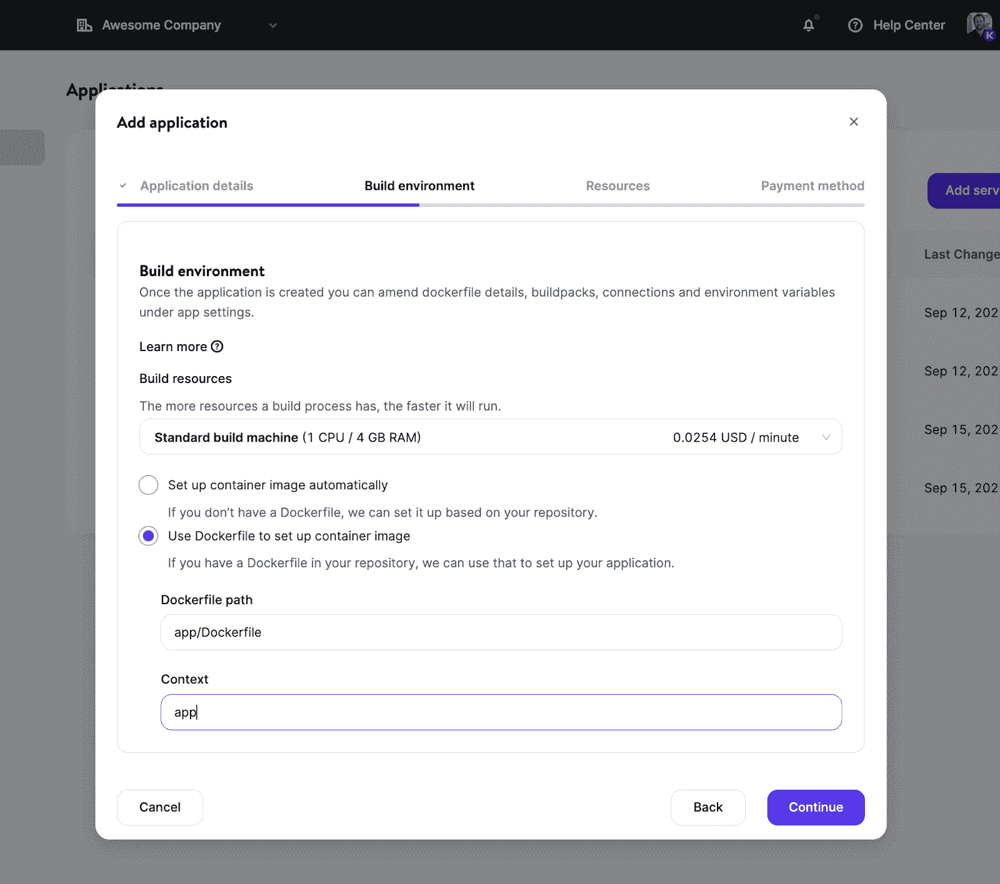
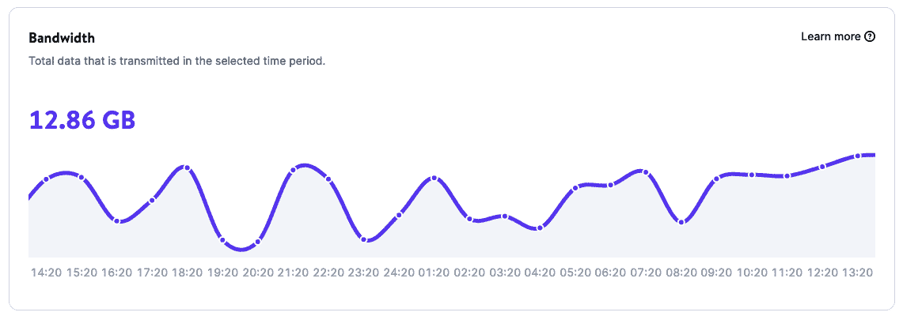
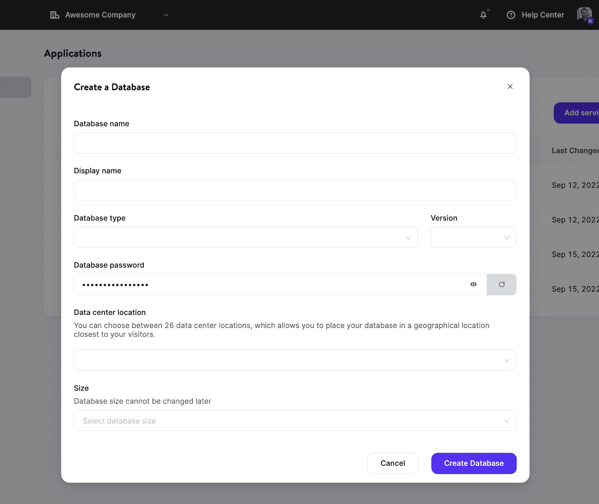
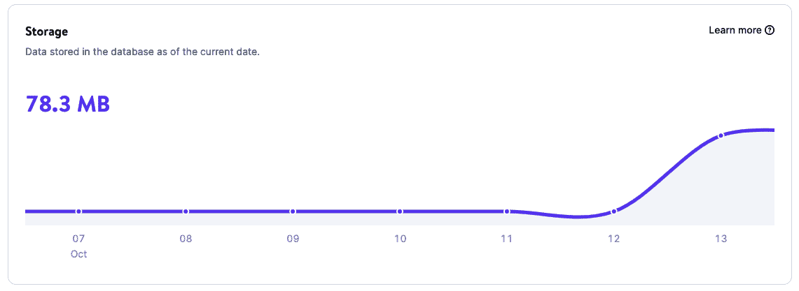

# 一个新时代已经开始:Kinsta 是现代开发者的云平台

> 原文：<https://kinsta.com/blog/cloud-platform-for-developers/>

随着其不断增长的市场份额，WordPress 已经是——并将继续是——最受欢迎的创建、管理和开发网站的 CMS。

然而，WordPress 仅仅代表了网络开发的一小部分。那些没有使用 WordPress 的开发者呢？他们还为自己的公司、客户、顾客或自己创建、运行和管理 web 应用程序。

在 Kinsta，我们一直在与数千名开发者和数百家 T2 代理商合作，他们的客户都有基于 WordPress 的项目。许多项目也是由著名的 CMS*而不是*驱动的。

直到今天，Kinsta 专注于构建托管 WordPress 托管解决方案——这意味着客户(和他们的客户)无法利用我们的非 WordPress 项目平台的优势，并在“一个屋檐下”托管所有项目这使得他们的工作更加困难，效率更低。

所以我们开始寻找让他们生活更轻松的方法。

我们收到的反馈越多，我们与客户和 beta 测试人员谈论他们的项目越多，我们越来越意识到我们的客户正在努力解决一个潜在的痛点。

但是有一个情节转折:不仅仅是我们的顾客。

我们意识到，几乎每个开发人员、DevOps 团队和管理 web 项目的机构都经历过这个痛点。每个人都在纠结，渴望找到更好的解决方案。

## 开发者不应该浪费时间担心托管；他们应该专注于发展

有什么问题？

> Kinsta 把我宠坏了，所以我现在要求每个供应商都提供这样的服务。我们还试图通过我们的 SaaS 工具支持达到这一水平。
> 
> <footer class="wp-block-kinsta-client-quote__footer">
> 
> 
> 
> <cite class="wp-block-kinsta-client-quote__cite">Suganthan Mohanadasan from @Suganthanmn</cite></footer>

[View plans](https://kinsta.com/plans/)

云托管平台缺乏简单性。

开发人员希望快速发布他们的应用程序。开发人员需要一个平台，让他们能够在一个地方，在一个屋檐下拥有一切。

一个简单、清晰、易于使用的平台，不会将开发工作局限于单一的技术、框架或库。

一个从第一天起就易于学习和使用的平台，无需特殊课程或特定于平台的认证。

一个定价模式简单透明的平台。(你有没有尝试了解过 AWS 的定价？具有挑战性！)

我们知道，Kinsta 的容器化架构将允许我们解决这些需求，并为开发人员提供平台和工具，让他们尽最大努力工作。

除此之外，我们知道我们拥有:

*   8 年以上的主机行业经验
*   无与伦比的支持
*   有才华的开发人员和工程团队能够解决任何技术问题
*   在协调、管理和扩展我们的托管平台方面，DevOps 团队是首屈一指的

这就是为什么我们在使我们的 WordPress 服务如此强大的同一个平台上构建了我们新的、增强的托管解决方案。现在，经过 320 多名金斯顿人、750 多名测试人员和无数次迭代的一年多的努力，我们已经向公众提供了它。

## 介绍应用程序托管和数据库托管解决方案

金斯塔的愿景是改变现状。我们通过为开发者提供最佳体验的坚定承诺来做到这一点:

> 我们不断发展，为现代开发人员提供行业领先的工具和服务。我们致力于为开发者和企业提供最佳体验，为性能和易用性而构建。

通过向我们的产品添加新的服务，各种形状和规模的开发人员和 DevOps 团队现在有过多的托管解决方案可供他们的应用程序、数据库、服务和 WordPress 站点选择，比以往任何时候都更加灵活。

具体来说，Kinsta 现在提供:

*   [托管 WordPress 主机](#wp)
*   [应用托管— *新增！*T3】](#app)
*   [数据库托管— *新增！*T3】](#db)

[一个全新的金斯塔时代正式降临☁️🚀在这篇文章中阅读更多令人兴奋的变化⬇️ 点击发微博](https://twitter.com/intent/tweet?url=https%3A%2F%2Fbit.ly%2F3FCJxxk&via=kinsta&text=A+new+era+of+Kinsta+is+officially+here+%E2%98%81%EF%B8%8F%F0%9F%9A%80+Read+more+about+the+exciting+changes+to+come+in+this+post+%E2%AC%87%EF%B8%8F&hashtags=PaaS%2CCloudHosting)
让我们仔细看看每一个。

### 托管 WordPress 主机(简而言之)

在谷歌云平台及其[高级层网络](https://kinsta.com/blog/google-cloud-network/#googles-premium-vs-standard-tier-networks)的支持下，我们已经建立了一个托管的 WordPress 托管服务，为 25，000 多家企业和 100，000 个网站提供保持运行和增长所需的一切。

由于使用了最高端的 CPU 和全球可用的[谷歌计算优化的 C2 虚拟机](https://kinsta.com/blog/fastest-wordpress-hosting/)，35 个可用的数据中心，以及[超高速的 Kinsta CDN](https://kinsta.com/help/kinsta-cdn/) 和 275+pop，为全球分布的受众提供静态和动态内容，[客户从任何主机迁移到 Kinsta](https://kinsta.com/blog/migrate-to-kinsta/) 几乎立即注意到平均快了 20%的加载时间。

Client performance after migration to GCP C2 machine.

但好处不止于此。

得益于[自动备份](https://kinsta.com/help/wordpress-backups/)、 [MyKinsta](https://kinsta.com/mykinsta/) (我们定制且易于使用的站点管理仪表板)、[内置应用监控工具](https://kinsta.com/help/apm-tool/)，以及由 Cloudflare 支持的[企业级防火墙和 DDoS 保护，我们的托管 WordPress 托管解决方案帮助站点管理员和开发人员晚上睡得安稳，因为他们知道他们的站点是安全的。](https://kinsta.com/cloudflare-integration/)

他们还知道 Kinsta 每月为他们节省了几个小时的工作时间。花在重复但重要的任务上的时间越少，意味着您的企业开销和维护成本越少。

你的业务在 WordPress 上运行吗？你是一个 WordPress 开发者，正在寻找一个可以帮助你简化工作的主机吗？查看我们的[托管 WordPress 托管解决方案](https://kinsta.com/wordpress-hosting/)。

### 应用程序托管(简而言之)

Web 开发正在经历一个有趣的时刻，它展示了当今世界是多么清晰、微妙和复杂。我们新的[应用托管解决方案](http://kinsta.com/application-hosting/)简化了现代 web 开发人员的工作。

我们让它变得简单，让您从设置容器、管理服务器、担心操作系统、管理备份、安装 SSL 证书和添加自定义域中解脱出来，这一切可能会阻止您专注于开发。

我们构建了一个开发平台，旨在帮助您尽快将您的应用呈现在用户面前。

Kinsta 的应用托管是市场通常所说的[平台即服务(PaaS)](https://kinsta.com/blog/what-is-paas/) ，其工具可以快速轻松地部署来自 [GitHub](https://kinsta.com/knowledgebase/what-is-github/) 等代码托管服务的应用，并能够在可扩展的优化环境中平稳运行。

#### 如何将应用程序部署到 Kinsta

我们的工程师和产品经理致力于为您的部署构建一个简化的流程。这个过程只需要 3 个步骤:

1.  [连接到您的 GitHub 帐户](https://kinsta.com/help/authorizing-kinsta-on-github/)并选择一个存储库
2.  自动(每次提交时)或手动部署您的应用程序
3.  分别构建、扩展和运行您的流程

就这么简单！

## 注册订阅时事通讯

### 想知道我们是怎么让流量增长超过 1000%的吗？

加入 20，000 多名获得我们每周时事通讯和内部消息的人的行列吧！

[Subscribe Now](#newsletter)

您不必担心设置容器映像，因为我们会自动检测和部署构建在不断增长的语言或框架列表中的应用程序:

*   节点. js
*   服务器端编程语言（Professional Hypertext Preprocessor 的缩写）
*   姜戈
*   轨道
*   Java 语言(一种计算机语言，尤用于创建网站)
*   斯卡拉
*   去

(注意:我们正在整理一个基本“Hello World”存储库的列表,您可以在 Kinsta 上派生和部署，以使用该服务。)

如果您喜欢对自定义 Docker 映像进行更多的控制，您可以在存储库中使用自己的 Docker 文件。这将允许你使用几乎任何语言/框架，并且不会限制你使用我们当前的[构建包](https://kinsta.com/help/build-types/#buildpacks)所支持的语言/框架。

Adding an application within MyKinsta.

一旦建立了构建环境，您将有足够的选项来选择符合您需求的[资源大小](https://kinsta.com/help/add-an-application/#resources)(由于不同的 pod 类型),并定义实例数量以获得更好的可伸缩性。

要深入了解所有特性，请务必阅读[我们关于应用托管](https://kinsta.com/help/application-hosting/)的文档。

#### 强大的分析功能可监控您的应用

借助应用程序的[分析](https://kinsta.com/help/application-analytics/)页面，您可以获得应用程序使用情况报告，包括:

*   带宽
*   构建时间
*   运行时间
*   CPU 使用率
*   内存使用

Bandwidth chart in Application Analytics.

#### 定价呢？

应用程序托管提供基于资源的选项，这意味着您将只为您的使用付费，仅此而已。新老客户的第一笔 20 美元由我们支付。

了解有关 Kinsta 应用托管的更多信息，并将您的第一个应用部署到我们的 25 个数据中心位置之一。

### 数据库托管(简单来说)

数据库是许多 web 项目的关键组成部分。尽管有些应用程序不需要数据库，但绝大多数应用程序需要数据库。

Struggling with downtime and WordPress problems? Kinsta is the hosting solution designed to save you time! [Check out our features](https://kinsta.com/features/)

由于有了 [Kinsta 的数据库托管解决方案](https://kinsta.com/database-hosting/)，您只需点击几下鼠标就可以建立一个数据库，并且您可以通过 Kinsta 托管的应用程序或外部服务连接到您的数据库。

我们目前[支持不同的数据库类型](https://kinsta.com/help/adding-a-database/)，您可以选择最适合您项目需求的版本。具体来说，您可以托管:

*   [MySQL](https://kinsta.com/knowledgebase/what-is-mysql/) 的实现
*   [马里亚布](https://kinsta.com/blog/mariadb-vs-postgresql/#what-is-mariadb)
*   雷迪斯
*   [PostgreSQL](https://kinsta.com/knowledgebase/what-is-postgresql/)

我们正在努力在不久的将来增加更多！

#### 如何在 Kinsta 部署数据库

你可以[建立一个新的数据库](https://kinsta.com/help/adding-a-database/),并在几分钟内使它可用。您不需要管理服务器、处理集群和容器，或者担心 DevOps 通常负责的其他任务。

流程是这样的:

1.  选择数据库类型和您喜欢的版本。
2.  从当前可用的 25 个数据中心位置中选择一个部署位置。
3.  为数据库配置资源。

瞧，你现在有了一个新创建的容器化数据库(没有共享资源！)给你的项目。

Adding a database within MyKinsta.

如果您在应用程序和数据库之间创建一个[内部连接，它们将位于同一个集群中，并通过安全连接进行通信，这比外部连接提供了更好的性能。](https://kinsta.com/help/adding-internal-connections/)

此外，由于请求仍在同一个网络内，因此不会对内部流量收费！

要了解更多信息，请务必阅读我们关于数据库托管的文档。

#### 强大的分析功能可监控您的数据库

借助[数据库分析](https://kinsta.com/help/database-analytics/)，您可以深入了解数据库的使用数据，包括:

*   储存；储备
*   运行时间
*   CPU 使用率
*   内存使用

Storage chart in Database Analytics.

#### 定价呢？

与应用程序托管一样，数据库托管提供了一个按使用计费的系统，根据数据库的大小和运行时间向您收费。

了解关于 Kinsta 的[数据库托管的更多信息，并将您的第一个数据库部署到我们的 25 个数据中心位置之一。不要忘了:**你第一个月会减 20 美元**。](http://kinsta.com/database-hosting/)

## 下一步是什么？

这只是金斯塔新时代的开始。我们的开发和工程团队正在努力开发新功能，修复错误，并通过仔细听取您分享的反馈进行迭代。

我们正在开发的一些新解决方案包括静态网站托管、机器学习、云应用和边缘功能即服务，这只是我们路线图上令人兴奋的几件事。除此之外，我们将继续致力于使我们的托管 WordPress 解决方案变得更好，并通过发布一些功能来改进它们，比如边缘缓存，使 WordPress 网站变得快速、安全和易于管理。

这是作为一名开发人员工作的大好时机，我们对 Kinsta 的未来感到无比兴奋！

 [🚀(提示:许多令人兴奋的变化即将到来！😄) 点击推文](https://twitter.com/intent/tweet?url=https%3A%2F%2Fbit.ly%2F3FCJxxk&via=kinsta&text=See+what%27s+in+store+for+Kinsta+with+the+launch+of+their+Application+Hosting+and+Database+Hosting+services+%F0%9F%9A%80+%28hint%3A+lots+of+exciting+changes+to+come%21+%F0%9F%98%84%29&hashtags=PaaS%2CCloudHosting)

## 摘要

通过扩展 Kinsta 的托管解决方案，我们丰富了支持企业和开发者的方式，无论他们使用何种技术。正如我们的首席执行官所总结的:

> 我们正在构建一个平台，开发者可以在这里轻松找到运行网络服务所需的一切，这样他们就可以专注于创作并与世界分享他们的最佳作品。— *金斯塔公司首席执行官马克·加瓦尔达*

为了庆祝 Kinsta 历史上的这一新篇章，每个人——新老客户——都可以试用我们的[应用托管](https://kinsta.com/application-hosting/)和[数据库托管](http://kinsta.com/database-hosting/) **,第一个月**优惠 20 美元。

欢迎来到全新的 kin sta——这是一个为现代开发人员构建的平台，让他们可以按照自己的想象将想法转化为可扩展的应用程序。

简单、快捷，一切尽在一处。

感谢我们所有出色的客户信任我们的业务，并在此过程中支持我们！

* * *

让你所有的[应用程序](https://kinsta.com/application-hosting/)、[数据库](https://kinsta.com/database-hosting/)和 [WordPress 网站](https://kinsta.com/wordpress-hosting/)在线并在一个屋檐下。我们功能丰富的高性能云平台包括:

*   在 MyKinsta 仪表盘中轻松设置和管理
*   24/7 专家支持
*   最好的谷歌云平台硬件和网络，由 Kubernetes 提供最大的可扩展性
*   面向速度和安全性的企业级 Cloudflare 集成
*   全球受众覆盖全球多达 35 个数据中心和 275 多个 pop

在第一个月使用托管的[应用程序或托管](https://kinsta.com/application-hosting/)的[数据库，您可以享受 20 美元的优惠，亲自测试一下。探索我们的](https://kinsta.com/database-hosting/)[计划](https://kinsta.com/plans/)或[与销售人员交谈](https://kinsta.com/contact-us/)以找到最适合您的方式。