# 如何为 WordPress 设置 cloud flare APO——深入探讨如何将性能提升 300%

> 原文：<https://kinsta.com/blog/cloudflare-apo-wordpress/>

作为其年度“生日周”庆祝活动的一部分，Cloudflare 最近宣布为 WordPress 网站发布“自动平台优化”(APO)。

对于性能爱好者来说，Cloudflare 的 APO 代表了最大化 WordPress 性能的巨大进步。

在我们的基准测试中，我们发现在我们的测试站点上启用 APO 可以减少 70-300%的页面加载时间，具体取决于测试位置。

在本文中，我们将深入探讨 Cloudflare APO 是如何工作的，以及如何使用它来提升你的 WordPress 站点的性能！

## 什么是自动平台优化(APO)？

[自动平台优化](https://www.cloudflare.com/automatic-platform-optimization/wordpress/)是由 [Cloudflare](https://kinsta.com/knowledgebase/install-cloudflare/) 提供的一套全新的一键式平台定制优化服务。

第一个接受“APO 待遇”的平台是 WordPress，它是世界上[最受欢迎的 CMS](https://kinsta.com/blog/why-use-wordpress/) ，拥有超过 [60%的市场份额](https://kinsta.com/wordpress-market-share)。在未来，我们希望看到其他 [CMS](https://kinsta.com/knowledgebase/content-management-system/) 和平台的类似 APO 服务。

从高层次来看，Cloudflare 的 WordPress APO 从两个主要方面提高了网站性能。


> 需要在这里大声喊出来。Kinsta 太神奇了，我用它做我的个人网站。支持是迅速和杰出的，他们的服务器是 WordPress 最快的。
> 
> <footer class="wp-block-kinsta-client-quote__footer">
> 
> 
> 
> <cite class="wp-block-kinsta-client-quote__cite">Phillip Stemann</cite></footer>

[View plans](https://kinsta.com/plans/)

1.  你的 WordPress 站点页面的静态 HTML 副本被缓存在世界各地的 Cloudflare [边缘服务器](https://kinsta.com/knowledgebase/edge-servers/)中。
2.  [第三方字体](https://kinsta.com/blog/wordpress-fonts/)由 Cloudflare 缓存和提供。

让我们来看看引擎盖下，看看 APO 如何和为什么在技术层面上工作。


## 边缘的静态 HTML

Cloudflare 的 APO 与其他传统页面缓存和 [CDN 解决方案](https://kinsta.com/blog/wordpress-cdn/)之间的关键区别在于它能够在 Cloudflare 的边缘直接缓存静态 HTML。为了描绘一个更清晰的画面，让我们来看看四个不同的 WordPress 设置，从“无优化”到 APO。

### WordPress 设置# 1–没有页面缓存或 CDN

默认情况下，WordPress 没有页面缓存或 CDN 支持。使用这种配置，所有请求都需要由 PHP 动态生成[，即使在请求之间没有改变页面内容。](https://kinsta.com/blog/php-benchmarks/)

此外，没有内容交付网络(CDN)集成意味着所有静态资产，如 [CSS](https://kinsta.com/blog/wordpress-css/) 、JS、图像和字体都由原始服务器提供服务。

这种配置会使 WordPress 站点非常慢，特别是对于远离原始服务器的访问者。

### WordPress 设置# 2——没有 CDN 的页面缓存

实现[页面缓存](https://kinsta.com/blog/wordpress-cache/)是提高 WordPress 性能的最佳策略之一。在 Kinsta，我们的托管堆栈包括一个高度优化的页面缓存层，由 Nginx 的 [FastCGI 缓存模块](https://kinsta.com/blog/wordpress-cache/#page-cache)提供支持。

页面缓存大大降低了原始服务器上的 CPU 负载，因为请求可以从缓存中得到服务，而不需要动态生成 HTML。

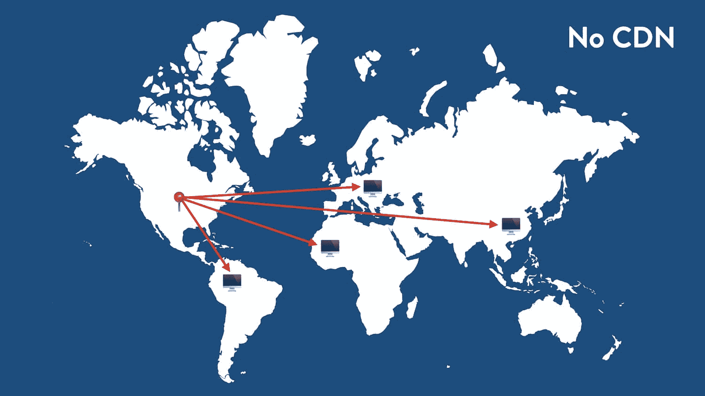

这[释放了你的 CPU](https://kinsta.com/blog/php-workers/) 来关注其他重要的动态任务，并使你的 WordPress 站点更加稳定。虽然这种配置可能允许您的站点每秒处理更多的请求，但它不能解决“[距离问题](https://kinsta.com/knowledgebase/best-data-center/)”。

没有一个合适的 CDN，向远方的访问者提供静态资产仍然是一个问题。


### WordPress 设置# 3——使用 CDN 进行页面缓存

到目前为止，页面缓存加上服务静态资产的 CDN 是托管 WordPress 站点最有效的方式。

在这个模型中，原始服务器仍然负责为页面提供实际的 HTML。然而，静态资产如 [CSS 文件](https://kinsta.com/blog/wordpress-css/)、图像和字体被卸载到世界各地的各种 CDN 存在点(pop)。这个模型背后的想法是，静态资产，尤其是[大图像](https://kinsta.com/blog/optimize-images-for-web/)，构成了请求页面大小的大部分。因此，通过将资产卸载到离访问者更近的服务器上，可以减少加载时间并提高性能。

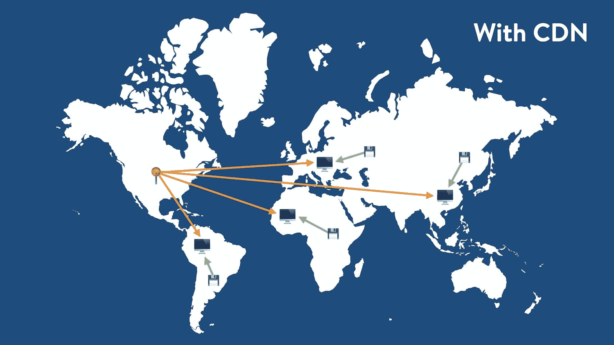

Global traffic routing with a CDN.


虽然这个配置比前两个有了显著的改进，但是它确实让你想知道如果 WordPress 的性能不再因为必须从原始服务器提供 HTML 而受到瓶颈的话会发生什么。

令人惊讶的是，直到 Cloudflare 为 WordPress 推出 APO 之前，这样的设置是不可行的——至少对于非技术用户来说是不可行的。

### WordPress 设置# 4–用于 WordPress 的 Cloudflare APO

Cloudflare APO 是世界上最新的 [WordPress 性能](https://kinsta.com/learn/speed-up-wordpress/)。不像以前的 WordPress 设置受到原始服务器性能的限制，从访问者的角度来看，启用了 APO 的网站基本上变得“没有原始性”。


Global traffic routing with Cloudflare APO.


为了实现这一点，Cloudflare 利用其全球分布的 CDN 和 Workers/Workers KV 来创建 WordPress 站点的静态 HTML 表示。在本文的后面，我们将更深入地了解 Cloudflare APO 的工作原理。

现在，只要知道一个兼容的启用了 APO 的 WordPress 站点不再受制于起源引起的延迟。换句话说，来自美国、德国和日本的访问者的请求将由附近的数据中心而不是你的原始服务器提供服务。

想了解更多关于如何使用 Cloudflare APO 加速你的 WordPress 站点吗？[观看我们与 Cloudflare 的 Garrett Galow 在](https://kinsta.com/webinars/secure-and-optimize-wordpress-with-cloudflare/)举办的网络研讨会的录像！


## 2022 年的网络性能状况

在过去的几年里，专业网站开发行业发生了巨大的变化。越来越多的开发者正从 WordPress 这个庞然大物转向更灵活、性能更好的静态网站生成器，如 T2、雨果和 T4、盖茨比和 T5。

我们明智地使用术语“性能”,因为 web 性能通常可以被解释为一种主观的度量。

例如，页面的加载时间会随着测试地点和时间的不同而变化。

因此，盲目地说一个 Gatsby 静态网站比 WordPress 网站更快是站不住脚的，直到这个论点的一些背景成立。

在当今高度互联的世界中，web 性能测试最重要的环境之一是世界不同地区的加载时间。

这就是静态网站在性能方面比 WordPress 有优势的地方。默认情况下，静态网站可以直接上传到全球分布的 cdn 上——这使得它们无需任何额外的工作就可以在世界各地快速运行。

由于 WordPress 站点需要某种类型的源服务器来生成 HTML，它不能直接利用 Netlify、Vercel 和 Cloudflare 自己的 Workers 站点等平台来实现无摩擦的全球交付。从商业角度来看，这意味着你可能会失去远离原始服务器的潜在访客和客户，因为谷歌在生成搜索结果时会考虑页面速度。

这就是 Cloudflare 的 WordPress 发挥作用的地方。

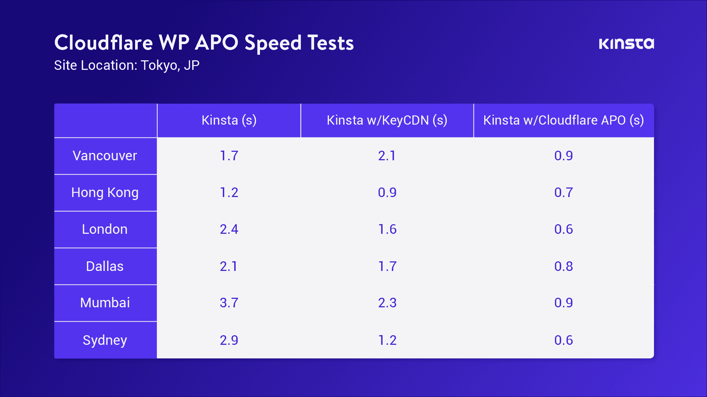

Enabling Cloudflare APO boosted WordPress performance up to 300%.


**Cloudflare 针对 WordPress 的自动平台优化是对 2022 年 WordPress 性能意味着什么的彻底反思。**正如我们之前提到的，在我们的测试现场启用 APO 可以将加载时间减少 70-300%，具体取决于测试地点。这是可能的，因为 APO 有效地消除了原始服务器的性能瓶颈。

[The @Kinsta team got to test @Cloudflare's new APO service... and it reduced page load times by 70-300%. 🤯 For all the details, click below ⬇️Click to Tweet](https://twitter.com/intent/tweet?url=https%3A%2F%2Fkinsta.com%2Fblog%2Fcloudflare-apo-wordpress%2F&via=kinsta&text=The+%40Kinsta+team+got+to+test+%40Cloudflare%27s+new+APO+service...+and+it+reduced+page+load+times+by+70-300%25.+%F0%9F%A4%AF++For+all+the+details%2C+click+below+%E2%AC%87%EF%B8%8F&hashtags=HTML%2CWordPress)

## Cloudflare 的自动平台优化如何工作

有了 Cloudflare APO，你的 WordPress 站点的 HTML 被缓存在世界各地的 Cloudflare 边缘服务器上。这是由 [Workers KV](https://blog.cloudflare.com/introducing-workers-kv/) 实现的，它是一个分布式键值数据库服务，具有超快的全局传播能力(不到 60 秒)。

当数据通过 Cloudflare API 写入 Workers KV 时，它会在几秒钟内自动复制到全球 150 多个 Cloudflare 数据中心。

这使得 Workers KV 成为加速 WordPress 站点的首选，因为帖子和页面可以很容易地用键值机制来表示——[URL](https://kinsta.com/knowledgebase/what-is-a-url/)是“键”, HTML 页面内容是“值”。

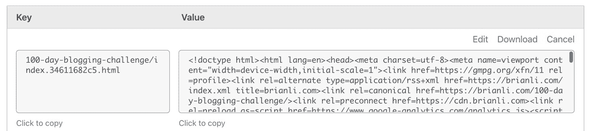

A web page stored as a key-value object in Cloudflare Workers KV.


一旦你的 WordPress 站点启用了 APO，大多数对你站点的请求将不会再到达你的原始服务器。

相反，该请求将由本地 Cloudflare CDN 缓存(如果缓存页面存在)或 Workers KV(如果缓存页面在 Cloudflare 的 CDN 上不存在)提供服务。

如果页面不存在于 CDN 缓存或 Workers KV 数据库中，那么 Cloudflare 将向您的源服务器发出一个请求，并缓存新页面的 HTML。

这里的神奇之处在于，Cloudflare Workers KV 充当了您的源服务器的某种分布式镜像。回想一下，Workers KV 中存储的数据会在 Cloudflare 的整个服务器网络中自动复制。

这意味着即使你运行 WordPress 的原始服务器位于美国的某个地方，来自日本的访问者的请求也不需要访问你的原始服务器来启动本地 CDN 缓存区域。

相反，来自日本的访问者将从附近的 Cloudflare 数据中心的 Workers KV 数据库或 CDN 缓存中获得缓存的 HTML。

这种新的交付模式与之前 WordPress 的 HTML 页面缓存有很大不同。

以前，最流行的“全页面缓存”方法包括创建一个 Cloudflare 页面规则来“缓存所有内容”。虽然这种方法可以显著提高性能，但它并不是一种非常有效的缓存方法，因为它依赖于“拉”模型，而不是 Workers KV 的“推”模型，后者可以自动在全局范围内推送 HTML。

在之前基于页面规则的设置中，访问美国 Cloudflare 缓存区的访问者不会为其他位置的访问者缓存资产，这意味着从全球内容交付的角度来看，网站无法有效利用 Cloudflare 的网络。

自动平台优化通过缓存第三方字体更进一步。在许多情况下，字体最终会占据页面请求大小的很大一部分。

与通常从根域提供的 CSS、JS 和 images 不同，字体通常由第三方服务提供，如 Google Fonts。这意味着 Cloudflare 等基于代理的缓存服务无法缓存字体和提供字体服务。

由于 APO 由一个 [Cloudflare Worker](https://workers.cloudflare.com/) 提供支持，这是一个位于原始服务器和访问者之间的可编程 JavaScript 服务工作者，因此可以注入额外的逻辑来完成基本缓存之外的任务。

在这种情况下，APO 利用 Cloudflare 工作器来缓存第三方字体，并使用内嵌 CSS 修改页面的 HTML，以指向 Cloudflare 的 CDN 上缓存的字体。这消除了获取字体的额外外部请求的需要，并减少了提供页面所需的连接数量和加载时间。

最后，由于 APO 通过 WordPress 插件与您的网站集成，每当您更新网站上的页面时，Cloudflare 缓存都会自动清除。这确保了访问者总是能够看到网站的最新版本，而无需任何人工干预。

## 通过高性能托管和 Cloudflare APO 最大化 WordPress 性能

然而，Cloudflare APO 并不是银弹。**选择像 Kinsta 这样注重性能的托管 WordPress 主机仍然非常重要**有两个主要原因。

1.  Cloudflare APO 仅为未登录的用户缓存前端页面。与 Kinsta 的服务器级页面缓存配置类似，APO 不会缓存带有特定 cookies 的页面，也不会缓存登录用户的页面。**这意味着源服务器的性能仍然是等式中的关键部分。**
2.  一个好的 WordPress 体验不仅仅是由快速的前端性能组成的。由于 WordPress 本质上是一个动态的 CMS，所以在运营一个 WordPress 网站时有很多因素需要考虑。像 Kinsta 这样的托管主机提供 WordPress 定制的 24/7 支持、站点备份、安全保证等等。

这里有四个用例，展示了为什么即使你正在使用 Cloudflare APO，你仍然应该选择一个高性能的 WordPress 主机。

## 注册订阅时事通讯


### 想知道我们是怎么让流量增长超过 1000%的吗？

加入 20，000 多名获得我们每周时事通讯和内部消息的人的行列吧！

[Subscribe Now](#newsletter)

### 1.WooCommerce、轻松数字下载和电子商务

当检测到某些与电子商务相关的 cookies 时，Cloudflare APO 会选择性地绕过缓存。例如，当访问者在 [WooCommerce 网站](https://kinsta.com/blog/woocommerce-tutorial/)的购物车中添加一件商品时，WordPress 会自动设置一个`woocommerce_items_in_cart` cookie。当检测到此 cookie 时，APO 会绕过缓存，以避免缓存和提供客户特定的数据。因此，即使启用了自动平台优化，WooCommerce 和其他 WordPress 支持的电子商务平台仍将严重依赖原始服务器的性能。

### 2.WordPress 仪表板性能

由于 Cloudflare APO 不会为登录用户缓存 HTML，因此在 [WordPress 仪表盘](https://kinsta.com/knowledgebase/wordpress-admin/)中导航将始终完全依赖于您的原始服务器性能。如果你没有使用性能优化的主机，像编写和发布内容，管理图片和其他媒体资产，以及在你的 WordPress 站点上运行日常维护等任务会变得非常慢。这对您的业务成果有直接的负面影响。

### 3.WordPress 会员网站和论坛

如果你使用像 [Ultimate Membership Pro](https://kinsta.com/blog/wordpress-membership-plugins/#1-ultimate-membership-pro-wordpress-plugin--29) 这样的插件来管理你的 WordPress 会员网站，或者使用 [bbPress](https://kinsta.com/knowledgebase/bbpress/) 来驱动 WordPress 论坛，Cloudflare APO 将无法优化你的大部分流量。由于会员网站和论坛通常需要用户登录，Cloudflare APO 将自动为这些用户绕过 HTML 缓存。因此，对于 WordPress [会员网站](https://kinsta.com/blog/wordpress-membership-plugins/)和[论坛](https://kinsta.com/blog/wordpress-forum-plugins/)，使用高性能主机仍然是保持快速用户体验的最佳方式。

### 4.WordPress Cron 工作

帮助你在 WordPress 站点上安排和自动化后台任务。您的站点可能会使用 cron 作业在特定时间发布帖子。像这样的简单任务不需要太多的 CPU 资源，但是其他任务可能需要更多的资源。例如，使用一个[插件每 12 小时自动备份你的 WordPress 站点](https://kinsta.com/blog/wordpress-backup-plugins/)到一个 ZIP 存档，这样的任务需要更多的 CPU 资源。

由于 Cloudflare APO 仅帮助优化前端内容，因此您仍然需要在像 [Kinsta](https://kinsta.com/plans/) 这样的高性能主机上托管您的站点，以最大限度地提高后端任务的性能和登录用户体验。您可以通过使用内置在 [MyKinsta 仪表板](https://kinsta.com/mykinsta/)中的[代码缩小功能](https://kinsta.com/help/kinsta-cdn-code-minification)来进一步体验。这使得客户只需点击一下，就可以实现 CSS 和 JavaScript 的自动缩小。

## 如何为 WordPress 使用 Cloudflare 自动平台优化

既然我们已经讨论了为什么 cloud flare Automatic Platform Optimization for WordPress 是一个游戏规则改变者，那么让我们来看看如何将该服务添加到您的 WordPress 站点。

APO 可用于 Cloudflare 免费和付费计划。对于免费的 Cloudflare 用户，APO 每月额外收费 5 美元。如果您使用的是 Cloudflare 的专业版、商务版或企业版计划，则无需额外付费即可启用 APO。

下面是您开始使用 Cloudflare APO 时需要做的事情:

1.  在 Cloudflare 控制面板中创建一个 API 令牌。
2.  安装官方的 Cloudflare WordPress 插件。
3.  启用自动平台优化。

### 1.创建 Cloudflare API 令牌

在启用 APO 之前，您需要先生成一个 API 令牌并安装 Cloudflare WordPress 插件。要生成 API 令牌，请单击 Cloudflare 控制面板右上角的配置文件图标，单击“我的配置文件”，选择“API 令牌”选项卡，然后单击**创建令牌**。

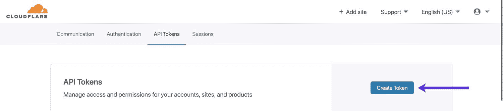

Create a Cloudflare API token.


在“API 令牌模板”下，点击 WordPress 选项旁边的**使用模板**。


Select the WordPress API token template.


“WordPress”模板将生成一个 API 令牌，该令牌具有允许自动平台优化正确运行的必要权限。默认设置是您开始使用 APO 所需的全部内容，但是如果您需要将 API 令牌锁定给特定用户或区域，可以随意调整“帐户资源”和“区域资源”设置。

完成令牌参数配置后，向下滚动并单击**继续汇总**。

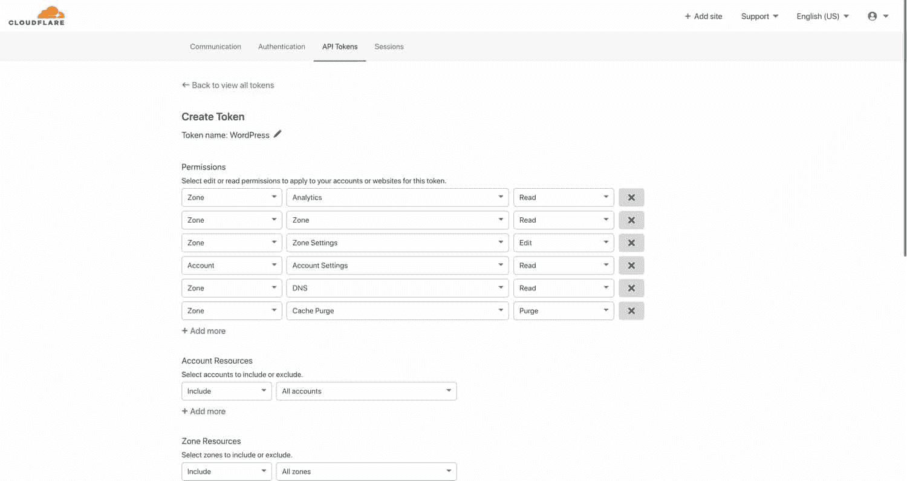

Configure Cloudflare API token parameters.


最后，单击**创建令牌**以结束该过程。

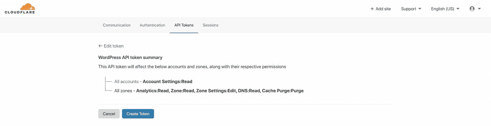

Confirm the creation of the Cloudflare API token.


确保将 API 令牌复制到安全的位置。稍后安装 Cloudflare WordPress 插件时，您会需要它。在您将 API 令牌记录在一个安全的地方(如密码管理器)后，可以随意关闭页面。

需要一个给你带来竞争优势的托管解决方案吗？Kinsta 为您提供了令人难以置信的速度、一流的安全性和自动伸缩功能。[查看我们的计划](https://kinsta.com/plans/?in-article-cta)

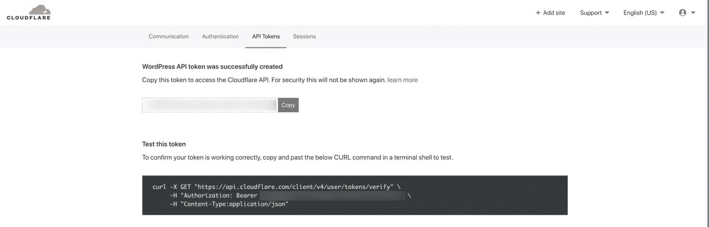

Record your Cloudflare API token in a safe place.


### 2.安装 Cloudflare WordPress 插件

Cloudflare WordPress 插件可以直接从 [WordPress 插件库](https://kinsta.com/blog/publish-plugin-wordpress-plugin-directory/)安装。要找到它，在你的 WordPress 仪表盘中搜索“Cloudflare”。一定要安装官方的 Cloudflare 插件，而不是第一个搜索结果的“WP Cloudflare 超级页面缓存”。

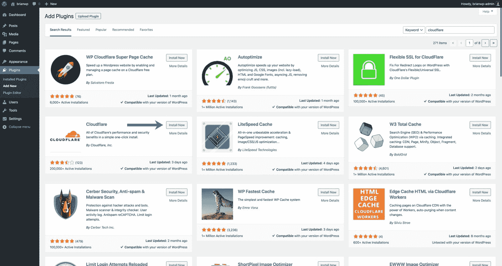

Install the official Cloudflare WordPress plugin.


接下来，在你的 WordPress dashboard 工具条中进入**设置> Cloudflare** ，点击“在此登录”。

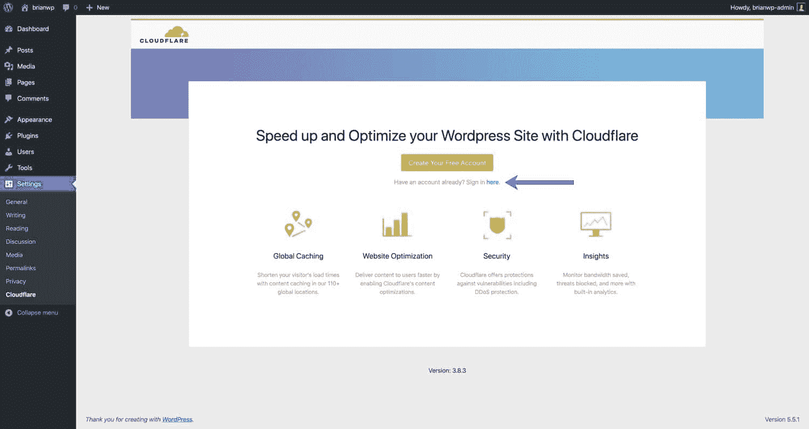

Sign in to your Cloudflare account.


输入与您的 Cloudflare 帐户关联的电子邮件地址以及您之前生成的 API 令牌。点击**保存 API 凭证**完成登录过程。

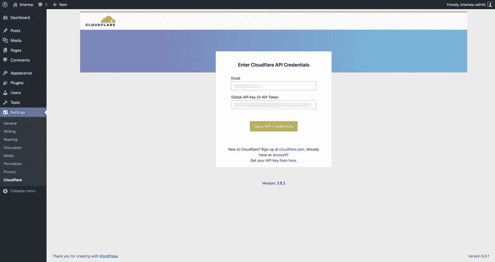

Enter your email address and Cloudflare API token.


现在，Cloudflare WordPress 插件已经设置好了，让我们转到 Cloudflare 仪表板来实现自动平台优化。

### 3.在 Cloudflare 中启用自动平台优化

Cloudflare Pro、Business 和 Enterprise 计划中包含 WordPress 的自动平台优化，无需额外费用。如果你使用的是免费的 Cloudflare 计划，APO 的附加费用是 5 美元/月。要启用 APO，请在您的 Cloudflare 仪表盘中进入**速度>优化**。

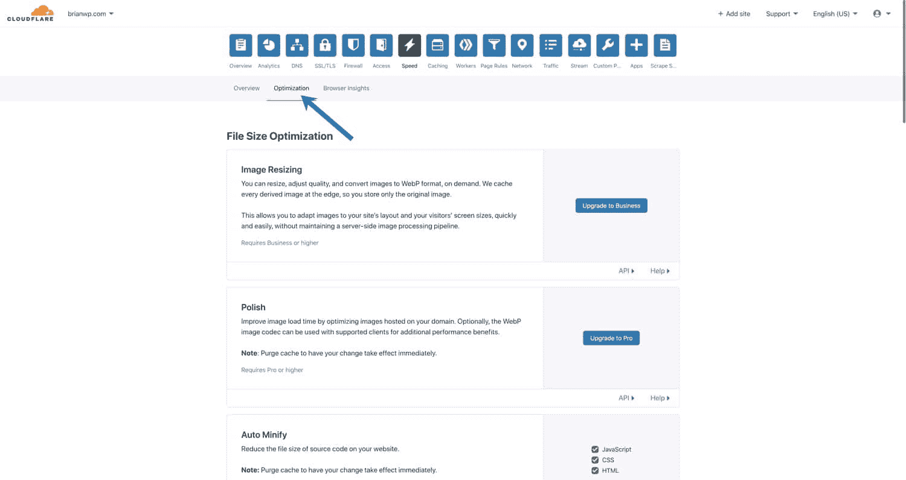

To enable APO, navigate to Speed > Optimization.


向下滚动到“优化交付”部分，并启用“WordPress 自动平台优化”。如果您使用的是免费计划，Cloudflare 会在这段时间内提示您付费详情。启用 APO 后，你应该会看到一条消息说“在[你的域]上成功检测到 WordPress 插件”。如果您没有看到此消息，我们建议您重新安装 Cloudflare 插件，或者联系 Cloudflare 支持部门以获得进一步的帮助。


Enable Automatic Platform Optimization for WordPress in your Cloudflare dashboard.


在你的 WordPress 仪表盘中，进入侧边栏的**设置> Cloudflare** 。点击“为 WordPress 应用推荐的 Cloudflare 设置”旁边的**应用**按钮，这将优化你的 Cloudflare 设置。最后，确保在插件设置中也启用了“自动平台优化”。


Cloudflare WordPress plugin settings.


## 如何确认用于 WordPress 的 Cloudflare APO 正在工作

此时，Cloudflare 自动平台优化应该在您的站点上处于活动状态！以下是确认 APO 正常工作的方法。首先，确保 Cloudflare 的 DNS 选项卡中的橙色云为你的 WordPress 站点的域启用。如果橙色云未启用，Cloudflare 将不会为您的域代理流量，这意味着 APO 将无法正常工作。

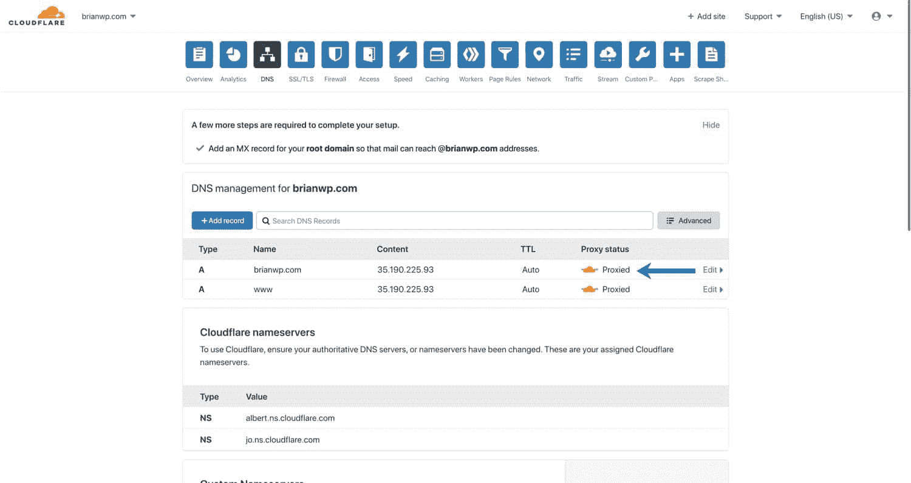

Confirm the Cloudflare orange cloud is enabled.


### 如何使用浏览器检查器检查 Cloudflare APO 缓存状态

接下来，您可以使用 web 浏览器的内置检查器来检查对网站的请求的 HTTP 标头。在下面的例子中，我们将使用谷歌浏览器。首先，在匿名模式下打开一个新的浏览器窗口。

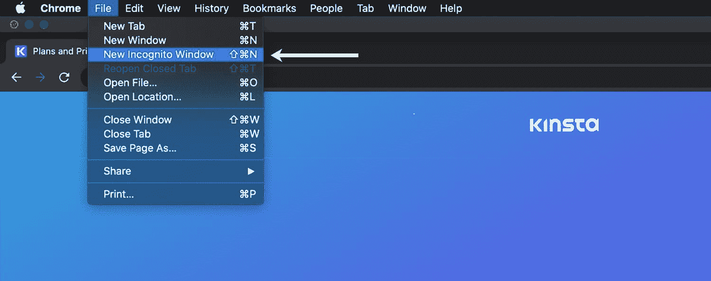

Launch a new incognito window in Google Chrome.


接下来，进入你的 WordPress 站点，右击页面，选择 **Inspect** 打开浏览器检查器。你也可以通过进入 Chrome 菜单栏中的**视图>开发者>开发者工具**来访问检查器。点击请求到你的域(下面例子中的 brianwp.com)。在子菜单中，单击“标题”以显示 HTTP 响应标题。

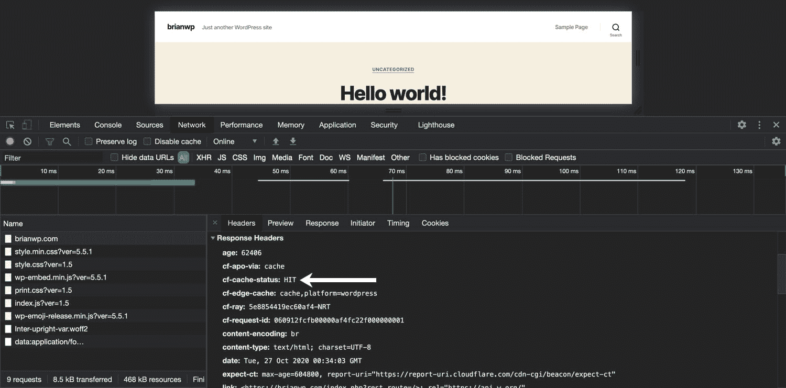

Check Cloudflare cache status with browser inspector.


启用 APO 后，您应该会看到一些与 APO 相关的标题。

*   `cf-apo-via`表示请求是从哪里发出的。这个头有几个可能的值——“原点、无缓存”、“原点、旁路”和“缓存”。如果您看到此标头的值为“origin，no-cache ”,这意味着原始服务器会向 Cloudflare 发送一个“Cache-Control: no-cache”标头。“origin，bypass”值表示绕过了 Cloudflare 的 HTML 缓存，请求是从原点提供的。最后，“缓存”值表示请求是从 Cloudflare 的缓存中提供的。
*   `cf-cache-status`表示页面是否由 Cloudflare 的 CDN 提供。刷新页面几次后，您应该会看到一个“HIT”状态。如果您的`cf-cache-status`标题在几次刷新后显示“动态”,可能是由于配置错误或与 cookie 相关的不兼容性而绕过了 APO。
*   `cf-edge-cache`根据来自原始服务器的缓存指令，指示页面的缓存兼容性。这个头有两个可能的值——“无缓存”和“缓存，平台=wordpress”。当 APO 正确配置了 Cloudflare WordPress 插件后，对于不应该缓存的页面，该标题将返回“no-cache ”,对于可缓存的页面，将返回“cache，platform=wordpress”。
*   `age`表示页面在 Cloudflare 的 CDN 中缓存的秒数。

如果你在检查你的 WordPress 网站时看到上面的标题，那意味着 APO 已经设置好了。现在，继续进行速度测试，看看你的网站有多快！

### 如何使用 curl 检查 Cloudflare APO 缓存状态

您也可以在终端中使用下面的 [curl 命令](https://kinsta.com/blog/wordpress-http-api-part-1/#curl)来确认 Cloudflare APO 正在工作。注意，该命令传递了一个“Accept: text/html”头。检查 APO 缓存状态时，这是必需的。

```
curl --request GET -I -H "Accept: text/html" https://www.website.com
```

运行该命令后，您应该会看到如下所示的响应头列表。如您所见，`cf-cache-status`、`cf-apo-via`、`cf-edge-cache`和`age`标题显示请求由 Cloudflare 的缓存提供服务。

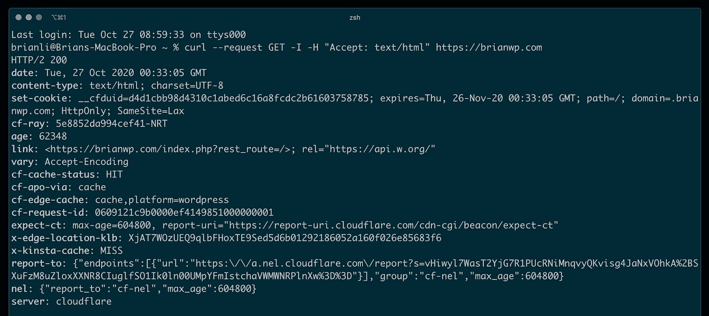

Check Cloudflare APO cache status with curl.


## 无需 Cloudflare 插件的自动平台优化

Cloudflare 推荐使用官方 Cloudflare WordPress 插件的自动平台优化。这也是我们建议的方法，因为它可以确保您从 APO 获得最大的性能优势。如果您的网站与 Cloudflare WordPress 插件不兼容，我们建议与开发人员合作，使您的网站兼容。

万一你真的不能安装 Cloudflare 插件，也可以不用插件使用 APO。如果选择这种方法，您仍然可以利用一些性能优化，但是有几个重要的限制需要注意。

### 带有 WordPress 插件的 Cloudflare APO

安装 Cloudflare WordPress 插件后，自动平台优化提供了以下 HTML 边缘缓存功能。

*   带有 30 天 TTL 的 HTML 边缘缓存。
*   帖子发布或更新后 30 秒内缓存失效。
*   为登录用户绕过 HTML 缓存。
*   对 WooCommerce 等特定 cookies 绕过 HTML 缓存。
*   如果页面可以从 Cloudflare 的 CDN 提供，则跳过对源服务器的请求。这降低了原始服务器的负载。

### 不带 WordPress 插件的 Cloudflare APO

如果没有安装 Cloudflare WordPress 插件，您可以看到 APO HTML 边缘缓存的以下特性。

*   带有 30 天 TTL 的 HTML 边缘缓存。
*   30 分钟内缓存失效**(而不是 30 秒)**。
*   对 WooCommerce 等特定 cookies 绕过 HTML 缓存。
*   **为了提供正确的高速缓存无效逻辑，仍然需要对源服务器的请求**。

正如你所看到的，在官方 Cloudflare WordPress 插件中使用自动平台优化有几个优点。

[Big news - @Cloudflare's WordPress APO is here, and it represents a huge step forward for maximizing WordPress performance. 🚀 Learn how you can use it to give your own site a boost!Click to Tweet](https://twitter.com/intent/tweet?url=https%3A%2F%2Fkinsta.com%2Fblog%2Fcloudflare-apo-wordpress%2F&via=kinsta&text=Big+news+-+%40Cloudflare%27s+WordPress+APO+is+here%2C+and+it+represents+a+huge+step+forward+for+maximizing+WordPress+performance.+%F0%9F%9A%80++Learn+how+you+can+use+it+to+give+your+own+site+a+boost%21&hashtags=WordPress%2Cwebperf)

## 摘要

毫无疑问，cloud flare Automatic Platform Optimization for WordPress 是近年来提升 WordPress 性能的最重要的服务。它超越了通常的 web 服务器优化、服务器端页面缓存和 CSS/JS 缩小策略，呈现了一些全新的东西。

从一开始，WordPress 就受到这样一个事实的限制，那就是没有一种简单有效的方式在 cdn 上缓存 HTML 页面。通过利用其超过 150 个数据中心、工作人员和工作人员 KV 的网络，Cloudflare 已经在 WordPress 网站和采用尖端框架设计的静态网站之间建立了平等的性能竞技场。

这是一个不小的壮举，我们期待看到 Cloudflare 如何在未来将其自动平台优化功能扩展到其他 CMS 平台。

你在用云闪 APO 加速你的 WordPress 网站吗？请在下面的评论中告诉我们！

* * *

让你所有的[应用程序](https://kinsta.com/application-hosting/)、[数据库](https://kinsta.com/database-hosting/)和 [WordPress 网站](https://kinsta.com/wordpress-hosting/)在线并在一个屋檐下。我们功能丰富的高性能云平台包括:

*   在 MyKinsta 仪表盘中轻松设置和管理
*   24/7 专家支持
*   最好的谷歌云平台硬件和网络，由 Kubernetes 提供最大的可扩展性
*   面向速度和安全性的企业级 Cloudflare 集成
*   全球受众覆盖全球多达 35 个数据中心和 275 多个 pop

在第一个月使用托管的[应用程序或托管](https://kinsta.com/application-hosting/)的[数据库，您可以享受 20 美元的优惠，亲自测试一下。探索我们的](https://kinsta.com/database-hosting/)[计划](https://kinsta.com/plans/)或[与销售人员交谈](https://kinsta.com/contact-us/)以找到最适合您的方式。