# 如何为你的 WordPress 站点配置联系表 7

> 原文：<https://kinsta.com/blog/contact-form-7/>

2022 年，和你的观众保持联系非常重要。通过像 [MailChimp](https://kinsta.com/blog/how-to-use-mailchimp/) 这样的服务建立电子邮件列表可以帮助你将内容直接发送给你的订户。

电子邮件列表很好，但是如果一个读者或潜在客户想要直接联系你呢？这就是联系方式的用武之地！在这篇文章中，我们将介绍如何为你的 WordPress 站点配置流行的 Contact Form 7 插件。

## 如何安装联系表 7

Contact Form 7 自 2009 年问世以来，在过去十年中已经获得了超过 500 万次下载。联系表 7 可以直接从 WordPress 插件库中安装。如果你搜索“联系表 7”，你将能够找到该插件以及各种附加组件。

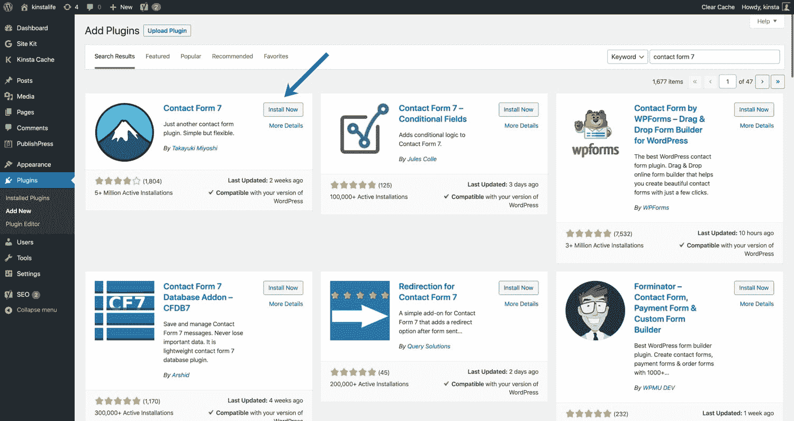

Install the Contact Form 7 plugin from the WordPress plugin repository.


安装插件后，你会在你的 [WordPress 仪表盘](https://kinsta.com/knowledgebase/wordpress-admin/)的工具条中看到一个标签为“联系人”的菜单项。在这里可以配置 Contact Form 7 的所有设置。


Customize Contact Form 7 settings.


## 有联系方式的利弊

在我们深入探讨如何为你的 WordPress 站点配置联系表单 7 之前，让我们快速地了解一下在你的站点中添加联系表单的利弊。


> 需要在这里大声喊出来。Kinsta 太神奇了，我用它做我的个人网站。支持是迅速和杰出的，他们的服务器是 WordPress 最快的。
> 
> <footer class="wp-block-kinsta-client-quote__footer">
> 
> 
> 
> <cite class="wp-block-kinsta-client-quote__cite">Phillip Stemann</cite></footer>

[View plans](https://kinsta.com/plans/)

### 有联系方式的好处

1.  联系方式允许读者、顾客和粉丝直接联系你。根据你的 WordPress 站点的目的，访问者与你交流的能力是非常重要的。例如，不在[电子商务网站](https://kinsta.com/blog/ecommerce-hosting/)上添加联系方式可能会对你的业务造成财务损失，因为如果感兴趣的人对你的产品有疑问，他们将无法联系你。
2.  联系表单增加了你的 WordPress 站点或业务的合法性。许多人将联系表单的存在视为某种信任因素。能够接触到你，网站所有者的想法，使你的内容更值得信赖。

### 有联系方式的缺点

1.  垃圾邮件可能是公共表单(如评论框和联系表单)的一个问题。幸运的是，有了联系方式 7，你可以用 [reCAPTCHA](https://kinsta.com/blog/wordpress-captcha/) 过滤掉垃圾邮件。您甚至可以配置一个 [Cloudflare](https://kinsta.com/knowledgebase/install-cloudflare/) 页面规则来进一步保护自己。我们将在文章的后面讨论如何在 Contact Form 7 中设置垃圾邮件保护。
2.  在你的网站上添加了联系方式后，你可能需要花时间回复信息。这不一定是一件坏事，取决于你如何看待它。有些人害怕回复电子邮件的过程，而另一些人则真正享受这一过程。从我们的经验来看，在你的网站上有一个联系表单所体现出来的关系通常会超过适度的成本，所以我们建议你全力以赴！

## 联系人表单 7 设置概述

用 Contact Form 7 插件创建一个联系人表单非常简单。要开始，在你的 WordPress 工具条中点击**联系人>联系表格**。在此页面上，您可以查看所有联系人表单及其关联的元数据详细信息。

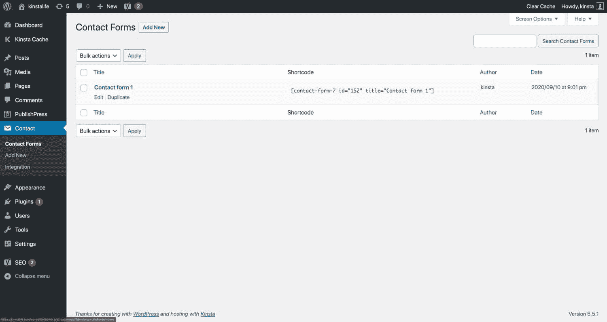

Contact form in Contact Form 7.


当第一次安装 Contact Form 7 时，它也会创建一个示例表单。在我们开始如何创建自定义联系人表单之前，让我们先看一下示例表单，以便更好地了解 Contact Form 7 是如何工作的。点击**联系表格 1** 查看表格设置。

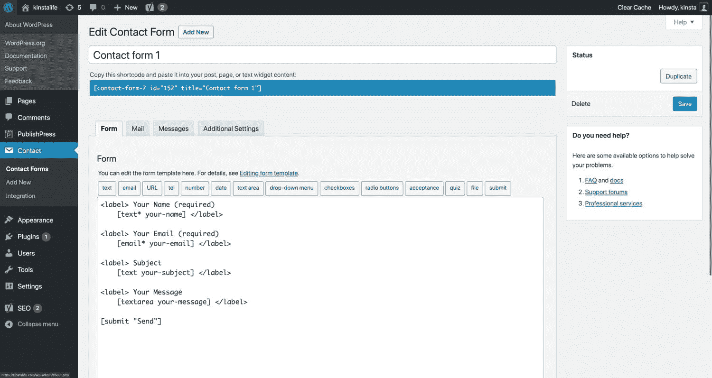

Configure your WordPress contact form.


“编辑联系人表单”页面分为四个部分。

1.  **表单—**使用各种字段选项(如“文本”、“电子邮件”、“复选框”等)定制您的 HTML 联系人表单模板。还可以在表单定制框中编写[定制 HTML](https://kinsta.com/blog/wordpress-vs-static-html/) 。
2.  **邮件—**定制用于通知电子邮件的电子邮件模板和设置。
3.  **消息—**定制特定操作后显示的消息。例如，您可以设置在某人提交联系人表单后显示的唯一消息。
4.  **附加设置—**指定代码片段以启用[附加功能](https://contactform7.com/additional-settings/)，如仅订户模式、演示模式和邮件跳过。

现在让我们仔细看看每个部分，并创建一个自定义的联系人表单！

[You know what they say- keep your friends close, and your audience closer... or something like that. 😉 Stay connected to site visitors thanks to this popular plugin 👇Click to Tweet](https://twitter.com/intent/tweet?url=https%3A%2F%2Fkinsta.com%2Fblog%2Fcontact-form-7%2F&via=kinsta&text=You+know+what+they+say-+keep+your+friends+close%2C+and+your+audience+closer...+or+something+like+that.+%F0%9F%98%89%0AStay+connected+to+site+visitors+thanks+to+this+popular+plugin+%F0%9F%91%87&hashtags=WPPlugins%2CWordPressBlogger)

## 如何创建一个联系表单

要创建新的联系人表单，请点击“联系人表单”旁边的**添加新的**。

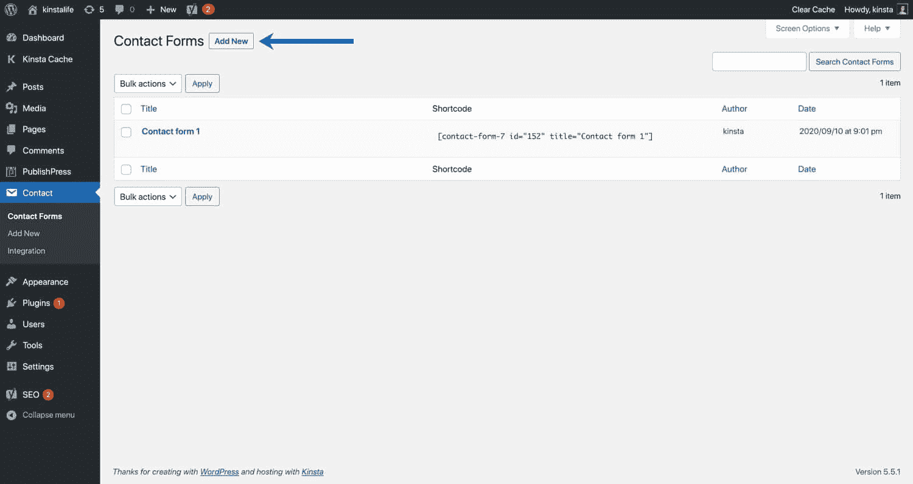

Create a new contact form in Contact Form 7.


为新的联系人表单命名，然后单击“保存”。

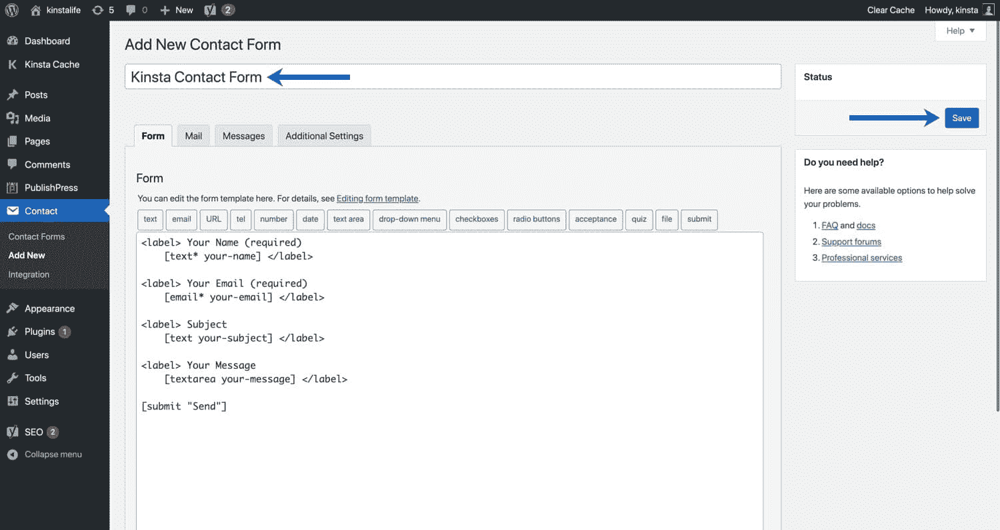

Save your new WordPress contact form.


在“表单”部分，为您的联系人表单添加必要的 HTML。您可以使用各种预设按钮为流行的表单标签生成短代码。为了使事情变得更简单，请查看下面对 Contact Form 7 附带的预设表单标签的描述。

*   **Text—**为单行文本创建一个表单标签。文本字段对于名字、姓氏和其他不需要多行的基于文本的片段非常有用。
*   **Email—**为电子邮件地址创建一个表单标签。
*   **URL—**为 [URL](https://kinsta.com/knowledgebase/what-is-a-url/) 创建一个表单标签。
*   **Tel–**为电话号码创建一个表单标签。
*   **数字—**为数字创建表单标签。与“文本”或“文本区域”输入字段不同，“数字”字段只允许数字。
*   **Date—**为日期创建一个表单标签。
*   **文本区域–**为文本区域创建一个表单标签。与普通的“文本”输入字段不同，“文本区域”字段允许多行文本。它们是输入信息主体的理想选择。
*   **下拉菜单-**为下拉菜单创建一个表单标签。
*   **复选框—**为复选框创建一个表单标签。
*   **单选按钮—**为单选按钮创建一个表单标签。
*   **接受—**为接受复选框创建一个表单标签。
*   **测验—**为问答配对创建一个表单标签。
*   **文件—**为文件上传字段创建一个表单标签。
*   **提交–**为提交按钮创建一个表单标签。

现在让我们来定制一个联系表单。为了完整起见，我们将创建一个 contact form，它使用 Contact Form 7 中所有预设的表单标签。

### “文本”表单标签

当你点击联系人表格 7 中的预设表格标签时，你会看到一个弹出菜单，如下图所示。在此菜单中，您可以配置表单标签的设置。在底部，您会看到一个短代码，它可以嵌入到您的联系人表单模板中。

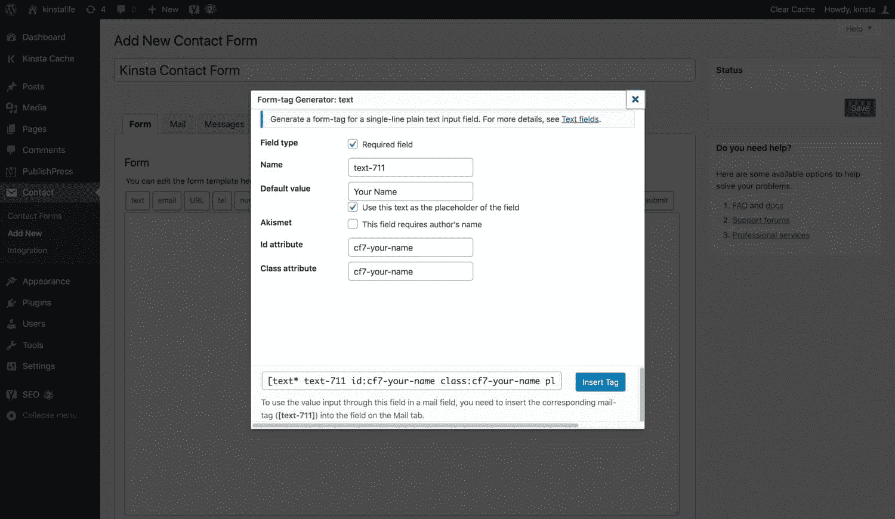

A “text” form tag in Contact Form 7.


对于“文本”表单标签，我们使用下面的设置来创建一个名称输入字段。

*   **字段类型—**必填字段
*   **名称—**文本-711(自动生成)
*   **默认值**–您的姓名(用作默认占位符文本)
*   **akis met-**未选中
*   **ID 属性(CSS)–**cf7-你的名字
*   **类属性(CSS)–**cf7-你的名字

这些设置生成下面的短代码。

```
[text* text-711 id:cf7-your-name class:cf7-your-name placeholder "Your Name"]
```

现在，只需单击 **Insert Tag** 按钮将表单标记添加到联系人表单模板中。稍后我们将添加更多的 HTML 标签来构建表单。

### “电子邮件”表单标签

接下来，我们将创建一个电子邮件表单标记，它将允许我们的联系表单收集电子邮件地址。

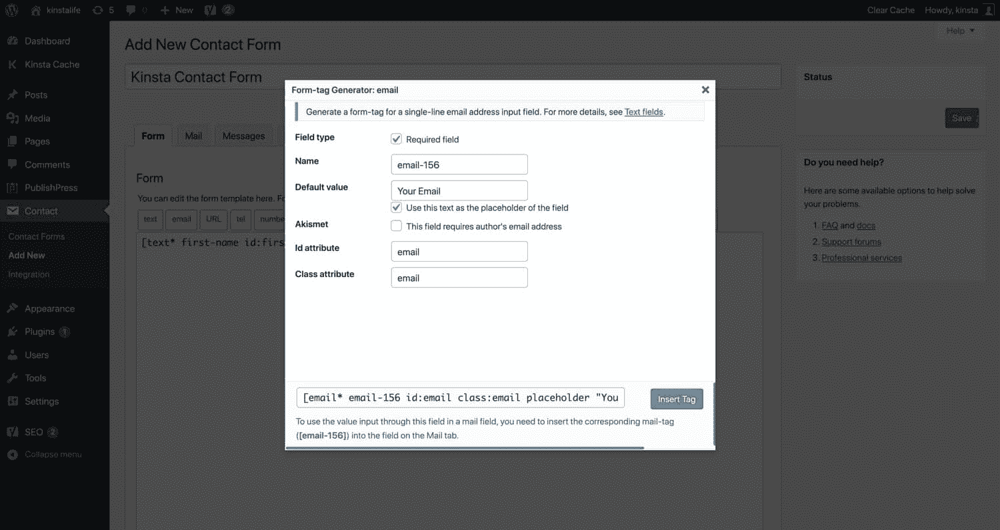

An “email” form tag in Contact Form 7.


对于“电子邮件”表单标签，我们已经配置了以下设置。

*   **字段类型—**必填字段
*   **名称—**电子邮件-632(自动生成)
*   **默认值**–您的电子邮件
*   **akis met-**未选中。
*   **ID 属性(CSS)–**您的电子邮件
*   **类别属性(CSS)–**您的电子邮件

这些设置生成下面的短代码。

```
[email* email-632 id:email class:email placeholder "Your Email"]
```

### “URL”表单标记

在某些情况下，您可能希望在联系人表单上有一个输入字段，用于收集某人的网站。虽然从技术上讲，您可以在 Contact Form 7 中使用普通的“text”表单标记，但我们建议您使用“URL”表单标记。“URL”表单标记将生成一个输入字段来验证 URL，以确保它们的格式正确。

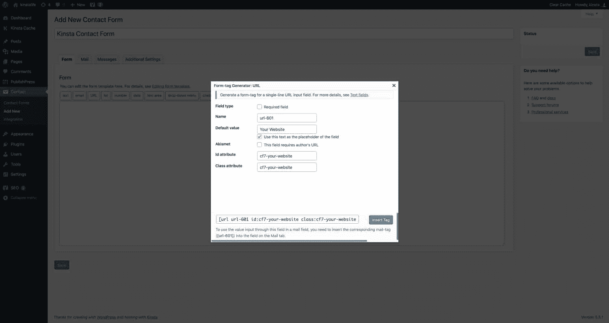

A “URL” form tag in Contact Form 7.


对于“url”表单标记，我们已经配置了以下设置。

*   **名称—**URL-601(自动生成)
*   **默认值**–您的网站
*   **akis met-**未选中。
*   **ID 属性(CSS)–**cf7-你的网站
*   **类属性(CSS)–**cf7-你的网站

这些设置生成下面的短代码。

```
[url url-601 id:cf7-your-website class:cf7-your-website "Your Website"]
```

### “电话”表单标签

与 URL 类似，您也可以使用标准的“文本”表单标记来收集电话号码。但是，最好使用“tel”表单标记来确保电话号码有效。

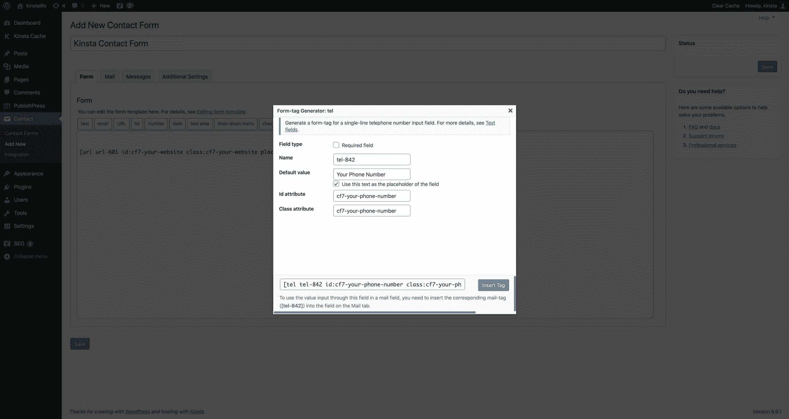

A “tel” form tag in Contact Form 7.


对于“tel”表单标记，我们已经配置了下面的设置。

*   **名称—**电话-842(自动生成)
*   **默认值**–您的电话号码
*   **ID 属性(CSS)–**cf7-你的电话号码
*   **类属性(CSS)–**cf7-你的电话号码

这些设置生成下面的短代码。

```
[url url-601 id:cf7-your-website class:cf7-your-website "Your Website"]
```

### “日期”表单标记

Contact Form 7 的“date”表单标签允许您生成一个日历样式的日期选择器。这个“日期”输入字段对于在联系人表单中指定约会日期非常有用。

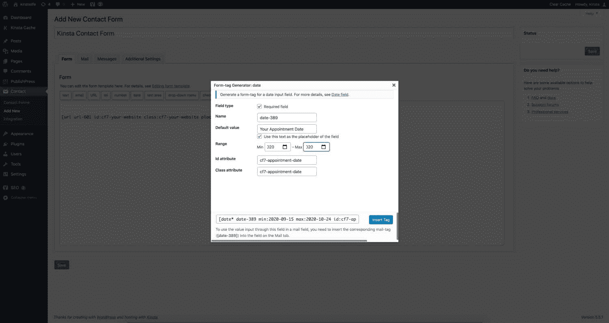

A “date” form tag in Contact Form 7.


对于“日期”表单标记，我们已经配置了下面的设置。

*   **名称—**日期-389(自动生成)
*   **默认值**–您的预约日期
*   **范围—**我们的自定义日期范围。
*   **ID 属性(CSS)–**cf7-约会日期
*   **类属性(CSS)–**cf7-约会-日期

这些设置生成下面的短代码。

```
[date* date-389 min:2020-09-15 max:2020-10-24 id:cf7-appointment-date class:cf7-appointment-date placeholder "Your Appointment Date"]
```

### “文本区域”表单标记

“textarea”表单标签允许您创建一个多行文本框，让访问者提交更长的消息。文本区域对于捕获邮件正文非常有用。

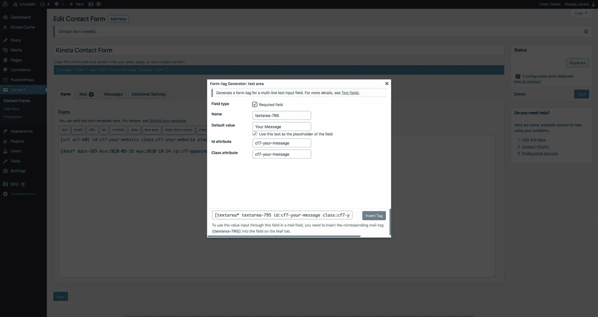

A “textarea” form tag in Contact Form 7.


对于“textarea”表单标签，我们已经配置了下面的设置。

*   **名称—**文本区-795(自动生成)
*   **默认值**–您的消息
*   **ID 属性(CSS)–**cf7-您的消息
*   **类属性(CSS)–**cf7-你的消息

这些设置生成下面的短代码。

```
[textarea* textarea-795 id:cf7-your-message class:cf7-your-message placeholder "Your Message"]
```

### “下拉菜单”表单标签

Contact Form 7 的“下拉菜单”表单标签允许您创建一个带有多个选项的下拉菜单。当您希望访问者选择一个特定选项与表单一起提交时，下拉菜单非常有用。例如，如果你运行一个 [WordPress 维护公司](https://kinsta.com/blog/wordpress-agency/)，你可以配置一个下拉菜单，让访问者在你提供的服务中进行选择。

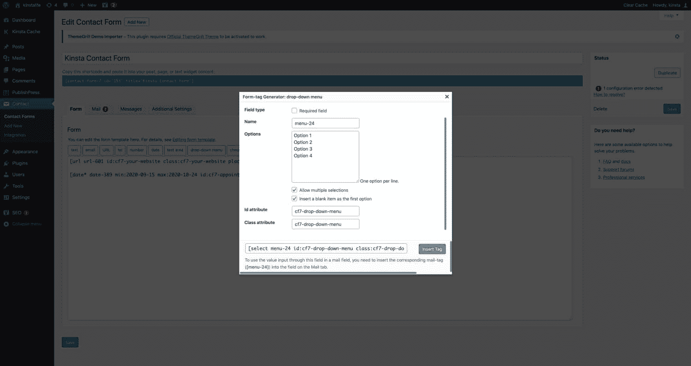

A “drop-down menu” form tag in Contact Form 7.


对于“下拉菜单”表单标签，我们已经配置了下面的设置。

*   **名称-**菜单-24(自动生成)
*   **选项—**选项 1、选项 2、选项 3、选项 4
*   **允许多选-**选中
*   **插入一个空白项目作为第一选项-**勾选
*   **ID 属性-**cf7-下拉菜单
*   **类属性-**cf7-下拉菜单

这些设置生成下面的短代码。

```
[checkbox* checkbox-948 id:cf7-checkbox class:cf7-checkbox use_label_element "Option 1" "Option 2" "Option 3"]
```

### “复选框”表单标记

复选框表单标记允许您创建 HTML 复选框。与下拉菜单类似，复选框也可用于选择预定义的选项。根据联系人表单的性质，复选框可能比下拉菜单效果更好。例如，如果可供选择的选项很少，复选框可以减少进行选择所需的点击次数。另一方面，如果你的联系人表单有很多选项，下拉菜单可能会更好，因为它占用更少的垂直空间。

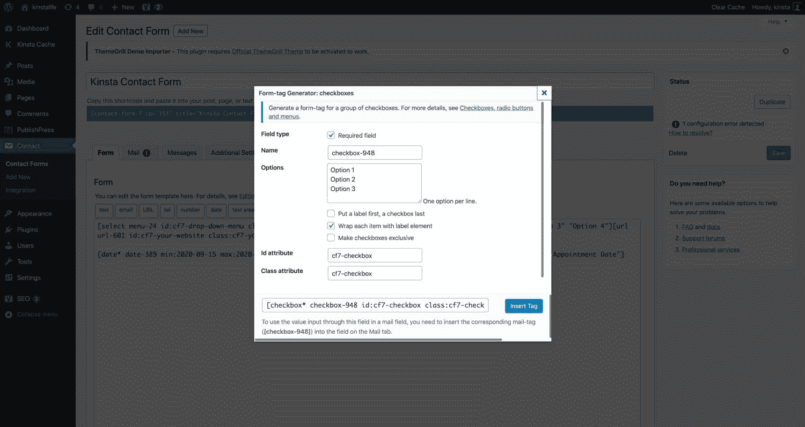

A “checkbox” form tag in Contact Form 7.


对于“复选框”表单标记，我们已经配置了以下设置。

*   **名称-**复选框-948(自动生成)
*   **选项—**选项 1、选项 2、选项 3
*   **用标签元素包裹每件商品—**选中
*   **ID 属性-**cf7-复选框
*   **类属性-**cf7-复选框

这些设置生成下面的短代码。

```
[checkbox* checkbox-948 id:cf7-checkbox class:cf7-checkbox use_label_element "Option 1" "Option 2" "Option 3"]
```

### “单选按钮”表单标记

“单选按钮”表单标记允许您创建具有多个选项的单选按钮。与复选框和下拉菜单不同，单选按钮只允许您选择一个选项。

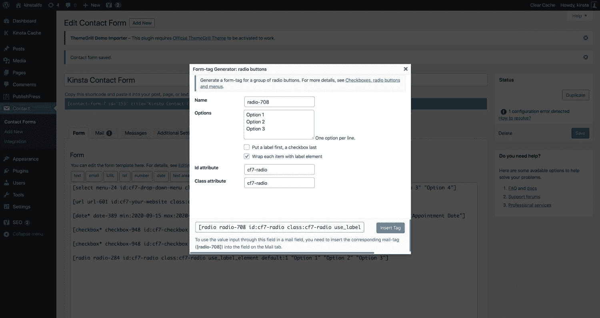

A “radio buttons” form tag in Contact Form 7.


对于“单选按钮”表单标记，我们已经配置了以下设置。

*   **名称—**无线电-708(自动生成)
*   **选项—**选项 1、选项 2、选项 3
*   **用标签元素包裹每件商品—**选中
*   **ID 属性—**cf7-收音机
*   **类属性-**cf7-收音机

这些设置生成下面的短代码。

```
[radio radio-708 id:cf7-radio class:cf7-radio use_label_element default:1 "Option 1" "Option 2" "Option 3"]
```

### “验收”表单标签

Contact Form 7 的“acceptance”表单标记可用于生成单个复选框，以接受条款和条件。通过接受表单标签设置，您可以指定要显示的消息。

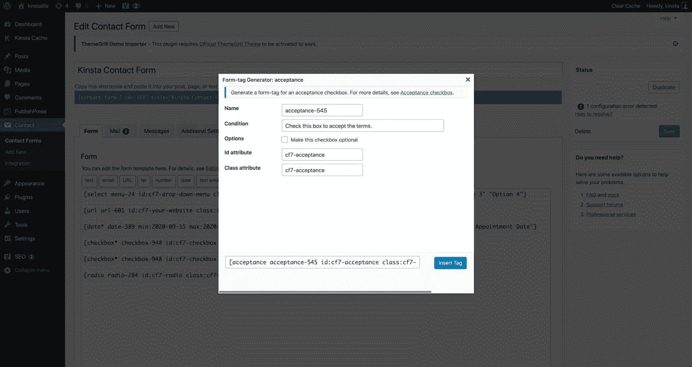

An “acceptance” form tag in Contact Form 7.


对于“接受”表单标签，我们已经配置了下面的设置。

*   **名称—**受理-545(自动生成)
*   **条件—**选中此框接受条款。
*   **ID 属性-**cf7-验收
*   **类属性-**cf7-验收

这些设置生成下面的短代码。

```
[acceptance acceptance-545 id:cf7-acceptance class:cf7-acceptance] Check this box to accept the terms. [/acceptance]
```

### “测验”表单标记

“测验”表单标记可用于在您的联系人表单中创建基本的问答测验。要创建测验问题，请使用以下格式分隔问题和答案-问题|答案。在下面的截图中，我们的问题是“【WordPress 是哪一年发布的？”，答案(用“|”字符隔开)是 2003 年。

## 注册订阅时事通讯


### 想知道我们是怎么让流量增长超过 1000%的吗？

加入 20，000 多名获得我们每周时事通讯和内部消息的人的行列吧！

[Subscribe Now](#newsletter)

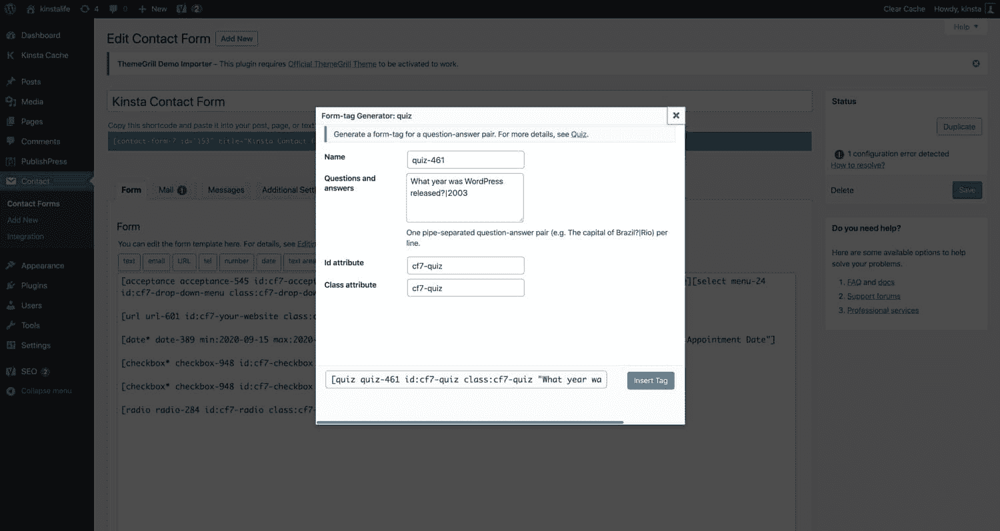

A “quiz” form tag in Contact Form 7.


对于“测验”表单标记，我们已经配置了以下设置。

*   **名称—**测验-461(自动生成)
*   **条件—**选中此框接受条款。
*   **ID 属性—**cf7-测验
*   **类属性—**cf7-测验

这些设置生成下面的短代码。

```
[quiz quiz-461 id:cf7-quiz class:cf7-quiz "What year was WordPress released?|2003"]
```

### “文件”表单标记

联系人表单 7 的“文件”表单标签允许您向联系人表单添加文件上传功能。这在您希望访问者能够上传图像或 PDF 文件并随表单一起提交的情况下非常有用。例如，如果你运行一个[摄影博客](https://kinsta.com/blog/photography-website/)和[图片库](https://kinsta.com/blog/wordpress-photo-gallery-plugins/)，发布客人提交的内容，你可以添加文件上传功能，让人们上传图片。

在表单标记设置中，您可以指定各种设置来保护表单。我们建议始终设置文件大小限制，以防止恶意用户上传大文件。同样，指定“可接受的文件类型”有助于将表单锁定为您想要和期望的文件格式。记住摄影博客的例子，你可能想把文件大小限制在 1 MB (1024 KB ),可接受的文件类型仅限于已知的图像格式，如 [JPG](https://kinsta.com/blog/jpg-vs-jpeg/) 和 [PNG](https://kinsta.com/blog/optimize-images-for-web/#choose-the-right-file-format) 。

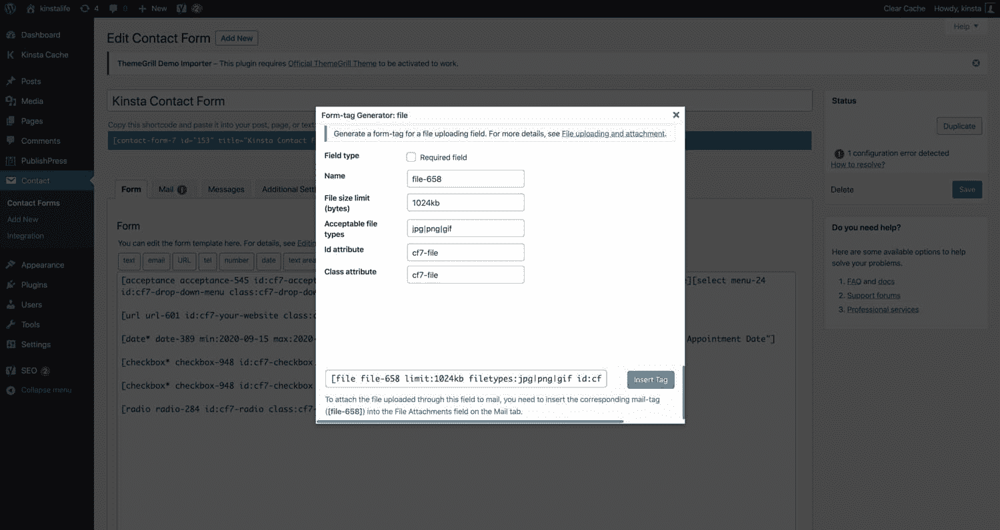

A “file” form tag in Contact Form 7.


对于“文件”表单标签，我们已经配置了下面的设置。

*   **名称—**文件-658(自动生成)
*   **文件大小限制—**1024 kb
*   **可接受的档案类型--**jpg | png | gif
*   **ID 属性-**cf7-文件
*   **类属性-**cf7-文件

这些设置生成下面的短代码。

```
[file file-658 limit:1024kb filetypes:jpg|png|gif id:cf7-file class:cf7-file]
```

### “提交”表单标签

最后但同样重要的是 Contact Form 7 的“submit”表单标记。正如您可能已经猜到的那样，这个 form 标记允许您为联系人表单生成一个 submit 按钮。

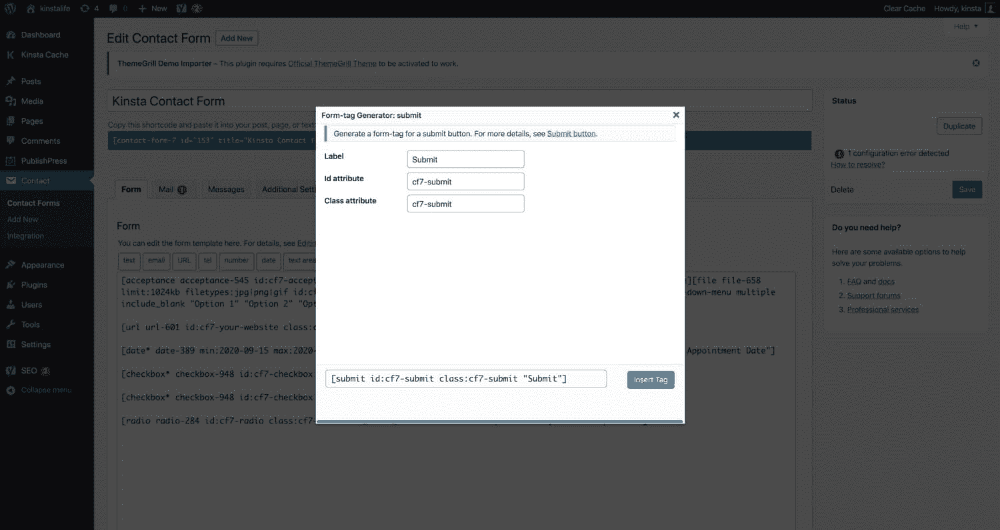

A “submit” form tag in Contact Form 7.


对于“提交”表单标签，我们已经配置了下面的设置。

*   **标签**–提交
*   **ID 属性-**cf7-提交
*   **类属性-**cf7-提交

这些设置生成下面的短代码。

```
[submit id:cf7-submit class:cf7-submit "Submit"]
```

## 如何用表单标签构造联系人表单

现在我们已经设置好了所有的表单标签，是时候创建联系人表单了。此时，您的联系人表单设置应该如下图所示。记下我们在上面创建的所有表单标签。有了表单标签后，你可以使用`[contact-form-7]` [简码](https://kinsta.com/blog/wordpress-shortcodes/)将表单嵌入到 WordPress 文章或页面中。

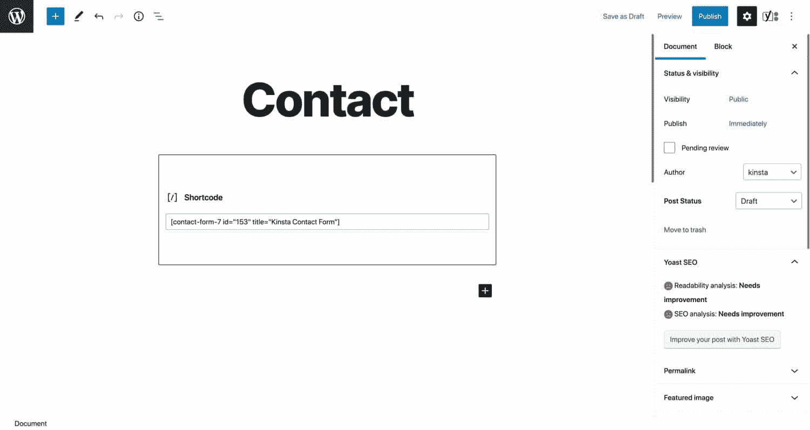

Embed a contact form with the contact-form-7 shortcode.


在 WordPress 编辑器中，将 shortcode 粘贴到一个空白块中。

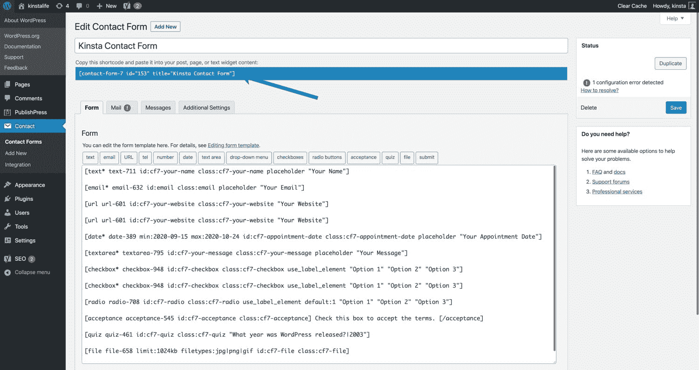

Add the Contact Form 7 shortcode to a post or page.


如果你使用的是 [WordPress Classic 编辑器](https://kinsta.com/blog/disable-gutenberg-wordpress-editor/#install-classic-editor-plugin)，你可以在内容编辑器的任何地方粘贴短代码。

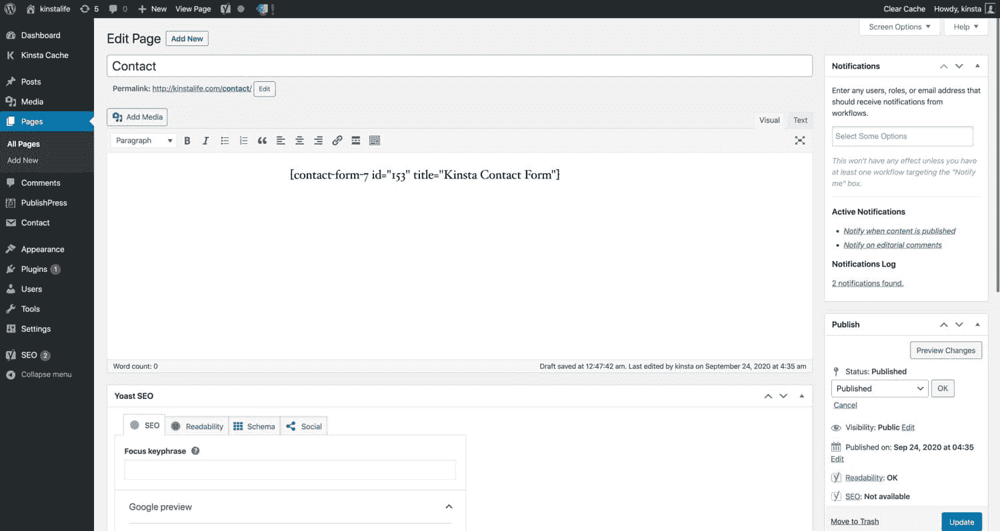

Use Contact Form 7 with the WordPress Classic Editor.


现在，您应该能够在添加了 contact form 7 短代码的页面上看到 Contact Form。下面是我们的联系方式和上面提到的设置的样子。如你所见，Contact Form 7 自动将表单标签转换成有效的 HTML，并使用 WordPress 主题中包含的默认 [CSS 样式](https://kinsta.com/blog/wordpress-css/)进行渲染。

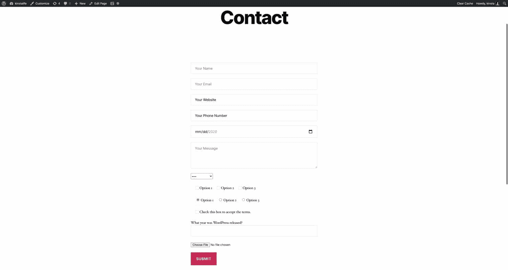

A contact form created with Contact Form 7.


我们当前的联系方式是一个很好的起点，但是它缺少一个关键的特性。像“文本”、“电子邮件”和“URL”这样的表单标签支持占位符，但是像“复选框”和“单选按钮”这样的其他元素不支持占位符。如果没有合适的标签，复选框和单选按钮对访问者来说就没有多大用处，因为它们没有任何上下文。幸运的是，在 Contact Form 7 中添加标签非常简单！

### 如何在联系人表单 7 中添加表单标记标签

有两种方法可以将标签添加到 Contact Form 7 表单标签中。对于下面的表单标签，您可以简单地用一个`<label></label>`标签包装表单标签。

*   文本
*   电子邮件
*   统一资源定位器
*   电话
*   数字
*   日期
*   文本区域
*   接受
*   恶作剧
*   文件

看看下面的示例“文本”表单标签。

```
[text* text-711 id:cf7-your-name class:cf7-your-name placeholder "Your Name"]
```

为了给这个表单标签添加一个标签，我们可以用下面的代码片段替换表单标签。请注意，在开始的`<label>`标记之后，又出现了一个“Your Name”。

厌倦了慢热的主持人？Kinsta 的设计考虑了速度和性能。[查看我们的计划](https://kinsta.com/plans/?in-article-cta)

```
<label> Your Name
[text* text-711 id:cf7-your-name class:cf7-your-name placeholder "Your Name"]
</label>
```

这是我们联系表上的变化。在这种情况下，新创建的标签与占位符的作用相同。但是，如果我们不想在表单标签中指定一个占位符，那么标签将有助于识别特定输入框的用途。

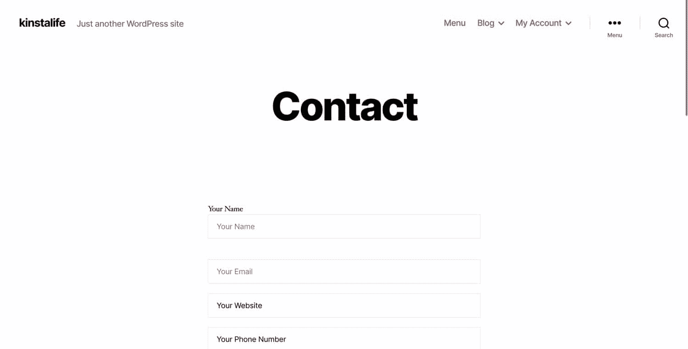

Add a label to a form tag in Contact Form 7.


对于呈现多个表单控件(如**复选框、单选按钮和下拉菜单**)的表单标签，将表单标签包装在`<label></label></label>`标签中会导致错误。发生这种情况是因为`<label>`标签应该只用于单个表单控件。复选框、单选按钮和下拉菜单选项的本质涉及多个表单控件，因此它们与默认的标签解决方案不兼容。

对于复选框、单选按钮和下拉菜单，您必须在短代码中添加一个`use_label_element`参数。看看下面的复选框表单标签示例，其中`use_label_element`是粗体的。

```
[checkbox* checkbox-948 id:cf7-checkbox class:cf7-checkbox **use_label_element** "Option 1" "Option 2" "Option 3"]
```

一旦添加了`use_label_element`参数，您就可以在联系表单编辑器中的表单标签上方直接添加一个标签。

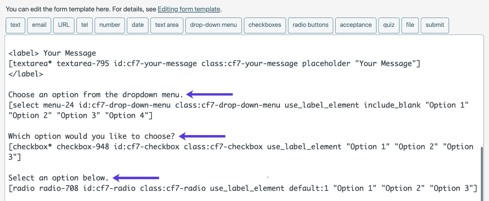

Add a label to checkboxes, radio buttons, and dropdown menus in Contact Form 7.


为了完整起见，我们在联系人表单中的所有表单标签上添加了标签。对于生产站点，您可能不需要这样做，因为一些表单标签已经包含了占位符。不管怎样，我们想展示标签是如何工作的。

下面是我们的联系方式:

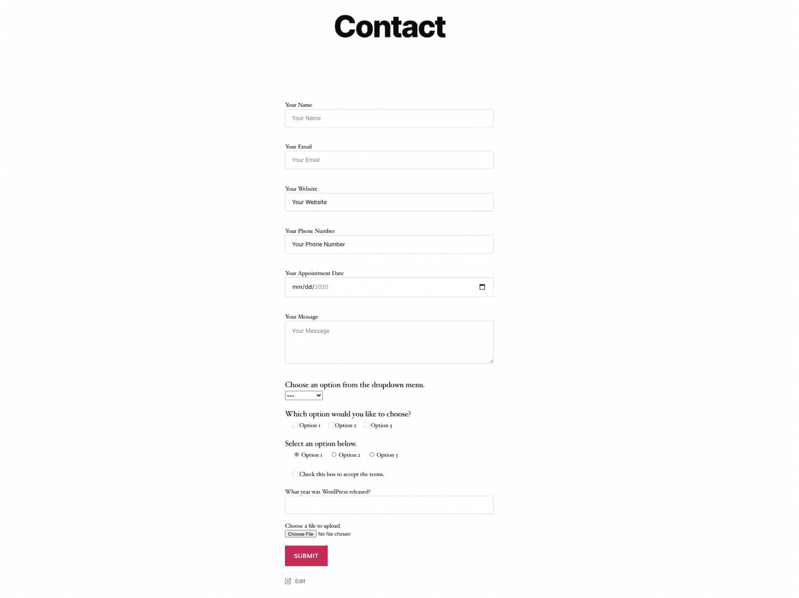

A contact form with labels.


## 在联系人表单 7 中配置邮件设置

现在我们已经配置好了联系表单的结构，是时候看看联系表单 7 中的[电子邮件发送](https://kinsta.com/blog/free-smtp-server/)设置了。虽然默认的邮件传递设置对大多数站点来说应该是可以的，但是如果您的站点或用例需要特殊的配置，理解各种设置仍然很重要。

要访问邮件发送设置，请转到联系人表单编辑器，并选择“邮件”选项卡。

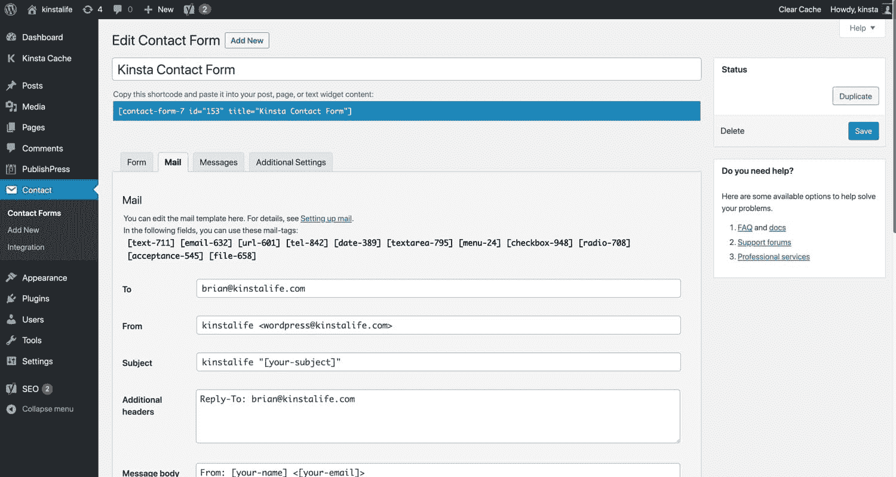

Mail delivery settings in Contact Form 7.


Contact Form 7 的邮件传递设置允许您自定义模板和参数，这些模板和参数用于在某人提交表单后生成通知并将其发送给您。如果您使用不正确的设置，您可能不会收到表单提交的通知。因此，在创建联系人表单和更改设置之后，测试表单交付非常重要。

联系表 7 允许您配置以下邮件传递设置。

*   **收件人—**接收通知的电子邮件地址。
*   **发件人—**发送通知的电子邮件地址。
*   **主题—**通知邮件的主题。
*   **附加标题—**指定附加的[邮件标题](https://kinsta.com/blog/email-header/)，如“回复”。
*   **消息正文–**通知电子邮件的正文。
*   **文件附件—**指定通知电子邮件中包含的任何附件。

现在，让我们来看一下每个设置，以便更好地理解它们如何影响 Contact Form 7 中的邮件传递。

### “收件人”字段

请务必为“收件人”设置指定一个真实的电子邮件地址。默认情况下，Contact Form 7 会将与你的 WordPress 用户帐户相关的电子邮件地址分配给“收件人”设置。如果您的 WordPress 电子邮件地址无效，请确保在您的个人资料设置中更新它，并在联系表 7 中更改电子邮件地址。

### “发件人”字段

“从”设置应使用以下格式-`Your Name`。对于我们的联系人表单邮件设置，我们使用的是`kinstalife <[[email protected]](/cdn-cgi/l/email-protection#46312934223634233535062d2f283532272a2f20236825292b)>`。

默认情况下，联系人 7 将用`[[email protected]](/cdn-cgi/l/email-protection#27504855435755425454675e4852550a43484a464e490944484a)`填写该字段。你需要[确保这个电子邮件地址是有效的](https://kinsta.com/blog/wordpress-not-sending-email/#fix-contact-form-7-not-sending-emails)，因为一些 WordPress 主机会阻止向无效地址发送电子邮件。有多种方法可以使该电子邮件地址有效。您可以为 [【电子邮件受保护】](/cdn-cgi/l/email-protection#b0c7dfc2d4c0c2d5c3c3f0c9dfc5c29dd4dfddd1d9de9ed3dfdd) 设置一个专用的电子邮件帐户，也可以在您的电子邮件服务提供商处启用总括功能。如果您无法设置此电子邮件地址，我们建议您将其更改为有效的电子邮件地址，以避免邮件送达问题。

### “主题”字段

“主题”设置可用于指定通知邮件的主题行。默认情况下，Contact Form 7 将主题设置为`Site Name “[your-subject]”`，即 Contact Form 7 的默认表单模板中的主题名称。

如果您的表单中没有名为“[您的主题]”的表单标签，请务必将其更改为其他名称。例如，如果您只有一个表单标签来获取访问者的姓名(例如[您的姓名])，您可以将主题行改为`You’ve Received a Message from [your-name]`。

### “附加标题”字段

在“附加标题”下，您可以指定电子邮件标题，如回复、抄送和密件抄送。默认情况下，联系表 7 会添加以下标题—`Reply-To: [your-email]`。此标题允许您回复在提交的联系人表单中指定的电子邮件地址。

如果您使用的是 Contact Form 7 的默认电子邮件表单标签，默认回复标题就可以了。如果不是，请确保将其更改为与您的电子邮件表单标签的名称相匹配。对于我们的联系表单，电子邮件表单标记的名称是“email-632”，因此回复表单标记必须改为`Reply-To: [email-632]`。

### “消息体”

接下来是“消息正文”，它决定了通知电子邮件的正文内容。联系人表单 7 的默认模板使用[您的姓名]、[您的电子邮件]、[您的主题]和[您的邮件]表单标签，如下所示:

```
From: [your-name] 
Subject: [your-subject]
Message Body:
[your-message]
-- 
This e-mail was sent from a contact form on kinstalife (http://kinstalife.com)
```

如果您不在联系人表单模板中使用这些表单标签，请务必更改它们。因为我们创建的联系人表单收集了大量信息，所以我们可以用附加的表单标记来设置消息正文，如下所示:

```
Hello Brian, you’ve received a message from [text-711] ([email-632]).
Website: [url-601]
Phone Number: Tel-842
Appointment Date: date-389
Message: textarea-795
```

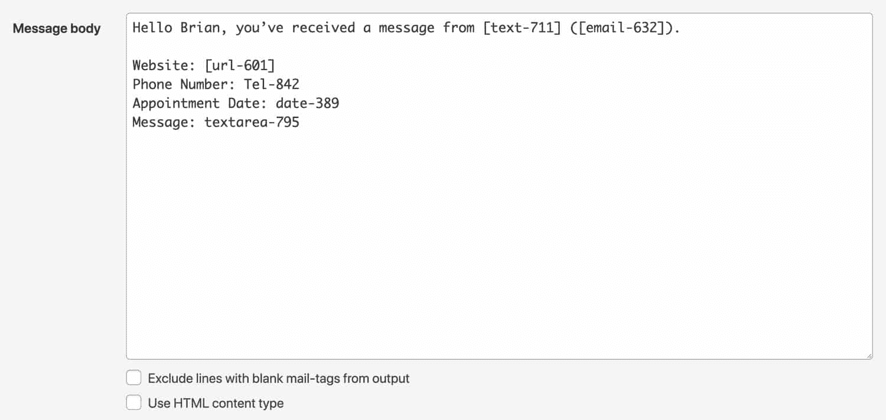

Customize the message body for Contact Form 7 notification emails.


### 联系表 7 邮件设置-文件附件

如果您的联系人表单涉及上传文件，您可以将该文件包含在通知电子邮件中。在我们的联系表单中，我们有一个名为“[file-658]”的文件上传表单标记。因此，我们可以在“文件附件”下添加这个表单标记，以确保该文件将包含在电子邮件通知中。

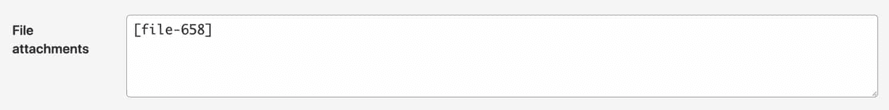

Include file attachments in Contact Form 7 notification emails.


## 联系表格 7 邮件发送问题

如果你发现 [Contact Form 7 没有发送电子邮件](https://kinsta.com/blog/wordpress-not-sending-email/#fix-contact-form-7-not-sending-emails)，在向 WordPress 开发者寻求帮助之前，你可以检查一些事情。

1.  检查您的服务器是否正在发送其他类型的电子邮件。为了测试这一点，你可以通过在博客上发表测试评论或者在你的 WordPress 登录页面上提交密码重置请求来触发另一个邮件发送动作。如果您在执行这些操作之一后收到电子邮件，则问题可能与 Contact Form 7 的配置有关。如果您没有收到电子邮件，请联系您的主机支持团队，让他们知道您的电子邮件发送有问题。
2.  请确保联系人表单的邮件传递设置中的“收件人”和“发件人”字段配置正确。为了使 Contact Form 7 正常工作，这两个字段都应该填写真实的电子邮件地址。

## 联系表单 7 表单提交消息

Contact Form 7 允许您自定义各种表单提交消息。满足特定条件后，会显示这些消息。例如，如果访问者忘记填写必填字段，联系表 7 将显示“该字段是必填的”消息。对于大多数用例，默认消息应该可以正常工作。但是，如果您想要自定义消息，您可以通过单击联系表单编辑器中的“消息”选项卡来完成。


Customize Contact Form 7 situational messages.


## 如何保护您的联系方式

随着这些年来自动化机器人变得越来越智能和普遍，垃圾邮件已经成为联系人表单的一个主要问题。由于联系方式通常在公共互联网上公开，因此[网页抓取工具](https://kinsta.com/blog/content-scraping/)很容易发现它们，并向你的电子邮箱发送垃圾邮件。幸运的是，有各种方法可以抵御垃圾邮件发送者并保护您的联系方式。

### 用 reCAPTCHA 保护您的联系表 7

如果你曾经在互联网上提交过表格，你可能已经熟悉了 [reCAPTCHA](https://kinsta.com/blog/wordpress-captcha/) ，这是谷歌开发的一项用于识别自动机器人行为的技术。旧版本的 reCAPTCHA (V2)要求用户通过一个难题或挑战。

reCAPTCHA (V3)的最新版本不需要用户的任何交互。相反，它在后台透明地监控用户活动，以区分人类和机器人访客。由于 Contact Form 7 支持 reCAPTCHA V3，我们建议使用这个最新版本，因为它为访问者提供了更好的用户体验。

要设置 reCAPTCHA，首先需要生成一个 API 密钥。为此，请登录您的谷歌账户，并进入 [reCAPTCHA 设置页面](https://www.google.com/recaptcha/admin/create)。

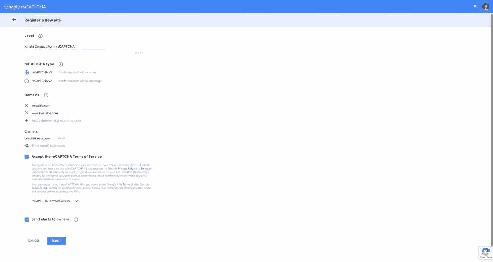

Register a new site for reCAPTCHA integration.


浏览注册表格，创建您的 reCAPTCHA。

*   **标签—**指定您选择的标签。
*   **reCAPTCHA 类型–**联系表 7 支持 reCAPTCHA v3，因此选择该版本。
*   **域–**如果您的网站使用根域，请添加您的域的非 www 和 www 版本。如果你的网站使用子域，只需添加子域。
*   **所有者—**默认情况下，与您的 Google 帐户关联的电子邮件地址将被添加为所有者。如果需要，请随意添加其他电子邮件地址。

填写完所有选项后，点击**提交**。然后，您将看到您的站点特定的“站点密钥”和“秘密密钥”。请务必妥善保管这些钥匙，因为您需要将它们添加到联系表 7 中。

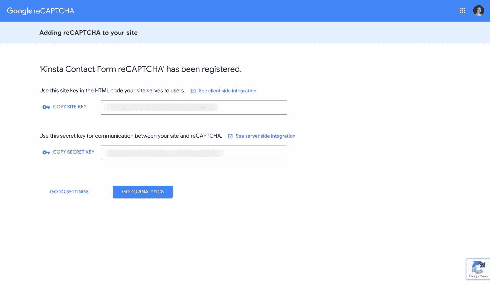

Google reCAPTCHA site and secret keys.


接下来，点击你的 WordPress dashboard 工具条中的“联系人”，然后点击**整合**。选择 reCAPTCHA 选项，并将您的站点密钥和秘密密钥粘贴到各自的字段中。最后，点击**保存更改**完成 reCAPTCHA 集成。

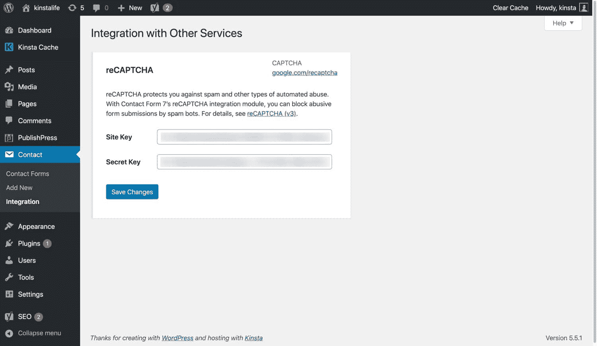

Configure reCAPTCHA in Contact Form 7.


在 Contact Form 7 中配置 reCAPTCHA 后，您将在 Contact Form 页面的右下角看到 reCAPTCHA 徽标。这意味着 reCAPTCHA 是积极的，并保护您的联系方式从垃圾邮件提交。

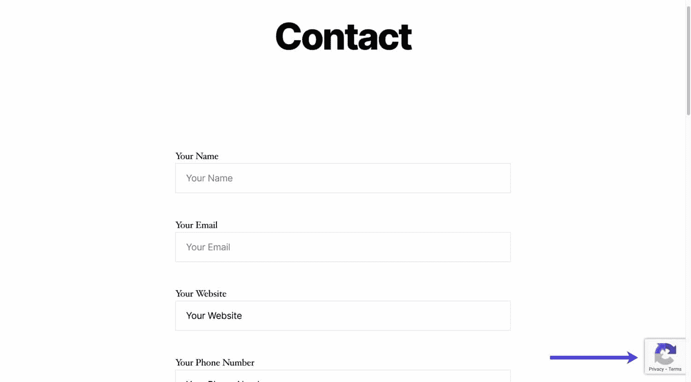

WordPress contact form protected by reCAPTCHA V3.


### 使用 Cloudflare 保护您的联系表单(可选)

如果您使用 [Cloudflare 来保护您的站点](https://kinsta.com/blog/cloudflare-settings-wordpress/)，您可以为您的联系表单页面设置一个特殊的页面规则，以减少垃圾联系表单提交。

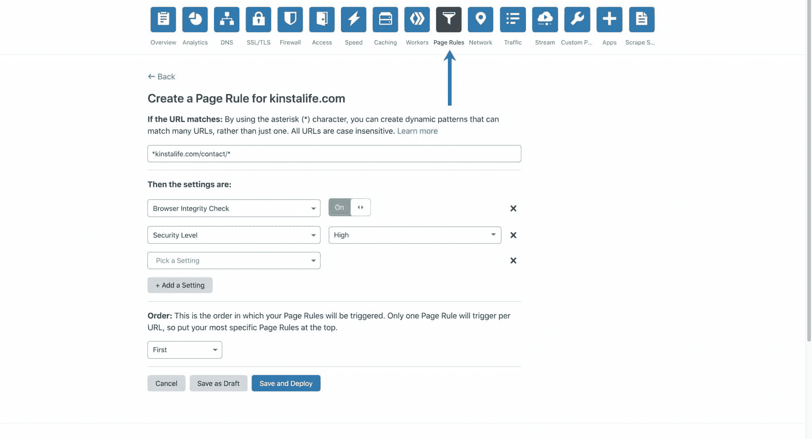

Protect your contact form with Cloudflare.


要添加页面规则，请单击“页面规则”选项卡，并使用以下设置来帮助保护您的联系人页面。

*   **如果网址匹配-*** your-domain . com/your-contact-page/*
*   **浏览器完整性检查–**开启
*   **安全级别—**高

Cloudflare 的“[浏览器完整性检查](https://support.cloudflare.com/hc/en-us/articles/200170086-Understanding-the-Cloudflare-Browser-Integrity-Check)”功能分析 HTTP 头。如果它检测到自动机器人和垃圾邮件发送者常用的 HTTP 头，它会拒绝对您的站点的请求。将“安全级别”设置为高将挑战所有在过去两周内表现出恶意行为的访问者。

通过使用 URL 匹配规则将这些设置限制到您的联系人页面，您站点上的其他页面将不受这些页面规则的影响。我们建议使用这种配置，因为您站点上的普通“只读”页面通常不需要增强的安全级别设置。

[Don't leave your audience on read. 👀 Get in direct contact with your readers and potential customers through the Contact Form 7 plugin ⬇️Click to Tweet](https://twitter.com/intent/tweet?url=https%3A%2F%2Fkinsta.com%2Fblog%2Fcontact-form-7%2F&via=kinsta&text=Don%27t+leave+your+audience+on+read.+%F0%9F%91%80+Get+in+direct+contact+with+your+readers+and+potential+customers+through+the+Contact+Form+7+plugin+%E2%AC%87%EF%B8%8F&hashtags=WordPress%2CContactForm)

## 摘要

联系表单 7 是最受欢迎的[联系表单插件](https://kinsta.com/blog/wordpress-contact-form-plugins/)并且理由充分！它可以用来创建任何东西，从基本的联系表单，到问答测验，再到支持文件附件和下拉菜单的复杂表单。

最重要的是，它带有内置的 reCAPTCHA 支持，以帮助保护您的联系方式，防止垃圾邮件发送者。

你在你的 WordPress 网站上使用联系表 7 吗？如果不是，你的首选是什么？请在下面的评论区告诉我们！

* * *

让你所有的[应用程序](https://kinsta.com/application-hosting/)、[数据库](https://kinsta.com/database-hosting/)和 [WordPress 网站](https://kinsta.com/wordpress-hosting/)在线并在一个屋檐下。我们功能丰富的高性能云平台包括:

*   在 MyKinsta 仪表盘中轻松设置和管理
*   24/7 专家支持
*   最好的谷歌云平台硬件和网络，由 Kubernetes 提供最大的可扩展性
*   面向速度和安全性的企业级 Cloudflare 集成
*   全球受众覆盖全球多达 35 个数据中心和 275 多个 pop

在第一个月使用托管的[应用程序或托管](https://kinsta.com/application-hosting/)的[数据库，您可以享受 20 美元的优惠，亲自测试一下。探索我们的](https://kinsta.com/database-hosting/)[计划](https://kinsta.com/plans/)或[与销售人员交谈](https://kinsta.com/contact-us/)以找到最适合您的方式。