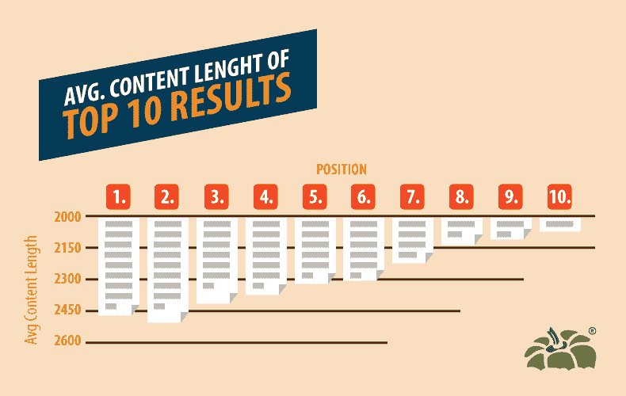
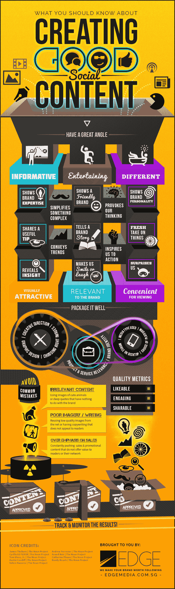
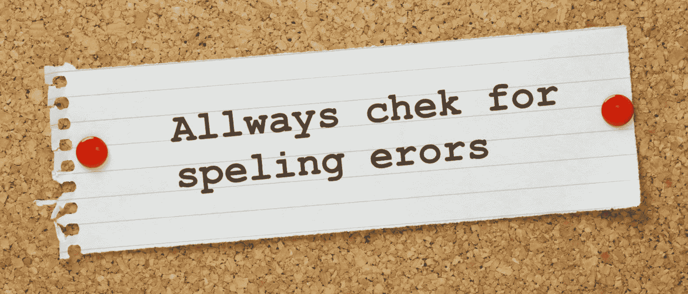
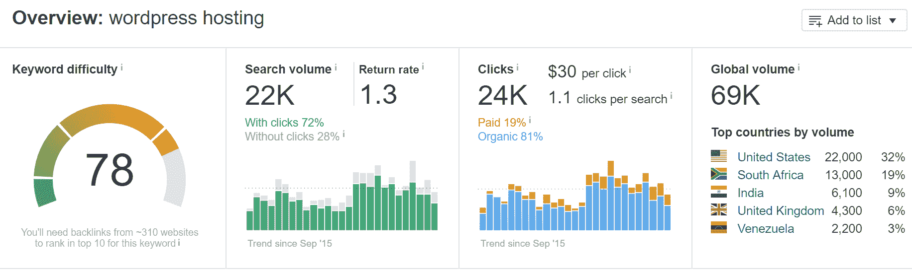

# 2022 年对你的内容来说比内容长度更重要的 5 件事

> 原文：<https://kinsta.com/blog/content-length/>

近年来，内容长度一直是激烈的争论，许多 SEO 大师告诉他们的追随者，如果他们想成功，他们必须创建非常长的帖子。虽然有很好的证据表明内容长度与排名相关，但这不是最重要的因素。

这是因为内容长度通常与内容质量成反比。当你优先考虑长度时，你自然会降低每个单词的价值，用 1000 个单词而不是 300 个单词来说一些东西，因为你想排名更高。

这样做可能会在短期内提高你的排名，但这完全违背了谷歌的意愿，最终，算法会进行调整以进行补偿。毕竟，他们想为搜索者提供有价值的服务，而不是拥有最多单词的页面。在很多情况下，人们寻找的是简洁而有价值的内容，而不是冗长的解释。

因此，虽然**字数明显与高排名**相关，但至少有五个其他因素更重要，你也应该考虑。

Average content length in SERPs (Image source: [Capsicum Mediaworks](https://capsicummediaworks.com/content-length/))

下面让我们深入探讨这些问题:

1.  [为你的读者提供价值](#provide-value)
2.  [提供的不仅仅是文字](#more-than-just-words)
3.  [正确的语法和拼写](#grammar-spelling)
4.  [关键词优化](#keyword-optimization)
5.  [重视读者的时间](#value-readers-time)

## 1.为你的读者提供价值

首先，你的内容的目标应该是为你的读者提供价值。如果你不能实现这个简单的目标，那么人们不太可能会分享或链接到你的页面，这将使你更难在有竞争力的搜索词中排名。

[The goal of your content should be to provide value to your readers. 👍Click to Tweet](https://twitter.com/intent/tweet?url=https%3A%2F%2Fbit.ly%2F2YUQxje&via=kinsta&text=The+goal+of+your+content+should+be+to+provide+value+to+your+readers.+%F0%9F%91%8D&hashtags=contentmarketing%2CSEO)

即使你设法让人们进入你的页面，如果你的内容没有价值，他们也不太可能转化为付费用户。事实上，如果你的页面因为你试图达到一个任意的字数而充满了绒毛，很可能他们会对你的网站留下不好的印象，再也不想回来。

> Kinsta 把我宠坏了，所以我现在要求每个供应商都提供这样的服务。我们还试图通过我们的 SaaS 工具支持达到这一水平。
> 
> <footer class="wp-block-kinsta-client-quote__footer">
> 
> 
> 
> <cite class="wp-block-kinsta-client-quote__cite">Suganthan Mohanadasan from @Suganthanmn</cite></footer>

[View plans](https://kinsta.com/plans/)

如果你想为你的读者提供价值，让他们成为付费客户，你必须把质量放在数量的前面。不这样做很快就会毁掉你的品牌声誉，让读者认为你的品牌不在乎质量。

请务必查看我们的长阅读主题:[内容营销要点](https://kinsta.com/learn/content-marketing/)

### 他们为什么要看你的内容？

为了给你的读者提供价值，你必须首先理解为什么他们会阅读你写的文章。不理解读者试图解决的问题，你就很难正确地提供价值。

价值有许多不同的形式；读者可能在寻找建议、娱乐、指导、幽默或其他不同形式的价值。认识到你的读者来找你是为了什么，对于以一种提供这种价值的方式来精心制作你的内容是至关重要的。

比如说；如果你正在写一篇关于如何安装排水管的帖子，读者可能会寻找详细的说明。搜索者可能几乎没有经验，因此你的指示必须详细和非常精细，不要跳过更有经验的人会觉得直观的细节。

理解“搜索者的意图”对提供价值至关重要。现在你知道他们在寻找什么，你必须创建一个页面，以最好的方式传递这种价值，在许多情况下，这不会通过写一篇比竞争对手更长的大文章来实现。

Moz 的创始人 Rand Fishkin 这样评价长格式内容:

> 是的。我读过研究报告。我知道其中的关联。平均而言，长篇内容比更简洁的同类内容获得更多的参与度、更高的排名和更多的份额。但是,**并不意味着**让长篇内容等同于伟大的内容。它**没有**把长篇内容作为每一个内容努力的目标。当然**并不意味着更长的内容就是更好的内容。**

## 2.提供的不仅仅是文字

在这个时代，强迫你的用户阅读你的内容是不够的；您必须提供替代形式的内容，如图形、视频和音频体验。这是因为阅读通常不是你展示内容的最佳方式，尤其是当你试图解释一些视觉或复杂的东西时。

我们来看一个例子；您可以创建一个指南，向您的客户解释如何修理他们的割草机。当然，仅仅用文字来解释这一点是可能的，但是对你的客户来说，这远不如图片或视频有价值。

出于这个原因，现在大多数说明手册都附有图片，许多公司在其网站或 YouTube 频道上有详细的视频。这两种选择都远远优于文字，这就是为什么内容长度可以说不是很重要。

你的页面可能只有 100 个单词，但它可能伴随着多幅图像和一个难以置信的视频，为你的读者提供巨大的价值。

除此之外，研究表明，带有图片的**页面往往排名更好**。此外，人们更有可能链接到有详细视频和图片而不是纯文本的网站。这是因为文字在许多情况下不如视频，它们不那么令人身临其境，也不那么令人印象深刻。

Creating social content (Img src: [Edge Media](https://edgemedia.com.sg/))

显然，制作一个高质量视频的成本通常高于写一篇文章的成本，这可能会让一些网站望而却步，但这也是一个很好的机会。由于你的许多竞争对手未能利用视频内容，你的优势要大得多。

此外，通过创建视频内容，您可以将其上传到 Vimeo 和 YouTube 等其他平台。这样做可以让你进入另一个营销渠道，从而找到更多的客户，增加收入。内容长度不是一切，它当然不会比添加视觉元素来增强页面更重要。

## 3.正确的语法和拼写

虽然你可以提出一个很好的论点，正确的语法包含在“有价值的内容”中，但它是如此重要，以至于它值得成为一个章节。如果你的语法很差，那么谷歌和你的访问者都会注意到。

## 注册订阅时事通讯

### 想知道我们是怎么让流量增长超过 1000%的吗？

加入 20，000 多名获得我们每周时事通讯和内部消息的人的行列吧！

[Subscribe Now](#newsletter)

一些研究表明，谷歌的算法可以区分写得好的内容和语法不好的页面。如果他们现在还不知道，那么他们很有可能在将来把好的语法作为排名的一个因素。原因很简单；用户希望阅读写得好的内容，这就是为什么[你不能跳过对内容的校对](https://kinsta.com/blog/proofreading-tips/)。

Grammar and spelling

作为一个用户，如果你进入一个语法和拼写都很差的页面，你很可能会点击返回，试图找到另一个页面访问。用户这样做是因为阅读一个写得不好的页面非常困难。

这些点击返回的用户显然不会成为你的客户，但是即使那些停留在你页面上的用户也不太可能转化为你的客户。毕竟，如果你的内容中有拼写和语法错误，那么你的读者会把你的品牌与低质量和低标准联系起来。

事实上， [Globo Lingo 的研究人员](https://www.global-lingo.com/)发现，如果网站或营销材料上有明显的语法或拼写错误，59%的参与者就不太可能使用某项服务或产品。

有了这种联系，他们就不太可能转化为付费客户，不管你的销售页面有多好，或者你的产品有多大帮助。

看看这些我们都需要停止犯的 30 个常见语法错误。如果你需要帮助，看看这些[免费语法检查工具](https://kinsta.com/blog/grammar-checker-tools/)。

## 4.关键词优化

如果你要努力为你的读者创造一篇精彩的内容，明智的做法是确保对有价值的关键词进行适当的**优化。这样做将使你更有可能对人们经常搜索的关键词进行排名，带来来自谷歌、雅虎和必应的被动流量。通过遵循简单的 [SEO 技巧](https://kinsta.com/blog/wordpress-seo/)，Kinsta 能够在 13 个月内增加 571%的有机流量。**

Kinsta organic traffic increase

虽然没有哪家企业应该完全依赖于搜索引擎优化流量来获取收入，但是忽视这样一个可以利用的有针对性的流量来源是愚蠢的。相反，通过研究人们正在搜索的关键词，你可以优化你的帖子，使它们在与你正在写的帖子相关的术语中排名更高。

在你优化你的文章之前，你需要弄清楚人们在搜索哪些关键词，这说起来容易做起来难。幸运的是，像 Ahrefs 关键字浏览器这样的工具让事情变得简单多了。

Struggling with downtime and WordPress problems? Kinsta is the hosting solution designed to save you time! [Check out our features](https://kinsta.com/features/)

使用[关键字搜索](https://kinsta.com/blog/keyword-research/)，您可以输入一个种子关键字，并找到其他相关的搜索词。这项研究的关键是找到搜索量高但没有竞争力的词，这些词最有可能被排名，但也有值得每月搜索的次数。

Keyword research with Ahrefs

但是仅仅从表面上看关键词是不够的，这是许多初学者在刚开始做关键词研究时犯的错误。事实上，当你决定搜索哪些关键词时，搜索者的意图可能是最重要的因素。

毕竟，没有转化的流量是没有用的，这就是为什么你需要花点时间考虑谁会搜索这些词以及为什么。这样做可以让你更深入地了解这些人，他们是否有可能从你这里购买，他们是否准备购买或者仍然需要更多的说服力。

这些因素是至关重要的，尤其是当你试图向人们推销高价商品的时候。比如说；想买车的人可能比寻找廉价小玩意的人更需要令人信服的详细信息。

现在你已经找到了理想的目标关键词，你必须有效地优化你的页面，同时避免过度优化的惩罚。首先，尽可能自然地写作，而不是专注于关键字优化，这总是明智的，因为这将产生最高质量的内容。

然而，建议保持在 0.2%–0.4%之间的**低关键词密度。在这个层面上，你可以鼓励谷歌对你的关键词进行排名，但你不会表现出试图操纵他们的算法。**

要了解更多，请看这篇文章，在这里我们分享了更多关于我们最喜欢的 [WordPress SEO 工具](https://kinsta.com/blog/best-seo-plugins-for-wordpress/)。

你的关键词最有价值的位置是在你的标题和标题标签中，因为谷歌似乎更重视这些标签中的单词。因此，尽可能在标题中使用关键词是明智的。

## 5.珍惜读者的时间

不要过分担心内容的长度，你应该确保你为你的读者提供价值，而不是浪费他们的时间。也许关注内容长度的最大原因是它会鼓励你写比你需要的更长的文章。

Value readers time

这样做向你的读者表明，你不重视他们的时间，宁愿提高你的排名，而不是关心你的客户。在这个时代，每个人都很忙，人们希望他们的问题得到快速的答案，他们当然不希望阅读一篇很长的文章来找出一些相对简单的东西。

你的目标应该是以最有效的方式为你的读者提供价值。在许多情况下，这意味着你的文章只有几百个字，但通常最快的阅读仍然可以有几千个字。

但关键是你必须区分人们问的问题，弄清楚他们什么时候想要一个快速的答案，什么时候需要一篇更详细的文章。这样做将确保你重视你的读者的时间，并仍然为他们提供他们所寻找的一切。

如果有疑问，你应该**设身处地为读者着想**，在谷歌上搜索他们会使用的查询，看看其他网站发布了什么。他们拖长了还是太短了？

[When it comes to writing content, put yourself in your reader's shoes. 👟Click to Tweet](https://twitter.com/intent/tweet?url=https%3A%2F%2Fbit.ly%2F2YUQxje&via=kinsta&text=When+it+comes+to+writing+content%2C+put+yourself+in+your+reader%27s+shoes.+%F0%9F%91%9F&hashtags=contentmarketing%2Cinbound)

这项研究非常有益，因为它不仅能让你找到市场缺口，还能让你确定如何最好地为你的观众提供价值。

## 你应该关心字数吗？

读完这篇文章后，你可能会问自己是否应该关心自己的字数。这可能会令人困惑，你想专注于这五件极其重要的事情，但你也想排名，研究表明，长文章往往排名更高。

答案是重新安排优先顺序，在发表文章之前而不是在写文章的时候考虑字数。这样做将有助于防止你写过长的文章，让你专注于为你的读者提供尽可能多的价值。

相反，你可以**用字数来指导你需要做多少营销和链接建设来给一篇文章排名**。但是通过忘记字数，你可以创造出提供更好用户体验的文章，副产品是这使得链接建设和营销更容易。

* * *

让你所有的[应用程序](https://kinsta.com/application-hosting/)、[数据库](https://kinsta.com/database-hosting/)和 [WordPress 网站](https://kinsta.com/wordpress-hosting/)在线并在一个屋檐下。我们功能丰富的高性能云平台包括:

*   在 MyKinsta 仪表盘中轻松设置和管理
*   24/7 专家支持
*   最好的谷歌云平台硬件和网络，由 Kubernetes 提供最大的可扩展性
*   面向速度和安全性的企业级 Cloudflare 集成
*   全球受众覆盖全球多达 35 个数据中心和 275 多个 pop

在第一个月使用托管的[应用程序或托管](https://kinsta.com/application-hosting/)的[数据库，您可以享受 20 美元的优惠，亲自测试一下。探索我们的](https://kinsta.com/database-hosting/)[计划](https://kinsta.com/plans/)或[与销售人员交谈](https://kinsta.com/contact-us/)以找到最适合您的方式。