# 转化率优化技巧——12 种促进销售的简单方法

> 原文：<https://kinsta.com/blog/conversion-rate-optimization-tips/>

给你的网站带来大量的流量总是一件好事，也是我们的企业和博客所渴望的。但是**如果流量没有转化为某种东西**，比如销售、电子书下载或注册你的电子邮件列表，那么**就真的没有意义**。

这条规则也有一些例外，比如一个新闻网站可能从 [AdSense](https://kinsta.com/blog/how-to-add-google-adsense-to-wordpress/) 中获得收入，或者一个企业专门试图围绕他们的品牌产生轰动效应。但是 99%的时候，你需要你的流量去转化，否则，简直就是浪费时间和精力。

今天，我们将探讨 12 种不同的转化率优化技巧，以帮助增加您的销售和注册。

## 什么是好的转化率？

有些人可能想知道什么是好的转化率，然而，这是一个很难回答的事情，因为每个利基和行业不同。 [WordStream 对他们 100 多个客户的账户进行了分析](http://www.wordstream.com/blog/ws/2014/03/17/what-is-a-good-conversion-rate)，他们发现**一个好的转换率通常在 2%到 5%左右**。然而，也有一小部分广告客户获得了更高的转化率。

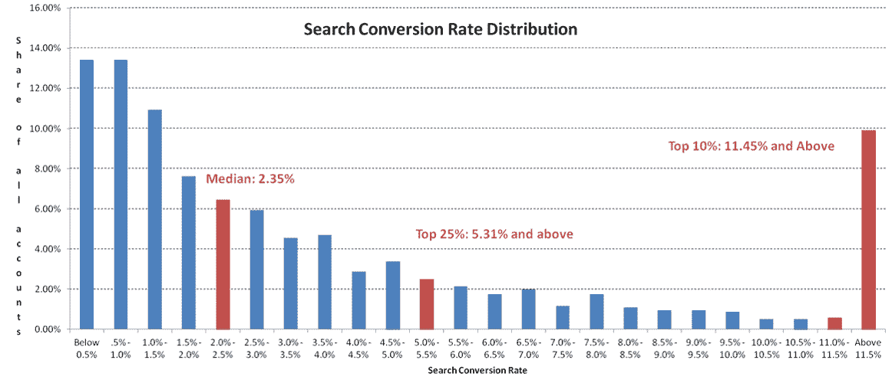

WordStream Analysis – Search Conversion Rate Distribution

但是当进行直接比较时，很难说什么是好的转化率。同一行业的人有不同的流量来源，不同的客户关系，他们的网站可能日夜互不相同。这就是为什么我们认为 ConversionXL 和 CXL Institute 的创始人 Peep Laja 可能有这个问题的最佳答案:

> “什么是好的转化率”的唯一正确答案是这样的:**好的转化率比你上个月拥有的好**。

这就是为什么为你的业务建立一个基线并专注于在一段时间内提高你的转化率是很重要的。

> Kinsta 把我宠坏了，所以我现在要求每个供应商都提供这样的服务。我们还试图通过我们的 SaaS 工具支持达到这一水平。
> 
> <footer class="wp-block-kinsta-client-quote__footer">
> 
> 
> 
> <cite class="wp-block-kinsta-client-quote__cite">Suganthan Mohanadasan from @Suganthanmn</cite></footer>

[View plans](https://kinsta.com/plans/)

## 12 个转化率优化技巧

谈到谈话率优化，你必须对你的目标和受众有一个清晰的愿景。你的网站的目的是什么？无论你是在卖电子书还是洗衣机，你都必须定义你认为是成功转化的目标。追踪这些物体是检查你是否在正确的方向上前进所必需的。

这里有 12 个转化率优化技巧来帮助你开始改善你的目标。当然，这些例子中有很多会用到 WordPress，但是大多数适用于任何网站。

1.  [使用有效的标题](#effective-headlines)
2.  [战略 CTA](#strategic-ctas)
3.  [简单化导航](#simplistic-navigation)
4.  [页面加载速度](#page-load-speed)
5.  [验证支付系统、信托印章和免费送货](#verified-payment)
6.  [时限](#time-limits)
7.  [限量](#limited-quantity)
8.  [针对手机进行优化](#mobile)
9.  [显示证明和推荐](#display-testimonials)
10.  [互补色](#complementary-colors)
11.  [分心自由登陆页面](#distraction-free-landing-pages)
12.  [质量含量](#quality-content)

### 1。使用有效的标题

标题通常是访问者登陆你的网站时看到的第一件东西。标题是**将你的整个推销总结成一句醒目的话**的一种手段。这是为了激起游客的好奇心，回答一个问题，解决一个问题或具有指导性。在此前提下，以下类型的标题已被证明是有影响力的，并促进更好的线索生成。

*   占据头条
*   直接标题
*   问题标题
*   解决问题标题
*   指导性和操作性标题

需要注意的是，如果没有一个合适的标题，你可能会失去很多潜在的商机。明智一点，利用上面提到的标题。他们的风格和位置也很重要。Signal v. Noise 在高层注册页面上进行了一个[测试，看看改变标题是否会影响转化率。](https://signalvnoise.com/posts/1525-writing-decisions-headline-tests-on-the-highrise-signup-page)

**原文:最差表现者** 原标题的副标题是 30 天免费试用。

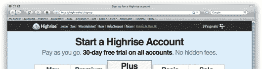

Highrise A/B Test Headline 1

**赢家:比最初的** 提高了 30%的转化率一旦他们将 30 天的免费试用提升到主界面，他们看到注册人数增加了 30%!

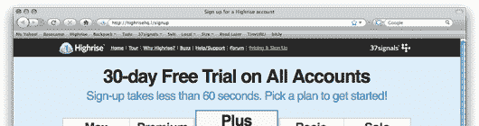

Highrise A/B Test Headline 2

如你所见，对你的标题做一点小小的调整会对你的转换率产生巨大的影响。这是你应该一直 A/B 测试的东西！毕竟，一切都取决于标题:它要么鼓励访问者点击和阅读文章，要么让他们感到厌烦，从而使他们回头。由于写标题是一门特殊的“艺术”，花几分钟时间和你的团队/编辑就每篇文章的标题进行头脑风暴是一个明智的决定。有一些明显的要求，如简洁，清晰，一致。然而，我相信我们还能在一件事上达成一致:独一无二是最重要的。

以下是内容营销研究所对 150，000 条标题进行的[分析得出的一些额外数据，你可能会感兴趣:](http://contentmarketinginstitute.com/2011/06/headline-click-through-rate/)

*   一个八个字的标题表现最好。这些书的点击率比平均水平高 21%。
*   标题中的冒号或连字符——表示副标题——**比没有冒号或连字符的标题表现好 9%**。
*   含有奇数的标题比含有偶数的标题点击率高 20%。

那么，你如何着手撰写独特的标题呢？想象你的读者有一个感兴趣的领域(幸运的是，这是你的专长/产品)，因此，他们阅读了很多这个主题。试想一下，如果他们阅读了在其他地方看到的相同的标准标题，他们会点击你的文章吗？不。他们会认为他们已经读过了，他们会直接跳过。

这就是头脑风暴值得努力的原因:你在列表中写下的版本越多，你在列表末尾会有越多不寻常的想法。

你也可以利用免费工具，如 CoSchedule 的[标题分析工具](https://coschedule.com/headline-analyzer)来快速改善你的标题。我们最初的博文名为“11 个极具影响力的转化率优化技巧”，得分为 46。在几个变化之后，我们能够通过添加一些更多的情感和力量词汇轻松地将这个分数提高到 67 分。

这当然是基于他们自己的评分系统，不过，如果你使用这个工具，你突然开始注意到，你的头条立即变得更加诱人，你应该看到更好的 CTR。强迫自己使用这个工具的一大好处是，它只会让你花时间去创建变体，而这在其他情况下是不可能做到的。

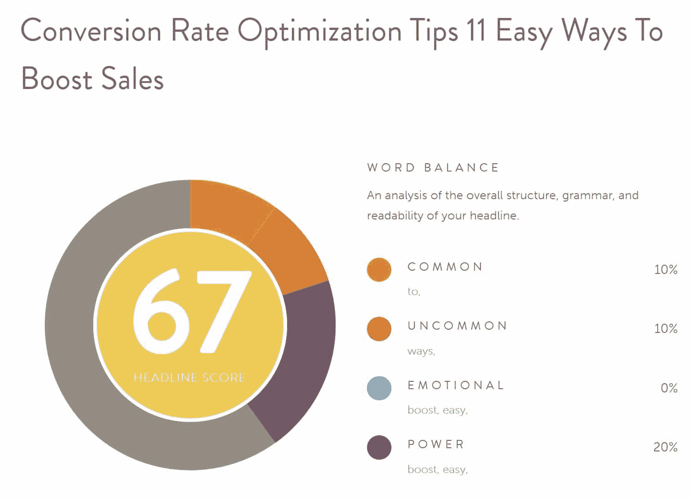

CoSchedule Headline Analyzer

如果你想不出替代的单词，一个快速的方法是打开[thesaurus.com](http://www.thesaurus.com/)，查找你已经在使用的单词的同义词。
T3】

### 2。战略 CTA(按钮、弹出窗口、价格表)

登陆页面有一个目的——从你的观众那里获得一些东西。无论是[领导一代](https://kinsta.com/blog/b2b-lead-generation/)还是[建立一个电子邮件订户列表](https://kinsta.com/blog/how-to-build-an-email-list/)，联系方式或者更重要的销售。通过使用 CTA——行动号召，你可以宣传这样一个目的，并**指导你的访问者以特定的方式行动**。使用战略 CTA 并对其进行适当的定位可能是决定你是否能提高转化访客数量的决定性因素。

那么你应该把 CTA 放在哪里呢？根据谷歌的研究，最容易看到的位置是在折叠的正上方，而不是在页面的顶部。

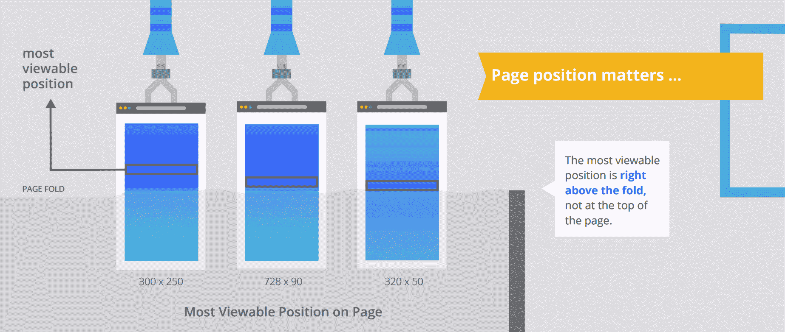

Most viewable position on a webpage

Hubspot 也注意到了这一点，他们的[锚文本 CTA 的](https://blog.hubspot.com/marketing/blog-anchor-text-call-to-action-study#sm.000008kgp4fsefe3js7zfpyoce0dj)。在他们追踪的每一篇帖子中，锚文本 CTA 在该帖子的线索中所占比例最大。47%到 93%的帖子线索来自锚文本 CTA。注意，在下面，它们就在折叠的正上方。同样重要的是，要考虑这对移动设备的影响。在移动设备上，大多数访问者肯定会看到前几段中的 CTA。

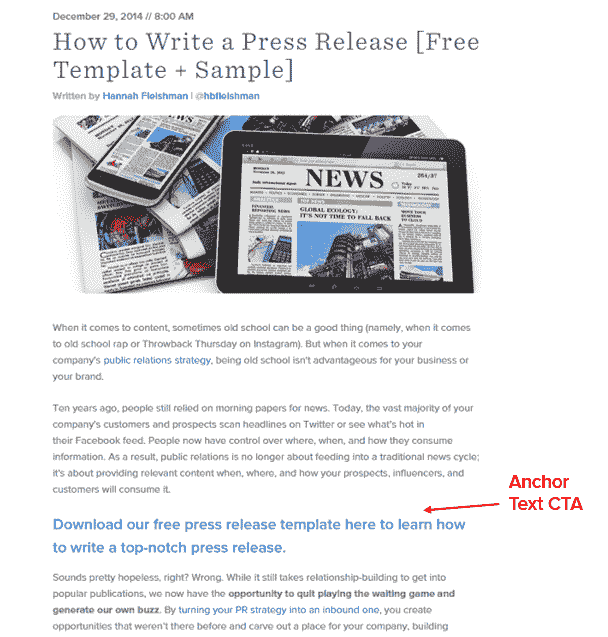

In-line anchor text CTA

[Grow & Convert](http://www.growandconvert.com/conversion-rate-optimization/blog-conversion-strategy/) 也做了一些研究，试图绘制出网站的不同区域。他们估计了某些 CTA 位置的转换率:

*   侧栏:0.5%至 1.5%
*   通用，离职后:0.5–1.5%
*   弹出窗口:1–8%
*   滑块和条:1–5%
*   欢迎门:10–25%
*   特征框:3–9%
*   导航条:各不相同

一个有趣的发现是，你的 WordPress 网站上的侧边栏可能没有你想象的那么重要。Impact 移除了他们博客上的侧边栏,代之以内嵌的 CTA。你猜怎么着？这导致注册人数增加了 71%。所以这绝对是你应该测试的东西，因为每个企业和网站都是不同的。

说到 CTA，有各种不同的种类，比如弹出窗口、按钮、内嵌锚文本、价格表等等。下面是几个你可能想看看的受欢迎的。

#### **弹出表单**

当谈到可用性和有效性时，弹出窗口可能会引起争议。你可能已经在热门网站上看到过它们，比如[quick prout](http://www.quicksprout.com/ "QuickSprout")、 [SocialTriggers](http://socialtriggers.com/ "SocialTriggers") 和 [IncomeDiary](http://www.incomediary.com/ "IncomeDiary") 。当访问者登陆这些网站时，几秒钟内就会弹出要求访问者采取行动的表格。这些弹出表单吸引访问者，并有助于提高社交意识、获取订户、促销折扣和即将推出的优惠。

大多数研究表明，弹出窗口实际上工作得很好，实际上并不像你想象的那样影响跳出率。知名社交媒体战略家丹·扎雷拉在他的个人页面上测试了有无弹出窗口。

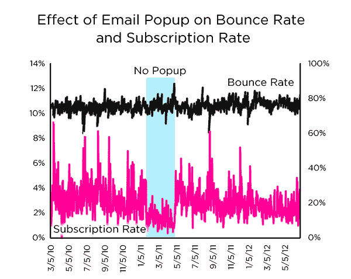

Effect of email popups on bounce rate

令人惊讶的是，带有弹出窗口的版本并没有对他的跳出率产生太大的影响。然而，没有弹出窗口的版本减少了超过 50%的注册。因此，在这种情况下，通过查看数据，使用弹出窗口是有意义的。然而，每个行业可能会有所不同，也许你不想在你的网站上使用弹出窗口，因为大多数人可能会同意，它们有点烦人，并否定了用户体验。

如果你确实想使用弹出窗口，有一些简单的方法可以用 [WordPress 线索生成插件](https://kinsta.com/blog/wordpress-lead-generation/)快速实现。下面是一些你可能想考虑的流行的:

*   [SumoMe](https://wordpress.org/plugins/sumome/)
*   [茁壮成长线索](https://thrivethemes.com/leads/)
*   [绽放](https://www.elegantthemes.com/plugins/bloom/)
*   [弹出支配](http://popupdomination.com/ "Popup Domination")

事实上，我们在 Kinsta 的博客上使用了 Bloom 插件的飞进弹出窗口。如果你将这篇文章向下滚动 50%,你可以看到它的效果。这对于用户体验来说没那么烦人，但仍然提供了一种吸引读者注意力的方式。请记住，谷歌基本上不再允许在移动设备上弹出，你可能会因此受到惩罚。

Fly-in bottom right CTA

您也可以使用[推送通知](https://kinsta.com/blog/wordpress-push-notifications/)。在我们添加它的一个网站上，我们在不到 48 小时内(见下文)就有**超过 140 个推送通知订户。请记住，即使你没有亲自订阅通知，这并不意味着这就是你的访客的想法。不要以为推广你的 WordPress 网站时，测试是获得具体数据的最佳方式。**

#### **按钮**

按钮也是非常有效的 CTA。通常，许多登录页面使用 ***立即购买*** 按钮作为其 CTA。虽然这很棒，但你应该尝试为你的特定登录页面创建定制的按钮。它可以大小不一，使用更吸引人的 CTA 文本或包含多种颜色。

SAP 发现橙色[将他们的转化率提高了 32.5%](https://cdmginc.com/2017/08/22/testing-buttons/) 。Performable 发现，红色将他们的[转化率提高了 21%](http://blog.hubspot.com/blog/tabid/6307/bid/20566/The-Button-Color-A-B-Test-Red-Beats-Green.aspx) 。

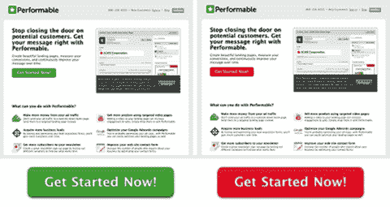

CTA button colors can affect conversion rates

你的按钮的副本也可以极大地影响转换。Unbounce [通过调整按钮副本中的一个单词来执行测试](http://unbounce.com/conversion-rate-optimization/design-call-to-action-buttons/)。他们把“你”改成了“我的”运行测试三周后，他们发现点击率提高了 90%！

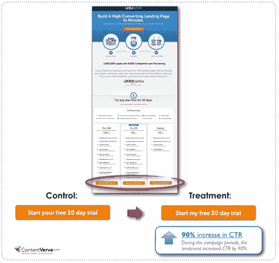

CTA button copy does matter

通过反复试验，找到完美的按钮可以彻底增加你的销售和转化。

#### **定价表**

定价表被视为 CTA，因为它们允许您在一个表中推销不同的服务，以及在与其他服务相比较的情况下促销特定的套餐。

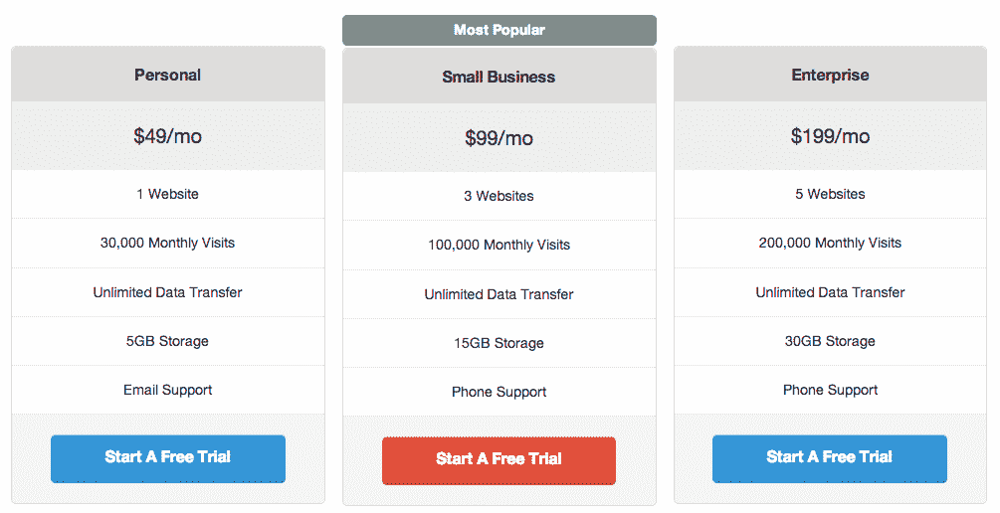

Pricing tables can be great CTA’s

这里有一些流行的免费插件，可以在你的 WordPress 网站上获得高质量的价格表:

*   [定价表构建器–简易定价表](https://wordpress.org/plugins/easy-pricing-tables/)
*   [定价表](https://wordpress.org/plugins/tc-pricing-table/)
*   [价格表生成器](https://wordpress.org/plugins/price-table-builder/)

我们还强烈推荐阅读 Neil Patel 的文章，了解提高行动号召的其他[方法](https://www.quicksprout.com/2013/03/14/click-here-11-ways-to-improve-your-call-to-actions/)。
T3】

### 3。简单导航

**导航是转化的一个关键方面**。虽然你可能没有意识到，你收到的直接交通到你的登陆页面不是唯一的交通你应该迎合。相反，[你的网站导航越简单](https://kinsta.com/blog/website-navigation/)，你的网站周围的访问者就越有可能回到你的登陆页面并采取行动。

你还应该考虑是否应该在你的登陆页面上使用**导航链接。VWO 对雅皮士做了一些测试。在删除了登陆页面上的导航菜单后，他们的转化率从 3%增加到了 6%，或者说转化率提高了 100%!**

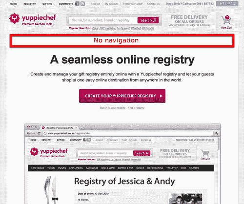

Remove navigation links on landing page

*   利用文章中的入站链接[增加你登陆页面的流量](https://kinsta.com/blog/how-to-drive-traffic-to-your-website/)。
*   创建一个[定制菜单](https://kinsta.com/blog/wordpress-menu-plugins/)，该菜单与众不同，包含易于理解的导航术语。
*   添加流行的链接到你的侧边栏或内嵌的锚定 CTA，将流量导向你的重要页面。
*   通过方向箭头和文本将您的销售线索引向 CTA。

### 4。页面加载速度

页面加载速度对你的 WordPress 站点转换的好坏起着重要的作用。现在是 2018 年，没有人再有耐心了。我们都希望东西能在一瞬间加载，如果没有，我们做的第一件事就是点击后退按钮。简单来说，你的网站越快，一般来说，你的转化率也会跟着提高。不要只相信我们的话，这里有一些数据:

*   对于像亚马逊这样的大型在线商家来说，页面加载时间每延迟一秒钟都可能导致每年 16 亿美元的损失。
*   当 Mozilla 将页面速度提高 2.2 秒时，Firefox 的下载量增加了 15.4%，即每年 1000 万次。
*   沃尔玛的页面加载速度每提高 1 秒，转化率就会提高 2%。数字不会说谎！
*   根据 Kissmetrics 的数据，页面响应延迟 1 秒会导致转化率下降 7%。

Soasta 进行了一项研究,发现在移动页面上，快 1 秒的体验可以提高 27%的转化率。

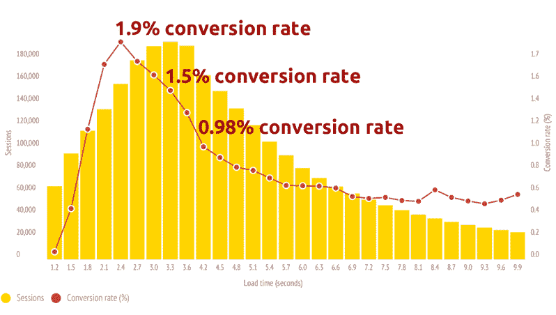

Faster mobile websites convert more

降低页面加载速度最简单的方法之一是使用快速的 WordPress 主机。在 Kinsta [这里，我们专注于高性能的 WordPress 网站](https://kinsta.com/clients/),可以处理你扔给我们的任何负载。我们已经轻松地处理了超过 60k+并发连接的客户。许多人甚至看到，仅仅通过迁移，页面加载时间就减少了 45%!

> 感谢 [@kinsta](https://twitter.com/kinsta?ref_src=twsrc%5Etfw) 帮助 [@DARTdrones](https://twitter.com/DARTdrones?ref_src=twsrc%5Etfw) 准备我们 [@ABCSharkTank](https://twitter.com/ABCSharkTank?ref_src=twsrc%5Etfw) 的交通。还增加了 50%以上的网站页面负载
> 
> —凯文·麦卡龙(@ kevinmcaloon)[2017 年 2 月 27 日](https://twitter.com/kevinpmcaloon/status/836264968291037188?ref_src=twsrc%5Etfw)