# 如何为谷歌的核心网站要害优化你的网站

> 原文：<https://kinsta.com/blog/core-web-vitals/>

谷歌的使命是提高核心网站的性能。为什么？因为谷歌的业务主要是基于网络的——缓慢的网站和网络应用将用户推回到本地应用。

你在谷歌搜索结果中的排名很大程度上取决于搜索词的关键词，这些关键词在你的页面中的使用，以及你的页面根据来自其他地方的链接的数量(和质量)的受欢迎程度。从 2021 年 8 月起，谷歌也在努力根据表现来评估页面。

这篇文章将向你展示如何为谷歌的核心网站指标优化你的网站。

## 为什么选择核心网站？

内容仍然至关重要。但是，如果你比较两个文本和受欢迎程度相似的网站，提供最佳网络体验的网站将在谷歌搜索结果中获得更高的优先级。

除了提高页面排名之外，高性能网站也有资格加入移动搜索轮播。这之前是为[加速移动页面(AMP)](https://kinsta.com/blog/google-amp/) 保留的，它要求你将内容导入一个独立的谷歌托管的网站。AMP 招致了批评，尤其是因为网页并不总是比优化良好的 WordPress 或静态网站更快。然而，[这不再是](https://developers.google.com/search/blog/2021/04/more-details-page-experience)的要求了。

无论你选择什么，你的网站越快，响应越快，它在谷歌搜索结果中排名越高的机会就越大。

当您考虑到平均页面大约为 2 MB，发出 60 多个 HTTP 请求，在移动设备上完全呈现需要 16 秒时，您会发现您的站点还有改进的余地。我们将向您展示实现这些改进的最佳方式。


## 谷歌的关键排名因素

在开始评估绩效之前，需要检查四个关键的排名因素:

1.  **HTTPS:** [HTTPS](https://kinsta.com/blog/http-to-https/) 必不可少。你的网站在用户的浏览器和网络服务器之间建立了安全的连接吗？
2.  移动友好性:你的网站必须在移动设备上运行良好。你的网站可以在小屏幕设备上使用吗？它渲染时没有内容溢出吗？文字够大吗？可点击区域对于触摸控制来说足够了吗？
3.  **无空隙:**避免侵入性空隙，这需要不合理的屏幕空间。你的内容总是可读的吗？是否被弹出的间隙或横幅部分遮挡？你的广告或营销推广使网站难以使用吗？
4.  **安全浏览:**您的网站应该[没有恶意软件](https://kinsta.com/knowledgebase/the-site-ahead-contains-malware/)、病毒、网络钓鱼、欺诈和其他骗局。

一旦你满足这些要求，你的网站将被评估性能。

[你的网站越快、反应越快，就越有可能战胜竞争对手。💪 点击推文](https://twitter.com/intent/tweet?url=https%3A%2F%2Fkinsta.com%2Fblog%2Fcore-web-vitals%2F&via=kinsta&text=The+faster+and+more+responsive+your+site%2C+the+better+chance+it+has+against+competitors.+%F0%9F%92%AA&hashtags=CoreWebVitals%2CSEO)

## 谷歌如何评估 Web 性能？

让你的网站快速加载、快速渲染、快速响应是至关重要的。但是对用户来说感觉快吗？

[性能测量应用](https://kinsta.com/blog/performance-testing-tools/)如浏览器开发工具报告技术测量，如:

1.  **阻塞时间:**等待下载开始所花费的时间，通常是因为样式表和脚本等其他资产具有更高的优先级。
2.  **DNS 解析:**将主机名解析为 IP 地址以检索资产的时间。
3.  **连接时间:**初始化 TCP 连接的时间。
4.  **到达第一个字节的时间(TTFB):** 请求和响应的第一个字节之间的总时间。
5.  **接收时间:**检索整个资产的时间。
6.  **DOM 加载时间:**下载并渲染 HTML 文档对象模型的时间。这通常是分析或修改 DOM 的脚本能够可靠运行的第一点。
7.  **页面加载时间:**下载页面和所有资产(如图像、样式表、脚本等)的时间。
8.  **总页面权重:**所有资产的总大小。它通常以压缩(下载)大小和未压缩大小报告。
9.  **DOM 元素数量:**页面上 [HTML 元素的总数](https://kinsta.com/blog/html-best-practices/)。元素越多，页面处理的时间就越长。
10.  **第一个内容绘制(FCP):** 浏览器渲染第一个内容像素所用的时间。
11.  **第一次有意义的绘画(FMP):** 主页面内容对用户可见之前所用的时间。
12.  **交互时间(TTI):** 页面完全交互并可靠地响应用户输入所需的时间。
13.  **第一次 CPU 空闲:**CPU 渲染页面并运行所有初始化脚本，等待进一步输入的时间。
14.  **CPU 使用率:**呈现页面和响应用户输入时所需的处理活动。
15.  **每秒布局数:**浏览器重新计算样式和页面布局的速度。

这些可以用来确定具体的瓶颈，如服务器负载、 [CMS 缓存](https://kinsta.com/blog/wordpress-caching-plugins/)、浏览器缓存、下载速度和 [JavaScript](https://kinsta.com/knowledgebase/what-is-javascript/) 效率。但是他们不能决定一个页面提供的用户体验是好是坏。例如:

*   一个应用程序可以快速下载和显示，但在第一次交互后就变得没有响应，因为它正在执行大量未经优化的 JavaScript 代码。
*   当用户发布消息时，聊天应用程序可以持续下载数据。评估工具可能会认为它从未完成加载，尽管页面感觉响应良好。

核心网络要害是谷歌试图解决这些困境。


## 什么是核心网站生命？

谷歌的核心 Web Vitals (CWV)是评估现实世界用户体验的三个性能指标:

*   **最大含量油漆(LCP):** 装载性能
*   **第一输入延迟(FID):** 交互性能
*   **累积布局偏移(CLS):** 视觉稳定性表现

这一新的[谷歌算法更新](https://kinsta.com/blog/decline-seo-rankings/)已于 2021 年 8 月底开始在全球推出。核心的网络生命指标主要影响移动搜索结果，但如果实验成功，桌面搜索结果也会随之而来。

一个页面的 LCP、FID 和 CLS 评分是基于过去 28 天通过 Chrome 浏览器匿名收集的真实用户指标。这些测量值可能会因用户的设备、连接和其他并发活动而异，因此计算的是第 75 个百分点，而不是平均值。

换句话说，所有用户的指标从最好到最差排序，取四分之三点的数字。因此，四分之三的网站访问者将体验到这种或更好的性能。

任何在所有三个核心网络生命指标上获得良好(绿色)分数的页面都将在搜索结果中获得更高的排名，并被列入谷歌新闻应用程序的“头条新闻”转盘中。

在下面几节中，我们将描述用于计算指标的算法、可用于确定页面得分的工具、得分低的典型原因，以及可用于解决性能问题的步骤。

## 最大含量涂料(LCP)

最大内容油漆测量[装载性能](https://kinsta.com/learn/page-speed/)。本质上，可用内容在页面上呈现的速度有多快？

LCP 分析最大的图像或文本块在浏览器视窗(折叠上方)中变得可见需要多长时间。在大多数情况下，最突出的项目将是一个英雄形象，横幅，标题，或大文本块。

以下任何元素都有资格进行最大含量涂料分析:

*   图像(``元素)
*   矢量图形内部的图像(嵌入到`<svg>`中的`<image>`
*   视频缩略图(海报属性设置为`<video>`元素中的图像 URL)
*   带有背景图像的元素(通常使用 CSS `background-image url()`属性加载)
*   包含文本的块级元素

在页面加载的前 2.5 秒内完成最大内容绘制的页面被认为是好的(绿色)。超过 4.0 秒的页面被视为差页面(红色):

[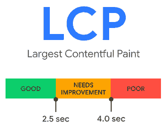](https://kinsta.com/wp-content/uploads/2021/08/lcp-rank.png)

Largest Contentful Paint.


### 最大的内容丰富的油漆分析工具

LCP 是最容易理解的核心 Web 生命指标，但选择哪个元素进行分析可能并不明显。

DevTools **Lighthouse** 面板在基于 Chrome 的浏览器中提供，如 Chrome、Edge、 [Brave](https://kinsta.com/blog/brave-browser-review/) 、Opera 和 Vivaldi。从浏览器菜单打开 DevTools 通常在**更多工具** > **开发者工具**或键盘快捷键 **Ctrl | Cmd + Shift + i** 或**F12**——然后导航到 **Lighthouse** 选项卡(旧版本可能将其命名为 **Audit** )。

生成移动性能报告，然后检查生成的**性能**部分。最大内容丰富的绘画时间用可扩展部分显示，它标识所选的元素:

[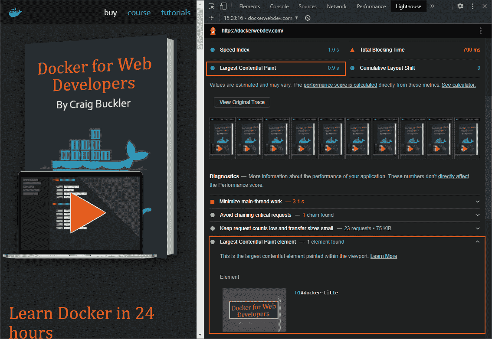](https://kinsta.com/wp-content/uploads/2021/08/devtools-lcp-lighthouse.png)

DevTools Lighthouse Mobile Performance report.


如果你不能使用基于 Chromium 的浏览器，你可以在网上的 [PageSpeed Insights](https://developers.google.com/speed/pagespeed/insights/) 和 [web.dev Measure](https://web.dev/measure/) 工具中生成相同的信息:

[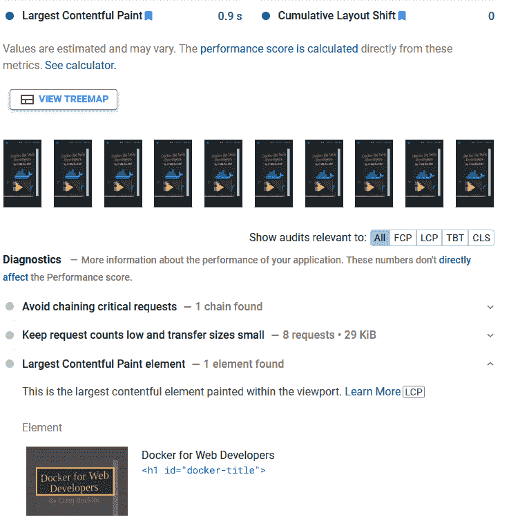](https://kinsta.com/wp-content/uploads/2021/08/pagespeed-lcp.png)

PageSpeed Insights Largest Contentful Paint analysis.


DevTools **性能**面板也显示一个 LCP 指示器。首先，点击圆形的**记录**图标，重新加载您的页面，然后点击**停止**按钮查看报告。单击**计时**部分中的 LCP 图标，以识别元素并查看统计信息摘要。

[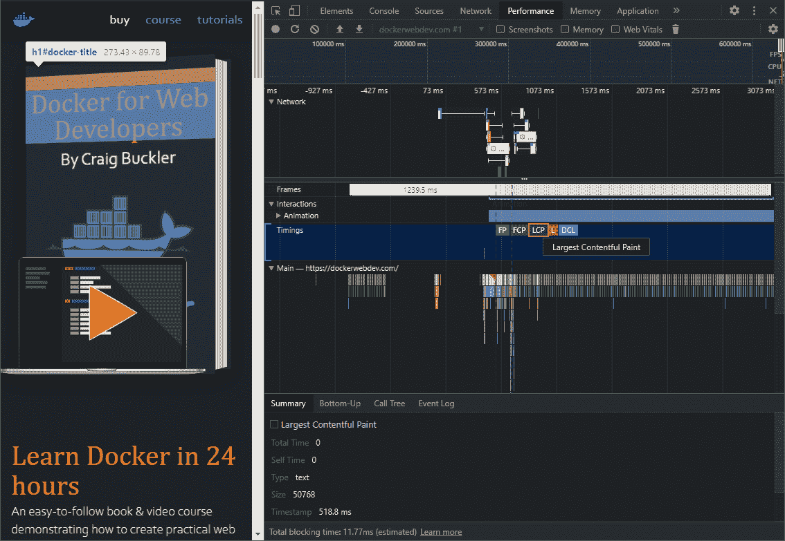](https://kinsta.com/wp-content/uploads/2021/08/devtools-lcp-performance.png)

DevTools Performance panel LCP indicator.


Web Vitals 扩展可用于谷歌 Chrome 浏览器，但可以安装在大多数基于 Chrome 的浏览器上。它会计算你访问的每个网站的核心网络生命指标，其图标会根据结果变成绿色、橙色或红色。您也可以单击扩展图标查看更多 LCP 详细信息:

[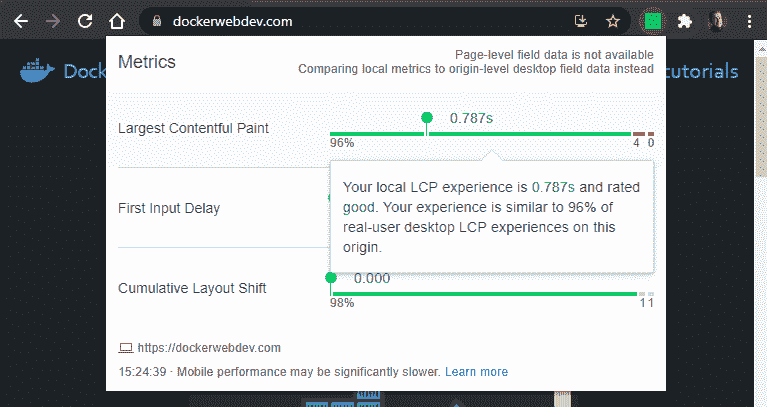](https://kinsta.com/wp-content/uploads/2021/08/addon-lcp.png)

Web Vitals extension LCP.


如果你的网站[被添加为一个属性](https://kinsta.com/blog/google-site-verification/)，谷歌的搜索控制台现在会提供一个[核心网站重要部分](https://search.google.com/search-console/core-web-vitals)。该报告说明了 CWV 指标如何随着时间的推移而变化。请注意，它并不确定具体的 LCP 指标，只有流量相当高的网站才可用:

[](https://kinsta.com/wp-content/uploads/2021/08/console-lcp.png)

Google Search Console Core Web Vitals.


Chrome 用户体验报告允许你查询真实的使用统计数据，包括不同国家、不同连接和不同设备的 LCP。这是谷歌 BigQuery 上的一个公共项目，所以你必须注册一个[谷歌云平台](https://kinsta.com/blog/google-cloud-network/)账户，并提供账单详情。同样，只有当一个 URL 有相当高的流量时，这个报告才有用。

最后， [web-vitals JavaScript 库](https://github.com/GoogleChrome/web-vitals)是一个 1 kB 的小脚本，可以计算 LCP 和其他真实用户的核心 web 生命指标。因为它可以从 CDN 下载，所以您可以将以下脚本添加到您的 HTML `<head>`中:

```
<!DOCTYPE html>
<html lang="en">
<head>
<meta charset="UTF-8">
<title>My page</title>
<script type="module">
import { getLCP } from 'https://unpkg.com/web-vitals?module';
getLCP(console.log);
</script>
<!-- rest of page --> 
```

`getLCP()`是一个异步函数，当计算出 LCP 值时，向其传递一个触发的回调(尽管如果页面在后台选项卡中加载，它可能永远不会触发)。回调函数被传递一个对象，该对象包含:

*   **`name` :** 度量的名称(本例中为“LCP”)
*   **`value` :** 计算出的值
*   **`id` :** 代表当前页面指标的唯一 ID
*   **`delta` :** 当前值和上次报告值之间的差值
*   **`entries` :** 用于值计算的条目数组

上面的脚本将对象输出到控制台，尽管更实际的做法是将数据发送到服务器或 [Google Analytics](https://kinsta.com/blog/how-to-use-google-analytics/) 进行进一步分析。

## 注册订阅时事通讯


### 想知道我们是怎么让流量增长超过 1000%的吗？

加入 20，000 多名获得我们每周时事通讯和内部消息的人的行列吧！

[Subscribe Now](#newsletter)

### 最大内容油漆得分低的常见原因

LCP 分数低通常是由于页面加载速度慢导致最大的块无法快速显示:

*   服务器响应可能会很慢，因为它超载或做了太多工作来呈现页面。这不一定是你网站的错——如果你使用的是[共享主机服务](https://kinsta.com/blog/cheap-wordpress-hosting/)，这可能是由于服务器的限制。
*   如果在主要内容之上的 HTML 中引用呈现阻塞 CSS 和 JavaScript，它们会延迟页面加载。
*   其他资源，如大图像和视频会减少可用带宽并花费更长的时间来渲染。
*   在客户端而不是服务器上生成的页面内容也需要更长的时间才能出现。

### 如何提高最有内容的绘画分数

彻底的审计可以发现加载问题，但这通常是减少发送到浏览器的数据量的问题。以下提示将有助于获得更健康的 LCP 分数:

1.  [升级您的服务器和/或托管服务](https://kinsta.com/wordpress-hosting/)。确保下载速度保持快速，即使在高使用率的时候。
2.  激活服务器压缩和 HTTP/2+。没有理由不这样！
3.  [减少服务器工作量](https://kinsta.com/learn/speed-up-wordpress/)。移除不用的代码和 CMS 插件，然后[启用有效缓存](https://kinsta.com/blog/wordpress-cache/)。
4.  确保浏览器能够有效缓存文件。在 HTTP 头中设置适当的[过期](http://www.w3.org/Protocols/rfc2616/rfc2616-sec14.html#sec14.21)、[最后修改](http://www.w3.org/Protocols/rfc2616/rfc2616-sec14.html#sec14.29)和/或 [ETag 哈希](http://en.wikipedia.org/wiki/HTTP_ETag)，这样文件就不会被再次请求。
5.  使用[内容交付网络(CDN)](https://kinsta.com/blog/wordpress-cdn/) 在地理上更靠近用户的服务器上分割负载和主机资产。
6.  通过使用内置于 [MyKinsta 仪表板](https://kinsta.com/mykinsta/)中的[代码缩减功能](https://kinsta.com/help/kinsta-cdn-code-minification)，提升您的整体优化。
7.  [优化您的图像](https://kinsta.com/blog/optimize-images-for-web/)。将它们缩小到最小的尺寸，并使用适当的格式来最小化文件大小。确保尽可能早地请求最大内容块中的任何图像；一个[预载](https://developer.mozilla.org/docs/Web/HTML/Preloading_content)可能会有所帮助。
8.  通过添加一个`loading="lazy"`属性来延迟加载图像。添加宽度和高度属性，以确保在图像完成加载之前在页面上保留适当的空间。
9.  尽量减少第三方请求，并考虑将资产移动到您的主域，以避免无关的 DNS 查找。
10.  最小化请求文件的数量和大小，尤其是在 HTML 的顶部。
11.  确保只加载所需的 web 字体。切换到[网页安全字体](https://kinsta.com/blog/html-fonts/)以获得最佳性能。
12.  移除未使用的 JavaScript 和 CSS 文件。
13.  连接和缩小你的 JavaScript 和 CSS 文件。
14.  避免 CSS @import 语句——它们是渲染阻塞和串行加载样式。
15.  避免 Base64 编码—它会增加文件大小并需要额外的处理。
16.  考虑关键的内联 CSS。在页面顶部的``块中嵌入基本的“折叠之上”CSS，然后异步加载更多的样式表。
17.  稍后使用异步、延迟或 ES 模块 JavaScript 运行脚本。在服务工作者中执行长时间运行的 JavaScript 流程。

## 第一输入延迟(FID)

首次输入延迟衡量页面的响应速度。本质上，它对用户动作的响应速度有多快，比如点击、轻击和滚动？

FID 度量是指用户交互和浏览器处理其请求之间的时间。它不测量运行处理函数的时间，处理函数通常会处理输入并更新 DOM。

FID 时间小于或等于 100 毫秒的页面被认为是好页面(绿色)。超过 300 毫秒的页面被视为差页面(红色):

[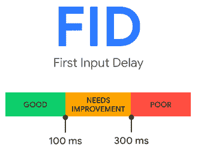](https://kinsta.com/wp-content/uploads/2021/08/fid-rank.png)

First Input Delay.


### 第一个输入延迟分析工具

第一次输入延迟是不可能模拟的，因为它只能在页面被提供给与页面交互的实际用户时测量。因此，结果取决于每个设备的处理器速度和能力。

未在 DevTools Lighthouse 面板或 [PageSpeed Insights](https://developers.google.com/speed/pagespeed/insights/) 中计算 FID。但是，它们可以确定总阻塞时间(TBT)。这是第一个输入延迟的合理近似值。它测量以下时间之间的差异:

1.  第一个内容丰富的绘画(FCP)，或页面内容开始呈现的时间，以及
2.  交互时间(TTI)，或者页面可以响应用户输入的时间。当没有长时间运行的任务处于活动状态，并且尚未完成的 HTTP 请求少于三个时，假定为 TTI。

[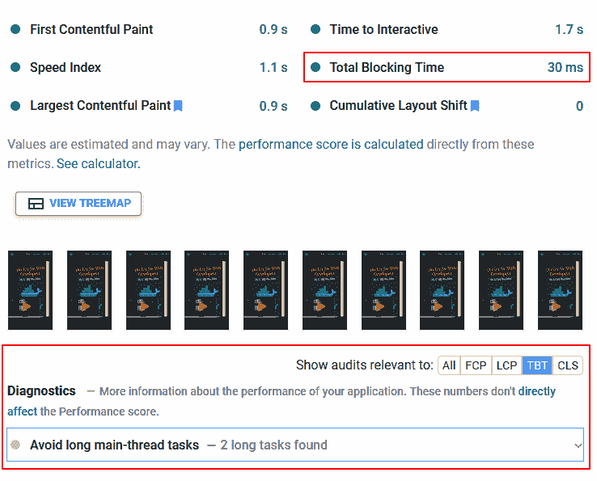](https://kinsta.com/wp-content/uploads/2021/08/pagespeed-fid.png)

PageSpeed Insights Total Blocking Time.


Google Chrome 的 [Web Vitals 扩展](https://chrome.google.com/webstore/detail/web-vitals/ahfhijdlegdabablpippeagghigmibma)也可以在通过滚动或点击与页面交互后显示 FID 指标。单击扩展的图标以显示更多信息:

[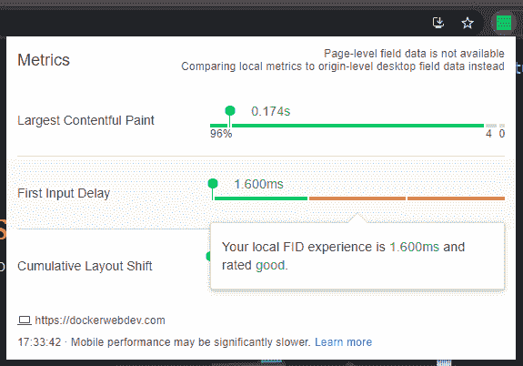](https://kinsta.com/wp-content/uploads/2021/08/addon-fid.png)

Web Vitals extension FID.


和 [LCP](https://docs.google.com/document/d/1vAP3ex3G8vfeAmIkT-6Rdchvdv_7mQy3-P5EnXPLiI8/edit#heading=h.7fow01wzb9wj) 一样， [Chrome 用户体验报告](https://developers.google.com/web/tools/chrome-user-experience-report/)允许你查询特定 URL 在不同国家、连接和设备上记录的真实 FID 统计数据。

[web-vitals JavaScript 库](https://github.com/GoogleChrome/web-vitals)还可以计算你的实时网站上真实用户的 FID 指标。您可以将以下脚本添加到 HTML `<head>`中，以将 FID 指标输出到回调函数:

厌倦了低于 1 级的 WordPress 托管支持而没有答案？试试我们世界一流的支持团队！[查看我们的计划](https://kinsta.com/plans/?in-article-cta)

```
<!DOCTYPE html>
<html lang="en">
<head>
<meta charset="UTF-8">
<title>My page</title>
<script type="module">
import { getFID } from 'https://unpkg.com/web-vitals?module';
getFID(console.log);
</script>
<!-- rest of page --> 
```

### 首次输入延迟分数低的常见原因

FID 和 TBT 分数低通常是由占用处理器的客户端代码造成的，例如:

*   大量呈现阻塞的 CSS 和 JavaScript，在下载和解析代码时暂停页面加载
*   加载页面时立即运行的大型进程密集型脚本
*   长时间运行或优化不佳的 JavaScript 任务

默认情况下，浏览器运行在单线程上，一次只能处理一个任务。如果一个 JavaScript 函数需要一秒钟来执行，那么在这一秒钟内所有其他的渲染进程都会被阻塞。页面不能对用户输入做出反应、更新 DOM、显示动画等等。甚至 GIF 动画在老版本的浏览器中也可以被屏蔽。

### 如何提高首次输入延迟分数

客户端 JavaScript 审计可以识别问题，但通常是删除冗余代码并确保任务快速执行的问题。

以下提示将有助于获得更健康的 FID 分数:

1.  [在服务器上生成并缓存](https://kinsta.com/blog/wordpress-cache/)尽可能多的静态 HTML 内容。尽量不要依赖客户端 JavaScript 框架为每个人呈现相同的 HTML。
2.  确保浏览器能够有效缓存文件。在 HTTP 头中设置适当的[过期](http://www.w3.org/Protocols/rfc2616/rfc2616-sec14.html#sec14.21)、[最后修改](http://www.w3.org/Protocols/rfc2616/rfc2616-sec14.html#sec14.29)和/或 [ETag 哈希](http://en.wikipedia.org/wiki/HTTP_ETag)，这样文件就不会被再次请求。
3.  采用渐进式增强技术，这样在 JavaScript 运行之前，界面就可以在 HTML 和 CSS 中使用了。
4.  移除未使用的 JavaScript 和 CSS 文件。
5.  连接和缩小你的 JavaScript 和 CSS 文件。
6.  避免过度使用昂贵的 CSS 属性，如框阴影和过滤器。
7.  稍后使用异步、延迟或 ES 模块 JavaScript 运行脚本。
8.  尽量减少第三方 JavaScript 对分析、社交媒体部件、论坛等的请求。这些可以快速装载高达几兆字节的 JavaScript。
9.  按需延迟加载 JavaScript 组件，例如聊天工具、视频播放器等。
10.  延迟加载不太重要的脚本，如分析、广告和社交媒体工具。
11.  将长时间运行的 JavaScript 任务分解成一系列较小的作业，这些作业在短暂的 [requestIdleCallback](https://developer.mozilla.org/docs/Web/API/Window/requestIdleCallback) 、 [setTimeout](https://developer.mozilla.org/docs/Web/API/WindowOrWorkerGlobalScope/setTimeout) 或 [requestAnimationFrame](https://developer.mozilla.org/docs/Web/API/window/requestAnimationFrame) 延迟后执行。
12.  考虑在使用后台线程的 [web worker](https://developer.mozilla.org/docs/Web/API/Web_Workers_API/Using_web_workers) 中执行长时间运行的 JavaScript 流程。

## 累积布局偏移(CLS)

CLS 衡量网页的视觉稳定性。从本质上讲，页面内容是否会意外移动或跳转，尤其是在初始加载期间？

当元素在没有警告或用户交互的情况下移动时，CLS 会计算分数。当你在移动设备上阅读一篇文章时，你可能经历过这种情况——文本突然跳出屏幕，你失去了你的位置。最糟糕的例子可能会导致你点击一个不正确的链接。

当大图像或广告加载到当前滚动位置之上，零高度空间瞬间增长几百个像素时，CLS 问题最为突出。

累积布局偏移分数通过将以下指标相乘来计算:

*   **影响分数:**这是视口中所有不稳定元素的总面积，即那些将“跳跃”的元素如果在页面加载过程中，覆盖 60%视区的元素发生位移，影响分数为 0.6。请注意，导致这种移动的元素(如图像或广告)被认为是稳定的，因为它们在渲染后不一定会移动。
*   **距离分数:**这是视窗中任何单个不稳定元素移动的最大距离。如果最大位移发生在从 0，100 移动到 0，800 的元素上，则它已经移动了 700 个垂直像素。如果设备视口的高度为 1，000 px，则距离分数为 700 px / 1000 px = 0.7。因此，计算的累积布局偏移分数为 0.6 x 0.7 = 0.42。

谷歌对 CLS 指标进行了修改，以适应以下情况:

*   布局偏移被分组为持续五秒钟的“会话”,但是如果没有进一步的布局偏移发生，则一秒钟后关闭。如果在一秒钟内出现两次或两次以上的移动，他们的得分相加。
*   在用户交互(如点击)后的 500 毫秒内，不会记录布局变化。在某些情况下，这会触发 DOM 更新(例如，打开菜单、显示错误消息、显示模式对话框等。).
*   长时间保持打开并进行大量 DOM 更新的单页面应用程序不会受到负面影响。

CLS 分数为 0.1 或更低的页面被认为是好的(绿色)。超过 0.25 的页面被视为差(红色):

[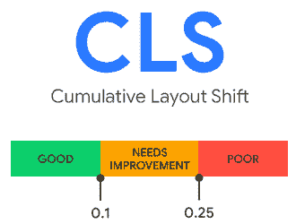](https://kinsta.com/wp-content/uploads/2021/08/cls-rank.png)

Cumulative Layout Shift.


### 累积布局偏移分析工具

CLS 指标是在 DevTools **Lighthouse** 面板、 [PageSpeed Insights](https://developers.google.com/speed/pagespeed/insights/) 和 [web.dev Measure](https://web.dev/measure/) 工具中计算的:

[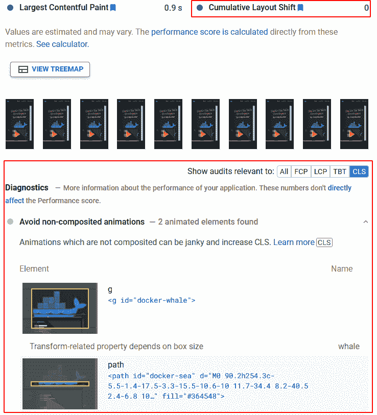](https://kinsta.com/wp-content/uploads/2021/08/pagespeed-cls.png)

PageSpeed Insights CLS.


Google Chrome 的 [Web Vitals 扩展](https://chrome.google.com/webstore/detail/web-vitals/ahfhijdlegdabablpippeagghigmibma)也显示了 CLS 指标:

[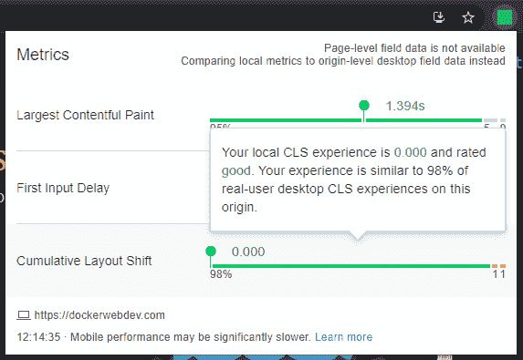](https://kinsta.com/wp-content/uploads/2021/08/addon-cls.png)

Web Vitals extension CLS.


与 [LCP](https://docs.google.com/document/d/1vAP3ex3G8vfeAmIkT-6Rdchvdv_7mQy3-P5EnXPLiI8/edit#heading=h.7fow01wzb9wj) 和 [FID](https://docs.google.com/document/d/1vAP3ex3G8vfeAmIkT-6Rdchvdv_7mQy3-P5EnXPLiI8/edit#heading=h.unhz54otledn) 一样， [Chrome 用户体验报告](https://developers.google.com/web/tools/chrome-user-experience-report/)允许你查询特定 URL 在不同国家、连接和设备上记录的真实 CLS 统计数据。

[web-vitals JavaScript 库](https://github.com/GoogleChrome/web-vitals)也可以计算你的实时网站上真实用户的 CLS 指标，就像它对 LCP 和 FID 所做的一样。可以将以下脚本添加到您的 HTML `<head>`中，以便将 CLS 指标输出到回调函数:

```
<!DOCTYPE html>
<html lang="en">
<head>
<meta charset="UTF-8">
<title>My page</title>
<script type="module">
import { getCLS } from 'https://unpkg.com/web-vitals?module';
getCLS(console.log);
</script>
<!-- rest of page --> 
```

### 累积布局偏移分数不佳的常见原因

糟糕的 CLS 分数通常是由缓慢加载的页面资产和动态或未调整大小的 DOM 元素造成的:

*   页面上的空间不是为图像、iframes、广告等保留的。
*   内容被动态地注入到 DOM 中，通常是在网络请求广告、社交媒体小部件等之后。
*   Web 字体加载会导致不可见文本的明显闪烁(FOIT)或无样式文本的闪烁(FOUT)。

### 如何提高累积布局移位分数

客户端审计可以发现问题，但通常是确保在内容下载前为其预留空间。为最大内容绘制建议的[服务器优化技巧将会有一些好处，但进一步的改进是可能的:](https://docs.google.com/document/d/1vAP3ex3G8vfeAmIkT-6Rdchvdv_7mQy3-P5EnXPLiI8/edit#heading=h.tmx1h3p2bgp8)

1.  向 HTML ``和`<iframe>`标签添加宽度和高度属性，或者使用新的 [CSS 纵横比属性](https://developer.mozilla.org/docs/Web/CSS/aspect-ratio)，以确保在资产下载之前在页面上保留适当的空间。
2.  为包含加载速度较慢的第三方内容(如广告和小部件)的容器元素设置适当的尺寸。
3.  确保出现在页面顶部的图像和其他资产被尽早请求——一个[预加载](https://developer.mozilla.org/docs/Web/HTML/Preloading_content)可能会有所帮助。
4.  尽量减少网络字体的使用，尽可能考虑使用常见的操作系统字体。
5.  加载 web 字体并将 [CSS 字体显示](https://developer.mozilla.org/docs/Web/CSS/@font-face/font-display)设置为可选或交换。确保你使用[相似大小的备用字体](https://meowni.ca/font-style-matcher/)来最小化布局偏移。
6.  避免在页面顶部插入元素，除非它响应用户操作，如单击。
7.  确保用户交互在输入触发后的 500 毫秒内完成。
8.  使用 CSS 变换和不透明度来制作更高效的动画，而不会导致重新布局。
9.  考虑关键的内联 CSS。在页面顶部的``块中嵌入基本的“折叠之上”CSS，然后异步加载额外的样式表。
10.  在必要的地方，考虑一下 [containment](https://developer.mozilla.org/docs/Web/CSS/CSS_Containment) ，这是一个新的 CSS 特性，允许您识别页面中孤立的子树。浏览器可以通过渲染特定的 DOM 内容块来优化处理——或者*而不是*渲染。

[想看更快的网站...并确保你有资格使用谷歌的移动搜索转盘等功能？👀从这里开始⤵ 点击推文](https://twitter.com/intent/tweet?url=https%3A%2F%2Fkinsta.com%2Fblog%2Fcore-web-vitals%2F&via=kinsta&text=Want+to+see+a+faster+site...+and+make+sure+you%27re+eligible+for+features+like+Google%27s+mobile+search+carousel%3F+%F0%9F%91%80+Start+here+%E2%A4%B5&hashtags=CoreWebVitals%2CSEO)

## 摘要

开发者并不总是热衷于跟随谷歌的节奏。该公司拥有相当大的权力，微小的搜索引擎更新会对基于网络的组织的生产力和盈利能力产生不利影响。

也就是说，核心 Web Vitals 采用的是“胡萝卜”而不是“大棒”方法。与臃肿、弹出窗口密集、移动用户界面不佳的网站相比，放弃黑暗模式的优化良好、可用的网站有更好的成功机会。

核心 Web Vitals 提供了一种可衡量的方法来评估用户体验，以帮助您关注最关键的改进。你的生命体征的变化可能不会增加收入，但你的用户会更快乐、更忠诚。

关于提高核心网站活力，你还有其他的建议吗？在评论区分享吧！

* * *

让你所有的[应用程序](https://kinsta.com/application-hosting/)、[数据库](https://kinsta.com/database-hosting/)和 [WordPress 网站](https://kinsta.com/wordpress-hosting/)在线并在一个屋檐下。我们功能丰富的高性能云平台包括:

*   在 MyKinsta 仪表盘中轻松设置和管理
*   24/7 专家支持
*   最好的谷歌云平台硬件和网络，由 Kubernetes 提供最大的可扩展性
*   面向速度和安全性的企业级 Cloudflare 集成
*   全球受众覆盖全球多达 35 个数据中心和 275 多个 pop

在第一个月使用托管的[应用程序或托管](https://kinsta.com/application-hosting/)的[数据库，您可以享受 20 美元的优惠，亲自测试一下。探索我们的](https://kinsta.com/database-hosting/)[计划](https://kinsta.com/plans/)或[与销售人员交谈](https://kinsta.com/contact-us/)以找到最适合您的方式。