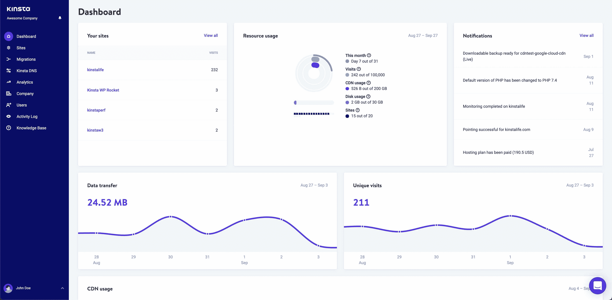
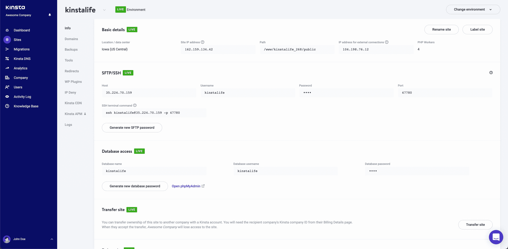
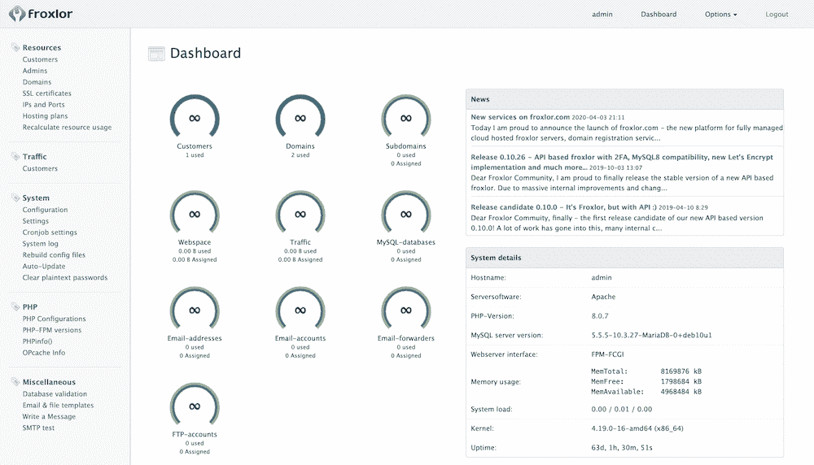
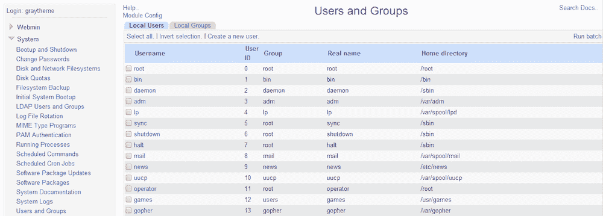
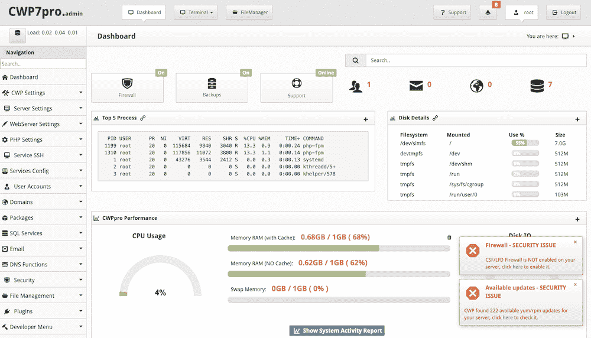
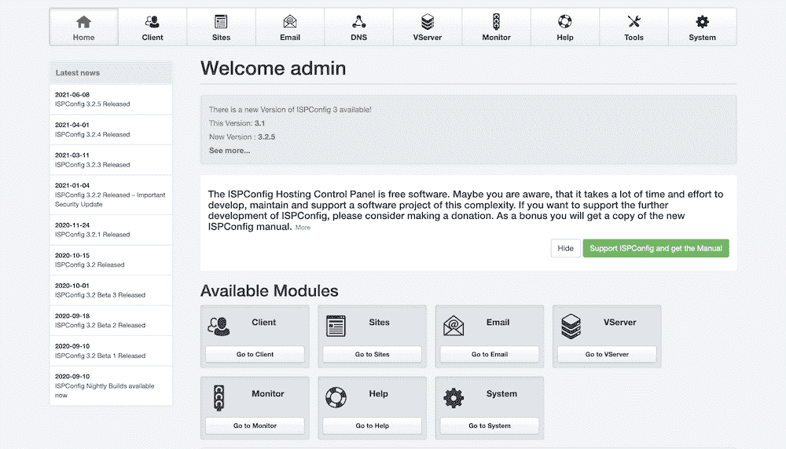
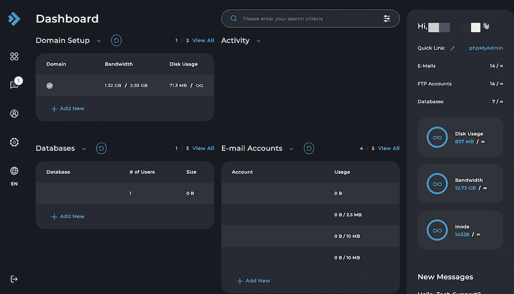
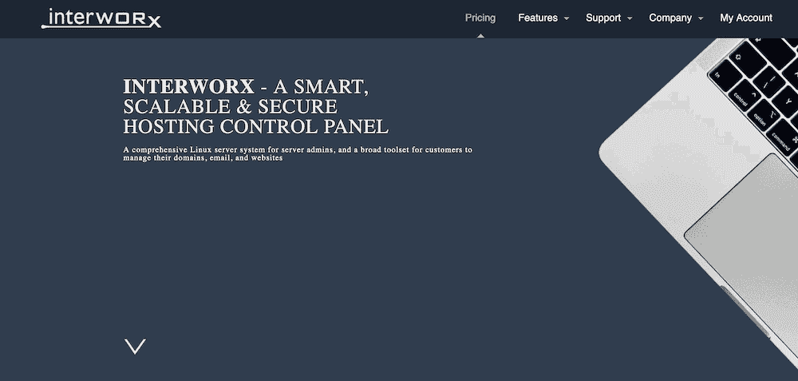
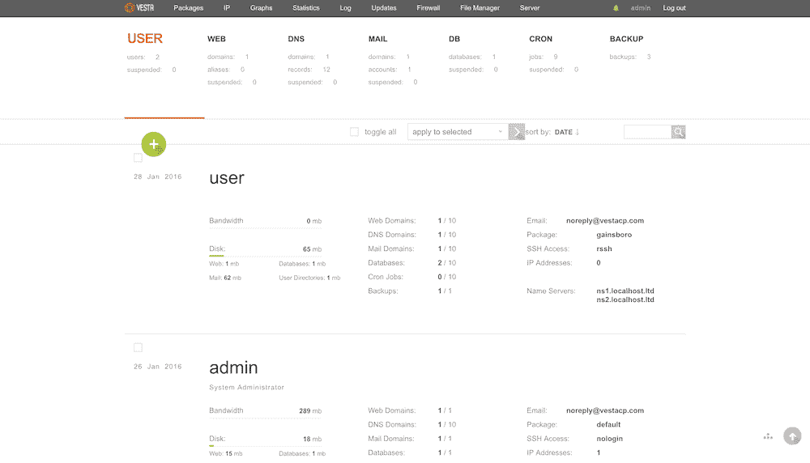
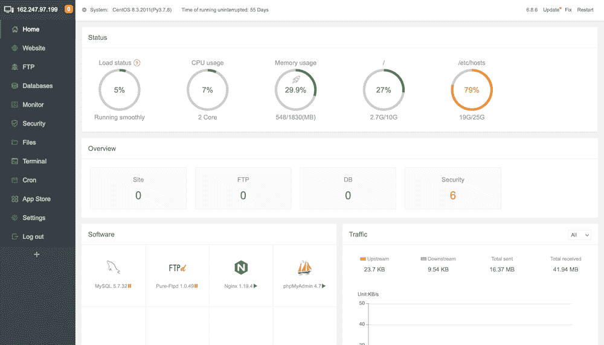

# 帮助管理网站的 11 大 cPanel 备选方案

> 原文：<https://kinsta.com/blog/cpanel-alternatives/>

作为服务器所有者，最有效的用户体验实现之一就是控制面板。多年来，cPanel 一直拿着球跑。许多服务器所有者和 web 主机使用它作为事实上的标准。也就是说，出于几个原因，许多人正在寻找 cPanel 的替代品。

选择正确的控制面板至关重要。毕竟，这是你的用户管理他们的账户和网站的地方。它必须是直观的、可用的和灵活的。对于一些用户来说，cPanel 在这些方面有所下降，其价格上涨是最近的因素。

在这篇综述中，我们将探索各种 cPanel 替代方案，以及是什么让它们如此伟大。不过，首先，让我们来看看为什么你可能需要一个详细的替代方案。

## 为什么你想找一个 cPanel 的替代品

对于无知的人来说， [cPanel 是许多服务器的主要“web 面板”](https://kinsta.com/knowledgebase/what-is-cpanel/)。如果你对这个术语感到困惑，当你需要访问你的托管账户或网站服务器时,“网络面板”就是你要去的仪表板。

简而言之，cPanel 是这项任务的首选。

The cPanel logo.

根据您的设置，您可以通过 cPanel 做几件事情:

*   安装各种平台，比如 WordPress
*   访问一些应用程序的强大自动安装程序(特别是 [Softaculous](https://www.softaculous.com/)
*   [管理您的数据库](https://kinsta.com/knowledgebase/wordpress-database/)
*   管理您的用户
*   更改[安全文件传输协议(SFTP)](https://kinsta.com/knowledgebase/ftp-vs-sftp/) 设置

此外，还有如此多的功能，我们无法在这里一一列举。

事实上，8 个网站中有 1 个使用 cPanel，尽管这个数字正在减少。至于为什么，有一个很大的原因:价格。

最初的定价层级结构简单，但在 2019 年，cPanel 选择在仅提前几个月通知的情况下[提价](https://cpanel.net/wp-content/themes/cPbase/assets/downloads/cP_Store_Licensing_Guide.pdf)。对于每月价格，增加是名义上的，尽管最大的区别是每个等级的帐户限制。

简而言之，根据 2019 年的修订，你最多可以为 100 个 cPanel 账户支付固定价格，然后为每个额外的账户支付 0.20 美元。这个限制对于许多用户来说是一个问题。

在以前的定价下，您每年要支付大约 200-500 美元的固定费用。按照 2019 年的定价，需要 1000 个 cPanel 账户的客户每月将支付约 225 美元。

然而，这并不是故事的结尾。2021 年，cPanel [将更高等级计划的价格](https://cpanel.net/wp-content/themes/cPbase/assets/downloads/cp_store_licensing_guide_2021.pdf)提高了约 8%,将大宗账户费率提高了 50%。这意味着需要 1，000 个 cPanel 帐户的同一个客户每月将支付大约 318 美元。

简而言之，cPanel 很划算，但现在对很多用户来说并不划算。因此，你可能是众多寻找合适 cPanel 替代品的人中的一员。

[多年来，cPanel 一直是首选的控制面板...但是，新的选择已经出现，可能会给它的钱带来冲击👀在这里找到它们👇 点击推文](https://twitter.com/intent/tweet?url=https%3A%2F%2Fbit.ly%2F3mO5jES&via=kinsta&text=For+years%2C+cPanel+has+been+the+go-to+control+panel+choice...+but+new+options+have+entered+the+scene+that+could+give+it+a+run+for+its+money+%F0%9F%91%80+Find+them+all+here+%F0%9F%91%87&hashtags=cPanel%2CUX)

## 帮助管理网站的 11 大 cPanel 备选方案

在接下来的几个部分中，我们将提供我们对 11 个优秀 cPanel 备选方案的看法，并告诉你它们与 cPanel 相比如何的内幕。

 先说 Kinsta 的内置解决方案吧！

### 1.迈金斯塔

MyKinsta 是 Kinsta 平台的主要组成部分，这是一个定制的托管面板，用于管理您的网站和帐户。

The MyKinsta dashboard.

您可以从这个中心位置管理所有由 Kinsta 驱动的网站。它还包含大量信息，并为您提供以下专用面板:

*   强大的用户管理，让您能够在几秒钟内[分配角色和权限](https://kinsta.com/blog/wordpress-user-roles/)
*   一种从你的实时服务器(和从本地环境)推送和拉取你的站点的方法
*   通过[安全外壳(SSH)](https://kinsta.com/help/connect-to-ssh/) 访问您网站的最少点击次数
*   为您的站点提供一整套分析和性能指标
*   大量的特性和功能可以帮助您保护您的网站并提高其性能
*   直接从仪表板创建、迁移和移动站点的能力

虽然视觉不是唯一值得考虑的方面，但它们确实有助于 UX。MyKinsta 后端具有经济的布局，可以方便地访问您需要的所有最相关的屏幕。

MyKinsta’s Sites screen.

作为 cPanel 的替代品，这让 MyKinsta 脱颖而出。此外，控制面板是定制的，可在使用 Kinsta 时提供最佳体验。在 MyKinsta 的聚焦方法和 UX 之间，这可能会使 cPanel 在某些领域看起来有限。

要使用 MyKinsta，您需要成为 [Kinsta 客户](https://kinsta.com/clients/)。然而，仪表板不是你额外付费的东西——它附带了[所有的 Kinsta 计划](https://kinsta.com/plans/)。

### 2.弗罗斯特勒

如果你喜欢 WordPress 的开源方法，并且想让这条线通过你的主机控制面板， [Froxlor](https://froxlor.org/) 是 cPanel 的一个很好的选择。

The Froxlor interface.

它是 GPL 许可的，这意味着它可以免费下载并在你需要的任何域上使用。你还可以对界面进行主题化，这意味着你可以为你的用户设计一个贴有白色标签的后端。

Froxlor 提供了你期望从一个流行的控制面板得到的所有好东西:

*   能够保存不同的 [PHP 配置](https://kinsta.com/blog/php-benchmarks/)并在每个域的基础上使用一个
*   完整的 MySQL 数据库管理功能
*   [安全套接字层(SSL)](https://kinsta.com/blog/types-of-ssl-certificates/) 管理，包括使用免费加密证书的选项
*   关于 HTTP、邮件和文件传输协议(FTP)指标的全面报告

还有一个[扩展应用编程接口(API)](https://api.froxlor.org/doc/0.10.26/) 也是如此。这个 API 允许您访问 Froxlor，并扩展您可以使用该平台做的事情的范围。

Froxlor 可以免费下载和使用。在此基础上，它整天打败 cPanel。然而，特性集更加有限，所以 cPanel 很可能在这方面胜出。尽管如此，Froxlor 仍然物有所值，在特定情况下是 cPanel 的可靠替代品。

### 3.Webmin

Webmin 是另一个开源许可的 cPanel 替代产品，这次使用的是 Berkeley 软件分发(BSD)许可。它更侧重于 [Linux 发行版](https://webmin.com/support.html)，尽管也有 Windows 版本。

The Webmin interface.

也有相当多的软件包发行版，所以你可以安装控制面板，不管你的具体设置和偏好。

Webmin 背后的想法是，有一个全功能的核心控制面板，你可以用第三方模块来支持它(用正确的技能)。表面上，这听起来对 WordPress 很熟悉，所以它应该适合那些有定制需求和开发眼光的人。

Webmin 自带了许多模块,将涵盖您需要的所有基本功能，以及一些您可能没有想到的功能(如 CD 刻录)。

和 Froxlor 一样，Webmin 将适合开源栈为王的服务器。然而，考虑到 Webmin 的模块化程度，它可能是许多用户理想的免费 cPanel 替代品。

### 4.控制网页面板

在 CentOS Linux 发行版停产后，以前的 CentOS Web Panel 有了一个新名称— [控制 Web Panel (CWP)](https://control-webpanel.com/) 。当然还是纯 Linux 的控制面板，推荐 CloudLinux 和 RedHat 发行版。

The Control Web Panel interface.

你会发现有很多网络服务器选项，比如 [Apache](https://kinsta.com/knowledgebase/mamp-apache-server-not-starting/) 、 [Nginx](https://kinsta.com/blog/reverse-proxy/) 、Varnish、LiteSpeed 等等。它为 CWP 提供了灵活性和现代服务器标准的基础。

在我们看来，CWP 对于系统管理员来说是一个强大的工具。您有一个广泛而全面的日志记录系统，大量的监控工具来帮助您监视服务器活动，等等。

总的来说，CWP 感觉比 cPanel 更有效，尽管它不太适合你的具体设置。

## 注册订阅时事通讯

### 想知道我们是怎么让流量增长超过 1000%的吗？

加入 20，000 多名获得我们每周时事通讯和内部消息的人的行列吧！

[Subscribe Now](#newsletter)

虽然有免费版的 CWP(全功能产品)，但你也可以选择它的[高级版](https://control-webpanel.com/cwppro)。无论有没有支持插件，它都很实惠。价格将是贯穿本文的一个常见主题，因为它是 cPanel 最薄弱的领域之一。

### 5\. ISPConfig

您可以将 [ISPConfig](https://www.ispconfig.org) 添加到市场上的开源 cPanel 替代方案列表中。它有一个简单的仪表板，在主观上比 cPanel 更好。

The ISPConfig interface.

您可以在 Apache 和 Nginx web 服务器之间进行选择，并通过控制面板管理多台服务器。此外，您可以使用一些不同的工具设置虚拟化、镜像配置和管理[域名系统(DNS)](https://kinsta.com/knowledgebase/what-is-dns/) 服务器。

[完整的功能列表](https://www.ispconfig.org/ispconfig/services-and-functions/)非常广泛，这对潜在的新用户来说是个好消息。如果你浏览整个列表，你还会注意到一些为未来做的准备——例如，DNSSEC，一种更现代的保护网络数据的方法。

作为 cPanel 的替代方案，您将使用 ISPConfig 以价格换取功能。它是免费的，考虑到盒子里的东西，这是很棒的，但它没有配备齐全。对于少数网站，您不会注意到有什么不同，过一会儿您甚至可能会忘记 cPanel。

### 6\. Ajenti

Ajenti 是一个流行的 cPanel 替代品，它在前端运行 [JavaScript](https://kinsta.com/knowledgebase/what-is-javascript/) (或变体)，在后端运行 [Python](https://kinsta.com/blog/python-tutorials/) 。因此，这个控制面板就像它的核心语言一样:包括“电池”简而言之，这意味着您可以轻松访问几个附加模块来定制您的控制面板体验。

The Ajenti website.

它包括许多功能来帮助你管理服务器，比如文件管理器。当然，许多解决方案也包括这一点，但 Ajenti 更进一步，提供了命令行访问和平台内的文本编辑。

Ajenti 是一个运行 MIT 许可证的开源解决方案。这意味着支持不会和你从更多的商业产品中得到的一样。这也意味着您需要熟悉服务器的管理，因为这种帮助并不容易获得。

然而，考虑到 Ajenti 的模块化本质、其[优秀的文档](http://docs.ajenti.org/en/latest/)和底层代码，该平台有很多优势。您甚至可以使用 Ajenti 核心框架创建定制的 web 界面。

如果您有时间和技能，Ajenti 可以为您工作，尤其是部署和使用它不需要任何成本。

### 7.直接管理

我们暂时离开开源解决方案，来看看一个在 [DirectAdmin](https://directadmin.com/) 中配置良好的商业解决方案。

The DirectAdmin interface.

您几乎可以获得管理服务器所需的所有基本功能，例如 [DNS 管理](https://kinsta.com/knowledgebase/flush-dns/)和 IP 管理。DirectAdmin 还支持 DNS 群集以帮助机器传输数据，并包括重复域保护。

许多附加功能也使 DirectAdmin 比其他解决方案更具优势。例如，帐户可以使用[双因素身份验证(2FA)](https://kinsta.com/blog/wordpress-two-factor-authentication/) ，还有自动崩溃恢复功能，您将可以访问出色的支持选项。

厌倦了低于 1 级的 WordPress 托管支持而没有答案？试试我们世界一流的支持团队！[查看我们的计划](https://kinsta.com/plans/?in-article-cta)

用户获得一个集成的票务支持系统和[站点助手工具](https://www.site-helper.com/gettingstarted.html)和站点。它们是 DirectAdmin 提供的所有内容的综合指南。

即使在每月 29 美元的[最高价位](https://directadmin.com/pricing.php)，DirectAdmin 也代表了良好的价值。结合其强大的功能，这个解决方案有很多优点。

### 8.虚拟化

如果你感觉到这里有些熟悉的东西，你并不孤单。 [Virtualmin](https://www.virtualmin.com/) 建立在 Webmin 之上，发布在 [GPL](https://kinsta.com/learn/wordpress-gpl/) 下。

The Virtualmin home page.

仪表板看起来很整洁，尽管您可以根据需要定制它。然而，一旦你开始使用它，你可能就不想要了。你可以从左边的菜单中找到几乎所有的选项，一眼就能看出它是一个可靠的系统管理工具。

您可以通过将管理委托给用户来管理域帐户(这里称为“虚拟服务器”，这很容易混淆)。更重要的是，有很多方法可以按用户管理账户。

Virtualmin 使用系统标准软件包 repos，以便您可以快速自动更新。您还可以在命令行和界面之间进行选择，这很好。

你也可以为大约 100 种不同的产品使用几个应用程序和脚本来扩展 Virtualmin。也就是说，与云的集成已经包含在开箱即用中，这样你就可以用亚马逊 S3、 [Dropbox](http://dropbox.com) 、谷歌云、Rackspace 等等来设置云存储。

Virtualmin 有两种版本:免费的 GPL 版本和专业版本。主页上没有详细记录这方面的价格，但价格在每月 20-25 美元左右，这是合理的。

### 9.交互工作

接下来， [InterWorx](https://www.interworx.com/) 是一个完全商业化的项目，由两部分组成。结合起来，它们为您提供了一个强大的一体化 cPanel 替代方案，具有很大的范围和可伸缩性。

The InterWorx website.

这两部分涵盖了服务器端和客户端。NodeWorx 是服务器管理工具，它提供了您几乎所有需要的功能。还有很多服务器控制工具，比如[防火墙规则管理](https://kinsta.com/blog/sucuri-firewall/)，数据库管理，病毒防护等等。

相比之下，SiteWorx 是一个用户控制面板，允许您配置域、查看统计数据、安装各种应用程序和软件等等。InterWorx 由这两种服务组合而成。

如果您正在寻找一个 cPanel 的替代品，让您可以创建多个管理员和用户帐户，并利用集群技术，InterWorx 将是您的首选。[的定价也很诱人](https://www.interworx.com/#pricing)。

我们喜欢这里展示的简单模型。对于单个 VPS 许可证，您每月支付 7.50 美元。这让你可以托管几乎无限数量的域名，但你也可以选择每月 20 美元的单一服务器许可。你需要联系 InterWorx 了解批量许可证的确切价格，但他们宣传说，500 个或更多许可证的价格可以低至每月 5 美元。

### 10.VestaCP

VestaCP 的主要焦点是简单性。你可以从浏览网站的那一刻就看出这一点，这个主题贯穿了控制面板软件。

The VestaCP interface.

web 界面是轻量级的，运行在 JavaScript 和 PHP 上。与其他 cPanel 替代方案相比，[特性集](https://vestacp.com/features/)并不突出，也没有什么惊喜。然而，这不是控制面板的重点。是速度和效率。

虽然这看起来像是一个缺点，但它对 VestaCP 有利，因为工具和功能感觉很熟悉。例如，有针对 Ubuntu、Debian 和 CentOS 发行版的 API，您可以使用 MySQL 或 [PostgreSQL](https://www.postgresql.org/) (也可以分别选择 phpMyAdmin 或 phpPgAdmin)。

所有这些都使 VestaCP 成为一个控制面板，让你一出门就有宾至如归的感觉。这是一个积极的方面，尤其是如果你是 cPanel 的长期用户，因为做出改变通常有一个陡峭的学习曲线。

就像列表中的其他 GPL 解决方案一样，VestaCP 是免费的。然而，一个高级插件可以帮助限制用户访问他们的主目录，并禁用 [SSH](https://kinsta.com/blog/ssh-commands/) 。当然，这是可选的，所以你不需要为控制面板本身支付任何费用。

### 11.aaPanel

我们最后的 cPanel 替代方案在亚洲很受欢迎，它也值得在西方服务器上找到自己的路。作为另一个免费的开源解决方案， [aaPanel](https://www.aapanel.com/index.html) 包含了许多对少数服务器的网络来说非常棒的特性。

The aaPanel website.

这些特性是标准的，尽管有很多环境可供选择。你也不局限于 Apache 和 Nginx，因为 OpenLiteSpeed 也受支持。虽然 MySQL 支持是必然的，但是 [MongoDB](https://www.mongodb.com) 也为那些进入 NoSQL 解决方案的用户提供了支持。

有一个专用的 aaPanel 插件可以实现 Java 和 Python 项目管理器、PostgreSQL 管理器、DNS 管理器等等。云存储也使用插件，一旦激活，你可以选择亚马逊 S3、谷歌云等。

我们还喜欢为一些流行的应用程序内置一键式部署。当然，WordPress 也在其中，但是你也可以部署 [Joomla](https://kinsta.com/blog/joomla-vs-wordpress/) 、 [Drupal](https://kinsta.com/blog/wordpress-vs-drupal/) 、Laravel 和 [Roundcube](https://roundcube.net/) 应用程序。

与其他开源 cPanel 替代方案一样，aaPanel 可以免费下载和使用。因此，它提供了很多，可以成为您的控制面板的选择，无论您的位置。

[作为服务器所有者，你可以做出的 UX 决策之一就是你对控制面板的选择。😅查看 cPanel 备选方案列表，开始缩小您的选择范围✅ 点击推文](https://twitter.com/intent/tweet?url=https%3A%2F%2Fbit.ly%2F3mO5jES&via=kinsta&text=One+of+the+UX+decisions+you+can+make+as+a+server+owner+is+your+choice+of+the+control+panel.+%F0%9F%98%85+Check+out+this+list+of+cPanel+alternatives+to+start+narrowing+down+your+options+%E2%9C%85&hashtags=cPanel%2CUX)

## 摘要

没有理由抨击 cPanel 的特性和功能。毕竟，它是虚拟主机控制面板中的中流砥柱，拥有大量客户。然而，最近的价格变化给了用户一个看别处的理由。如果有什么不同的话，新的定价放大了 cPanel 的负面影响。

我们探讨了 11 种 cPanel 替代方案，并讨论了它们为什么会出现在这个列表中。尽管 cPanel 仍然被广泛使用，但它在今天的大多数企业中已经失宠了。

2022 年，企业需要一个强大而易用的仪表板来管理他们的网站。这就是 MyKinsta 的用武之地。试试它的免费试玩版亲自看看。

*您是否喜欢不在此列表中的控制面板替代品？还是依然忠于 cPanel？请在下面的评论区告诉我们！*

* * *

让你所有的[应用程序](https://kinsta.com/application-hosting/)、[数据库](https://kinsta.com/database-hosting/)和 [WordPress 网站](https://kinsta.com/wordpress-hosting/)在线并在一个屋檐下。我们功能丰富的高性能云平台包括:

*   在 MyKinsta 仪表盘中轻松设置和管理
*   24/7 专家支持
*   最好的谷歌云平台硬件和网络，由 Kubernetes 提供最大的可扩展性
*   面向速度和安全性的企业级 Cloudflare 集成
*   全球受众覆盖全球多达 35 个数据中心和 275 多个 pop

在第一个月使用托管的[应用程序或托管](https://kinsta.com/application-hosting/)的[数据库，您可以享受 20 美元的优惠，亲自测试一下。探索我们的](https://kinsta.com/database-hosting/)[计划](https://kinsta.com/plans/)或[与销售人员交谈](https://kinsta.com/contact-us/)以找到最适合您的方式。