# 如何创建一个会员网站(5 个步骤)

> 原文：<https://kinsta.com/blog/create-a-membership-website/>

多亏了像 WordPress 这样的用户友好平台，创建一个网站变得前所未有的简单。然而，在某个时候，你可能想为你所有的努力工作得到补偿。

这就是会员网站的用武之地。通过把你最好的内容放在付费墙后面，你应该没有问题覆盖你的运行费用，甚至可能会盈利。

在本帖中，我们将讨论什么是会员网站，以及为什么它们可能是提高转化率、参与度和底线的秘密。然后，我们将向您展示如何规划和构建完美的会员网站。我们开始吧！

## 会员网站介绍

会员制网站是一个你可以在[注册表格](https://kinsta.com/blog/wordpress-registration-form/)后面放置内容的网站。这与[出售订阅](https://kinsta.com/blog/woocommerce-subscriptions/)截然不同。订阅使客户能够在一段时间内访问产品或服务，而会员则允许用户访问门控内容。

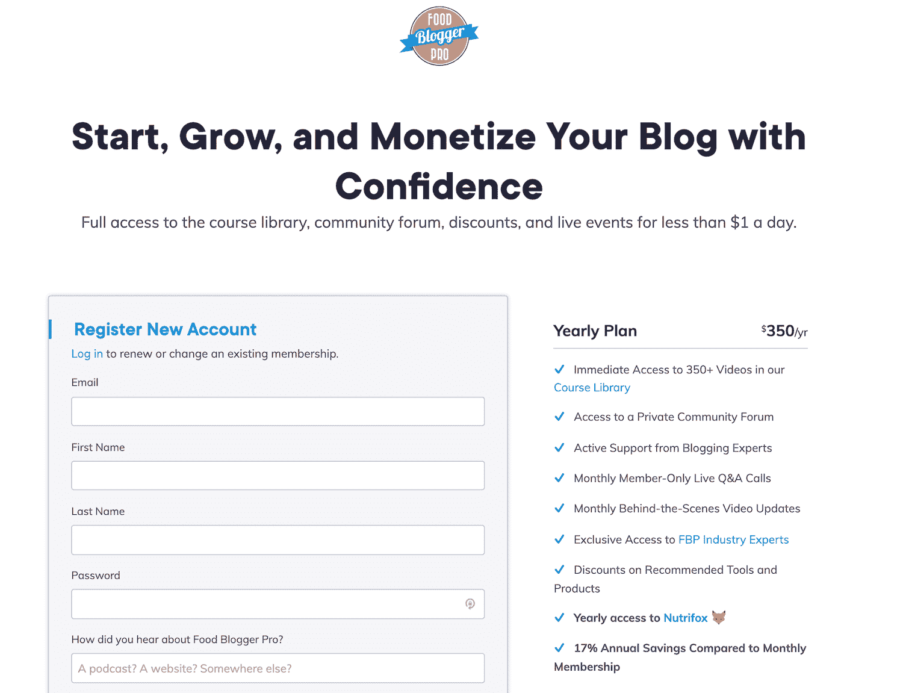

会员制网站页面示例。

每个会员网站都是独一无二的。然而，你会在最有效的会员网站上找到一些功能。这包括新访问者可以注册的注册表单。

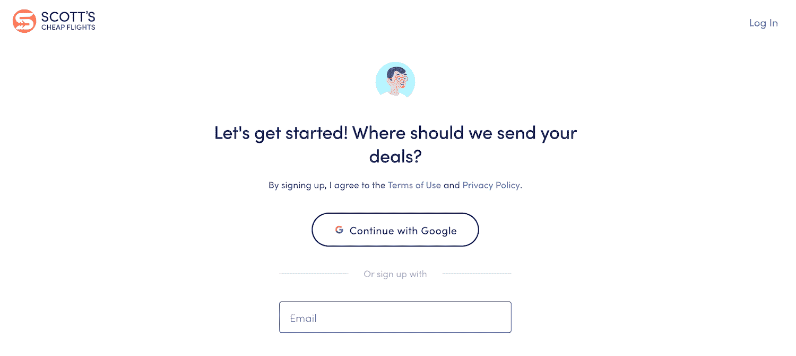

会员注册表单的例子。

你需要为那些已经花时间在你的网站上注册的人提供一个登录表单。这使会员能够访问您网站的受限部分，编辑他们的用户资料，并执行其他仅限会员的活动。

> Kinsta 把我宠坏了，所以我现在要求每个供应商都提供这样的服务。我们还试图通过我们的 SaaS 工具支持达到这一水平。
> 
> <footer class="wp-block-kinsta-client-quote__footer">
> 
> 
> 
> <cite class="wp-block-kinsta-client-quote__cite">Suganthan Mohanadasan from @Suganthanmn</cite></footer>

[View plans](https://kinsta.com/plans/)

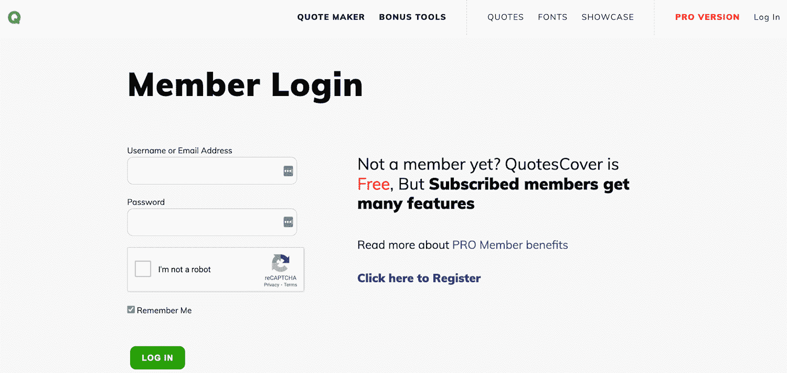

会员登录页面的例子。

许多会员网站都有独家内容。这可以采取多种形式，包括[在线课程、](https://kinsta.com/blog/wordpress-lms-plugins/)高级支持论坛和网络研讨会。

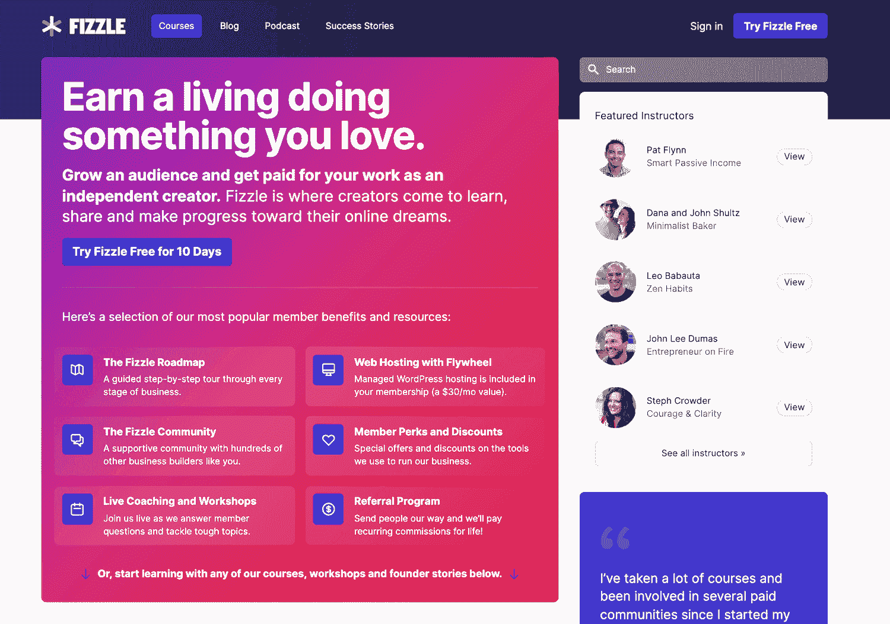

一个来自 Fizzle 的在线课程页面的例子。

其他会员可以获得额外的津贴。这可能包括您的电子商务商店的折扣代码，甚至是会员专属抽奖的入场券。

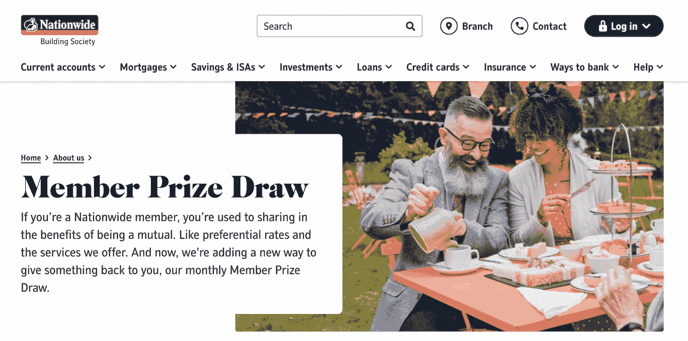

会员奖品和福利。

你甚至可以提供参加特殊活动的机会。例如，许多俱乐部和收入运行会员网站。

[会员网站可能是你提高转化率、参与度和底线的秘密原料📈在此了解更多信息！🤝 点击推文](https://twitter.com/intent/tweet?url=https%3A%2F%2Fkinsta.com%2Fblog%2Fcreate-a-membership-website%2F&via=kinsta&text=A+membership+site+could+be+the+secret+ingredient+you+need+to+boost+conversions%2C+engagement+rates%2C+and+your+bottom+line+%F0%9F%93%88+Learn+more+here%21+%F0%9F%A4%9D&hashtags=WordPress%2CWPTips)

### 为什么你想创建一个会员网站

会员网站是从你的内容中赚钱的好方法。完成初始设置后，一个[好的会员插件](https://kinsta.com/blog/wordpress-membership-plugins/)或平台应该会自动执行许多日常会员任务。

这包括创建新账户、处理支付和分配会员专属资源。因此，一个会员制网站可以帮助你产生利润，而不需要在你的待办事项列表中增加很多任务。

或者，你可以免费提供会员资格。例如，作为注册过程的一部分，您可以通过请求某人的电子邮件地址来使用门控内容[生成销售线索](https://kinsta.com/blog/wordpress-lead-generation/)。

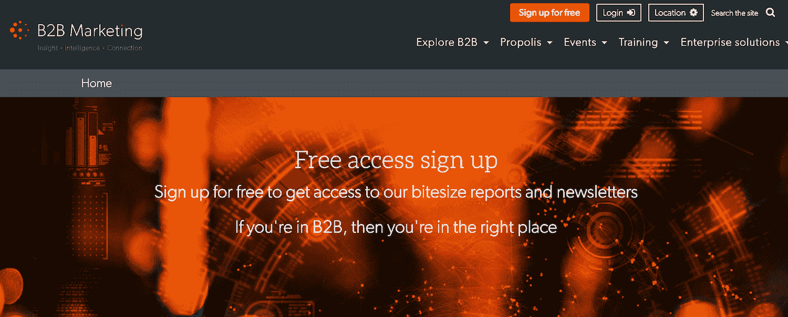

利用会员网站作为产生销售线索的一种方式。

注册网站需要时间和精力。经历了所有这些麻烦之后，你的会员可能会觉得有必要定期访问你的网站，以获得良好的投资回报。为了提高参与度，您甚至可以在您的[电子邮件营销](https://kinsta.com/blog/email-marketing-best-practices/)活动中使用会员的联系方式。

如果你的会员功能确实设法[增加你的流量](https://kinsta.com/blog/how-to-drive-traffic-to-your-website/)并提高参与度，那么这将向搜索引擎发出积极的信号。这意味着一个会员制网站可能会间接地[提高你的搜索引擎排名](https://kinsta.com/blog/wordpress-seo/)。

虽然许多会员制网站只在网上运营，但一些实体企业使用会员制来改善客户体验。例如，如果你拥有一家健身房，你可以让新顾客选择在线注册。这比强迫他们亲自拜访你要方便得多。

## 如何创建会员网站(5 个步骤)

现在，我们已经讨论了好处，让我们看看如何将你的内容货币化，产生潜在客户，并改善访问者的体验。以下是如何用五个步骤创建一个会员网站。

### 第一步:确定你的目标受众

当开始一项新的业务时，尽可能多地锁定目标人群是很有诱惑力的。这似乎是最大化利润的理想方式。然而，当你试图吸引每一个人时，你往往最终谁也吸引不了。

通过专注于一个特定的利基市场，你可以为这个特定的受众创造极具吸引力的内容。你也可以定制你的会员网站的每一部分，以引起这个利基市场的共鸣。这包括从你的网站设计到价格和你将提供的内容类型的一切。

当你有一个狭窄的目标受众，你通常可以更有效地营销你的会员网站。这包括定制您的信息，以针对您客户的深层、特定需求进行宣传。根据你的受众，甚至可能有利基社区和平台，你可以为你的会员网站做广告。所有这些都有助于提高你的转化率。

当决定瞄准谁时，找到一个足够大的利基来维持你不断增长的会员网站是很重要的。在这里，你可以使用[谷歌趋势](https://trends.google.com/trends/)来衡量有多少人[搜索与你的目标受众相关的关键词](https://kinsta.com/blog/keyword-research/)。这可以帮助你估计潜在客户群的规模。

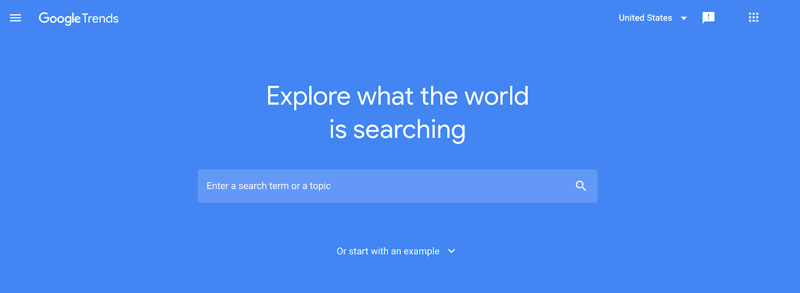

谷歌趋势

这也可能有助于确定其他会员网站，针对相同的人口统计。如果这些网站看起来欣欣向荣，那么这可能是一个有利可图的利基。

### 第二步:决定会员模式

在创建你的网站之前，你需要决定会员模式。这意味着确定您将向客户提供的内容。您的会员专属内容可能包括从在线课程到信息丰富的网络研讨会、独家博客帖子、产品样本、奖励积分或所有订单的免费送货等一切内容。

然后，是时候决定是提供单一成员资格还是创建多个层级了。如果您选择后者，当您的受众购买更高的会员级别时，他们通常会获得更多的内容和额外待遇。

接下来，您将创建一个定价模型。一些网站纯粹将会员资格作为获取联系信息和提高参与度的一种方式。如果这些是你的目标，那么你可能想提供免费会员。

如果您决定收取费用，这可以是一次性付款，也可以是[经常性费用](https://kinsta.com/blog/recurring-revenue-model/)。一次性付款非常有利于产生突然的现金流入。与此同时，经常性付款通常是提供稳定可靠收入的关键，这种收入可以长期维持您的会员网站。

如果你决定收费，这可能有助于确定几个在你的行业内运作并提供类似内容的会员网站。然后，您可以检查他们的定价，并以此为您的会员模式提供信息。

### 第三步:选择平台

说到选择平台，您有几个选择。例如，你可能会购买一个现成的解决方案来订阅上传你的内容，比如[教学平台](https://teachable.com/)。

这个可教的平台。

这是快速启动会员网站的好方法。然而，定制现成平台的范围通常有限。

或者，你可以选择一个[内容管理系统(CMS)](https://kinsta.com/knowledgebase/content-management-system/) ，比如 WordPress。然后你可以[用插件](https://kinsta.com/best-wordpress-plugins/)增强这个平台，添加必要的会员功能。

这种方法使您能够将自己的创意付诸实践，并定制标准平台来满足您的确切需求。但是，这个过程可能需要您研究各种第三方解决方案，并花时间配置和维护这些附加插件。

选择平台后，你可能需要考虑虚拟主机。选择正确的主机方案对任何网站都是至关重要的。然而，这对于会员制网站来说尤其重要，因为它们通常有很多个性化的内容。您的站点可能还需要向大量用户提供这些内容。

这会让你的网站承受巨大的压力。出于这个原因，你必须选择一个托管计划，可以保持你的会员网站顺利运行，不管压力有多大。在 Kinsta，我们提供[注重性能的托管](https://kinsta.com/wordpress-membership-website-hosting/)，可以轻松[支持资源饥渴的会员网站](https://kinsta.com/blog/fastest-wordpress-hosting/)。

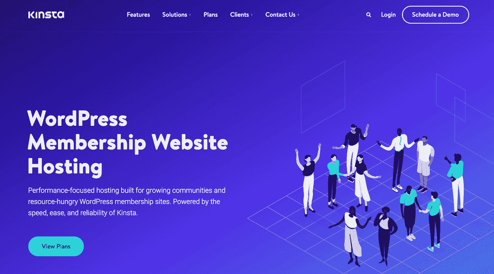

金斯塔会员网站托管。

理想情况下，你会希望第一次就选择正确的主机提供商。但是，如果您确实需要升级您的提供商，我们的专家团队可以帮助您[将您的动态会员网站](https://kinsta.com/knowledgebase/migrating-dynamic-wordpress-sites/)迁移到我们的任何托管计划。

### 步骤 4:创建一些会员专用的内容

为了[推动转化率](https://kinsta.com/blog/conversion-rate-optimization-tips/)，你的会员网站应该为你的目标受众提供价值。这个价值可能在于你的内容的独特性和[品质。](https://kinsta.com/blog/long-form-articles/)

或者，你可以提供更方便的体验。例如，您可以让客户选择在线注册您的俱乐部。如果你的竞争对手要求人们通过电话完成会员手续，你马上就会成为更有吸引力的选择。

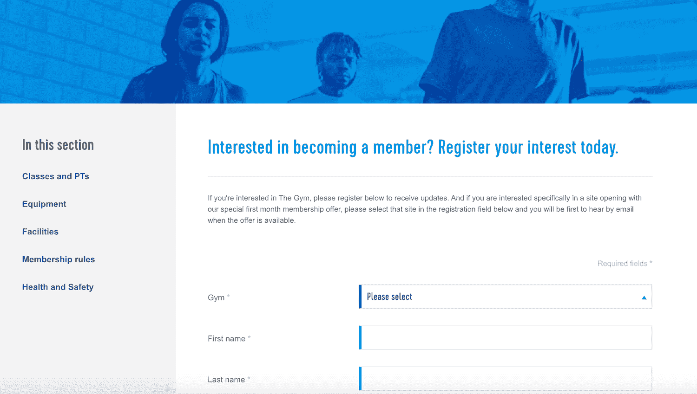

在目标受众注册之前就向他们提供价值。

只要有可能，在接受任何注册之前创建你的会员内容和特权是明智的。这确保了新注册用户可以立即开始享受您的独家内容和会员专属福利。

通过提前准备内容，还可以提升会员体验。如果一个访问者在会员资格上挥霍，迎接他的是一个没有内容的空网站，这可能会损害你的品牌形象和声誉。有些人可能会投诉，少数人甚至会要求退款。

### 第五步:监控你的会员网站的表现

你的会员网站的表现会对转化率产生巨大的影响。如果你的网站加载缓慢或滞后，访问者不太可能冒险成为付费会员。

如果你的网站表现不佳，即使你设法说服访问者转化，顾客也可能很快放弃他们的会员资格。这种流失率会对你的底线产生巨大的影响。

哈佛商学院估计，如果你将流失率降低 5%,你的利润就会增加 95%。如果你能说服会员留下来，这可以为你的企业带来大量额外收入。

作为一个会员制网站，你通常会提供大量动态内容。这已经给你的服务器带来了很大的压力，这意味着你会想尽一切办法来优化你的网站速度。

在这里，使用[良好的性能监控工具](https://kinsta.com/blog/performance-testing-tools/)至关重要。Kinsta 客户可以使用 [Kinsta APM](https://kinsta.com/blog/membership-website-speed/) 监控其会员网站的性能。这个定制工具被明确设计用来诊断 WordPress 网站的问题。

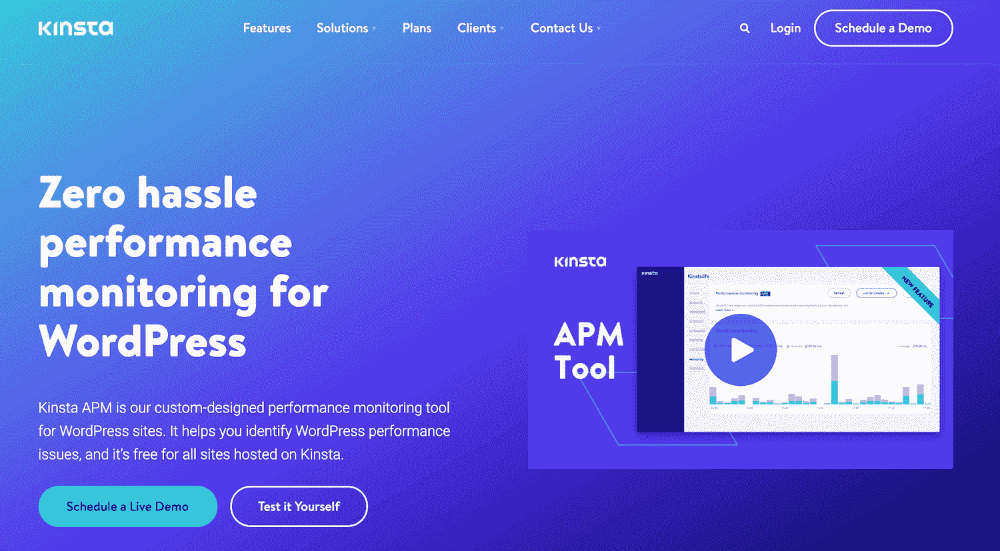

金斯塔 APM 工具。

通过选择 Kinsta APM 而不是一般的性能监控工具，您可以查明影响这个流行的 CMS 的具体问题。这使你处于一个强有力的位置，用你闪电般的页面速度让访问者惊叹。

## 最佳会员网站平台

合适的平台可以帮助你的会员网站走向成功。你可以选择一个专门的会员网站建设者或多功能的 CMS。我们来看一些选项。

### 你的会员资格

你的会员是一个专门的会员网站建设者。它提供了创建会员网站所需的一切，另外还有一些你在普通网站构建器中可能找不到的额外功能:

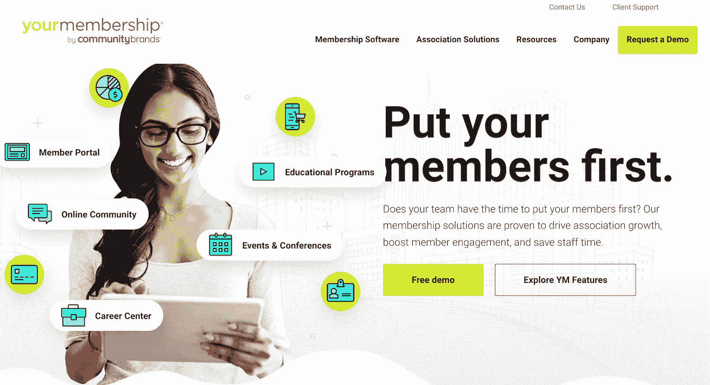

你的会员资格。

使用您的成员资格，您可以为常见的成员资格任务设置自动化工作流。这包括安排续订、确认消息和感谢电子邮件。您还可以自动生成和发送发票。

为了确保您为您的成员提供良好的体验，密切监控他们的行为非常重要。你可以使用通用工具来追踪你的受众，比如谷歌分析工具，甚至是 T2 活动日志插件。

但是，您的会员资格可以让您更深入地了解您的客户。特别是，它使您能够跟踪从非会员到退休会员的整个会员生命周期。这使你在识别那些变得冷漠并有可能取消会员资格的客户时处于有利地位。

您的会员尚未公开发布他们的定价。但是，您可以联系他们的团队讨论您的需求，或者[安排一次演示](https://www.yourmembership.com/products/association-management-software/request-demo/)。

### 方形空间

这个[流行的拖放编辑器](https://www.squarespace.com/)使得创建一系列网站变得容易。它还提供了一系列[专业设计的模板](https://www.squarespace.com/templates)。

Squarespace。

核心的 Squarespace 平台按年计费，价格为每月 12 美元。然而，Squarespace 并不提供现成的会员专用特性。如果你想在 Squarespace 网站的后端托管会员专用页面，那么你需要投资[会员区](https://www.squarespace.com/ecommerce/membership-sites)。

如果你计划进行电子邮件营销，会员区可以连接 Squarespace 的电子邮件活动和个人资料。这使您能够从一个中心位置管理您的电子邮件列表。

主要缺点是会员区需要单独订阅，按年计费的价格从 9 美元起。这个工具还向每个会员收取 4%的交易费。

同样值得注意的是，会员区只能保护你的 Squarespace 网站上的页面，而不一定保护这些页面上的内容。你上传到 Squarespace 网站的每个文件都有自己的链接。这些链接不受保护，因此会员可能会与非会员共享这些 URL，使他们能够免费访问您的内容。

如果你正在创建会员专用的资源，比如视频和音频文件，这可能是一个主要的限制。好消息是会员区不是你唯一的选择。有各种第三方服务与 Squarespace 集成，包括 [MemberSpace 插件](https://www.memberspace.com/integrations/squarespace-membership/)。

## 注册订阅时事通讯

### 想知道我们是怎么让流量增长超过 1000%的吗？

加入 20，000 多名获得我们每周时事通讯和内部消息的人的行列吧！

[Subscribe Now](#newsletter)

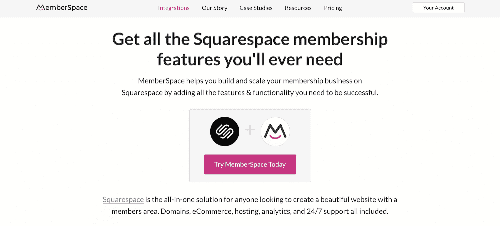

MemberSpace 附加组件。

您可以使用该第三方软件来限制对 Squarespace 网站上任何页面或资源的访问。这将防止非会员访问您的会员专用资源的直接链接。

### WordPress

市场上有很多通用的网站建设者，但他们的一刀切的方法很少能提供最好的会员网站。为了让你的网站成功，你可能要考虑选择一个可定制的、[可扩展的平台，比如 WordPress](https://wordpress.org/) 。

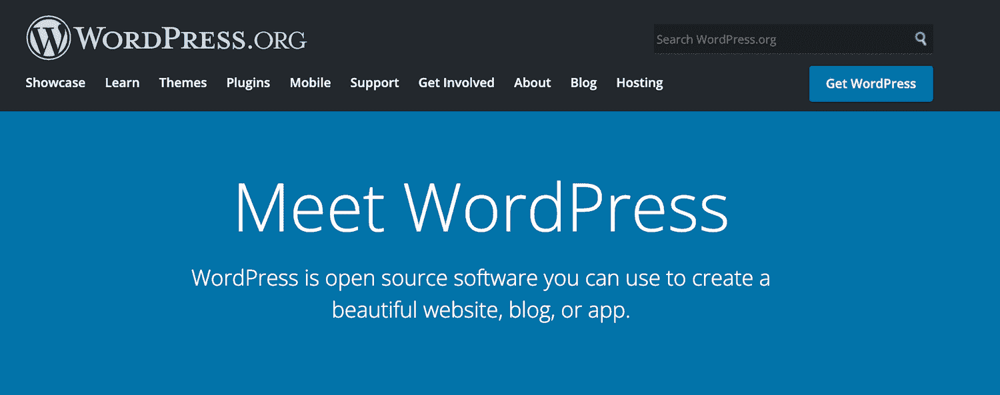【WordPress.org】T2 首页。

通过选择 WordPress 作为你的 CMS，你将获得大量的免费和高级会员插件。这使你能够货比三家，找到满足你会员愿望清单上所有要求的插件。

运营一个成功的网站不仅仅是实现核心的会员功能。例如，您在搜索引擎排名中的位置将决定您获得的流量。

仅仅在官方 WordPress 知识库中就有 60，000 个插件，你应该可以毫不费力地找到插件来帮助你调整会员网站的每一个元素。例如， [Yoast SEO](https://kinsta.com/blog/yoast-seo/) 是一个流行的插件，它承诺提高你的搜索引擎排名。

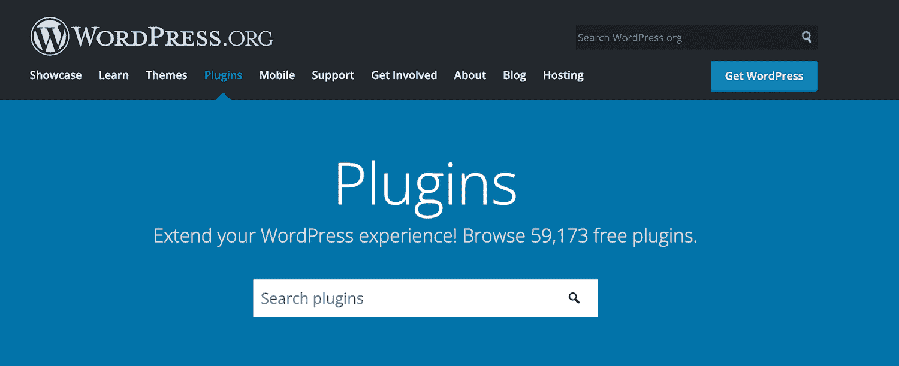

WordPress 插件库主页。

缺点是你需要花时间去寻找和配置这些插件。这与专门的会员平台形成鲜明对比，后者通常能提供你所需的一切。

## 顶级会员网站插件

虽然不缺乏专门的会员平台，但我们相信 WordPress 有你需要的灵活性和可扩展性来创建一个世界一流的会员网站。如果你选择了 WordPress，那么下一步就是选择正确的插件。考虑到这一点，这里是我们排名前三的 WordPress 会员插件。

### 成员

你可以使用这个免费的 WordPress 插件来创建一个会员网站，而不用写一行代码。会员插件有一个先进的基于权限的系统，可以很容易地根据访问者的会员级别来限制你的内容。

您甚至可以拒绝特定成员级别的功能。这为您构建基于权限的系统提供了更大的灵活性:

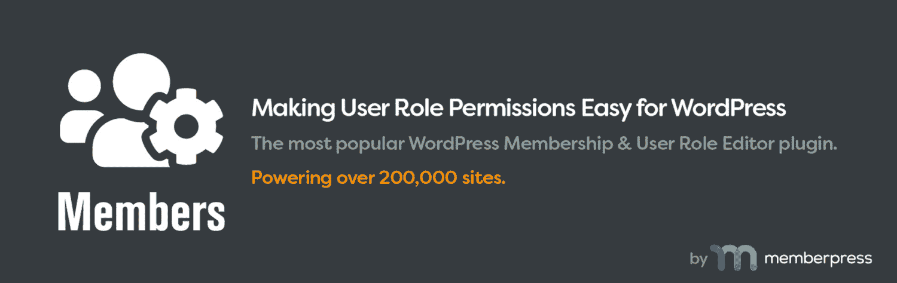

成员插件。

成员插件也有一个专用的登录表单小部件。你可以把它添加到你的站点的重复元素中，比如侧边栏。然后，会员可以从你网站的任何页面登录他们的账户，这对用户体验来说是非常好的。

你甚至可以使用会员来创建一个完全私有的网站。这可能是一个简单的方法来赚钱你的整个目录的内容。你也可以利用会员创建一个专业网站，比如私人员工门户。

然而，使会员区别于其他插件的是它是免费的。如果你预算有限，或者想在使用付费插件之前尝试将内容货币化，会员可能是一个有吸引力的选择。

### 成员压力

您可以使用这个[高级会员插件](https://memberpress.com/)来创建多个会员级别，限制对您内容的访问，并接受付款。尽管 MemberPress 具有高级功能，但它的设计是为了易于使用。

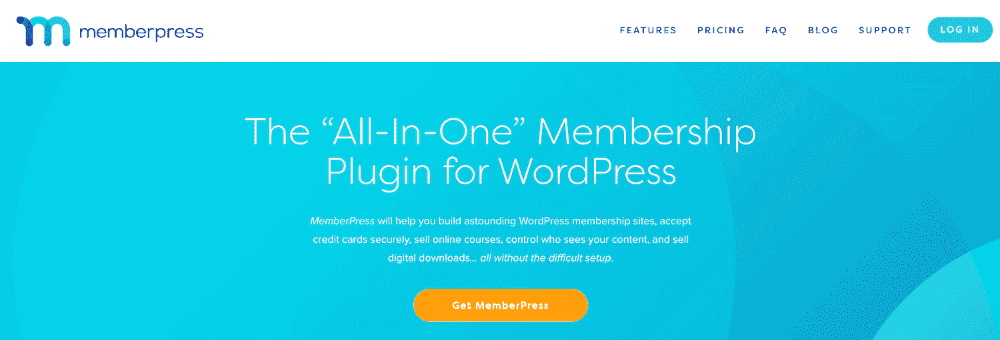

MemberPress 插件。

作为设置过程的一部分，MemberPress 可以自动生成提供正常运行的会员网站所需的所有页面。这包括定价、登录、帐户和感谢页面。

MemberPress 还支持内容滴落。这是一个在几天、几周甚至几个月内分阶段发布内容的过程。通过创建滴流活动，你可以鼓励会员不断回到你的网站，并保持他们的长期兴趣。

如果你想创建一个教育会员网站，你会对 MemberPress 让你[创建和销售数字课程](https://kinsta.com/blog/wordpress-lms-plugins/)感兴趣。它还集成了一系列[流行的营销软件](https://kinsta.com/blog/email-marketing-software/)，包括 [Mailchimp 电子邮件自动化平台](https://kinsta.com/blog/how-to-use-mailchimp/)。

会员许可证起价为[$ 179/年](https://memberpress.com/plans/pricing/)。该公司还提供 14 天退款保证。

### LearnDash

如果你想卖在线课程，不妨看看 [LearnDash 学习管理系统(LMS)](https://www.learndash.com/) 。LearnDash 拥有 LMS 应有的一切，包括创建和分发数字学习材料的能力。

与我们世界一流的支持团队一起体验卓越的 WordPress 托管支持！与支持我们财富 500 强客户的同一个团队聊天。[查看我们的计划](https://kinsta.com/plans/?in-article-cta)

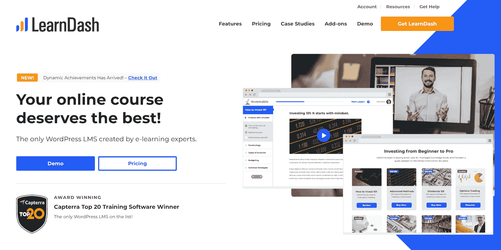

LearnDash。

LearnDash 也有会员模块，这样你就可以出售你的资源。然后，您可以根据学员的会员级别限制对内容的访问。

而且，LearnDash 完全支持内容滴漏。这使您能够推出新的模块、级别，甚至整个课程，因为成员们成功地学习了您的学习材料。

特别是，您可以使用该工具的成员特性来鼓励学习。例如，你可以奖励你的会员徽章和证书。你甚至可以创建特定课程的论坛来帮助促进社区意识。

如果你不打算出售内容，你可能会发现 LearnDash 的局限性，因为许多功能是专门为教育会员网站设计的。然而，如果你想在会员制的基础上出售你的课程，这个工具可能是完美的解决方案。LearnDash [许可证价格从 189 美元到 369 美元](https://www.learndash.com/pricing-and-purchase/)不等，包含一年的支持和更新。

## 如何用 WordPress 和 MemberPress 创建会员网站(5 个步骤)

创建会员网站有很多不同的方法。正确的解决方案会有所不同，这取决于你的目标受众和你计划销售的内容等因素。然而，WordPress 和 MemberPress 插件是一个强大的组合。

记住这一点，让我们看看如何使用这两个流行的软件创建一个会员网站。

### 步骤 1:创建一个基本会员网站

首先，我们建议安装一个[专业设计的会员主题](https://kinsta.com/blog/wordpress-membership-theme/)。有很多选择，但是[海洋主题](https://oceanwp.org/)是一个受欢迎的选择。

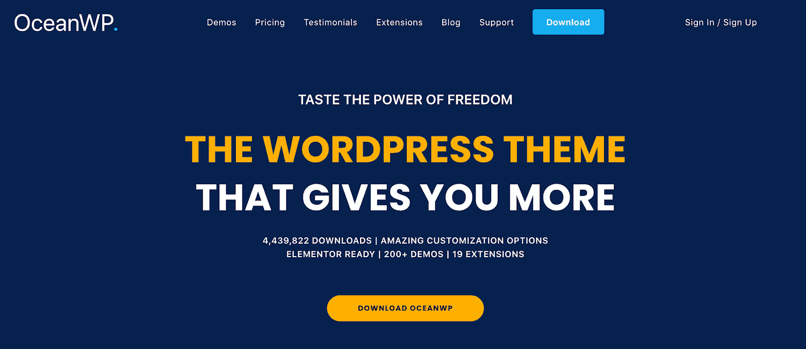

OceanWp 主题。

这个多用途的主题提供了一系列内置会员功能的演示站点。例如，它的[健身房演示](https://gym.oceanwp.org/membership/)为顾客提供了会员级别的选择。

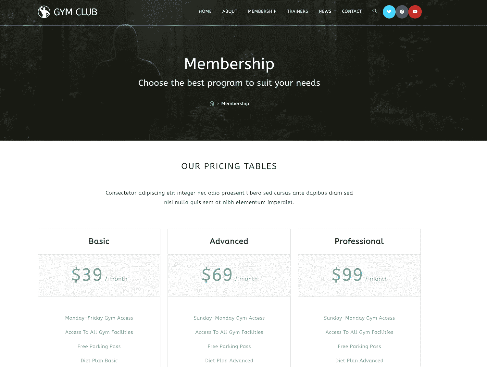

OceanWP 会员网站健身房 demo。

或者，如果你计划出售学习材料，[酒保](https://bartender.oceanwp.org/)授予会员进入[系列课程](https://bartender.oceanwp.org/our-courses/)的权利。选择你的主题后，你可以[安装并激活 MemberPress 插件](https://docs.memberpress.com/article/54-how-to-install-memberpress)。

接下来，导航到**成员按下>设置**。在此屏幕上，您可以输入您的 MemberPress 许可证密钥。一旦你成功激活了这个插件，选择**页面**标签。

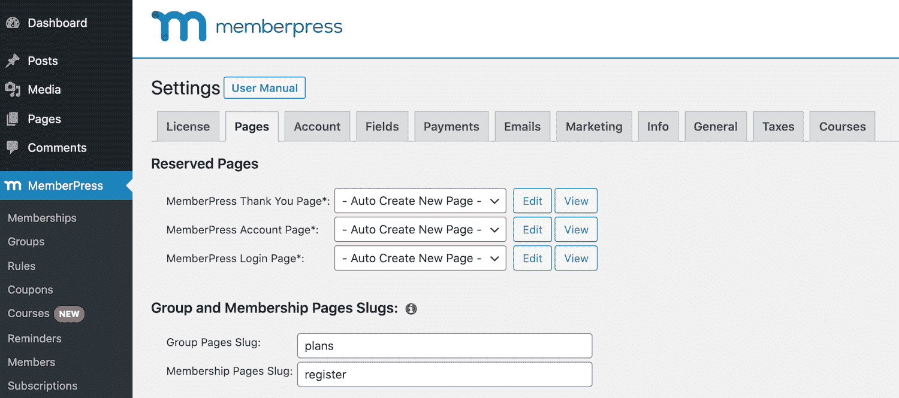

转到 MemberPress 设置。

MemberPress 可以自动生成您需要的所有页面，以提供一个正常运行的会员网站。要创建这些页面，请确保在所有**保留页面**下拉框中选择了**自动创建新页面**。然后，只需点击**更新选项**，MemberPress 就会创建一个登录、账户和感谢页面。

### 步骤 2:添加您的支付网关

有时，您可能只是将会员资格作为一种潜在客户开发工具。然而，如果你打算收费，你需要设置至少一个支付网关。为此，点击**支付**选项卡，然后点击 **+** 按钮。

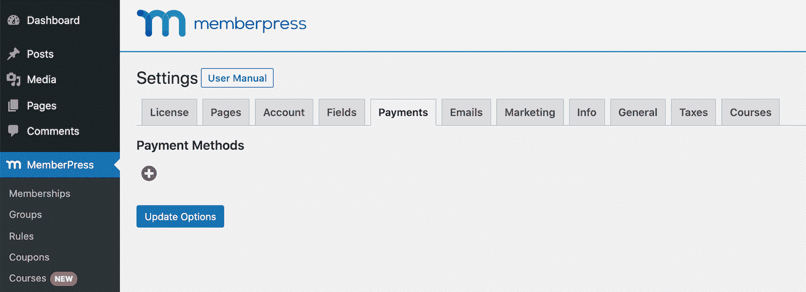

添加支付网关。

接下来，打开**网关**下拉菜单，选择您想要添加的支付方式。MemberPress 支持 Stripe、PayPal 快速结账、PayPal 标准和 Authorize.net。它还支持离线支付。

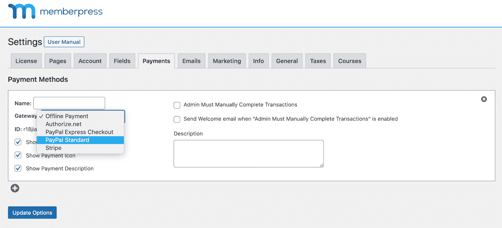

选择要添加的支付网关。

MemberPress 将显示您设置所选支付网关所需的所有设置。例如，如果您选择 **PayPal Standard** ，那么 MemberPress 将要求您提供与您的 PayPal 帐户相关的电子邮件地址。

为了推动转化，提供支付选项是一个好主意。您可以通过点击小小的 **+** 按钮向您的站点添加多个网关。

一旦你建立了所有的支付网关，点击**更新选项**。客户现在可以使用您选择的任何支付方式进行注册。

### 步骤 3:创建您的会员级别

接下来，是时候创建您的会员级别了。这可以是授予对您所有内容的访问权限的单一成员资格，也可以是多个级别。在您的仪表盘中，导航至**会员按下>会员>添加新会员**。

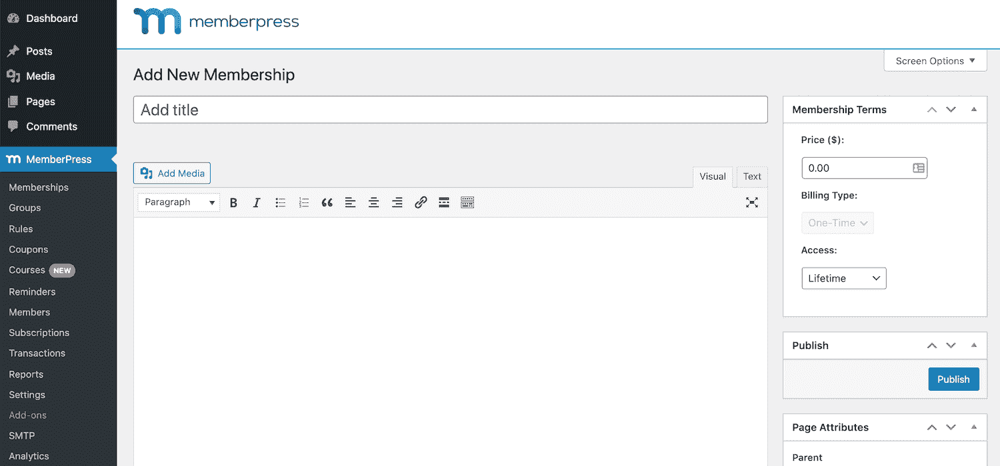

添加新会员。

您现在可以配置该成员级别。这包括输入标题、设置价格和指定计费类型。

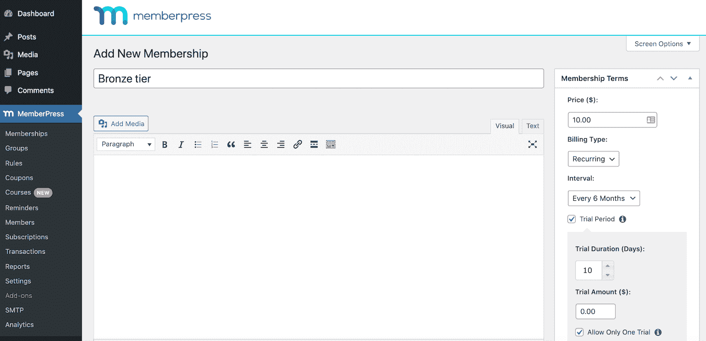

设置会员定价等选项。

一旦你对你输入的信息感到满意，点击**发布**。如果您想提供会员级别的选择，只需重复上述步骤。

下一步是定义每个成员级别可以访问哪些内容。这需要您创建规则，因此导航到**member press>Rules>Add New**。

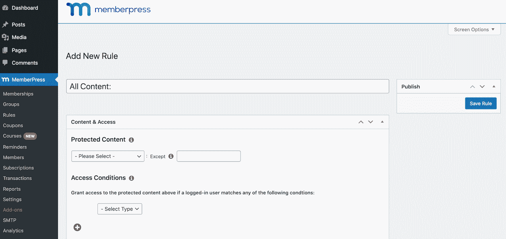

添加不同的会员规则。

您现在可以配置您的规则。例如，您可以指定所有分配了特定标签的内容应该只允许青铜级成员访问:

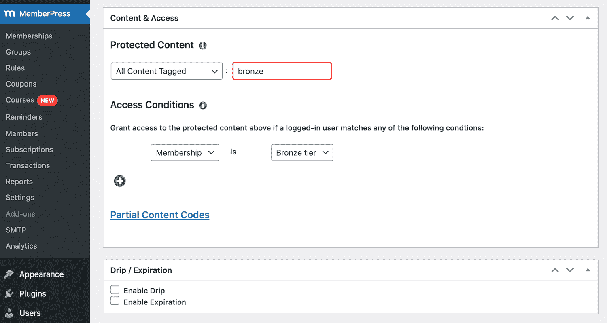

配置会员规则。

完成所有字段后，保存您的规则。冲洗并重复为您的会员网站创建多个规则。

### 第四步:实施你的定价计划

假设您对会员收费，您需要创建一个定价计划。在这个页面上，潜在客户可以查看您的所有层级并比较它们的价格。

一个设计良好的定价页面可以吸引访问者的注意力，并传达他们做出明智的购买决定所需的所有信息。这样，你的定价页面可以提高访客体验*和*你的转化率。

要创建这个重要页面，请导航到**成员按下>组>添加新的**:

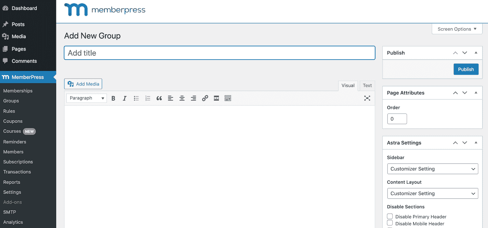

添加新的会员群。

首先，给这个页面一个描述性的标题，比如**定价计划**。接下来，滚动到**群组选项**部分，添加您想要在此网页上显示的所有会员。然后，您可以选择定价页面的主题。

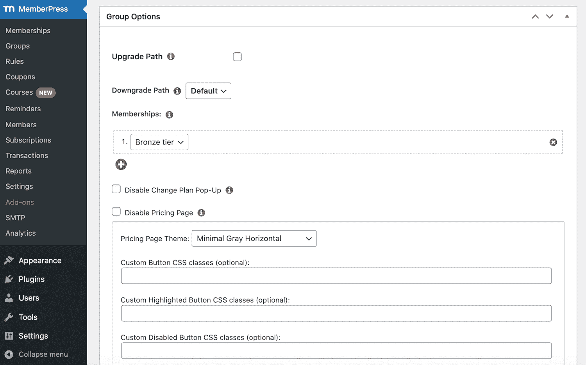

添加分组选项。

配置好所有选项后，点击**发布**按钮。您的定价页面现已上线。

### 步骤 5:添加登录表单

每个会员网站都需要一个登录表单。因为这是你的会员网站的一个非常重要的元素，所以确保这种形式总是在手边是一个好主意。

MemberPress 为您提供了通过小部件添加用户登录表单的选项。这非常适合将该表单添加到站点的重复元素中，例如页脚或侧边栏。

要将登录小部件添加到您的站点，请导航到**外观>小部件**。然后，您可以将 **MemberPress 登录**小部件添加到任何小部件就绪区域:

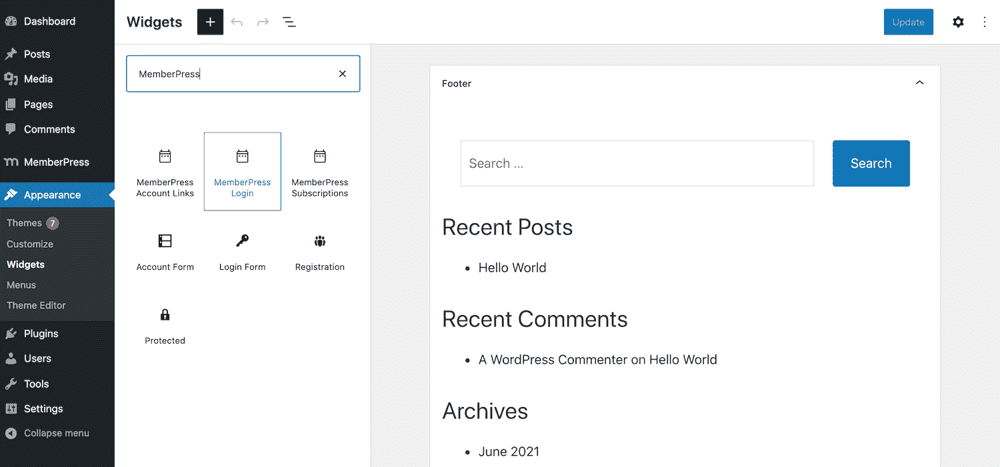

添加登录表单小部件。

为了推动转化，我们还建议将定价页面添加到您的主导航菜单中。这确保了感兴趣的访问者只需点击几下鼠标就能获得你的价格信息。

要编辑你站点的菜单，导航到**外观>菜单**。然后，您可以选择您的主导航菜单，并添加您刚刚创建的定价页面。

[Ready to make your best content members-only? 🤐 Start here, and get ready to see higher conversions and engagement rates 📈Click to Tweet](https://twitter.com/intent/tweet?url=https%3A%2F%2Fkinsta.com%2Fblog%2Fcreate-a-membership-website%2F&via=kinsta&text=Ready+to+make+your+best+content+members-only%3F+%F0%9F%A4%90+Start+here%2C+and+get+ready+to+see+higher+conversions+and+engagement+rates+%F0%9F%93%88&hashtags=WordPress%2CWPTips)

## 摘要

一次性销售固然很好，但商业成功的关键在于持续的收入。通过出售会员资格，你可以建立一个安全、可靠的收入来源，可以维持你的业务几个月甚至几年。

让我们快速回顾一下如何用五个步骤创建会员网站:

1.  确定你的目标受众。
2.  决定会员模式。
3.  选择一个平台，比如 WordPress。
4.  创建一些仅限成员的内容。
5.  使用 [Kinsta APM](https://kinsta.com/blog/membership-website-speed/) 等工具监控您的会员网站的性能。

关于如何运营一个成功的会员网站，你有什么问题吗？请在下面的评论区告诉我们！

* * *

让你所有的[应用程序](https://kinsta.com/application-hosting/)、[数据库](https://kinsta.com/database-hosting/)和 [WordPress 网站](https://kinsta.com/wordpress-hosting/)在线并在一个屋檐下。我们功能丰富的高性能云平台包括:

*   在 MyKinsta 仪表盘中轻松设置和管理
*   24/7 专家支持
*   最好的谷歌云平台硬件和网络，由 Kubernetes 提供最大的可扩展性
*   面向速度和安全性的企业级 Cloudflare 集成
*   全球受众覆盖全球多达 35 个数据中心和 275 多个 pop

在第一个月使用托管的[应用程序或托管](https://kinsta.com/application-hosting/)的[数据库，您可以享受 20 美元的优惠，亲自测试一下。探索我们的](https://kinsta.com/database-hosting/)[计划](https://kinsta.com/plans/)或[与销售人员交谈](https://kinsta.com/contact-us/)以找到最适合您的方式。