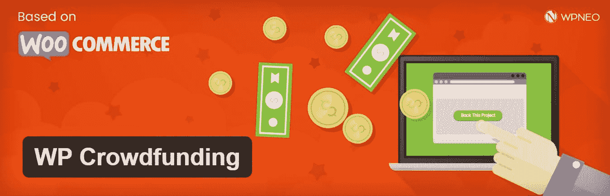
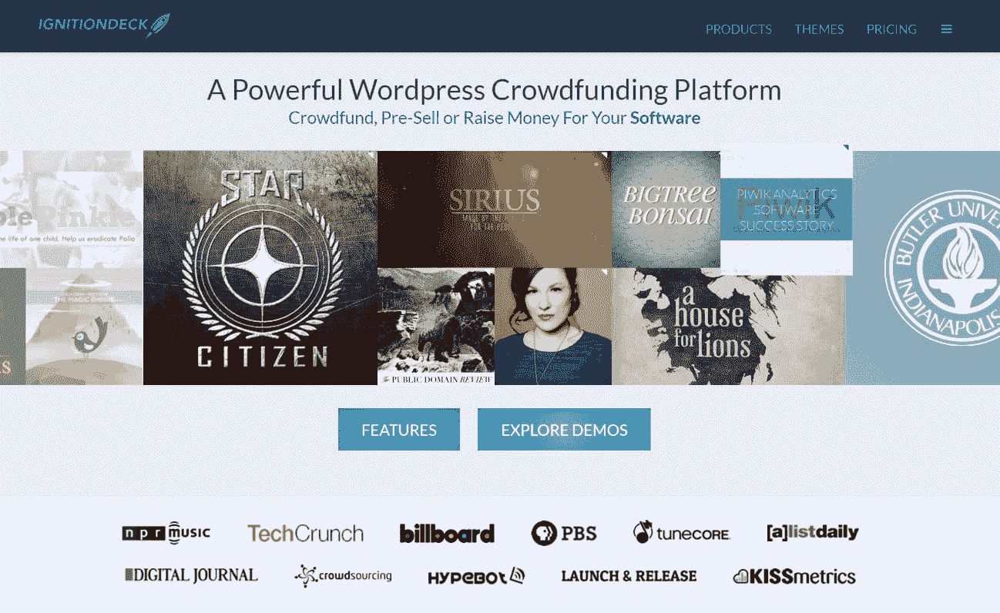
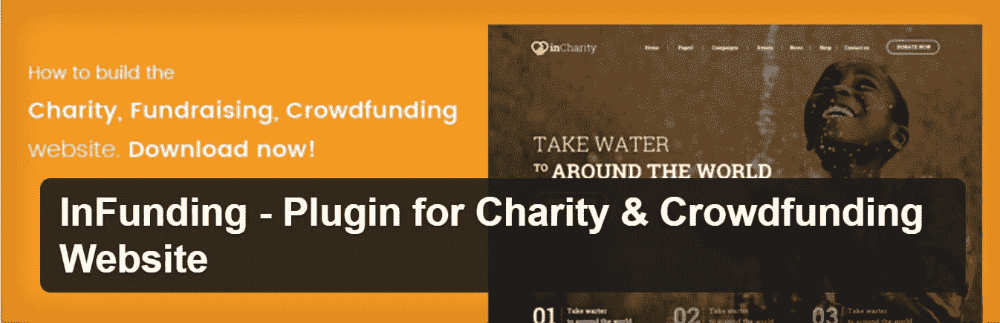
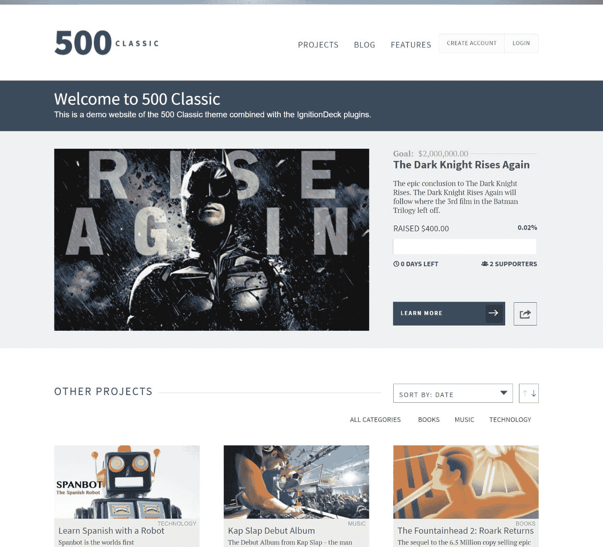
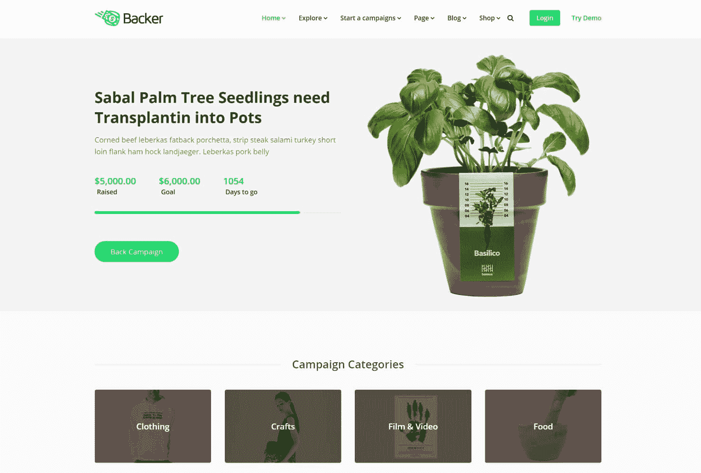
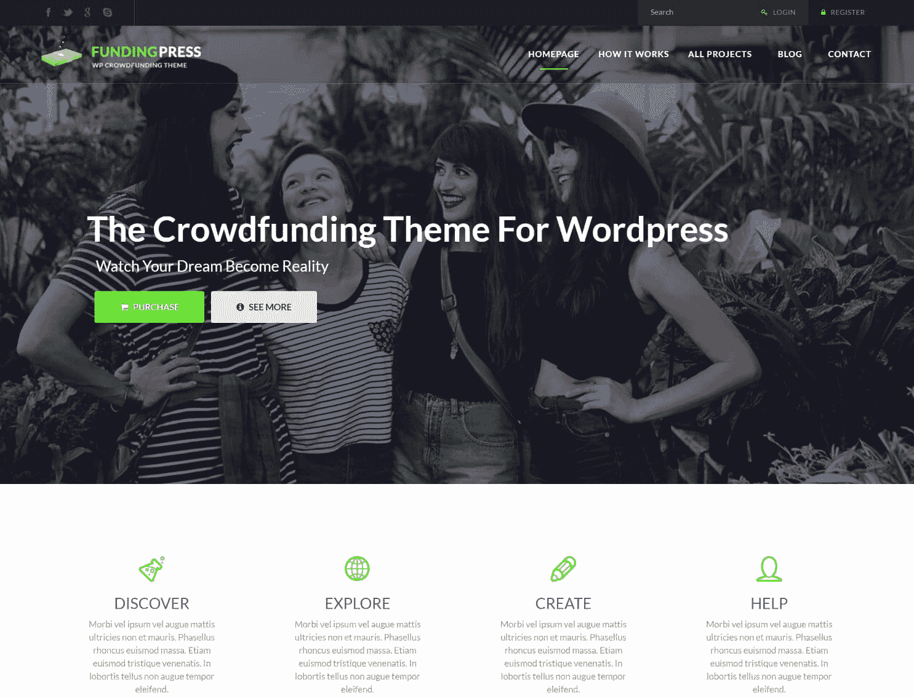

# WordPress 网站的 11 个最佳众筹选择

> 原文：<https://kinsta.com/blog/crowdfunding-options-wordpress/>

众筹可以被描述为在朋友、家人、客户和投资者的帮助下筹集资金的过程。这通常是通过网站或社交媒体在线完成的，以接触到大量受众。如果你打算在 WordPress 上进行任何形式的众筹，你来对地方了。你不必使用 Kickstarter 或 Go Fund Me，你可以在你自己的网站上做！这里列出了一些顶级的众筹选项、筹款解决方案和接受捐赠的[方式](https://kinsta.com/blog/wordpress-donation-plugins/)，其中包括 WordPress 的插件&主题。

## 2022 年最佳众筹 WordPress 插件

为了帮助你筛选所有可用的选项，这里有 6 个值得一看的 WordPress 众筹插件(排名不分先后)。其中一些也可以用于筹款或接受捐赠。

*   [WP 众筹](#wp-crowdfunding)
*   [点火甲板众筹&商业](#ignitiondeck)
*   [WordPress 筹款](#fundraising)
*   [给](#give)
*   [推断](#infunding)
*   【WooCommerce 众筹

### 1。WP 众筹

WP 众筹是一个很棒的 [WordPress 插件](https://kinsta.com/best-wordpress-plugins/)，是由 Themeum 的团队为筹款/资助网站开发的。对于众筹选项来说，这是一个很好的解决方案，因为它与 [WooCommerce](https://kinsta.com/blog/woocommerce-tutorial/) 集成在一起，让你像 Kickstarter 一样推出一个网站。它目前有超过 1，000 个活跃安装，五星评级为 4.5，并且正在积极更新。

WP Crowdfunding plugin

这个插件的免费版本提供了大部分选项，否则，你可能需要购买高级版本。您可以在这个插件中做一些事情，包括:

*   用户注册，提交表格，项目开始和结束日期
*   定价选项和融资目标
*   项目更新选项
*   专题图片和视频
*   带交付日期的奖励系统

[高级版](https://www.themeum.com/product/wp-crowdfunding-plugin/)还包括以下附加功能:

> Kinsta 把我宠坏了，所以我现在要求每个供应商都提供这样的服务。我们还试图通过我们的 SaaS 工具支持达到这一水平。
> 
> <footer class="wp-block-kinsta-client-quote__footer">
> 
> 
> 
> <cite class="wp-block-kinsta-client-quote__cite">Suganthan Mohanadasan from @Suganthanmn</cite></footer>

[View plans](https://kinsta.com/plans/)

*   通过 PayPal Adaptive、Stripe Connect、Skrill、Authorize.net 等分发所有资金。
*   集中式本机钱包系统:项目所有者可以在筹集到一定数量的资金后向管理员发送撤回请求。它计算可提取的项目资金，网站佣金，并生成统计数据。
*   分析报告
*   电子邮件通知
*   报告
*   社交分享

### 2。点火甲板众筹&商业

[IgnitionDeck](https://wordpress.org/plugins/ignitiondeck/) 可能是 WordPress 领域最知名的众筹解决方案和插件之一。它目前有超过 3，000 个活跃安装，五星评级为 3.5。

IgnitionDeck Crowdfunding plugin

Ignition Deck 过去曾与 AppThemer 合作，构建众筹 WordPress 主题。该插件适用于任何 WordPress 主题，这意味着你不必购买一个新的主题来开始。虽然插件本身是免费的，但你很可能需要购买他们的 IgnitionDeck 高级版本，才能充分利用所有的众筹功能。你可以在试用免费版后确定。当你安装插件时，一个小部件会被添加到你的仪表盘中，你可以将它插入到边栏中，向你的访客突出显示你的众筹活动。这个插件为开发者提供了[综合资源](http://ignitiondeck.com/id/resources/ "comprehensive resources")，以及关于 WordPress 一般功能的文章。

IgnitionDeck

点火甲板插件的高级版本比免费版本强大得多，它值得自己的描述。高级插件包与各种不同的皮肤捆绑在一起，这些皮肤具有几乎受 iOS 启发的设计。皮肤的列配置允许您以有序的方式显示有关某些众筹活动的信息，您可以在每个活动的小窗口中突出显示活动目标、捐赠者数量、筹集的金额、结束日期、筹集的百分比以及一个号召人们处理捐赠的按钮。

Ignition Deck 还有一个独特的功能，这是其他插件无法提供的——可以访问大量的扩展。这些扩展有无数的功能。例如，[你可以将比特币](https://kinsta.com/blog/bitcoin-donate-button/)、WePay、亚马逊、[、布伦特里](https://kinsta.com/blog/stripe-vs-braintree/)、PayPal 和 Stripe [支付网关](https://kinsta.com/blog/woocommerce-payment-gateways/)添加到你的众筹网站。您也可以购买一个扩展，允许您配置您的持续联系自动回复器，这样每个捐赠者都可以注册到您的邮件列表中。Twilio SMS 扩展允许您收到新捐款的短信通知。几乎每一个场景都有一个扩展来实现你想要的每一个功能。

该插件将与任何主题一起工作，但只有少数主题有内置的风格和点火甲板的自定义选项(我们将在这篇文章的后面看一些)。开发者还发布了几个优质的 WordPress 主题，旨在与插件一起平稳运行(你也会在后面的帖子中看到它们)。从各方面考虑，Ignition Deck 的高级版本可能是 WordPress 最受欢迎的独立插件众筹解决方案。你最好买下它。

### 3。WordPress 筹款

**更新:**截至 2019 年 5 月，该插件已经退役，WPMUDev 不再支持。他们[已经在 Github](https://github.com/wpmudev/fundraising) 上发布了代码，供那些可能想要根据自己的需要派生和维护代码的技术人员使用。

WordPress 筹款是 WPMU Dev 的人发布的一个插件。该插件功能齐全，兼容任何主题，集成了 [WordPress Multisite](https://kinsta.com/wordpress-multisite-hosting/) 和 BuddyPress，让你有可能创建一个成熟的众筹网络。

WPMUDEV WordPress Fundraising plugin

您可以选择在收到资金后立即接收资金，或者只有在项目获得全部资金后才接收资金。可以设置每个新项目的截止日期，并且可以为特定的贡献级别定制捐赠者奖励。您还可以允许重复捐款，创建个性化的感谢信息，并使用多种货币。

要获得 WordPress 筹款插件，你可以每月 19 美元购买它，以及更新和支持，或者你可以每月 24.50 美元成为 WPMU 会员，从 WPMU 开发者那里获得上述所有东西以及大量其他好处。

### 4。给予

Give 是一个 WordPress 捐赠插件，由 WordImpress 的 awesome 团队创建。这些家伙在 WordPress 社区非常活跃，并且非常擅长保持他们的插件更新。虽然这是[更多的捐款](https://kinsta.com/blog/wordpress-donation-plugins/)，你可以用它作为一种众筹的方式。然而，如果你试图创建一个 Kickstarter 克隆，你不会找到你可能会寻找的典型功能。我们提到的其他插件可能更适合这个。但是如果你想要一个接受群众捐款的方式，Give 是一个你不能忽视的插件！

Give plugin

Give 插件目前有超过 20，000 个活跃安装，令人印象深刻的 4.8 分(五星评级)。Give 允许你通过一个有效的平台为你的事业筹集资金。它的一些功能包括:

*   使用单页表格进行无障碍捐赠
*   从 MailChimp 到 Zapier 和 Stripe 的各种高级附加组件
*   一些非常棒的目标跟踪报告功能
*   轻松兼容所有开箱即用的 WordPress 主题
*   免费提供 PayPal 标准支付和离线支付

### 5。投资

是一个免费的 WordPress 众筹插件，用于创建一个慈善项目，并呼吁通过 PayPal 或银行转账进行捐赠。这是由 InwaveThemes 的团队创造的。它目前有超过 500 个活跃安装，获得 4.5 分的五星评级。

InFunding plugin

融资的一些特征包括:

## 注册订阅时事通讯

### 想知道我们是怎么让流量增长超过 1000%的吗？

加入 20，000 多名获得我们每周时事通讯和内部消息的人的行列吧！

[Subscribe Now](#newsletter)

*   能够创建和管理您的慈善活动、捐款和捐赠者
*   有易于使用的不同风格和参数的短代码
*   一切都 100%有反应
*   易于定制的布局

### 6。WooCommerce 众筹

另一个你在寻找众筹选项时应该查看的免费插件是 WooCommerce 的[众筹。这是由 Algoritmika Ltd 的团队开发的，他们目前在 WordPress 知识库中有超过 30 个插件，其中大部分与 WooCommerce 相关。当涉及到构建适合电子商务解决方案的解决方案时，这些人并不陌生。该插件目前有超过 500 个活跃安装，5 星评级中的 5 星。](https://wordpress.org/plugins/crowdfunding-for-woocommerce/)

Crowdfunding for WooCommerce plugin

WooCommerce 的众筹允许你编辑和添加产品，就像你通常在商店里做的那样。然后，您可以编辑您的抵押金额、开始和结束日期、按钮标签，甚至启用“开放定价”一些附加功能包括:

*   供用户添加活动的表单
*   修改诸如目标、剩余时间、资金多少等信息。
*   活动的开始和结束日期
*   CSS 样式的进度条，用于显示活动进度的状态
*   大量的金钱和时间来提供更多的数据
*   多站点支持

## 众筹选项——WordPress 主题

这里有 5 个值得关注的 WordPress 众筹主题(排名不分先后)。

*   [500 经典](#500classic)
*   [靠山](#backer)
*   [筹资压力](#fundingpress)
*   [天生给予](#born-to-give)
*   [统一](#unity)

### 1。500 经典

500 Classic 实际上是一个免费的主题，是上面提到的 IgnitionDeck 的 500 框架的一部分。

500 Classic WordPress theme

该公司已经在 500 框架上开发了几个主题，都是高级的，需要购买点火甲板插件才能众筹。主题有暗亮点，和他们的大部分主题矛盾。对于一个众筹网站来说，排版清晰，布局简单，主题完美。如果你预算不多，你肯定想去看看 500 经典。

Struggling with downtime and WordPress problems? Kinsta is the hosting solution designed to save you time! [Check out our features](https://kinsta.com/features/)

### 2。支持者

[Backer](https://www.themeum.com/product/backer/) 是一个现代的众筹主题，有着很棒的极简设计。主题的样式非常注重空白，给你的内容足够的空间来呼吸。排版很好地衬托了文本。还随主题包免费提供 WP 众筹高级插件。

Backer crowdfunding WordPress theme

Backer 主题最近被完全重写，现在甚至包括了流行的 Elementor 页面生成器。它是完全响应的和视网膜就绪的，有大量的短代码、谷歌字体和许多不同的布局选项。它还附带了 [WPML 的支持](https://kinsta.com/blog/wordpress-multilingual/)。

一旦你建立了你的众筹项目，你可以选择在你的主页上用两种内置设计风格的整洁的小网格来显示它们。这个主题打包了定制的小部件,可以显示项目类别，并允许访问者搜索你现有的项目。该主题的一个特别酷的功能是前端提交选项，所以你的网站甚至有可能成为其他人寻求众筹自己项目的资源，就像 Kickstarter 一样。

### 3。基金会出版社

Fundingpress 是一个漂亮的小主题，有一个很好的好处:你不需要任何外部插件，如 IgnitionDeck、Easy Digital Downloads、WooCommerce 等，就可以真正开始一个众筹项目。你需要的一切都在购物包里。

FundingPress WordPress theme

造型很基础。它绝不会打击任何人的思想，但它很好地完成了工作，让你突出什么是重要的:内容。

内置的众筹功能非常实用，只有达到目标金额时，才可以选择收集资金。像靠山主题一样，它也有前端项目提交的选项，它带有层滑块，集成了一个很酷的 1-5 星评级系统，适用于您的帖子类型。

然而，在超过 1400 次销售后，Fundingpress 只能在 ThemeForest 上获得 3.5 星的评级；一些用户抱怨很难与开发者取得联系以获得支持，所以如果你决定购买，请记住这一点。

### 4。生来给予

[Born to Give](https://themeforest.net/item/born-to-give-charity-crowdfunding-responsive-wordpress-theme/15709244) 是一个反应灵敏的 retina ready WordPress 主题，专门关注为[慈善机构和非营利组织](https://kinsta.com/blog/wordpress-for-nonprofits/)进行众筹。

Born to Give WordPress theme

“与生俱来”主题具有非常优雅和现代的外观。它基于流行的 Twitter Bootstrap 3x 框架，使其适用于所有屏幕尺寸。它可以轻松集成 PayPal、Stripe、Authorize.net、PayFast，甚至 PayUMoney。它从开发者那里接收定期更新，拥有 4.4 的五星评级和超过 750 的销售额。

该主题实际上有一个免费的内置事件管理器，并且是 WPML 兼容的。它利用免费的慈善 WordPress 插件来发起和维持众筹活动。

### 5。一致

如果你正在寻找 WordPress 众筹选项，Unity 是另一个很好的主题。这个主题实际上是建立在简单的数字下载基础上的，但也支持 WooCommerce。它完全响应，并建立在 WPO 框架和 Bootstrap 3.0 之上。

Unity WordPress theme

Unity 主题是非常可定制的，内置了一个实时主题编辑器。编辑这个主题不需要知道代码。然而，尽管如此，它也是为开发人员设计的，甚至 Sass 也有支持。该主题有超过 750 个销售，4 个五星评级。

## 包扎

如今，你不必求助于 Kickstarter、Go Fund Me 和 You care 这样的网站来建立自己的众筹活动。相反，你可以在自己的网站上看起来很专业地开展活动，而不必向第三方网站支付任何费用。TechCrunch 还出版了一整本[众筹指南](https://techcrunch.com/2017/02/27/2017-crowdfunding-guide/)，值得一读。通过一些真实的例子，进一步了解如何成功开展活动。

有了这样的众筹插件和主题，WordPress 变得更加强大，不仅仅是一个博客软件。你还在等什么？下载其中一个众筹选项，今天就开始在你自己的 WordPress 网站上筹集资金吧！

* * *

让你所有的[应用程序](https://kinsta.com/application-hosting/)、[数据库](https://kinsta.com/database-hosting/)和 [WordPress 网站](https://kinsta.com/wordpress-hosting/)在线并在一个屋檐下。我们功能丰富的高性能云平台包括:

*   在 MyKinsta 仪表盘中轻松设置和管理
*   24/7 专家支持
*   最好的谷歌云平台硬件和网络，由 Kubernetes 提供最大的可扩展性
*   面向速度和安全性的企业级 Cloudflare 集成
*   全球受众覆盖全球多达 35 个数据中心和 275 多个 pop

在第一个月使用托管的[应用程序或托管](https://kinsta.com/application-hosting/)的[数据库，您可以享受 20 美元的优惠，亲自测试一下。探索我们的](https://kinsta.com/database-hosting/)[计划](https://kinsta.com/plans/)或[与销售人员交谈](https://kinsta.com/contact-us/)以找到最适合您的方式。