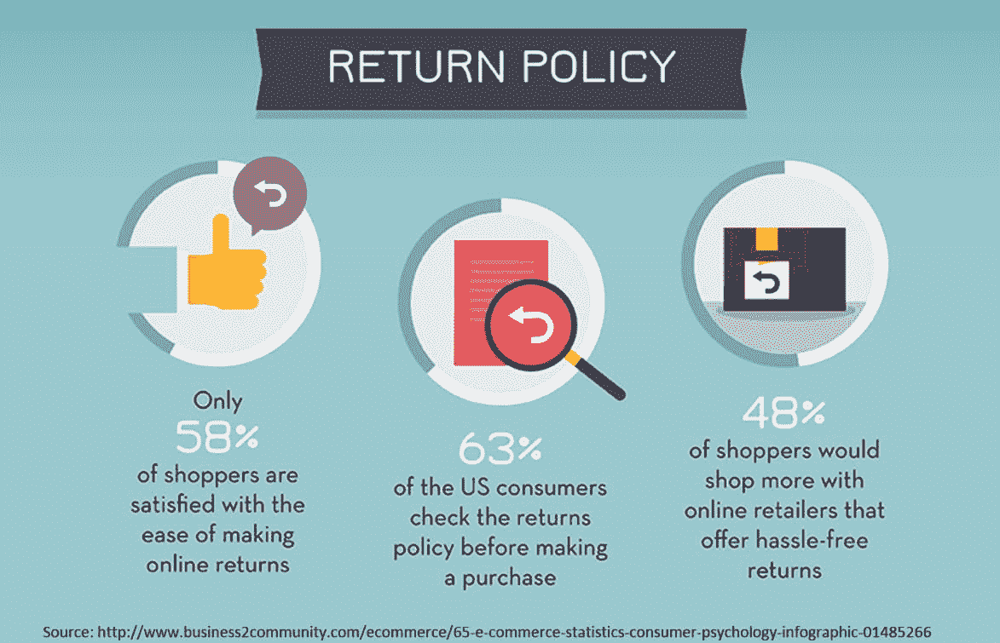
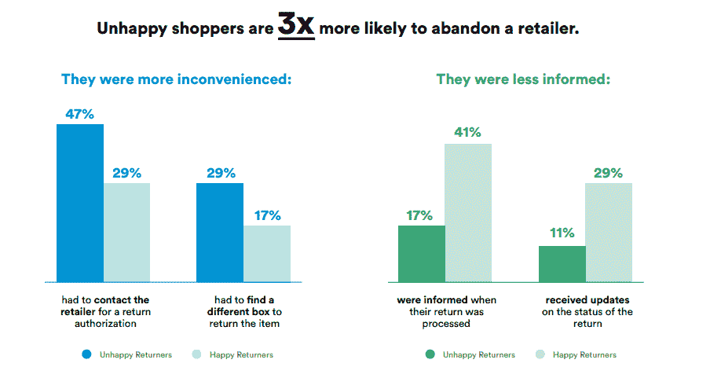
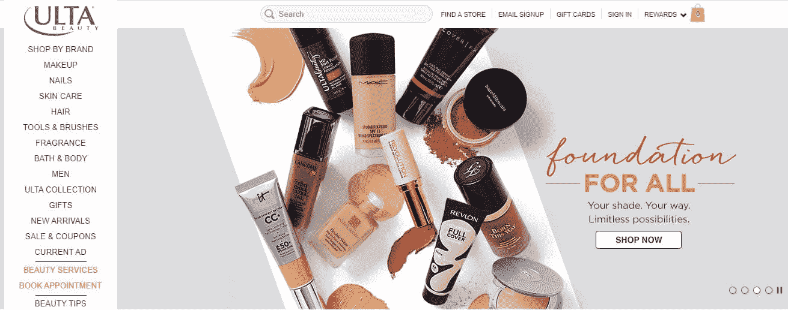
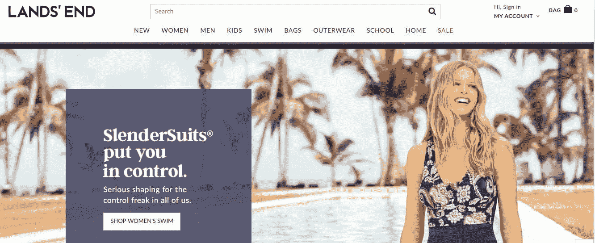
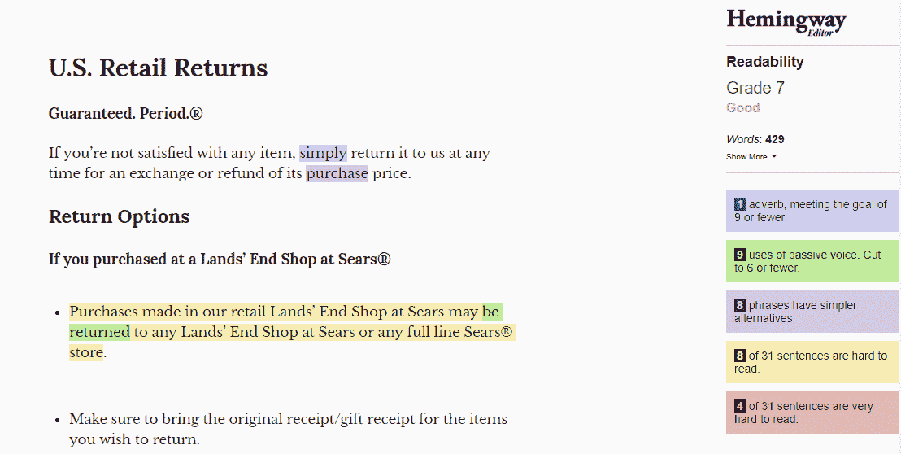
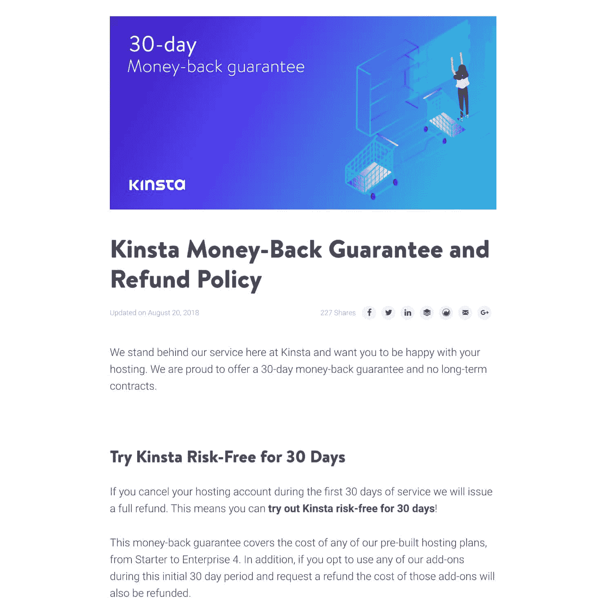
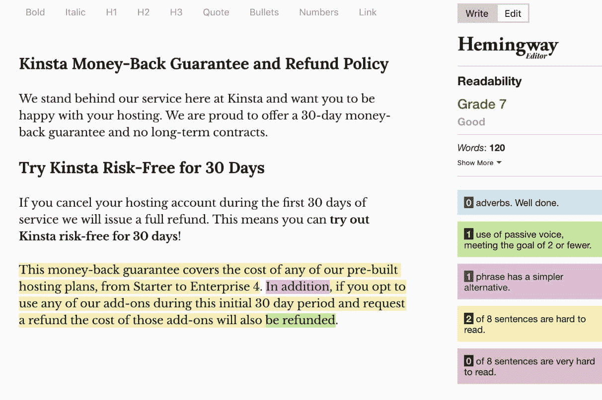
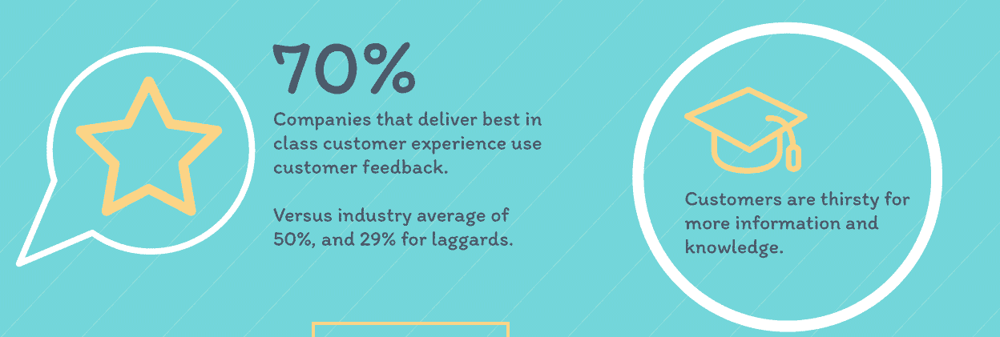
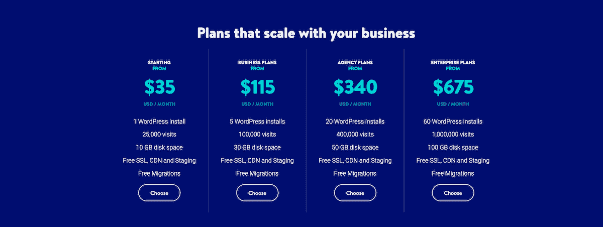
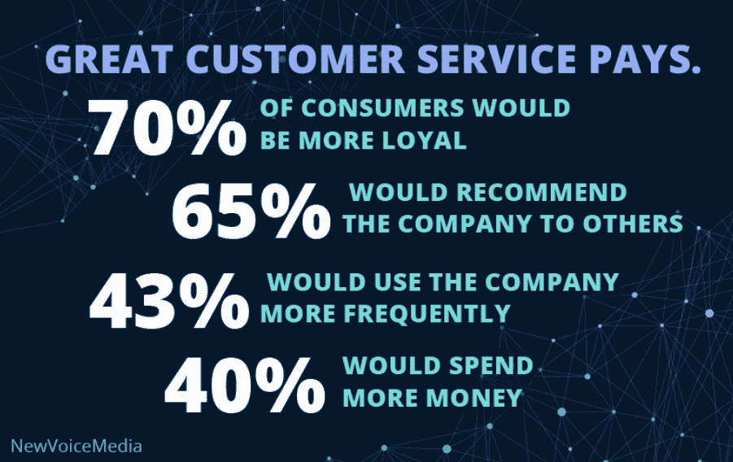

# 难以置信的留住客户的 5 个技巧

> 原文：<https://kinsta.com/blog/customer-retention/>

想象一下:这是一个潮湿多雨的夜晚。你和你的另一半都不想做饭，所以你们开始了由来已久的争论去哪里拿晚餐的传统。经过一番讨价还价，你同意开车穿过城镇去你最喜欢的餐馆。这不是在雨中到达的最方便的餐馆——它甚至不是最便宜的——但是你仍然愿意不怕麻烦去那里吃饭。

为什么？因为那家餐馆已经做了一些事情，把你从普通消费者转变为忠诚的、不易流失的顾客。这让他们变得辉煌，因为客户维系是低成本盈利的[金矿](https://www.ngdata.com/what-is-customer-retention/)。

你可能已经听说过，留住回头客比获得一个新客户便宜五倍，但是有些事情你可能不知道。平均来说，回头客贡献了 40%的商业收入([来源](https://blog.smile.io/repeat-customers-profitable-stats-to-prove))。

仅仅提高你的留存率 5%就能增加你的利润[从 25%到高达 95%](https://www.second-to-none.com/understanding-the-importance-of-customer-retention-rates/) 。所以，如果你不努力留住你的客户，你就错过了一些重要的机会。但是万一你需要更多的说服力，可以考虑下面的两个故事。

在咨询和专业服务巨头 Cognizant 的帮助下，一家保险公司[通过部署有针对性的客户维系计划获得了 180%的投资回报率](https://www.cognizant.com/case-studies/insurance-customer-retention-strategy)。

这一个更令人吃惊:通过客户维系活动，门奇的冷冻酸奶获得了 5300%的投资回报率。

你如何复制他们的成功？虽然每个消费者群都是不同的，但在本指南中，我会向你展示五种行之有效的方法来提高你的客户保持率。

[On average, repeat customers are responsible for 40% of a business’s revenue. 🤑Click to Tweet](https://twitter.com/intent/tweet?url=https%3A%2F%2Fbit.ly%2F2YXPDCJ&via=kinsta&text=On+average%2C+repeat+customers+are+responsible+for+40%25+of+a+business%E2%80%99s+revenue.+%F0%9F%A4%91&hashtags=smallbusiness%2Cstartups)

1.  [摇摆你的退货或退款政策](#returns-policy)
2.  [对他们的反馈做出反应](#customer-feedback)
3.  [自动化您的 CRM](#automate-crm)
4.  [建立黑仔奖励计划](#rewards-programs)
5.  [提升自己的体验](#elevate-experience)

## 1.摇滚你的退货或退款政策

首先，你需要一个摇滚明星式的退货政策。63%的网上购物者会在购物前查看你的退货政策。

> 需要在这里大声喊出来。Kinsta 太神奇了，我用它做我的个人网站。支持是迅速和杰出的，他们的服务器是 WordPress 最快的。
> 
> <footer class="wp-block-kinsta-client-quote__footer">
> 
> 
> 
> <cite class="wp-block-kinsta-client-quote__cite">Phillip Stemann</cite></footer>

[View plans](https://kinsta.com/plans/)

但是一个好的退货政策不仅仅是获得顾客的必要条件。这对于[留住他们回来享受更多](https://www.bigcommerce.com/blog/create-a-returns-and-exchanges-policy-that-sells/)也很重要。根据 CommerceHub 的一项研究，这些购物者中有 48%表示，如果零售商提供轻松的退货，他们会在网上购买更多。

Return policy – customer retention (Image source: CommerceHub)

友好的退货政策意味着顾客更满意。这也意味着更好的销售和更低的流失率。

研究发现，实行强硬退货政策的商店净销售额减少了近 9%，顾客流失的可能性增加了三倍。

Return process facts (Image source: [Narvar](http://see.narvar.com/rs/249-TEC-8img/Narvar_Consumer_Survey_Returns_June2017.pdf))

但这不仅仅有利于提高客户满意度。出色的退货政策和便捷的流程有助于提升您的整体客户体验和忠诚度。

在线服装零售商 Chubbies 看到了这一点，他们将[退货时间缩短了 50%](https://www.easypost.com/chubbies-case-study.html) ，并看到了客户体验的立即改善。履行经理 James“Tater”harge TT 解释道:

> 这种轻松的退货体验是保持客户忠诚度和重复购买的关键。

由于建立客户忠诚度的最重要因素是减少客户的努力，詹姆斯说得很对。

那么，如何创建一个伟大的退货政策呢？首先，让我们看一些客户喜爱的政策的例子，看看大狗们是怎么做的。

### 示例 1–ULTA

Ulta

这家美容巨头也坚守他们的承诺:如果顾客订购了不适合他们的粉底，[退货过程简单直接](https://www.ulta.com/guestservices/guestServicesCenterDetails.jsp#ReturnPolicy)。为消费者提供多种退货途径，Ulta 退货政策的高明之处不仅仅在于它有多么慷慨和灵活。

这也是它的可读性。看一看快速分析:

Return policy readability

组织清晰的视觉层次，以用户友好的“9 级”水平编写，难怪 Ulta 的退货政策经常成为美容行业的最佳政策之一，尽管目前存在争议。

让我们看看另一个排行榜冠军。

### 示例 2–土地的尽头

Land’s End

简洁而低调的另一家零售商 Lands' End 的退货政策经常给 T2 带来一些严肃的赞誉。与 Ulta 一样，Lands' End 为消费者提供了多种退货途径，并以一种易于阅读的格式展示了他们的政策。

但是它们把可读性提高到了一个全新的水平。看看这个。

Return policy readability

简短，扫描友好，为超可读性而写，Lands' End 是消费者想要和应该得到的退货政策。

### 示例 3——Kinsta

Kinsta refunds

如果你是一个 SaaS 人，同样的事情也应该适用于你在 T2 的退款政策。以金斯塔的退款政策为例。我们尽量让它简短，简单，切中要点。我们希望客户知道我们支持我们的服务，并且不涉及长期合同。

Refund policy readability

好的，你如何将它应用到你的退货政策中呢？

试着遵循“接吻”规则:[“保持简单，笨蛋。”](https://www.interaction-design.org/literature/article/kiss-keep-it-simple-stupid-a-design-principle)

*   你的退货或退款政策越短越好。看看兰兹的结局就知道了。
*   您的退货越快，您的客户就越高兴。看看 Chubbies 的结果。
*   灵活:消费者对退货的选择越多，你的生意就越好。
*   让它对读者友好。如果它读起来像一篇微观经济学论文，那就扔掉它。
*   使用像[海明威编辑器](http://www.hemingwayapp.com/)这样的应用程序来检查你的可读性水平。
*   你的退货和退款政策很可能会被成千上万的顾客看到，所以千万不要忘记[校对](https://kinsta.com/blog/proofreading-tips/)它。

就这么简单。但是我们的下一个客户保持策略更加简单。想留住你的客户？对他们做出回应和反应。

## 2.对他们的反馈做出反应

[70%的顶级客户体验](https://www.unicomcorp.com/blog/customer-experience-statistics-infographic/)交付者使用反馈。

Customer feedback

通过听取反馈来提供卓越的客户体验不仅会让您的客户更开心。这也让他们不太喜欢搅动。Terminix 利用客户反馈挽回了总计 20，000，000 美元的收入损失，并[将其流动率降低了 33%](https://conversionxl.com/blog/customer-retention-strategy/) 。

和其他发现反馈力量的人一样，Terminix 知道这不仅仅是回应客户的反馈。[你要对](https://www.typeform.com/blog/guides/customer-success/improve-retention-and-loyalty-through-feedback/) [*做出反应*](https://www.typeform.com/blog/guides/customer-success/improve-retention-and-loyalty-through-feedback/) [对它](https://www.typeform.com/blog/guides/customer-success/improve-retention-and-loyalty-through-feedback/)也是如此。

这就是为什么我们不仅仅是给 Kinsta 一个全新的外观:我们听到客户说他们想要更多的入门级计划，[所以我们提供了](https://kinsta.com/blog/new-kinsta/)。

Kinsta plans

用户还要求[多用户权限和角色](https://kinsta.com/feature-updates/multi-user-access-permissions/)，因此我们现在已经将其构建到 MyKinsta 仪表板中。事实上，如果你看看 Kinsta 的[功能更新](https://kinsta.com/feature-updates/)，我们发布的几乎所有东西都是基于用户反馈的。如果没有它，我们的托管平台就不会一样了。

除了降低流失率，利用反馈来定制客户体验也有助于提高他们的消费能力。看看这个。

70%的消费者对优质的客户服务更加忠诚，40%的人说他们会因为这种服务而花更多的钱。

Great customer service (Image source: WalkMe)

但是如果你需要更多的证据，考虑一下伟人的故事。这家鞋企通过倾听和回应顾客反馈，建立了高达 50%的复购率。你可以看到他们的团队在行动。

> 听到这个消息我们很难过，不应该花这么长时间。请发电子邮件[【电子邮件保护】](/cdn-cgi/l/email-protection)告知您的详细信息，有人会调查您的订单。谢谢大家！
> 
> —GREATS(@ GREATS brand)[2018 年 5 月 31 日](https://twitter.com/greatsbrand/status/1002213160718360581?ref_src=twsrc%5Etfw)