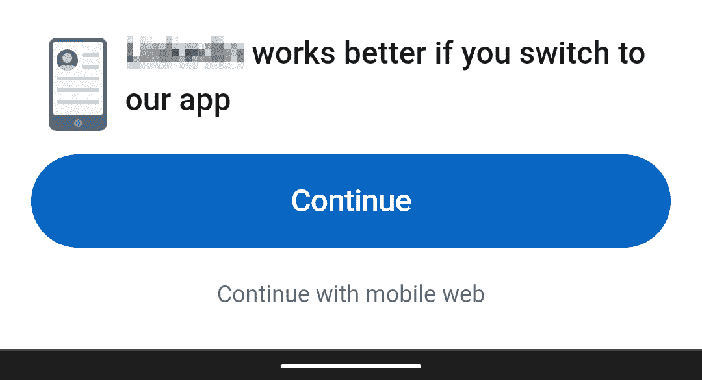
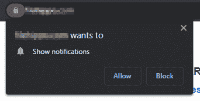
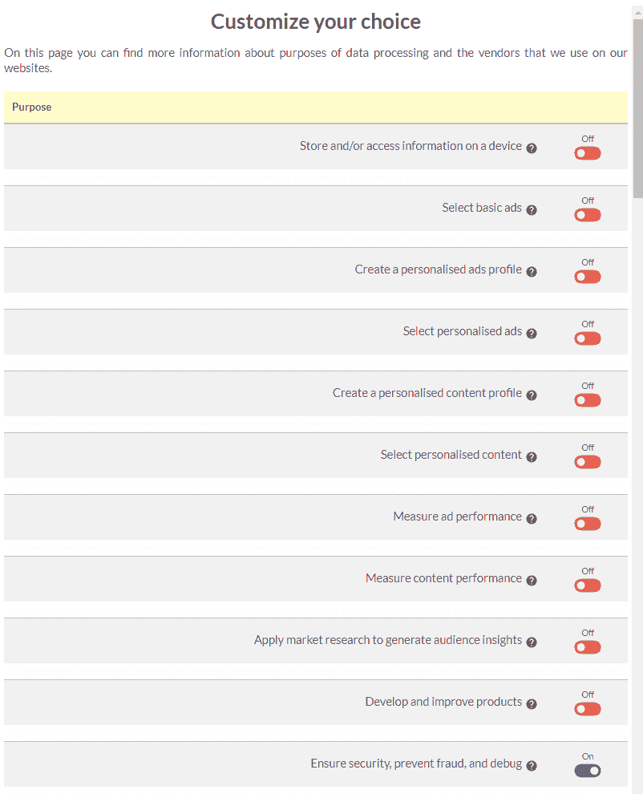
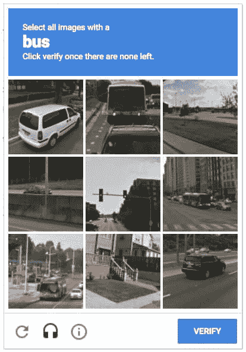

# 黑暗模式:揭开网络的阴暗面

> 原文：<https://kinsta.com/blog/dark-patterns/>

我们热爱网络。如果不是蒂姆·伯纳斯·李爵士的惊人发明，我们都不得不寻找不同的职业。尽管我们充满激情，但网络可能是一个令人不愉快的地方。

深色图案可能是无意的。营销人员或开发人员可能认为他们在做正确的事情，但没有意识到他们实现的功能的问题和缺点。最糟糕的黑暗模式是故意的。一个页面会欺骗你去做一些你不想做的事情，因为用户界面或措辞会操纵你的行为。用户对最可疑的技术越来越明智，但是在某个地方的某个人将无法发现他们已经被欺骗，直到为时已晚。

如果使用得当，网络可以节省时间、旅行和精力。另一方面，黑暗图案浪费了数百万工时和千瓦。我们不会羞辱任何特定的网站(他们知道他们是谁)，但我们会说明改进和可能的替代选择。

这些是我们最讨厌的。

## 不直观的用户界面

这些是你会遇到的最常见的深色图案。创造一个好的用户体验需要时间和思考……而且你可以很快地用这些引人注目的黑暗模式破坏所有的努力。

### “安装我们的应用！”

一些网站和社交网络会提示您安装他们的应用程序，通常是在点击关于新消息或关注者的电子邮件提醒时。该链接在带有两个按钮的网页中打开:

> Kinsta 把我宠坏了，所以我现在要求每个供应商都提供这样的服务。我们还试图通过我们的 SaaS 工具支持达到这一水平。
> 
> <footer class="wp-block-kinsta-client-quote__footer">
> 
> 
> 
> <cite class="wp-block-kinsta-client-quote__cite">Suganthan Mohanadasan from @Suganthanmn</cite></footer>

[View plans](https://kinsta.com/plans/)

1.  一个巨大的“使用我们的应用”按钮。点击它会进入 AppStore，在这里你必须批准、下载、安装，然后启动网站的本地应用(假设你的手机支持)。然后，您必须登录，输入错误的密码，请求重置，打开链接，创建新密码，然后访问系统。你可能已经忘记了你为什么在那里，所以回到最初的警报，重新开始。
2.  一个微小的“在移动网络中继续”链接来执行操作。

No, thanks — I don’t need your app!

或许这款应用很棒，已经花费了数百万美元，但很难找到比网站功能更多的应用。当然，一个应用程序可以比一个 web 系统收集更多的个人数据，因此它获得了更具侵入性的推广。

想尽一切办法推广一个 app，但是在每次交互开始的时候就这么做，会让用户很烦。有些人会安装应用程序来停止唠叨，但其他人会离开。当用户使用网站一段时间后，提供应用程序会更有效吗？

### "您想接收通知吗？"

一句话:不会。

Has anyone ever clicked “Allow”?

简讯注册、基于网络的[推送通知](https://kinsta.com/blog/turn-off-push-notifications/)、[、【让我们聊天】小工具](https://kinsta.com/blog/chatbot/)和[调查提示](https://kinsta.com/blog/wordpress-survey-plugins/)、*可能有用，但它们的实现普遍很糟糕。*

网站通常会在你第一次上网搜索时提示你订阅。在这一点上，你不知道内容是否相关，是否有任何好处，或者该网站是否是你考虑经常访问的地方。发现大多数人选择“不”并不奇怪。

提供通知或时事通讯没有错，但是最好先确保用户已经参与到网站中。也许在文章的结尾或者在他们访问过几次之后显示一个提示。这样更少打扰，更少分心，更有可能成功。

最后，请不要在用户点击简讯中的链接时提示用户注册简讯！它驱赶它们的速度会比吸引它们的速度快。

### 古怪的导航

标题栏和下拉菜单可能很无聊，但人们理解它们。我们不想阻止 UI 的进化和设计的创造性，但是有些[导航控件](https://kinsta.com/blog/website-navigation/)很怪异，不合逻辑。

如果您需要用“单击此处”工具提示或其他帮助方法来提示用户，请重新考虑您的设计。好的 ui 不需要解释。

### 不必要的卷动

当页面滚动时显示动画或更新活动菜单项可能是一种引人入胜的体验。在以下情况下用处不大:

1.  动画被过度使用。动画显示太多的元素会分散观众的注意力——突出显示每一个项目意味着没有什么会引起用户的注意。一些微妙的效果可以更好地聚焦重要信息。
2.  它打破了上下文。滚动不应该导致意外的动作，比如内容消失、模态对话框、表单提交、重定向到其他页面等。

动画也可能导致晕动病和眩晕，所以考虑使用 CSS `prefers-reduced-motion`媒体查询来禁用效果。

请停止创建无限滚动的页面！相关内容的链接很有用，但是未经用户同意自动加载随机内容会浪费带宽。这使得很难将任何一页加入书签，从而无法在页脚中找到联系方式和其他信息。

### 不必要的多页文章

我们都见过“文章”,它包含一段文字，后面是到下一页的链接。这些页面通常是没有实质内容的链接诱饵——但你不会发现，直到你涉水通过大量的广告和页面印象。

要求网络营销人员停止这种做法是徒劳的，但如果开发者教育人们不要屈服于这种胡说八道，也许他们会重新考虑！

## 操纵营销

网络是世界上最大的市场，有能力销售各种各样的实物和数字产品。用户会一次又一次地回来……除非你选择诉诸黑暗模式来促进销售。

### 订阅斗争

取消订阅通知或简讯应该和订阅一样简单，如果不是更简单的话。要求用户跳过退订障碍会导致沮丧和对网站失去信心。没有可信的理由要求用户传真他们的出生证明原件、三份地址证明和最新的医疗记录。

### 伪装的广告

广告在许多网站上被过度使用，但最糟糕的例子是:

1.  看起来像菜单或选项；
2.  伪装成来自原始站点的新闻或信息文章；或者
3.  在关于软件产品的页面上显示 UI 控件，如大的“下载”按钮。

An ad on a download site, which takes you away from the actual download.

网站不能总是决定使用什么样的广告设计，但他们确实控制着广告的位置。在显著位置放置广告来迷惑人们可能会增加广告收入，但这些用户会回来吗？

### 自动将产品添加到购物车

查看相关产品或推荐产品的列表可能会有所帮助。未经用户同意将它们添加到用户的购物车是另一回事。有多少人会觉得有帮助？

*   在最好的情况下，一小部分用户会注意到这个额外的项目，并决定保留它。
*   更大的比例会移除它。
*   有些人直到送货时才注意到，然后投诉并要求退款。

这些活动增加了销售额，但却牺牲了客户支持、商誉和持续的退货。处理投诉和退款可以抵消盈利能力的任何短期增长。

### 隐性购物成本

花时间选择产品、注册、输入送货细节、发布付款信息，然后发现价格已经高于竞争对手的网站，这不是一件令人愉快的事情。摘要页面现在显示隐藏的费用，如送货费、保险费、手续费和我们希望你不会注意到的费用。

定价应该清晰和诚实，否则客户会对电子商务服务失去信心。当送货费用相差很大时，提示用户在承诺购买之前输入他们的国家或邮政编码。

### 人造库存稀缺和可用性计时器

知道一件商品何时有货是很有用的，但一些电子商务网站会扩大可信度。他们提供的信息越多，就越不可信:

> *“现在就买！库存中的 2 件商品，15 件是在过去 3 分钟内购买的，597 人正在查看此页面。”*

这些高压策略在应用于汽车和度假等数字或高价值项目时变得更加可疑。

用户很快就会意识到，当商品库存超过许多天时，这些信息就毫无价值了。当网站的营销信息不可信时，他们还会继续购买吗？

### 选择退出羞辱

甚至某些大型电子商务公司也沉迷于愚蠢的羞辱技巧。他们会提出一个注册问题，然后是一个大的“同意”按钮和一个较小的选择退出链接，例如:

## 注册订阅时事通讯

### 想知道我们是怎么让流量增长超过 1000%的吗？

加入 20，000 多名获得我们每周时事通讯和内部消息的人的行列吧！

[Subscribe Now](#newsletter)

*   “不——我不想要无限制的免费送货。”
*   “不——我不关心濒危毛绒动物的困境。”
*   “不——我确实想看到这个星球燃烧。”

这种做法管用吗？也许吧。但是，它是否与客户建立了诚实的关系，并增加了对网站的信任？

### 复杂的 Cookie 取消

欧盟的[一般数据保护条例(GDPR)](https://kinsta.com/blog/wordpress-gdpr-compliance/) 要求网站对非必要的 cookies 和类似的跟踪技术显示选择退出通知。这是有缺陷的，但立法是善意的，是整个欧洲的法律要求。其他国家可能也有类似的规定，尽管通常不那么严格。

大多数用户会选择加入，然后不假思索地继续前进(这在一定程度上挫败了立法的目的)。选择退出应该同样简单，但是有些网站要求您:

*   在找到选项之前，费力地阅读几页/几页术语；
*   点击几十个复选框，尽管这违反了 GDPR 规则；和
*   等待一分钟，让他们“保存您的首选项”(保存到什么？).

它可能会说服一些用户点击“全部同意”，尽管其他人会放弃网站或切换到阅读模式来隐藏 cookie 通知。在最好的情况下，让选择退出变得困难会给人一种网站有所隐瞒的印象。在最坏的情况下，这种黑暗的模式处于合法性的边缘，并可能导致罚款或增加律师费用。

This dialog goes on and on and on…

## 可怕的技术

HTML 之类的技术是现成可用的、可访问的和向后兼容的。丢掉那些好处需要付出特别的努力。

### 破坏浏览器功能

后退按钮是网络对用户界面最大的贡献。它很实用，任何只有很少技术经验的人都能理解。然而，网站通过打开新的窗口/标签、终止前一页或者告诉用户不要使用浏览器控件来破坏它。

不存在破坏浏览器功能的技术原因。试图绕过控件是一个设计问题，会让用户困惑，降低 web 系统的可用性。

要避免的其他问题:

1.  不要禁用右击或长击菜单。
2.  不要禁用复制或添加更多“有用”的文本。
3.  不要因为没有更新 URL 而破坏你的单页应用程序的书签功能。

但所有这些问题中最糟糕的是我们的下一个问题。

### 禁用粘贴密码字段

出于任何原因禁用粘贴都是不必要的。禁用密码字段粘贴是令人讨厌的，但是你会在大型网站上遇到这种限制——他们应该知道得更清楚。我见过它被主要的国际银行所采用。

这种做法可能是出于可疑的安全原因而实现的。如果用户不能粘贴，显然他们不能从其他地方重用密码。不幸的是，它也阻止人们使用[密码管理器应用](https://kinsta.com/blog/password-managers/)。不再可能生成不切实际的高度安全的、长的、随机的字符串。

与我们世界一流的支持团队一起体验卓越的 WordPress 托管支持！与支持我们财富 500 强客户的同一个团队聊天。[查看我们的计划](https://kinsta.com/plans/?in-article-cta)

此外，开发人员可以通过一些 DevTool 修补来禁用粘贴限制。其他人可能会有困难，他们更有可能使用弱密码。永远不要禁用粘贴功能——这会减少您的工作量并提高系统安全性。

### 愚蠢的密码限制

> *"您的密码必须介于 8 到 12 个字符之间，并且至少需要一个大写字符、一个数字和一个符号，但请不要使用` ' "/ \或；"*

没有理由实施严格的密码限制。问问你自己:

1.  系统是否将密码以纯文本形式存储在数据库中，而不是对其进行哈希处理？
2.  有没有安全专家建议阻止人们使用简单的密码，如*密码*、 *qwerty* 或 *123456* ？这是事实，但它也防止人们使用更复杂的密码，并为暴力破解提供了方便的模板。

有一条规则强制实施强密码:一个很长的最小长度。每增加一个字符都会成倍增加复杂性和破解时间。

### 移动内容跳转

在智能手机上阅读内容可能是一种令人沮丧的体验。当内容跳出屏幕时，你全神贯注于一篇文章，你失去了你的位置。然后你花几秒钟疯狂地上下滚动。或者更糟的是，当链接或按钮移动时，你点击了它，然后一个意想不到的动作发生了。有些读者会失去动力，放弃，在你把他们转化为顾客之前就离开了。

当图像或 iframe(通常是广告)加载到视口滚动点上方时，会发生内容跳转。一旦加载了内容，浏览器就可以确定其尺寸并将其放在页面上。因此，500 像素高的图像(以全尺寸显示)会将内容向下推相同的量。

谷歌的[累积布局移动(CLS)](https://kinsta.com/blog/core-web-vitals/#cumulative-layout-shift-cls) 指标衡量内容跳转，并相应地惩罚网站。这是一个复杂的问题，但是现在有几种[技术解决方案](https://kinsta.com/blog/optimize-css/):

*   向 HTML `img`和`iframe`元素添加宽度和高度属性，或者在加载资产之前，使用 CSS `aspect-ratio`属性在页面*上保留空间。*
*   为包含加载速度较慢的资产(如广告、图像和社交媒体小部件)的容器元素设置尺寸。
*   尽早请求更大的图片，并考虑在你的 HTML `head`中使用预加载链接。
*   优化网页字体的使用，并使用类似大小的回退，以尽量减少布局的变化。
*   避免在页面顶部插入元素，除非是在用户操作(比如点击)后触发的 DOM 更新。
*   使用 CSS 包含来优化内容块的呈现。可以定义不影响其他元素的大小或位置的元素。

### 当社交登录很糟糕的时候

像 [OAuth](https://oauth.net/) 这样的技术允许用户使用另一个账户，如谷歌、脸书、Twitter、LinkedIn 或 Github，在网站上快速注册。如果实施得好，这是一个实用的选择，可以提供更灵活的注册流程，节省时间，并带来更高的转化率。

如果执行得不好，网站随后会要求你输入你的电子邮件，个人信息，甚至密码“作为他们的记录”

不是所有的提供者都会传递用户信息，所以如果您的站点需要这些细节才能正常工作，请避免使用 OAuth。OAuth 不应该成为减缓注册过程的不必要的步骤。

### 糟糕的 Web 性能

根据 HTTP Archive 的数据，在桌面设备上加载一个网页平均需要 7 秒，在移动设备上需要 20 秒。单个页面视图发出 70 个 HTTP 请求，下载超过 2MB 的数据，向大气中排放 1.3g 的 CO(见[网站碳计算器](https://www.websitecarbon.com/))。这是一个平均值，许多网站更差。

没有人打算做一个速度很慢的网站，但是添加功能往往比性能提升更重要。鉴于在 13Kb 内创建一个可玩的雷神之锤克隆体是可能的，你不得不质疑为什么“关于我们”页面上的两段营销废话需要 154 倍的下载量！

解决性能问题需要多种技术的组合，但是你需要记住一个关键点:不要发送太多东西！

### 偷偷摸摸的社交媒体小工具

[社交媒体小工具](https://kinsta.com/blog/wordpress-social-media-plugins/)如“喜欢”按钮看起来很无辜，但:

1.  每一个都会增加数百千字节的 JavaScript 代码，从而影响页面性能。
2.  该代码存在安全风险，因为它使用与网站 JavaScript 相同的权限运行。
3.  这些小部件即使没有被激活也能实现用户跟踪。这可能会导致某些地区的法律问题。
4.  几乎没有人使用它们:你很幸运能看到 1%的用户参与度。

小部件也是不必要的。大多数社交媒体网站提供标准链接，这些链接保持共享，而不会对性能、安全性或隐私造成任何风险

*   电子邮件:`mailto:?subject=[title]&body=[url]`
*   脸书:`https://www.facebook.com/sharer.php?u=[url]`
*   推特:`https://twitter.com/share?url=[url]&text=[title]`
*   领英:`https://www.linkedin.com/shareArticle?url=[url]&title=[title]`
*   Reddit:t0

其中`[url]`是当前页面 URL，`[title]`是主标题。一个标准的`<a>`链接很好，但是如果你想让它们的行为和标准按钮一样，你可以增强它在弹出窗口中打开页面。

### 验证码

CAPTCHA 是[全自动公共图灵测试的缩写，用来区分计算机和人类](https://kinsta.com/blog/wordpress-captcha/)。它有助于防止机器人或其他机器访问网络系统。你经常被要求输入难以辨认的图像中显示的文本，或者点击包含自行车的方块。(装在汽车上的自行车算吗？那辆三轮车呢？那堵墙后面有一辆自行车吗？？)

A CAPTCHA asking you to identify the buses.

验证码有三个基本问题:

1.  对于视力健全的非残疾人来说，这是故意制造的困难。那些有视觉或其他障碍的人应该如何应对？
2.  随着机器人和人工智能技术的进步，它们必须变得更加复杂。
3.  他们把访问安全的责任放在用户身上，而不是网站所有者或开发者，他们是主要的受益者。

验证码在大多数网站上都是多余的。你可以考虑用[替代验证码](https://kinsta.com/blog/wordpress-spam-comments/)来减少人力投入:

*   当机器人添加数据时，隐藏的蜜罐字段会阻止表单提交。
*   检查键盘事件如`input`或`keydown`是否被适当触发。
*   检查完成和提交表单所需的时间— bot 活动通常是即时的。
*   创建一个两阶段提交流程，要求用户在提交前确认他们的数据或一个附加问题。

这些将阻止大多数机器人。绕过任何一种技术都是可能的，但是它需要针对您的站点进行额外的开发工作。当有数以千计的其他网站存在已知的漏洞时，很少有机器人开发者会费心。

## 摘要

网络是一个伟大的地方，但一些可疑的做法会破坏这种感觉。当然，你可以在任何地方被骗，但网络让犯罪者几乎不费吹灰之力就能接触到成千上万的人。当数十亿美元的大企业肆无忌惮地使用黑暗模式时，这是彻头彻尾的可耻！

网站使用深色图案是因为它们有用。但这是短期思维。游客总是变得聪明邪恶的技术，可能永远不会回来。

做正确的事，建立对你品牌的信任，你就能留住顾客，而不必诉诸黑暗模式。

对于你遇到的黑暗图案，你还有其他想法吗？请在下面的评论区分享它们！

* * *

让你所有的[应用程序](https://kinsta.com/application-hosting/)、[数据库](https://kinsta.com/database-hosting/)和 [WordPress 网站](https://kinsta.com/wordpress-hosting/)在线并在一个屋檐下。我们功能丰富的高性能云平台包括:

*   在 MyKinsta 仪表盘中轻松设置和管理
*   24/7 专家支持
*   最好的谷歌云平台硬件和网络，由 Kubernetes 提供最大的可扩展性
*   面向速度和安全性的企业级 Cloudflare 集成
*   全球受众覆盖全球多达 35 个数据中心和 275 多个 pop

在第一个月使用托管的[应用程序或托管](https://kinsta.com/application-hosting/)的[数据库，您可以享受 20 美元的优惠，亲自测试一下。探索我们的](https://kinsta.com/database-hosting/)[计划](https://kinsta.com/plans/)或[与销售人员交谈](https://kinsta.com/contact-us/)以找到最适合您的方式。