# Dashlane 与 LastPass:密码管理器在 10 个关键领域的比较

> 原文:# t0]https://kinta . com/blog/daslane-vs-lastpass/

在选择密码管理器时，选择通常归结为 Dashlane 还是 LastPass。虽然这两个服务都是密码管理市场的巨头，但一些用户可能更喜欢其中一个，尤其是因为其中一个有着不太完美的历史。

一个[密码管理器](https://kinsta.com/blog/password-managers/)是在一个安全的地方存储多个密码的最佳方式。这还不是全部。从自动填写登录字段到自动生成超级安全的密码，像 Dashlane 和 LastPass 这样的工具提供了最好的安全性和便利性。

但是哪个更好呢？在这次比较中，我们将把 Dashlane 和 LastPass 放在对任何密码管理器都至关重要的关键领域进行比较。但是首先，让我们探索一下为什么密码管理器是一个如此伟大的工具，以及当你选择一个密码管理器时你应该寻找什么。

## 什么是密码管理器？

顾名思义，密码管理器是一种管理密码的工具。

然而，密码管理器不仅仅是跟踪凭证。与一些用户名和密码的小黑本不同，密码管理器安全地存储登录信息，生成安全的密码，自动填写登录字段，等等。

请继续阅读，了解更多关于密码管理器的功能，以及为什么它们对于保持安全和避免在线身份盗窃如此重要。

[Ready to lock down your passwords? 🔒 Find the password manager that's right for you ⬇️Click to Tweet](https://twitter.com/intent/tweet?url=https%3A%2F%2Fbit.ly%2F3LrtfYy&via=kinsta&text=Ready+to+lock+down+your+passwords%3F+%F0%9F%94%92+Find+the+password+manager+that%27s+right+for+you+%E2%AC%87%EF%B8%8F&hashtags=LastPass%2CDashlane)

### 密码管理员能做什么？

密码管理器帮助您存储、生成和管理您使用的每个网站和帐户的超安全密码。

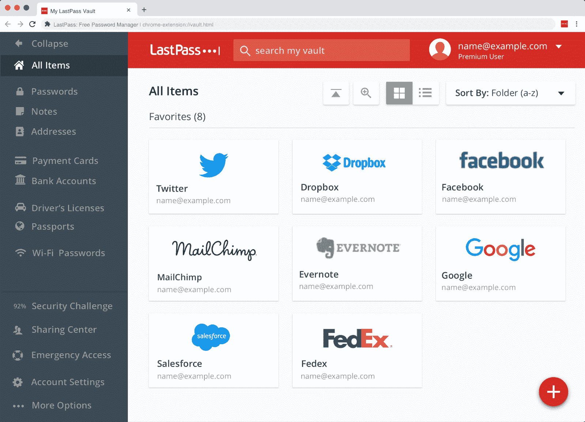

Connected accounts in the LastPass password vault.

虽然这听起来很基本，但比看起来要复杂得多。无论是存储、生成、自动填充还是管理密码，像 Dashlane 和 LastPass 这样的工具都在它们所做的事情中加入了大量额外的功能。

以下是一些标准的密码管理器功能:

*   安全存储密码:每个人(希望如此)都知道把密码写在贴在电脑屏幕上的便利贴上是不安全的。同样，将密码保存在不安全的文件中也不是一个好主意。虽然您可以记住所有的密码，但密码管理器通过将所有密码和帐户凭证加密并存储在一个安全的位置来消除这种需要。
*   **从一个位置管理密码:**如果你像大多数互联网用户一样，你可能有太多的帐户(和太多的密码)而不知如何是好。通过使用密码管理器，你可以轻松管理、访问和[更改你所有账户的密码](https://kinsta.com/blog/change-wordpress-password/)，而无需记忆任何东西。
*   **自动填写登录表单:**使用你的密码管理器的[浏览器扩展](https://kinsta.com/blog/firefox-extensions/)允许你自动填写登录字段。这个功能不仅方便，而且还可以防止键盘记录程序和其他恶意程序。
*   **生成强而唯一的密码:**使用密码管理器的一个最普遍的原因是生成一个安全的密码。不像“petname12345”这样容易猜到的弱密码，强密码使用一长串几乎不可能破解的随机字符、数字和符号。在接下来的几节中，我们将更多地讨论强密码以及密码管理器如何帮助您使用它们。

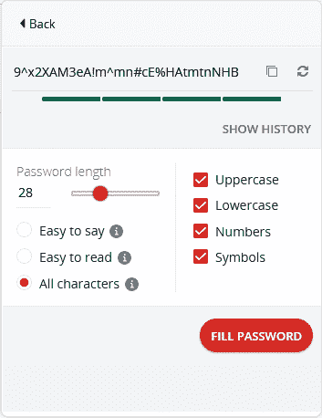

Generating a password in LastPass.

### 强密码的重要性

你的密码够强吗？你怎么知道？

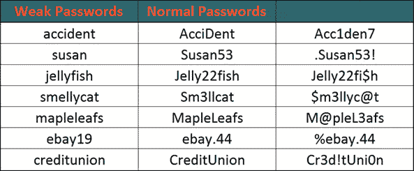

Table of passwords of varying strength.

强密码很长，由大小写字母、数字和符号(如果可能)组成。这里有一个使用 LastPass 浏览器扩展生成的强密码的例子:`n6lC4BIMY0%!sP&IfKlWVH5tftRJ`。

虽然这看起来有些过火，但使用强密码已经变得比以往任何时候都更加重要，尤其是随着越来越多的人开始远程工作。使用强密码是在家工作的最基本的安全提示来保护你的数据安全。

随着黑客改进暴力攻击，包含字典单词的密码变得更容易破解——即使添加了数字、符号和不同的字符大小写。

相比之下，即使使用最先进的暴力攻击，强密码也需要数年(如果不是更长的话)才能破解。虽然它们可能很难记住，但密码管理器可以帮助您为每个帐户生成、存储和使用强密码。

### 为什么强密码需要密码管理器

可以想象，强而唯一的密码很难记住，这就是问题所在。

有了密码管理器，你可以忘记记忆。相反，您将能够使用一个主密码来生成、存储和访问各种各样的可靠密码。虽然这听起来有风险，但大多数密码管理器都提供了多因素身份验证选项来备份主密码中的任何“弱点”。

### 在密码管理器中寻找什么

密码管理器不仅仅是存储密码。

虽然每个密码管理器都是不同的，但大多数领先的提供商都提供强大的密码安全性、加密和其他功能，使使用强密码变得容易和安全。

以下是选择下一个密码管理器时需要注意的一些关键事项:

*   **强大的密码存储和生成:**您的密码管理器应该有足够的存储容量来存储您的所有凭证。它还应该提供导入、导出和恢复过程。您选择的工具应该能够根据您的偏好和要求生成强密码，例如密码长度、符号的使用等等。
*   **强大的安全性和加密:**除非安全存储，否则您的密码并不安全。任何可靠的密码管理器都提供强大的加密和安全功能，如 AES 256 位加密和多因素身份验证。
*   **易于使用且高度兼容:**使用密码管理器时，便利性至关重要。您的密码管理器应该与您的设备兼容，并为自动填写登录表单和生成密码提供简单直观的控制。
*   **即时客户支持:**密码相关事件需要额外的紧迫感。因此，您的密码管理器应该提供大量支持选项(理想情况下是 24/7 实时支持),以便在问题出现时帮助您。
*   价格实惠:尽管许多密码管理器提供免费版本，但一些用户可能会从支付额外功能的费用中受益。然而，价格不应该太高，提供商也应该提供免费版本或退款保证。
*   **可靠的声誉和透明度:**一个密码管理器可能会给世界带来好处，但它能兑现承诺吗？它的声誉和对透明度的专注是很好的决定因素。始终检查数据泄露的历史，以及定期审计的明确承诺。

既然您已经知道要寻找什么，那么是时候对两个最流行的密码管理器进行测试了。

## 什么是 Dashlane 和 LastPass？

Dashlane 和 [LastPass](https://www.lastpass.com/) 是市场上最受认可和尊敬的两个密码管理器。这两家提供商都提供免费版本、顶级的安全性、广泛的兼容性和良好的声誉。那么有什么区别呢？

### 关于 Dashlane

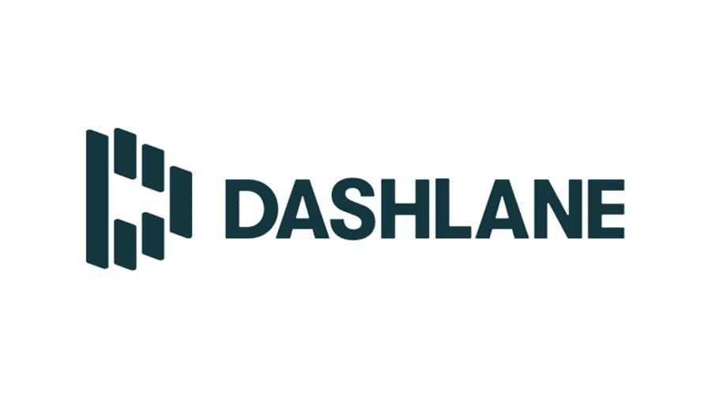

The Dashlane logo.

Dashlane 于 2009 年正式启动，自 2012 年首次正式发布以来，它一直是一个受欢迎的密码管理器。像大多数领先的密码管理器一样，Dashlane 提供 AES 256 位加密，并与大多数主要操作系统兼容。除了作为一个密码管理器，Dashlane 还可以作为一个数字钱包。

在九年多的运营中，Dashlane 一直保持着完美的安全记录。它的独特之处还在于它为用户提供了专用的[虚拟专用网络(VPN)](https://kinsta.com/blog/proxy-vs-vpn/) 。

### 关于 LastPass

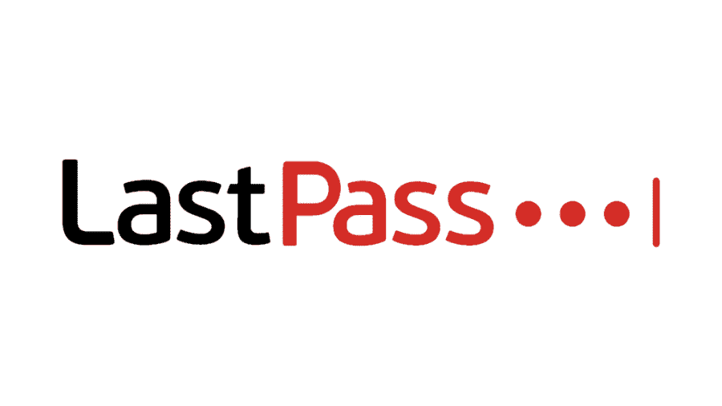

The LastPass logo.

LastPass 于 2008 年首次发布，是市场上最受欢迎和历史最悠久的密码管理器之一。由于它的易用性和与大多数浏览器和设备的高度兼容性，这种流行的大部分。LastPass 还提供行业领先的加密和安全功能，包括与 Dashlane 和其他顶级提供商使用的相同的 AES 256 位加密。

LastPass 的受欢迎程度也使其成为众矢之的。尽管 LastPass 像 Dashlane 一样提供了许多安全功能，但它的安全事故却屡见不鲜。

## Dashlane 与 LastPass:势均力敌的比较

虽然 Dashlane 和 LastPass 都提供了很多功能，但是需要注意一些关键的区别。请继续阅读，我们将两家提供商进行了面对面的比较，看看他们各自的优势(和劣势)。

### 关键特征

|  | **仪表板** | **最后一遍** |
| **加密** | AES 256 位 | AES 256 位 |
| **密码生成器** | 是 | 是 |
| **密码容量** | Fifty | 无限的 |
| **操作系统** | Windows、macOS、Linux、Chrome、iOS、Android | Windows、macOS、Linux、Chrome、iOS、Android |
| **浏览器** | Chrome，Firefox，Internet Explorer，Safari，Opera，Brave | Chrome，Firefox，Internet Explorer，Safari，Opera |
| **从未突破** | 是 | 不 |
| **免费版** | 是 | 是 |
| **溢价** | 1.99 美元/月 | 3.00 美元/月 |
| **保费试用期** | 30 天 | 30 天 |

Dashlane 和 LastPass 非常相似，都提供 AES 256 位加密，并与大多数主要设备、操作系统和浏览器兼容。

主要区别是密码容量、定价、可用性和声誉。

*   **Dashlane 只允许 50 个密码:**相比之下，LastPass 提供了无限的密码存储。
*   **Dashlane 更便宜:**付费计划每月 1.99 美元起，Dashlane 比 LastPass 便宜(每月 3 美元)。然而，对于无限的密码来说，溢价可能是值得的。
*   LastPass 更易于使用:许多用户认为易于使用和熟悉的控制是他们选择 LastPass 的主要原因。
*   LastPass 有安全问题的历史:尽管它可能比 Dashlane 更老、更受欢迎，但 LastPass 过去的违规和漏洞仍然是有效的担忧。

虽然这些是主要的区别，但不是唯一的区别。请继续阅读，了解 Dashlane 和 LastPass 在其他重要领域的对比。

### 安全性和加密

Dashlane 和 LastPass 都提供类似级别的加密和安全功能。这两个提供程序都使用 AES 256 位加密，其密码来自您的主密码。

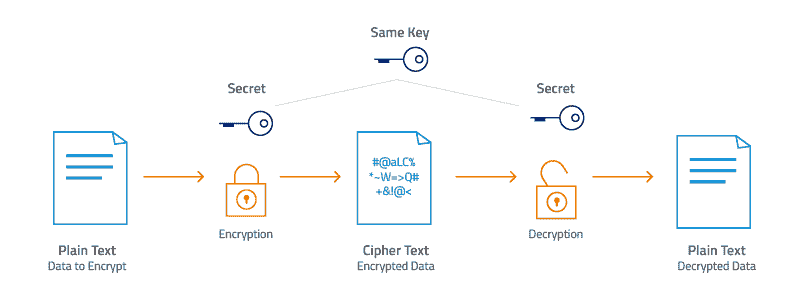

AES-256 encryption and decryption process.

加密和解密发生在设备级别，这意味着任何一个提供商都不会以可读的格式存储您的密码。因此，即使 Dashlane 或 LastPass 被攻破，你的数据对黑客来说也是无用的。这种抽象是为什么 LastPass 尽管有违规历史，但仍然保持了坚实的用户基础的部分原因。

简而言之，Dashlane 和 LastPass 在加密方面差不多。但是，LastPass 在散列密码时，除了 AES 256 之外，还使用 PBKDF2 SHA-256 密钥派生函数。

这两个密码管理器还通过电子邮件、PIN、认证器应用程序和生物认证提供[双因素认证(2FA)](https://kinsta.com/blog/wordpress-two-factor-authentication/) 。然而，LastPass 提供了更多的 2FA 选项，允许第三方设备，如智能卡、Windows 指纹等。

**获胜者:**最后一关

## 注册订阅时事通讯

### 想知道我们是怎么让流量增长超过 1000%的吗？

加入 20，000 多名获得我们每周时事通讯和内部消息的人的行列吧！

[Subscribe Now](#newsletter)

尽管存在可疑的违规和漏洞历史，但设备级加密使这几乎不成问题。结合额外的密码哈希层和比 Dashlane 更多的 2FA 选项，LastPass 的安全性略胜一筹。然而，Dashlane 仍然同样安全，2FA 选项略少。

### 数据存储

如前所述，这两个提供商只存储加密版本的密码和数据，这使您的密码和数据安全，即使在违反。然而，每个提供商允许你存储的*数量*会有所不同。

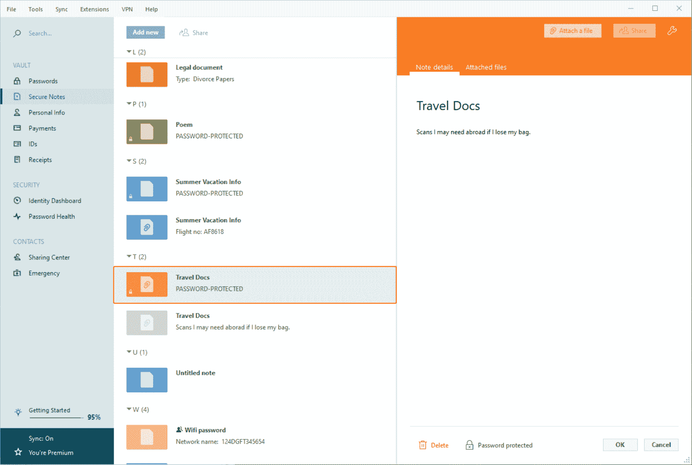

Dashlane’s secure file storage tool.

虽然 LastPass 允许用户存储无限的密码，但 Dashlane 的上限是 50 个。虽然 50 个密码对大多数用户来说可能足够了，但与 LastPass 的无限选项相比，它仍然非常有限。

虽然密码存储是密码管理器的主要目的，但 Dashlane 和 LastPass 也为安全笔记和其他数据提供了基本的文件存储选项。

Dashlane 用户最多可以存储 1 GB 的加密数据。相比之下，LastPass 免费用户只能获得 50 MB 的存储空间，只有高级用户才能使用 1 GB。此外，Dashlane 提供的最大文件大小为 50 MB，LastPass 要小得多，只有 10 MB。

**获胜者:**最后一关

尽管与 Dashlane 相比，LastPass 的数据存储选项较少，但它允许的密码数量不受限制，因此在这方面胜出。此外，由于文件大小最多限制在 50 MB，您将无法使用任何一个提供程序来存储大文件。

### 密码生成和共享

Dashlane 和 LastPass 都提供了密码生成器和密码共享功能。

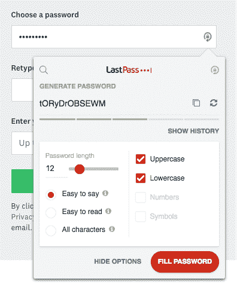

LastPass password generator.

在这两种情况下，密码生成工具都差不多。

Dashlane password generator.

这两个生成器都允许用户通过添加额外的字符、数字和符号来控制密码的长度和复杂性。LastPass 的密码生成器也可以通过其网站免费向公众开放。

这两个提供程序都允许密码共享，这有助于在访问共享帐户的多个用户之间安全地分发登录凭据。然而，每个提供商根据几个因素施加不同的限制。

例如，LastPass 只为家庭和商业用户提供密码共享，允许这些用户分别在 6 到 50 个用户之间共享密码。相比之下，Dashlane 的限制要少得多，允许不受限制的用户最多共享五个密码，高级用户可以与总数为的用户共享不限数量的密码。

**获胜者:**达什莱恩

由于两个提供商都提供类似的密码生成功能，所以选择归结为密码共享。在这里，Dashlane 脱颖而出，允许高级用户无限制地共享密码——比 LastPass 的最大值 50 多。

### 隐私

Dashlane 和 LastPass 并不像许多人认为的那样私密。由于都在收集个人数据、账单信息、设备和网络浏览器数据，并且最少收集 [cookies](https://kinsta.com/blog/wordpress-cookies-php-sessions/) 数据，因此这两家提供商都不是隐私保护的最佳选择。

需要为您的电子商务网站提供超快的、可靠的、完全安全的托管服务吗？Kinsta 提供所有这些服务，并由 WooCommerce 专家提供 24/7 的世界级支持。[查看我们的计划](https://kinsta.com/plans/?in-article-cta)

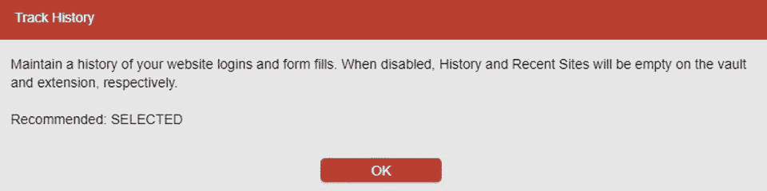

LastPass (hidden) data tracking options.

不幸的是，LastPass 用户的情况更糟。LastPass 还收集用户的 IP 地址、位置、会话持续时间和设备。其隐私政策还规定，它可能会出于营销或法律目的共享这些数据。这意味着 LastPass 会毫不犹豫地向执法机构提供您的浏览数据，如果要求的话。

**获胜者:**达什莱恩

尽管从隐私角度来看，这两家公司都不是最佳选择，但 Dashlane 收集的数据较少。此外，与 LastPass 不同，它收集的数据对执法机构没有帮助，因为执法机构可能需要你的在线活动信息。

### 审计和透明度

第三方审计是验证任何服务的安全性和完整性的最可靠的方法之一。

LastPass audit graphic.

因此，LastPass 的母公司 LogMeIn 通过 Tevora Business Solutions 进行定期审计。通常，这些审计检查 LastPass 和 LogMeIn 是否符合 AICPA(美国注册会计师协会)信托服务原则所概述的标准。

虽然这样的审计总比没有好，但它只是安全管理的一种措施，而不是应对网络攻击的技术能力。然而，由于 Dashlane 在撰写本文时尚未进行第三方审计，因此总比什么都没有好。

然而，LastPass 并不完美。Dashlane 的记录很干净，没有安全漏洞，而 LastPass 在其整个生命周期中一直受到几次安全争议。其中一个案例暴露了超过 1600 万 LastPass 用户的凭证。

**获胜者:LastPass**

LastPass 和 Dashlane 在审计和透明度方面是平等的对立面。LastPass 进行第三方审计，而 Dashlane 不进行。与 LastPass 曲折的过去相比，Dashlane 的记录是清白的。

然而，由于 LastPass 的安全功能使违规几乎不成问题，因此基于第三方审计和对数据安全措施的投资，它是更好的选择。

### 导入和恢复选项

您是否在 excel 表格中管理公司密码和帐户？不用担心；您不必手动输入所有密码。这两种服务都提供了强大的密码导入和恢复选项。

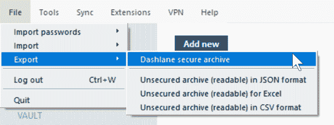

Dashlane password exporting options.

对于导入，LastPass 接受大多数格式。除了标准的 Excel CSV 格式，用户还可以从其他浏览器、源文件甚至竞争对手的密码管理器中导入密码。Dashlane 同样不受限制，允许从 CSV 文件和密码管理器(如 LastPass、RoboForm、1Password 和 PasswordWallet)导入。

对于紧急访问和密码恢复，LastPass 也是最灵活的——尽管是最不安全的。Dashlane 提供有限的帐户恢复选项，LastPass 用户可以通过移动应用程序、短信、密码提示或一次性恢复密码重置密码。

**获胜者:**最后一关

尽管这两个提供商提供了类似的密码导入选项，但是如果您需要重置主密码，LastPass 是最宽容的。相比之下，除了两个特定的选项，Dashlane 用户不能重置他们的主密码。

### 兼容性和支持

两家提供商提供相似的操作系统和设备兼容性。但是，它们的支持选项略有不同。

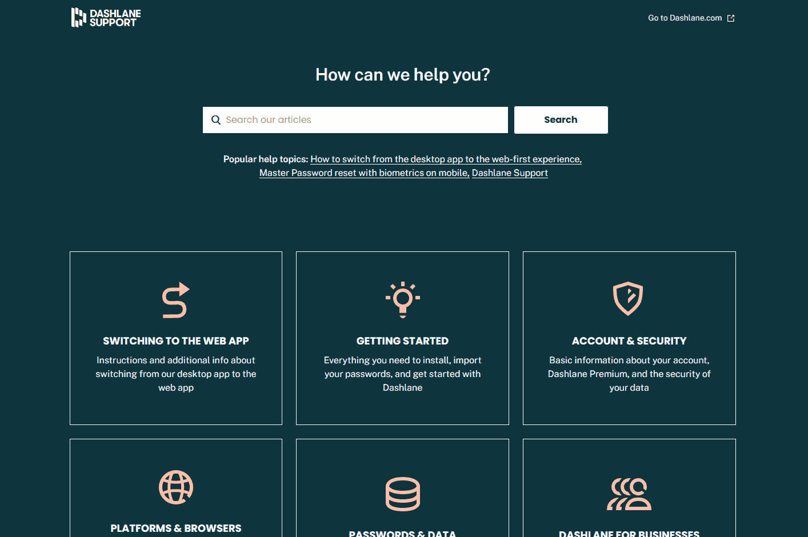

Dashlane support page.

Dashlane 和 LastPass 都兼容微软 Windows、Mac、Linux 和 Chrome 以及运行 iOS 和 Android 的移动设备。网络浏览器包括 Chrome、Firefox、Internet Explorer、Safari 和 Opera。Dashlane 还支持 [Brave 浏览器](https://kinsta.com/blog/brave-browser-review/)。

然而，Dashlane 提供了更好的支持。LastPass 只为高级用户提供基于票证的支持，而 Dashlane 为所有用户提供实时聊天和电子邮件支持。

**获胜者:**达什莱恩

Dashlane 的实时聊天和电子邮件支持使其远远超过 LastPass 相对有限的 FAQ 和票务系统。虽然您可能不会遇到任何提供商的太多问题，但如果出现问题，Dashlane 会提供更快的支持。

### 定价

我们就开门见山了:Dashlane 比 LastPass 便宜。

Dashlane 的高级订阅每月起价 1.99 美元，比 LastPass 的起价 3 美元便宜 1 美元。虽然两家提供商都根据订阅时长提供累进折扣，但 Dashlane 通常更划算。

这两项服务还提供免费计划(有限制)和 30 天的高级计划试用。如果你在读完这篇评论后仍然不确定，你仍然可以免费尝试这两种方法。

**获胜者:**达什莱恩

Dashlane 是更便宜的选择。然而，LastPass 只是稍微贵一点，对于寻求稍微好一点的安全性、加密和密码恢复选项的用户来说，premium 可能是值得的。

## Dashlane vs LastPass:利弊

Dashlane 和 LastPass 是目前最好的两个密码管理器，但它们各有利弊。虽然这些不一定使一个比另一个更好，但它们可以帮助您选择最适合您特定需求的服务。

|  | **仪表板** | **最后一遍** |
| **优点** | 

*   Not too expensive.
*   Better support
*   Better privacy
*   Unlimited password sharing

 | 

*   Better encryption
*   Unlimited password (with free plan)
*   More 2FA and password recovery options
*   Third party audit

 |
| **缺点** | 

*   [Only 50 passwords (free)
*   Several password recovery options
*   No third-party audit

 | 

*   更贵
*   Poor privacy policy
*   Historical security issues

 |

[Get your security up to scratch with help from these popular password managers 🔒Click to Tweet](https://twitter.com/intent/tweet?url=https%3A%2F%2Fbit.ly%2F3LrtfYy&via=kinsta&text=Get+your+security+up+to+scratch+with+help+from+these+popular+password+managers+%F0%9F%94%92&hashtags=LastPass%2CDashlane)

## 摘要

Dashlane 和 LastPass 都是优秀的密码管理器，但它们为特定用户提供了独特的好处(和缺点)。

一般来说，LastPass Premium 是愿意为高级安全性、加密、密码恢复和易用性支付额外费用的用户的更好选择。然而，这些好处是以有限的支持、可疑的隐私做法和不良的安全记录为代价的。

另一方面，Dashlane 更便宜，并提供更好的隐私性、兼容性和支持，同时提供与 LastPass 几乎相同的安全和加密功能。然而，Dashlane 也不是没有缺点，没有第三方审计和有限的密码恢复选项。

如果你想让你的网站安全，仅仅设置一个强密码是不够的。[Kinsta Secure WordPress hosting](https://kinsta.com/secure-wordpress-hosting/)通过自动防御暴力攻击、 [HTTPS 加密](https://kinsta.com/blog/http-to-https/)、内置 [CDN](https://kinsta.com/help/kinsta-cdn/) 、[自动备份](https://kinsta.com/help/wordpress-backups/)等等，让你的网站保持安全。

* * *

让你所有的[应用程序](https://kinsta.com/application-hosting/)、[数据库](https://kinsta.com/database-hosting/)和 [WordPress 网站](https://kinsta.com/wordpress-hosting/)在线并在一个屋檐下。我们功能丰富的高性能云平台包括:

*   在 MyKinsta 仪表盘中轻松设置和管理
*   24/7 专家支持
*   最好的谷歌云平台硬件和网络，由 Kubernetes 提供最大的可扩展性
*   面向速度和安全性的企业级 Cloudflare 集成
*   全球受众覆盖全球多达 35 个数据中心和 275 多个 pop

在第一个月使用托管的[应用程序或托管](https://kinsta.com/application-hosting/)的[数据库，您可以享受 20 美元的优惠，亲自测试一下。探索我们的](https://kinsta.com/database-hosting/)[计划](https://kinsta.com/plans/)或[与销售人员交谈](https://kinsta.com/contact-us/)以找到最适合您的方式。