# 如何阻止 DDoS 攻击(案例研究)

> 原文：<https://kinsta.com/blog/ddos-attack/>

在我们上一个案例研究中，我们向您展示了我们是如何清除 Kinsta 上的负面 SEO 攻击的。今天我们将向你展示一些步骤和故障排除，我们采取这些步骤和故障排除来阻止一个小型 WordPress 电子商务网站上的 [DDoS 攻击](https://kinsta.com/blog/what-is-a-ddos-attack/)。DDoS 攻击可能来自任何地方，小型网站通常更容易受到攻击，因为当攻击发生时，他们没有做好应对准备。

让我们问你这个问题。如果你的网站明天被攻击，你会怎么做？如果你没有任何想法，那么也许你应该收藏并阅读这篇文章。

## 什么是 DDoS 攻击？

DDoS 是分布式拒绝服务的简称。DDoS 攻击的主要目的是简单地淹没您的 web 服务器，使其瘫痪或瘫痪。这些类型的攻击令人沮丧的一点是，攻击者通常不会获得任何东西，通常也不会被黑客攻击(阅读: [WordPress Hacked:当你的网站陷入困境时该怎么办](https://kinsta.com/blog/wordpress-hacked/))。

DDoS 攻击的最大问题是与之相关的巨大负载。很有可能你还会看到你的带宽飙升到一个令人难以置信的数量，这可能会花费你数百甚至数千美元。如果你在一个更便宜或共享的主机上，这很容易导致你的帐户被暂停。

2016 年 10 月 21 日，历史上最大的 DDoS 攻击(DNS 相关)发生，导致 PayPal、Spotify、Twitter、Reddit 和易贝等大公司瘫痪。一些人甚至称之为互联网的 [DNS 末日](http://blog.catchpoint.com/2016/10/23/dyn-dns-outage/)。随着网络的持续增长，DDoS 攻击以惊人的速度增长也就不足为奇了。事实上，根据 [easyDNS](http://blog.easydns.org/2016/10/24/the-dns-attack-what-it-means-who-did-it-and-how-to-deal) 提供的数据，随着时间的推移，DDoS 攻击越来越严重。对于很多网站来说，被攻击只是时间问题。

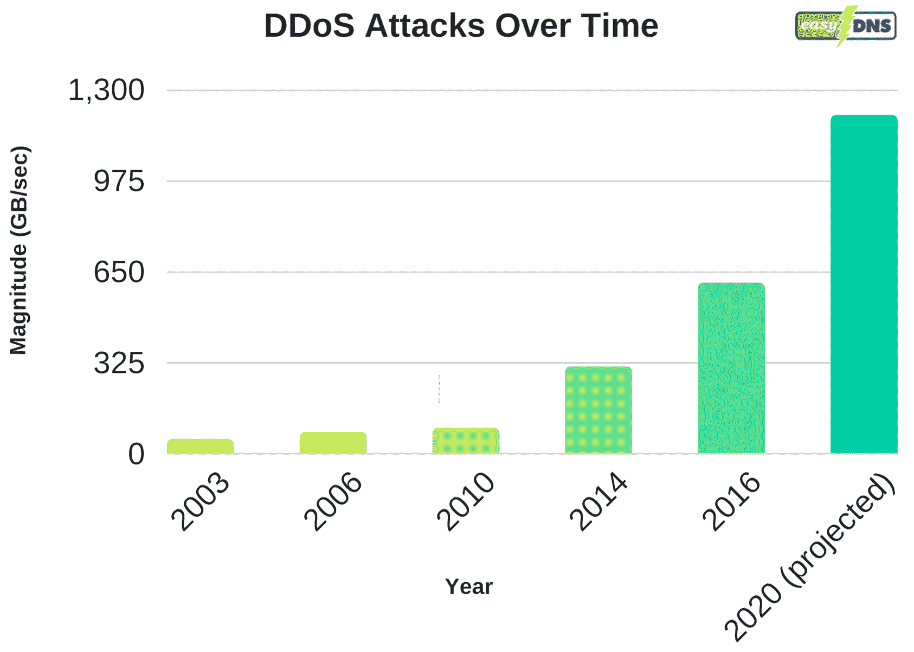

DDoS attacks over time

[According to a report from @Link11GmbH, DDoS attack volume rose 50% in Q2 2018! 😨Click to Tweet](https://twitter.com/intent/tweet?url=https%3A%2F%2Fbit.ly%2F3f0WAs8&via=kinsta&text=According+to+a+report+from+%40Link11GmbH%2C+DDoS+attack+volume+rose+50%25+in+Q2+2018%21+%F0%9F%98%A8&hashtags=websec%2CDDoS)

在 Kinsta，我们通常能够抵御比廉价主机更多的攻击，这仅仅是因为我们有额外的安全预防措施，如我们实施的[谷歌云平台的](https://kinsta.com/blog/google-cloud-hosting/)企业级防火墙。但我们也建议利用那些拥有大型基础设施和软件的公司，这些设施和软件是专门为抵御 DDoS 攻击而构建的。

我们将永远支持让专家做他们最擅长的事情。Cloudflare 和 [Sucuri](https://sucuri.net/) 是我们为 WordPress 用户或任何类型平台推荐的两个。投资于体面的 DDoS 保护可以节省您的时间、金钱，并减少以后的挫折感。**如果你的网站托管在 Kinsta 上，你就不需要经历安装 Cloudflare 或 Sucuri 的过程。**Kinsta 上托管的所有网站都自动受到我们的 [Cloudflare 集成](https://kinsta.com/cloudflare-integration/)的保护，它包括一个安全的防火墙，提供免费的 DDoS 保护。

## 在 EDD 的一个小站点上阻止 DDoS 攻击

在这个案例研究中，我们有一个小型的 WordPress 电子商务网站，运行着 [Easy Digital Downloads](https://kinsta.com/blog/easy-digital-downloads/) 。该网站通常每天只产生 30-40 MB 的带宽和几百个访问者。早在六月，它就开始[使用大量带宽](https://kinsta.com/knowledgebase/website-bandwidth-usage-cloudflare/)了，而[谷歌分析](https://kinsta.com/blog/how-to-use-google-analytics/)没有显示任何额外的流量。该网站一天的数据传输量瞬间达到了 15-19 GB！那就是**增长了 4650%** 。不太好。而且绝对不只是 bot 流量的一点点增加。幸运的是，老板能够在 Kinsta 的分析中迅速发现这一点。

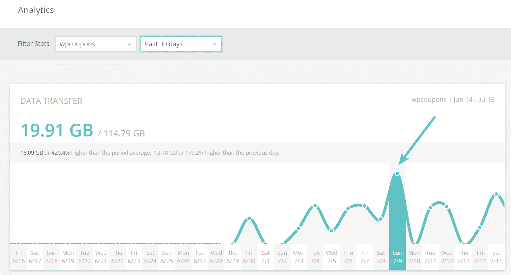

High bandwidth usage on WordPress site

看到增长后，就需要检查服务器日志来调查发生了什么。这类事情很容易失去控制。在过去的 7 天里，该网站的/账户/页面被**请求了 511000 次**，产生了总共 66 GB 的流量。这是来自一个通常在一整个月内产生 1 GB 多一点的总数据的站点。所以我们立刻知道出事了。

分析该网站过去 7 天的前 10 个客户端 IP 立即显示了一些可疑活动。他们中的大多数人都有超过 10，000 次的请求，而且有相当多的请求。记住，这是一个小网站，每个月应该只有几千个请求。

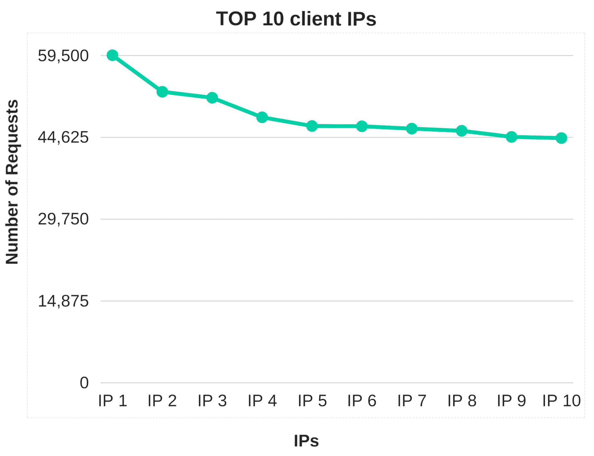

Top 10 client IPs (blocked out for security purposes)

你可以一直依靠谷歌为你提供数据。在搜索中输入几个顶级 IP，我们可以很容易地看到它们中的大多数都是代理地址，这意味着有人最有可能想要隐藏他们的流量。

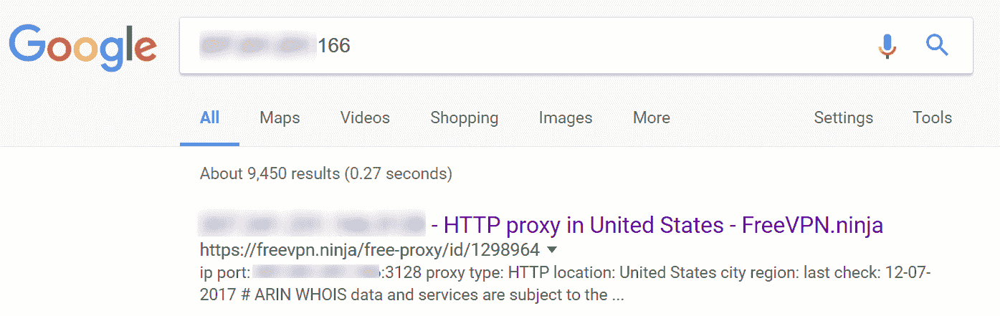

Proxy IP

### 更改 URL

我们做的第一件事实际上是将/account/ page URL 改为不同的东西。这总是一个很好的第一步。然而，这只能在短时间内阻止攻击，直到他们发现新的 URL。记住，因为这是一个电子商务网站，所以它必须有一个公共帐户页面。

显然，仅仅在博客上，[改变 WordPress 登录 URL](https://kinsta.com/blog/wordpress-login-url/#change-login-page) 并完全隐藏它将会阻止许多这类攻击，但在这种情况下这不起作用。我们默默无闻地称之为 [WordPress Security](https://kinsta.com/blog/wordpress-security/) 。

### 黑客攻击还是暴力攻击？

在这种情况下，你可以确认的另一件事是，这不是一次黑客攻击企图，在这种情况下，它不是。WP 安全审计日志是一个很棒的插件，可以快速监控并查看页面上是否有任何无效的登录尝试。

您还可以检查您的日志，看看是否有大量的 POST 操作发生。这似乎是一种典型的 DDoS 攻击，他们只是向网站的一部分发送大量流量，试图淹没它。

### IP 阻止

如果你在自己的服务器上运行，下一步可能是安装一个 IP 拦截或防火墙插件，比如 [WordFence](https://kinsta.com/blog/wordpress-security-plugins/#wordfence-security) 。对于在 Kinsta 上运行的站点，我们不推荐这种方法，原因有两个。

首先，安全和防火墙插件会对你的性能产生巨大的影响，尤其是扫描能力。第二，我们利用谷歌云平台的负载平衡器，这意味着很多时候他们的 **IP 阻止功能不会像预期的那样工作**。

因此，我们建立了自己的工具。您现在可以使用 MyKinsta 仪表板中的 [IP 拒绝工具](https://kinsta.com/knowledgebase/block-ip-address/)轻松地手动阻止 IP 地址。或者，您可以随时联系我们的支持团队，因为我们也支持地理封锁。

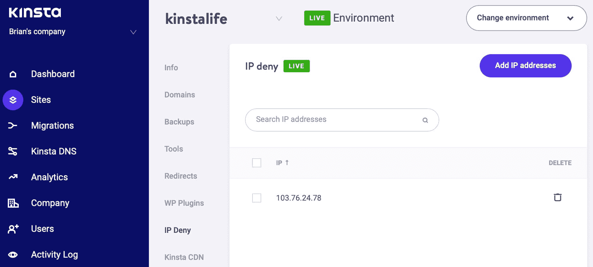

IP Deny tool

然而，根据攻击的长度和规模，这可能是一个永无止境的将 IP 列入黑名单的过程，在大多数情况下，这并不能足够快地解决问题。许多 DDoS 攻击在一个地区被阻止后，会在另一个地区突然出现，或者改变 IP 和代理地址。

因此，在这种情况下，利用 DDoS 解决方案是有意义的，这种解决方案可以通过从多年数据中编译的内置规则来帮助自动化该过程。

## 将站点迁移到 Cloudflare 没有帮助

很多时候 [Cloudflare](https://www.cloudflare.com/) 在阻止一些基本的 bot 流量方面做得不错，但当涉及到免费计划时，他们的 DDoS 保护不是最好的。事实上，我们将该站点迁移到了 Cloudflare，这导致了更多可疑流量访问该站点。

虽然我们认为这仅仅是由于攻击增加了他们的努力。如下图所示，它达到了每小时近 50，000 个请求的速度。他们的 CDN 部分很棒，但是如果你需要更多，你很可能需要付费。

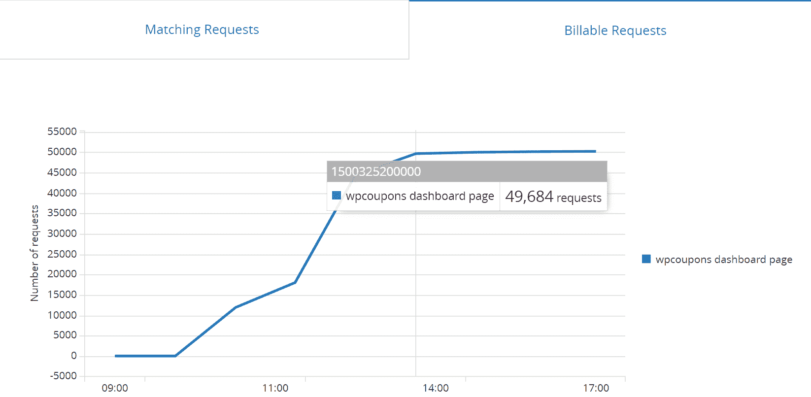

Cloudflare requests

然后，我们在网站上实施了“速率限制”。速率限制允许您创建与 URL 匹配的基于规则的流量，然后根据活动阻止/限制流量。这可以在免费计划中启用，每 10，000 次请求的费用为 0.05 美元。然而，按照我们看到的请求速度，每月大约有 3600 万个请求，这本身每月就要花费 180 美元。所以很明显，这不是解决问题的办法。是的，我们尝试了所有类型的模式规则。

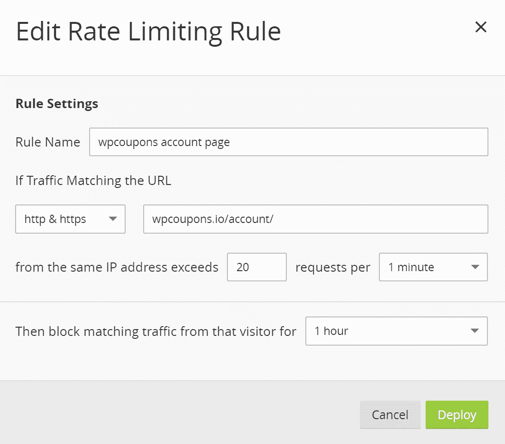

IP rate limiting

注意:[根据所有网站中符合您定义的规则的有效(未阻止)请求的数量，对](https://support.cloudflare.com/hc/en-us/articles/115000272247)费率限制进行计费。但在这种情况下，它不起作用。

下一步，我们知道已经开始了，是研究一个实际的[网络应用防火墙](https://kinsta.com/blog/what-is-a-firewall/#web-application-firewall)。很多用户并没有意识到这一点，但是 Cloudflare 的免费计划并不包括这一点。而这几乎是现今阻止 DDoS 攻击所必需的。因此，下一个选择是以每月 20 美元的价格升级到 Cloudflare 的 Pro 计划。但是，这是您应该花些时间比较其他第三方解决方案的地方。

[Free is not always better, whether it is for DDoS protection or #WordPress hosting. 👍Click to Tweet](https://twitter.com/intent/tweet?url=https%3A%2F%2Fbit.ly%2F3f0WAs8&via=kinsta&text=Free+is+not+always+better%2C+whether+it+is+for+DDoS+protection+or+%23WordPress+hosting.+%F0%9F%91%8D)

## 将 Cloudflare 与 Sucuri 进行比较

在我们看来，目前有两个最好的解决方案可以轻松地在任何类型的网站上实现 web 应用防火墙，它们是 [Cloudflare](https://www.cloudflare.com/) 和 [Sucuri](https://sucuri.net/) 。然而，如果你真的仔细研究这些，你会发现 Sucuri 可能是一个更好的选择[(如果你的网站不是在 Kinsta 上托管的话)](https://kinsta.com/cloudflare-integration/)。让我们来看看，因为他们都有 20 美元/月的计划。

### 云耀斑

使用 Cloudflare 的 Pro 计划，您只能在**第 3 层和第 4 层**获得高级 DDoS 保护(阅读有关[第 3 层和第 4 层 DDoS 攻击的更多信息](https://www.scudlayer.com/blog/en/2015/04/what-are-ddos-attacks-on-layer-3-and-4))。这将有助于自动阻止对其[边缘服务器](https://kinsta.com/knowledgebase/edge-servers/)的 TCP SYN、UDP 和 ICMP 攻击，因此它们永远不会到达您的源服务器。

## 注册订阅时事通讯

### 想知道我们是怎么让流量增长超过 1000%的吗？

加入 20，000 多名获得我们每周时事通讯和内部消息的人的行列吧！

[Subscribe Now](#newsletter)

要获得第 7 层保护，您必须升级到每月 200 美元的计划。请记住，这是一个非常小的电子商务网站，所以每月 200 美元将是非常昂贵的，除了他们的托管费。

建议阅读:[如何为 WordPress](https://kinsta.com/blog/cloudflare-apo-wordpress/) 设置 Cloudflare APO。

Kinsta 上的所有网站都配备了一个**免费的 Cloudflare 集成**，其中包括一个支持 HTTP/3 的高性能 CDN 和一个内置 DDoS 保护的企业级防火墙。与其他收取高昂 SSL 证书费用的主机不同， **Kinsta 通过 Cloudflare 提供免费的企业级 SSL 证书**，支持通配符域。

最重要的是，我们的 Cloudflare 集成不需要您拥有自己的 Cloudflare 帐户。这意味着您可以利用增加的速度和安全性，而不必注册和管理另一个每月订阅服务。

作为我们 Cloudflare 集成的一部分， [Edge Caching](https://kinsta.com/feature-updates/edge-caching/) 将您的 Kinsta 站点/页面缓存保存到 Cloudflare 全球网络的 **275+** 个数据中心中的任何一个。

边缘缓存免费包含在所有 Kinsta 计划中，不需要单独的插件，并且平均减少了超过 50%的时间！

### 苏库里

通过 Sucuri 每月 20 美元的计划，您可以在第 3 层和第 4 层**以及第 7 层**获得高级 DDoS 保护。这有助于自动检测流量的突然变化，并防止 POST floods 和基于 DNS 的攻击，因此它们永远不会到达您的原始服务器。因此，马上，你可能会看到 Sucuri 更好的 DDoS 缓解。在这种情况下，我们需要第 7 层来应对 HTTP 洪水攻击。

> HTTP flood 攻击是一种第 7 层应用程序攻击，它利用标准的有效 GET/POST 请求来获取信息，如在典型的 URL 数据检索(图像、信息等)中。)在 SSL 会话期间。HTTP GET/POST 泛洪是一种体积攻击，它不使用格式错误的数据包、欺骗或反射技术。–[苏库里](https://blog.sucuri.net/2014/02/layer-7-ddos-blocking-http-flood-attacks.html)

Sucuri 还在其每月 70 美元的计划中提供负载平衡，而 Cloudflare 在其负载平衡功能的不同方面都有相当多的费用，例如基于使用的定价，您是否需要地理负载平衡等。

他们都有类似的功能，如能够添加挑战，某些网页，列入黑名单的 IP 等。然而，就 DDoS 防护而言，Sucuri 提供了更多。我们也非常喜欢 Sucuri 中的 IP 黑名单 UI，以及某些事情相对于 Cloudflare 是如何设置的。

请记住，没有一家公司能够向您承诺 100%的 DDoS 保护，他们所能做的只是帮助您自动减轻威胁。

## 将网站移至苏库里

将你的网站迁移到苏库里是相当容易的。就像 Cloudflare 一样，从技术上讲，您不需要安装任何东西，因为它充当了一个完整的代理服务。这意味着您将您的 DNS 指向它们，然后它们指向您的主机。实际上，[网络应用防火墙](https://en.wikipedia.org/wiki/Web_application_firewall)(或 [WAF](https://kinsta.com/blog/sucuri-firewall/) )位于中间。

在我们看来，他们的仪表盘没有 Cloudflare 那样华丽或现代，但当谈到 WAF 时，你真的应该关心它的工作情况。正如你在下面看到的，基本上它检测你当前的主机 IP，他们为你提供一个防火墙 IP。这就是你的 DNS 所指向的(一个名称记录+ AAAA 记录)。

Struggling with downtime and WordPress problems? Kinsta is the hosting solution designed to save you time! [Check out our features](https://kinsta.com/features/)

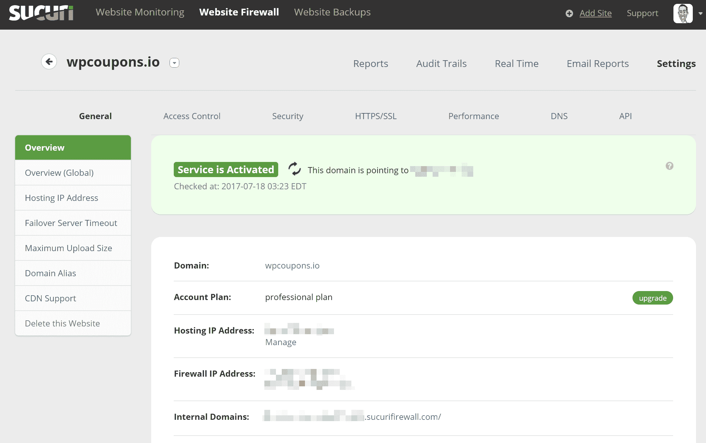

Sucuri dashboard

您可以在几分钟内启动并运行 Sucuri。这在当前 DDoS 攻击的情况下是很好的。唯一真正的等待时间是 [DNS 传播](https://kinsta.com/blog/dns-propagation/)。它们还包括一个 HTTP/2 任播 CDN。所以它不仅仅是一个防火墙。它也可以帮助你加速你的 WordPress 站点。但是你也可以选择使用你自己的 [CDN](https://kinsta.com/blog/wordpress-cdn/) ，比如带有 Sucuri 的 KeyCDN。

它们包括一个[免费 SSL 证书，让我们加密](https://kinsta.com/blog/free-ssl-certificate/)或者你可以上传你自己的。一个缺点是“让我们加密”不是自动的，你必须开一张票。但是他们的自定义 SSL 证书过程很快。

关于性能的另一个提示是，您可能希望启用站点缓存选项。这将尊重你的原始服务器的缓存，而不是使用 Sucuri 的。很可能你已经按照你想要的方式在你的 WordPress 主机上设置了[缓存。](https://kinsta.com/blog/wordpress-cache/)

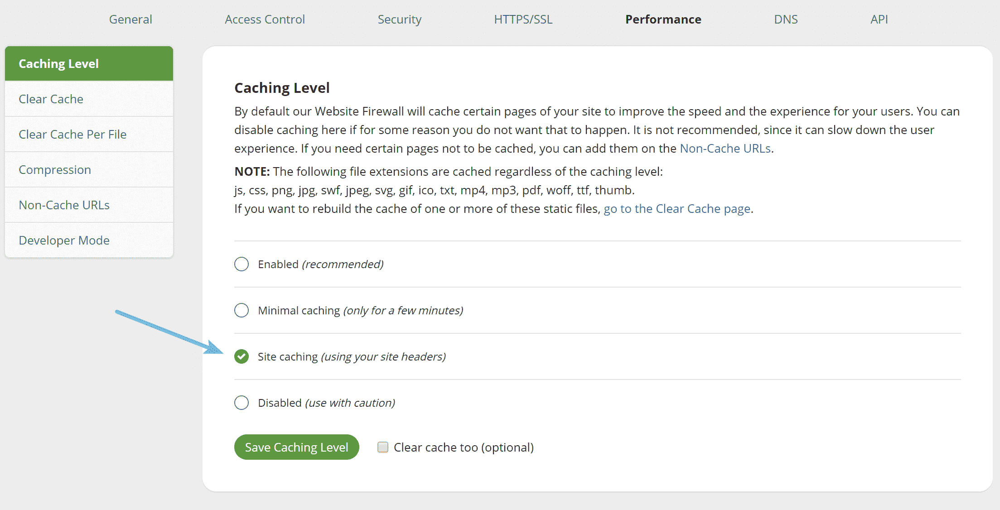

Sucuri site caching

### 高级安全选项

在安全屏幕下，你可以轻松地阻止所有的 XML-RPC 流量、攻击性的僵尸程序，启用额外的安全头，如 T2 HSTS T3 等等。注意:XML-RPC 流量已经在此特定站点上被阻止。

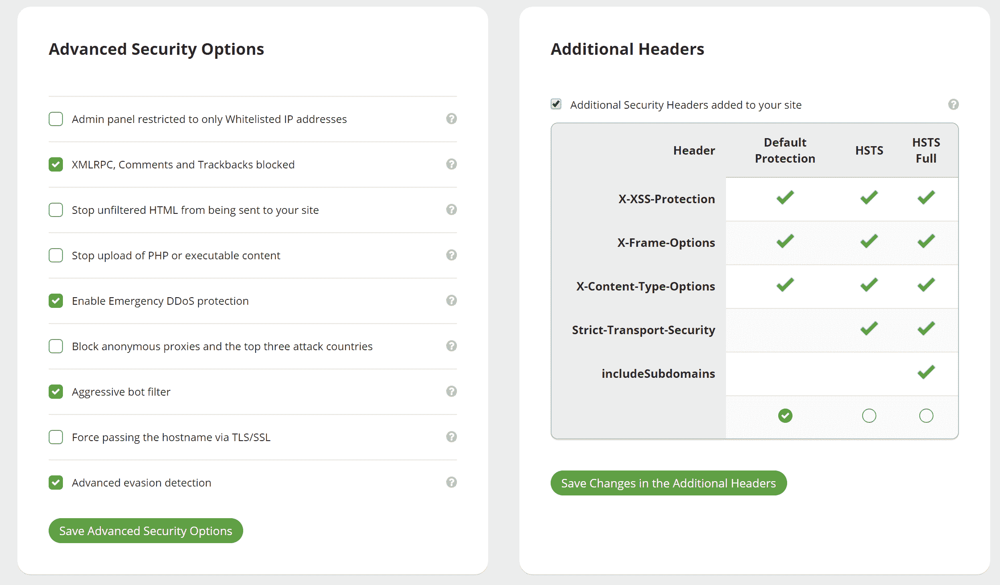

Sucuri advanced security options

### 实时视图

我们非常喜欢他们的实时 DDoS 保护视图。您可以很容易地进入它，并看到当前请求的完整日志。你可以点击黑名单或白名单任何可疑的，它甚至会给你一个原因，如果它已经被阻止。

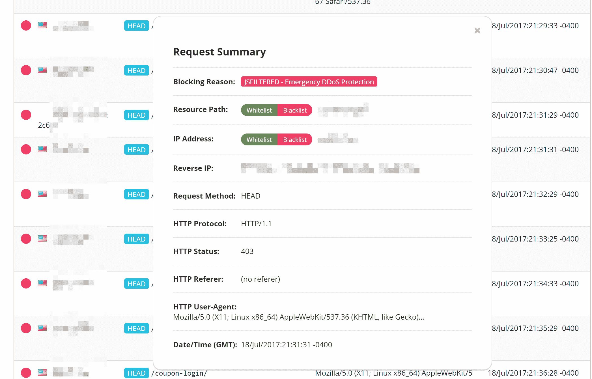

DDoS protection real-time

### 其他有用的报告

还有许多其他有用的报告，如拦截的攻击图表。这使您可以快速查看被拦截的攻击类型的百分比，包括 DDoS 攻击。此窗口中的其他一些图表包括按浏览器类型、设备和 HTTP 响应代码划分的流量。

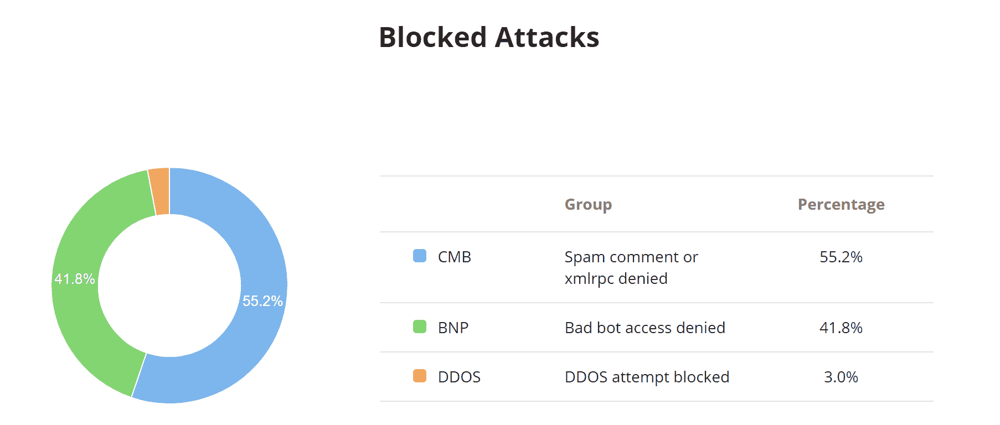

DDoS protection real-time

每小时平均流量图表便于查看流量的高峰时间以及被阻塞请求的比率。

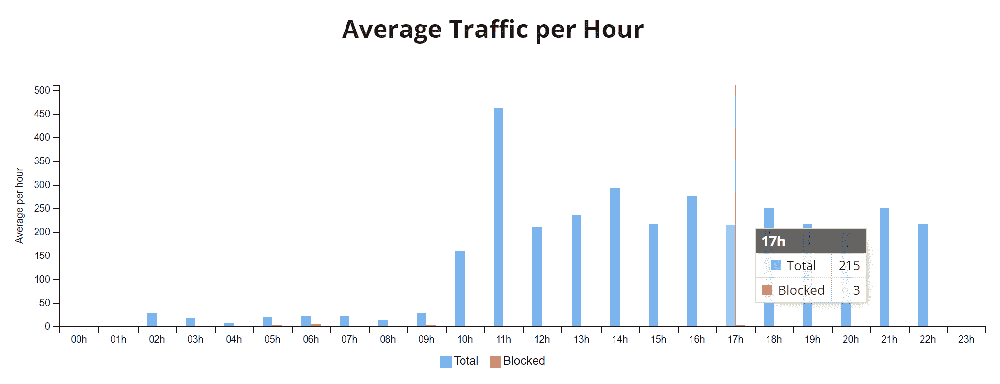

Average traffic per hour

按国家/地区划分的流量表可以帮助您确定某些信息是否来自某个特定的地理位置。在他们的访问控制下，只需轻轻一点，你就可以轻松地暂时封锁整个国家。

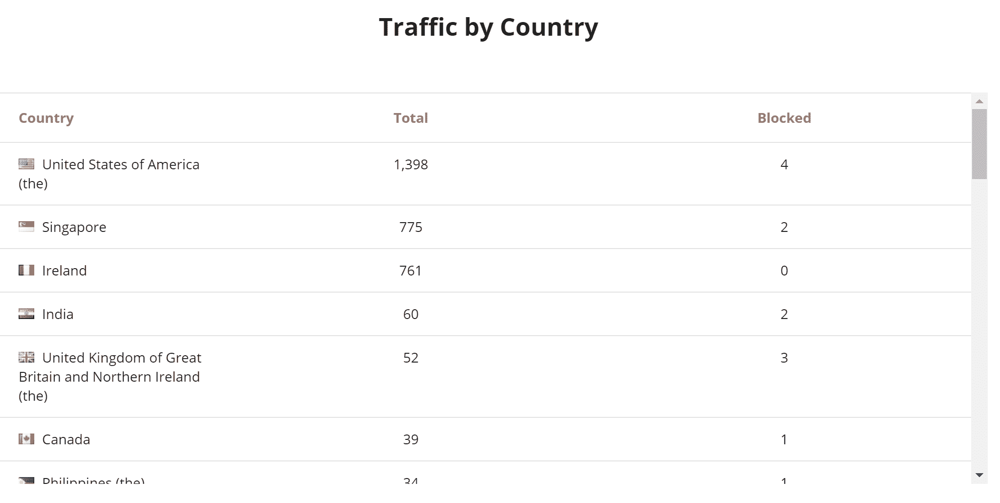

Traffic by country

访问控制下的其他功能包括将 IP 和路径列入白名单和黑名单、阻止用户代理、阻止 cookies、阻止 HTTP 推荐人，以及使用 [captcha](https://kinsta.com/blog/wordpress-captcha/) 、双因素或简单密码保护特定页面。

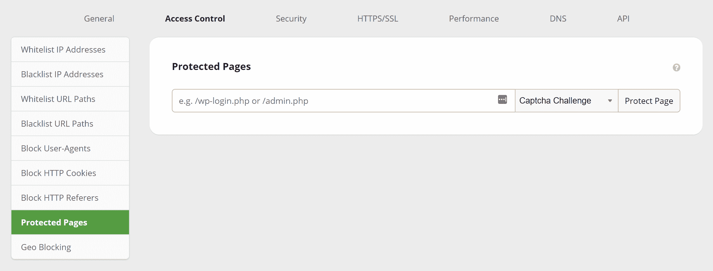

Sucuri access control

Sucuri 对我们这个小型 WordPress 电商网站有帮助吗？事实上，在 [DNS 完成](https://kinsta.com/blog/dns-propagation/)、**的传播一个小时后，所有的带宽和请求立即在网站上消失**(如下图所示)，而**从**开始就没有出现过一个问题。所以，如果你遇到这样的问题，这绝对是一个很好的投资和节省时间的方法。

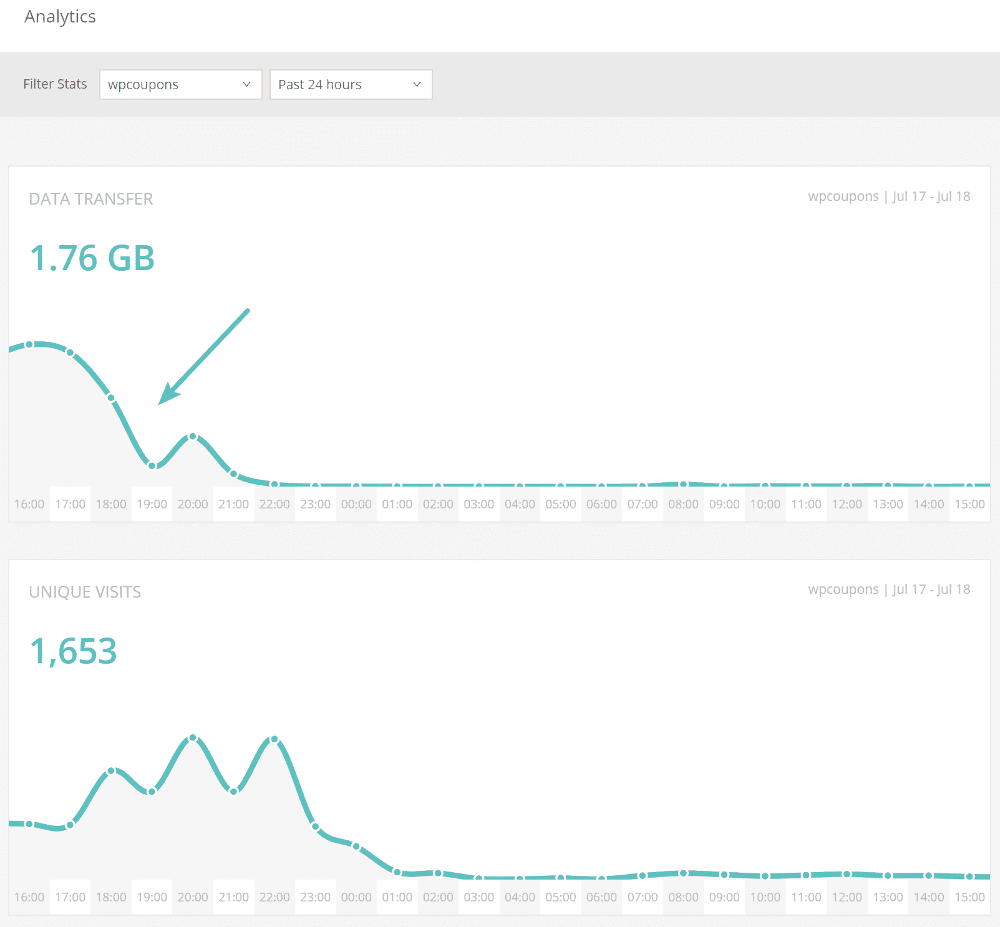

Added Sucuri web application firewall

这是网站搬到苏库里后的样子。如您所见，现在每天的数据传输量已降至原来的 30-40 MB。

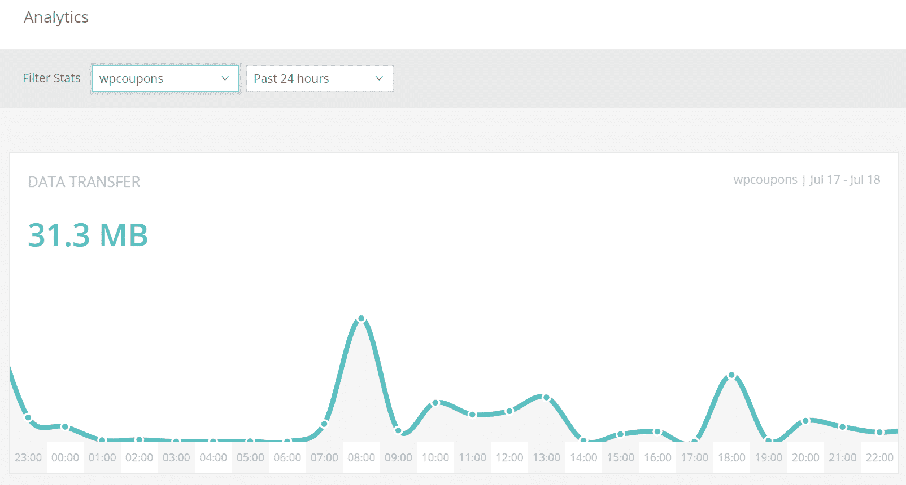

Low bandwidth usage

即使您没有受到攻击，也许您只是想要一种更简单的方法来阻止僵尸程序窃取您的主机带宽。

如果你已经尝试过其他解决方案，也许可以试一试苏库里。不要误解我们，对于许多网站来说，Cloudflare 仍然是一个很好的解决方案，因为我们向我们的大多数客户推荐它们。他们每月 200 美元的高薪计划很可能也会很好地减轻攻击。然而，了解其他解决方案总是好的。尤其是如果你预算有限的话。

### 摘要

希望上述信息能让您对如何阻止 DDoS 攻击有更多的了解。这当然只是你处理这种情况的许多不同方法中的一种。但是，如果您已经处于恐慌模式，通常迁移到 Cloudflare 或 Sucuri 可以让您立即恢复正常运行。

如果你只是想从垃圾邮件机器人那里节省带宽，web 应用防火墙也是一个非常有效的解决方案。

你对 Cloudflare vs Sucuri 有什么看法？还有，你喜欢看这些有真实数据的案例研究吗？如果是这样，请在下面告诉我们，因为这有助于我们决定将来应该发布什么类型的内容。

* * *

让你所有的[应用程序](https://kinsta.com/application-hosting/)、[数据库](https://kinsta.com/database-hosting/)和 [WordPress 网站](https://kinsta.com/wordpress-hosting/)在线并在一个屋檐下。我们功能丰富的高性能云平台包括:

*   在 MyKinsta 仪表盘中轻松设置和管理
*   24/7 专家支持
*   最好的谷歌云平台硬件和网络，由 Kubernetes 提供最大的可扩展性
*   面向速度和安全性的企业级 Cloudflare 集成
*   全球受众覆盖全球多达 35 个数据中心和 275 多个 pop

在第一个月使用托管的[应用程序或托管](https://kinsta.com/application-hosting/)的[数据库，您可以享受 20 美元的优惠，亲自测试一下。探索我们的](https://kinsta.com/database-hosting/)[计划](https://kinsta.com/plans/)或[与销售人员交谈](https://kinsta.com/contact-us/)以找到最适合您的方式。