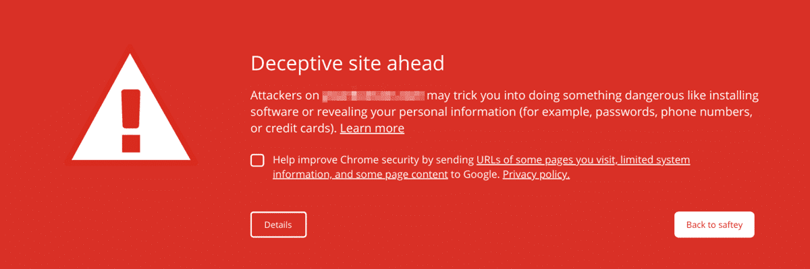
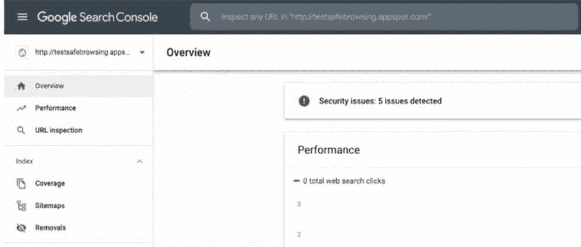
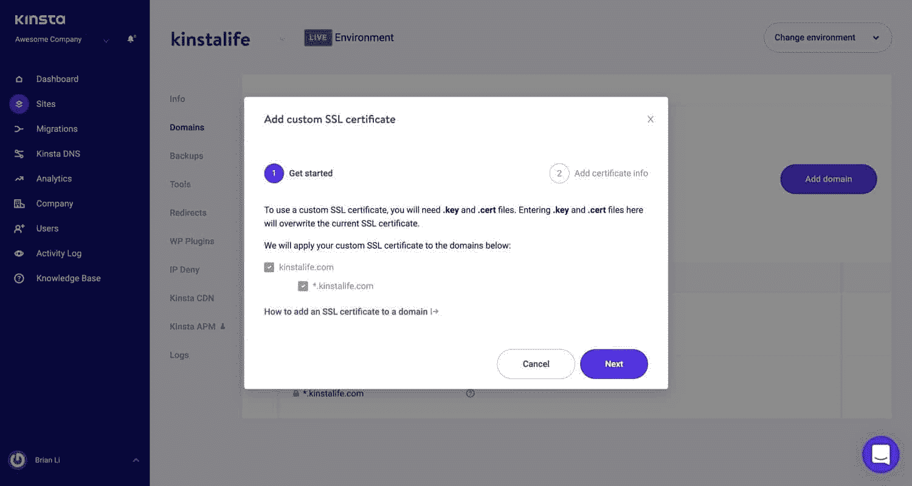
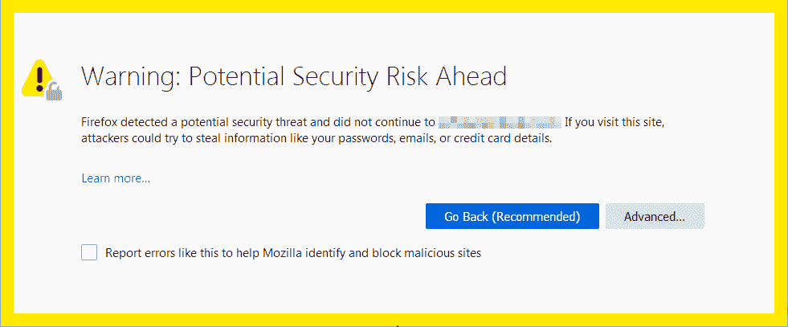
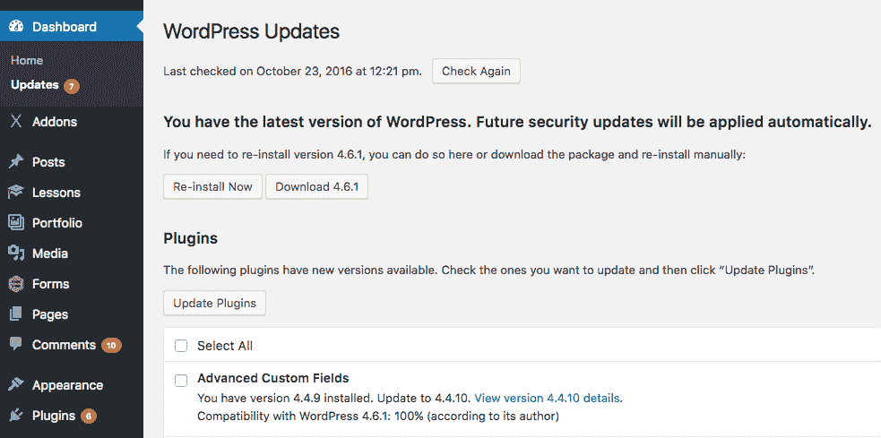

# 如何修复网站上的“前方有欺骗性网站”和其他警告

> 原文：<https://kinsta.com/blog/deceptive-site-ahead/>

想象一下，一个互联网用户正在搜索一个和你一样的网站。你的 [SEO 努力](https://kinsta.com/blog/wordpress-seo/)得到了回报——你的网站位于搜索结果的顶部，潜在客户点击了链接，却得到了“前方有欺骗性网站”或“前方网站包含恶意软件”的警告

但你没有试图欺骗任何人。为什么谷歌会显示关于你的网站的警告？

虽然这条消息可能令人担忧，但好消息是像“前方有欺骗性网站”这样的网站警告是可以修复的。请继续阅读，了解这些警告的含义以及如何将它们从您的网站上删除。

### 查看我们的[视频指南](https://www.youtube.com/watch?v=sfuaxxDYbIM)来修正“前方有欺骗性网站”的警告

## “前方欺骗性网站”是什么意思？

发现你的网站有一个警告是令人震惊的。你的第一反应可能是假设你的网站没有任何问题。毕竟，*你*知道你没有放任何危险的东西在上面。

但是其他人可能有。

> Kinsta 把我宠坏了，所以我现在要求每个供应商都提供这样的服务。我们还试图通过我们的 SaaS 工具支持达到这一水平。
> 
> <footer class="wp-block-kinsta-client-quote__footer">
> 
> 
> 
> <cite class="wp-block-kinsta-client-quote__cite">Suganthan Mohanadasan from @Suganthanmn</cite></footer>

[View plans](https://kinsta.com/plans/)

网站上欺骗性内容的警告。

我们都在新闻中读到过对大公司的网络攻击，但这也可能发生在小人物身上。事实上， [46%的数据泄露](https://enterprise.verizon.com/resources/reports/2021-data-breach-investigations-report.pdf)发生在小型企业。

常见的网站攻击类型包括 URL 注入，即黑客在网站上创建垃圾页面，以及[内容注入](https://kinsta.com/blog/sql-injection/)，如添加关键字和乱码文本。

如果你收到谷歌的一个警告，这可能表明你被黑客攻击了。也有可能你设置网站的方式让谷歌不喜欢。

警告的原因包括:

*   您的网站已经被恶意软件感染
*   您的网站包含钓鱼网页
*   您的 [SSL 证书](https://kinsta.com/blog/types-of-ssl-certificates/)有问题
*   你的主题和插件有安全漏洞
*   您的网站有可疑的链接
*   你提供可疑的下载

要删除警告，你必须重新向谷歌提交你的网站，并要求取消它的危险或欺骗性标签。幸运的是，这是一个非常简单的过程。

在你确定你的网站问题已经解决之前，不要把你的网站提交给谷歌。

## 网站警告消息及其含义

“前方有欺骗性网站”并不是谷歌附加在网站上的唯一警告。虽然修复方法——将你的网站重新提交给谷歌——对所有人来说都是一样的，但每个人的意思略有不同。

理解警告的含义是修复它的第一步。所以让我们来看看一些最常见的。

### “前方有欺骗性网站”

此警告专门针对那些可能是网络钓鱼网站的网站[。例如，它可能是一个看起来属于你的网站，但却被用来窃取用户个人信息的页面。](https://kinsta.com/blog/work-from-home-security/#1-phishing-scams)

### “前方网站包含恶意软件”

这表明该网站可能试图在站点访问者的计算机上安装有害软件。[恶意软件](https://kinsta.com/blog/types-of-malware/)可能会嵌入你网站的图片、第三方组件或广告中。

### "可疑网站"

这是一个一般性的警告，表明谷歌认为一个网站是可疑的和潜在不安全的。

### "网站前方包含有害程序"

有害程序错误警告您，您的网站可能会试图诱骗访问者安装会在他们在线浏览时造成问题的程序。

### "此页面试图从未经验证的来源加载脚本"

好消息:如果这是谷歌附在你网站上的警告，你[可能没有被黑](https://kinsta.com/blog/wordpress-hacked/)。这通常意味着你的网站是 HTTPS 的，但是试图从 [HTTP 源](https://kinsta.com/blog/http3/)加载脚本。

### "你是指[网站名称]吗？"

当谷歌认为网站访问者可能在寻找一个名称相似的不同网站时，它会向他们显示这条信息。黑客有时会创建离安全网站只有一个字母或连字符的网站，引诱访问者放弃他们的个人信息。

要求 Google 审查这个问题的过程与其他警告有点不同。如果您或您网站的访问者收到“您是指[网站名称]吗？”警告，Google 要求您使用此表格联系他们[。](https://bugs.chromium.org/p/chromium/issues/entry?template=Safety+Tips+Appeals)

### “欺诈网站警告”(Safari)

凭借 77.03%的全球桌面市场份额，谷歌 Chrome 可能是浏览器中无可争议的王者，但它不是唯一的游戏。Safari (8.87%的市场份额)也显示网站警告，尽管措辞略有不同。

### “前方潜在安全风险”(火狐)

Firefox 是第三大最受欢迎的浏览器，拥有 7.69%的市场份额，它也有自己的一套警告。

尽管 Safari 和 Firefox 对网站警告的措辞可能与谷歌不同，但原因和修复方法是一样的。

## 如何修复网站警告消息

在你重新提交你的网站给谷歌审查之前，你需要确保你已经解决了所有的安全问题。

[谷歌搜索控制台](https://kinsta.com/blog/google-search-console/)(之前称为站长工具)是你在这个过程中最好的朋友。通过搜索控制台，谷歌让你很容易弄清楚你的网站发生了什么——即使你没有很多技术专长。

如果你还没有为你的网站设置谷歌搜索控制台，现在是个好时机。它是完全免费的，而且在安全警告解除后很久，它还会帮助你监控、管理和改进你的网站。

### 1.在 Google 搜索控制台上查看您的安全问题报告

登录谷歌搜索控制台。如果 Google 发现了安全问题，概览页面上会有一个链接指向您的安全问题报告。

谷歌搜索控制台显示检测到安全问题。(图片来源:[搜索引擎期刊](https://www.searchenginejournal.com/using-google-search-console-to-find-fix-security-issues/367500/) )

您也可以通过进入侧边栏中的**安全&手动操作**，然后进入**安全问题**来访问该报告。

您可能会在报告中看到几个可能的安全问题。谷歌将问题分为三类:黑客内容、社会工程和恶意软件或不想要的软件。让我们快速地看一下每一个。

#### 黑客内容

[被黑内容](https://kinsta.com/blog/wordpress-hacked/)是指由于网站存在安全漏洞，未经您允许而添加到您网站的任何内容。例如，黑客可能会在您的网页中添加垃圾链接。

如果您遭到黑客攻击，您的安全问题报告将显示如下问题:

*   黑客攻击:恶意软件
*   黑客攻击:代码注入
*   黑客:内容注入
*   黑客攻击:URL 注入

#### 社会工程

社会工程意味着你网站上的内容试图欺骗人们去做一些危险的事情。例如，该网站可能有欺骗性的形式，以说服用户透露机密信息。

您报告中的社会工程内容问题可能包括:

*   欺骗性页面
*   欺骗性嵌入式资源

#### 恶意软件和不需要的软件

这个问题意味着您的网站上有可能危害用户的应用程序或[可下载软件。网站所有者或黑客可能安装了它们。](https://kinsta.com/blog/easy-digital-downloads/)

预计会出现以下问题:

*   有害下载
*   有害下载的链接

无论您在报告中看到哪一期，都可以点击查看更多信息。

谷歌建议如何解决这个问题，但它可以变得非常技术性。对于许多问题，有更直接、更友好的方法来修复你的网站并移除警告。
T3】

### 2.查找并删除您网站上的恶意代码

在 Kinsta，我们有一个[恶意软件安全承诺](https://kinsta.com/knowledgebase/malware-security/)。这意味着，如果您的网站托管在这里，请联系我们，我们将:

*   对您站点的文件执行深度扫描，以识别恶意软件
*   通过安装[核心文件](https://kinsta.com/knowledgebase/wordpress-files/)的干净拷贝来修复 WordPress 核心文件
*   识别并删除受感染的插件和主题

但是，如果你的 WordPress 站点托管在其他地方，你可以尝试从最近的备份中恢复你的站点以前的干净版本。请记住，您将丢失自备份网站以来所做的任何更改。

如果你没有备份或者不想丢失你的新内容，有几个插件和服务可以帮助你。

## 注册订阅时事通讯

### 想知道我们是怎么让流量增长超过 1000%的吗？

加入 20，000 多名获得我们每周时事通讯和内部消息的人的行列吧！

[Subscribe Now](#newsletter)

### 3.确保 SSL 证书安装正确

SSL 代表[安全套接字层](https://kinsta.com/knowledgebase/how-ssl-works/)。这是一种网络安全协议，当数据在两个应用程序(如浏览器和网络服务器)之间发送时，它会对数据进行加密和认证。

有时，不正确的 SSL 证书安装会导致浏览器警告消息。您可以使用类似于 [SSL Checker](https://decoder.link/sslchecker/) 的工具来检查您的安装。

如果您的网站托管在 Kinsta 上，它会自动受到我们的 [Cloudflare 集成](https://kinsta.com/cloudflare-integration/)的保护，包括带有通配符支持的免费 SSL 证书。

通过 MyKinsta 安装 SSL 证书。

### 4.将网站从 HTTP 重定向到 HTTPS

您的 SSL 证书启用了 HTTPS。每个人都应该使用 HTTPS，它更安全，更适合搜索引擎优化，并且提供更准确的推荐数据。

不幸的是，[从 HTTP 迁移到 HTTPS](https://kinsta.com/blog/http-to-https/) 的过程会导致问题。

将所有 HTTP 流量永久重定向到 HTTPS 非常重要。如果你有一个 HTTPS 网站，但有些内容是通过不太安全的 HTTP 连接加载的，谷歌可能会在你的网站上附上一条警告信息。

Kinsta 客户可以使用我们的 Force HTTPS 工具，只需点击几下鼠标，就可以将 HTTP 流量重定向到 HTTPS。对于其他主机，修复将取决于所使用的服务器软件。

有一个简单的解决方案，使用 WordPress 插件来配置你的网站运行在 HTTPS 之上。安装 SSL 后，获得真正简单的 SSL 插件。

也就是说，我们不建议你永久使用插件方法。

虽然第三方插件作为一种快速解决方案可能很有吸引力，但它也带来了额外的风险。当你用另一种方法解决问题时，你可以把它作为权宜之计。

## 如何向谷歌重新提交你的网站

您发现了网站的安全问题，并清理了网站。现在怎么办？

要向 Google 重新提交您的站点，您将使用——您猜对了——Google 搜索控制台。方法如下:

### 第一步:准备提交你的网站

仔细检查你是否已经删除了网站上的有害内容。如果您使用安全扫描程序找到了恶意软件，请重新运行它。

提交您的网站而不解决问题将会导致额外的延迟。

要查看你的网站，谷歌必须能够抓取它。确保你没有通过`noindex`标签或任何其他方法屏蔽 Googlebot。

最后，这似乎是显而易见的，但这是以前犯过的错误:如果你让你的网站离线以应对黑客攻击，确保它再次上线，以便谷歌可以检查它。

### 第二步:请求审查

回到你的谷歌搜索控制台。在您的安全问题报告上，单击**请求审查**按钮。

这将带你到一个表格，要求你描述你做了什么来解决这个问题。针对检测到的每个安全问题写一句话。

厌倦了低于 1 级的 WordPress 托管支持而没有答案？试试我们世界一流的支持团队！[查看我们的计划](https://kinsta.com/plans/?in-article-cta)

例如，如果您收到错误“黑客攻击:内容注入”和“有害下载”，您可以写:

> 对于内容注入，我删除了垃圾内容，并通过更新我的 WordPress 插件修复了漏洞。对于有害下载，我替换了在我的网站上分发恶意软件下载的第三方代码。

如果您的网站被专门标记为网络钓鱼，您可以通过谷歌搜索控制台[提交它进行审查](https://safebrowsing.google.com/safebrowsing/report_error/?hl=en)，如所述。

如果您看到“您是指[站点名称]吗？”消息，通过这个链接提交你的站点[，而不是搜索控制台。](https://bugs.chromium.org/p/chromium/issues/entry?template=Safety+Tips+Appeals)

### 第三步:等待

谷歌审查你的网站需要多长时间取决于安全问题的类型。

*   **被垃圾邮件黑:**几周
*   **恶意软件:**几天
*   **网络钓鱼:**大约一天

如果谷歌发现你的网站是干净的，该警告应在 72 小时内删除。

### 如果你的网站没有通过审核怎么办？

如果谷歌确定你没有解决问题，欺骗性网站警告将继续存在。您的安全问题报告可能会开始显示更多受感染 URL 的示例，以帮助您追踪恶意内容。

### 其他浏览器上的警告呢？

如果您的网站在 Safari 或 Firefox 上也显示警告，请不要担心。您不必为每个浏览器进行单独的审核过程。

火狐安全风险警告消息。

Firefox 和 Safari 以及许多其他浏览器都从谷歌安全浏览列表中获取信息，这是一组频繁更新的不安全网络资源列表。(Mainland China 的[用户除外，在那里 Safari 可能会使用腾讯的列表，而不是谷歌的。)](https://kinsta.com/knowledgebase/great-firewall-of-china-google-cloud-platform/)

如果你的网站被谷歌清除了，其他浏览器上的警告也会被删除。

## 如何防止“前方欺骗性网站”警告

[没有哪个网站是 100%安全的](https://kinsta.com/blog/is-wordpress-secure/)。黑客们一直在开发新的技巧，如果你是网站所有者，你总有可能成为下一个受害者。

也就是说，大多数网络攻击可以通过遵循一些最佳实践来预防。

以下是我们的一些小贴士，可以防止鲜红的警告页面向你网站的访问者发出问候。

### 保持最新状态

重要的是，你网站上的任何软件，无论是你的核心 CMS 程序、插件还是主题，都是最新的。

开发人员更新软件以应对新的安全威胁，但是如果你运行的是旧版本，你的网站仍然容易受到攻击。

等待 WordPress 站点更新。

一项研究发现，49%被黑的 WordPress 网站在被感染时运行的是过时的 CMS 版本。

不要忘记你的插件。[插件是 WordPress](https://kinsta.com/best-wordpress-plugins/) 的一大特色，但是很容易加一堆就再也不想了。

每个插件都是黑客进入你网站的入口。为了尽可能的安全，[定期更新](https://kinsta.com/knowledgebase/manually-update-wordpress-plugin/)，避免使用[作废的插件](https://kinsta.com/blog/nulled-wordpress-plugins-themes/)。

### 使用 WordPress 安全插件

设计用来增强 WordPress 网站安全性的插件不在少数。

问题是它们中的许多会导致站点性能问题。这就是为什么我们在 Kinsta 网站上禁止了其中一些。

如果你在 Kinsta 上托管，我们的免费黑客修复和内置于 [MyKinsta dashboard](https://kinsta.com/mykinsta/) 的安全功能意味着你不需要第三方安全工具。

但是对于使用其他托管服务的网站所有者来说，我们特别推荐两个插件: [Sucuri 或 Wordfence](https://kinsta.com/blog/sucuri-vs-wordfence/) 。

### 监控谷歌搜索控制台

使用谷歌搜索控制台的网站所有者应该会收到关于安全问题的电子邮件警告，但不时检查一下也无妨。

此外，搜索控制台有许多其他功能，帮助您的网站的性能和搜索引擎优化。关注这个工具只会让你的网站变得更好。

### 限制访问

数量惊人的黑客以一种简单的方式进入你的网站:他们[使用你的密码](https://kinsta.com/blog/change-wordpress-password/)。

小心谁拥有您网站的登录凭证。确保您团队中的每个人都遵循最佳实践，如使用密码管理器的[，并且他们了解如何避免网络钓鱼邮件等诈骗。](https://kinsta.com/blog/password-managers/)

### 选择安全的主机

作为网站所有者，你只能做这么多来确保你的网站是安全的。对于服务器级的安全性，你需要[找到一个你可以信任的主机](https://kinsta.com/blog/managed-wordpress-hosting/)。

你的主机可以做一些事情来避免这些警告出现在你的网站上:

*   使用 [Cloudflare](https://kinsta.com/knowledgebase/install-cloudflare/) 等防火墙保护网站
*   为安全版本提供自动更新
*   提供[双因素认证](https://kinsta.com/blog/wordpress-two-factor-authentication/)
*   [自动备份](https://kinsta.com/help/wordpress-backups/)个网站

[不让这个(令人担忧！)警告引导访问者远离你的网站。😰请继续阅读，了解它的含义以及如何删除它⬇️ 点击推文](https://twitter.com/intent/tweet?url=https%3A%2F%2Fkinsta.com%2Fblog%2Fdeceptive-site-ahead%2F&via=kinsta&text=Don%27t+let+this+%28alarming%21%29+warning+steer+visitors+away+from+your+site.+%F0%9F%98%B0+Read+on+to+find+out+what+it+means+and+how+to+remove+it+%E2%AC%87%EF%B8%8F&hashtags=WPTips%2CSEO)

## 摘要

意识到谷歌在你的网站上放了一个警告是令人担忧的，但这并不难解决。看到警告消息甚至可能是一个有用的警告，表明您的站点有问题。

最好的方法是设置谷歌搜索控制台，并定期监控你的网站。任何问题一出现就处理。

更好的是，[首先避免安全问题](https://kinsta.com/cheatsheets/site-security-cheat-sheet/)。遵循上面的 WordPress 安全最佳实践将会对保持你的网站安全和你的输入流量有很大的帮助。

这一切都始于一个关注安全的[应用](https://kinsta.com/application-hosting/)、[数据库](https://kinsta.com/database-hosting/)和[管理的 WordPress 主机](https://kinsta.com/wordpress-hosting/)。点击了解更多有关 Kinsta 如何简化项目管理的信息。

* * *

让你所有的[应用程序](https://kinsta.com/application-hosting/)、[数据库](https://kinsta.com/database-hosting/)和 [WordPress 网站](https://kinsta.com/wordpress-hosting/)在线并在一个屋檐下。我们功能丰富的高性能云平台包括:

*   在 MyKinsta 仪表盘中轻松设置和管理
*   24/7 专家支持
*   最好的谷歌云平台硬件和网络，由 Kubernetes 提供最大的可扩展性
*   面向速度和安全性的企业级 Cloudflare 集成
*   全球受众覆盖全球多达 35 个数据中心和 275 多个 pop

在第一个月使用托管的[应用程序或托管](https://kinsta.com/application-hosting/)的[数据库，您可以享受 20 美元的优惠，亲自测试一下。探索我们的](https://kinsta.com/database-hosting/)[计划](https://kinsta.com/plans/)或[与销售人员交谈](https://kinsta.com/contact-us/)以找到最适合您的方式。