# 如何诊断排名下降(我们见过的最疯狂的 SEO 问题)

> 原文：<https://kinsta.com/blog/decline-seo-rankings/>

当你意识到你的网站不再排名或者你突然看到流量下降时，没有人愿意经历那种可怕的感觉。你立刻进入我们所说的“搜索引擎优化恐慌模式”，开始疯狂地寻找解决方案。😨不幸的是，有许多不同的因素可能导致这种情况发生，例如低质量的内容，谷歌的处罚，技术现场问题，算法更新，或者也许你的竞争对手只是击败了你。

这是最近发生在我们金斯塔的事情，这是我们见过的最奇怪的搜索引擎优化问题！但是不要担心，我们会和你分享整个故事。通过完全透明和分享我们自己的奋斗，我们希望反过来，这将有助于您的企业做好准备。看看当我们意识到在 Kinsta.com 没有新的排名时，我们经历的整个过程，以及我们是如何恢复的。


## 解决我们自己的搜索引擎优化问题

谷歌并不完美。是的，我们确实说过。就像任何其他公司一样，他们不时会犯错误，即使是在搜索引擎结果(SERPs)和他们的算法方面。他们有时甚至推出算法来修正以前的算法。

我们在 Kinsta 团队中的一些人已经做了 [SEO](https://kinsta.com/blog/what-does-seo-stand-for/) 很多年，我们在这个流量频道中投入了[很多努力，所以我们已经看到了相当多的独特问题，但是最近发生在我们身上的事情是最棒的！🎂最终，谷歌确实犯了一个错误，给我们自己的网站(Kinsta.com)留下了一个不必要的手动操作。看看下面我们是如何得出这个结论的，以及恐慌发作诱发的情况到底是如何发生的。](https://kinsta.com/blog/wordpress-seo/)

### 平均排名下降

正如我们在之前的帖子中所分享的，我们在 Kinsta 利用 [Accuranker](https://www.accuranker.com/) 来监控我们的内容营销在 SERPs 中的表现。我们强烈建议获得这个工具！由于我们发布了大量内容，我们会定期检查这些数据。2018 年 1 月 24 日，我们注意到**在全网站的平均排名**完全下降。


Drop in average ranking


提示:这是你应该监控关键词排名的主要原因之一。[谷歌搜索控制台](https://kinsta.com/blog/google-search-console/)数据延迟，在[谷歌分析](https://kinsta.com/blog/how-to-use-google-analytics/)解决这类问题更加困难。Accuranker 只需快速浏览一下仪表盘，就能让我们立即知道我们的网站出现了问题。这也是一种简单的方法，可以发现排名下降的个别内容，这些内容可能需要更新或改进。

然后，我们开始全面检查我们的关键词排名，但我们没有看到任何问题。因此，我们有一种预感，这可能与我们的新内容有关。我们的假设是正确的，因为我们的新帖子确实显示了“0”的排名。当然，现在并不是每篇文章都会马上出现在谷歌的第一页，但通常它应该在某个地方排名，即使是 200+。排名“0”不是一个好兆头。


这也可能因每个网站的抓取率和一系列其他因素而异。如果你定期发布，你可能会知道或者估计一个[搜索引擎](https://kinsta.com/blog/alternative-search-engines/)开始索引和排列你的内容需要多长时间。

### 检查单个帖子的关键词排名

多亏了 Accuranker，我们很好地确定了问题开始发生的日期。于是我们开始在 Ahrefs 中查看我们在那一天的博客帖子。它们提供了一种快速扫描页面或 [URL](https://kinsta.com/knowledgebase/what-is-a-url/) 并查看其当前排名的方法。你也可以使用谷歌搜索控制台来做到这一点，但它没有这么快。

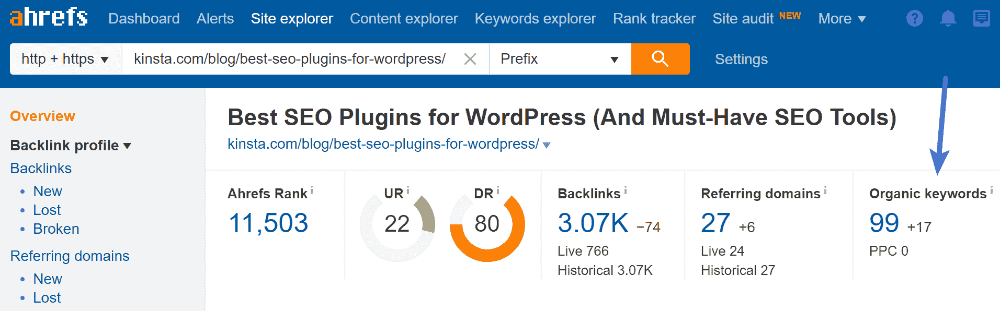

Organic keyword rankings in Ahrefs


我们开始一个接一个地将我们一个月前的每个帖子的关键词排名输入到一个电子表格中。这可以帮助你发现一个模式，在我们的例子中，它确实做到了。正如你在下面看到的，我们的帖子通常会有 50-1000 个关键词。但是从 2018 年 1 月 26 日开始，没有任何排名。😨因此，我们不仅仅是排名下降，我们只是处于停滞状态。

其中许多是博客文章，但即使是我们新发布的超过 2600 字的登陆页面也没有排名。由于更好的内部链接结构、页脚链接、更高的页面权限等，登录页面通常应该排名更快甚至更容易。

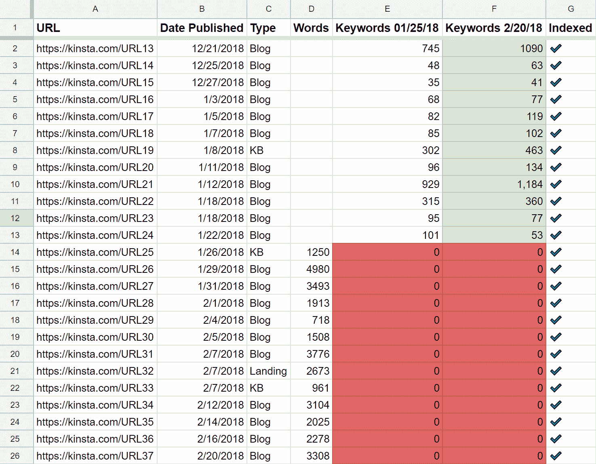

Keyword rankings (nothing new ranking)


我们也有一个索引栏，这意味着谷歌索引这些网址很好，只是没有对它们进行排名。你可以快速检查一个网址是否被编入索引，只需将它放入[谷歌搜索](https://kinsta.com/blog/google-search-operators/)，在它前面加上`site:`参数，例如:

```
site:kinsta.com/blog/best-seo-plugins-for-wordpress/
```

如果你的 URL 出现在 SERPs 中，那就意味着它被索引了。

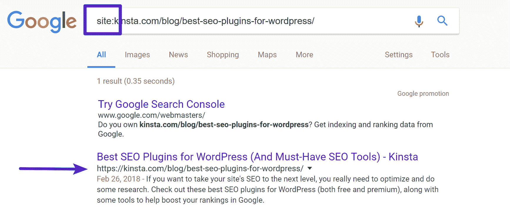

Check if Google is indexing the URL


有些帖子超过 4000 字，所以我们知道有些地方出了大问题。谷歌知道他们在那里，但好像有什么东西挡住了他们。我们还注意到了其他一些事情:

*   这只会影响我们的新内容。随着我们改进和更新内容，其他一切都在继续排名，甚至获得更多的有机关键词。这很奇怪，因为我们以前从未见过网站的一部分出现问题。
*   这也影响了我们网站西班牙语版本([kinsta.com/es/](https://kinsta.com/es/))的新内容。
*   我们最近已经否认了很多垃圾域名，作为我们网站定期搜索引擎优化检查的一部分。事实上，我们记录了我们如何对抗内容抓取的整个过程。所以就反向链接而言，我们可能比大多数人更干净。或者至少比三个月前更好。
*   问题开始出现时唯一的 SERPs 更新是 [Google Maccabees](https://www.seroundtable.com/google-maccabees-update-analysis-24951.html) 。这是 12 月中旬推出的。然而，这真的只影响网站联盟网站和那些关键字排列。我们的网站在这两种情况下都不适用。
*   我们确实检查了我们的 [robots.txt 文件](https://kinsta.com/blog/wordpress-robots-txt/)，这是正常的。

### 手动操作

所以我们去谷歌搜索控制台查看，事实上，在“搜索流量→手动操作”下，我们确实有一个针对我们 Kinsta.com 网站的**手动操作**。所以首先，我们有点惊讶，**从未收到关于此事的电子邮件**,**也没有出现在搜索控制台的“消息”部分**下。通常这是你想看的第一个地方。

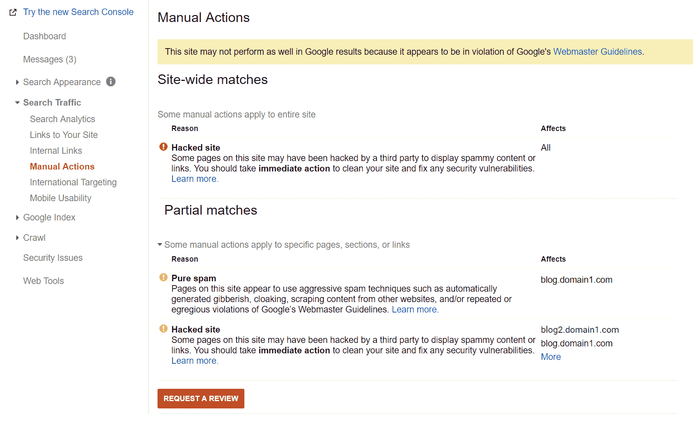

Google Search Console Manual Action


但是等等，更奇怪的是！正如你在上面看到的，手动操作是针对“黑客网站”和“纯粹的垃圾邮件”问题中的[子域名](https://kinsta.com/blog/wordpress-subdomain/)是一年前被移除的**域名。所以现在我们真的很困惑。**

此外，谷歌没有在他们的人工行动报告上注明任何日期。😡这非常令人沮丧，肯定需要改进。没有日期，我们不能 100%肯定地说，这与我们目前的排名问题有任何关系。据我们所知，这是谷歌算法中的一个错误，它只会影响我们发布的新内容。

### 提交复议请求

我们当然立即提出了复议请求，因为当时的手动操作针对的是不存在的子域名。复议申请的问题是，这需要几天，有时甚至几周。除了无聊地等待，你什么也做不了。对于任何处于这种情况下的人来说，这简直是伤脑筋。

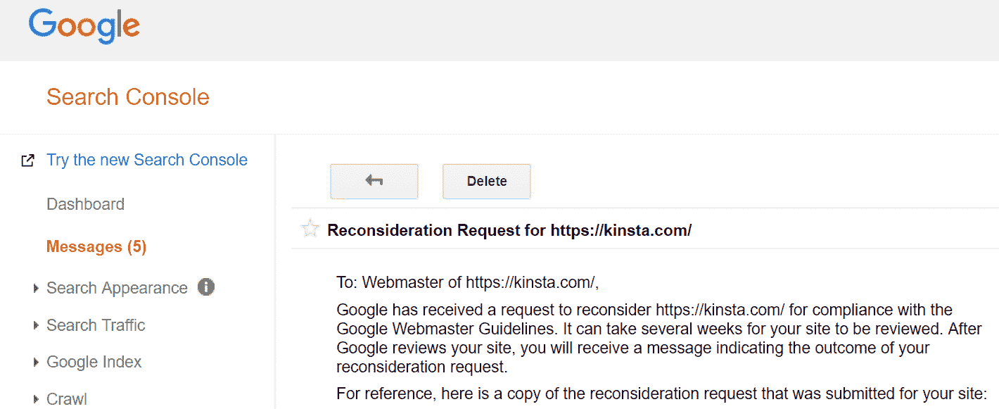

Kinsta reconsideration request


### 联系谷歌和搜索引擎优化社区

当我们等待谷歌查看我们的网站时，我们没有什么也不做，而是决定联系谷歌和 SEO 社区。我们做的第一件事是在[站长中心帮助论坛](https://productforums.google.com/forum/#!topic/webmasters/v36xRoSAHfo)上发帖。这对我们一点帮助都没有，说实话，我们也没指望从中得到什么。

接下来，我们联系了业内的一些顶级 SEO(他们中的许多人都做咨询工作)，看看他们是否听说过这样一个奇怪的问题，并可能有所帮助。我们整理了一份名单。放心用吧，不要滥用就好。

*   比尔·斯劳斯基-[seobythesea.com](http://www.seobythesea.com)–[@比尔·斯劳斯基](https://twitter.com/bill_slawski)
*   玛丽·海恩斯——[mariehaynes.com](https://www.mariehaynes.com/)——[@玛丽·海恩斯](https://twitter.com/Marie_Haynes)
*   赛勒斯·谢泼德——[cyrusshepard.com](https://cyrusshepard.com)——[@赛勒斯·谢泼德](https://twitter.com/CyrusShepard)
*   格伦·加布-[gsqi.com](https://www.gsqi.com/)–[@格伦加布](https://twitter.com/glenngabe)
*   丹·佩特罗维奇-[dejanseo.com.au](https://dejanseo.com.au)–[@德扬西奥](https://twitter.com/dejanseo)
*   rustybrick.com–[@ rusty brick](https://twitter.com/rustybrick)
*   AJ Ghergich-[ghergich.com](https://ghergich.com/)–[@ SEO](https://twitter.com/SEO)
*   艾伦·布莱维斯-[alanbleiweiss.com](https://alanbleiweiss.com/)–[@艾伦·布莱维斯](https://twitter.com/alanbleiweiss)
*   约翰·穆勒-[@约翰·穆](https://twitter.com/JohnMu)

上面的一些人回答说他们太忙了，这完全可以理解。这些人中的许多人可能每天都会收到数百个疯狂的请求。其他人带回来的答案我们认为很奇怪，并不真正适用于我们的情况。

然而，令我们惊讶的是，有三个人给出了很好的建议，并且非常愿意加入并提供帮助:**格伦·加布**、**AJ·盖里奇**和**塞勒斯·谢泼德**。我们首先要感谢这些人，感谢他们花时间与我们一起进行故障诊断，以确保手动操作确实是原因，而不是其他原因。有些人甚至试图在环游世界的途中提供帮助！

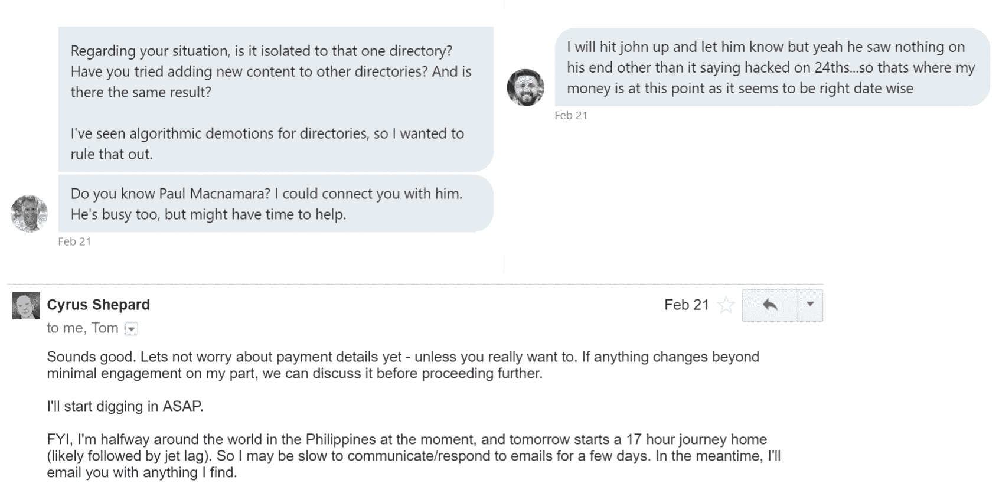

Responses from SEOs in community


他们帮助我们确认没有其他问题，我们需要做的就是等待复议请求通过。

[We 💛 the #WordPress community, but the #SEO community is pretty awesome as well! 🤘 @cyrusshepard @glenngabe @seoClick to Tweet](https://twitter.com/intent/tweet?url=https%3A%2F%2Fkinsta.com%2Fblog%2Fdecline-seo-rankings%2F&via=kinsta&text=We+%F0%9F%92%9B+the+%23WordPress+community%2C+but+the+%23SEO+community+is+pretty+awesome+as+well%21+%F0%9F%A4%98+%40cyrusshepard+%40glenngabe+%40seo)

### 复议请求被拒绝

所以当它涉及到搜索引擎优化的时候，没有什么是容易的！我们于 2018 年 2 月 13 日提交了我们的第一份复议申请，该申请于 2018 年 2 月 23 日被驳回，原因如下:

> 我们无法查看您的网站，因为您网站上被攻击的页面返回服务器错误(例如，5xx)。您可能需要联系您的主机提供商，看看服务器是否有任何问题。在您修复您的网站以便我们可以访问它，并且您确定被攻击的内容已经被删除(发送 4xx 响应)之后，继续提交另一个复议请求，以便我们可以查看。

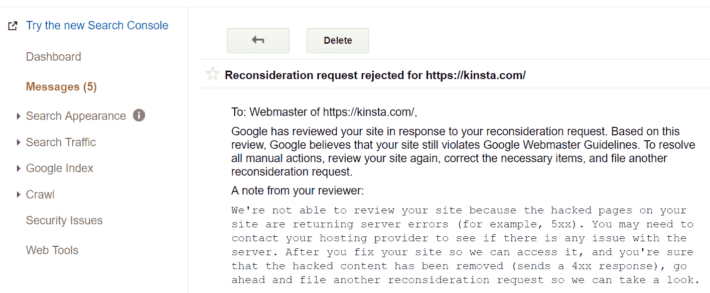

Reconsideration request rejected


错误当然会发生，因为子域名已经不存在一年多了。出于显而易见的原因，联系我们的主机提供商的建议也没有多大用处。😕尽管我们是谷歌云平台的合作伙伴，但重要的是要明白，当涉及到 SEO 时，我们就像其他人一样。虽然这可能令人沮丧，但我们没有得到任何特殊待遇。当然，这是为了让 SERPs 对每个人都公平。

## 注册订阅时事通讯


### 想知道我们是怎么让流量增长超过 1000%的吗？

加入 20，000 多名获得我们每周时事通讯和内部消息的人的行列吧！

[Subscribe Now](#newsletter)

我们立即在 2018 年 2 月 23 日提交了另一份复议请求，并提供了更长的解释。我们最终在 2018 年 2 月 28 日获得批准。提示:在你的复议申请中要非常详细。

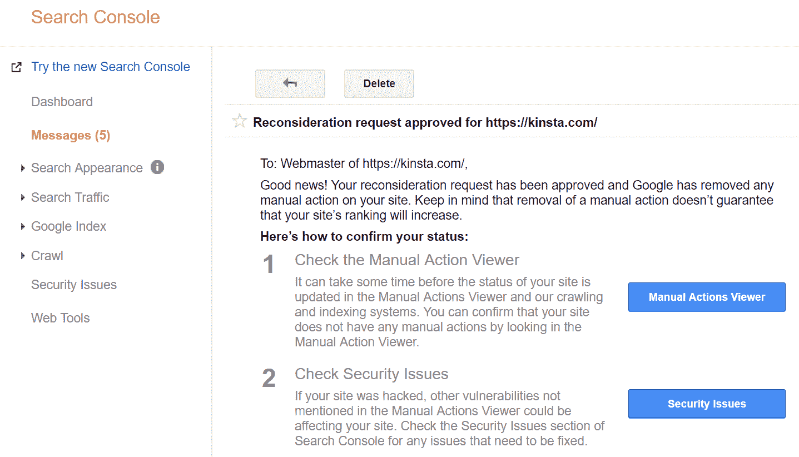

Reconsideration request approved


如你所见，复议申请并不是一个快速的过程，尤其是如果出于某种原因他们拒绝了你。在我们的例子中，我们应该从来没有收到手动操作摆在首位，因为子域不存在。我们有一种感觉，几年前谷歌方面的一些东西不知何故意外地被推进了这个系统。

这也是一个很好的时机来提出这样一个事实，你应该总是为重要的项目和客户划分领域。当谈到 SEO 时，子域名会影响你的主域名。是的，这有点吓人。我们的新朋友格伦实际上有一篇关于[恶意软件](https://kinsta.com/blog/types-of-malware/)如何给你的网站带来巨大的搜索引擎优化问题的精彩文章:恶意软件、【GSC】和流氓子域之间的[可怕的联系。](https://searchengineland.com/terrifying-connection-malware-google-search-console-rogue-hostnames-subdomains-adwords-244059)

### 排名回归

2018 年 2 月 24 日，我们自 2018 年 1 月 26 日以来发布的所有新内容开始排名。🤘这是复议请求被撤销的四天前。因此，虽然看起来这是事实上的原因，但仍然很难 100%确认这一点。这就是 SEO。

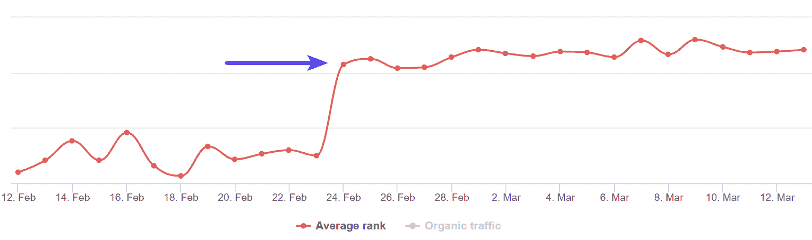

Rankings return


我们也单独检查了我们的许多帖子来确认。同样，这很容易用 Accuranker 来监控。

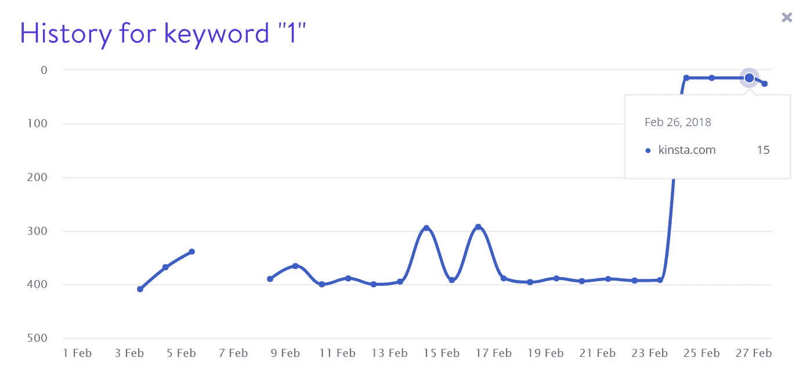

Keyword 1 rankings


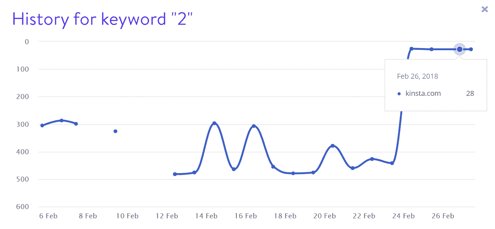

Keyword 2 rankings


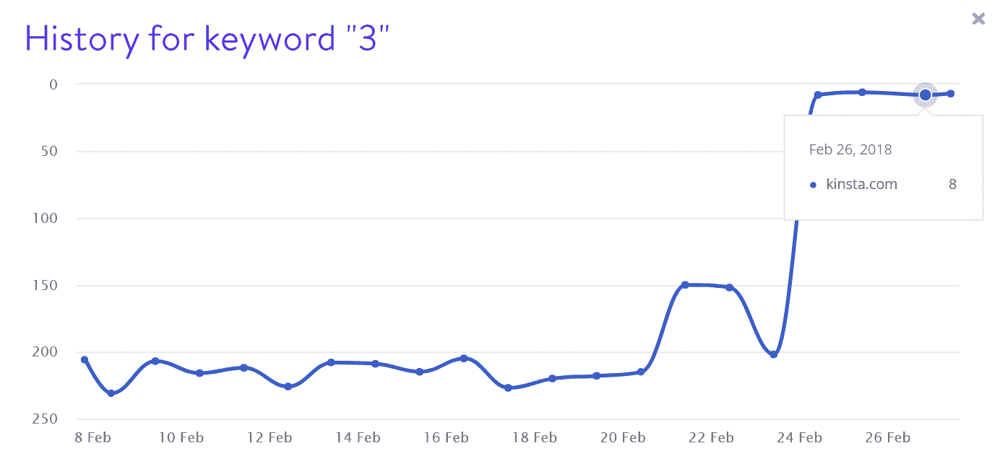

Keyword 3 rankings


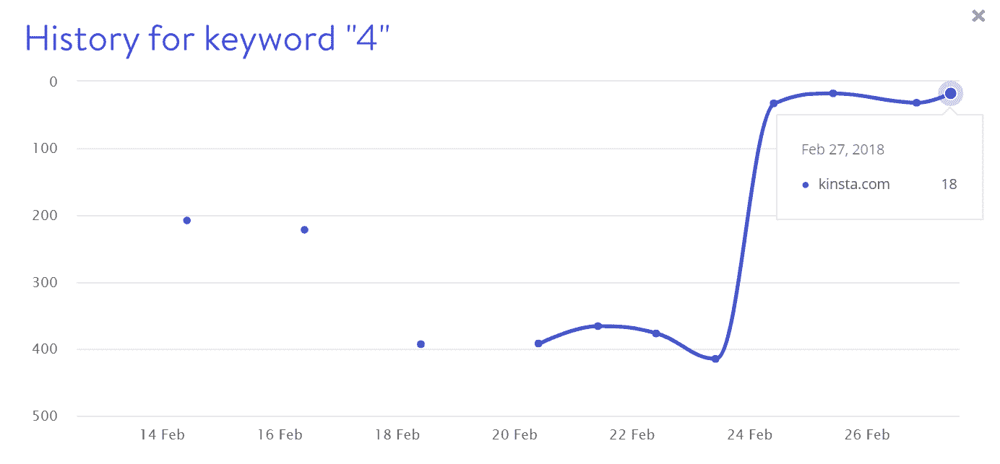

Keyword 4 rankings


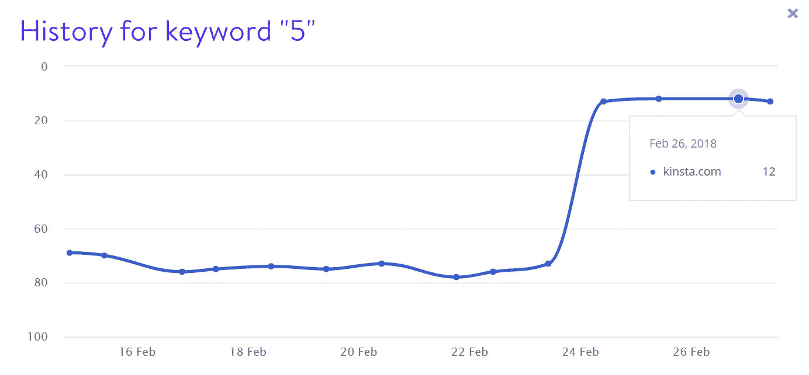

Keyword 5 rankings


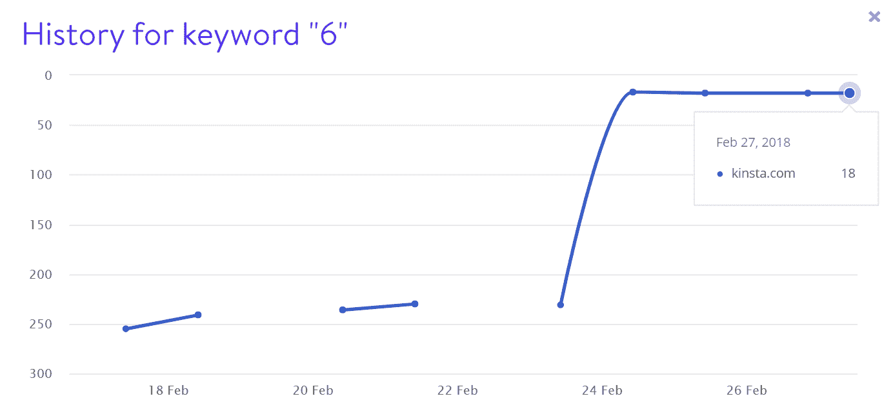

Keyword 6 rankings


我们肯定会把这归类为我们见过的最疯狂的 SEO 问题之一，主要原因如下:

Struggling with downtime and WordPress problems? Kinsta is the hosting solution designed to save you time! [Check out our features](https://kinsta.com/features/)

*   它**只影响了我们从特定日期开始的新内容**,并不影响整个网站。
*   我们**从未在谷歌搜索控制台的“消息部分”收到过关于手动操作的电子邮件**或消息。然而，我们收到的通知和电子邮件都很好。
*   **手动操作报告不包含日期**，这使得很难查明问题。我们真的希望谷歌能解决这个问题。他们有数据。
*   **手动操作是针对已经不存在**超过一年的子域名。
*   由于域名不存在，第一个复议请求**被拒绝，那么为什么要手动操作呢？**这对我们来说毫无意义。

上面的整个过程花了将近一个月的时间来解决，我们不想很快重复。我们所能说的是，SEO 绝对能让你站稳脚跟！这种情况带来的一个好处是，我们的有机流量和关键词在事后飙升。

## 排名下降时需要检查的其他事项

以下是网站排名下降的一些常见原因，以及如何解决这些问题。

### 技术搜索引擎优化问题

修复和解决现场和非现场技术 SEO 问题非常重要。这包括各种各样的事情，例如:

*   内容字数少
*   标题太长或太短
*   元描述太短。利用 SERPs 中的这个空间来增加你的点击率
*   元描述丢失(如何在 WordPress 中添加元描述)
*   缺少 H1 或 H2 标签
*   多个标题标签
*   多个 H1 标签
*   没有内部链接，没有传出链接，[断开的链接](https://kinsta.com/blog/broken-links/)或重定向
*   缺少重要的社交标签，如 Open Graph 和 Twitter 卡片
*   错误配置的[多语言](https://kinsta.com/blog/wordpress-multilingual/)标签，如倒数 hreflang(无返回标签)
*   破碎的图像或太大的图像

最棒的是你可以很容易地一次检查你的整个网站。为此，我们建议使用类似于 [Ahrefs](https://ahrefs.com/) 的工具。他们新的网站审计功能太棒了！ [SEMrush](https://www.semrush.com/) 也有一个类似的审计功能，非常好用。谷歌还在免费的谷歌 Chrome [灯塔扩展](https://chrome.google.com/webstore/detail/lighthouse/blipmdconlkpinefehnmjammfjpmpbjk)中加入了基本的搜索引擎优化审计。

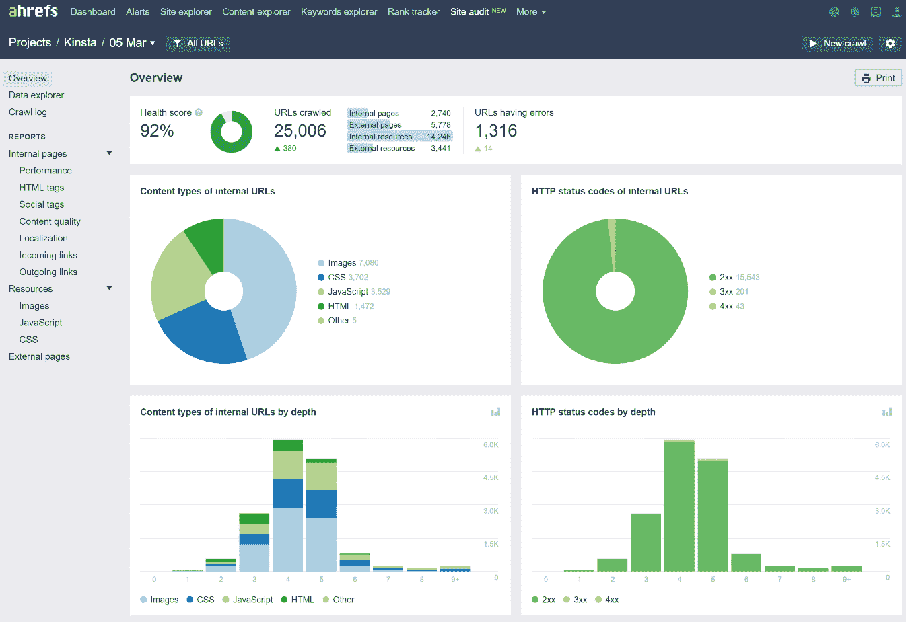

SEO site audit with Ahrefs


这其中很大一部分也是你网站的表现。这就是金斯塔可以帮忙的地方！

利用我们快如闪电的[应用](https://kinsta.com/application-hosting/)、[数据库](https://kinsta.com/database-hosting/)和[管理的 WordPress 托管](https://kinsta.com/wordpress-hosting/)平台，立即提高整个网站的速度。

### 垃圾反向链接

当涉及到 SEO 时，反向链接是非常重要的。但是和大多数事情一样，你需要**质量和**数量。拥有成千上万来自低质量或[垃圾网站](https://kinsta.com/blog/google-analytics-spam/)的反向链接最终会伤害你的网站。查看我们关于如何[清理负面 SEO](https://kinsta.com/blog/negative-seo/) 的深入教程(是的，这确实存在！)以及如何反击[内容刮](https://kinsta.com/blog/content-scraping/)。这些包括引导你如何使用谷歌的否认工具。

### 惩罚

首先，算法更新可能会带来损失。Marie 有一个很棒的，易读的，所有算法更新的列表。如果你的排名下降是由于算法更新，这并不总是意味着对你的网站的惩罚，特别是，它很可能只是在调整 SERPs 后，其他网站的排名比你高。

第二，你会想要避免下面的技术，正如在[谷歌搜索要点](https://developers.google.com/search/blog/2022/10/search-essentials)指南中记录的

*   自动生成的内容
*   链接方案
*   没有原创内容
*   大衣料
*   卑鄙的重定向
*   隐藏文本或链接
*   刮掉的内容
*   门道页面
*   滥用从属节目
*   关键词填充
*   滥用丰富的片段或[模式标记](https://kinsta.com/blog/schema-markup-wordpress/)

你的[网站被黑了](https://kinsta.com/blog/wordpress-hacked/)？这也会让你受到惩罚，就像上面我们的问题一样(尽管我们的问题没有得到保证)。这并不总是 100%准确，但是你可以使用[谷歌的安全浏览工具](https://transparencyreport.google.com/safe-browsing/search)来检查你的网站。否则，**你应该**在谷歌搜索控制台的“搜索流量→手动操作”下得到一个手动操作，以及一个通知。

这是金斯塔可以提供帮助的另一个领域。[我们有硬件防火墙](https://kinsta.com/feature-updates/auto-db-optimize/#now-secured-behind-google-cloud-platform-firewall)、主动和被动安全以及其他高级功能来防止访问您的数据。但是除此之外，**我们为我们的客户提供免费的黑客补丁**。没错。搬到金斯塔可以帮助你长期放松心情。

### 低质量或内容不足

如果你看到你的排名持续下降，这很可能只是因为你的内容质量低或者不够。检查这一点的最快方法之一是选择一个帖子的主题，并将其输入谷歌。看看你的竞争对手是怎样的。假设你想给“顶级婚礼摄影师”排名。你的页面有 500 个单词和一两张图片。

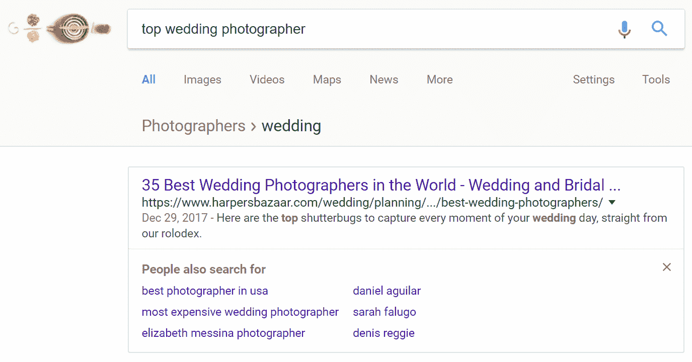

Competition in SERPs


如果我们看一看返回的[第一个结果](https://www.harpersbazaar.com/wedding/planning/g7155/best-wedding-photographers/)，我们看到它有 8700 个单词，100 多张图片，并且是在一个高流量的站点上，具有很高的域权限。你可以有把握地假设，你的 500 字的文章可能不会削减它。同样关于质量，比较他们的和你自己的可读性。哪个听起来更自然？我们谈论了很多关于关键词排名的事情，但是不要忘记**你首先需要为用户而写。**

### 杂项提示

这里有一些你可能也想在你的网站上检查的其他东西。

*   检查您的 [robots.txt 文件](https://kinsta.com/blog/wordpress-robots-txt/)，确保没有任何内容被阻止抓取。您可以使用[阻塞资源工具](https://www.google.com/webmasters/tools/roboted)和 [robots.txt 测试工具](https://www.google.com/webmasters/tools/robots-testing-tool)。
*   确保你在谷歌搜索控制台中提交了[站点地图文件](https://kinsta.com/blog/wordpress-sitemap/)。虽然这些在技术上并不是必需的，但是建议他们帮助谷歌查看你的网站的结构。它还为您提供了更多的数据来诊断问题。
*   Take advantage of the additional data in the [new Google Search Console](https://search.google.com/search-console/) reports to spot patterns as far as 16 months back. You can easily check your average position and see how it changed over time.

    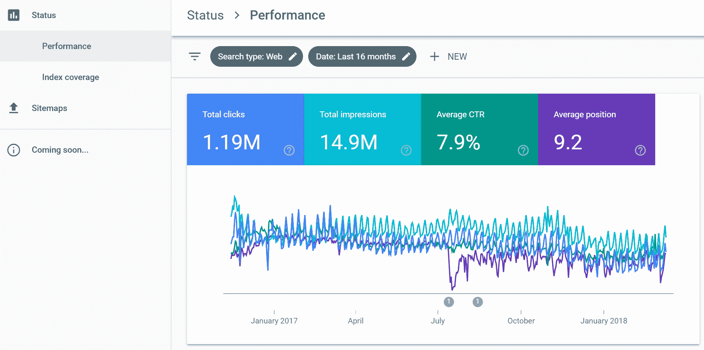

    新的谷歌搜索控制台

    

*   始终监控您的反向链接配置文件。也许你失去了很多高质量的链接，导致你的排名下降。或者你可能不小心否定了很多流行的高权威反向链接？出现这种情况。
*   遵循谷歌的 SEO 指南和[行业最佳实践](https://www.folsomcreative.com/blog/seo-checklist/),最大限度地降低失去流量或被处罚的风险。
*   Use reports like Accuranker’s [Google Grump rating](https://www.accuranker.com/grump/) and [Mozcast](https://moz.com/mozcast/) to get an idea if there are massive movements in SERPs happening. Sometimes this can be a sign of a new Google algorithm coming.

    [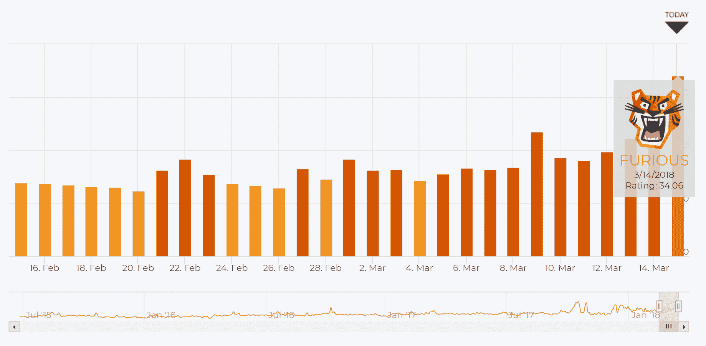](https://www.accuranker.com/grump/) 

    谷歌(SERPS 中的运动)

    

*   利用 Barracuda Digital 的 [Panguin 工具](https://barracuda.digital/panguin-seo-tool/)来看看你的站点下降是否与公布的算法更新一致。

如果你还在为哪里出了问题而挠头🤔，请务必查看 Aleyda Solis 的精彩“[为什么我的网络流量下降清单](https://www.whymywebtrafficdropped.com/)”。

## 摘要

在尽可能快地诊断此类问题时，拥有 Accuranker、Ahrefs 和 Google Search Console 等工具非常重要。我们不能忘记了不起的 SEO 社区也加入进来提供帮助。

对于许多企业来说，有机交通非常重要。但这也可以很好地提醒你为什么不应该把所有的鸡蛋放在一个篮子里。在 [Twitter](https://kinsta.com/blog/twitter-marketing/) 、 [Pinterest](https://kinsta.com/blog/pinterest-marketing/) 和 [Linkedin](https://kinsta.com/blog/linkedin-marketing/) 上做广告，与其他博主合作，推出联盟计划，利用 [Google AdWords](https://kinsta.com/blog/how-to-use-google-adwords/) 快速获得结果。

你有 SEO 恐怖故事吗？我们很想听听。此外，如果您喜欢我们记录我们如何解决这些独特而复杂的问题，请在下面告诉我们，以便我们可以继续分享它们！

* * *

让你所有的[应用程序](https://kinsta.com/application-hosting/)、[数据库](https://kinsta.com/database-hosting/)和 [WordPress 网站](https://kinsta.com/wordpress-hosting/)在线并在一个屋檐下。我们功能丰富的高性能云平台包括:

*   在 MyKinsta 仪表盘中轻松设置和管理
*   24/7 专家支持
*   最好的谷歌云平台硬件和网络，由 Kubernetes 提供最大的可扩展性
*   面向速度和安全性的企业级 Cloudflare 集成
*   全球受众覆盖全球多达 35 个数据中心和 275 多个 pop

在第一个月使用托管的[应用程序或托管](https://kinsta.com/application-hosting/)的[数据库，您可以享受 20 美元的优惠，亲自测试一下。探索我们的](https://kinsta.com/database-hosting/)[计划](https://kinsta.com/plans/)或[与销售人员交谈](https://kinsta.com/contact-us/)以找到最适合您的方式。