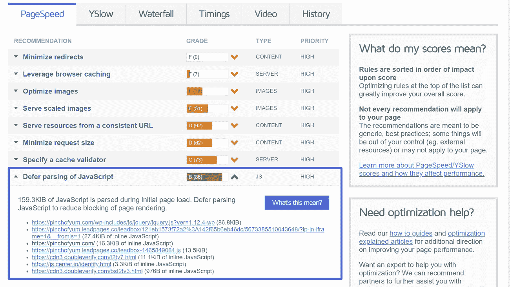
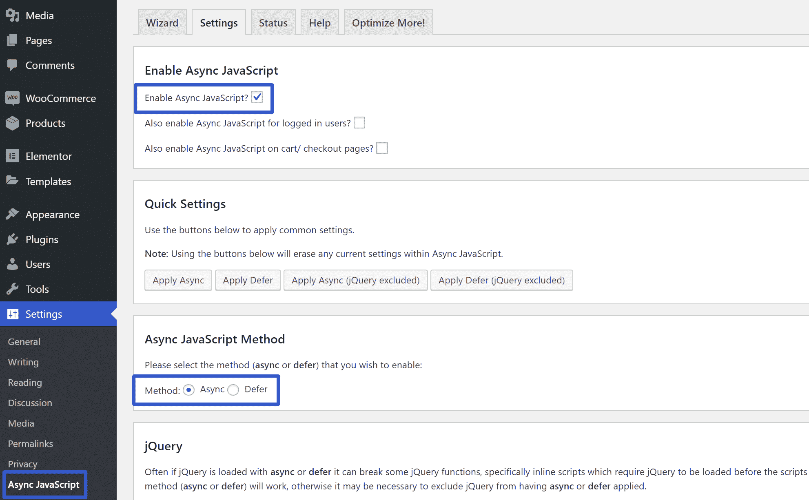
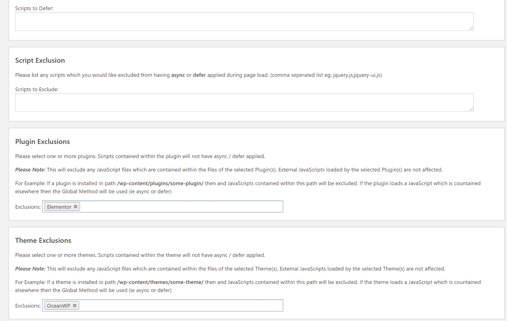
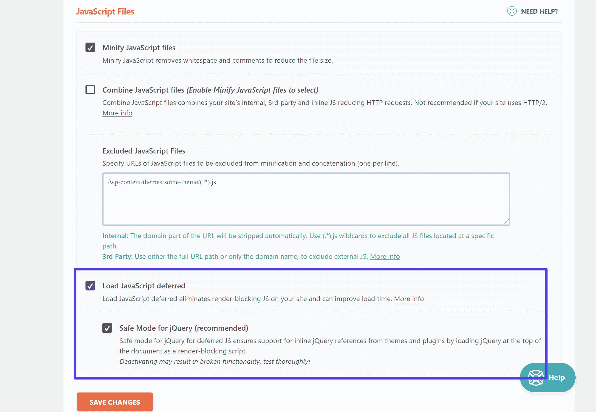

# 如何在 WordPress 中延迟解析 JavaScript 种方法)

> 原文：<https://kinsta.com/blog/defer-parsing-of-javascript/>

你是否通过一个[性能测试工具](https://kinsta.com/blog/debugging-wordpress-performance/)运行你的 WordPress 站点，结果却遇到了一个推迟解析 WordPress 中 JavaScript 的指令？

实现这一改变可以对您的网站的页面加载时间产生积极的影响，尤其是对于移动访问者。但是这个警告可能有点难以理解，这就是为什么我们要解释推迟解析 JavaScript 的确切含义，以及如何在你的 WordPress 网站上实现这个改变。

以下是您将在本文中学到的内容:

 如果你只想直接跳到教程，你可以点击上面列表中的最后一个链接。

### **更喜欢看[视频版](https://www.youtube.com/watch?v=yUTDFpiPFzQ)？**


## 在 WordPress 中推迟解析 JavaScript 是什么意思？

如果你曾经通过 [Google PageSpeed Insights](https://kinsta.com/blog/google-pagespeed-insights/) 、GTmetrix 或其他页面速度测试工具运行过你的 WordPress 站点，你可能会遇到推迟解析 JavaScript 的建议。


但是……那实际上意味着什么呢？为什么它是一个重要的性能考虑因素？

基本上，当有人访问你的 [WordPress 网站](https://kinsta.com/blog/wordpress-site-examples/)时，你网站的服务器会将你网站的 HTML 内容发送给访问者的浏览器。

然后访问者的浏览器从顶部开始，通过代码来呈现你的站点。如果在从上到下的移动中，它发现了任何 JavaScript，它将停止呈现页面的其余部分，直到它可以获取并解析 JavaScript 文件。

它会对找到的每个脚本都这样做，这可能会对您站点的页面加载时间产生负面影响，因为访问者需要在浏览器下载和解析所有 JavaScript 时盯着一个空白屏幕。

如果某个脚本对你的网站的核心功能来说不是必需的(至少在最初的页面加载时不是)，你不希望它妨碍你加载网站更重要的部分，这就是为什么那些[页面速度测试工具](https://kinsta.com/blog/pingdom-speed-test/)总是告诉你推迟 JavaScript 的解析。

那么推迟解析 JavaScript 意味着什么呢？

本质上，你的网站会告诉访问者的浏览器等待下载和/或解析 JavaScript，直到后的*你的网站的主要内容已经完成加载。此时，访问者已经可以看到您的页面并与之交互，因此下载和解析 JavaScript 的等待时间不再有负面影响。*

通过[加速你的内容的倍以上的加载时间](https://kinsta.com/learn/speed-up-wordpress/)，你让谷歌高兴，并为你的访问者创造更好、更快的体验。
T3】

## 如何判断是否需要推迟 JavaScript 的解析

为了测试你的 WordPress 站点是否需要推迟 JavaScript 的解析，你可以通过 [GTmetrix](https://kinsta.com/blog/gtmetrix-speed-test/) 运行你的站点。

GTmetrix 将为您评分，并列出需要延期的具体脚本:



Defer parsing of JavaScript test in GTmetrix


## 推迟解析 JavaScript 的不同方法

有几种不同的方法可以推迟 JavaScript 的解析。首先，有两个属性可以添加到脚本中:

## 注册订阅时事通讯


### 想知道我们是怎么让流量增长超过 1000%的吗？

加入 20，000 多名获得我们每周时事通讯和内部消息的人的行列吧！

[Subscribe Now](#newsletter)

1.  异步ˌ非同步(asynchronous)
2.  推迟

这两个属性都允许访问者的浏览器下载 JavaScript 而无需暂停 HTML 解析。然而，不同之处在于，虽然 **async** 不会暂停 HTML 解析来获取脚本(默认行为会这样)，但是一旦脚本被获取，它会暂停 HTML 解析器来执行脚本。

使用 **defer** ，访问者的浏览器仍然会在解析 HTML 时下载脚本，但是他们会等到 HTML 解析完成后再解析脚本。

[这张来自《与网络一起成长》的图片](https://www.growingwiththeweb.com/2014/02/async-vs-defer-attributes.html)很好地解释了这种差异:


Graphic explaining async vs defer


Varvy 的 Patrick Sexton 推荐的另一种方法是，仅在初始页面加载完成后，使用脚本调用外部 JavaScript 文件。这意味着在初始页面加载完成之前，访问者的浏览器不会下载或执行任何 JavaScript。

最后，您将看到的另一种方法是简单地将 JavaScript 移到页面底部。然而，这种方法并不是一个很好的解决方案，因为即使你的页面很快就可以看到，访问者的浏览器仍然会显示页面正在加载，直到所有的脚本完成。这可能会阻止一些访问者与您的页面进行交互，因为他们认为内容没有完全加载。


## 如何在 WordPress 中延迟解析 JavaScript 种方法)

要推迟 WordPress 中 JavaScript 的解析，有三条主要途径可供选择:

*   插件-有一些很棒的免费和高级的 WordPress 插件来延迟 JavaScript 解析。我们将向您展示如何用两个流行的插件做到这一点。
*   如果你精通技术，你可以直接编辑你网站的代码，并使用来自 Varvy 的代码片段。
*   [Functions.php 文件](#functions)–您可以向您的子主题的 functions.php 文件中添加一个代码片段，以自动推迟脚本。

你可以点击上面的链接直接跳到你喜欢的方法，或者通读所有的技术找到最适合你的方法。

### 1。免费的异步 JavaScript 插件

异步 JavaScript 是弗兰克·古森斯的免费 WordPress 插件，他也是流行的[自动优化插件](https://kinsta.com/blog/autoptimize-settings/)的开发者。

它为您提供了一种使用 async 或 defer 延迟解析 JavaScript 的简单方法。

首先，你可以安装并激活 WordPress.org 的免费插件。然后，进入**设置→异步 JavaScript** 配置插件。

在顶部，您可以启用插件的功能，并在异步和延迟之间进行选择。请记住:

*   **Async** 下载 JavaScript，同时仍然解析 HTML **，但随后暂停**HTML 解析以执行 JavaScript。
*   **Defer** 在解析 HTML 的同时下载 JavaScript 并等待执行，直到 HTML 解析完成。



How to use the Async JavaScript plugin


再往下，还可以选择如何处理 [jQuery](https://kinsta.com/knowledgebase/what-is-jquery/) 。许多主题和插件严重依赖 jQuery，所以如果你试图推迟解析 jQuery 脚本，你可能会破坏你站点的一些核心功能。最安全的方法是排除 jQuery，但是您可以尝试推迟它。只要确保彻底测试你的网站。

再往下，您还可以手动包括或排除特定的脚本被推迟，包括一个很好的用户友好的功能，让您针对特定的主题或插件，是活跃在您的网站:



Async JavaScript include/exclude rules


### 2.使用 WP 火箭插件

虽然我们在 Kinsta 不允许大多数[缓存插件](https://kinsta.com/blog/wordpress-caching-plugins/)，但我们[允许 WP Rocket 插件](https://kinsta.com/blog/wp-rocket/)，因为它包括一个内置的集成，可以很好地与 [Kinsta 的服务器级缓存](https://kinsta.com/blog/wordpress-cache/)配合。

除了一堆其他的性能优化技术，WP Rocket 还可以帮助你在 WP Rocket 仪表盘的**文件优化**标签中推迟 JavaScript 的解析。在 **JavaScript 文件**部分寻找**加载 JavaScript 延迟**选项。

通过集中控制面板管理的插件简化 Javascript 解析。[免费试用 kin sta](https://hubs.ly/H0pklC_0)。


我们将有效网站管理的知识规模化，并将其转化为电子书和视频课程。点击[这里](https://kinsta.com/ebooks/wordpress/manage-multiple-wordpress-sites/?utm_campaign=how-to-speed-up-your-wordpress-site&utm_source=blog-knowledgebase&utm_medium=video)下载 2020 年管理 40 多个 WordPress 网站指南！

与 Async JavaScript 插件一样，WP Rocket 也允许您排除 jQuery，以避免网站内容出现问题:



How to defer parsing of JavaScript with WP Rocket


### 3。使用 Varvy 推荐的方法(代码)

前面，我们提到 Varvy 的 Patrick Sexton 建议使用一段代码，这段代码等待下载和执行 JavaScript，直到站点完成初始页面加载。

您可以通过调整 Varvy 提供的代码片段来实现这个方法，然后将脚本添加到您的主题中，紧接在结束的

这是来自 Varvy 的代码[:](https://varvy.com/pagespeed/defer-loading-javascript.html)

```
<script type="text/javascript">
function downloadJSAtOnload() {
var element = document.createElement("script");
element.src = "defer.js";
document.body.appendChild(element);
}
if (window.addEventListener)
window.addEventListener("load", downloadJSAtOnload, false);
else if (window.attachEvent)
window.attachEvent("onload", downloadJSAtOnload);
else window.onload = downloadJSAtOnload;
</script>
```

确保将“defer.js”替换为您想要延迟的 JavaScript 文件的实际文件名/路径。然后，你可以使用 [wp_footer 钩子](https://developer.wordpress.org/reference/functions/wp_footer/)通过你的子主题的 functions.php 文件注入代码。

使用这种方法，您可以像这样包装 Varvy 的代码:

```
/**
Defer parsing of JavaScript with code snippet from Varvy
*/
add_action( 'wp_footer', 'my_footer_scripts' );
function my_footer_scripts(){
?>
REPLACE_WITH_VARVY_SCRIPT
<?php
}
```

### 4。通过 functions.php 文件延迟 JavaScript

最后，通过将以下代码片段添加到您的 functions.php 文件中，您还可以将 defer 属性添加到您的 JavaScript 文件中，而不需要插件:

```
function defer_parsing_of_js( $url ) {
    if ( is_user_logged_in() ) return $url; //don't break WP Admin
    if ( FALSE === strpos( $url, '.js' ) ) return $url;
    if ( strpos( $url, 'jquery.js' ) ) return $url;
    return str_replace( ' src', ' defer src', $url );
} add_filter( 'script_loader_tag', 'defer_parsing_of_js', 10 );
```

实际上，这段代码告诉 WordPress 将 defer 属性添加到除 jQuery 之外的所有 JavaScript 文件中。

它快速而简单，但是它不能像 Async JavaScript 插件那样给你细粒度的控制。

[Are you getting the *Defer Parsing of Javascript Warning* message? No worries... Fix it now with these 4 methods! 🚀⏳Click to Tweet](https://twitter.com/intent/tweet?url=https%3A%2F%2Fkinsta.com%2Fblog%2Fdefer-parsing-of-javascript%2F&via=kinsta&text=Are+you+getting+the+%2ADefer+Parsing+of+Javascript+Warning%2A+message%3F+No+worries...+Fix+it+now+with+these+4+methods%21+%F0%9F%9A%80%E2%8F%B3&hashtags=webdev%2Cjavascript)

## 摘要

推迟在 WordPress 站点上解析 JavaScript 是一个重要的性能考虑。

一旦你使用了上面的方法之一来推迟在 WordPress 中解析 JavaScript，我们建议你做两件事:

1.  测试你的网站，确保推迟某些脚本不会破坏上面的关键内容。同样，这种情况在 jQuery 中经常发生，这就是为什么很多工具都允许您排除 jQuery.js。
2.  再次通过 GTmetrix 运行您的站点，以确保您的站点尽可能多地推迟脚本(如果排除 jQuery，您可能不会得到满分，但您的分数应该会更高)。

关于如何在 WordPress 中延迟解析 JavaScript，你有任何问题吗？请在评论中提问！

* * *

让你所有的[应用程序](https://kinsta.com/application-hosting/)、[数据库](https://kinsta.com/database-hosting/)和 [WordPress 网站](https://kinsta.com/wordpress-hosting/)在线并在一个屋檐下。我们功能丰富的高性能云平台包括:

*   在 MyKinsta 仪表盘中轻松设置和管理
*   24/7 专家支持
*   最好的谷歌云平台硬件和网络，由 Kubernetes 提供最大的可扩展性
*   面向速度和安全性的企业级 Cloudflare 集成
*   全球受众覆盖全球多达 35 个数据中心和 275 多个 pop

在第一个月使用托管的[应用程序或托管](https://kinsta.com/application-hosting/)的[数据库，您可以享受 20 美元的优惠，亲自测试一下。探索我们的](https://kinsta.com/database-hosting/)[计划](https://kinsta.com/plans/)或[与销售人员交谈](https://kinsta.com/contact-us/)以找到最适合您的方式。