# 探索 2022 年值得关注的 30 款最佳 DevOps 工具

> 原文：<https://kinsta.com/blog/devops-tools/>

整个软件开发生命周期中的无缝协作有助于团队成功完成项目，并获得更高的客户满意度。它不仅导致更快的部署和交付，还减少了团队成员之间的摩擦。 [DevOps 工具](https://kinsta.com/blog/wordpress-devops/)把所有这些方面都勾掉，这就是为什么 DevOps 在最近几年被大量采用的原因。

由 [DZone](https://dzone.com/articles/8-devops-trends-to-know-in-2020) 于 2019 年 11 月发布的一份报告称，DevOps 市场在 2017 年创造了 29 亿美元的收入，预计到 2022 年这一数字将达到 66 亿美元左右。尽管它在不同规模的组织中不断被采用，但许多人对 DevOps 的真正含义感到困惑。

对 DevOps 的许多误解之一是认为它只是一种工具，而其他人对它的方法、哲学、文化和目标感到困惑。没有单一的 DevOps 工具，而是一组 DevOps 工具或工具链，对于团队中的 [DevOps 工程师](https://kinsta.com/blog/devops-engineer/)、开发人员、操作人员和其他人来说是必不可少的。

这篇文章向您介绍了 DevOps、它的实践、文化、好处等等。此外，我们还为软件开发生命周期的各个阶段精心挑选了 30 款最佳 DevOps 工具。

我们开始吧！

## DevOps 是什么？

DevOps 融合了[实践](https://kinsta.com/blog/web-design-best-practices/)、文化理念和工具，以提高组织交付 IT 服务和应用程序的能力，比传统开发流程更快。

通过采用 DevOps，组织可以改进他们的产品，通过快速的反馈和修复为客户提供良好的服务，在市场中获得竞争优势，并更快地实现他们的业务目标。

> 需要在这里大声喊出来。Kinsta 太神奇了，我用它做我的个人网站。支持是迅速和杰出的，他们的服务器是 WordPress 最快的。
> 
> <footer class="wp-block-kinsta-client-quote__footer">
> 
> 
> 
> <cite class="wp-block-kinsta-client-quote__cite">Phillip Stemann</cite></footer>

[View plans](https://kinsta.com/plans/)

DevOps = Development + Operations

简单来说，DevOps 是一种帮助清除传统开发流程和操作中的路障，缩短软件开发生命周期的思维模式。

该模型使开发团队和运营团队能够在整个软件生命周期中有效地合作，从开发阶段和测试到部署和运营。

在 DevOps 实施中使用技术也是一个重要方面。众多 DevOps 工具利用动态和可编程基础设施，可用于自动化、[测试](https://kinsta.com/blog/wordpress-ab-testing-tools/)、配置、[集成](https://kinsta.com/help/domain-configuration-cloudflare-mykinsta/)、交付和其他流程。

[想了解更多关于 DevOps 的知识？✅查看此文化指南、DevOps 工具和好处就在这里⬇️ 点击推文](https://twitter.com/intent/tweet?url=https%3A%2F%2Fkinsta.com%2Fblog%2Fdevops-tools%2F&via=kinsta&text=Want+to+learn+more+about+DevOps%3F+%E2%9C%85+Check+out+this+guide+to+the+culture%2C+DevOps+tools%2C+and+benefits+right+here+%E2%AC%87%EF%B8%8F&hashtags=DevOps%2CWebDev)

### DevOps 的起源

帕特里克·德博伊斯在 2009 年创造了“DevOps”这个术语。他是一名比利时顾问、敏捷实践者和项目经理，他成为了早期 DevOps 的领导者之一，并通过将开发中的“Dev”和运营中的“Ops”结合起来形成了这个词。

在这里，“开发人员”不仅仅指开发人员，还包括所有参与软件产品开发的人，包括问答、开发、测试、计划等。

同样，“Ops”是运营团队中每个人的总称，包括系统工程师、[数据库](https://kinsta.com/blog/adminer/)管理员、系统管理员、安全专家、网络工程师、发布工程师、运营人员等等。

如前所述，DevOps 是一种思维模式或文化。这种心态不是一块石头上雕刻出来的。

相反，它起源于多年前最优秀的头脑，由来自不同 it 学科的前瞻性专家培育和概念化。

许多基本的 DevOps 想法都是从诸如精益、敏捷、企业系统管理、丰田方式和戴明的计划-执行-检查-行动方法等实践中得到启发的。

1993 年，电信信息网络体系结构协会定义了一个服务生命周期模型。这种模式结合了电信运营和软件开发。

一些专业人士说 DevOps 作为一种反对“自上而下”的 ITIL 规范方法的方法慢慢出现。相反，DevOps 更喜欢“自底向上”的方法，并获得了支持，提供了一种灵活的软件开发实践，而不是僵化的[框架](https://kinsta.com/blog/php-frameworks/)。

2009 年，“Devopsdays”是有史以来第一次基于 DevOps 的会议，在比利时举行。Patrick Debois 为这次会议奠定了基础，并作为一场运动传播到世界其他地方。

让我们讨论 DevOps 的两个主要先行方法:

#### 1.企业系统管理

ESM 兴起于 21 世纪初，其运行各种系统的方式还处于原始状态。这就是开始努力改进它的原因。这一阶段见证了 ITIL Lite 和可视 Ops 方法的发展。此外，更多较小的端到端系统管理开源解决方案开始浮出水面，包括 Zenoss、Hyperic、Spiceworks 等。

在最初参与 DevOps 开发的人员中，许多人是系统管理员，他们向 DevOps 介绍了 ESM 的主要最佳实践。这些实践包括配置管理、自动化供应、工具链方法和[系统监控](https://kinsta.com/blog/application-performance-monitoring/)。

2008 年和 2009 年举行了更多的会议，重点关注运营和网络性能，并围绕这些流程分享最佳实践。慢慢地，诸如 Chef 和 Puppet 之类的供应工具被发布，并且它使人们更多地考虑这些新的实践以及如何实现它们。

#### 2.敏捷开发

与此同时，敏捷开发在软件开发领域不断发展。它使开发人员、产品经理、QA 甚至客户之间能够紧密协作，以填补空白并加速交付更好的产品。

这场运动的主要焦点是流程和类比，包括精益制造、看板流程和系统管理员。

许多组织和公司已经开始在他们的软件开发周期中包含 DevOps，以加快过程并获得更快更好的结果。

## 为什么要创建 DevOps？

系统管理员和开发人员可能会因为各种原因而不同意，但是他们都同意必须满足不断增长的客户需求。

这种需求包括对新功能、收入流、服务和更好产品的需求，以及对更安全、更稳定、[高性能](https://kinsta.com/blog/fastest-wordpress-hosting/)且无中断和停机的系统的需求。

所有这些需求都需要系统管理员和开发人员的参与，以便在客户面前提供更好的服务或产品。

现在，问题是公司可能会被这些频繁变化和不断发展的客户需求所淹没。他们可能觉得需要在以下选项中选择一个:

*   处理不稳定的环境并交付快速变化
*   保持高度稳定但陈旧的生产环境。

毫无疑问，这两种选择似乎都是不可接受的，因为它们不会帮助企业向客户提供最佳的解决方案。

它迫切需要一个系统或实践来平衡生产环境、开发和操作的两个方面。

而这个问题的解决方案就是 DevOps！

它的创建是为了在这两方面取得平衡，所以即使开发人员设计了一个更快的产品，操作人员也能找到稳定系统的方法。

DevOps 是一种可以将所有与软件开发相关的人员整合到其部署中的方式，包括业务用户、[安全工程师](https://kinsta.com/blog/cloud-security/)、开发人员、系统管理员、测试工程师、QA 等等。

所有这些都将集成到一个高度自动化的单一工作流程中，共享一个共同的目标:快速交付高质量的软件，满足用户需求，同时确保系统的稳定性和完整性。

DevOps 就是这样产生的。

接下来，你可能会想，当你有其他选择的时候，为什么首先要使用 DevOps。

别担心。答案就在前方！

## DevOps 有什么好处？

Benefits of DevOps

采用 DevOps 文化、工具和实践的团队有效地协作，变得更有生产力，更快地交付更好的产品，并获得更高的客户满意度以实现业务目标。

DevOps 通过提供一个高效的环境来促进组织中团队之间的相互协作、富有成效的沟通和无缝集成，从而帮助增强业务敏捷性，无论团队成员位于世界的哪个角落。

根据一份 [UpGuard](https://www.upguard.com/blog/devops-success-stats#:~:text=For%20anyone%20still%20harboring%20uncertainty,notice%20improved%20cooperation%20and%20collaboration) 报告，63%实施 DevOps 的组织经历了改进的软件部署并更频繁地发布产品。

让我们更清楚地了解 DevOps 如何帮助您并让您的团队受益。

### 1.发展速度快

DevOps 模型帮助开发人员和运营团队自动化一切，以更快地创新，以高速度生产高质量的软件，快速适应变化，并高效地发展业务。

### 2.快速交货

在 DevOps 的帮助下，您可以提高发布的速度和频率，适应较短的发布周期，并缩短上市时间。当您快速发布产品及其特性时，您可以快速执行快速错误修复，更快地响应客户需求，并通过提高质量的产品获得市场竞争优势。

### 3.系统稳定性和可靠性

DevOps 实践和工具可确保软件质量和稳定性，以及引入的所有基础设施变更。像 CI/CD 和实时监控这样的实践对于维护系统稳定性非常有用。这反过来增加了你的软件在用户眼中的可靠性。

### 4.可量测性

使用 DevOps 可以更好地管理和运营大规模开发流程和基础设施。一致性自动化允许您以较低的风险高效地管理不断变化的复杂系统。

### 5.安全性

DevSecOps 是在管道中引入的，因此团队中的每个人都有责任维护安全性，而不仅仅是您的安全团队。它帮助您跟踪安全问题，检测它们，并在它们造成任何危害之前解决它们。

因此，您可以使用配置管理方法、自动化合规性策略和精细控制来保持合规性并更好地控制安全性。

### 6.更高的客户满意度

由于软件交付的加速，您将有足够的时间收集客户反馈，跟踪不同阶段的软件进度，并带来建议的变更。

因此，当您处理缺陷并根据用户需求改进软件功能时，会提高他们的满意度。他们更加信任你的产品，成为忠实的客户。

### 7.市场竞争优势

快速适应不断变化的市场需求是关键。

DevOps 实施有助于您快速发布软件、快速交付、高端功能、更严格的安全性以及提高客户满意度。你会比其他用传统方式做事的人拥有强大的竞争优势。

此外，它还有助于降低整个软件周期的成本，并最大限度地提高投资回报率和盈利能力。

## DevOps 是如何工作的？

正如我们所强调的，在整个软件生命周期中，开发团队和运营团队在 DevOps [生态系统](https://kinsta.com/blog/cloud-market-share/)下一起工作，发展广泛的技能。

有时，安全和 QA 团队也与 DevOps 紧密集成，当安全是主要焦点时，它被称为 DevSecOps。

他们使用实践来自动化缓慢的手动过程。为此，他们利用技术堆栈和工具来更快、更可靠地开发和运行应用程序。

让我们看看 DevOps 在整个软件生命周期中是如何工作的。

### 1.规划

DevOps 团队定义和构思他们将构建的软件，同时找到客户的痛点以及如何通过产品解决它们。它们描述了软件的功能和特性。

他们还计划使用哪些工具来确保团队了解手头的任务，完成了多少，他们是否能在截止日期前完成，等等。

### 2.发展

在开发阶段，DevOps 团队执行编码、[审查](https://kinsta.com/blog/code-review-tools/)、集成，并部署到不同的环境中。这些团队致力于快速创新优质产品，同时保持生产力和稳定性。

他们使用 DevOps 工具，如 Chef、Terraform、Ansible、Kubernetes 等。，并自动执行手动和重复性任务。他们通过持续的[集成](https://kinsta.com/blog/slack-integrations/)以更小的增量迭代任务。

### 3.测试

对每个代码进行测试是为了检查它是否包含任何可能降低最终产品的有效性和[性能](https://kinsta.com/blog/wordpress-performance-benchmarks/)的缺陷或错误。它还有助于提升客户体验。

为此，使用的 DevOps 工具有 Selenium、Sentry 等。

### 4.部署

接下来，DevOps 团队将软件可靠且一致地部署到生产环境中。此阶段还包括配置和部署所用环境的完全受控的基础架构。

此外，DevOps 团队需要定义一个精心制作的发布过程，并建立自动化的关卡，以便在软件提供给最终用户之前在各个阶段之间移动软件。这样，自动化可以帮助他们更自信、更轻松地生产产品。

用于部署的 DevOps 工具有 CircleCI、Bamboo 等。

### 5.操作

操作阶段包括在生产环境中监控、维护、记录和[故障排除](https://kinsta.com/blog/wordpress-maintenance-mode/)软件。

DevOps 团队旨在确保系统稳定性、可靠性和高可用性，以及零软件停机时间，同时加强治理和安全性。

为此，除了丰富的性能测量、可操作的更改、收集用户反馈等，他们还需要对软件和核心系统的全面了解。

这个阶段使用的 DevOps 工具有 Prometheus、Nagios、New Relic 等。

## 什么是 DevOps 文化？

DevOps 文化在决定如何实施 DevOps 方面发挥着重要作用。它包括人们在工作和协作时体现的一系列价值观。致力于 DevOps 文化为团队中的每个人创造了一个高效的环境。

DevOps 文化包括:

### 1.更短的产品发布周期

开发运维团队需要在整个软件生命周期中保持敏捷，以便在更短的时间内发布软件。通过保持较短的产品发布周期，风险管理和规划变得更加容易和快速，因为每个过程都是渐进的，有助于减少对系统稳定性的影响。

它还能让你在胜任的同时，快速反应，适应不断变化的客户需求。

### 2.可见性、协作和一致性

可见性是 DevOps 团队需要的第一件事。每个团队必须总是在他们之间分享他们的优先级、关注点、过程和发展，这样每个人都可以保持在同一页面上。

在他们完全了解工作进度之后，开发和操作团队必须有效地合作，没有沟通上的差距，以便快速交付。

在协作时，DevOps 团队还必须与[业务目标](https://kinsta.com/blog/growing-saas-company/)保持一致，牢记时间表、质量和道德规范。

### 3.有责任

当团队结盟时，每个成员都对他们的工作、项目完成和成功交付负责。开发人员对开发阶段的质量和创新负责，对他们的代码在运行阶段带来的稳定性和性能负责。

类似地，IT 操作人员必须在开发阶段将安全性、合规性和治理包括在软件中，同时保持高监控标准、质量检查、性能测量、测试和故障排除。

### 4.成长心态

DevOps 文化在团队的每个成员和整个团队中培养一种成长的心态。即使他们失败了，他们也会检查失败背后的原因并实施所学，这样他们就不会在持续改进的同时犯同样的错误。

因此，他们加速创新，认真对待反馈，提高客户满意度，并根据市场变化不断发展。

## 7 个基本 DevOps 实践

当采用 DevOps 文化时，您需要在整个软件生命周期中实现某些实践，以将 DevOps 的真正概念带入生活。

这些实践有助于自动化、改进和加速软件生命周期的各个阶段，从开发到操作和部署。

### 1.敏捷软件开发

敏捷是一种软件开发方法，它关注团队协作、对不断变化的需求的更高适应性、用户反馈和更短的发布周期。

它不同于其他传统的框架，比如瀑布，它包含了更长的发布周期和连续的阶段。

敏捷整合了两个广为人知的框架，Scrum 和[看板](https://kinsta.com/blog/wordpress-project-management-plugins/#12-kanban-boards-for-wordpress)。

### 2.持续集成(CI)和持续交付(CD)

持续集成是一种软件开发实践，开发人员经常将代码变更合并或集成到主要代码分支中。它包括每次引入新代码时运行的自动化测试，以保持主要代码分支的稳定。

接下来，连续交付包括将软件版本自动部署到所选的生产环境中。开发运维团队可以使用自动化部署更频繁地进行更新，并减少部署过程中出现的问题数量。

这两种实践一起被称为持续集成和持续交付(CI/CD)。它包括从编码到[部署](https://kinsta.com/help/git/)的所有流程的完全自动化，并允许团队消除运营开销、人为错误和重复步骤。

因此，DevOps 团队可以强调构建代码并以较小的风险快速部署它们。此外，您可以以较小的增量更快速地进行部署，变得更加敏捷，并且在运行代码时更加自信和高效。

### 3.基础设施即代码(IaC)

IaC 定义了系统拓扑和资源，允许您的团队在编码阶段以可控的方式可靠地管理资源。您可以在版本控制系统中存储和版本化这些定义，这样您的团队就可以快速地检查和恢复。它还有助于减少复杂生产环境中的人为错误。

### 4.版本控制

版本控制包括用修订和修改历史管理多个版本中的代码，因此检查代码和恢复它们变得很容易。

像 CI/CD 和 IaC 一样，这是一个基本的 DevOps 实践，可以帮助您的开发团队更有效地协作，安全地存储代码，在团队成员之间划分任务，合并更改，轻松处理冲突，并在需要时回滚代码更改。

版本控制可以使用 Git 这样的系统来实现。

### 5.结构管理

管理系统资源，包括服务器、数据库和虚拟机，就是配置管理。你可以使用不同的 DevOps 工具，比如 Chef，Ansible 等。

这些工具有助于您以一种受控的方式系统地展开修改，因此没有改变系统配置的风险。除了防止可能导致不稳定的配置漂移之外，DevOps 工具还可以跟踪您的系统状态。

DevOps 团队通常使用 IaC 实践配置管理，这样配置和系统定义都可以轻松地自动化，使团队能够操作复杂的生产环境并具有可伸缩性。

### 6.连续监视

从基础架构到高端软件组件，持续监控有助于实时全面了解整个应用体系的运行状况和性能。

监控包括元数据、遥测(事件日志和数据)以及针对一组预定义条件的警报。DevOps 团队得出有意义的见解，可以帮助他们更快地缓解问题。他们可以通过使用收集到的信息，在下一个开发周期中找到提高软件质量的方法。

### 7.微服务

微服务是一种有效的设计方法或架构，可以在多个小型服务中构建应用程序。这些服务有独立的进程，它们通过特定的接口与其他服务交互，比如基于 HTTP 的 API。

微服务是基于业务能力设计的，每个微服务都只有一个目的。它们是使用不同的编程语言或 web 框架构建的，您可以将它们分别部署为单独的服务或服务集群。

## 谁使用 DevOps，出于什么目的？

从企业到初创企业，DevOps 正在被全球的 IT 公司所采用。以下是一些已经实施开发运维的组织:

*   亚马逊、脸书、网飞等网络原生企业。
*   像巴克莱银行这样的金融服务
*   像索尼电影公司这样的媒体公司
*   建筑产品制造商，如 USG
*   政府和半政府组织，如美国专利和贸易办公室
*   中小型企业

除了企业之外，DevOps 对于个人也是一个很好的方法，例如:

*   开发人员和程序员不必经历冗长的文书工作、批准周期和服务器供应的麻烦。这样，开发人员可以快速提供工作环境和合适的资源，从而更具创新性和创造性。
*   能够与开发人员紧密合作并带来软件部署更大稳定性的操作人员。
*   产品经理、营销经理和业务经理也可以从 DevOps 中受益，获得更快的客户反馈、更好的系统响应能力、更低的风险和更少的浪费。
*   高管不必参与每个部门间的事务，这样他们就可以投入时间制定业务扩张目标。除此之外，由于涉及灵活性和自动化的超现代软件开发方法，DevOps 文化吸引了有才华的开发人员、测试人员、系统管理员和其他专业人员。

## 什么是 DevOps 工具？

DevOps 以跨职能模式工作，涉及各种类型和用途的各种工具，而不仅仅是单一工具。如上所述，这些工具也称为 DevOps 工具链。

这些工具有助于整个软件生产生命周期，包括开发、管理和交付。

使用 DevOps 实践的组织协调这些工具，并将它们中的每一个应用到一个或多个生产活动中，如计划、创建、验证、打包、发布、配置、监控和版本控制。

我们已经根据各种 DevOps 工具适合的生产活动对它们进行了细分。

## DevOps 自动化工具

以下是一些流行的 DevOps 自动化工具:

### 1.詹金斯

[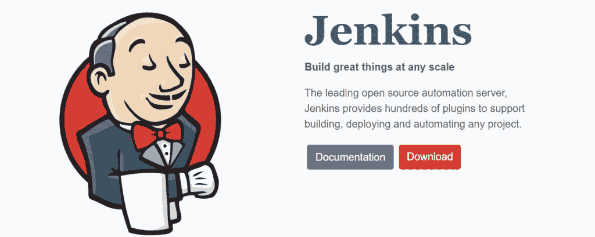](https://kinsta.com/wp-content/uploads/2021/04/jenkins.png)

Jenkins

[Jenkins](https://www.jenkins.io/) 是一款开源免费的自动化服务器，帮助自动化软件开发过程，如构建、促进 CI/CD、部署和测试。

这个 DevOps 工具使团队能够轻松地监控重复的任务，轻松地集成变更，并快速地识别问题。

#### 特点和优势:

*   Jenkins 支持 100 多个插件来集成 CI/CD 工具链中几乎所有可用的工具，如 [Git](https://kinsta.com/knowledgebase/git-vs-github/) ，Amazon EC2，Maven 等。
*   这是一个用 Java 编写的独立程序，可以跨主要平台运行，包括 Windows、macOS、T2、Linux 和 Unix 系统。
*   您可以使用带有内置错误检查和帮助的简单 web 界面轻松设置和配置 Jenkins。
*   Jenkins 可通过插件进行超级扩展，因此您可以执行一系列附加功能。
*   由于它是可扩展的，Jenkins 可以很容易地用作任何软件开发项目的 CI/CD 工具。
*   因为它是基于 Java 的 DevOps 工具，所以您可以轻松地将它分布到不同的机器上，以加速构建、测试和部署。

### 2.码头工人

[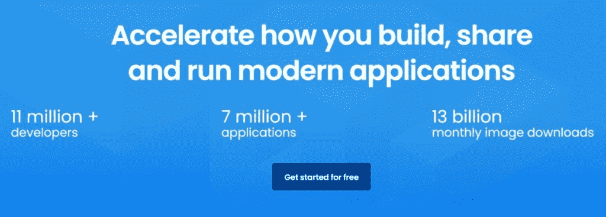](https://kinsta.com/wp-content/uploads/2021/04/docker1.jpg)

Docker

作为软件容器化的领导者，Docker 被全世界超过 1100 万的开发者所使用。Solomon Hykes 是其原作者，由 Docker 公司于 2013 年发布。

作为一个 DevOps 工具，Docker 通过具有所需依赖关系的容器而不是虚拟机，帮助开发人员轻松快速地构建、打包和部署代码。它消除了平凡的配置活动，并促进了有效的团队协作。

Docker 确保在 DevOps 周期的每个阶段，从开发到试运行和生产，都保持相同的软件开发环境。它使开发人员能够创建 Docker 映像，他们可以在开发环境和运营团队中运行这些映像来执行测试和部署。

#### 特点和优势:

*   Docker 使用操作系统级虚拟化来交付应用程序包，称为容器。它将这些容器相互隔离，并将软件、[配置](https://kinsta.com/help/multiple-ip-addresses-one-domain/)文件和库捆绑在一起，使它们可以转移并且更加安全。
*   它可以轻松地与 GCP 和 AWS 配合使用，并简化云迁移
*   Docker 促进分布式开发
*   该工具使添加功能和执行修复变得很容易
*   Docker 可以在 Windows、macOS 和 Linux 上运行
*   它与 CircleCI、GitHub 等部署管道工具集成良好。
*   它提供开源和商业解决方案
*   Docker 被网飞、Adobe、美国电话电报公司、PayPal 等企业使用。

### 3.木偶

Puppet

由 Puppet，Inc .开发并由 Luke Kanies 于 2005 年创立的 [Puppet](https://puppet.com/) 是一款用于软件配置管理的开源工具。

这款 DevOps 自动化工具有助于管理不同的软件生命周期阶段，例如跨云基础架构和数据中心的 IT 基础架构供应、修补以及软件组件和操作系统的配置和管理。

#### 特点和优势:

*   它是用 C++、Ruby 和 Clojure 编写的，可以在 Windows、Linux 和类 Unix 操作系统上运行。
*   Puppet 是一个模型驱动的工具，需要有限地使用[编程语言](https://kinsta.com/blog/best-programming-language-to-learn/)。
*   它使用自己的声明性语言来定义系统配置
*   它有助于减少手动[错误](https://kinsta.com/knowledgebase/wordpress-updating-failed/)，并支持您的团队以代码和无代理自动化的方式扩展基础架构
*   Puppet 的商业软件提供了开箱即用的报告、节点管理、编排、产品支持和访问控制

### 4.阿帕奇人的胃

Apache Maven

由 Apache 软件基金会开发并于 2004 年发布的 [Maven](https://maven.apache.org/) 是一个高效的构建自动化工具。它用 Java 编写，主要用于基于 Java 的项目，充当项目管理和理解工具。

作为一个 DevOps 工具，它帮助管理项目的构建、文档和报告。除了基于 Java 的项目，您还可以使用 Maven 来开发和管理用 Ruby、C#、Scala 和其他语言编写的软件项目。

#### 特点和优势:

*   Maven 预定义了目标来执行定义良好的任务，如代码编译和打包。
*   它从其存储库中下载 Maven 插件和 Java 库，以帮助加速开发过程。
*   它有 Apache 2.0 的许可证
*   Maven 提供了优秀的依赖管理，比如自动更新、传递依赖和依赖闭包。

### 5\. Gradle

[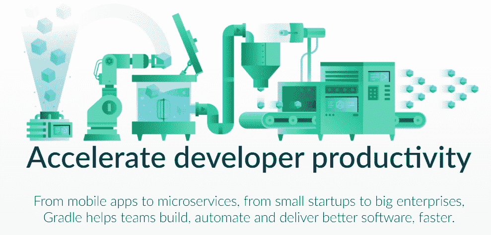](https://kinsta.com/wp-content/uploads/2021/04/gradle.png)

Gradle

使用[grade](https://gradle.org/)加速您的软件开发效率。这也是用于构建自动化的开源 DevOps 工具之一，尤其是用于多语言应用程序或软件开发。

## 注册订阅时事通讯

### 想知道我们是怎么让流量增长超过 1000%的吗？

加入 20，000 多名获得我们每周时事通讯和内部消息的人的行列吧！

[Subscribe Now](#newsletter)

Gradle 是用 Java、Kotlin 和 Groovy 编写的，于 2007 年发布。它用于以更快的速度自动化软件开发、测试和部署。

#### 特点和优势:

*   Gradle 拥有丰富的 API，以及先进的集成生态系统和[插件](https://kinsta.com/blog/divi-vs-elementor/)来帮助实现自动化，以便您可以开发、集成并系统化端到端软件交付。
*   它有 Apache 许可证 2.0
*   介绍了基于 Kotlin 和基于 Groovy 的 DSL
*   通过依赖关系管理，使用有向无环图来区分要运行的任务的优先级。
*   它帮助您以极快的速度轻松扩展您的开发。
*   有助于开发微服务的移动应用程序
*   它功能多样，初创企业和企业都可以使用

其他 DevOps 自动化工具:Gulp、Graphite、CA Release Automation、Digital.ai、UrbanCode Deploy 等。

## DevOps 管道(CI/CD)工具

一些最好的 CI/CD DevOps 工具包括:

### 6.绕圈圈圈圈圈圈圈圈圈圈圈圈圈圈圈圈圈圈圈圈圈圈圈圈圈圈圈圈圈圈圈圈圈圈圈圈圈圈圈圈圈圈圈圈圈圈圈圈

CircleCI

无论您的 DevOps 团队规模如何，这款云原生 CI/CD 工具 [CircleCI](https://circleci.com/) 都能为您的软件开发流程提供可靠性和速度。

您可以在基础设施或云中快速开发和部署高性能软件。

CircleCI 成立于 2011 年，现在它每月运行大约 3500 万次以上的构建。它被 Spotify、PagerDuty、福特汽车公司、三星等领先公司使用。

#### 特点和优势:

*   CircleCI 在虚拟机或干净的容器中自动运行您的 CI/CD 管道，以方便测试。
*   如果管道出现故障，它会立即通知您的团队。您还可以使用它们的松散集成来自动化通知。
*   将代码自动部署到不同的环境中，以实现快速上市。
*   它与 [Bitbucket](https://kinsta.com/blog/bitbucket-vs-github/) 和 [GitHub](https://kinsta.com/knowledgebase/what-is-github/) 集成，为您的代码提交创建管道。
*   它运行在 Windows、macOS、Linux 上，支持 Docker。
*   允许您编排和定义任务执行，以便更好地控制工作流。
*   支持 [Javascript](https://kinsta.com/blog/php-vs-javascript/) 、C++、 [PHP](https://kinsta.com/blog/php-editor/) 、Python、.NET，Ruby 等。以及无数的框架、工具链或版本。
*   提供强大的缓存选项，如源代码、图像、客户缓存和依赖项，以加速管道并实现最佳性能。
*   允许您使用 SSH 访问查找和解决问题。
*   通过全面的虚拟机隔离、LDAP 用户管理等提供无与伦比的安全性。
*   提供强大的洞察仪表板来跟踪状态和持续时间，并优化您的渠道。

### 7.竹子

[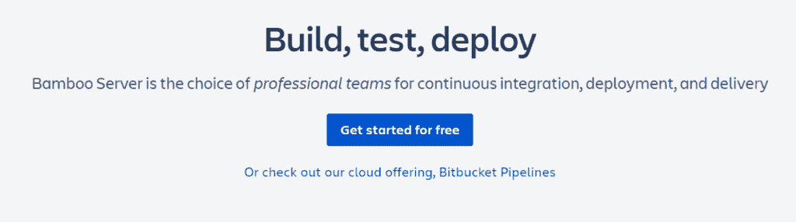](https://kinsta.com/wp-content/uploads/2021/04/bamboo.png)

Bamboo

DevOps 团队选择 Atlassian 的 [Bamboo](https://www.atlassian.com/software/bamboo) 进行软件应用的持续集成、持续部署和交付。您可以将您的自动化构建、发布和测试捆绑在一起，作为一个工作流。

作为 DevOps 工具，它可以帮助您在多个阶段创建构建计划，设置触发器，并为关键构建和部署分配代理

它有免费软件和付费软件两种。对于开发一个开源软件项目，Bamboo 是免费的，而商业机构则根据所需的构建代理收费。

#### 特点和优势:

*   支持多种版本
*   包括直观且用户友好的用户界面
*   具有提示、工具和自动完成功能
*   凭借预建的功能，Bamboo 的自动化管道比 Jenkins 需要更少的配置时间
*   支持并行自动化测试，以根据每个变更彻底回归产品，使错误缓存更快更容易
*   集成了许多构建工具和代码库，如 Git、Mercurial、JIRA、Bitbucket、Crucible、Fisheye 等。

### 8\. TeamCity

[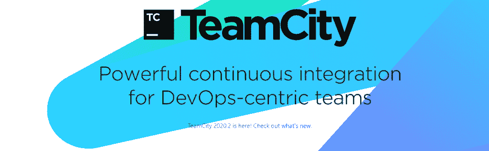](https://kinsta.com/wp-content/uploads/2021/04/jetbrains.png)

Teamcity

JetBrains 于 2006 年发布的 [TeamCity](https://www.jetbrains.com/teamcity/) 是一款面向 DevOps 团队的健壮的持续集成工具。这是一个通用的 CI/CD DevOps 工具，为不同类型的开发和工作流实践提供了更大的灵活性。

从开发人员和 DevOps 工程师到经理和管理员；团队精神受到所有人的喜爱。您可以构建、部署和测试不同类型的应用程序、容器和包，无论是多云、多语言还是多平台。

它是用 Java 编写的，可用于免费和付费计划。免费许可证最多附带 3 个构建代理和 100 个配置。

#### 特点和优势:

*   只需点击几下鼠标，就可以免费安装数百个插件
*   门控承诺阻止开发人员破坏版本控制系统中的源代码
*   实时报告，加快问题解决
*   集成检查、代码覆盖、重复搜索等。
*   构建网格以允许多个测试和构建同时在不同的环境和平台上运行
*   支持 Java、Ruby 和。NET 平台
*   支持 Git，Subversion，Mercurial 等。版本控制系统
*   与 Visual Studio、Eclipse 和 IntelliJ IDEA 等 ide 集成

### 9.特拉维斯·CI

[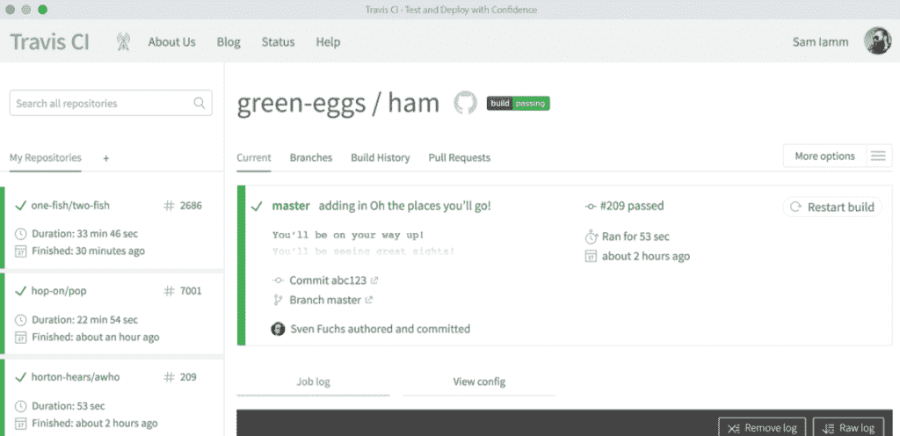](https://kinsta.com/wp-content/uploads/2021/04/travis.png)

Travis CI

Travis CI 最适合开源项目，是一个高效的持续集成(CI)工具，用于开发和测试托管在 GitHub 或 Bitbucket 上的应用程序。它是用 Ruby 写的，有麻省理工学院的许可证。

这个云托管的服务自动检测所有新代码的提交，以及有多少代码被推送到你的 GitHub 库，以帮助你构建软件并进行相应的测试。

#### 特点和优势:

*   快速设置，兼容 Linux、Mac 和 iOS
*   支持 Java，Python，PHP，Perl 等。
*   它的特点是自动部署
*   为每个版本提供干净的虚拟机
*   附带预安装的数据库、实时构建统计数据和并行测试
*   提供企业级访问控制，实现卓越的安全性
*   提供按需扩展能力

### 10.好朋友

[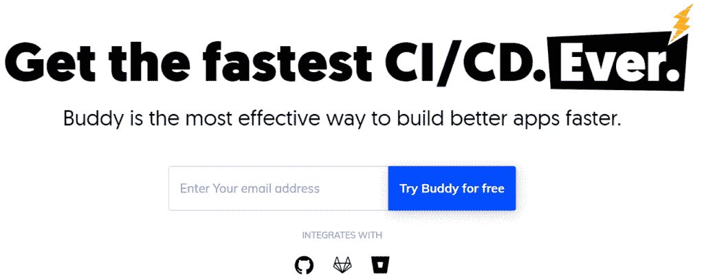](https://kinsta.com/wp-content/uploads/2021/04/buddy.works_.png)

Buddy

如果你为 CI/CD 找到一个有效的 DevOps 工具来更快地构建你的软件， [Buddy](https://buddy.works/) 可以成为你最好的‘伙伴’。该工具有助于持续集成和部署以及反馈。

它适用于使用来自 GitHub 和 Bitbucket 库的代码的项目。除了预装的框架和语言之外，它还允许您使用 Docker 容器来构建软件，并且还可以监控和发送警报。

#### 特点和优势:

*   附带一个用户友好和简单的用户界面
*   通过变更检测、并行性、高级缓存、360 度优化、RAM 和 vCPU 扩展等提供更快的部署。
*   允许您执行 100 多种操作，例如运行 SSH 命令、Docker 映像、生成静态站点、编排 Kubernetes 集群、使用 RPM 工具，以及除构建和部署之外的更多操作
*   集成了 Selenium、MariaDB、Redis、Memcached、Firefox、Chrome 等等
*   使用模板导入和导出管道和克隆的工作流管理功能

其他 DevOps CI/CD 工具:GoCD、Mercurial、 [Azure](https://kinsta.com/blog/aws-vs-azure/) DevOps Pipelines、Chrome DevTools、[、Sublime Text](https://kinsta.com/blog/how-to-use-sublime-text/) 等。

## DevOps 版本控制工具

版本控制开发运维工具包括:

### 11.饭桶

[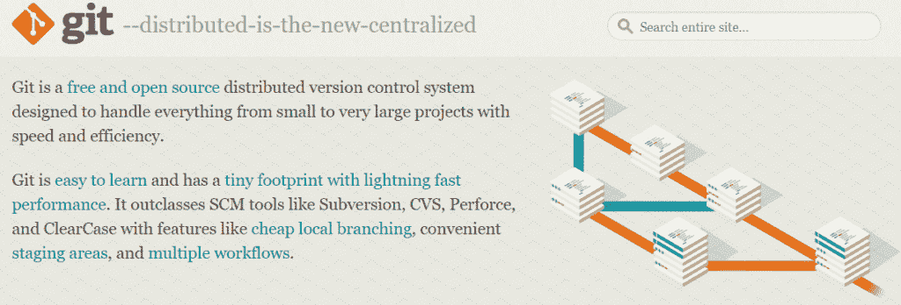](https://kinsta.com/wp-content/uploads/2021/04/git.png)

Git

最广为人知的 DevOps 工具之一， [Git 的](https://git-scm.com/)一款开源免费版本控制软件。它发布于 2005 年，用 C、Perl、Shell 和 Tcl 编写，最初由 Linus Torvalds 编写。

这个分布式源代码管理(SCM)工具用于跟踪软件开发文件中的变化，并有效地协调程序员之间的工作。它旨在提高非线性分布式工作流的速度、支持和数据完整性。

计算机上的每个 Git 目录都是完全成熟的，具有完整的版本跟踪能力和历史记录。

#### 特点和优势:

*   在 Windows、macOS、Linux、Solaris 和 AIX 上运行
*   它拥有 GPL v2 许可证
*   可以处理不同规模的项目，从小到大，同时保持效率和速度
*   初学者和专家都易于学习和使用
*   通过便利的暂存环境、多个工作流、提交、签入和多个本地分支等功能提供竞争优势
*   为了将它集成到您的工作流程中，从 GitHub 或 Bitbucket 托管存储库，这样您的团队可以轻松地推送任务

### 12.开源代码库

GitHub

数百万公司和开发者信任 GitHub 来构建、管理和发布他们的软件。这是世界上最先进、最大的开发平台。它为您的软件开发提供虚拟主机，并利用 Git 进行版本控制。

它用 Ruby、C、Go 和 ECMAScript 编写，于 2008 年推出。目前，全球有 5600 多万用户和 300 多万个组织在使用它。

除了 Git 的功能之外，GitHub 还提供了 Git 的源代码管理和分布式版本控制特性。它的基本服务是免费的，这也是它被用来托管大多数开源项目的原因。

#### 特点和优势:

*   展示改进的访问控制
*   提供协作功能，如任务管理、错误跟踪、持续集成、功能请求和维基
*   附带无限的私有和公共存储库
*   使您能够使用 GitHub 包和 npm 共享您的项目
*   它的移动应用程序可以帮助你合并或检查代码、浏览器存储库、管理通知等。熟练地
*   适用于 Windows、macOS 和 Linux，您可以使用 GitHub CLI 或桌面工作

其他 DevOps 版本控制工具有 Bitbucket、GitLab、Subversion、Mercurial、Gerrit、Kallithea 等等。

## DevOps 配置管理工具

看看一些用于配置管理的最佳 DevOps 工具:

### 13.厨师

[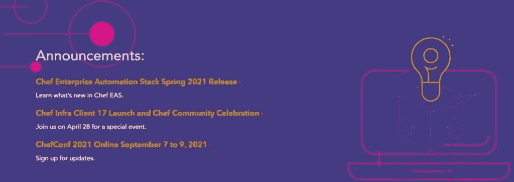](https://kinsta.com/wp-content/uploads/2021/04/chef1.jpg)

Chef

最古老的 DevOps 工具之一， [Chef](https://www.chef.io/) 是 2009 年发布的开源配置管理解决方案。

厌倦了体验你的 WordPress 网站的问题？通过 Kinsta 获得最好、最快的主机支持！[查看我们的计划](https://kinsta.com/plans/?in-article-cta)

您可以使用 Chef 简化服务器的配置和维护。它还可以集成各种基于云的解决方案，如亚马逊 EC2、微软 Azure、[谷歌云](https://kinsta.com/blog/google-cloud-vs-aws/)平台等。自动配置和供应新机器。

它确保 It 基础架构中的所有节点都连接在一起，无需手动更新即可轻松添加更多节点。

#### 特点和优势:

*   Chef 是用 Erlang 和 Ruby 编写的，并利用纯 Ruby 的领域特定语言(DSL)进行系统配置
*   它帮助用户以速度、一致性和规模适应快速变化的业务需求
*   管理多个云环境和数据中心
*   确保高服务器可用性
*   Chef 以服务器/客户端模式运行，或者作为独立的配置工具运行
*   它支持各种平台，包括 Windows、macOS、Ubuntu、Solaris、FreeBSD、RHEL/CentOS、AIX、Fedora 和 Debian。

### 14.库伯内特斯

[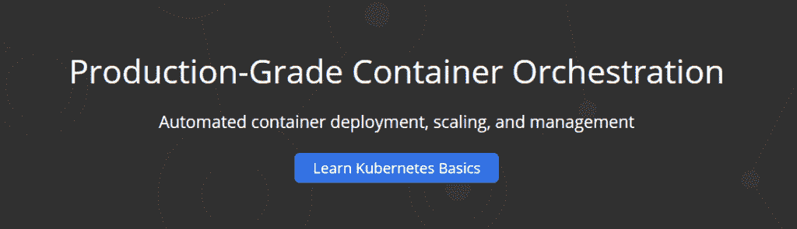](https://kinsta.com/wp-content/uploads/2021/04/kubernetes.png)

Kubernetes

也被称为 K8s， [Kubernetes](https://kubernetes.io/) 是一个开源的生产级容器编排系统，用于自动化基于容器的软件的部署、管理和扩展。

它是用 Go 编写的，最初由谷歌开发，于 2014 年发布，但现在由云原生计算基金会负责维护。

作为最好的 DevOps 自动化工具之一，Kubernetes 对于用许多容器打包的应用程序非常有用。它允许开发人员在逻辑上隔离和打包容器集群，以便于部署到多台机器上。

您可以采用主-从节点安排来自动化容器调度和部署，并分析和维护节点连接。使用 Kubernetes，您可以自动创建 Docker 容器，并根据需求和伸缩需求分配它们。

#### 特点和优势:

*   Kubernetes 推出&逐步回滚对软件和/或其配置的更改，并监控其健康状况
*   它为 pod 提供一个 IP 地址，为一组 pod 提供一个 DNS 名称，并在它们之间实现负载平衡。
*   根据集群拓扑促进服务流量路由
*   提供从本地到公共云的多种存储选项，如 AWS 或 GCP，或网络存储解决方案，如 NFS、Gluster 等。
*   根据资源需求自动放置容器，而不牺牲可用性
*   管理批处理 ci 和批处理工作负荷
*   将 IPv6 和 IPv4 地址分配给服务和 pod
*   使用 UI、命令或根据 CPU 使用情况提供水平扩展
*   具有自我修复功能，允许在容器出现故障时重新启动容器，在节点死亡并终止对健康检查无响应的容器时重新安排和替换容器

### 15.Ansible

[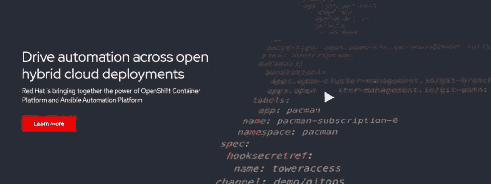](https://kinsta.com/wp-content/uploads/2021/04/ansible1.jpg)

Ansible

Ansible 是一款领先的开源工具，用于软件供应、部署和配置管理，支持基础设施即代码。

用 Python、Shell、Ruby、PowerShell 编写，原作者是 Michel DeHaan，发布于 2012 年。现在，红帽收购了 Ansible。

作为市场上著名的 DevOps 工具之一，它简化了整个生命周期中的软件开发自动化。

#### 特点和优势:

*   它无代理工作，通过 SSH/远程 PowerShell 连接来完成其任务。
*   在 Windows、macOS、Linux 和 Unix 系统上运行
*   它促进了简单的可扩展性和更快的生产率
*   轻松管理复杂的部署
*   这是一个比木偶更轻便的选择，非常适合小团队
*   与 Jenkins 等其他工具无缝集成
*   使用 YAML 模板消除重复性任务

### 16.无赖

[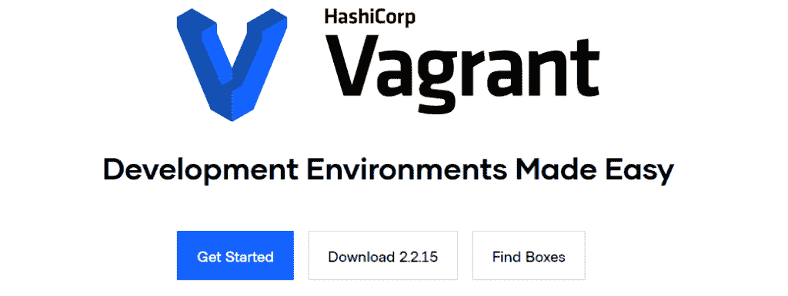](https://kinsta.com/wp-content/uploads/2021/04/vagrant.png)

Vagrant

无论您在 DevOps 团队中的角色是开发人员、设计人员还是操作员，HashiCorp 的[vagger](https://www.vagrantup.com/)都能为每个人提供同样轻松的工作流程。

《流浪者》由米切尔·桥本用红宝石写成，于 2010 年发行。这是一个开源软件，用于构建和维护可移植、轻量级和可复制的虚拟环境，如 Docker Containers、AWS、VMware 等。用于软件开发。

在 DevOps 中，vagger 简化了软件的配置管理，提高了开发效率。

#### 特点和优势:

*   兼容 Windows、macOS、Linux、FreeBSD、Arch Linux、CentOS 和 Debian
*   它带有麻省理工学院的许可证
*   针对软件要求、操作系统配置、用户、软件包等使用声明性配置文件
*   提供选择首选编辑器、浏览器、调试器和 IDE 的灵活性
*   与 Docker、Ansible、Puppet、Chef 和 Salt 等其他配置管理工具集成，帮助您使用与生产相同的配置脚本

### 17.领事

[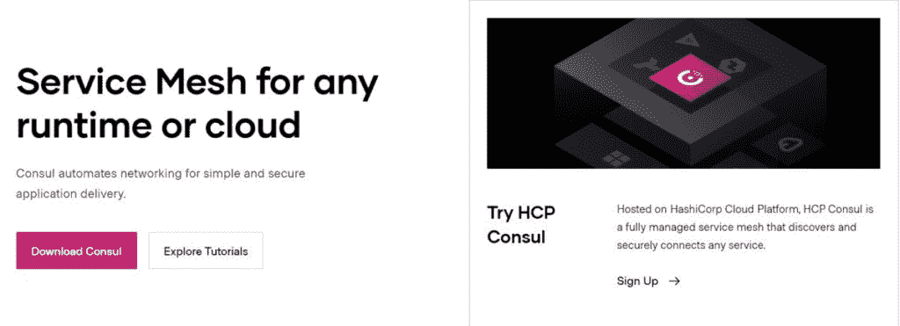](https://kinsta.com/wp-content/uploads/2021/04/consul1.jpg)

Consul

HashiCorp 的[consult](https://www.consul.io/)是最好的配置管理 DevOps 工具之一。它允许您自动进行网络配置，使用安全连接，并跨运行时或在云中发现服务。该工具非常适合现代基础设施。

#### 特点和优势:

*   您可以通过向 Kubernetes 咨询完整性来扩展其功能
*   支持在基础设施或运行时内部署服务网格
*   使用三方工具提供动态负载平衡，如 [Nginx](https://kinsta.com/knowledgebase/what-is-nginx/) 、HAProxy 或 F5
*   使用 mTLS 加密和基于意图的策略为您的服务提供安全性
*   检测和部署新服务，并提供实时代理运行状况以减少停机时间

### 18.将（行星）地球化（以适合人类居住）

[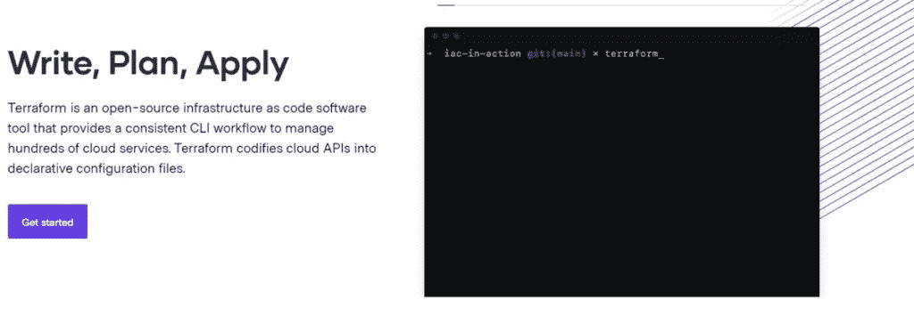](https://kinsta.com/wp-content/uploads/2021/04/terraform1.jpg)

Terraform

HashiCorp 的 [Terraform](https://www.terraform.io/) 是市场上著名的 Code DevOps 工具基础设施之一。它是一个开源的 IaC 工具，提供一致的命令行界面(CLI)工作流来帮助您管理多个云服务。

Terraform 由 Mitchell Hashimoto 在 Go 中编写，于 2014 年发布。它整合了 HashiCorp 配置语言(HCL)，这是一种声明性语言，允许您定义和提供数据中心基础架构。但是，您也可以选择使用 JSON。

#### 特点和优势:

*   在 Windows、macOS、Linux、FreeBSD、OpenBSD 和 Solaris 上运行
*   附带 Mozilla 公共许可证 v2
*   支持 HCL 语言，使用参数、表达式和块实现简洁的资源描述
*   您可以定义 IaC 来管理软件生命周期过程，例如创建新资源、销毁或管理现有资源
*   自动化资源调配并减少人为错误
*   使用一个工作流在 300 多个服务和公共云中调配基础架构

其他 DevOps 配置管理工具有 Vault、Etcd、CFEngine、SaltStack、JUJU、Cobbler、Octopus 等等。

## DevOps 测试工具

以下是一些用于测试的 DevOps 工具:

### 19.硒

[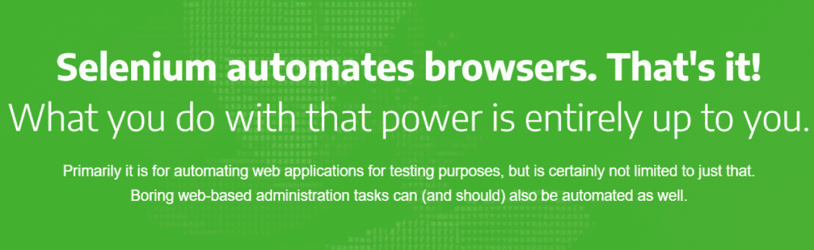](https://kinsta.com/wp-content/uploads/2021/04/selenium.png)

Selenium

如果你正在寻找一个足智多谋的 DevOps 工具来自动化你的软件测试，Selenium 是一个不错的选择。您还可以使用它来自动化枯燥的 web 管理任务。

Selenium 是 2018 年发布的开源软件。除了编写功能测试之外，它还提供了一个可移植的框架来执行测试，而不需要学习脚本语言。

它提供了一个测试 DSL，Selenese，您可以使用它来编写各种编程语言的测试，如 Java、PHP、Python、C、Perl、Ruby 等。

#### 特点和优势:

*   它兼容大多数网络浏览器，以及 Windows、macOS 和 Linux 等操作系统。
*   它有 Apache 许可证 2.0
*   Selenium 具有高度的可扩展性和灵活性，因此非常适合 DevOps
*   支持并行测试执行
*   与 Docker、Jenkins、Maven 等第三方工具集成
*   它被技术领导者使用，包括 Google、IBM、Salesforce、Cognizant 等

### 20.特里森蒂斯托斯卡

[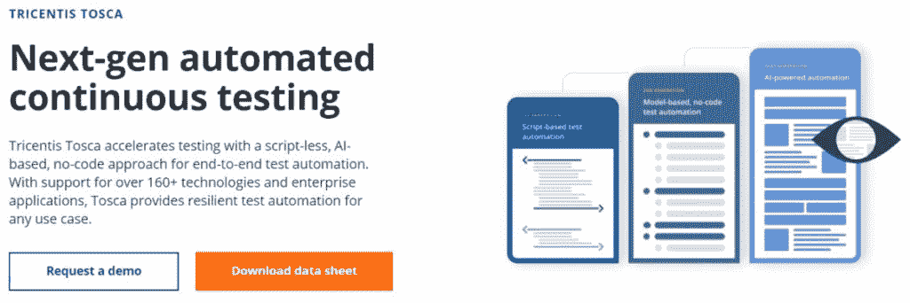](https://kinsta.com/wp-content/uploads/2021/04/tricentis1.jpg)

Tricentis Tosca

使用 Tricentis Tosca 的基于人工智能的无脚本工具加速软件测试，该工具采用无代码方法来执行端到端测试自动化。它结合了测试的不同方面，比如测试自动化、案例设计、数据生成和设计，以及[分析](https://kinsta.com/blog/google-analytics-spam/)。

#### 特点和优势:

*   Tricentis Tosca 利用基于风险的测试和基于模型的测试的相关技术，实现更高的测试自动化率，同时易于维护
*   为 DevOps 团队提供许多测试自动化功能，如功能测试、负载测试、BI/DWH 测试、探索性测试、打包应用测试，并促进测试数据管理、测试影响分析、服务虚拟化和分布式执行
*   支持 160 多种企业应用程序和技术 Salesforce、Adobe、Oracle、SAP、Java。NET、HTML 5 等等。

### 21.测试西格玛

[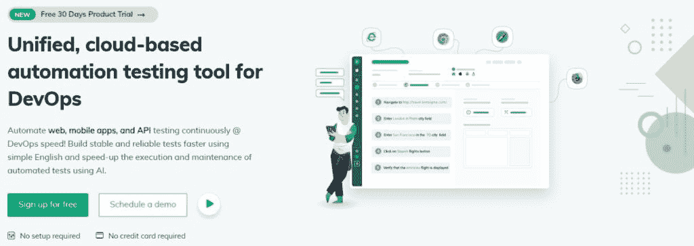](https://kinsta.com/wp-content/uploads/2021/04/testsigma1.jpg)

TestSigma

尽管 TestSigma 是测试自动化领域的新生事物，但由于其令人印象深刻的产品，它正在赢得声誉。这是一个基于云的测试自动化 DevOps 工具，用于 web、API 和移动应用。它利用人工智能来加快测试的执行和维护。

#### 特点和优势:

*   使用简单的英语进行自动化测试，因此，对于功能测试人员，尤其是初学者来说更容易
*   为开发运维团队和敏捷团队提供一个统一的平台，让团队中的每个人都参与进来
*   提供多种类型的测试，如持续测试、移动和 web 应用测试、数据驱动测试、跨浏览器测试和回归测试
*   允许您通过编写 JS 和基于 Selenium 的函数来扩展它的功能
*   支持并行软件测试，以节省成本和时间

### 22.IBM Rational 功能测试器

IBM Rational Functional Tester

除了数据驱动和 GUI 测试之外，IBM RFT 还提供自动化的功能和回归测试。它通过自然语言和渲染截图简化了测试编辑和可视化。

#### 特点和优势:

*   RFT 支持各种基于 web 的应用程序，如 Java。NET、SAP 和 Siebel
*   支持基于终端仿真器的应用，如 Ajax、PowerBuilder、Adobe Flex、Adobe PDF 文档、Dojo Toolkit 等。
*   使用 ScriptAssure 技术自动化测试并支持测试脚本

### 23.索普伊

[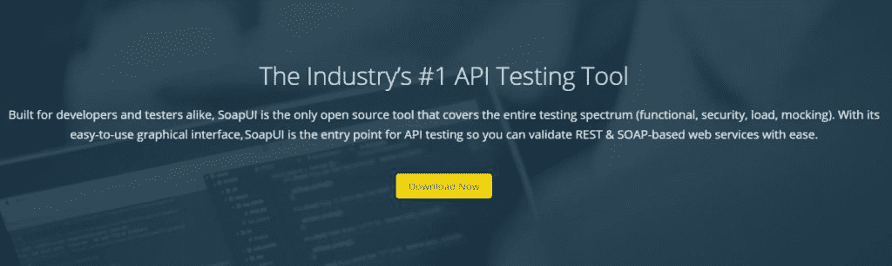](https://kinsta.com/wp-content/uploads/2021/04/soapui1.jpg)

SoapUI

无论你是构建商业软件还是开源软件，SmartBear 的 [SoapUI](https://www.soapui.org/tools/soapui/) 都是一个极好的选择。这是一个开源软件测试 DevOps 工具，用于表述性状态转移(REST)和简单对象访问协议(SOAP)。

它发布于 2005 年，是唯一一个具有广泛测试能力的开源工具，比如功能、负载测试和安全测试。

#### 特点和优势:

*   提供易于使用的图形界面
*   使用拖放测试创建的无脚本功能测试
*   为您的软件提供 API 模拟，无需等待其完成
*   包括对 REST、JMS、SOAP/WSDL 的协议支持
*   支持快速交换环境
*   提供一键测试重构来快速更新测试

其他 DevOps 测试工具有 Basis、QuerySurge、Sentry、Watir、Stackify Retrace 等等

## DevOps 监控工具

接下来，让我们了解一些用于监控的 DevOps 工具:

### 24.纳吉奥斯

[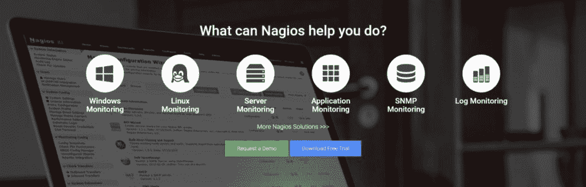](https://kinsta.com/wp-content/uploads/2021/04/nagios1.jpg)

Nagios

谈到监控 it 基础设施，Nagios 是最有效的 DevOps 工具之一。它由 Ethan Galstad 用 C 语言编写，于 2002 年发布。

Nagios 也是一个监控基础设施、系统和网络的开源免费软件。它为应用程序、服务器、日志和交换机提供警报和监控服务。DevOps 工具的目的是在出现问题时提醒用户，并在问题解决时通知他们。

#### 特点和优势:

*   提供跨平台兼容性，包括 Linux 和 Unix 系统
*   它拥有 GNU GPL v2 许可证
*   监控网络服务，如 HTTP、FTP、SSH、POP3、SNMP、 [SMTP](https://kinsta.com/blog/gmail-smtp-server/) 、NNTP 和 ICMP
*   还通过监控代理监控主机资源，如磁盘使用、处理器负载、系统日志以及 Windows 等网络操作系统
*   监控硬件，如警报探头、温度等。
*   附带一个极简插件设计来帮助用户开发服务检查
*   它在 Nagios XI、核心、日志服务器和融合中可用。

### 25.普罗米修斯

Prometheus

使用领先的开源监控软件 [Prometheus](https://prometheus.io/) 增强您的警报和指标。用 Go 写的，2012 年发布。

它通过使用强大的查询和高维数据模型，在时间序列数据库中实时记录指标。普罗米修斯在利用格拉夫纳的团队中很受欢迎。

#### 特点和优势:

*   提供跨平台兼容性
*   它有 Apache 许可证 2.0
*   通过键值对和指标名称来标识时间序列
*   提供多种[数据可视化](https://kinsta.com/blog/data-visualization-tools/)方式，如图形、表格等。这使得 DevOps 团队很容易分析数据
*   具有 PromQL 特性，允许您将时间序列数据分成更小的块，以便更容易地生成特定的表格、图形和警报
*   以自定义格式高效地将数据存储在本地磁盘和内存中。借助功能性分片和联合，您可以轻松扩展
*   提供多个易于实现的客户端库，轻松实现服务工具，支持 10 多种语言
*   支持从第三方解决方案导出数据，如 JMX 度量、StatsD、HAProxy 和 Docker 等 DevOps 工具。

### 26.新遗迹

[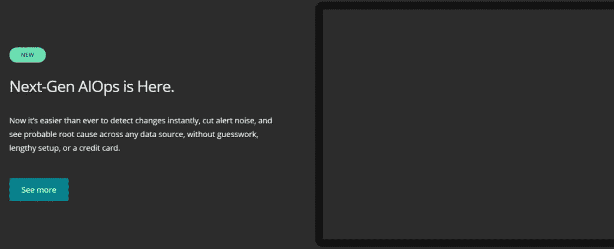](https://kinsta.com/wp-content/uploads/2021/04/newrelic1.jpg)

New Relic

使用 [New Relic](https://newrelic.com/) ，您可以通过分析、故障排除和优化您的整体软件堆栈来生产性能更好的软件。

New Relic 是一家成立于 2008 年的科技公司。该平台清晰地反映了您在程序中所做的每一项更改。

除了显示开发过程的实时状态之外，它还可以帮助您修复问题、加快部署周期和管理相关任务，并为成为足智多谋的 DevOps 工具设定主要标准。

#### 特点和优势:

*   使您能够在一个地方收集所有遥测数据，以获得人工智能驱动的洞察力和全栈可观测性，从而加快上市时间并提高服务可靠性
*   如果您使用 Grafana 或 Prometheus 环境，那么您也可以在 New Relic 中存储数据，如[日志、事件、跟踪和指标](https://kinsta.com/blog/wordpress-performance-new-relic/)
*   从被动方式过渡到数据驱动方式有助于改善您的客户体验

### 27\. PagerDuty

PagerDuty

使用[page duty](https://www.pagerduty.com/)的实时运营监控平台，改善您的客户体验并保护您的品牌声誉。

作为最有用的 DevOps 工具之一，它可以帮助您的团队使用自动化和机器学习实现更少的停机时间、更高的生产率和更少的停机时间。

#### 特点和优势:

*   PagerDuty 易于使用和扩展
*   作为您的数字基础设施的神经系统，PagerDuty 实际上分析来自软件系统的数字信号
*   借助快速事件响应，您可以跨团队自动执行任务，加快解决问题，并执行深入的行动手册
*   提供警报和任务调度，帮助您迅速采取行动
*   将 ML 用于事件背景、个性化建议和实时分类
*   支持与 Slack、AWS、Atlassian、Zendesk、New Relic 等工具的 370 多种集成。

### 28.扇子

[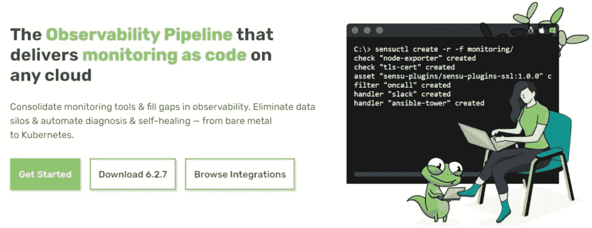](https://kinsta.com/wp-content/uploads/2021/04/sensu.jpg)

Sensu

毫无疑问，它是监控 IT 基础设施的最佳开发工具之一。它可以帮助您监控服务器、应用程序、网络设备和容器，同时检查应用程序的运行状况，测量业务 KPI，以及收集和分析指标。

它是用纯 Ruby 编写的，于 2011 年发布。它利用 Redis 进行数据存储，利用 rabbitMQ 进行两个组件之间的数据交换。它是为在云环境中使用 Ansible、Puppet 等服务器自动化工具而设计的。

使用 Sensu 的公司有特斯拉、雅虎、思科等。

#### 特点和优势:

*   这是一个提供可扩展性和可补偿性的内聚工具
*   立即发送有关问题和故障的警报
*   提供动态注册或取消注册客户端的选项
*   适用于多层网络和关键任务应用程序
*   它有免费和计划许可两种形式

### 29.Splunk

[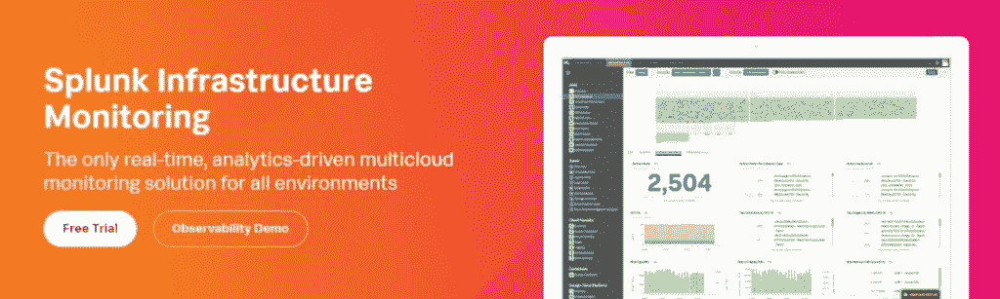](https://kinsta.com/wp-content/uploads/2021/04/splunk1.jpg)

Splunk

使用 [Splunk](https://www.splunk.com/en_us/software/infrastructure-monitoring.html) 的预测流分析功能，实时监控云规模的基础设施性能。

Splunk 使用类似 web 的界面帮助搜索、监控和分析机器生成的大数据。它允许您自动发现、分组、分解和探索系统、服务和云。

#### 特点和优势:

*   提供 200 多种与云服务的预构建集成
*   具有独特的控制面板，可实现快速的全栈可视化
*   让您轻松了解跨可用性区域、不同服务、Kubernetes 集群等的基础设施行为。
*   通过利用数据科学(如 AI 和 ML)，它可以针对动态阈值、复杂规则和多种条件准确、即时地发出警报，从而缩短团队检测和警报风暴的时间
*   通过利用服务级别洞察力监控 sli 和 SLO，帮助您了解客户体验
*   使用定制的业务 KPI 指标，您可以轻松地跟踪销售了多少产品、它们的成本/工作量等。实时地
*   支持闭环自动化，如自动扩展，以实现无缝的最终用户体验

### 30.每个人都离开了

[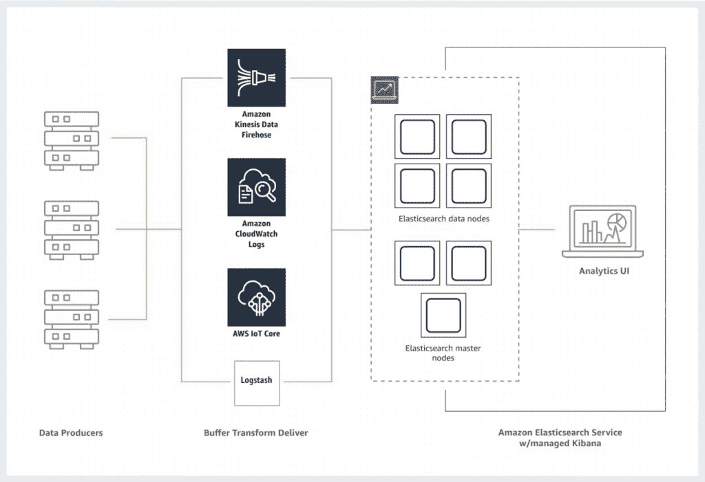](https://kinsta.com/wp-content/uploads/2021/04/amazon1.jpg)

ELK Stack

[ELK Stack](https://aws.amazon.com/elasticsearch-service/the-elk-stack/#:~:text=The%20ELK%20stack%20is%20an,Elasticsearch%2C%20Logstash%2C%20and%20Kibana.) 是三个开源、流行工具的强大组合:Elasticsearch、Logstash、& Kibana。

ELK stack 允许您聚合整个应用程序和系统的日志，分析日志，为基础架构和应用程序监控、安全分析、快速故障排除等创建可视化。

*   Elasticsearch 是一个基于 Apache 许可的 RESTful、开源、分布式分析和搜索工具。它支持各种语言，提供高性能，包括无模式 JSON 文件等。这使得该工具成为搜索和日志分析的绝佳选择
*   Logstash 也是一个用于数据摄取的开源工具，您可以使用它从不同的来源收集数据，修改它，并将其发送到您想要的任何地方。它支持 200+插件和预建的过滤器。
*   Kibana 是一个开源数据探索和可视化工具，用于查看日志和事件。它具有轻松的、预构建的、交互式的过滤器和聚合，并附带了对数据可视化的地理空间支持

其他 DevOps 监控工具有 Raygun、Ganglia、Snort、eG Enterprise、Datadog 等等。

## 额外开发工具

除了上面提到的用于软件开发不同阶段的 DevOps 工具之外，还有许多工具可用于协作、规划、持续反馈、安全等。

*   持续反馈: [Mouseflow](https://kinsta.com/blog/website-traffic-analysis/#13-mouseflow) 、JIRA 服务台、 [SurveyMonkey](https://kinsta.com/blog/google-forms-alternative/#4-surveymonkey) 、SurveyGizmo 等。
*   合作:Slack，Basecamp，Asana 等。
*   规划:Atlassian 吉拉 Align，Planview，Targetprocess，Trello 等。
*   云 DevOps 工具:Kamaterra，OpenStack， [AWS](https://kinsta.com/blog/aws-outage/) ，Google 云平台，Azure，IBM Cloud 等。

[结果都在...这些是软件开发的 30 个最好的 DevOps 工具🏆](https://twitter.com/intent/tweet?url=https%3A%2F%2Fkinsta.com%2Fblog%2Fdevops-tools%2F&via=kinsta&text=The+results+are+in...+these+are+the+30+best+DevOps+tools+for+software+development+%F0%9F%8F%86&hashtags=DevOps%2CDevelopers)

## 摘要

我们希望这篇文章能让您深入了解 DevOps 的概念、工作原理、除了 DevOps 文化和实践之外的好处。

更不用说，我们在本文中精心挑选的所有 DevOps 工具都可以在 DevOps 软件生命周期的各个阶段使用，包括开发、CI/CD、测试、配置管理、版本控制、监控等等。

* * *

让你所有的[应用程序](https://kinsta.com/application-hosting/)、[数据库](https://kinsta.com/database-hosting/)和 [WordPress 网站](https://kinsta.com/wordpress-hosting/)在线并在一个屋檐下。我们功能丰富的高性能云平台包括:

*   在 MyKinsta 仪表盘中轻松设置和管理
*   24/7 专家支持
*   最好的谷歌云平台硬件和网络，由 Kubernetes 提供最大的可扩展性
*   面向速度和安全性的企业级 Cloudflare 集成
*   全球受众覆盖全球多达 35 个数据中心和 275 多个 pop

在第一个月使用托管的[应用程序或托管](https://kinsta.com/application-hosting/)的[数据库，您可以享受 20 美元的优惠，亲自测试一下。探索我们的](https://kinsta.com/database-hosting/)[计划](https://kinsta.com/plans/)或[与销售人员交谈](https://kinsta.com/contact-us/)以找到最适合您的方式。