# 用 WordPress 创建目录网站的最终逐步指南

> 原文：<https://kinsta.com/blog/directory-website-wordpress/>

你可能听说过一些最流行的目录网站。易贝、雅虎、脸书、必应、Foursquare 和 Yelp 只是众多列出产品和服务供我们浏览的网站中的一部分。你可以很容易地创建一个目录网站，列出几乎所有的东西。事实上，你可以找到房地产、本地企业、汽车的例子。你能说出它的名字，你能列出它。

## 什么是目录网站？

目录网站是列出您可以浏览的产品和服务的网站。要在 WordPress 中创建一个:

1.  选择利基市场
2.  找到赚钱的方法
3.  关注品牌
4.  设置您的目录网站
5.  实现主要功能

Support

这就是为什么**目录网站是最受欢迎的网站类型之一**创建和尝试[从](https://kinsta.com/blog/how-to-monetize-a-blog/)赚钱。

但是和任何复杂的项目一样，确保你沿着正确的道路前进以确保你的项目成功是至关重要的。在这篇文章中，我们将带你经历**创建目录网站** :
的所有关键步骤

## 为你的目录网站选择合适的位置

既然你已经决定创建这样一个网站，最重要的问题是:

> Kinsta 把我宠坏了，所以我现在要求每个供应商都提供这样的服务。我们还试图通过我们的 SaaS 工具支持达到这一水平。
> 
> <footer class="wp-block-kinsta-client-quote__footer">
> 
> 
> 
> <cite class="wp-block-kinsta-client-quote__cite">Suganthan Mohanadasan from @Suganthanmn</cite></footer>

[View plans](https://kinsta.com/plans/)

> 你打算在你的目录网站上列出什么？

确定你的市场可能是你下一个盈利的业务和一个只会成为又一个失败的网络项目的区别。

以下是你应该采取的步骤，以评估你的目录网站将专攻什么。

### 思考您有兴趣销售的产品:

首先，重要的是要考虑你对什么类型的产品、行业和服务感兴趣。如果你从这个目标开始，你会对你的项目更有热情，希望你能更容易找到四五种类型的行业、利基或垂直市场，作为你其余研究的基础。

例如，如果你喜欢和朋友出去吃饭，你会对你所在的城镇/城市最受欢迎的餐馆、他们提供的食物类型以及他们最好的菜肴有很好的了解。

这为你提供了正确的知识类型，你可以用来开始瞄准特定的餐馆，你知道他们很棒，而不是在其他人身上浪费资源。

### 查看人们在搜索什么:

一旦你明确了你想卖什么，你就可以继续做一些深入的研究来发现你喜欢的领域中最受欢迎的企业。最有效的方法之一是查看人们在网上搜索什么。要做到这一点，你可以使用大量的 SEO 工具，如[谷歌关键词规划器](https://ads.google.com/home/tools/keyword-planner/)、 [Ahrefs](https://ahrefs.com/) 或 [Moz](https://moz.com/) 。

这里的关键点是[找到正确的长尾关键词](https://kinsta.com/blog/featured-snippets/)，它们拥有高人气和相对低竞争的神奇组合。

我的意思是:假设你决定创建一个目录网站，供人们查找本地建筑商。我使用 Ahrefs 来查找受欢迎的(一个月 200 次以上的搜索)和竞争不太激烈的(关键字难度评级低于 50)的搜索词。以下是他们的名单:

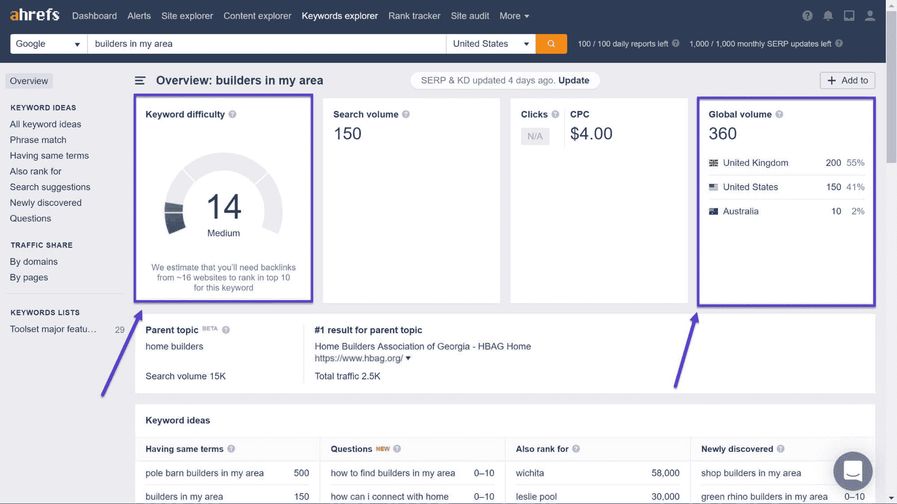

Ahrefs result page for a given query

*   我所在地区的建筑商
*   我所在地区的围栏建筑商
*   我所在地区的房屋建筑商
*   我附近的房屋建筑商
*   定制房屋建筑商
*   房屋建筑商
*   车库建筑商
*   假日建设者
*   我附近的泳池建设者

从这一点上，你会看到什么样的关键词可以让你的网站排名更高。但是还有更多:由于这项研究，你将能够看到人们寻找什么类型的建设者。例如，查询“我附近的游泳池建设者”是一个流行的研究，您可能希望在您的目录网站上创建一个专门的部分。

关于优化网站搜索引擎优化的更多信息可以在 [Kinsta 的搜索引擎优化清单](https://kinsta.com/blog/wordpress-seo/)中找到。

### 检查是否有任何网站已经为您的利基服务:

拥有一个流行的长尾关键词列表是一回事，但如果已经有目录网站在为它们提供服务，那就没那么有用了。你可以使用搜索引擎优化工具来探索谁在搜索中排名更高。你也可以看到你的每一个关键词的竞争力。如果缺乏竞争，那么你就找到了正确的市场。

继续我们的建筑商目录的例子，这些网站在“栅栏建筑商”中排名很好

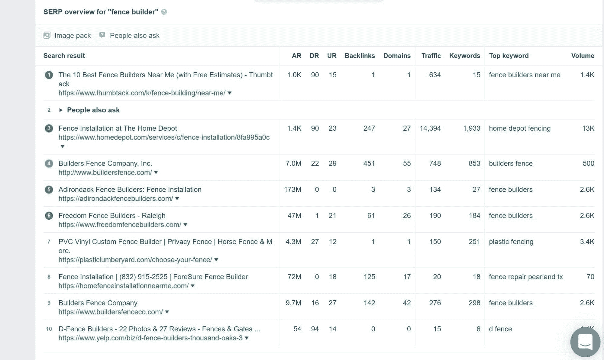

Ahrefs serp overview

如你所见，建筑商目录网站并不多。此外，那些排名前 10 的网站没有很好的 Ahrefs 排名，这意味着如果我们聪明地使用我们的 SEO，我们应该能够超过他们。

### 寻找渴望使用你的目录网站的企业:

既然你知道你的利基市场有需求，你需要和企业谈谈，看看他们是否愿意付费使用你的服务。例如，如果你在纽约创建一个房地产目录网站，房地产公司会愿意使用你的平台为他们的物业做广告吗？

一旦你的目录网站开始表现良好，你将需要联系他们，但让他们关注你总是一个好主意，这样当你再次联系他们时，他们会记得你是谁。

[谁不喜欢多赚#钱的想法？💵目录网站是帮助你做到这一点的好方法！看看你能多么容易地设置你的！📊 点击推文](https://twitter.com/intent/tweet?url=https%3A%2F%2Fkinsta.com%2Fblog%2Fdirectory-website-wordpress%2F&via=kinsta&text=Who+doesn%27t+like+the+idea+of+making+more+%23money%3F+%F0%9F%92%B5+Directory+websites+are+great+ways+to+help+you+do+that%21+See+how+easily+you+can+set+up+yours%21+%F0%9F%93%8A&hashtags=WordPress%2Cmakemoney)

## 如何赚钱你的目录网站

有两种简单的方法可以让你立刻通过目录网站赚钱:

### 1.物品收费

一旦你[开始为你的网站](https://kinsta.com/blog/how-to-drive-traffic-to-your-website/)带来有价值的流量，从而导致列表的转化，公司将开始注意到你，并希望为你的网站提交更多的内容。

这是你可以开始向他们收费的时候了。你可以提供优质的列表，这些列表将排在搜索结果的顶部(类似于谷歌搜索结果)，并且永不过期。

你可以为定期列表者设置月费，或者为那些不打算提交大量内容的人设置简单的一次性付款。

### 2.出售广告空间

鉴于(希望)大量的访问者访问你的网站，你将能够通过提供相关的广告来进一步赚钱。

你可以使用 [Google Analytics](https://kinsta.com/blog/how-to-use-google-analytics/) (了解如何[将 Google Analytics 连接到 WordPress](https://kinsta.com/blog/google-analytics-wordpress/) )等工具来了解是什么将用户带到你的网站，以及是否有相关产品可以卖给他们。例如，如果用户蜂拥至你的网站，为他们的新游泳池寻找建筑商，他们可能会愿意购买其他产品，如游泳衣。然后你可以联系公司，向他们推销和你一起做广告的好处。

另一个简单的方法是使用 [Google Adsense 及其替代品](https://kinsta.com/blog/adsense-alternatives/)，它将能够识别与你的网站最相关的高质量广告，并自动将它们放在那里。阅读我们关于[如何将 Google AdSense 添加到你的 WordPress 站点](https://kinsta.com/blog/how-to-add-google-adsense-to-wordpress/)的指南。

### 3.会员制或订阅制网站

一旦你的目录网站成为一个特定领域的列表的可靠来源，你将能够向列表者和用户收取访问你的信息的费用。

名单将希望获得大量的潜在客户访问您的网站。因此，他们愿意为没有截止日期的列表或出现在搜索顶部的特色列表等好处付费。

类似地，顾客可能倾向于付费在你的网站上看到最好的交易。或者，您可以允许用户查看您的所有列表，但只有当他们是付费会员时，才能访问联系信息。

有许多 [WordPress 成员插件](https://kinsta.com/blog/wordpress-membership-plugins/)可以帮助你满足所有的访问控制需求。

## 品牌宣传

在你真正开始建立你的网站之前，规划你的品牌战略是很重要的。

当然，你希望吸引两类用户:寻找房源的用户和出售房源的用户。因此，你需要考虑什么对两个群体都有效。

您品牌的重要方面需要包括:

**你的名字**——看看这些关于[如何选择域名的提示](https://kinsta.com/blog/choose-domain-name/)

**你网站的外观**-考虑主题、颜色、字体风格和其他设计选项。有了 WordPress，有许多免费和付费的主题可供选择。

**你的博客风格**——什么内容对你有用？你的语气会是怎样的？你将如何与你的读者交流？查看[金斯塔的博客小贴士](https://kinsta.com/learn/blogging-tips/)，了解更多关于这些的信息。

**推广网站的其他方法**——除了[好的 SEO](https://kinsta.com/blog/what-does-seo-stand-for/) 还有其他方法可以增加网站流量。对于付费广告，考虑探索谷歌广告，看看哪些广告对你的网站最有效。此外，脸书等社交媒体是另一条显而易见的成功之路。请跟随我们的指南[利用脸书取得营销成功](https://kinsta.com/blog/facebook-marketing/)了解更多信息。

## 设置您的目录网站

在开始向目录网站添加功能和内容之前，您需要设置四个要素。

### 1.选择你的网站平台

如果你希望降低成本，有很多像 WordPress.com 这样的免费平台看起来很有吸引力。但是，如果你真的想要一个先进的目录网站，你可以赚钱，那么你需要更强大的东西。

最好的解决方案是[WordPress.org](https://wordpress.org/)，它给你完全的自由来定制你的目录站点，并且能够支持数千个(希望如此！)的访问者。请看【WordPress.com 与 WordPress.org 的差异】中的[了解更多信息。](https://kinsta.com/blog/wordpress-com-vs-wordpress-org/)

以下是选择 WordPress.org 作为目录网站的几个原因:

*   大约每三个网站中就有一个使用 WordPress
*   包括 CNN 在内的一些最受欢迎的网站使用 WordPress
*   由于它的受欢迎程度，你可以依赖一个最大的开发者、设计师、编辑和内容作者的开源社区
*   在 WordPress 上创建一个网站比在 Drupal 之类的网站便宜
*   WordPress 为你提供了数以千计的主题和插件来定制你的目录网站
*   您可以在不使用 PHP 编码的情况下添加复杂的特性(我们稍后会谈到其中的一些)

### 2.选择一个可靠的网络主机

鉴于你正在运行一个目录网站，你希望赚钱，并将经历持续增长的流量，你需要一个可靠的网络主机为你的内心安宁。

虚拟主机就像你的网站所指向的一个真实的房子。在这个“房子”里，你的网络主机将保存你网站的所有文件。

当你选择一个目录网站的主机时，你会想要一个能够处理流量高峰的选项，增强你的网站的性能，并且在避免停机时有一个可靠的跟踪记录。

您的目录网站的最佳选择是 Kinsta，它将为您提供成长中的业务所需的安全性。除了上述优势， [Kinsta 在竞争中脱颖而出](https://kinsta.com/why-us/)还得益于许多其他特性:

*   其他主机没有提供的 WordPress 特有的功能和工具，例如 [MyKinsta](https://kinsta.com/mykinsta/)

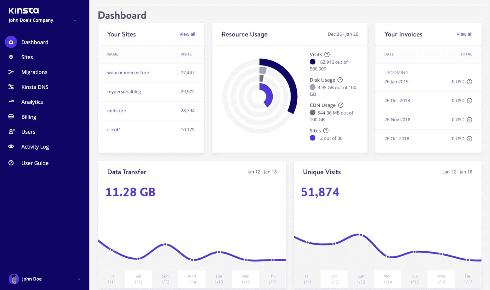

MyKinsta dashboard

*   全天候客户支持，平均票证响应时间不到五分钟
*   更快的页面加载速度

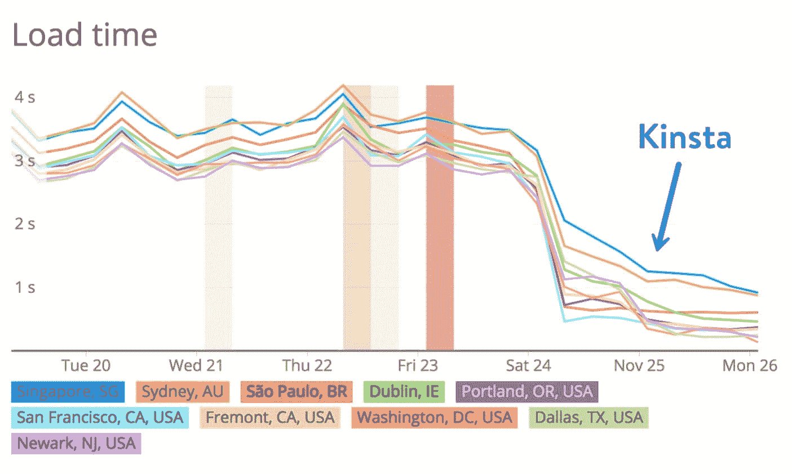

Kinsta load time comparison

*   A [防止恶意代码或检测](https://kinsta.com/secure-wordpress-hosting/) [DDoS 攻击的安全措施](https://kinsta.com/blog/what-is-a-ddos-attack/)数量

### 3.用一个伟大的主题定制你的网站外观

一旦你安装了你的 WordPress 网站，你现在需要决定它的外观。最重要的一步是选择你网站的主题。

WordPress 提供了许多伟大的免费和付费选项，其中许多将迎合目录网站。除了主题的外观之外，在决定最适合你的主题之前，还有几个其他问题值得一问:

*   主题多久维护一次？
*   [有哪些类似](https://kinsta.com/blog/best-wordpress-review-plugins/)的评论？
*   它的布局对不同的屏幕尺寸有反应吗？
*   多语言准备好了吗？
*   它会帮助你出现在谷歌搜索结果的顶部吗？
*   它会支持你的插件吗？

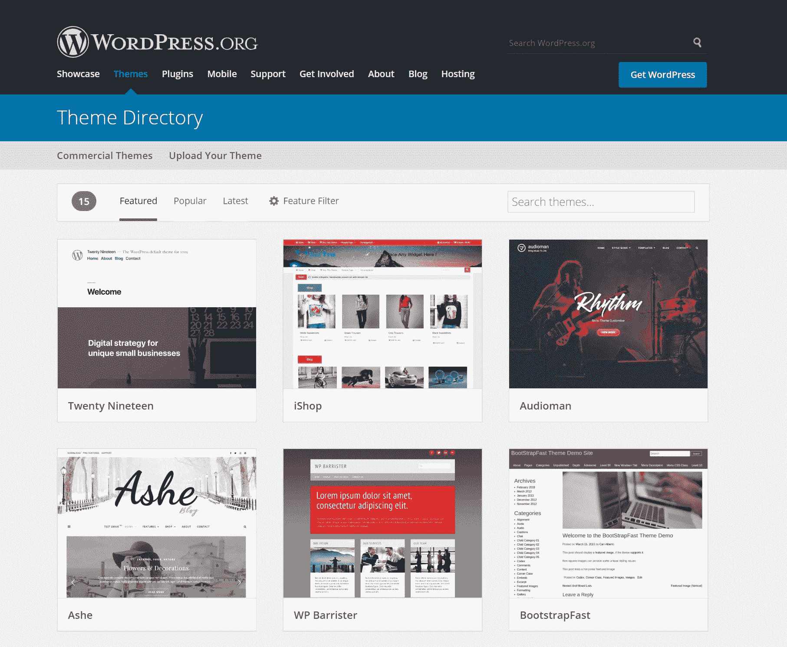

WordPress plugins directory homepage

### 4.选择插件来构建您的目录网站

快速搜索目录插件会带来大量选项。但是哪一个最好呢？无论你选择哪个插件，都需要能够帮助你快速方便地创建你需要的功能来帮助你的网站脱颖而出。

我使用[工具集目录](https://toolset.com/)来创建我的老爷车目录网站，我将在本文的剩余部分中使用它作为例子。我用[雅特](https://wpastra.com/)作为我的主题。

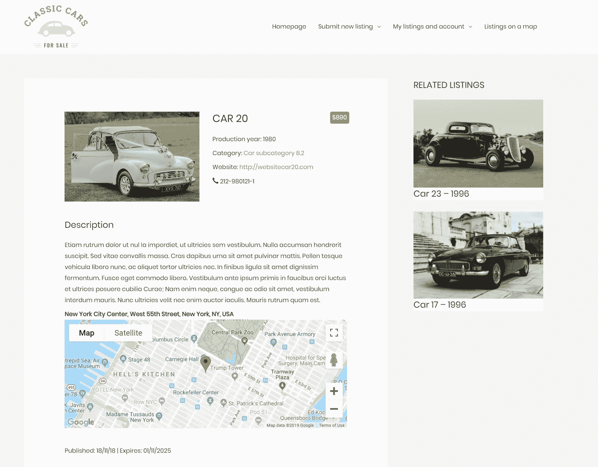

Example of a directory website built on WordPress

我使用工具集是因为:

*   它提供了所有的功能，我需要一个目录网站，不使用其他插件
*   没有必要使用 PHP 来添加这些特性
*   它兼容其他插件，如 WooCommerce、Elementor 和 WPML
*   它适用于主要主题

在我们开始浏览特性之前，请确保遵循指南[安装工具集插件以创建目录网站](https://toolset.com/learn/build-directory-classifieds-sites-using-toolset/#before-you-start-toolset-plugins-to-download)。

## 为目录网站创建功能

这些是我为我的老爷车目录网站创建的功能:

*   自定义帖子类型
*   自定义字段
*   自定义分类法
*   显示你的每一个项目的模板(在我们的例子中是老爷车)
*   搜索用户浏览我们的汽车
*   用户提交列表的前端表单

你还可以在目录网站上添加其他功能，但是根据我采访过的其他开发者的说法，这些是让你启动并运行的最重要的功能。

我们开始吧！

推荐阅读:[高级定制字段教程:你的终极指南](https://kinsta.com/blog/advanced-custom-fields/)

### 创建自定义帖子类型

自定义帖子类型允许您为网站创建不同的部分。WordPress 有两个默认部分——文章和页面。当然，我们需要一个区域来存放我们现在将要添加的老爷车。

我添加了一个名为 **Listings** 的自定义帖子类型，在这里我会展示我所有的老爷车。

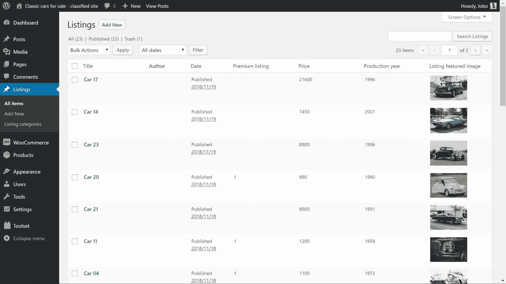

Custom post types in Toolset

1.在你的 WordPress admin 上，进入**工具集仪表板**，点击**添加新文章类型**。

2.在**名称和描述**部分输入以下内容:

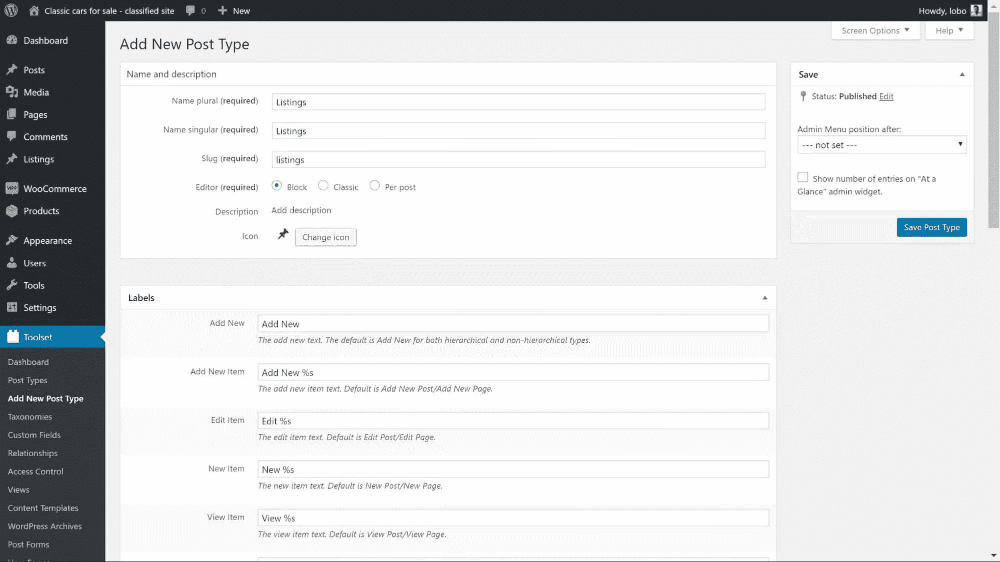

Adding new post type in Toolset

3.点击**保存文章类型**，你的文章类型就准备好了。

### 创建自定义字段

我们使用自定义字段来存储关于我们的列表的每一条信息。在我们的老爷车示例中，我们希望为用户提供他们想要了解的每辆车的信息。

这包括了解生产年份、价格、品牌、里程和许多其他信息。对于每条信息，我们需要创建一个自定义字段。这样，我们只需在编辑我们的列表时填写每个部分，它就会出现在前端(一旦我们创建了模板，我们将稍后进行)。

以下是为**生产年份**创建自定义字段的步骤:

## 注册订阅时事通讯

### 想知道我们是怎么让流量增长超过 1000%的吗？

加入 20，000 多名获得我们每周时事通讯和内部消息的人的行列吧！

[Subscribe Now](#newsletter)

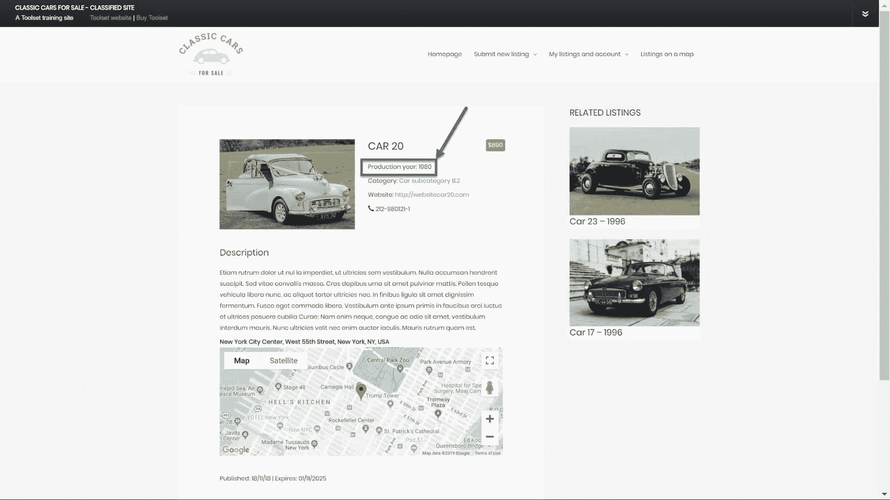

Production year as an example of custom field in Toolset

1.在**工具集仪表板**上，点击**列表**自定义文章类型旁边的**创建字段组**。

2.在下一页上，输入您的字段名称和描述(如果您认为有必要的话)。我已经为列表命名了我的**字段组。**

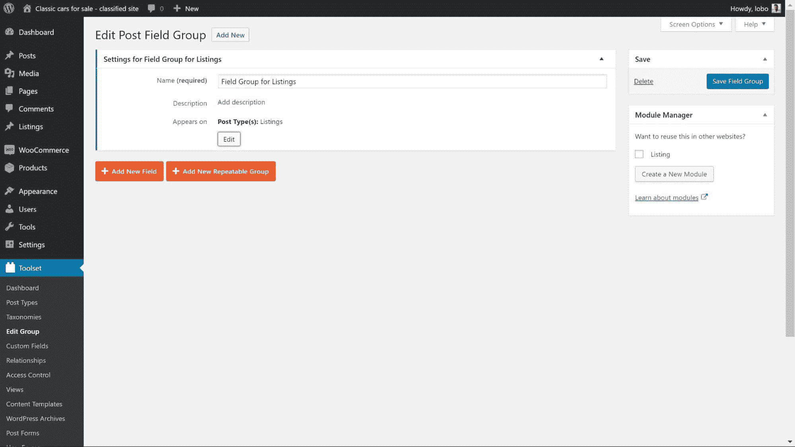

How to edit post field group in Toolset

3.点击**添加新字段**。现在，您可以看到可以添加的不同类型字段的列表。例如，如果你想添加一个网站，你可以选择**网址**，对于一个地址，你可以使用**地址**，或者一个电话号码**电话**。生产年份我们将始终显示年份，因此我们选择**数字**。

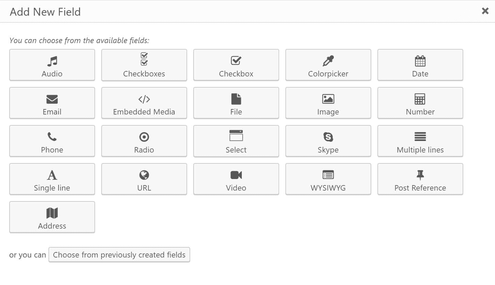

How to add a new field in Toolset

4.添加自定义字段的详细信息，包括**字段名**和**字段标记**。我把我的矿叫做**生产年份**。对于此字段，您可以忽略其余字段。

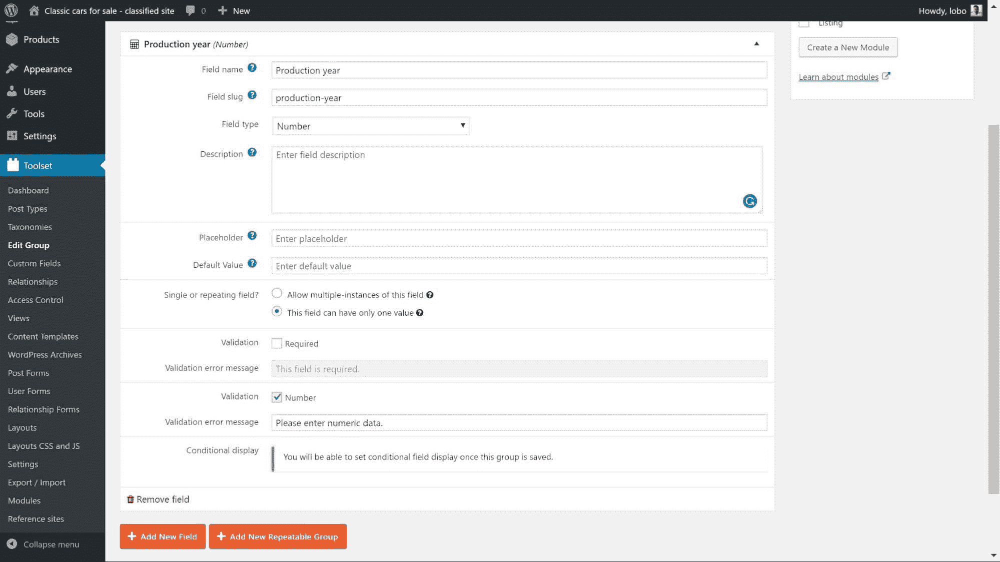

How to add details to custom fields

5.点击**保存字段组**，当你为你的自定义帖子类型编辑你的帖子时，自定义字段将会出现。

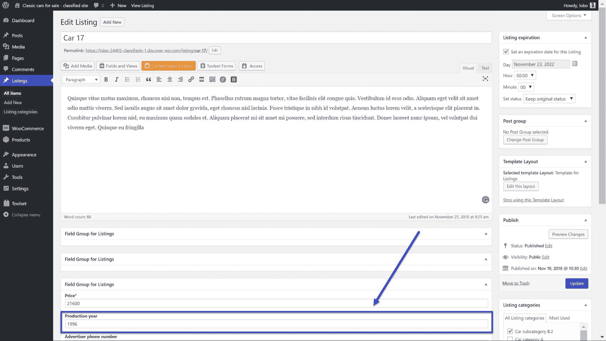

How custom fields are displayed on backend

### 创建自定义分类

我们使用[自定义分类法](https://kinsta.com/knowledgebase/what-is-taxonomy/)对我们的内容进行分类。举例来说，如果我们要列出餐馆，那么我们可以使用分类法根据菜系来区分每个列表。因此，我们可能有**印度**、**意大利**、**中国**、**汉堡**和许多其他类型的餐馆的分类。

在我的经典汽车目录示例中，我为我列出的不同类型的汽车创建了分类法。以下是我编辑我的**列表文章**时出现的类别:

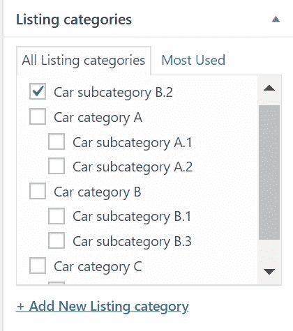

Custom taxonomies

我是这样做的:

1.在**工具集仪表板**上，点击**添加自定义分类**

2.在**名称和描述**下输入您的分类名称:

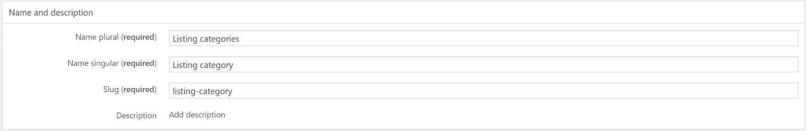

How to add custom taxonomy

3.在下一个名为**分类类型**的部分中，选择您想要的是**层次分类**还是**平面分类**。层次分类将包含一个父分类(如意大利食品)和一系列与之相关的子分类(如比萨饼、意大利面、冰淇淋)。同时，平面分类法只是一组类别。

4.选择要为哪个帖子类型分配这些分类。在我的例子中，我已经将它们分配给了**列表**自定义文章类型。

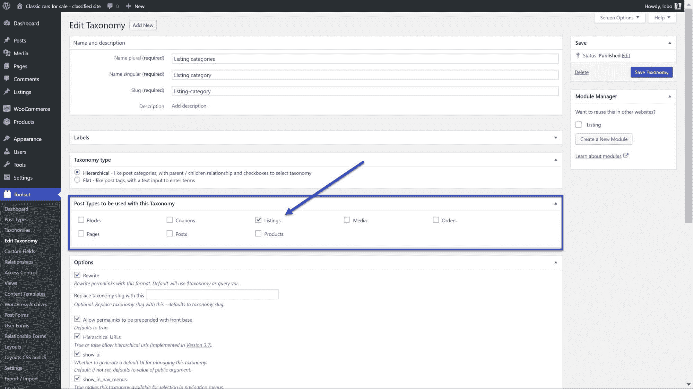

Taxonomy settings

5.点击**保存分类**

6.返回到你的**列表**文章类型，当你编辑一个文章类型或创建一个新的文章类型时，你可以开始添加你的分类术语。

7.在**【分类名称】类别**下点击**添加新的【分类名称】类别**。

8.键入新类别的名称。如果您的分类法是分层的，您还可以在这里选择是否希望它成为父类别。

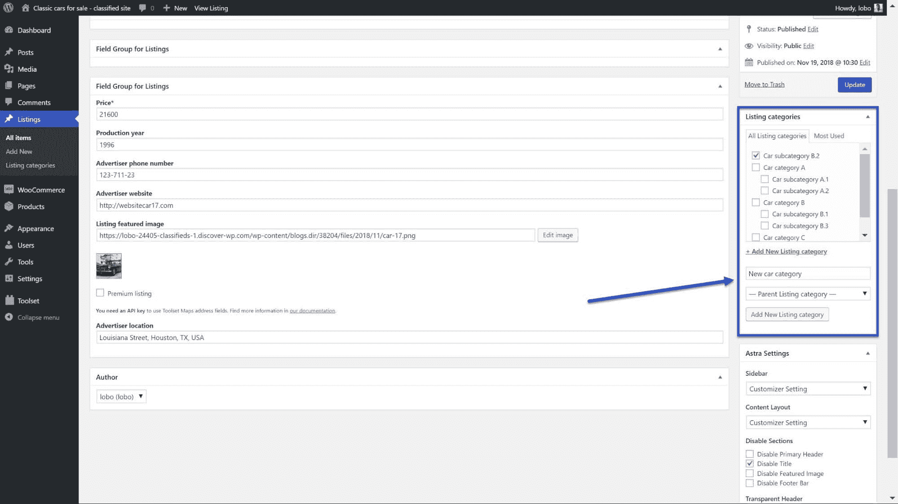

Taxonomy terms assigned to listings

现在，您可以使用复选框将分类术语分配给每个列表。

### 显示我们每个项目的模板

现在我们已经添加了自定义类型，下一个问题是如何在前端显示它？为此，我们可以为每个列表创建一个模板。

以下是我的模板在我的每一个老爷车列表前端的外观:

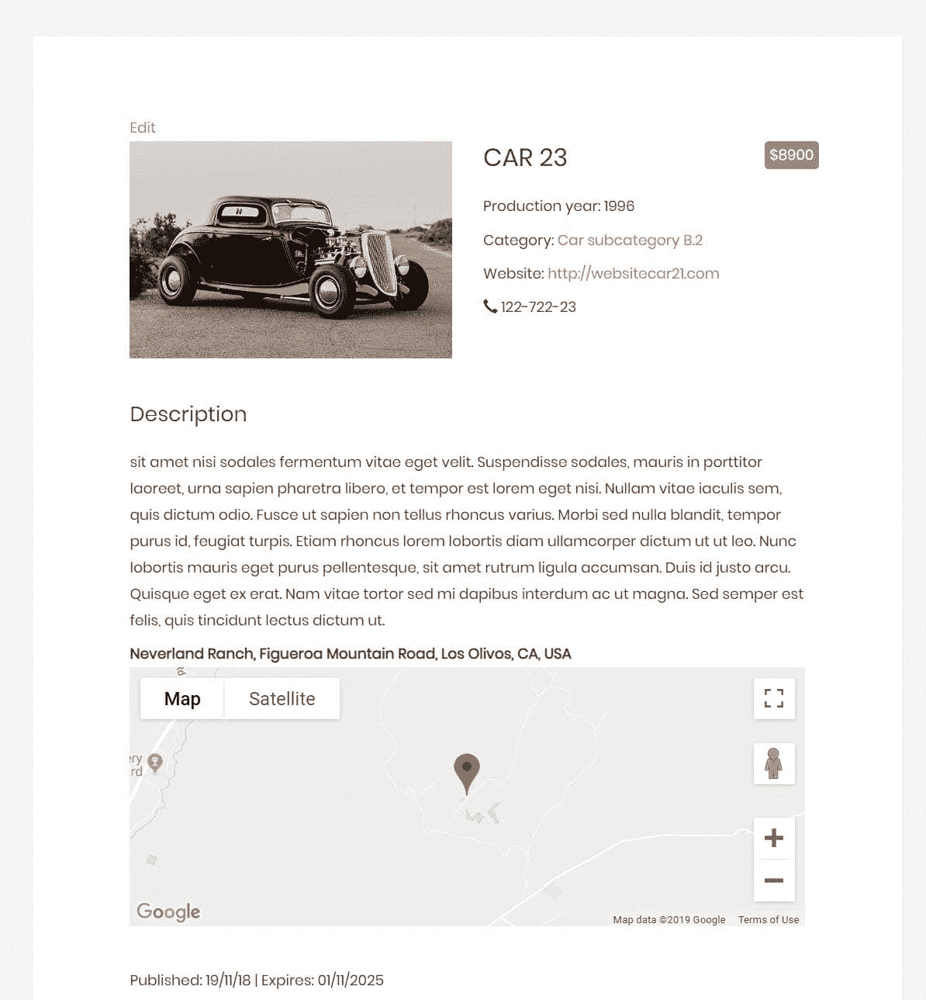

Website listings template example

1.转到**工具集仪表板**并点击您的自定义帖子类型旁边的**创建模板**。这将打开工具集布局拖放编辑器，我们可以在其中安排要显示内容的位置。

在我们继续之前，先简单解释一下布局是如何工作的，以及我们需要使用哪些单元格。

工具集布局基于[引导网格](https://getbootstrap.com/docs/3.4/)，它以 12 列的行显示您的页面。这意味着，例如，如果你想在页面的左边显示一个图像，你可以选择左边的前六列。

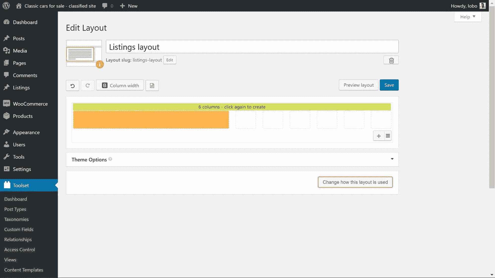

How to set up layouts

您可以使用+按钮向模板中添加更多行。

需要一个强大而可靠的主机来通过你的目录网站销售更多？Kinsta 为您提供性能优化的页面和架构。[查看我们的计划](https://kinsta.com/plans/?in-article-cta)

当您选择要在其中显示内容的单元格时，有两种类型的单元格与此特定任务相关。

*   **可视化编辑器**——为我们的定制字段和分类添加全新的文本或插入[短代码](https://kinsta.com/blog/wordpress-shortcodes/)。这是我们用来插入我们已经制作好的定制类型的一个。
*   **帖子内容**–添加来自帖子正文的任何内容。例如，在我的经典汽车的文章类型中，我将插入这个单元格来显示我在编辑页面上输入的每辆汽车的描述。

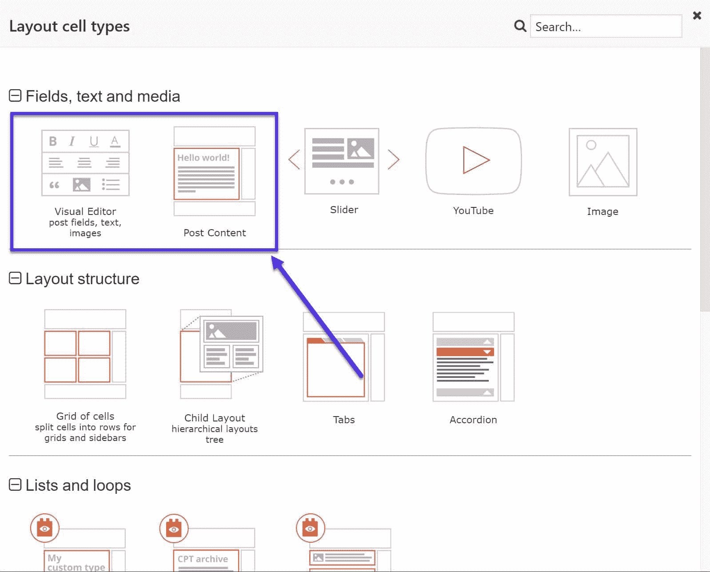

Layout cells types

现在我们可以继续了。让我们继续展示我是如何显示**生产年份**的自定义字段的，您可以在我的模板的下图中看到:

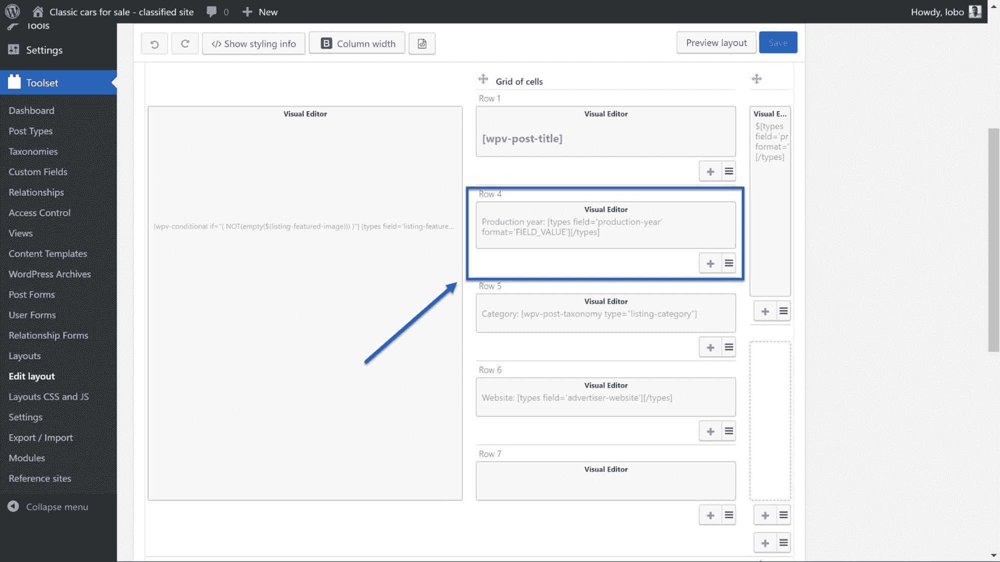

How to display custom fields with the Visual Editor

2.选择您希望单元格占据的列数——在我的例子中，我选择了四列。

3.现在，您将看到您已经熟悉的布局单元格类型列表。选择**可视化编辑器**。

4.点击**字段和视图**，您将被带到我们可以添加的短代码列表。滚动直到找到自定义字段列表的名称(在我的例子中是列表的字段组)并选择**生产年份**。

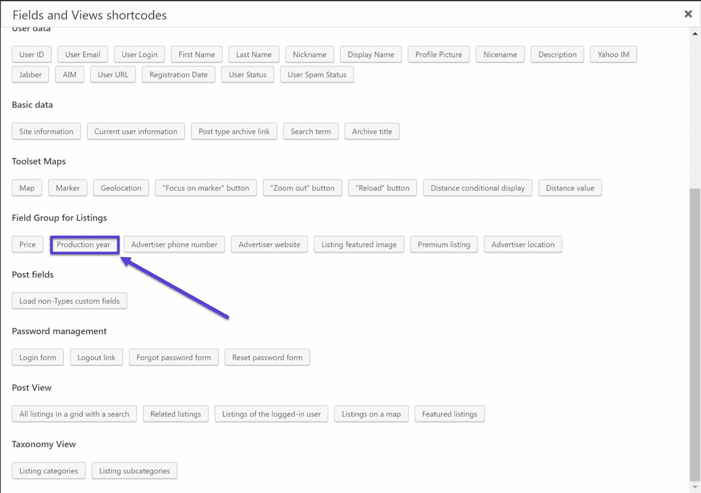

Fields and views shortcodes

5.点击**插入短代码**。

6.我们现在可以在编辑器单元格中看到短代码。这意味着用户现在可以看到他们选择的汽车的生产年份。但是现在我们需要在它旁边添加一个标题，这样用户就知道这一年意味着什么。我输入了**生产年份**和一些 HTML 来设计样式。我把简码放在下图的一个盒子里，这样你就可以看到它的样子了:

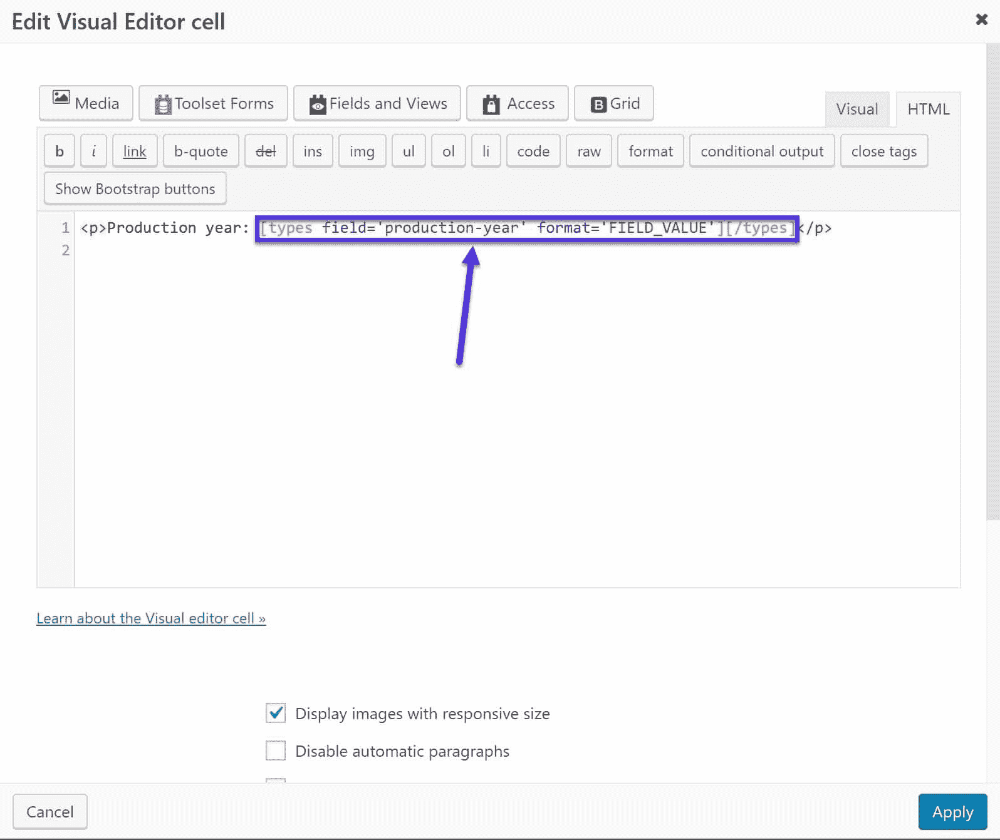

Production year being added with shortcode and some HTML

7.点击**应用**，单元格完成。

下面是自定义字段在经过一点 CSS 样式化后在前端的外观:

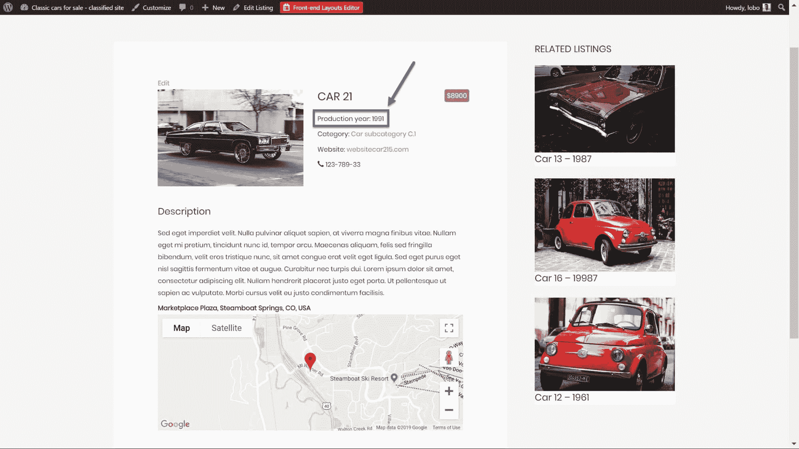

How the custom field is displayed on the frontend

### 添加搜索

我们可以创建一个具有多个过滤器的搜索工具，让用户找到他们想要的确切列表。

这是我添加到我的老爷车目录网站的搜索。我有六个过滤器，您可以在搜索栏的顶部看到:

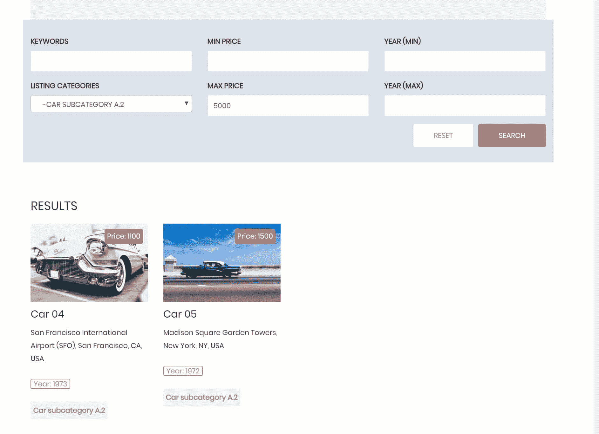

Search feature with filters

首先，你希望你的自定义搜索去哪里？你可以把它显示在你的主页上，在它自己的页面上，在一个小工具里或者在一个档案里。

我在主页上添加了我的自定义搜索。我是这样做的:

1.在**工具集>布局**下创建一个新模板，点击添加一个单元格。

2.选择**视图的**单元格

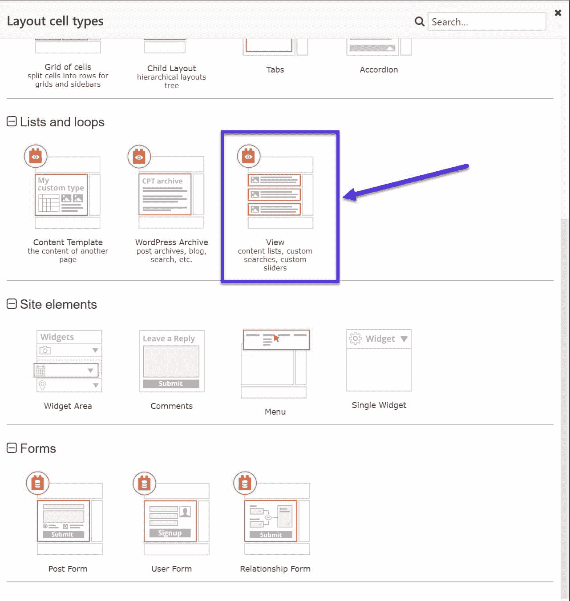

Search results page layout

3.在下一页上，选择**将结果显示为自定义搜索**选项，然后单击创建。

4.在**内容选择**下，选择您想要搜索的内容。在我的例子中，我将选择**列表**文章类型。

5.在**自定义搜索设置**下，选择搜索更新结果的方式。例如，您可以在其他选项中选择 AJAX updates(更新结果而无需重新加载页面)。

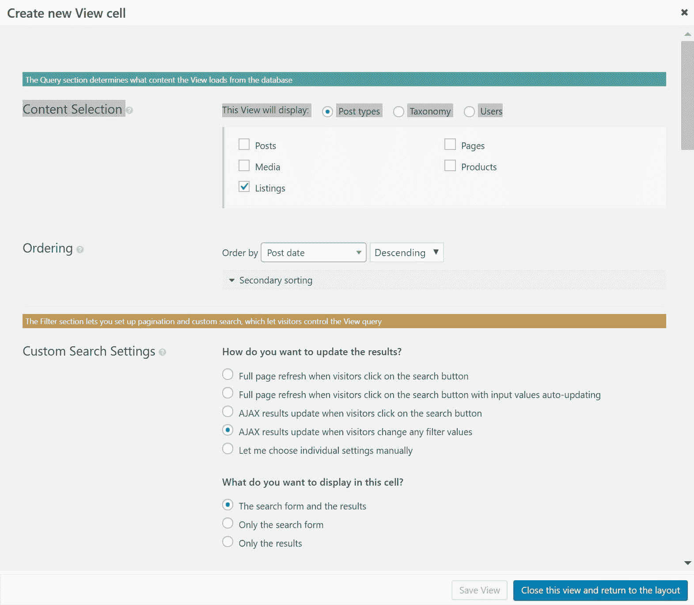

Custom search settings

6.在**搜索和分页**下，您可以为您的搜索添加过滤器，用户将利用这些过滤器来缩小搜索结果的范围。这些可以包括自定义字段、分类和帖子关系。例如，我使用我的**价格**定制字段向我的搜索添加一个**最低价格**和**最高价格**过滤器。点击**新过滤器**并搜索您想要过滤的自定义字段(在我的例子中是价格)。

Add new custom search filters as shortcodes

7.在下一个页面上，选择如下图所示的选项，然后点击**插入短代码**。这是我添加过滤器后**搜索和分页**的样子。过滤器开箱后看起来很好，但我添加了一点 HTML 和 CSS 进行造型。

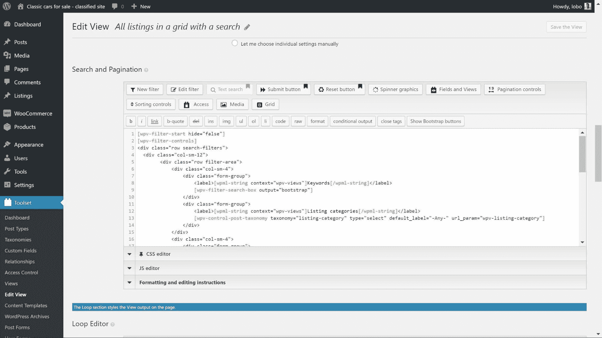

Search and pagination with filters and HTML

8.点击**提交按钮**添加用户点击查看结果的按钮。

9.点击**重置按钮**添加一个按钮，允许用户重置他们的过滤器。

我们的搜索已经准备好了。我们现在需要做的就是设计我们的结果。

### 设计搜索结果

我们可能已经设计了我们的自定义搜索，但我们仍然需要决定如何显示我们的结果。我们可以在创建搜索的同一个页面上完成这项工作。

在**搜索和分页**下面，我们可以找到另一个叫做**循环编辑器**的部分，在这里我们可以设计结果的输出。

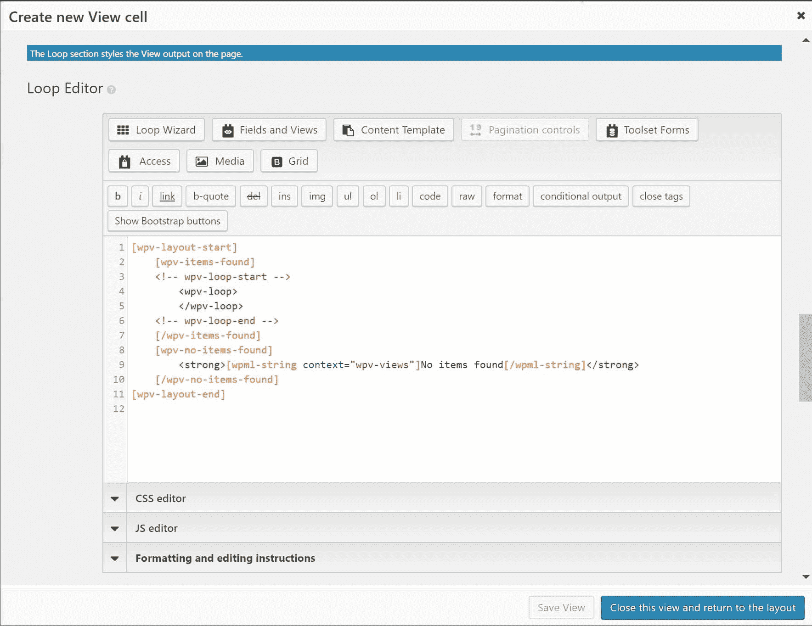

The loop editor

1.点击**循环向导**并选择您想要如何显示循环。对于我的老爷车目录网站，我使用了有四列结果的**引导网格**。

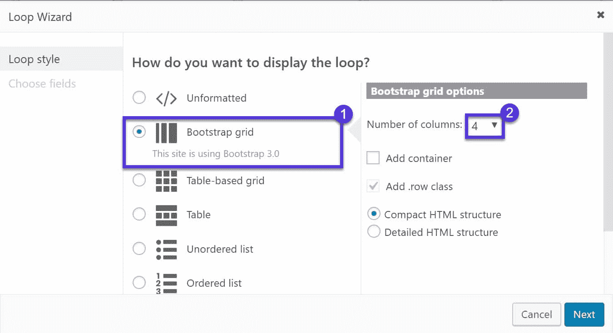

The loop wizard window

2.在下一页，我们可以添加将作为结果的一部分显示的过滤器。以下是我为我的老爷车目录网站添加的过滤器。

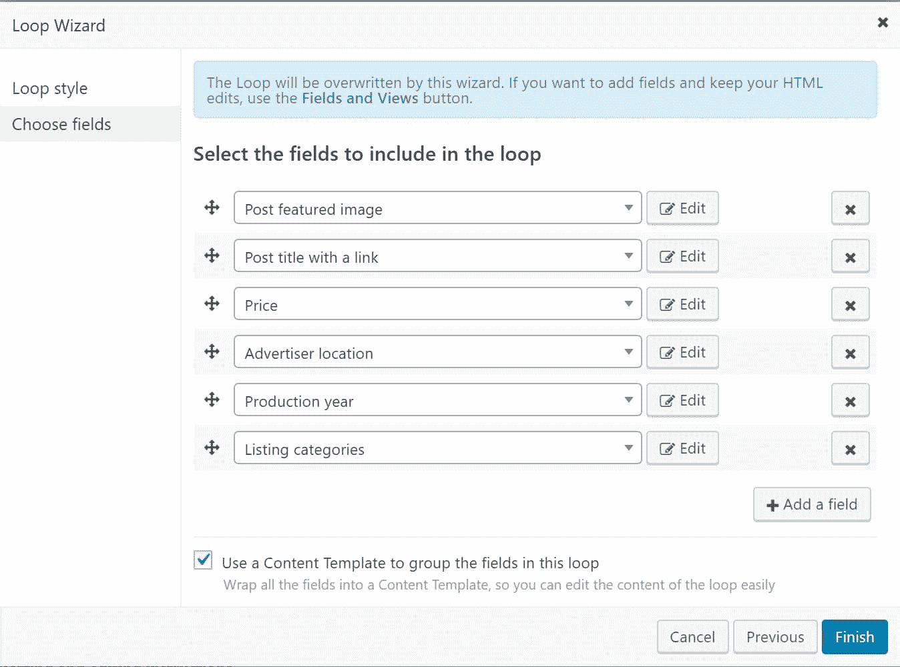

Setting up filters for the search results

3.点击**完成**。现在你应该在**循环编辑器**中看到你的字段。

How the loop editor looks with fields

4.点击页面底部的**保存视图**。

5.点击**保存**在你的布局上，它现在为前端准备好了。

这是我的样子:

Search layout example

### 创建前端表单

前端表单是一种很好的方式，用户可以根据自己的风格和格式添加列表。所有他们需要做的是填写并提交表格，它可以出现在前端。

下面是我为自己的经典汽车目录网站创建的一个表单示例:

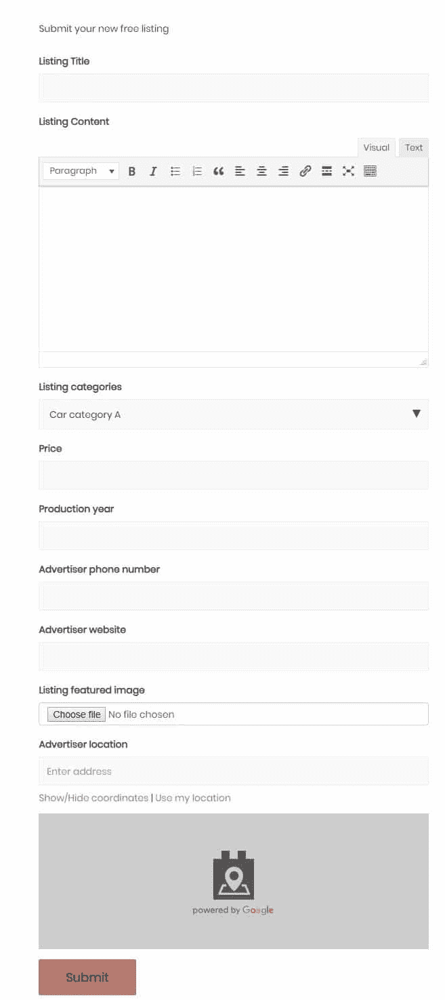

Front-end form example

一旦用户填写了它，这就是列表在前端的外观:

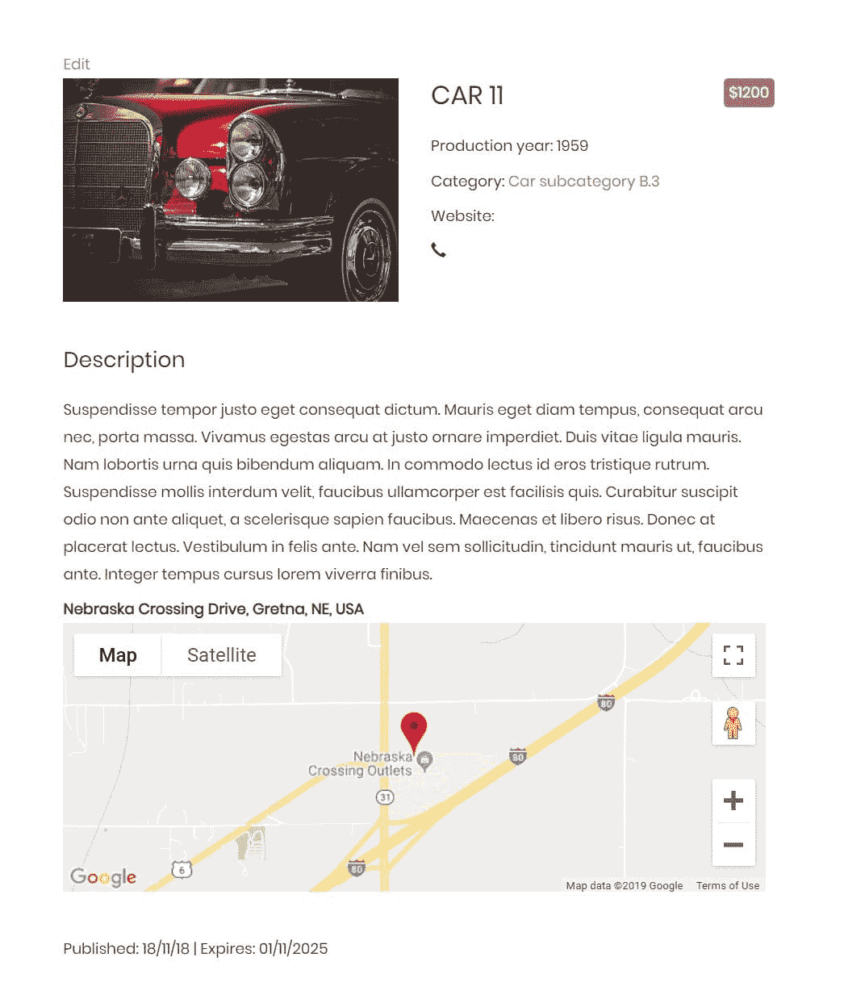

Cars listing template example

我是这样做的:

1.进入**工具集>发布**表单，点击**添加新的**。

2.将出现工具集向导。点击**继续**并输入表格的标题。

3.在**设置**部分填写适用于您的表单的详细信息。在这里，您可以决定用户提交表单后看到的页面，列表是立即发布还是作为草稿发布，以及帖子是否过期。以下是我为自己设定的目标:

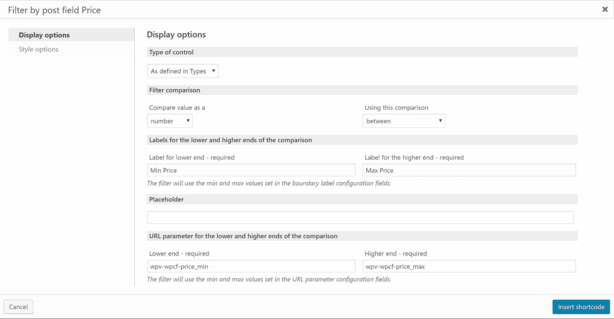

Display options for your front-end form

4.使用 Toolset 的表单拖放编辑器来决定您希望用户填写哪些字段。你也可以添加额外的元素，而[风格是使用 CSS](https://kinsta.com/blog/wordpress-css/) 。这是我的样子:

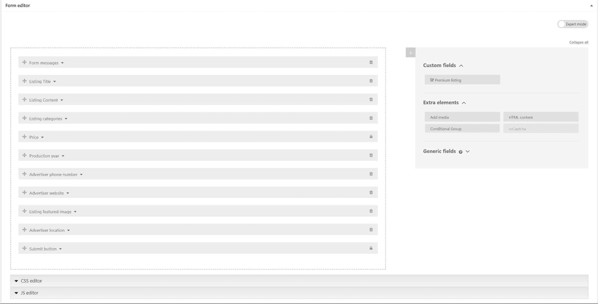

Form editor fields

5.最后一步允许您编辑提交表单时目录网站的用户和管理员收到的电子邮件通知。下面是一个例子，我创建了一个通知名单时，他们的职位已被审查，是活的。

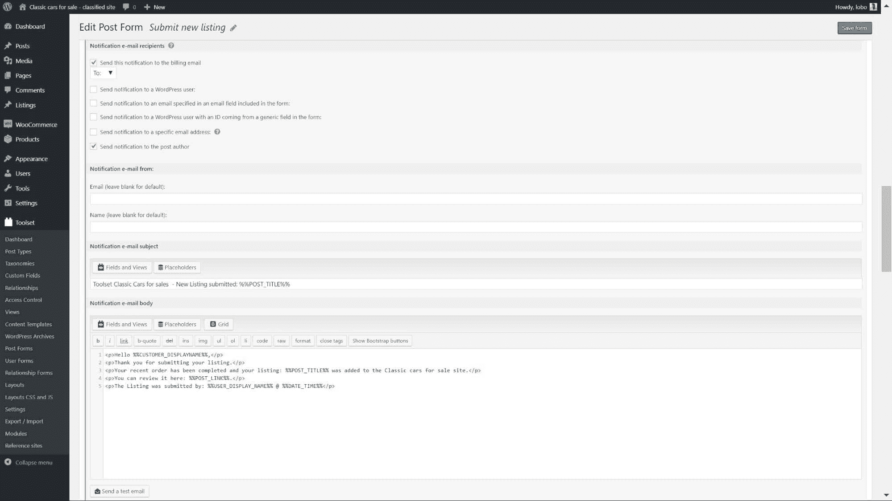

Email notifications settings page

当然，如果需要的话，你可以添加额外的电子邮件给其他人。

6.现在是在前端显示表单的时候了。就像其他内容一样，我将把它作为一个单元格添加到我的一个布局中。进入**工具集>布局**，创建一个新布局，点击插入一个单元格。

7.点击**发文表格**单元格，点击**创建单元格**。

**保存**你的布局，现在你可以在前端看到你的表单。

## 摘要

正如我之前提到的，还有更多的功能，如地图、会员区和相关列表，您可以将它们添加到目录网站中。但是这些是你需要在尽可能短的时间内开始的核心。

你有什么创建目录网站的技巧？在 [@Kinsta](https://twitter.com/kinsta) 发推文，我们将分享最好的见解！或者在评论中把它们放在下面。

* * *

让你所有的[应用程序](https://kinsta.com/application-hosting/)、[数据库](https://kinsta.com/database-hosting/)和 [WordPress 网站](https://kinsta.com/wordpress-hosting/)在线并在一个屋檐下。我们功能丰富的高性能云平台包括:

*   在 MyKinsta 仪表盘中轻松设置和管理
*   24/7 专家支持
*   最好的谷歌云平台硬件和网络，由 Kubernetes 提供最大的可扩展性
*   面向速度和安全性的企业级 Cloudflare 集成
*   全球受众覆盖全球多达 35 个数据中心和 275 多个 pop

在第一个月使用托管的[应用程序或托管](https://kinsta.com/application-hosting/)的[数据库，您可以享受 20 美元的优惠，亲自测试一下。探索我们的](https://kinsta.com/database-hosting/)[计划](https://kinsta.com/plans/)或[与销售人员交谈](https://kinsta.com/contact-us/)以找到最适合您的方式。