# Google AMP 案例研究–销售线索下降了 59%(如何禁用)

> 原文：<https://kinsta.com/blog/disable-google-amp/>

如果你运行一个 WordPress 网站，你可能已经考虑过是否应该为移动设备安装新的 Google AMP。我们在金斯塔也遇到了同样的困境，并最终测试了一段时间。最终，我们没有看到好的结果，这最终损害了我们在移动设备上的转化率。

所以今天我们将深入探讨如何在你的博客上禁用 Google AMP，以及如何安全地做到不出现 404 错误或损害你的 SEO。简单地关闭 AMP 插件可能会对你的网站造成伤害，所以要小心。好消息是下面提到的两种方法都不需要 WordPress 开发者，并且可以在几分钟内完成！

*   [什么是 Google AMP？](#google-amp)
*   [如何禁用谷歌放大器](#disable-google-amp)
*   [监控重新索引](#reindexing)

## 谷歌放大器

Google AMP (加速移动页面项目)最初于 2015 年 10 月启动。该项目依赖于 AMP HTML，这是一个完全基于现有网络技术构建的新的开放框架，允许网站构建轻量级网页。简单地说，它提供了一种方法来提供你当前网页的精简版本。你可以在我们关于 [Google AMP](https://kinsta.com/blog/google-amp/) 的深度文章中读到更多，也可以比较所有的利弊。


### 为什么谷歌放大器对我们不起作用

由于围绕 Google AMP 的大肆宣传，我们决定在我们的 Kinsta 网站上尝试一下。你永远不会真正知道会发生什么，直到你测试一些东西。所以我们让它运行了两个月，这是我们得出的结论。注意:这可能在几乎每个行业都有所不同，所以我们强烈建议在得出结论之前在您自己的站点上进行测试。测试这一点的几种方法包括:

*   前后在谷歌搜索控制台看数据。
*   将您的/amp/URL 上的 [Google Analytics](https://kinsta.com/blog/google-search-console-vs-google-analytics/#google-analytics-overview) 数据与之前和之后的有机流量中的原始 URL 进行比较。

以下是我们网站启用 AMP 期间的一些数据。


> 需要在这里大声喊出来。Kinsta 太神奇了，我用它做我的个人网站。支持是迅速和杰出的，他们的服务器是 WordPress 最快的。
> 
> <footer class="wp-block-kinsta-client-quote__footer">
> 
> 
> 
> <cite class="wp-block-kinsta-client-quote__cite">Phillip Stemann</cite></footer>

[View plans](https://kinsta.com/plans/)

#### Google AMP 位置

正如你所看到的，在启用 Google AMP 并给他们时间建立索引后，我们明显看到移动平台上 SERPs 的平均仓位有所下降。

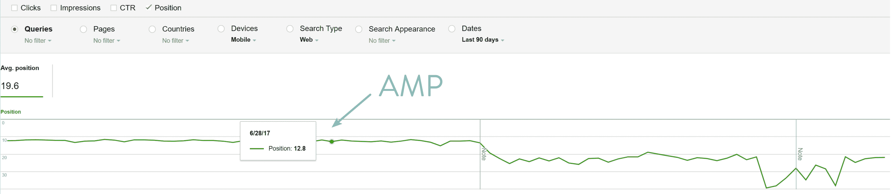

Google AMP positions data


#### 谷歌中心

启用 Google AMP 后，我们看到手机点击率有所下降。

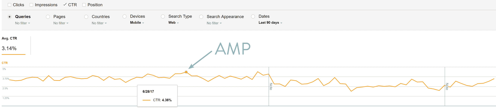

Google AMP CTR


#### 谷歌放大器印象

启用 Google AMP 后，我们确实看到了更多的印象。

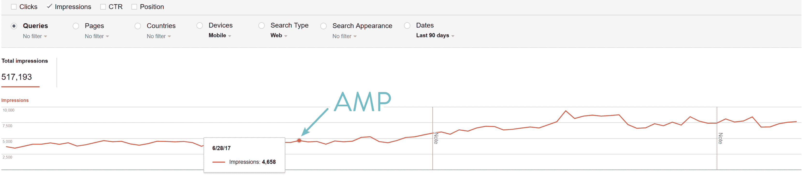

Google AMP impressions


#### 谷歌点击量

启用 Google AMP 后，我们看到总点击量略有增加。

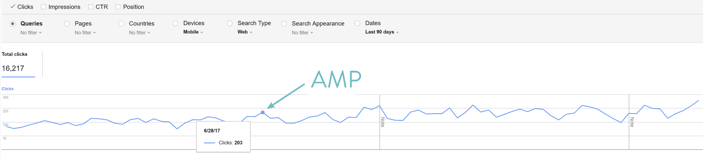

Google AMP clicks


所以对我们来说，上面的数据有好有坏。然而，最重要的部分是在 Google Analytics 中查看 AMP 启用时的[数据:](https://kinsta.com/blog/how-to-use-google-analytics/#how-to-use-google-analytics-reports)

*   我们的移动领先优势**下降了 59.09%。**
*   我们的简讯电子邮件移动注册量**下降了 16.67%。**
*   我们通过移动设备创建的账户**下降了 10.53%。**

因此，我们认为 Google AMP 不适合我们的商业模式。那么，为什么我们没有看到好的结果，而其他人却看到了呢？嗯，可能最大的原因之一是我们的网站在移动设备上已经很快了。因此，我们没有看到速度的大幅提升，而其他一些广告密集的网站可能会出现这种情况。据[谷歌](https://www.thinkwithgoogle.com/data-gallery/detail/cellular-network-connections-slow-speeds/?_ga=2.112469261.844716967.1504916348-137139932.1504916348)称，到 2020 年，全球 70%的蜂窝网络连接将以 3G 或更慢的速度进行。因此，尽管针对移动设备进行优化非常重要，但那些已经有了优化网站的人可能不会注意到巨大的差异。

另一个原因是**我们不发布新闻**。许多大型出版物都在使用 AMP，并利用 SERPs 中的传送带。许多大公司，如华盛顿邮报、Gizmodo 和 Wired 都见证了谷歌 AMP 的巨大进步，但这些都是以新闻为导向和广告为主的内容网站。当然，我们发布了很多内容，但我们的主要重点仍然是挖掘潜在客户和注册客户。

我们是否可以对放大器装置进行更多的转换率优化？大概是的。有多种方法可以添加 CTA、时事通讯注册等。我们确实对此进行了优化。但是在看到上面的转换数据后，单独管理 Google AMP 是不值得的，这可能是一种痛苦，只是为了有一个稍微更快的移动网站。此外，Kinsta 博客的许多流量和受众一开始就不是来自移动设备，所以我们决定禁用 Google AMP。

此外，目前 AMP 还没有带来 SEO 的好处，除非你是一个试图在 SERPs 中为 carousel 评分的新闻网站。我们分析了我们的移动排名，在 AMP 被完全移除后，我们的排名实际上上升了。再说一次，这可能是自然发展的结果。但是**我们没有看到运算放大器**的 SERPs 增加。如果你的站点开始时速度很慢，尽管你可能会这样做，所以我们总是建议在你自己的站点上进行测试。

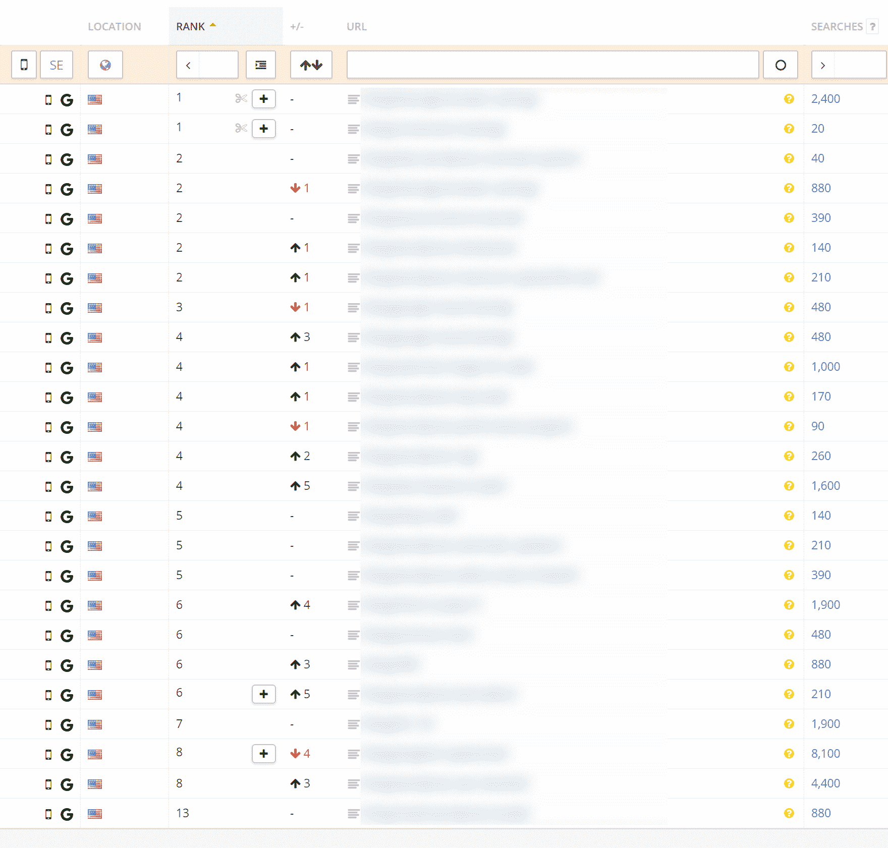

mobile rankings after removing AMP


其他品牌也没有看到移除 AMP 的有害影响，并且像我们一样，实际上看到了改进。在抛弃谷歌之后,《局外人》杂志的每次访问浏览量增加了 13%。
T3】

## 如何禁用谷歌放大器

有几种不同的方法可以禁用谷歌放大器。谷歌有关于如何从谷歌搜索中移除 AMP 的官方文档。不过这有一个大问题，那就是它通常需要开发人员，而且他们的说明对 WordPress 并不友好。他们的第一步是从规范的非 AMP 页面中删除 rel="amphtml "链接，同时仍然保留 AMP 页面。谢天谢地，虽然有一些不同的方法来实现这一点，而不损害你的搜索引擎优化。你不想简单地禁用谷歌 AMP 插件，因为这将**导致 404 页**。

### 选项 1–搜索和替换(正则表达式)

第一个选项涉及使用搜索和替换插件删除 rel="amphtml "代码，同时不对 AMP 页面进行索引。我们要感谢最初发布这个策略的 Gulshan Kumar。这假设你正在使用免费的 WP 插件。

#### 第一步

首先，你需要下载并安装免费的 WordPress [实时查找和替换插件](https://wordpress.org/plugins/real-time-find-and-replace/)。这个插件最棒的一点是它不会修改你的 [WordPress 数据库](https://kinsta.com/knowledgebase/wordpress-database/)或网站，所以在你的网站上使用它是非常安全的，不用担心会破坏任何东西。基本上，它会找到并替换在 WordPress 生成页面之后，但在发送到用户浏览器之前执行的规则。

如果你是一个开发者，你当然可以做一个[普通搜索并替换](https://kinsta.com/knowledgebase/wordpress-search-and-replace/)。我们通常会建议对数据库进行长期更改，但在这种情况下，在重新索引时暂时删除 AMP 代码会非常有效。这也意味着你可以很容易地做到这一点，没有开发人员。虽然我们一直建议还是带个备份！

[](https://wordpress.org/plugins/real-time-find-and-replace/)

Real-Time Find and Replace WordPress Plugin


该插件目前有超过 90，000+的活跃安装，五星评级为 4.5。你可以从 [WordPress 知识库](https://wordpress.org/plugins/real-time-find-and-replace/)下载它，或者在你的 WordPress 仪表盘的“添加新插件”下搜索它。
T3】

#### 第二步

点击 WordPress 仪表盘工具下的实时查找和替换。单击“Add”并将以下代码添加到 Find:字段中:

## 注册订阅时事通讯


### 想知道我们是怎么让流量增长超过 1000%的吗？

加入 20，000 多名获得我们每周时事通讯和内部消息的人的行列吧！

[Subscribe Now](#newsletter)

```

```

单击“RegEx”旁边的框，然后单击“更新设置”这将取代/删除重要的 AMP 标签，因为谷歌建议你在规范的非 AMP 页面和/或帖子上使用。

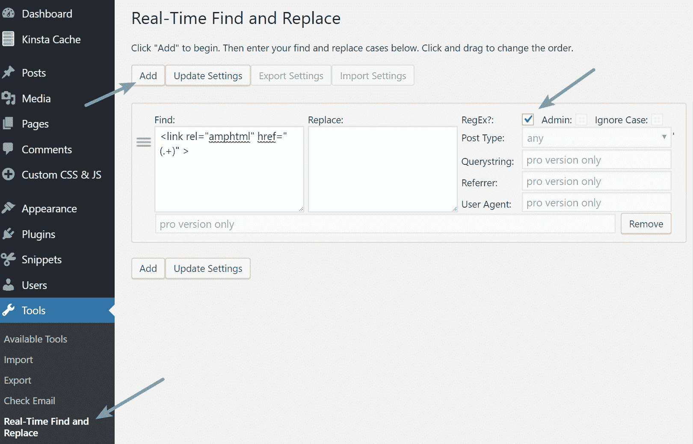

Regex in Real-time find and replace


#### 第三步

下一步是将 AMP 页面标记为无索引。点击进入 WP 选项面板和“搜索引擎优化”部分的放大器。在 Head 部分的附加标签中输入以下代码，然后点击“保存更改”

```
<meta name="robots" content="noindex,follow"/>
```

这将告诉谷歌不再在搜索中索引你的 AMP 页面，因此它将开始重新索引你的移动原始 URL。

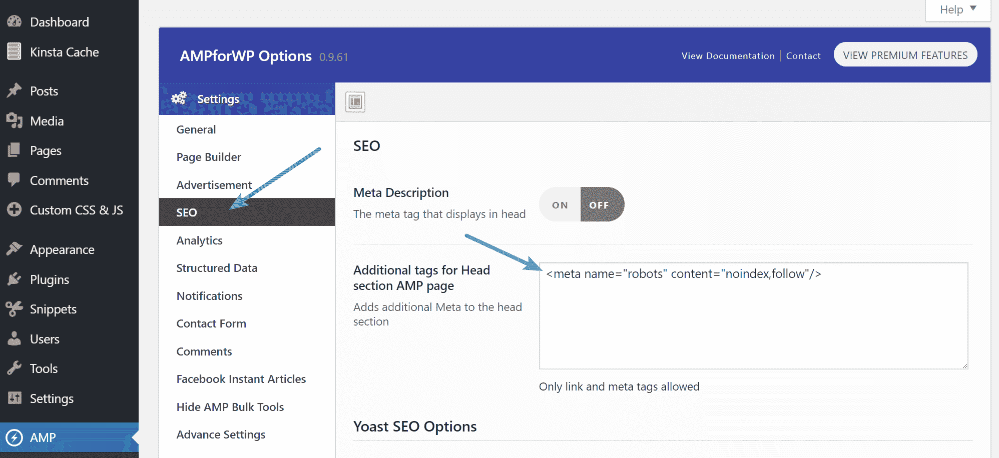

No-index Google AMP pages


我们建议保持 AMP 插件启用，直到你的所有 AMP 帖子/页面都被重新索引到原始 URL。

#### 第四步

为了安全起见，我们还建议遵循下面选项 2 中的 301 重定向！

### 选项 2–禁用和添加重定向

第二个选项有点混乱，但我们也看到了这个工作得很好。只有当您在实施上述方法时遇到任何问题时，我们才建议您使用此选项。这包括简单地禁用 AMP 插件和添加 301 重定向。感谢 WP 的 [AMP 最初发布这个。](https://ampforwp.com/tutorials/article/fix-404-on-amp/)

#### 第一步

第一步是简单地为所有有 AMP URL 的内容添加 301 重定向。首先，你需要下载并安装免费的 WordPress [重定向插件](https://wordpress.org/plugins/redirection/)。你可以使用你自己的重定向解决方案或插件，但是我们推荐这个的原因是因为你需要一个支持正则表达式的。你可以在所有东西都被重新索引后卸载插件。

Struggling with downtime and WordPress problems? Kinsta is the hosting solution designed to save you time! [Check out our features](https://kinsta.com/features/)

[](https://wordpress.org/plugins/redirection/)

Redirection WordPress plugin


该插件目前有超过 100 万个活跃安装，评分为 4/5 星。你可以从 [WordPress 知识库](https://wordpress.org/plugins/redirection/)下载它，或者在你的 WordPress 仪表盘的“添加新插件”下搜索它。

#### 第二步

点击你的 WordPress 仪表盘工具下的重定向。然后将以下代码添加到 Source URL 字段，并确保选中“Regex”框:

```
/(.*)\/amp
```

然后将以下内容添加到目标 URL 字段(用您自己的更新域):

```
https://yourdomain.com/$1
```

确保选择了重定向，然后单击“添加重定向”

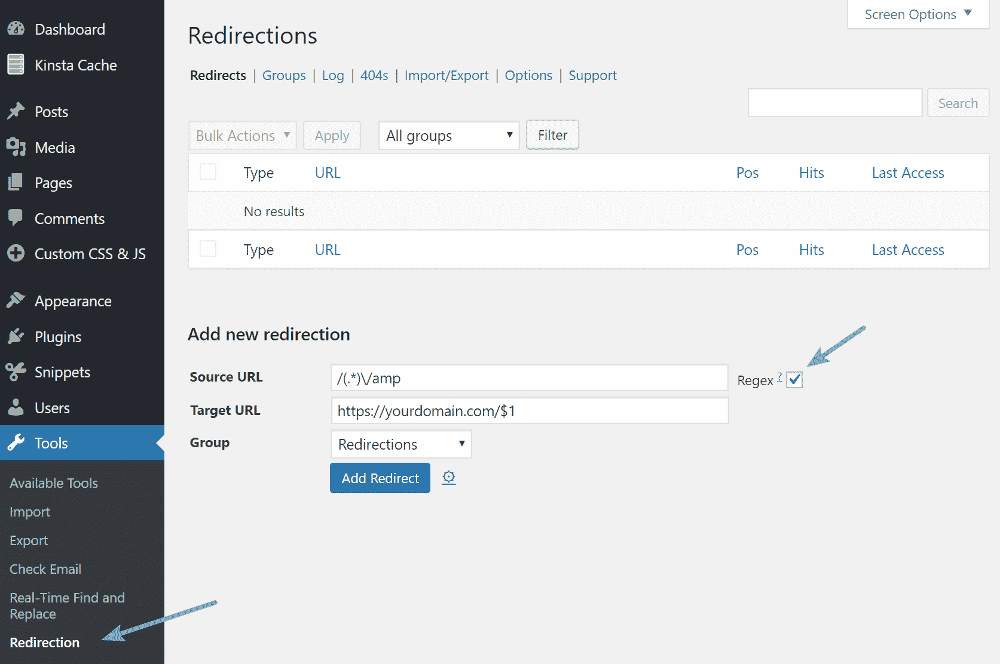

Redirections regular expression


添加后，我们建议浏览您的 AMP 博客帖子或页面，并测试以确保它们正确重定向。此外，如果您是 Kinsta 的客户，您可以跳过安装上述插件，只需从 MyKinsta 仪表板中的重定向工具添加全局重定向即可。我们的工具支持正则表达式。

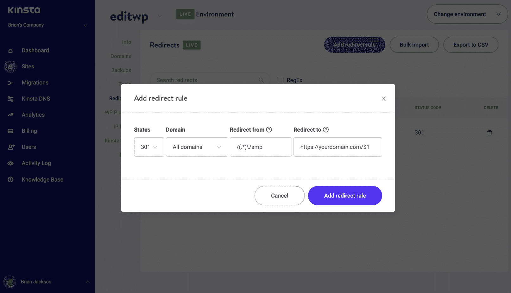

Google AMP redirect in MyKinsta dashboard


或者，如果您运行的是 [Apache](https://kinsta.com/knowledgebase/what-is-apache/) ，您也可以在您的[顶部添加以下内容。htaccess 文件](https://kinsta.com/knowledgebase/wordpress-htaccess-file/):

```
# Redirect from AMP to non-AMP path
RewriteEngine On
RewriteCond %{REQUEST_URI} (.+)/amp(.*)$
RewriteRule ^ %1/ [R=301,L]
```

#### 第三步

然后，您可以停用和卸载 WP 插件的放大器。

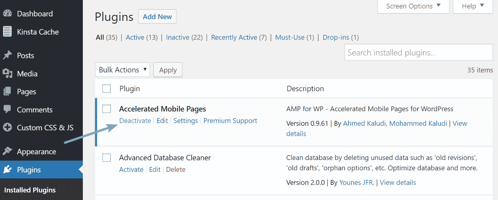

Deactivate AMPforWP plugin


请务必查看我们下面的附加提示，以监控重建索引过程。

## 监控重建索引

你可以在[谷歌搜索控制台](https://kinsta.com/blog/google-search-console/)的“搜索外观>加速移动页面”下监控移除谷歌放大器的进度正如你在下面看到的，当我们实施上述策略的时候，我们的 AMP URLs 开始去索引。你也可以尝试重新提交你的站点地图文件来加速这个过程。根据您索引的 AMP 页面数量，此过程可能需要几天到几周的时间。

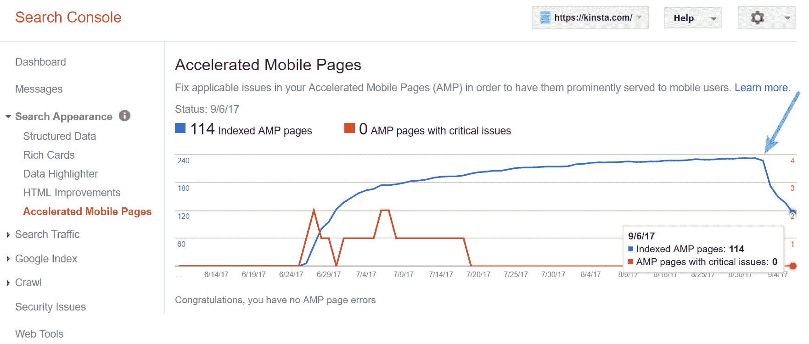

我们还建议利用关键字排名跟踪工具。例如，我们在 Kinsta 使用 [Accuranker](https://www.accuranker.com/) 监控我们的桌面和移动关键词。它让我们很容易地看到每个关键字的历史，以及移动设备上的/amp/ URLs 被重新索引到原始 URL。这可以是一种快速简单的方法来验证一切进展顺利。

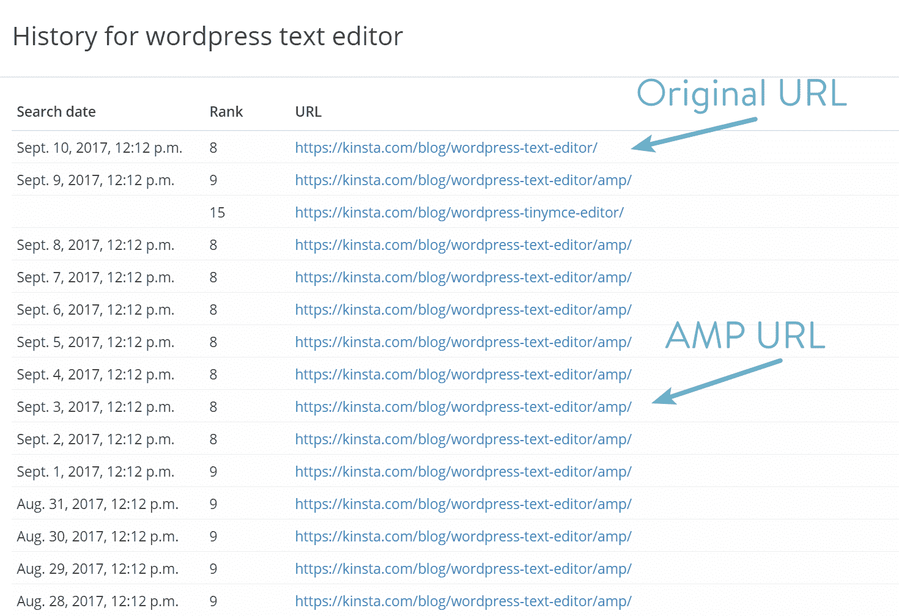

re-indexing Google AMP keywords


## 摘要

我们都喜欢速度更快的移动网站，我们为谷歌努力让网络变得更好而喝彩。但是正如我们上面所讨论的，也许你没有看到你所希望的 Google AMP 的结果。我们总是建议测试它，因为它可能因行业而异。你的网站获得的移动流量也会极大地影响你的搜索结果。

我们不是唯一与 AMP 有问题的人。摇滚明星程序员在他们的网站上测试 AMP 后，发现他们的转化率下降了 70%。

值得庆幸的是，如果你想回到原来的设置，有简单的方法可以禁用谷歌放大器。以上两个选项都不需要开发人员，将确保您的访问者不会看到讨厌的 404 错误，同时保留您在 SERPs 中的排名。

在尝试禁用 Google AMP 时，您有任何问题或遇到过自己的问题吗？如果是这样的话，我们很乐意在下面的评论中听到它们。

* * *

让你所有的[应用程序](https://kinsta.com/application-hosting/)、[数据库](https://kinsta.com/database-hosting/)和 [WordPress 网站](https://kinsta.com/wordpress-hosting/)在线并在一个屋檐下。我们功能丰富的高性能云平台包括:

*   在 MyKinsta 仪表盘中轻松设置和管理
*   24/7 专家支持
*   最好的谷歌云平台硬件和网络，由 Kubernetes 提供最大的可扩展性
*   面向速度和安全性的企业级 Cloudflare 集成
*   全球受众覆盖全球多达 35 个数据中心和 275 多个 pop

在第一个月使用托管的[应用程序或托管](https://kinsta.com/application-hosting/)的[数据库，您可以享受 20 美元的优惠，亲自测试一下。探索我们的](https://kinsta.com/database-hosting/)[计划](https://kinsta.com/plans/)或[与销售人员交谈](https://kinsta.com/contact-us/)以找到最适合您的方式。