# 在 WordPress 中检查磁盘使用情况的 8 种简单方法(查找大文件和数据)

> 原文：<https://kinsta.com/blog/disk-usage-wordpress/>

说到虚拟主机，没有“无限”的磁盘空间或带宽。[共享 WordPress 主机](https://kinsta.com/knowledgebase/shared-vps-dedicated-hosting/)通常会宣传这一点，但如果你阅读他们的服务条款(TOS ),就会发现在幕后仍有一些限制。随着时间的推移，你的 WordPress 站点会增长得非常快，最终，你可能会达到你的极限，不管是 5 GB 还是 20 GB。

如果你达到了神奇的“无限”限额，这通常是一封来自你的主机的电子邮件，说你滥用他们的服务条款。所以今天我们将和你分享一些在 WordPress 中检查磁盘使用情况的方法，这样你就可以清理你的站点了。有很多服务器命令可以让你这样做，但是我们将把重点放在一些简单的方法上，这些方法适用于那些不习惯使用 SSH 的人。

[Your website grows bigger every day. Here are 8 easy ways to check disk usage in WordPress. Find those large files and DB tables! 🗑️Click to Tweet](https://twitter.com/intent/tweet?url=https%3A%2F%2Fkinsta.com%2Fblog%2Fdisk-usage-wordpress%2F&via=kinsta&text=Your+website+grows+bigger+every+day.+Here+are+8+easy+ways+to+check+disk+usage+in+WordPress.+Find+those+large+files+and+DB+tables%21+%F0%9F%97%91%EF%B8%8F&hashtags=WordPress%2Cwebhosting)

## 在 WordPress 中计算磁盘使用量

在我们深入研究如何检查您的磁盘使用情况之前，理解我们所指的是什么是很重要的。在 WordPress 中，磁盘使用通常由两部分组成；你的文件和数据库。这些加起来构成了您的服务器上正在使用的总磁盘使用量，占用了您分配的资源。

### 服务器上的文件

占用磁盘空间的 WordPress 文件包括如下内容:

*   上传到媒体库的图像和视频(通常在`/wp-content/uploads/`中)
*   主题和插件文件(PHP， [CSS](https://kinsta.com/blog/wordpress-css/) ，JS)(通常在`/wp-content/themes/ and wp-content/plugins/`中)
*   WordPress 核心(你的主要 WordPress 安装文件)(通常在根目录或`public_html`文件夹中)
*   通过 FTP 上传的任何文件[(如自定义网页字体、库等。)](https://kinsta.com/knowledgebase/bulk-upload-files-wordpress-media-library-ftp/)

### MySQL 数据库文件

你的 [WordPress MySQL 数据库](https://kinsta.com/knowledgebase/wordpress-database/)文件存储了你的 WordPress 站点上的所有信息，比如文章数据、页面数据、元信息、插件设置、用户、登录信息等。如果你是 Kinsta 的客户，你可以在 [MyKinsta](https://kinsta.com/mykinsta/) 仪表盘上快速查看你的总磁盘使用量。


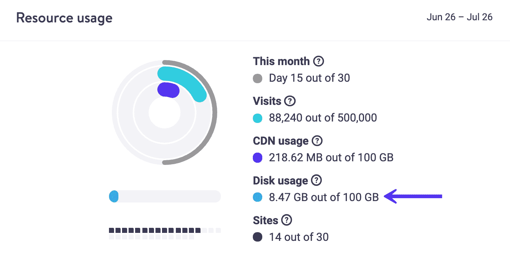

WordPress total disk usage


## 计算磁盘使用量的 8 种方法

很多托管的 WordPress 主机，比如 Kinsta，不使用 [cPanel](https://kinsta.com/knowledgebase/what-is-cpanel/) ，而是使用[自己的内置报告](https://kinsta.com/help/mykinsta-analytics/)来查看你网站的资源使用情况。这些可能并不总是给你你需要的数据。提供商通常专注于概览，而较少关注粒度级别。尽管有些确实通过 CSV 提供了一些详细的报告。因此，这就是下面的方法可以派上用场的地方，它可以为您的文件和数据库获取有关磁盘使用的更多信息。

### 1.如何在 MyKinsta 中检查磁盘使用情况？

Kinsta 客户可以在 [MyKinsta 仪表板](https://kinsta.com/mykinsta/)中访问详细的磁盘使用统计数据。在 MyKinsta 的“站点”列表中，你可以找到每个 WordPress 站点的总磁盘使用量。

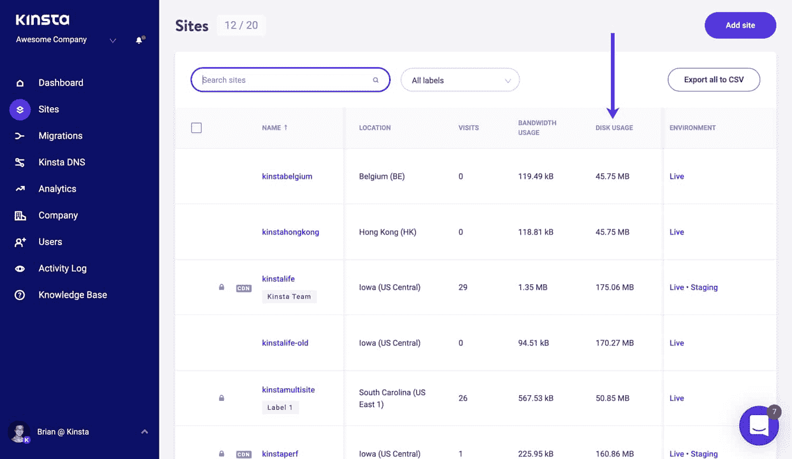

Find your disk usage in MyKinsta.


### 2.如何使用站点健康工具检查磁盘和数据库的使用情况？

随着 WordPress 5.2 的发布，一个名为“网站健康”的新工具被嵌入到核心中。它实际上非常棒，包含了很多关于你的 WordPress 站点和服务器的有用数据。有了它，你可以检查你的 WordPress 目录和[数据库](https://kinsta.com/knowledgebase/wordpress-database/)的大小。

在你的 WordPress 仪表盘中，浏览到“工具→站点健康→信息”在“目录和大小”选项卡下，您可以找到关于您的网站的以下信息:

*   WordPress 目录大小
*   上传目录大小
*   主题目录大小
*   插件目录大小
*   数据库大小
*   总安装尺寸

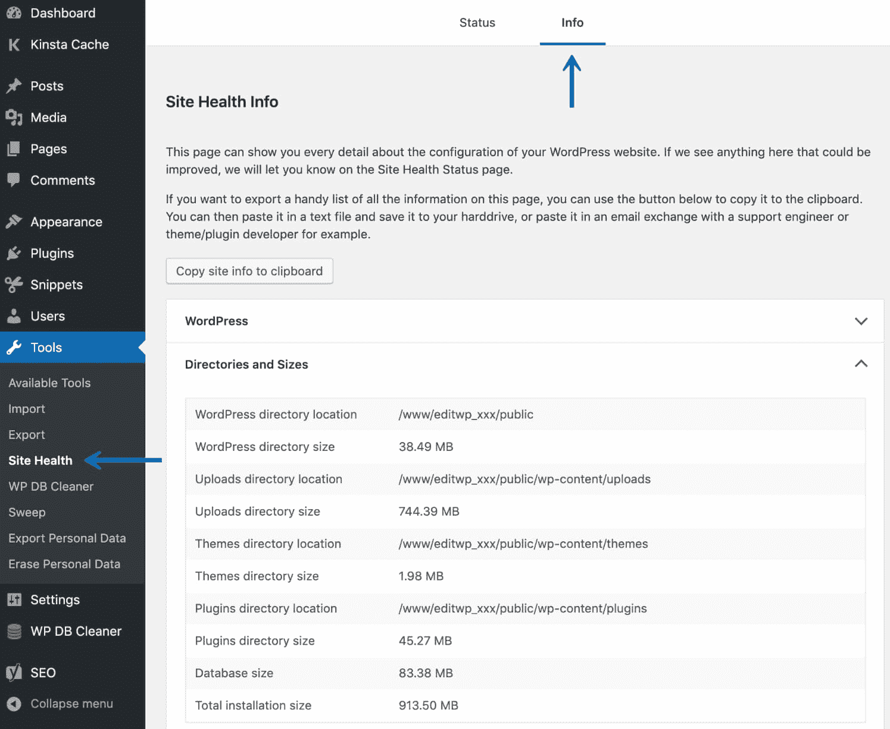

WordPress Site Health tool directory and sizes


### 3.我如何用 WordPress 插件检查数据库大小？

也许你想在你的 WordPress 数据库上看到更多的粒度数据？例如，如果您试图确定什么占用了数据库中的空间，只知道总大小就没有多大帮助。这就是[高级数据库清理器](https://wordpress.org/plugins/advanced-database-cleaner/)插件可以派上用场的地方。本质上，它是一个分析和清理数据库的工具。有免费版和高级版。

[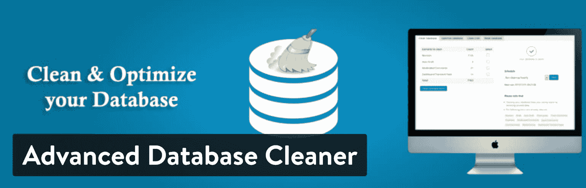](https://wordpress.org/plugins/advanced-database-cleaner/)

Advanced Database Cleaner plugin


在撰写本文时，它已经有超过 50，000 个活跃安装，并获得了令人印象深刻的 5 星评级。你可以从 [WordPress 知识库](https://wordpress.org/plugins/advanced-database-cleaner/)下载它，或者在你的 WordPress 仪表盘的“添加新插件”下搜索它。

一旦安装完毕，你可以在你的 WordPress 仪表盘上点击 WP DB Cleaner，然后点击“表格”标签。你可以用这个插件做很多优化，但是我们今天不会深入讨论这些，我们关心的是找出哪些东西占用了你数据库中的大部分空间。

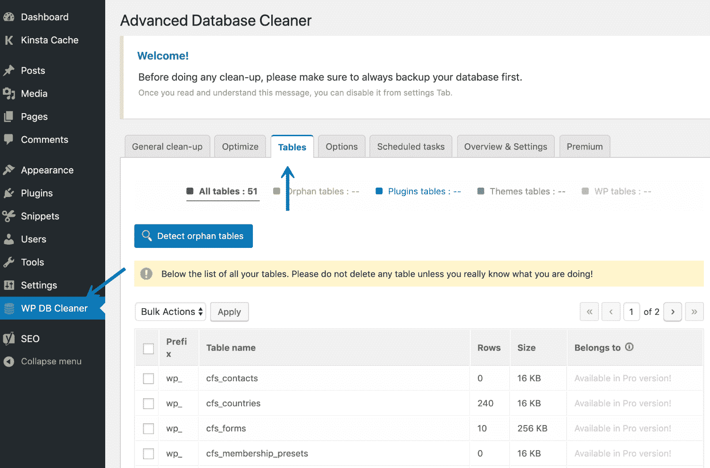

## 注册订阅时事通讯


### 想知道我们是怎么让流量增长超过 1000%的吗？

加入 20，000 多名获得我们每周时事通讯和内部消息的人的行列吧！

[Subscribe Now](#newsletter)

通常情况下，数据库表会被命名为类似于它们所使用的插件的名称。很快，我们就能够发现“数据库浪费”例如,“ab_press_optimizer”表由 AB Press Optimizer 插件使用，该插件在我们分析的网站上不再使用。此外，WPML [插件使用“](https://kinsta.com/blog/wordpress-multilingual/) [icl_translations](https://wpml.org/documentation/support/wpml-tables/) ”表进行多语言安装。然而，这个网站不是多语言的。

很多时候插件被安装，然后[被移除，但是数据库表被留下](https://kinsta.com/blog/uninstall-wordpress-plugin/)。您通常可以安全地从数据库中删除这些内容(我们将在下面的 phpMyAdmin 步骤中对此进行更深入的讨论)。记住**总是先备份你的数据库**。如果你不喜欢这样做，我们建议你和一个[开发者](https://kinsta.com/blog/hire-wordpress-developer/)聊聊。

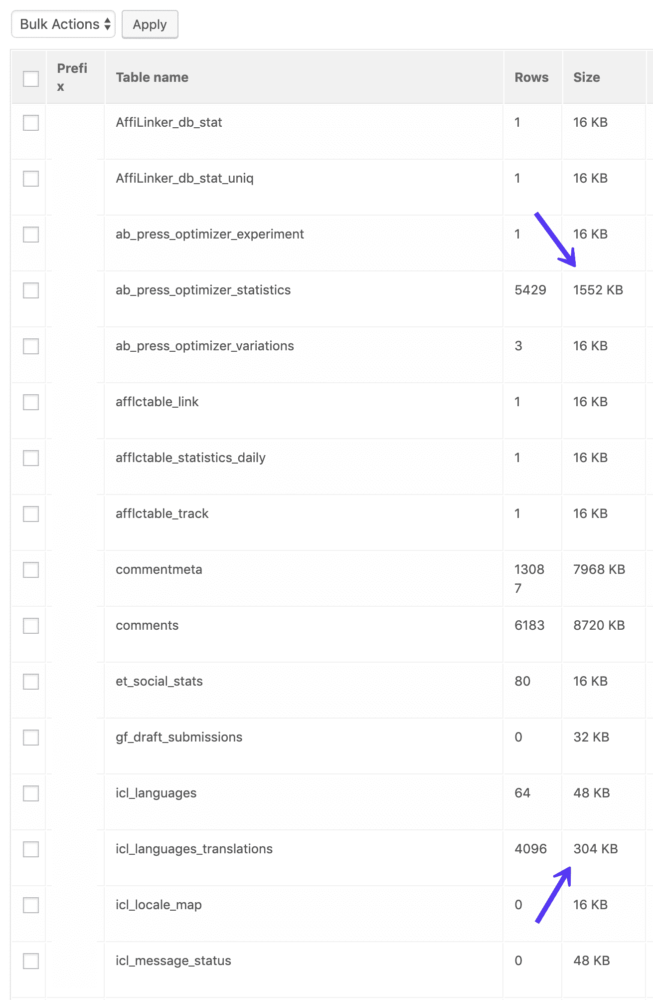

Database waste


高级数据库清理器插件的一个缺点是你不能根据数据大小对行进行排序。

我们注意到的另一个大表是“tve_leads”表。这是流行的 Thrive Leads 插件使用的。然而，有问题的网站没有使用这个插件。所以，如果你查看你的 WordPress 网站，你可能会发现很多剩余的表格应该被清理或者删除。

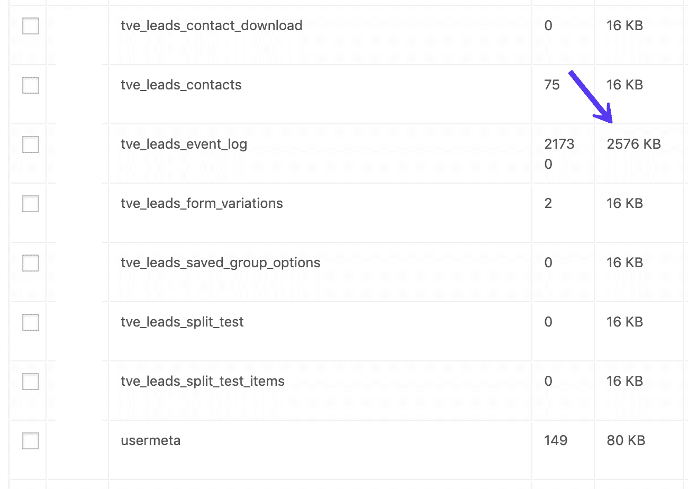

Thrive Leads table


不知道什么表属于哪个插件？在很多情况下，简单的谷歌搜索就能找到答案。


Google search WordPress table


你也可以在“概述&设置”标签下的高级数据库清理插件中看到数据库的总大小。

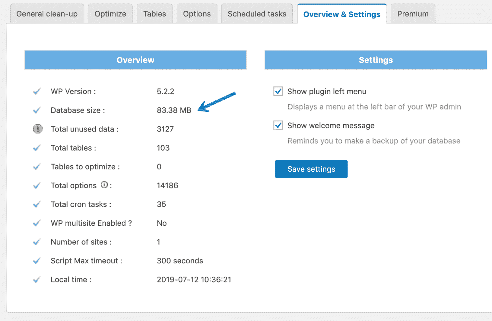

Total database size in plugin


Kinsta 将暂存站点和 WordPress 备份从您的磁盘使用中排除，给您尽可能多的空间！[查看我们的计划](https://kinsta.com/plans/?in-article-cta)

### 4.如何用 phpMyAdmin 检查数据库大小？

还可以用 phpMyAdmin 检查数据库大小并分析表。许多主机会在你的控制面板中有一个快捷方式来访问它，或者在你的设置邮件中有一个链接。如果你是 Kinsta 客户端，你可以通过点击你站点的信息标签，向下滚动到数据库部分，点击“打开 phpMyadmin”来访问 phpMyAdmin

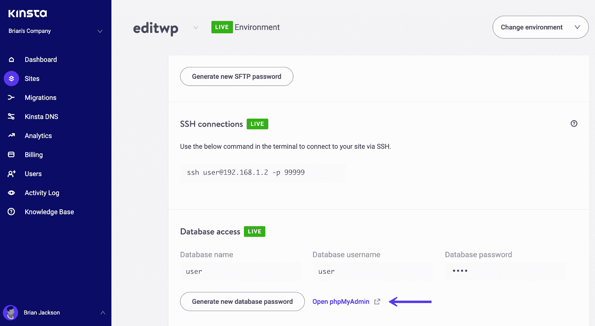

WordPress phpMyAdmin access


单击左侧的数据库。然后，您可以按总大小对数据库的表进行排序。

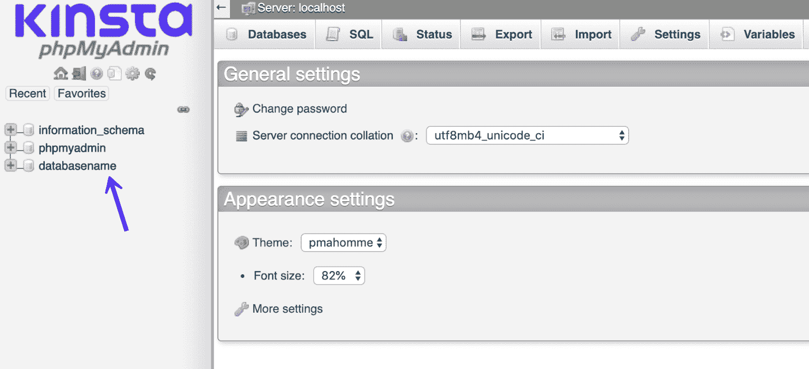

Database phpmyadmin


在我们分析的 WordPress 网站上，超过 70%的大型数据库表(除了核心表)是由网站上不再使用的插件创建的。这意味着我们的数据库使用了过多的磁盘空间。你的网站越老，你就越有可能留下数据。

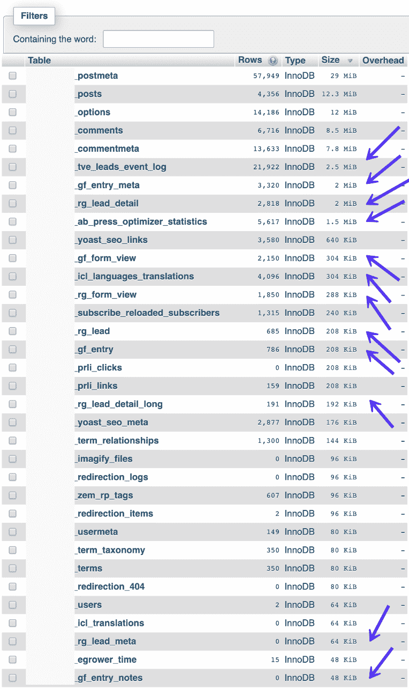

您可以通过选择这些未使用的表并从下拉菜单中选择“Drop”来轻松删除它们。然而，我们总是建议您在这样做之前备份您的数据库。查看我们关于如何使用 phpMyAdmin[备份 MySQL 数据库的快速简单的教程。或者，如果您是 Kinsta 客户，您可以从 MyKinsta 仪表板轻松创建备份。](https://kinsta.com/knowledgebase/mysql-backup-database/)

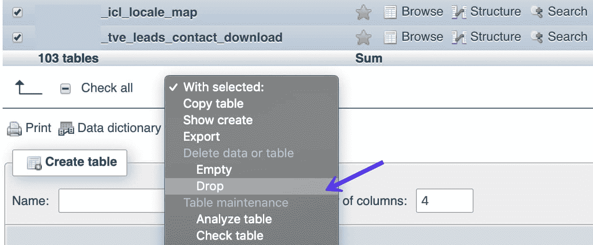

Drop tables in phpMyAdmin


### 5.如何在 cPanel 中检查磁盘使用情况和数据库大小？

如果您的主机使用 [cPanel](https://kinsta.com/knowledgebase/what-is-cpanel/) ，您可以很容易地在侧边栏上看到您的总磁盘使用量和 MySQL 数据库的概况。

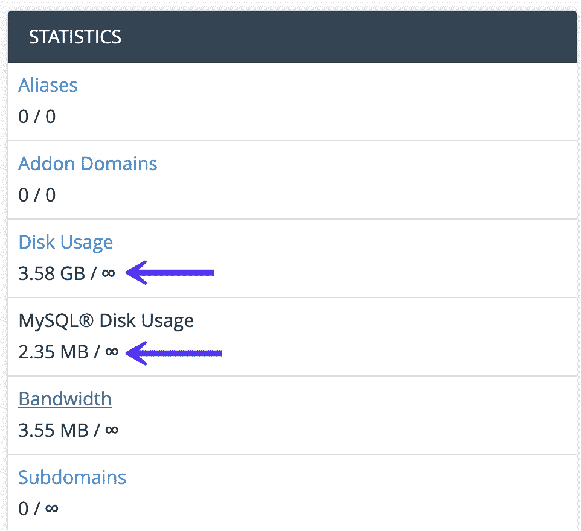

cPanel disk usage overview


您还可以深入磁盘使用情况报告，获取更详细的数据。只需点击“文件”下的“磁盘使用”。

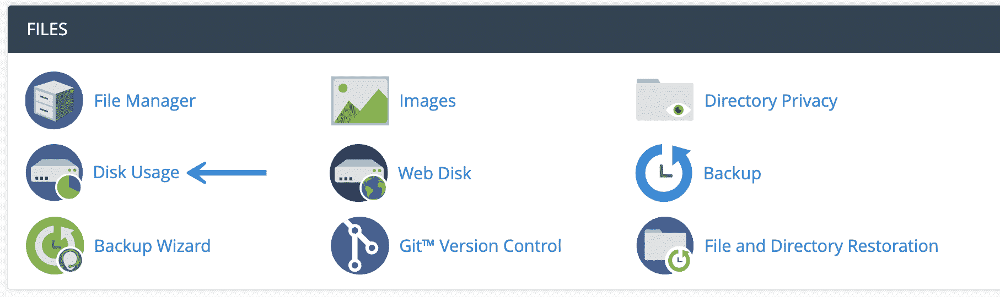

cPanel disk usage


在屏幕底部，您可以深入到文件夹，并按磁盘使用情况对它们进行排序。

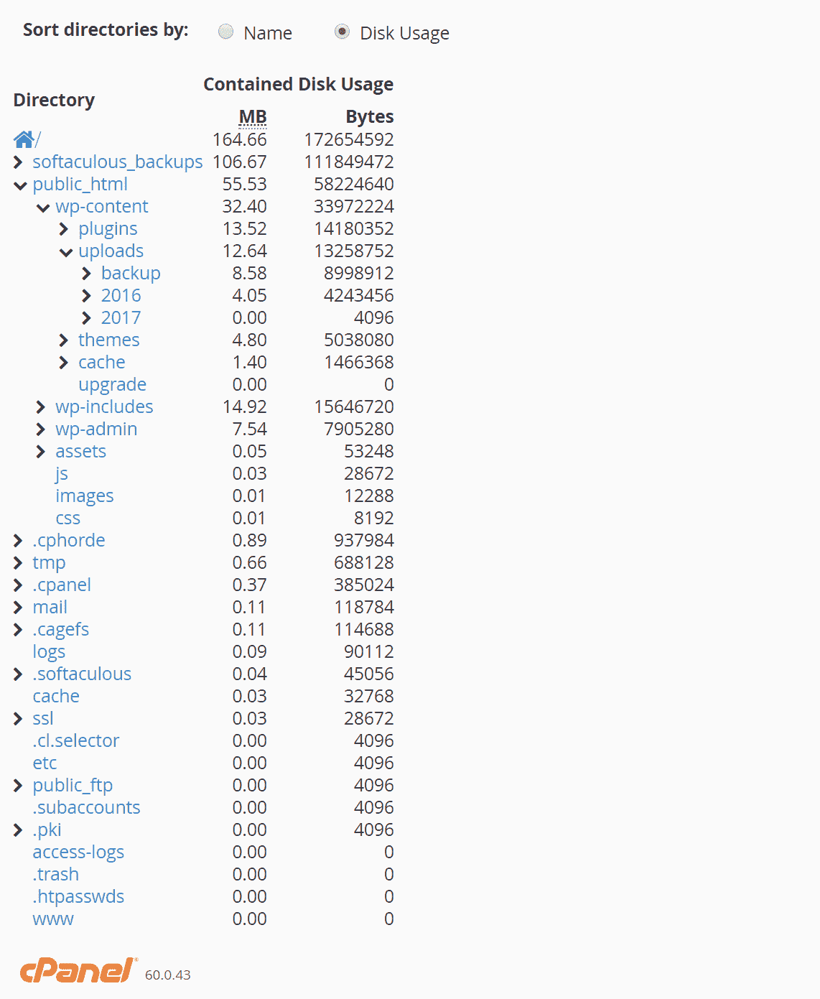

cPanel drill down disk usage


查看 MySQL 数据库大小的另一种方法是点击数据库下的“MySQL 数据库”。

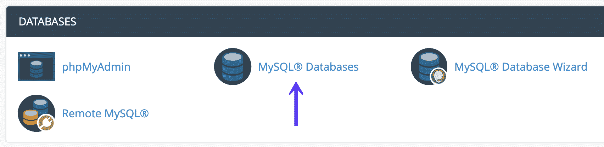

cPanel MySQL databases


然后在当前数据库下，它会显示数据库的总大小。

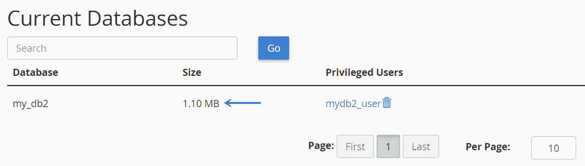

cPanel MySQL database size


### 6.询问你的主机提供商

检查当前粒度磁盘使用和数据库大小的另一种方法是让您的主机向您提供一份报告。很多时候，主机提供商可以快速运行服务器命令来生成目录树/粒度报告，向您显示哪些内容占用了最多的空间。它可能不总是最漂亮的报告，但它会给你你需要的数据。主机应该总是乐意帮助你找到清理未使用数据的方法，因为这对双方都有好处。

了解您的主机是否将您的[中转站点](https://kinsta.com/help/staging-environment/)包含在您的总磁盘使用量中也很重要。在 Kinsta 这里，我们试图给客户尽可能多的空间，因此在计算总磁盘空间使用时，**中转站点被排除在我们的报告之外。只有实时网站计入您的磁盘空间使用。
**

### 7.深入了解本地磁盘使用情况

另一种分析你的 WordPress 磁盘使用情况的方法是在你的电脑上挖掘本地数据。这可以通过两种不同的方式实现:

*   **选项 1:** 从主机提供商的控制面板下载网站的完整存档备份。在 Kinsta，我们有简单的一键[可下载备份](https://kinsta.com/help/wordpress-backups/#downloadable-backups)。这是最快的方法。
*   **选项 2:** 通过 SFTP 连接并下载整个网站。或者在大多数情况下，你只需要你的`/wp-content/`文件夹。根据您的网站和互联网连接的大小，这可能需要一段时间。

重要的是要记住，如果你的主机按带宽收费(Kinsta 不收费)，这将使用你每月配额的一部分。所以**我们不建议一直这样做**，也许每 6 个月一次。或者如果你有一个较小的网站，这可能不会是一个问题。

尽管这种方法需要更多的时间，但它可能是分析磁盘使用情况的最有效的方法之一，因为您可以非常快速地分析数据，并使用您选择的工具。您可以使用目录大小工具来分析您的站点。

#### Windows 操作系统

对于 Windows，我们强烈推荐免费的 [TreeSize 软件](http://www.jam-software.com/treesize_free/)，我们将在这个例子中使用它。

你可以选择你下载的`/wp-content/`文件夹，它会快速扫描，显示里面所有东西的确切大小。正如你在下面看到的，这比你的服务器上的任何插件或导出都要好。如果你在本地分析数据，你真的可以利用一些像这样强大的工具。

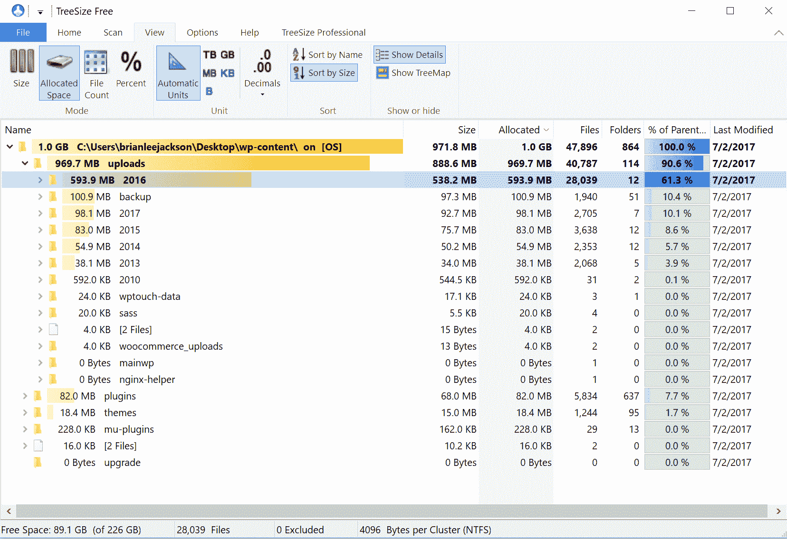

TreeSize wp-content folder


如果我们缩小到上传的大文件夹，我们可以立即看到有一些非常大的图片/照片可能没有被优化。令人惊讶的是，这个. gif 文件超过 3.5 MB，对于优化的图像来说太大了。这里有一些简单的方法来压缩动画 gif 文件。

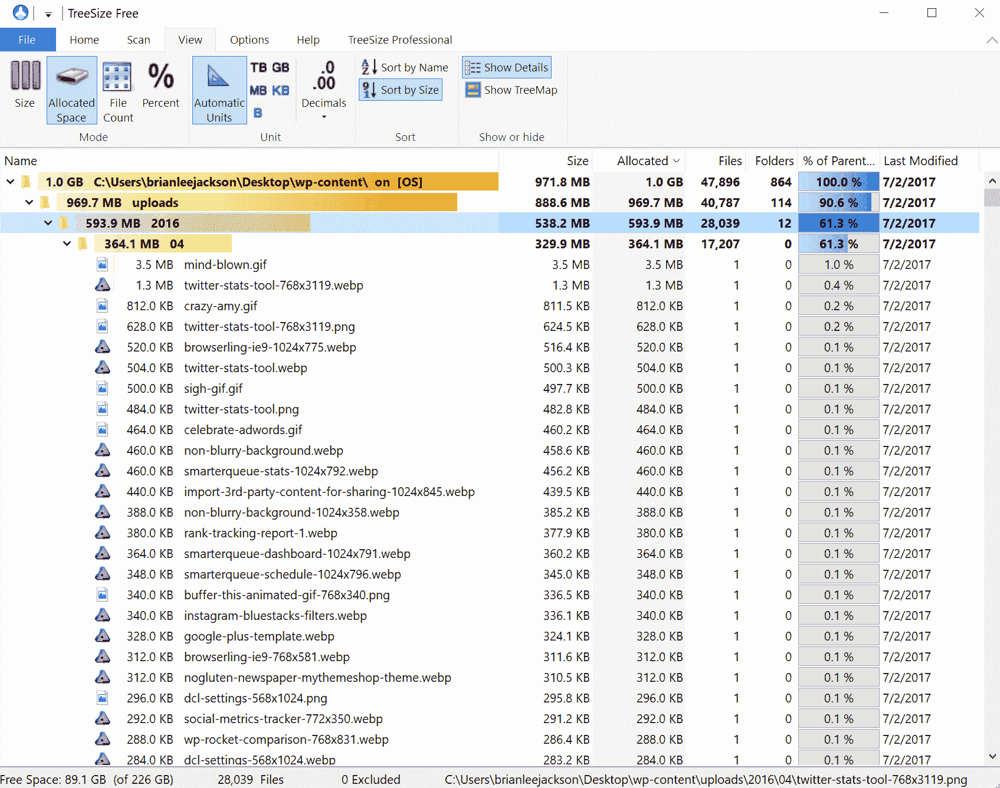

Large images taking up disk space


请务必查看我们关于如何[为网络](https://kinsta.com/blog/optimize-images-for-web/)优化图像以及关于 [WebP](https://kinsta.com/blog/webp/) 的深度帖子。TreeSize 非常适合快速挖掘您的站点，并在几秒钟内发现问题。

#### 苹果个人计算机

对于 Mac，你可能想看看[omnidisksweaver](https://www.omnigroup.com/more/)。这是免费的，你可以很容易地扫描你的`/wp-content/`文件夹，并找到在你的网站上占据大部分空间的大文件。

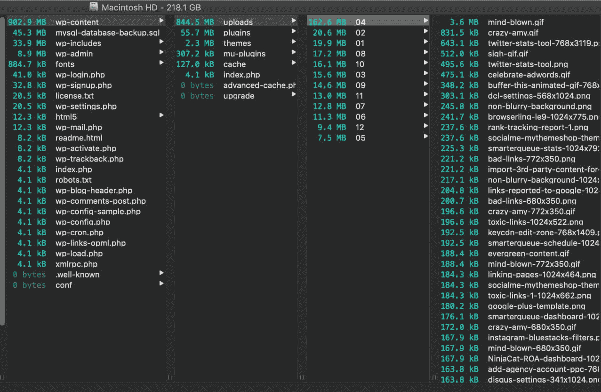

Large files in wp-content folder


### 8.如何通过 SSH 检查磁盘使用情况

分析磁盘使用情况的最后一种方法是通过 SSH。虽然这可能是为更懂技术的人准备的，但我们认为我们还是应该包括它，因为它很容易做到。只需[通过 SSH](https://kinsta.com/help/connect-to-ssh/) 登录您的主机。然后使用以下命令。第一个将使用“更改目录”(cd)命令导航到您的 wp-content 文件夹。注意:在某些主机上，此位置可能会有所不同。

```
cd public/wp-content
```

然后，您可以使用以下命令对文件夹进行排序，最小的文件在顶部，最大的文件在底部。

```
du -sh * | sort -h
```

您可以根据需要(使用相同的命令)进行深入研究，直到找到在您的站点上占据最大空间的内容。在这种情况下，这是我们的上传文件夹。

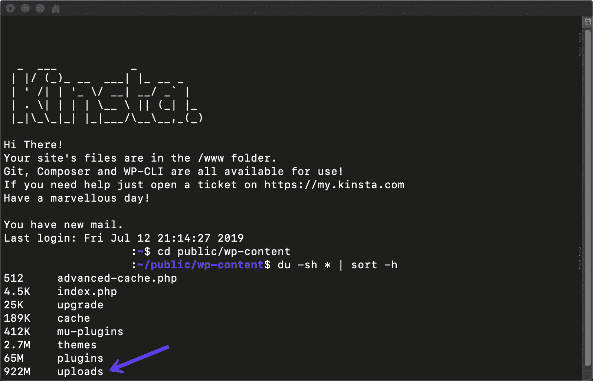

Check disk usage SSH


如下图所示，我们的 2016 年 4 月 4 日文件夹比其他月份和年份占据了更多的空间。

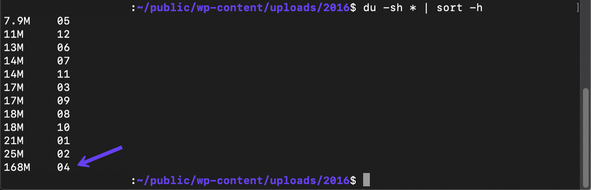

Large folder SSH


在进入那个目录后，我们意识到这是由于使用了一些非常大的 gif 和 png。我们建议尽量将您的图像保持在 100 KB 以下。

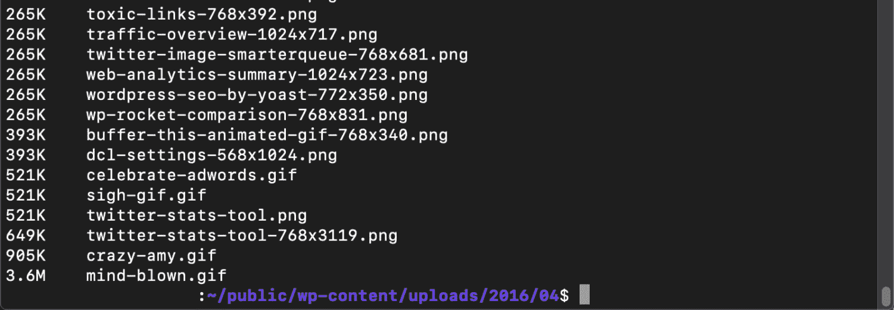

Large files SSH


## 减少 WordPress 中的磁盘使用

这里有一些快速简单的建议来减少你的 WordPress 站点的磁盘使用。

*   [优化您的图像](https://kinsta.com/blog/optimize-images-for-web/)。尽量把你的图片保持在 100 KB 以下。
*   使用像 [Media Cleaner](https://wordpress.org/plugins/media-cleaner/) 这样的插件来清除网站上未使用的媒体。
*   [删除旧主题](https://kinsta.com/blog/wordpress-delete-theme/)和[插件](https://kinsta.com/blog/uninstall-wordpress-plugin/)。
*   清理不再使用的插件留下的未使用的数据库表。查看我们关于[自动加载数据](https://kinsta.com/knowledgebase/wp-options-autoloaded-data/)的深度帖子。
*   使用上面的一些提示检查你的 WordPress 安装，确保大文件是有原因的。
*   禁用或限制 WordPress 版本来保持你的数据库小。
*   删除旧的日志文件。
*   移除备份文件并将其存放在异地。请记住，MyKinsta 备份不计入您在 Kinsta 的磁盘使用量。
*   清理并删除垃圾邮件中的评论

## 如何获得额外的磁盘空间

如果按照上面的建议优化使用后，你的磁盘空间仍然不足，下一步就是为你的 WordPress 站点获取额外的磁盘空间。

对于 Kinsta 用户，我们通过我们的[本机磁盘空间附件](https://kinsta.com/help/disk-space-add-on/)使其变得简单，该附件可在 MyKinsta 仪表板中直接购买——该选项具有简单的设置过程、与 KinstaCDN 的 100%兼容性以及 MyKinsta 中的集成计费。

如果你的主机不提供磁盘空间插件，另一个选择是[将内容卸载到外部存储提供商](https://kinsta.com/knowledgebase/wordpress-google-cloud-storage/)如亚马逊 S3 或谷歌云存储。

## 摘要

正如你所看到的，在 WordPress 中有很多不同的方法来检查你的磁盘使用和数据库大小，即使对于那些不太懂技术的人来说也是如此。请记住，随着时间的推移，您可能已经在您的站点上积累了大量额外的数据，包括数据库中的文件和表格。每 6 个月进行一次检查是一个很好的方法，可以确保您将磁盘使用量保持在最低水平，降低存储成本，并有助于加快您的网站。

在你的 WordPress 网站上，你还有其他简单的方法来检查磁盘使用情况吗？如果是这样，请在下面的评论中分享它们。

* * *

让你所有的[应用程序](https://kinsta.com/application-hosting/)、[数据库](https://kinsta.com/database-hosting/)和 [WordPress 网站](https://kinsta.com/wordpress-hosting/)在线并在一个屋檐下。我们功能丰富的高性能云平台包括:

*   在 MyKinsta 仪表盘中轻松设置和管理
*   24/7 专家支持
*   最好的谷歌云平台硬件和网络，由 Kubernetes 提供最大的可扩展性
*   面向速度和安全性的企业级 Cloudflare 集成
*   全球受众覆盖全球多达 35 个数据中心和 275 多个 pop

在第一个月使用托管的[应用程序或托管](https://kinsta.com/application-hosting/)的[数据库，您可以享受 20 美元的优惠，亲自测试一下。探索我们的](https://kinsta.com/database-hosting/)[计划](https://kinsta.com/plans/)或[与销售人员交谈](https://kinsta.com/contact-us/)以找到最适合您的方式。