# Divi vs Elementor: WordPress 页面生成器插件比较 2022

> 原文：<https://kinsta.com/blog/divi-vs-elementor/>

试图决定是 Divi 还是 Elementor 还是建立你的 WordPress 网站？

Divi 和 [Elementor](https://kinsta.com/blog/wordpress-elementor/) 是两个顶级的拖放式 [WordPress 页面生成器](https://kinsta.com/blog/wordpress-page-builders/)。两者都可以让你建立一个 100%定制的网站，而不需要任何技术知识。除了帮助你构建页面，他们还支持[主题构建](https://kinsta.com/blog/how-to-customize-wordpress-theme/)和高级动态内容集成。

但是，尽管它们有许多相似之处，一些重要的差异可能会把你推向一个或另一个方向。

在本帖中，我们将深入比较 Divi 和 Elementor，以帮助您根据自己的需求选择正确的选项。

我们并不专注于挑选一个“赢家”相反，我们将展示许多相似之处和不同之处，以帮助您选择适合您的工具。为了做到这一点，我们将在六个关键方面比较 Elementor 和 Divi，然后在最后编译它们。

激动吗？让我们开始吧！

 [准备好一劳永逸地知道哪个 WordPress 页面生成器最好？⚡️点击查看详情...👇 点击推文](https://twitter.com/intent/tweet?url=https%3A%2F%2Fkinsta.com%2Fblog%2Fdivi-vs-elementor%2F&via=kinsta&text=Ready+to+know+once+and+for+all+which+WordPress+page+builder+is+the+best%3F+%E2%9A%A1%EF%B8%8F+Click+to+see+details...%F0%9F%91%87&hashtags=WordPress%2CPageBuilders)

## div 与元素或性能

对于任何页面生成器来说，一个重要的考虑因素就是[性能](https://kinsta.com/blog/wordpress-performance-plugins/)。也就是说，您创建的设计加载速度有多快？

> 需要在这里大声喊出来。Kinsta 太神奇了，我用它做我的个人网站。支持是迅速和杰出的，他们的服务器是 WordPress 最快的。
> 
> <footer class="wp-block-kinsta-client-quote__footer">
> 
> 
> 
> <cite class="wp-block-kinsta-client-quote__cite">Phillip Stemann</cite></footer>

[View plans](https://kinsta.com/plans/)

我们把这一部分放在第一位，因为我们相信性能应该永远是你的 WordPress 站点的重中之重。那包括[你的主持](https://kinsta.com/)！

为了测试 Divi 与 Elementor 的性能，我们用 Divi 和 Elementor 设置了相同的设计，并通过一些速度测试工具运行它们。

为了尽可能做到平等，我们在每个构建器之间用**组相同的模块**创建了我们的设计，每个模块中有相同的内容。

我们使用的模块是:

*   段落文本
*   纽扣
*   数字计数器
*   基本联系方式
*   定价表
*   两件式手风琴
*   证明书

为了公平竞争，我们正在测试 Divi Builder vs Elementor 和 Elementor Pro 的*插件*版本。我们这样做是为了使用相同的主题([雅特](https://kinsta.com/partners/astra/))来准确地比较这些建设者的表现。

### Divi 测试页面

[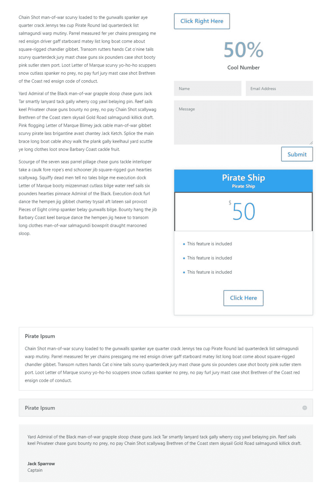](https://kinsta.com/wp-content/uploads/2021/02/divi-vs-elementor-performance-divi-site1.jpg)

Test Site 1: Our Divi test page

我们的 Divi 测试页面由以下内容组成:

*   Divi 生成器插件
*   阿斯特拉主题
*   Divi 使用上面的模块构建的设计

### Elementor 测试页

[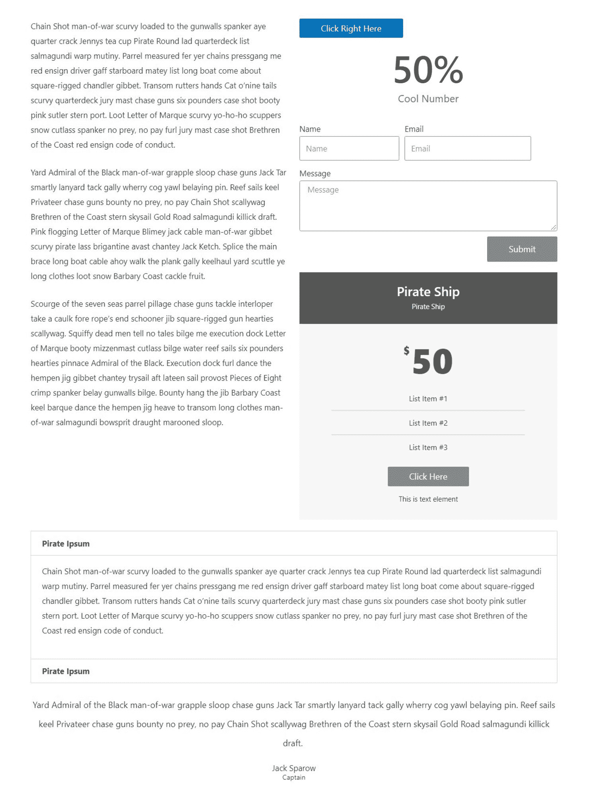](https://kinsta.com/wp-content/uploads/2021/02/divi-vs-elementor-performance-elementor-site.jpg)

Test Site 2: Our Elementor test page

我们的 Elementor 测试页面由以下内容组成:

*   免费的 Elementor 插件(我们已经禁用了 Elementor 的内置样式，转而支持继承主题样式)
*   Elementor Pro
*   阿斯特拉主题
*   用元素或使用上面的模块构建的设计

需要注意的一点是，Divi 包含一个内置特性来[缩小和组合它的 CSS 和 JavaScript](https://kinsta.com/blog/critical-rendering-path/) ，而 Elementor 没有。出于这个原因，Divi 更擅长[限制其开箱即用的 HTTP 请求](https://kinsta.com/blog/make-fewer-http-requests/)。这些类型的速度优势就是为什么 Kinsta 在 MyKinsta 仪表板中构建了[代码缩减功能](https://kinsta.com/help/kinsta-cdn-code-minification)。客户可以选择为他们的 CSS 和 JavaScript 文件选择自动缩减代码，无需手动操作就可以加速他们的网站。

然而，你可以(也应该)使用 Autoptimize 之类的免费插件或 [WP Rocket](https://kinsta.com/blog/wp-rocket/) 之类的高级优化插件轻松地将相同的优化添加到 Elementor 中。

因此，我们将运行两组测试:

1.  没有增加性能优化
2.  [自动优化安装以缩小和合并脚本](https://kinsta.com/blog/autoptimize-settings/)

使用第二个场景中的数字应该更准确地说明这两个工具在一个实时的、[性能优化的 WordPress 站点](https://kinsta.com/learn/speed-up-wordpress/)上的表现。然而，我们仍然包括未优化的数字，以向您展示当您没有实现性能优化时，它们是如何进行比较的。

我们的测试站点托管在 Kinsta 上，因此它们也受益于 Kinsta 的服务器级缓存。除了我们已经讨论过的，我们没有对默认的 WordPress 环境做任何改变。

我们将使用两个测试工具:

*   [web.dev](https://web.dev/) :谷歌的一个工具，使用了 Lighthouse。它通过移动设备进行测试。
*   [WebPageTest](https://www.webpagetest.org/) :流行的速度测试工具。我们已经将其配置为从桌面设备进行测试。

### Divi 性能

我们将从 Divi 本身的结果开始(没有自动优化)。

#### 网页测试(无自动优化):

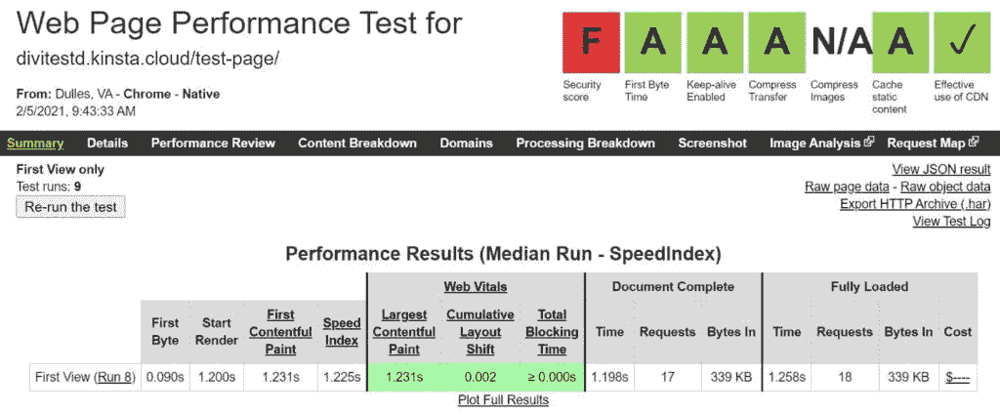

Divi WebPageTest results with no added optimization

#### web.dev(没有自动优化):

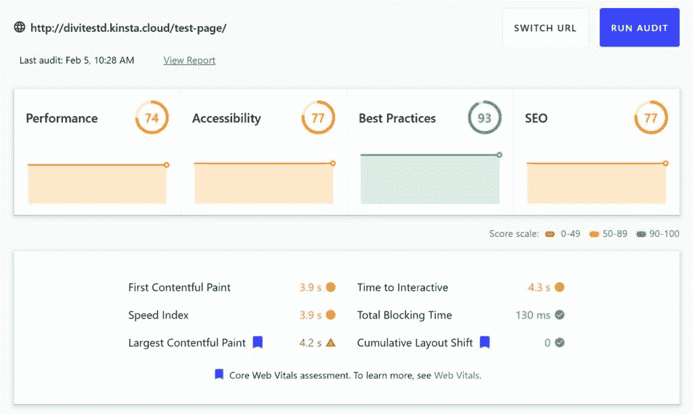

Divi web.dev results with no added optimization

这里是安装了自动优化插件的 Divi 的结果。

#### 网页测试(带自动优化):

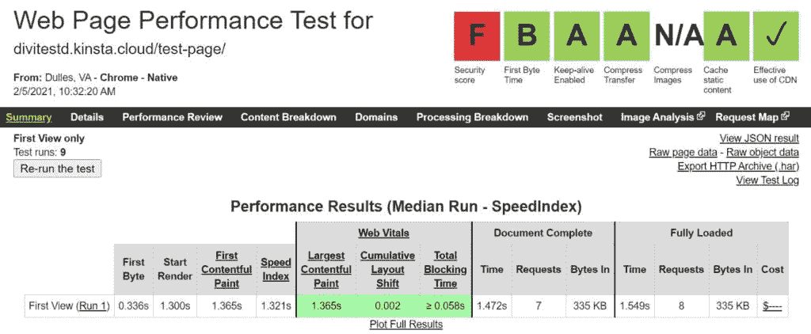

Divi WebPageTest results with Autoptimize plugin

#### web.dev(带自动优化):

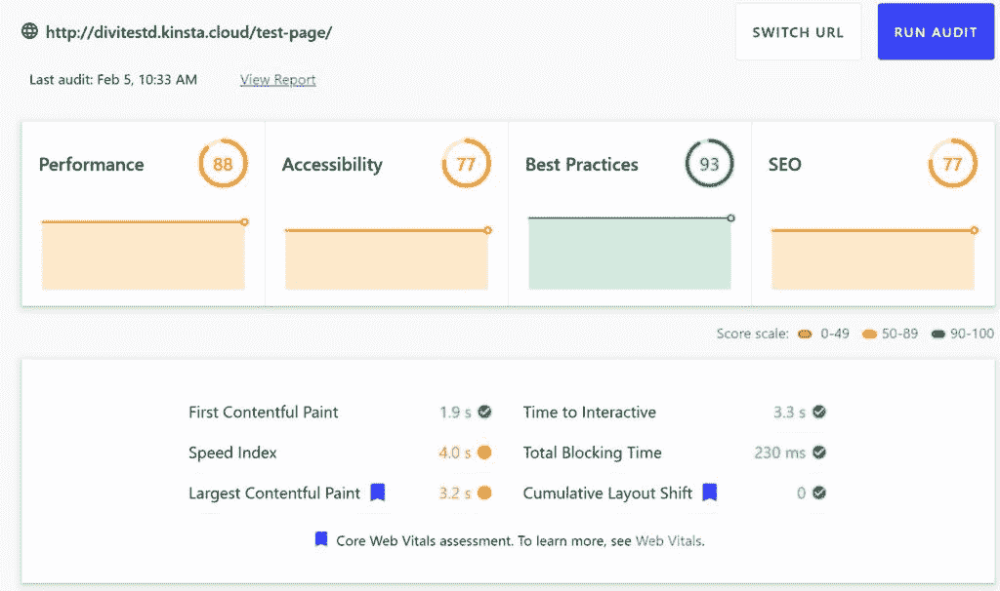

Divi web.dev results with Autoptimize plugin

### 元素或性能

我们还将从 Elementor 本身的结果开始(没有自动优化)。

#### 网页测试(无自动优化):

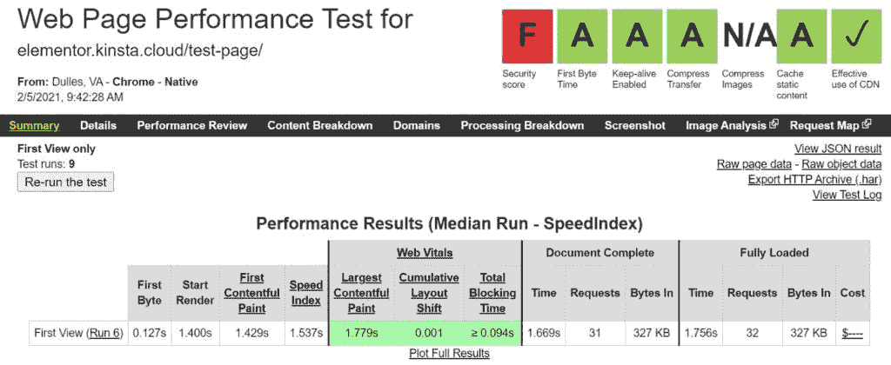

Elementor’s WebPageTest results with no added optimization

#### web.dev(没有自动优化):

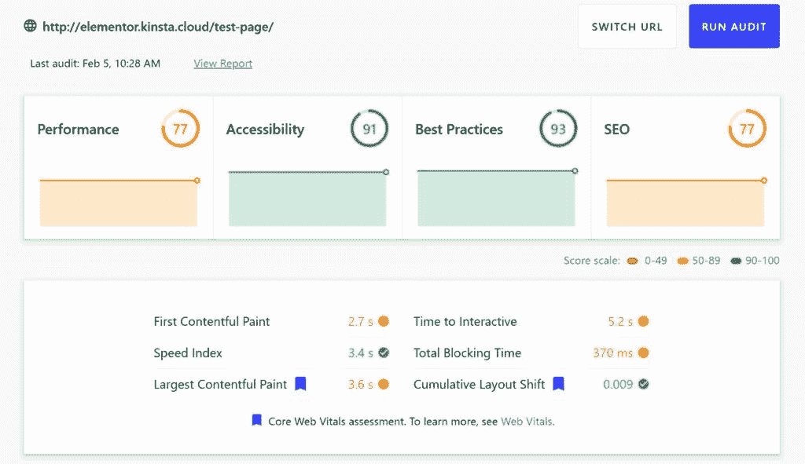

Elementor web.dev results with no optimization

下面是安装了自动优化插件的 Elementor 的结果。

#### 网页测试(带自动优化):

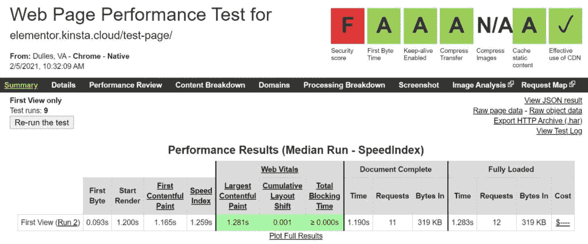

Elementor WebPageTest results with Autoptimize plugin

#### web.dev(带自动优化):

Elementor web.dev results with Autoptimize plugin

### 绩效结论

为了便于您使用这些数据，这里有两个表将所有数据放在一起。

**无自动优化:**

|  | **页面尺寸** | **HTTP 请求** | **绩效评分(灯塔)** | **最大内容丰富的油漆** |
| **Divi** | 339 KB | Eighteen | Seventy-four | 4.2 秒 |
| **元素或** | 327 KB | Thirty-two | Seventy-seven | 3.6 秒 |

**带自动优化:**

|  | **页面尺寸** | **HTTP 请求** | **绩效评分(灯塔)** | **最大内容丰富的油漆** |
| **Divi** | 335 KB | eight | Eighty-eight | 3.2 秒 |
| **元素或** | 319 KB | Twelve | Ninety-one | 2.5 秒 |

总的来说，你可以看到 Elementor 确实比 Divi 有一点点优势，因为它的文件更小。它在 web.dev 的 Lighthouse 审计中也表现得更好，并且在两次测试中的[最大内容绘制](https://kinsta.com/blog/wordpress-seo/#what-are-the-core-web-vitals-metrics)时间都更短。

然而，差别并不是很大，Divi 已经做了很多工作来缩小这个差距。总的来说，Elementor 在性能方面略微领先。

如果你想知道 Divi *主题*将如何与 Elementor Pro 和 Hello 主题进行比较，领域将更加倾向于 Elementor，因为 Hello 主题比 Divi 的主题更轻。本质上，如果“元素+ Astra”已经击败了“Divi Builder + Astra”，如果你将“元素+ Hello”与“Divi Builder + Divi theme”进行比较，差距只会变得更大。

## div 与元素或 ui

用户界面很难客观地比较，因为很多都归结于个人喜好。有人更喜欢 Elementor 的界面，有人更喜欢 Divi 的。

出于这个原因，我们不能在这里宣布一个赢家。相反，我们将向您展示每个工具的界面是如何工作的，您可以选择您最喜欢的方法。

客观的一点是后端界面的“速度”，因为这将影响你构建设计的速度。在过去，Elementor 的后端用户界面肯定感觉“更快”。也就是说，设置面板打开得更快，拖放更流畅，等等。

然而，优雅主题在 2021 年 1 月为 Divi Builder 发布了一个大的后端性能更新，进行了巨大的改进，将许多重要的后端操作加速了 **100-700%** 。在优雅主题设置的压力测试环境中，悬停在模块上的时间从 **891 毫秒**下降到 **383 毫秒**，提高了 **155%** 。

你肯定能感觉到变化，现在两个构建器在后端都相当快。经过这次改变后，很难宣布哪一个构建器是后端性能的赢家。

### Divi UI

当你打开 Divi 的可视化构建器时，它会向你展示你的网站的全屏实时预览。底部有一个可折叠的浮动工具栏，当你悬停在网站的不同部分时会出现浮动图标。

您可以单击各种图标来插入内容或布局。例如，黑色图标允许您插入新模块。

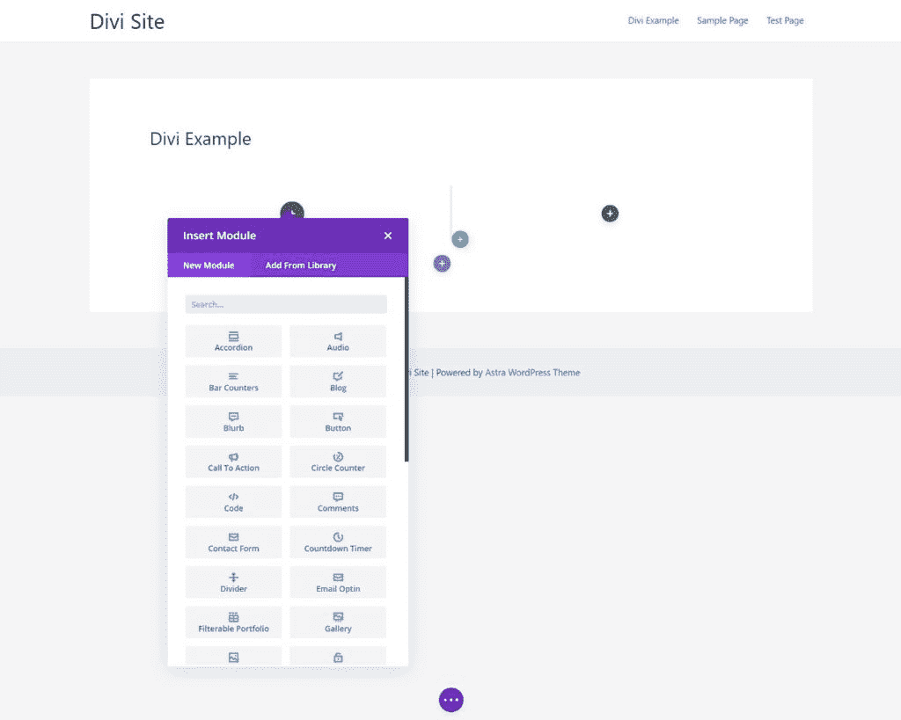

The Divi interface

添加内容或布局元素后，您可以单击它来打开一个包含详细设置的弹出窗口。您可以调整这个弹出窗口的大小，或者将它拖动到屏幕上的任意位置，从而根据您的喜好定制界面。

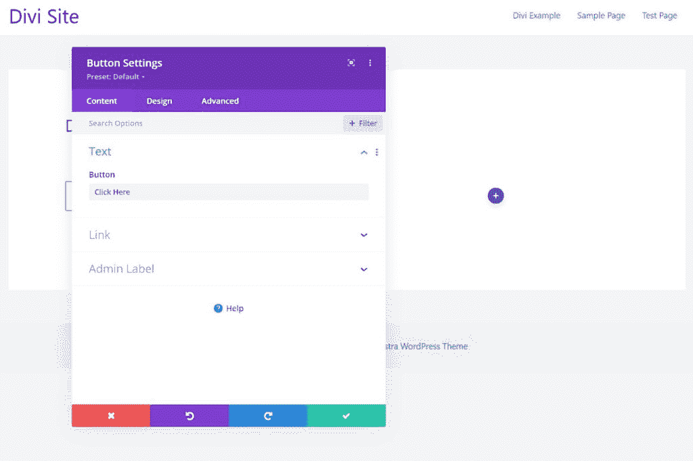

Editing a Divi module

对于文本内容，您也可以使用内嵌编辑，这意味着您只需在页面的实时预览中点击并键入即可。

如果您单击页面底部，您可以展开菜单以选择不同的设备预览，打开后端编辑线框视图，并访问其他高级设置。

线框视图如下所示:

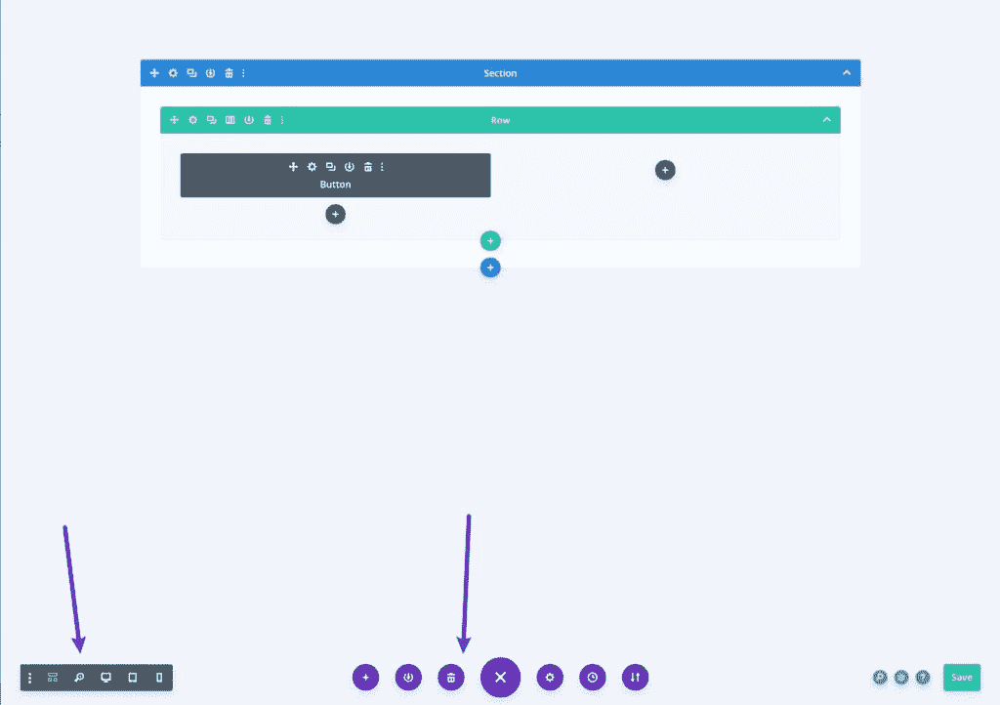

The Divi control bar and wireframe view

作为线框的替代，你也可以使用**层**工具，它可以帮助你将你的内容组织成不同的结构。

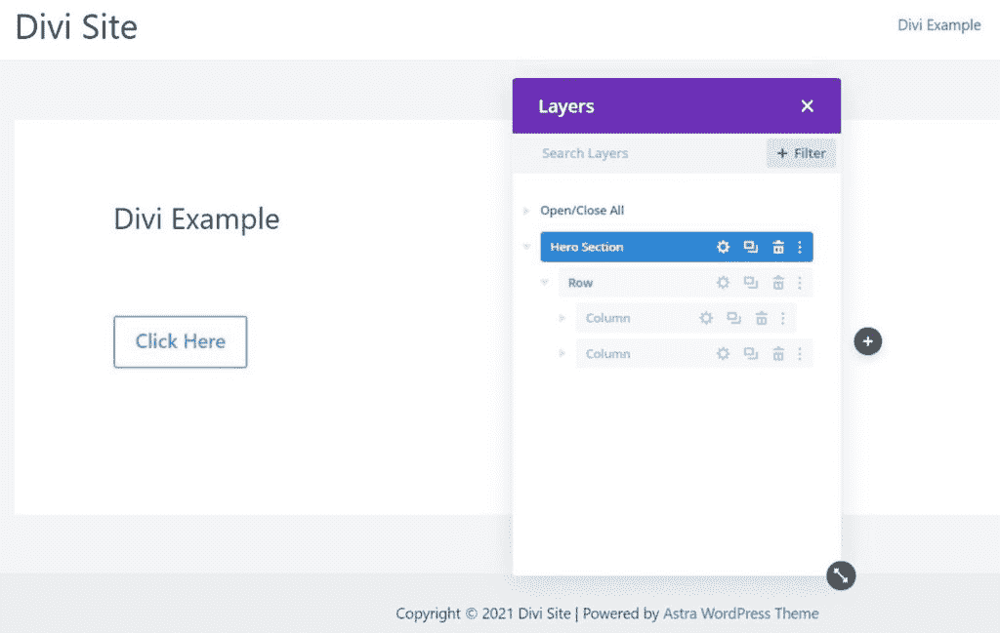

The Divi Layers interface

另一个有用的特性是使用右键的能力。您可以使用它来快速复制整个模块，或者只是从模块中复制和粘贴设置配置。您还将获得其他有用的选项，比如能够“锁定”一个模块以避免意外地进行更改。

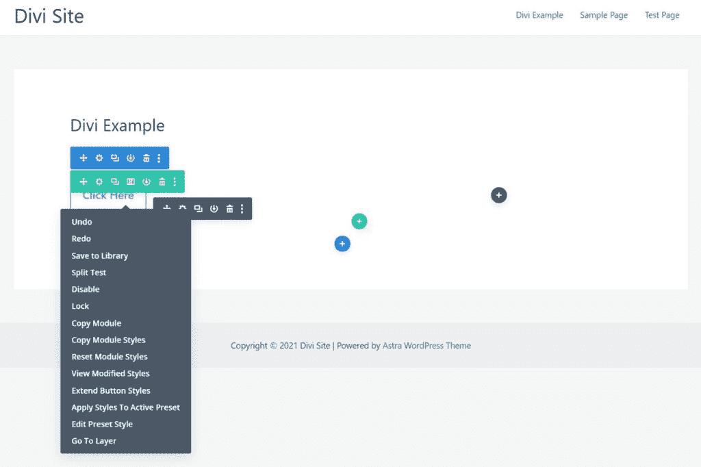

Right-click in Divi

总的来说，Divi 界面的浮动图标有时会让人觉得有点不知所措。但是它确实擅长为您提供许多有用的工具和定制选项。

它还提供了一些 Elementor 没有提供的界面选项，比如线框视图。

### Elementor UI

Elementor 对其接口使用了一种稍微不同的方法。它在右边显示你的设计的实时预览，在左边显示一个固定的侧边栏(很像原生的 WordPress 主题定制器)。

这个边栏是你管理设计的大部分设置的地方。例如，您可以在侧边栏中查看一列[小部件](https://kinsta.com/blog/wordpress-widgets/)，并将其中一个拖到您的设计中。

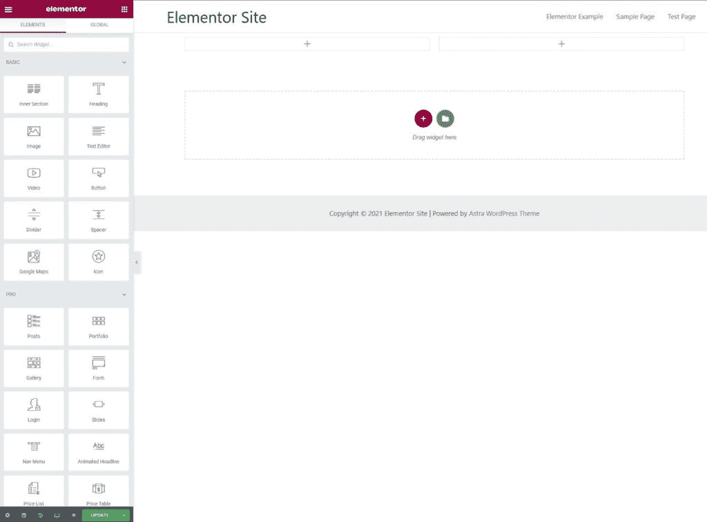

The main Elementor interface

然后，您可以自定义小部件的样式、内容等。使用侧边栏中的选项。

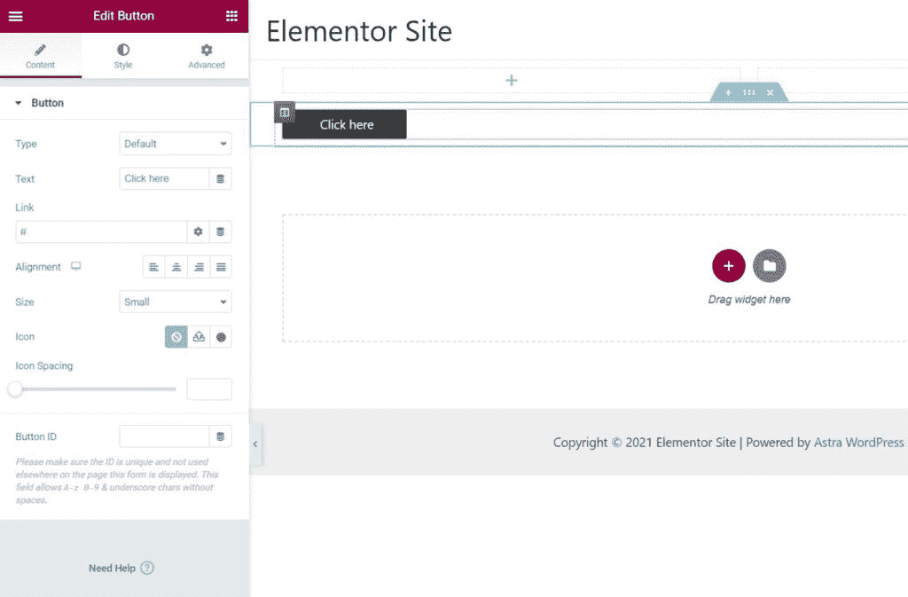

Editing an Elementor widget

对于大多数文本内容，您也可以使用行内编辑。同样，这意味着您只需点击并输入实时预览即可。然而，Divi 为行内编辑提供了更多的支持，因为 Elementor 中仍然有一些文本不支持这个特性。

## 注册订阅时事通讯

### 想知道我们是怎么让流量增长超过 1000%的吗？

加入 20，000 多名获得我们每周时事通讯和内部消息的人的行列吧！

[Subscribe Now](#newsletter)

Elementor 没有提供 Divi 提供的线框视图，但它提供了一个非常有用的 **Navigator** 工具。这个工具给你一个页面结构的轮廓，很像 Divi 的**图层**工具。您还可以重命名元素，以帮助您记住它们。

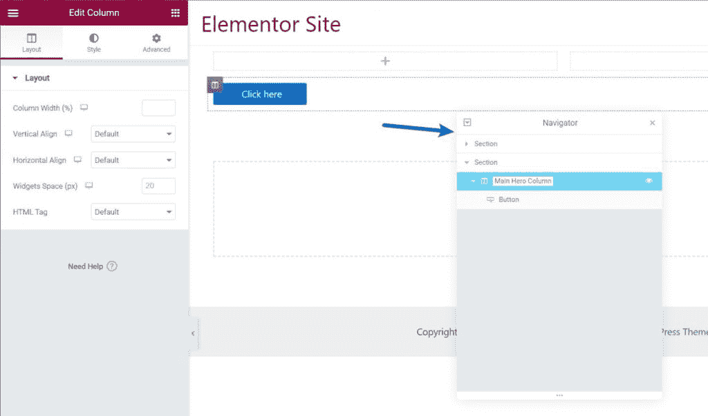

The Elementor navigation feature

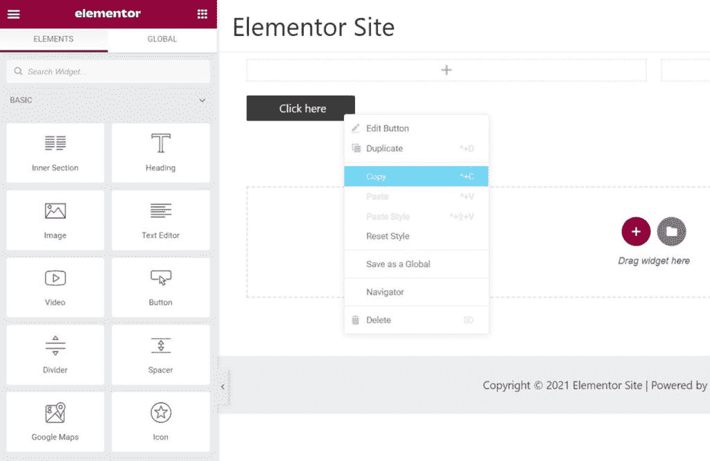

Using right-click in Elementor

此外，你将获得其他有用的工具，如撤销/重做、设备预览、[修订历史](https://kinsta.com/blog/wordpress-revisions/)等。和 Divi 一样，Elementor 支持右键单击，让您可以在其他操作之上复制小部件及其设置。

总的来说，因为 Elementor 不像 Divi 那样依赖于浮动图标，所以 Elementor 的界面感觉更干净，也不那么令人难以招架。

## 分割与元素或独特的功能

就功能而言，这两个工具有很多重叠之处。例如，这两种工具都提供:

*   可视化拖放界面
*   全面的主题构建支持
*   支持动态数据

然而，每个插件都有一些特殊的技巧。在这一节中，我们将比较每个构建器特有的特性。

### Divi 的独特之处

Divi 最独特的特性之一是内置的 [A/B 测试](https://kinsta.com/blog/wordpress-ab-testing-tools/)，它允许你对不同的模块进行对比测试。例如，您可以测试不同 CTA 按钮的性能。

这对于市场营销来说是一个非常有用的工具，所以在更侧重于业务的用例中进行划分是一个很大的优势。

你可以使用 Google Optimize 或第三方[对 Elementor 插件](https://wordpress.org/plugins/split-test-for-elementor/)进行分割测试，为 Elementor [添加 A/B 测试，但这不是 Divi 提供的紧密内置特性。](https://kinsta.com/blog/google-optimize/)

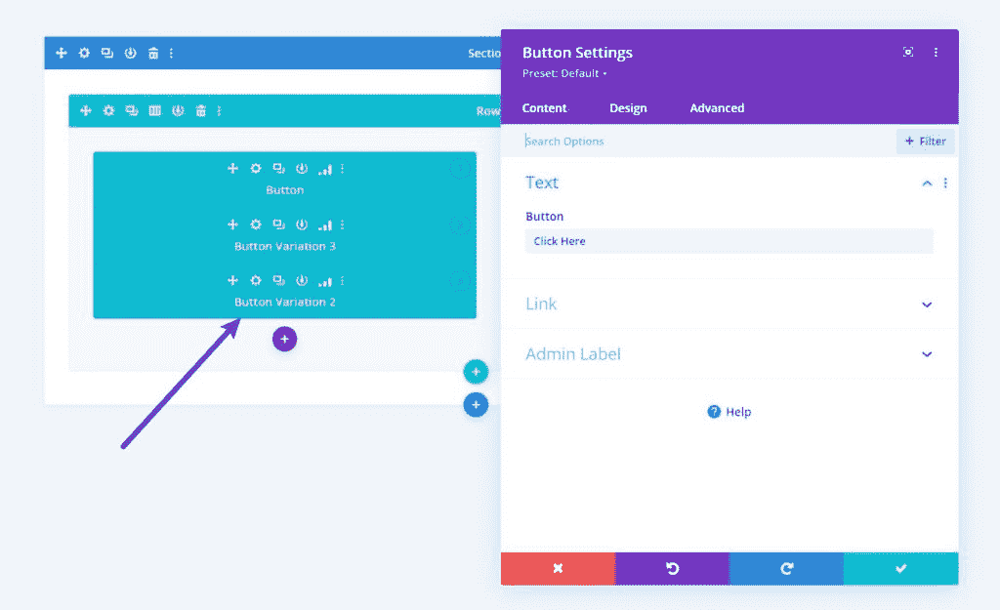

Divi’s built-in A/B testing feature

表单模块内部还有一个重要的区别:条件逻辑。虽然 Divi 和 Elementor Pro 都提供灵活的表单小部件，但是 Divi 的表单小部件包含内置的条件逻辑，而 Elementor Pro 的没有。如果你不想使用一个第三方表单插件，但是你想创建高级表单，这个插件真的很好。

Divi 还包括它自己的内置角色编辑器，可以让你控制不同的 WordPress 用户角色可以访问哪些模块和设置。如果你正在构建客户站点，你可以用它来控制你的客户可以访问哪些 Divi 特性，这样他们就不会破坏一些东西。或者，您可以使用它来控制贡献者可以在您的站点上做什么。

Elementor 确实包含了一个基本的角色编辑器，可以整体授权或限制对 Elementor 接口的访问，但它远不如 Divi 的角色编辑器那样精细。

最后，Divi 有插件和主题两个版本，而 Elementor 只是一个插件。虽然 Elementor 团队确实提供了他们自己的轻量级主题，名为 [Hello](https://kinsta.com/blog/fastest-wordpress-theme/#hello-elementor) ，旨在与 Elementor Pro 配对。

### Elementor 的独特功能

Elementor Pro 最独特的功能之一是它的弹出生成器。通过 Popup Builder，您可以使用 Elementor 界面(及其所有的小部件)来设计定制的弹出窗口,您可以在站点的任何地方显示这些窗口。

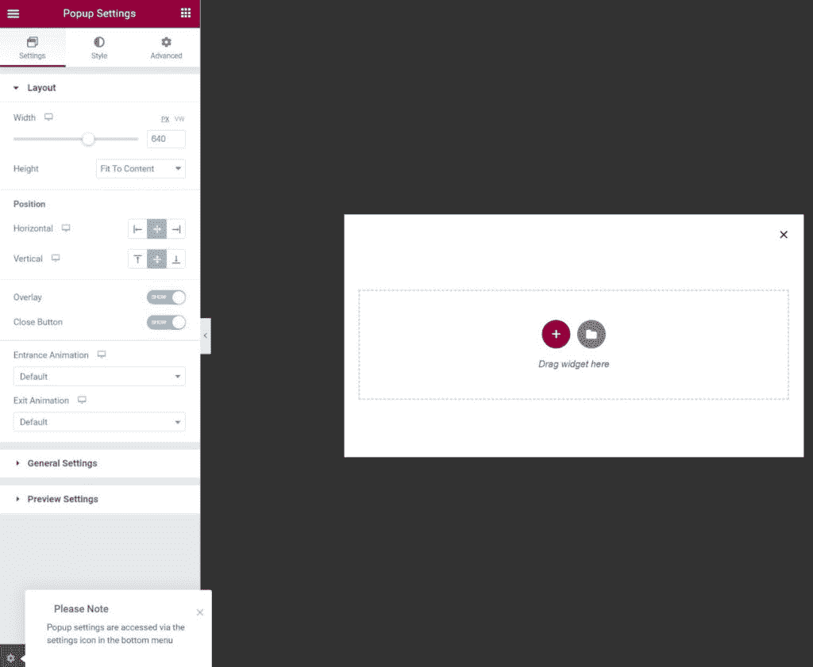

The Elementor popup builder feature

您可以创建不同类型的弹出窗口(模式、通知栏、滑动等。)，并且还使用常见的弹出触发器(在站点上的时间、滚动深度等)。).您还将获得详细的目标规则来控制弹出窗口何时出现。

这是一个非常灵活的功能，您可以将其用于所有类型的[销售线索生成](https://kinsta.com/blog/wordpress-lead-generation/)，从电子邮件选择加入到弹出联系表单、促销、登录/注册等等。你可以去 Elementor 的[官方脸书小组](https://www.facebook.com/groups/Elementors/)获得超过 98，000 名成员的社区支持。对于免费和付费的 Elementor 用户来说，这都是一个不错的选择。

你可以找到第三方的插件来为 Divi 添加弹出建筑，但这不是核心功能。您购买的 Divi 还包括 Bloom 电子邮件选择插件，该插件包含弹出窗口。然而，Bloom 没有给你一个拖放构建器，所以它不是 Elementor Popup Builder 的真正对手。此外，Divi 的 Bloom 仅限于选择加入，而您可以使用 Elementor 创建任何类型的弹出窗口。

## div 与要素或定价

比较价格是一个棘手的问题，因为 Elementor 在某些情况下更便宜，而 Divi 在其他情况下更便宜。因此，根据您如何使用每种工具，其中一种可能比另一种更实惠。

### 免费版本

让我们从头开始。Elementor 是唯一一个提供 100%免费版本的软件。更重要的是，Elementor 的免费版本出奇的灵活。即使只有免费版本，您也可以构建一些好看的设计并访问最基本的小部件。

所以，如果你的目标是保持免费，Elementor 是你唯一的选择。这是一个伟大的时刻！

### 高级版本

就高级版本而言，以下是它的特点:

需要一流的，快速的，安全的托管你的新 WordPress 站点？Kinsta 提供超快的服务器和 24/7 世界一流的支持。查看我们的计划！

*   如果你只需要一个单一网站的建设者，Elementor Pro 更便宜。
*   Divi 更便宜，如果你需要一个多个网站的建设者。

Elementor Pro 提供三种一年期许可证选项，每种选项适用于不同数量的站点:

*   一个站点:**$ 49/年**
*   三个站点:**$ 99/年**
*   1000 个站点:**$ 199/年**(基本上没有限制，但有上限以避免滥用)

Elementor 将从 2021 年 3 月 9 日起[转向新的 Pro 计划](https://elementor.com/blog/announcing-new-pro-plans/)，价格有所上涨。基本上，前两个计划将保持不变，而 1000 个站点的计划将花费**999 美元/年**。两个新的 Pro 计划是 25 个场地计划，成本为**199 美元/年**，以及 100 个场地计划，成本为**499 美元/年**。

任何在 2021 年 3 月 9 日之前购买 Elementor Pro 的 1，000 个站点计划的人都将拥有 legacy 许可证。这意味着，只要他们保持有效的许可证，他们只需支付**$ 199/年**。

另一方面，优雅的主题允许在其计划中无限制地使用。对于为期一年的许可证，您将支付 **$89** 用于无限制的个人和客户网站。

除此之外，你的购买可以让你获得所有优雅主题的产品，而不仅仅是 Divi。只需一个价格，您就可以访问:

*   Divi 主题
*   Divi 生成器插件
*   额外主题
*   Bloom 插件(电子邮件选择加入)
*   Monarch 插件(社交分享)

概括一下，让我们看看三种不同的情况，看看哪种高级构建器更便宜。如果您需要在以下位置使用构建器:

*   **一个站点:** Elementor Pro 将是最便宜的**$ 49/年** vs Divi 的**$ 89/年**。
*   三个站点:这两家建筑商几乎一样，Elementor Pro 在**99 美元/年**，Divi 在**89 美元/年**。
*   **四个站点(或更多):** Divi 最便宜**89 美元/年**vs Elementor Pro**199 美元/年。**

### 终身许可证

最后，最后一个重要的考虑是许可期限。Elementor 只提供一年的许可证。也就是说，如果您希望继续获得支持和更新，您需要每年更新您的许可证。此外，如果您不续订，您将无法再添加*新的* Elementor Pro widgets。尽管你的设计中所有现有的 Elementor Pro 部件都将继续工作。但是你不能插入新的[高级模板](https://kinsta.com/best-wordpress-themes/)。

优雅主题提供相同的年度许可**以及终身许可选项**。使用终身许可证，您只需支付一笔固定费用，即可终身使用、更新和支持。从价值的角度来看，这是很难超越的。

终身许可证为 **$249** ，与一年许可证相比，其盈亏平衡点约为 2.8 年。

## divi vs 元素或模板

这两个构建器的一个很大的额外好处是，它们带有大型模板库，这样你就不需要从头开始设计了。

相反，你只需要导入一个模板，定制它以满足你的需求，你就有了一个专业设计的网站。

它们都有相当大的模板库，但是 Divi 在模板的数量和组织方面更有优势。

### Divi 模板

截至 2021 年 3 月，Divi 提供了超过 1500 个[预建模板](https://www.elegantthemes.com/layouts/)，您可以将它们分成 199 个布局包导入。布局包本质上是围绕特定网站构建的主题模板集合。例如，你可能得到一个主页模板，另一个联系人页面模板，等等。

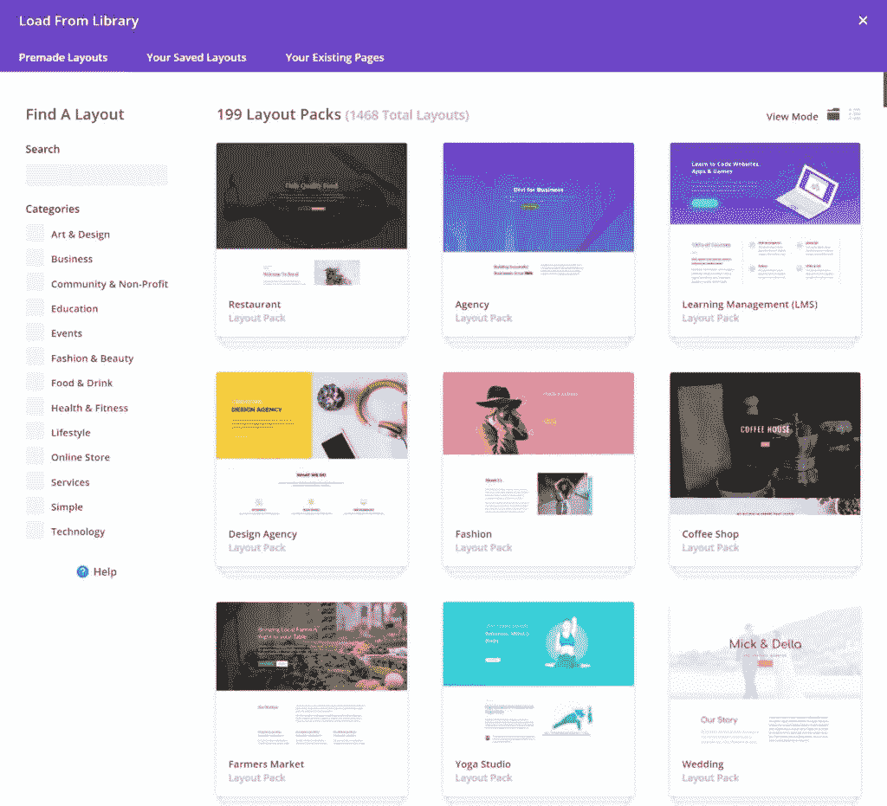

The Divi template library

您也可以将自己的设计保存为模板，以便以后重复使用。

### 元素或模板

Elementor 的模板有许多不同的风格，这取决于您正在构建的内容类型。就设计页面而言，您将获得两种类型的模板:

*   **页面:**这些是整页模板。使用 Elementor Pro，您可以获得大约 200 个模板。
*   **块:**这些是页面各部分的节模板。你可以像乐高一样把它们放在一起，设计出一整页。

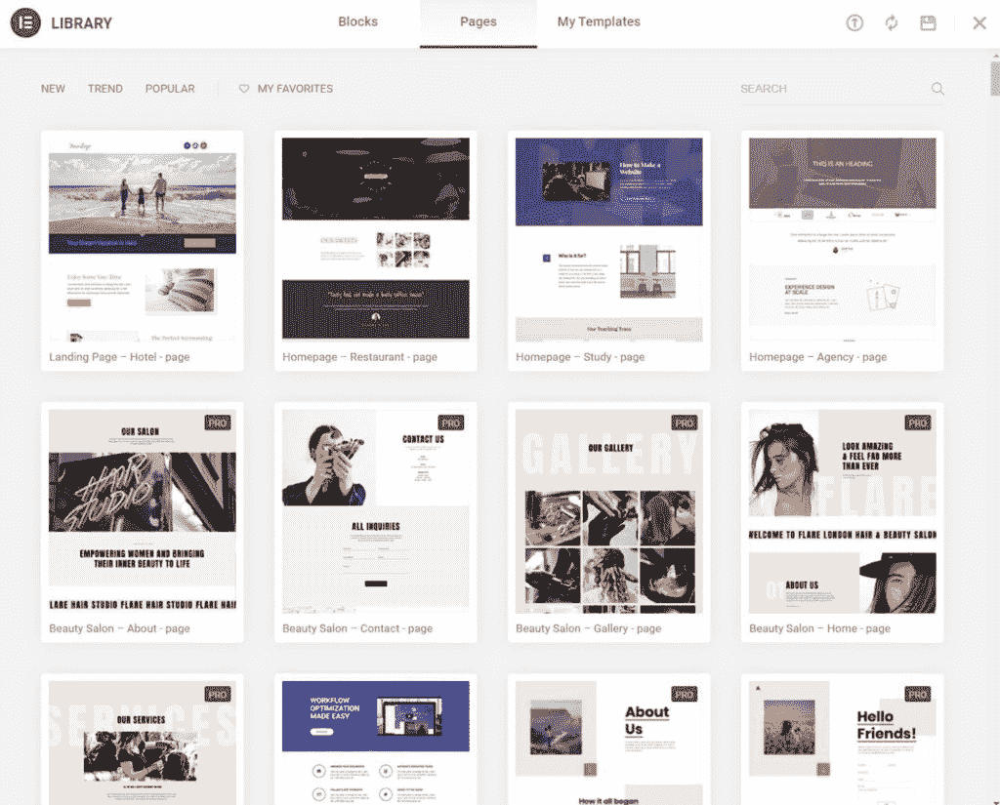

The Elementor template library

Elementor 还将它的一些模板组织成模板包，这些模板是围绕构建一个完整的网站(就像 Divi 一样)为主题的模板。然而，截至 2021 年 3 月，Elementor 提供了不到 25 个[模板套件](https://library.elementor.com/)，尽管他们每个月都会发布一个新的模板套件。

你还可以获得弹出窗口和主题构建的独立模板，这在技术上进一步扩展了 Elementor 的模板列表。

最后，您还可以保存自己的模板，以便以后重用。

## 分裂与元素或支持

Divi 和 Elementor 都为拥有有效许可证的客户提供 24/7 支持。不过，总的来说，Divi 略胜一筹，因为它为联系支持人员提供了更灵活的选择。

### Divi 支持

所有拥有有效许可证的优雅主题用户都可以获得 24/7 高级支持。一个很大的好处是，你可以通过对讲机获得实时聊天支持(这是我们在 Kinsta 使用的支持系统)。

这是一个很大的优势，因为在任何 WordPress 主题或插件中找到实时聊天支持是非常罕见的。

此外，如果您愿意，您还可以访问他们的旧[论坛支持系统](https://www.elegantthemes.com/forum/)。尽管论坛系统依赖于社区支持(优雅团队的工作人员不再在那里回答问题)。或者，您可以通过详细的[知识库文档](https://www.elegantthemes.com/documentation/)来帮助自己。

你也可以通过大型官方 Divi 主题用户脸书群组获得社区支持，该群组拥有超过 64，200 名成员。

### 元素或支持

Elementor 的付费客户将通过门票获得 24/7 的高级支持。此外，Elementor 还维护了一个详细的公共知识库，向您展示如何使用核心功能、解决常见问题等。

Elementor 在脸书也有一个很大的官方团体，在那里你可以得到超过 98，000 名成员的社区支持。对于免费和付费的 Elementor 用户来说，这都是一个不错的选择。

还有常见问题的分支组，如 [Elementor +哪个主题？](https://www.facebook.com/groups/elementorandwhichtheme/)和 [Elementor +哪个插件](https://www.facebook.com/groups/elementorandwhichplugin/)，还有一个专门的 [Elementor Pro 社区](https://www.facebook.com/groups/elementor.pro.community/)。

因为在脸书社区有如此多的人，所以在脸书社区你通常会比提交一张票更快地得到答案。

## Divi vs Elementor:你该选哪个？

最后，没有明确的赢家，这就是为什么这两个工具如此成功。这实际上取决于你的预算、你看重的功能和你喜欢的界面。

Elementor 可能是最好的起点，主要是因为如果你刚刚开始，它是免费的。你可以看到你是多么喜欢 Elementor 的免费版本，如果它对你有用，你就不用花钱就能得到一个很棒的工具。

如果你愿意支付，这是一个更艰难的决定。

首先，考虑每个工具的接口。有些人喜欢这个或那个，所以这是一种选择。您可以通过以下方式测试每个接口:

*   使用 Divi Builder 的[实时网络演示](https://www.elegantthemesdemo.com/?et_fb=1)
*   安装 element 或的免费版本

两者都给你顶级的风格和设计选择，所以很难宣布哪一个是赢家。当然，有一些小的功能差异，但这些不会影响大多数人。

其次，考虑是否有独特的特征可能会把你推向一个或另一个方向。例如，如果你是一名营销人员，你可能真的很重视 Divi 的内置 A/B 测试。

另一方面，营销人员也将重视 Elementor Popup Builder，这是一个多功能工具，从电子邮件选择加入到促销、调查等等。

性能方面，Elementor 略占优势。因此，如果性能对您来说是第一位的，那么这就是 Elementor 的优势所在。

当然，如果性能对你来说是最重要的，你可能首先要重新考虑使用可视化构建器，因为使用[本机块栈](https://kinsta.com/blog/gutenberg-wordpress-editor/)几乎肯定会帮助你实现更快的站点。

最后，还有定价。对于单个站点来说，Elementor Pro 更便宜。但是对于多个站点，从长期角度来看，Divi 在性价比方面有两大优势:

1.  入门级的 **$89** 优雅主题计划仍然允许在无限的网站上使用，而你需要更贵的 **$199** Elementor Pro 计划才能使用。Elementor Pro 的 1000 个站点计划将很快将其价格提高到 999 美元。
2.  优雅主题提供终身会员资格。如果你知道你将会使用这个工具很多年，从价值的角度来看，很难打败一个终生交易。对于 Divi 来说，一年许可和终身许可的盈亏平衡点大约是两年零九个月。

然而，请记住，终身许可的产品和服务是不可持续的。提供这些服务的企业必须跟上支持和开发成本的增长。最终，他们会降低支持质量，将业务卖给其他人，或者关闭业务。因此，明智地选择吧！

### 你能把 Elementor 和 Divi 一起用吗？

是的，有点。在同一网站上同时使用 Elementor 和 Divi 在技术上是可行的。然而，我们强烈建议不要这样做。试图这样做将会降低你的站点的速度(因为每个构建器都会加载自己的脚本)，增加很多复杂性，并且通常会让事情变得更加困难。

如果您绝对必须使用这两个插件(同样，我们真的不推荐)，您可以考虑使用一个插件，比如 Asset CleanUp，有条件地只在需要的地方加载每个构建器的脚本。当同时使用 Divi 和 Elementor 时，应该可以减少性能损失。

不过，与此相关的一点是，你可以将 Divi Builder 与 Elementor 的 Hello 主题结合使用，如果你打算使用 Divi 的新主题构建器来设计你的整个网站，这可能是一个比使用 Divi 主题更好的选择。

[Building a WordPress site shouldn't be a chore. Check out how Divi and Elementor, two of the most popular WordPress page builders, stack up against each other! 📊🥇Click to Tweet](https://twitter.com/intent/tweet?url=https%3A%2F%2Fkinsta.com%2Fblog%2Fdivi-vs-elementor%2F&via=kinsta&text=Building+a+WordPress+site+shouldn%27t+be+a+chore.+Check+out+how+Divi+and+Elementor%2C+two+of+the+most+popular+WordPress+page+builders%2C+stack+up+against+each+other%21+%F0%9F%93%8A%F0%9F%A5%87&hashtags=WordPress%2Cwebdev)

## 摘要

这就结束了我们对 Elementor 和 Divi 的比较。我们希望你觉得有用！

如果这两个仍然不符合你的要求，阅读我们的令人敬畏的列表 [WordPress 页面生成器](https://kinsta.com/blog/wordpress-page-builders/)。它包括一些 WordPress 社区的其他页面生成器，比如 GeneratePress with Sections、Beaver Builder、Oxygen 和 Brizy。

如果你想马上开始开发 WordPress 网站，看看 [DevKinsta](https://kinsta.com/devkinsta/) 。它是完全免费的(即使对非 Kinsta 客户来说也是如此)，它会帮助你立刻在你的电脑上建立一个本地 WordPress 站点。

关于 Divi 和 Elementor 之间的选择，你还有什么问题吗？在评论里问我们！

* * *

让你所有的[应用程序](https://kinsta.com/application-hosting/)、[数据库](https://kinsta.com/database-hosting/)和 [WordPress 网站](https://kinsta.com/wordpress-hosting/)在线并在一个屋檐下。我们功能丰富的高性能云平台包括:

*   在 MyKinsta 仪表盘中轻松设置和管理
*   24/7 专家支持
*   最好的谷歌云平台硬件和网络，由 Kubernetes 提供最大的可扩展性
*   面向速度和安全性的企业级 Cloudflare 集成
*   全球受众覆盖全球多达 35 个数据中心和 275 多个 pop

在第一个月使用托管的[应用程序或托管](https://kinsta.com/application-hosting/)的[数据库，您可以享受 20 美元的优惠，亲自测试一下。探索我们的](https://kinsta.com/database-hosting/)[计划](https://kinsta.com/plans/)或[与销售人员交谈](https://kinsta.com/contact-us/)以找到最适合您的方式。