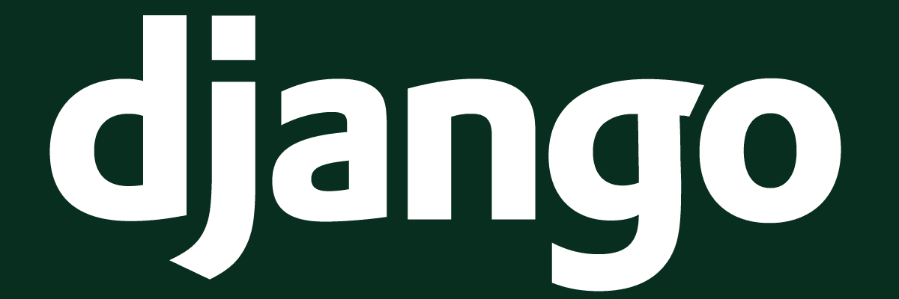
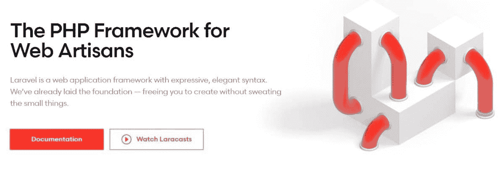
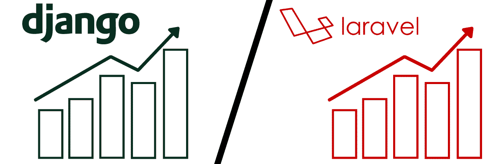
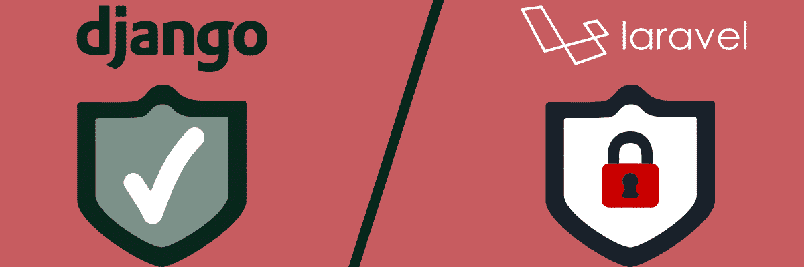
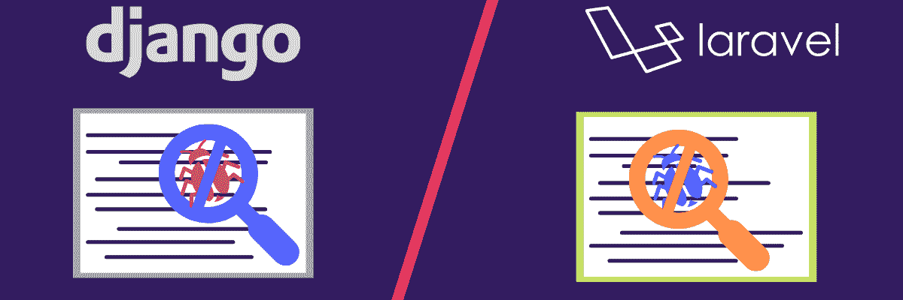
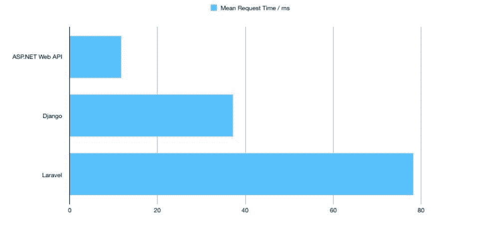
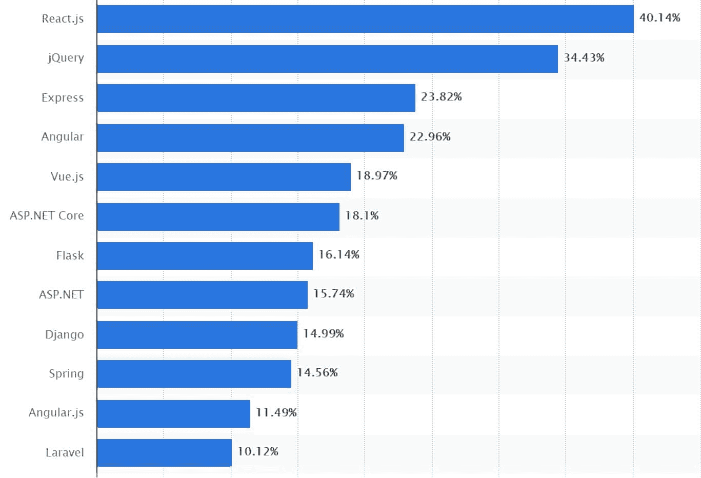
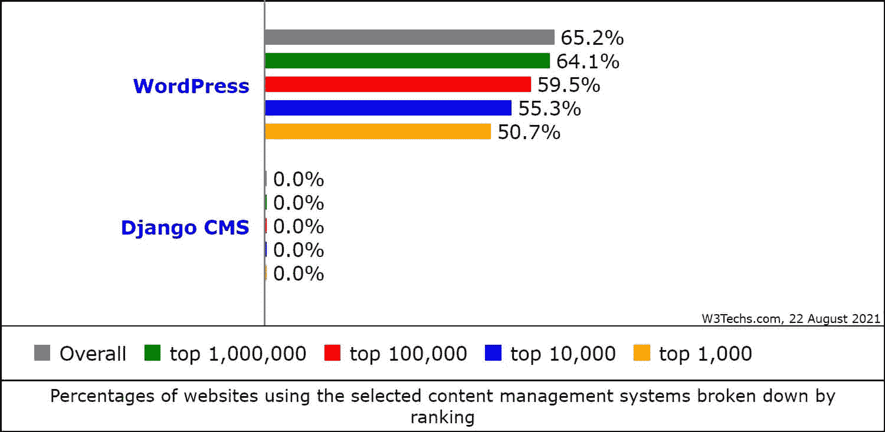
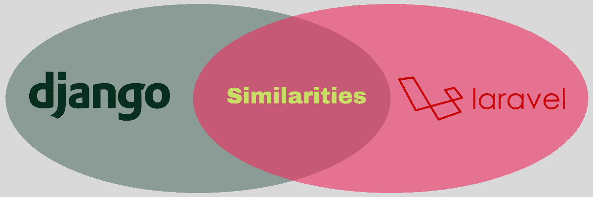

# django vs Laravel:2022 年哪个框架更好？

> 原文：<https://kinsta.com/blog/django-vs-laravel/>

选择像 Django vs [Laravel](https://kinsta.com/blog/laravel-tutorial/) 这样的 web 框架是 web 开发中最关键的决定之一。它可以成就一个项目，也可以毁掉一个项目，因为 web 框架就像一个“骨架”,你可以在这个骨架上构建你的 web 应用程序。

Django 和 Laravel 是两个最著名的 web 框架。两者都具有出色的特性、功能和能力，能够支持和满足各种垂直行业的用户需求。

本文旨在通过比较 Django 和 Laravel 的各种参数来解决这一争论，这些参数包括易学性、可用性、性能、安全性、可伸缩性、对数据库和微服务的支持、社区支持等等。但在此之前，让我们先巩固一下 web 框架的基本概念，然后是 Django 和 Laravel。

准备好了吗？让我们跳进来吧！

## 什么是 Web 框架？

web 框架是一个没有复杂性的软件框架或抽象。它们用于构建 web 应用程序，并将其部署在万维网上。

Web 框架旨在简化软件开发，尤其是对于那些可能还没有准备好从头开始编写代码的新 web 开发人员。相反，他们可以使用一段可重用的代码来构建应用程序并为其添加功能。该代码通常包含一个预模板结构和标准代码。

多亏了 web 框架，您可以直接跳到应用程序逻辑，跳过开发底层基础设施的麻烦。因此，您将能够轻松地创建一个整洁、专业的应用程序。

> Kinsta 把我宠坏了，所以我现在要求每个供应商都提供这样的服务。我们还试图通过我们的 SaaS 工具支持达到这一水平。
> 
> <footer class="wp-block-kinsta-client-quote__footer">
> 
> 
> 
> <cite class="wp-block-kinsta-client-quote__cite">Suganthan Mohanadasan from @Suganthanmn</cite></footer>

[View plans](https://kinsta.com/plans/)

[Your choice of web framework can make or break your project 😅 Learn more about these two popular options here ⬇️Click to Tweet](https://twitter.com/intent/tweet?url=https%3A%2F%2Fkinsta.com%2Fblog%2Fdjango-vs-laravel%2F&via=kinsta&text=Your+choice+of+web+framework+can+make+or+break+your+project+%F0%9F%98%85+Learn+more+about+these+two+popular+options+here+%E2%AC%87%EF%B8%8F&hashtags=Django%2CLaravel) ### 框架的类型:前端和后端

本质上，web 框架有两种类型:前端和后端。

#### 前端框架

前端框架也被称为客户端框架，在 [web 开发](https://kinsta.com/blog/web-development-tools/)中处理客户端问题。

简而言之，前端框架处理用户打开应用程序时看到的内容，而不涉及应用程序逻辑。这些框架主要用于改进用户界面，以获得更好的整体用户体验。您还可以使用前端框架创建大量动画功能和单页应用程序。

其他一些流行的前端框架包括 [Angular](https://kinsta.com/blog/php-vs-angular/) 、 [Vue.js](https://kinsta.com/blog/vue-js/) 和 Ember.js，它们都基于 [JavaScript](https://kinsta.com/knowledgebase/what-is-javascript/) 和 CSS。

#### 后端框架

也称为服务器端框架，后端框架与服务器或数据库内部发生的事情相关联。这些框架被用来处理应用程序的所有内部“内脏”。

后端框架处理数据、响应、[测试](https://kinsta.com/blog/performance-testing-tools/)等的存储和管理。它们还涉及一些核心功能，比如路由、模板、面向对象的映射等等。

这些框架帮助您开发登录页面、简单的网页和 web 表单等等。您可以使用它们来形成输出数据，并增强安全性以[减轻网络攻击](https://kinsta.com/blog/website-security-check/)。

一些流行的后端框架有 Django、 [Laravel](https://kinsta.com/knowledgebase/what-is-laravel/) 、Ruby on Rails 和 [Express.js](https://kinsta.com/knowledgebase/what-is-express-js/) 。它们也基于 [HTML](https://kinsta.com/blog/html-vs-html5/) 、JavaScript 和 CSS。

### 为什么要使用 Web 框架？

你可以在很多类型的 web 应用中使用 web 框架。你可以用它们来开发博客、网站、表格、[内容管理系统(CMSs)](https://kinsta.com/knowledgebase/content-management-system/) 等等。它们为您提供了创建完全符合您的业务规则和用户需求的应用程序的灵活性。

使用 web 框架可以节省您的时间，您可以将这些时间更好地投资到其他重要领域。不用从零开始创造一切，也不用浪费时间在低附加值、重复性的任务上，你可以把自己解放出来，专注于不同的、更重要的需求。

以下是为什么使用 web 框架很有帮助:

*   URL 映射: Web 框架通过简化站点索引来帮助 URL 映射。为此，它使您能够创建一个清晰的，有吸引力的，搜索引擎优化友好的网站名称。 [URL 映射](https://kinsta.com/knowledgebase/wordpress-multisite-domain-mapping/)也允许轻松访问网站 URL。
*   **安全性:**使用流行的框架会带来出色的[安全性暗示](https://kinsta.com/blog/wordpress-security/)。每个都有一个庞大的开发人员社区，通过识别安全漏洞并快速修复它们来加强框架，使其对您的应用程序安全。
*   成本:大多数 web 框架都是开源和免费的，这让你可以削减开发成本。您还可以更快地完成许多任务，从而加快上市时间。
*   效率:使用框架，整个开发过程变得毫不费力，因为你不需要为每个组件或功能编写代码。您可以使用预建的函数来节省精力和时间。
*   **支持:**有了广泛的开发人员社区和全面的文档，您可以轻松理解框架。即使您遇到一些困难，您也可以联系其他开发人员和专家来消除您的疑虑。

如今有了广泛可用的工具、库和框架，选择正确的工具、库和框架有时会变得很困难。这就是为什么仔细检查每个 web 框架和工具集以确定哪个最有可能使您的 web 开发过程变得简单、快速和方便是至关重要的。

检查你习惯使用的 web 框架的编程以及它支持的工具范围。它必须帮助您轻松管理每项任务。

Django 和 Laravel 是两个最流行的 web 开发框架。他们给彼此激烈的竞争；因此，开发人员有时会发现在它们之间做出选择很有挑战性。

但是不要担心——我们提供了一篇 Django 与 Laravel 的比较文章，帮助您根据自己的具体需求做出决定。

## 姜戈 vs 拉弗尔:他们是什么？

在我们进入比较模式之前，让我们来看看这两个框架是关于什么的，以便更深入地理解它们的核心概念、技术细节和用法。

### 姜戈是什么？

Django logo.

Django 是一个开源的免费的基于 Python 的 web 框架。它于 2005 年发布，由 Django 软件基金会开发和维护。Django 有一个 3 条款 BSD 许可，最新发布的版本是 Django 3.2。

这种高级 web 框架使得用更少的代码快速开发更好的 web 应用程序变得毫不费力。Django 鼓励干净实用的设计来快速开发 web 应用程序。由于其可读的语法，它可以节省开发人员的时间和精力。它轻量级且灵活，可用于开发和测试。

Django 致力于模型-视图-模板(MVT)架构，使 web 应用程序设计美观且功能强大。它高度适用于多个行业的不同类型的项目，并包含几个预制的功能包。

它非常适合创建复杂的应用程序。由于它是基于 Python 的框架，它有助于开发数据科学、计算、人工智能(AI)和机器学习(ML)以及其他科学用途的产品。

#### Django 的特点

*   免费和开源:Django 是免费和开源的，你只需要下载并安装它，然后使用它来构建你的应用。它最大限度地降低了开发成本，同时也增加了便利性。你甚至可以为修复 bug 和编码做出贡献。
*   简单性: Django 旨在简化复杂的、数据库驱动的应用程序和网站的开发。它具有简单语法的易读代码对学习者来说是友好的，尤其是对新开发人员来说——它的学习曲线几乎是平坦的，所以你理解它并在你的 web 应用程序中使用它不会有太大的困难。
*   难以置信的快:这个框架使开发人员能够在更短的时间内将他们的应用从概念到完成。它是为快速的 web 开发而设计的，这样你就可以快速构建大量的应用程序。
*   **高度安全:** Django 是一个安全框架，旨在抵御安全漏洞、、点击劫持、跨站脚本和请求伪造等有害攻击。它有一个安全的用户认证系统，为管理用户密码和帐户提供安全性。
*   **可伸缩:**现代应用必须提供高可伸缩性以满足高流量需求。Django 可以快速扩展以支持用户群的增长，即使在高峰时期也能承受高流量。
*   功能齐全: Django 拥有许多处理 web 开发活动的额外功能。它可以处理内容管理、用户认证、RSS 提要、[站点地图](https://kinsta.com/blog/wordpress-sitemap/)和其他开箱即用的任务。
*   易于管理:Django 高度灵活的架构提供了从概念化到最终部署的开发任务的简单管理。您还可以获得一个可选的管理界面来创建、更新、读取和删除内容。它[使用 Python](https://kinsta.com/blog/php-vs-python/) 处理文件、设置和数据模型。
*   **灵活性和多功能性:**您可以使用 Django 构建各种软件产品，从单页网站到复杂的应用程序、社交网络和科学计算系统。
*   **可扩展性:** Django 有一个配置系统，如果它符合可重用的应用程序约定，它允许您将第三方代码插入到项目中。有 2，500 多个软件包可用于扩展该框架的功能，并包括其他解决方案，如搜索、注册、 [CMS](https://kinsta.com/blog/cms-software/) 、API 消费和供应等。

#### Django 是做什么用的？

Django 非常适合包含大量文本内容、高流量、[媒体文件](https://kinsta.com/blog/wordpress-media-library/)的项目，以及其他基于 web 的项目。它还可以高效地构建[电子商务网站](https://kinsta.com/blog/ecommerce-platforms/)、金融应用、医疗保健软件、预订、交通、社交媒体网站以及与食品和饮料相关的应用，等等。

Django 最常用于创建:

*   用于内部信息的定制客户关系管理(CRM)解决方案和用于管理业务通信的 [B2B CRM 系统](https://kinsta.com/blog/wordpress-crm/)
*   高流量购物商店和[预订引擎](https://kinsta.com/blog/wordpress-booking-plugins/)
*   支持网络应用的 iOS 和 Android 移动应用
*   可以根据风险承受能力、个人数据等计算分析近似结果的金融平台。
*   文档管理解决方案和房地产评估系统
*   处理[法律问题的解决方案](https://kinsta.com/blog/dmca-takedown-notice/)以及促进企业与其客户之间沟通的平台
*   独立的功能，如电子邮件系统、基于算法的生成器、管理仪表板、投资基金管理界面、数据分析工具、验证系统等

#### 谁用姜戈？

从初创公司到大型企业，各种规模的组织都利用 Django 来构建他们的 web 应用程序。它的灵活性、易用性和速度吸引了世界上最大的科技巨头的注意。

Instagram、NASA、Spotify、Dropbox、Mozilla、华盛顿邮报、Reddit、Udemy 和 Pinterest 等巨头都在使用 Django，这只是其中的几个例子。

### 什么是 Laravel？

Laravel homepage.

[Laravel](https://kinsta.com/knowledgebase/what-is-laravel/) 是一个基于 [PHP 的](https://kinsta.com/knowledgebase/what-is-php/)免费开源的服务器端 web 框架。它是由 Taylor Otwell 在 2011 年开发的，旨在开发 web 应用程序。Laravel 拥有麻省理工学院的许可，其最新版本是 Laravel 8，于 2020 年 9 月发布， [Laravel 9 预计于 2022 年 1 月](https://kinsta.com/blog/laravel-9/)。

Laravel 拥有模型-视图-控制器(MVC)架构，基于另一个 PHP 框架: [Symfony](https://symfony.com/) 。它的源代码存放在它的专用 [GitHub](https://kinsta.com/knowledgebase/what-is-github/) 页面上。Laravel 具有优秀的特性，可以让开发者轻松进行 web 开发，并且是当今[最受欢迎的 web 框架](https://kinsta.com/blog/php-frameworks/)之一。

您可以使用它来构建不同类型的软件应用程序和网站，从新闻网站和 CMS 到简单的网络平台。

#### 拉勒维尔特征

与 Django 类似，Laravel 也有广泛的功能，可以帮助开发人员轻松地创建产品。Laravel 的一些特点是:

*   **免费开源:** Laravel 是开源的，可以免费使用。麻省理工学院的许可证允许你以任何开发者想要的方式为他们的产品操作它的代码。因此，所涉及的开发成本直线下降。
*   **富有表现力和优雅的语法:**其富有表现力和流畅的语法是开发人员友好的。你可以构建各种各样的软件产品，而不用为一些小的、重复的事情而烦恼。
*   **模块化封装:**自 Laravel 3 发布以来，[包](https://laravel3.veliovgroup.com/docs/bundles)已被包括在内，可在应用程序中轻松使用。此外，Laravel 4 利用了 Composer——一个用于特定于 Laravel 且与框架无关的 PHP 包的依赖管理器——您可以从 Packagist 访问它。
*   **Artisan CLI:**Laravel 中的命令行界面(CLI)称为 Artisan，在 Laravel 3 中发布。它融合了 Symfony 的各种组件。它有助于更高效地管理和创建基于 Laravel 的应用程序。它还[管理数据库](https://kinsta.com/blog/wordpress-database-plugin/)迁移、播种、创建样板代码、发布包资产等等。
*   查询构建器:它提供了直接的数据库访问和一套能够以编程方式创建查询的方法和类。它不需要您直接编写 SQL 查询。并且您还可以[有选择地缓存](https://kinsta.com/blog/laravel-caching/)执行的查询结果。
*   **雄辩的 ORM:** 雄辩的对象关系映射(ORM)是一个复杂的基于 PHP 的活动记录模式实现。它允许您对数据库对象的关联方式施加约束。它还允许开发人员使用 PHP 语法进行数据库查询，而不是编写 SQL 代码。
*   **应用逻辑:**这通过路由声明或使用控制器来实现。应用程序逻辑的语法与 Sinatra 框架的语法相匹配。
*   **Restful 控制器:**这些控制器提供了一个选项来分离`POST`和`GET`请求背后的逻辑。
*   **反向路由:**这定义了路由和链接的关系，并使以后的更改自动应用于相关链接成为可能。
*   **类自动加载:**提供自动化的 PHP 类加载，无需手动维护包含路径。按需加载可以防止您包含不必要的组件。
*   **模板引擎:**使用一个数据模型将多个模板组合起来，通过将模板传输到缓存代码中来生成视图，以获得更好的性能。这是一个创建动态站点的不可思议的工具，它还提供了控制结构，包括循环和内部条件语句映射器。
*   **迁移:**这些为数据库模式提供版本控制，以关联代码库和数据库布局的变化。因此，它简化了应用程序的部署和更新。

除此之外，Laravel 还有许多其他高级特性，如用于生成新对象的控制反转(IoC)容器、用于检测和减轻回归的单元测试、自动分页、Homestead(一个流浪的 VM)、Canvas(发布平台)以及用于处理大量数据负载的惰性收集。

#### Laravel 是做什么用的？

Laravel 以其丰富的特性和功能使 web 开发成为一种创造性的体验。它简化了标准的 web 开发任务，如[缓存](https://kinsta.com/blog/laravel-caching/)、认证、路由和[会话](https://kinsta.com/blog/wordpress-cookies-php-sessions/)。

Laravel 是一款功能强大且易于使用的工具，您可以使用它来构建:

*   强大的大型应用程序
*   基于 PHP 的定制 web 应用程序
*   功能丰富的多语言 CMS 平台和博客网站
*   [静态和动态页面](https://kinsta.com/blog/wordpress-vs-static-html/)
*   社交网络平台和 SaaS 应用程序
*   电子商务网站和企业级应用
*   论坛、新闻、[求职门户](https://kinsta.com/blog/wordpress-job-board-plugin/)等门户网站

#### 谁用 Laravel？

使用 Laravel 的企业来自不同的垂直行业，包括 IT、SaaS、医疗保健、金融、娱乐、[旅游](https://kinsta.com/blog/wordpress-vs-static-html/)和零售。

Laravel 的一些著名用户是丰田名人堂、BBC、UNION、联想、维基百科、联邦快递、9GAG、Laracasts、Asgard CMS 和许多其他用户。

## Django vs Laravel:一个深入的比较

在上一节中，我们谈到了 Django 和 Laravel。现在，让我们开始比较这两个框架的各种参数，以帮助您做出更好的决定。

### 哪个更容易学？

Comparing Django vs Laravel on learnability.

就学习曲线而言，比较 Django 和 Laravel 可能过于主观，难以断言，因为这将因人而异。但是如果你比较它们的语法和编码，你可以得出几个结论。

由于 Django 是基于 Python 的 web 框架，所以学习起来毫不费力。Python 是一种开发人员友好且易于使用的语言，即使对于初学者也是如此。

尽管它在路由过程中使用了正则表达式(RegEx ),这对于初学者来说并不友好，但是您可以通过一些努力来学习它。Python 是为可读性而设计的，具有清晰的格式、简单的英语和简单的语法，而不是标点符号。它利用空白缩进而不是花括号来给语义提供精确的视觉效果。

在编码中很少出现语法异常和罕见分号的例外情况。Python 的所有这些属性使得 Django 非常容易学习，出错的机会也更少。

另一方面，Laravel 有一个陡峭的学习曲线，尽管有全面的文档和大量的工具，如 Laracast。虽然学习 Laravel 很直观，也有丰富的资源，但需要一段时间才能掌握。

由于 Laravel 是一个基于 PHP 的框架，与 Python 相比，它有许多复杂性。PHP 的语法类似于 C，C++，和 [Java](https://kinsta.com/blog/defer-parsing-of-javascript/) ，有函数返回，循环，if 条件。但是变量名区分大小写，并使用分号来终止语句。您需要使用花括号、操作符和符号来表示方法。这些 PHP 属性使得 Laravel 有点复杂，需要更长的时间来学习和掌握。

**胜利者:**姜戈。

### 表演

Comparing Django vs Laravel’s performance.

性能是开发软件应用程序时要考虑的最重要的因素之一。用户希望应用程序运行得快，因为没有人有时间和耐心去处理响应缓慢的网站和应用程序。

虽然硬件资源、存储空间、内存等。，是一些影响性能的因素，[编程语言](https://kinsta.com/blog/best-programming-language-to-learn/)和 web 框架的选择也是一个显著的因素。

因此，如果您希望您的应用程序运行良好，选择一个可靠的、注重性能的 web 框架是必要的。它必须支持应用程序，这样它最多可以在 2-3 秒内加载。

也就是说，Django 是高性能的，因为它使用 Python，Python 提供了[卓越的速度和性能](https://kinsta.com/google-cloud-wordpress/)。它的执行和代码编译速度很快，允许您加快您的 web 开发过程。它还使检测和快速解决代码中的问题变得相对容易。

然而，当序列化/反序列化 JSON 字符串、通过中间件运行请求以及将[数据库查询](https://kinsta.com/blog/wp-query/)更改为基于 Python 的对象时，您可能会体验到速度降低。但是您可以通过部署高性能硬件、识别最佳用例以及遵循最佳 web 开发实践来快速绕过这些问题。

现在，至于 Laravel，它很坚固，并带有大量内置功能。如此多不同组件的可用性有时会使它比其他框架慢。为此，开发人员需要寻找其他方法来加速开发过程。但自从 PHP 7 以来，Laravel 的速度和性能都有所提高，使其更具竞争力。

**胜利者:**姜戈。

### 应用架构

Comparing Django vs Laravel Application Architecture.

应用程序架构是 web 开发中的一个基本考虑因素，它允许您根据独特的需求构建应用程序。它不能强加严格的指导方针和架构来限制你的创造力。

你会想尝试使用一个 web 框架，它可以作为一个指南，而不是一个严格的方法。那么，我们来看看 Django vs Laravel 在应用架构方面的情况。

Django 遵循模型-模板-视图(MVT)架构，不同于 Laravel 的模型-视图-控制器(MVC)架构。

MVT 是一种设计模式，包括关键组件:模型、视图和模板。

*   **Model** 是一个数据访问组件，帮助你处理数据库和数据相关的逻辑。
*   **视图**帮助执行您的业务逻辑，与携带数据的模型交互，并呈现模板。
*   **模板**是管理用户界面的表示层。

在 Django MVT，包含 Django 模板语言和 HTML 的模板文件促进了动态站点创建，而不是使用 MVC 中的控制器。因此，它为管理每个用户都可以拥有个性化订阅源的不同场景提供了更多便利，例如像 Instagram 这样的社交媒体订阅源。因此，Django 更适合快速执行修改，并且适用于所有规模的应用程序。

另一方面，Laravel 使用 MVC，区别在于它使用“控制器”而不是“模板”。MVC 是一种设计模式，包括三个部分——模型、视图和控制器——来处理 web 应用程序开发过程的特定方面。在这里，控制器作为视图和模型组件之间的接口，处理传入的调用和业务逻辑，操纵数据，并呈现输出。

MVC 架构使您能够灵活地划分开发人员的角色，以执行高效的开发过程。前端框架可以处理视图，而后端开发人员可以并行处理控制器逻辑。它让你完全控制应用程序，所以你可以很容易地选择路线，并提高其外观。此外，它还能帮助你[优化你的应用程序的 SEO](https://kinsta.com/blog/wordpress-seo/) ，并使应用程序的逻辑重用变得毫不费力。

或者，你可以创建一个单独的健壮的应用后端支持，但是它很难修改并且不适合开发更大的应用。

**胜利者:**姜戈。

### 可量测性

Comparing Laravel vs Django’s scalability.

您使用的编程语言或 web 框架会影响应用程序的可伸缩性。这是因为您的应用程序必须随着业务的增长而扩展，以满足用户和市场的需求。

合适的框架让您能够承受[繁重的流量](https://kinsta.com/knowledgebase/dedicated-server/)，尤其是在高峰事件期间，并且能够根据您的业务需求灵活地扩大或缩小规模。因此，决定 Django 和 Laravel 哪个更适合您的应用程序是您开发之旅的第一步。

Django 从高度可扩展的 [Python](https://kinsta.com/blog/python-tutorials/) 语言继承了它的可扩展性，以及它的机器学习和人工智能能力。Django 可以与不同的技术无缝协作，同时保持最佳的加载时间和性能。无论您希望使用解耦的和独立的组件来创建应用程序还是部署 ML 模型，Django 都会被证明是有帮助的。

Django 简化了各种操作，帮助您优化可伸缩性的关键元素，比如 CSS、图像、数据库、负载平衡等等。此外，它还可以帮助您通过高效、轻松地实施云和 [CDN 解决方案](https://kinsta.com/blog/wordpress-cdn/)来为进一步扩展腾出空间。因此，从长远来看，它是实现可伸缩性的最有价值的框架之一。

另一方面，Laravel 也提供了良好的可扩展性，因为它使用 PHP 来支持不断增长的业务。如果您将 Laravel 与优秀的负载平衡器和[数据库](https://kinsta.com/knowledgebase/laravel-database/)配对，您可以实现优秀的水平伸缩。您还可以通过利用 [AWS](https://kinsta.com/aws-market-share/) 、MySQL 和高级缓存来扩展基于 Laravel 的应用程序，以满足您当前的需求。

然而，在响应不断增长的需求和新趋势方面，PHP 提供的灵活性不如 Python。为此，Laravel 的可伸缩性也不如 Django 的出色。

**胜利者:**姜戈。

### 安全性

Comparing Django vs Laravel’s security.

网络攻击，如 [DDoS 攻击](https://kinsta.com/blog/what-is-a-ddos-attack/)、跨站脚本(XSS)、病毒、恶意软件、网络钓鱼诈骗等。，变得越来越频繁，给在线生态系统带来了比过去更大的风险。当网络攻击来袭时，所有企业都会在数据、用户信任、声誉和金钱方面遭受巨大损失。

这就是为什么你需要构建一个提供最佳安全性的应用程序来保护你的业务和用户数据并节省资金。为此，您需要选择更安全的 web 框架。

Python 的安全性比 PHP 好，所以有了 Django，你就不用担心构建复杂的 app(或者过于简化的)。Python 是最安全的语言之一。它可以保护您的应用程序免受几乎所有的威胁。所以，自然地，Django 是一个更安全的 web 框架。

## 注册订阅时事通讯

### 想知道我们是怎么让流量增长超过 1000%的吗？

加入 20，000 多名获得我们每周时事通讯和内部消息的人的行列吧！

[Subscribe Now](#newsletter)

Django 还有一个安全的用户认证系统来管理账户和密码。此外，它还采取了一些措施来减少常见的安全错误，如 XSS、跨站点请求、伪造、点击劫持等。

另一方面， [86%的基于 PHP](https://www.computerweekly.com/news/4500259915/Veracode-finds-most-web-apps-fail-Owasp-security-check-list) 的应用至少有一个 XSS 漏洞，而 56%的应用至少有一个 T2。由于 Laravel 使用 PHP，很明显它比 Django 有更高的安全风险。尽管 PHP 社区正在努力解决这些安全问题，但您仍然可以考虑更安全的选择。

值得称赞的是，Laravel 使用加盐和散列密码，不允许密码以纯文本的形式保存在数据库中。除此之外，它还利用“Bcrypt 哈希算法”来创建加密的密码表示。它还有保护用户免受网络攻击的机制，如 XSS、SQL 注入、截取数据、有害的 cookies 等。

不过 Django vs Laravel 之间比较安全的 web 框架还是 Django。这就是为什么像 NASA 这样的大公司使用它。

**胜利者:**姜戈。

### 易于测试和调试

Comparing Laravel vs Django on ease of testing and debugging.

没有一个应用程序是完美的。总会有一个或多个与应用程序相关的问题，无论是性能、安全性、用户体验还是其他。消除这些问题是确保应用程序顺利运行所必需的。

为此，您需要定期[执行多项测试](https://kinsta.com/blog/performance-testing-tools/)来发现问题并调试它们，以确保性能、可用性、兼容性和符合 UI 标准。

您的 web 框架必须足够灵活，以便在不复杂的情况下轻松测试和调试。否则，它将消耗大量的精力、时间和金钱，并打开更多的安全漏洞。因此，基于测试和调试的容易程度来比较 Django 和 Laravel 是至关重要的。

Python 是一门比较容易的语言，所以它的[调试](https://kinsta.com/blog/wordpress-debug/)并不难。网上也有很棒的调试器可以帮助你测试代码(比如 Python Debugger，对初学者来说特别方便)。

因此，测试一个基于 Django 的应用程序并不是一个大问题，因为有很多工具可以简化测试过程。为了使它更加有效和容易，你可以直接参考他们的文档来测试不同层的代码，以产生一个可靠的、没有错误的应用程序。

另一方面，Laravel 在两个不同的层面上测试你的代码:特性测试和单元测试。像 Django 一样，您可以浏览其全面的测试文档，在不同的级别测试代码，包括模拟测试。

此外，PHP 调试起来有些棘手，可能需要额外的工作。但是，您可以使用 PHP 调试器(比如 XDebug)来简化调试过程。因此，如果你使用 Laravel，你可以使用许多可用的测试工具来确保你的应用程序没有错误。有大量的测试工具可以使这部分工作变得方便。

赢家:这是一个平局——大量的工具和资源使得 Django 和 Laravel 的测试和调试变得很容易。

### 支持的库

为了快速开发，您可以将您选择的 web 框架与它支持的库集成在一起。库是可重用的代码，它允许你立即为应用程序或网站添加更多的特性和功能，而不是为每件事都编写新的代码。

因此，您可以节省大量开发应用程序的时间，降低测试难度，最大限度地降低成本，并更快地在市场上部署应用程序。这就是为什么必须了解 Django 和 Laravel 之间哪个 web 框架有更好的库。

Django 是一个“包含电池”的 web 框架，它有一个广泛的软件包库。许多自包含包提供了适用于广泛项目的可重用特性。您可以在 Django 项目中使用的一些基于 Python 的库是 Django Rest Framework、Django-cors-headers、Django Filters 和 Django Storages。

至于 Laravel，它也有一套很好的库，因此您可以使用它们构建各种站点和应用程序。Laravel 支持一套引人注目的面向对象的库和预装库，如认证库。这是你在 CodeIgniter 和 Symfony 等其他框架中找不到的好处。

此外，Laravel 还有出色的优化 app 性能的包，比如 Spatie、Laravel Debugbar、Entrust、Socialite 等等。

胜者:平手。他们都有大量的图书馆。

### 数据库支持

[数据库](https://kinsta.com/knowledgebase/wordpress-database/)是一个系统，用于存储与应用程序、站点或项目相关的所有关键文件和信息。因此，您需要一个高效的数据库来存储项目数据并有效地组织数据。如果您在数据库中访问或操作数据时也小心谨慎，这将会有所帮助，因为数据库中存储着您的敏感信息。

为您的项目选择正确的数据库是必要的。您将选择什么取决于您项目的需求，这就是为什么我们要根据 Django 和 Laravel 支持的数据库来比较它们。

Django 官方支持的数据库有 [MySQL](https://kinsta.com/blog/mysql-version/) 、Oracle、 [MariaDB](https://kinsta.com/blog/mariadb-vs-mysql/) 、 [PostgreSQL](https://kinsta.com/knowledgebase/what-is-postgresql/) 和 SQLite。除了无缝地使用所有这些数据库之外，它还允许您使用第三方库和包添加其他数据库。此外，如果需要，Django 为您提供了同时使用多个数据库的选项。说到数据库支持，Django 不会让人失望。

另一方面，Laravel 支持 MySQL、PostgreSQL、SQL 和 SQLite。此外，它毫不费力的查询生成器、雄辩的 ORM 和原始 SQL 简化了与所有这些数据库的通信过程。它还使您能够更方便地连接多个数据库。用 Laravel 使用数据库不会有任何问题。

胜者:平手。

### 微服务兼容性

微服务用于开发应用程序。它们代表了一种架构方法，在这种方法中，一个应用程序被构建为一组更小的服务。这些服务是松散耦合的、可测试的、高度可维护的，并且是围绕业务能力组织的。

这种类型的架构提供了复杂和大型应用程序的快速、可靠和频繁的部署。它提供的好处是，您的开发团队可以快速创建新的组件，并及时满足不断变化的用户需求。

Django 兼容微服务的架构。它支持快速部署、多功能性和[内置安全性](https://kinsta.com/blog/cloud-security/)。您可以通过将 Django 项目分成具有不同职责和功能的更小的微服务来快速扩展它。此外，Django 是在您的应用程序中包含 ML 和 AI 功能的绝佳选择。

现在说说 Laravel，它也支持微服务，就像 PHP 支持一样。对于 Laravel 来说，应用程序被分成更小的构建块，每个块都有自己的功能。这些函数使用与语言无关的 API 进行交互。因此，该应用成为微服务兼容的。

但是，您也可以选择使用 Laravel 的轻量级版本 Lumen 来有效地实现微服务。

**胜利者:**姜戈。

### 基准测试结果

为了确保您的软件以最佳性能运行，建立性能基准测试标准是必不可少的。基准测试允许您确定应用程序在给定工作负载下的性能。它帮助您调查、测量和验证代码的可伸缩性、性能、使用和其他因素。

在软件开发中有不同种类的基准测试，例如负载、耐久性、断点和峰值的基准测试。这就是为什么我们要在基准测试的基础上比较 Django 和 Laravel。

需要为您的电子商务网站提供超快的、可靠的、完全安全的托管服务吗？Kinsta 提供所有这些服务，并由 WooCommerce 专家提供 24/7 的世界级支持。[查看我们的计划](https://kinsta.com/plans/?in-article-cta)

Django 有很多工具来[在响应时间、并发性等方面执行性能基准](https://kinsta.com/blog/application-performance-monitoring/)。您可以使用`django-debug-toolbar`来深入了解代码是如何工作的，以及这样做所花费的时间。例如，它可以显示从网页生成的 SQL 查询以及每个查询所用的时间。

此外，您还可以找到工具栏的第三方面板来报告渲染时间和缓存性能。此外，第三方服务也可用于分析页面性能，并从远程 [HTTP](https://kinsta.com/blog/wordpress-http-api-part-1/) 客户端的角度报告性能，模拟真实的用户体验。这类工具的两个例子是[谷歌的 PageSpeed](https://kinsta.com/blog/google-pagespeed-insights/) 和雅虎的 Yslow。

根据[本次 2018 基准测试](https://medium.com/@jamesjudd_21057/benchmarking-the-request-time-of-laravel-asp-net-core-and-django-7c1c3e9663d)，Django vs Laravel 基于请求次数进行了对比。这个测试表明 Django 的响应时间是 37.211 毫秒，而 Laravel 的是 77.995 毫秒。Django 在这方面表现更好，ASP.NET Web API 表现更好。

Benchmarking results for ASP.NET Web API vs Django vs Laravel.

Laravel 相对来说是一个性能较慢的 web 框架。[这个 GitHub 源码](https://github.com/kenjis/php-framework-benchmark)比较了 PHP 框架的执行情况，其中 Laravel 是从底部“上”的。是的，你没看错——最慢的。这是由于几个因素，如缺乏一个公认的标准来衡量应用程序的速度。如果慢了，那么慢到什么程度，或者在什么新的条件下？[这就是为什么需要适当的基准测试](https://medium.com/@taylorotwell/benchmarking-laravel-symfony-zend-2c01c2b270f8)。

你可以使用各种工具来优化你的基于 Laravel 的应用，比如电子商务商店。其中一些工具是 PHP-FPM、Redis 和 CDN，如 CloudwaysCDN。

**获胜者:** Django(注意:该基准测试结果并非来自实际生产的应用程序)。

### 证明文件

无论你是一个有经验的开发人员还是一个初学者，在为你的项目选择一个 web 框架或编程语言之前，[文档](https://kinsta.com/knowledgebase/devkinsta/)是你应该做的第一件事。好的文档——包括所有关于技术的适当排列的信息，并随着时间的推移频繁更新——当您陷入困境或需要更深入地理解某个概念时，可以作为参考指南。

这就是为什么基于 Django 和 Laravel 的文档比较他们是必要的。

Django 的文档易于理解且内容丰富。它的内容是彻底的，组织良好的，交叉引用的，用深度和例子解释每个概念。如果你遇到一个不常用的术语，你会找到一个详细描述的链接，以便更好地理解。

Django 的文档还提供了全面的教程和易于导航的 API 参考。此外，创建者组织了他们的源代码，使其易于阅读。您将找到针对不同概念、问题和用例的演练、主题指南、参考指南和操作指南。

您还可以在模型、视图和模板层中看到每个概念的引用。文档解释了 web 应用的标准工具、核心功能、[性能和优化](https://kinsta.com/learn/page-speed/)等等。

如有疑问，您可以详细查看 FAQ、索引和目录，或者使用他们的票证跟踪器报告错误。总的来说，Django 的文档是最好的，并得到了开发人员的好评。

另一方面，Laravel 文档并没有那么好。不幸的是，出版商似乎没有维护好它，以充分跟上框架日益增长的复杂性。尽管例子很长，但并不充分(例如，关于雄辩的 ORM 和 API 的例子)。

总的来说，Laravel 的文档有些零散，没有跟上新版本。导航到相关的 API 页面也不容易。

**胜利者:**姜戈。

### 开发者社区和支持

一个积极支持的开发者社区总是很有帮助的。它有助于通过反馈和修改来改进语言或 web 框架，并帮助专业人员建立网络和互相帮助。此外，一个强大的开发人员社区支持新开发人员，并提供一个场所，让他们可以从专家那里消除疑虑。

让我们根据 Django 和 Laravel 的社区和支持程度来比较一下。

Django 有一个庞大的开发者社区，致力于增强 web 框架。你甚至可以订阅他们的邮件列表，了解 Django 社区的最新动态。它在 Reddit 上有 82k+的会员，在 GitHub 上有 25.1k+的分叉，有 58.8+的星。社区也非常活跃，并迅速扩大；你可以在其他社交渠道和网站上找到它，如 Telegram、 [Discord、Slack](https://kinsta.com/blog/slack-vs-discord/) 和 Stack Overflow。

Laravel 还有一个很棒的开发人员社区，因为它是基于 PHP 的，所以吸引了一个强大的 PHP 开发人员社区。它在 Reddit 上有 62.2k+的工匠，在 GitHub 上有 8.3k+的叉子，有 24.5k+的星星。Laravel 和 PHP 的联合社区非常强大——开发人员共享新闻、播客、文档和存储库，你可以在其他各个地方找到并认识该团体的成员，如 Dev、Laravel.io、Laracasts 和 Stack Overflow。

胜者:平手。

### Django REST API vs Laravel REST API

应用程序开发人员广泛利用应用程序编程接口(API)，一组有助于构建应用程序软件和集成的[协议](https://kinsta.com/blog/ipv4-vs-ipv6/)和定义。它帮助您与系统交互，通过理解和满足请求来执行特定功能或检索信息。

现在， [RESTful API](https://kinsta.com/blog/wordpress-rest-api/) (REST API)也是一种 API——一种与 REST 架构一致并允许您与 RESTful 服务交互的 API。在这里，REST 代表具象状态转移。API 充当用户和他们想要访问的 web 服务或资源之间的公共基础。此外，企业可以使用 API 通过适当的身份验证、控制和安全性来共享信息和资源。

所有这些都要求您选择一个对 RESTful API 有更好支持的 web 框架，否则您可能不一定喜欢它有限的功能。

Django 没有提供支持 API 构建的内置特性。因此，您将需要一个库来使用 Django 的 API。

相反，Laravel 提供内置的 API 支持。默认情况下，Laravel 中的查询返回 JSON。这就是 Laravel 相对于 Django 的优势:这是显而易见的，尤其是如果您计划创建 API 来满足特定的客户需求。

**获胜者:**拉勒维尔。

### 知名度和市场份额

The popularity of various web frameworks.

根据 Statista 为寻找 2021 年开发人员中最受欢迎的框架而进行的调查，发现 [React](https://kinsta.com/knowledgebase/what-is-react-js/) 以 40.1%高居榜首，而 Django 获得 15%，Laravel 获得 10.1%。

准确地说，Django 为互联网上 92k+的网站和 57k+的唯一域名提供燃料。它被各种行业使用，如科学和教育，食品和饮料，计算机电子和技术，艺术和娱乐等。它在全球范围内广泛传播，包括美国、加拿大、英国、俄罗斯、中国、印度、巴西等国家。

另一方面，Laravel 在网络上支持 146k+的网站和 107k+的唯一域名。它在垂直行业很受欢迎，如计算机电子和技术、科学和教育、艺术和娱乐、法律和政府以及世界各地的其他行业。使用它最多的国家是美国、巴西、俄罗斯、日本、印度、中国等。

SimilarTech 的一份[报告告诉我们，尽管 Laravel 的市场份额超过了 Django，尽管它有所增长，而且我们已经看到了它提供的所有好处。Laravel 在全球排名前 10，000，100，000 和 1，000，000，000 的网站以及整个网络类别中处于领先地位。](https://www.similartech.com/compare/django-vs-laravel)

Laravel 的使用使 Django 在各种垂直行业中落后，包括计算机电子和技术、艺术和娱乐、法律和政府、金融、商业和消费者服务。但是 Django 在科学教育和食品饮料等行业领先于 Laravel。

此外，Google Trends 还显示，从 2013 年到 2020 年，Laravel 超过了 Django。

**获胜者:** Laravel 在全球范围内比 Django 更受欢迎。

### 职业机会和薪水

如果你是一名[有抱负的 web 开发人员](https://kinsta.com/blog/how-to-become-a-web-developer/)正在寻找[的职业发展和成长](https://kinsta.com/blog/web-developer-salary/)，你可能希望学习一门具有更光明前景的 web 框架或编程语言。即使你是一个有经验的开发人员，知道首先掌握哪种 web 框架可能有利于并加速你的职业生涯(和你的薪水)。

Django 著名的开发者社区使得雇佣 Django 开发者变得更加容易。你的[潜在招聘人员可能在任何地方找到你](https://kinsta.com/blog/hire-wordpress-developer/)，为此，你需要准备一份优秀的投资组合，并具备一些 Django 项目的经验。

此外，随着人工智能和机器学习的增长，对具有这些功能的应用程序的需求也在增加。因此，Django 是你职业发展的一个很好的选择。[据 Talent.com](https://www.talent.com/salary?job=django+developer)报道，Django 开发人员在美国的平均年薪为 10 万美元(51.28 美元/小时)。与此同时，入门级职位的起薪为每年 63，375 美元，经验丰富的 Django 开发人员的年薪约为 142，253 美元。

说到 Laravel，它非常适合小型应用和网站，因为它对初学者很友好。你可以从这个 web 框架开始，积累 web 开发经验，并通过学习 Django 或其他 web 框架逐步提升自己的技能，以创建更大规模的应用程序。

此外，学习 Laravel 对初学者也有好处，因为它在全球不同的垂直行业都很流行。这意味着你将有更多的机会找到工作。Laravel 开发人员在美国的平均年薪为 97.5 万美元(或每小时 50 美元)。初级职位的起薪是每年 75000 美元，而有经验的年薪大约是 125000 美元。

胜者:平手。

### Django vs Laravel vs WordPress

使用 WordPress 这样的优秀 CMS [来管理你的网站内容变得毫不费力。但是 WordPress 并不是唯一的选择。您需要根据您的特定需求，考虑在您的应用程序或站点中使用的最佳 CMS。](https://kinsta.com/knowledgebase/what-is-wordpress/)

根据 W3Techs 的数据，65.2%的网站(其 CMS 系统是已知的)使用 WordPress，相比之下，只有 0.1%的网站使用 Django。

WordPress vs Django CMS market share. (Source: W3Techs)

虽然 WordPress 在网络上拥有数百万个网站，但是你也可以选择像 Django CMS 或者 Laravel CMS 这样功能强大的网站。所以我们基于 CMS 需求来比较一下 Django vs Laravel vs WordPress。

首先，WordPress 是一个完全成熟的 CMS，而 Django 和 Laravel 都是 web 框架。WordPress 于 2003 年发布，是免费和开源的。它基于 MySQL 和 PHP，拥有 55k+插件来改进应用程序的功能并添加更多功能。

*   **Django CMS vs WordPress:** 基于 Django 的 CMS 是用 Python 构建的，类似于 WordPress。它可以让你在不打开管理页面的情况下，从你的站点轻松地定制你的内容。Django CMS 的优势在于快速的应用开发、良好的安全性、可扩展的小型可插拔应用，以及管理不同类型网站的多功能性，从科学网站到社交媒体。

*   **Laravel CMS vs WordPress:** 基于 Laravel 的 CMS 也像 WordPress 一样使用 PHP。它是完全可定制的，具有增强的安全性、内置身份验证、快速数据库迁移、易扩展性、灵活性和对开箱即用集成的支持。

**赢家:**赞成和反对的意见都与这三个网站有关——WordPress、Django CMS 和 Laravel CMS。因此，检查您的需求、技能水平和开发成本，以决定哪个 CMS 最适合您的项目。像博客这样的小网站可以使用 WordPress，但是如果你计划创建更大的、性能和安全驱动的应用，你可以考虑使用 Django 或 Laravel。

## Django vs Laravel:相似之处

Similarities between Django and Laravel.

尽管 Django 和 Laravel 之间有很多不同之处，但他们在很多方面还是相似的。方法如下:

*   Django 和 Laravel 都是软件开发的 web 框架，通过让您重用代码而不是从头开始编写代码，节省了您的时间和精力。
*   它们是免费和开源的，所以你可以在你的项目中任意使用它们，节省开发成本。
*   这两个框架都强调代码的可读性和可伸缩性，以及文件分发的便利性。
*   这两个 web 框架支持各种数据库，并且擅长从模型进行自动查询和表同步。
*   他们的模板系统具有预定义的功能和丰富的过滤器。
*   他们每个人都有一个出色的开发者社区和支持。
*   Django 和 Laravel 中的测试和调试都很容易。
*   Django 和 Laravel 开发人员的职业机会和工资前景看好。

## Django vs Laravel:差异

现在，让我们总结一下 Django 和 Laravel 的主要区别。

| **参数** | 姜戈 | 拉勒维尔 |
| web 框架的类型 | Django 是基于 Python 的。 | Laravel 是基于 PHP 的。 |
| 易于学习 | Django 是开发人员友好的，容易学习，即使是初学者。 | Laravel 有一个陡峭的学习曲线，有许多异常和代码复杂性。 |
| 表演 | 因为 Django 是基于 Python 的，所以它是一个高性能的 web 框架，具有非凡的速度和性能。由于快速的代码执行编译，它有助于开发人员加速 web 开发过程。您还将能够快速识别和调试代码中的问题。 | Laravel 提供了广泛的内置功能，这很有用，但会导致性能下降。这就要求开发人员寻找其他有效的方法来加快应用程序的开发过程。 |
| 应用架构 | Django 利用了模型-模板-视图(MVT)架构。这个设计模式中的关键组件是——模型、视图和模板。 | Laravel 利用了模型-视图-控制器(MVC)。它有三个部分——模型、视图和控制器。在 web 应用程序开发中，这种设计模式处理特定的过程。MVT 和 MVC 的区别在于，MVC 用的是“控制器”，而 MVT 用的是“模板” |
| 可量测性 | Django 是最具伸缩性的 web 框架之一。它与 CDN 解决方案、[云计算](https://kinsta.com/blog/types-of-cloud-computing/)等不同技术完美配合。，以实现更大的伸缩性。 | Laravel offers less scalability than Django, but it’s still useful for growing businesses that don’t need higher scalability in the early stages.此外，可以通过实现高级缓存、AWS、MySQL 等技术来扩展基于 Laravel 的应用程序。 |
| 安全性 | Django is a more secure web framework that leverages an authentication system to verify and manages user passwords, IDs, and accounts.网络安全问题，如跨站点请求、XSS、点击劫持、伪造等。，都有可能减少。 | Laravel also uses some security techniques like salted and hashed passwords and “Bcrypt Hashing Algorithm.”它还可以保护用户免受 XSS，SQL 注入，拦截数据，有害的 cookies 等问题。，在某种程度上。但是默认情况下，Laravel 提供的安全性仍然不如 Django。 |
| 微服务兼容性 | 为了提供更多的功能、更高的内置安全性和快速部署，Django 支持微服务。 | 和 Django 一样，Laravel 也支持微服务。然而，它需要 Lumen——一个更轻便的实现版本。 |
| 证明文件 | Django 的文档内容丰富，易于理解，组织有序，内容全面。此外，它有多个交叉引用，以提供详细的示例说明。 | Laravel 文档缺乏示例和全面的解释。因此，初学者有时可能很难理解这些概念。 |
| REST API | Django 没有内置的 API 支持。因此，您需要一个库来实现这个特性。 | Laravel 支持内置 API，查询默认返回 JSON。 |
| 流行 | 尽管有这么多精彩的节目，Django 并没有 Laravel 那么受欢迎。截至目前，它在 web 上支持 92k+站点和 57k+唯一域。 | Laravel 的人气超过了 Django。截至目前，它在互联网上支持 146k+的网站和 107k+的唯一域。 |

## Django vs Laravel:哪个框架更适合 Web 开发？

关于 Django vs Laravel 的争论似乎永无止境。这是因为他们都有 web 开发的优势。它们拥有同类最佳的特性、功能和使用案例，服务于不同的垂直行业，包括初创企业、中小型企业和大型企业集团。

因此，很难直截了当地说出两者中哪一个更好。这可以归结为基于项目需求和性质的选择。如果你在 Django 和 Laravel 之间进退两难，后退一步，考虑一下从长远来看哪个对你的项目更有利。

在本文中，我们比较了每个 CMS 的各种属性，如性能、可伸缩性、学习曲线、文档、数据库和库支持等，以帮助您确定哪个可能是适合您项目的更好的 web 框架。

如果您已经有一些使用 Django 的经验或者熟悉 Python，那么 django 是最好的。如果你想建造，就去 Django:

*   动态和完全可定制的社交媒体平台，ML 或 AI 集成的应用程序，或用于电子商务网站或预订引擎的 CRM
*   大型安全的 B2B 应用
*   涉及数据科学的应用
*   与科教、饮食等相关的软件产品。

如果你是初学者或者准备用 PHP 编码，Laravel 是最好的。如果你想建造，就去拉勒维尔:

*   一个小规模的应用程序或者像博客这样的网站
*   具有共鸣内容的交互式网站布局
*   预算有限的高级应用(利用 Laravel 的刀片模板引擎)
*   使用 CSS 和 JavaScript 定制 web 应用程序
*   [SEO 友好的](https://kinsta.com/cheatsheets/wordpress-seo-checklist/)应用程序
*   与艺术、娱乐、技术、电子、法律等相关的项目。

[Django or Laravel? 🤷‍♀️ Which is the right choice for your business? Dive into both options in this thorough guide ⬇️Click to Tweet](https://twitter.com/intent/tweet?url=https%3A%2F%2Fkinsta.com%2Fblog%2Fdjango-vs-laravel%2F&via=kinsta&text=Django+or+Laravel%3F+%F0%9F%A4%B7%E2%80%8D%E2%99%80%EF%B8%8F+Which+is+the+right+choice+for+your+business%3F+Dive+into+both+options+in+this+thorough+guide+%E2%AC%87%EF%B8%8F&hashtags=Django%2CLaravel)

## 摘要

姜戈似乎以 5 分的优势明显胜出。但是，并不代表 Django 就比 Laravel 强！如果是的话，那么使用 Laravel 的开发人员会少得多。有趣的是，Laravel 是最受欢迎的 PHP web 框架——它甚至比 Django 更受欢迎，尽管 Django 在我们的比较中遥遥领先。

Django 和 Laravel 各有利弊，根据行业垂直领域和业务规模的不同，它们会带来不同的好处。大型的、有安全意识的、注重性能的网站和科学相关的企业，大多倾向于 Django。相比之下，小型企业、中小型企业或初级开发人员可能会选择 Laravel。然而，这两个框架都支持各种规模的应用程序。

如果您想在 Django 和 Laravel 之间做出选择，在您最终决定为您的项目使用哪一个之前，请检查您的项目需求、行业、业务规模、预算和开发人员的技能水平。

关于 Django vs Laravel，你还有什么问题吗？请在评论区告诉我们！

* * *

让你所有的[应用程序](https://kinsta.com/application-hosting/)、[数据库](https://kinsta.com/database-hosting/)和 [WordPress 网站](https://kinsta.com/wordpress-hosting/)在线并在一个屋檐下。我们功能丰富的高性能云平台包括:

*   在 MyKinsta 仪表盘中轻松设置和管理
*   24/7 专家支持
*   最好的谷歌云平台硬件和网络，由 Kubernetes 提供最大的可扩展性
*   面向速度和安全性的企业级 Cloudflare 集成
*   全球受众覆盖全球多达 35 个数据中心和 275 多个 pop

在第一个月使用托管的[应用程序或托管](https://kinsta.com/application-hosting/)的[数据库，您可以享受 20 美元的优惠，亲自测试一下。探索我们的](https://kinsta.com/database-hosting/)[计划](https://kinsta.com/plans/)或[与销售人员交谈](https://kinsta.com/contact-us/)以找到最适合您的方式。