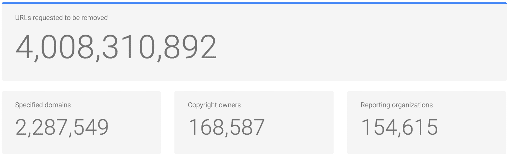
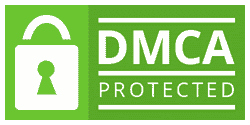
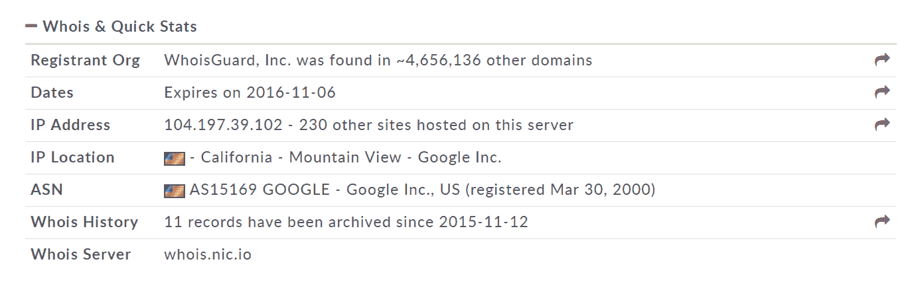
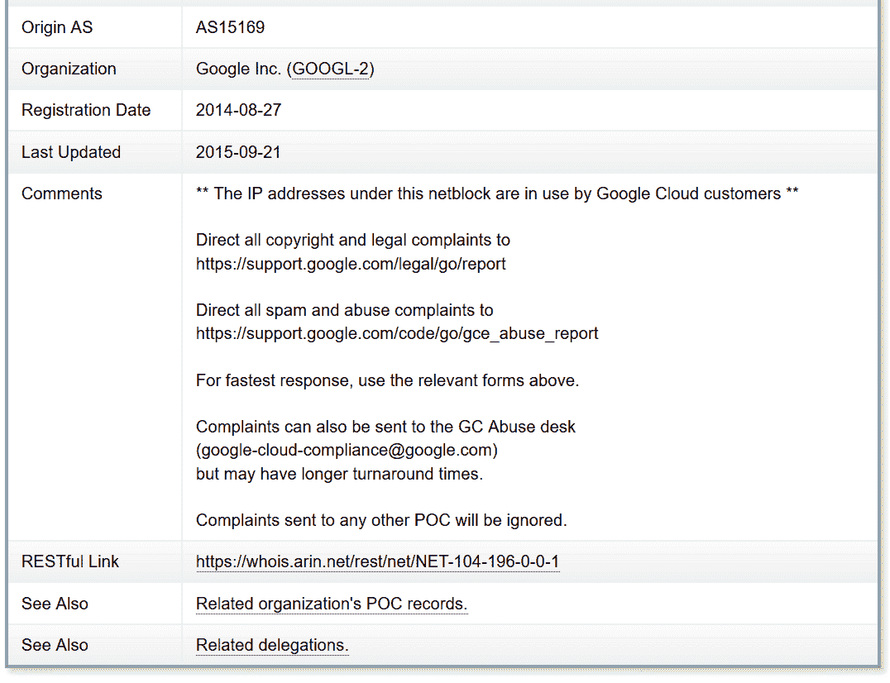
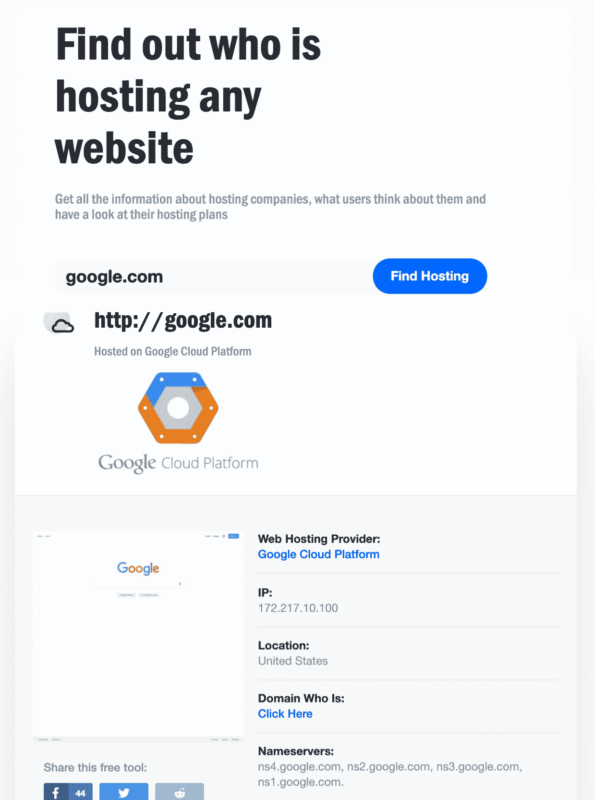
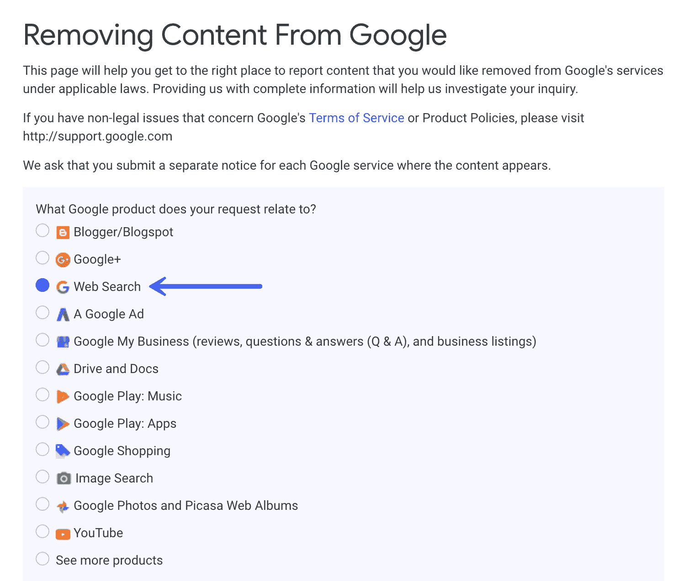
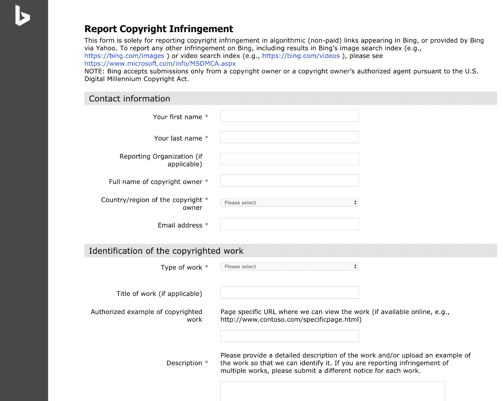

# 如何发布 DMCA 下架通知(或处理自己的通知)

> 原文：<https://kinsta.com/blog/dmca-takedown-notice/>

说到在网络上写作和发布内容，**“抄袭”不是一件可以掉以轻心的事情**。你不能到处窃取或复制/粘贴他人的图像或内容，然后据为己有。有些情况下这可能是好的，但你必须获得许可或给予适当的归属。

当你是接收方时，这也会令人沮丧。你辛辛苦苦做了一段内容或者创造了一个美好的形象，然后有人未经你允许就使用了。😠这就是 DMCA 存在的原因。今天我们将深入探讨如何正确处理 DMCA 对你的投诉，以及如何创建一个 DMCA 撤下通知。

## 什么是 DMCA？

DMCA(Digital Millennium Copyright Act)是一部美国版权法，主要针对数字媒体，帮助内容所有者快速有效地删除被盗内容。这延伸到诸如互联网服务提供商(ISP)、网络托管提供商和搜索引擎等地方。

Support

DMCA 撤下通知适用于物理托管内容的地方。因此，美国以外的人仍然可以向 DMCA 投诉。对于在美国以外托管的内容，许多托管服务提供商仍然会尊重 DMCA 的投诉，但是，从法律上讲，他们没有义务遵守。

网站所有者容易忘记的一件事是，DMCA 的删除**并不要求内容拥有版权**才能处理删除或网站所有者或 [ISP](https://kinsta.com/knowledgebase/what-is-isp/) 要求删除内容。

以下是一些适用于数字内容的示例:

*   文本(TXT，RTF，DOC，DOCx，PDF，PPT 等。)
*   图片(BMP，EPS，SVG，JPG，JPEG，GIF， [WEBP](https://kinsta.com/blog/webp/) ，PNG，PSD，RAW，TIFF 等。这包括在社交媒体上)
*   视频(MPG、AVI、RM、MOV、Quicktime、Windows Media Player、RealPlayer)
*   音乐(AIF，AU，MP3，MP4，MID，WAV 等。)

在过去的十年中，对于博客作者、网站管理员和主机来说，理解 DMCA 程序是如何工作的变得非常重要，这样每个人都可以保护他们的内容；以及知道如何处理收到的投诉或通知。根据谷歌的[透明度报告](https://www.google.com/transparencyreport/removals/copyright/?hl=en#glance)，因版权问题删除内容的请求一直在快速增加。

截至 2019 年 3 月，**因版权问题请求删除的网址已超过 40 亿！**

Number of DMCA complaints filed

## DMCA 保护是什么意思？

你可能会在一些网站的页脚甚至徽章上看到“DMCA 保护”这个词。然而，这有点多余，因为任何在美国出版的作品都已经受到 DMCA 的保护。

然而，如果你在下面看到这样的徽章，这可能意味着该网站正在使用像[DMCA.com](https://www.dmca.com/)这样提供版权保护服务的服务。换句话说，网站所有者付钱给 DMCA.com，让他为他们处理撤下通知。

DMCA protected (Image: [DMCA](https://www.dmca.com/faq/NEW-DMCAcom-Protection-Badges-2016))

## 我如何处理针对我的 DMCA 下架通知？

你应该知道的第一件事是，当 DMCA 对你提起诉讼时，如何处理它。通常，当您的 ISP 或虚拟主机提供商收到 DMCA 投诉时，他们会要求立即删除内容，或者为您删除内容。这有时意味着他们甚至会关闭你的主机。所以不要忽视关于 DMCA 撤下通知的电子邮件。

你的提供商甚至不一定会检查你的内容是否真的侵权。根据他们的位置，他们可能有法律义务删除这些内容，并且会以快速有效的方式这样做。

## 注册订阅时事通讯

### 想知道我们是怎么让流量增长超过 1000%的吗？

加入 20，000 多名获得我们每周时事通讯和内部消息的人的行列吧！

[Subscribe Now](#newsletter)

如果您认为您错误地收到了投诉，或者您确实拥有这些内容，那么您可以提交 DMCA 反通知。根据《DMCA》第 512(f)节，任何人如果故意对材料或活动进行重大失实陈述，而该材料或活动因错误或错误识别**而被删除或禁用，则可能要承担责任**。因此，当你提交 DMCA 反通知时要非常小心，如果你不确定你是否拥有这些内容，那么你可能应该寻求法律咨询。

您的反通知需要包含以下信息:

*   物理签名或电子签名
*   姓名、地址和电话号码
*   材料的标识及其移除前的位置(URL)
*   一份声明，说明材料因错误或错误识别而被移除(请记住，您对此负有责任)
*   同意您居住地区或您的服务提供商所在地的联邦法院的管辖权
*   同意接受提交撤销通知一方的法律程序文件

## 我如何发布 DMCA 下架通知？

DMCA 过程的另一面是当你发现别人窃取了你的内容。以下是你可以遵循的步骤，以确保它被取下。

### 试着先联系网站所有者

在起草 DMCA 官方投诉之前，直接给网站所有者发电子邮件有时会更快。你可以查看他们是否在网上列出了自己的电子邮件地址，或者他们的网站上是否有联系方式。收到这样的邮件后，有些人会马上删除邮件内容。

这是我们使用的模板。请随意复制和修改它:

> 您好，我在[公司]工作，我们发现您的网站(https://domain.com)一直在使用我们拥有的内容。以下是我们内容的一些例子:
> 
> *   https://yourdomain.com/~
> 
> —以下是您网站上的副本:
> 
> *   https://domain.com/~【确切内容/图片位置】
> *   https://domain.com/~
> 
> 请立即删除所有属于【公司】的版权内容，否则我们将不得不提起 DMCA 投诉我已经创建了一个案例 ID #xxxx 来跟踪这个问题，直到它得到解决。如果你对此有任何问题，请告诉我。感谢

由于人们很忙，有时会错过电子邮件，你可能想尝试发送电子邮件不止一次。在这里你可以找到一些关于如何找到任何人的电子邮件地址的可靠提示。

如果他们没有回应，那么你可以继续下面的步骤。

[有时候你不得不放下锤子来保护你的内容和图像。🔨 点击推文](https://twitter.com/intent/tweet?url=https%3A%2F%2Fkinsta.com%2Fblog%2Fdmca-takedown-notice%2F&via=kinsta&text=Sometimes+you+have+to+bring+down+the+hammer+to+protect+your+content+and+images.+%F0%9F%94%A8&hashtags=DMCA%2Cblogging)

### 1.找到那个人

你要做的第一件事就是找到这个人的虚拟主机，这样你就知道去哪里投诉 DMCA 了。一个简单的方法是查找网站的 IP 地址。你既可以 ping 它，也可以使用免费的在线工具，如[域工具](http://whois.domaintools.com/)。在下面的例子中，我们使用的是一个托管在谷歌云平台上的网站。你可以看到域名工具很容易地显示了我们查找的域名的 IP 地址。

Find IP address for DMCA takedown notice

然后你可以使用 [ARIN Whois 服务](https://whois.arin.net/ui/)获取 IP 地址并查找。他们有一个很好的数据库，记录和评论哪些知识产权属于哪些公司。您可以在本例中看到，当我们查找 IP 地址时，它立即向我们显示它位于 Google Cloud 客户使用的网络块上，以及滥用投诉的电子邮件地址和网页。

Google Cloud platform abuse example

DMCA 还有一个很棒的免费 Whois 查询功能，可以生成网络信息。您每月只能免费查找 5 次。如果上面的方法没有带来任何好的结果，你可以尝试另一种方法，那就是免费的[，他是 HostAdvice 的这个](https://hostadvice.com/tools/whois/)工具的宿主。

Who is hosting this?

注意:如果他们在 CDN 或代理(如 Cloudflare)后面运行，这将使情况变得更加困难，因为他们将显示为 IP 地址的所有者。在这种情况下，你可能会更幸运地先联系到个人网站所有者(如果你还没有联系的话)。然而，Cloudflare 确实有一份 [DMCA 投诉表](https://support.cloudflare.com/hc/en-us/articles/200167716-How-do-I-file-a-DMCA-complaint-)。

### 2.向哪里提交 DMCA 下架投诉

既然你已经知道这个人的内容托管在哪里，你必须提交投诉。大多数提供商都有简单的方法来访问它们。查看他们的联系页面，或者在页脚查找任何写有“投诉”或“辱骂”的内容以下是一些常见提供商的链接。

*   [谷歌云平台滥用](https://support.google.com/legal/troubleshooter/1114905?visit_id=0-636101813522729091-75739088&p=report&rd=1)
*   [数字海洋滥用](https://www.digitalocean.com/company/contact/#abuse)
*   [李诺德虐](https://www.linode.com/contact)
*   [Vultr 滥用](https://www.vultr.com/contact/)

如果你找不到在线表格，那么你必须[直接联系 DMCA 代理商](http://www.copyright.gov/onlinesp/list/a_agents.html)。这通常是一个漫长的过程。直接联系网络主机或 ISP 提供商通常是最快的方法。你也可以[花钱请一个专业团队](https://www.dmca.com/signup/)帮你搞定 DMCA。

### 3.DMCA 下架投诉应该包括什么

您必须提供以下信息，以确保您的撤下投诉得到妥善处理。

*   物理签名或电子签名
*   您声称侵权的材料的位置和标识(可能是 URL 等)
*   您的联系信息、地址、电话号码、邮寄地址等
*   善意声明该材料的使用未经版权所有者或您授权
*   声明一切都是准确的(再次提醒，你要承担伪证罪的处罚)

#### DMCA 拆卸模板

这是我们使用的 DMCA 拆穿模板。请随意复制和修改它:

> **主题:**根据 1998 年数字千年版权法发布的撤销通知
> 
> 我叫[姓名]，是[公司]的[职位]。
> 
> 这是根据数字千年版权法(“DMCA”)第 512 节发出的通知，要求您立即停止提供对以下版权材料的访问。贵公司托管的网站(根据 WHOIS 信息)侵犯了我们公司拥有的版权材料。
> 
> 我们拥有独家版权的原始[内容/图片]可在以下网址找到:
> 
> *   —[确切的内容/图像位置]
> *   —
> *   —
> 
> 未授权和侵权的[内容/图像]可在以下 IP 地址/URL 找到:
> IP 地址:
> 
> *   —[确切的内容/图像位置]
> *   —
> *   —
> 
> 我的联系方式是:
> 
> 姓名
> 公司地址
> 电话
> 
> 我有充分的理由相信，以被投诉的方式使用所描述的材料并没有得到版权所有者、其代理人或法律的授权。本通知中的信息是准确的、最新的，我可以确认[公司]是版权所有者。
> 
> 如果你想进一步讨论这个问题，请直接联系我。
> 
> 签署:
> 姓名
> 日期:

Struggling with downtime and WordPress problems? Kinsta is the hosting solution designed to save you time! [Check out our features](https://kinsta.com/features/)

### 4.从搜索引擎中删除内容

如果原始内容被删除，那么它将自动从搜索引擎中删除。但是，如果由于某种原因上述过程失败，您也可以直接向 Google 和 Bing 提交投诉。

虽然这不会总是把它从这个人的网站上删除，但至少会把它从 SERPs 上删除，这样就没人能找到它了。这也将确保它永远不会排名超过你自己的内容。

**从谷歌搜索中移除内容**

要从谷歌搜索中删除内容，请使用[这个工具](https://support.google.com/legal/troubleshooter/1114905)。选择“网络搜索”选项，并根据您的个人情况填写剩余的问题。

Remove content from Google search

**从 Bing 搜索中移除内容**

要从 Bing 搜索中删除内容，使用[这个工具](https://www.bing.com/webmaster/tools/contentremovalform)，并填写他们的版权侵权报告。

Remove content from Bing search

## DMCA 通知需要多长时间？

一般来说，DMCA 下架通知需要大约 72 小时。然而，我们看到他们走得很快(24 小时内)，也拖了 6 个多月。这取决于几个因素:

*   公司处理 DMCA 请求的速度有多快。
*   内容的位置。请记住，DMCA 仅适用于美国受版权保护的材料。因此，如果你给美国以外的公司发邮件，你可能永远不会收到回复。虽然大多数主机提供商，不管在哪里，都会尽力帮忙。

## 摘要

希望现在你对 DMCA 有了更多的了解，知道撤销通知是如何起作用的，不管是针对你的还是你需要保护自己内容的时候。

有人抄袭过你的内容或图片吗？我们很想在下面的评论中听到它。

* * *

让你所有的[应用程序](https://kinsta.com/application-hosting/)、[数据库](https://kinsta.com/database-hosting/)和 [WordPress 网站](https://kinsta.com/wordpress-hosting/)在线并在一个屋檐下。我们功能丰富的高性能云平台包括:

*   在 MyKinsta 仪表盘中轻松设置和管理
*   24/7 专家支持
*   最好的谷歌云平台硬件和网络，由 Kubernetes 提供最大的可扩展性
*   面向速度和安全性的企业级 Cloudflare 集成
*   全球受众覆盖全球多达 35 个数据中心和 275 多个 pop

在第一个月使用托管的[应用程序或托管](https://kinsta.com/application-hosting/)的[数据库，您可以享受 20 美元的优惠，亲自测试一下。探索我们的](https://kinsta.com/database-hosting/)[计划](https://kinsta.com/plans/)或[与销售人员交谈](https://kinsta.com/contact-us/)以找到最适合您的方式。