# 领域隐私介绍(以及如何实现)

> 原文：<https://kinsta.com/blog/domain-privacy/>

如果你的网站有一个元素是最公开的，那就是你的域名。当然，这是你网站的可见地址，所以把它藏起来不是个好主意。然而，你应该掩盖的一个方面是你给注册商的个人信息。域名隐私有助于解决这个问题。

根据法律，每个域名都必须归属于某个人——即作为购买者的你。然而，这些信息是公开的，这意味着任何人都可以访问它。这对你的隐私和收件箱都没有好处。

在本帖中，我们将探讨域名隐私。我们将向您展示如何购买域名并保护您的信息。我们还将了解一些帮助您购买域名隐私的服务。

不过，首先，我们要看看域隐私的整个概念。

## 什么是域隐私？

对于任何网上购物，你都需要提供一些重要信息。在很多情况下，这将是你的付款细节和帐单信息。

但是，其中一些信息(除了付款细节本身)是可选的。如果您想通过注册商购买域名，您将遵循一系列类似的步骤来完成交易。

这里的区别是，你的个人信息是一个关键方面进行。几乎在所有情况下，你都必须给出以下内容:

> Kinsta 把我宠坏了，所以我现在要求每个供应商都提供这样的服务。我们还试图通过我们的 SaaS 工具支持达到这一水平。
> 
> <footer class="wp-block-kinsta-client-quote__footer">
> 
> 
> 
> <cite class="wp-block-kinsta-client-quote__cite">Suganthan Mohanadasan from @Suganthanmn</cite></footer>

[View plans](https://kinsta.com/plans/)

*   你的名字
*   相关的电子邮件地址
*   你的办公地址
*   电话联系方式

虽然这可能不是所有消费者的理想选择，但和其他网上购物一样，这也是可以理解的。

不过，有一个小问题:你被迫提供的信息不是隐私。

### WHOIS 数据库

[互联网名称与数字地址分配机构(ICANN)](https://www.icann.org/) 是一个非营利性组织，负责协调互联网上名称空间的维护。换句话说，ICANN 通过管理[互联网协议(IP)地址](https://kinsta.com/blog/ipv4-vs-ipv6/)和[域名服务器(DNS)](https://kinsta.com/knowledgebase/what-is-dns/) 根来保持互联网的稳定和安全。

这意味着 ICANN 控制着你注册域名的方式。他们要求每个网站所有者为他们拥有的每个域名注册完整的联系方式。它还将在 [WHOIS 数据库](https://www.whois.com/whois)上公开这些数据:

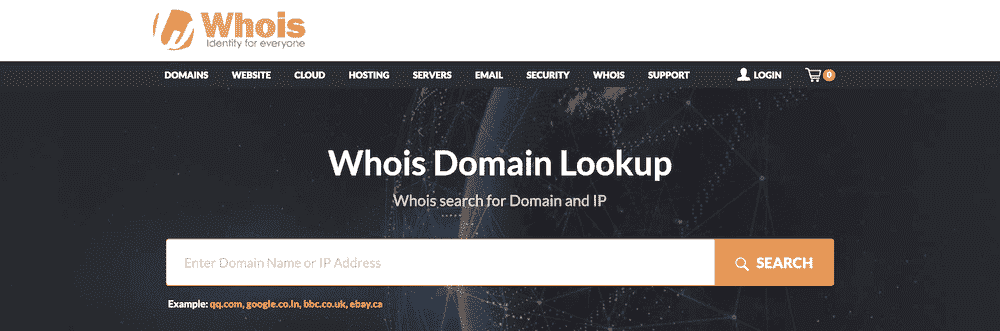

The WHOIS database.

这是对每个注册域名的公开查询。您键入一个域，这将返回该域的文件信息:

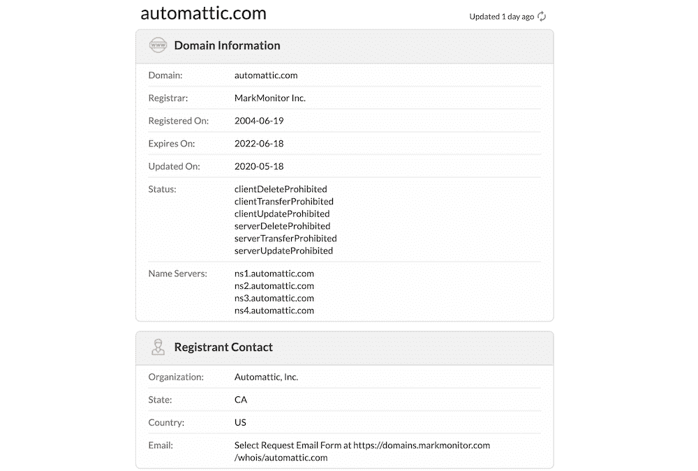

Looking up a domain on the WHOIS database.

您会发现与域名本身(及其关联的域名服务器)相关的信息、个人的详细联系信息，甚至是初始交易的原始 WHOIS 数据输出。

该数据库提供了一些积极的好处，具体到我们前面提到的 DNS 维护:

*   您可以确保每个域名都是独一无二的，其他人不能损害业务。
*   在注册域名之前，你可以查找域名的所有者。它将帮助您了解域名所有权，并让您做出关于您自己的域名的最佳决策。
*   你可以帮助一个网站解决管理和[网络问题](https://kinsta.com/knowledgebase/dns-server-not-responding/)，因为你可以访问正确的联系电子邮件地址。

即便如此，你还是会经常发现 WHOIS 查找信息在很多时候并没有被很好的利用——因此需要域名隐私。

### 为什么域名隐私对所有网站都是必要的

当然，一般来说，隐私是网络及其用户的重要组成部分。关于所谓的“大技术”如何利用我们忽略的信息，已经有了多年的争论。

然而，这也延伸到域隐私。你可能会说这更重要，因为有大约 20 亿个活跃的网站。这是数以亿计的域名，与潜在的公共用户信息相关联。

我们提到了包含在 WHOIS 数据库中的好处和坏处。以下是所有网站都需要域名隐私的原因:

*   它可以保护您的联系人和个人信息不被公开。
*   你的收件箱和电话线上的垃圾邮件会减少。许多恶意用户会将 WHOIS 数据库用作免费的陌生来电名单。更重要的是，你还可以避免经常困扰网站所有者的[众多骗局](https://contentfirst.marketing/how-to-spot-a-domain-name-scam-and-keep-your-information-safe/)之一。
*   恶意用户窃取您的域名的机会减少了。
*   鉴于你提供了准确的信息，你的域名受到了一些法律保护。

尽管有积极的一面，我们建议拥有域名隐私比公开你的信息更重要。毕竟，大多数缺点都有替代解决方案，与恶意用户保持距离是您应该坚持实施的可靠策略。

### 域名隐私和一般数据保护条例(GDPR)

您可能已经知道 [GDPR](https://kinsta.com/blog/wordpress-gdpr-compliance/) 对您和您的用户在欧盟(EU)的网络隐私的影响。关于这与域名隐私和 WHOIS 数据库的关系，我们还需要了解更多。

当然，GDPR 可以保护您的数据安全。域名隐私也是如此，尽管有一个关键的区别。有了域名隐私，你就有了一个转发地址。这意味着，如果有人需要联系您，他可以合法地使用 WHOIS 数据库联系您，同时还能保护您的信息隐私:

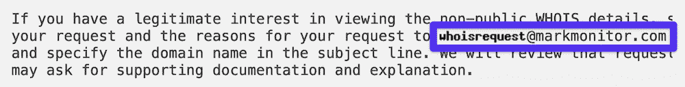

MarkMonitor’s forwarding email address.

相比之下，虽然 GDPR 也确保您的详细信息不会显示在 WHOIS 数据库中，但没有转发电子邮件地址。因此，没有人能够以合法的理由联系你。鉴于我们之前所说的，虽然这不是一个大问题，但仍然需要注意。

我们的建议是尽可能选择域名隐私。在这一点上，值得注意的是，一些顶级域名(TLD)扩展没有机会拥有私有 WHOIS 条目。这通常与[国家特定的顶级域名](https://www.name.com/support/articles/205188698-TLDs-that-do-not-support-Whois-Privacy)有关，例如**。美国**、**。英国**，和**。it** ，以及 **.us.com** 、 **.net.in** 等众多二级域名。

尽管如此，你仍然有能力在 GDPR 下隐藏你的个人数据，但是没有域隐私实现的好处。

## 如何检查你的域名是否有隐私保护

在你决定是否在你的网站上实现域名隐私之前，首先检查它是否已经被应用是一个好主意。有可能是你在结账的时候选择了它而忘记了，也有可能是自动申请的。

要找到答案，请前往 [WHOIS 数据库](https://lookup.icann.org/)，在搜索栏中输入您选择的域名:

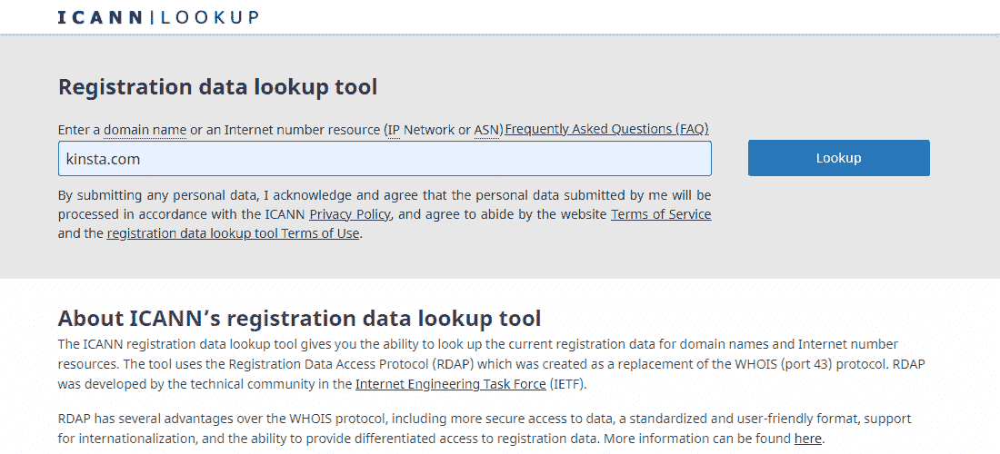

The ICANN Lookup webpage.

点击**搜索**按钮后，您将进入该域名的 WHOIS 条目。在**域名信息**部分，您将看到关于域名本身、注册商和注册日期的详细信息:

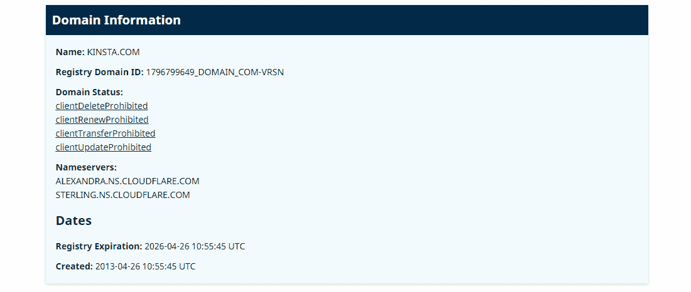

Domain information for Kinsta.com through the ICANN Lookup tool.

在许多情况下，这不会告诉你多少关于你是否有域隐私。要了解详细程度，请向下滚动查看任何一个**注册人联系人**、**行政联系人**或**技术联系人**部分:

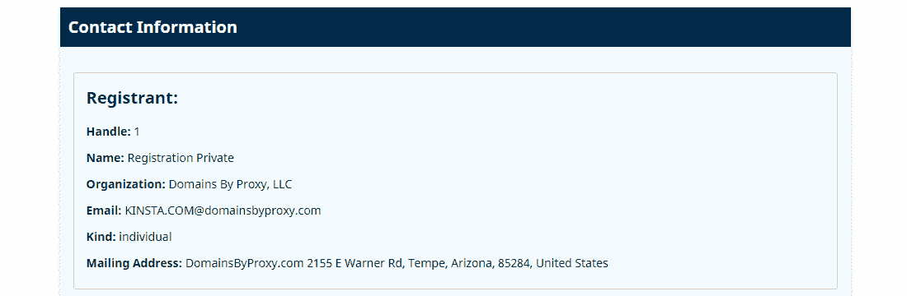

Contact information for Kinsta.com through the ICANN Lookup tool.

根据您使用的注册商和域名隐私，此处的详细信息可能会有所不同。然而，要寻找的关键要素是:

*   一个看起来像是在转发消息的[电子邮件地址](https://kinsta.com/blog/professional-email-address/)(例如 *[【电子邮件保护】](/cdn-cgi/l/email-protection)* )
*   看起来很普通但不是你的姓名和联系地址

这是一个很好的迹象，表明你已经开启了域名隐私。如果您在此屏幕上看到您的任何详细信息(除了在**域信息**面板中的内容)，您会想要了解如何应用域隐私。

## 4 大领域隐私工具和服务

域名注册商通常会在结账阶段提供隐私服务。以下几节将讨论四个不同的域名注册商或服务，在其产品中提供域名隐私。

## 注册订阅时事通讯

### 想知道我们是怎么让流量增长超过 1000%的吗？

加入 20，000 多名获得我们每周时事通讯和内部消息的人的行列吧！

[Subscribe Now](#newsletter)

让我们从您应该考虑的最明显的服务开始。

### 1.你自己的域名注册商

如果你拥有一个网站，你通常会有一个域名。[选择域名注册商](https://kinsta.com/blog/best-domain-registrar/)不在本文讨论范围之内，尽管你会想调查你可以访问什么类型的域名隐私。

不过，最好还是从你现在的注册商开始，因为这是实现域名隐私阻力最小的途径。大多数注册服务商都有类似的控制面板:

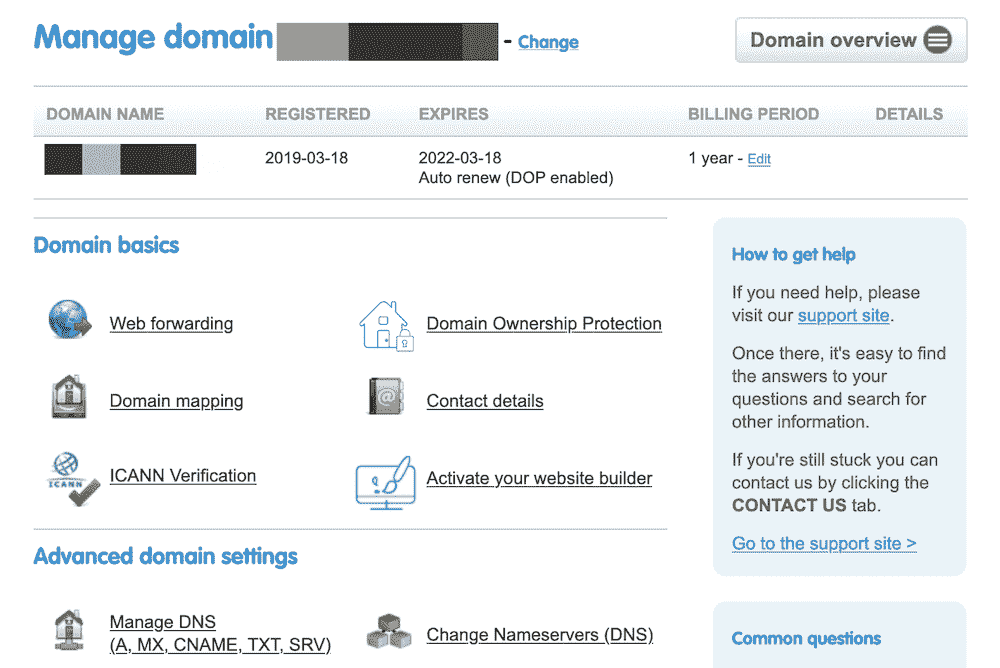

A typical domain registrar dashboard.

在这里，您可以找到许多工具来帮助您管理您的域，而不管您的任务是什么。然而，你会注意到，这个特定的注册商没有明确的“域名隐私”选项。相反，你得到域所有权保护(DOP)。

这是几项服务捆绑销售的一个例子，你需要支付额外的费用。在这里，您可以获得 WHOIS 域名隐私和进一步的保护，如“锁定”域名的能力。此功能有助于用户避免常见错误，如转移域名、更改域名的个人信息或取消域名续订。这是一个额外的保护层，可能是值得的。

至于激活 DOP 或类似的东西，通常是在购买时完成的。不过，你也将有一个[专用仪表板](https://kinsta.com/mykinsta/)来处理事后流程:

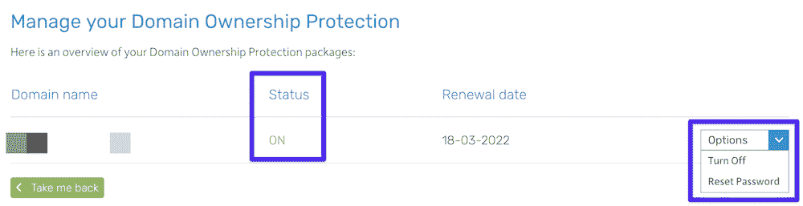

The DOP management screen.

这些通用步骤将适用于大多数域名注册商。然而，其他注册服务商的做法不同，或者更直接。让我们来看看几个主要的参与者。

### 2.谷歌域名

谷歌不需要介绍，但我们可能不得不提示你他们的新服务之一:*谷歌域名*。

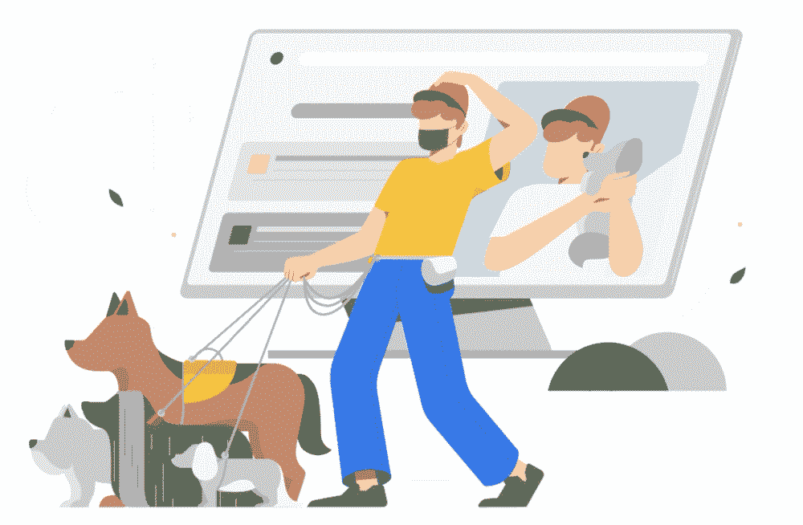

The Google Domains home page.

我们在一篇专门的评论中介绍了谷歌域名的来龙去脉。简而言之，谷歌域名是购买和管理你所有域名的好方法，有熟悉的仪表盘和合理的价格。

如果你是 Google Workspace 的用户，他们的域名注册商将会是你的理想选择。同样值得关注的是它是如何处理域隐私的。

这就是所谓的隐私保护——它是免费的，在结账时作为标准应用:

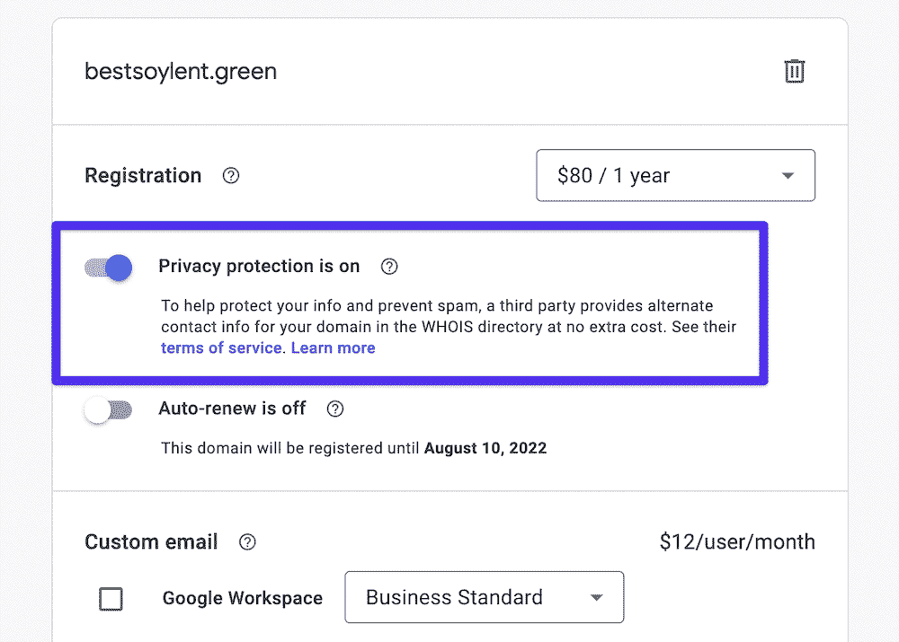

The Google Domains checkout, complete with Privacy Protection.

在您的**域名概述**页面上，也有一种便捷的方式来查看该服务的条款。请注意，将会有一个有用的注释显示**隐私保护**是否处于活动状态:

需要一个给你带来竞争优势的托管解决方案吗？Kinsta 为您提供了令人难以置信的速度、一流的安全性和自动伸缩功能。[查看我们的计划](https://kinsta.com/plans/?in-article-cta)

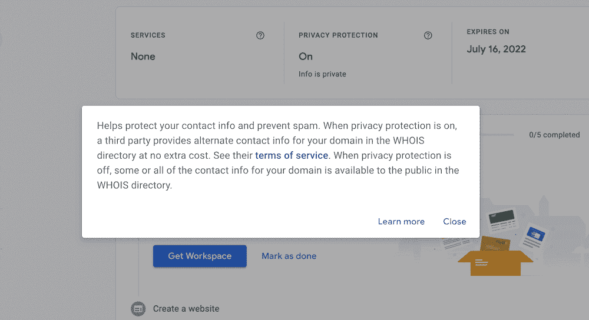

Google’s Privacy Protection terms.

这是一项简单的服务，为您的数据提供近乎完美的保护。

### 3\. Namecheap

这个名字泄露了秘密，但是 [Namecheap](https://kinsta.com/blog/best-domain-registrar/#namecheap) 专注于高性价比的域名。有很多可用的顶级域名，仪表板使用起来也很友好。

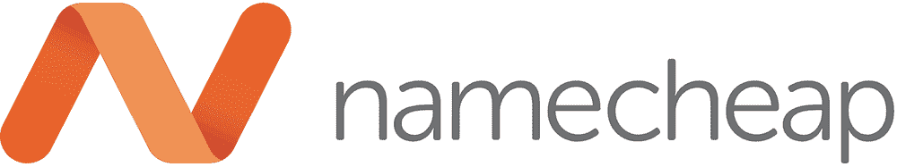

The Namecheap logo.

我们还可以确认，注册服务商在管理您的域名时很容易使用，比如[添加记录](https://kinsta.com/knowledgebase/namecheap-add-a-record/)和[更改域名服务器](https://kinsta.com/knowledgebase/namecheap-change-nameservers/)。这是一个基于价格、可用性和 TLD 可用性的通用域名注册商。

我们也喜欢你可以看到你的哪个域名已经激活了域名隐私。每个域名将在专门的一栏中有一个“盾”标志:

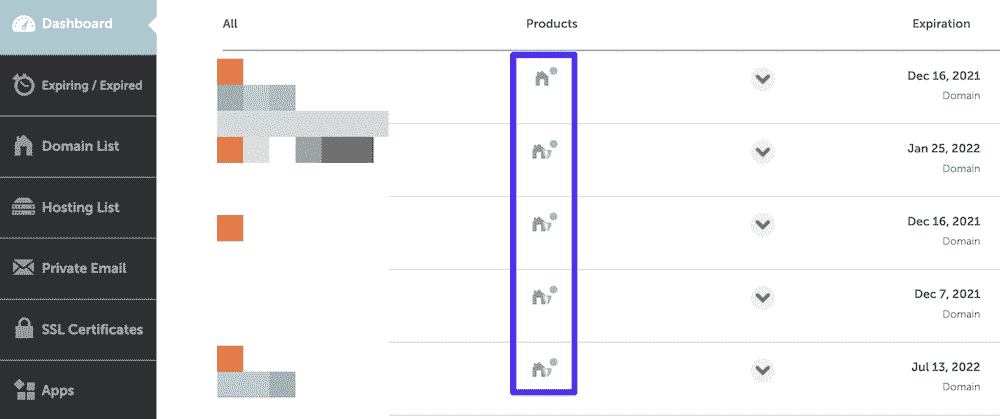

The Namecheap dashboard showing domain privacy.

如果您想进一步了解某个特定的域，可以将鼠标悬停在该屏蔽上，查看域隐私是否处于活动状态:

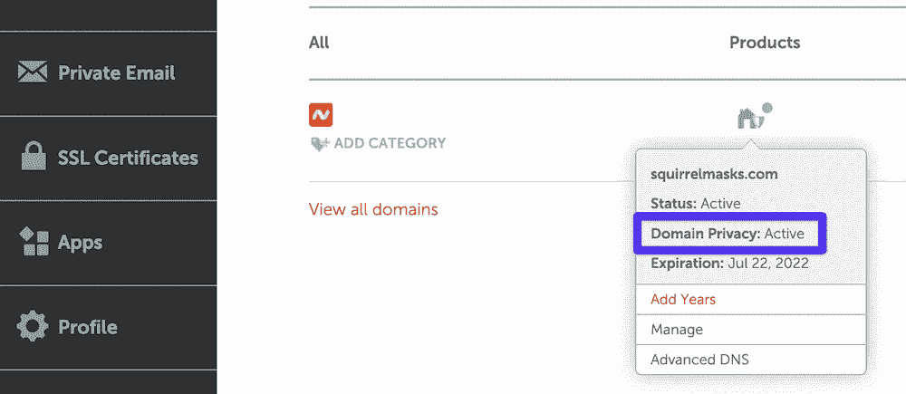

Namecheap’s on-hover display.

更进一步，您可以使用箭头图标展开每个域，并查看有关如何设置域隐私的更多详细信息:

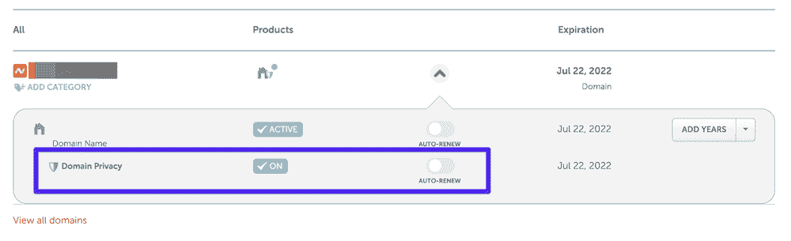

Namecheap’s dedicated domain settings.

你有三种不同的方式来查看域名隐私，这使得它的可用性非常好。这也意味着你永远不会忘记激活你的隐私。

### 4.Cloudflare 注册器

[Cloudflare Registrar](https://www.cloudflare.com/products/registrar/) 是一项注册域名的服务，提供与其他[域名注册商](https://kinsta.com/blog/best-domain-registrar/)相同的服务，但具有额外的安全功能。

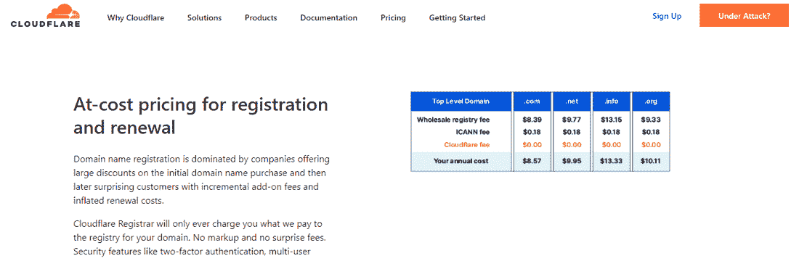

The Cloudflare Registrar homepage.

根据 Cloudflare 对安全性和隐私的关注，默认情况下，您可以获得免费的双因素身份认证和私有 WHOIS 管理。他们将帮助您保护您的域名和个人信息的安全。而且，你不需要购买任何附加服务来保护你的域名。

您通过 Cloudflare 管理的域名也与其众多产品和服务相关联。例如，它[与 Cloudflare CDN](https://kinsta.com/cloudflare-integration/) 、DNS 和 SSL 服务相集成。

## 如何为你的网站购买和应用域名隐私

在我们结束之前，让我们带您浏览一下购买和应用域名隐私的快速流程。整个领域购买流程都与此相关，因此我们也将涉及到这一点。

请注意，我们在这里使用 Namecheap，因为它是一个普通的注册商，提供免费(和优质)的域名隐私选项。但是，您可以从我们的方法中进行推断，并将其应用于您选择的注册商。当然，如果你的注册服务商将域名隐私作为一项单独的服务收费，你需要将这一因素计入总成本。

您的首要任务是找到您的域名并将其添加到购物车中:

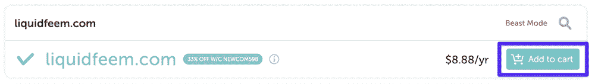

Choosing a domain in Namecheap.

然后，您需要点击进入结账屏幕，此时您会看到将域名隐私添加到订单的选项:

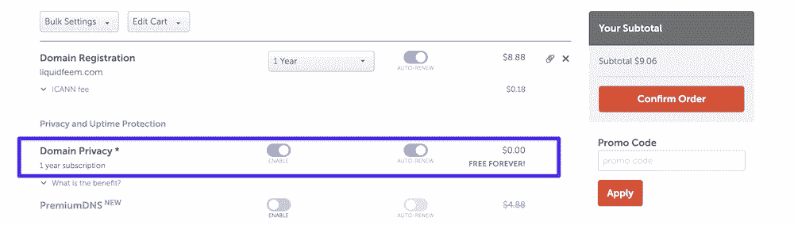

The Namecheap checkout screen.

你会注意到域隐私被切换为启用标准，也设置为自动更新。

完成后，您可以继续购买并完成交易。您还可以使用**批量设置**下拉菜单将域隐私应用于购物车中的多个域:

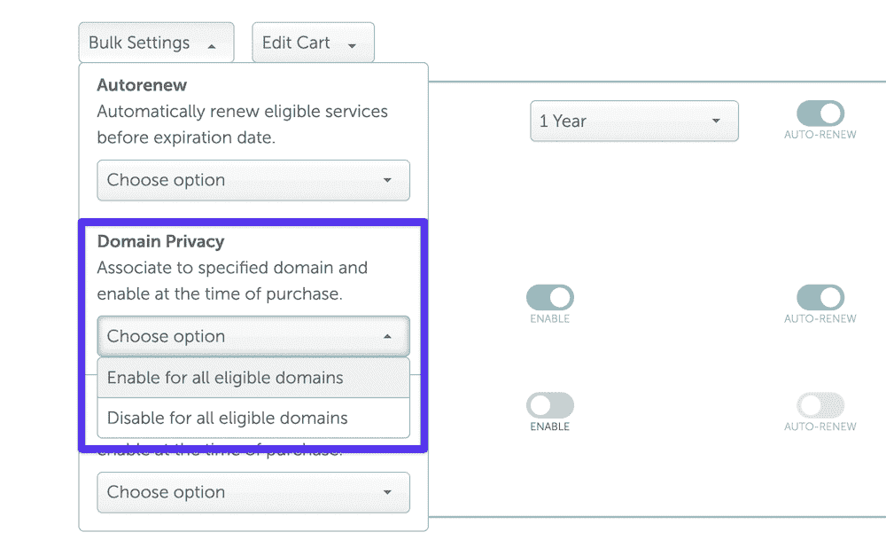

The Namecheap Bulk Settings page.

这就是购买和应用域名隐私的全部内容。大多数注册服务商都将其作为标准选项，如果您没有选择自动续订，除了完成续订流程之外，您几乎不需要做任何事情。

[想保持连接到您域名的个人信息的私密性？✅:这篇文章涵盖了你💪](https://twitter.com/intent/tweet?url=https%3A%2F%2Fbit.ly%2F3leZgrH&via=kinsta&text=Want+to+keep+the+personal+information+connected+to+your+domain+private%3F+%E2%9C%85+This+post+has+you+covered+%F0%9F%92%AA&hashtags=Domains%2CWebPrivacy)

## 摘要

虽然互联网是服务器之间的连接网络，但通常在每台计算机的末端都有一个真实的人。因此，使用网络时的隐私是明智浏览和网站安全的一个重要方面。

网站所有者还需要申报个人信息来购买域名。如果没有域隐私，这些细节将是公开的，所以保持它们的隐蔽是关键的一步。

好消息是这个过程很简单。对于大多数注册商来说，你只需拨动开关，域名隐私就是你的了。然而，虽然许多注册服务商免费提供这项服务，但当您续订域名时，其他人会向您收取费用。

域名隐私对您来说重要吗？如果不重要，为什么？请在下面的评论中分享你的想法！

* * *

让你所有的[应用程序](https://kinsta.com/application-hosting/)、[数据库](https://kinsta.com/database-hosting/)和 [WordPress 网站](https://kinsta.com/wordpress-hosting/)在线并在一个屋檐下。我们功能丰富的高性能云平台包括:

*   在 MyKinsta 仪表盘中轻松设置和管理
*   24/7 专家支持
*   最好的谷歌云平台硬件和网络，由 Kubernetes 提供最大的可扩展性
*   面向速度和安全性的企业级 Cloudflare 集成
*   全球受众覆盖全球多达 35 个数据中心和 275 多个 pop

在第一个月使用托管的[应用程序或托管](https://kinsta.com/application-hosting/)的[数据库，您可以享受 20 美元的优惠，亲自测试一下。探索我们的](https://kinsta.com/database-hosting/)[计划](https://kinsta.com/plans/)或[与销售人员交谈](https://kinsta.com/contact-us/)以找到最适合您的方式。