# 如何从 Drupal 迁移到 WordPress(10 步)

> 原文：<https://kinsta.com/blog/drupal-to-wordpress/>

Drupal 是目前最好的内容管理系统(CMSs)之一。它是高度可扩展和安全的软件。然而，使用 Drupal 创建时尚、现代的网站并不像想象中那么容易。如果这是你的经历，从 Drupal 迁移到 WordPress 可能是答案。

WordPress 提供了许多与 Drupal 相同的功能，但是它更容易使用。此外，[WordPress 社区是巨大的](https://kinsta.com/cms-market-share/)，让你更容易在你的网站上找到任何你想要的功能或变化的帮助。

本指南将讨论为什么从 [Drupal 迁移到 WordPress](https://kinsta.com/blog/wordpress-vs-drupal/) 是有意义的。我们将讨论您在迁移之前需要做什么，然后一步一步地完成迁移过程。最后，我们将讨论在你开始使用 WordPress 之后应该做些什么。我们开始工作吧！

### 查看我们的视频指南[从 Drupal 迁移到 WordPress](https://www.youtube.com/watch?v=oJwoRjlEzWo)

T3】

## 为什么你应该考虑从 Drupal 迁移到 WordPress

使用 Drupal 有多种原因。它是开源软件，也是市场上最强大的 CMS 之一。 [Drupal 安装](https://kinsta.com/drupal-market-share/)可以轻松扩展，有一个庞大的用户和开发者社区可以为新用户和爱好者提供帮助:

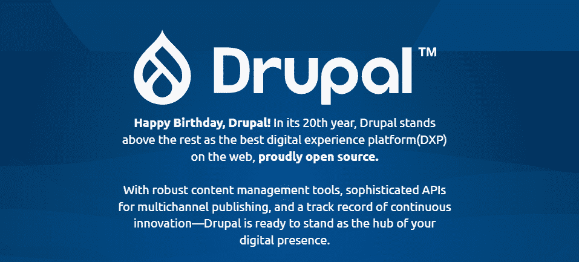

Drupal

T4】

使用 Drupal 的缺点是它不是一个初学者友好的 CMS。掌握它有一个重要的学习曲线，更新软件可能是一个非常复杂的过程。如果你是一个经验丰富的开发人员，你可以解决这些问题。

然而，如果你正在做你的第一个网站或者一个简单的项目，你可能会更好地使用 WordPress :

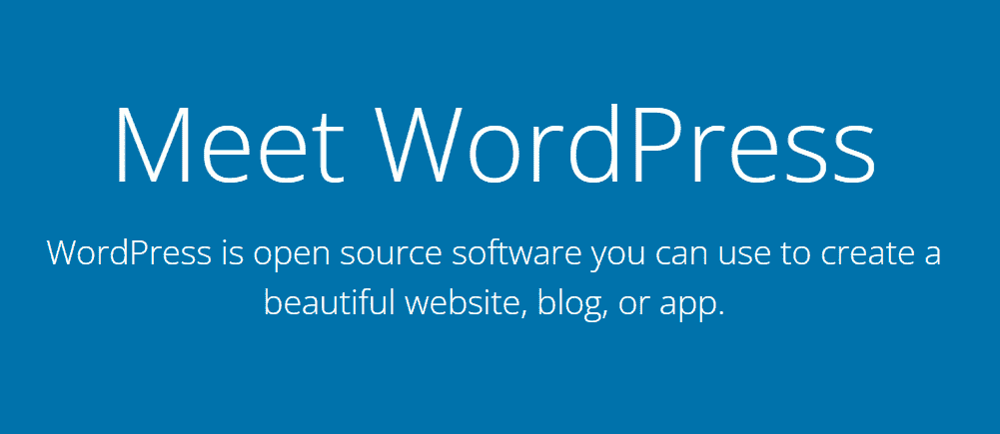

文字出版社

WordPress 可以做 Drupal 能做的一切，同时是一个更加用户友好的选择。另外，开始使用 WordPress 要容易得多。

此外，如果你已经有了一个 Drupal 网站，你可以在相对较短的时间内将它迁移到 WordPress，并立即开始收获好处。然而，在你开始之前，有一些事情你需要知道。

[Drupal 是最好的 CMS 选择之一，但是创建时尚、现代的网站可能是一个挑战😅如果你正在寻找类似但更容易使用的东西，可以考虑改用 WordPress🚀 点击推文](https://twitter.com/intent/tweet?url=https%3A%2F%2Fkinsta.com%2Fblog%2Fdrupal-to-wordpress%2F&via=kinsta&text=Drupal+is+one+of+the+best+CMS+options+available%2C+but+creating+stylish%2C+modern+websites+can+be+a+challenge%F0%9F%98%85+If+you%27re+looking+for+something+similar+but+easier+to+use%2C+consider+switching+to+WordPress+%F0%9F%9A%80&hashtags=Drupal%2CWordPress)

## 从 Drupal 迁移到 WordPress 之前需要考虑的事情

将网站从一个 CMS 迁移到另一个 CMS 需要一些准备工作。在从 Drupal 迁移到 WordPress 之前，你需要找到一个虚拟主机或者建立一个新的网站。你还必须备份你现有的文件。

### 建立一个新网站或寻找一个新的网站主机

当你建立一个新的网站时，许多网站主机允许你在 Drupal 和 WordPress 之间进行选择。您的提供商也可能通过其平台托管多个网站。

如果你有一个支持多个网站的托管计划，你*可以*为 WordPress 建立一个新的。这样做将使您能够迁移您的 Drupal 站点，而无需注册新的主机提供商或改变计划。

如果你对当前的主机提供商满意，这种方法会很有效*。转移到 WordPress 打开了一个可能性和专用托管服务的世界。*

许多提供商完全专注于 WordPress 网站，并提供一些功能，让像你这样的用户生活更轻松——kin sta 就是其中之一:

Kinsta 是一家专注于速度和性能的托管服务提供商。

托管 WordPress 主机可以让你摆脱大量的维护工作。如果您正在使用 Kinsta，您不必担心的一些任务包括:

*   [备份您的网站](https://kinsta.com/knowledgebase/wordpress-backups/)
*   获取并安装一个 [SSL 证书](https://kinsta.com/knowledgebase/how-ssl-works/)
*   将您的网站与[内容交付网络(CDN)](https://kinsta.com/knowledgebase/kinsta-cdn/) 整合
*   扫描并从您的网站上删除恶意软件

无论您选择哪种 Kinsta 计划，我们都会处理所有这些任务(对于使用[托管](https://kinsta.com/ebooks/wordpress/managed-wordpress-hosting/)来说，这都是理所当然的)。你还可以访问一些功能，比如中转站点和与 [DevKinsta](https://kinsta.com/devkinsta/) (我们本地的 WordPress 开发工具)的集成。

如果你目前的托管计划只允许你有一个单一的并发网站，你不能用 WordPress 安装来代替它而不丢失你的 Drupal 数据。在这种情况下，你需要升级你的计划或者注册一个新的网络主机。

在你注册任何虚拟主机服务之前，我们建议你进行研究。如果你是在预算有限的情况下工作的或者希望主持一个个人网站，那么有很多[很棒的 Kinsta 替代品](https://kinsta.com/kinsta-alternatives/)可以满足你的需求。

### 备份您的 Drupal 数据

每当您要对网站进行重大更改时，我们建议您首先备份所有内容。Drupal 迁移过程不涉及从网站上删除任何文件。然而，如果出现问题，遵循最佳实践也无妨。

备份 Drupal 网站是一个相对复杂的过程。CMS 不包含任何内置的备份工具，因此您需要手动完成所有工作。

备份 Drupal 网站需要复制两个组件:

*   你的网站的数据库
*   Drupal 根目录

Drupal 官方推荐使用模块来备份你的数据库。开发者推荐的两个选项是 T2 备份和迁移和 T4 备份数据库。

一旦选择了数据库备份模型，还需要复制整个 Drupal 根目录。最好的方法是通过[安全文件传输协议(SFTP)](https://kinsta.com/knowledgebase/how-to-use-sftp/) 连接到您的网站，并将根文件夹的副本下载到您的计算机上。

我们建议将数据库和根目录备份文件保存在同一个文件夹中，或者将它们压缩在一起。这样，您就有了一个完整的网站副本，万一发生什么事情，您可以用它来恢复您的 Drupal 站点。

## 如何从 Drupal 迁移到 WordPress (10 步)

在我们开始工作之前，你需要准备好一个网络主机来建立一个新的网站。当安装 WordPress 并将你的 Drupal 内容转移到新网站时，我们将从头开始。

### 步骤 1:安装 WordPress

安装 WordPress 有几种方法，取决于你的网络主机。如果你使用的是 Kinsta，当你建立一个新的网站时，你会得到自动安装 WordPress 的选项:

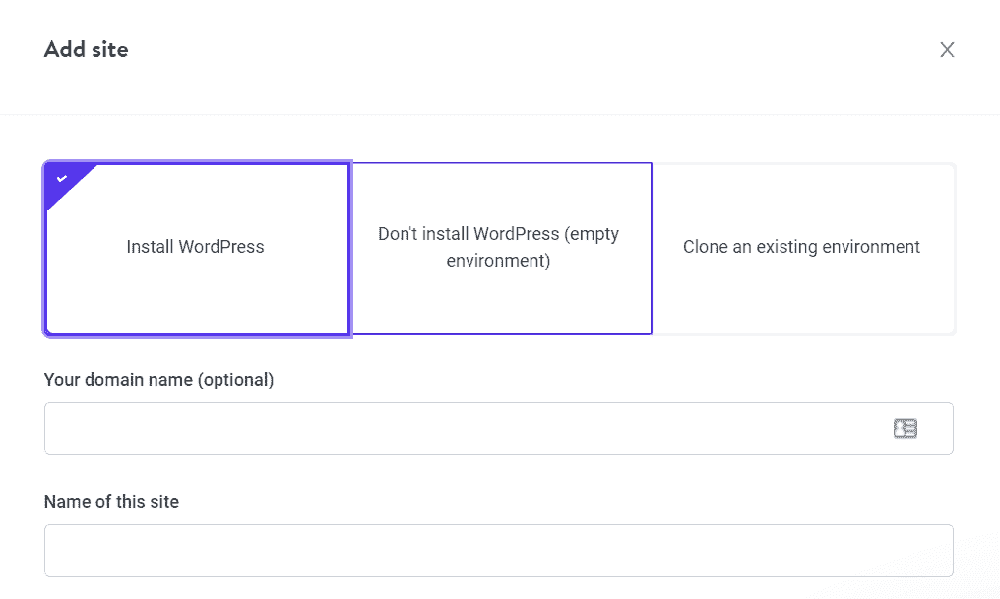

在 MyKinsta

安装 WordPress

其他网络主机通常带有一些软件安装程序，如 Softaculous。你可以用它来帮助你设置流行的 CMS，比如 WordPress，只需点击几下。

如果你更喜欢自己动手，你也可以[手动安装 WordPress】。为此，从 WordPress.org](https://kinsta.com/help/manually-installing-wordpress/)下载 CMS [安装文件。你需要把这些文件上传到你的网络主机上，然后运行 WordPress 安装程序。它将引导您完成剩余的过程。](https://wordpress.org/download/)

一旦你的 WordPress 安装就绪，你就可以访问仪表盘了。在这里，你会花大部分时间使用 WordPress，所以熟悉它是明智的:

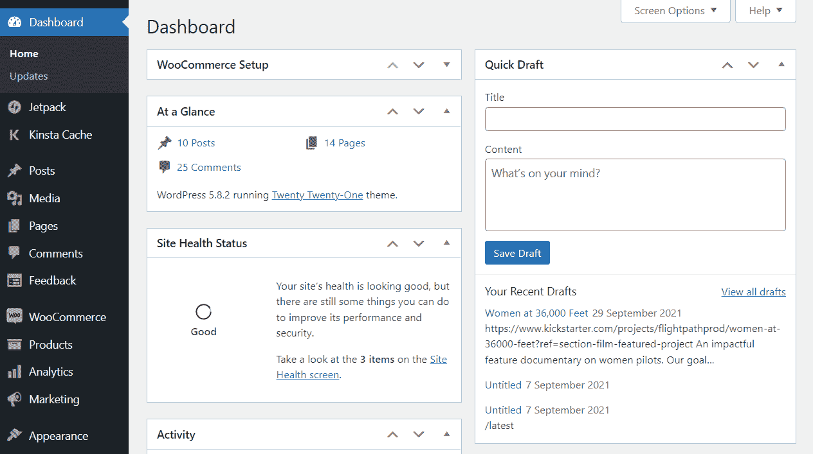

我们将使用 WordPress 插件从 Drupal 迁移你的网站，因为这是最简单的方法。然而，在这之前，我们需要为你的网站选择一个永久链接结构。

### 步骤 2:在 WordPress 中选择一个永久链接结构

Drupal 给了你很多控制网站 URL 外观的方法。例如，假设您有一个 Drupal 帖子，URL 如下:

*yourwebsite.com/blog/name-of-the-post*

这是一个干净的 URL 结构，对任何网站来说都是理想的。默认情况下，WordPress 使用不同的 URL 或永久链接结构，如下所示:

*yourwebsite.com/?=123*

在你迁移到 WordPress 之后，你带来的内容将会丢失你在 Drupal 中设置的 URL 结构。这意味着你的页面和文章将会有类似前面例子的 URL。

WordPress 使得改变你的站点的永久链接结构变得容易，而且越早做越好。如果您在迁移内容之前更改了永久链接结构，那么以后您可以很容易地替换内部链接，我们将在另一个步骤中介绍这一点。

现在，进入**设置>永久链接**并选择一个新的 URL 结构。我们最喜欢的是**帖子名称**选项:

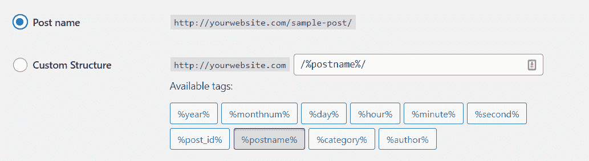

改变 WordPress 仪表盘中的永久链接结构

**帖子名称** URL 结构使您能够为您发布的每个页面和帖子设置自定义永久链接。或者，你可以设置一个定制的 URL 结构，但是在大多数情况下，**文章名称**选项就足够了。

### 步骤 3:设置 FG Drupal 到 WordPress 插件

传统上，将一个网站从另一个平台迁移到 WordPress 需要大量的手工导出和导入文件。然而，由于 Drupal 是如此受欢迎的 CMS，专用插件可以帮助[简化迁移过程](https://kinsta.com/blog/wordpress-migration-plugins/)。

FG Drupal to WordPress 就是这样一个插件，它是我们最喜欢的工作工具。它将帮助您将 WordPress 连接到 Drupal，并迁移您站点的所有内容，包括帖子、页面、类别、标签、图像和元数据:

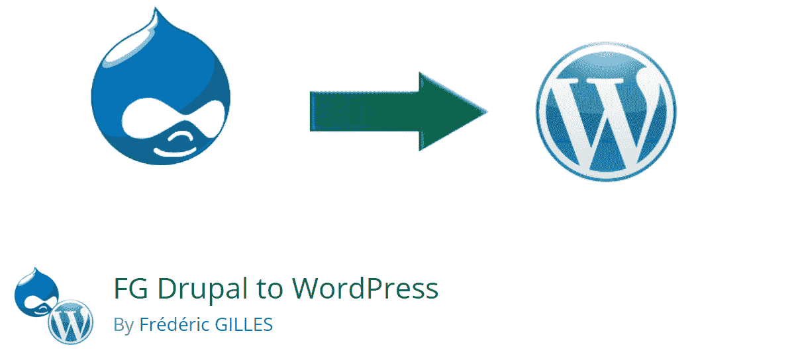

FG Drupal 到 WordPress

T4】

需要注意的是，FG Drupal to WordPress 是一个免费插件，提供了一个[高级版本](https://www.fredericgilles.net/fg-drupal-to-wordpress/)。自由软件可以做我们在上一段中提到的所有事情。此外，如果您购买了高级许可证，该插件可以帮助您迁移评论、用户帐户(包括作者和管理员)、自定义字段和导航菜单。

根据我们的经验，免费版本的插件可以满足大多数用户的需求。唯一需要注意的是需要导入用户的网站。

例如，假设你在 Drupal 中经营一个在线商店，你想把你的客户群迁移到 WordPress。在这种情况下，FG Drupal 到 WordPress 的高级版本可以为您节省大量时间。

## 注册订阅时事通讯

### 想知道我们是怎么让流量增长超过 1000%的吗？

加入 20，000 多名获得我们每周时事通讯和内部消息的人的行列吧！

[Subscribe Now](#newsletter)

一旦你决定使用哪个版本的插件，就该安装了。我们将使用免费版本，所以要继续，进入**插件** *>* **添加新的**，并使用页面内的搜索栏查找插件:

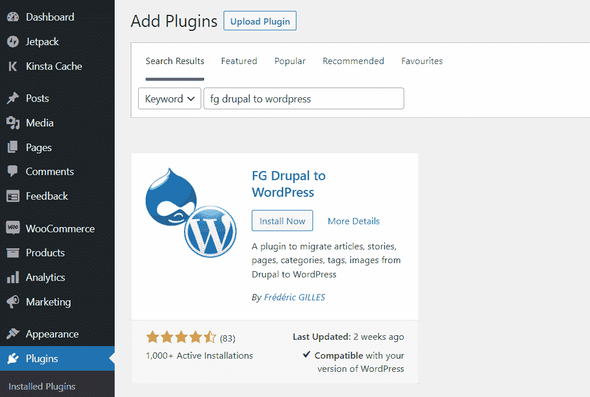

安装 FG Drupal 到 WordPress

点击**立即安装**，给 WordPress 一些时间来安装插件。当它准备好了，你会看到一个选项来激活它。选择该按钮，现在让我们开始将 Drupal 内容导入 WordPress。

### 步骤 4:选择你的 WordPress 内容设置

要开始迁移过程，在 WordPress 中进入**工具>导入**。之后，点击 Drupal 下的**运行导入器**:

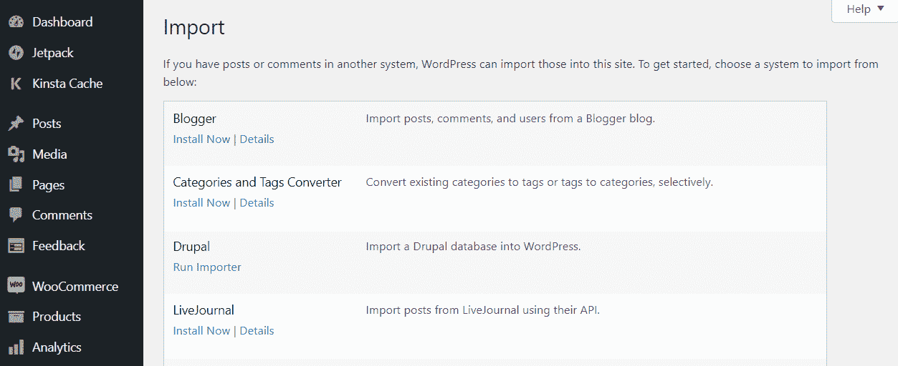

运行 WordPress 中的 Drupal 导入工具

“导入程序”页面包括您在启动迁移过程之前需要配置的大量设置。让我们从选择导入器是否应该删除所有现存的 WordPress 内容开始:

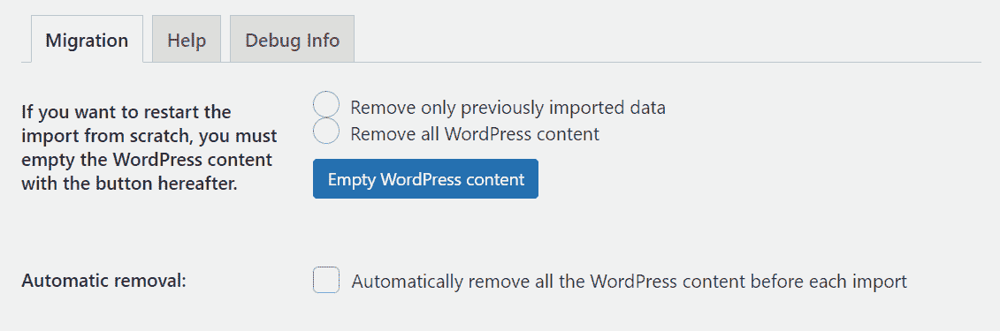

选择导入选项

由于您使用的是一个全新的网站，因此在开始迁移之前，您不需要删除它的内容。然而，如果你在网站上添加了任何测试页面或帖子，你可以选择**删除所有 WordPress 内容**选项。

### 第 5 步:输入您的 FTP 凭据

接下来，WordPress 会询问你的 Drupal 站点的 URL。你还需要选择插件如何从你的 Drupal 站点下载媒体文件。默认选项使用简单的 HTTP 下载。

但是，如果您正在处理一个拥有大量内容库的大型网站，我们推荐使用 [FTP 选项](https://kinsta.com/knowledgebase/ftp-vs-sftp/):

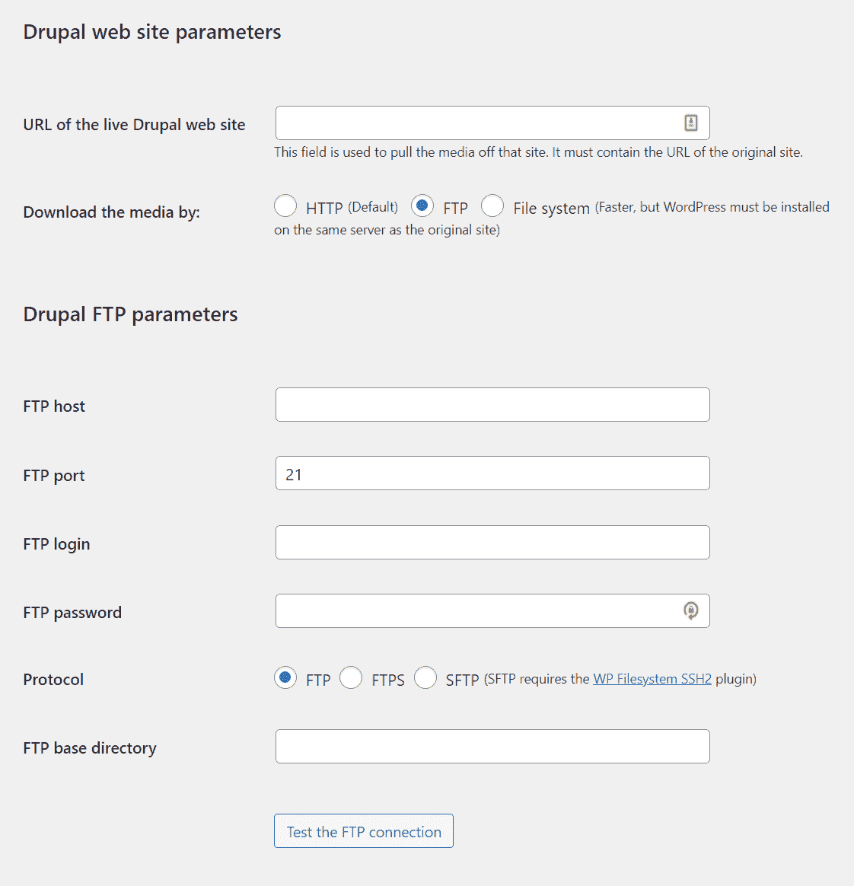

输入 FTP 凭证

您需要输入用于访问 Drupal 网站的 FTP 凭据。如果你不确定这些凭证是什么，你应该可以通过你的虚拟主机控制面板访问它们。但是，请确保您使用的是 Drupal 站点的凭证，而不是 WordPress 的凭证。

在您输入凭证之后，您可以点击按钮**来测试 FTP 连接**。如果凭证有效，您将看到一条成功消息。如果您看到错误消息，则可能是凭据或指定的协议有问题。

### 步骤 6:输入您的 Drupal 数据库参数

接下来，插件将要求您输入 Drupal 数据库参数。您需要指定您的 Drupal 站点使用什么类型的数据库(MySQL、SQLite 或 PostgreSQL)、它的主机名、端口、名称和您的用户详细信息:

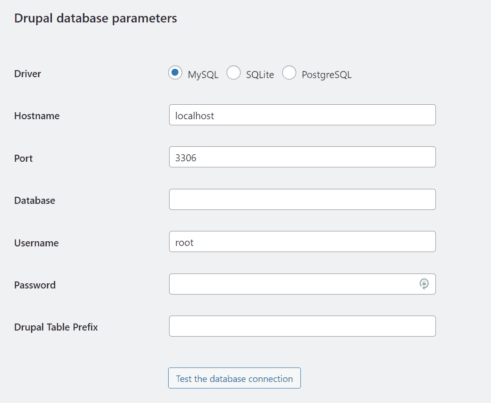

输入你的 Drupal 数据库参数

不记得那些细节也不用担心。你可以通过打开你的 Drupal 站点的**settings.php**文件并在里面挖掘来找到这些信息。你需要使用 FTP 或你的网络主机的文件管理器连接到你的 Drupal 站点[来找到那个文件。](https://kinsta.com/blog/best-ftp-clients/)

一旦进入，导航到**Drupal/sites/default/settings . PHP**并使用文本编辑器打开文件。注意不要改变 settings.php 的 T2，因为任何调整都可能会破坏你的网站。你只需要定位并复制 FG Drupal 到 WordPress 请求的信息。

输入数据库参数并点击**测试数据库连接**以确保设置正确。如果一切都符合代码，插件将向您显示一条成功消息。

### 步骤 7:调整你的文章和页面导入设置

您需要配置的最后一个设置控制插件如何从 Drupal 导入文章和页面。首先，你选择插件是将文章和页面摘要添加到 WordPress 的内容中，还是将它们作为摘录导入。

厌倦了低于 1 级的 WordPress 托管支持而没有答案？试试我们世界一流的支持团队！[查看我们的计划](https://kinsta.com/plans/?in-article-cta)

我们推荐后一种选择，因为它可以让你不用在 WordPress 中手动添加摘录:

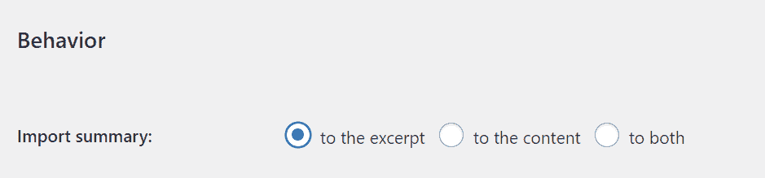

帖子和页面行为设置

接下来，你需要告诉 WordPress 应该在哪里存储导入的媒体文件。我们建议选择**默认的**选项，这将使用标准的 WordPress 媒体目录来存储导入的文件。

你也可以选择 WordPress 应该使用哪张图片作为你的文章和页面的特色元素。**图像字段**选项将选择您在 Drupal 中使用的**图像**文件。你可以在 Drupal 编辑器和**标签**字段下面看到它:

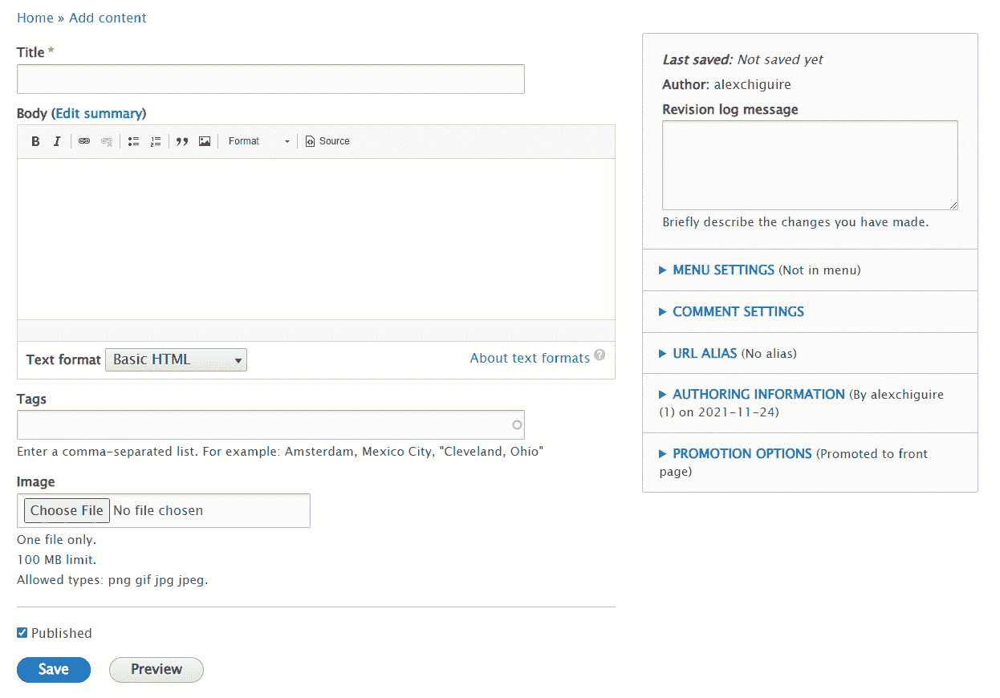

选择图像字段设置

插件的其余设置使您能够阻止程序生成缩略图或将特色图像添加到导入内容的正文中。我们建议禁用所有这些额外的选项。

现在，您的媒体设置应该是这样的:

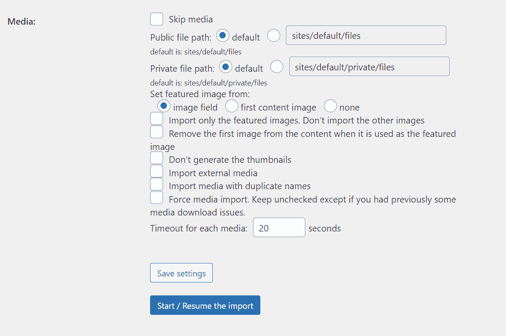

媒体设置应该是这样的

默认情况下，如果加载时间超过 20 秒，FG Drupal to WordPress 会中止媒体文件的导入过程。如果您没有从 Drupal 站点的服务器得到响应，这个设置可以帮助您避免迁移停滞。然而，如果你使用的是一个不错的虚拟主机，这应该不成问题。

### 步骤 8:将你的站点从 Drupal 迁移到 WordPress

现在，您已经准备好了，点击**开始/恢复导入**，并通过下面的进度条和日志字段跟踪迁移过程:

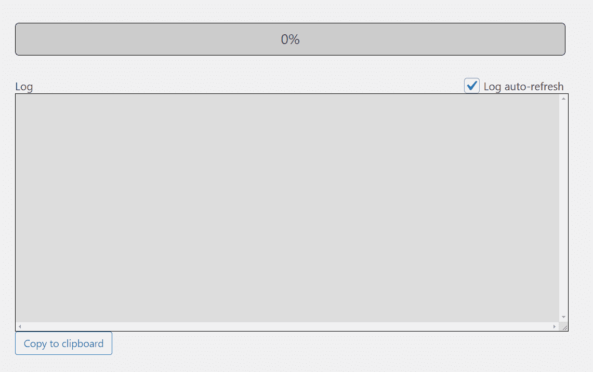

关注进度条完成迁移

迁移完成后，您将看到最终的成功消息。在离开此页面之前，向下滚动到迁移后的部分的**，并点击显示**修改内部链接**的按钮:**

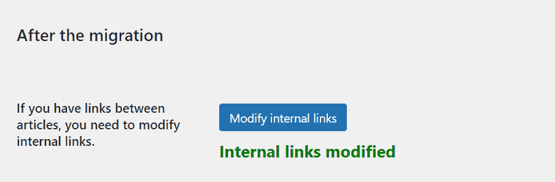

迁移后修改内部链接

该功能将更新你网站的内部链接，以反映新的 WordPress 永久链接结构。在你使用它之后，我们建议检查你的一些页面和文章，以确保内部链接正常工作。

重要的是，你只有在为你的 WordPress 网站设置了永久链接结构之后才进行这个过程，我们在前面的步骤中已经完成了。如果您后来修改了 permalink 结构，您的内部 URL 可能会不起作用。

### 步骤 9:将你的域名指向 WordPress

现在，你所有的 Drupal 内容都在 WordPress 中了。你有一个完全正常工作的网站，唯一缺少的是更新你的域名信息。现在，如果访问者试图访问你的域名，他们会去你的 Drupal 网站。

不是注册一个新的域名，而是将现有的域名指向 WordPress。这个过程可能会有所不同，取决于你是使用域名注册商还是通过你的主机提供商来建立域名。

如果您使用了域名注册商，您需要从该平台访问您的帐户，并更新酒店的 [DNS 设置](https://kinsta.com/knowledgebase/what-is-a-nameserver/)。这些信息告诉域名应该将访问者引向哪里。如果您不确定如何更改这些设置，您可以查看您的域注册商的文档。

或者，如果你是 Kinsta 用户，你可以使用 MyKinsta 将一个域名指向你的网站。在这个过程中，您需要验证域，但是 Kinsta 会处理剩下的事情。

### 步骤 10:为你的 WordPress 网站选择一个主题

尽管你所有的 Drupal 内容现在都在 WordPress 中，你的网站看起来可能和以前有很大不同。那是因为你可能使用了一个 [WordPress 默认主题](https://kinsta.com/knowledgebase/what-is-a-wordpress-theme/)。它们是不错的选择，但是它们应该被定制或者用其他模板替换。

使用 WordPress 的好处之一是你有大量的主题选择。有数以千计的免费和付费主题可供选择。

如果你是 WordPress 的新用户，我们建议你从[WordPress.org 主题库](https://wordpress.org/themes/)开始搜索:

WordPress 主题知识库

如果你可以访问一个[升级网站](https://kinsta.com/help/staging-environment/)，你可以在永久改变之前测试新的主题。这样，你就可以尝试几十种主题，而不会影响网站的用户体验。

在你选择一个主题后，你可以开始使用块编辑器定制你的页面和文章的风格。[块编辑器的](https://wordpress.org/gutenberg/)体验在特性和易用性方面远远领先于 Drupal。因此，这可能会成为你使用 WordPress 最喜欢的方面之一。你甚至可以[自定义你的 WordPress 主题](https://kinsta.com/blog/how-to-customize-wordpress-theme/)本身。

如果选择一个模板很困难，我们可以给你指出我们最喜欢的主题。该列表包括不同类型网站的选项，所以你很有可能找到你喜欢的东西(另外，所有这些网站[都有回应](https://kinsta.com/blog/responsive-web-design/))。

同样值得注意的是，你不需要选择一个和你之前的 Drupal 网站相似的主题。从 Drupal 迁移到 WordPress 给了你一个绝佳的机会来重新设计你的网站，给它应有的更新。

## 从 Drupal 迁移到 WordPress 后要做什么

一旦你完成了从 Drupal 到 WordPress 的迁移，你可能想知道如何处理你以前的网站。现在它的所有内容都在不同的站点上，您可以继续删除 Drupal 安装。

如果你为两个网站使用同一个主机，你不需要急着删除 Drupal 站点。然而，如果你为两个主机方案付费，就没有理由继续花钱。

如果你在迁移过程中错过了什么，你可以暂时保留 Drupal 网站。一旦你确定你正确地完成了这个过程，继续删除这个站点。在最坏的情况下，您在迁移之前有该网站的备份。

至于 WordPress，你有很多新的功能和工具可以使用。首先，我们建议你查看一下[WordPress.org 插件库](https://wordpress.org/plugins/)。它包含数以千计的免费插件，其中许多可以添加您不知道您的网站可以提供的功能:

当你刚接触 WordPress 的时候，找到合适的插件就像选择完美的主题一样棘手。这就是为什么我们精心挑选了一份最好的 WordPress 插件列表供你试用。

[考虑从 Drupal 转到 WordPress 有很多原因，其中之一就是 WordPress 使用起来要容易得多。💪在本指南中学习如何设置您的网站⬇️ 点击推文](https://twitter.com/intent/tweet?url=https%3A%2F%2Fkinsta.com%2Fblog%2Fdrupal-to-wordpress%2F&via=kinsta&text=There+are+many+reasons+to+consider+switching+from+Drupal+to+WordPress%2C+one+of+which+is+how+much+easier+WordPress+is+to+use.+%F0%9F%92%AA+Learn+how+to+get+your+site+set+up+in+this+guide+%E2%AC%87%EF%B8%8F&hashtags=Drupal%2CWordPress)

## 摘要

如果你重视安全性和可伸缩性，Drupal 是一个极好的 CMS。然而，与 WordPress 相比，它在定制选项、易用性和网站风格方面就相形见绌了。

有了 WordPress，你可以使用正确的插件和主题来建立你梦想中的网站。WordPress 的每个方面都是可定制的，从 Drupal 迁移你的内容很容易，这要感谢 [FG Drupal to WordPress](https://wordpress.org/plugins/fg-drupal-to-wp/) 插件。

关于如何从 Drupal 迁移到 WordPress，你有什么问题吗？下面评论区来说说吧！

* * *

让你所有的[应用程序](https://kinsta.com/application-hosting/)、[数据库](https://kinsta.com/database-hosting/)和 [WordPress 网站](https://kinsta.com/wordpress-hosting/)在线并在一个屋檐下。我们功能丰富的高性能云平台包括:

*   在 MyKinsta 仪表盘中轻松设置和管理
*   24/7 专家支持
*   最好的谷歌云平台硬件和网络，由 Kubernetes 提供最大的可扩展性
*   面向速度和安全性的企业级 Cloudflare 集成
*   全球受众覆盖全球多达 35 个数据中心和 275 多个 pop

在第一个月使用托管的[应用程序或托管](https://kinsta.com/application-hosting/)的[数据库，您可以享受 20 美元的优惠，亲自测试一下。探索我们的](https://kinsta.com/database-hosting/)[计划](https://kinsta.com/plans/)或[与销售人员交谈](https://kinsta.com/contact-us/)以找到最适合您的方式。