# WordPress 简易数字下载教程(深度)

> 原文：<https://kinsta.com/blog/easy-digital-downloads/>

销售数字商品和服务是网上赚钱的最聪明的方式之一。与销售实物产品不同，不涉及库存成本或运输成本。此外，数字产品的选择几乎是无穷无尽的:视频、电子书、音乐、音频文件、pdf、网站主题和模板、 [WordPress 插件](https://kinsta.com/blog/wordpress-coupon-plugin/)、开发时间、照片等等。

像 Selz、Etsy、 [WooCommerce 和 Shopify](https://kinsta.com/blog/woocommerce-vs-shopify/) 这样的公司允许新企业在几分钟内创建一个虚拟的在线商店。问题在于，许多购物平台会从你的销售额中抽取一定比例，或者收取月费。这对刚起步的人来说没什么，但那些对网上销售很认真的人会想创建自己的虚拟商店，省去中间人。谢天谢地，有了 WordPress，创建一个在线商店变得非常简单和容易。因此，今天我们将深入探讨简单的数字下载。我们将向你展示使用它相对于 [WooCommerce](https://kinsta.com/blog/woocommerce-tutorial/) 的一些优势，让它成为一个很好的 [Shopify 替代品](https://kinsta.com/blog/shopify-alternatives/)，并指导你如何在你的 WordPress 网站上安装它。

推荐阅读:[woo commerce vs Easy Digital Downloads:你该用哪个？](https://kinsta.com/blog/woocommerce-vs-easy-digital-downloads/)

## 为什么选择简易数字下载？

WordPress 有许多电子商务插件，其中两个你可能很熟悉的最流行的是 WooCommerce 和 Easy Digital Downloads。WooCommerce 拥有超过 100 万的活跃安装量，并被全球忠实的数字商店所有者所使用。事实上，截至 2018 年 1 月，WooCommerce 超过了所有网店的 [35%！尽管我们喜欢 WooCommerce，但这并不意味着它总是你的业务或产品的正确选择。](https://kinsta.com/wordpress-market-share/)

由 Pippin Williamson 创建的简易数字下载(EDD)是一个免费的 WordPress 电子商务插件，专注于数字产品。它的主要目标是让销售数字产品变得简单和完整。WooCommerce 实际上最初是为了处理实体产品而创建的，尽管现在[也可以用它来处理数字产品](https://docs.woocommerce.com/document/digital-downloadable-product-handling/)。简易数字下载的一大优点是开箱即用的速度非常快(T4)。WooCommerce 可以很快，但需要一些调整，如果你正在处理大量的流量，你很可能最终需要[优化的 WooCommerce 主机](https://kinsta.com/woocommerce-hosting/)。

这是一个在 Kinsta 主机上运行的实时 EDD 商店的例子。它的加载时间不到 600 毫秒！数字下载和服务的伟大之处在于，很多时候他们不会有庞大的产品目录来阻碍他们的网站。通常，他们只销售两种产品或一种许可成本不同的产品。

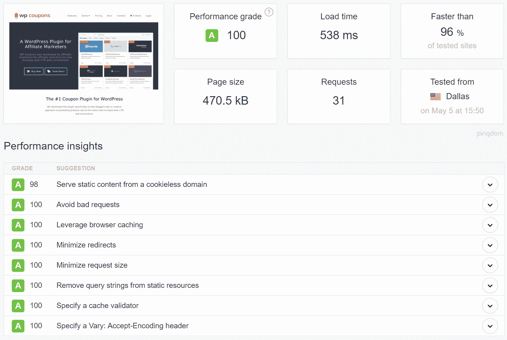

EDD fast load times


从用户的角度来看，轻松数字下载的另一个巨大好处是使用起来非常简单。您可以在几分钟内启动并运行它。只需添加您的付款细节，创建您的数字产品，您就可以万事俱备了。就像 WooCommerce 一样，它有数以千计的扩展和集成，允许您处理信用卡支付、处理重复发生的交易、利用分支机构等。它非常通用，为您提供了一个简单的方法来分析和跟踪您的销售。它背后还有一个致力于 WordPress 编码标准的**优秀团队**，确保对代码库的修改简单而容易。


EDD mascot


EDD 目前有超过 60，000 个活跃安装，并在 [WordPress 知识库](https://wordpress.org/plugins/easy-digital-downloads/)上获得了 5 颗星的评级。这对于一个 WordPress 插件来说是非常高的！开发人员喜欢它，因为它易于使用并且有很好的文档记录。


> 需要在这里大声喊出来。Kinsta 太神奇了，我用它做我的个人网站。支持是迅速和杰出的，他们的服务器是 WordPress 最快的。
> 
> <footer class="wp-block-kinsta-client-quote__footer">
> 
> 
> 
> <cite class="wp-block-kinsta-client-quote__cite">Phillip Stemann</cite></footer>

[View plans](https://kinsta.com/plans/)

> 我们利用 EDD 作为提供支持的一种方式。我们的服务有一个可下载的插件，每个支持客户在注册后必须激活它。EDD 允许我们重新命名蛞蝓(产品)，并命名为任何我们想要的。我喜欢那个钩子！EDD 允许我们覆盖模板，以满足我们的需求。我喜欢 EDD 易于更新。没什么好担心的。为了安全起见，我们还是会分阶段更新。
> 
> –附加组件–
> EDD 允许我们使用软件许可附加组件来更新我们所有客户端的插件。它与 Stripe 集成，为我们的客户创建一个帐户，并管理我们需要雇用两个人来完成的所有日常任务。— [亚伦](https://wordpress.org/support/topic/easy-digital-downloads-works-on-many-disciplines/)，网络开发工作室的网络开发人员

### 支持

EDD 有各种可用的支持资源。

*   你可以很容易地在 WordPress 支持论坛上寻求帮助。皮聘本人实际上在那里非常活跃。在撰写本文时，39 张罚单中有 30 张在过去 2 个月内被标记为已解决。
*   他们有有用的操作视频、教程和一个非常广泛且[记录良好的知识库](http://docs.easydigitaldownloads.com/)。
*   基本支持是免费的，但您也可以选择优先支持，每月 39 美元或每年 129 美元。

## 轻松数字下载功能

EDD 的主要卖点是销售数字下载的便捷性。该平台允许客户购买多种产品，同时拥有多个附加文件。后端用户可以轻松地将产品捆绑在一起，插件[使用 AJAX](https://kinsta.com/blog/admin-ajax-php/) 在前端实现流畅的购物车体验。另一个突出的特点是能够创建折扣和促销代码。折扣可以按基本价格的百分比提供，并且可以设置自动过期日期和最大使用限制。


EDD default payment processors


EDD 默认提供三种支付方式(Paypal、Amazon 和 manual ),但也有很多其他的扩展方式。EDD 最大的特点之一就是致力于帮助您提供卓越的客户体验。它有一个内置的客户访问区，因此客户可以轻松访问他们购买的文件，并跟踪他们的购买情况。如果他们不小心丢失/删除了下载的文件，客户可以登录他们的帐户重新下载。

EDD 提供了所有销售的完整历史，以及详细的销售和收入图表。一个特别酷的指标是预计销售报告，它让你根据你过去的业绩对未来的销售有一个概念。能够跟踪最畅销的产品并找出哪些产品卖不出去，这有助于企业主找到并利用最有利可图的产品。它让你专注于有潜力的业务领域，并改进其他领域。

它也可以在几乎任何 WordPress 主题上工作。根据我们的经验，WooCommerce 不是这样的。典型的 WooCommerce 主题开发者需要做额外的工作来构建支持。EDD 是建立一个有点不同，这使它成为一个完美的除了无论你已经安装的主题。

### 轻松数字下载扩展

有许多 EDD 插件可供购买，以进一步扩展平台。其中一些是由 EDD 开发商开发的，而另一些是由第三方销售的。

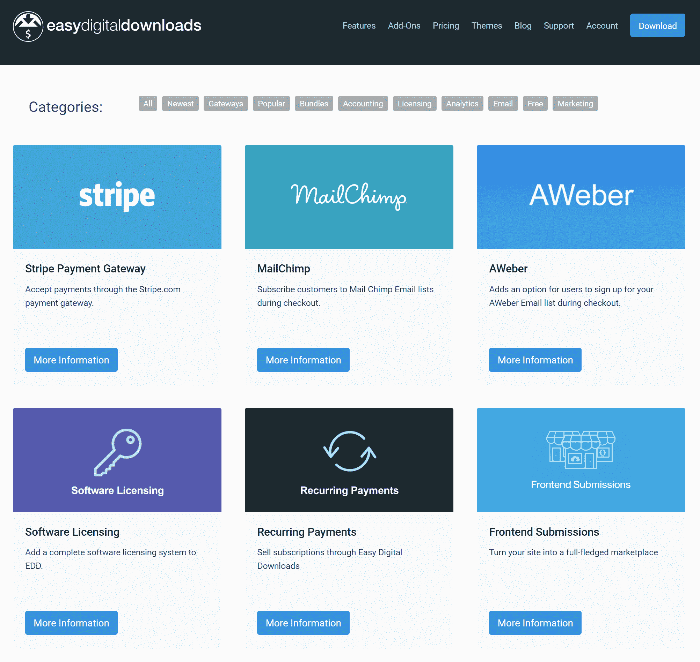

EDD extensions


下面是几个受欢迎的:

*   [Stripe 支付网关](https://easydigitaldownloads.com/downloads/stripe-gateway/):我们是金斯塔 [Stripe](https://kinsta.com/blog/stripe-for-wordpress/) 的忠实粉丝。轻松接受信用卡支付，并使用 Stripe 支付网关扩展进行处理，而无需客户离开您的网站。
*   EDD 社交折扣:如果用户在社交媒体上分享产品页面的链接，这个扩展可以给他们的客户一个折扣。它还可以选择关闭折扣功能，然后它就变成了一个简单的分享工具。
*   Mailchimp :这是一个用于电子邮件营销目的的出色扩展，因为它自动为客户订阅了一个 [Mailchimp 邮件列表](https://kinsta.com/blog/how-to-use-mailchimp/)。可以根据购买的产品过滤订阅。如果你愿意，该扩展允许客户选择加入邮件列表。
*   [交叉销售和追加销售](https://easydigitaldownloads.com/extensions/cross-sell-and-upsell/ "Cross-Sell and Upsell"):这种营销扩展在结账过程中向顾客推荐额外的产品。它还可以为客户提供一个追加销售选项，即推荐一种类似但价值略高于他们当前购物车中产品的产品。例如，可以将产品捆绑到一个包中，该包包括该产品以及其他产品。这是增加每位客户订单价值的绝佳方式。
*   [EDD 可变价格描述](https://easydigitaldownloads.com/extensions/edd-variable-pricing-descriptions/ "EDD Variable Pricing Descriptions"):这个免费扩展允许用户为每个可变价格下载添加一个“选项描述”输入字段。它还允许用户添加更长的描述，并自动将描述放在产品页面的前端。
*   WP Menu Cart :这个免费简单的插件自动在网站的导航栏中安装一个购物车按钮。它有几个选项，包括显示购物车图标或商品/价格的能力。还有一个高级版本有一些额外的功能。
*   [PixelYourSite](https://wordpress.org/plugins/pixelyoursite/) :只需点击几下鼠标，即可管理并安装新的脸书 pixel。查看我们关于如何在轻松数字下载中设置[转换跟踪的深入教程。](https://kinsta.com/blog/conversion-tracking/#fb-conversion-tracking-edd)
*   [EDD 下载服务](https://wordpress.org/plugins/edd-downloads-as-services/):这个免费插件让你可以轻松销售服务，而不是下载。这对 WordPress 开发者和自由职业者来说是完美的。它删除了购买确认页面上的“不可下载文件”。
*   [EDD 软件许可](https://easydigitaldownloads.com/downloads/software-licensing/):如果你销售需要许可证密钥的数字产品，比如 WordPress 插件。这个扩展为你处理所有的事情。
*   [EDD 定期支付](https://easydigitaldownloads.com/downloads/recurring-payments/):这个扩展使得创建和销售自动定期订阅的产品变得容易。
*   [Posts Table Pro](https://barn2.co.uk/easy-digital-downloads-table-plugin) :立即在表格视图中列出您的轻松数字下载产品，并提供额外数据。这是改进默认 EDD 布局的一个很好的方法，可以创建一个列出部分或全部下载的单页订单。
    [密码保护类别](https://kinsta.com/blog/password-protect-wordpress-site/):如果你想隐藏部分或全部轻松数字下载商店，那么这个插件让它变得很容易。密码保护整个下载类别，或创建私人类别，只有登录用户可以看到。

### 简易数字下载教程索引

*   [安装](#install-edd)
*   [配置 EDD](#configuring-edd)
*   [添加数字可下载文件](#adding-downloads)
*   [用 AffiliateWP 进一步扩展 EDD](#edd-affiliatewp)
*   [处理税款和增值税](#taxes)

## 轻松的数字下载安装

### 第一步

你需要做的第一件事是安装简易数字下载插件。你可以从 [WordPress 知识库](https://wordpress.org/plugins/easy-digital-downloads/)免费下载它，或者按照下面的步骤在你的仪表板中安装它。

[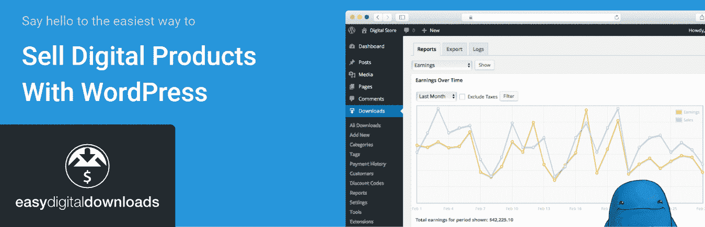](https://wordpress.org/plugins/easy-digital-downloads/)

Easy Digital Downloads WordPress plugin


要从你的仪表板安装它[，导航到 WordPress 管理>插件>添加新的，搜索“轻松数字下载”，点击“立即安装”确保作者显示为简单的数字下载。2.7+是目前 EDD 的最新版本。](https://kinsta.com/knowledgebase/wordpress-admin/)

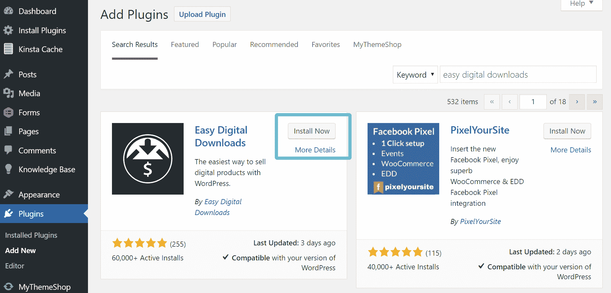

Install EDD plugin


### 第二步

然后点击“激活”

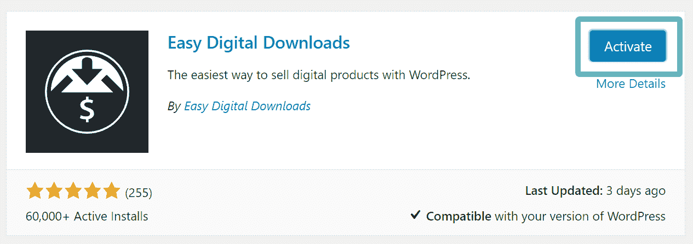

Activate EDD


就是这样！你的任务完成了。真的就这么简单。不再有穿越向导。他们把它保持得非常简单。但是您可能希望在下面设置一些额外的配置选项。

## 配置 EDD

### 第一步

你要做的第一件事是配置结账、支付、重定向等选项。为此，点击“下载”下的设置，它现在在你的 WordPress 仪表盘的左侧。

EDD 会自动在你的 WordPress 站点上创建页面，用于结帐、购买确认等。所以对于典型的商店，你不需要改变这些。在这个页面上，你需要做的最基本的事情就是设置你的国家和州/省。然后点击“保存更改”

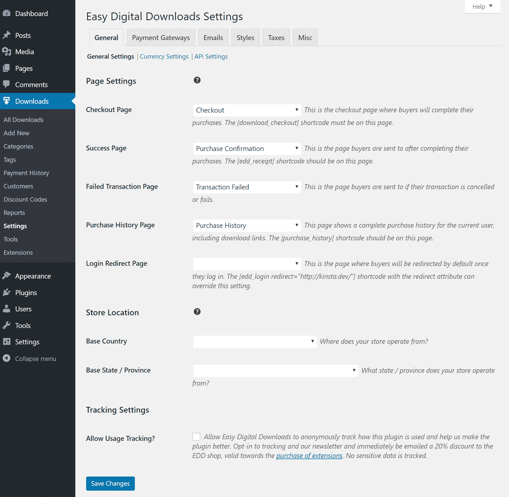

EDD settings


### 第二步

接下来，点击“支付网关”标签。在这里，您可以选择使用哪个[支付网关](https://kinsta.com/blog/woocommerce-payment-gateways/)来处理您网站上的交易。默认情况下，PayPal standard、Amazon 和 test payments 是你的选择。你可以让你的商店进入测试模式，这样你就可以在你的网站上测试购买情况，而不用花任何实际的钱。你需要获得一个免费的沙盒账户( [PayPal](https://developer.paypal.com/developer/accounts/) ， [Amazon Pay](https://pay.amazon.com/us/developer/documentation/lpwa/201956330) )来模拟真实的现场支付。

请记住，您也可以购买高级扩展来使用其他支付网关，如 [Stripe、Braintree](https://kinsta.com/blog/stripe-vs-braintree/) 、Dwolla、GoCardless 等。默认情况下，贝宝标准将通过他们的网站处理交易。这意味着你的客户会在你的网站上结账，然后被发布到 PayPal，然后被重定向回来。如果你想让他们留在你的网站上，你可以升级到 PayPal 专业支付或使用另一个提供商如 Stripe。查看我们关于如何[用简易数字下载设置 Stripe 的深入教程](https://kinsta.com/blog/stripe-for-wordpress/#stripe-easy-digital-downloads)或者我们的比较: [Stipe vs. PayPal](https://kinsta.com/blog/stripe-vs-paypal/) 。

## 注册订阅时事通讯


### 想知道我们是怎么让流量增长超过 1000%的吗？

加入 20，000 多名获得我们每周时事通讯和内部消息的人的行列吧！

[Subscribe Now](#newsletter)

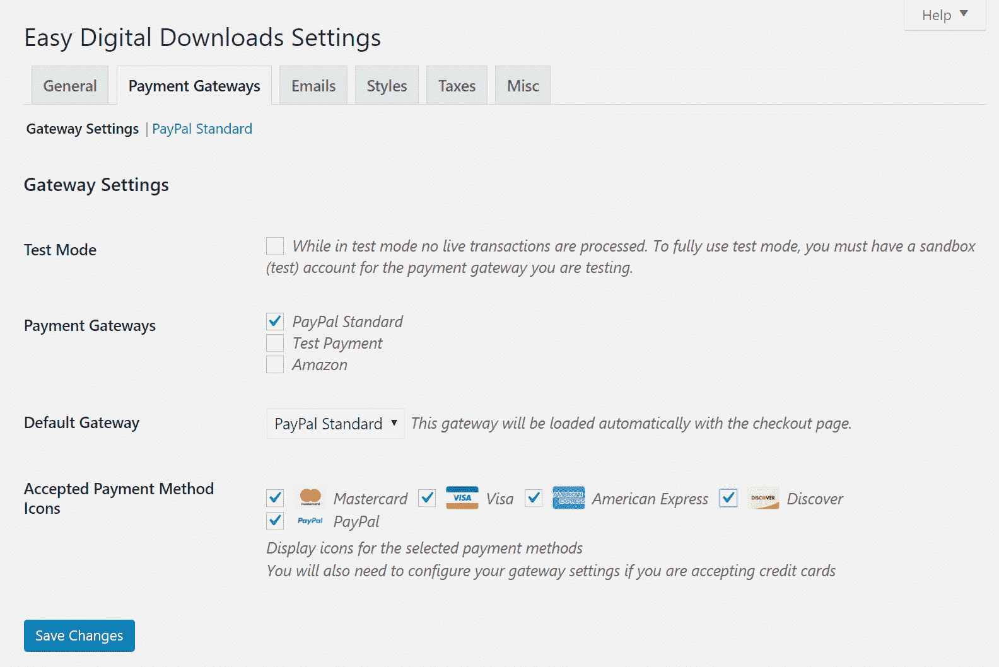

EDD payment gateways


### 第三步

接下来，点击副标题“贝宝标准”如果你使用贝宝，你至少要输入你的贝宝邮箱。它将使用贝宝的默认页面风格，除非你指定一个。查看他们关于如何[为结帐创建自定义页面样式](https://www.paypal.com/customize)的文档。即使是免费版的 PayPal，你也可以用自己的品牌定制客户的大部分体验。

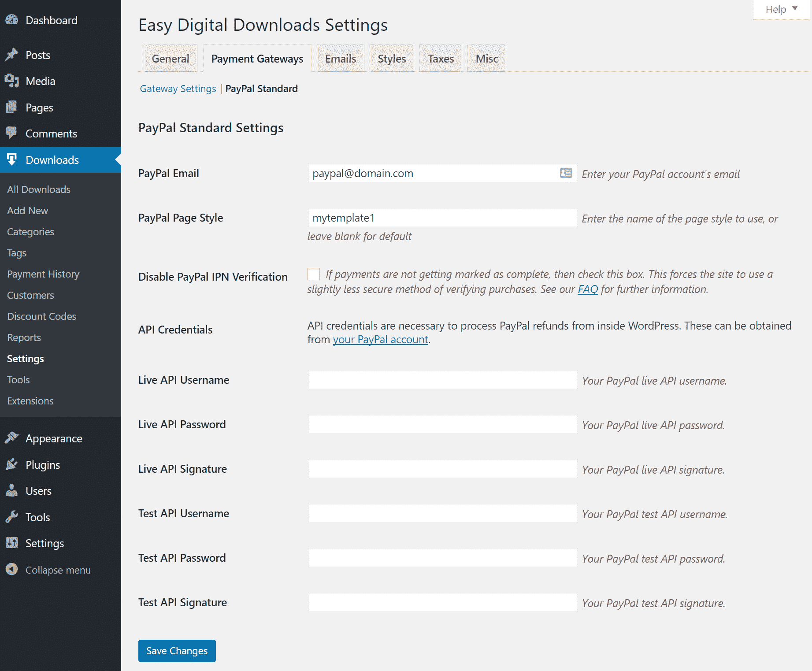

EDD PayPal Standard settings


### 第四步

然后点击“电子邮件”标签。默认情况下，一切准备就绪。但是你至少要为你的商店或产品设计一个标志。系统会自动向管理员和客户发送电子邮件。

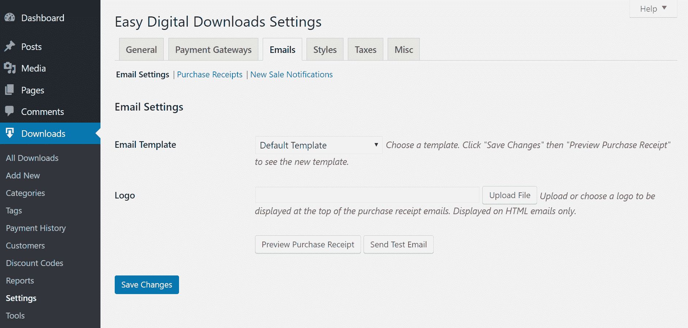

EDD email settings


下面是一个默认的 EDD 电子邮件模板的例子，该模板连同徽标一起发送给客户。该电子邮件包含指向您的数字下载文件的链接。如果你使用的是像 [EDD 软件许可](https://easydigitaldownloads.com/downloads/software-licensing/)这样的扩展，它也会自动插入他们唯一的许可密钥。

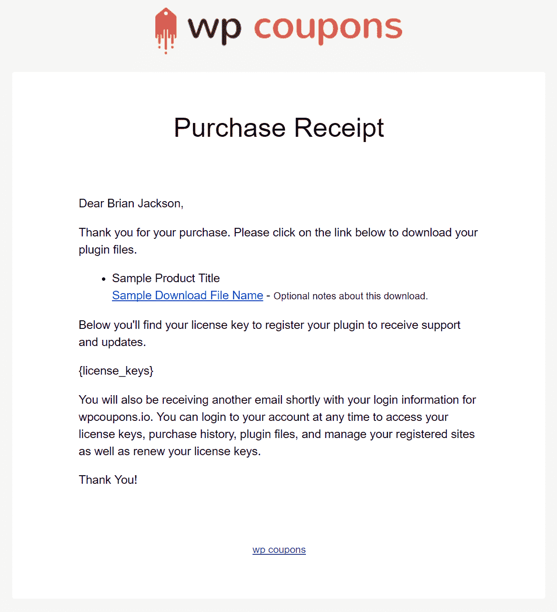

EDD email example


您还可以设置样式、税和其他杂项设置。对于许多商店来说，这些实际上都不需要改变。这是 EDD 的一大优点，它开箱即用。但是这里有一些额外的选择:

*   将商品添加到购物车后，立即重定向至“结账”。
*   允许更改项目数量。
*   强制重定向到安全的[结账页面](https://kinsta.com/blog/woocommerce-one-page-checkout/)。您[必须安装 SSL 证书](https://kinsta.com/knowledgebase/how-ssl-works/)才能使用此选项。
*   要求用户登录才能购买文件。
*   允许顾客在同一笔交易中享受多重折扣。
*   文件下载限制、下载链接过期、禁用重新下载文件的功能。
*   结账时启用协议条款选项。

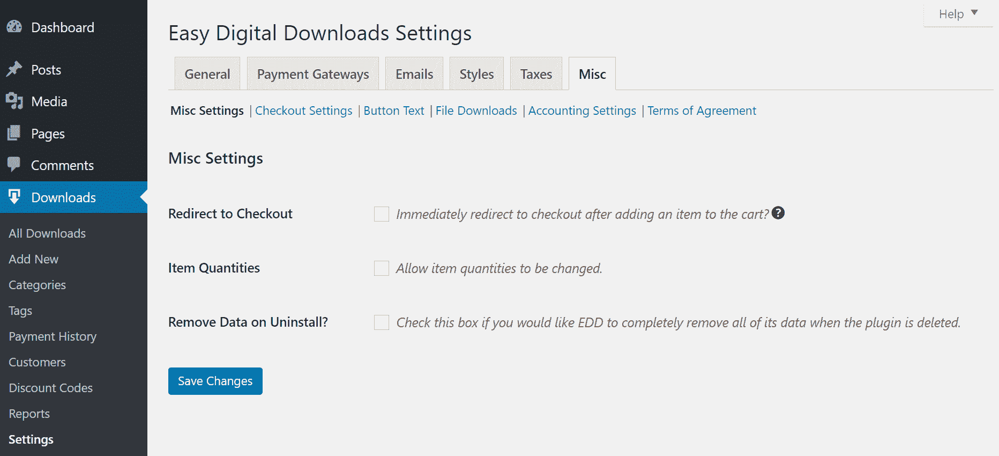

EDD misc settings


## 添加数字可下载文件

下一步是将你的数字可下载文件添加到你的 WordPress EDD 商店。请记住，根据您使用的扩展名，这也可能是提供的服务，而不是物理文件。

### 第一步

点击“下载”下的“添加新项”,为您的数字文件命名。您可以添加描述(显示在客户的下载文件页面上)、类别、下载标签等。

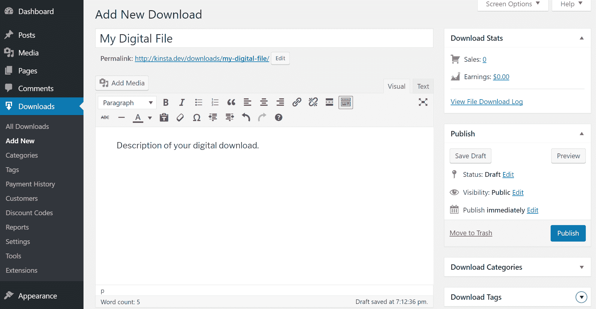

EDD add new download


然后给你的下载一个价格。只需点击一下按钮，就可以获得可变价格。然后，您可以上传您的数字文件，无论它是. zip 文件。pdf、. mp3 等。

Struggling with downtime and WordPress problems? Kinsta is the hosting solution designed to save you time! [Check out our features](https://kinsta.com/features/)

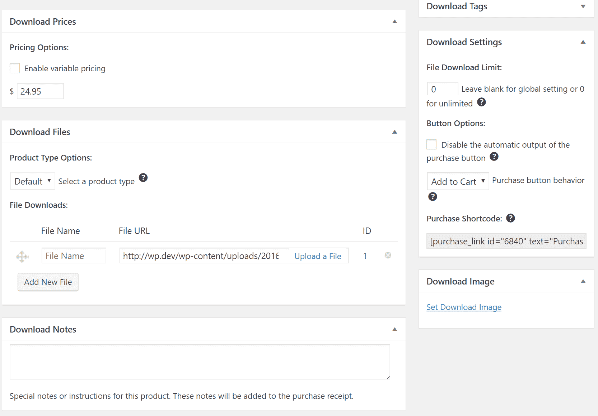

EDD prices


### 第 2 步(仅限 NGINX)

下一步是确保保存数字下载文件的文件夹是安全的。否则，有人可以浏览到该位置并免费下载文件。在你修复它之前，你很可能会在你的 WordPress 网站上看到一个警告:“[下载在 NGINX](http://docs.easydigitaldownloads.com/article/682-protected-download-files-on-nginx) 上不受保护的文件。”这一步只有[在 NGINX](https://kinsta.com/knowledgebase/what-is-nginx/) 上需要，至于那些在 [Apache](https://kinsta.com/knowledgebase/what-is-apache/) 上运行的，一个规则会自动应用到你的[上。htaccess 文件](https://kinsta.com/knowledgebase/wordpress-htaccess-file/)。

为了保护您的目录，将以下内容添加到您的 NGINX 配置中。注意:这个例子是针对。压缩文件。对其他文件类型进行相应的更改。如果您是 Kinsta 用户，您可以与我们的团队一起创建一个快速支持票证，我们将为您添加此票证。

```
rewrite ^/wp-content/uploads/edd/(.*)\.zip$ / permanent;
```

添加上述代码后，试图直接浏览您的下载文件的用户将被重定向到您的主页。

### 第三步

最后一步是为用户添加一个在你的 WordPress 站点上购买数字下载文件的方法。默认情况下，每个下载都有自己的带有购买按钮的 WordPress 页面。但是你们中的很多人可能在销售许可证时，仅仅想要一个定价页面。我们建议使用类似于[简易价格表](https://wordpress.org/plugins/easy-pricing-tables/)的插件。

一旦安装完毕，你可以在你的 WordPress 站点上创建一个“定价”页面，并使用插件中的短代码来显示你的定价表。然后，您可以使用[自定义添加到购物车链接](http://docs.easydigitaldownloads.com/article/268-creating-custom-add-to-cart-links)，以及价格表来创建完美的购物体验。下面是一个使用下载 ID 和可变价格的例子。

```
https://wp.dev/checkout?edd_action=add_to_cart&download_id=4444&edd_options[price_id]=1
```

这里是一个 EDD 商店定价页面的例子，以及自定义添加到购物车链接和可变价格。

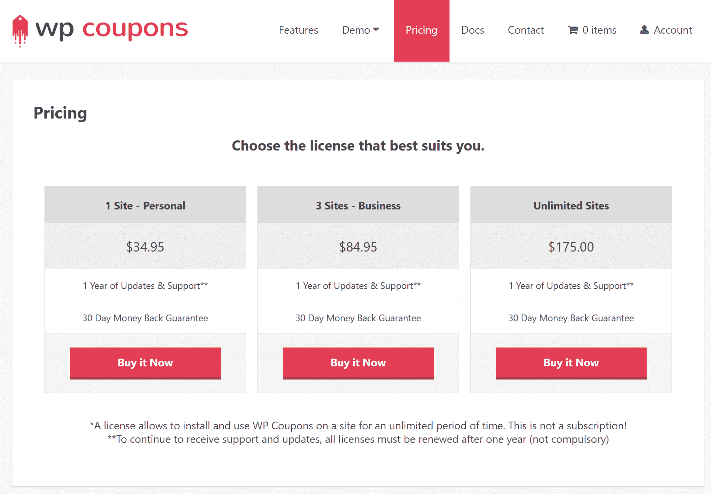

EDD pricing tables


就是这样！您的 EDD 商店将使用它在安装过程中创建的页面自动引导人们完成结账过程。它会生成一封电子邮件给你和客户，附上他们的下载文件(和许可证密钥，如果适用的话)，并为他们创建一个 WordPress 帐户，以便他们能够重新登录并访问他们过去购买的产品。

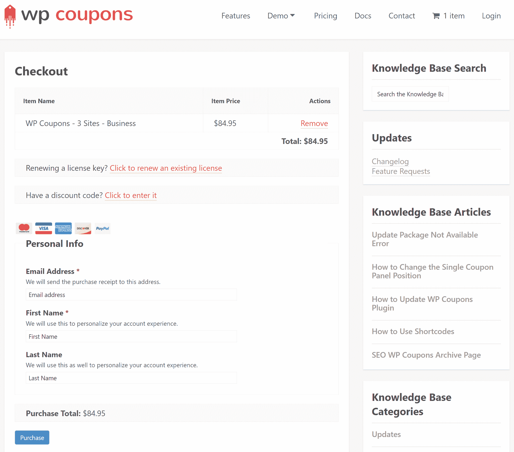

EDD checkout example


## 附加选项

别忘了查看**报告数据**和支付历史数据。还有一件好事是，PayPal 也能与 EDD 对话。因此，如果你卖一个产品，他们通过贝宝支付，它将被标记为在 EDD 支付。或者，如果你后来退还产品，它会自动更新 EDD 显示为退款，以及更新你当月的总收入。

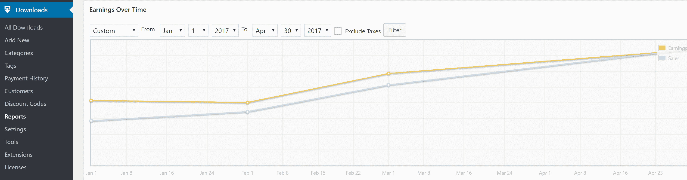

EDD reports


想要**为黑色星期五创建折扣代码**？没问题。只需点击“下载”下的“折扣代码”,创建尽可能多的优惠券和折扣代码。您可以选择产品的折扣百分比或固定费率金额。你可以设置有效期，甚至限制每位顾客只能使用一次。有了 EDD，时不时搞一次促销来宣传你的产品是非常容易的。

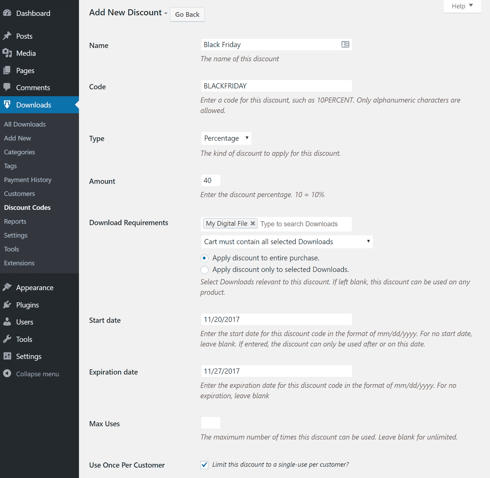

EDD discount codes


## 通过 AffiliateWP 进一步扩展 EDD

你可以用 [AffiliateWP](https://affiliatewp.com/) 进一步扩展 EDD，这是一个由同一个团队开发的高端产品。这种产品集成得如此之好，以至于你甚至不会注意到它们是独立的产品。


AffiliateWP mascot


它能让你在几分钟内启动一个[附属程序](https://kinsta.com/blog/affiliate-system/)。开始让你的客户为你销售你的产品。它提供了你每月支付给你的代销商的所有信息，并为他们提供了他们自己的折扣代码，他们可以将这些代码提供给他们的读者，以帮助更好地销售你的产品。

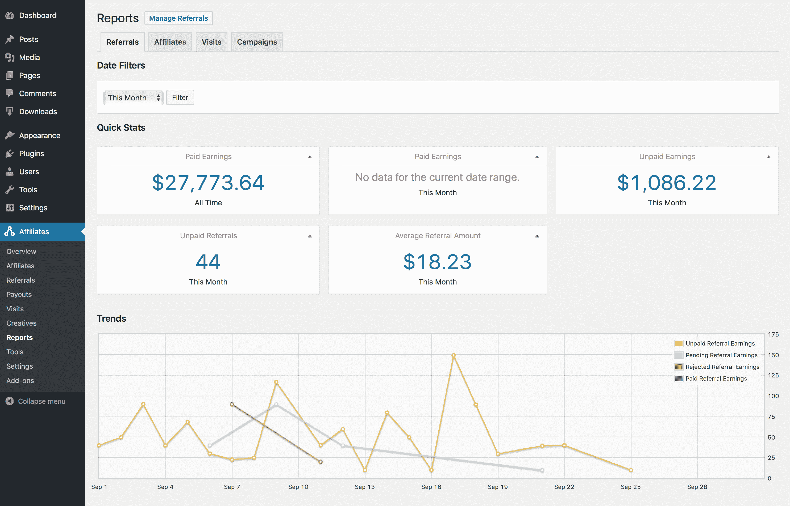

AffiliateWP admin


## 处理税款和增值税

当涉及到简单的数字下载时，税收可能会完全令人困惑。幸运的是，下面的解决方案可以让事情变得简单一点。这包括自动开具发票、向需要的国家收取增值税等。

*   笔记本
*   [自由意志](https://freemius.com/wordpress/collecting-eu-vat-europe/)
*   [保护费](https://proteuspay.com/)
*   [WP 路线](https://www.wproute.com/downloads/eu-vat-support-for-edd/)
*   用 [OmnipayWP](https://omnipay.io/downloads/edd-paddle-payment-gateway/) 划水

## 为您的电子商务需求选择正确的插件

创建新的数字业务时，选择正确的在线购物平台至关重要。虽然使用现有的第三方购物平台(如 Etsy)似乎是最简单的选择，但创建自己的网站始终是那些想要更上一层楼的人的首选方法。这样，你就拥有并控制了整个企业，从长远来看，你将能够获得更多利润。然而，与此同时，你不希望在客户服务或支付问题上花费数小时。这就是为什么选择一个导航简单且可靠的电子商务插件很重要。

[简易数字下载](https://easydigitaldownloads.com/)作为一个伟大的 WordPress 电子商务插件脱颖而出有几个原因。首先，**是免费的**，然后你可以用高级扩展来扩展它(也可以查看[最佳 WooCommerce 扩展](https://kinsta.com/blog/woocommerce-extensions/))。第二，它是可靠的，并且具有**出色的性能**。最后，它的**易于使用**，并且有一个**强大的支持**系统和支持它的开发者团队。总的来说，EDD 对新手和有经验的用户来说都是完美的。如果你在市场上寻找一个伟大的 WordPress 电子商务插件，并想尝试从你的网站上销售数字产品，那么简单的数字下载 WordPress 插件是一个负担得起的有效选择。

我们很想听听你的想法。你更喜欢 WooCommerce 还是 EDD？

* * *

让你所有的[应用程序](https://kinsta.com/application-hosting/)、[数据库](https://kinsta.com/database-hosting/)和 [WordPress 网站](https://kinsta.com/wordpress-hosting/)在线并在一个屋檐下。我们功能丰富的高性能云平台包括:

*   在 MyKinsta 仪表盘中轻松设置和管理
*   24/7 专家支持
*   最好的谷歌云平台硬件和网络，由 Kubernetes 提供最大的可扩展性
*   面向速度和安全性的企业级 Cloudflare 集成
*   全球受众覆盖全球多达 35 个数据中心和 275 多个 pop

在第一个月使用托管的[应用程序或托管](https://kinsta.com/application-hosting/)的[数据库，您可以享受 20 美元的优惠，亲自测试一下。探索我们的](https://kinsta.com/database-hosting/)[计划](https://kinsta.com/plans/)或[与销售人员交谈](https://kinsta.com/contact-us/)以找到最适合您的方式。