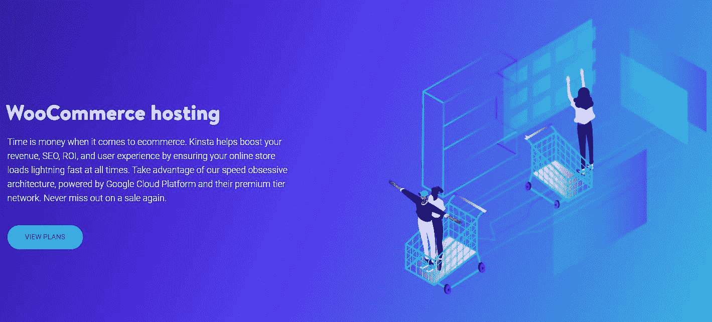
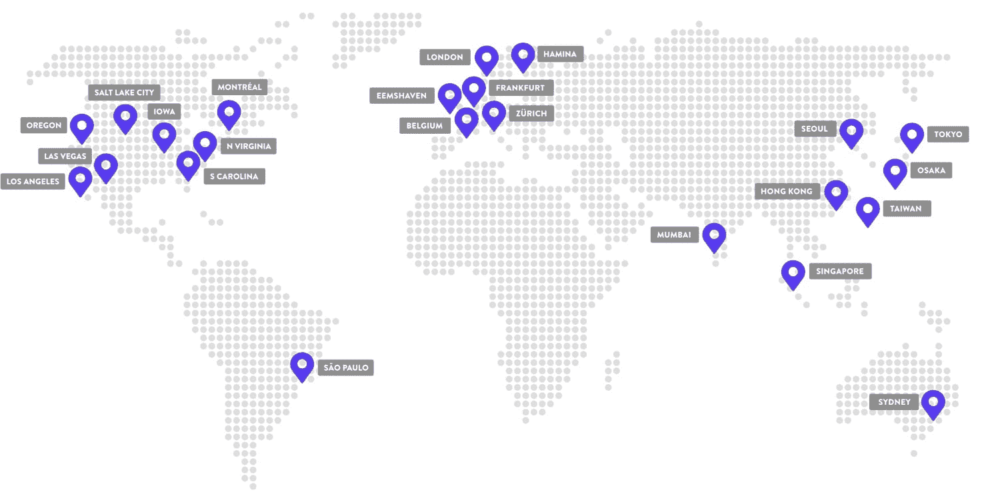
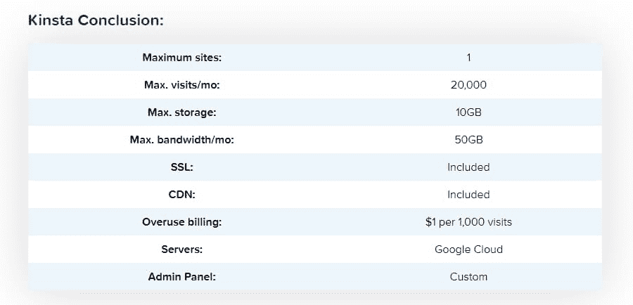
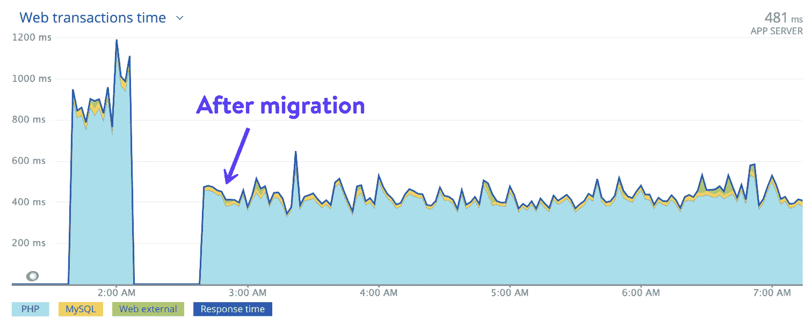
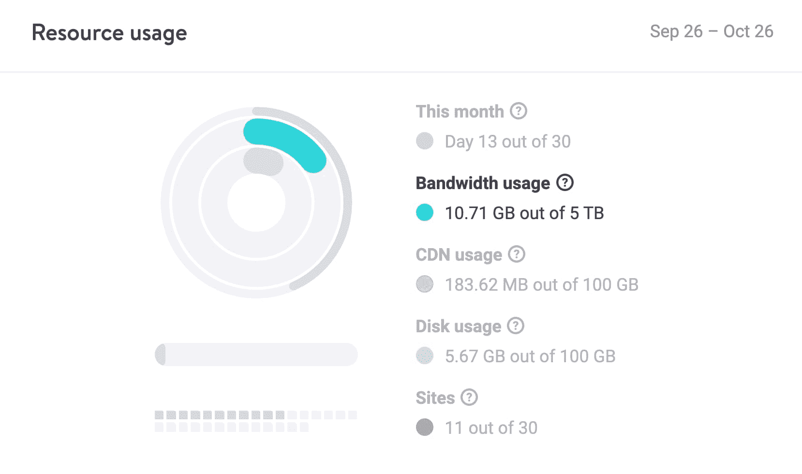
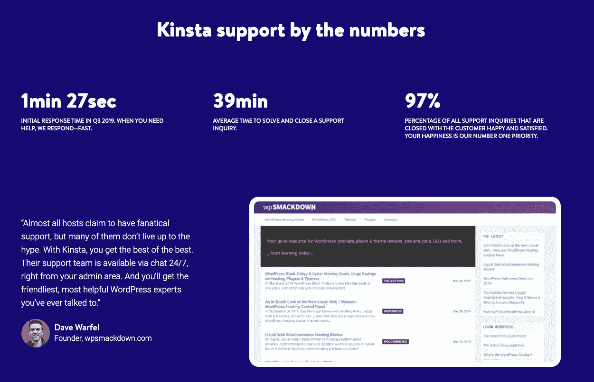
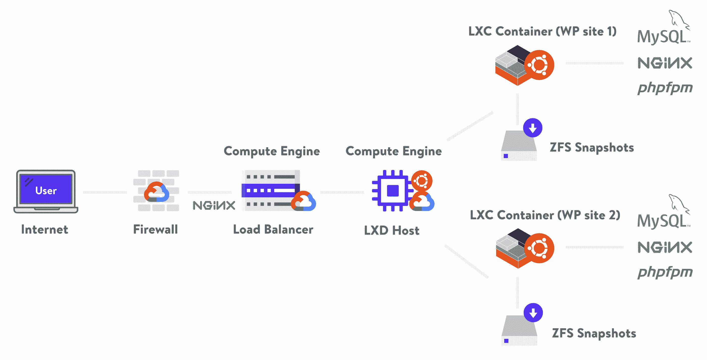
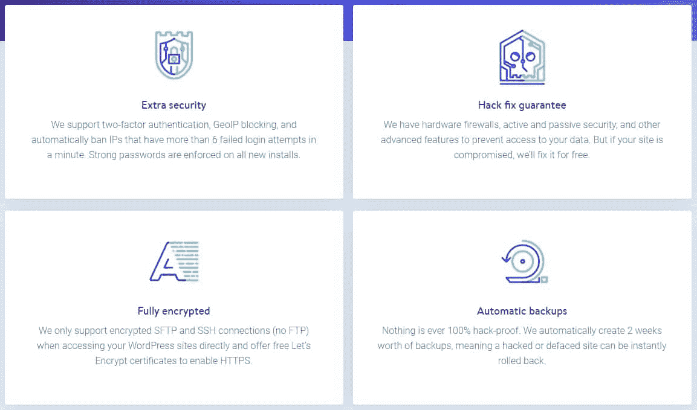
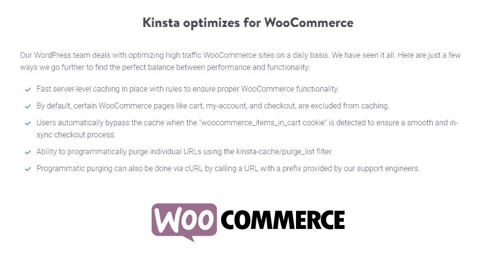
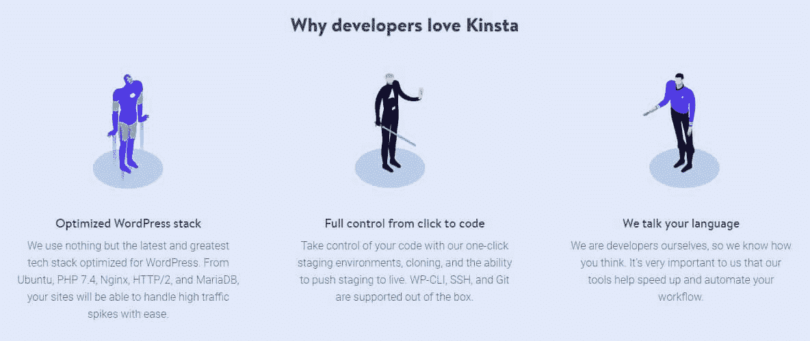

# 电子商务托管:如果你对你的商店很认真的话，要注意的 8 件事

> 原文：<https://kinsta.com/blog/ecommerce-hosting/>

如果你有一个在线商店，选择一个好的电子商务主机提供商比你想象的更重要。太多的企业因为糟糕的加载速度、糟糕的安全性和不当的 web 服务器管理而失败。

但是，是什么让[成为伟大的电子商务主机](https://kinsta.com/woocommerce-hosting/)？我们整理了一份你应该在主机服务提供商中寻找的关键品质的列表，以支持你的研究并做出更明智的决定。

准备好开始了吗？让我们开始吧！

## 什么是电子商务托管？

每个网站和网上商店都需要一个关键的东西来上网:主机。虚拟主机为你的网站提供了一个服务器，让它能够连接到互联网，让人们访问它。

基本上，你是在购买他人未使用的服务器空间的权利，并从一家知道如何保护和优化其服务器的公司获得服务。

托管有各种不同的形式和专业。一些主机类型是根据它们所基于的硬件来命名的，而另一些则有一些具有独特功能的专门计划。

这就是电子商务托管。

> Kinsta 把我宠坏了，所以我现在要求每个供应商都提供这样的服务。我们还试图通过我们的 SaaS 工具支持达到这一水平。
> 
> <footer class="wp-block-kinsta-client-quote__footer">
> 
> 
> 
> <cite class="wp-block-kinsta-client-quote__cite">Suganthan Mohanadasan from @Suganthanmn</cite></footer>

[View plans](https://kinsta.com/plans/)

一个高质量的电子商务主机包是一个专为这种类型的业务定制的特殊功能包。这些可能包括[免费的 SSL 加密](https://kinsta.com/help/how-to-install-ssl-certificate/)，帮助建立[支付网关](https://kinsta.com/blog/woocommerce-payment-gateways/)，[额外的安全性](https://kinsta.com/secure-wordpress-hosting/)，或者在高流量期间[扩展](https://kinsta.com/knowledgebase/dedicated-server/)。

还有 [WooCommerce 主机](https://kinsta.com/woocommerce-hosting/)，这可以被认为是电子商务主机的一个子类。WooCommerce hosting 拥有电子商务主机的所有功能以及更多功能，服务器环境经过优化，可以运行 WooCommerce 插件。

WooCommerce Hosting with Kinsta

例子包括[为 WooCommerce 优化的缓存](https://kinsta.com/blog/wordpress-cache/#types-of-wordpress-cache)，[不会破坏你的网站的专门迁移](https://kinsta.com/knowledgebase/wordpress-migrations/#premium-migration)或者来自受过使用 WooCommerce 训练的人的支持。

[Boost customer satisfaction and site performance with an ecommerce host tailored to your company's needs 📊 Learn more in this guide ⤵️Click to Tweet](https://twitter.com/intent/tweet?url=https%3A%2F%2Fkinsta.com%2Fblog%2Fecommerce-hosting%2F&via=kinsta&text=Boost+customer+satisfaction+and+site+performance+with+an+ecommerce+host+tailored+to+your+company%27s+needs+%F0%9F%93%8A+Learn+more+in+this+guide+%E2%A4%B5%EF%B8%8F&hashtags=ecommerce%2Cwebhosting)

### **电子商务托管的类型**

您需要了解几种不同类型的主机，它们决定了服务器的硬件和设置。传统上，有三种主要类型:共享、VPS 和专用托管。

共享主机是最底层的，适合创业公司和只想上网的个人。它通常很便宜，但代价是速度较慢，并且必须与其他几个网站共享服务器空间。这种类型的主机不适合电子商务网站，除非你负担不起其他任何东西。

[VPS 代表“虚拟专用服务器](https://kinsta.com/knowledgebase/shared-vps-dedicated-hosting/)”。您的服务器与其他网站共享一台机器，但其资源是隔离的，消除了许多与共享主机相关的问题。然后，专用主机是顶层，给你自己的私人，物理服务器。当然，这并不便宜。这两种主机类型都很适合电子商务，但还有一个更好的解决方案。

云托管是电子商务网站的一个普遍问题的流行解决方案:快速超越他们的服务器环境。云托管是完全可扩展的。您可以随时添加或删除资源。而且对创业公司来说也很实惠！

对于成长中的电子商务网站，云几乎肯定是你想要的基础设施。

Kinsta’s data center locations

托管类型还有另外一层:托管与非托管托管。

非托管主机通常更便宜，但也有很大的缺点。你必须自己完成[所有的服务器设置和配置](https://kinsta.com/blog/sysadmin/)，以及持续的安全和维护。你基本上只是购买了一台空服务器的权利。

有了[托管](https://kinsta.com/blog/managed-wordpress-hosting/)，一切都有了保障。安装、配置、安全、维护、支持和更新。一个托管的电子商务主机将帮助你让你的商店运行，并确保它保持这种方式。

简而言之，云托管可能是电子商务网站的最佳解决方案。

### 信息

想了解更多？在我们的免费电子书中了解您的企业如何从托管服务中获益。

## **电子商务主机提供商需要注意的 8 个方面**

有一些功能，每个电子商务主机应该有。当你寻找一个电子商务主机，将是一个很好的适合你的网上商店，寻找这些关键特征。

### **1。高性能**

作为一个电子商务网站，你的首要任务应该是找到一个又快又可靠的主机。如果加载时间超过 3 秒，57%的消费者会[离开你的网站](https://kinsta.com/learn/page-speed/#business-success)，其中 80%的人永远不会回来。这是很多失去的潜力。

共享主机的问题是速度慢，经常停机，这是任何在线商店都无法接受的。你还必须小心选择谁，因为有些主机的基础设施不可靠，会导致速度变慢或崩溃。

每一个虚拟主机公司都会标榜自己是最好最快的，所以做研究是必要的。像 Hosting Facts 这样的网站可以给你稳定的正常运行时间和 ping 数据，帮助你做出正确的决定。)你可以在那里找到他们的 [WordPress 主机](https://kinsta.com/wordpress-hosting/)对比。

Kinsta stats on HostingFacts

[CDN 是必备的](https://kinsta.com/blog/wordpress-cdn/)，最好包含在您的托管计划中。cdn 是一个分布在广阔区域的服务器网络，在流行的[如 Cloudflare](https://kinsta.com/help/kinsta-cdn/) 的情况下是全球性的。当一个远离你的主服务器的用户试图连接到你的网站时，他们会被路由到附近的 CDN 服务器，这样每个人的加载时间都会更快。

你的电子商务主机还应该包括性能和正常运行时间监控功能，当出现问题时会立即提醒你。如果[一台服务器宕机](https://kinsta.com/blog/website-downtime/)或者一切运行缓慢，你需要能够立即采取行动。

例如，在 Kinsta，我们每分钟都会用 Sentry 检查网站的正常运行时间，如果有任何不正常的情况，我们就会发出警报。你选择的任何托管都应该包含这个重要的特性。

我们最近还将网络上每个站点的性能提升了 200% 。多亏了谷歌云平台的新 C2 虚拟机，大大加快了前端和后端的速度。我们用几个不同的参数测试了新机器。在 WooCommerce 网站上，我们在缓存绕过了 T3 的情况下，在 T2 进行了性能最佳的测试，我们发现新的服务器快了将近 4 倍。

Cache Bypass WooCommerce GCP N1 C2

看看迁移到新机器对我们的一个客户产生了怎样的影响，他的性能瞬间提升了 100%!我们还测量了其他几个客户端，他们的网站速度都有显著提高。

Client 8 Migration GCP C2

如果你需要一个无论网站大小都能提供卓越性能的主机，我们这里肯定有你的空间。

### **2。带宽和文件存储**

电子商务网站占据了大量的文件空间，它们也是通常吸引最多流量的网站类型。你需要一个有足够资源的主机，除非你想最终支付高额超龄费。

图片是任何网站设计的关键部分，无论你在设计什么，你都需要大量的图片。尤其是电子商务网站，往往会很快耗尽存储空间。你上传的每个产品都需要[多个高分辨率图像](https://kinsta.com/blog/conversions-woocommerce-product-pages/#2-use-highquality-product-images)，当你的商店足够大时，你很容易想知道你所有的文件空间都到哪里去了。

High Bandwidth Hosting

在 Kinsta，我们没有带宽限制。我们只有每月访问量和[磁盘空间](https://kinsta.com/blog/disk-usage-wordpress/)的上限。

### **3。可扩展托管**

不像其他类型的网站，随着时间的推移稳步增长和可预测的，一个电子商务商店的流量可以相当多变。[假期通常会引发流量的激增](https://kinsta.com/blog/ecommerce-strategies/)，顾客不知从哪里冒出来，增长往往是突然的、指数级的。在一个托管的电子商务主机中，你应该寻找可以和你的业务一起成长的可扩展资源。

## 注册订阅时事通讯

### 想知道我们是怎么让流量增长超过 1000%的吗？

加入 20，000 多名获得我们每周时事通讯和内部消息的人的行列吧！

[Subscribe Now](#newsletter)

在 Kinsta，我们从 Starter 到 Enterprise 4 的所有计划都能够根据需要最大限度地利用 CPU。在您的站点可能需要额外资源的情况下，您可以在零宕机的情况下快速扩展到更强大的计划。对于预期流量巨大的网站——想想超级碗广告级别的数字——我们也有高性能的专用服务器解决方案。

你还需要一台不会把你锁在里面的主机，一台可以让你在需要时随时添加 CPU、RAM 和其他资源的主机。云托管是最好的解决方案，因为你可以随时升级你的计划或请求更多的电力，并立即增加电力。

对于物理 VPS 或专用主机，升级需要将您转移到不同的服务器，或者手动安装更强大的硬件，这可能成本很高。在云主机上升级很便宜。

### **4。主动支持**

[问题和错误](https://kinsta.com/blog/wordpress-errors/)肯定会在你的新网站上出现。如果你的主机没有一个好的支持团队来帮助你，你的网站可能会关闭几个小时。支持应该友好、乐于助人、快速，并且能够在出现问题时以积极主动的方式与您合作。

Kinsta support

每个支持团队背后都应该有一群经验丰富的开发人员。如果 web 主机的基础设施和服务器构建得很好，并且很少停机，这是一个好迹象，表明他们的开发团队将能够帮助您解决最意想不到的问题。

对于发生在你网站内部的问题，你通常不会得到帮助，但是当问题发生在他们的服务器端时，问题就会得到解决。在 Kinsta，虽然我们不能修复您代码中的所有错误，但我们可以帮助您[识别问题](https://kinsta.com/help/scope-of-support/)，以便您可以快速解决问题。很多主持人甚至不会做那么多！

寻找 24/7 支持，因为服务器问题可能在任何时候发生，甚至在半夜。如果你被提醒[你的网站关闭了](https://kinsta.com/blog/website-downtime/)，你需要解决这个问题。你不想失去任何流量，或者更糟的是，你不需要在奇怪的时间醒来，只是为了修复你的网站。

### **5。完全安全**

由于电子商务网站保护敏感数据:信用卡号、Paypal 和银行密码，通常还有用户的全名和地址，所以它们经常成为黑客攻击的目标。

攻击一个安全性差的在线商店非常有利可图——而全新的创业公司通常不知道如何保护这些重要数据的安全——所以你现在需要[保护你的网站](https://kinsta.com/blog/wordpress-security/)。

Kinsta Hosting Architecture V6

保护您自己的代码取决于您和您的开发人员，但是许多黑客攻击的发生是由于您的 web 主机部分安全性差。服务器代码中的缺陷允许恶意行为者轻松渗透到您的网站，获取用户数据，记录通过服务器发送的密码，甚至在您的网站上放置针对用户的恶意软件。

这就是为什么你需要选择一个知道他们在做什么的主机。如果他们没有免于黑客攻击的政策，要小心了。他们的安全性可能很差，如果你真的被黑了，他们可能不会采取任何措施来弥补损失。

### 信息

使用客户站点？通过我们的[免费电子书《保护客户网站安全](https://kinsta.com/ebooks/wordpress/how-to-secure-wordpress-site/)，了解如何增强他们的安全性。

在 Kinsta，[我们非常重视安全问题](https://kinsta.com/secure-wordpress-hosting/)，并采取积极措施防止攻击事件的发生。[我们的防火墙](https://kinsta.com/feature-updates/auto-db-optimize/#now-secured-behind-google-cloud-platform-firewall)被严密保护和限制，以防止任何未经授权的软件从裂缝中溜走，我们还阻止[对未知服务的 XML-RPC](https://kinsta.com/blog/xmlrpc-php/) 访问，并禁止在 wp-content/uploads 等敏感区域执行代码。

你的电子商务网站需要一个超快的、可靠的、完全安全的主机吗？Kinsta 提供所有这些服务，并由 WooCommerce 专家提供 24/7 的世界级支持。[查看我们的计划](https://kinsta.com/plans/?in-article-cta)

我们还为我们的服务器使用[谷歌云平台，这意味着您可以从云行业](https://kinsta.com/blog/google-cloud-hosting/)的一些[最佳提供商那里获得顶级的安全性。](https://kinsta.com/blog/cloud-market-share/)

24/7 监控和扫描服务应该是您的电子商务主机中的必备功能，以[识别任何进入您网站的恶意软件](https://kinsta.com/blog/types-of-malware/#how-to-detect-malware)。即使有东西通过了，Kinsta 也提供[免费的恶意软件检测](https://kinsta.com/knowledgebase/disclose-security-vulnerability/#how-are-security-vulnerability-reports-handled)和[清除服务](https://kinsta.com/knowledgebase/security-guarantee/)。很有可能，我们会在你之前注意到你的网站已经被感染了，然后马上修复它。

Hosting Security Features

DDoS 攻击也是电子商务网站的常见问题。这些攻击是由数千台计算机同时发起的，可以迅速摧毁一个网站。一个好的主机会发现 DDoS 攻击并阻止它们。

作为一个网店店主，[你需要有一个 SSL 证书](https://kinsta.com/knowledgebase/woocommerce-ssl/)来加密进出的敏感用户输入。没有它，攻击者可以看到从你的网站传到你的服务器的任何东西，比如放入表单的用户数据。寻找一个免费提供 SSL 的[主机](https://kinsta.com/blog/free-ssl-certificate/)。

### **6。WooCommerce 整合**

如果你在 WordPress 上开始你的商店，很有可能你正在使用 [WooCommerce](https://kinsta.com/blog/woocommerce-tutorial/) 。并不是所有的网络主机都能很好地使用这个插件。一开始你可能不会遇到问题，但你的网站可能不会运行得很好，因为它可能缺乏高级功能，如 [WooCommerce 专用缓存](https://kinsta.com/blog/speed-up-woocommerce/#woocommerce-speed-starts-with-quality-hosting)(等等)。

随着 [WordPress 像](https://kinsta.com/wordpress-market-share)一样受欢迎，最好的电子商务主机应该包括 [WooCommerce 主机](https://kinsta.com/woocommerce-hosting/)。

### 信息

需要更快的店铺？学习[如何加快你的 WooCommerce 商店(前端+后端)](https://kinsta.com/blog/speed-up-woocommerce/)与这个深入的指南！

Kinsta WooCommerce Optimization

你应该要求你的电子商务主机提供商提供的另一个被忽视的方面是 [PCI 合规性](https://kinsta.com/knowledgebase/pci-compliant-hosting/#does-kinsta-offer-pci-compliant-hosting)。PCI 代表“支付卡行业”，它是一套安全标准，旨在防止用户数据因网站安全性差而泄露。每个[接受信用卡数据的网站](https://kinsta.com/blog/woocommerce-payment-gateways/)都必须符合 PCI 标准。

主机不可能保证 PCI 合规性，因为您需要自己做大量工作来确保站点安全。但是他们当然有可能通过提供 SSL 证书，用防火墙保护他们的服务器，以及使用强大的服务器基础设施来简化这个过程。

做 PCI 审计是你自己的事，但是一个好的电子商务主机会和你一起帮助保护你的网站，并做任何必要的调整使你的网站符合 PCI 标准。

### 7.自动备份

我们怎么强调备份对电子商务网站的重要性都不为过。自动数据备份是绝对必须的。[每天、每周甚至每小时](https://kinsta.com/help/wordpress-backups/)在某些情况下:需要一个可靠的备份系统来保护你的重要存储和数据库文件。

特别是如果你在 WordPress 中工作，很容易意外地改变敏感设置，你可能会犯一个错误，导致你的网站关闭或者[数据库损坏](https://kinsta.com/knowledgebase/wordpress-repair-database/)。

如果你没有最近的备份，你将会失去很多时间和精力去恢复正常。你甚至可能会失去一切。这就是为什么您需要一台内置备份的主机，这样您就可以安心地运营您的业务。

在 Kinsta，我们确保每天自动[备份您的网站](https://kinsta.com/help/wordpress-backups/)、[数据库](https://kinsta.com/knowledgebase/wordpress-database/)、文件，甚至 Nginx 规则，根据您的计划，这些规则从 14 天到 30 天不等。

Kinsta 客户喜欢的另一个有用的功能是，如果你也喜欢手动备份，你可以每周[下载一次你的站点](https://kinsta.com/help/wordpress-backups/#downloadable-backups)的备份。如果这还不够，每小时备份插件[确保绝对最大的安全性和最小的损失，万一灾难来袭。](https://kinsta.com/feature-updates/hourly-backups/)

[一般来说，数据安全](https://kinsta.com/help/disaster-recovery/)应该是您的主机最关心的问题之一。良好的基础设施、自动备份和持续监控将防止灾难并保证您的站点安全。

### 8.开发人员友好的环境

如果你是[开发者](https://kinsta.com/blog/web-developer-salary/)并且想要深入高级主机选项，可能很难找到支持你的主机。可以理解，网站主机不希望新手用户修改关键文件，导致整个网站崩溃。

但是当你需要[编辑核心 WordPress 文件](https://kinsta.com/knowledgebase/edit-wordpress-code/)，设置 WP-CLI 或 Git 之类的工具，甚至只是[更新你的 PHP 版本](https://kinsta.com/knowledgebase/how-to-update-php-in-wordpress/)时，许多主机会让这成为你绝对的噩梦。

在 Kinsta，我们相信我们的用户知道他们在做什么，如果他们需要使用，每个人都有各种高级功能的完全开发权限。

[创建登台环境](https://kinsta.com/help/staging-environment/#create-wordpress-staging)，克隆你的站点，使用 [WP-CLI](https://kinsta.com/blog/wp-cli/) ，[设置 Git](https://kinsta.com/help/git/) ，[访问 SSH](https://kinsta.com/blog/how-to-use-ssh/) …任何你需要做的事情。这是最棒的部分:你不需要联系 Kinsta 支持来激活这些！

Kinsta developer features

如果您对我们基础设施设置的细节感兴趣，您可以在[功能页面](https://kinsta.com/features/)上找到大量信息。

[Learn how ecommerce hosting could change your business, from site performance to sales 💰Click to Tweet](https://twitter.com/intent/tweet?url=https%3A%2F%2Fkinsta.com%2Fblog%2Fecommerce-hosting%2F&via=kinsta&text=Learn+how+ecommerce+hosting+could+change+your+business%2C+from+site+performance+to+sales+%F0%9F%92%B0&hashtags=ecommerce%2Cwoocommerce)

## **总结**

太多的全新网站成为这个共同问题的牺牲品:加载速度慢，安全性差，以及由于糟糕的网站主机而缺乏支持。从一个普通的共享主机开始可能看起来很便宜，但是不值得对你的底线产生负面影响。

当你寻找一个电子商务主机提供商时，你应该选择一个可以根据你的业务需求进行扩展，并提供一流的质量和可承受的计划。

Andrew Reeve, CEO at HonestBrew

托管，虽然最初看起来是一个昂贵的解决方案，但它提供了大量的工具和规范，通过照顾你的所有重要方面，使你的生活变得更容易。

从商业角度来看，[如果你认真对待你的网上商店，这是一笔值得投资的投资。在这一点上，你应该看看我们的](https://kinsta.com/blog/sysadmin/)[托管云托管解决方案](https://kinsta.com/woocommerce-hosting/):我们提供各种各样的计划，将使一个电子商务网站起飞轻而易举。

现在轮到你了:说到电子商务托管，对你来说最重要的是什么？

* * *

让你所有的[应用程序](https://kinsta.com/application-hosting/)、[数据库](https://kinsta.com/database-hosting/)和 [WordPress 网站](https://kinsta.com/wordpress-hosting/)在线并在一个屋檐下。我们功能丰富的高性能云平台包括:

*   在 MyKinsta 仪表盘中轻松设置和管理
*   24/7 专家支持
*   最好的谷歌云平台硬件和网络，由 Kubernetes 提供最大的可扩展性
*   面向速度和安全性的企业级 Cloudflare 集成
*   全球受众覆盖全球多达 35 个数据中心和 275 多个 pop

在第一个月使用托管的[应用程序或托管](https://kinsta.com/application-hosting/)的[数据库，您可以享受 20 美元的优惠，亲自测试一下。探索我们的](https://kinsta.com/database-hosting/)[计划](https://kinsta.com/plans/)或[与销售人员交谈](https://kinsta.com/contact-us/)以找到最适合您的方式。