# 2022 年电子商务统计–聊天机器人、语音、全渠道营销

> 原文：<https://kinsta.com/blog/ecommerce-statistics/>

由于电子商务的发展，即使资本有限，现在也很容易建立一个企业。随着消费者越来越依赖网上购物——据估计，到 2040 年，95%的购物将在网上进行——电子商务为无数企业家打开了机会之门。

而且，那些[电子商务销售机会](https://kinsta.com/blog/ecommerce-strategies/)正在快速增长。2017 年，电子商务的销售额为 2.3 万亿美元，预计到 2022 年将翻一番以上，达到 5.5 万亿美元。仅在美国，网上购物就已经占到零售额的 10%，预计年增长率为 15%。

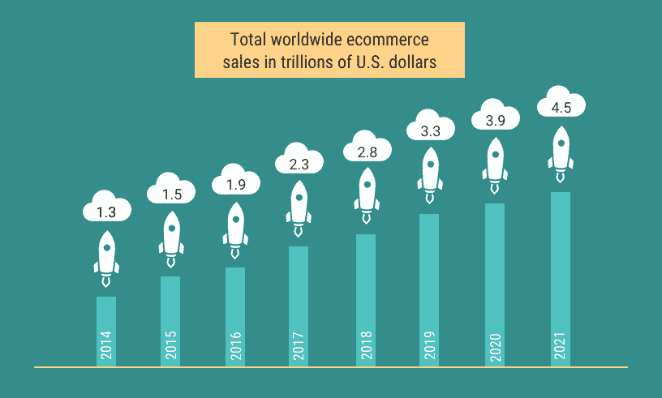

Worldwide ecommerce sales (Image source: Shopify)

了解关键的电子商务统计数据和事实，从人口统计和购物行为，到[购物车放弃](https://kinsta.com/blog/shopping-cart-abandonment/)和趋势，将让你更深入地了解电子商务现在正在发生的事情，以及它的发展方向。

## 挖掘电子商务人口统计数据

千禧一代和 x 一代是最大的网上购物者，67%的千禧一代和 56%的 x 一代更喜欢网上购物，而不是实体店。你看到这两部分人在网上花费更多钱的部分原因是他们花更多时间在网上购物。千禧一代和 x 世代花在网上购物的时间比他们的同龄人多 50 %: 6 小时比 4 小时。

尽管女性通常被认为是购物者，但在网上购物方面，男性占据了主导地位，他们的网上购物支出比女性高出 28%。

## 分解电子商务购物行为

关于电子商务购物行为的统计数据非常具有启发性:43%的网上购物者称他们在床上购物，23%在办公室购物，20%在浴室或车里购物。

事实证明，酒精可以促进电子商务的销售，10%的顾客称他们买过酒。最终，在这种情况下，男性购物的可能性是女性的两倍多，14%的男性表示会这样做，而只有 6%的女性表示会这样做。

> Kinsta 把我宠坏了，所以我现在要求每个供应商都提供这样的服务。我们还试图通过我们的 SaaS 工具支持达到这一水平。
> 
> <footer class="wp-block-kinsta-client-quote__footer">
> 
> 
> 
> <cite class="wp-block-kinsta-client-quote__cite">Suganthan Mohanadasan from @Suganthanmn</cite></footer>

[View plans](https://kinsta.com/plans/)

鉴于酒在网上购物中的作用，发现 42%的网上购物者购买了他们后悔的东西，21%的人意外购买了他们不想要的东西就不足为奇了。

尽管 48%的网上购物者在网上购物时超支或购买了计划外的东西，但购买路径并不直:85%的顾客在一个设备上开始购买，然后在另一个设备上完成购买。

## 电子商务市场份额:美国与全球趋势

尽管美国通常被认为是最大的电子商务市场，但事实并非如此。然而，它确实跻身于全球十大电子商务市场之列:

*   中国:6720 亿美元
*   美国:3400 亿美元
*   英国:990 亿美元
*   日本:790 亿美元
*   德国:730 亿美元
*   法国:430 亿美元
*   韩国:370 亿美元
*   加拿大:300 亿美元
*   俄罗斯:200 亿美元
*   巴西:190 亿美元

尼尔森的全球互联商务报告提供了各国最赚钱行业的详细细分，韩国在时尚(77%)和美容产品(66%)以及非食品家庭杂货(52%)、包装食品杂货(51%)和新鲜食品杂货(37%)方面独占鳌头。

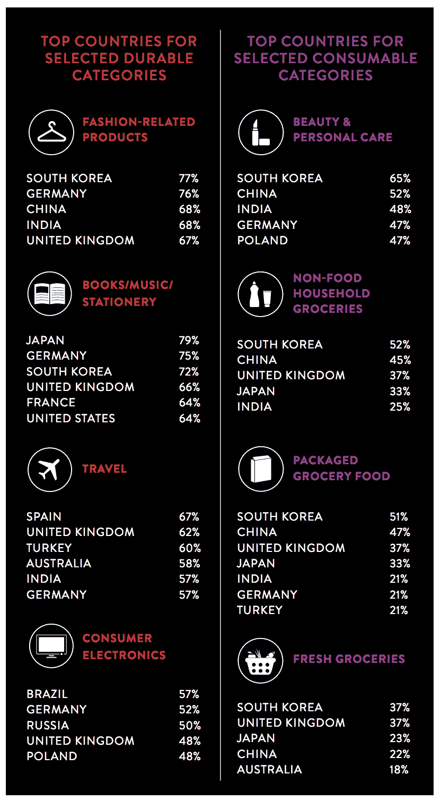

Lucrative industries by country (Image source: Nielsen)

然而，在书籍、文具和音乐购买方面，日本以 79%的比例领先。西班牙以 67%的比例位居旅游排行榜榜首，巴西以 57%的比例位居消费电子产品排行榜首位。

随着更多全球市场的发展，[美国在电子商务市场销售额中的份额](https://www.statista.com/statistics/243699/share-of-global-retail-e-commerce-sales-usa/)正在稳步下降。美国的全球份额从 2015 年的 20.2%下降到 2020 年的 16.9%。另一方面，东方市场的 [B2B 电子商务全球销售额](https://www.statista.com/statistics/705614/global-b2b-e-commerce-gmv-region/)有所上升。

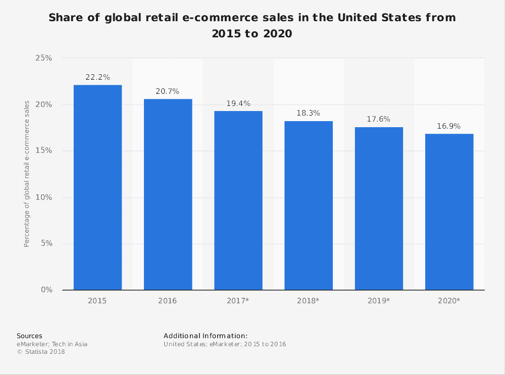

US share of ecommerce market sales (Image source: Statista)

电子商务市场也支持全球化，57%的网上购物者从海外零售商购买了[。这些购物者使用的](http://www.nielsen.com/us/en/insights/reports/2016/global-connected-commerce.html)[首选支付方式](https://www.shopify.com/enterprise/global-ecommerce-statistics)在世界各地各不相同。在全球范围内，信用卡是首选的支付方式，在 53%的交易中使用，其次是数字支付系统(43%)和借记卡(38%)。然而，[数字支付系统](https://kinsta.com/blog/stripe-vs-paypal/)是中国和西欧最受欢迎的支付方式，而货到付款则是东欧、非洲和中东的首选支付方式。

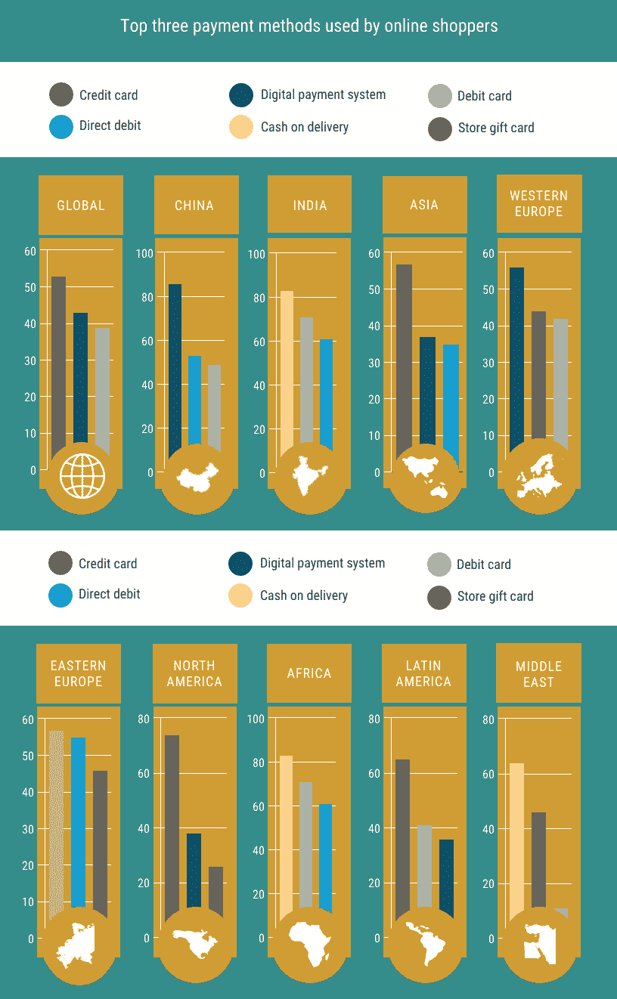

Payment methods used by online shoppers (Image source: Shopify)

除了支付方式，更多的美国人已经[喜欢网上购物](https://www.bigcommerce.com/blog/ecommerce-trends/)而不是在实体店购物，51%的人点击他们的方式购物。总共有 96%的美国人[一生中至少进行过一次网上购物](https://www.bigcommerce.com/blog/ecommerce-trends/)，其中 80%的人仅在上个月就这样做了。然而，美国人实际上有 64%的预算花在实体店，只有 36%花在网上。

2017 年，亚马逊占美国所有电子商务销售额的 44%，美国的年增长率为 23%，令人震惊的是，46%的美国企业仍然没有网站[。](https://www.bigcommerce.com/blog/ecommerce-trends/)

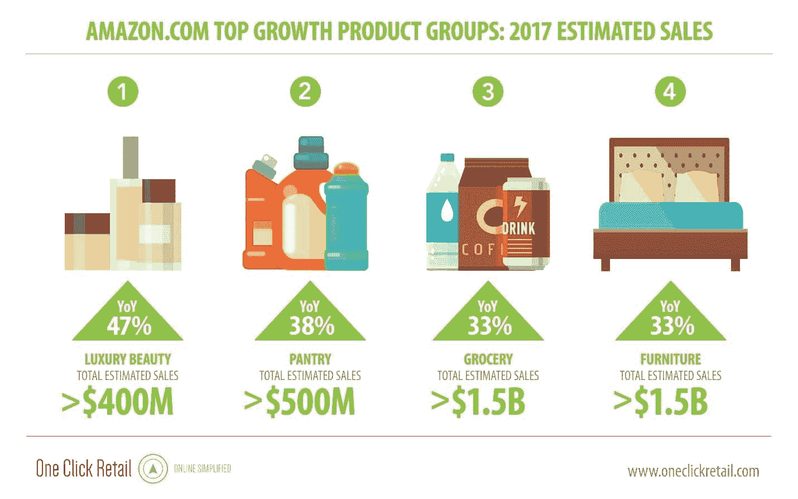

Amazon top growth products (Image source: CNBC)

## 企业对消费者电子商务

B2C 电子商务指的是企业和消费者在网上进行的交易。它也可以指直接为消费者服务的付费在线服务或内容。亚马逊是 B2C 选择广泛性的一个很好的例子，因为它开始是一个在线零售商，但最终扩展到服务，如云存储，和[付费内容](https://kinsta.com/blog/woocommerce-vs-easy-digital-downloads/)，如应用程序和媒体。

中国占据了最大的 B2C 电子商务市场。然而，如果你认为 B2C 电子商务市场很大，那就准备好接受 B2B 电子商务市场的交易量吧。

## 企业对企业电子商务

B2B 电子商务是指从一个企业到另一个企业在线营销、销售和分销产品。这包括软件即服务(SaaS)公司、[虚拟主机](https://hostingcanada.org/best-wordpress-host/)、批发商等等。也包括公司的买卖。

随着近一半的美国 B2B 企业[在网上提供他们的全部产品线](http://www.cms-connected.com/News-Archive/January-2018/eCommerce-2017-Stats-Explained-for-Online-Retailers)，2017 年 B2B 预计[产生 7.6 万亿美元](https://www.shopify.com/enterprise/b2b-ecommerce)就不足为奇了，使估计为 2.4 万亿美元的 B2C 市场相形见绌。

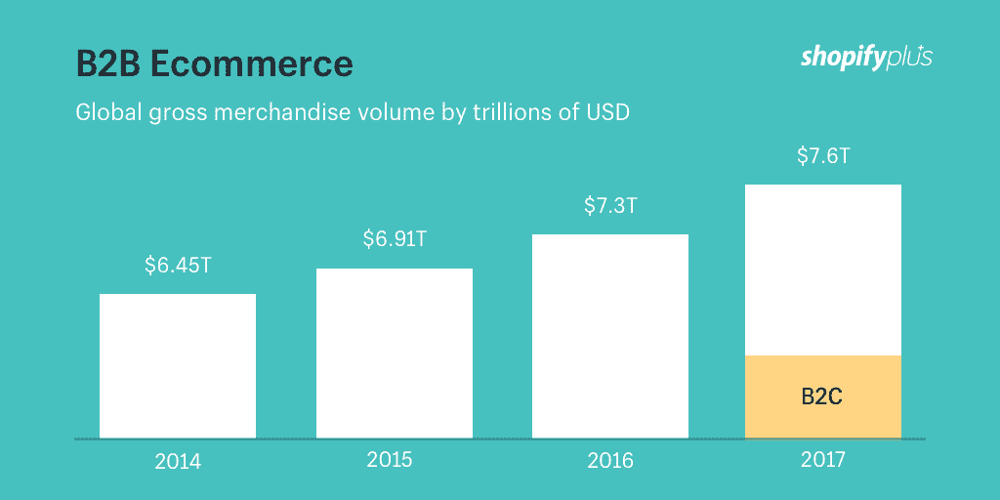

B2B ecommerce (Shopify)

Frost and Sullivan 进行的研究预测，到 2020 年，全球 B2B 电子商务销售额将达到 12 万亿美元，中国和美国将引领全球市场。一年前，到 2019 年，预计 B2B 公司将比在线零售商在[电子商务技术](http://10ecommercetrends.com/)上花费更多。

尽管 B2B 电子商务的增长很吸引人，但这种商业模式面临着无数挑战。价格经常波动，销售量很高，这意味着 B2B 业务需要灵活的运输和物流解决方案。此外，还有税收和监管方面的问题，尤其是在处理海外业务时。B2B 面临的另一个挑战，尤其是那些从事软件交易的，是确定产品如何与其他现有系统集成。

## 重要指标:转化率

转化率，即完成预期目标的网站访问者的百分比，是在线零售中最重要的指标之一。高转换率表明你能够从已经拥有的客户那里获得更多价值。这意味着更低的客户获取成本。同时，这也意味着当你付出更多的努力时，就会有更多的顾客和更高的收入。

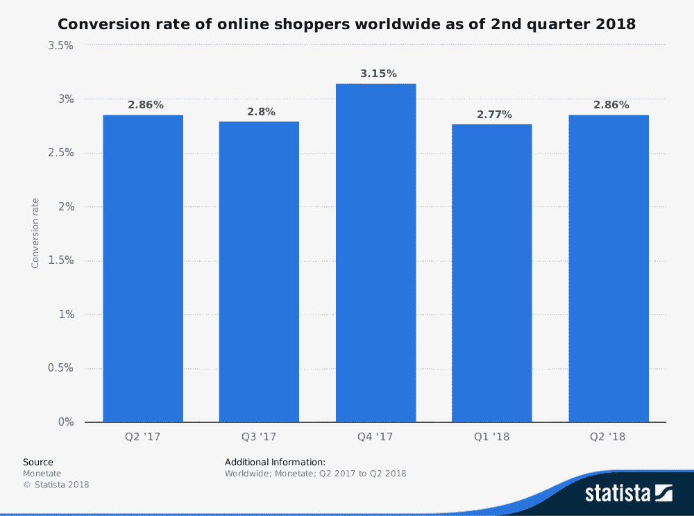

Conversion rate online shoppers (Image source: [Statista](https://www.statista.com/statistics/439576/online-shopper-conversion-rate-worldwide/))

平均电子商务转换率从 [3%到 4%](https://www.invespcro.com/blog/the-average-website-conversion-rate-by-industry/) 不等，其中 43%的电子商务流量来自[有机的谷歌搜索](https://www.wolfgangdigital.com/uploads/general/eComKPI2016-Public2.pdf)。这意味着在建立你的电子商务网站时，考虑到 [SEO](https://kinsta.com/blog/wordpress-seo/) 仍然是必不可少的。

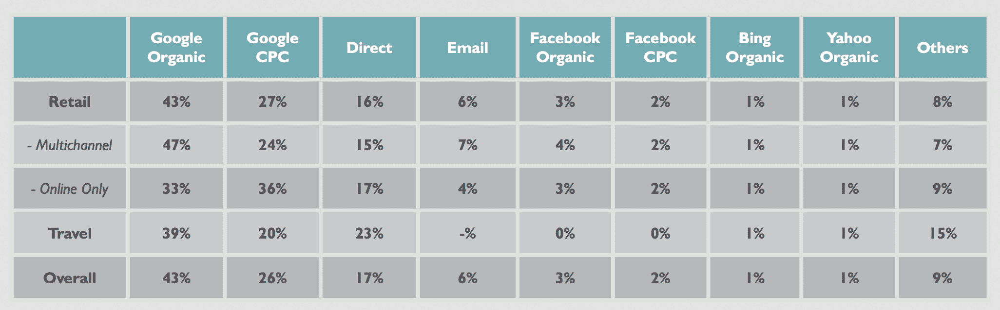

Average conversion rates (Image source: Wolfgang Digital)

几个因素在提高你的业务转换率中起着重要作用。其中最重要的是良好的用户体验。这归结为良好的视觉效果，快速的网站加载时间，以及支付方便；Paypal 交易的结账率比非 PayPal 交易高出 70%。

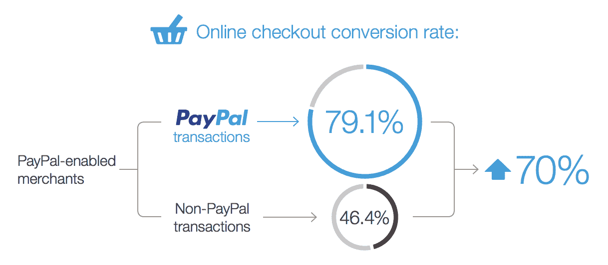

PayPal checkout rates (Image source: PayPal)

优质的客户服务，以及强有力的评论、推荐和证明也在提高你的业务转换率中发挥作用。

## 创造客户体验

客户体验涵盖了客户与您的企业之间关系的整个过程。这包括客户服务、用户体验(UX)、定价策略以及运输和物流。

在购物时，64%的顾客认为顾客体验比价格更重要。据《卫报》报道，到 2020 年，一个品牌提供的客户体验质量将比价格和产品更重要，成为一个关键的差异化因素。

### 客户服务

美国人平均对 15 个人说顾客服务差，对 11 个人说顾客服务好，这印证了一句老话，坏消息比好消息传播得快。对于不注重客户服务的企业来说，更令人担忧的是，33%的美国人表示，在处理了糟糕的客户服务后，他们会考虑换公司。

由于糟糕的客户服务，美国公司平均每年损失 620 亿美元。然而，对于客户服务薄弱的公司来说，并不是一切都失去了，因为人们发现，对于年收入 10 亿美元的公司来说，客户服务的适度增加可以在 3 年内平均产生[8 . 23 亿美元的增长](https://experiencematters.blog/category/temkin-group-research/business-impact/)。

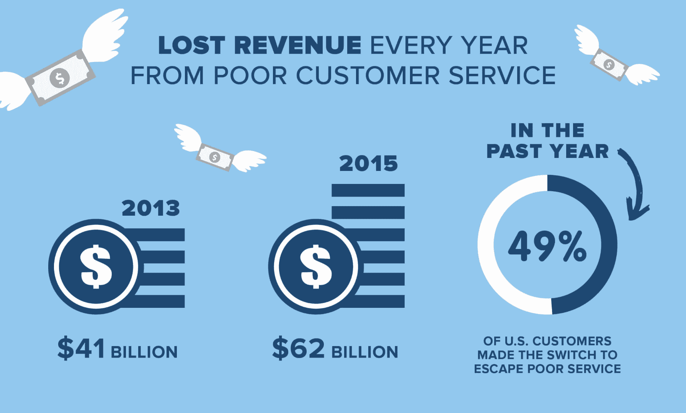

Lost revenue from poor customer service (NewVoiceMedia)

深入研究电子商务统计数据，优质客户服务的关键是尽可能让一切变得简单。事实证明，不方便的退货政策让 80%的购物者望而却步，而 74%的人如果觉得购买过程过于繁琐，可能会换品牌。

### 用户体验

UX 指的是一个人对使用你的系统、服务或产品的情绪和态度。你的网站的设计和加载速度在 UX 可以发挥巨大的作用。

总共有 57%的客户会[放弃你的网站](https://www.doubleclickbygoogle.com/articles/mobile-speed-matters/),如果他们必须等待 3 秒或更长时间才能加载一个页面的话。然而，更不利的是[的搜索能力](https://kinsta.com/blog/wordpress-search/)。一旦上了你的网站，60%的顾客会[离开你的网站](https://www.coveo.com/en/resources/ebooks/your-guide-to-delivering-intelligent-shopping-experiences)，如果他们找不到他们最初想要的东西。

## 评论、推荐和证明

如果用户知道如何使用某个产品，或者知道它对其他人有用，他们就更有可能购买该产品。这通常意味着企业需要提供产品描述之外的额外信息。

如果潜在客户能够提前观看解释产品或服务的视频，73%的潜在客户更有可能购买。

## 注册订阅时事通讯

### 想知道我们是怎么让流量增长超过 1000%的吗？

加入 20，000 多名获得我们每周时事通讯和内部消息的人的行列吧！

[Subscribe Now](#newsletter)

根据 [BigCommerce](https://www.bigcommerce.com/blog/ecommerce-trends/) 的数据，46%的消费者希望从电子商务网站获得产品比较，42%的顾客希望从电子商务网站获得更多推荐。同样，69%的在线购物者希望从电子商务网站获得更多评论。事实上，77%的顾客[在购买之前会阅读产品评论](https://www.business.com/articles/77-percent-of-people-read-online-reviews-before-buying-are-they-finding-you/)。

## 随着移动设备向前发展

在制定你的电子商务战略时，如果没有将移动设备考虑在内，可能会对你的业务不利。

根据 ReadyCloud 的数据，44%的互联网零售时间花在了智能手机上，11%花在了平板电脑上，45%花在了台式机上。这些数字似乎得到了 eMarketer 声称 59%的电子商务销售是通过手机完成的[的支持。](https://retail.emarketer.com/article/global-ecommerce-topped-23-trillion-2017-emarketer-estimates/5a6f89f5ebd40008bc791221)

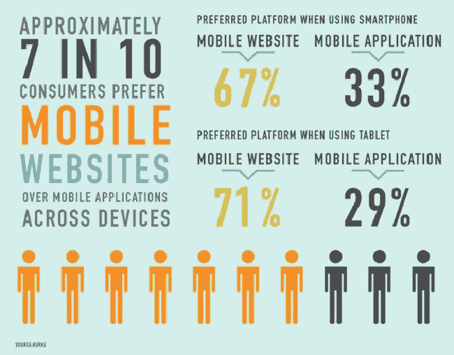

Mobile websites vs mobile apps (Image source: ReadyCloud)

由于各种原因，世界正在见证移动购物的增长。其中包括大多数人无论去哪里都带着他们的移动设备，从办公室到浴室。此外，通过应用程序实现的无缝购物体验使得在移动设备上购物变得更加容易，正如 Apple Pay 和 Google Wallet 等移动钱包解决方案的激增一样。

[网络星期一](https://kinsta.com/blog/how-kinsta-saved-cyber-monday-for-swagway/) 2017 年，移动支付在一天之内获得了[的第一笔 20 亿美元](https://www.businessinsider.com/cyber-monday-was-a-mobile-reckoning-for-retailers-2017-11)，占在线消费总额的三分之一。智能手机占当天零售访问量的 37.6%，收入的 21%。此外，研究发现，与前一年相比，手机上的转化率增加了 10%。

对于刚刚起步的创业者来说，移动尤其重要，因为人们发现，与大型零售商相比，小型零售商的移动转化率要高出 30%。

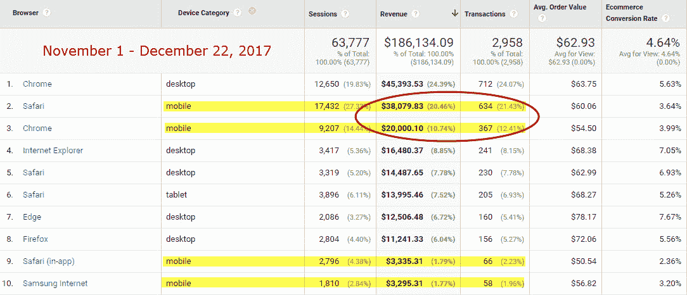

Mobile conversion rates (PracticalEcommerce)

### 让您的移动购物体验无缝衔接

让你的移动购物体验对用户来说尽可能简单是很重要的，因为 52%的人说当他们有糟糕的移动体验时，他们不太可能再次与某个品牌合作。

虽然转变这些顾客的船可能已经启航了，但是有很多方法可以改善你的移动购物体验。

第一步是有一个移动响应网站，这意味着它会自动改变以适应客户访问它的设备。接下来你需要做的是简化流程，这应该包括自动填写尽可能多的信息——只要能让顾客的生活更轻松，结账更快捷。

## 社交媒体和社交购物

当电子商务遇到社交媒体时，就会出现社交购物。它涉及社交网络的各个方面，如群组、社区、推荐和讨论，以及电子商务的核心功能——在线销售产品和服务。

你不要低估社交媒体对电子商务的重要性，因为 74%的消费者[依靠他们的社交网络](https://awario.com/blog/how-social-networks-influence-74-of-shoppers-for-their-purchasing-decisions-today/)做出购买决定。此外，56%在社交媒体上关注品牌的用户是为了查看产品。

在新兴市场，如东南亚，社交购物占所有在线销售的 30%。社交购物开始出现多种趋势。其中之一是通过 Groupon 和 LivingSocial 等网站的激增进行的团购。这些网站是建立在通过批量销售来获得群体折扣的理念上的。另一个主要趋势是电子商务与 T2 社交网络的整合。

已经出现了从“喜欢”按钮到“购买”按钮的转变，这些平台让用户更容易在平台上购物。你可以通过 Instagram 的可购物 Feed 和 Pinterest 的可购买 pin，以及 Instagram Stories 和 Snapchat 的“向上滑动”外部链接来看到这一点。

品牌发现人们不必去寻找他们的产品。产品只需要到达正确的人手中，这可以通过社交媒体进行非常有针对性的营销来实现。

没有哪个品牌是唯一一个通过社交媒体锁定目标人群的品牌。然而，如果你必须额外努力才能脱颖而出也没关系，因为成本是值得的:在社交媒体渠道上阅读产品评论的移动购物者的转化率高达 133% ，这代表着全球数十亿美元。

Struggling with downtime and WordPress problems? Kinsta is the hosting solution designed to save you time! [Check out our features](https://kinsta.com/features/)

## 购物车废弃

大约 70%的购物车被丢弃，这种情况发生在潜在客户选择要购买的产品或服务，但从未完成结账过程的时候。

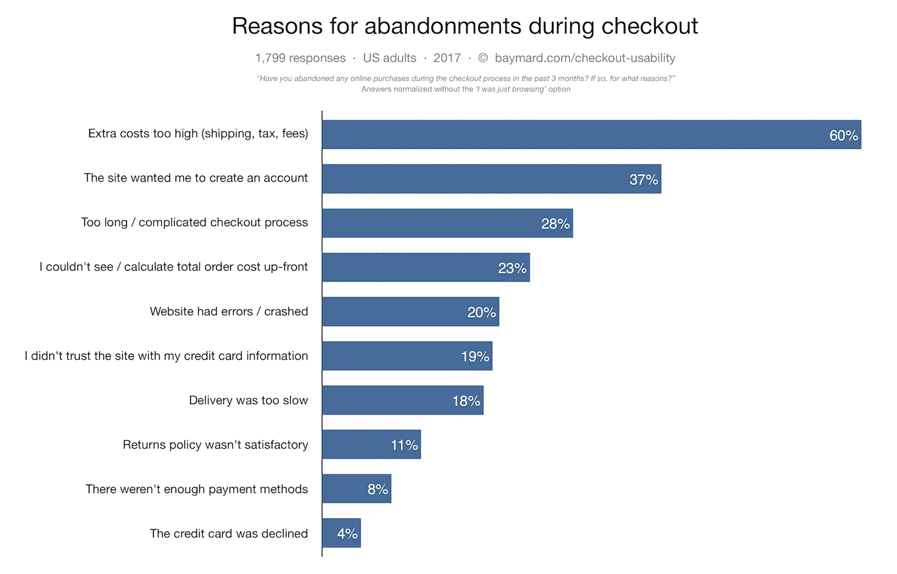

Shopping cart abandonment (Image source: Baymard)

在一家电子商务商店中，每三次成功购买，就有大约七次最终被扔进了废弃的购物车。这导致 T2 每年损失大约 180 亿美元的收入。

购物车废弃的问题只会越来越严重。2006 年，平均弃车率为 59.8%。到 2017 年，这一比率已上升至 69.23%。

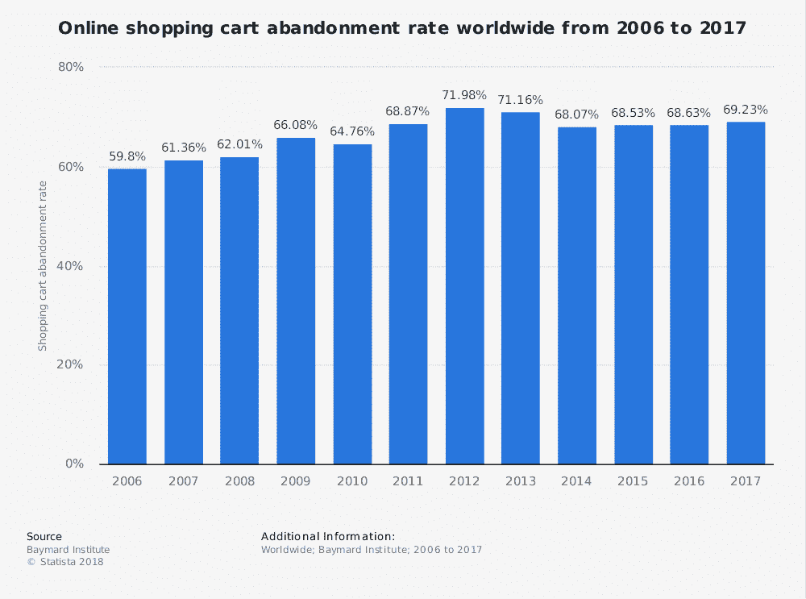

Online shopping cart rate abandonment (Image source: [Statista](https://www.statista.com/statistics/477804/online-shopping-cart-abandonment-rate-worldwide/))

超过 60%的放弃购物车的消费者是因为运输成本，而 57%的放弃购物车的人说他们是在“逛街”

企业降低这一问题发生率的方法之一是发送废弃购物车电子邮件。根据 Adobe 的数据，71%的移动购买受到零售商电子邮件的影响，而 T2 Salecycle 发现 28.3%的电子商务收入来自 T4 废弃的购物车电子邮件。

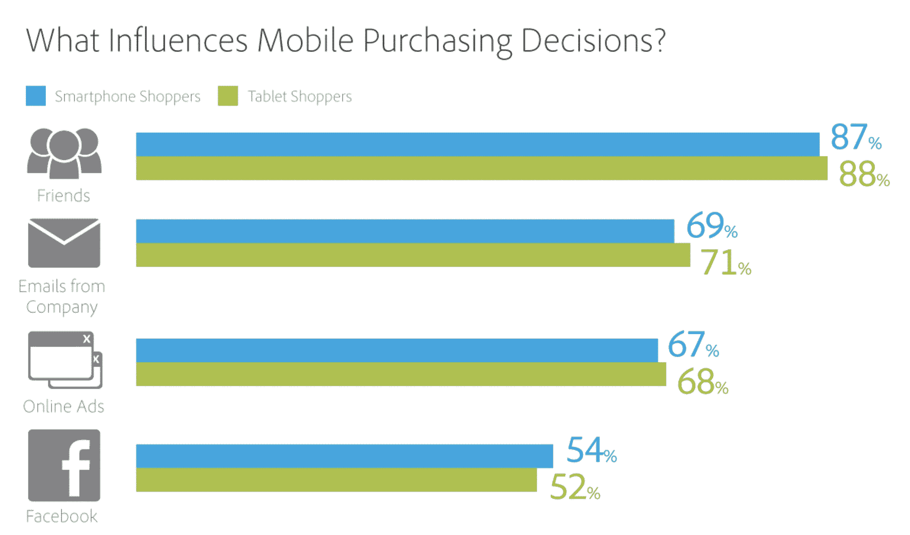

Mobile purchasing decisions (Image source: Adobe)

## 2018-2019 年电子商务趋势

电子商务的许多趋势在 2018 年占据了主导地位，并将在 2019 年继续保持下去。其中包括聊天机器人、语音助手、全渠道营销以及个性化和本地化。

以下是我们目前所知的一些最有趣的电子商务统计数据:

### 聊天机器人

超过 60%的客户表示，他们更喜欢使用[数字自助工具](https://about.americanexpress.com/all-news/news-details/2017/WellActually-Americans-Say-Customer-Service-is-Better-Than-Ever/default.aspx)，如[网站、应用程序或聊天机器人](https://www.mtdsalestraining.com/mtdblog/what-are-customer-service-skills.html)来回答他们的简单询问。对于购买力日益占主导地位的千禧一代来说，聊天是 T4 首选的支持渠道。

聊天机器人如此受欢迎的主要原因是，当客户打电话给公司时，与真人交谈往往需要太长时间。尽管如此，客户仍然会在挂断电话前平均等待 [11 分钟](https://www.newvoicemedia.com/blog/the-62-billion-customer-service-scared-away-infographic)。这几乎是 75%的在线用户预期时间的两倍；他们希望在 5 分钟内得到帮助。然而，聊天机器人要快得多，这意味着处理查询的速度明显更快，进入聊天会话的平均等待时间[为 45 秒。](https://www.comm100.com/livechat/resources/live-chat-benchmark-report-2017/)

专家预测，到 2020 年，80%的企业将使用聊天机器人。

你想了解更多关于聊天机器人的信息吗？看看我们的详细指南:[什么是聊天机器人](https://kinsta.com/blog/chatbot/)——你应该在你的[网站上添加一个吗？](https://kinsta.com/knowledgebase/what-is-wordpress/)

### 语音助手和语音搜索

语音搜索正在迅速增加，特别是随着语音助手——可以执行任务或服务的软件代理——的日益流行。已经有 20%的移动设备上的谷歌搜索是语音搜索。据预测，到 2020 年，语音搜索将占所有搜索的 50%。

另据估计，到 2020 年将有[2140 万个智能音箱](https://www.slideshare.net/ActivateInc/think-again-tech-media-outlook-2017-67604099)。这些设备为消费者创造了另一种网上购物的方式。已经有 22%的美国智能音箱拥有者[用他们的设备购买了东西](https://www.voicebot.ai/2018/02/09/voice-commerce-tried-22-percent-smart-speaker-owners/)。

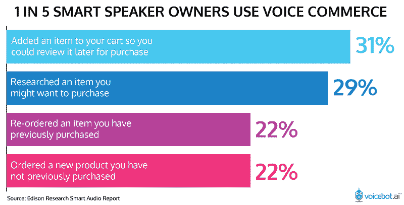

Voice Commerce (Image source: Voicebot.ai)

这些设备依靠语音助手让人们进行购物。事实证明，几乎 60%拥有虚拟助理的人都曾通过语音命令使用虚拟助理购物。语音商务销售额去年达到 18 亿美元，2022 年[有望达到 400 亿美元。](https://techcrunch.com/2018/03/02/voice-shopping-estimated-to-hit-40-billion-across-u-s-and-u-k-by-2022/)

据预测，到 2021 年，该技术的早期采用者已经重新设计了他们的网站，以支持语音搜索功能，他们的收入将增加 30%。

### 个性化和本地化

个性化是指根据搜索查询、浏览行为、购买历史和地理位置等数据，通过量身定制的推荐为每个客户创造个人体验的做法。

随着移动语音相关搜索的发展，个性化变得越来越重要，因为它们是基于本地搜索的三倍，例如“我附近的药店”。总体而言，22%的消费者表示，他们对目前获得的个性化水平感到[满意。](https://econsultancy.com/admin/blog_posts/new/Segment%E2%80%99s%202017%20State%20of%20Personalisation%20Report%20%E2%80%93%20which%20comes%20from%20a%20survey%20of%20over%201,000%20US%20consumers%20)

个性化的主要好处之一是它可以帮助企业增加 15%的利润。这部分是因为 75%的顾客最有可能从一个能认出他们的名字并根据以前的购买推荐产品的零售商那里购买。实施个性化后，93%的公司看到转换率的[上升](http://www.pure360.com/why-personalisation-is-important-what-7-statistics-tell-us/)。

尽管所有形式的个性化都很重要，但是本地化尤其重要。本地化是一种个性化，内容会根据客户的 [IP 地址](https://kinsta.com/tools/what-is-my-ip/what-is-my-ip/)进行专门更改。

常识咨询公司的一项研究发现，75%的人希望用他们的母语购买产品，92.2%的人更喜欢在以当地货币标价的网站上购物。

### 全渠道营销

全渠道营销开发了一种多渠道的销售方法，允许客户通过几乎所有可能开发的渠道进行购买。在这一点上，大多数品牌不仅仅是在他们的网站上销售；他们在各种电子商务平台、社交媒体和实体店销售。

根据 Square 和 Mercury Analytics 2017 年对美国企业主的调查，[品牌销售产品和服务的常见渠道](https://www.bigcommerce.com/blog/ecommerce-trends/)包括:

*   实体店(56%)
*   网站(34%)
*   弹出式商店、活动和市场(26%)
*   脸书(25%，但在社交媒体上的整体份额为 40%，包括 Twitter 和 Instagram 等平台)
*   亚马逊(16%)
*   其他(22%；包括易贝、阿里、Etsy)

对你的公司来说，瞄准多渠道购物者尤为重要，因为他们的花费是单一渠道购物者的三倍。

[Chatbots 🤖, voice/mobile 📱, and multichannel approach are the future of ecommerce marketing!Click to Tweet](https://twitter.com/intent/tweet?url=https%3A%2F%2Fkinsta.com%2Fblog%2Fecommerce-statistics%2F&via=kinsta&text=Chatbots+%F0%9F%A4%96%2C+voice%2Fmobile+%F0%9F%93%B1%2C+and+multichannel+approach+are+the+future+of+ecommerce+marketing%21&hashtags=ecommerce%2CB2B)

## 摘要

通过了解使用电子商务的人口统计数据，以及推动电子商务公司收入增长的趋势，有可能开始进入数万亿美元的市场。

电子商务的强劲增长意味着，即使你的实体企业现在能够忽略它，到 2021 年，如果你拒绝适应这个越来越依赖移动设备的世界中不断变化的购买行为，你将很难适应。

你没有看到你最喜欢的电子商务统计数据或事实吗？在下面的评论区和我们分享吧！

* * *

让你所有的[应用程序](https://kinsta.com/application-hosting/)、[数据库](https://kinsta.com/database-hosting/)和 [WordPress 网站](https://kinsta.com/wordpress-hosting/)在线并在一个屋檐下。我们功能丰富的高性能云平台包括:

*   在 MyKinsta 仪表盘中轻松设置和管理
*   24/7 专家支持
*   最好的谷歌云平台硬件和网络，由 Kubernetes 提供最大的可扩展性
*   面向速度和安全性的企业级 Cloudflare 集成
*   全球受众覆盖全球多达 35 个数据中心和 275 多个 pop

在第一个月使用托管的[应用程序或托管](https://kinsta.com/application-hosting/)的[数据库，您可以享受 20 美元的优惠，亲自测试一下。探索我们的](https://kinsta.com/database-hosting/)[计划](https://kinsta.com/plans/)或[与销售人员交谈](https://kinsta.com/contact-us/)以找到最适合您的方式。