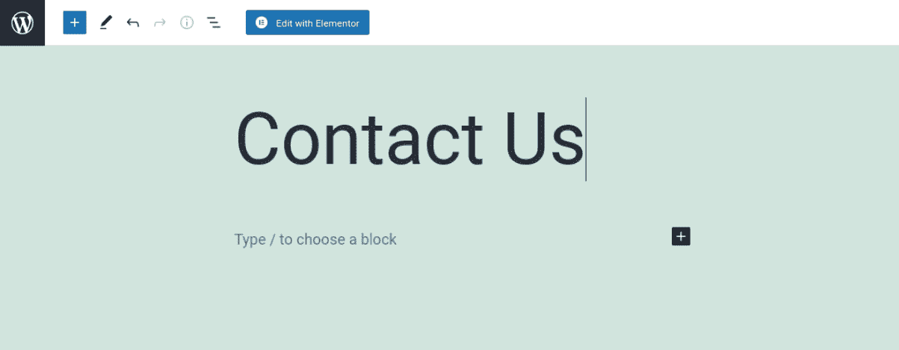
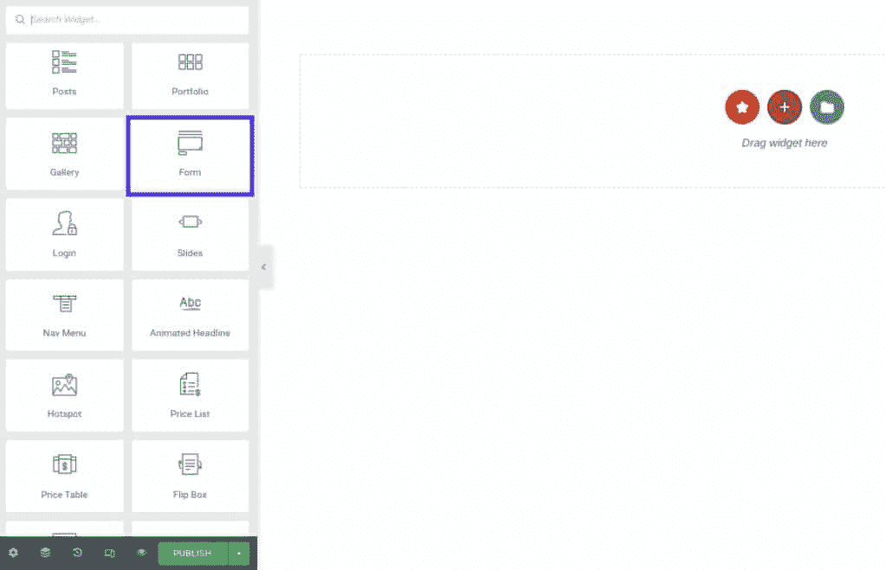
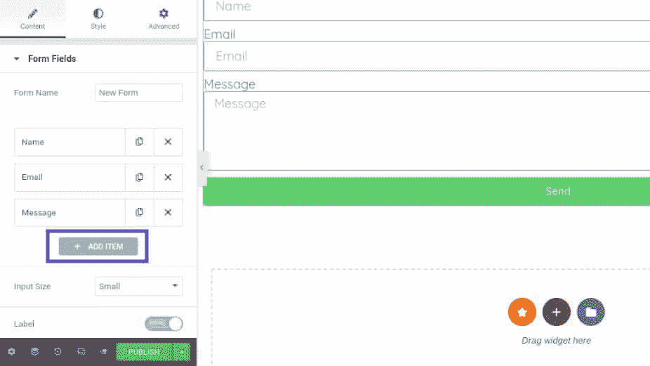
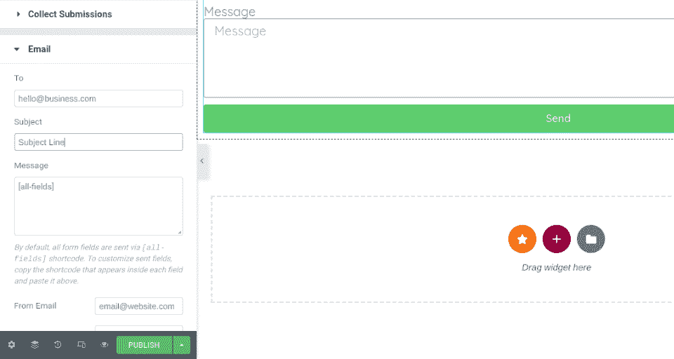
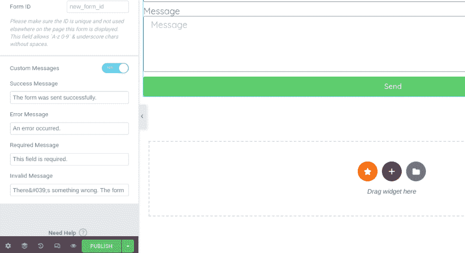
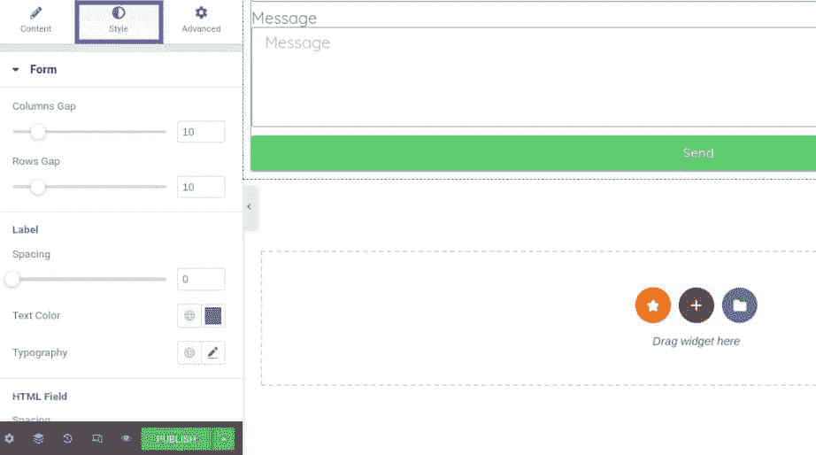
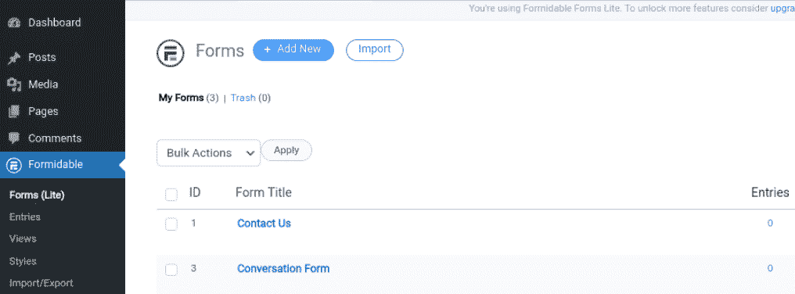
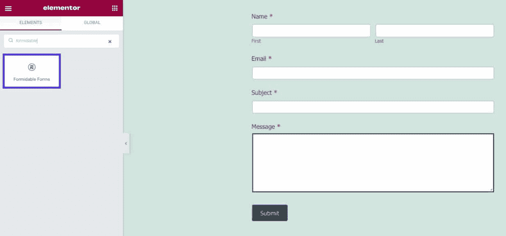

# 使用元素或表单的完整指南

> 原文：<https://kinsta.com/blog/elementor-forms/>

当你有一个商业网站时，表格是一个主要部分。它们让客户更容易与您联系，并提供重要的信息和反馈。然而，弄清楚如何创建它们可能具有挑战性。

如果你正在寻找一个简单直接的策略，我们推荐使用[元素或者](https://kinsta.com/blog/wordpress-elementor/)表单。这个[流行的页面生成器](https://kinsta.com/blog/divi-vs-elementor/)为构建各种既美观又易于使用的表单提供了解决方案。

在这篇文章中，我们将讨论为什么你可能想要创建元素或表单。然后，我们将带您完成这个过程，并介绍一些有用的插件和故障排除技巧。让我们跳进来吧！

### 查看我们的[元素或表单](https://www.youtube.com/watch?v=dZN3JZd6YFA)视频指南

## 为什么要创建元素或表单

为你的 WordPress 站点创建表单有很多好处。首先，你可以为你的访问者提供一个快速简单的与你交流的方法。此外，您还可以利用它们从您的受众那里获得线索和重要信息。

表单也是注册用户和接受付款的有用工具。然而，如果你想给你的 WordPress 站点添加一个表单，你需要使用插件。或者，您可以使用像 Elementor 这样的页面生成器。

> 需要在这里大声喊出来。Kinsta 太神奇了，我用它做我的个人网站。支持是迅速和杰出的，他们的服务器是 WordPress 最快的。
> 
> <footer class="wp-block-kinsta-client-quote__footer">
> 
> 
> 
> <cite class="wp-block-kinsta-client-quote__cite">Phillip Stemann</cite></footer>

[View plans](https://kinsta.com/plans/)

Elementor 让你不用接触一行代码就能构建出令人惊叹的表单[。您可以使用拖放编辑器来创建与您的品牌和网站美学相匹配的响应表单。](https://kinsta.com/blog/wordpress-page-builders/)

您还可以从[中选择多种类型的表格](https://kinsta.com/blog/embed-google-form/)，包括:

*   **Elementor Contact Forms** :您可以使用该功能构建一个简单的表单，以便用户与您联系。
*   elements or Gravity Forms:这个 [Gravity Forms](https://www.gravityforms.com/) 小部件让你在定制和设计表单时更加灵活。
*   **Elementor** **注册表单**:该功能让您在自己的网站上设置用户[注册表单](https://kinsta.com/blog/wordpress-registration-form/)。

正如您所看到的，每种表单都有自己特定的用例，可以帮助增强站点的功能。接下来，我们将向您展示如何使用 Elementor 构建联系人表单。

[想使用 Elementor 表单与您的客户联系吗？✅:这本指南是给你的🤝 点击推文](https://twitter.com/intent/tweet?url=https%3A%2F%2Fkinsta.com%2Fblog%2Felementor-forms%2F&via=kinsta&text=Want+to+use+Elementor+forms+to+connect+with+your+customers%3F+%E2%9C%85+This+guide+is+for+you+%F0%9F%A4%9D&hashtags=Elementor%2CSmallBiz)

## 如何在 WordPress 中创建一个元素或联系人表单(6 个步骤)

既然我们已经更好地理解了为什么要使用 Elementor forms，那么让我们看看如何通过几个简单的步骤来创建一个。请注意，对于本教程，我们将假设您已经在您的网站上安装并激活了 Elementor。

有[免费工具](https://wordpress.org/plugins/elementor/)和[付费插件](https://elementor.com/)。要使用表单功能，您需要 premium 版本。

### 步骤 1:添加 Elementor Contact 小部件

若要开始，请导航到要插入联系人表单的页面或帖子。然后，点击屏幕顶部的**用元素编辑或**按钮:

Click on the “Edit with Elementor” link.

这将启动 Elementor 编辑器界面。从左侧的小部件中，搜索并选择**表单**小部件:

Drag and drop the “Form” widget.

然后，您可以将小部件拖放到您的页面上。这将插入一个标准的联系表单。

### 步骤 2:设置联系人表单字段

一旦你把你的联系方式放在页面上，有一些设置供你配置。现在，让我们把重点放在设置表单字段上。

您可以通过单击小部件并定制文本来编辑基本表单字段(如果您想要更改任何默认选项)。如果您想添加额外的字段，您可以通过选择**添加项目**来完成:

Customize the form by adding an item.

您可以从下拉列表中选择要添加的字段类型。接下来，您可以添加一个标签，即表单域的名称。这向你的访问者展示了什么是期望的输入。

对于**占位符**选项，您可以定制在用户输入信息之前出现在表单域中的文本。你可以用这个给访问者提供你想要他们提供的数据的例子。

此外，您可以选择启用**必需的**设置并修改列宽。你也可以点击**按钮**面板来定制你的表单按钮的外观。您可以更改大小以及字体和颜色。

### 步骤 3:配置表单提交

创建完表单域后，下一步是配置表单提交设置。您可以在 Elementor 编辑器中导航到 **Email** 来访问各种选项。

例如，您可以在**到**字段中输入您希望提交的电子邮件地址。如果愿意，您可以输入多个电子邮件地址:

Configure your form submissions.

您还可以自定义电子邮件和消息的主题。当您完成所有选项的配置后，请确保保存您的更改。

### 第 4 步:定制您的联系人表单信息

如果您想进一步个性化您的联系人表单，您可以通过启用自定义消息来实现。选择**附加选项**，然后将**自定义信息的拨动开关**移动到**是**:

Customize the contact form messaging.

您可以修改四种类型的消息:

*   **成功消息**:用户提交表单时出现
*   **错误消息**:如果在提交过程中出现问题，就会出现这种情况
*   **必需消息**:通知用户某个特定字段没有完成
*   **无效消息**:让用户知道表单提交有问题

您可以定制这些信息，以符合您品牌的声音和风格。例如，你可以修改措辞来增加一点个性。

## 注册订阅时事通讯

### 想知道我们是怎么让流量增长超过 1000%的吗？

加入 20，000 多名获得我们每周时事通讯和内部消息的人的行列吧！

[Subscribe Now](#newsletter)

### 步骤 5:设计元素或联系人表单的样式

一旦你有了表单的基本文本和字段，你就可以开始[设计你的 Elementor 或 contact 表单的样式了。例如，您可能希望确保它与您的品牌相匹配。](https://kinsta.com/blog/wordpress-forms/)

首先，您可以点击小部件编辑器顶部的**样式**选项卡:

Style and design the form.

在这里，您可以找到各种各样的选项和设置，用于自定义联系人表单的设计。例如，您可以调整间距和填充，以及更改颜色、大小、标签和按钮。

### 步骤 6:保存并发布表单

当您对 Elementor contact 表单的外观和内容感到满意时，剩下唯一要做的事情就是保存并发布它。您可以通过选择屏幕左下方的**发布**按钮来完成。

就是这样！然后，您可以在前端预览您的联系人表单，以确认它看起来像您想要的那样。

## 元素或表单的顶部附件

开箱即用，Elementor 页面生成器提供了大量选项来为你的 WordPress 网站构建表单。但是，您也可以考虑添加插件来帮助扩展表单的功能。让我们来看看一些选项。

### 元素的主插件

Master Addons for Elementor.

Elementor plugin 的 [Master Addons 是一个免费增值工具，它提供了一系列有用的工具来增强页面生成器，进而增强您的网站。它包括以下功能:](https://wordpress.org/plugins/master-addons/)

Struggling with downtime and WordPress problems? Kinsta is the hosting solution designed to save you time! [Check out our features](https://kinsta.com/features/)

*   页眉、页脚和注释表单生成器
*   [巨型菜单](https://kinsta.com/blog/wordpress-menu-plugins/)生成器
*   图像悬停效果
*   显示条件

它还兼容各种各样的表单插件。这包括接触形态 7，忍者形态，WP 形态，火山口形态。要访问该插件的所有功能，你需要购买 [pro 版本](https://master-addons.com/pricing/)，每年 39 美元。

### 加号插件

The Plus Addons.

Elementor 的另一个便利工具是[加插件](https://wordpress.org/plugins/the-plus-addons-for-elementor-page-builder/)。这个插件包含超过 8000 个定制选项和超过 300 个用户界面(UI)块，可以帮助您轻松创建和设计您的页面和表单。

其特点包括:

*   图标框
*   地图部分
*   形式
*   定价表

还有超过 18 个模板可供选择。这些是专门为某些类型的企业设计的，包括代理机构、餐馆、沙龙等等。

有一个免费版本。然而，为了利用整套有用的功能，我们建议购买一个[高级许可](https://theplusaddons.com/pricing/)，每年 39 美元。

## 创建元素或表单的其他提示和技巧

如果你想为你的 WordPress 站点创建元素或联系表单，而不需要支付额外费用，有很多方法可以实现。这样做需要你将页面生成器与另一个 WordPress 表单插件配对，比如 [WPForms](https://wordpress.org/plugins/wpforms-lite/) 或者[强大的表单](https://wordpress.org/plugins/formidable/)。

假设你选择了令人敬畏的形式。一旦你在你的网站上安装并激活了插件，你就可以导航到**强大的** > **表单** > **添加新的**:

Formidable Forms.

接下来，您可以从选项列表中选择**联系人表单**，并从一些预制的模板中进行选择。构建完表单后，浏览到要放置表单的页面，启动 Elementor 编辑器界面。

从左侧面板中，搜索并选择**强大的表单**小部件。您可以调整格式、颜色、按钮、文本等。：

Formidable Forms widget in Elementor.

完成后，您可以保存并发布您的更改。这种方法比 Elementor Pro 插件需要更多的时间和精力。然而，如果你不想购买保费计划，它可以帮助你节省一些钱。

## 元素或表单故障排除

元素或接触形式非常简单易用。但是，在使用它时，您可能会遇到问题。人们报告的最常见的问题之一是未送达的电子邮件。

Elementor 使用 wp_mail 函数来分发它的电子邮件。这意味着您的[主机服务提供商](https://kinsta.com/blog/keep-email-and-hosting-separate/)接收并发送发送的电子邮件。

但是，一些主机禁用了通常用于发送电子邮件的 PHP 功能，这就是为什么会出现此问题。要解决这个错误，我们建议联系您的主机提供商，让他们启用 send_mail 功能。

或者，您可以使用简单邮件传输协议(SMTP)服务器。这是一个[电子邮件服务器](https://kinsta.com/blog/secure-email-providers/)，它会使用外部资源(如 Gmail)将您的电子邮件以表格形式发送到您客户的收件箱。这可以减少你的邮件出现在垃圾邮件文件夹中的几率。要设置 SMTP，可以使用 [WP 邮件 SMTP](https://wordpress.org/plugins/wp-mail-smtp/) 之类的插件。

[Learn why you might want to create Elementor forms (and helpful addons to level them up!) in this guide ⬇️Click to Tweet](https://twitter.com/intent/tweet?url=https%3A%2F%2Fkinsta.com%2Fblog%2Felementor-forms%2F&via=kinsta&text=Learn+why+you+might+want+to+create+Elementor+forms+%28and+helpful+addons+to+level+them+up%21%29+in+this+guide+%E2%AC%87%EF%B8%8F&hashtags=Elementor%2CSmallBiz) ## 摘要

表单在网站中起着举足轻重的作用。它们使客户能够与您联系，注册帐户，提交支付信息，等等。然而，弄清楚如何为你的网站设计美观的表单是一个挑战。幸运的是，Elementor 让这变得很容易。

将 Elementor 表单小部件添加到页面后，就可以设置字段并配置表单设置。您还可以自定义表单的设计，以便与您的品牌保持一致。

关于在 WordPress 中创建元素或表单，你有什么问题吗？请在下面的评论区告诉我们！

* * *

让你所有的[应用程序](https://kinsta.com/application-hosting/)、[数据库](https://kinsta.com/database-hosting/)和 [WordPress 网站](https://kinsta.com/wordpress-hosting/)在线并在一个屋檐下。我们功能丰富的高性能云平台包括:

*   在 MyKinsta 仪表盘中轻松设置和管理
*   24/7 专家支持
*   最好的谷歌云平台硬件和网络，由 Kubernetes 提供最大的可扩展性
*   面向速度和安全性的企业级 Cloudflare 集成
*   全球受众覆盖全球多达 35 个数据中心和 275 多个 pop

在第一个月使用托管的[应用程序或托管](https://kinsta.com/application-hosting/)的[数据库，您可以享受 20 美元的优惠，亲自测试一下。探索我们的](https://kinsta.com/database-hosting/)[计划](https://kinsta.com/plans/)或[与销售人员交谈](https://kinsta.com/contact-us/)以找到最适合您的方式。