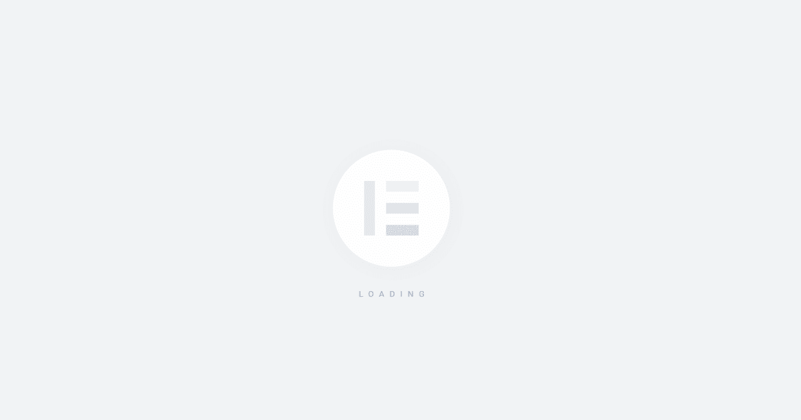
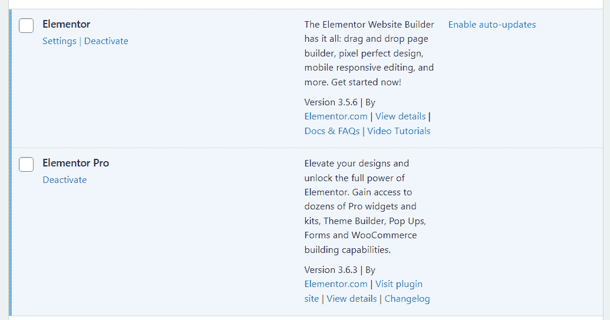
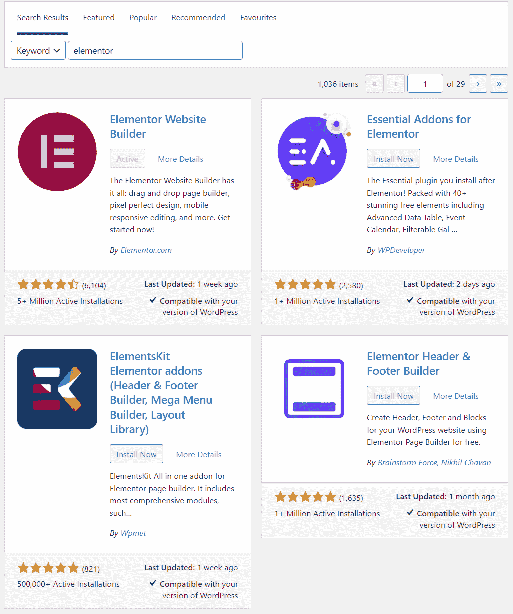
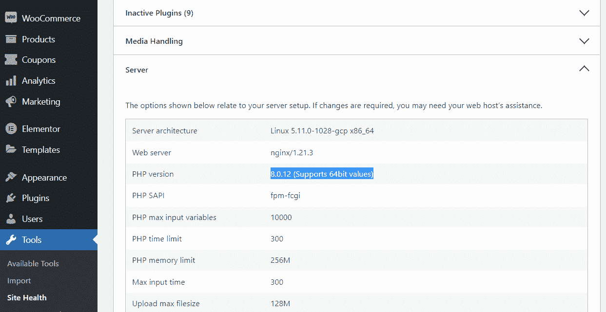
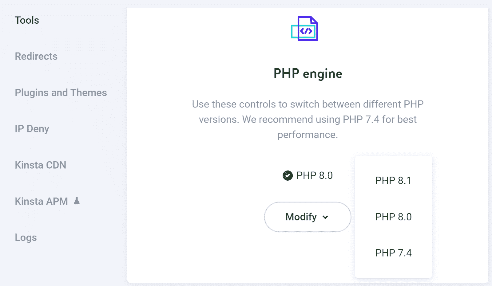
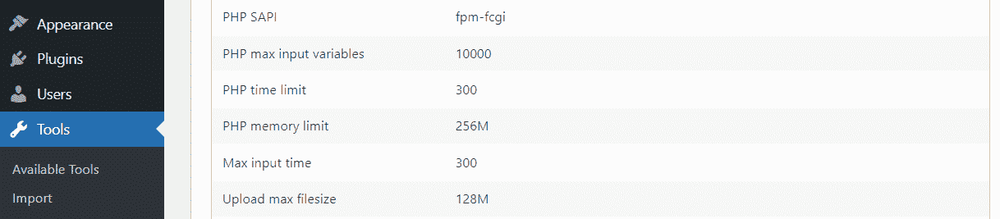
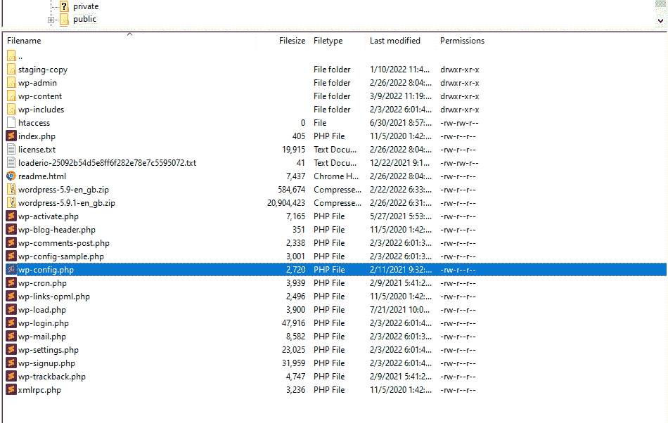
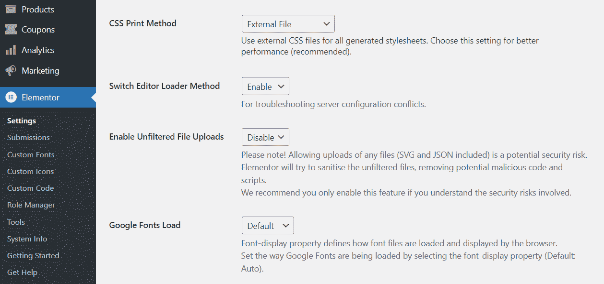

# 如何修复元素或不加载错误

> 原文：<https://kinsta.com/blog/elementor-not-loading/>

使用[元素或](https://wordpress.org/plugins/elementor/)，您可以用一个更直观的页面生成器来替换[块编辑器](https://kinsta.com/blog/gutenberg-wordpress-editor/)。如果您是 Elementor 用户，每次想要创建或编辑页面时，您都需要加载编辑器。但是，有时错误可能会阻止 Elementor 加载。

幸运的是，这个问题有几种解决方案。如果您了解导致错误的原因，您应该能够立即排除故障。

在这篇文章中，我们将讨论是什么导致了 Elementor 无法加载的问题，并看看插件的需求。然后，我们将向您介绍几种排除此错误的方法。我们开始吧！

## 为什么元素 or 没有加载？

在我们详细了解什么会导致 Elementor 出现问题之前，讨论一下“未加载”错误意味着什么是很重要的。启动 Elementor 编辑器时会出现此错误。

通常，加载编辑器只需要一点时间:

Elementor page builder loading

但是，如果编辑器卡在加载屏幕上，您可能遇到了错误。请注意，这与编辑器无法完全加载或获得一个 [HTTP 代码](https://kinsta.com/blog/http-status-codes/)是不同的。在这种情况下，你的网站应该可以很好的工作，除了元素或者无法加载。

> 需要在这里大声喊出来。Kinsta 太神奇了，我用它做我的个人网站。支持是迅速和杰出的，他们的服务器是 WordPress 最快的。
> 
> <footer class="wp-block-kinsta-client-quote__footer">
> 
> 
> 
> <cite class="wp-block-kinsta-client-quote__cite">Phillip Stemann</cite></footer>

[View plans](https://kinsta.com/plans/)

通常，Elementor 可能会因为您的服务器不符合插件的要求而无法加载。你也可能使用了导致 Elementor 兼容性问题的插件。在接下来的几个小节中，我们将概述 Elementor 的需求，并向您展示如何排除不加载错误。

[Seeing this frustrating error? 😅 The solution is a cick away 😌Click to Tweet](https://twitter.com/intent/tweet?url=https%3A%2F%2Fkinsta.com%2Fblog%2Felementor-not-loading%2F&via=kinsta&text=Seeing+this+frustrating+error%3F+%F0%9F%98%85+The+solution+is+a+cick+away+%F0%9F%98%8C&hashtags=Elementor%2CBlockEditor)

## 有哪些要素或要求？

每个插件都有自己的系统需求。大多数插件开发者不会公布这些信息，因为他们假设每台服务器都能满足他们的最低要求。通常情况下，都是这样。

一些插件如[页面生成器](https://kinsta.com/blog/wordpress-page-builders/)和安全工具往往有特定的系统需求。在 Elementor 的情况下，这些是最低要求(不包括[存储空间](https://kinsta.com/blog/disk-space-wordpress-hosting/)):

*   WordPress 5.2 或更新的版本
*   PHP 7 或更新的版本
*   MySQL 5.6 或更高版本
*   至少 128 MB 的 WordPress 内存限制

在大多数情况下，即使你的服务器不符合它的要求，你也可以安装一个插件。然而，这可能导致插件无法正常工作，在 Elementor 的情况下，无法加载编辑器。

## 如何修复元件或不加载(5 种方法)

如果 Elementor 卡在了加载屏幕上，你要做的第一件事就是重新加载页面。尝试再次访问 Elementor 编辑器，并查看错误是否仍然存在。如果是，就该进行一些故障排除了。

### 1.更新元素或

Elementor 加载失败的原因可能是您使用的插件版本已经过时了。过时的插件会导致与其他工具或最新版本的 WordPress 的冲突。

要检查你的 Elementor 是否是最新的，进入**插件>已安装插件**并寻找构建器。如果你有高级许可，你应该在你的插件列表中看到 **Elementor** 和 **Elementor Pro** :

Update Elementor

如果您看到有关 Elementor 新版本的通知，您将需要运行必要的更新。然后，再次尝试访问编辑器。

### 2.检查插件冲突(并测试元素或附加组件)

插件之间引起冲突并不罕见。当您有多个提供重叠功能或冲突代码的插件时，这种情况经常发生。

诊断插件冲突可能是一个挑战。你最好的办法是一个一个地测试插件，看看是否有插件导致 Elementor 无法加载。理想情况下，你将使用一个升级网站作为[来做这件事](https://kinsta.com/knowledgebase/disable-wordpress-plugins/)[，禁用关键插件](https://kinsta.com/help/staging-environment/)将会影响你网站的功能。

要开始，请进入**插件>已安装插件**。然后，你会想要在活动插件列表中一个接一个地禁用它们。禁用每个插件后，尝试重新加载 Elementor 编辑器，看看它是否正常工作。

你还需要特别注意元素或附加插件。这些附加组件扩展了页面生成器的功能和微件库:

Pay attention to Elementor add ons

如果在加载 Elementor 编辑器时禁用一个特定的插件或附加组件没有影响，你可以继续并重新激活它。目标是一个接一个地测试插件，看看是否有插件导致了兼容性问题。

另一种方法是一次禁用所有插件(除了 Elementor ),看看编辑器是否工作。然而，我们建议不要使用这种方法，除非你使用的是分期网站。大多数 WordPress 网站依赖插件来实现关键功能，所以一下子禁用它们会影响用户体验。

### 3.检查你的网站的 PHP 版本

我们之前提到过，Elementor 只支持 [PHP 7 和更新版本](https://kinsta.com/blog/php-benchmarks/)。你可以从 WordPress admin 查看你当前的 PHP 版本。

进入**工具>站点健康**并选择**信息**选项卡。在这里，你可以找到一些关于你的网站的技术信息。如果你打开**服务器**标签，你将能够检查你的服务器使用的 PHP 版本:

Double-check that the PHP version is appropriate

理想情况下，你会看到 PHP 7 或 8。然而，你也许可以通过你的主机控制面板[更新你的 PHP 版本](https://kinsta.com/knowledgebase/how-to-update-php-in-wordpress/)，这取决于你的提供商。

如果您使用 Kinsta，MyKinsta 仪表板使您能够为您的每个站点选择 PHP 的版本。打开仪表板并导航至**站点**，然后选择您想要更新的网站。

## 注册订阅时事通讯

### 想知道我们是怎么让流量增长超过 1000%的吗？

加入 20，000 多名获得我们每周时事通讯和内部消息的人的行列吧！

[Subscribe Now](#newsletter)

接下来，转到**工具**标签，向下滚动直到你看到 **PHP 引擎**选项。您可以使用**修改**下拉菜单来选择该站点使用的 PHP 版本:

Updating PHP using the MyKinsta platform

有了 Kinsta，您可以从 PHP 的最新版本中进行选择。这些提供了更好的性能和功能。

如果你的主机提供商不允许你直接切换 PHP 版本，我们建议联系支持团队。如果需要，他们应该能够帮助您更新它。如果您的 web 主机不支持 PHP 的新版本，可能是时候迁移到另一个提供商了。

### 4.检查你网站的内存限制

你的网站的 PHP 内存限制决定了整个 WordPress 安装可以使用多少内存。低内存限制会阻止很多插件正常工作。

正如我们之前提到的，Elementor 对内存的最低系统要求是 128 MB。如果你不确定你的站点的内存限制是多少，你可以通过进入**工具>站点健康**并选择**信息**标签来检查。然后，打开**服务器**选项卡，查看 **PHP 内存限制**条目:

Check your PHP memory limit

大多数现代 web 主机将提供 128-256 MB 作为 PHP 内存限制基线。如果你使用的是一个[应用程序](https://kinsta.com/application-hosting/)、[数据库](https://kinsta.com/database-hosting/)和[管理的 WordPress 主机](https://kinsta.com/wordpress-hosting/)，比如 Kinsta，这个数字可能是 256 MB。

如果您正在处理一个较小的数字，您可以尝试手动增加 PHP 内存限制。最简单的方法是通过 FTP。

首先通过 FTP 或 SFTP 连接到你的网站，找到 WordPress **root** 文件夹。这就是俗称的 **www，public，**或者 **public_html** 。

找到文件夹后，打开它，寻找**wp-config.php**文件:

FInd the wp-config file

用文本编辑器打开**wp-config.php**文件，寻找这样一行:

Struggling with downtime and WordPress problems? Kinsta is the hosting solution designed to save you time! [Check out our features](https://kinsta.com/features/)

*define( 'WP_MEMORY_LIMIT '，' 256m ')；*

根据服务器的内存限制，这个数字可能会更低。如果找不到那一行，可以手动添加。但是，请确保不要编辑**wp-config.php**文件中的任何其他条目。您还需要将这段代码添加到如下代码行之前:

*/*就这些，别再编了！博客快乐。*/*

从技术上讲，您可以接受小于 256 MB 的内存限制，但是您也可以尝试设置一个更高的内存限制。然而，根据我们的经验，256 MB 是 PHP 内存的最佳选择。

完成后，保存更改并关闭文件。现在，再次检查**站点健康**页面，看看 WordPress 是否识别 PHP 内存限制的变化。

在某些情况下，您的 web 主机可能不允许您手动更改 PHP 内存限制。这意味着你需要联系支持团队，看看他们是否能为你做这件事。

### 5.Switch Elementor 的 Loader 方法

Elementor 包含一个内置特性，可以让你改变插件加载编辑器的方式。更改 Elementor loader 方法不会对您产生任何影响，但是如果没有其他故障排除方法起作用，我们建议将其作为最后的手段。

要更改元素或加载方法，请转到**元素或>设置>高级**。然后，找到**开关编辑器加载器方法**设置，选择**启用:**

Change Elementor loading methods

保存您的更改，并尝试再次加载编辑器。元素或未加载错误现在应该消失了。

## 其他元素或故障排除方法

如果您在使用 Elementor 时遇到任何技术问题，并且不确定如何继续，您可以使用一些其他的故障诊断方法。让我们来看看它们。

### 切换主题

大多数受欢迎的 WordPress 主题都用主要的页面生成器插件测试过。然而，我们建议您浏览每个主题的描述，以确保它提到了与 Elementor 的兼容性。

如果你当前的主题不是 Elementor 友好的，[更新主题](https://kinsta.com/blog/how-to-update-wordpress-theme/)可能会解决你的页面生成器问题。无论如何，[切换主题](https://kinsta.com/blog/change-wordpress-theme/)只需要一分钟，所以如果你在使用 Elementor 时遇到问题，值得一试。

### 禁用浏览器加载项

在某些情况下，浏览器加载项可能会导致逐页错误。例如，您可以使用阻止脚本的加载项，或者向特定网站添加自定义代码的扩展。

当尝试使用 Elementor 时，其中一些加载项可能会导致问题。检查是否如此的一个快速方法是尝试使用 Elementor 进行干净的浏览器安装。

如果错误消失，您需要缩小导致问题的浏览器扩展的范围。这意味着一个接一个地禁用扩展，直到您确定了罪魁祸首。

[Learn what causes the Elementor not loading issue and look at the plugin’s requirements, then find out how to fix it, all in this guide 🚀Click to Tweet](https://twitter.com/intent/tweet?url=https%3A%2F%2Fkinsta.com%2Fblog%2Felementor-not-loading%2F&via=kinsta&text=Learn+what+causes+the+Elementor+not+loading+issue+and+look+at+the+plugin%E2%80%99s+requirements%2C+then+find+out+how+to+fix+it%2C+all+in+this+guide+%F0%9F%9A%80&hashtags=Elementor%2CBlockEditor) ## 摘要

如果你依赖于[elements 或](https://kinsta.com/partners/elementor/)来构建和更新你的网站，让编辑器无法加载会给你的计划带来很大的麻烦。编辑器可能加载失败有几个原因，但通常与系统要求或插件兼容性问题有关。

以下是如何逐步排除元素或未加载错误的方法:

1.  更新元素或。
2.  检查插件冲突(并测试元素或附加组件)。
3.  检查你的网站的 PHP 版本。
4.  检查你的网站的内存限制。
5.  Switch Elementor 的 loader 方法。

在 Kinsta，我们的计划旨在帮助您使用 Elementor 这样的页面生成器来构建您梦想中的网站。查看[我们的计划](https://kinsta.com/plans/)或咨询销售人员，寻找适合您的计划。

* * *

让你所有的[应用程序](https://kinsta.com/application-hosting/)、[数据库](https://kinsta.com/database-hosting/)和 [WordPress 网站](https://kinsta.com/wordpress-hosting/)在线并在一个屋檐下。我们功能丰富的高性能云平台包括:

*   在 MyKinsta 仪表盘中轻松设置和管理
*   24/7 专家支持
*   最好的谷歌云平台硬件和网络，由 Kubernetes 提供最大的可扩展性
*   面向速度和安全性的企业级 Cloudflare 集成
*   全球受众覆盖全球多达 35 个数据中心和 275 多个 pop

在第一个月使用托管的[应用程序或托管](https://kinsta.com/application-hosting/)的[数据库，您可以享受 20 美元的优惠，亲自测试一下。探索我们的](https://kinsta.com/database-hosting/)[计划](https://kinsta.com/plans/)或[与销售人员交谈](https://kinsta.com/contact-us/)以找到最适合您的方式。