# 如何在 wordpress 中创建元素或表格

> 原文：<https://kinsta.com/blog/elementor-table/>

表格是大多数网站的重要组成部分。你可以用它们来分享各种信息，从价格到功能列表和链接。WordPress 允许你为你的网站设置基本的表格，但是你可能正在寻找更多的定制选项。

使用[element 或](https://kinsta.com/blog/wordpress-elementor/)，您可以访问多个表格小部件。此外，有许多 Elementor 表格插件可以向[流行的页面生成器](https://kinsta.com/blog/wordpress-page-builders/)添加新的小部件。

在这篇文章中，我们将讨论 WordPress 表格是如何工作的，以及它们与 Elementor 小部件的比较。然后，我们将向您展示如何手动创建元素或表格，并向您介绍一些向编辑器添加新表格小部件的插件。我们开始吧！

## 何时使用 WordPress 表格

一旦你开始寻找它们，你会发现表格在网上无处不在。这是因为它们是网站中最通用的元素。

以定价表为例。很难找到不使用表格来帮助您比较选项的服务或订阅网站:

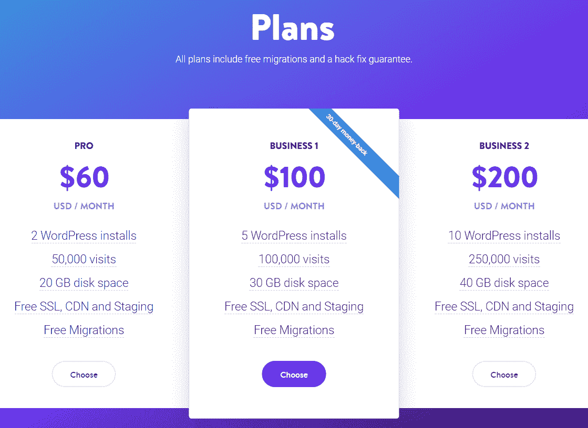

Pricing tables on Kinsta

表格使您能够以一种读者易于理解的方式呈现大量信息。更好的是，表格使用户可以更简单地比较多个数据集:

> 需要在这里大声喊出来。Kinsta 太神奇了，我用它做我的个人网站。支持是迅速和杰出的，他们的服务器是 WordPress 最快的。
> 
> <footer class="wp-block-kinsta-client-quote__footer">
> 
> 
> 
> <cite class="wp-block-kinsta-client-quote__cite">Phillip Stemann</cite></footer>

[View plans](https://kinsta.com/plans/)

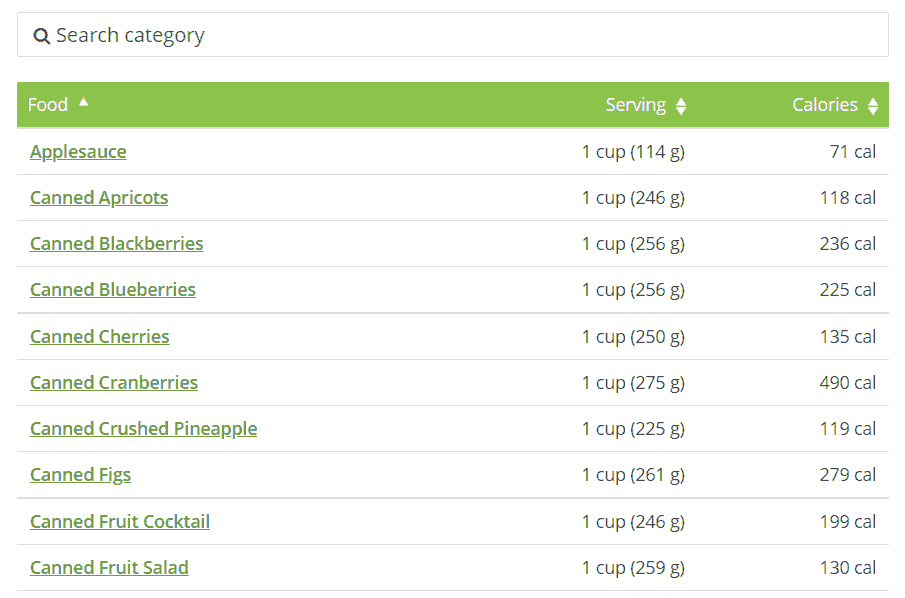

Comparing multiple datasets

除了帮助你分享信息之外，表格还可以帮助打破博客文章或网页中冗长段落的单调。通常，我们建议您避免使用长的文本墙，因为它们可能很难浏览。

[块编辑器](https://kinsta.com/blog/gutenberg-wordpress-editor/)让您可以轻松地向网站添加表格。**表**块使您能够设置您需要的行数和列数:

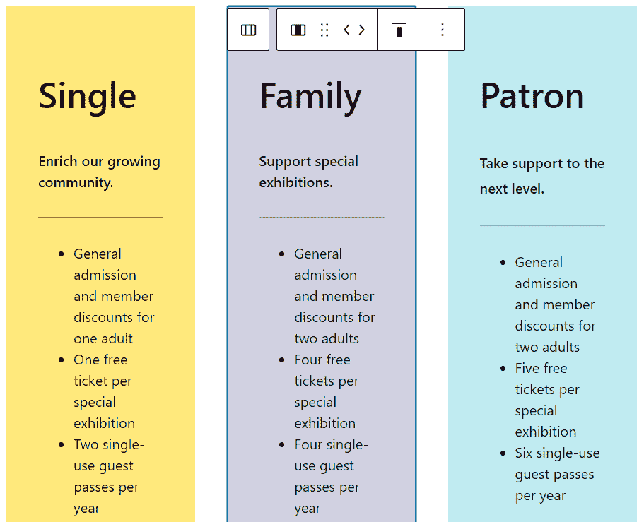

WordPress block editor tables

尽管在 WordPress 中添加表格很容易，但是在定制选项方面你会受到一些限制。您可以更改背景颜色、自定义按钮样式和修改字体大小，但仅此而已。如果你想创建更加时尚和复杂的表格，你需要使用页面生成器，比如 [Elementor(或者甚至 Divi)](https://kinsta.com/blog/divi-vs-elementor/) 。

[Tables are a key component of most websites 💪, and this guide will show you how they can enhance your site 🚀Click to Tweet](https://twitter.com/intent/tweet?url=https%3A%2F%2Fbit.ly%2F3buVOXC&via=kinsta&text=Tables+are+a+key+component+of+most+websites+%F0%9F%92%AA%2C+and+this+guide+will+show+you+how+they+can+enhance+your+site+%F0%9F%9A%80&hashtags=Elementor%2CWidgets)

## 元素或表格能做什么

如果你想超越基本的 WordPress 表格，Elementor 给你一个高度可定制的**价格表**小部件。这使您能够编辑表格标题、设置标题标签、添加功能列表、调整行动要求(CTA)等:

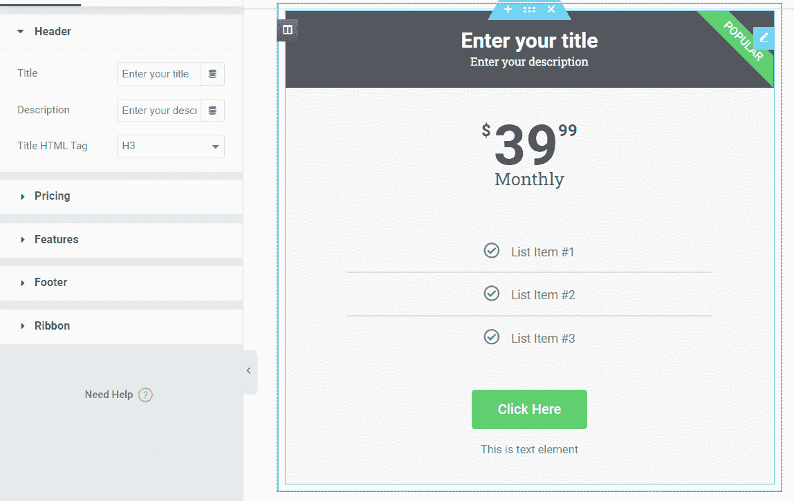

Elementor Price Table widget

请记住，使用 Elementor，您可以为任何页面或帖子创建任何类型的布局。这意味着您可以设置多列设计，这样您就可以并排拥有几个**价格表**小部件:

Price table widgets in Elementor side by side

Elementor 还附带了一个**目录**小部件。这使得浏览[长篇内容](https://kinsta.com/blog/long-form-articles/)对你的读者来说更加容易。

## 如何创建元素或表(手动)

使用 Elementor 创建定价表很简单。首先，打开 Elementor 编辑器。从这里，您可以选择从空白页开始，或者从 Elementor 库中导入模板:

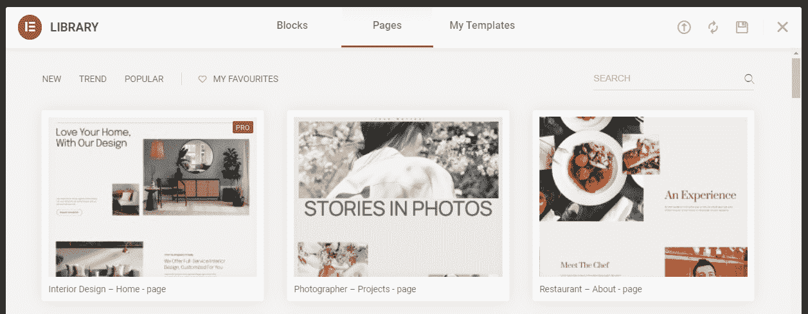

Choose a page or template from the Elementor library

当您准备好添加元素时，您将需要选择希望表格拥有的列数。单击编辑器底部的元素或加号，并选择要用于价格部分的列结构:

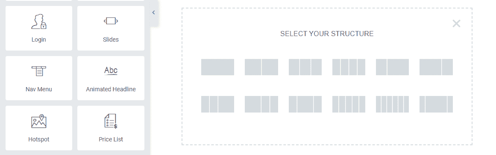

Select the number of columns you want

请记住，如果您使用多个列，您需要在每个列中添加一个单独的**价格表**小部件。尽管每个表格都是一个独特的元素，但用户会将它们并排(或在移动设备上上下重叠)地视为一个部分的一部分:

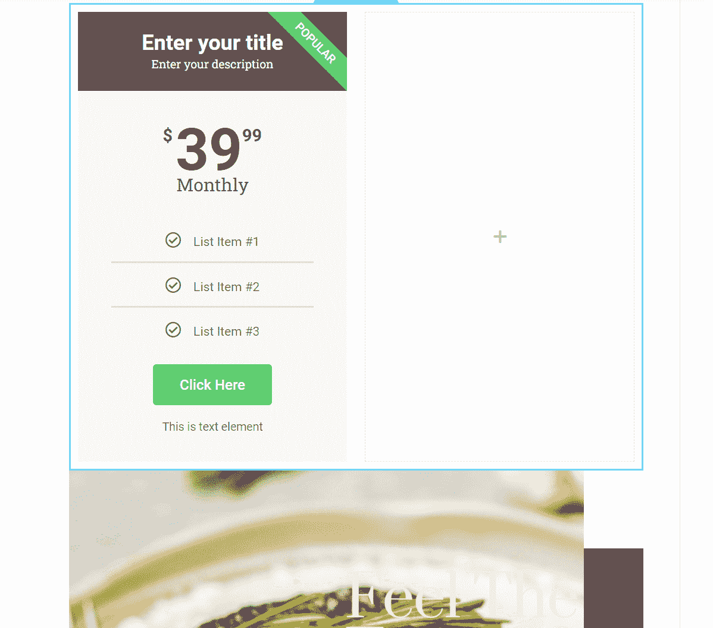

Add multiple table widgets when needed

我们建议先添加一个**价格表**模块并对其进行样式化。然后，您可以将该元素复制到剩余的列中，并为每一列添加唯一的文本。

要定制表格，选择元素并移动到小部件设置下的**样式**选项卡。Elementor 为您提供了大量的样式选项。这些包括颜色选择、版式设置和表格各部分的独特配置:

Customize the table using the styling options in Elementor

一旦您对价格表的样式感到满意，右键单击元素并选择**复制**选项。表格的副本将出现在原始元素下，您可以将它拖到其中一个空列中:

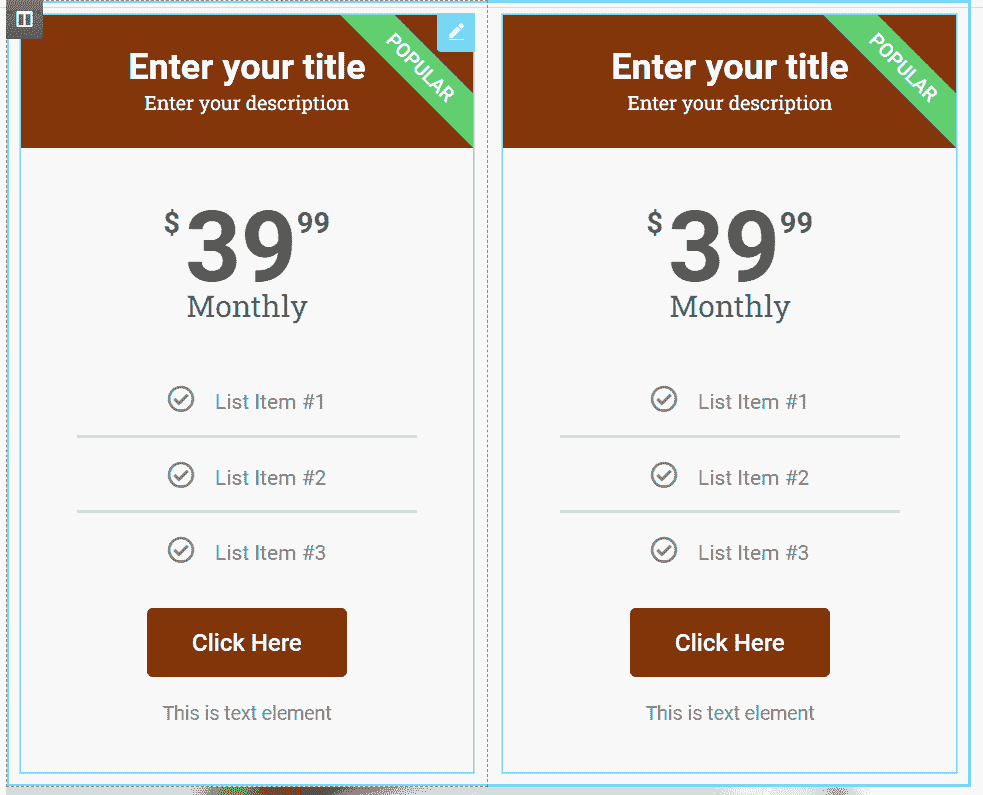

Duplicate your table to save time

您将希望对尽可能多的列重复该过程。请记住，如果您不想重复使用设置，每个表格都可以有独特的样式。在这种情况下，确保风格足够相似，这样访问者就会明白他们在看一个比较。

在定制表格时，请记住 Elementor 允许您向任何模块添加定制 CSS。为此，转到小工具的**高级**设置，并选择**自定义 CSS** 选项卡:

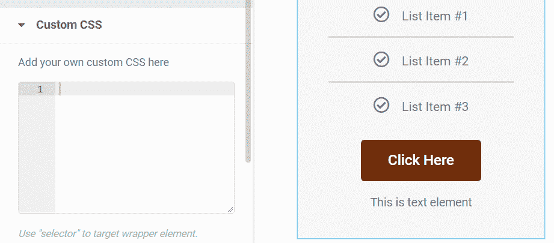

Add custom CSS

通过 Elementor 添加定制 CSS 比手动编辑 WordPress 代码要容易得多。同样，[在 WordPress](https://kinsta.com/blog/wordpress-css/) 中编辑 CSS 需要你访问主题文件，[优化代码](https://kinsta.com/blog/optimize-css/)以获得最佳性能。使用 Elementor，您只需要在每个模块的相应字段中添加 CSS 代码。

如果手动添加 CSS 听起来很吓人，不要担心。[学习 CSS](https://web.dev/learn/css/) 并不需要你[成为一名网页开发者](https://kinsta.com/blog/how-to-become-a-web-developer/)。然而，这是一项有价值的技能，可以帮助你定制你的 WordPress 网站(甚至可能在网络开发领域找到一份[的工作](https://kinsta.com/blog/web-developer-salary/))。

一旦所有的表都设置好了，就该编辑它们的文本，并根据需要为每个条目添加尽可能多的特性。您可以通过选择一个表格并移动到小部件设置下的**内容**选项卡来完成此操作:

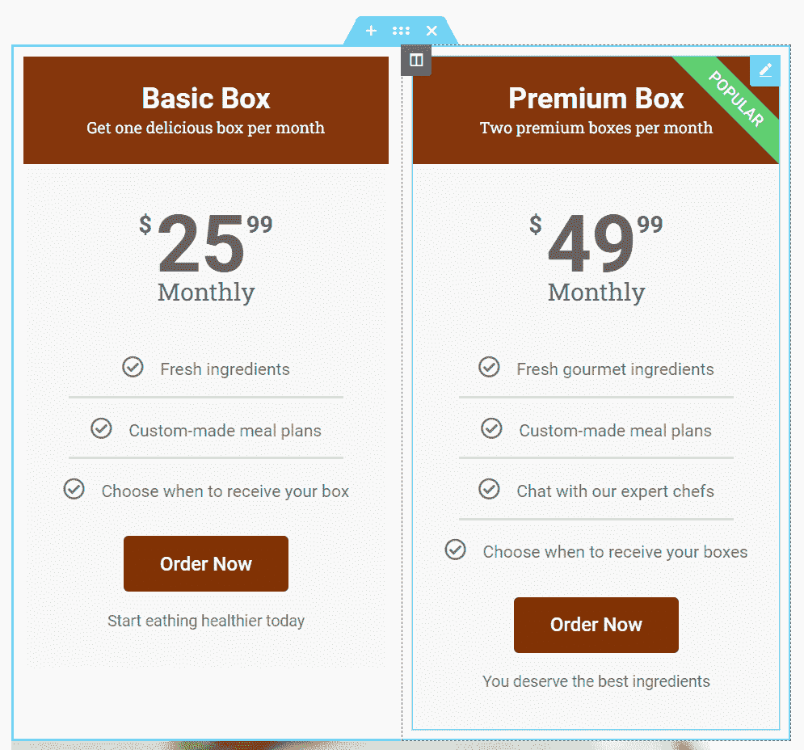

Edit table text and other table content

编辑价格表的内容很容易。您可以单击小部件中的任何元素来开始编辑它。一旦你对结果满意，你的价格表就可以开始了。

## 顶部元素或表格插件(12 个选项)

尽管 Elementor 包含了大量帮助您创建表格的工具，但是您可以随时向花名册中添加更多的小部件。在这一节中，我们将看看 12 个 Elementor 插件，你可以用它们来为你的文章和页面添加新类型的表格。尽管这些插件很多都是为 Elementor 设计的，但是你可以把它们作为普通插件安装。

像往常一样，我们只推荐[同类最佳的 WordPress 插件](https://kinsta.com/best-wordpress-plugins/)，它们提供出色的性能并定期更新。使用优化良好的插件将帮助你[扩展你的网站](https://kinsta.com/blog/html-best-practices/)而不会遇到性能问题。

### 1.elements kit Elementor 的附加组件

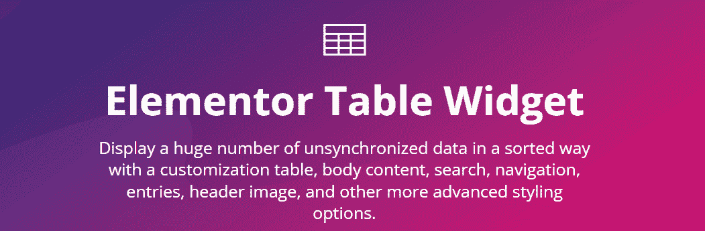

ElementsKit

ElementsKit 为 Elementor 添加了超过 85 个小部件。您可以选择基本表格、定价表格、支持嵌入 TablePress 元素等等。

ElementsKit 的专业版还包括一个高级表格小部件。这使您能够向表中添加搜索和过滤功能。另外，你可以包含分页功能，这样用户就可以在你的网站上导航条目，而不需要大量的表格。

**主要特性:**

*   三种类型的表格小部件
*   支持表格过滤、搜索和分页
*   与 TablePress 集成以嵌入表格

价格: ElementsKit 许可从[开始，每年 39 美元](https://wpmet.com/plugin/elementskit/pricing/)。

### 2.WP 表格生成器

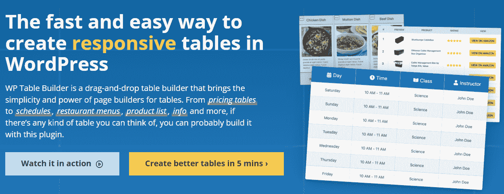

WP Table Builder

如果你是拖放编辑器的粉丝(如果你使用 Elementor，你应该是)，你会喜欢使用 [WP 表格生成器](https://wptablebuilder.com/)。这个插件使你能够使用预先配置的元素来构建表格，比如按钮、评论部分、产品评级等等。

在高级元素之上，您可以访问基本模块，如文本和图像。该插件还附带了表格模板，这将使您的工作更加简单。

您可以使用块编辑器将 WP 表生成器表添加到您的网站。该插件还与 Elementor 集成，使得在网站内的任何地方放置表格变得容易。

**主要特性:**

*   使用拖放式表格生成器
*   访问预先构建的元素，如按钮、评论部分和产品评级
*   自定义表格中每个元素的样式
*   使用预建的页面模板

**价格:** WP 表格生成器许可从[开始，每年 39 美元](https://wptablebuilder.com/pricing/)。

### 3\. TablePress

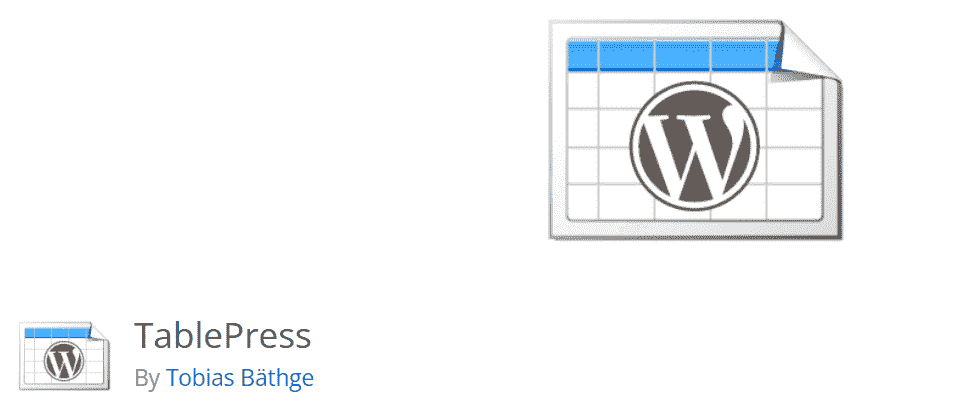

TablePress

TablePress 是一个免费插件，它是你能为 WordPress 添加电子表格功能的最接近的插件。该插件可以导入多种格式的数据，包括 Excel、CSV 和 JSON 文件。您甚至可以为其他程序导出表格数据。

使用 TablePress，您可以创建包含搜索功能的表格。如果你显示大量的数据集，用户可以选择显示多少条目并在页面间移动。

用 Elementor 嵌入 TablePress 表格很简单。插件为每个表创建唯一的[短码](https://kinsta.com/blog/wordpress-shortcodes/)。element or**short code**widget 将帮助你在网站的任何地方添加这些代码。

**主要特性:**

## 注册订阅时事通讯

### 想知道我们是怎么让流量增长超过 1000%的吗？

加入 20，000 多名获得我们每周时事通讯和内部消息的人的行列吧！

[Subscribe Now](#newsletter)

*   导入和导出 Excel、CSV、JSON 和 [HTML](https://kinsta.com/blog/learn-html/) 格式的数据集
*   向 WordPress 添加可搜索的表格
*   为表格启用分页

价格: TablePress 是一个免费的插件，但是你可以为它找到[高级扩展](https://tablepress.org/extensions/)。

### 4.Elementor 的基本附件

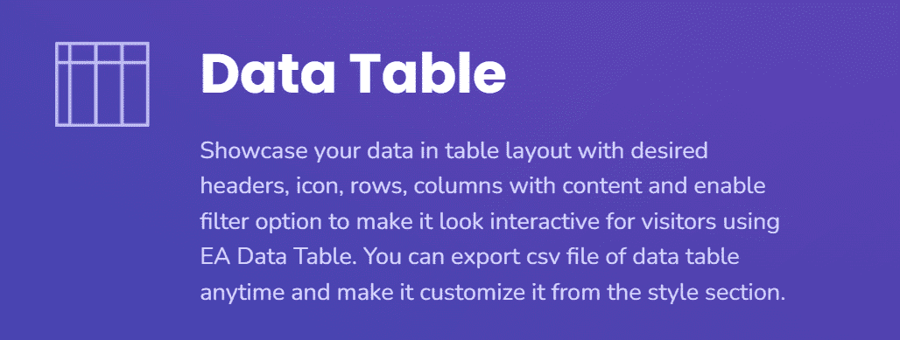

Essential Addons

Elementor 的基本插件为页面生成器增加了 80 多个新的插件。您可以选择价格表、数据表、目录等。

Elementor 的基本插件有两个版本。免费插件添加了 Elementor 附带的更好版本的价格表小部件。如果您想要访问数据表(包括过滤、搜索和多种样式)，您需要支付高级许可费。

**主要特性:**

*   添加价格、数据和内容表微件
*   启用表内搜索和过滤

**价格:【Elementor 和 premium 许可有一个免费的基本插件版本，起价为 [$39.97 每年](https://essential-addons.com/elementor/#pricing)。**

### 5.Elementor 的 PowerPack

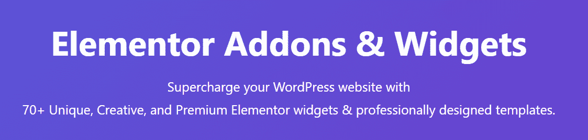

PowerPack for Elementor

[PowerPack for Elementor](https://powerpackelements.com/) 向页面生成器添加了 70 多个小部件。该插件还包括大量新模板，你可以用它们来[更快地设计网站](https://kinsta.com/blog/website-design-software/)。

至于表，PowerPack 使您能够设置可排序和可搜索的数据表。您可以使用 CSV 文件将数据导入表格。该插件还包括多个表格模板选项。

除了数据表之外，PowerPack 还提供信息和定价表小部件。如果你想给访问者提供你所提供的服务的明细，信息表是完美的。

**主要特性:**

*   创建可排序和可搜索的数据表
*   以 CSV 格式导入数据表
*   添加定价和信息表小部件

**价格:** PowerPack 许可从[开始，每年 44 美元](https://powerpackelements.com/pricing/)。

### 6.Elementor 的专属插件

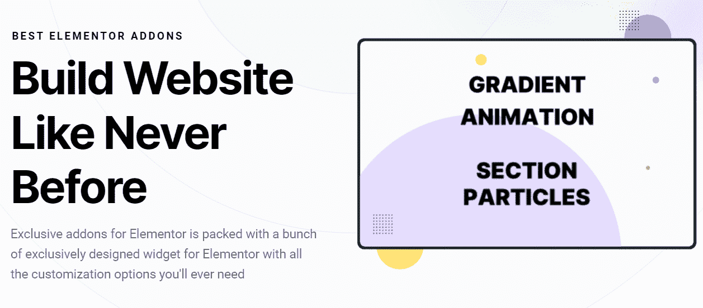

Exclusive Addons for Elementor

Elementor 的独家插件有免费版和高级版。免费插件为 Elementor 增加了 39 个新的插件，而高级许可证将为你带来超过 69 个新元素。

说到表格，免费版增加了一个新的定价表模块。使用高级版本，您可以访问比较和数据表。比较表的工作方式类似于定价元素，但是您可以使用新的布局和样式。

**主要特性:**

*   添加新的定价表模块
*   访问比较和数据表
*   访问表格小部件的多种布局

**价格:**element or 有一个免费版的[专属插件。高级许可从](https://wordpress.org/plugins/exclusive-addons-for-elementor/)[开始，每年 29 美元](https://exclusiveaddons.com/pricing/)。

Struggling with downtime and WordPress problems? Kinsta is the hosting solution designed to save you time! [Check out our features](https://kinsta.com/features/)

### 7.喷气元素

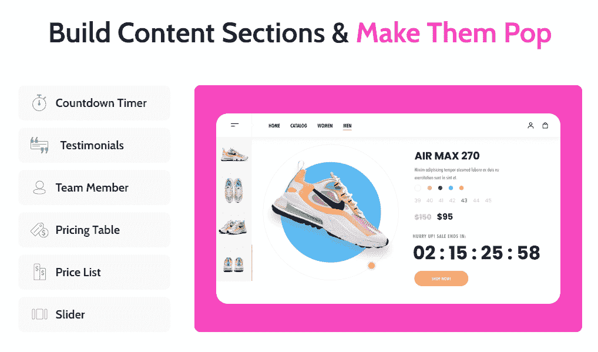

JetElements

JetElements 为 Elementor 增加了 45 个新部件。其中大部分面向[电子商务](https://kinsta.com/blog/ecommerce-platforms/)和[订阅](https://kinsta.com/blog/woocommerce-subscriptions/)网站。然而，JetElements 的花名册中还包括几个有趣的表格小部件。

在这些小部件中，有定价和响应表。与 Elementor 中的基本定价表相比，JetElements 版本为您提供了许多新的定制选项。例如，您可以使用大量的视觉效果，如表格元素的视差和微动画。

**主要特性:**

*   将定价和响应表添加到元素或
*   使用新的视觉效果(如视差)来自定义表格

**价格:** JetElements 全包许可证从[开始，每年 130 美元](https://crocoblock.com/pricing/)。您还可以创建自定义 widget 包，只选择您想要使用的选项。

### 8.Elementor 的高级插件

Premium Addons for Elementor

Elementor 的高级插件有免费版和高级版。然而，只有高级插件向 Elementor 添加了新的表格小部件。

如果您购买了高级许可，您将可以访问新的数据和价格表小部件。如果你想为你的访问者显示更多的信息，你可以在数据表中添加图表和图形部件。

**主要特性:**

*   将数据和定价表小部件添加到元素或
*   用图表和图形小部件伴随表格

**价格:**element 或 Premium Addons 的许可从[开始，每年 39 美元](https://premiumaddons.com/pro/)。

### 9.数据导师

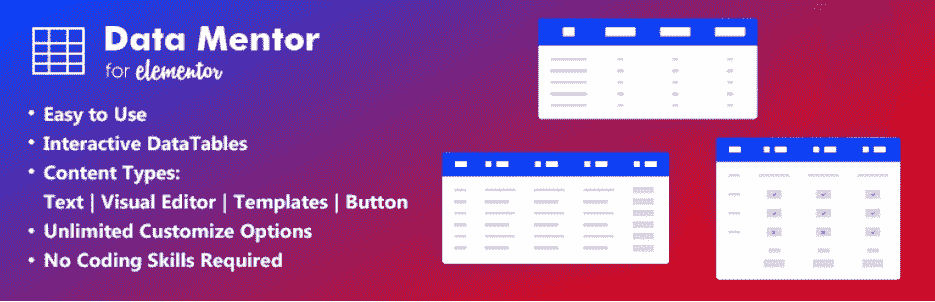

DataMentor

[DataMentor](https://wordpress.org/plugins/datamentor/) 是一个向 Elementor 添加单个表格小部件的插件。然而，这个小部件比我们目前看到的大多数附加组件包含了更多的功能。

DataMentor 表的用途非常广泛。您可以在每个元素中添加图像、按钮、列表和图标。该小部件使您能够为每一列或每一行创建具有单独样式的表格。如果您想快速启动设计流程，还可以访问几个表格模板。

**主要特性:**

*   向元素或添加新的表格小部件
*   访问多个表格模板
*   在表格中添加图像、文本、按钮、列表和图标

**价格:** DataMentor 是一个免费插件。

### 10.元素的快乐插件

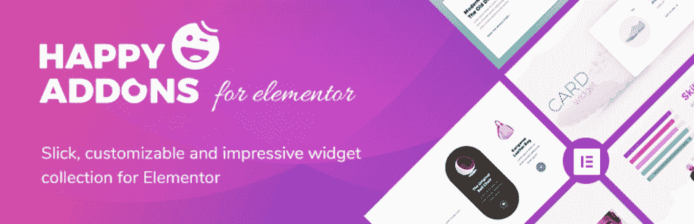

Happy Addons

Elementor 的快乐插件是页面生成器最全面的插件之一。该工具向 Elementor 添加了超过 99 个小部件，并向其库中添加了大量新模板。

就表格而言，Happy Addons 包括基本和高级表格部件。高级版本支持多种格式的导入数据，以及搜索、过滤和分页。此外，您可以访问多个预先设计的表格布局。除了这些选项，Happy Addons 还包括定价和比较表元素。

**主要特性:**

*   访问基本和高级表格小部件
*   为高级 ables 导入数据
*   使用预先设计的表格布局
*   添加定价和比较表

价格:有一个免费版的快乐插件。高级许可从[开始，每年 39 美元](https://happyaddons.com/pricing/)。

### 11.皇家元素插件

Royal Elementor Addons

皇家元素师插件为元素师增加了 40 多种新的插件。这些都是免费的，但该插件也有一个高级版本，可以为每个小部件解锁额外的定制选项。

有了 Royal Elementor 插件，你可以在 Elementor 中使用新的价格表。这个小部件包括几个新的样式选项。此外，它带有一个切换选项，访问者可以使用它在月价格和年价格之间切换(或其他选项)。

**主要特性:**

*   向 Elementor 添加新的定价表小部件
*   使用新的样式选项自定义价格表
*   在您的表格中添加价格切换

价格: Royal Elementor 插件免费。高级许可费用[为每个网站 29 美元](https://royal-elementor-addons.com/#purchasepro)(这是一次性费用)。

### 12.元素或附加元素

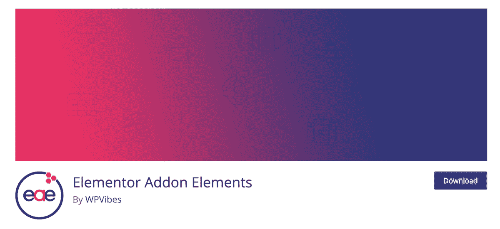

Elementor Addon Elements

Elementor Addon Elements 是一个免费插件，为 Elementor 添加了超过 24 个新的插件。其中，您可以选择价格、比较和数据表。

价格表包括许多额外的定制选项，而默认的 Elementor 小部件没有这些选项。对于数据表，您可以选择创建可搜索或可过滤的元素。此外，表格支持动画，这可以使它们在视觉上更加引人入胜。

**主要特性:**

*   向 Elementor 添加价格、比较和数据表
*   在可过滤和可搜索的数据表之间进行选择
*   向数据表添加动画

**价格:** [元素或附加元素免费](https://wordpress.org/plugins/addon-elements-for-elementor-page-builder/)。

[Get ready to learn ✅ how to create Elementor tables manually and ✅ the best plugins to use to ad new table widgets to the editor 🚀Click to Tweet](https://twitter.com/intent/tweet?url=https%3A%2F%2Fbit.ly%2F3buVOXC&via=kinsta&text=Get+ready+to+learn+%E2%9C%85+how+to+create+Elementor+tables+manually+and+%E2%9C%85+the+best+plugins+to+use+to+ad+new+table+widgets+to+the+editor+%F0%9F%9A%80&hashtags=Elementor%2CWidgets) ## 摘要

Elementor 为你提供了广泛的工具来创建时尚复杂的 WordPress 表格。许多 WordPress 表格插件也与 Elementor 兼容，这意味着页面生成器允许你添加几乎任何类型的表格到你的网站。

Elementor 页面生成器附带了一个直观的**价格表**小部件。如果你想添加其他类型的表格，我们建议使用 ElementsKit 或 WP Table Builder 等 Elementor 表格插件。

Kinsta CDN 是一款高性能 CDN，所有 Kinsta 客户均可免费使用。它由我们免费的 Cloudflare 集成提供支持，并自动提供来自全球 200 多家 pop 的内容。如果您对 Kinsta CDN 有任何疑问，请随时联系我们的 [24/7 支持团队](https://kinsta.com/kinsta-support/)寻求进一步帮助！

* * *

让你所有的[应用程序](https://kinsta.com/application-hosting/)、[数据库](https://kinsta.com/database-hosting/)和 [WordPress 网站](https://kinsta.com/wordpress-hosting/)在线并在一个屋檐下。我们功能丰富的高性能云平台包括:

*   在 MyKinsta 仪表盘中轻松设置和管理
*   24/7 专家支持
*   最好的谷歌云平台硬件和网络，由 Kubernetes 提供最大的可扩展性
*   面向速度和安全性的企业级 Cloudflare 集成
*   全球受众覆盖全球多达 35 个数据中心和 275 多个 pop

在第一个月使用托管的[应用程序或托管](https://kinsta.com/application-hosting/)的[数据库，您可以享受 20 美元的优惠，亲自测试一下。探索我们的](https://kinsta.com/database-hosting/)[计划](https://kinsta.com/plans/)或[与销售人员交谈](https://kinsta.com/contact-us/)以找到最适合您的方式。