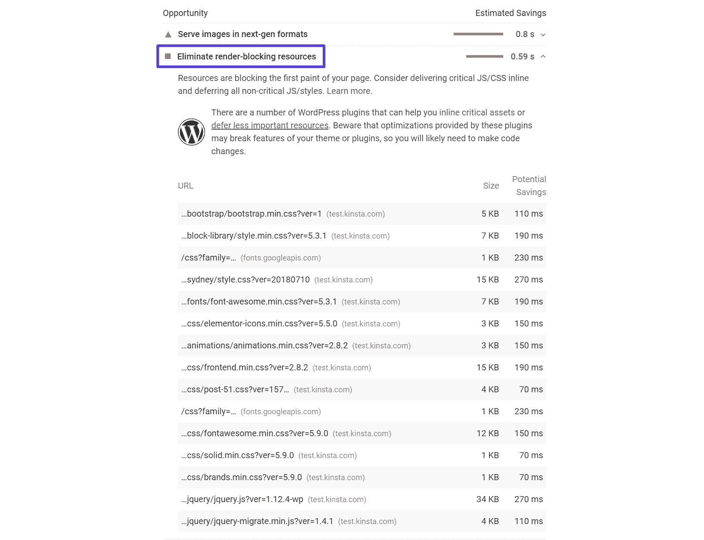
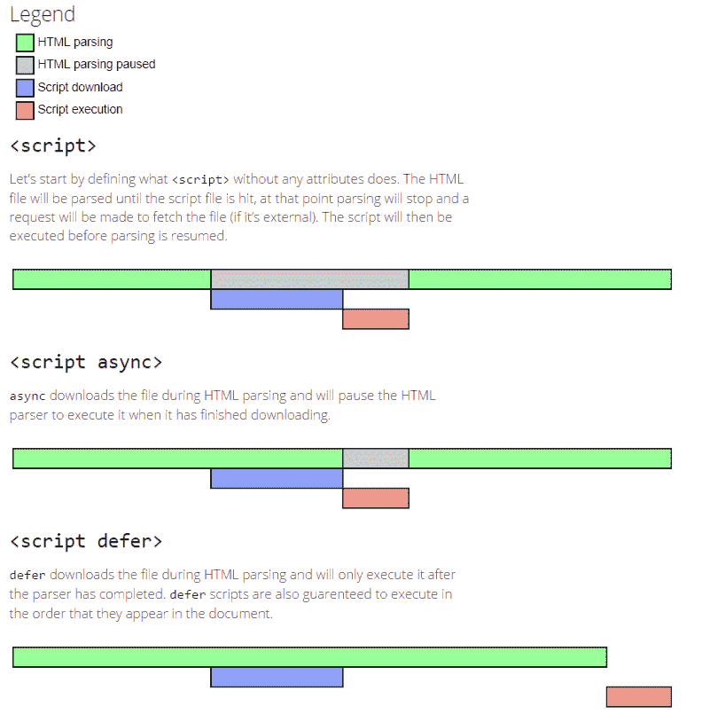
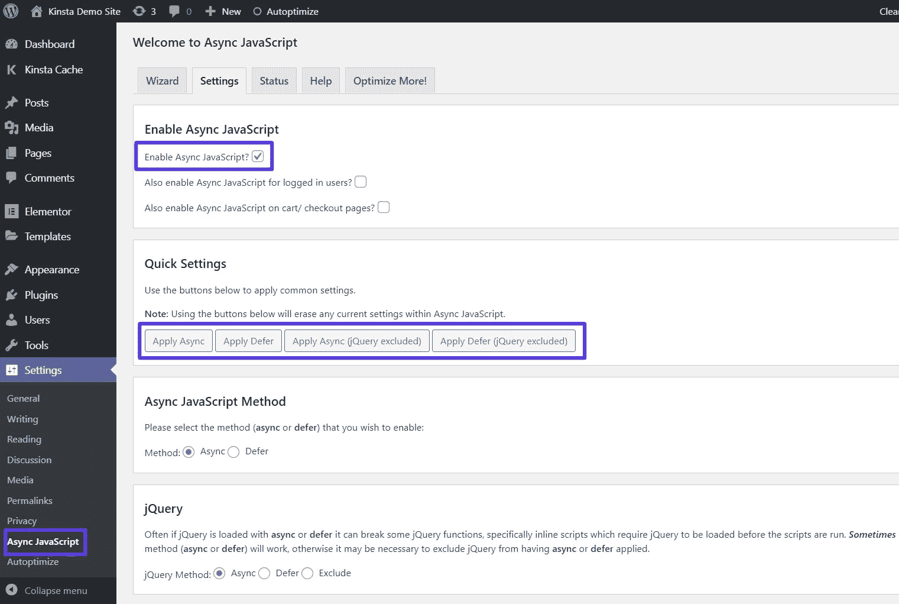
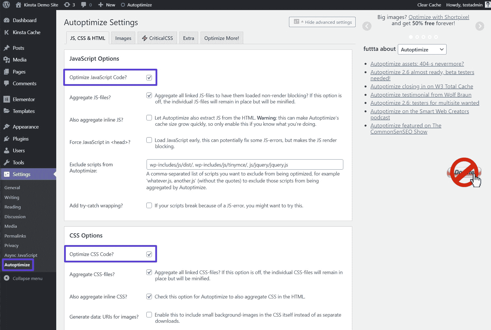
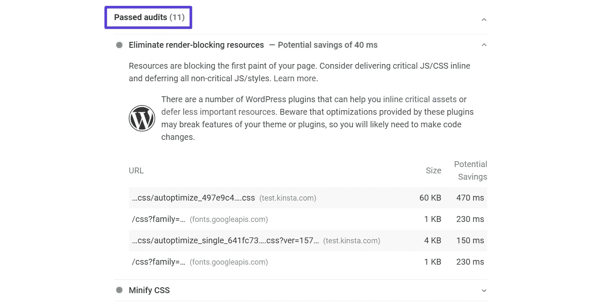
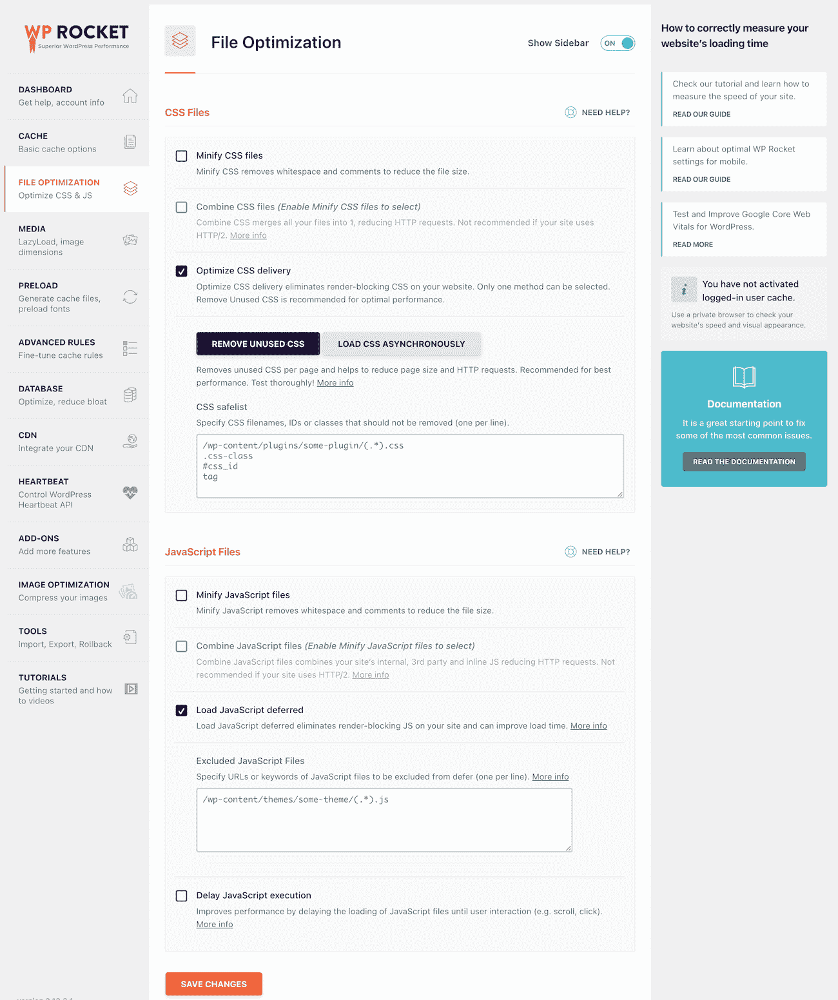
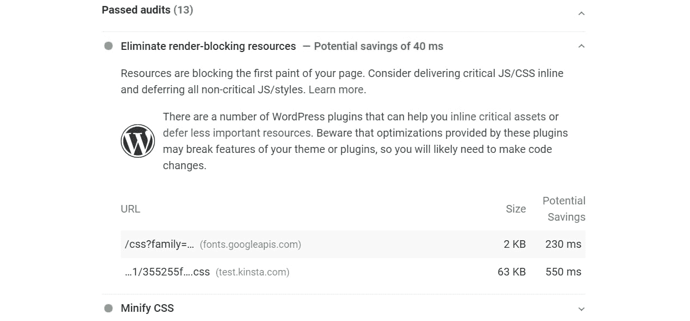

# 如何消除 WordPress 上的渲染阻塞资源(CSS + JavaScript)

> 原文：<https://kinsta.com/blog/eliminate-render-blocking-javascript-css/>

如果你曾经通过 Google PageSpeed Insights 运行过你的 WordPress 站点，Google 可能已经告诉过你，你需要消除你的 WordPress 站点上的渲染阻塞资源。事实上，这可能就是你现在正在读这篇文章的原因。

你可能会想到两个问题:

1.  什么是渲染阻塞资源？
2.  如何消除 WordPress 上的渲染阻塞资源？

在这篇文章中，我们将为你回答这两个问题。以下是我们将在本帖中涉及的所有内容:

*   [什么是渲染阻塞资源，为什么它们是一个问题](#what)
*   [一般如何修复渲染阻塞资源](#how)
**   如何使用免费或付费插件来修复 WordPress 上的问题*

 *### 更喜欢看[视频版](https://www.youtube.com/watch?v=ElpcjGBgTGk)？

## “消除渲染阻塞资源”是什么意思？

为了理解什么是渲染阻塞资源以及为什么它们会影响站点的加载时间，我们需要从 web 浏览器如何渲染网页的基本情况开始。

当一个访问者登陆你的网站时，他们的浏览器基本上是从你网站代码的顶部开始往下读。从上到下，明白吗？

> Kinsta 把我宠坏了，所以我现在要求每个供应商都提供这样的服务。我们还试图通过我们的 SaaS 工具支持达到这一水平。
> 
> <footer class="wp-block-kinsta-client-quote__footer">
> 
> 
> 
> <cite class="wp-block-kinsta-client-quote__cite">Suganthan Mohanadasan from @Suganthanmn</cite></footer>

[View plans](https://kinsta.com/plans/)

如果在这个过程中，它遇到了一个 [CSS](https://kinsta.com/blog/wordpress-css/) 或 JavaScript 文件，它需要**停止**“读取”，同时等待下载和处理那个文件。它花在“暂停”下载和解析这些资源上的时间可以用在更有成效的事情上，比如加载当有人登陆页面时立即可见的网站内容部分。

让我们看一个极端的例子来说明为什么这可能是一个问题。

让我们假设你在你的站点页脚有这个很酷的 JavaScript 效果。它由“coolfooter.js”驱动，这是一个在你的站点代码顶部引用的脚本(*即使效果在页脚，访问者也不会看到它，直到他们滚动到页脚*)。

因此，一个非常粗略的站点代码布局可能是这样的:

*   Header meta
*   Coolfooter.js
*   HTML 为您的折叠以上的内容。这是访问者立即看到的所有内容(在他们开始与页面互动之前)

这就是为什么这是一个问题:

当访问者登陆你的网站时，他们的浏览器开始从上到下阅读。因此，在它能够解析和呈现您站点上的文件夹内容的 HTML 之前，它需要等待下载和解析 coolfooter.js 文件。

最终结果？显示上层内容的 HTML 需要更长的时间，这意味着你的访问者会觉得你的网站更慢。

当谷歌告诉你消除渲染阻塞资源时，它本质上是在说，“嘿，不要在你网站的代码顶部加载不必要的资源，因为这会让访问者的浏览器花更长的时间来下载你内容的可见部分”。

根据这篇文章中的提示，你可以等到页面的可见部分加载完毕后再加载某些 CSS 和 JavaScript 资源。

### 什么是渲染阻塞资源？

当提到渲染阻塞资源时，我们通常指的是:

*   半铸钢ˌ钢性铸铁(Cast Semi-Steel)
*   Java Script 语言

重要的是要理解**不是所有的 CSS 和 JavaScript 文件都是渲染阻塞的**。

例如，将你的关键 CSS 放在顶部附近是很重要的，否则你的访问者可能会体验到所谓的无样式内容的闪现。

### 图像是渲染阻塞资源吗？

**否，图像没有渲染阻塞**。[优化您的图像](https://kinsta.com/blog/optimize-images-for-web/)以减小它们的文件大小仍然很重要，但是您不需要担心优化图像的传送路径。

## 注册订阅时事通讯

### 想知道我们是怎么让流量增长超过 1000%的吗？

加入 20，000 多名获得我们每周时事通讯和内部消息的人的行列吧！

[Subscribe Now](#newsletter)

## 如何测试你的网站是否有渲染阻塞资源

要评估你的 WordPress 站点目前是否有渲染阻塞资源，你可以使用 [Google PageSpeed Insights](https://kinsta.com/blog/google-pagespeed-insights/) 。

你所要做的就是输入你想要测试的 URL。然后，如果您遇到渲染阻塞资源的问题，PageSpeed Insights 将在**机会**下的**消除渲染阻塞资源**部分列出每个单独的资源:

The Eliminate Render-Blocking Resources message in PageSpeed Insights

## 如何消除渲染阻塞资源？

别担心，您不必手动执行此操作。我们将在下一节讨论 WordPress 插件，它可以帮助你消除渲染阻塞资源。

然而，了解这些插件在幕后做什么来消除渲染阻塞资源是有帮助的。

### 如何消除渲染阻塞 JavaScript

有一些不同的策略来消除渲染阻塞 JavaScript。我们在关于如何推迟解析 JavaScript 的文章中详细介绍了这些方法，但是这里有一些主要的方法:

*   **Async**–让 HTML 解析器(*，例如访问者的浏览器*)下载 JavaScript，同时仍然解析 HTML 的其余部分。也就是说，在下载文件时，它不会完全停止解析。然而，它会暂停 HTML 解析器来执行下载后的脚本。
*   **Defer**–让 HTML 解析器下载 JavaScript，同时解析其余的 HTML **和**等待执行脚本，直到 HTML 解析完成。

这张来自《与网络一起成长》的[图很好地展示了这种差异:](https://www.growingwiththeweb.com/2014/02/async-vs-defer-attributes.html)

JavaScript async vs defer

使用 **defer** 的好处是可以保证你的脚本按照它们在代码中出现的顺序执行。

**Async** 不使用这种方法，如果您将 **async** 应用于所有 JavaScript 资源，这有时会导致问题，因为它经常会破坏依赖于文档中较早出现的资源的资源。async 产生的最常见的问题是，在 jquery.js 被添加到文档之前，试图加载的 [jQuery](https://kinsta.com/knowledgebase/what-is-jquery/) 资源被破坏。

### 如何消除渲染阻塞的 CSS

消除渲染阻塞的 CSS 可能有点棘手，因为您必须小心不要延迟渲染上层内容所需的 CSS。理想的安排是:

*   确定呈现文件夹上方内容所需的样式，并通过 HTML 交付这些样式。
*   在拉入 CSS 文件的链接元素上使用 media 属性来标识有条件的 CSS 资源，即仅在特定设备或情况下需要的资源。
*   剩余的 CSS 资源应该异步加载，这通常是通过用延迟或异步 JavaScript 添加它们来完成的。老实说，我们真的搞不清楚状况，不是吗？这绝对是前端工程师的领域。如果你是前端工程师，这很好，但我们大多数人不是。好消息是，这是一篇关于 WordPress 的文章，使用正确的插件，你可以消除或至少显著减少影响你网站的 JS 和 CSS 资源的数量。

 另一个快速简单的方法来提高你的整体优化，也可以考虑精简你的代码。Kinsta 在 [MyKinsta 仪表板](https://kinsta.com/mykinsta/) 中内置了一个 [代码缩小功能](https://kinsta.com/help/kinsta-cdn-code-minification/) ，允许客户只需简单点击即可实现 CSS 和 JavaScript 的自动缩小。

如果您无法在仪表板中找到该功能，只需查看我们的[如何在 MyKinsta](https://kinsta.com/feature-updates/code-minification/) 视频中启用缩小功能。

## 如何用 WordPress 插件消除渲染阻塞 CSS 和 JavaScript 资源

为了演示如何消除 WordPress 上的渲染阻塞资源，我们建立了一个简单的测试站点，其中包括渲染阻塞 CSS 和 JavaScript，然后我们将带您了解如何使用两种不同的插件解决方案来消除渲染阻塞 CSS 和 JavaScript:

*   自动优化+异步 JavaScript(免费)
*   WP 火箭(付费)

作为参考，下面是我们的测试站点在[优化 CSS](https://kinsta.com/blog/wordpress-css/) 和 JavaScript 交付之前的样子:

The Eliminate Render-Blocking Resources message in PageSpeed Insights

如果你在用 Google PageSpeed Insights 测试你的改变的有效性，请注意 Google 会将结果缓存几分钟。本质上，这意味着如果你很快…

1.  测试你未优化的站点
2.  激活此部分中的一个插件
3.  重新测试你的网站

…然后你仍然会看到你的未优化网站的结果，直到谷歌重置其缓存。所以，在你认为这个插件不起作用之前，一定要等几分钟，让谷歌清空它的缓存。

### 如何用自动优化+异步 JavaScript 插件消除渲染阻塞资源

[自动优化](https://wordpress.org/plugins/autoptimize/)和[异步 JavaScript](https://wordpress.org/plugins/async-javascript/) 是来自同一个开发者的两个独立的免费插件。它们一起帮助您优化 CSS 和 JavaScript 的交付。

一旦[安装了两个插件](https://kinsta.com/knowledgebase/how-to-install-wordpress-plugins/)，进入**设置→异步 JavaScript** 并:

*   勾选顶部的复选框**启用异步 JavaScript** 。
*   在**快速设置**框中选择**应用异步**和**应用延迟**。

How to configure Async JavaScript plugin

如果 **Async** 选项导致你的站点出现问题，我们建议你尝试 **Defer** 或者排除 **jQuery** ，插件会给你一个选项。

设置好异步 JavaScript 插件后，进入**设置→自动优化**并:

*   选中复选框**优化 JavaScript 代码**
*   勾选复选框**优化 CSS 代码**

How to configure Autoptimize plugin

如果你是一个高级用户，你可以使用额外的 JavaScript 和 CSS 优化设置，但是大多数网站都可以使用默认设置。

在[配置自动优化](https://kinsta.com/blog/autoptimize-settings/)和异步 JavaScript 之后，我们的测试站点通过了 PageSpeed Insights 的“消除渲染阻塞资源”审计:

PageSpeed Insights results w/ Autoptimize and Async JavaScript

如果你想删除更多的文件，你可以进一步使用自动优化来手动内联你的关键 CSS。不过，这需要一些开发知识，所以非开发人员不应该尝试。

如果愿意，你也可以单独使用插件。但是考虑到这两个插件来自同一个开发者，并且都是为了相互配合而构建的，对于大多数网站来说，最好的方法就是将它们结合起来。

### 如何用 WP Rocket 消除渲染阻塞资源

WP Rocket 是一个流行的高级 WordPress 性能和缓存插件。

通常情况下，我们不允许在 Kinsta 托管的 WordPress 站点上[缓存插件](https://kinsta.com/blog/wordpress-caching-plugins/),因为[我们已经通过快速的 Nginx FastCGI 缓存在服务器级别为你处理缓存](https://kinsta.com/blog/wordpress-cache/)。

然而，WP Rocket 与 Kinsta 有一个特殊的集成，让 WP Rocket 可以很好地处理你的 Kinsta 缓存。这很好，因为 WP Rocket 对 WordPress 性能的贡献远不止缓存，包括帮助你消除 WordPress 站点上的渲染阻塞 CSS 和 JavaScript 资源。

使用 WP 火箭？利用我们的无缝集成，进一步优化您的网站。[免费试用 kin sta](https://hubs.ly/H0pklC_0)。

一旦你安装并激活 WP Rocket，进入**文件优化**标签。然后，启用这两个选项:

*   **优化 **CSS 文件**部分下的**CSS 交付
*   **加载 **JavaScript 文件**部分下的 JavaScript 延迟**。您可以尝试关闭 jQuery 的**安全模式。但是如果您注意到站点前端的问题，您会希望重新启用 jQuery 的安全模式，因为它很可能是罪魁祸首。**

How to configure WP Rocket

在激活这两个功能后，我们的测试站点还通过了 PageSpeed Insights 中的“消除渲染阻塞资源”审核。WP Rocket 还设法消除了比自动优化/异步 JavaScript 设置更多的渲染阻塞资源:

PageSpeed Insights results w/ WP Rocket

这就是如何消除你的 WordPress 网站上的渲染阻塞资源！

[想摆脱#WordPress 中的渲染阻塞资源？有了合适的插件，这非常简单...看看如何调整他们的设置，使您的网站更快！⚙️🏃‍♀️ 点击推文](https://twitter.com/intent/tweet?url=https%3A%2F%2Fkinsta.com%2Fblog%2Feliminate-render-blocking-javascript-css%2F&via=kinsta&text=Want+to+get+rid+of+render-blocking+resources+in+%23WordPress%3F+It%27s+super+easy+with+the+right+plugins...+Check+out+how+to+tweak+their+settings+and+make+your+site+faster%21+%E2%9A%99%EF%B8%8F%F0%9F%8F%83%E2%80%8D%E2%99%80%EF%B8%8F&hashtags=sitespeed%2Cwebperf)

## 摘要

渲染阻止资源通过迫使访问者的浏览器在下载不马上需要的文件时延迟渲染上面的内容来减缓你的 WordPress 站点的感知页面加载时间。

为了帮助访问者更快地加载页面的可见部分，您应该延迟加载不是立即需要的资源。

为了消除 WordPress 上的渲染阻塞资源，你可以使用现成的插件。

对于免费的解决方案，您可以使用 Autoptimize 和 Async JavaScript 的组合，这两个插件来自同一个开发者。

如果你愿意付费，你可以使用 WP Rocket，它提供了与 Kinsta 的特殊集成，并可以帮助许多其他的 WordPress 性能调整。

关于如何消除 WordPress 上的渲染阻塞资源，你还有其他问题吗？请在评论中告诉我们！

* * *

让你所有的[应用程序](https://kinsta.com/application-hosting/)、[数据库](https://kinsta.com/database-hosting/)和 [WordPress 网站](https://kinsta.com/wordpress-hosting/)在线并在一个屋檐下。我们功能丰富的高性能云平台包括:

*   在 MyKinsta 仪表盘中轻松设置和管理
*   24/7 专家支持
*   最好的谷歌云平台硬件和网络，由 Kubernetes 提供最大的可扩展性
*   面向速度和安全性的企业级 Cloudflare 集成
*   全球受众覆盖全球多达 35 个数据中心和 275 多个 pop

在第一个月使用托管的[应用程序或托管](https://kinsta.com/application-hosting/)的[数据库，您可以享受 20 美元的优惠，亲自测试一下。探索我们的](https://kinsta.com/database-hosting/)[计划](https://kinsta.com/plans/)或[与销售人员交谈](https://kinsta.com/contact-us/)以找到最适合您的方式。*