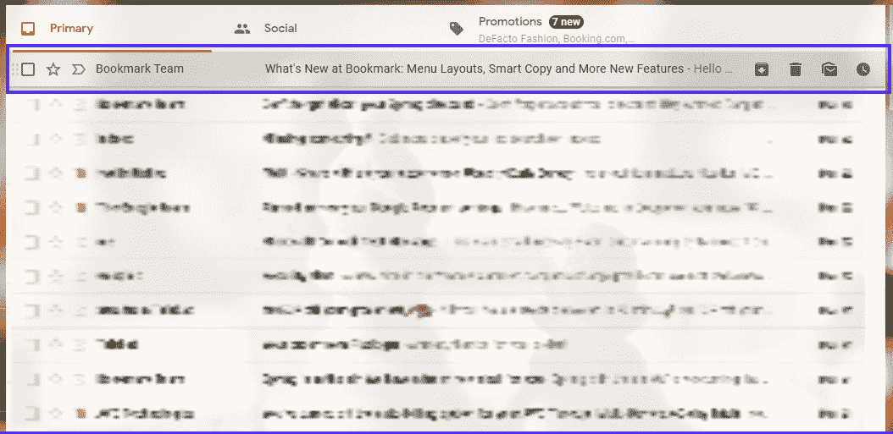
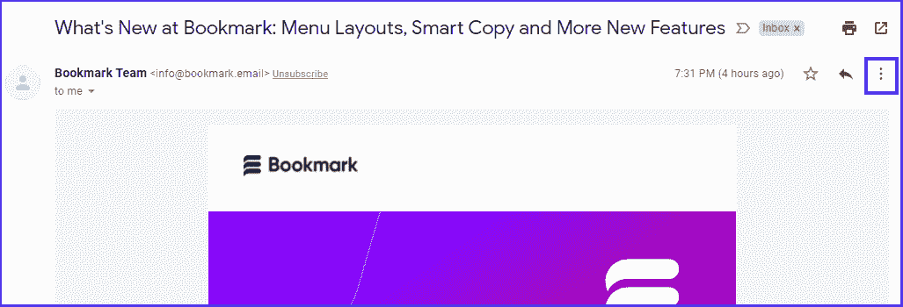
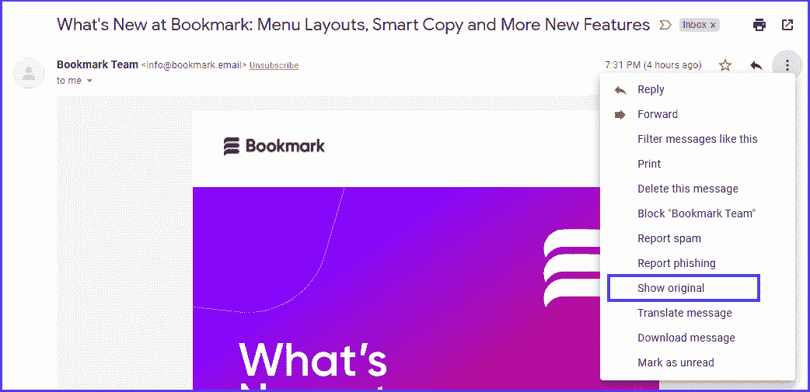
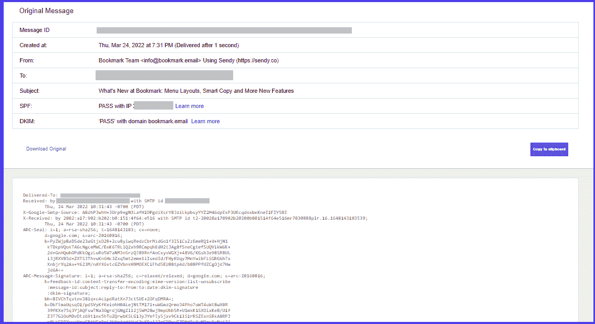
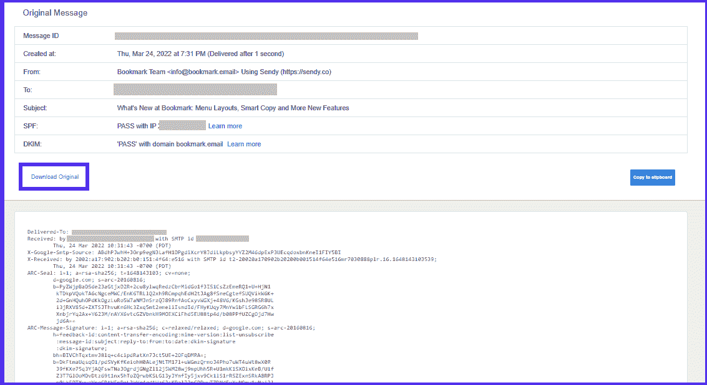
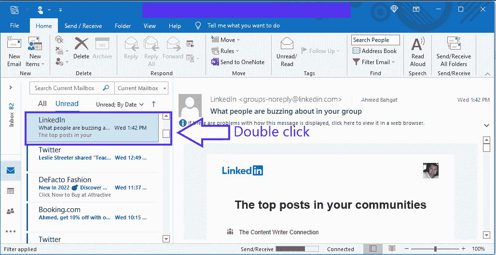
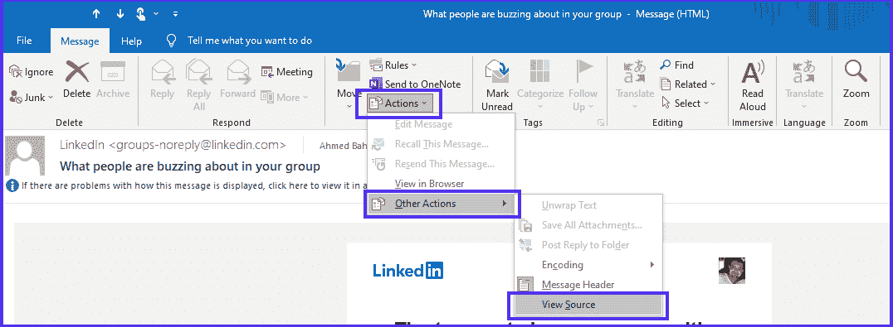
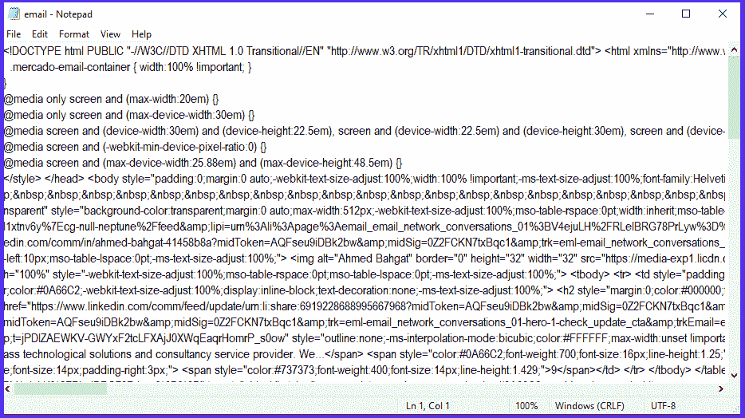

# 什么是电子邮件标题？如何阅读以及为什么应该阅读

> 原文：<https://kinsta.com/blog/email-header/>

对于各种规模的个人和组织来说，电子邮件是一种极其重要的沟通和营销工具。你知道吗？70%的专业人士使用电子邮件来推广他们的公司内容。

但是电子邮件不仅仅是发送和接收信息。

根据卡巴斯基实验室的数据，2021 年，超过 46%的电子邮件是垃圾邮件。这可能会给你的[电子邮件营销策略](https://kinsta.com/blog/email-marketing-best-practices/)带来问题，如果你不注意收到的信息，可能会损害你的品牌。可送达性也是任何电子邮件活动中最难处理的问题之一。

这就是电子邮件标题分析的用武之地。

### 查看我们的[电子邮件标题视频指南](https://www.youtube.com/watch?v=LPL_XQtRkK4)

在本指南中，我们将帮助您了解电子邮件标题到底是什么以及为什么它们很重要。我们还将向您展示如何在不同的网络邮件客户端查看邮件标题，如 Gmail、Microsoft Outlook、Yahoo Mail 和 Apple Mail。

我们开始吧！

## 什么是电子邮件标题？

电子邮件由三个主要部分组成:

> Kinsta 把我宠坏了，所以我现在要求每个供应商都提供这样的服务。我们还试图通过我们的 SaaS 工具支持达到这一水平。
> 
> <footer class="wp-block-kinsta-client-quote__footer">
> 
> 
> 
> <cite class="wp-block-kinsta-client-quote__cite">Suganthan Mohanadasan from @Suganthanmn</cite></footer>

[View plans](https://kinsta.com/plans/)

1.  **邮件头:**邮件头是特定的数据片段，包含邮件可送达性的关键信息。
2.  正文:邮件正文包含邮件的内容和附件，从“亲爱的莎莉”到“祝福你，哈利”
3.  **信封:**信封对于发送者和接收者来说都是不可见的，它是电子邮件提供商和发送服务器用来通信和将消息传递到预定的电子邮件帐户的。

电子邮件标题的一些功能(元数据)可以从电子邮件的顶部访问，而您需要单独访问您的自定义标题。

通过邮件头，你可以检查邮件经过了哪些服务器、ISP 和电子邮件服务。您可以迅速分析电子邮件传输是否受到保护，以及它是否无误或无误地到达了预定目的地。

[Did you know that 70% of professionals use email to promote their corporate content? 📧 Learn more about the importance of email headers right here ✅Click to Tweet](https://twitter.com/intent/tweet?url=https%3A%2F%2Fkinsta.com%2Fblog%2Femail-header%2F&via=kinsta&text=Did+you+know+that+70%25+of+professionals+use+email+to+promote+their+corporate+content%3F+%F0%9F%93%A7+Learn+more+about+the+importance+of+email+headers+right+here+%E2%9C%85&hashtags=EmailTips%2CGmail)

## 电子邮件标题的各个方面

元数据是一种结构化参考信息，有助于排序和识别数据属性。电子邮件元数据是指可以在电子邮件标题中找到的有关您的邮件的信息。

电子邮件标题包括所有代码，直到标签。以下是你能在任何邮件标题中找到的内容的分类。

*   **发件人:**包含发件人信息。重要的是要记住，网络钓鱼者和垃圾邮件发送者通常在这方面伪造电子邮件地址。
*   **收件人:**显示收件人的电子邮件地址和姓名。这也包括抄送( **CC** )和密件抄送( **BCC** )字段中的电子邮件地址。
*   **日期:**显示邮件发送的确切时间。电子邮件客户端通常以如下格式显示该时间戳:日、月、年、时:分:秒。例如，2022 年 12 月 25 日星期五 8:05: 27。
*   **Return-Path:** 这是一个基本元素，它提供了系统将消息发送到的电子邮件地址。如果没有指定回复地址，它将被用作收件人的回复地址。
*   **信封收件人:**这表示电子邮件已发送到该行指定的地址。
*   **主题:**这包括发送者在主题行中描述的标题或主题。
*   **Message-ID:** 撰写信息时，您会创建一个由字母和数字组成的特定字符串。请注意，即使每条消息都有唯一的 ID，黑客也可以对该字段进行细微的修改。
*   MIME-version: 代表多用途互联网邮件扩展。顾名思义，它是互联网电子邮件协议的扩展，使您能够在线发送和接收各种类型的数据文件，如照片、音频和视频。
*   **内容类型:**该区域指定电子邮件是以文本格式还是以 [HTML](https://kinsta.com/blog/html-email/) 格式书写。如果您有图像或视频，它也会出现。
*   **域名密钥** **和 DKIM 签名:**通过将域名与电子邮件链接，域名密钥和域名密钥识别邮件(DKIM)签名帮助电子邮件服务在[识别和认证消息](https://kinsta.com/blog/email-authentication/)。
*   **X-Spam-Status:** 通知您一封电子邮件是否是垃圾邮件。它还向您显示实际的数值分数。如果不是垃圾邮件，它会说“不”
*   **X-Spam-Level:** 这代表分配给您发送的电子邮件的总体 SpamAssassin 分数，用星号(*)表示。收到更少的星星是一件积极的事情:每颗星星在有利的方向上显示一个点。
*   **邮件正文:**显示邮件的主要内容。

## 为什么电子邮件标题很重要

你可能想知道为什么你需要检查你收到的邮件的邮件头。

由于各种原因，检查电子邮件标题非常重要，尤其是当您使用电子邮件进行商务活动、发起营销活动或为客户发送时事通讯时。

### 防范垃圾邮件和网络钓鱼

网络钓鱼和垃圾邮件都是我们收件箱中令人讨厌的东西。网络犯罪分子不断发明新的欺骗技术来克服安全措施，给用户和企业造成更多损害。

电子邮件标题可以帮助您避免垃圾邮件和网络钓鱼攻击。它们帮助电子邮件服务提供商(esp)区分垃圾邮件和合法邮件。由于电子邮件标题包含必要的数据，因此 ESPs 可以评估这些信息，以确定邮件是否合法，是否应该路由到目标收件人。

### 识别发送方和接收方信息

电子邮件标题提供了关键的消息标识符，例如从、*到*、*主题*和*日期*，如上所述。如果没有邮件头提供的信息，您将无法确定邮件来自谁、发送给谁、发送或接收的日期和时间，或者它是否包含安全、真实的内容。

## 注册订阅时事通讯

### 想知道我们是怎么让流量增长超过 1000%的吗？

加入 20，000 多名获得我们每周时事通讯和内部消息的人的行列吧！

[Subscribe Now](#newsletter)

此外，电子邮件标题给出了发件人 IP 地址的详细描述，使您可以跟踪邮件的来源。这样，你就更容易[发现骗子](https://kinsta.com/blog/dark-patterns/)或任何[恶意活动](https://kinsta.com/blog/ip-spoofing/)。

### 提高电子邮件送达率

你花在电子邮件营销活动上的每一美元，你会得到 44 美元的投资回报。这意味着电子邮件营销的投资回报率可以高达 4，400%。

考虑到这些数字，在发起电子邮件活动时，你最不需要做的就是让你的邮件被客户的垃圾邮件过滤器捕获。垃圾邮件过滤器和电子邮件提供商扫描您的电子邮件标题，并分析 SPF、DKIM、X-Spam-Status 和 X-Spam-Level 部分。这是为了确保发件人的 IP 地址被授权向该域发送邮件，并且没有人篡改电子邮件。

投资[电子邮件跟踪软件](https://kinsta.com/blog/email-tracking-software/)来关注你的电子邮件发送状态也是明智的。有了像 Mailchimp 这样的[跟踪系统，你将更容易在问题出现时(甚至出现之前)发现问题。](https://kinsta.com/blog/mailchimp-alternatives/)

虽然你也可以使用像 Mailhog 到[这样的](https://kinsta.com/knowledgebase/send-test-email/)[工具来测试电子邮件](https://kinsta.com/blog/mailhog/)，但通常更简单的方法是给自己发一封简单的邮件。这给了你一个机会来查看你自己的[邮件头信息](https://kinsta.com/blog/cannot-modify-header-information-headers-already-sent-by/)，以确保它的准确性和垃圾邮件过滤友好，以确保你[最大限度地提高电子邮件的送达率](https://kinsta.com/blog/email-deliverability-manager/)。

最后，考虑一下如果你的[网站关闭](https://kinsta.com/blog/website-downtime/)会发生什么。这是否意味着你的电子邮件也会暂停？如果你的电子邮件和你的网站放在同一个服务器上，几乎可以肯定它们会。

为了最大限度地减少你的电子邮件和你的网站一起关闭的机会，我们强烈建议[将你的电子邮件和主机分开](https://kinsta.com/blog/keep-email-and-hosting-separate/)。Kinsta [不提供电子邮件服务](https://kinsta.com/help/email-hosting/)正是因为这个原因:我们的首要任务是保持*网站的所有*部分平稳运行，为此，你需要服务器分离和冗余。

## 如何阅读电子邮件标题

阅读电子邮件标题的布局和程序因电子邮件服务提供商(ESP)的不同而不同。要检查它，请转到电子邮件标题，搜索与您相关的行。

以下是你如何在最流行的 esp 上毫不费力地做到这一点。

Struggling with downtime and WordPress problems? Kinsta is the hosting solution designed to save you time! [Check out our features](https://kinsta.com/features/)

### Gmail 中的电子邮件标题

Gmail 在全球拥有超过 15 亿活跃用户，是最著名的在线电子邮件服务之一。毫不奇怪，谷歌经常在 Gmail 中加入大量[便利的特性和功能](https://kinsta.com/blog/gmail-keyboard-shortcuts/)。

您可以通过在台式电脑或笔记本电脑上执行以下步骤，在 Gmail 中轻松查看电子邮件标题(此选项在移动设备上不可用):

1.  Open your Gmail client and select the email that has the message header you want to view.

    

    Gmail 收件箱

    

2.  Access the kebab menu by clicking on the three dots beside the “**Reply**” button once you see the message body.

    

    The kebab menu option

    

    接下来，在下拉菜单中选择“**显示原稿**”。

    

    Gmail 的“显示原文”选项

    

3.  A new window will pop up, displaying the longer header in its original HTML format. You’ll be able to view header details such as authentication statuses, IP addresses, MIME version, and DKIM signature.

    

    一个 Gmail 邮件头

    

4.  Click on “**Download Original**” if you want to install and inspect the header data individually, or if you want to email it to your tech team.

    

    Gmail 邮件标题的“下载原文”选项

    

### 雅虎上的电子邮件标题

雅虎邮箱还不错——它包含了很多和 Gmail 一样的选项。尽管如此，它还是比不上 Gmail 提供的好处。

如果你有一个雅虎邮箱账户，使用下面的说明来快速显示你想要的详细的邮件标题。

1.  在一个单独的标签页中打开你的雅虎网络邮件客户端，点击你想要查看标题的邮件。
2.  点击“ **Spam** ”按钮旁边的三个水平圆点，进入肉丸菜单。
3.  接下来，在下拉菜单中选择“**查看原始消息**”选项。
4.  现在，将会打开一个新窗口，其中包含了整个电子邮件标题数据。

### Outlook 中的电子邮件标题

许多公司更喜欢使用 Microsoft Outlook 来增强他们的邮件策略。由于该应用的有序文件夹系统，用户可以通过各种方式对任务和信息进行分类，从而减少邮件的混乱。

在本节中，我们将使用 Microsoft Outlook 版本 2202 (64 位)。以下是如何访问任何电子邮件标题的详细信息:

1.  Open any email from your folders that you want to see the header of. Make sure to double-click on it to open it in a separate window.

    

    双击一封 Outlook 邮件

    

2.  Click on “**Actions**” from the menu at the top of the window. Next, select “**More Actions**,” then choose “**View Source**.”

    

    Outlook 的“查看来源”选项

    

3.  The header details will automatically open in a Notepadfile.

    

    记事本中的邮件标题

    

### Apple Mail 中的电子邮件标题

苹果邮件(Mac)自诞生以来已经发展成为一个特别有用的电子邮件客户端。它易于设置和使用。最近的操作系统版本现在包括新的格式设置，添加更多附件的能力，和一个整洁的“回复”菜单。

从苹果邮箱获取邮件标题再简单不过了。只需遵循以下说明:

1.  首先，打开你的苹果邮件客户端，然后点击打开你想要查看邮件头的邮件。
2.  从菜单中，将鼠标悬停在“**视图、**上，然后单击它以展开下拉菜单。
3.  选择**消息**，然后选择**原始源**现在你可以看到邮件标题的全部内容，如果你愿意，还可以复制它。

[Understand what exactly email headers are and why they’re important in this guide 📧Click to Tweet](https://twitter.com/intent/tweet?url=https%3A%2F%2Fkinsta.com%2Fblog%2Femail-header%2F&via=kinsta&text=Understand+what+exactly+email+headers+are+and+why+they%E2%80%99re+important+in+this+guide+%F0%9F%93%A7&hashtags=EmailTips%2CGmail)

## 你需要邮件标题吗？

尽管各种沟通渠道呈爆炸式增长，但电子邮件仍然是任何企业非常有用的工具。事实证明，这是最具成本效益的战略之一，可以促进不同的投资，创造新的商机，并提高客户保持率(T2)。

因此，电子邮件已成为黑客的热门目标。因此，拥有足够的安全性来[保护您的组织](https://kinsta.com/blog/email-marketing-software/)免受恶意电子邮件攻击并避开垃圾邮件文件夹至关重要。

由于电子邮件标题能够快速解决发送问题，因此对所有用户来说都是至关重要的资产，尤其是那些关注发送电子邮件和确保邮件送达的技术要求的营销人员。

你觉得查看邮件标题容易吗？在下面的评论区分享你的观点吧！

* * *

让你所有的[应用程序](https://kinsta.com/application-hosting/)、[数据库](https://kinsta.com/database-hosting/)和 [WordPress 网站](https://kinsta.com/wordpress-hosting/)在线并在一个屋檐下。我们功能丰富的高性能云平台包括:

*   在 MyKinsta 仪表盘中轻松设置和管理
*   24/7 专家支持
*   最好的谷歌云平台硬件和网络，由 Kubernetes 提供最大的可扩展性
*   面向速度和安全性的企业级 Cloudflare 集成
*   全球受众覆盖全球多达 35 个数据中心和 275 多个 pop

在第一个月使用托管的[应用程序或托管](https://kinsta.com/application-hosting/)的[数据库，您可以享受 20 美元的优惠，亲自测试一下。探索我们的](https://kinsta.com/database-hosting/)[计划](https://kinsta.com/plans/)或[与销售人员交谈](https://kinsta.com/contact-us/)以找到最适合您的方式。