# 2022 年发送更好电子邮件的电子邮件营销最佳实践

> 原文：<https://kinsta.com/blog/email-marketing-best-practices/>

在竞争日益激烈的数字世界中，你的信息很容易在收件箱中丢失。每天有超过 2800 亿封电子邮件被发送，等待打开和点击，但往往未被阅读。

有这么多的竞争，让你的电子邮件在你的订户面前，它似乎可以耗尽投资时间在电子邮件营销策略。但是在你放弃之前，要知道电子邮件营销是数字营销策略中最有投资回报率的一种。你花在电子邮件营销上的每一美元，你会让[获得 38 美元的回报。](http://vogelmarketing.net/emailmarketingtips-2017.html)

值得再看一眼，对吧？幸运的是，有很多小技巧可以帮助你的电子邮件营销策略获得竞争优势。在本帖中，我们将讨论 11 个技巧，你现在就可以开始做，以提高你的电子邮件转化率和订阅率。首先，你需要一份清单。

1.  [建立强大的用户列表](#build-subscriber-list)
2.  [选择合适的自动化平台](#email-marketing-platform)
3.  [让你的信息简短而甜蜜](#short-emails)
4.  [精心设计完美的主题线](#email-subject-line)
5.  [吸引你的观众](#engage)
6.  [将社交分享添加到您的电子邮件中](#social-sharing-emails)
7.  [包括强烈的行动号召](#call-to-action)
8.  [不要让你的订户不知所措](#overwhelm-subscribers)
9.  [避开垃圾邮件陷阱](#spam-trap)
10.  [不要忘记移动优化](#email-mobile-optimization)
11.  [测试、测量和重复](#test-measure-repeat)

## 1.建立一个强大的订户列表

不管你的电子邮件营销策略有多可靠，如果你没有订户名单，你永远不会收获回报。据数据和营销协会称，电子邮件营销能带来巨大的投资回报率——营销投资回报率高达 4300%。

为了以一种影响你的底线的方式扩大投资回报率，你需要建立、培养和扩大你的电子邮件订户名单。那么，你如何开始在这些注册耙？这里有三个简单的起点。

### 开通博客

如果你还没有博客，那就不要想了，去做吧。使用博客进行潜在客户开发和注册的营销人员比不使用博客的营销人员平均多看到 97%的潜在客户。我们也可以在金斯塔亲自证明这一点。查看一下 [SEO 清单](https://kinsta.com/blog/wordpress-seo/)，我们用它来增加我们 571%的流量。

> 我们的**电子邮件列表通常是我们内容**发布当天流量的头号驱动因素，为我们提供了一种将我们的内容呈现在最热心读者面前的方式。–[缓冲器](https://blog.bufferapp.com/buffer-blog-one-million)

仅仅他们的一篇博文每天就能带来 600 到 800 次浏览。你有 600 到 800 次的机会让别人注册你的邮件列表。谁不想要一点额外的流量呢？😉

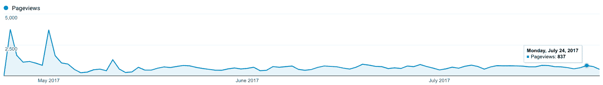

Blog traffic on a single article

### 选择加入表格

将选择加入表单添加到所有内容中。人们不会花时间去搜索“订阅”按钮。把它带给他们。Unbounce 发现[点击弹出窗口的表现比退出弹出窗口的表现好 1147%。](https://unbounce.com/product-marketing/two-step-opt-in-forms/)

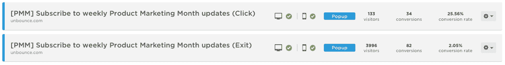

Opt-in forms

如果你不想做弹出窗口，你可以像我们在 Kinsta 做的那样，在读者滚动 75%后，在每篇文章的底部添加一个幻灯片(如下所示)。这是一个有点不显眼，但仍然非常有效！查看一些你可以使用的不同的[销售线索生成插件](https://kinsta.com/blog/wordpress-lead-generation/)。

Bloom opt-in

### 社会化媒体

充分利用社交媒体。通过加入时事通讯的链接来优化你的简历，考虑做一个链接内容的广告，在你的社交平台上发布内容。Nathalie Lussier [通过她的第一次 Twitter 聊天和电子邮件营销挑战，她的电子邮件列表增加了 3000 名订户。](https://adquadrant.com/6-ways-to-generate-quality-leads-on-social-media/)

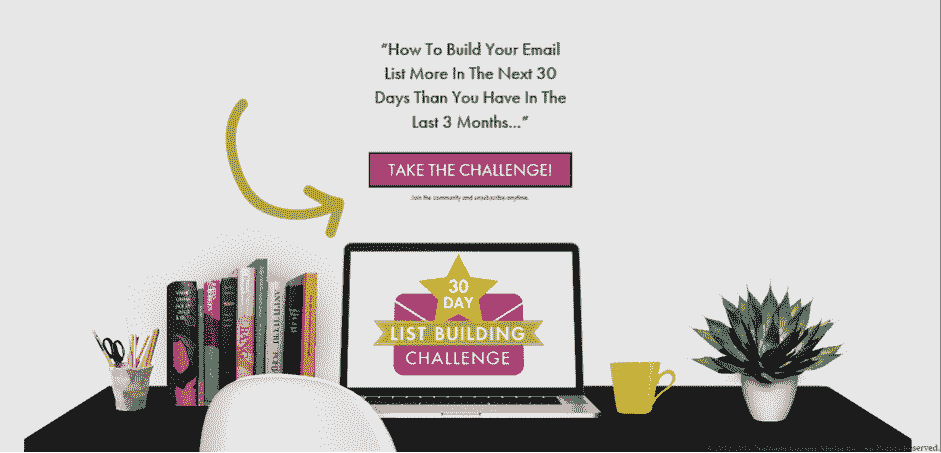

List building challenge

在本帖中，我们分享了关于列表构建的额外技巧:[如何快速有效地构建电子邮件列表](https://kinsta.com/blog/how-to-build-an-email-list/)(行之有效的策略)

一旦你建立了一个庞大的联系人名单，你应该怎么做呢？

## 2.选择正确的自动化平台

[75%的电子邮件收入](https://www.smartinsights.com/lead-generation/marketing-automation/4-automated-email-campaigns-every-online-retailer-send-2017/)来自自动化的电子邮件活动。有道理，对吧？

随着你的名单越来越多，你不能像一只疯狂的仓鼠一样在无尽的手动电子邮件的轮子上奔跑。如果你想扩展，你需要自动化。72%的营销人员认为自动化有利于他们的组织战略，78%的营销人员认为营销自动化的好处直接增加了收入。

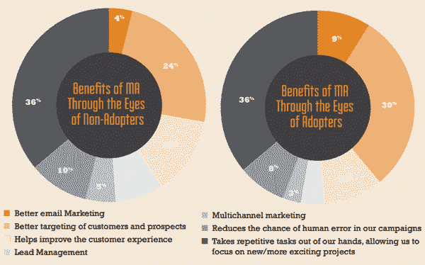

Benefits of marketing automation (Image source: [Redeye and TFM&A Insights](https://tfmainsights.com/marketing-automation-survey-2014/))

那么，如何让自动化发挥作用呢？首先，当你获得一个新客户或订户时，确保在最初的 24 小时内向他们发送一封欢迎邮件。值得你花时间。欢迎邮件[比其他促销邮件](https://blog.ometria.com/welcome-email-customer-lifecycle-marketing)平均多产生 320%的收入。

仅通过优化欢迎邮件，Domino 的打开率就提高了 11%，而**的点击率提高了 23%** 。

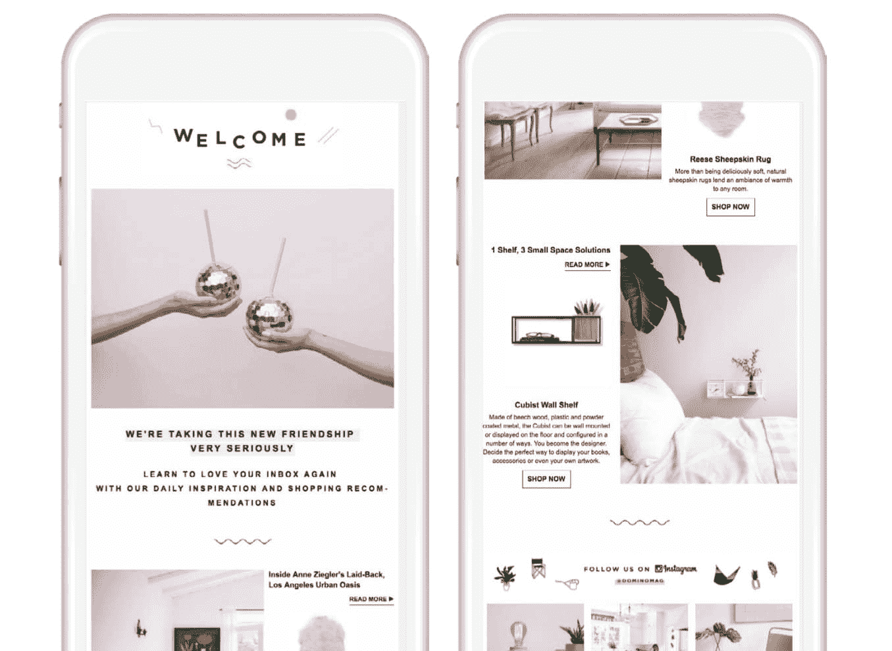

Case study with welcome emails

第二，考虑将较长的电子邮件分解成点滴活动。与非自动化、一次性发送的电子邮件相比，滴滴营销活动的打开率[高出](https://www.pinpointe.com/blog/do-drip-campaigns-really-work)80%，滴滴营销活动电子邮件的平均点击率[高出](https://www.marketingtechblog.com/email-drip-campaign/)三倍。索尼看到[的点击率增长了 157%](https://www.postup.com/sony-welcome-campaign-delivers-welcome-results/),他们向索尼奖励忠诚俱乐部成员发起了滴滴运动。

索尼并不孤单。许多企业利用自动化实现了飞速发展。美食家调味糖浆品牌 Monin 使用[电子邮件自动化将他们的客户](https://www.marketingsherpa.com/article/case-study/Monin-relevant-email-marketing-automation)划分为 B2C 和 [B2B](https://kinsta.com/blog/b2b-lead-generation/) ，因为他们需要[不同的营销活动](https://kinsta.com/blog/b2b-vs-b2c/)。成功了。莫宁母亲节的自动化电子邮件活动在一个月内推动了近 40%的电子邮件收入。这比上一年增长了 20%。

在客户购买了他们的一辆固定自行车或下载了应用程序后，Peloton [会立即发送欢迎电子邮件](https://reallygoodemails.com/inaugural/welcome/peloton-welcome-to-the-peloton-app/)。

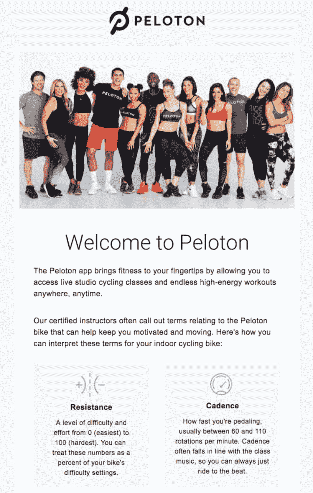

Welcome email example

Peloton 的会员体验 SVP 布拉德·奥尔森(Brad Olson)向 true ventures 讲述了他们如何通过入职邮件培养情感忠诚度。

> 毫不奇怪，在我们的欢迎系列开始时，Peloton onboarding 电子邮件的打开率最高。为了利用这种最初的兴趣激增，我们改变了前两封电子邮件，以鼓励那些与长期参与和保留最相关的行为(例如，加入我们的脸书社区和安装 Peloton iOS 应用程序)。–[布拉德·奥尔森](https://www.pscp.tv/trueventures/1yoKMBVyLqlGQ)

不确定选择哪个邮件营销平台？查看此[列表中的一些建议](https://kinsta.com/blog/email-marketing-software/)。我们是 Kinsta 的 MailChimp 的超级粉丝[，但是我们也为你收集了](https://kinsta.com/blog/how-to-use-mailchimp/)[22 个 MailChimp 替代品](https://kinsta.com/blog/mailchimp-alternatives/)。

既然您已经知道了何时以及如何自动化您的营销活动，那么是时候考虑内容了。

## 3.保持你的信息简洁明了

几乎一半的消费者表示他们收到了太多的电子邮件。想想你自己的收件箱。每天从几十封邮件中筛选出你想要的信息是一场持续的斗争，对吗？

而博客帖子和在线文章可以不受[更高字数](https://kinsta.com/blog/content-length/)的影响。你的电子邮件读者不想读迷你小说。他们想让你直奔主题。以 Postmates 为例。在简短的介绍之后，他们直接给读者带来好处，接着是清晰的行动号召。

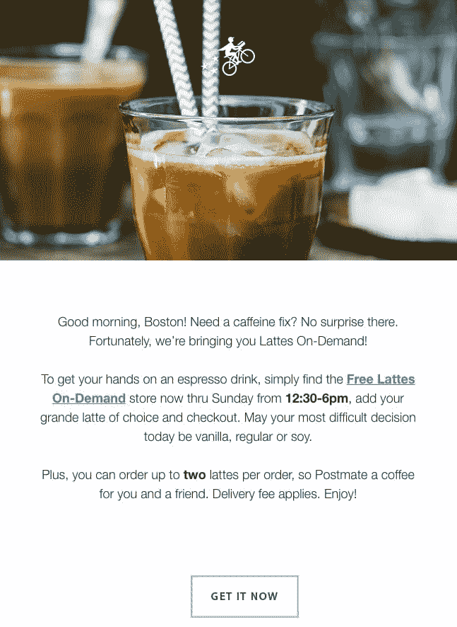

Brief email example (Image source: [Hubspot](https://blog.hubspot.com/blog/tabid/6307/bid/32606/The-9-Must-Have-Components-of-Compelling-Email-Copy.aspx#sm.0000o5c3iom8gdkipdw2l236rj19q))

Postmates [的首席产品经理 Tanner McGrath 告诉 eMarketer](https://www.emarketer.com/Article/How-Postmates-Optimizes-Campaigns-on-Fly-with-Real-Time-Data/1016090) :

> 这不仅仅是查看哪封邮件的打开率最高，还包括确定哪封邮件能让客户采取特定的行动。

如果你认为简洁不重要，那么请记住普通成年人的注意力持续时间不到八秒钟。那么邮件长度的最佳点是什么呢？虽然这不是一个放之四海而皆准的标准，但 Boomerang 最近的一项研究发现，字数不超过 125 个字的营销电子邮件的[回复率约为 50%](http://blog.boomerangapp.com/2016/02/7-tips-for-getting-more-responses-to-your-emails-with-data/) (远高于平均水平)。

看看 Evernote 的这个例子。它简短、甜蜜，并且有明确的行动号召。读者可以在几秒钟内消化信息和 CTA。

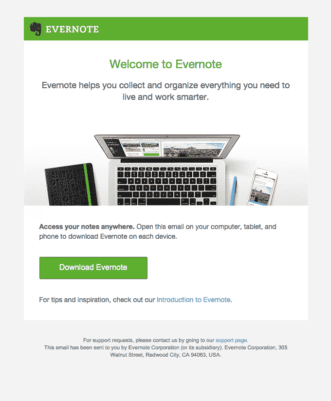

Brief email example (Image source: [Really Good Emails](https://reallygoodemails.com/inaugural/welcome/get-started-with-evernote/))

Paypal 在使用图像而不是文字来唤起行动方面也做得很好。例如，这封电子邮件包含不到 40 个单词，但传达了使用 Paypal 的简单性，以获得轻松的结账体验。

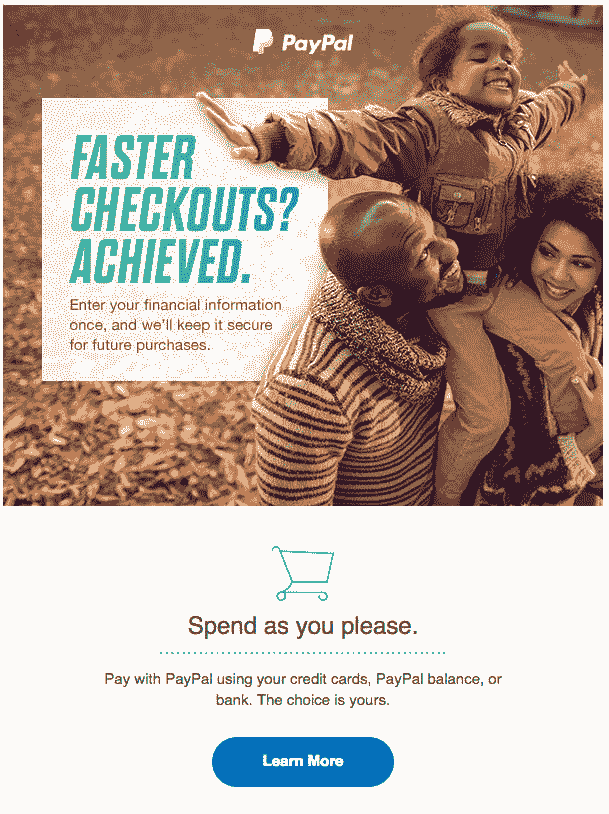

Brief email example (Image source: [AWeber](https://blog.aweber.com/email-marketing/5-tactics-for-short-emails-that-pack-a-punch.htm))

一旦你把你的内容精简了，是时候引起读者的注意了。

## 4.精心设计完美的主题

如果你把主题搞错了，内容就不重要了。你永远也不会错过观众收件箱里的预览。47%的读者仅根据主题来决定是否打开邮件。

那么，你如何吸引你的读者打开你的信息呢？一种方法是实践[“利益、逻辑或威胁”](http://www.addthis.com/academy/best-practices-for-email-subject-lines-2018/)方法，简单地提供一个明显的利益，一个“常识”陈述或“不要错过”类型的内容。

例如,《孤独星球》提供了一个独特的“福利”,标题是“周五前所有商品买一送一”。读者可以通过点击电子邮件获得销售信息。

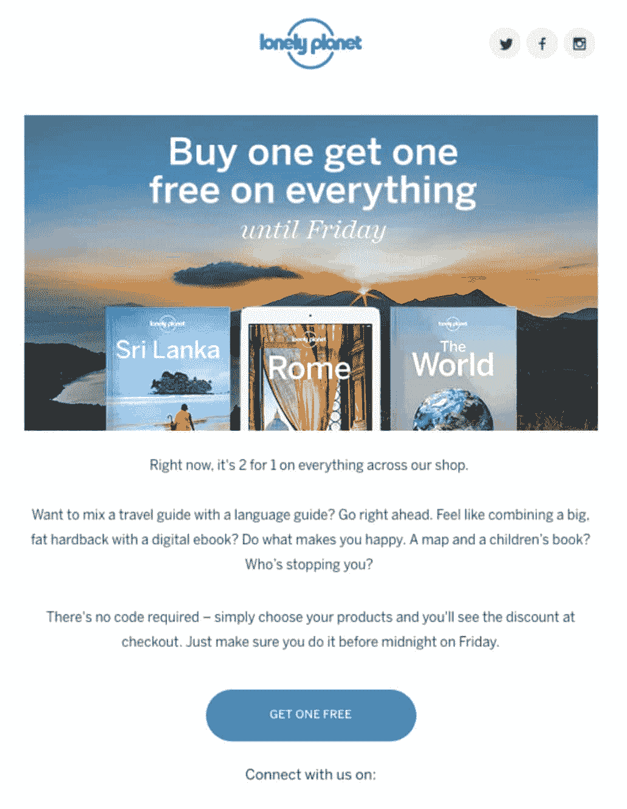

Email subject line example (Image source: [Really Good Emails](https://reallygoodemails.com/promotional/product-sale/our-2-for-1-sale-ends-friday/))

作为“逻辑”的一个例子，看看这封来自 Barkbox 的邮件。他们的成员显然热爱他们的宠物，逻辑上非常有可能庆祝他们的生日。主题行“给你的四月酒吧添加一个生日小馅饼”对核心酒吧观众来说是一个合乎逻辑的诉求。

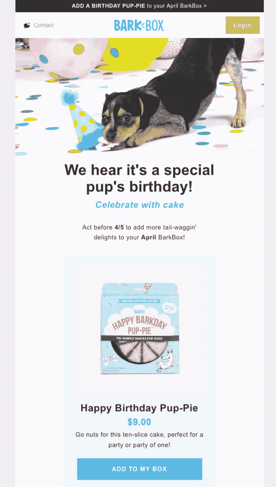

Email subject line example (Image source: [Really Good Emails](https://reallygoodemails.com/industry/pets/barkbox-birthday-barkbox/))

“威胁”的例子是什么看看 SXSW 发来的这封邮件。在这种情况下，威胁是害怕错过注册截止日期。这种主题的目的是让你的读者产生紧迫感。

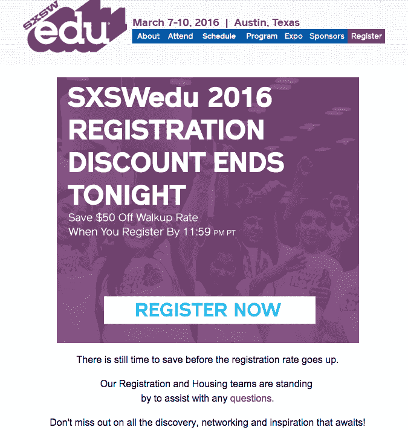

Email urgency (Image source: [Campaign Monitor](https://www.campaignmonitor.com/blog/email-marketing/2016/03/how-to-create-sense-urgency-in-emails/))

一旦你确定了你的“钩子”，确保它是一个短钩子。Invesp 的研究显示,**的读者更喜欢简短、个性化的主题。[语法上](https://kinsta.com/blog/grammar-checker-tools/#grammarly)用他们的“个性化福利”方法很好地做到了这一点。它简明扼要，提供了有用的提示。别忘了在发送之前校对你所有的邮件。**

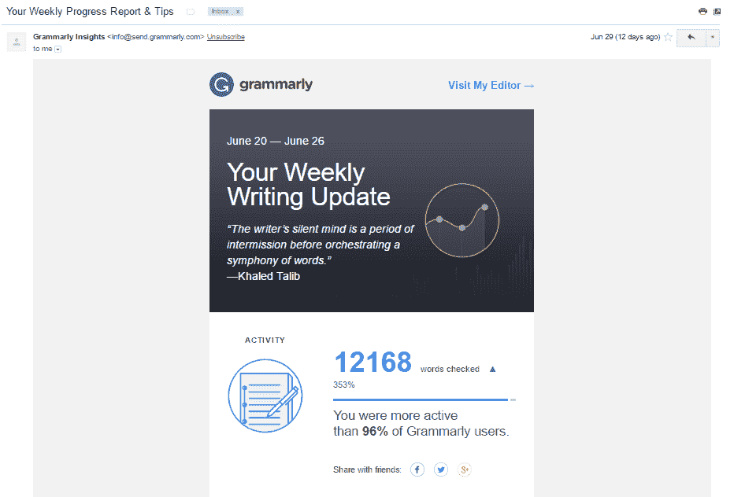

Personalized benefit email (Image source: [Instapage](https://instapage.com/blog/email-subject-lines))

现在你的主题行是一件艺术品，你的读者迫不及待地打开你的邮件——接下来呢？

## 5.吸引你的观众

我们已经讨论了简洁的重要性。不过，这不应该以牺牲观众参与度为代价。虽然营销人员说，更高的参与度是他们电子邮件营销的首要任务，但他们也承认，参与并不是一件容易的事情。

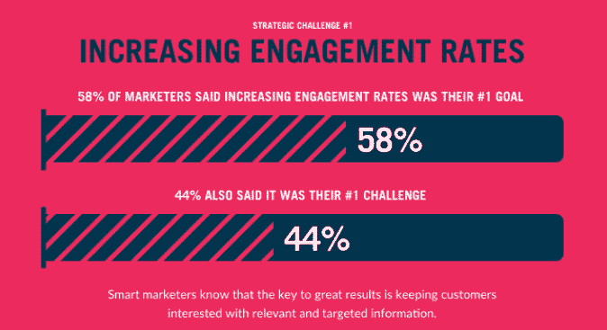

Challenges increasing engagement rates (Image source: [Campaign Monitor](https://www.campaignmonitor.com/blog/email-marketing/2017/01/insanely-effective-tactics-engage-email-subscribers/))

你如何确保你的读者在关注？在他们看完你的邮件后，给他们一个与你互动的理由。

## 注册订阅时事通讯

### 想知道我们是怎么让流量增长超过 1000%的吗？

加入 20，000 多名获得我们每周时事通讯和内部消息的人的行列吧！

[Subscribe Now](#newsletter)

例如，你可以试着问他们一些问题。一旦有人提问，人类的大脑就会有回答问题的欲望。即使你没有要求一个直接的答案，一个恰当的问题也会让你的品牌在你的读者心中扎根。

其次，链接相关内容。它能让你的读者关注你的品牌。Pardot 提供了一个简单的工具来帮助衡量你的电子邮件内容的参与度，看看你是否击中了目标或者让读者感到厌烦和困惑。

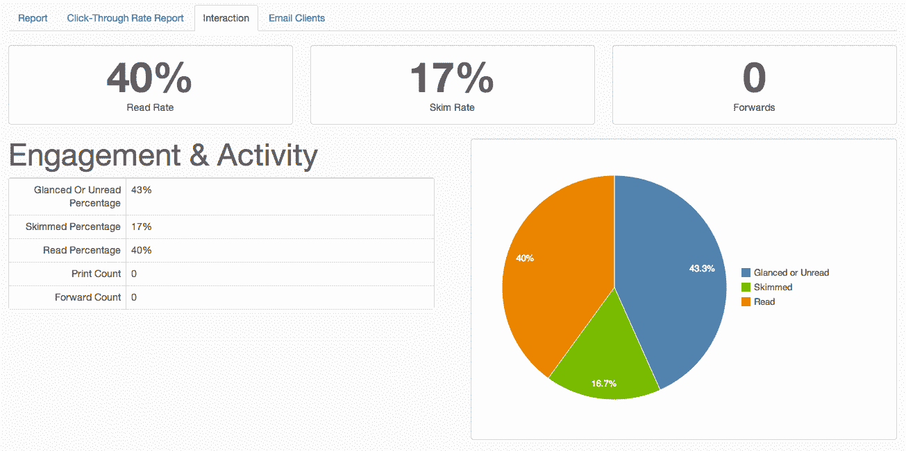

Pardot email engagement (Image source: [NewsCred](https://insights.newscred.com/5-crucial-steps-to-boost-email-engagement-drive-business-results/))

组织在参与策略上变得越来越有创意。吊床公司的营销团队进行了一项实验，通过时事通讯邮件来提高参与度。

他们对邮件进行了删减，将邮件重新组织成“创意邮件”而不是时事通讯，并“调侃”更深层次的内容，而不是一次全部扔掉。

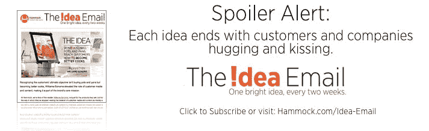

Tease email (Image source: The Daily Egg)

成功了。他们发现新格式的开放率增加了 48%。既然你已经在和你的观众互动，他们也在回应你，是时候扩大你的影响范围了。

## 6.将社交分享添加到您的电子邮件中

让你的听众容易分享你的信息，否则——他们不会。有社交分享按钮的电子邮件的点击率比没有按钮的高出 158%。

当你考虑设计时，要非常清楚你的社交分享按钮实际上在分享什么。我们都点击过“分享”图标，却发现它链接到了我们刚刚阅读的内容之外的内容。看看这个来自 Salesforce 的例子。社交分享按钮清楚地说明了分享的内容和平台。

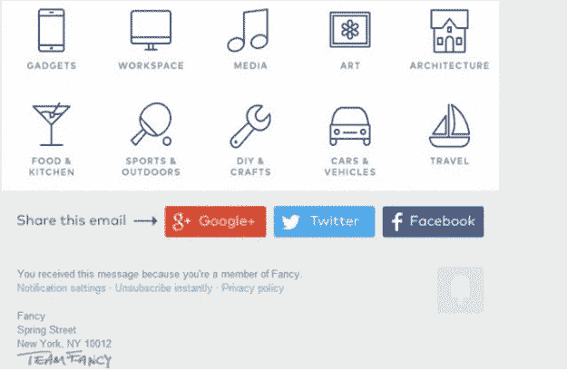

Email sharing buttons (Image source: [Salesforce](https://www.salesforce.com/blog/2017/02/use-social-media-creatively-email.html))

80%的营销人员说他们的社交媒体分享努力[增加了网络流量](https://kinsta.com/blog/how-to-drive-traffic-to-your-website/)。这是一个简单的添加到你的电子邮件中的方法，可以为你的读者和你的底线增加价值。看看这封来自 Ballard's(一家欧洲设计店)的邮件。

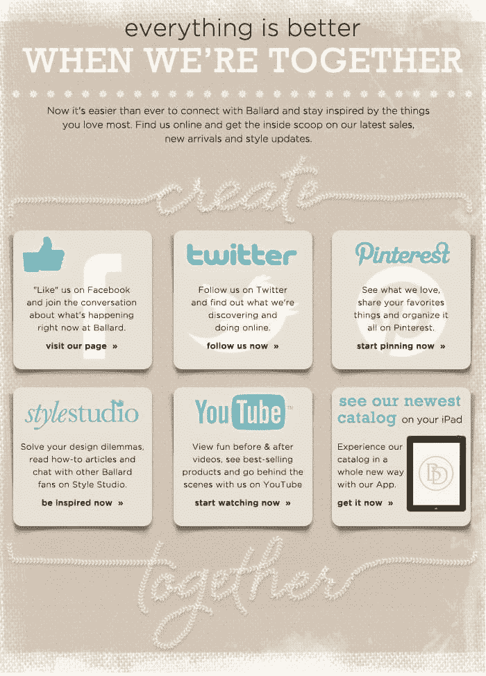

Social sharing in emails (Image source: [Betaout](https://www.betaout.com/learn/best-email-marketing-campaigns-with-social-media-integration/))

每个盒子都有一个干净、简单的设计，清楚地列出了每个社交分享平台的好处。你也可以考虑在你的博客上添加插件，进一步让你在你的网站和你的社交平台之间轻松分享内容。

说到清晰，你有没有问过你的读者，在他们读了你的邮件后，你希望他们采取什么行动？

## 7.包括强烈呼吁采取行动

如果你不告诉你的读者你想要什么，他们永远不会知道。每封电子邮件都需要强烈、清晰的行动号召(CTA)。研究表明，CTA 可以让你的点击率[提高 370%](https://www.protocol80.com/blog/16-kick-ass-call-to-action-statistics-that-prove-ctas-are-essential) 。

电子邮件营销非常适合个性化 CTA(或一些人所说的“智能 CTA”)。事实上，HubSpot 发现，针对用户兴趣的 CTA 比普通 CTA 多带来了 202%的潜在客户。

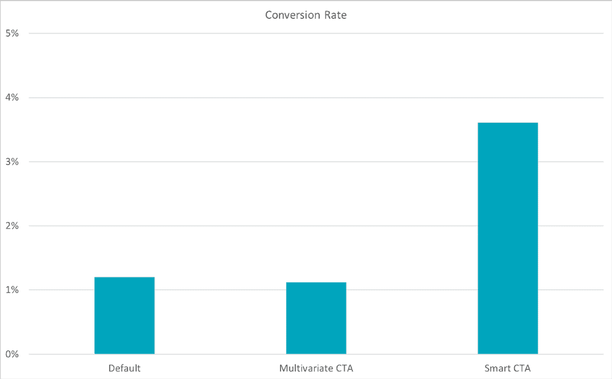

Generic CTAs vs Smart CTAs (Image source: [HubSpot](https://blog.hubspot.com/marketing/personalized-calls-to-action-convert-better-data))

CTA 有许多不同的形式和风格。为了纪念其 20 周年，航空公司 easyJet 发出了一封电子邮件，用温暖的语调补充了该品牌标志性的橙色。CTA 讲述一个故事来引导读者继续他们的冒险。

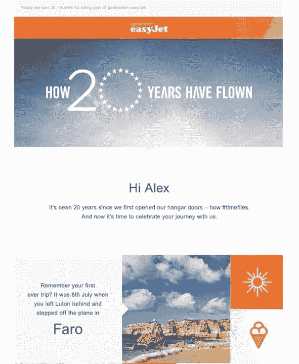

CTA email (Image source: [CampaignLive](https://www.campaignlive.com/article/easyjet-transformed-customer-data-emotional-anniversary-stories/1419814?DCMP=EMC-CONCreativeNewsletter&bulletin=campaign-us-creativity&utm_medium=EMAIL&utm_campaign=eNews%20Bulletin&utm_source=20170107&utm_content=www_campaignlive_com_arti_12))

在发送的 12，473，608 封独特的电子邮件中，打开率“比 easyJet 时事通讯的平均水平高出 100%以上，点击率高出 25%……[并且]在所有市场中，收到完全个性化版本的 easyJet 客户中有 7.5%在接下来的 30 天内进行了预订。”

Struggling with downtime and WordPress problems? Kinsta is the hosting solution designed to save you time! [Check out our features](https://kinsta.com/features/)

通过运行一些[简单的 A/B 测试](https://blog.mailup.com/2017/09/ab-test-cta/)，尝试一下按钮的样式和颜色，看看你的受众更喜欢什么。

当你获得了受众参与度，并开始从你的 CTA 中看到更多的转化后，是时候考虑多长时间接触一次你的订户列表了。

## 8.不要压倒你的订户

电子邮件营销难题中最具挑战性的一块是知道多久联系一次你的订户。接触太多，他们退订；太少，他们会对你的品牌失去兴趣。这也可能取决于你实际上能分享多少新内容。

大多数消费者更喜欢每月至少收到一封促销邮件， [15%的消费者](https://www.entrepreneur.com/article/294162)表示他们不会因为每天收到一封邮件而感到烦恼。甜蜜点可能在中间的某个地方，但要靠你自己去找到它。它因行业、受众和内容而异。我们每周在金斯塔发一次时事通讯。

您需要在每次活动后监控退订率，并相应调整发送频率。知道你的听众多久想听你一次的一个方法是简单地问他们。

以 730DC 为例。总部设在华盛顿 DC 的志愿者组织知道，他们的观众希望经常更新活动和志愿者机会。因此，他们每天发送一份时事通讯。他们还研究了一天中的最佳时间，以确保他们的信息被目标受众看到。

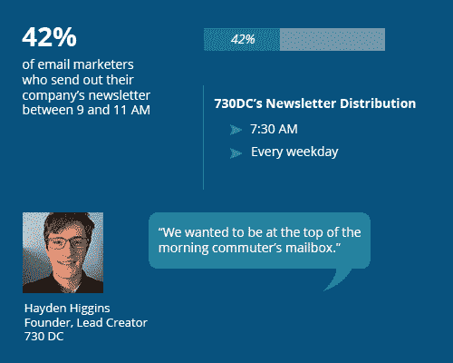

Daily newsletter (Image source: [Clutch](https://clutch.co/marketing/email/resources/email-marketing-survey-2016-case-studies))

还不确定多久发一次电子邮件？Peldon Rose 的营销主管 Benjamin Murray 给出了以下建议:

> **质量胜于数量**——电子邮件可能具有成本效益，但这不是不为目标受众提供高质量内容的借口。

你还应该通过[启用联系人首选项](https://explore.reallygoodemails.com/7-really-good-unsubscribe-pages-preference-centers-dbf7e838aea5)来让你的订户选择他们收到你邮件的频率，这只是你的订户告诉你多久给他们发一次电子邮件的一种方式。

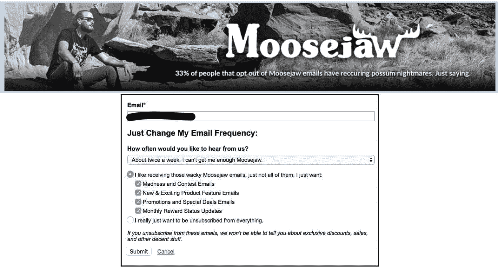

Email frequency (Image source:

这增加了他们关注你的内容的可能性，如果他们能控制自己收到的邮件数量，他们就不太可能点击“退订”。

## 9.避免垃圾邮件陷阱

2003 年，联邦贸易委员会通过了[控制非请求色情和营销(CAN-SPAM)](https://blog.hubspot.com/marketing/what-is-can-spam-ht) 规则。事实上，营销人员被纳入了一项保护公民免受不请自来的色情信息侵害的法律，这应该告诉你人们对收到垃圾邮件有多严重。😮

FTC 网站详细描述了[规则](https://www.ftc.gov/tips-advice/business-center/guidance/can-spam-act-compliance-guide-business)，值得一读，以确保你保持合规，但这里有一些最简单的经验法则，将帮助你[避免被归类为垃圾邮件发送者](https://kinsta.com/blog/why-are-my-emails-going-to-spam/):

*   不要全部使用大写字母
*   避免感叹号字符串(！！！)
*   不要购买电子邮件列表
*   不要在你的邮件中嵌入表格(改为链接)
*   不要在营销邮件中添加附件
*   避免垃圾邮件触发词(免费、保证、无义务等。)
*   远离红色字体
*   使用拼写检查
*   不要在你的邮件中塞满关键词
*   不要忘记给读者退订的选择
*   避免在您的[电子邮件签名](https://kinsta.com/blog/email-signature/)中包含可能被标记为垃圾邮件的网站链接

每有 1250 万封电子邮件被标记为垃圾邮件，只有一个人回复。谈论一个糟糕的投资回报率。不值得你浪费时间或冒险。如果你想确定你遵守了，使用像 [GlockApps](https://glockapps.com/spam-testing/) 这样的工具通过垃圾邮件检查器运行你的内容。

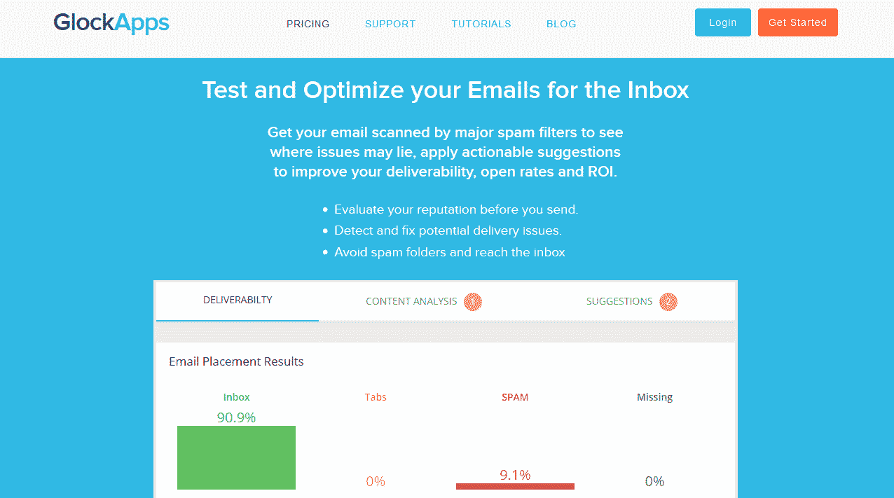

Test email for spam

没有什么比精心制作一封邮件，却发现它直接进入了你的听众的垃圾邮件文件夹更糟糕的了。

你还应该通过添加 DKIM 和 [SPF 记录](https://kinsta.com/knowledgebase/spf-record/)来验证你的电子邮件。查看我们关于[如何认证你的电子邮件](https://kinsta.com/blog/email-authentication/)的深入教程。

## 10.不要忘记移动优化

[移动流量在 2016 年超过了桌面流量](https://kinsta.com/blog/google-mobile-first-index/)，而且这一趋势并没有放缓。电子邮件营销顾问 [Jordie van Rijn 建议营销人员](https://www.emailmonday.com/best-email-marketing-quotes/):

> 像你绝对正确一样设计，然后像你从一开始就错了一样优化。

简而言之:当你考虑电子邮件设计时，确保你为你的移动用户进行了优化。消费者[更喜欢从移动网站或应用程序购买](https://www.emarketer.com/Article/Buying-with-Smartphones-US-Consumers-Like-Apps-Mobile-Web-Just-About-Equally/1015141)。此外，作为零售商，你应该提供移动友好的体验，推动消费者的购买漏斗。

未能优化电子邮件和手机登录页面的零售商可能会永久地赶走潜在买家。[高达 75%的电子邮件](https://emailmonks.com/blog/email-marketing/email-marketing-statistics/)是在移动设备上打开的， [57%的用户](https://www.socpub.com/articles/the-5-mobile-marketing-mistakes-infographic-14849)说他们不会推荐一个移动体验不佳的品牌——更不用说从他们那里购买了。

还需要证明吗？Boxed 每周向用户发送交易电子邮件。他们看到[通过将深度链接整合到他们的移动应用程序，购买](https://www2.branch.io/rs/315-FTT-1img/CS-Boxed.pdf)的转化率提高了 133%。

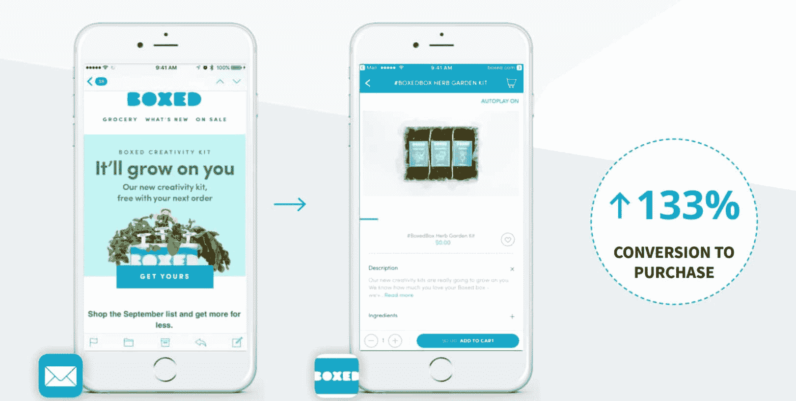

Deep links in mobile emails

那么，如何确保出色的移动电子邮件体验呢？需要考虑的几件事:减小图像尺寸以防止缓慢的加载时间。一些电子邮件渠道(如 Outlook)会阻止渲染图像。使用类似于 [TinyPNG](https://tinypng.com/) 的工具将图片压缩到 100 张，这样你就不会卡在垃圾邮件文件夹里了。

其次，增加电子邮件中链接和按钮的大小，这样读者可以在第一次尝试时轻松选择他们想要的。有趣的事实:[根据麻省理工学院的一项研究](http://touchlab.mit.edu/publications/2003_009.pdf)，一个成年人的食指平均为 1.6-2 厘米，这相当于移动设备上大约 45-57 个像素。不要给移动用户可怕的“香肠手指”情结。让他们很容易点击他们想要的东西。

最后，不要忘记包含一个[纯文本](https://support.e2ma.net/Resource_Center/Account_how-to/reviewing-and-editing-your-plaintext)版本。即使你已经为漂亮的 HTML 设计付出了努力，一些读者还是喜欢阅读纯文本。如果你仍然不确定你的内容是否能无缝地转移到手机上，可以使用像 Acid 上的[电子邮件这样的工具。](https://www.emailonacid.com/email-testing/)

在你设计、移动优化并启动了你的第一个活动之后，不要忘记看看它对你来说有多难。

## 11.测试、测量和重复

我们都听说过这样一句格言:“没有被测量的东西是不会被改进的。”电子邮件营销也不例外。如果没有明确的度量标准和持续的跟踪，您的结果最终会停滞不前，您会不知道哪里出了问题。如果你的电子邮件平台有内置的 A/B 测试，现在大多数都有，这是一个很好的开始，看看什么最能引起你的受众的共鸣。

在 2012 年的竞选中，巴拉克·奥巴马筹集了超过 6 . 9 亿美元的捐款，部分原因是他坚持通过电子邮件进行 A/B 测试。

你可以使用 [UTM 标签](https://blog.kissmetrics.com/utm-parameters-video/)在[谷歌分析](https://kinsta.com/blog/how-to-use-google-analytics/)中跟踪电子邮件指标。要查看您的活动，请前往收购>活动。许多电子邮件营销工具也有能力为你自动添加 UTM 标签。

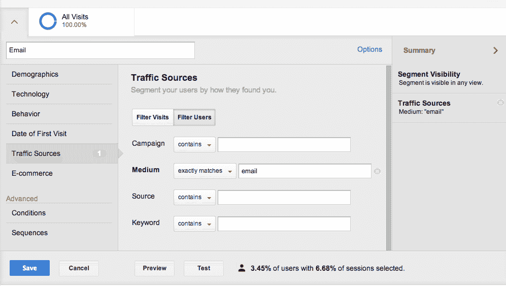

Traffic sources email (Image source: [Smart Insights](https://www.smartinsights.com/email-marketing/email-marketing-analytics/email-campaign-tracking-with-google-analytics/))

无论你选择什么度量标准，都不要只做一次。在你对你的策略进行调整后，停下来再次衡量。电子邮件营销策略应该不断发展。

## 摘要

全球有近 30 亿电子邮件用户，每天筛选近 3000 亿封电子邮件。凭借 122%的平均投资回报率，电子邮件营销仍然是营销团队可用的最智能、最具成本效益的工具之一。

但是，如果普通消费者每天收到 70 多封电子邮件，营销人员就必须发挥创造力，消除收件箱的噪音。电子邮件营销不是一个失败的事业。这是一个创造性的草根营销的机会，它首先吸引了许多人进入营销领域。

危险在于自满——年复一年简单地推出千篇一律的电子邮件，而没有衡量成功或规划增长。正如整体电子邮件营销的创始人 Kath Pay 所说:

> 邮件是一个推送渠道，所以我们需要推它更努力。

仔细考虑你的电子邮件设计和字体，包括清晰的行动号召，坚持不懈地测试和改进你的活动。如果你遵循这些和其他经过验证的最佳实践，电子邮件营销几乎肯定会提高你的订阅率和转化率。

* * *

让你所有的[应用程序](https://kinsta.com/application-hosting/)、[数据库](https://kinsta.com/database-hosting/)和 [WordPress 网站](https://kinsta.com/wordpress-hosting/)在线并在一个屋檐下。我们功能丰富的高性能云平台包括:

*   在 MyKinsta 仪表盘中轻松设置和管理
*   24/7 专家支持
*   最好的谷歌云平台硬件和网络，由 Kubernetes 提供最大的可扩展性
*   面向速度和安全性的企业级 Cloudflare 集成
*   全球受众覆盖全球多达 35 个数据中心和 275 多个 pop

在第一个月使用托管的[应用程序或托管](https://kinsta.com/application-hosting/)的[数据库，您可以享受 20 美元的优惠，亲自测试一下。探索我们的](https://kinsta.com/database-hosting/)[计划](https://kinsta.com/plans/)或[与销售人员交谈](https://kinsta.com/contact-us/)以找到最适合您的方式。