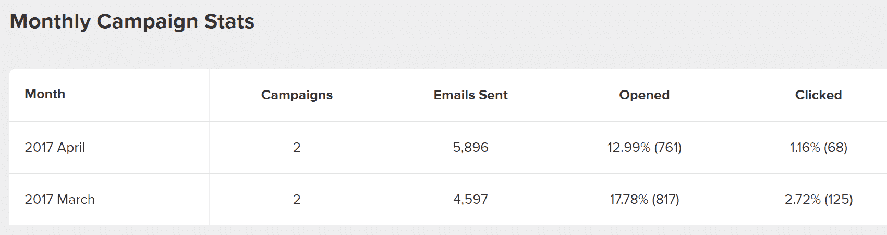
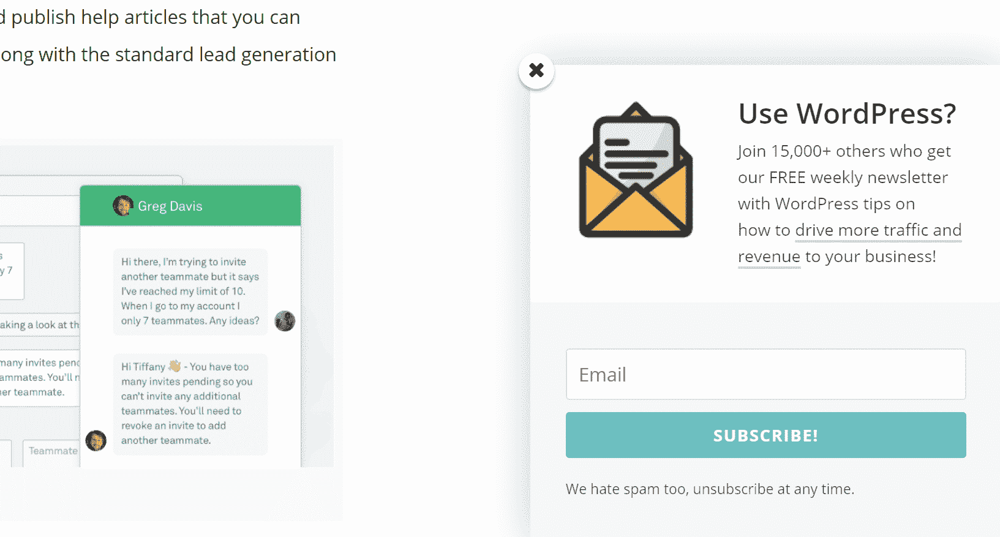
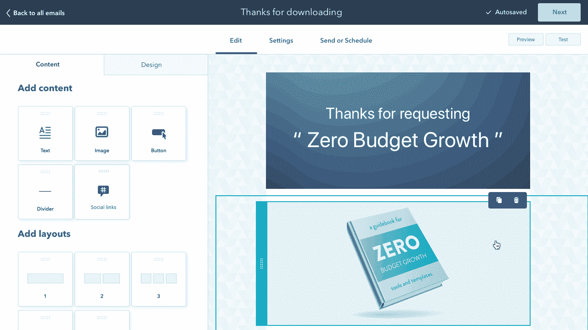
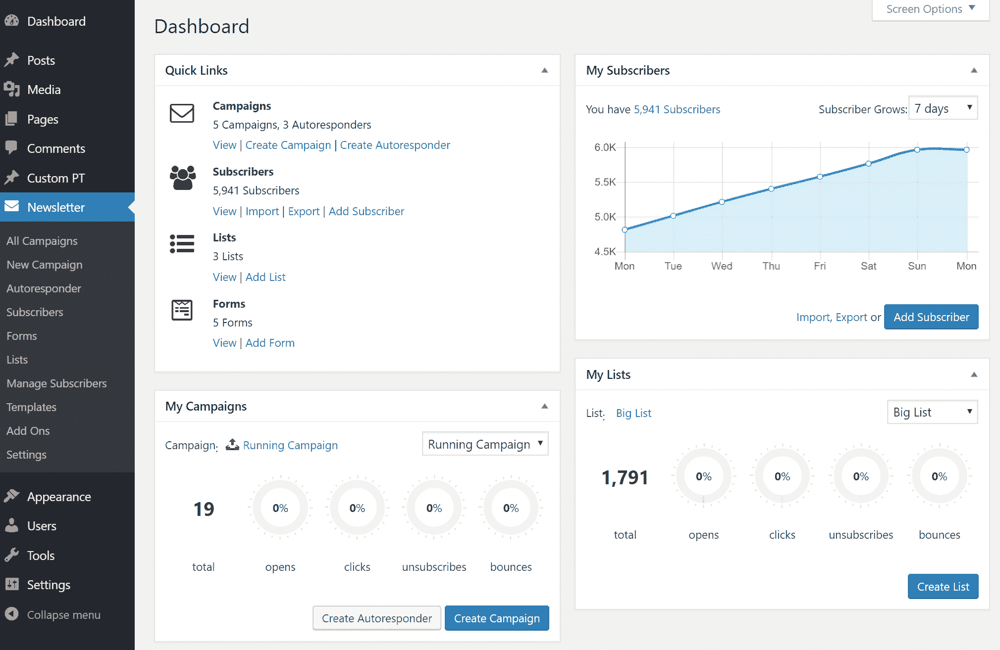
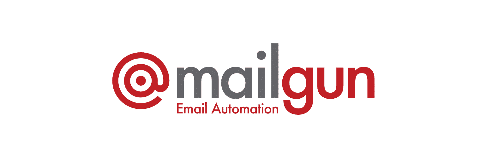

# 电子邮件营销软件推荐(为什么不用你的主机)

> 原文：<https://kinsta.com/blog/email-marketing-software/>

大多数[应用](https://kinsta.com/application-hosting/)、[数据库](https://kinsta.com/database-hosting/)和[管理的 WordPress 主机](https://kinsta.com/wordpress-hosting/)，包括 Kinsta，允许通过他们自己的服务器发送一些基本的出站邮件。这对于一些电子邮件(比如密码重置)和让你的网站正常运行来说是非常好的。

然而，现在有很多新的第三方插件冒出来，将 WordPress 变成一个成熟的电子邮件营销解决方案，定期发送成千上万封电子邮件。虽然插件本身没有问题，但是插件发送电子邮件的配置经常被忽略。事实上，如果设置不正确，可能会损害您的活动绩效，甚至影响您点击客户收件箱的能力。

通常，托管服务器并不意味着也是电子邮件服务器。因此，如果您正在[发送简讯](https://kinsta.com/blog/newsletter-examples/)或群发电子邮件，我们总是建议您使用以下方法来获得最佳效果:

*   使用不属于 WordPress 的第三方专业电子邮件营销软件
*   使用一个**交易电子邮件服务提供商** (HTTP API 或 SMTP)以及你的 WordPress 时事通讯插件

我们将深入下面的原因，并分享我们的电子邮件营销软件的建议。

## 使用主机邮件服务器的缺点

电子邮件在您的工作流程中扮演着非常重要的角色，因为它是让您和您的客户了解您的网站和业务情况的主要媒介。因此，拥有一个可以依赖的系统非常重要！以下是一个网站可能每天发出的电子邮件的几个例子:

*   通知新的 WordPress 用户登录的帐号和位置
*   密码重置和更改通知
*   您博客上的新评论通知
*   启用了 Pingbacks 和 trackbacks
*   在 [WooCommerce](https://kinsta.com/blog/woocommerce-tutorial/) 或 Easy Digital Downloads 中发布新的电子商务销售通知
*   引导和联系来自插件的表单提交，如[重力表单或 WPForms](https://kinsta.com/blog/wordpress-contact-form-plugins/)
*   来自插件的安全通知，如 WP 安全审计日志或 WordFence
*   如果在 WordPress 中使用插件，用电子邮件发送时事通讯
*   新功能发布
*   与附属公司的沟通

如果你仔细想想，会发现发生了很多事情！尤其是在较大的网站上，因为每隔几秒钟就会有电子邮件发出。如果你不使用专业的电子邮件营销软件或交易电子邮件服务提供商，你一定会遇到以下问题，这些问题可能会真正损害你的网站和活动的成功:

### 1.你不会总是呆在地窖里

思考电子邮件如何与典型主机一起工作的一个好方法是**它就像共享主机**。您被绑定到您的主机为外发电子邮件配置的 [IP 地址](https://kinsta.com/tools/what-is-my-ip/what-is-my-ip/)。如果出现问题，比如客户端突然发送垃圾邮件，该 IP 地址就有可能被列入垃圾邮件黑名单。然后，你突然只能任其摆布，等待你的主机与提供商或 ISP 解决问题。这可能会导致你的电子邮件不稳定的发送和等待时间，这绝不是一件好事。

> Kinsta 把我宠坏了，所以我现在要求每个供应商都提供这样的服务。我们还试图通过我们的 SaaS 工具支持达到这一水平。
> 
> <footer class="wp-block-kinsta-client-quote__footer">
> 
> 
> 
> <cite class="wp-block-kinsta-client-quote__cite">Suganthan Mohanadasan from @Suganthanmn</cite></footer>

[View plans](https://kinsta.com/plans/)

当谈到 [WordPress hosting](https://kinsta.com/wordpress-hosting/) 时，你在 Kinsta 这里不必担心，因为我们平台上的每个网站都运行在一个隔离的软件容器中，该容器包含运行网站所需的所有软件资源(Linux、 [NGINX](https://kinsta.com/knowledgebase/what-is-nginx/) 、 [PHP](https://kinsta.com/knowledgebase/what-is-php/) 、MySQL)。这意味着运行每个站点的软件是 100%私有的，不会被共享，即使是在你自己的站点之间。对于密码重置和评论通知等重要电子邮件，我们依靠第三方 SMTP 提供商来确保高送达率。但是对于营销相关的电子邮件和批量发送，我们强烈建议使用可信的第三方解决方案。

### 2.电子邮件可送达性问题

依靠你的主机收发邮件的最大缺点之一就是邮件送达的问题。根据 ReturnPath 的[电子邮件送达率基准报告](https://returnpath.com/wp-content/uploads/2015/10/2015-Deliverability-Benchmark-Report.pdf) , **21%的选择加入电子邮件从未到达收件箱**。能否到达客户的收件箱取决于多种因素，包括 ISP、退回率、MTA、发件人的原始 IP 地址等。第三方电子邮件营销软件平台和交易电子邮件服务的设置和配置方式可以**极大地增加你点击客户收件箱**的几率。他们还让整个团队夜以继日地工作，以确保他们的电子邮件到达目的地，并且他们的 IP 地址不会被列入黑名单。

这里还有一些他们做的事情的例子:

*   确保他们在白名单和反馈循环中
*   利用数百个 IP 地址和不同的数据中心
*   分析跳出率以保持列表干净
*   滥用监控和知识产权声誉
*   有能力给你提供一个[专用 IP](https://kinsta.com/blog/dedicated-ip-address/)

### 3.并非总能设置电子邮件认证(DMARC)

电子邮件认证也称为域认证或验证( [DMARC](https://kinsta.com/knowledgebase/dmarc-fail/) )，指的是更好地识别发送源或域的过程，以便 ISP 可以更好地路由您的电子邮件。如果电子邮件看似来自一个域，但实际上是从另一个域发送的，这是一种帮助防止欺骗和网络钓鱼欺诈的伟大技术。换句话说，电子邮件认证允许您的电子邮件营销工具代表您发送电子邮件，但作为您的域。**这不是必需的，但总是被推荐！**

对您的域进行身份验证要求您向 DNS 添加记录。问题是，如果你依靠你的主机发送电子邮件，他们通常不能添加这个，因为他们不能控制你的 DNS。电子邮件身份验证对您的影响有多大？嗯，我们有一个客户移动了 DNS 提供商，然后他们的时事通讯立即被转到了[垃圾邮件文件夹](https://kinsta.com/blog/why-are-my-emails-going-to-spam/)中，几乎一个月了，才有人意识到。这是因为缺少身份验证记录。通过直接发送垃圾邮件，他们的**打开率比上个月下降了 4.79%** ，他们的**点击率下降了 1.56%** 。这就是为什么你不想最终在垃圾邮件文件夹，为什么电子邮件认证是重要的。

Spam folder

查看我们关于如何认证你的电子邮件域名的深入教程。

### 4.您可能会遇到服务器资源问题

最后要记住的是，通过主机发送电子邮件时，你可能会遇到服务器资源问题。对于某些主机，尤其是共享主机，这甚至会让您挂起。这是因为即使像发送电子邮件这样的小事也需要服务器资源。这对于那些试图发送大量电子邮件的人来说尤其成问题。这就是第三方交易电子邮件提供商存在的原因，也是许多主机完全阻止标准端口上的电子邮件传送的原因。
T3】

## 电子邮件营销软件推荐

下面是我们推荐的一些邮件营销软件工具。这些类型的工具通常用于以下类型的电子邮件:

*   时事通讯
*   新产品或功能发布
*   产品或服务的销售或其他促销
*   活动邀请
*   用户参与和入职提醒
*   与附属机构沟通

很多时候，一个插件被用来[建立你的列表和收集电子邮件](https://kinsta.com/blog/how-to-build-an-email-list/)，然后电子邮件被配置并从第三方工具中发送出去。例如，我们使用这个博客上的 [Bloom 电子邮件选择插件](https://www.elegantthemes.com/plugins/bloom/)(如下所示)来收集电子邮件，它会自动[将电子邮件发送到我们的 MailChimp 列表](https://kinsta.com/blog/how-to-use-mailchimp/)。另一个常见的例子是博客边栏或文章底部的时事通讯小部件。

Kinsta newsletter subscription box

### 1.MailChimp

超过 1200 万的企业和个人使用 MailChimp 发送电子邮件和时事通讯。就像他们说的，“钱在单子里。”建立和维护一个高质量的电子邮件列表是一个公司创造更多销售并让现有客户了解最新情况的好方法。MailChimp 让这个过程变得简单而愚蠢，多年来一直在完善他们的软件。

MailChimp email marketing software

我们在 Kinsta 使用 MailChimp，我们使用付费计划，但他们有一个免费计划，允许最多 2000 名订户。我们正在[创造许多我们知道你会喜欢的内容](https://kinsta.com/learn/content-marketing/)，所以 MailChimp 是一个让我们每周与你分享的好方法。对于初创公司来说，MailChimp 的免费计划是一个很好的解决方案，可以让你在开始建立电子邮件列表的时候就开始工作。MailChimp 中我们真正喜欢的几个特性包括:

*   只需点击一下按钮，即可轻松地 A/B 测试标题、内容块和发送时间。MailChimp 将拆分您的列表，并向您展示获胜者！
*   他们的电子邮件自动化规则可能非常强大。
*   Timewarp 是确保您的电子邮件跨越不同时区同时到达客户收件箱的绝佳方式。
*   我们已经使用 MailChimp 好几年了，从来没有遇到过一个支持问题。简单明了，它总是有效的。我们整理了一份关于如何使用 Mailchimp 的详细指南。

### 2.邮件地址

MailerLite 是另一个很棒的电子邮件营销软件工具，我们推荐你去看看。我们经常遇到从未听说过它们的人，但是它们目前被全世界超过 300，000 家企业、初创企业和自由职业者使用。MailerLite 提供与 MailChimp 非常相似的功能，自 2010 年以来一直存在。他们的理念很简单，“保持简单，打造顾客喜欢的东西。”

MailerLite email marketing software

如果你刚刚开始电子邮件营销，MailerLite 比 MailChimp 有几个优势，那就是你可以免费使用他们的所有工具，每个月最多 1000 个用户。MailChimp 限制你在他们的免费计划中使用大量的高级工具。它们也便宜很多。MailChimp 中拥有 2500 名订阅者的电子邮件列表每月花费 30 美元，而 MailerLite 每月只需 10 美元。

MailerLite 中我们非常喜欢的几个功能包括:

*   价格很明显！如果你预算紧张，你可能想从 MailerLite 开始。
*   独特的功能，如登录页面工具和自动重新发送。
*   您可以构建/设计您的退订页面。你可以在这里有点创意，希望能阻止一些人退订。
*   易于使用的 RSS 电子邮件功能，可以在每周的活动中自动发送您的新博客帖子。

### 3.发送脉冲

SendPulse 是你可能想考虑的另一个选择，因为他们不仅提供电子邮件营销软件，还提供推送通知、短信，甚至交易电子邮件。与市场上的一些其他竞争对手相比，他们几乎什么都做，并且提供非常实惠的价格。

SendPulse email marketing software

如果你的订户少于 2500 人，你可以每月免费发送多达 15000 封电子邮件。我们非常喜欢 SendPulse 的几个特性包括:

## 注册订阅时事通讯

### 想知道我们是怎么让流量增长超过 1000%的吗？

加入 20，000 多名获得我们每周时事通讯和内部消息的人的行列吧！

[Subscribe Now](#newsletter)

*   超级容易重新发送到未开放的用户功能。
*   主题行和内容的 A/B 测试。
*   可选择的现收现付路线。

#### 其他电子邮件营销软件工具

这里有几个额外的电子邮件营销软件工具，你可能会考虑:

*   [点滴](https://www.drip.co/)
*   [Flodesk](https://flodesk.com/) (毫不费力地设计出好看的电子邮件)
*   [ActiveCampaign](https://www.activecampaign.com/)
*   [去年 12 月](https://www.aweber.com/)
*   [推进](https://www.getresponse.com/)
*   Jackmail (内置 SMTP 服务器的 WordPress 时事通讯插件)
*   [正在发送](https://www.sendinblue.com/)

#### 预算电子邮件营销软件工具

如果您预算紧张，以下是一些提供商提供的廉价计划，您可以利用这些计划进行发展:

*   [电子邮件地址](https://emailoctopus.com/)
*   [里程数](https://www.mailjet.com/)
*   [Pepo 活动](https://pepocampaigns.com/)

如果您需要关于这些服务的更多细节，请查看由 EmailToolTester 的专家整理的最佳电子邮件营销软件的[深度对比。
T3】](https://www.emailtooltester.com/en/best-email-marketing-software/)

### 4.轮毂点

有了 HubSpot 的免费插件，你可以轻松创建漂亮的、反应迅速的电子邮件简讯，并通过[营销自动化活动](https://kinsta.com/blog/email-marketing-best-practices/#email-marketing-platform)培育你的销售线索。

借助拖放式电子邮件生成器，您可以创建自己独特的电子邮件设计和结构。如果你不想从头开始创建你的电子邮件，你可以从 HubSpot 的库中 20 多个预先设计的模板中选择一个。

您可以根据联系方式或不同的网站活动轻松个性化您的电子邮件。定制您的电子邮件内容([主题行](https://kinsta.com/blog/email-marketing-best-practices/#email-subject-line)、[内容](https://kinsta.com/blog/email-marketing-best-practices/#short-emails)、[行动号召](https://kinsta.com/blog/email-marketing-best-practices/#call-to-action)等)。)您可以使用电子邮件订户的生命周期阶段、列表成员资格或联系人记录中的任何信息。你也可以在某人[填写表格](https://kinsta.com/blog/wordpress-forms/)或与你的[实时聊天/聊天机器人](https://kinsta.com/blog/wordpress-live-chat-plugin/)互动时自动发送电子邮件。

所有电子邮件都会自动记录在你的免费永久 CRM(无限联系)中，包括打开和点击报告，这样你就可以衡量每封电子邮件的参与度。

HubSpot WordPress Plugin

我们非常喜欢 HubSpot WordPress 插件的一些电子邮件营销功能:

Struggling with downtime and WordPress problems? Kinsta is the hosting solution designed to save you time! [Check out our features](https://kinsta.com/features/)

*   易于定制的模板和一个有用的拖放功能，适合那些想要从头开始创建电子邮件的人。
*   可以为每个收件人定制电子邮件内容。
*   高级[分析](https://kinsta.com/blog/google-analytics-alternatives/)和 [A/B 测试](https://kinsta.com/blog/wordpress-ab-testing-tools/)功能。
*   每月免费发送 2000 封电子邮件。

## 交易电子邮件服务建议(SMTP)

以下是我们推荐的一些交易型电子邮件服务提供商。事务性电子邮件通常是由动作触发的电子邮件。以下是一些常见的例子:

*   从 WooCommerce 或 [Easy Digital Downloads](https://kinsta.com/blog/easy-digital-downloads/) 购买收据
*   帐户创建通知
*   发货通知
*   法律声明
*   应用程序错误消息
*   密码重置

但是，事务性电子邮件服务也可以与第三方插件一起使用，使您能够从您的网站发送时事通讯。时事通讯插件和 [Mailster](https://mailster.co/) (如下图所示)只是两个插件，它们可以将你的 WordPress 仪表盘和网站变成全功能的时事通讯报告和自动化工具。

Mailster newsletter dashboard in WordPress

### 1\. SendGrid

SendGrid 成立于 2009 年，在提供交易电子邮件服务方面，它可能是最知名的品牌之一。他们的一些客户包括优步、Spotify、Airbnb 和 Yelp。它非常适合初创公司、大批量发送者、代理机构和电子商务。

SendGrid transactional email service

SendGrid 可能是对[设置和配置](https://kinsta.com/knowledgebase/sendgrid-wordpress/)更复杂的解决方案之一，但这是因为它非常健壮！绝对是企业级的解决方案。也就是说，它也可以非常经济高效。你可以每月发送多达 40，000 封电子邮件，费用仅为 9.95 美元。SendGrid 的一些额外优势包括:

*   能够使用他们的 SendGrid API 或 [SMTP 来发送电子邮件](https://kinsta.com/blog/smtp-port/)。HTTP APIs 可以更加可靠和快速。
*   提高交付率。
*   非常友好的开发者，有很棒的文档。
*   像 Kinsta 一样，在设计时就考虑了可扩展性！
*   Pro 计划包括专用 IP。
*   自动化 IP 预热，改善交付。

### 2.Mailgun

Mailgun 是一个主要为开发者设计的事务性电子邮件 API 服务。然而，即使非开发人员也可以轻松实现他们的服务。对于新用户，Mailgun 提供免费试用，让你在三个月内每月发送 5000 封电子邮件。免费试用结束后，您可以选择各种计划，包括灵活的“现收现付”计划，每 1000 封电子邮件收费 0.80 美元。

Mailgun transactional email service

Mailgun 的一些额外优势包括:

*   能够使用 HTTP API 或 SMTP 发送电子邮件。HTTP API 可以更可靠、更快速。
*   包括免费的电子邮件转发/路由到其他邮箱。将[【电子邮件保护】](/cdn-cgi/l/email-protection)转发到您的个人 Gmail。并非所有的事务性电子邮件服务都包括这一点，有些只允许您在它们的 API 中配置路由。Mailgun 允许您在他们的仪表板中设置路线。非常适合非开发人员！
*   提高交付率。
*   易于理解的报告，以准确地知道你发送了多少封电子邮件。
*   实时和可搜索的日志。

查看我们关于如何在 WordPress 中配置 Mailgun 的深入教程[。](https://kinsta.com/knowledgebase/mailgun-wordpress/)

### 3.火花柱

[SparkPost](https://www.sparkpost.com/) 从 2014 年就有了，是为开发者和企业设计的。他们主要关注应用程序生成的电子邮件和交易电子邮件。他们的一些客户包括 Zillow、PayPal、Pinterest、Groupon、Twitter、Intercom 和 Oracle。

SparkPost transactional email service

SparkPost 提供了一个非常实惠的价格，每月只需 9 美元，就可以发送多达 5 万封电子邮件。他们甚至有一个免费的开发者账户(没有时间限制)，允许你每月发送多达 15，000 封电子邮件。SparkPost 的一些额外好处包括:

*   能够使用他们的 REST API 或 SMTP 来发送电子邮件。
*   预建的客户端库(Node.js、PHP、Python 等等)。
*   使用 webhooks 实时访问和集成数据。
*   更高的计划包括一个专用 IP。

#### 其他交易电子邮件服务提供商

以下是一些您可能想要考虑的其他提供商:

*   [谷歌工作区 SMTP](https://support.google.com/a/answer/2956491)
*   [里程数](https://www.mailjet.com/feature/smtp-relay/)
*   [发出脉冲](https://sendpulse.com/features/transactional)
*   [亚马逊 SES](https://aws.amazon.com/ses/)
*   SendWP (每个网站每月 9 美元，非常容易设置)

**推荐教程:**

*   [如何利用谷歌的免费 SMTP 服务器发送电子邮件](https://kinsta.com/blog/free-smtp-server/)
*   [如何使用 Gmail SMTP 服务器免费发送电子邮件](https://kinsta.com/blog/gmail-smtp-server/)

## 摘要

不依赖你的主机收发邮件有很多好处。每当客户问我们他们是否应该利用上面提到的供应商，答案总是肯定的！您将从活动中看到更好的结果，并点击更多客户的收件箱。我们选择专注于提供一个优质的托管平台，对我们来说，这意味着确保您的网站是可扩展的，快速的，安全的！我们会做我们最擅长的，把邮件留给专家。

你正在寻找更多的电子邮件营销技巧吗？看看我们接下来的帖子:

*   [增加 B2B 销售的 7 个电子邮件营销技巧](https://kinsta.com/blog/email-marketing-tips/)
*   [Google Workspace 为您的企业带来的好处(我们为什么使用它)](https://kinsta.com/blog/google-workspace/)
*   【2021 年 22 个最佳 Mailchimp 替代品(免费和付费选项)

您使用过上面的任何提供商吗？如果是这样，我们很想知道你更喜欢哪一个，为什么。请在评论中告诉我们。

* * *

让你所有的[应用程序](https://kinsta.com/application-hosting/)、[数据库](https://kinsta.com/database-hosting/)和 [WordPress 网站](https://kinsta.com/wordpress-hosting/)在线并在一个屋檐下。我们功能丰富的高性能云平台包括:

*   在 MyKinsta 仪表盘中轻松设置和管理
*   24/7 专家支持
*   最好的谷歌云平台硬件和网络，由 Kubernetes 提供最大的可扩展性
*   面向速度和安全性的企业级 Cloudflare 集成
*   全球受众覆盖全球多达 35 个数据中心和 275 多个 pop

在第一个月使用托管的[应用程序或托管](https://kinsta.com/application-hosting/)的[数据库，您可以享受 20 美元的优惠，亲自测试一下。探索我们的](https://kinsta.com/database-hosting/)[计划](https://kinsta.com/plans/)或[与销售人员交谈](https://kinsta.com/contact-us/)以找到最适合您的方式。