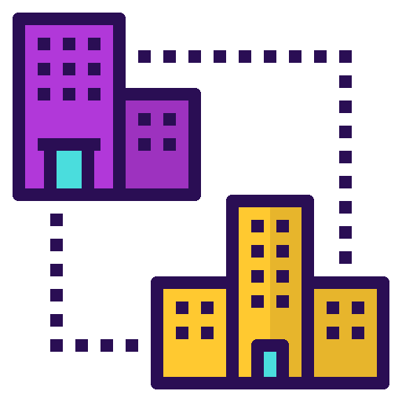
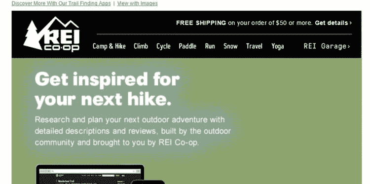
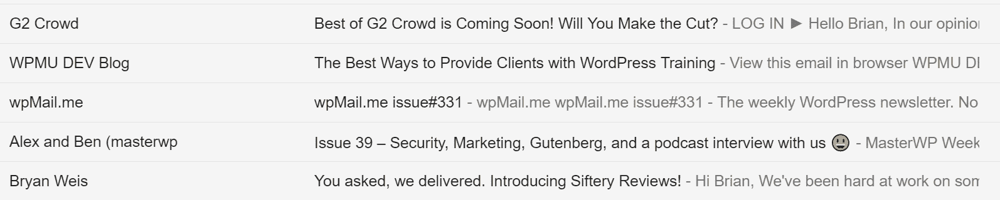

# 2022 年提高 B2B 销售额的 7 个电子邮件营销技巧

> 原文：<https://kinsta.com/blog/email-marketing-tips/>

说到营销，你可以选择许多不同的策略来挖掘商机、打造品牌或实际推动销售转化。希望你已经知道你的目标是什么，你的目标是谁，谁是你的理想客户，追随者，商业伙伴。你从一开始就不知道的是，为了让你的活动发挥最大作用，应该选择哪些沟通渠道。

[口碑战略](https://www.referralcandy.com/blog/how-to-get-word-of-mouth/)可能适用于当地的小企业，但当涉及到全面的营销战略时，你需要接触那些可能甚至不知道你在市场上的人。

有一件事每个营销人员都应该知道:虽然不是所有的潜在客户都在社交媒体或狂热的博客读者，但几乎所有人都经常使用他们的电子邮件。此外，就 B2B 而言，电子邮件仍然是接收和传输数据的最快和最有效的沟通渠道。因此，电子邮件营销仍然是有利可图和有效的——你应该知道你在做什么，以及如何根据你的受众调整你的策略。

这里有一些**电子邮件营销技巧**，我希望在进行 B2B 营销时对我的营销伙伴有所帮助。但首先，让我们谈谈这个概念的几件事。

## 什么是 B2B 营销？

众所周知，企业对企业营销，即 B2B 营销，是指通过满足其他公司的需求，将一家公司的产品销售给其他公司。为了更好地理解这个概念，我们假设你有一家织造公司。为了接触到你的客户，你需要联系他们，同时，把你的业务作为一个有价值和专业的业务进行营销。

你的客户是谁？嗯，你可以在你的商店或其他商店直接出售原材料，我相信有足够多的爱好者喜欢购买原材料并为自己缝制衣服。然而，如果你把你的生意推销给依赖于你所生产的商品类型的其他企业，你会卖得更多。例如，你可以把你的产品销售给专门的公司，这些公司用你的原材料生产成品。

这被称为 B2B 营销活动。这里你可以看看 B2B 和 B2C 营销的主要区别。
T3】

## 为什么每个企业都应该创建一个可行的 B2B 电子邮件营销策略？

我相信你们大多数人都在思考上述问题。我为什么要创建一个专门的 B2B [电子邮件营销策略](https://kinsta.com/blog/email-marketing-software/)？这种策略有什么好处，如何帮助我的公司或我工作的公司？好吧，让我们来看看[生命设计](https://vtldesign.com/digital-marketing/email-marketing/b2b-email-marketing-guide/)分享的一些数字。

1.根据他们的报告，有不少于 72%的 B2B 买家愿意通过电子邮件分享有用的内容。这意味着您的电子邮件不是静态的，它们也不只是停留在垃圾邮件文件夹中。如果你的目标受众收到这些邮件，他们很有可能会通过电子邮件与他们“社交圈子”中的其他人分享你的内容换句话说，你的邮件会被转发，类似于你在社交网络上获得的分享。

2.在电子邮件营销活动上每花 1 美元，你就能获得 44 美元的投资回报。考虑到其他传统营销平台无法交付这样的数字，这是一个巨大的数字。例如，影响者营销每花费 1 美元支付不超过 6.5 美元，[比我们通过成功的电子邮件营销活动所能达到的比率低 7 倍](http://www.adweek.com/digital/study-influencer-marketing-pays-6-50-for-every-dollar-spent/)。然而，这并不意味着你应该忘记所有其他类型的营销和品牌行为。这意味着电子邮件营销不应该被忽视，[建立你的电子邮件列表](https://kinsta.com/blog/how-to-build-an-email-list/)应该是你的首要任务。它是有效的，正如我们将在本文中看到的，易于实现。

## 成功的 B2B 电子邮件营销策略

现在我们知道了电子邮件营销在 B2B 销售和 B2B 销售线索挖掘方面是有效的，让我们更深入一点，谈谈在开始这样的旅程之前你需要知道的一些最重要的事情:

### 1.想想你的客户，理解他们的不同

B2B 营销，虽然在某种程度上类似于直销，但不是一回事。客户表现不同，他们做出不同的选择。在 B2B 营销中，你面对的是更理性的受众。怎么，来了？老顾客有时不太了解他们在买什么，他们容易冲动和鲁莽。

另一方面，商业客户从一开始就知道他们需要什么。他们的购买决定不是基于一时兴起或一时冲动。相反，他们根据自己的需求和良好的性价比做出理性的决定。因此，当你与商业客户打交道时，你需要考虑到他们与普通客户不同，行为也不同的事实。

B2B 营销应该面向哪些类型的客户？

1.  首先，有些公司使用你的产品来生产其他商品。例如，一家使用纺织材料生产 T 恤衫和其他商品的公司。
2.  其次，有些公司使用你的产品进行办公自动化或其他次要任务。例如，一家公司向你购买电脑、纸张或钢笔。
3.  第三，如果你的产品符合政府机关和机构(医院和学校)的需求，它们可能会成为潜在的消费者。例如，你可以向这些机构出售任何东西，从电脑到肥皂和卫生纸。
4.  最后，我们有经销商公司，他们购买你的产品只是为了再分销给其他客户。在这里，我们包括当地商店，但也包括经纪人和批发商。

现在你已经知道了什么是 B2B 销售以及你要向谁推销你的产品，你可以继续写你的第一封电子邮件简讯了。以下是一些需要注意的重要事项:

### 2.注意邮件的标题

这是你的电子邮件活动中最重要的视觉方面。如果你想要 B2B 销售，你需要适合你的观众的内容，但首先，你需要以某种方式抓住他们的注意力。这就是你的横幅需要做的。

## 注册订阅时事通讯

### 想知道我们是怎么让流量增长超过 1000%的吗？

加入 20，000 多名获得我们每周时事通讯和内部消息的人的行列吧！

[Subscribe Now](#newsletter)

考虑到普通的办公室职员每天会收到大量的电子邮件，你只有几秒钟的时间让他们感兴趣。这意味着你需要传递一些东西，一个清晰的信息，[就在标题部分](https://envato.com/blog/grab-attention-sales-better-email-header-7-tips/)，当你的听众打开你的邮件时，他们首先会注意到的。

Email header

你需要什么？嗯，你需要一个清晰的愿景，你的横幅应该是什么样子，你需要你的标志是可见的，以便你的观众能够认出你，你还需要一个工具来生成和设计横幅。你需要节省时间，同时又要表现出专业的形象。为了做到这一点，我建议你使用 Bannersnack 这样的在线工具，这是创建漂亮的[电子邮件横幅](https://www.bannersnack.com/email-headers.html)的绝佳选择。

### 3.内容营销从标题和主题行开始

特别要考虑你的主题行，就好像它是你邮件中唯一的一行文字。为什么？当你发送的邮件到达你客户的收件箱时，他或她首先会注意到的是你的主题。你没有超过几秒钟的时间让他们对你的提议感到好奇，这就是为什么你需要告诉他们他们需要知道的一切。

另一方面，标题也很重要，你应该设法让客户打开邮件。主题行会让你的读者点击并打开邮件，因此，标题应该能说服他们阅读你的其余内容。不要忘记一些小的 CTR 技巧，比如添加表情符号。在以下 5 封电子邮件中，哪一封让你印象深刻？😉

Email marketing subject line

### 4.不要把你的电子邮件地址写给首席执行官

考虑到你的目标是创造 B2B 销售和潜在客户，你需要知道，并非所有来自你的目标受众的决策者在他们的公司中都有相同的角色。我知道，在第一次冲动时，你会想联系你在竞选中瞄准的公司的首席执行官，但这并不总是最好的选择。为什么？

Struggling with downtime and WordPress problems? Kinsta is the hosting solution designed to save you time! [Check out our features](https://kinsta.com/features/)

假设你想销售办公自动化产品。有机构需要这些产品，但也有大公司、当地商店、个体企业家等等。有各种不同的人负责向他们的公司提供这种商品。

他们都有不同的教育背景，不同的社会地位。你将向首席执行官、企业主甚至他们的员工发表演讲，这就是为什么你需要**创造一个任何人都容易理解的信息**。
T3】

### 5.创建您的内容

你有一个标题模板，一个主题，也许还有一个时事通讯的标题。现在，是时候给你的读者一些有价值的东西来读了。是时候[创造内容](https://robertkatai.com/content-marketing-strategy-for-small-business-owners/)来产生 B2B 销售和线索了。

此时需要考虑的事项:

1.  **内容很重要**即使你只是在推广产品。在这种情况下，最有价值的内容将是你为时事通讯撰写的内容描述。
2.  [挑常青话题](https://kinsta.com/blog/evergreen-content/)。如果你想在邮件中加入比简单的产品描述更多的内容，考虑为你的读者创造一些[****常青树和相关内容****](https://kinsta.com/learn/content-marketing/) **。在这种情况下，最好的文本是那些设法回答问题的人，你的观众可以在他们自己的生活或业务中应用的*提示&技巧*文章和建议。重要的是，不仅要争取新客户，还要保持现有客户的兴趣，因为吸引新客户的成本是保持现有客户的五倍。**
***   确保**内容是唯一的**。人们听不同种类的音乐，因为音乐让他们有某种感觉。他们出于同样的原因购买特定品牌的鞋子。他们选择东西是基于他们触发一些情绪的能力，或者在任何情况下，他们需要购买它们的理性思考。在内容方面没有什么不同。你需要一些独特的东西，告诉你的观众，你不仅在这方面付出了努力，而且你有一些有价值的东西可以给他们。*   选择**质量而不是**数量。你不需要一本小说来传达信息。只要你不断提醒自己，你所交付的应该是高质量的，而不是太多的信息，你的简讯的长度就不应该是一个问题。你可以创建非常短的电子邮件简讯，如果你的信息是有效的，仍然可以获得更好的投资回报率。在这种情况下，有效性意味着你应该用尽可能少的话来表达你的观点，你的文本和图像是经过专业合成和处理的，你的风格是针对你试图说服向你购买的受众类型而适当调整的。*   **使内容易于阅读**。有一些人喜欢阅读长文章或大段文字，尤其是你在这里提到的那些人，那些每天都会收到许多电子邮件的人，他们没有时间去关注所有的邮件。这就是为什么你应该确保你的信息是可读和可理解的。使用标题和副标题、要点、[适当的字体](https://kinsta.com/blog/best-fonts-for-email/)，突出最重要的信息。使用短句和段落，并确保你有足够的空白。**

 **### 6.选择您的送货服务

有许多电子邮件服务提供商，虽然他们中的许多人提供专业服务，但并不是所有的都适合你。你需要进行一些研究，并对一些最著名的 esp 进行自我评估。我的建议是，你可以找到一个最佳服务的顶级列表，如[这个](https://www.business.com/categories/best-email-marketing-services/)或[这个另一个列表](https://www.wpeka.com/7-best-email-marketing-service-for-small-enterprises.html)，并在满足于一个或另一个之前研究每个最可靠的电子服务提供商。

### 7.验证您的域

[进入垃圾邮件文件夹](https://kinsta.com/blog/why-are-my-emails-going-to-spam/)会大大减少你打开的邮件总数，进而影响你网站的点击量。提高你的打开率和投递率的一个方法是对你的域名进行认证。

电子邮件身份验证对您的影响有多大？Kinsta 有一个客户移动了 DNS 提供商，然后他们的时事通讯立即被转到垃圾邮件文件夹，几乎一个月之后才被人意识到。这是因为缺少身份验证记录。通过直接发送垃圾邮件，他们的**打开率比上个月下降了 4.79%** ，他们的**点击率下降了 1.56%** 。这就是为什么你不想最终在垃圾邮件文件夹，为什么电子邮件认证是重要的。

Statistics from campaign going to the spam folder in April

查看这篇关于如何认证你的电子邮件域名的深入教程。

## 结论

多年来，电子邮件营销已被证明是一种有效的营销策略，无论你是针对个人客户还是企业客户。你可以依靠电子邮件营销来产生 B2B 销售，这篇文章旨在阐明在开始营销活动之前你需要检查的最重要的步骤。

你怎么看待电子邮件 B2B 营销？你尝试过这样的策略吗？你有多成功？你在你的清单上检查了多少这些电子邮件营销技巧？

* * *

让你所有的[应用程序](https://kinsta.com/application-hosting/)、[数据库](https://kinsta.com/database-hosting/)和 [WordPress 网站](https://kinsta.com/wordpress-hosting/)在线并在一个屋檐下。我们功能丰富的高性能云平台包括:

*   在 MyKinsta 仪表盘中轻松设置和管理
*   24/7 专家支持
*   最好的谷歌云平台硬件和网络，由 Kubernetes 提供最大的可扩展性
*   面向速度和安全性的企业级 Cloudflare 集成
*   全球受众覆盖全球多达 35 个数据中心和 275 多个 pop

在第一个月使用托管的[应用程序或托管](https://kinsta.com/application-hosting/)的[数据库，您可以享受 20 美元的优惠，亲自测试一下。探索我们的](https://kinsta.com/database-hosting/)[计划](https://kinsta.com/plans/)或[与销售人员交谈](https://kinsta.com/contact-us/)以找到最适合您的方式。**