# 关于电子邮件签名你需要知道的一切(有例子)

> 原文：<https://kinsta.com/blog/email-signature/>

我们以前都见过电子邮件签名。它们占据电子邮件底部的几行，让你知道发件人的姓名、电话号码和其他细节。

但是如果你的电子邮件签名只是一个简单的联系信息列表，你就没有充分发挥它的潜力。

一个好的电子邮件签名可以传播品牌意识，为特价商品做广告，为你的网站增加流量，等等。

这份电子邮件签名指南将帮助你从邮件末尾的小空间中获得重要的结果。我们会让你知道如何添加电子邮件签名到你的电子邮件，它应该看起来像什么，它应该说什么。

## 什么是电子邮件签名？

电子邮件签名是出现在您发送的每封电子邮件末尾的一组文本、图像和链接。

电子邮件签名最常见的用途是提供联系信息，如职位和电话号码，但你可以做得更多。企业越来越将电子邮件签名视为一个营销机会。

Email signature example.

[Ready to make the most of your email signature? 💡 See how to add it in, what it should look like, and what it should say, all in this guide ⬇️Click to Tweet](https://twitter.com/intent/tweet?url=https%3A%2F%2Fkinsta.com%2Fblog%2Femail-signature%2F&via=kinsta&text=Ready+to+make+the+most+of+your+email+signature%3F+%F0%9F%92%A1+See+how+to+add+it+in%2C+what+it+should+look+like%2C+and+what+it+should+say%2C+all+in+this+guide+%E2%AC%87%EF%B8%8F&hashtags=EmailTips%2CEmailMarketing)

## 为什么你的电子邮件签名很重要

每次你与某人进行专业的电子邮件联系——无论是领导、合作伙伴还是寻求支持的客户——你都有机会向收件人提供额外的信息，或者让他们对你的品牌有一定的印象。

> Kinsta 把我宠坏了，所以我现在要求每个供应商都提供这样的服务。我们还试图通过我们的 SaaS 工具支持达到这一水平。
> 
> <footer class="wp-block-kinsta-client-quote__footer">
> 
> 
> 
> <cite class="wp-block-kinsta-client-quote__cite">Suganthan Mohanadasan from @Suganthanmn</cite></footer>

[View plans](https://kinsta.com/plans/)

创建完美的电子邮件签名对你有好处，这有几个原因，我们将概述一下。

### 职业化

电子邮件签名(如果处理得当)会让你的电子邮件看起来更专业。

首先，它通过提供您的真实姓名和信息赋予您合法性。添加您的徽标、品牌和网站链接，让人们知道您的业务是专业的、值得信赖的。

一个专业的电子邮件地址也是必不可少的，所以[学习如何选择一个](https://kinsta.com/blog/professional-email-address/)作为这个过程的一部分。

### 效率

节省下来的每一分钟都很重要。

电子邮件签名可让您为每个电子邮件联系人提供重要信息，而无需每次都重新键入。

### 品牌宣传

对你的内容进行品牌化会让你更容易被你的观众记住和识别。

在使用电子邮件签名进行营销的品牌中，有 62% 的品牌中，有 82%是为了传播品牌知名度。

电子邮件签名允许你在每次电子邮件对话中展示你品牌的标志、颜色、[字体](https://kinsta.com/blog/best-fonts-for-email/)和声音。

### 流量和销售线索生成

通过[营销邮件](https://kinsta.com/blog/email-marketing-best-practices/)推动流量和产生销售线索是一种众所周知的策略。一项针对营销人员的调查发现，电子邮件是他们在[获取和培育潜在客户方面表现最好的](https://kinsta.com/blog/email-marketing-statistics/)内容类型。

这种成功并不局限于营销邮件。你可以用电子邮件签名达到同样的效果。

从上面链接的来源来看，在从事电子邮件签名营销的品牌中，48%的品牌使用电子邮件签名来[推动网站](https://kinsta.com/blog/how-to-drive-traffic-to-your-website/#email-marketing)的流量，而 34%的品牌使用电子邮件签名来[产生潜在客户](https://kinsta.com/blog/b2b-lead-generation/)。

## 电子邮件签名的要素

现在你知道为什么你需要电子邮件签名了。但是应该放什么进去呢？

考虑包括以下一些要素。

### 停止广播

落款是你在签名前写下的最后一个单词或短语。“真心”是常见的一种。“干杯”、“最美好的祝愿”和“问候”也是可能的。

您可以在每封电子邮件的底部键入落款，但有些人会将它们包含在电子邮件签名中。你的电子邮件签名甚至可以是图像或文本。

### 联系信息

不要被头像和标志冲昏了头脑，以至于忘记了电子邮件签名的主要目的:提供你的联系信息。

根据你的电子邮件收件人可能需要知道的内容，这可能包括你的姓名、职务、电话号码或公司地址等信息。

许多人在签名中包含了他们的电子邮件地址，但是如果你需要节省空间的话，可以很容易地删掉。如果你给某人发了邮件，他们已经知道你的电子邮件地址了。

### 品牌宣传

我们已经讨论了电子邮件签名中品牌的重要性。您可以通过您的徽标、[配色方案](https://kinsta.com/blog/website-color-schemes/)和字体元素来标记您的签名。如果您的签名中有任何横幅或其他文字，请确保它与您的品牌声音相匹配。比如你是不拘小节风趣还是专业权威？

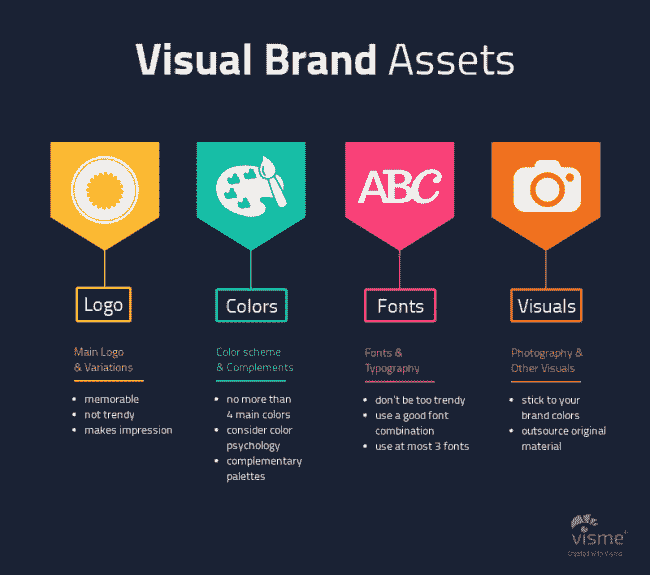

Visual elements of branding. (**Source:** [Rebrandly](//blog.rebrandly.com/how-to-strengthen-a-brand-with-visual-elements/%E2%80%9D))

### 行动呼吁(CTA)

有些电子邮件签名只是提供信息。

但是你的签名也是一个让读者做一些事情的机会——比如去你的网站，读一篇博客文章，或者利用一个特别的优惠。

考虑在你的电子邮件签名中加入一个引人注目的 CTA。

### 社会联系

如果您或您的企业拥有专业的社交媒体账户，您可以在电子邮件签名中链接到这些账户。

很多人用每个社交媒体平台的小图标来做到这一点。

Email signature example with social icons.

### 首选代词

在你的电子邮件签名中加入你喜欢的代词变得越来越普遍。

这让人们知道如何用第三人称称呼你，但也传达了你的公司是包容的，欢迎每个人。

### 爆头

有些人会在邮件签名中附上一张看起来很专业的照片。

这对于与销售代表和客户(如客户经理)建立关系特别有用。电子邮件签名头像可以让收件人将您的电子邮件与可识别的面孔关联起来。

### 图像或视频

头像和标志不是唯一可以放在电子邮件签名中的图像。

一些人在签名中使用照片甚至视频来展示创造性的工作或推广优惠、活动和内容。

### 跟踪

正如你从你的 [PPC 广告](https://kinsta.com/blog/how-to-use-google-adwords/)和[营销电子邮件](https://kinsta.com/blog/email-marketing-tips/)中[追踪点击和转换](https://kinsta.com/blog/conversion-tracking/)，你应该尽可能地监控电子邮件签名营销。

[追踪邮件签名中的链接](https://kinsta.com/blog/email-tracking-software/)让你知道你的营销努力是否有回报。您甚至可以对不同的元素使用多个跟踪链接。例如，您可以跟踪有多少人点击了您网站的文本链接，有多少人点击了您的“打五折”横幅。

### 自动化横幅广告活动

在营销活动中使用电子邮件签名的最佳方式是让公司的每个人都在他们的签名中使用相同的横幅广告。

但这肯定很复杂。有些员工会忘记更改他们现有的签名，而其他人则会破坏实施。你有更好的事情要做，而不是每次有新的活动时都监视整个团队的签名。

一些电子邮件签名工具允许您从一个集中的仪表板更新每个员工的签名横幅。你可以将电子邮件签名横幅视为一种广告，就像谷歌广告或脸书广告一样。你设置活动的开始和结束日期，跟踪广告的[点击率](https://kinsta.com/blog/click-through-rate/)，并监控活动分析。
T3】

## 电子邮件签名最佳实践

如您所见，电子邮件签名中可以包含许多元素。

但是应该选择哪些呢？如何制作一个能达到目标的邮件签名？

### 保持简单

仅仅因为 Gmail 允许你在邮件签名中最多写 10，000 个字符，并不意味着你应该这样做。

大多数邮件收件人在读完邮件后只会看一眼你的签名。如果设计太忙，信息太多，他们会忽略它。

专注于重要的事情。你想传达哪一两个信息？当收件人看到您的签名时，您希望他们做什么？

### 仔细选择你的链接

坚持“保持简单”的主题，不要在你的电子邮件签名中加入太多的 CTA。一个重要的链接通常就足够了。

### 在整个公司保持一致

拥有多名员工的企业应该制定一些电子邮件签名准则。

让团队成员知道应该包括哪些信息，以及如何设计他们的电子邮件签名。

### 创建多个签名

微软 Outlook 和许多其他电子邮件客户端允许你创建多个电子邮件签名。

如果你要和不同的受众通信，这可能会很有用。例如，您可能希望给潜在客户的电子邮件使用签名，而给现有客户的电子邮件使用不同的签名。

新邮件通常会有一个较大的签名，而回复邮件通常会有一个缩写版本。

当然，你所有的签名应该保持一致的品牌，并符合公司的指导方针。

### 在桌面和移动设备上测试电子邮件签名

您已经创建了一个漂亮的电子邮件签名，并用它给几个同事发了电子邮件。一切看起来都很棒。你已经准备好给潜在客户和客户发邮件了，对吗？

没那么快。在多种设备和电子邮件客户端上测试您的签名非常重要。根据平台的不同，情况可能会有所不同。

记得检查你的电子邮件签名在智能手机上的样子，因为 42%的电子邮件是在移动设备上打开的。

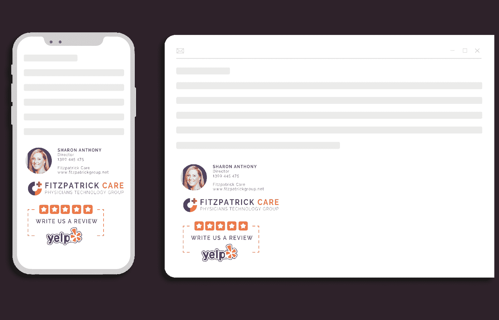

Test your email signature on desktop and mobile.

### 评估和优化

就像任何营销活动一样，衡量你的成功并分析什么有效。如果你制定了公司的电子邮件签名准则，并且再也没有考虑过它们，那么你就没有充分发挥签名的潜力。

## 注册订阅时事通讯

### 想知道我们是怎么让流量增长超过 1000%的吗？

加入 20，000 多名获得我们每周时事通讯和内部消息的人的行列吧！

[Subscribe Now](#newsletter)

## 设计电子邮件签名

你知道电子邮件签名的内容以及如何遵循最佳实践。现在，你怎么做这个东西？

有几种方法。

### 使用发电机

电子邮件签名生成器通过将您的信息和图像添加到专业设计的模板中，帮助您创建美观的电子邮件签名。

向下滚动到下一部分，查看排名靠前的电子邮件签名生成器列表。

### 使用你的电子邮件客户端

创建电子邮件签名最简单的方法是直接在你的电子邮件客户端设计。大多数主要的电子邮件客户端给你一种方法来添加文本、图像和链接到你的签名。

下面的一些[主要电子邮件客户端](https://kinsta.com/email-market-share/)中有编辑签名的说明。

### 使用 Word 或谷歌文档

你可以在文字处理器中设计你的电子邮件签名，并将其粘贴到你的电子邮件软件的签名框中。

这是在全公司范围内共享电子邮件签名模板的一种实用而直接的方式。

在某些情况下，文字处理器比电子邮件客户端允许更多的编辑选项。

## 顶级电子邮件签名生成器

如果你选择用生成器创建你的电子邮件签名，这些是最好的。

### 智慧邮票

[WiseStamp](https://www.wisestamp.com/) 让您选择电子邮件签名的布局、字体、颜色和图像形状。然后，你可以轻松地在 [Gmail](https://kinsta.com/blog/gmail-add-ons/) 、Outlook 和其他软件中自动安装你的作品。

WiseStamp 有一个免费版本，但您必须升级到 Pro 才能从您的签名中删除 WiseStamp 品牌，并获得全部功能。

一个单独的企业计划让您可以管理和统一整个组织的电子邮件签名。

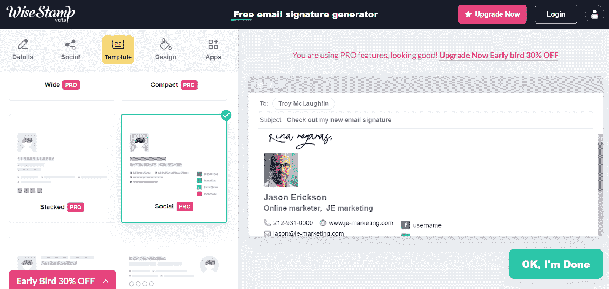

WiseStamp.

### 设计山

电子邮件签名只是设计山所做工作的一小部分。

该公司自称是一个创意市场，为企业和个人提供一个从专业设计师那里获得优质设计的地方。

电子邮件签名生成器有一个免费版本，具有基本功能，让您创建一个电子邮件签名。您填写您的信息，从一些样式中选择，并生成和下载 HTML 签名。

付费版本提供了更多的选项和模板。

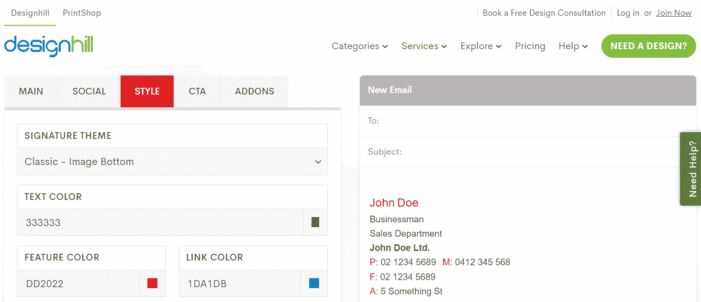

Designhill.

### 轮毂点

Hubspot 最为人所知的是一套 CRM 和营销工具。它还提供了一个免费的电子邮件签名生成器。

从六个不同的模板中选择，填写您的信息，并选择您的品牌颜色。如果你有一个自定义图像，比如一个标志，你也可以把它添加到你的 Hubspot 签名中。默认情况下会添加 Hubspot 品牌，但可以删除。

Struggling with downtime and WordPress problems? Kinsta is the hosting solution designed to save you time! [Check out our features](https://kinsta.com/features/)

您可以复制签名或其源代码，添加到您的电子邮件软件中。

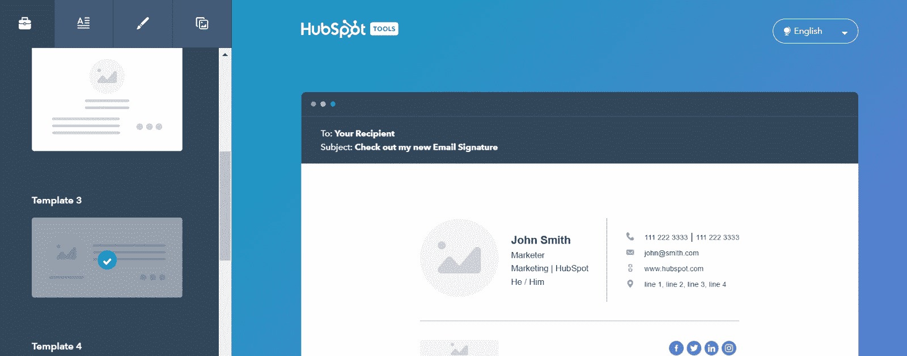

HubSpot.

### 签名.电子邮件

[signature.email](https://signature.email/) 提供了一个拖放编辑器。你从一个预先设计好的模板开始，移动元素来创造你的完美签名。您也可以添加您的图像。

一些模板是免费的，而另一些是高级的。signature.email 为个人和企业提供付费计划。

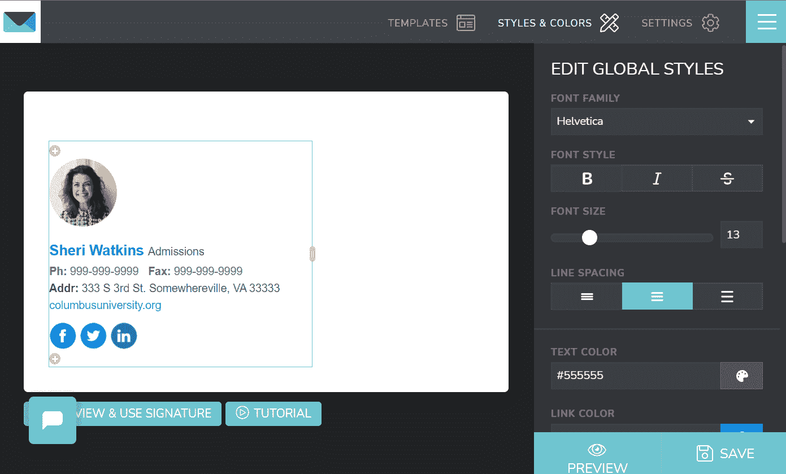

signature.email.

### 蜜汁书

HoneyBook 提供了一系列小型商业工具，包括一个电子邮件签名生成器。

签名生成器免费且简单。它没有其他选项的所有功能，但也快得不能再快了。只需输入您的信息，提供您的社交链接，从六个模板中选择一个，您就可以开始了。

HoneyBook 会将您创建的签名通过电子邮件发送给您。

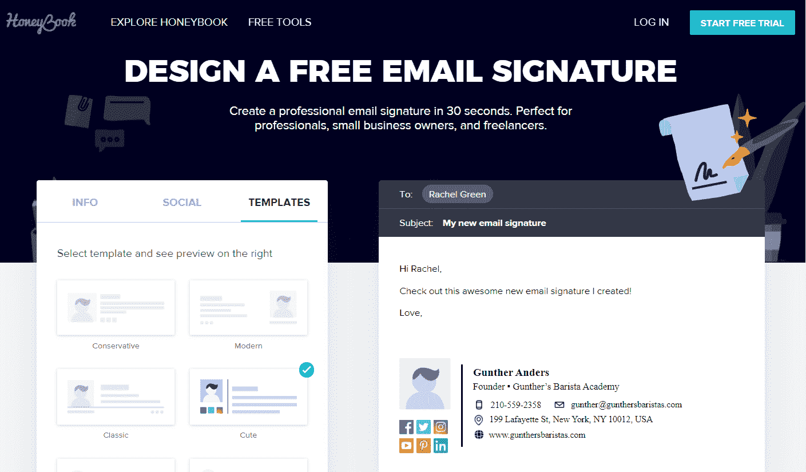

HoneyBook.

## 电子邮件签名示例

让我们来看几个很棒的邮件签名例子。每一个都不同，但对其用途来说都是完美的。

Email signature for design.

### 为什么有效

奥利维亚是一名摄影师，所以她的电子邮件签名使用带有照片的横幅是有道理的。作为一个与客户密切合作的人，她用自己的照片使电子邮件更有个性。

这封电子邮件签名有一个干净的设计和一致的配色方案。

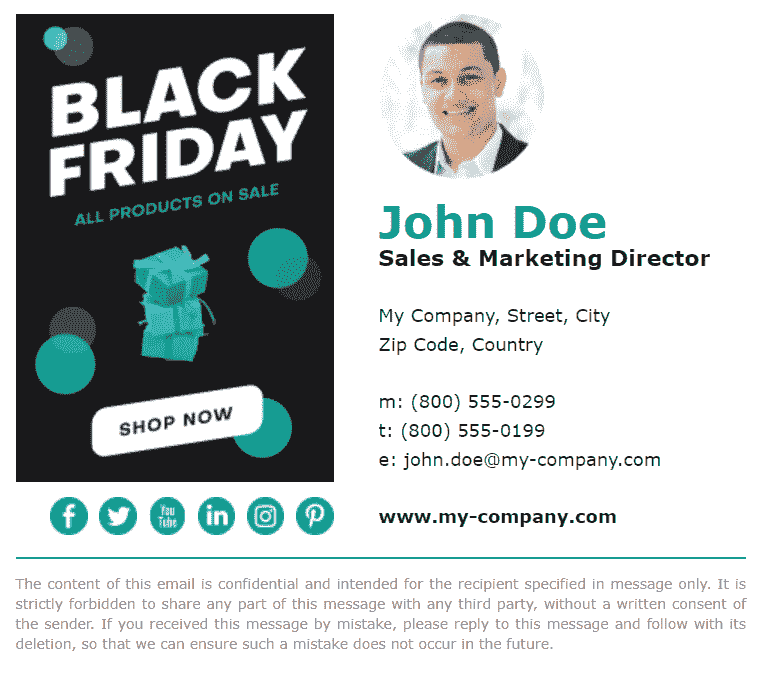

Email signature with Black Friday promotion.

### 为什么有效

毫无疑问，这封电子邮件的签名是想达到什么目的。与引人注目的黑色星期五促销相比，约翰的个人信息是次要的。

这个横幅广告活动可以手动创建，但它也是自动化活动的一个很好的候选。这样，你就不必在假期结束时让公司里的每个人都撤下他们的黑色星期五广告。

这个签名也有一个吸引人的布局和配色方案。

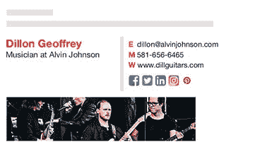

Email signature example with an image.

### 为什么有效

狄龙用一幅图像来传达他是谁，他做什么。他提供了相关的联系信息和社交链接，但不会太混乱。

Email signature example with the banner.

### 为什么有效

Stella 的电子邮件签名是时尚、现代设计与一致配色方案的绝佳范例。

这里没有很多额外的信息。你的眼睛被横幅吸引住了，鼓励你和她安排一次会面。这将是一个很好的电子邮件签名使用时，冷电子邮件的前景。

Email signature example with logo and text.

### 为什么有效

不是每个人都需要头像、横幅或视频。这位教授的电子邮件签名很简单，但看起来很棒，提供了你需要的所有信息。

哥伦布大学的品牌做得很好，想必每个员工的签名都是一致的。

Email signature example with signoff.

### 为什么有效

这是一个在电子邮件签名中包含签署的示例。戴安娜的签名并不太花哨。但是友好的“最诚挚的问候”和亮粉色的名字会吸引你的注意力，让你注意到签名中的信息和链接。

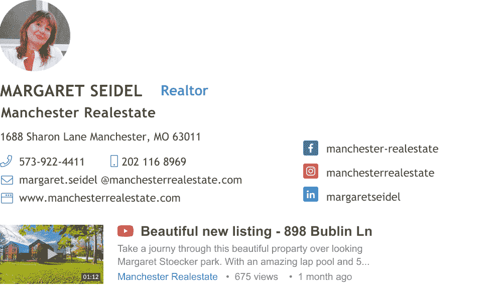

Email signature example with the video thumbnail.

### 为什么有效

作为一名房地产经纪人，玛格丽特使用她的电子邮件签名来推销一处房产。她可以用一个静态的横幅来做到这一点，但是包含一个 YouTube 视频会对她的客户更有吸引力。

## 如何更改您的电子邮件签名

如何更新您的电子邮件签名取决于您使用的电子邮件客户端。它们中的大多数使创建、更改和管理您的签名变得容易。

以下是三种最常见的桌面和移动电子邮件服务的步骤。

### Gmail 的步骤

1.  单击设置图标
2.  选择**查看所有设置**
3.  向下滚动到签名部分
4.  点击**创建新的**

Gmail 允许您创建多个电子邮件签名。您可以选择将哪个用作新电子邮件的默认设置，以及哪个用于回复和转发。

### Outlook 的步骤

*   在文件菜单中，点击**选项**
*   选择**邮件**，然后选择**签名**
*   点击**新建**制作新签名

与 Gmail 一样，Outlook 允许您创建多个签名，并选择将哪个签名设置为新邮件和回复的默认签名。

如果您在 Outlook 中使用多个电子邮件地址，可以使用不同的签名。

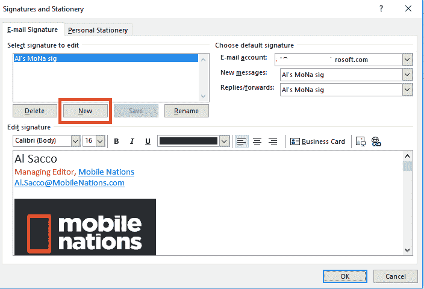

Creating a new signature in Outlook.

### iPhone 的步骤

您的 iPhone 或 iPad 将以默认签名开始，即“从我的 iPhone 发送”或“从我的 iPad 发送”，但您可以更改它。

方法如下:

1.  打开设备上的设置应用程序
2.  点击**邮件**
3.  选择**签名**

在这里，您可以编辑您的电子邮件签名。您还可以点击每个帐户的**，为每个电子邮件帐户设置不同的电子邮件签名。**

[Don't overlook your email signature as a means to market your business! ✅ Learn more in this guide ⬇️Click to Tweet](https://twitter.com/intent/tweet?url=https%3A%2F%2Fkinsta.com%2Fblog%2Femail-signature%2F&via=kinsta&text=Don%27t+overlook+your+email+signature+as+a+means+to+market+your+business%21+%E2%9C%85+Learn+more+in+this+guide+%E2%AC%87%EF%B8%8F&hashtags=EmailTips%2CEmailMarketing)

## 摘要

电子邮件签名不再仅仅代表姓名和电话号码。

您的电子邮件签名提供了一个创造品牌知名度、进行促销、增加网站流量和产生潜在客户的机会。在你的电子邮件签名中添加一些文本、图片和 CTA 不需要任何成本，而且它有可能获得大量的受众。

电子邮件签名的范围可以从简单的纯文本设计到带有多媒体、跟踪链接和分析的广告平台。

*正在寻找更多方法为您的企业创造商机？了解 [11 B2B 销售线索挖掘策略。](https://kinsta.com/blog/b2b-lead-generation/)T3】*

* * *

让你所有的[应用程序](https://kinsta.com/application-hosting/)、[数据库](https://kinsta.com/database-hosting/)和 [WordPress 网站](https://kinsta.com/wordpress-hosting/)在线并在一个屋檐下。我们功能丰富的高性能云平台包括:

*   在 MyKinsta 仪表盘中轻松设置和管理
*   24/7 专家支持
*   最好的谷歌云平台硬件和网络，由 Kubernetes 提供最大的可扩展性
*   面向速度和安全性的企业级 Cloudflare 集成
*   全球受众覆盖全球多达 35 个数据中心和 275 多个 pop

在第一个月使用托管的[应用程序或托管](https://kinsta.com/application-hosting/)的[数据库，您可以享受 20 美元的优惠，亲自测试一下。探索我们的](https://kinsta.com/database-hosting/)[计划](https://kinsta.com/plans/)或[与销售人员交谈](https://kinsta.com/contact-us/)以找到最适合您的方式。