# 如何在你的 WordPress 站点上嵌入一个谷歌表单(3 个简单的步骤)

> 原文：<https://kinsta.com/blog/embed-google-form/>

谷歌表单可以帮助你吸引网站用户，并从他们那里收集反馈。然而，在你开始制作一流的调查、[联系表格](https://kinsta.com/blog/wordpress-contact-form-plugins/)和其他内容之前，你可能会想办法把它们嵌入你的 WordPress 网站。

幸运的是，只需几个步骤，你就可以**将谷歌表单**嵌入到你的 WordPress 网站，并开始收集用户的反馈。这可以让你根据反馈改进你的网站和内容。在本帖中，我们将向你展示谷歌表单如何从整体上有益于你的网站和[你的品牌](https://kinsta.com/blog/wordpress-site-examples/)。然后，我们将带您通过几个简单的步骤，了解如何将 Google 表单嵌入到您的站点中。

准备好了吗？我们开始吧！

## 谷歌表单简介

Google Forms 是一个网络应用程序，很像 [Google Docs](https://kinsta.com/blog/google-docs-to-wordpress/) 或 Google Sheets，用于创建交互式调查和其他类型的表格。一些常见用途包括:

*   活动注册。
*   用户投票和问卷调查。
*   电子邮件订阅注册表单。
*   小测验。
*   产品订单。
*   联系方式。

像其他的 [Google Workspace 应用](https://kinsta.com/blog/google-workspace/)一样，你可以将你所有的表格存储在你的 Google Drive 中。你还可以利用谷歌的分享功能。如果您与团队合作为您的网站创建内容，并且您希望其他人能够在您的调查或其他表单上进行协作，这将特别有帮助:

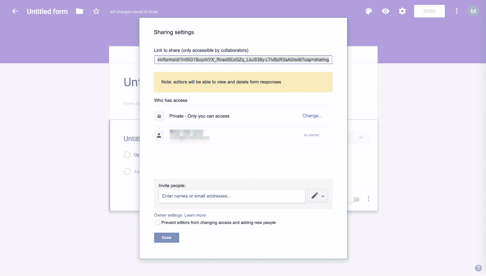

Sharing options

免费平台简化了表单创建过程。您可以从各种预构建的模板中进行选择，或者创建自己的模板并保存它们以备后用:

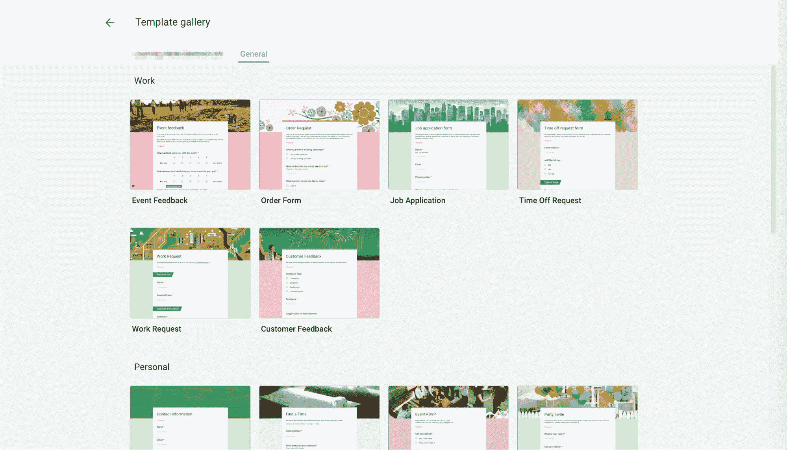

Google Forms template gallery

谷歌表单也将帮助你设计你的内容，以匹配你的品牌。

### 信息

如果您为 Google Workspace 付费，它会将“创建您自己的 Google 表单”文本更改为“此表单是在[您的组织名称]内创建的。”

您可以从各种主题中进行选择，或者简单地将您的徽标添加到每个表单中。该平台会自动调整你的表单颜色，创造出适合你网站的独特外观。所有的谷歌表单也都是响应性的，所以你的用户可以从他们的智能手机或其他移动设备上完成这些表单[。](https://kinsta.com/blog/google-mobile-first-index/)

最后，您还可以访问在您的 Google 帐户中收集的实时结果:

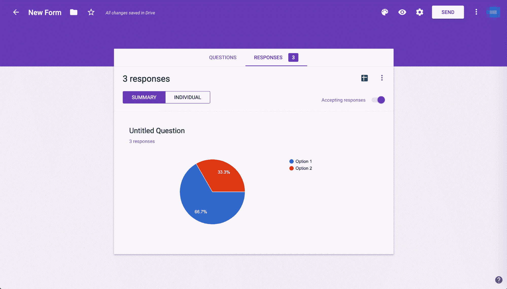

Google form responses

您可以随时在表格中查看您的回复信息和图表，或者将其导出到 Google Sheets 进行进一步分析。这使得组织、评估和与团队共享您的成果变得简单而方便。

## 为什么你想在你的 WordPress 站点上嵌入谷歌表单

如果你正在寻找在你的 WordPress 站点上嵌入自定义表单的方法，你可能已经探索了使用一个 [WordPress 表单构建器插件](https://kinsta.com/blog/wordpress-forms/)的可能性。虽然这些都是有用的工具，但是有几个原因可以解释为什么 Google Forms 是一个更好的选择。

首先，使用 Google Forms 可以让你利用平台的存储和共享特性。第二，通过使用谷歌表单，你可以避免在你的网站上添加另一个插件，这会导致缓慢的加载时间，所以减少插件可能有助于 T2 提高你网站的性能。

此外，虽然你可以让其他用户使用 WordPress 插件创建表单，但是 Google Forms 可以让你完全控制谁在协作你的内容。你可以邀请特定的用户来处理任何给定的表单，提供更多的安全性和避免错误。

最后，使用谷歌表单不仅有助于改善你的 WordPress 网站，也有助于提升你品牌的整体形象。虽然用 WordPress 插件构建的表单只能在你的网站上使用，但你可以在任何平台上分享谷歌表单，包括通过社交媒体和营销邮件分享 T2 表单。

无论你的观众在哪里填写你的谷歌表格，他们的回答都会被记录在一个地方。这将有助于您在品牌的所有渠道中跟踪表单的结果，而不仅仅是您的网站。

## 如何在你的 WordPress 站点上嵌入谷歌表单(3 个步骤)

如果听起来 Google Forms 可能是你的 WordPress 网站表单相关需求的最佳解决方案，你很幸运。尽管这个过程不像安装一个插件那么简单，但是你可以通过三个简单的步骤在你的站点上嵌入谷歌表单。

### 步骤 1:创建你的谷歌表单

你需要做的第一件事是创建你的第一个谷歌表单。登录您的谷歌账户，然后通过在**谷歌应用程序**菜单中找到紫色图标来访问谷歌表单:

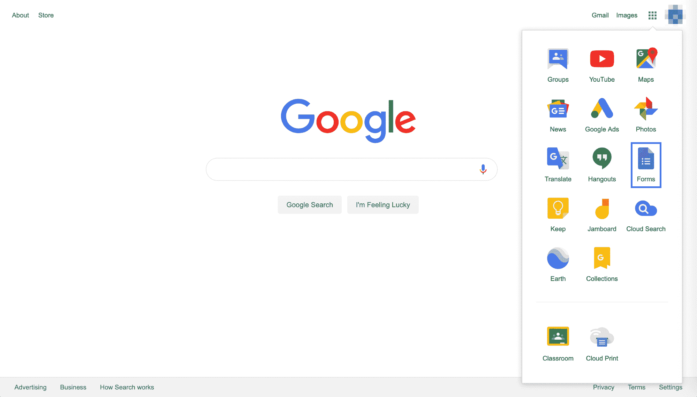

Google Form icon

如果你是 Google Workspace 用户，你应该对 Google Forms 界面非常熟悉。这与[谷歌文档](https://kinsta.com/blog/google-docs-to-wordpress/)和谷歌工作表非常相似:

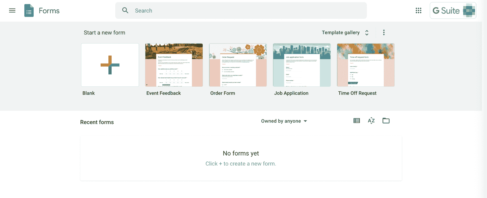

Google Form UI

要开始使用您的表单，您可以从工具栏中选择**空白**图块，或者选择一个模板进行操作。

无论哪种方式，您都可以直接在表单中键入标题和描述，然后创建您的问题和答案选项。您也可以使用下拉菜单选择每个答案的类型:

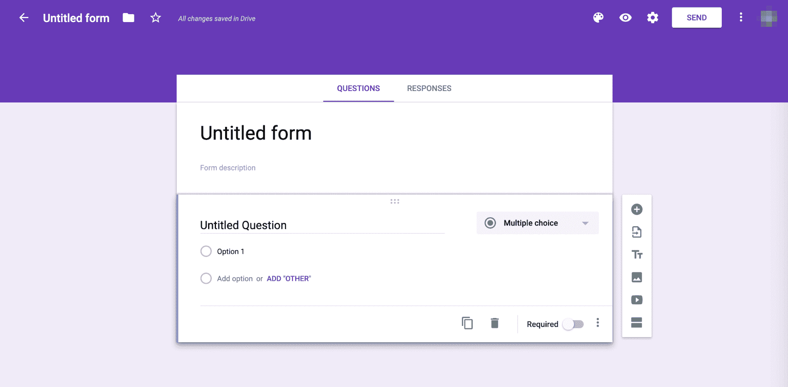

Setting up your Google Form

编辑器右侧的工具栏允许您添加新问题、从另一个 Google 表单导入问题、上传图像和视频以及创建附加部分。然后，调色板、眼睛和齿轮图标允许您更改表单的主题、预览最终产品和访问高级设置。

有了这些工具，你应该能够制作出你需要的任何形式。如果您想从您的团队获得信息，点击三点图标并选择**添加合作者**:

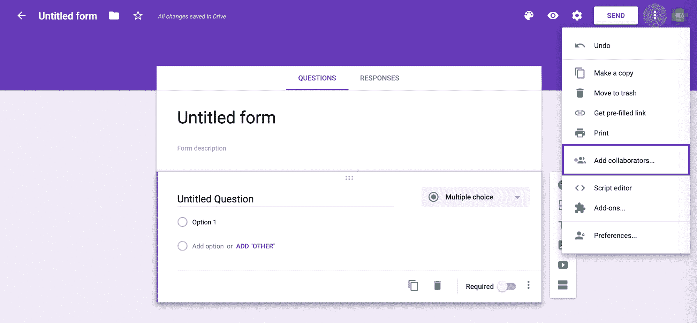

Add collaborators to Google Form

然后，您可以通过键入团队成员的电子邮件地址或使用链接共享功能，邀请他们来处理您的表单。您的更改将自动保存在您的 Google Drive 中。一旦你完成了编辑，你就可以把你的 Goole 表单嵌入到你的 WordPress 站点上了。

### 第二步:访问你的谷歌表单的嵌入代码

为了嵌入你的谷歌表单，你需要点击表单编辑器顶部的**发送**按钮。在那里，你有五种方式来分享你的表格:通过电子邮件、链接、HTML、脸书和 Twitter:

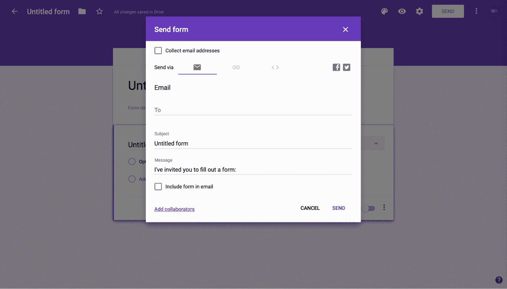

Share via email your Google Form

任何这些都可能被证明是有用的，尤其是如果你想将你的表格发送给你所有的[电子邮件列表订阅者](https://kinsta.com/blog/how-to-use-mailchimp/)或者在你的社交媒体账户上分享它。

## 注册订阅时事通讯

### 想知道我们是怎么让流量增长超过 1000%的吗？

加入 20，000 多名获得我们每周时事通讯和内部消息的人的行列吧！

[Subscribe Now](#newsletter)

然而，出于本教程的目的，我们将重点放在 HTML 选项上。因此，选择 *< >* 选项卡。你会在**嵌入 HTML** 下看到一个代码片段，下面还有一个改变表单尺寸的选项。

一旦你对它的大小满意，点击窗口右下角的**复制**:

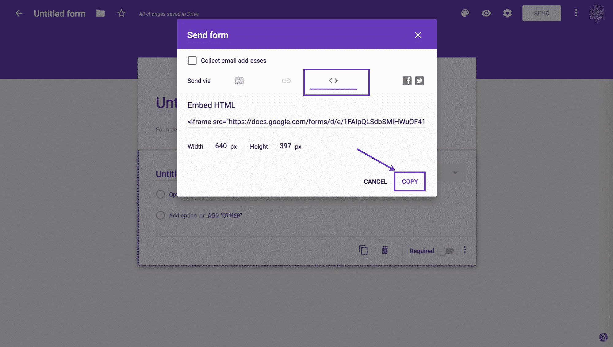

Get the embed code for your Google Form

接下来，前往你的 [WordPress 仪表盘](https://kinsta.com/knowledgebase/wordpress-admin/)。

### 第三步:将代码添加到你的文章或页面中

有了 HTML 代码片段，就可以将 Google 表单嵌入到网站中了。首先，导航到要合并表单的文章或页面。如果你正在使用 WordPress 块编辑器，你会想要添加一个**定制 HTML** 块:

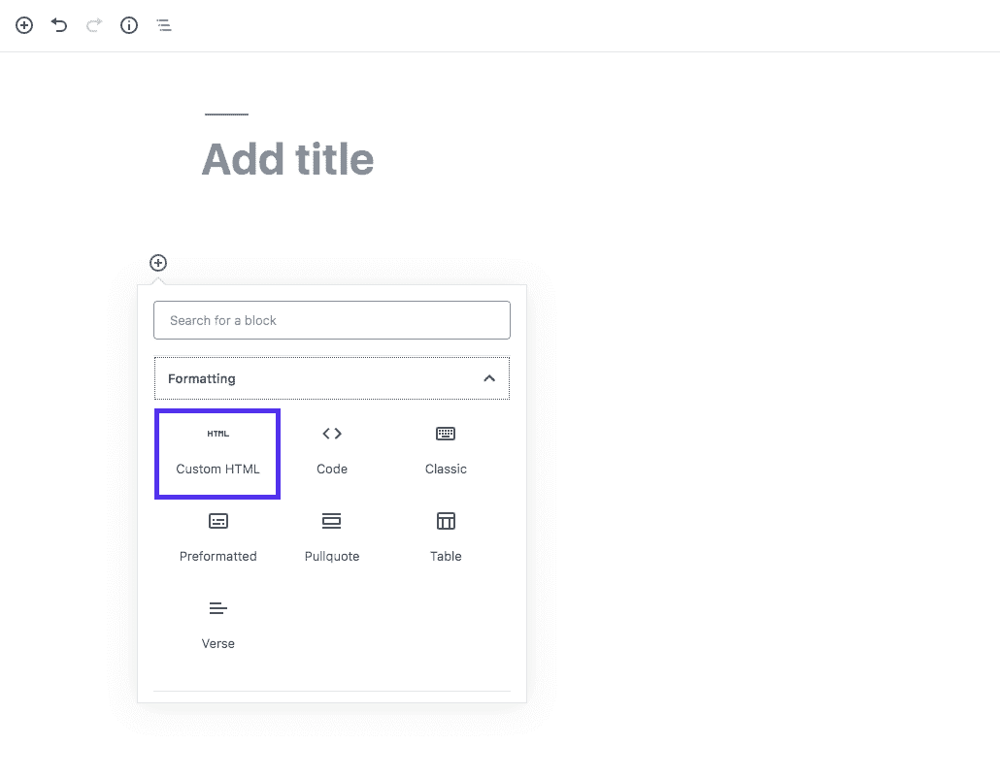

Custom HTML block

然后，将 Google 表单编辑器中的代码粘贴到该块中:

Add the embed code in the Block Editor

如果你点击**自定义 HTML** 块工具栏中的**预览**标签，你会看到你的谷歌表单，就像它出现在你的网站上一样:

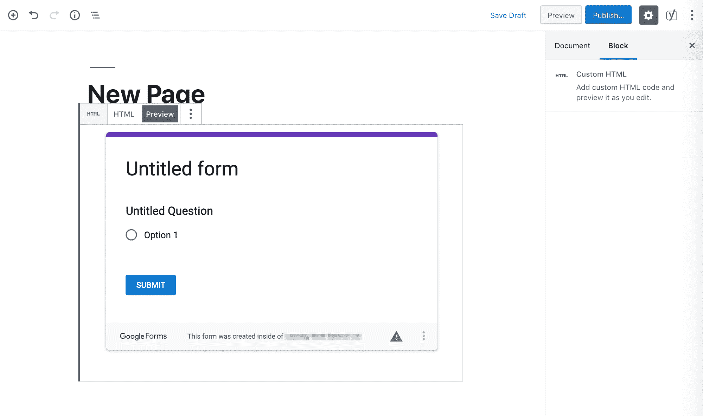

Preview of your Google Form embedded in the Block Editor

如果你使用的是经典编辑器，步骤会有所不同。事实上，你可以通过点击工具栏顶部的**文本**标签来切换到[文本编辑器](https://kinsta.com/blog/best-text-editors/):

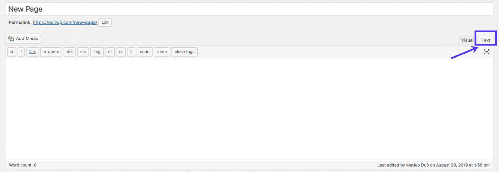

Classic Editor: text view

然后，您需要将 Google Form embed 代码粘贴到您希望它出现在页面上的任何位置:

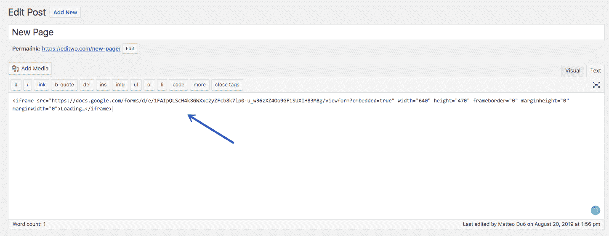

Embedding Google Form in WordPress Classic Editor

如果切换回可视化编辑器，您应该会在编辑字段中看到您的表单:

厌倦了体验你的 WordPress 网站的问题？通过 Kinsta 获得最好、最快的主机支持！[查看我们的计划](https://kinsta.com/plans/?in-article-cta)

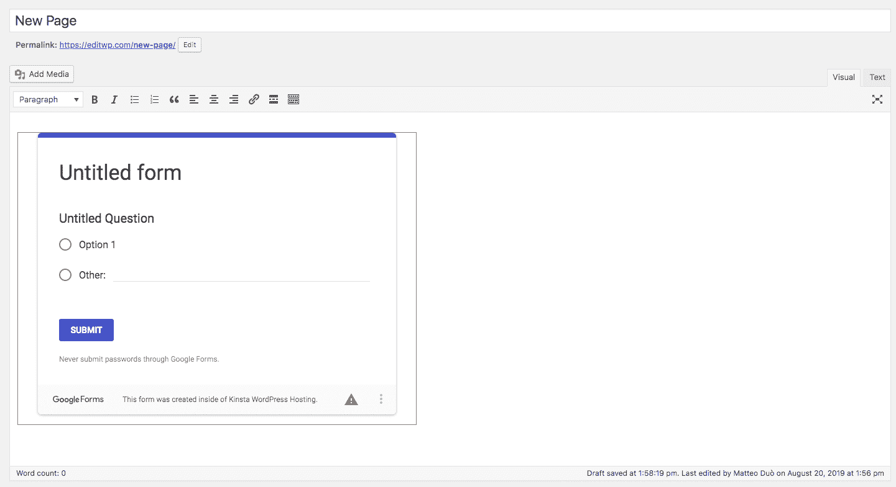

Embedded Google form: preview

您还可以预览页面，看看它在前端的样子。

如果你想在 WordPress 的文章或页面中嵌入一个 Google 表单，这就足够了！

(建议阅读:[如何修复 WordPress](https://kinsta.com/blog/facebook-oembed/) 中的脸书 oEmbed 问题)

## 在 WooCommerce 中使用 Google 表单

正如你可能已经意识到的，谷歌表单可以成为 WooCommerce 和其他 T2 电子商务平台 T3 的便利工具。您可以使用该工具轻松创建自己的定制订单，甚至还有一个订单模板来加快流程:

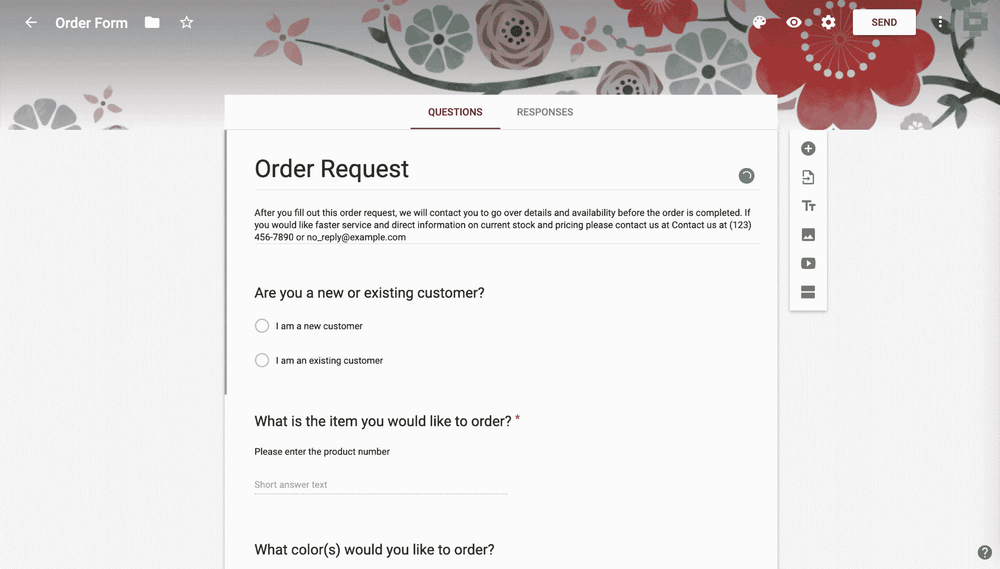

Order request example

您可能还想征求客户信息，为买家提供评价产品及其购买体验的机会，等等。

然而，有一个坏消息:简单地在你的产品页面上嵌入谷歌表单不会将 [WooCommerce 订单](https://kinsta.com/blog/woocommerce-tutorial/#orders)的功能与这些表单集成在一起。幸运的是，有一些第三方解决方案可以提供帮助。

### 选项 1: Automate.io

一个例子是 [Automate.io](https://automate.io/) ，一个云应用集成工具:

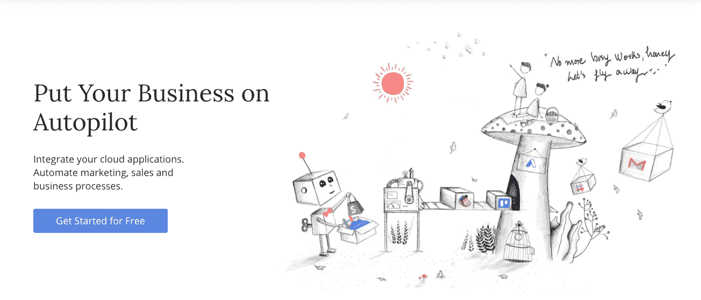

Automate.io

该解决方案使您能够连接 WooCommerce 和 Google Forms，并基于特定的触发器自动响应。例如，您可以:

*   当客户提交 Google 表单时，在 WooCommerce 中添加新订单。
*   当客户添加或更新他们的信息时，生成 Google Forms 响应。
*   为每个 WooCommerce 订单行项目创建 Google Forms 响应。
*   集成 Google Forms、Sheets 和 WooCommerce，这样就可以同时更新所有三个平台上的客户和订单信息。

Automate.io 每月最多可免费使用 250 个动作。每月 39 美元(按年度计划)，你可以将你的限额提高到 10，000 次。

### 选项 2: LeadsBridge

你也可以尝试的另一个选项是 [LeadsBridge](https://leadsbridge.com/) ，它会自动整合 WooCommerce 和 Google 表单，这样你就可以跟踪线索:

LeadsBridge

这是一个简单的方法来掌握你的在线业务的脉搏，并随着时间的推移监测其增长。LeadsBridge 将带您了解[如何设置您的集成](https://leadsbridge.com/documentation/woocommerce/google-forms/)，以便您可以创建订单和其他有用的功能。年度计划从每月[29 美元](https://leadsbridge.com/pricing/)开始，这个平台比 Automate.io 稍微便宜一些

### 选项 3:integra mat

第三个选择是 [Integromat](https://www.integromat.com/en/) ，它也提供谷歌表单和 WooCommerce 集成:

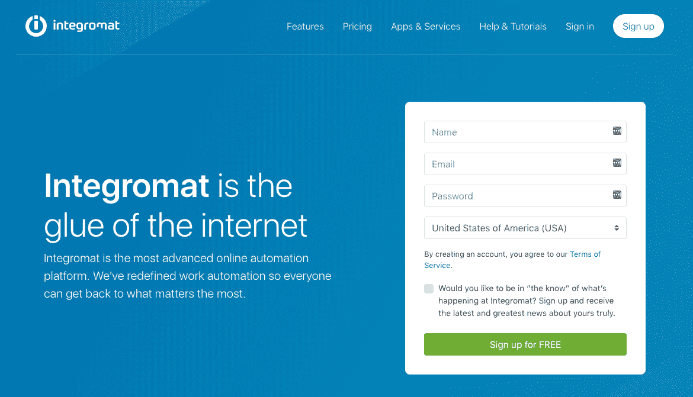

Integromat

这个工具可以通过使用与 Google Forms 响应和 WooCommerce 优惠券、订单、客户和产品相关的触发器来自动执行某些操作。Integromat 比 Automate.io 更实惠，其免费计划每月提供 1，000 次操作，其最低层每月 9 美元起，可进行 1 万次操作。

[Need to gather user feedback or run a survey? Learn how to properly embed Google Forms on your WordPress site! 📋❓Click to Tweet](https://twitter.com/intent/tweet?url=https%3A%2F%2Fkinsta.com%2Fblog%2Fembed-google-form%2F&via=kinsta&text=Need+to+gather+user+feedback+or+run+a+survey%3F+Learn+how+to+properly+embed+Google+Forms+on+your+WordPress+site%21+%F0%9F%93%8B%E2%9D%93&hashtags=wptips%2Cgoogleforms)

## 摘要

表单是许多不同 WordPress 站点的重要组成部分。无论你希望在你的网站上加入调查来收集用户反馈，在你的 WooCommerce 商店中添加详细的订单，还是其他完全不同的东西，Google Forms 都是一个易于使用的制作完美表单的免费工具。要在你的 WordPress 站点上嵌入谷歌表单，你只需要遵循三个简单的步骤:

1.  创建您的谷歌表单。
2.  访问你的谷歌表单的嵌入代码。
3.  将嵌入代码添加到你的 WordPress 文章或页面中。

关于在你的 WordPress 站点上嵌入一个 Google 表单，你有什么问题吗？请在下面的评论区告诉我们！

* * *

让你所有的[应用程序](https://kinsta.com/application-hosting/)、[数据库](https://kinsta.com/database-hosting/)和 [WordPress 网站](https://kinsta.com/wordpress-hosting/)在线并在一个屋檐下。我们功能丰富的高性能云平台包括:

*   在 MyKinsta 仪表盘中轻松设置和管理
*   24/7 专家支持
*   最好的谷歌云平台硬件和网络，由 Kubernetes 提供最大的可扩展性
*   面向速度和安全性的企业级 Cloudflare 集成
*   全球受众覆盖全球多达 35 个数据中心和 275 多个 pop

在第一个月使用托管的[应用程序或托管](https://kinsta.com/application-hosting/)的[数据库，您可以享受 20 美元的优惠，亲自测试一下。探索我们的](https://kinsta.com/database-hosting/)[计划](https://kinsta.com/plans/)或[与销售人员交谈](https://kinsta.com/contact-us/)以找到最适合您的方式。