# 如何启用 GZIP 压缩来加速 WordPress 站点

> 原文：<https://kinsta.com/blog/enable-gzip-compression/>

加速你的 WordPress 站点最简单的方法是[删除所有不需要的资源](https://kinsta.com/blog/third-party-performance/)。第二个最简单的方法是压缩所有需要的资源。在 web 服务器上启用 GZIP 压缩是实现这一目标的最简单、最有效的方法之一。

默认情况下，所有现代浏览器都支持 GZIP 压缩。但是，要为用户提供压缩的资源而不出现中断，您必须正确配置服务器。

在这篇文章中，你将学习网络数据压缩的基础知识，什么是 GZIP 压缩，它的各种好处，以及如何在不同的服务器设置上使用它来加速你的 WordPress 站点。

激动吗？大家减压吧！

### 更喜欢看[视频版](https://www.youtube.com/watch?v=sq0ngDELXY8)？


## 网上数据压缩的基础

web 上的数据压缩是减少网站传输的数据大小的过程。根据数据类型——文本、图像、样式表、脚本、字体——有各种压缩数据的方法。


> Kinsta 把我宠坏了，所以我现在要求每个供应商都提供这样的服务。我们还试图通过我们的 SaaS 工具支持达到这一水平。
> 
> <footer class="wp-block-kinsta-client-quote__footer">
> 
> 
> 
> <cite class="wp-block-kinsta-client-quote__cite">Suganthan Mohanadasan from @Suganthanmn</cite></footer>

[View plans](https://kinsta.com/plans/)

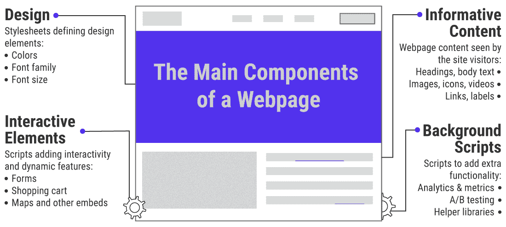

The main components of a webpage


例如，缩小 HTML、CSS 和 JavaScript 是减少浏览器发送数据量的简单方法。这里，minifier 通过从源代码中删除不必要的字符(如[注释](https://kinsta.com/blog/wordpress-comments/)和空格)来压缩文本。

在下面这个简单的 [HTML 文档](https://kinsta.com/knowledgebase/how-to-upload-html-file-to-wordpress/)的例子中，有三种内容类型:HTML 标记、 [CSS 样式](https://kinsta.com/blog/wordpress-css/)和 JavaScript 代码。

每种内容类型都有独特的语法和语义。总的来说，这个 HTML 文档总共有 357 个字符。

```
<**html**>
<**head**>
    <**style**>
    /* kinsta-banner is used on the homepage only */
    .kinsta-banner { font-size: 150% }
    .kinsta-banner { width: 75% }
</**style**>
</**head**>
<**body**>
    <!-- kinsta banner START -->
    <**div**>...</**div**>
    <!-- kinsta banner END -->
    <**script**>
    kinstaScripts(); // random scripts used on the page
    </**script**>
</**body**>
</**html**>
```

上面的代码易于阅读和理解。非常适合发展。然而，浏览器没有必要阅读注释并拥有完美缩进的标签。智能压缩器可以分析该文档，并从中删除所有不必要的位。

```
<**html**><**head**><**style**>.kinsta-banner{font-size:150%;width:75%}</**style**></**head**><**body**><**div**>...</**div**><**script**>kinstaScripts();</**script**></**body**></**html**>
```

缩小后，HTML 文档减少到只有 141 个字符。那可是一个****中积蓄**60.50%的人物数量。虽然看起来不那么容易，但这对于浏览器来说并不重要。它仍然会向用户显示相同的页面。**

 **为了利用这两个版本的优势，您可以将原始文档作为“开发版本”来维护，但是在将它发布之前缩小所有代码。

大多数 WordPress 性能插件会自动为你处理这些。


File size compression of uncompressed vs minified jQuery


例如， **jQuery 3.5.1** 库的未压缩版本比同一文件的缩小版本大 3 倍以上。

同样，上述相同的压缩技术可以优化其他内容类型，如图像、视频、字体等。像这样针对具体内容的缩减是优化你的网站基于文本的资产大小的第一步。

这些明显的好处就是为什么 Kinsta 在 [MyKinsta 仪表板](https://kinsta.com/mykinsta/)中加入了[代码缩减功能](https://kinsta.com/help/kinsta-cdn-code-minification/)。客户可以选择为他们的 CSS 和 JavaScript 文件选择自动缩减代码，无需手动操作就可以加速他们的网站。

但是数据压缩不仅仅是缩小。使用先进的数学技术，数据压缩算法可以进一步减少数据的大小。

这种数据压缩方法最流行的一个例子是 GZIP。它实现了高效的数据传输，并为使互联网成为可行的全球通信媒介做出了重大贡献。
T3】

## 什么是 GZIP 压缩？

GZIP 是 GNU Zip 的缩写，是网络上最流行的无损数据压缩方法。它允许你减少站点的 HTML 页面、样式表和脚本的大小。

除了是一种数据压缩算法，GZIP 还是一种文件扩展名(**)。gz** )和一个用于文件压缩/解压缩的软件。

它是基于 [DEFLATE 算法](https://en.wikipedia.org/wiki/DEFLATE)，混合了 [LZ77 编码](https://cs.stanford.edu/people/eroberts/courses/soco/projects/data-compression/lossless/lz77/index.htm)和[霍夫曼编码](https://cs.stanford.edu/people/eroberts/courses/soco/projects/data-compression/lossless/lz77/index.htm)算法。

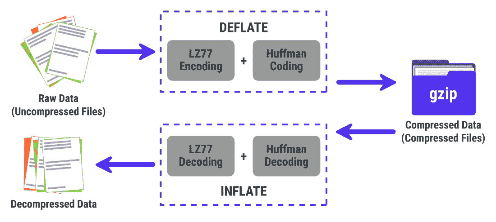

GZIP compression is based on the DEFLATE algorithm


GZIP 压缩器获取一组原始数据并无损压缩。原始数据可以来自任何文件类型，但 GZIP 最适合基于文本的资源(如 HTML、CSS、JS)。

下一节将深入介绍 GZIP 压缩的工作原理。

### GZIP 如何压缩数据

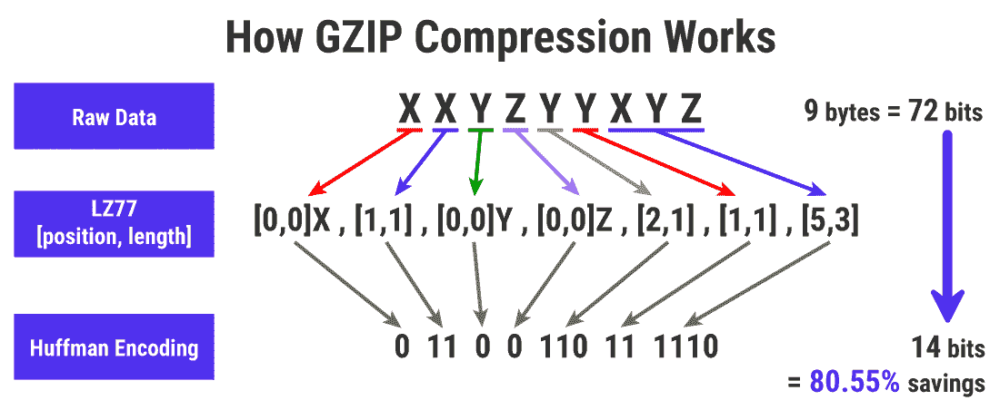

A rough illustration of how GZIP compression works


首先，GZIP 压缩器对原始数据运行 [LZ77 压缩算法](https://ethw.org/Milestones:Lempel-Ziv_Data_Compression_Algorithm,_1977)来消除冗余。该算法通过在预定义的滑动窗口(原始数据的一小部分)中寻找重复模式来工作。

然后，它用元组替换所有重复的字符串，以压缩原始数据。

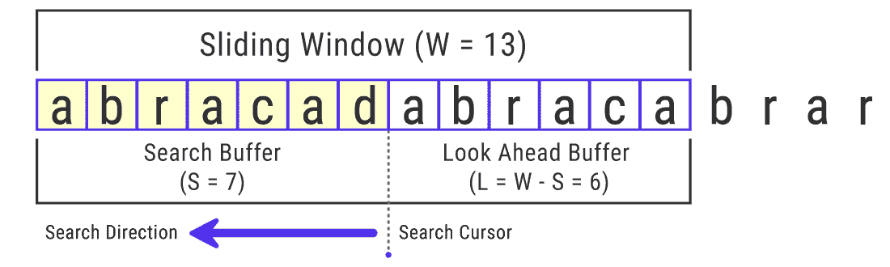

An illustration of the LZ77 encoding algorithm


在上面的例子中，滑动窗口的大小只有 13 个字符长(13 个字节)。但是，GZIP 压缩可以使用 32 KB (32，768 字节)的最大滑动窗口大小。滑动窗口的大小在 LZ77 压缩性能中起着关键作用。

使用 LZ77 算法压缩原始数据后，GZIP 压缩器使用[霍夫曼编码算法](https://en.wikipedia.org/wiki/Huffman_coding)对其进行进一步压缩。它通过给频繁出现的字符分配最少的位数，而给不常见的字符分配最多的位数来实现这一点。

这种技术类似于莫尔斯电码中使用的技术，其中在英语中出现频率更高的字母得到最短的序列。

要理解霍夫曼编码算法是如何工作的，考虑一下`**BOOKKEEPER**`这个词。它有 10 个字符长，但只有 6 个独特的字符。这个单词很好地混合了单字母、双字母和三字母。

几乎所有的[网站都使用 UTF-8 字符编码](https://w3techs.com/technologies/overview/character_encoding)来表示字母和符号。UTF-8 中的每个 [ASCII 字符](https://en.wikipedia.org/wiki/ASCII)，也包括英语字母表，使用 1 个字节(8 位)。


The word “BOOKKEEPER” has many repeating letters


像`**BOOKKEEPER**`这样的 10 个字符的字符串将需要 10 个字节(80 位)的内存。您可以看到它包含 1 个字母`**B**, **P**, **R**`的实例，2 个字母`**O**`和`**K**`的实例，以及 3 个字母`**E**`的实例。

霍夫曼编码算法使用这一知识来无损压缩字符串。它通过生成一棵二叉树来做到这一点，每一个唯一的字母作为一片树叶。

出现频率最低的字母(例如 **B** 、 **P** 、 **R** )会发现自己在树的底部，而那些频繁出现的字母(例如 **E** 、 **O** 、 **K** )理想情况下会发现自己在树的顶部。

树中最顶端的节点是**根**，其值等于字符串中的字符总数。

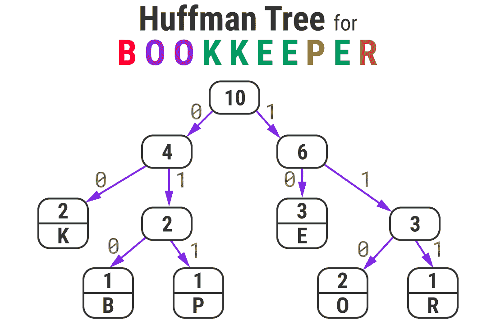

Huffman Tree for the word “BOOKKEEPER”


生成霍夫曼树后，所有的左分支和右分支箭头分别被赋予 **0** 和 **1** 的数字。然后，您可以通过追踪根到叶的路径并连接所有的 **0** 和 **1** 来为任何字符生成霍夫曼代码

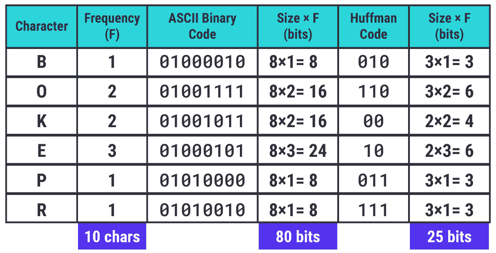

Huffman codes are unique binary codes for every character


你可以注意到，频率最高的字母具有最小比特长度的霍夫曼码。

**注意:**霍夫曼编码算法可以通过对具有相同频率的字符使用不同的排序策略来生成备选的二进制代码。但是，编码字符串的总大小将保持不变。


An 80 bits word encoded as a 25 bits string


存储原始单词所需的内存减少了 68.75%。

使用具有 **0** / **1** 约定的霍夫曼树生成满足[前缀属性](https://en.wikipedia.org/wiki/Prefix_code)的二进制代码。它确保任何特定字符的霍夫曼代码不是任何其他字符代码的前缀，这使得使用霍夫曼树解码编码字符串变得容易。这对 GZIP 减压速度起主要作用。

就像上面的单词一样，GZIP 压缩器使用霍夫曼编码算法来进一步优化 LZ77 算法生成的元组。这会产生带有[的高度压缩文件。gz 扩展](https://docs.fileformat.com/compression/gz/)。

如果你有兴趣了解更多关于 GZIP 的工作方式，[参考这个视频](https://www.youtube.com/watch?v=wLx5OGxOYUc)快速浏览。
T3】

### GZIP 压缩有多好？

通常，GZIP 对小文件的压缩率可以达到 70%左右，但对较大的基于文本的资产，压缩率可以达到 90%。


GZIP compression ratios for some popular CSS and JS libraries


在上表中，你可以看到用 GZIP 压缩缩小的文件可以进一步减小它们的大小。

**注意:**您可以使用 GZIP 压缩任何文件类型，但是对于已经使用其他方法压缩的资产(例如，图像、视频)，这不会带来任何节省。有时，它甚至会增加文件的大小。

压缩算法的强度不仅仅取决于它的压缩比，还取决于它压缩和解压缩数据的速度和效率。这是 GZIP 最擅长的用例。

由于 GZIP 使用流算法快速解压缩，它非常适合速度至关重要的 web 协议。此外，GZIP 使用最少的资源来压缩和解压缩数据，使其成为服务器和客户端的理想选择。

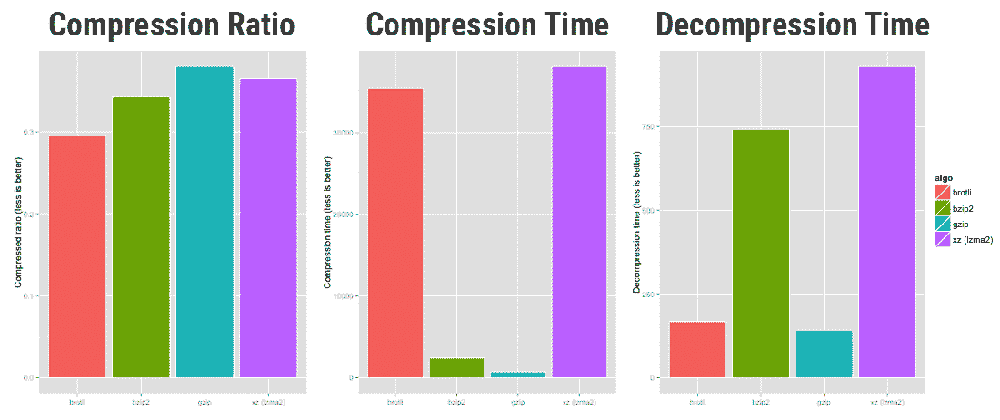

Compression performance of brotli vs bzip2 vs GZIP vs xz (Source: OpenCPU)


上面的图表比较了 **brotli** 、 **bzip2** 、 **gzip** 和 **xz** 压缩算法的压缩性能。GZIP 在压缩比测试中以微弱优势失利，但在压缩和解压缩速度方面，它彻底击败了竞争对手。

查看压缩速度图，我们可以得出结论，GZIP 是 HTTP 服务器和 web 上其他数据流的实时压缩的理想选择。考虑到它对网络发展的积极作用，IETF 批准了 GZIP 作为 HTTP/1.1 的三种标准压缩格式之一。

**注:**GZIP 压缩库的一个抽象，叫做 **zlib** 被用于许多流行的操作系统(Linux，macOS，iOS)和现代游戏主机(PlayStation 4，Wii U，Xbox One)。它也用于无损 PNG 文件格式来压缩图像。

## 6 压缩的优势

让我们仔细看看 GZIP 压缩最重要的优势。

### 提供相当不错的压缩比

如前所述，与竞争对手相比，GZIP 并没有最好的压缩比。但离他们也不远了。通常，它可以帮助您将基于文本的资源的大小减少 70-90%。

### 超快速压缩和解压缩

就数据压缩和解压缩速度而言，GZIP 显然是赢家。对于 HTTP 服务器和其他数据流的动态压缩来说，这是非常理想的。

### 需要很少的内存

GZIP 占用的内存很少，适用于内存容量有限的服务器和系统。因此，你会发现它甚至被最便宜的虚拟主机提供商所支持。

### 即使在最坏的情况下也不会扩展太多

像 GZIP 这样的无损数据压缩算法有一个严格的限制，超过这个限制就不能压缩数据。

通常，当资源已经被很好地压缩，或者如果资源很小，并且添加 GZIP 字典的开销高于压缩节省时，就会发生这种情况。我们可以把这种现象归结为一个叫做[熵编码](https://en.wikipedia.org/wiki/Entropy_encoding)的概念。GZIP 对这种效应有很强的抵抗力。

### 免费使用和开源

GZIP 最初是作为早期 Unix 系统中使用的专利**压缩**程序的[免费开源替代品](https://www.gnu.org/software/gzip/)而创建的。因此，它没有任何专利，任何人都可以自由使用。

### 享有普遍支持

[根据 W3Techs](https://w3techs.com/technologies/details/ce-gzipcompression) 的数据，**追踪的所有网站中有 82%** 使用 GZIP 压缩，这使得它成为网络上使用最广泛的压缩算法。

几乎所有的服务器和客户端都支持 GZIP。无论你在哪个服务器上托管你的站点，你都可以通过启用 GZIP 来加速它。

## 网站速度测试工具中的 GZIP 警告

除了缩小，启用 GZIP 是最简单有效的速度优化方法之一。

这也是优化 WordPress 最简单的方法之一。尽管如此，许多 WordPress 网站仍然不使用它。

当您访问网站时，您的浏览器会通过检查`**content-encoding: gzip**`响应头来检查 web 服务器是否启用了 GZIP。如果文件头存在，它会检索压缩文件，对它们进行解压缩，然后自动将较小的文件提供给你。

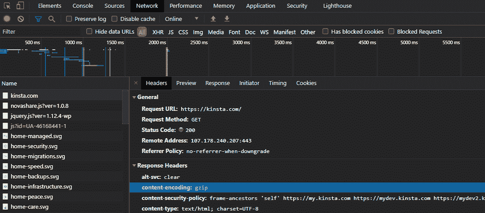

The “content-encoding: gzip” response header in Chrome DevTools


如果浏览器没有检测到 GZIP 响应头，它会下载未压缩的文件。在大多数情况下，页面加载速度可能相差几秒钟。因此，如果你没有启用 GZIP，你会在[网站速度测试工具](https://kinsta.com/blog/website-speed-test/)中看到警告。

### 谷歌页面速度洞察/灯塔中的 GZIP 警告

当你的网站没有启用任何文本压缩时，Google PageSpeed Insights 会发出警告。

**注意:** Google PageSpeed Insights 和 Google Lighthouse 是两个独立的网站性能测试工具。他们彼此独立工作，直到 2018 年，谷歌升级了 [PageSpeed Insights，使用 Lighthouse](https://webmasters.googleblog.com/2018/11/pagespeed-insights-now-powered-by.html) 作为其分析引擎。因此，PageSpeed Insights 和 Lighthouse 现在是一体的。

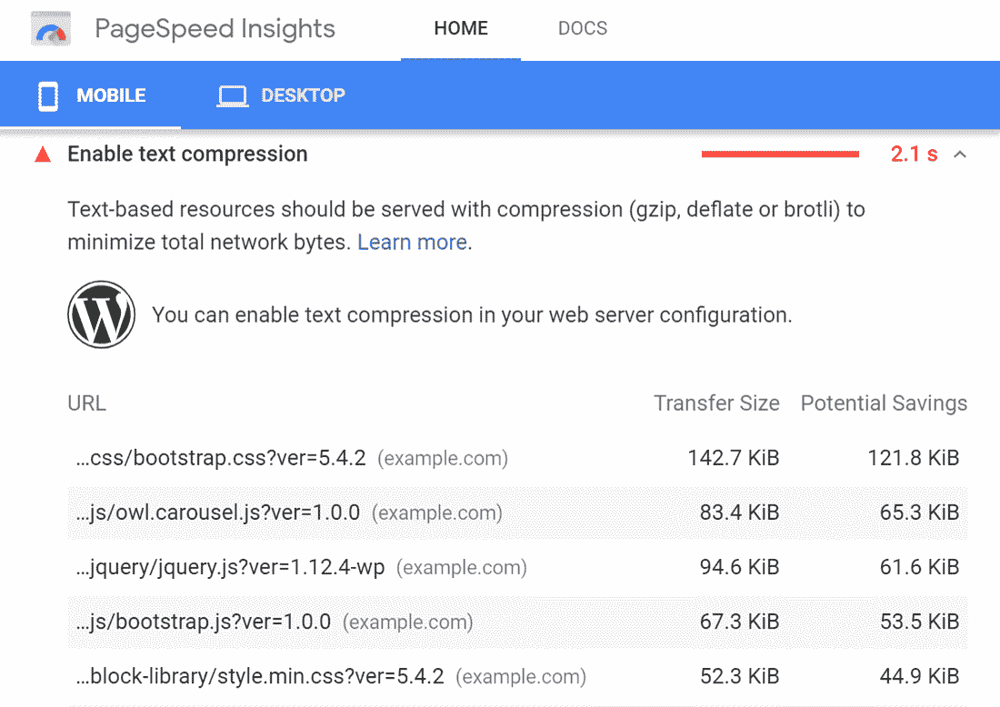

“Enable text compression” warning in Google PageSpeed Insights


在上面的示例站点中，压缩基于文本的资源可以将页面权重降低超过 78% ，并将页面加载时间加快 **2.1 秒**。

**注意:** PageSpeed Insights 依赖于服务器返回给浏览器的响应头。有时，即使启用了 GZIP 压缩，它也可能会显示错误的警告。可能是因为在使用中间代理服务器或安全软件的机器上运行速度测试。它们可能会干扰从外部服务器下载压缩文件。

## 注册订阅时事通讯


### 想知道我们是怎么让流量增长超过 1000%的吗？

加入 20，000 多名获得我们每周时事通讯和内部消息的人的行列吧！

[Subscribe Now](#newsletter)

### GTmetrix 中的 GZIP 警告

如果您的网站不提供基于压缩文本的资源，GTmetrix 会显示警告。像 Google PageSpeed Insights 一样，它也会向您展示您可以实现的潜在节省。

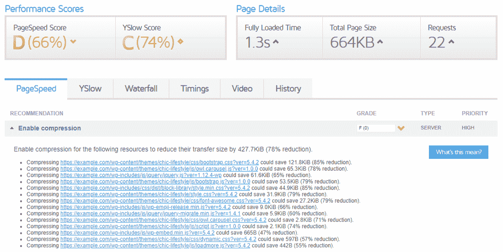

“Enable compression” warning in GTmetrix


**注:** [GTmetrix 正在升级其速度测试](https://gtmetrix.com/blog/big-changes-are-coming-to-gtmetrix-lighthouse-new-test-locations-new-pro-plans-etc/)算法，用最新的 [Google Lighthouse metrics](https://developer.chrome.com/docs/lighthouse/overview/) 替换旧的 PageSpeed Insights 和 YSlow 库。您可以预期它的 GZIP 压缩警告与 Lighthouse 显示的警告类似。

### Pingdom 工具中的 GZIP 警告

Pingdom Tools 抛出一个简单的警告，要求用 GZIP 压缩你的网站组件。

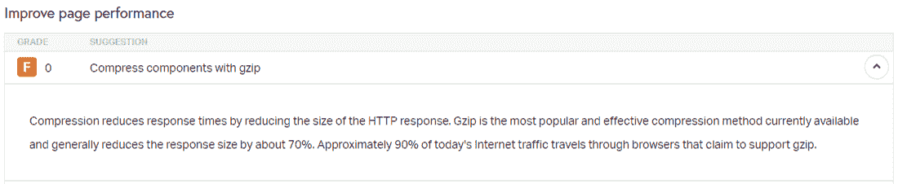

“Compress components with GZIP” warning in Pingdom Tools


在描述部分，Pingdom Tools 还提供了一些关于 GZIP 重要性的统计数据。酷豆！

### 网页测试中的 GZIP 警告

[WebPageTest](https://kinsta.com/blog/website-speed-test/#5-webpagetest) 在其**性能评估**选项卡中显示警告，如果它检测到任何可压缩的响应没有以最佳方式提供。

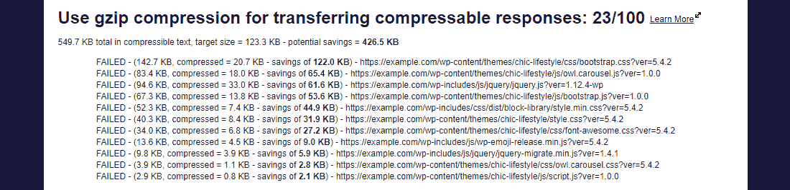

“Use GZIP compression” warning in WebPageTest


WebPageTest 还会给出一个分级分数，以显示警告的严重程度。例如，它将上述警告评为 100 分中的 23 分，这意味着您应该优先修复它。

## 如何检查 GZIP 压缩是否启用？

所有现代浏览器都有效地支持`**Accept-Encoding: gzip, deflate**` HTTP 头[。因此，大多数 web 主机在它们所有的服务器上默认启用 GZIP 压缩(或](https://developer.mozilla.org/en-US/docs/Web/HTTP/Headers/Content-Encoding#Compressing_with_gzip) [Brotli 压缩](https://kinsta.com/blog/brotli-compression/))。

当 web 服务器看到浏览器发送的这个报头时，它们识别出浏览器对 GZIP 的支持，并使用`**content-encoding: gzip**`报头以压缩的 HTTP 响应进行响应。

但是，如果你使用另一个主机提供商，或者如果你只是想确认你的网站是否提供 GZIP 压缩内容正确，总是检查它是否启用。

下面是一些简单的方法来检查 GZIP 压缩。

### 1.在线 GZIP 压缩测试工具

使用在线工具是检查您的网站是否启用了 GZIP 压缩的最简单方法。我推荐使用免费的[检查 GZIP 压缩](https://www.giftofspeed.com/gzip-test/)或 [HTTP 压缩测试](https://www.whatsmyip.org/http-compression-test/)工具。只需输入你的网站[网址](https://kinsta.com/knowledgebase/what-is-a-url/)，点击**检查**或**测试**按钮。

这两个在线工具将向您显示一份简短的报告，说明 GZIP 是否启用，以及您通过提供启用 GZIP 压缩的测试 URL 而节省(或可能节省)的数据传输量。

第一个工具还会显示其他相关信息，如网站的服务器类型、内容类型和压缩时间。

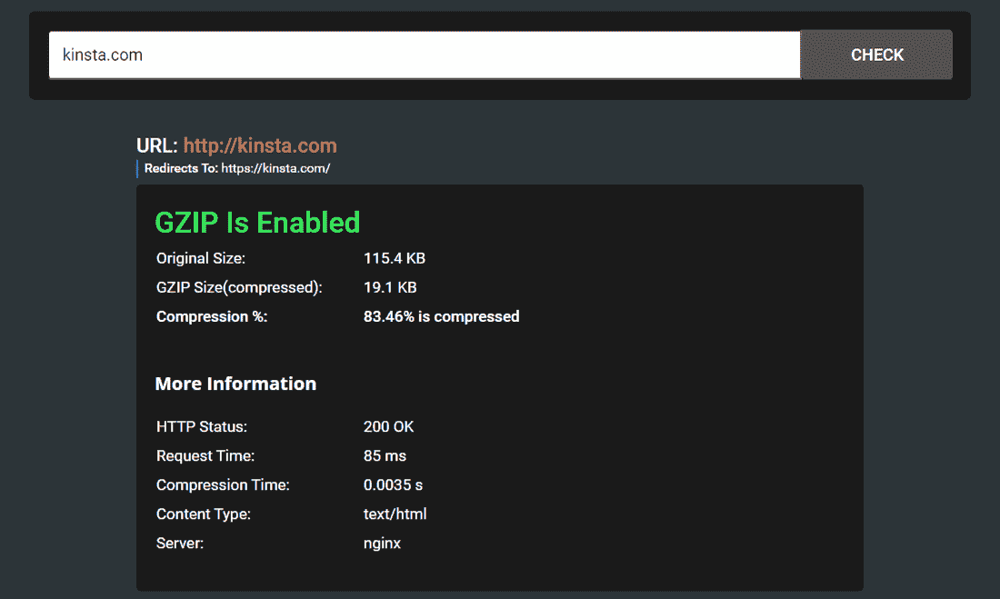

Testing Kinsta’s homepage with the Check GZIP Compression tool


**注意:**截至 2021 年 11 月 5 日，Kinsta 已通过 Cloudflare 升级到 Brotli 压缩，适用于所有 HTTPS 请求。您可以通过检查请求的响应头中的`content-encoding: br`来测试 Brotli 压缩。

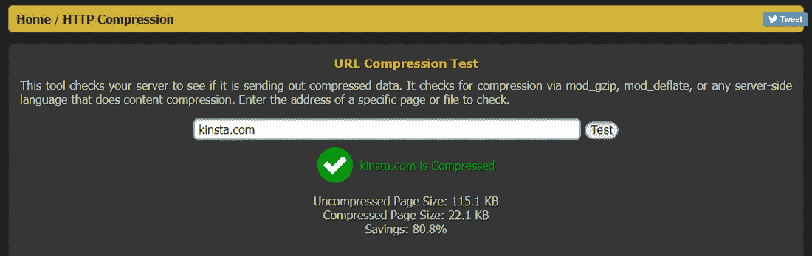

Testing Kinsta.com with HTTP Compression Test tool


你应该注意到，GZIP 优化不只是停留在你的网页上，它还包括静态的基于文本的资产，如样式表、脚本和字体。如果您使用 CDN 来服务这些资产，那么您需要确保 CDN 也在启用 GZIP 压缩的情况下服务这些资产。

大多数[现代 CDN](https://kinsta.com/blog/wordpress-cdn/)如 Cloudflare、[、Kinsta CDN](https://kinsta.com/help/kinsta-cdn/) 、KeyCDN、CloudFront 都支持 GZIP 压缩。您可以通过直接链接到资产来测试由 CDN 提供的资产的 GZIP 压缩。

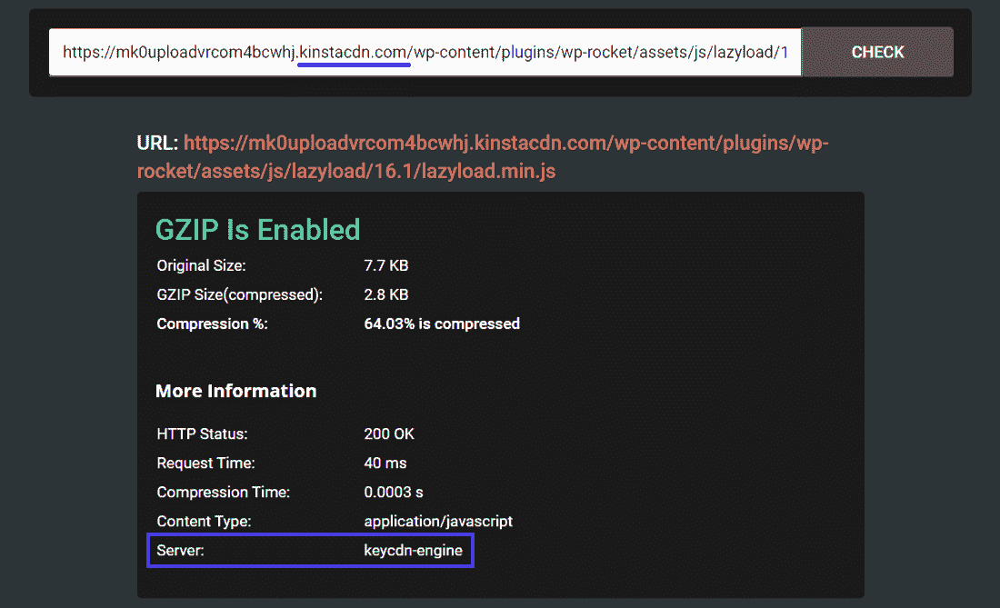

GZIP compression test for assets hosted by a CDN


在上面的报道中，可以看到 [Kinsta CDN 使用的是 KeyCDN 引擎](https://kinsta.com/help/kinsta-cdn/)，这是一个传统的 pull CDN。

**注意:** Kinsta 已转而选择 Cloudflare 作为其 CDN 合作伙伴，以加快和保护我们客户的站点。你可以[在这里](https://kinsta.com/knowledgebase/cloudflare-integration/)了解更多信息。

如果你使用 Kinsta 来托管你的站点，你不必担心 GZIP 压缩，因为我们默认启用 Brotli 压缩，这是一种比 GZIP 压缩更快的替代方式。


### 信息

Kinsta 的所有托管计划都包括对 Kinsta CDN 的免费支持。


### 2.“content-encoding:gzip”HTTP 响应头

验证网站是否提供 GZIP 压缩内容的第二种方法是验证`**content-encoding: gzip**` HTTP 响应头。

厌倦了低于 1 级的 WordPress 托管支持而没有答案？试试我们世界一流的支持团队！[查看我们的计划](https://kinsta.com/plans/?in-article-cta)

你可以打开 Chrome DevTools 或 Firefox Developer Tools，在 **Network** 部分下寻找这个响应头。

我之前已经展示过它在 Chrome DevTools 中的样子。这是它在 Firefox 开发工具中的样子。

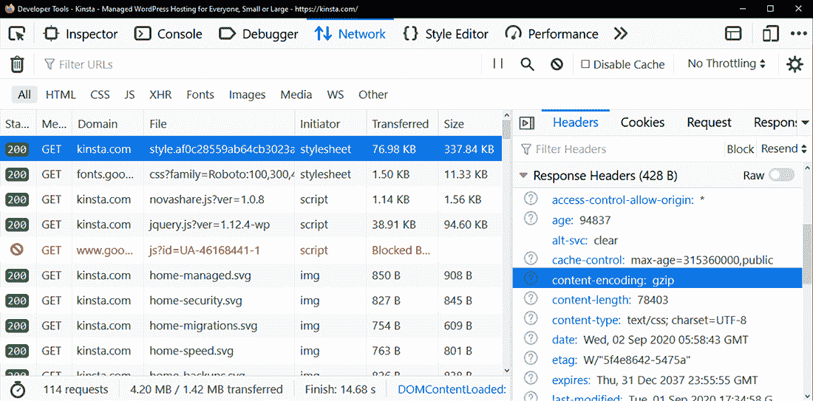

The “content-encoding: gzip” header in Firefox Developer Tools


你也可以在 Chrome DevTools 设置面板中启用“使用大请求行”选项来查看页面的原始大小和压缩大小。正如你在下面看到的，用 GZIP 压缩后，原始页面的大小从 **118 KB** 减少到仅仅 **22.9 KB** 。

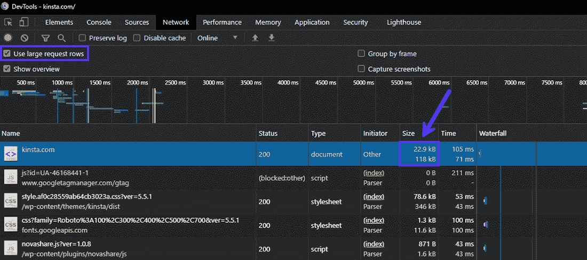

View the compressed vs uncompressed page sizes in Chrome Devtools


### 3.网页速度测试工具

大多数网站速度测试工具会警告你不要像 GZIP 那样使用压缩来服务你的网页。许多读到这篇文章的读者可能正是因为这些 GZIP 警告而来，其中许多我已经在上面深入讨论过了。

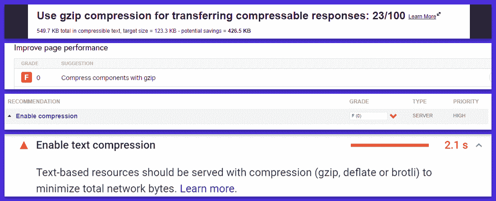

GZIP warnings in various webpage speed testing tools


你可以使用 PageSPeed Insights、GTmetrix、Pingdom Tools 和 WebPageTest 等工具来检查你的 WordPress 网站是否启用了 GZIP 压缩。

## 如何启用 GZIP 压缩？

如果您的 web 服务器上没有启用 GZIP 压缩，有许多方法可以启用它。确切的方法取决于您用来托管网站的 web 服务器。

**重要提示:**[一如既往地在编辑之前备份你的站点](https://kinsta.com/help/wordpress-backups/)和服务器配置文件。

### 1.使用 WordPress 插件启用 GZIP

在你的 WordPress 站点上启用 GZIP 压缩最简单的方法是使用缓存或性能优化插件。

例如，如果你在 [Apache web 服务器](https://kinsta.com/knowledgebase/what-is-apache/)上托管你的 WordPress 站点， [W3 总缓存](https://kinsta.com/blog/w3-total-cache/)在其**浏览器缓存**设置面板下包含一个选项[启用 GZIP 压缩](https://kinsta.com/blog/w3-total-cache/#w3-total-cache-settings--browser-cache)。

同样， [WP Rocket 让你自动添加 GZIP 压缩规则](https://docs.wp-rocket.me/article/63-enable-gzip-compression)。这些插件通过将 Apache 的`**mod_deflate**`模块添加到[来启用 GZIP 压缩。htaccess 文件](https://kinsta.com/knowledgebase/wordpress-htaccess-file/)。

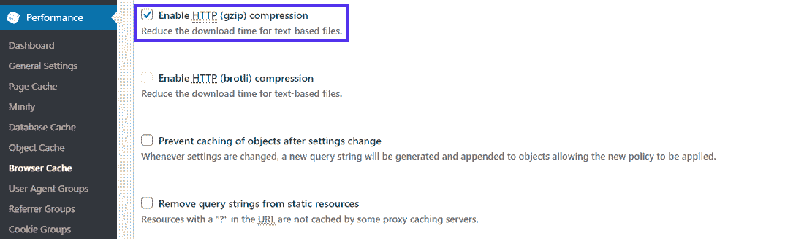

Enabling GZIP compression in W3 Total Cache


WordPress 插件需要权限来修改你的网络服务器上的文件。如果他们没有正确的权限，那么他们将失败或向您显示一个错误。

在这种情况下，您需要联系您的主机提供商或使用下面的代码片段手动修改您的 web 服务器的配置文件。

**注意:** Kinsta 已经针对[高性能、可靠性和安全性](https://kinsta.com/blog/fastest-wordpress-hosting/)优化了其平台。这还包括为其所有托管计划默认启用 GZIP 压缩。

由于第三方[缓存插件](https://kinsta.com/blog/wordpress-caching-plugins/)可能会导致与 Kinsta 内部性能优化的冲突，Kinsta 不允许在其服务器上使用大部分插件。要了解更多信息，你可以查看[金斯塔被禁插件](https://kinsta.com/knowledgebase/banned-plugins/)的完整列表。

### 2.在 Apache Web 服务器上启用 GZIP

根据 Netcraft 的数据，Apache 提供的活跃站点比当今使用的任何其他网络服务器都多。它也是 WordPress 推荐的[两个网络服务器之一。](https://make.wordpress.org/hosting/handbook/server-environment/#recommended-servers)

要在 Apache 服务器上启用 GZIP 压缩，您需要使用它的`**mod_filter**`和`**mod_deflate**`模块，并用正确的指令正确地配置它们。他们将指导 Apache 压缩服务器输出，然后通过网络发送给客户机。

根据您拥有的访问级别，您有两个选项来编辑 Apache 的服务器配置:

1.  如果您可以访问主服务器配置文件(通常称为 **httpd.conf** ，建议您使用它将 Apache 配置为**。htaccess** 文件会让 Apache 变慢。
2.  如果你不能访问主服务器配置文件，这通常是大多数 WordPress 共享主机提供商的情况，那么你需要使用**配置 Apache。htaccess** 文件。

第一个选项是严格针对系统管理员的，因为主机提供商很少允许你编辑主服务器配置文件。解释如何这样做超出了本文的范围。你可以参考 HTML5 样板项目共享的样本 [Apache 服务器配置](https://github.com/h5bp/server-configs-apache)和 [Apache 文档](https://httpd.apache.org/docs/current/configuring.html)来开始。

第二种选择对大多数 WordPress 网站所有者来说是理想的，因为许多共享主机提供商允许你编辑**。htaccess** 文件。

首先，[使用 SFTP](https://kinsta.com/knowledgebase/how-to-use-sftp/) 或你主机的在线文件管理器找到**。你的 WordPress 站点根目录下的 htaccess** 文件。然后将下面的代码片段添加到其中。

**重要提示:**确保`**mod_filter**`模块在你的服务器上是活动的。默认情况下，大多数 web 主机都启用了它，但是如果没有启用，那么`**AddOutputFilterByType**`指令将不起作用，并可能抛出 HTTP 500 错误。添加下面的代码片段后，如果有任何问题，可以查看服务器的错误日志。

```
<IfModule mod_deflate.c>
  # Compress HTML, CSS, JavaScript, Text, XML and fonts
  AddOutputFilterByType DEFLATE application/javascript
  AddOutputFilterByType DEFLATE application/rss+xml
  AddOutputFilterByType DEFLATE application/vnd.ms-fontobject
  AddOutputFilterByType DEFLATE application/x-font
  AddOutputFilterByType DEFLATE application/x-font-opentype
  AddOutputFilterByType DEFLATE application/x-font-otf
  AddOutputFilterByType DEFLATE application/x-font-truetype
  AddOutputFilterByType DEFLATE application/x-font-ttf
  AddOutputFilterByType DEFLATE application/x-javascript
  AddOutputFilterByType DEFLATE application/xhtml+xml
  AddOutputFilterByType DEFLATE application/xml
  AddOutputFilterByType DEFLATE font/opentype
  AddOutputFilterByType DEFLATE font/otf
  AddOutputFilterByType DEFLATE font/ttf
  AddOutputFilterByType DEFLATE image/svg+xml
  AddOutputFilterByType DEFLATE image/x-icon
  AddOutputFilterByType DEFLATE text/css
  AddOutputFilterByType DEFLATE text/html
  AddOutputFilterByType DEFLATE text/javascript
  AddOutputFilterByType DEFLATE text/plain
  AddOutputFilterByType DEFLATE text/xml  

  # Remove browser bugs (only needed for ancient browsers)
  BrowserMatch ^Mozilla/4 gzip-only-text/html
  BrowserMatch ^Mozilla/4\.0[678] no-gzip
  BrowserMatch \bMSIE !no-gzip !gzip-only-text/html
  Header append Vary User-Agent
</IfModule>
```

仅在您的**的现有指令之后添加上面的代码。htaccess** 文件。保存文件，然后检查它是否在您的服务器上启用了 GZIP 压缩。

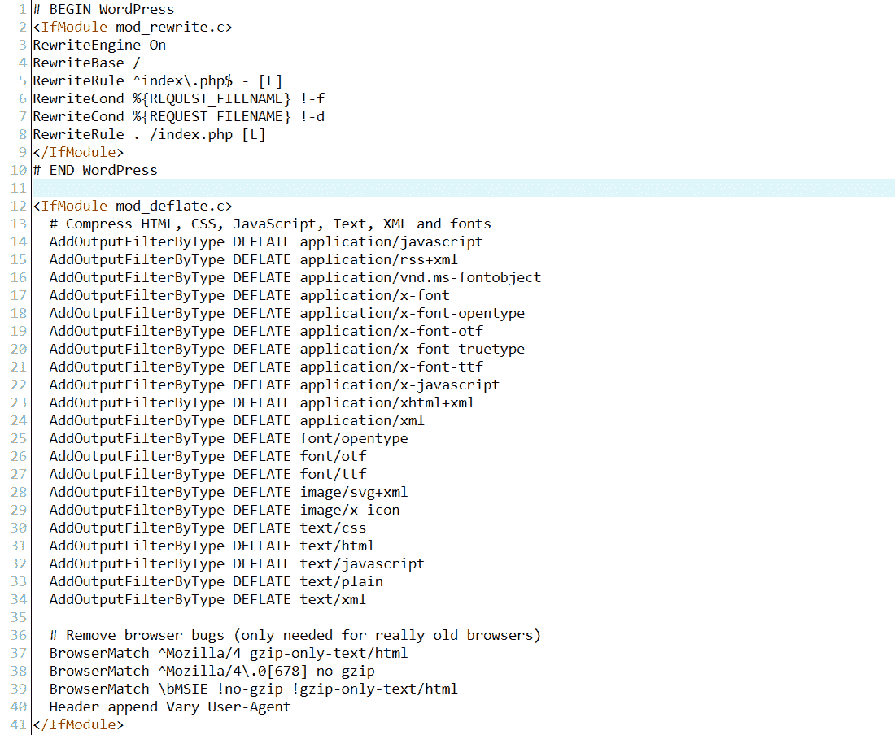

Example of Apache .htaccess file after enabling GZIP compression


您的 web 服务器现在应该为上面列出的所有文件扩展名提供压缩文件。您可以使用前面提到的任何方法来确认这一点。

如果你想确保客户端的代理和安全软件不会干扰 GZIP 压缩，你可以用下面的代码替换上面的代码。

```
<IfModule mod_deflate.c>
  # force compression for clients that mangle 'Accept-Encoding' request headers
  <IfModule mod_setenvif.c>
  <IfModule mod_headers.c>
    SetEnvIfNoCase ^(Accept-EncodXng|X-cept-Encoding|X{15}|~{15}|-{15})$ ^((gzip|deflate)\s*,?\s*)+|[X~-]{4,13}$ HAVE_Accept-Encoding
    RequestHeader append Accept-Encoding "gzip,deflate" env=HAVE_Accept-Encoding
  </IfModule>
  </IfModule>

  # compress all output with one of the following file extensions
  <IfModule mod_filter.c>
    AddOutputFilterByType DEFLATE "application/atom+xml" \
                                  "application/javascript" \
                                  "application/json" \
                                  "application/ld+json" \
                                  "application/manifest+json" \
                                  "application/rdf+xml" \
                                  "application/rss+xml" \
                                  "application/schema+json" \
                                  "application/geo+json" \
                                  "application/vnd.ms-fontobject" \
                                  "application/wasm" \
                                  "application/x-font-ttf" \
                                  "application/x-javascript" \
                                  "application/x-web-app-manifest+json" \
                                  "application/xhtml+xml" \
                                  "application/xml" \
                                  "font/eot" \
                                  "font/opentype" \
                                  "font/otf" \
                                  "font/ttf" \
                                  "image/bmp" \
                                  "image/svg+xml" \
                                  "image/vnd.microsoft.icon" \
                                  "text/cache-manifest" \
                                  "text/calendar" \
                                  "text/css" \
                                  "text/html" \
                                  "text/javascript" \
                                  "text/plain" \
                                  "text/markdown" \
                                  "text/vcard" \
                                  "text/vnd.rim.location.xloc" \
                                  "text/vtt" \
                                  "text/x-component" \
                                  "text/x-cross-domain-policy" \
                                  "text/xml"
  </IfModule>

  # define and map media types to their appropriate encoding type    
  # Using SVG format (Scalable Vector Graphics) is highly recommended to    
  # load logos, icons, text, and simple images. You can compress .SVG files
  # further using GZIP to create .SVGZ files. However, most browsers don’t
  # know that they need to decompress them first if they’re not served
  # without an appropriate ‘content-encoding’ HTTP response header. Thus,
  # these images wouldn’t show up in the browser. Hence, this module.

  <IfModule mod_mime.c>
    AddType image/svg+xml svg svgz
    AddEncoding gzip svgz
  </IfModule>

</IfModule>
```

您可以通过访问它的[代码库](https://github.com/h5bp/server-configs-apache/blob/main/dist/.htaccess#L808)并跟踪那里链接的所有资源来了解这里使用的所有指令。

### 3.在 Nginx Web 服务器上启用 GZIP

根据 Netcraft 的说法， [Nginx 是面向网络的计算机使用最多的网络服务器](https://news.netcraft.com/archives/2020/08/26/august-2020-web-server-survey.html)。如果目前的趋势继续下去，它将很快超过 Apache 成为活跃网站使用最多的 web 服务器。甚至 [Kinsta 也使用 Nginx](https://kinsta.com/blog/nginx-vs-apache/#nginx) 来支持其性能优化的托管解决方案。

您可以使用 [ngx_http_gzip_module](https://nginx.org/en/docs/http/ngx_http_gzip_module.html) 中定义的指令在 Nginx web 服务器上启用 GZIP 压缩。

首先，将下面给出的指令添加到您的 **nginx.conf** 文件中。通常，您可以在服务器的`**/etc/nginx/nginx.conf**`位置找到这个文件。

```
# enables GZIP compression
gzip on; 

# compression level (1-9)
# 6 is a good compromise between CPU usage and file size
gzip_comp_level 6;

# minimum file size limit in bytes to avoid negative compression outcomes
gzip_min_length 256;

# compress data for clients connecting via proxies
gzip_proxied any;

# directs proxies to cache both the regular and GZIP versions of an asset
gzip_vary on;

# disables GZIP compression for ancient browsers that don't support it
gzip_disable "msie6";

# compress outputs labeled with the following file extensions or MIME-types
# text/html MIME-type is enabled by default and need not be included
gzip_types
application/atom+xml
application/geo+json
application/javascript
application/x-javascript
application/json
application/ld+json
application/manifest+json
application/rdf+xml
application/rss+xml
application/vnd.ms-fontobject
application/wasm
application/x-web-app-manifest+json
application/xhtml+xml
application/xml
font/eot
font/otf
font/ttf
image/bmp
image/svg+xml
text/cache-manifest
text/calendar
text/css
text/javascript
text/markdown
text/plain
text/xml
text/vcard
text/vnd.rim.location.xloc
text/vtt
text/x-component
text/x-cross-domain-policy;
```

如果您的站点提供大型 JS 和 CSS 文件，那么您可以通过向您的 **nginx.conf** 文件添加以下指令来增加用于压缩的缓冲区大小:

```
# sets the 'number' and 'size' of buffers for GZIP compression
# default buffer size is 4K or 8K depending on the platform
gzip_buffers 16 8k;
```

保存 **nginx.conf** 文件后，不要忘记重新加载 Nginx。

```
sudo service nginx reload
```

最后，您应该测试您的服务器是否启用了 GZIP 压缩。你可以参考 [Nginx 文档](http://nginx.org/en/docs/http/ngx_http_gzip_module.html#gzip_disable)，获得所有`**ngx_http_gzip_module**`指令的最新列表。

### 4.在 IIS Web 服务器上启用 GZIP

微软的互联网信息服务(IIS)是目前使用的第三大流行网络服务器。IIS 主要部署在运行在 Windows 上的企业环境中，特别是用于设置公司特定的内部网和外部网服务器。

由于各种兼容性问题，[很少用于托管 WordPress 网站](https://soupbowl.io/2020/01/the-complete-guide-to-running-wordpress-on-windows)。

然而，如果您发现自己处于需要在 IIS 上启用 GZIP 压缩的罕见情况中，您可以参考[微软的文档](https://learn.microsoft.com/en-us/previous-versions/windows/it-pro/windows-server-2008-R2-and-2008/cc771003(v=ws.10))来开始。你可能也会发现[这个堆栈溢出线程](https://stackoverflow.com/questions/25580078/how-to-enable-gzip-compression-in-iis-7-5)很有帮助。

## GZIP 压缩的替代方案

网络上的数据压缩世界一直在进步。随着[平均页面重量大小](https://httparchive.org/reports/page-weight)的不断增加，网络技术也在努力赶上它，以使在网络上传输数据更加有效。

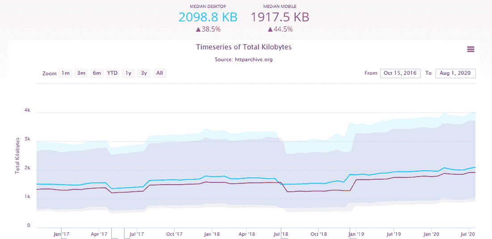

Increase in page weight size over time (Source: HTTPArchive)


一种新的压缩算法在过去几年中获得了广泛的流行: [Brotli](https://github.com/google/brotli) 。压缩 WOFF2 web 字体最初是 Brotli 的主要关注点，但它已经扩展到支持任何类型的数据压缩。

Brotli 比 GZIP 更好地压缩数据，但它需要更多的时间和资源来压缩数据。然而，它的解压时间与 GZIP 相当，尽管还是慢了一点。

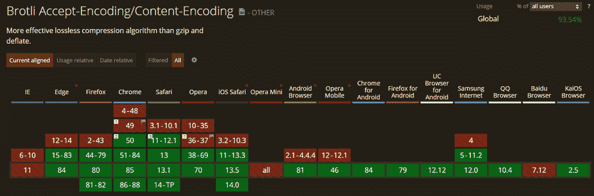

Brotli support across various browsers


今天大多数浏览器都支持 Brotli ，但是在 WordPress 网站上使用它仍然有些复杂。您必须通过支持 Brotli 或允许您安装 Brotli 库的托管提供商来托管您的站点。大多数托管 WordPress 主机还不完全支持它，但是如果你使用 CDN，比如 [Cloudflare](https://support.cloudflare.com/hc/en-us/articles/200168396-What-will-Cloudflare-compress-) 或者[key dn](https://www.keycdn.com/blog/keycdn-brotli-support)，你可以很容易地启用它。


### 信息

由于我们的 [Cloudflare 集成](https://kinsta.com/cloudflare-integration/)，Kinsta 托管的所有站点都默认启用了 Brotli 压缩。


[Ready to speed up your site? ⚡️ Enabling GZIP compression on your web server is one of the simplest and most efficient ways to achieve that. Learn how with this step-by-step walkthrough ⬆️Click to Tweet](https://twitter.com/intent/tweet?url=https%3A%2F%2Fkinsta.com%2Fblog%2Fenable-gzip-compression%2F&via=kinsta&text=Ready+to+speed+up+your+site%3F+%E2%9A%A1%EF%B8%8F+Enabling+GZIP+compression+on+your+web+server+is+one+of+the+simplest+and+most+efficient+ways+to+achieve+that.+Learn+how+with+this+step-by-step+walkthrough+%E2%AC%86%EF%B8%8F&hashtags=WordPress%2CWebsiteSpeed)

## 摘要

一个优化良好的网站对每个人都有好处。用户喜欢更快的网站，网站所有者喜欢降低托管费用，网站主机喜欢在服务器上实现的优化。像 GZIP 这样的压缩技术是加快访问者页面加载速度的最佳方式之一。

WordPress 网站所有者可以通过启用 GZIP 压缩来立即加速他们的网站。默认情况下，Kinsta 在其所有服务器上启用 GZIP 压缩，但是对于其他服务器，本文涵盖了在各种 web 服务器上启用该功能的多种方法。

对于任何网站来说，速度都是至关重要的。只需压缩！

* * *

让你所有的[应用程序](https://kinsta.com/application-hosting/)、[数据库](https://kinsta.com/database-hosting/)和 [WordPress 网站](https://kinsta.com/wordpress-hosting/)在线并在一个屋檐下。我们功能丰富的高性能云平台包括:

*   在 MyKinsta 仪表盘中轻松设置和管理
*   24/7 专家支持
*   最好的谷歌云平台硬件和网络，由 Kubernetes 提供最大的可扩展性
*   面向速度和安全性的企业级 Cloudflare 集成
*   全球受众覆盖全球多达 35 个数据中心和 275 多个 pop

在第一个月使用托管的[应用程序或托管](https://kinsta.com/application-hosting/)的[数据库，您可以享受 20 美元的优惠，亲自测试一下。探索我们的](https://kinsta.com/database-hosting/)[计划](https://kinsta.com/plans/)或[与销售人员交谈](https://kinsta.com/contact-us/)以找到最适合您的方式。**