# 如何修复 ERR_CONNECTION_TIMED_OUT 错误(逐步)

> 原文：<https://kinsta.com/blog/err_connection_timed_out/>

您是否在浏览器中看到“ERR_CONNECTION_TIMED_OUT”错误？不是一个非常有用的错误消息，是吗？如果你是 WordPress 的日常用户，那么知道这些可能阻止你访问你的网站的常见错误总是好的。

在今天的帖子中，我们将深入探讨“ERR_CONNECTION_TIMED_OUT”错误，并研究您可能会看到此错误的原因以及如何快速修复它。简单地说，这表明系统不可用，给定的连接时间已过，现在请求已超时。但这实际上意味着什么呢？

让我们来了解一下！

### 查看我们的[视频指南](https://www.youtube.com/watch?v=z7Bx0YUNkSE)来修复 ERR_CONNECTION_TIMED_OUT 错误


## 什么是 ERR_CONNECTION_TIMED_OUT 错误？

ERR_CONNECTION_TIMED_OUT 错误通常意味着您的本地网络连接有问题。然而，情况并非总是如此。

根据 [WordPress 支持文档](https://wordpress.org/support/article/common-wordpress-errors/#connection-timed-out)，当你的**网站试图做超过你的服务器可以管理的事情**时，会出现连接超时错误。这在[共享主机](https://kinsta.com/knowledgebase/shared-vps-dedicated-hosting/)上尤其常见，你的[内存限制](https://kinsta.com/knowledgebase/php-memory-limit/)受到限制。


> 需要在这里大声喊出来。Kinsta 太神奇了，我用它做我的个人网站。支持是迅速和杰出的，他们的服务器是 WordPress 最快的。
> 
> <footer class="wp-block-kinsta-client-quote__footer">
> 
> 
> 
> <cite class="wp-block-kinsta-client-quote__cite">Phillip Stemann</cite></footer>

[View plans](https://kinsta.com/plans/)

当你访问一个网站，它不加载，你的浏览器将尝试大约 30 秒左右，直到它终止连接。之后，它将返回一个“ERR_CONNECTION_TIMED_OUT”错误，表明存在通信问题。在谷歌浏览器中，你可能会看到“这个网站无法访问。Domain.com 花了太长时间才做出回应。”

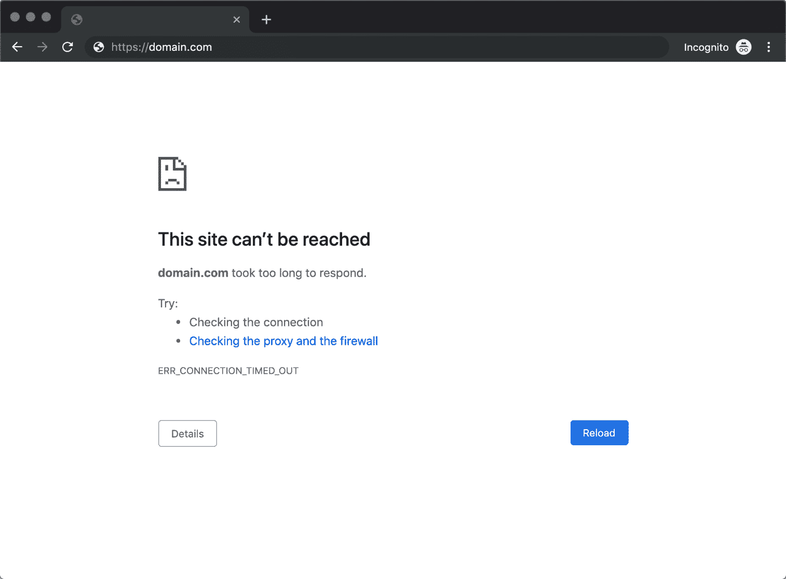

ERR_CONNECTION_TIMED_OUT error in Chrome


由于不同的 web 浏览器、操作系统和服务器，错误会以多种不同的方式出现。但大多数都有相同或相似的意思。“ERR_NETWORK_CHANGED”和“ERR _ CONNECTION _ rejected”是两个密切相关的错误，通常可以通过以下相同的故障诊断步骤来解决。

另一个出现在“此站点无法访问”下的常见错误代码是[DNS _ PROBE _ FINISHED _ NX domain](https://kinsta.com/knowledgebase/dns_probe_finished_nxdomain/)，这是一个 [DNS 错误](https://kinsta.com/knowledgebase/dns-server-not-responding/)，本质上意味着所请求的域名不存在。

下面是一些错误在不同浏览器中如何出现的例子。

### Mozilla Firefox

在 Mozilla Firefox 中，错误会显示为“连接超时”domain.com 的服务器反应太慢了。

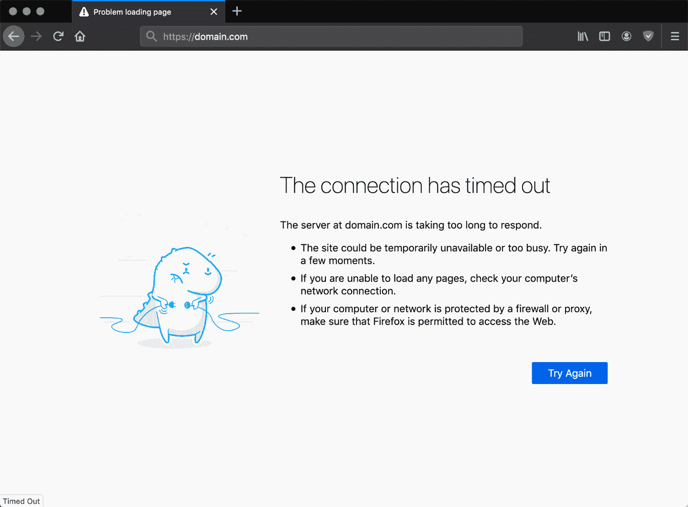

ERR_CONNECTION_TIMED_OUT error in Firefox


### 微软 Edge

在 Microsoft Edge 中，错误会显示为“Hmmm…无法到达此页面。Domain.com 花了太长时间才做出回应。”但是，在 Edge 中，它也包含“ERR_CONNECTION_TIMED_OUT”错误。


ERR_CONNECTION_TIMED_OUT error in Edge


### 旅行队

在 Safari 中，错误会显示为“Safari 无法打开页面。Safari 无法打开页面“domain.com ”,因为此页面所在的服务器没有响应。”

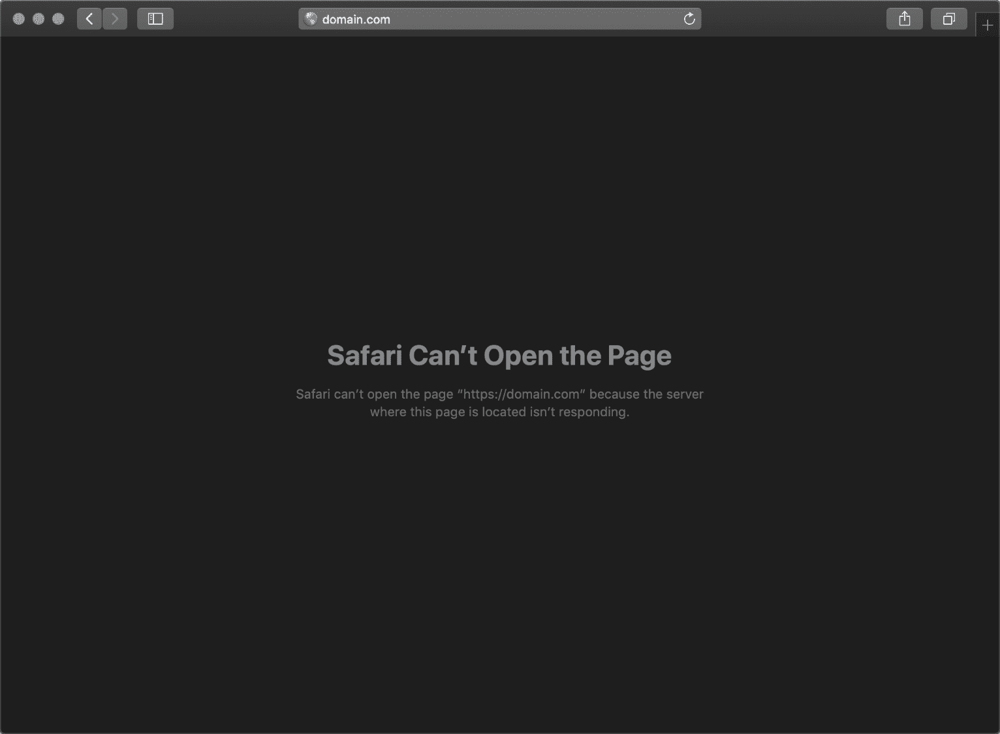

ERR_CONNECTION_TIMED_OUT error in Safari


 

我们将有效网站管理的知识规模化，并将其转化为电子书和视频课程。点击[这里](https://kinsta.com/ebooks/wordpress/manage-multiple-wordpress-sites/?utm_campaign=how-to-speed-up-your-wordpress-site&utm_source=blog-knowledgebase&utm_medium=video)下载 2020 年管理 40 多个 WordPress 网站指南！

## 如何修复错误连接超时错误

如果你在你的 WordPress 网站上看到这个错误，你应该从哪里开始排除故障？如果没有大量的上下文，有时甚至从哪里开始都会令人沮丧和不知所措。通常情况下，这些问题要么是**客户端问题**(你的网络连接或防火墙问题)，要么是托管网站的服务器的**问题** **(内存限制、执行时间等)。).**

### 1.检查您的连接

Google Chrome、Firefox 和 Edge 都建议您检查网络连接。虽然这听起来很明显，但它们都指向首先检查您的连接，因为这是最常见的错误原因之一。以下是我们推荐的几件事:

*   重启你的家庭或办公室路由器。这只需要几分钟，解决的问题比许多人愿意承认的要多。要完全重启它，请断开电源，然后等待 30 秒，再将其插回。
*   检查一下你的 wifi 连接是否很差或很慢。这在咖啡店或机场等繁忙的公共 wifi 热点上是常有的事。

### 2.暂时禁用防火墙和防病毒软件

防火墙和防病毒软件旨在保护用户及其系统。他们定期扫描您的设备，并自动阻止任何可疑的活动。但是，这种类型的安全性有时会导致连接问题。

这是因为**防火墙经常会阻止他们不需要的页面**或者拒绝完全安全的内容。像 AVG 这样的软件，我们已经见过很多次了。要检查您是否是这种情况，请尝试禁用防火墙和防病毒程序。当然，只有在你确定你要访问的网站是安全的情况下，才建议这样做。

此外，您应该只是暂时禁用这类软件。在你检查完错误是否已经解决之后，重新打开它，这样你就不会变得容易受到攻击。如果您因为防火墙或防病毒软件而反复遇到错误，您可能需要考虑更换您正在使用的软件。

这些类型的工具也有你可以填写的所谓的“假阳性”报告。如果你 100%确定你访问的网站被屏蔽了，你可以让软件开发者知道。以下是一些快速链接:

*   [AVG 的假阳性形式](https://www.avg.com/en-us/false-positive-file-form)
*   [诺顿误报形式](https://submit.symantec.com/false_positive/)
*   [Sophos 假阳性形式](https://community.sophos.com/on-premise-endpoint/f/sophos-endpoint-software/4337/how-to-report-false-positives-to-sophos)

### 3.禁用代理设置

如果使用代理服务，有时您可能会看到 ERR_CONNECTION_TIMED_OUT 错误。这通常很少见，尤其是在客户端。然而，一个可能在你不知情的情况下就已经设置好了。要禁用或检查以确保没有启用代理设置，请按照下列步骤操作。

访问 Chrome 浏览器中的**设置**菜单。这将打开完整的选项菜单。在**系统**部分下(你需要点击底部的**高级**才能看到这个)，你应该会找到一个标题为**开放代理设置**的条目。通过选择它，您将进入相应的菜单:

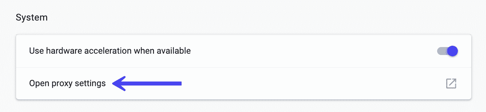

Open Proxy Settings in Chrome


下一步取决于您当前使用的系统。Windows 用户需要点击**局域网设置**并取消选择局域网使用代理服务器选项。如果你是 Mac 用户，你应该会立即在相关菜单中找到你自己。然后，您必须取消选中所有可选的代理协议，并检查 ERR_CONNECTION_TIMED_OUT 消息是否已解决。

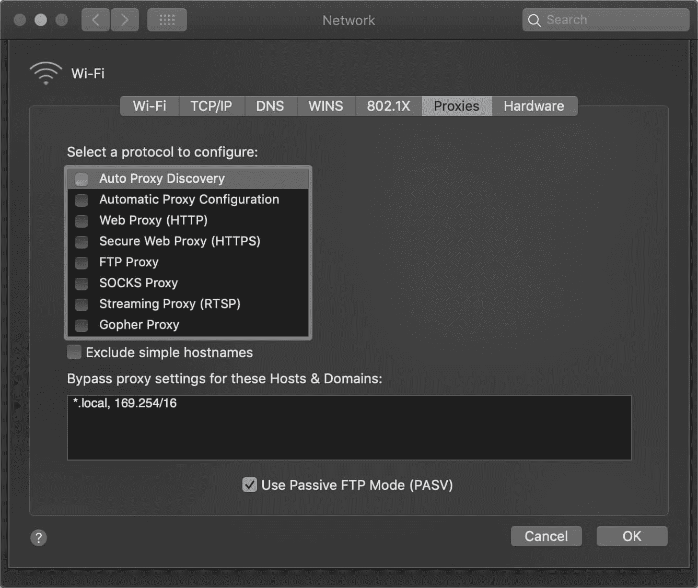

Uncheck proxies on Mac


如果您使用的是 Windows，您会看到一个“局域网(LAN)设置”窗口出现。您需要确认“为您的局域网使用代理服务器”选项是否被取消选中。


Disable Chrome proxy settings in Windows


如果你使用的是像 ExpressVPN 或 TunnelBear 这样的 VPN，情况也是如此。确保您不是偶然连接的。

### 4.更改 DNS 服务器

你可以尝试的下一件事是改变你的 [DNS 服务器](https://kinsta.com/knowledgebase/what-is-dns/)。默认情况下，DNS 服务器由您的 [ISP](https://kinsta.com/knowledgebase/what-is-isp/) 自动分配。但是您可以尝试暂时将它们更改为公共 DNS 服务器，如 Google 或 Cloudflare。

*   一些人更愿意长期使用谷歌的公共域名系统(8.8.8.8 和 8.8.4.4)，因为它们有时更可靠。
*   Cloudflare 还提供安全且速度极快的免费 DNS([1.1.1.1](https://1.1.1.1/)和 1.0.0.1)，我们将在本例中使用。如果你想使用谷歌的步骤是一样的，你只需用谷歌取代 DNS 服务器地址。

提示:如果你已经在使用一个免费的 DNS 服务器并遇到问题，移除它并默认回到你的 ISP 的 DNS 服务器有时也能解决问题。

Google 和 Cloudflare 并不是 100%的时候都是完美的，我们已经注意到切换回来解决了这个问题。如果你在机场或咖啡店使用 Wifi 热点，情况尤其如此。

#### 窗户

在 Windows 中，只需按 Windows 徽标键和 r 键打开命令提示符，然后键入“控制面板”并按回车键。

## 注册订阅时事通讯


### 想知道我们是怎么让流量增长超过 1000%的吗？

加入 20，000 多名获得我们每周时事通讯和内部消息的人的行列吧！

[Subscribe Now](#newsletter)

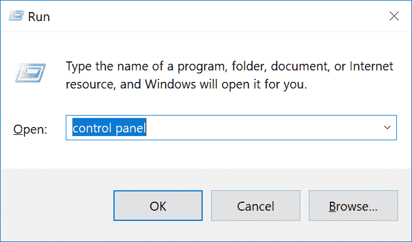

Run Control Panel Windows


点击“网络和互联网”，然后点击“网络和共享中心”在左侧，单击“更改适配器设置”


Change adapter settings


右键单击您当前的连接，根据您的连接方式，这可能是本地连接或无线网络连接。然后点击“属性”

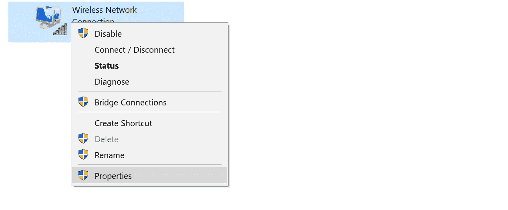

Wireless connection properties


选择互联网协议版本 4 ( [或版本 6，如果需要的话](https://kinsta.com/blog/ipv4-vs-ipv6/)，并点击“属性”

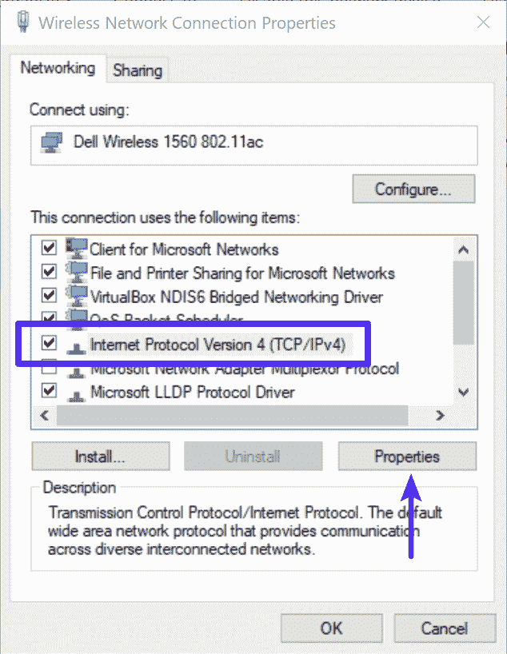

IPV 4 properties


记下所有现有设置，以防需要恢复。点按“使用以下 DNS 服务器地址”输入以下内容，或者用这些内容替换现有内容:

对于 IPv4: `1.1.1.1`和`1.0.0.1`；对于 IPv6: `2606:4700:4700::1111`和`2606:4700:4700::1001`

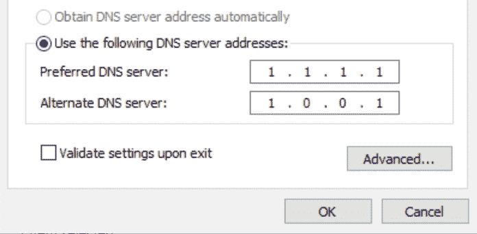

DNS server addresses


单击确定，然后关闭。重启你的浏览器。

#### Mac

若要在 Mac 上更改 DNS 服务器，请前往“系统偏好设置”…

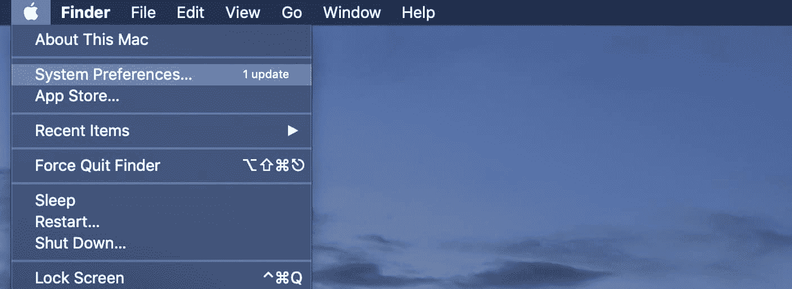

Mac system preferences


单击网络图标，然后单击“高级”

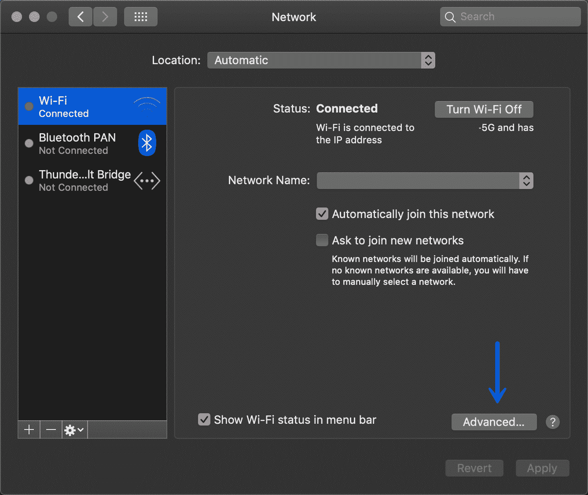

Mac network advanced


单击“DNS”选项卡。

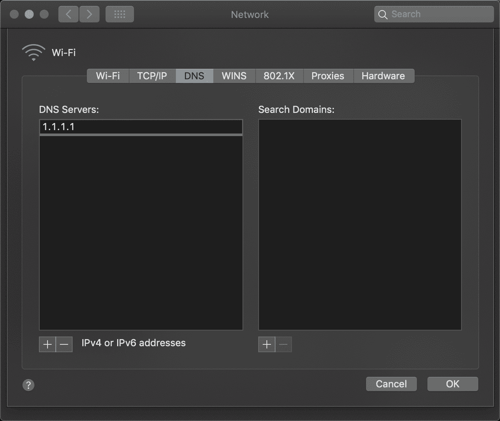

Mac DNS


然后添加 Cloudflare 的 DNS 服务器地址。

对于 IPv4: `1.1.1.1`和`1.0.0.1`；对于 IPv6: `2606:4700:4700::1111`和`2606:4700:4700::1001`

### 5.刷新/更新 DNS

你也可以尝试[刷新你的本地 DNS 缓存](https://kinsta.com/knowledgebase/flush-dns/)。这类似于清除浏览器缓存。这可能是你试图访问的网站没有解析到正确的 IP 地址。如果你刚刚[将你的 WordPress 站点迁移到一个新的主机](https://kinsta.com/knowledgebase/wordpress-migrations/)，等待事情完全传播是很重要的。这有时可能需要长达 24 小时，尽管也可能只有几分钟。这取决于您的 DNS 提供商和您的 DNS 记录的 TTL 值。

[](https://demo.kinsta.com/register?utm_campaign=mykinsta%20demo&utm_source=blog-knowledgebase&utm_medium=gif-banner)

#### Windows 操作系统

在 Windows 中，只需打开命令提示符并输入以下内容:

```
ipconfig /flushdns
```


Command prompt – flush DNS


如果成功，您应该会看到“成功刷新 DNS 解析器缓存”。

#### 苹果个人计算机

对于 macOS 用户，您可以在终端中输入以下内容:

```
dscacheutil -flushcache
```

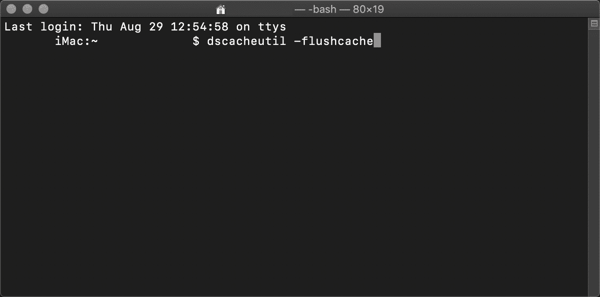

Mac flush cache


注意:MAC 上没有成功消息。

### 6.检查您的主机文件

每台计算机都有他们所谓的本地主机文件。这是一个包含手动 DNS 条目的文件，这些条目被映射到特定的 [IP 地址](https://kinsta.com/knowledgebase/server-ip-address-could-not-be-found/)。通常情况下，只有当您想在将域名切换到新主机之前[预览您的 DNS](https://kinsta.com/knowledgebase/edit-hosts-file/) 时，才需要对其进行编辑。或者也许你有一个本地开发站点，使用像 [DevKinsta](https://kinsta.com/devkinsta/) 、vagger 或者 [Docker](https://kinsta.com/knowledgebase/what-is-docker/) 这样的工具运行。

有许多不同的方法可以改变或编辑这个文件。因此，检查以确保你试图访问的网站不在那里总是好的。只需按照下面的步骤。

#### 窗户

hosts 文件通常需要额外的访问权限。所以第一步是作为管理员打开你的文本编辑器。只需点击您的开始菜单，搜索您的文本编辑器，右键单击它，并选择“作为管理员运行。”这可以在[任何文本编辑器](https://kinsta.com/blog/best-text-editors/)中完成，如记事本、Notepad++和 Atom 等。在下面的例子中，我们使用了 [Sublime](https://kinsta.com/blog/how-to-use-sublime-text/) 。

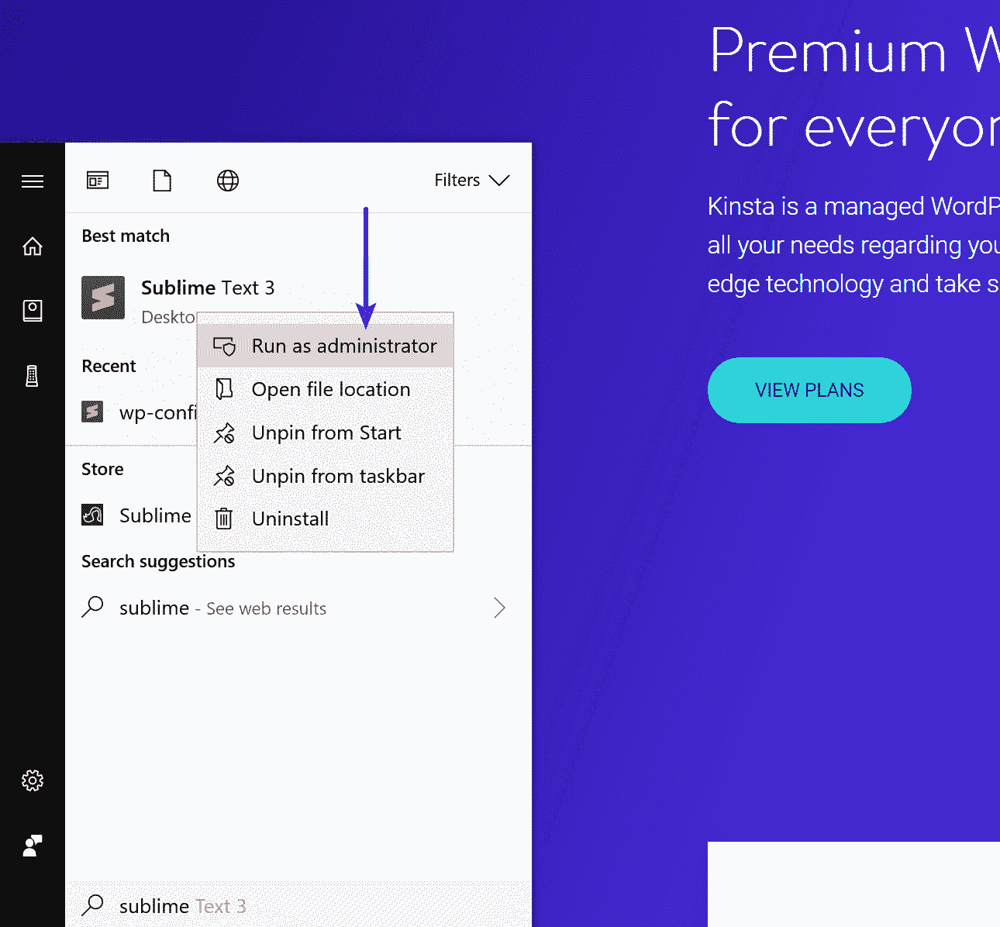

Run text editor as administrator


在文本编辑器中，单击文件→打开，浏览到以下位置:

```
C:\Windows\System32\drivers\etc\
```

单击主机文件并“打开”

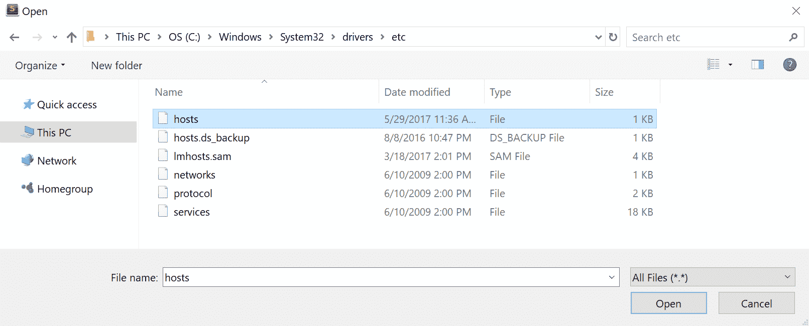

Open hosts file


仔细检查并确保您尝试访问的网站不在列表中。如果是，请删除它。


#### 苹果个人计算机

为了在 Mac 电脑上查看你的主机文件，我们建议你带上 T2 防毒面具。这是一个免费的应用程序，可以用作主机文件管理器，主机文件编辑器，并在它们之间切换。它让一切都变得快速而简单！否则，您可以按照以下步骤在 Mac 上手动编辑 hosts 文件。

进入实用程序，然后点击“终端”

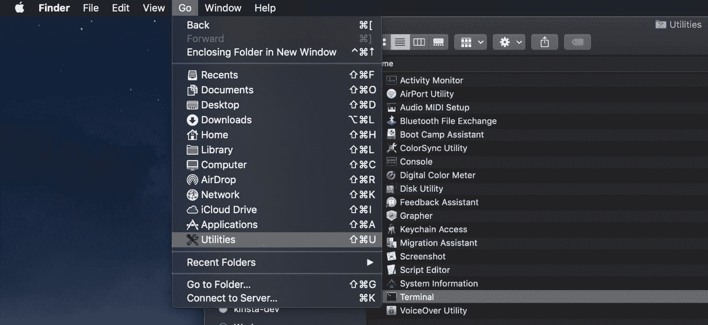

Mac utilities terminal


输入以下命令并按 Enter 键(很可能还会提示您输入管理员密码)。

```
sudo nano /private/etc/hosts
```

仔细检查并确定您尝试访问的网站没有在您的主机文件中列出。如果是，请删除它。

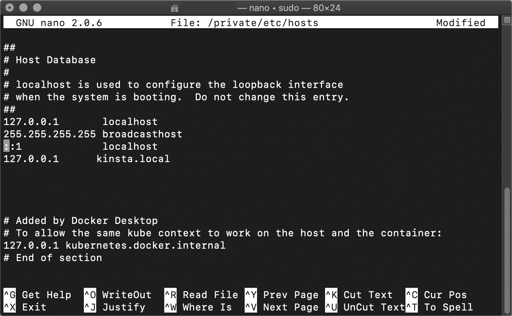

Edit hosts file on Mac


### 7.检查您域名的域名系统

您还应该验证您的域名的 DNS 是正确地指向您的主机提供商。如果你是 Kinsta 的客户，我们有一篇关于如何[将你的域名](https://kinsta.com/help/dns/)和/或 DNS 指向 Kinsta 的深度文章。如果你最近[将你的 WordPress 网站](https://kinsta.com/blog/wordpress-migration-plugins/)迁移到了一个新的主机上，可能是你的电脑上的 DNS 缓存不正确。在这种情况下，上面的第 5 步应该可以解决这个问题。或者它可能只是太快了，你需要等待几个小时的 DNS 完全传播。

### 8.清除浏览器缓存

Web 浏览器将信息存储在计算机的缓存中。这包括您的浏览历史、保存的登录数据和 cookies，所有这些都会被记录下来，以便在下次访问时更快地加载相关页面。

尽管缓存很有用，但当它们过时时会导致许多问题。幸运的是，这个问题很容易通过清空缓存来解决。

但是在你这样做之前，你可以通过首先[以匿名模式](https://support.google.com/chrome/answer/95464?co=GENIE.Platform%3DDesktop&hl=en)打开你的浏览器，很容易地检查是否是浏览器缓存问题。或者您可以尝试不同的浏览器。如果您仍然看到错误，那么您将需要继续清除您的缓存。

在这个例子中，我们将使用谷歌浏览器。首先打开主菜单(在浏览器窗口的右上角)。从那里，选择更多工具:然后您可以点击清除浏览器数据。

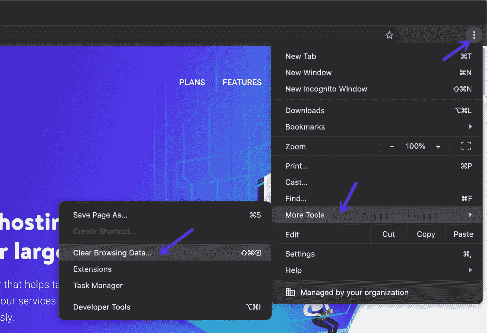

Chrome clear browsing data


在出现的页面上，您需要确保选择了所有列出的文件类别。否则，Chrome 将无法清空整个缓存。相反，它只会删除最近的条目，这不会产生预期的效果:

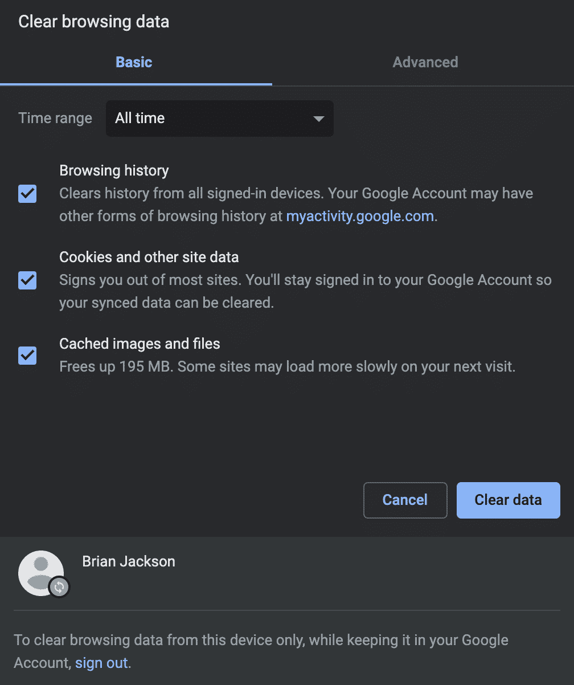

Clear browsing data


完成此过程的另一种方法是在地址栏中输入以下 URL:

```
chrome://settings/clearBrowserData
```

出现的屏幕应该允许您访问我们上面概述的相同选项。以下是一些其他有用的清除缓存的链接。

*   [如何为所有浏览器强制刷新单个页面](https://kinsta.com/knowledgebase/how-to-clear-browser-cache/#single)
*   [如何清除谷歌浏览器的缓存](https://kinsta.com/knowledgebase/how-to-clear-browser-cache/#chrome)
*   [如何清除 Mozilla Firefox 的缓存](https://kinsta.com/knowledgebase/how-to-clear-browser-cache/#firefox)
*   [如何清除 Mac 上的缓存(Safari](https://kinsta.com/knowledgebase/how-to-clear-browser-cache/#safari)
*   [如何清除 Internet Explorer 的缓存](https://kinsta.com/knowledgebase/how-to-clear-browser-cache/#ie)
*   [如何清除 Microsoft Edge 的缓存](https://kinsta.com/knowledgebase/how-to-clear-browser-cache/#edge)
*   [如何为 Opera 清除缓存](https://kinsta.com/knowledgebase/how-to-clear-browser-cache/#opera)

### 9.看看最大执行时间

我们将要深入的其余故障诊断步骤是那些与你的 WordPress 站点或服务器的配置有关的步骤，可能有助于修复“ERR_CONNECTION_TIMED_OUT”错误。

第一个是为您的站点设置的**最大执行时间**。在大多数服务器上，默认时间设置为 30 秒。这是一个 PHP 脚本被允许运行的时间量(在此之后超时)。在共享主机上，这通常设置为低或保留默认值。

你不能轻易地从 WordPress 修改它，因为 [php.ini](https://www.php.net/manual/en/ini.core.php) 文件位于你的服务器上。为了改变这一点，我们建议联系你的主机提供商，看看他们是否能提供帮助。在**的 Kinsta，我们将默认的最大执行时间设置为 300 秒。**

[](https://demo.kinsta.com/register?utm_campaign=mykinsta%20demo&utm_source=blog-knowledgebase&utm_medium=gif-banner)

如果您想自己尝试修改它，通常可以使用以下选项之一来完成。两者都取决于你的主机提供商如何配置他们的服务器。

#### 选项 1–修改 php.ini 文件中的最大执行时间

如果您的主目录中有一个`php.ini`文件，找到`max_execution_time`参数并修改它。例如，如果设置为 30 秒，您可以将其增加到 300 秒。

```
max_execution_time = 300
```

#### 选项 2–修改最大执行时间。htacess 文件

如果上面的选项不起作用，你也许可以在你的[里改变它。htaccess 文件](https://kinsta.com/knowledgebase/wordpress-htaccess-file/)。就像`php.ini`文件一样，它通常位于您的主目录中。将以下内容放在您的`.htaccess`文件的顶部:

```
php_value max_execution_time 300
```

### 10.暂时禁用您的插件

和大多数 WordPress 错误一样，插件肯定是问题的根源。要确定这是不是真的，你需要禁用你网站的所有插件。然而，如果你得到“ERR_CONNECTION_TIMED_OUT”错误，这意味着你不能访问你的 WordPress 管理区。这意味着你需要 SFTP 进入你的网站。我们推荐使用 [FileZilla](https://kinsta.com/blog/best-ftp-clients/#Filezilla) 。

一旦你的 [SFTP 客户端](https://kinsta.com/blog/best-ftp-clients/)准备好了，通过它连接到你的网站并导航到你的 WordPress 根文件夹。万一找不到，一般叫 public_html，html，public，www，或者你网站的名字。如果你是 Kinsta 的客户，它就是你的公共文件夹。

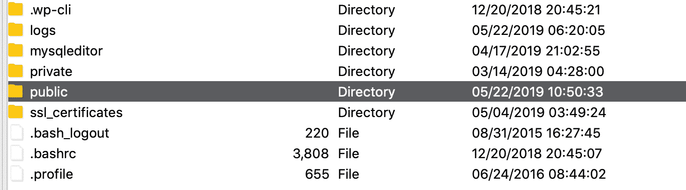

WordPress root folder SFTP


打开该文件夹，并导航到 wp-content 目录。在里面，你会看到一个名为 *plugins* 的文件夹，其中包含安装在你的站点上的每个插件的单独子目录(活动的和不活动的)。

您现在要做的是右键单击 plugins 文件夹，并将其重命名为其他名称。我们推荐 *plugins.old* 或者 *plugins.deactivated* ，这样你以后就很容易认出来了。

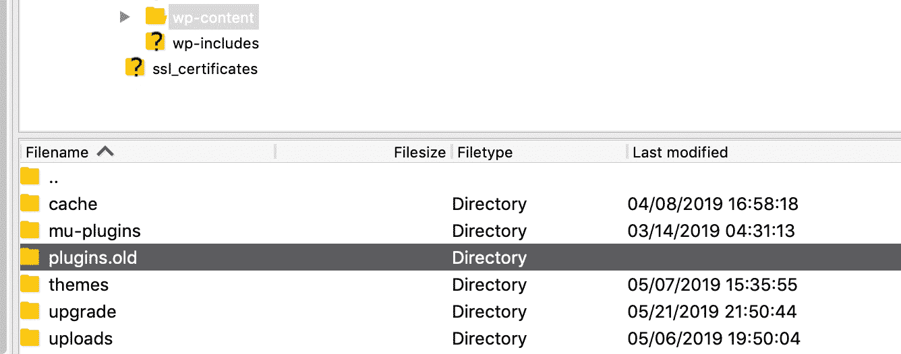

WordPress plugins folder renamed


WordPress 现在将无法找到你的任何插件。当这种情况发生时，它会自动禁用这些插件。

现在，试着进入你的 WordPress 仪表盘。如果超时错误消失了，那么你可以假设你的一个插件是罪魁祸首。你所要做的就是找出是哪一个出了问题。

返回到 *wp-content* 目录，并正确地重命名您原来的插件文件夹。然后，你需要一个接一个地禁用你的插件，直到你找到罪魁祸首。

为此，打开 *wp-content/plugins* 目录。在里面，你会发现每个插件都有一个文件夹。您要遵循的流程与之前基本相同:

1.  从第一个文件夹开始，根据自己的喜好将其重命名。
2.  检查您的网站，看看错误是否已经消失。
3.  如果不是，将上一步中的插件文件夹恢复为其原始名称。
4.  重复以上步骤，移动到列表中的下一个插件。

如果你有很多插件，这个过程可能需要一段时间，但是依次检查每个插件是至关重要的。如果你在任何时候发现了导致错误的插件，你可以卸载它或者用另一个工具替换它。

如果您完成了这些步骤却没有找到解决方案，您可以进入下一个故障诊断阶段。

### 11.暂时恢复到默认主题

既然你已经排除了插件导致超时错误的可能性，那么是时候对你的活动主题做同样的事情了。事实上，你的主题也可能产生兼容性问题。

不幸的是，这个过程与上面的不一样。WordPress 不会恢复到默认的主题，如果只是简单地重命名主题文件夹，你会得到一个错误，比如“主题目录”主题名称“不存在”或者，如果您试图重命名整个主题目录文件夹，您最终会得到“错误:主题目录要么是空的，要么不存在。请检查您的安装。

因此，你需要通过登录 [phpMyAdmin](https://kinsta.com/help/wordpress-phpmyadmin/) 来访问你的 [WordPress 数据库](https://kinsta.com/knowledgebase/wordpress-database/)。如果你是 Kinsta 的客户，这可以在 MyKinsta 仪表板的“信息”部分找到。

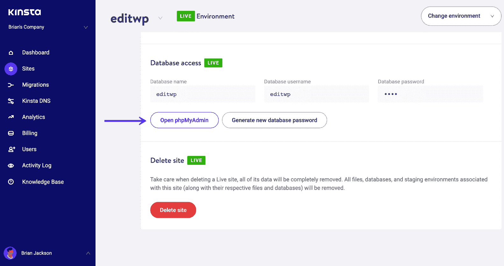

MyKinsta phpMyAdmin


点击进入“wp_options”表，然后点击“Search”选项卡。您需要在“选项名称”下搜索**模板**。

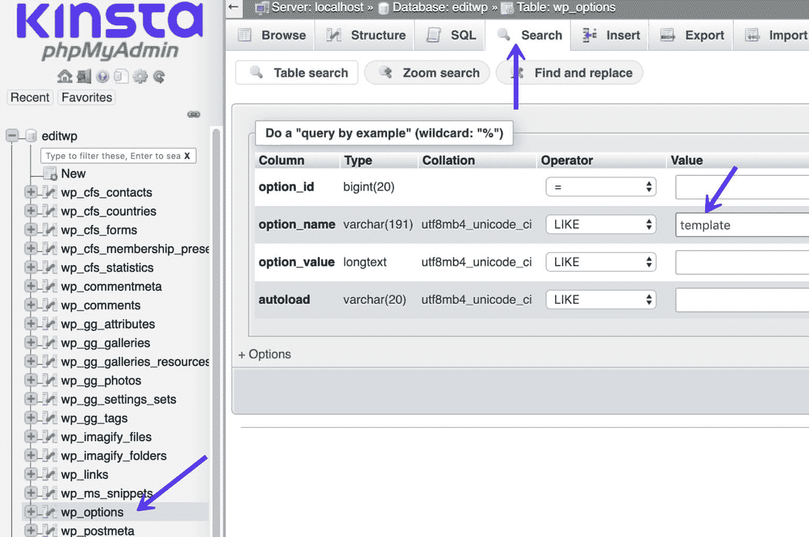

phpMyAdmin wp_options table


在“选项值”栏下，你会看到你的主题的当前名称。将此更改为默认主题之一，例如“[twenty 19](https://kinsta.com/blog/twenty-nineteen-theme/)”


wp_options template name


再次检查您的网站，看看这是否已经修复了错误。如果是的话，这仅仅意味着你的 WordPress 主题有问题，你可能需要重新安装或者恢复到你最近的备份。

### 12.增加内存限制

`WP_MEMORY_LIMIT`参数允许您指定 PHP 可以消耗的最大内存量。如果你使用共享主机，它很可能被设置为一个较低的值，如 64M。在 Kinsta，**我们将默认内存限制设置为 256M。**

您可以通过在您的[wp-config.php 文件](https://kinsta.com/blog/wp-config-php/)中添加以下内容来[增加内存限制](https://kinsta.com/knowledgebase/wordpress-memory-limit/)。这必须放在`wp-settings.php`内含物的上方。

```
define( 'WP_MEMORY_LIMIT', '256M' );
```

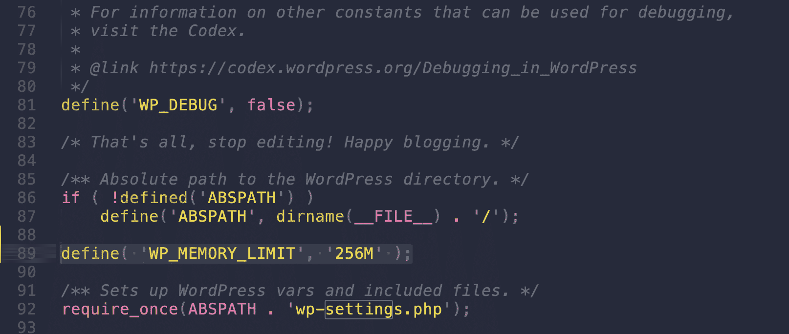

WP_MEMORY_LIMIT in wp-config.php


不确定你当前的 PHP 内存限制是多少？如果你可以访问你的 WordPress 仪表盘，并且运行的是 [WordPress 5.2](https://kinsta.com/blog/wordpress-5-2/) 或更高版本，你可以在“站点健康”工具下看到 PHP 内存限制。

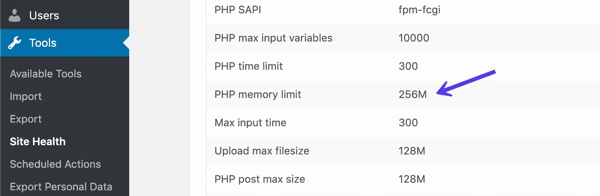

WordPress site health PHP memory limit


[Can't reach your site because of the *ERR_CONNECTION_TIMED_OUT* error message? Here are 12 possible ways to fix it! 💻😱Click to Tweet](https://twitter.com/intent/tweet?url=https%3A%2F%2Fkinsta.com%2Fblog%2Ferr_connection_timed_out%2F&via=kinsta&text=Can%27t+reach+your+site+because+of+the+%2AERR_CONNECTION_TIMED_OUT%2A+error+message%3F+Here+are+12+possible+ways+to+fix+it%21+%F0%9F%92%BB%F0%9F%98%B1&hashtags=wordpresshelp%2Cwpissues)

## 摘要

解决连接和超时错误从来都不是一件有趣的事情，但是希望您现在掌握了更多的知识来帮助快速解决它。

重要的是要记住“ERR_CONNECTION_TIMED_OUT”错误是客户端问题的结果，比如你的网络连接，或者你的 WordPress 站点所在的服务器的问题。有没有解决这个错误的其他技巧？请在评论中告诉我们。

(建议阅读:学习如何修复 Chrome 中的 [ERR_CACHE_MISS](https://kinsta.com/knowledgebase/err_cache_miss/) 错误)

* * *

让你所有的[应用程序](https://kinsta.com/application-hosting/)、[数据库](https://kinsta.com/database-hosting/)和 [WordPress 网站](https://kinsta.com/wordpress-hosting/)在线并在一个屋檐下。我们功能丰富的高性能云平台包括:

*   在 MyKinsta 仪表盘中轻松设置和管理
*   24/7 专家支持
*   最好的谷歌云平台硬件和网络，由 Kubernetes 提供最大的可扩展性
*   面向速度和安全性的企业级 Cloudflare 集成
*   全球受众覆盖全球多达 35 个数据中心和 275 多个 pop

在第一个月使用托管的[应用程序或托管](https://kinsta.com/application-hosting/)的[数据库，您可以享受 20 美元的优惠，亲自测试一下。探索我们的](https://kinsta.com/database-hosting/)[计划](https://kinsta.com/plans/)或[与销售人员交谈](https://kinsta.com/contact-us/)以找到最适合您的方式。