# 如何修复 WordPress 中的“建立数据库连接错误”

> 原文：<https://kinsta.com/blog/error-establishing-a-database-connection/>

“建立数据库连接出错”可能是 WordPress 用户可能遇到的最常见的错误之一。它与死亡 (WSOD)的[白屏紧密相连。这个错误意味着你的网站不再通信或者访问你的](https://kinsta.com/blog/wordpress-white-screen-of-death/) [WordPress 数据库](https://kinsta.com/knowledgebase/wordpress-database/)；因此，你的整个网站都瘫痪了。

您应该立即解决此错误，因为这可能会直接影响您的销售、流量和分析。

但是不要担心，今天我们将讨论一些导致这种错误的常见情况，以及一些让您的网站立即恢复运行的简单方法。

**查看我们的[视频指南，修复“建立数据库连接错误”](https://www.youtube.com/watch?v=s0fy0GvSpeA)**


## **什么是“建立数据库连接出错”？**

你的 WordPress 站点上的所有信息，比如文章数据、页面数据、元信息、插件设置、登录信息等。[是否存储在您的 MySQL 数据库](https://kinsta.com/knowledgebase/what-is-mysql/)中。唯一没有存储的数据是媒体内容，如图像和你的主题/插件/核心文件，如 index.php，wp-login.php 等。


> 需要在这里大声喊出来。Kinsta 太神奇了，我用它做我的个人网站。支持是迅速和杰出的，他们的服务器是 WordPress 最快的。
> 
> <footer class="wp-block-kinsta-client-quote__footer">
> 
> 
> 
> <cite class="wp-block-kinsta-client-quote__cite">Phillip Stemann</cite></footer>

[View plans](https://kinsta.com/plans/)

当有人访问您的网站时，PHP 执行页面上的代码，从数据库中查询信息，然后在他们的浏览器中显示给访问者。

[This error might just be tied with the White Screen of Death as one of the scariest errors you can encounter 💀 But this guide is here to help 💪Click to Tweet](https://twitter.com/intent/tweet?url=https%3A%2F%2Fkinsta.com%2Fblog%2Ferror-establishing-a-database-connection%2F&via=kinsta&text=This+error+might+just+be+tied+with+the+White+Screen+of+Death+as+one+of+the+scariest+errors+you+can+encounter+%F0%9F%92%80+But+this+guide+is+here+to+help+%F0%9F%92%AA&hashtags=WPTips%2CWordPress)

如果这不能正常工作，就会出现“建立数据库连接时出错”的消息，如下所示。整个页面是空白的，因为由于连接工作不正常，无法检索任何数据来呈现页面。这不仅会破坏你网站的前端，还会阻止你访问你的 [WordPress 仪表盘](https://kinsta.com/knowledgebase/wordpress-admin/)。

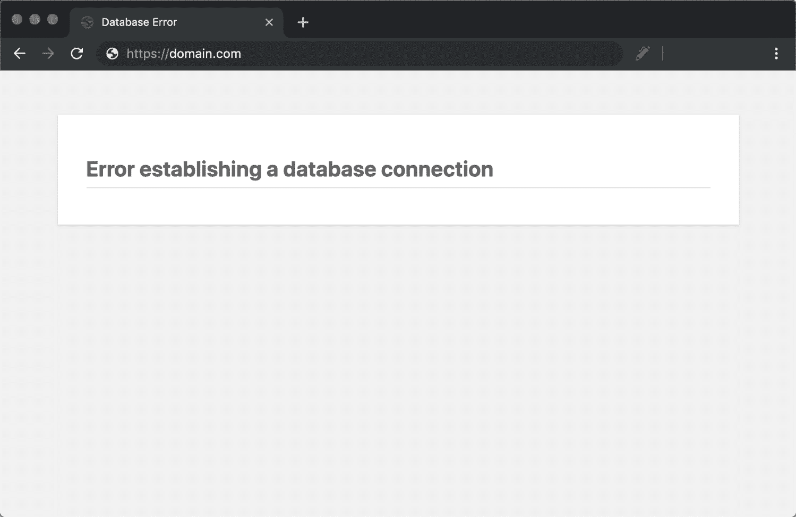

“Error establishing a database connection” message in Chrome


然而，访问者可能不会马上在前端看到这个错误。这是因为您的网站很可能仍然从缓存服务，直到它过期。例如，在 Kinsta，所有的 [WordPress 站点都默认缓存](https://kinsta.com/blog/wordpress-cache/)一个小时。因此，如果一个站点仍然从缓存中提供服务，它可能会被访问者接受。

在 Kinsta，如果您愿意，我们的支持团队可以将您的缓存持续时间延长至一小时甚至一周。如果你有一个不经常改变的站点，这可以提高你的[站点的性能](https://kinsta.com/learn/speed-up-wordpress/),因为它不需要在缓存过期后经常抓取新文件。在上述情况下，网站的前端在大多数情况下(除非你有一个脚本或网站的一部分打破了缓存)会停留更长时间。

当访问者试图访问您的站点时，会在您的日志中生成一个 [500 HTTP 状态码](https://kinsta.com/blog/500-internal-server-error/)。相同的状态代码显示为“内部服务器错误”这意味着服务器出现了问题，请求的资源未能送达。当一切正常工作时，您的站点将生成一个 [200 HTTP 状态码](https://kinsta.com/blog/http-status-codes/#understanding-http-status-code-classes)，这意味着一切正常。

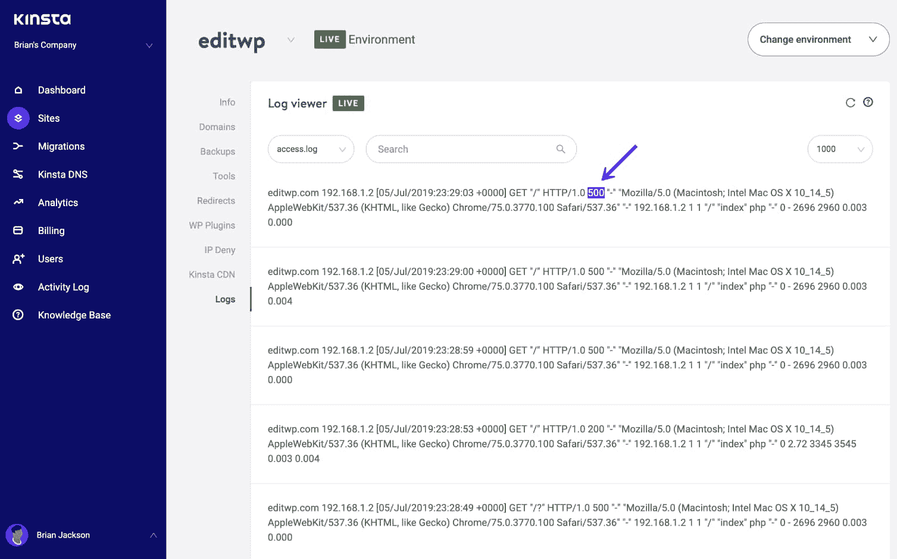

“Error establishing a database connection” 500 error


如果你是 Kinsta 的客户，你也可以查看 MyKinsta analytics 中的 500 错误分解报告，看看这是否是一个重复出现的问题。

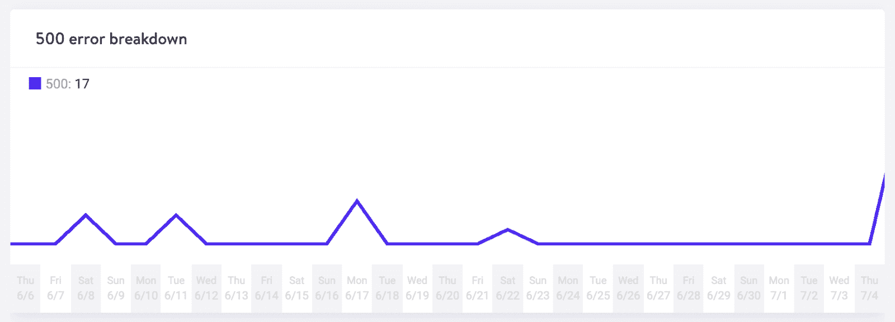

500 error breakdown


## 这种错误最常见的原因是什么？

那么这到底是为什么呢？嗯，下面是几个常见的原因。不要担心，我们将更深入地研究每一个问题，以便您知道如何修复它们。通常，您可以在 15 分钟内解决此错误。

*   最常见的问题是您的数据库登录凭证不正确。你的 WordPress 站点使用单独的登录信息连接到它的 MySQL 数据库。
*   您的数据库已损坏。有这么多带有主题、插件的移动部件，用户不断地删除和安装它们，有时数据库会损坏。这可能是由于丢失或个别损坏的表格，或者也许[一些信息被意外删除](https://kinsta.com/knowledgebase/mysql-error-1064/)。
*   你的 WordPress 安装中可能有损坏的文件。由于黑客的原因，有时甚至会发生这种情况。
*   **数据库服务器的问题。**web 主机端可能会出现一些问题，比如流量高峰导致数据库过载，或者太多并发连接没有响应。这在共享主机中很常见，因为它们为相同服务器上的许多用户使用相同的资源。
*   交通流量的激增。根据您使用的 web 主机，您的服务器可能无法处理许多并发数据库连接。流量的增加会导致数据库暂时出现问题。

## **如何修复「建立数据库连接出错」？**

在排除错误之前，我们建议做一个 [WordPress 站点备份](https://kinsta.com/blog/backup-wordpress-site/)。下面的许多建议都涉及到操作数据库中的信息，所以您不希望事情变得更糟。无论你认为自己有多精通技术，你都应该在试图修复你的 WordPress 网站之前做好备份。

你可以使用一个流行的 [WordPress 备份插件](https://kinsta.com/blog/wordpress-backup-plugins/)比如 VaultPress 或者 WP Time Capsule 来备份你的文件和数据库。

如果您是 Kinsta 用户，您可以利用我们的一键备份功能。点击 MyKinsta 中的 WordPress 站点，点击“备份”，然后点击“立即备份”

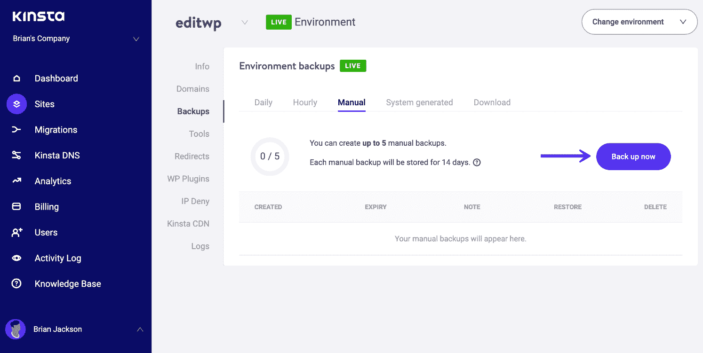

Backup WordPress site


然后，您还可以选择[将备份](https://kinsta.com/blog/restore-wordpress-from-backup/#one-click-restore-wordpress-backup)恢复到生产或暂存状态。或者你可以使用 phpMyAdmin 手动[备份你的 MySQL 数据库。一旦备份成功，就该对数据库连接问题进行故障排除了。](https://kinsta.com/knowledgebase/mysql-backup-database/)

### **1。检查您的数据库登录凭证**

首先要做的是检查以确保您的数据库登录凭证是正确的。这是“建立数据库连接出错”消息出现的最常见原因。尤其是在人们迁移到新的主机提供商之后。你的 WordPress 站点的连接细节存储在 wp-config.php 文件中，该文件通常位于你的 WordPress 站点的根目录下。

它包含四条重要的信息，必须正确无误，连接才能成功。

#### **数据库名称**

```
// ** MySQL settings ** //

/** The name of the database for WordPress */

define('DB_NAME', 'xxxxxx');
```

#### **MySQL 数据库用户名**

```
/** MySQL database username */

define('DB_USER', 'xxxxxx');
```

#### **MySQL 数据库密码**

```
/** MySQL database password */

define('DB_PASSWORD', 'xxxxxxxxx');
```

#### **MySQL 主机名(服务器)**

```
/** MySQL hostname */

define('DB_HOST', 'localhost');
```

要访问你的 wp-config.php 文件，你可以[通过 SFTP](https://kinsta.com/knowledgebase/how-to-use-sftp/) 连接到你的站点，浏览到你站点的根目录。或者，如果你正在使用 cPanel，你可以点击“文件管理器”，浏览到你的站点的根目录，然后右击来编辑文件。

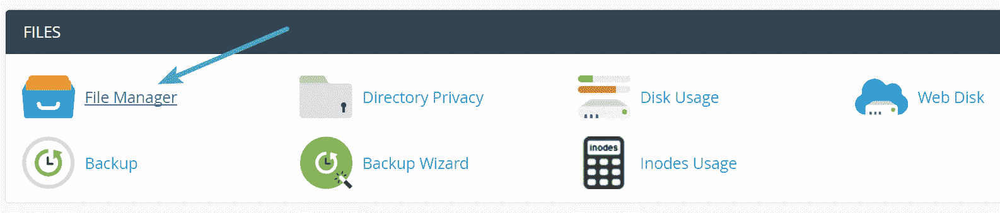 cPanel 文件管理器

下面是一个文件打开后的样子的例子。

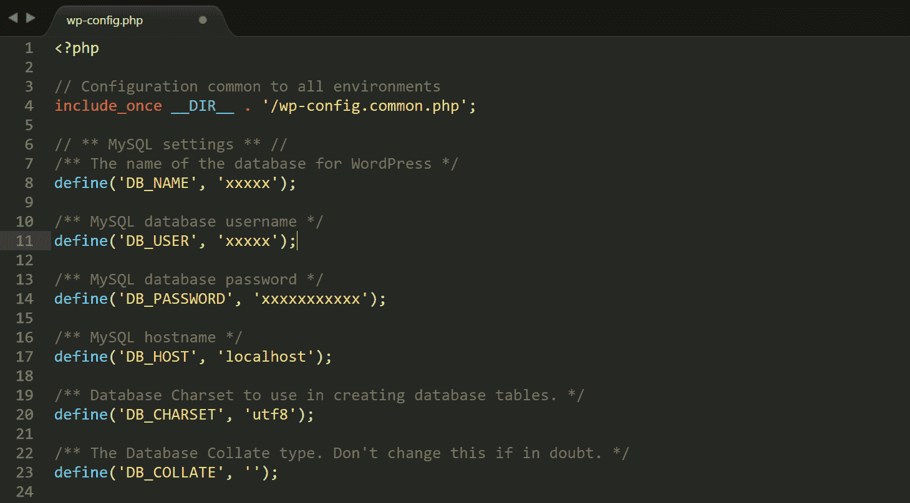

wp-config.php credentials


您现在需要对照服务器上的值检查当前值，以确保它们是正确的。对于 cPanel 和 Kinsta 用户，请遵循以下说明。

#### **检查 cPanel 中的数据库凭证**

首先要检查的是数据库名称。为此，您必须在 Databases 部分下的 [cPanel](https://kinsta.com/knowledgebase/what-is-cpanel/) 中登录 phpMyAdmin。

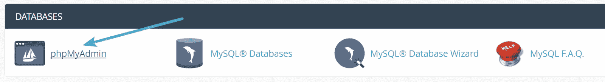

cPanel phpMyAdmin


您应该在底部左侧看到您的数据库名称。您可以忽略“information_schema”数据库，因为这是主机使用的数据库。然后，您需要将该名称与 wp-config.php 文件中的 DB_NAME 值进行比较。如果它们匹配，那就不是问题了。如果它们不匹配，你需要[更新你的 wp-config.php 文件](https://kinsta.com/blog/wp-config-php/)。

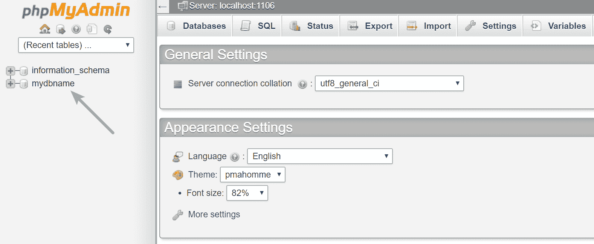

cPanel database name


你也可以确认这是正确的数据库，确保它包含你的 WordPress 站点的 URL。为此，单击数据库，然后单击 wp_options 表(出于安全考虑，这可能会稍有不同，比如 wpxx_options)。在表格的顶部，您将看到您站点的 URL 和名称的值。如果这些与你当前的网站匹配，你可以放心，你是在正确的地方。

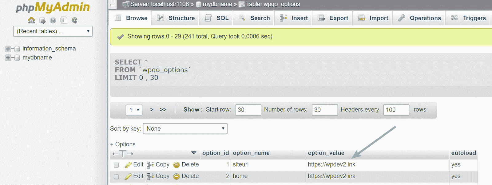

Check site URL in phpMyAdmin


如果您的数据库名称已经正确，但仍然收到“建立数据库连接时出错”的消息，您还需要检查您的用户名和密码。为此，您需要在 WordPress 站点的根目录下创建一个新的 PHP 文件，并输入以下代码。你可以给它起任何你想要的名字，比如 checkdb.php。使用 wp-config.php 文件中的值更改 db_user 和 db_password 的值。

```
<?php

$test = mysqli_connect('localhost', 'db_user', 'db_password');

if (!$test) {

die('MySQL Error: ' . mysqli_error());

}

echo 'Database connection is working properly!';

mysqli_close($testConnection);
```

然后在你的 WordPress 网站上浏览这个文件:https://yourdomain.com/checkdb.php.如果你得到一个“MySQL 错误:拒绝访问”，那么你知道你的用户名或密码是错误的，你需要继续下一步来重置你的凭证。

## 注册订阅时事通讯


### 想知道我们是怎么让流量增长超过 1000%的吗？

加入 20，000 多名获得我们每周时事通讯和内部消息的人的行列吧！

[Subscribe Now](#newsletter)

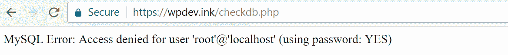

Access denied MySQL


下面是您希望看到的消息，“数据库连接工作正常。”当然，如果是的话，你就不会在这里了。完成测试后，请务必删除/移除该文件。

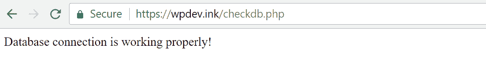

Database connection working properly


所以接下来，你需要重置你的用户名和密码。在 cPanel 中，单击数据库部分下的 MySQL 数据库。

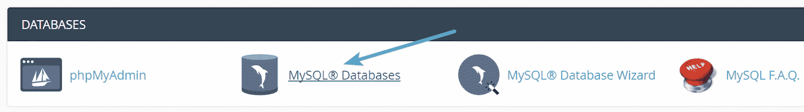

cPanel MySQL databases


向下滚动[创建一个新的 MySQL 用户](https://kinsta.com/knowledgebase/create-user-mysql/)。尝试选择一个独特的用户名和密码，这样他们就不会轻易被猜到。他们提供的密码生成器工具非常好用。然后点击“创建用户”或者，您可以在此屏幕上更改当前数据库用户的密码。

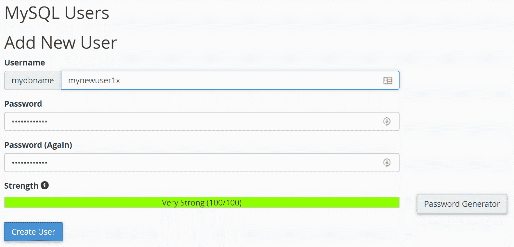

Create a new MySQL user


然后向下滚动，将新用户添加到数据库中。下一个屏幕将询问您想要分配哪些权限。选择“所有权限”

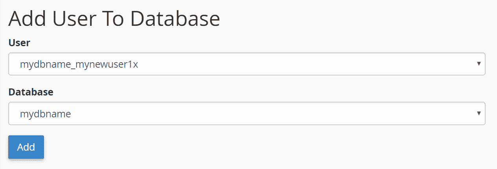

Add user to the database in cPanel


然后拿着这些新的凭证，更新你的 wp-config.php 文件。您将需要更新 DB_USER 和 DB_PASSWORD 值。您也可以重新运行之前的测试文件。这应该会解决您的凭证问题。否则，您仍然可能有错误的主机名(DB_HOST)。有些主机使用不同的值。

查看一些[常用 DB 主机值](https://codex.wordpress.org/Editing_wp-config.php#Possible_DB_HOST_values)的列表。通常这将是[本地主机](https://kinsta.com/knowledgebase/what-is-localhost/)。但是如果你不确定的话，你可以联系你的主机提供商或者查看他们的文档。有些也可能使用 127.0.0.1 而不是 localhost。

如果您执行了上述所有操作，但仍然收到“建立数据库连接时出错”消息，请继续下面的故障排除步骤。

#### **用 Kinsta 检查数据库凭证**

如果你是一个 Kinsta 用户，根据你的 wp-config.php 文件和服务器检查你的凭证就容易多了！你需要做的就是点击你网站的信息部分，在底部，你会看到数据库名称，用户名和密码。默认情况下，Kinsta 使用 localhost 作为 DB_HOST。

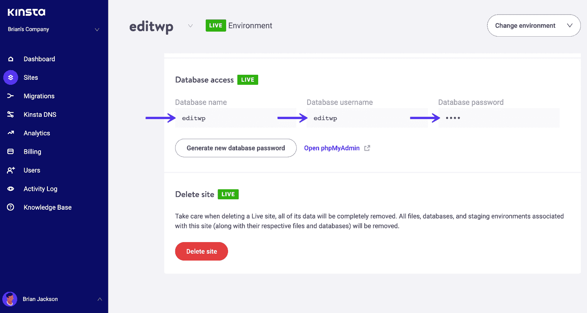

Checking your site’s database credentials in MyKinsta.


然后拿着这些新的凭证，更新你的 wp-config.php 文件。您将需要更新 DB_USER 和 DB_PASSWORD 值。这应该会解决您的凭证问题。如果您需要重置这些凭据，请联系我们的支持团队。如果您执行了上述所有操作，但仍然收到“建立数据库连接时出错”消息，请继续下面的故障排除步骤。

### **2。修复损坏的 WordPress 数据库**

在某些情况下，可能是您的数据库已经损坏。这种情况偶尔会发生(虽然不经常发生),因为随着时间的推移，数百个表格会不断地被新的插件和主题添加/删除。如果你试图[登录你的 WordPress 站点的仪表板](https://kinsta.com/knowledgebase/wordpress-admin/)并收到以下错误，这意味着你的数据库已经损坏:“一个或多个数据库表不可用。数据库可能需要修复。值得注意的是，您可能只会在后端看到这个错误，而在前端会看到“建立数据库连接时出错”的消息。

我们的客户在几分钟内就可以从他们的 MyKinsta 仪表板上修复这个错误。[免费试用 kin sta](https://hubs.ly/H0pklC_0)。

WordPress 有一个数据库修复模式，你可以启动它。将以下内容添加到 wp-config.php 文件的底部。

```
define('WP_ALLOW_REPAIR', true);
```

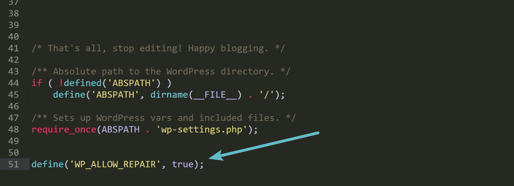

WordPress repair mode


然后浏览到你的 WordPress 站点上的以下位置:https://yourdomain.com/wp-admin/maint/repair.php.然后你可以选择修复数据库或者修复并优化数据库。由于您现在可能正在对站点上的中断进行故障排除，我们建议使用修复数据库选项，因为这样会更快。

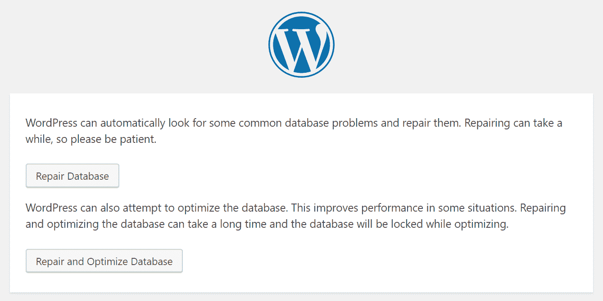

WordPress repair database


运行上述数据库修复后，确保删除添加到 wp-config.php 文件中的代码行。否则，任何人都可以访问 repair.php 页面。如果您正在运行 cPanel，也可以在 MySQL 数据库屏幕中运行修复。

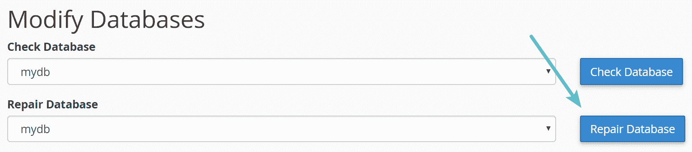

cPanel repair database


或者您可以在 phpMyAdmin 中运行修复。只需[登录 phpMyAdmin](https://kinsta.com/help/wordpress-phpmyadmin/) ，点击您的数据库，并选择所有的表。然后从下拉列表中，单击“维修表”这实质上就是运行[修复表](https://dev.mysql.com/doc/refman/5.7/en/repair-table.html)命令。

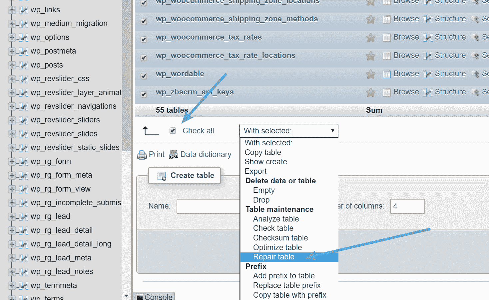

Repair tables in phpMyAdmin


最后，您的另一个选择是使用以下命令使用 [WP-CLI](https://kinsta.com/blog/wp-cli/) 运行修复:

```
wp db repair
```

在 [WordPress 开发者资源](https://developer.wordpress.org/cli/commands/db/repair/)中查看更多关于用法的文档。

如果你想优化你的数据库，我们有一些很棒的教程，关于如何[优化 WordPress 版本](https://kinsta.com/blog/wordpress-revisions/)的性能，以及如何[将你的 MyISAM 表转换成 InnoDB](https://kinsta.com/knowledgebase/convert-myisam-to-innodb/) 。如果您的站点仍有问题，请继续下一个故障排除步骤。

建议阅读:[如何修复 WordPress](https://kinsta.com/knowledgebase/mysql-server-has-gone-away/) 中的“MySQL 服务器已经不在了”错误。

### **3。修复损坏的 WordPress 文件**

您可能会看到“建立数据库连接出错”消息的以下可能原因是您的 WordPress 核心文件已经损坏。无论这是源于通过 FTP 传输文件的问题，黑客获得访问您的网站，还是您的主机的问题，您都可以快速修复这个问题。但是，我们建议在尝试之前备份您的站点。

你将在你的网站上替换 WordPress 的核心版本。你没有接触你的插件、主题或媒体，只是 WordPress 安装本身。

但是，您可能会丢失添加到文件(如)中的任何更改或自定义代码。htaccess 或 wp-config.php。如果您在进行故障诊断之前备份了您的网站，您将拥有这些文件的副本，可以在以后恢复。

要开始，你必须从 WordPress.org 下载一个新的 WordPress 副本。


Download WordPress


在你的电脑上解压这个文件。在里面，你会想要删除 wp-content 文件夹和 wp-config-sample.php 文件。

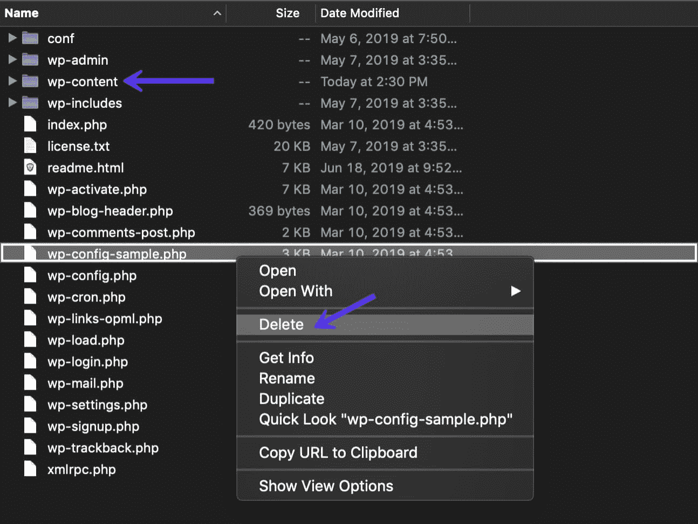

Delete wp-content folder


然后通过 SFTP 上传剩余的文件到你的网站，覆盖你现有的文件。这将替换所有有问题的文件，并确保您拥有干净且未损坏的新文件。建议[完成此操作后清除浏览器缓存](https://kinsta.com/knowledgebase/how-to-clear-browser-cache/)。然后检查你的 WordPress 站点，看看错误是否仍然存在。

### **4。检查数据库服务器的问题**

如果以上没有帮助解决您的问题，我们强烈建议您与您的主机提供商核实，因为这可能是您的数据库服务器的问题。例如，如果一次有太多并发连接到您的数据库，它可能会生成一个错误。这是因为许多主机限制它们的服务器一次允许多少个连接。利用一个[缓存插件](https://kinsta.com/blog/wordpress-caching-plugins/)可以帮助最小化你站点上的数据库交互。如果你是 Kinsta 客户端，你不需要缓存插件，因为我们有快速的[服务器级缓存](https://kinsta.com/blog/wordpress-cache/)。

这个问题在共享主机上经常发生，因为理论上其他人可能会影响你的站点。这是因为共享主机利用服务器上所有相同的资源。这也是我们推荐使用高性能的[托管 WordPress 主机](https://kinsta.com/blog/managed-wordpress-hosting/)的另一个原因，这样事情就不会过于拥挤。这也意味着环境通常被微调以处理大量的流量，特别是对 WordPress 站点。

知识渊博的 [Kinsta 支持团队](https://kinsta.com/help/wordpress-support-ticket/)总是在仪表板的右下角点击鼠标，如果您需要帮助，可以全天候提供服务。别忘了，我们有多种语言的代表为您提供帮助，包括英语、西班牙语、法语、意大利语和葡萄牙语。

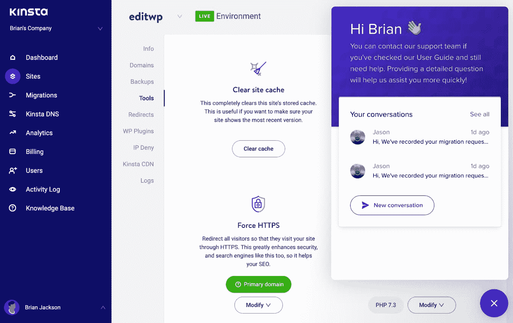

Contact Kinsta support


### **5。恢复最新备份**

最后但同样重要的是，如果需要，您可以随时求助于备份。在某些情况下，如果您不担心在上次备份之间丢失任何数据，这可能是解决问题的更快方法。许多主机都有自己的备份恢复流程。请记住，您可能需要还原数据库和文件。

如果你是 Kinsta 用户，你可以在你网站的备份部分快速恢复你网站的备份。选择您想要恢复的时间，然后单击“恢复到”然后，您可以选择是要恢复到临时站点还是实时站点。

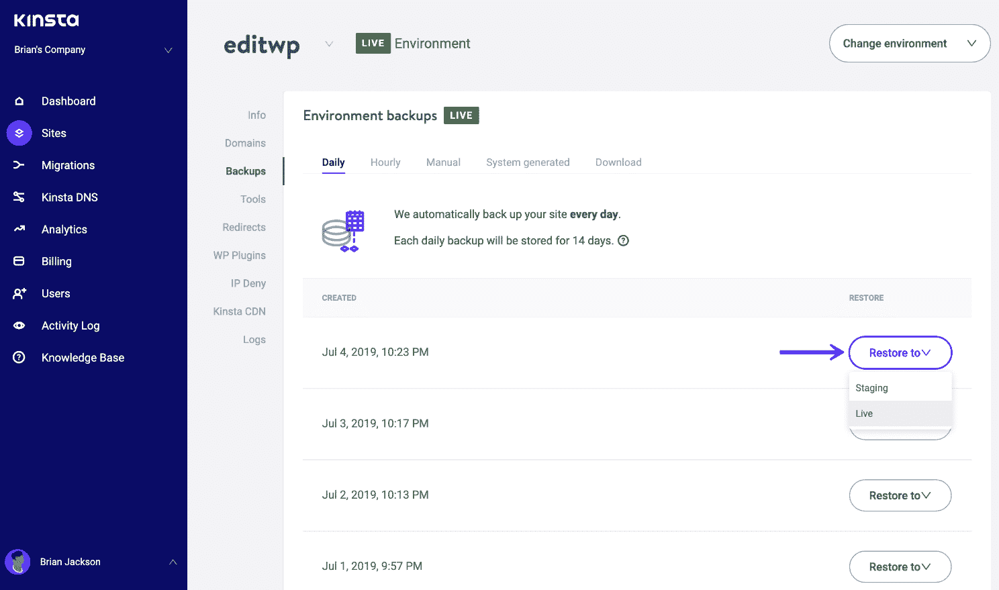

Restore WordPress backup


然后会提示您确认恢复。输入您的站点名称，然后单击“确定”它还会在恢复时创建备份，以便您可以在需要时撤消恢复。

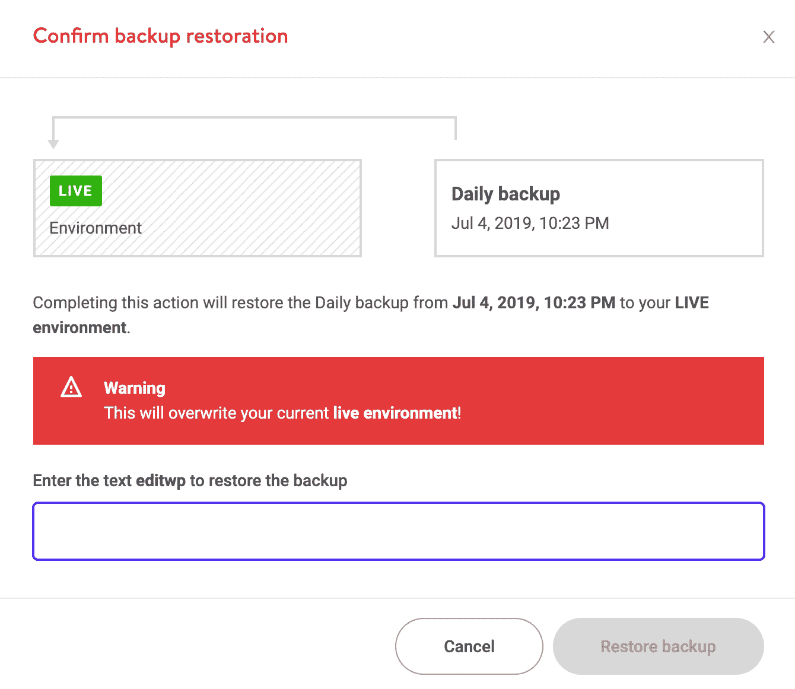

Confirm WordPress restore


[This error is not something to be taken lightly & can directly affect your sales, traffic, and analytics 😬 Learn how to fix it here ✅Click to Tweet](https://twitter.com/intent/tweet?url=https%3A%2F%2Fkinsta.com%2Fblog%2Ferror-establishing-a-database-connection%2F&via=kinsta&text=This+error+is+not+something+to+be+taken+lightly+%26amp%3B+can+directly+affect+your+sales%2C+traffic%2C+and+analytics+%F0%9F%98%AC+Learn+how+to+fix+it+here+%E2%9C%85&hashtags=WPTips%2CWordPress) ## **汇总**

正如你所看到的，有很多方法可以修复 WordPress 中的“建立数据库连接错误”。最常见的是 wp-config.php 文件中的无效凭据。检查以确保这些是正确的是最好的开始。对于一个网站来说，你最不希望的就是经历宕机。

希望上面的一个步骤能帮助你恢复网站的运行。请记住，如果需要，您可以随时从备份中恢复您的站点。

*您在自己的网站上遇到过“**建立数据库连接时出错**”的消息吗？如果是，你能解决它吗？请在评论中告诉我们。*

* * *

让你所有的[应用程序](https://kinsta.com/application-hosting/)、[数据库](https://kinsta.com/database-hosting/)和 [WordPress 网站](https://kinsta.com/wordpress-hosting/)在线并在一个屋檐下。我们功能丰富的高性能云平台包括:

*   在 MyKinsta 仪表盘中轻松设置和管理
*   24/7 专家支持
*   最好的谷歌云平台硬件和网络，由 Kubernetes 提供最大的可扩展性
*   面向速度和安全性的企业级 Cloudflare 集成
*   全球受众覆盖全球多达 35 个数据中心和 275 多个 pop

在第一个月使用托管的[应用程序或托管](https://kinsta.com/application-hosting/)的[数据库，您可以享受 20 美元的优惠，亲自测试一下。探索我们的](https://kinsta.com/database-hosting/)[计划](https://kinsta.com/plans/)或[与销售人员交谈](https://kinsta.com/contact-us/)以找到最适合您的方式。