# 处理 JavaScript 错误的权威指南

> 原文：<https://kinsta.com/blog/errors-in-javascript/>

墨菲定律指出，任何可能出错的事情最终都会出错。这在编程世界中应用得有点太好了。如果你创建一个应用程序，你很可能会产生错误和其他问题。JavaScript 中的错误就是这样一个常见问题！

一个软件产品的成功取决于它的创造者在伤害用户之前解决这些问题的能力。在所有的[编程语言](https://kinsta.com/blog/best-programming-language-to-learn/)中， [JavaScript](https://kinsta.com/knowledgebase/what-is-javascript/) 因其一般的错误处理设计而臭名昭著。

如果你正在[构建一个 JavaScript 应用](https://kinsta.com/blog/javascript-libraries/)，你很有可能会在某个地方弄乱数据类型。如果不是这样，那么你可能会用一个空的*替换一个未定义的*，或者用一个双等于运算符(`==`)替换一个三等于运算符(`===`)。**

 **犯错是人之常情。这就是为什么我们将向您展示在 JavaScript 中处理错误所需要知道的一切。

本文将引导您了解 JavaScript 中的基本错误，并解释您可能会遇到的各种错误。然后，您将学习如何识别和修复这些错误。也有一些在生产环境中有效处理错误的技巧。

事不宜迟，我们开始吧！

### 查看我们的视频指南[处理 JavaScript 错误](https://www.youtube.com/watch?v=CQzwi9_7wHI)


## 什么是 JavaScript 错误？

编程中的错误是指不能让程序正常运行的情况。当程序不知道如何处理手头的工作时，就会发生这种情况，例如当试图打开一个不存在的文件或在没有网络连接的情况下访问基于 web 的 API 端点时。

这些情况促使程序向用户抛出错误，说明它不知道如何继续。程序收集尽可能多的关于错误的信息，然后报告它不能继续前进。

[Murphy's law states that whatever can go wrong will eventually go wrong 😬 This applies a bit too well in the world of JavaScript 😅 Get prepped with this guide 👇Click to Tweet](https://twitter.com/intent/tweet?url=https%3A%2F%2Fkinsta.com%2Fblog%2Ferrors-in-javascript%2F&via=kinsta&text=Murphy%27s+law+states+that+whatever+can+go+wrong+will+eventually+go+wrong+%F0%9F%98%AC+This+applies+a+bit+too+well+in+the+world+of+JavaScript+%F0%9F%98%85+Get+prepped+with+this+guide+%F0%9F%91%87&hashtags=JavaScript%2CProgramming)

聪明的程序员试图预测并覆盖这些场景，这样用户就不必独立地找出类似“404”的[技术错误信息。相反，它们显示了一个更容易理解的信息:“找不到该页面。”](https://kinsta.com/blog/http-status-codes/)

JavaScript 中的错误是每当出现编程错误时显示的对象。这些对象包含有关错误类型、导致错误的语句以及错误发生时的堆栈跟踪的大量信息。JavaScript 还允许程序员创建自定义错误，以便在调试问题时提供额外的信息。


### 错误的属性

现在 JavaScript 错误的定义已经很清楚了，是时候深入细节了。

JavaScript 中的错误带有特定的标准和自定义属性，有助于理解错误的原因和影响。默认情况下，JavaScript 中的错误包含三个属性:

1.  **消息**:携带错误消息的字符串值
2.  **name** :发生的错误类型(我们将在下一节深入探讨)
3.  **堆栈**:错误发生时执行的代码的堆栈跟踪。

此外，错误还可以携带属性，如*列号、行号、文件名、*等。，来更好地描述错误。但是，这些属性不是标准的，可能会也可能不会出现在 JavaScript 应用程序生成的每个错误对象中。

### 了解堆栈跟踪

堆栈跟踪是在发生异常或警告等事件时程序所在的方法调用列表。伴随异常的示例堆栈跟踪如下所示:

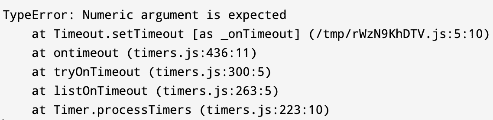

Example of a Stack Trace.


如您所见，它首先打印错误名称和消息，然后是被调用的方法列表。每个方法调用都说明了其源代码的位置和调用它的行。您可以使用这些数据来浏览您的代码库，并确定哪段代码导致了错误。

这个方法列表以堆叠的方式排列。它显示了您的异常第一次被抛出的位置，以及它是如何通过堆栈方法调用传播的。为异常实现一个 catch 不会让它通过堆栈向上传播并使你的程序崩溃。但是，在某些情况下，您可能希望不捕捉致命错误，以故意使程序崩溃。

### 错误与异常

大多数人通常认为错误和异常是一回事。然而，有必要指出它们之间的细微但基本的区别。


异常是已经抛出的错误对象。


为了更好地理解这一点，让我们举一个简单的例子。以下是在 JavaScript 中定义错误的方法:

```
const wrongTypeError = TypeError("Wrong type found, expected character")
```

 `这就是`*wrongTypeError*`对象成为异常的原因:

```
throw wrongTypeError
```

然而，大多数人倾向于使用在抛出错误对象时定义它们的简写形式:

```
throw TypeError("Wrong type found, expected character")
```

这是标准做法。然而，这也是开发人员倾向于混淆异常和错误的原因之一。因此，即使你使用人手不足的方法来快速完成工作，了解基础知识也是至关重要的。

## JavaScript 中的错误类型

JavaScript 中有一系列预定义的错误类型。每当程序员没有显式处理应用程序中的错误时，JavaScript 运行时就会自动选择和定义它们。

本节将带您了解 JavaScript 中一些最常见的错误类型，并理解它们发生的时间和原因。

### 范围误差

当变量设置的值超出其合法值范围时，将引发 RangeError。这通常发生在将一个值作为参数传递给函数，并且给定的值不在函数的参数范围内时。当使用文档不完善的第三方库时，有时可能很难修复，因为您需要知道参数的可能值范围，以便传入正确的值。

发生 RangeError 的一些常见情况是:

*   试图通过数组构造函数创建非法长度的数组。
*   将错误的值传递给数值方法，如`toExponential()`、`toPrecision()`、`toFixed()`等。
*   向类似`normalize()`的字符串函数传递非法值。

### 参考错误

当代码中的变量引用出现问题时，就会出现 ReferenceError。您可能忘记了在使用变量之前为其定义一个值，或者您可能试图在代码中使用一个不可访问的变量。在任何情况下，查看堆栈跟踪都可以提供足够的信息来找到并修复出错的变量引用。

发生 ReferenceErrors 的一些常见原因是:

*   在变量名中打错字。
*   试图访问其范围之外的块范围的变量。
*   在加载全局变量之前，从外部库中引用全局变量(比如从 jQuery 中引用 [$变量)。](https://kinsta.com/blog/jquery-is-not-defined/)

### 句法误差

这些错误是最容易修复的错误之一，因为它们指出了代码语法中的错误。由于 JavaScript 是一种解释而非编译的[脚本语言](https://kinsta.com/blog/scripting-languages/)，当应用程序执行包含错误的脚本时，就会抛出这些错误。在编译语言的情况下，这样的错误在编译期间被识别。因此，在修复之前，不会创建应用程序二进制文件。

可能发生语法错误的一些常见原因是:

*   缺少引号
*   缺少右括号
*   花括号或其他字符对齐不正确

在你的 IDE 中使用一个林挺工具来在这些错误到达浏览器之前识别它们是一个很好的实践。

### TypeError

TypeError 是 JavaScript 应用程序中最常见的错误之一。当某些值不是特定的预期类型时，就会产生这个错误。发生这种情况的一些常见情况是:

*   调用不是方法的对象。
*   试图访问空或未定义对象的属性
*   将字符串视为数字，反之亦然

出现类型错误的可能性还有很多。我们稍后将查看一些著名的实例，并学习如何修复它们。

### 内部错误

当 JavaScript 运行时引擎中出现异常时，使用 InternalError 类型。它可能表示也可能不表示您的代码有问题。

通常，内部错误只出现在两种情况下:

*   当 JavaScript 运行时的补丁或更新带有抛出异常的错误时(这种情况很少发生)
*   当您的代码包含对于 JavaScript 引擎来说太大的实体时(例如，太多的开关情况，太大的数组初始化器，太多的递归)

解决这个错误的最合适的方法是通过错误消息确定原因，并重新构建应用程序逻辑，如果可能的话，消除 JavaScript 引擎上工作负载的突然增加。

### URIError

当非法使用诸如`decodeURIComponent`的全局 URI 处理函数时，就会出现 URIError。这通常表明传递给方法调用的参数不符合 URI 标准，因此没有被方法正确地解析。

诊断这些错误通常很容易，因为您只需要检查畸形的参数。

### 评估错误

当`eval()`函数调用出错时，会出现 EvalError。`eval()`函数用于执行存储在字符串中的 JavaScript 代码。然而，由于安全问题，不鼓励使用`eval()`函数，并且当前的 ECMAScript 规范不再抛出`EvalError`类，这种错误类型的存在只是为了保持与遗留 JavaScript 代码的向后兼容性。

如果您正在使用旧版本的 JavaScript，您可能会遇到这个错误。在任何情况下，最好调查在`eval()`函数调用中执行的代码是否有异常。

## 创建自定义错误类型

虽然 JavaScript 提供了足够的错误类型类列表来涵盖大多数场景，但是如果列表不能满足您的要求，您可以随时创建新的错误类型。这种灵活性的基础在于这样一个事实，即 JavaScript 允许您使用`throw`命令任意抛出任何内容。

所以，从技术上讲，这些声明是完全合法的:

```
throw 8
throw "An error occurred"
```

然而，抛出一个原始数据类型并不能提供关于错误的细节，比如它的类型、名称或者伴随的堆栈跟踪。为了解决这个问题并使错误处理过程标准化，提供了`Error`类。抛出异常时也不鼓励使用原始数据类型。

您可以扩展`Error`类来创建您的自定义错误类。下面是一个如何做到这一点的基本示例:

```
class ValidationError extends Error {
    constructor(message) {
        super(message);
        this.name = "ValidationError";
    }
}
```

你可以按以下方式使用它:

```
throw ValidationError("Property not found: name")
```

然后您可以使用`instanceof`关键字来识别它:

```
try {
    validateForm() // code that throws a ValidationError
} catch (e) {
    if (e instanceof ValidationError)
    // do something
    else
    // do something else
}
```

## JavaScript 中最常见的 10 个错误

既然您已经了解了常见的错误类型以及如何创建自定义的错误类型，那么是时候看看您在编写 JavaScript 代码时会遇到的一些最常见的错误了。

### 查看我们的视频指南[最常见的 JavaScript 错误](https://www.youtube.com/watch?v=IXrqv7Szv_g)

### 1.未捕获的范围错误

在几种不同的情况下，谷歌浏览器都会出现这种错误。首先，如果你调用一个递归函数，并且它没有终止，就会发生这种情况。你可以在 Chrome 开发者控制台中亲自查看:

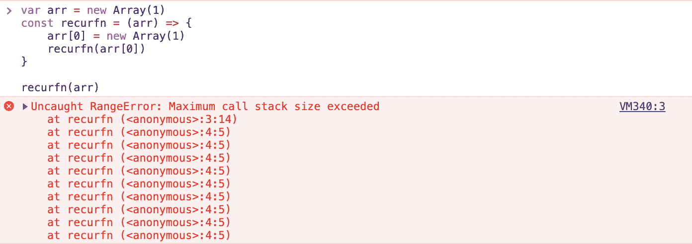

RangeError example with a recursive function call.


所以要解决这样的错误，一定要正确定义递归函数的边界情况。发生此错误的另一个原因是，如果您传递了一个超出函数参数范围的值。这里有一个例子:

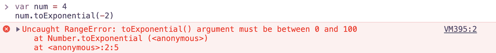

RangeError example with toExponential() call.


错误消息通常会指出您的代码有什么问题。一旦你做出了改变，它就会被解决。

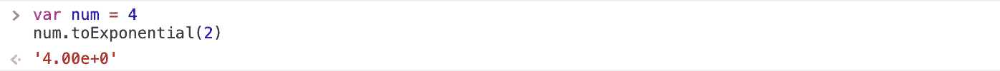

Output for the toExponential() function call.


### 2.未捕获的类型错误:无法设置属性

当您在未定义的引用上设置属性时，会出现此错误。您可以使用以下代码重现该问题:

```
var list
list.count = 0
```

 `以下是您将收到的输出:

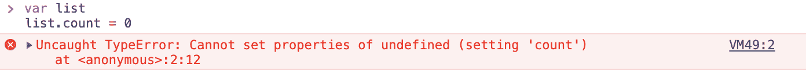

TypeError example.


若要修复此错误，请在访问引用的属性之前用一个值初始化该引用。这是它修复后的样子:

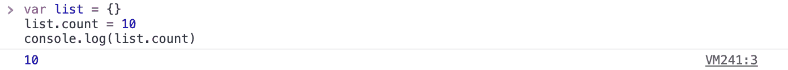

How to fix TypeError.


### 3.未捕获的类型错误:无法读取属性

这是 JavaScript 中最常见的错误之一。当您试图读取未定义对象的属性或调用未定义对象的函数时，会出现此错误。通过在 Chrome 开发人员控制台中运行以下代码，您可以非常容易地重现它:

```
var func
func.call()
```

 `以下是输出结果:

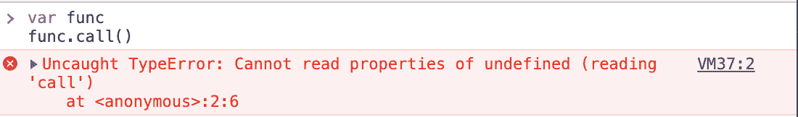

TypeError example with undefined function.


未定义的对象是导致此错误的许多可能原因之一。此问题的另一个突出原因可能是呈现 UI 时状态初始化不正确。下面是 React 应用程序的一个真实示例:

```
import React, { useState, useEffect } from "react";

const CardsList = () => {

    const [state, setState] = useState();

    useEffect(() => {
        setTimeout(() => setState({ items: ["Card 1", "Card 2"] }), 2000);
    }, []);

    return (
        <>
            {state.items.map((item) => (
                <li key={item}>{item}</li>
            ))}
        </>
    );
};

export default CardsList;
```

该应用程序以一个空的状态容器开始，并在 2 秒钟的延迟后提供一些项目。延迟是为了模仿网络呼叫而设置的。即使你的网络非常快，你仍然会面临一个小的延迟，因为组件至少会渲染一次。如果您尝试运行此应用程序，您会收到以下错误:

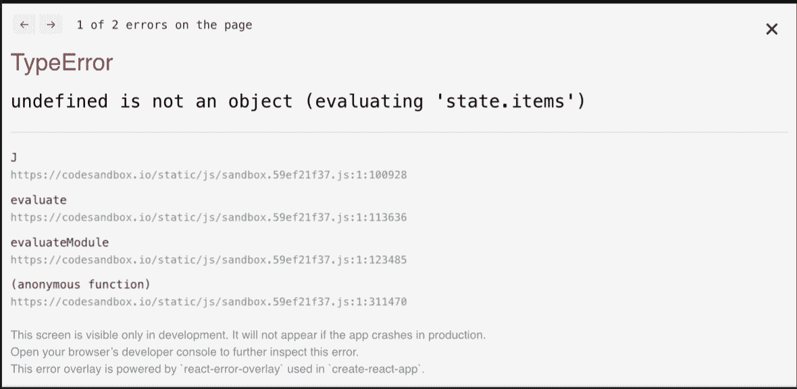

TypeError stack trace in a browser.


这是因为，在渲染时，状态容器是未定义的；因此，它不存在属性`items`。修复这个错误很容易。您只需要为状态容器提供一个初始默认值。

```
// ...
const [state, setState] = useState({items: []});
// ...
```

现在，在设定的延迟后，您的应用程序将显示类似的输出:


Code output.


代码中的确切修复可能不同，但是这里的本质是在使用变量之前总是正确地初始化变量。

### 4.类型错误:“未定义”不是对象

当您尝试访问未定义对象的属性或对其调用方法时，Safari 中会出现此错误。您可以运行上面的相同代码来重现错误。

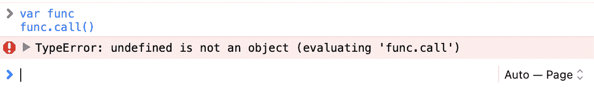

TypeError example with undefined function.


这个错误的解决方案也是一样的——确保您已经正确地初始化了变量，并且在访问属性或方法时它们没有被定义。

### 5.TypeError: null 不是对象

这与前面的错误类似。它发生在 Safari 上，这两个错误之间的唯一区别是，当正在访问其属性或方法的对象是`null`而不是`undefined`时，会抛出这个错误。您可以通过运行以下代码来重现这种情况:

```
var func = null

func.call()
```

以下是您将收到的输出:

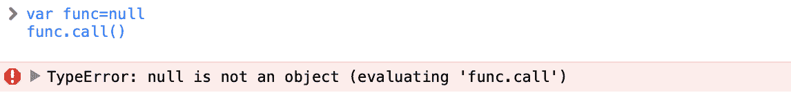

TypeError example with null function.


因为`null`是一个显式设置为变量的值，而不是由 JavaScript 自动赋值的。只有当您试图访问自己设置的变量`null`时，才会出现这种错误。所以，你需要重新审视你的代码，检查你写的逻辑是否正确。

### 6.TypeError:无法读取属性“length”

当你试图读取一个`null`或`undefined`对象的长度时，这个错误就会在 Chrome 中出现。此问题的原因与前面的问题类似，但它在处理列表时发生得相当频繁；因此，它值得特别一提。以下是重现问题的方法:


TypeError example with an undefined object.


然而，在 Chrome 的新版本中，这个错误被报告为`Uncaught TypeError: Cannot read properties of undefined`。这是它现在的样子:

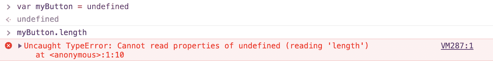

TypeError example with an undefined object on newer Chrome versions.


同样，修复方法是确保您试图访问的长度的对象存在，并且没有设置为`null`。

### 7.类型错误:“undefined”不是函数

当您试图调用脚本中不存在的方法时，或者调用了脚本中不存在的方法但无法在调用上下文中引用时，会出现此错误。这个错误通常发生在 Google Chrome 中，你可以通过检查抛出错误的代码行来解决。如果您发现一个错别字，修复它，并检查它是否能解决您的问题。

如果您在代码中使用了自引用关键字`this`，那么如果`this`没有恰当地绑定到您的上下文，就可能会出现这个错误。考虑以下代码:

```
function showAlert() {
    alert("message here")
}

document.addEventListener("click", () => {
    this.showAlert();
})
```

如果您执行上面的代码，它将抛出我们讨论过的错误。这是因为作为事件监听器传递的匿名函数正在`document`的上下文中执行。

相反，函数`showAlert`是在`window`的上下文中定义的。

要解决这个问题，您必须通过用`bind()`方法绑定来传递对函数的正确引用:

## 注册订阅时事通讯


### 想知道我们是怎么让流量增长超过 1000%的吗？

加入 20，000 多名获得我们每周时事通讯和内部消息的人的行列吧！

[Subscribe Now](#newsletter)

```
document.addEventListener("click", this.showAlert.bind(this))
```

### 8.ReferenceError:事件未定义

当您试图访问调用范围中未定义的引用时，会发生此错误。这通常发生在处理事件时，因为它们经常在回调函数中为您提供一个名为`event`的引用。如果您忘记在函数的参数中定义事件参数或拼写错误，就会发生此错误。

此错误可能不会在 Internet Explorer 或 Google Chrome 中发生(因为 IE 提供了一个全局事件变量，Chrome 会自动将该事件变量附加到处理程序)，但它可能会在 Firefox 中发生。所以留心这种小错误是明智的。

### 9.TypeError:常量变量的赋值

这是由于粗心造成的错误。如果你试图给一个常量变量赋一个新值，你会遇到这样的结果:

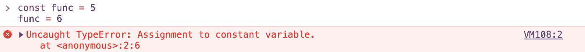

TypeError example with constant object assignment.


虽然现在修复起来似乎很容易，但是想象一下数百个这样的变量声明，其中一个被错误地定义为`const`而不是`let`！[与 PHP](https://kinsta.com/blog/php-vs-javascript/#variable-and-constant-definitions) 等其他脚本语言不同，JavaScript 中声明常量和变量的风格几乎没有区别。因此，当你面对这个错误时，首先检查你的声明是明智的。如果你*忘记*所说的参考是一个常数，并把它作为一个变量使用，你也可能遇到这个错误。这表明要么是粗心大意，要么是你的应用程序的逻辑有缺陷。尝试修复此问题时，请确保选中此项。

### 10.(未知):脚本错误

当第三方脚本向您的浏览器发送错误时，就会发生脚本错误。此错误后面跟有*(未知)，因为*第三方脚本与您的应用程序属于不同的域。浏览器隐藏了其他细节，以防止第三方脚本泄露敏感信息。

不了解完整的详细信息，您无法解决此错误。您可以通过以下方式获得有关该错误的更多信息:

1.  在脚本标签中添加`crossorigin`属性。
2.  在托管脚本的服务器上设置正确的`Access-Control-Allow-Origin`头。
3.  [可选]如果您无法访问托管脚本的服务器，您可以考虑使用代理将您的请求中继到服务器，然后用正确的头返回到客户端。

一旦您可以访问错误的详细信息，您就可以着手解决问题，这可能是第三方库或网络的问题。

## 如何识别和防止 JavaScript 中的错误

虽然上面讨论的错误是 JavaScript 中最常见、最频繁的，但是你会遇到，仅仅依靠几个例子是远远不够的。在开发 JavaScript 应用程序时，理解如何检测和防止任何类型的错误是至关重要的。以下是如何处理 JavaScript 中的错误。

### 手动抛出和捕捉错误

处理手动或运行时抛出的错误的最基本方法是捕捉它们。像大多数其他语言一样，JavaScript 提供了一组关键字来处理错误。在着手处理 JavaScript 应用程序中的错误之前，深入了解它们是非常重要的。

#### 扔

集合的第一个也是最基本的关键字是`throw`。显然，throw 关键字用于抛出错误，以便在 JavaScript 运行时手动创建异常。我们在文章的前面已经讨论过这个问题，下面是这个关键字的意义的要点:

*   你可以`throw`任何东西，包括数字、字符串和`Error`对象。
*   然而，不建议抛出诸如字符串和数字之类的原始数据类型，因为它们不携带关于错误的调试信息。
*   示例:`throw TypeError("Please provide a string")`

#### 尝试

`try`关键字用于指示代码块可能会抛出异常。它的语法是:

```
try {
    // error-prone code here
}
```

需要注意的是，`catch`块必须始终跟在`try`块之后，以便有效地处理错误。

#### 捕捉

关键字`catch`用于创建一个 catch 块。这个代码块负责处理后面的`try`块捕获的错误。下面是它的语法:

```
catch (exception) {
    // code to handle the exception here
}
```

这就是如何一起实现`try`和`catch`块:

```
try {
    // business logic code
} catch (exception) {
    // error handling code
}
```

与 C++或 Java 不同，在 JavaScript 中不能将多个`catch`块追加到一个`try`块中。这意味着您不能这样做:

```
try {
    // business logic code
} catch (exception) {
    if (exception instanceof TypeError) {
        // do something
    }
} catch (exception) {
    if (exception instanceof RangeError) {
    // do something
    }
}
```

相反，您可以在单个 catch 块中使用`if...else`语句或 switch case 语句来处理所有可能的错误情况。它看起来像这样:

```
try {
    // business logic code
} catch (exception) {
    if (exception instanceof TypeError) {
        // do something
    } else if (exception instanceof RangeError) {
        // do something else
    }
}
```

#### 最后

关键字`finally`用于定义一个在错误被处理后运行的代码块。这个块在 try 和 catch 块之后执行。

此外，无论其他两个块的结果如何，finally 块都将被执行。这意味着即使 catch 块不能完全处理错误或者 catch 块中抛出了错误，解释器也会在程序崩溃之前执行 finally 块中的代码。

要被认为是有效的，JavaScript 中的 try 块之后需要跟随 catch 或 finally 块。如果没有这些，解释器将引发语法错误。因此，在处理错误时，请确保至少使用其中一个来遵循 try 块。

### 使用 onerror()方法全局处理错误

所有 HTML 元素都可以使用`onerror()`方法来处理它们可能出现的任何错误。例如，如果一个`img`标签找不到其 URL 被指定的图像，它就触发它的 onerror 方法来允许用户处理错误。

通常，您会在 onerror 调用中提供另一个图像 URL，供`img`标记使用。这就是你如何通过 JavaScript 实现的:

```
const image = document.querySelector("img")

image.onerror = (event) => {
    console.log("Error occurred: " + event)
}
```

但是，您可以使用此功能为您的应用程序创建一个全局错误处理机制。你可以这样做:

```
window.onerror = (event) => {
    console.log("Error occurred: " + event)
}
```

有了这个事件处理程序，你可以摆脱代码中的多个`try...catch`块，集中应用程序的错误处理，类似于事件处理。您可以将多个错误处理程序附加到该窗口，以维护来自实体设计原则的单一责任原则。解释器将遍历所有处理程序，直到找到合适的处理程序。

### 通过回调传递错误

虽然简单的线性函数允许错误处理保持简单，但是回调会使事情变得复杂。

需要一个给你带来竞争优势的托管解决方案吗？Kinsta 为您提供了令人难以置信的速度、一流的安全性和自动伸缩功能。[查看我们的计划](https://kinsta.com/plans/?in-article-cta)

考虑下面这段代码:

```
const calculateCube = (number, callback) => {
    setTimeout(() => {
        const cube = number * number * number
        callback(cube)
    }, 1000)
}

const callback = result => console.log(result)

calculateCube(4, callback)
```

上面的函数演示了一种异步情况，在这种情况下，函数需要一些时间来处理操作，并在回调的帮助下稍后返回结果。

如果您试图在函数调用中输入一个字符串而不是 4，那么结果将是`NaN`。

这个需要妥善处理。方法如下:

```
const calculateCube = (number, callback) => {

    setTimeout(() => {
        if (typeof number !== "number")
            throw new Error("Numeric argument is expected")

        const cube = number * number * number
        callback(cube)
    }, 1000)
}

const callback = result => console.log(result)

try {
    calculateCube(4, callback)
} catch (e) { console.log(e) }
```

这应该能理想地解决问题。但是，如果您尝试向函数调用传递一个字符串，您将会收到以下消息:

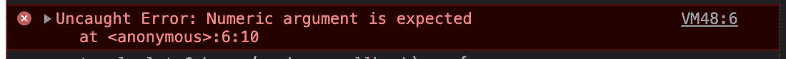

Error example with the wrong argument.


即使您在调用该函数时实现了 try-catch 块，它仍然表示错误未被捕获。由于超时延迟，在执行 catch 块后会引发该错误。

这在网络呼叫中会很快发生，在网络呼叫中会出现意外的延迟。在开发应用程序时，您需要涵盖这些情况。

以下是在回调中正确处理错误的方法:

```
const calculateCube = (number, callback) => {

    setTimeout(() => {
        if (typeof number !== "number") {
            callback(new TypeError("Numeric argument is expected"))
            return
        }
        const cube = number * number * number
        callback(null, cube)
    }, 2000)
}

const callback = (error, result) => {
    if (error !== null) {
        console.log(error)
        return
    }
    console.log(result)
}

try {
    calculateCube('hey', callback)
} catch (e) {
    console.log(e)
}
```

现在，控制台的输出将是:

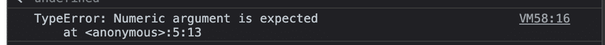

TypeError example with illegal argument.


这表明错误已得到适当处理。

### 处理承诺中的错误

大多数人倾向于承诺处理异步活动。承诺还有另一个好处——被拒绝的承诺不会终止你的剧本。但是，您仍然需要实现一个 catch 块来处理承诺中的错误。为了更好地理解这一点，让我们使用 Promises 重写`calculateCube()`函数:

```
const delay = ms => new Promise(res => setTimeout(res, ms));

const calculateCube = async (number) => {
    if (typeof number !== "number")
        throw Error("Numeric argument is expected")
    await delay(5000)
    const cube = number * number * number
    return cube
}

try {
    calculateCube(4).then(r => console.log(r))
} catch (e) { console.log(e) }
```

为了便于理解，前面代码中的超时被隔离到`delay`函数中。如果您尝试输入一个字符串而不是 4，您得到的输出将类似于以下内容:

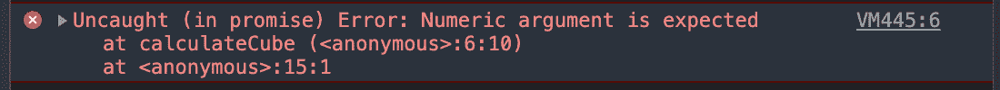

TypeError example with an illegal argument in Promise.


同样，这是由于`Promise`在其他所有事情完成执行后抛出了错误。这个问题的解决方案很简单。简单地向承诺链添加一个`catch()`调用，如下所示:

```
calculateCube("hey")
.then(r => console.log(r))
.catch(e => console.log(e))
```

现在输出将是:

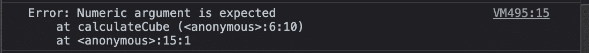

Handled TypeError example with illegal argument.


你可以观察到用承诺来处理错误是多么容易。此外，您可以链接一个`finally()`块和 promise 调用，以添加将在错误处理完成后运行的代码。

或者，您也可以使用传统的 try-catch-finally 技术处理承诺中的错误。在这种情况下，你的承诺电话应该是这样的:

```
try {
    let result = await calculateCube("hey")
    console.log(result)
} catch (e) {
    console.log(e)
} finally {
    console.log('Finally executed")
}
```

然而，这仅在异步函数中有效。因此，处理承诺错误的最佳方式是将`catch`和`finally`链接到承诺调用。

### throw/catch vs onerror() vs 回调 vs 承诺:哪个最好？

有四种方法可供您选择，您必须知道如何在任何给定的用例中选择最合适的方法。以下是你可以自己决定的方法:

#### 扔/接住

大多数时候你会使用这种方法。确保在 catch 块中为所有可能的错误实现条件，如果需要在 try 块之后运行一些内存清理例程，请记住包括 finally 块。

然而，太多的 try/catch 块会使代码难以维护。如果您发现自己处于这种情况，您可能希望通过全局处理程序或 promise 方法来处理错误。

当在异步 try/catch 块和 promise 的`catch()`块之间做出决定时，建议使用异步 try/catch 块，因为它们会使您的代码具有线性并且易于调试。

#### 不规则运算()

当你知道你的应用程序必须处理许多错误时，最好使用`onerror()`方法，这些错误可以很好地分布在整个代码库中。`onerror`方法使您能够处理错误，就像它们只是您的应用程序处理的另一个事件一样。您可以定义多个错误处理程序，并在初始渲染时将它们附加到您的应用程序窗口。

然而，你也必须记住，在误差范围较小的小项目中设置`onerror()`方法可能是不必要的挑战。如果你确定你的应用程序不会抛出太多错误，传统的抛出/捕捉方法最适合你。

#### 回访和承诺

回调和承诺中的错误处理因其代码设计和结构而不同。然而，如果你在编写代码之前就在这两者之间做出选择，那么最好选择承诺。

这是因为 promises 有一个内置的构造，可以链接一个`catch()`和一个`finally()`块来轻松处理错误。这种方法比定义额外的参数/重用现有的参数来处理错误更容易、更简洁。

### 跟踪 Git 存储库的变化

许多错误经常是由于代码库中的手工错误而产生的。在开发或调试代码时，您可能会做出不必要的更改，从而导致代码库中出现新的错误。自动化测试是在每次修改后检查你的代码的好方法。然而，它只能告诉你是否有问题。如果你不经常备份你的代码，你将会浪费时间去修复一个以前运行良好的函数或脚本。

这就是 git 发挥作用的地方。有了适当的提交策略，您可以将 git 历史作为备份系统来查看代码在开发过程中的演变。您可以很容易地浏览旧的提交，并找出之前工作正常但在不相关的更改后抛出错误的函数版本。

然后，您可以恢复旧代码或比较两个版本，以确定哪里出错了。像 [GitHub](https://kinsta.com/knowledgebase/what-is-github/) Desktop 或 GitKraken 这样的现代 [web 开发工具](https://kinsta.com/blog/web-development-tools/)帮助你将这些变化并排可视化，并快速找出错误。

有一个习惯可以帮助你减少错误，那就是每当你对你的代码进行重大修改时，运行[代码评审](https://kinsta.com/blog/code-review-tools/)。如果您在团队中工作，您可以创建一个“拉”请求，并让一个团队成员彻底检查它。这将有助于你用第二双眼睛发现任何可能被你忽略的错误。

## 处理 JavaScript 错误的最佳实践

上述方法足以帮助您为下一个 JavaScript 应用程序设计一个健壮的错误处理方法。然而，在实现它们的时候，最好记住一些事情，以充分利用您的防错功能。这里有一些提示可以帮助你。

### 1.处理操作异常时使用自定义错误

我们在本指南的前面介绍了自定义错误，让您了解如何针对您的应用程序的独特情况自定义错误处理。建议尽可能使用自定义错误，而不是通用的`Error`类，因为它为调用环境提供了更多关于错误的上下文信息。

除此之外，自定义错误允许您调节错误在调用环境中的显示方式。这意味着您可以根据需要选择隐藏特定的详细信息或显示有关错误的附加信息。

您甚至可以根据需要格式化错误内容。这使您可以更好地控制如何解释和处理错误。

### 2.不要轻信任何例外

即使是最资深的开发人员也经常犯新手的错误——在代码深处消耗异常级别。

您可能会遇到这样的情况，您有一段可选运行的代码。如果有效，很好；如果没有，你不需要做任何事情。

在这些情况下，将这些代码放在一个 try 块中并附加一个空的 catch 块是很诱人的。然而，这样做的话，你会让这段代码容易导致任何类型的错误。如果您有一个大的代码库和许多这种糟糕的错误管理构造的实例，这可能会变得很危险。

处理异常的最好方法是确定一个级别，在这个级别上所有的异常都将被处理，并将它们提升到那个级别。这个层次可以是控制器(在 MVC 架构应用中)或者中间件(在传统的面向服务器的应用中)。

这样，你就会知道在哪里可以找到应用程序中出现的所有错误，并选择如何解决它们，即使这意味着不做任何事情。

### 3.对日志和错误警报使用集中策略

记录错误通常是处理错误不可或缺的一部分。那些未能开发一个集中策略来记录错误的人可能会错过关于他们应用程序使用的有价值的信息。

应用程序的事件日志可以帮助你找出关于错误的关键数据，并帮助快速调试它们。如果你在你的应用程序中设置了适当的提醒机制，你就可以在错误到达你的大部分用户群之前知道你的应用程序中什么时候发生了错误。

建议使用一个预建的日志记录器或创建一个来满足您的需求。您可以配置这个记录器，根据错误级别(警告、调试、信息等)来处理错误。)，有些日志记录器甚至会立即将日志发送到远程日志服务器。这样，您可以观察应用程序的逻辑在活动用户中的表现。

### 4.适当地通知用户错误

在定义错误处理策略时，要记住的另一个要点是把用户放在心上。

所有干扰应用程序正常运行的错误都必须向用户发出可见的警告，通知他们出现了问题，以便用户可以尝试解决问题。如果您知道该错误的快速修复方法，如重试操作或注销并重新登录，请确保在提醒中提及，以帮助实时修复用户体验。

对于不会对日常用户体验造成任何干扰的错误，您可以考虑取消警告，并将错误记录到远程服务器，以便以后解决。

### 5.实现一个中间件(Node.js)

[Node.js 环境](https://kinsta.com/knowledgebase/what-is-node-js/)支持中间件向服务器应用程序添加功能。您可以使用这个特性为您的服务器创建一个错误处理中间件。

使用中间件最大的好处是所有的错误都在一个地方集中处理。您可以选择启用/禁用此设置，以方便测试。

以下是创建基本中间件的方法:

```
const logError = err => {
    console.log("ERROR: " + String(err))
}

const errorLoggerMiddleware = (err, req, res, next) => {
    logError(err)
    next(err)
}

const returnErrorMiddleware = (err, req, res, next) => {
    res.status(err.statusCode || 500)
       .send(err.message)
}

module.exports = {
    logError,
    errorLoggerMiddleware,
    returnErrorMiddleware
}
```

然后，您可以像这样在您的应用程序中使用这个中间件:

```
const { errorLoggerMiddleware, returnErrorMiddleware } = require('./errorMiddleware')

app.use(errorLoggerMiddleware)

app.use(returnErrorMiddleware)
```

现在，您可以在中间件内部定义自定义逻辑来适当地处理错误。您不再需要担心在整个代码库中实现单独的错误处理构造。

### 6.重启你的应用来处理程序员错误(Node.js)

当 Node.js 应用程序遇到程序员错误时，它们不一定会抛出异常并尝试关闭应用程序。这种错误可能包括由程序员错误引起的问题，如高 CPU 消耗、内存膨胀或内存泄漏。处理这些问题的最佳方式是通过 Node.js 集群模式或像 PM2 这样的独特工具崩溃应用程序，从而优雅地重启应用程序。这可以确保应用程序不会在用户操作时崩溃，呈现糟糕的用户体验。

### 7.捕获所有未捕获的异常(Node.js)

你永远无法确定你已经涵盖了应用程序中可能出现的每一个错误。因此，实现一个回退策略来捕获应用程序中所有未捕获的异常是非常重要的。

你可以这样做:

```
process.on('uncaughtException', error => {
    console.log("ERROR: " + String(error))
    // other handling mechanisms
})
```

您还可以确定发生的错误是标准异常还是自定义操作错误。根据结果，您可以退出并重新启动该进程，以避免意外行为。

### 8.捕捉所有未处理的承诺拒绝(Node.js)

类似于你永远无法涵盖所有可能的例外，你很有可能会错过处理所有可能的承诺拒绝。然而，与异常不同，承诺拒绝不会抛出错误。

因此，一个被拒绝的重要承诺可能会作为一个警告溜走，让你的应用程序有可能遇到意想不到的行为。因此，实现回退机制来处理承诺拒绝是至关重要的。

你可以这样做:

```
const promiseRejectionCallback = error => {
    console.log("PROMISE REJECTED: " + String(error))
}

process.on('unhandledRejection', callback)
```

[If you create an application, there are chances that you'll create bugs and other issues in it as well. 😅 Learn how to handle them with help from this guide ⬇️Click to Tweet](https://twitter.com/intent/tweet?url=https%3A%2F%2Fkinsta.com%2Fblog%2Ferrors-in-javascript%2F&via=kinsta&text=If+you+create+an+application%2C+there+are+chances+that+you%27ll+create+bugs+and+other+issues+in+it+as+well.+%F0%9F%98%85+Learn+how+to+handle+them+with+help+from+this+guide+%E2%AC%87%EF%B8%8F&hashtags=JavaScript%2CProgramming)

## 摘要

像任何其他编程语言一样，JavaScript 中的错误是非常频繁和自然的。在某些情况下，您甚至可能需要故意抛出错误，以向用户指示正确的响应。因此，了解他们的解剖和类型是非常重要的。

此外，您需要配备正确的工具和技术来识别和防止错误影响您的应用程序。

在大多数情况下，对于所有类型的 JavaScript 应用程序来说，一个处理错误并小心执行的可靠策略就足够了。

还有什么其他的 JavaScript 错误你还没有解决吗？有什么建设性地处理 JS 错误的技巧吗？请在下面的评论中告诉我们！

* * *

让你所有的[应用程序](https://kinsta.com/application-hosting/)、[数据库](https://kinsta.com/database-hosting/)和 [WordPress 网站](https://kinsta.com/wordpress-hosting/)在线并在一个屋檐下。我们功能丰富的高性能云平台包括:

*   在 MyKinsta 仪表盘中轻松设置和管理
*   24/7 专家支持
*   最好的谷歌云平台硬件和网络，由 Kubernetes 提供最大的可扩展性
*   面向速度和安全性的企业级 Cloudflare 集成
*   全球受众覆盖全球多达 35 个数据中心和 275 多个 pop

在第一个月使用托管的[应用程序或托管](https://kinsta.com/application-hosting/)的[数据库，您可以享受 20 美元的优惠，亲自测试一下。探索我们的](https://kinsta.com/database-hosting/)[计划](https://kinsta.com/plans/)或[与销售人员交谈](https://kinsta.com/contact-us/)以找到最适合您的方式。