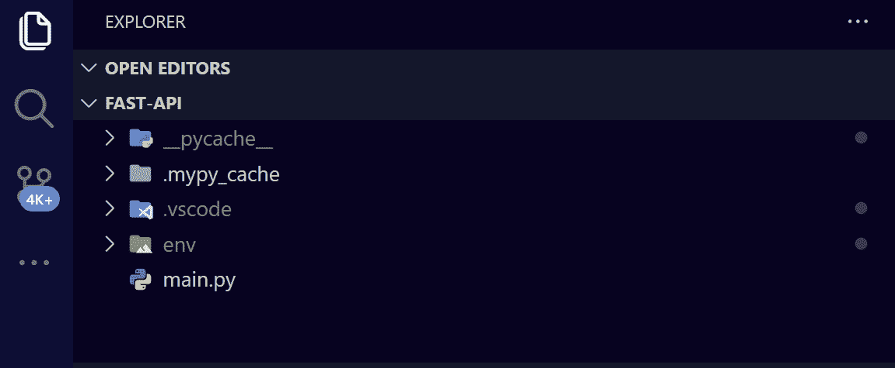
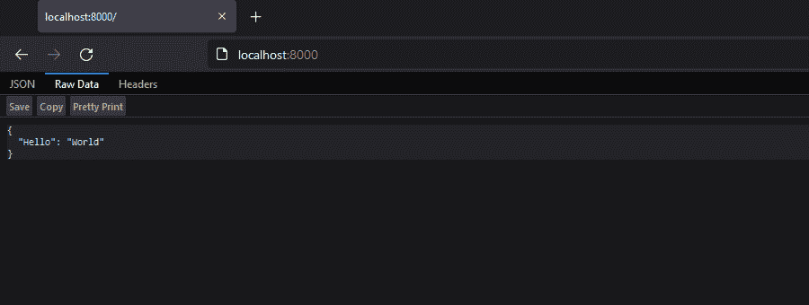
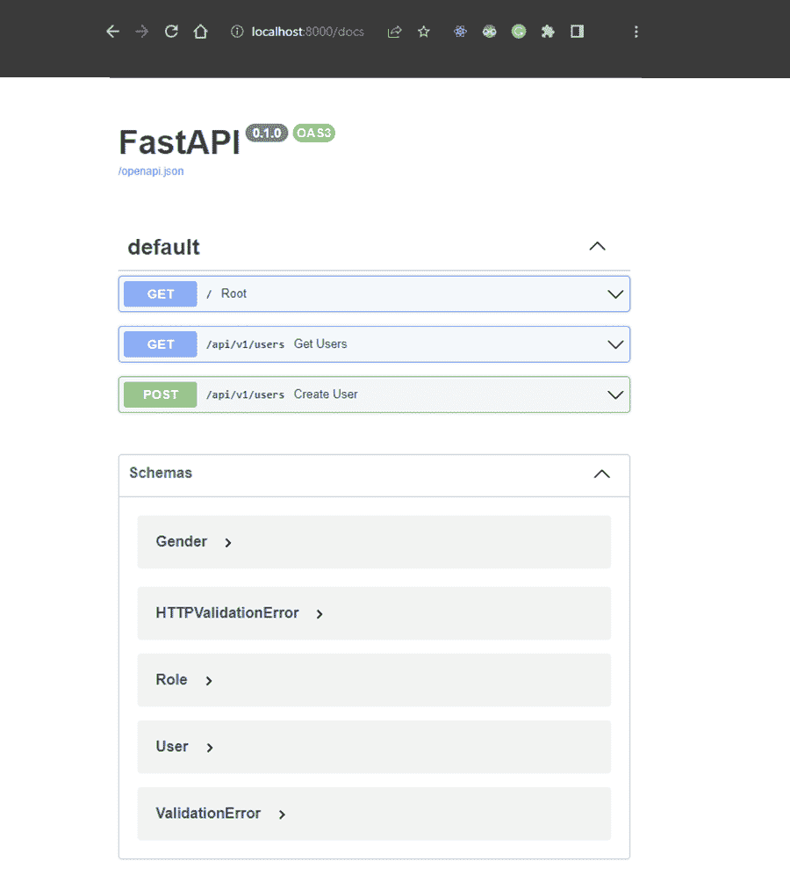
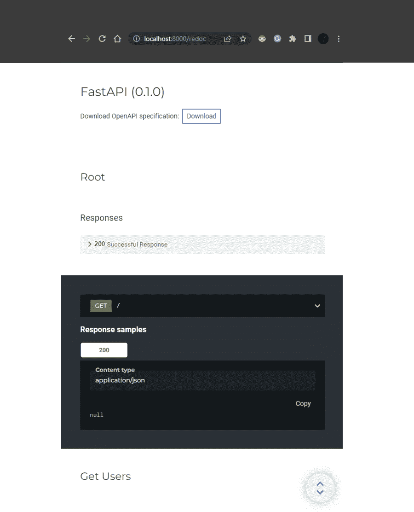
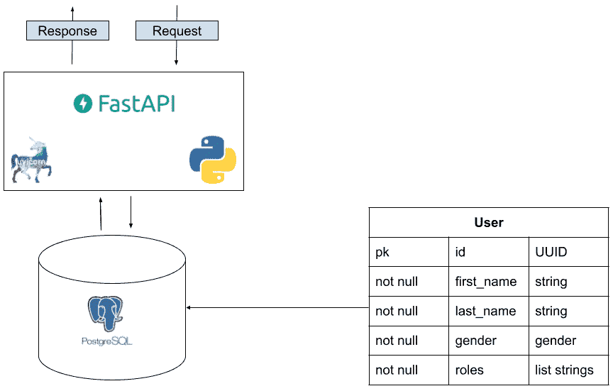
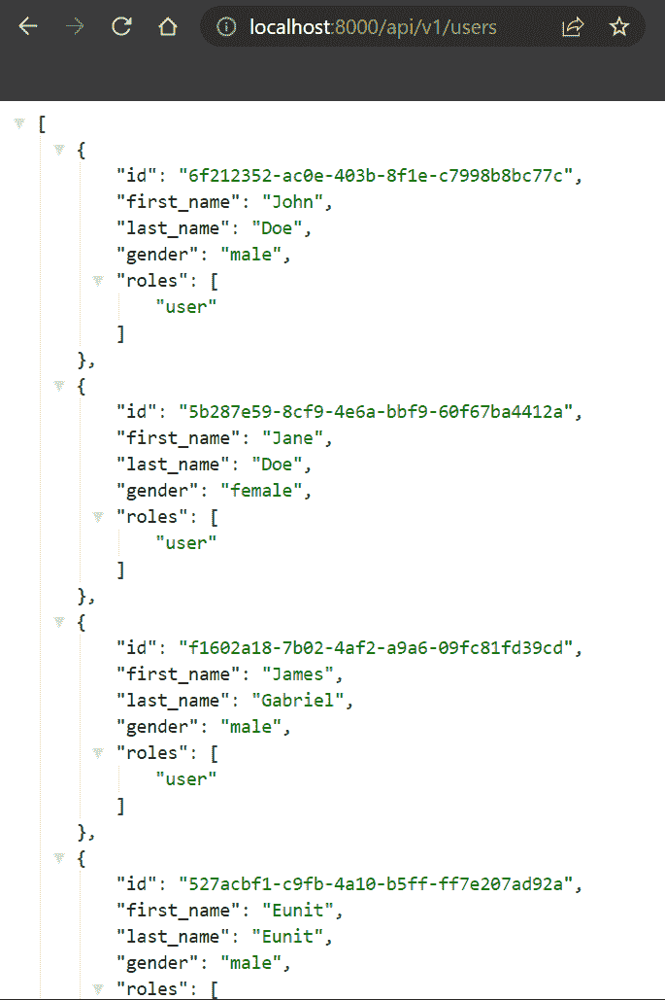
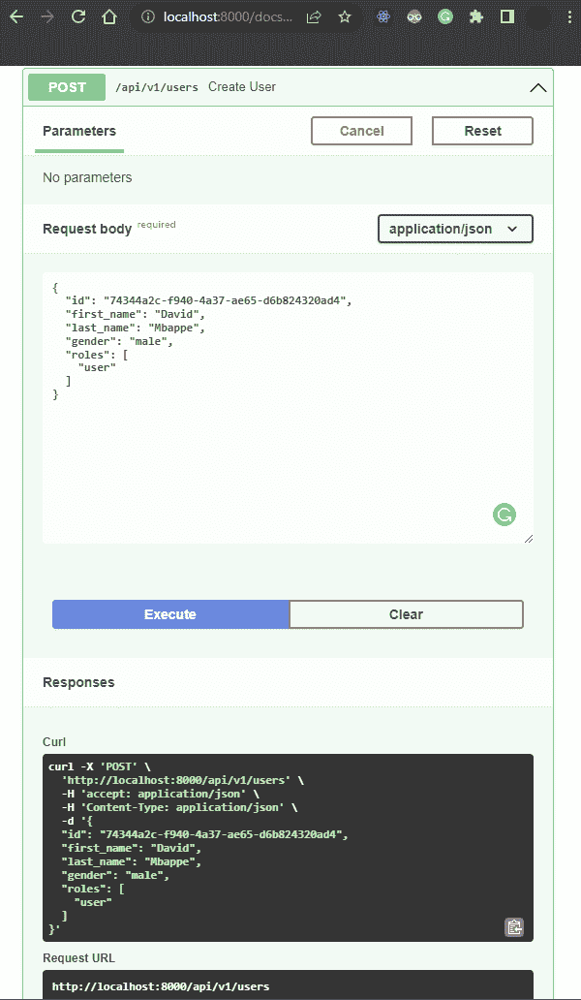
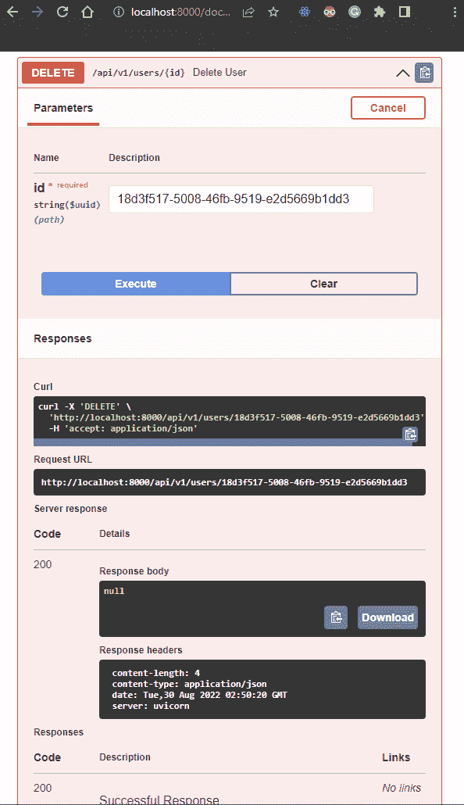
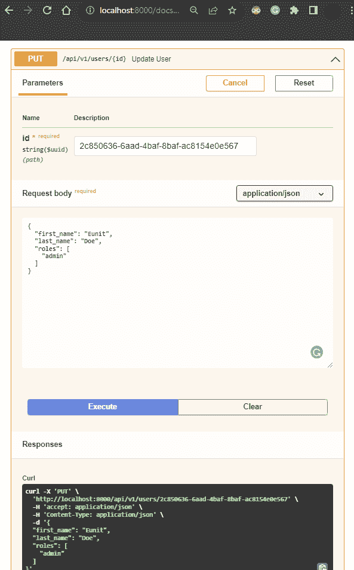

# 使用 FastAPI for Python 构建应用程序

> 原文:# t0]https://kinta . com/blog/fastapi/

FastAPI 是一个快速轻量级的 web 框架，用于使用 [Python](https://kinsta.com/blog/python-object-oriented-programming/) 3.6 及更高版本构建现代应用编程接口。在本教程中，我们将介绍使用 FastAPI 构建应用程序的基本知识，您将会对它被提名为 2021 年 T2 最佳开源框架之一的原因有所了解。

一旦你准备好开发你自己的 FastAPI 应用程序，你将不必寻找一个地方来托管它们。Kinsta 的托管的[应用和托管](https://kinsta.com/application-hosting/)服务的[数据库提供了一个基于 Python 的平台即服务。](https://kinsta.com/database-hosting/)

先学基础吧。

## FastAPI 的优势

下面是 [FastAPI 框架](https://fastapi.tiangolo.com/)给项目带来的一些优势。

*   **速度:**顾名思义，FastAPI 是一个非常快的框架。其速度可与 [Go](https://kinsta.com/help/go-example-application/) 和 [Node.js](https://kinsta.com/help/node-js-with-background-worker-and-api-example-application/) 相媲美，这两个软件通常被认为是构建 API 最快的选项之一。
*   易于学习和编码: FastAPI 已经计算出了制作一个生产就绪的 API 所需的几乎所有东西。作为使用 FastAPI 的开发人员，您不需要从头开始编写所有代码。只需几行代码，您就可以准备好部署 RESTful API。
*   **全面的文档:** FastAPI 使用 OpenAPI 文档标准，所以可以动态生成文档。该文档提供了关于 FastAPI 的端点、响应、参数和返回代码的详细信息。
*   **bug 少的 API:**FastAPI 支持[自定义数据验证](https://fastapi.tiangolo.com/tutorial/query-params-str-validations/#add-more-validations)，允许开发者构建 bug 少的 API。FastAPI 的开发者夸口说，该框架减少了人为错误——减少了 40%。
*   **类型提示:**Python 3.5 中引入了类型模块。这使您能够声明变量的`type`。当一个变量的类型被声明时，ide 能够提供更好的支持并更准确地预测错误。

[Considering FastAPI for your next project? 🤔 Check out its advantages in this guide:Click to Tweet](https://twitter.com/intent/tweet?url=https%3A%2F%2Fbit.ly%2F3ibwn0m&via=kinsta&text=Considering+FastAPI+for+your+next+project%3F+%F0%9F%A4%94+Check+out+its+advantages+in+this+guide%3A&hashtags=FastAPI%2CWebDev)

## 如何开始使用 FastAPI

要遵循本教程并开始使用 FastAPI，您需要先做几件事。


> Kinsta 把我宠坏了，所以我现在要求每个供应商都提供这样的服务。我们还试图通过我们的 SaaS 工具支持达到这一水平。
> 
> <footer class="wp-block-kinsta-client-quote__footer">
> 
> 
> 
> <cite class="wp-block-kinsta-client-quote__cite">Suganthan Mohanadasan from @Suganthanmn</cite></footer>

[View plans](https://kinsta.com/plans/)

确保你有程序员的文本编辑器/IDE，比如 [Visual Studio 代码](https://code.visualstudio.com/download)。其他选项包括[崇高文本](https://kinsta.com/blog/how-to-use-sublime-text/)和[浓缩咖啡](https://www.espressoapp.com/)。

让 Python 应用程序及其实例在虚拟环境中运行是一种常见的做法。虚拟环境允许不同的程序包集和配置同时运行，并避免由于不兼容的程序包版本而导致的冲突。

要创建一个虚拟环境，打开[您的终端](https://kinsta.com/blog/python-commands/#introduction-to-the-cli)并运行以下命令:

```
$ python3 -m venv env
```

您还需要激活虚拟环境。根据您使用的操作系统和 shell 的不同，执行该操作的命令也会有所不同。以下是一些针对多种环境的 CLI 激活示例:

```
# On Unix or MacOS (bash shell): 
/path/to/venv/bin/activate

# On Unix or MacOS (csh shell):
/path/to/venv/bin/activate.csh

# On Unix or MacOS (fish shell):
/path/to/venv/bin/activate.fish

# On Windows (command prompt):
\path\to\venv\Scripts\activate.bat

# On Windows (PowerShell):
\path\to\venv\Scripts\Activate.ps1 
```

(一些支持 Python 的 ide 也可以被配置来激活当前的虚拟环境。)

现在，安装 FastAPI:

```
$ pip3 install fastapi
```

FastAPI 是一个构建 API 的框架，但是要测试您的 API，您需要一个本地 web 服务器。uv icon 是一个非常适合开发的用于 Python 的快如闪电的异步服务器网关接口(ASGI) web 服务器。要安装 Uvicorn，请运行以下命令:

```
$ pip3 install "uvicorn[standard]"
```

成功安装后，在项目的工作目录中创建一个名为 **main.py** 的文件。这个文件将是您的应用程序入口点。



View of a basic FastAPI project within an IDE.


### 快速 FastAPI 示例

您将通过快速设置一个示例端点来测试您的 FastAPI 安装。在您的 **main.py** 文件中，粘贴以下代码，然后保存文件:

```
# main.py
from fastapi import FastAPI
app = FastAPI()
@app.get("/")
async def root():
 return {"greeting":"Hello world"} 
```

上面的代码片段创建了一个基本的 FastAPI 端点。下面总结了每一行的作用:

*   你的 API 的功能是由 FastAPI Python 类提供的。
*   `app = FastAPI()`:这将创建一个 FastAPI 实例。
*   `@app.get("/")`:这是一个 python decorator，它向 FastAPI 指定它下面的函数负责请求处理。
*   `@app.get("/")`:这是一个指定路线的装饰器。这在站点的路线上创建了一个`GET`方法。然后，包装函数返回结果。
*   用于通信的其他可能操作包括`@app.post()`、`@app.put()`、`@app.delete()`、`@app.options()`、`@app.head()`、`@app.patch()`和`@app.trace()`。

在文件目录中，在终端中运行以下命令来启动 API 服务器:

```
$ uvicorn main:app --reload
```

在这个命令中，`main`是模块的名称。`app`对象是应用程序的一个实例，它被导入到 ASGI 服务器中。`--reload`标志告诉服务器在你做任何改变时自动重新加载。

您应该在终端中看到类似这样的内容:

```
 $ uvicorn main:app --reload
INFO: Will watch for changes in these directories: ['D:\\WEB DEV\\Eunit\\Tests\\fast-api']
INFO: Uvicorn running on http://127.0.0.1:8000 (Press CTRL+C to quit)
INFO: Started reloader process [26888] using WatchFiles
INFO: Started server process [14956]
INFO: Waiting for application startup.
INFO: Application startup complete. 
```

在您的浏览器中，导航到`http://localhost:8000`以确认您的 API 正在工作。您应该在页面上看到作为 JSON 对象的“Hello”:“World”。这说明了用 FastAPI 创建 API 是多么容易。您所要做的就是定义一条路线并返回您的 Python 字典，如上面代码片段的第六行所示。



FastAPI Hello World application in a web browser.


### 使用类型提示

如果你使用 Python，你习惯于用基本数据类型如`int`、`str`、`float`和`bool`来注释变量。然而，从 Python 版本开始，引入了高级数据结构。这允许您使用诸如`dictionaries`、`tuples`和`lists`之类的数据结构。通过 FastAPI 的类型提示，您可以使用 [pydantic](https://pydantic-docs.helpmanual.io/usage/models/) 模型来构建数据的模式，然后使用 pydantic 模型来输入提示，并从所提供的数据验证中获益。

在下面的例子中，用一个简单的饭菜价格计算器`calculate_meal_fee`演示了 Python 中类型提示的使用:

```
def calculate_meal_fee(beef_price: int, meal_price: int) -> int:
 total_price: int = beef_price + meal_price
 return total_price
print("Calculated meal fee", calculate_meal_fee(75, 19)) 
```

请注意，类型提示不会改变代码的运行方式。

### FastAPI 交互式 API 文档

FastAPI 使用 [Swagger UI](https://github.com/swagger-api/swagger-ui) 来提供自动交互 API 文档。要访问它，导航到`http://localhost:8000/docs`，您将看到一个屏幕，上面显示了您所有的端点、方法和模式。



Swagger UI’s documentation for FastAPI.


这种基于浏览器的自动化 API 文档是由 FastAPI 提供的，您不需要做任何其他事情就可以利用它。

另一个基于浏览器的 API 文档，也是由 FastAPI 提供的，是 [Redoc](https://github.com/Redocly/redoc) 。要访问 Redoc，请导航到`http://localhost:8000/redoc`，在这里您将看到一个端点、方法及其各自响应的列表。



Redoc’s documentation for FastAPI.


### 在 FastAPI 中设置路线

`@app`装饰器允许您指定路线的[方法](https://developer.mozilla.org/en-US/docs/Web/HTTP/Methods)，例如`@app.get`或`@app.post`，并支持`GET`、`POST`、`PUT`和`DELETE`，以及不太常用的选项`HEAD`、`PATCH`和`TRACE`。

## 使用 FastAPI 构建您的应用

在本教程中，您将逐步了解如何使用 FastAPI 构建一个 [CRUD](https://www.codecademy.com/article/what-is-crud) 应用程序。该应用程序将能够:

*   创建用户
*   读取用户的数据库记录
*   更新现有用户
*   删除特定用户

为了执行这些 CRUD 操作，您将创建公开 API 端点的方法。结果将是一个可以存储用户列表的内存数据库。

## 注册订阅时事通讯


### 想知道我们是怎么让流量增长超过 1000%的吗？

加入 20，000 多名获得我们每周时事通讯和内部消息的人的行列吧！

[Subscribe Now](#newsletter)



Database table structure for CRUD examples.


您将使用 [pydantic](https://pydantic-docs.helpmanual.io/) 库通过 Python 类型注释来执行数据验证和设置管理。出于本教程的目的，您将把数据的形状声明为具有属性的类。

本教程将使用内存数据库。这是为了让您快速开始使用 FastAPI 构建您的 API。然而，对于生产，您可以使用您选择的任何数据库，例如 [PostgreSQL](https://kinsta.com/knowledgebase/what-is-postgresql/) 、 [MySQL](https://kinsta.com/knowledgebase/what-is-mysql/) 、 [SQLite](https://kinsta.com/blog/sqlite-vs-mysql/#what-is-sqlite) ，甚至 Oracle。

### 构建应用程序

您将从创建您的用户模型开始。用户模型将具有以下属性:

*   `id`:通用唯一标识符(UUID)
*   `first_name`:用户的名字
*   `last_name`:用户的姓氏
*   `gender`:用户的性别
*   `roles`，包含`admin`和`user`角色的列表

首先在您的工作目录中创建一个名为 **models.py** 的新文件，然后将以下代码粘贴到 **models.py** 中以创建您的模型:

```
# models.py
from typing import List, Optional
from uuid import UUID, uuid4
from pydantic import BaseModel
from enum import Enum
from pydantic import BaseModel
class Gender(str, Enum):
 male = "male"
 female = "female"
class Role(str, Enum):
 admin = "admin"
 user = "user"
class User(BaseModel):
 id: Optional[UUID] = uuid4()
 first_name: str
 last_name: str
 gender: Gender
 roles: List[Role] 
```

在上面的代码中:

*   你的`User`类扩展了`BaseModel`，然后从`pydantic`导入。
*   如上所述，您定义了用户的属性。

下一步是创建数据库。用以下代码替换您的 **main.py** 文件的内容:

```
# main.py
from typing import List
from uuid import uuid4
from fastapi import FastAPI
from models import Gender, Role, User
app = FastAPI()
db: List[User] = [
 User(
 id=uuid4(),
 first_name="John",
 last_name="Doe",
 gender=Gender.male,
 roles=[Role.user],
 ),
 User(
 id=uuid4(),
 first_name="Jane",
 last_name="Doe",
 gender=Gender.female,
 roles=[Role.user],
 ),
 User(
 id=uuid4(),
 first_name="James",
 last_name="Gabriel",
 gender=Gender.male,
 roles=[Role.user],
 ),
 User(
 id=uuid4(),
 first_name="Eunit",
 last_name="Eunit",
 gender=Gender.male,
 roles=[Role.admin, Role.user],
 ),
] 
```

在 **main.py** 中:

*   您用类型`List`初始化了`db`，并传入了`User`模型
*   您创建了一个有四个用户的内存数据库，每个用户都有所需的属性，比如`first_name`、`last_name`、`gender`和`roles`。用户`Eunit`被分配了`admin`和`user`的角色，而其他三个用户仅被分配了`user`的角色。

### 读取数据库记录

您已经成功地设置了内存中的数据库并向其中填充了用户，所以下一步是设置一个将返回所有用户列表的端点。这就是 FastAPI 的用武之地。

在您的 **main.py** 文件中，将以下代码粘贴到您的`Hello World`端点的正下方:

```
# main.py
 @app.get("/api/v1/users")
 async def get_users():
 return db 
```

这段代码定义了端点`/api/v1/users`，并创建了一个异步函数`get_users`，它返回数据库`db`的所有内容。

Struggling with downtime and WordPress problems? Kinsta is the hosting solution designed to save you time! [Check out our features](https://kinsta.com/features/)

保存您的文件，然后您可以测试您的用户端点。在您的终端中运行以下命令来启动 API 服务器:

```
$ uvicorn main:app --reload
```

在浏览器中，导航至`http://localhost:8000/api/v1/users`。这将返回所有用户的列表，如下所示:



User data retrieved by FastAPI database read request.


在这个阶段，您的 **main.py** 文件将如下所示:

```
# main.py
from typing import List
from uuid import uuid4
from fastapi import FastAPI
from models import Gender, Role, User
app = FastAPI()
db: List[User] = [
 User(
 id=uuid4(),
 first_name="John",
 last_name="Doe",
 gender=Gender.male,
 roles=[Role.user],
 ),
 User(
 id=uuid4(),
 first_name="Jane",
 last_name="Doe",
 gender=Gender.female,
 roles=[Role.user],
 ),
 User(
 id=uuid4(),
 first_name="James",
 last_name="Gabriel",
 gender=Gender.male,
 roles=[Role.user],
 ),
 User(
 id=uuid4(),
 first_name="Eunit",
 last_name="Eunit",
 gender=Gender.male,
 roles=[Role.admin, Role.user],
 ),
]
@app.get("/")
async def root():
 return {"Hello": "World",}
@app.get("/api/v1/users")
async def get_users():
 return db 
```

### 创建数据库记录

下一步是创建一个端点，以便在数据库中创建一个新用户。将以下代码片段粘贴到您的 **main.py** 文件中:

```
# main.py
@app.post("/api/v1/users")
async def create_user(user: User):
 db.append(user)
 return {"id": user.id} 
```

在这个代码片段中，您定义了提交新用户的端点，并利用`@app.post`装饰器创建了一个`POST`方法。

您还创建了函数`create_user`，它接受`User`模型的`user`，并将新创建的`user`追加(添加)到数据库`db`。最后，端点返回新创建用户的`id`的 JSON 对象。

您必须使用 FastAPI 提供的自动化 API 文档来测试您的端点，如上所示。这是因为您不能使用 web 浏览器发出 post 请求。使用[swaggeri](https://github.com/swagger-api/swagger-ui)提供的文档导航至`http://localhost:8000/docs`进行测试。



Parameters for a FastAPI POST request.


### 删除数据库记录

因为您正在构建一个 CRUD 应用程序，所以您的应用程序需要能够[删除](https://developer.mozilla.org/en-US/docs/Web/HTTP/Methods/DELETE)一个指定的资源。在本教程中，您将创建一个端点来删除用户。

将以下代码粘贴到您的 **main.py** 文件中:

```
# main.py
from uuid import UUID
from fastapi HTTPException
@app.delete("/api/v1/users/{id}")
async def delete_user(id: UUID):
for user in db:
 if user.id == id:
 db.remove(user)
 return
raise HTTPException(
 status_code=404, detail=f"Delete user failed, id {id} not found."
 ) 
```

下面是该代码如何工作的逐行分析:

*   `@app.delete("/api/v1/users/{id}")`:您使用`@app.delete()`装饰器创建了删除端点。路径仍然是`/api/v1/users/{id}`，但是它检索到了`id`，这是一个对应于用户 id 的路径变量。
*   `async def delete_user(id: UUID):`:创建`delete_user`函数，从 URL 中检索`id`。
*   `for user in db:`:这告诉应用程序遍历数据库中的用户，并检查传递的`id`是否与数据库中的用户匹配。
*   `db.remove(user)`:如果`id`匹配到用户，则删除该用户；否则，将引发一个[状态代码](https://kinsta.com/blog/http-status-codes/)为 404 的`HTTPException`。



Parameters for a FastAPI DELETE request.


### 更新数据库记录

您将创建一个端点来更新用户的详细信息。可以更新的详细信息包括以下参数:`first_name`、`last_name`、`roles`。

在您的 **models.py** 文件中，将以下代码粘贴到您的`User`模型下，即`User(BaseModel):`类之后:

```
# models.py
 class UpdateUser(BaseModel):
 first_name: Optional[str]
 last_name: Optional[str]
 roles: Optional[List[Role]] 
```

在这个代码片段中，类`UpdateUser`扩展了`BaseModel`。然后将可更新的用户参数设置为可选的，比如`first_name`、`last_name`和`roles`。

现在，您将创建一个端点来更新特定用户的详细信息。在您的 **main.py** 文件中，在`@app.delete` decorator 之后粘贴以下代码:

```
# main.py
@app.put("/api/v1/users/{id}")
async def update_user(user_update: UpdateUser, id: UUID):
 for user in db:
 if user.id == id:
 if user_update.first_name is not None:
 user.first_name = user_update.first_name
 if user_update.last_name is not None:
 user.last_name = user_update.last_name
 if user_update.roles is not None:
 user.roles = user_update.roles
 return user.id
 raise HTTPException(status_code=404, detail=f"Could not find user with id: {id}") 
```

在上面的代码中，您完成了以下操作:

*   创建了更新端点`@app.put("/api/v1/users/{id}")`。它有一个可变参数`id`，对应于用户的 id。
*   创建了一个名为`update_user`的方法，它包含了`UpdateUser`类和`id`。
*   使用了一个`for`循环来检查与传递的`id`相关联的用户是否在数据库中。
*   已检查用户的任何参数是否为`is not None`(非空)。如果任何参数，如`first_name`、`last_name`或`roles`不为空，则更新。
*   如果操作成功，则返回用户 id。
*   如果没有找到用户，就会引发一个状态代码为 404 的`HTTPException`异常和一条`Could not find user with id: {id}`消息。

要测试这个端点，请确保您的 Uvicorn 服务器正在运行。如果它没有运行，请输入以下命令:

```
uvicorn main:app --reload
```

下面是测试的截图。



Parameters for a FastAPI UPDATE request.


[了解 FastAPI 如何减少高达 40%的人为错误😎从这里开始: 点击推文](https://twitter.com/intent/tweet?url=https%3A%2F%2Fbit.ly%2F3ibwn0m&via=kinsta&text=See+how+FastAPI+could+drop+human-induced+bugs+by+up+to+40+percent+%F0%9F%98%8E+Get+started+right+here%3A&hashtags=FastAPI%2CWebDev)


## 摘要

在本教程中，您了解了 Python 的 FastAPI 框架，并亲眼目睹了如何快速启动和运行基于 FastAPI 的应用程序。您学习了如何使用框架构建 CRUD API 端点——创建、读取、更新和删除数据库记录。

现在，如果你想让你的 web 应用程序开发更上一层楼，一定要看看 Kinsta 的平台，它提供了[应用程序托管和](https://kinsta.com/feature-updates/application-database-hosting/)数据库托管。像 FastAPI 一样，它非常简单。

* * *

让你所有的[应用程序](https://kinsta.com/application-hosting/)、[数据库](https://kinsta.com/database-hosting/)和 [WordPress 网站](https://kinsta.com/wordpress-hosting/)在线并在一个屋檐下。我们功能丰富的高性能云平台包括:

*   在 MyKinsta 仪表盘中轻松设置和管理
*   24/7 专家支持
*   最好的谷歌云平台硬件和网络，由 Kubernetes 提供最大的可扩展性
*   面向速度和安全性的企业级 Cloudflare 集成
*   全球受众覆盖全球多达 35 个数据中心和 275 多个 pop

在第一个月使用托管的[应用程序或托管](https://kinsta.com/application-hosting/)的[数据库，您可以享受 20 美元的优惠，亲自测试一下。探索我们的](https://kinsta.com/database-hosting/)[计划](https://kinsta.com/plans/)或[与销售人员交谈](https://kinsta.com/contact-us/)以找到最适合您的方式。