# 2022 年 23 个最快的 WooCommerce 主题(基于全面测试)

> 原文：<https://kinsta.com/blog/fastest-woocommerce-theme/>

最快的 WooCommerce 主题是一个热门的讨论话题，主要是因为做出公正的评价是一个挑战。很多主题开发者声称自己的主题是最快的，这种情况并不少见。然而，深入、公正的测试使我们能够确定我们可以经常依赖的主题，尤其是在为多个客户创建一个或两个主题的网站时。

没有完美的方法来衡量哪一个 WooCommerce 主题是最快的，但是有很多工具，我们可以把它们放在一起，专注于那些速度值得称赞的主题。

因此，我们开始建立一个分析主题速度的先例，使用[多个站点性能](https://kinsta.com/webinars/woocommerce-performance/)和加载时间评估器，并从我们自己的经验和用户评论中获得一些帮助。

请记住，你的最终目标是增加商店的收入。所以一定要下载我们的免费电子书**， [10 种提高你的网络商务产品页面转化率的方法](https://kinsta.com/ebooks/wordpress/ecommerce-conversion-rate/?utm_source=Blog&utm_medium=Link&utm_campaign=WooCommerce+Conversions+Ebook)。**

 **## 我们如何测试 WooCommerce 主题的速度

虽然没有速度测试提供绝对的结果，但我们希望确保我们的速度测试模拟真实环境。主题开发者演示的测试速度带来了各种各样的问题。

由于每个主题的演示都在不同的服务器上，一个主题可能比另一个快得多。此外，它们都可以有不同的内容。我们可能最终用 1，000 个产品测试一个演示，而另一个只有 5 个。

因此，我们的测试结合了以下元素，以保持尽可能接近真实世界的情况，类似于我们对标准 WordPress 主题的[速度测试:](https://kinsta.com/blog/fastest-wordpress-theme/)

*   一个干净的 WordPress 沙盒安装，所有测试使用相同的主机基础设施。
*   WooCommerce 插件。
*   推荐免费的 [WooCommerce 插件](https://kinsta.com/blog/woocommerce-plugins/)(比如 [Jetpack](https://kinsta.com/knowledgebase/wordpress-jetpack/) 和谷歌广告)。
*   12 个演示产品，带有图片、描述和发布的产品页面。
*   带有[产品展示区](https://kinsta.com/blog/wordpress-photo-gallery-plugins/)和横幅图片的静态主页。
*   来自[主题单元测试 XML](https://codex.wordpress.org/Theme_Unit_Test) 文件的演示文章、页面和其他项目。
*   完整的[菜单](https://kinsta.com/blog/wordpress-menu-plugins/)。

通过这种配置，我们创造了一个尽可能接近现实的环境。正如你在下面看到的，我们有一个带下拉菜单的主页。每当我们测试一个新主题时，我们都会保留以前主题的内容，包括横幅图像。

需要记住的一点是，我们不是在优化任何媒体，也不是连接到 T2 的内容交付网络。尽管这些元素属于“真实世界”的范畴，但并不是所有的 WordPress 站点都使用相同的 CDN，而有些站点根本不使用任何 CDN。

此外，该网站可能没有一个[图像优化](https://kinsta.com/blog/optimize-images-for-web/)插件。因此，我们用虚拟内容填充了模拟站点，以测试每个主题在没有所有性能升级的情况下是如何工作的。

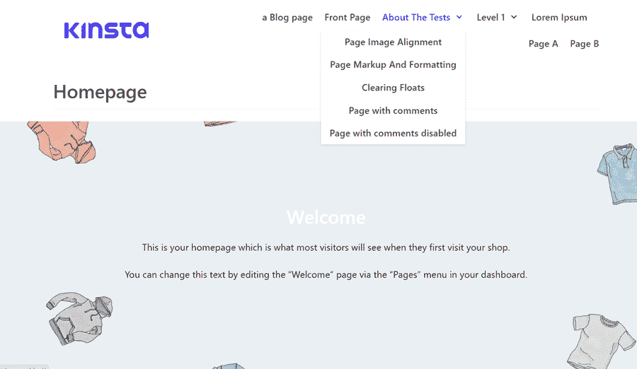

The mock WooCommerce site we used to test the themes

我们觉得拥有一个合法的商店对于测试 WooCommerce 主题也是必不可少的。因此，我们向模拟站点添加了几个带有图像、价格、按钮和描述的产品。

我们还在主页上添加了一个产品展示区，以及遍布整个网站的各种其他项目，例如几十个内容丰富的帖子和页面。

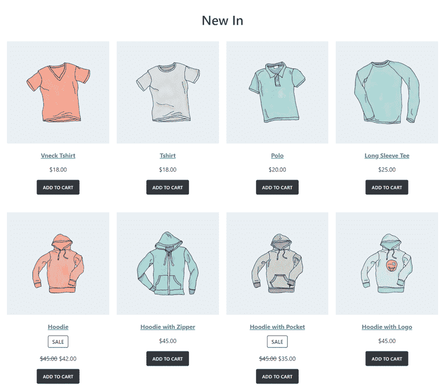

The ‘Products’ page in our mock WooCommerce site

## 使用的速度测试工具

我们使用了四种网站速度和优化测试工具来了解每个 WooCommerce 主题的优点和缺点。通过这种方式，我们不仅坚持使用一种工具——这可能会导致不准确——而且我们还会查看更多的指标来确定哪个主题是最快的。

下面是[速度测试](https://kinsta.com/blog/website-speed-test/)的简要概述:

*   **gt metrix Speed Test(Legacy):**一个流行的分析工具，用两种类型的速度分数对站点进行排名。它还显示了加载时间、页面大小和请求。GTmetrix 报告对于确定需要改进站点性能的领域非常有用。
*   **Pingdom 网站速度测试:**另一个速度测试，让你改变你的服务器位置，并查看网站数据，如页面大小，加载时间和请求。它还为每个测试分配一个性能等级。
*   **Google PageSpeed Insights:** 它通过具体的细节来提供改进网站性能的分数和建议，比如网站变得具有交互性或显示其第一张图片或文本所需的时间。
*   **Bytecheck 网站速度测试:** A [TTFB(到达第一个字节的时间)](https://kinsta.com/blog/ttfb/)回顾，解释数据的第一个字节出现在屏幕上需要多长时间。

## 使用的指标

我们使用的来自 GTmetrix(传统)的指标包括:

*   **PageSpeed 评分**–综合图像优化和重定向等因素的累积分数，满分为 100 分。
*   **y slow Score**——100 分的累积分数，检查像 [DNS 查找](https://kinsta.com/blog/reduce-dns-lookups/)和 JavaScript 这样的元素。
*   **完全加载时间**–加载整个网站所需的时间。越低越好。
*   **总页面大小**–每个已安装主题的网站文件大小。文件越小越好。
*   **请求**–将主题站点文件交付给最终用户所需的请求数量。请求越少越好。

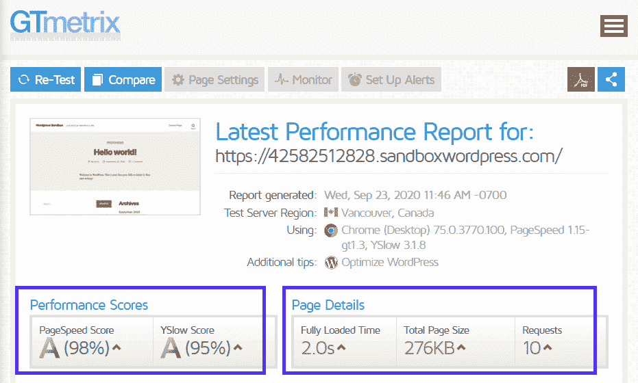

GTmetrix Speed Test

### 来自 Pingdom:

*   **绩效等级**–满分为 100 分的等级，包括错误和内容大小等要素的平均分数。
*   **加载时间**–加载站点需要多长时间。越低越好。
*   **页面大小**–安装了主题的站点文件的整体大小。越小越好。
*   **请求**–网页发出的服务器请求总数。越少越好。

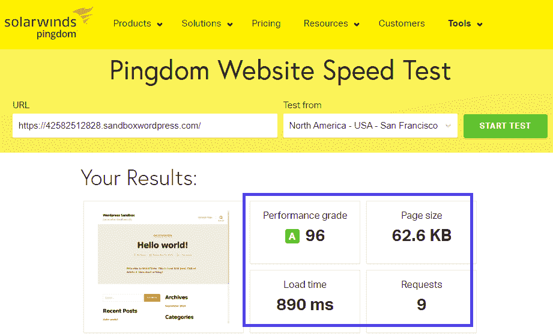

Pingdom Website Speed Test

### 来自 Google PageSpeed Insights:

*   **总分**–总分 100 分。因素包括显示内容的时间和空闲时间。
*   **第一幅内容丰富的画**——我们称之为“第一幅图像或文本”，指的是看到第一个项目需要多长时间。越低越好。
*   **速度指数**–所有站点元素加载所花费的时间。越低越好。
*   **交互时间**–当用户可以点击一个按钮或执行某个动作时，站点处于交互状态的时间。

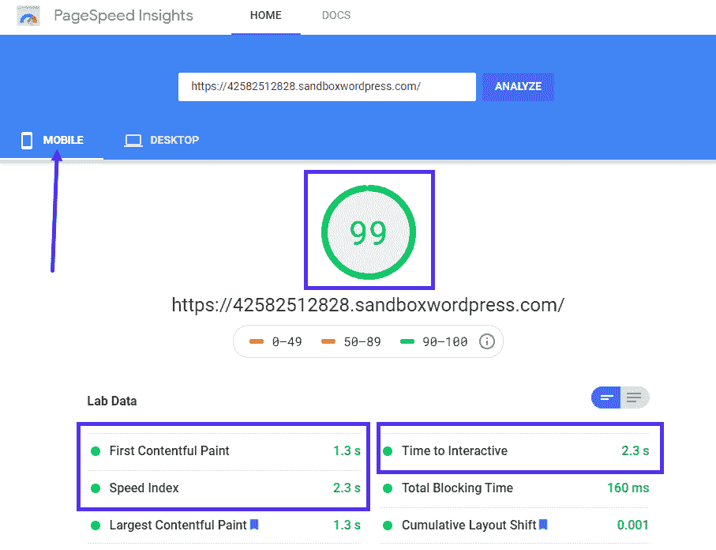

Google PageSpeed Insights

### 来自字节检查:

*   **TTFB**–这是“到达第一个字节的时间”，或者说加载一个字节的数据需要多长时间。越低越好。
*   **总时间**–加载所有字节的总时间。
*   **标题大小**–标题大小与我们演示站点中已有的内容没有太大变化，所以它对我们的分析没有太大影响。

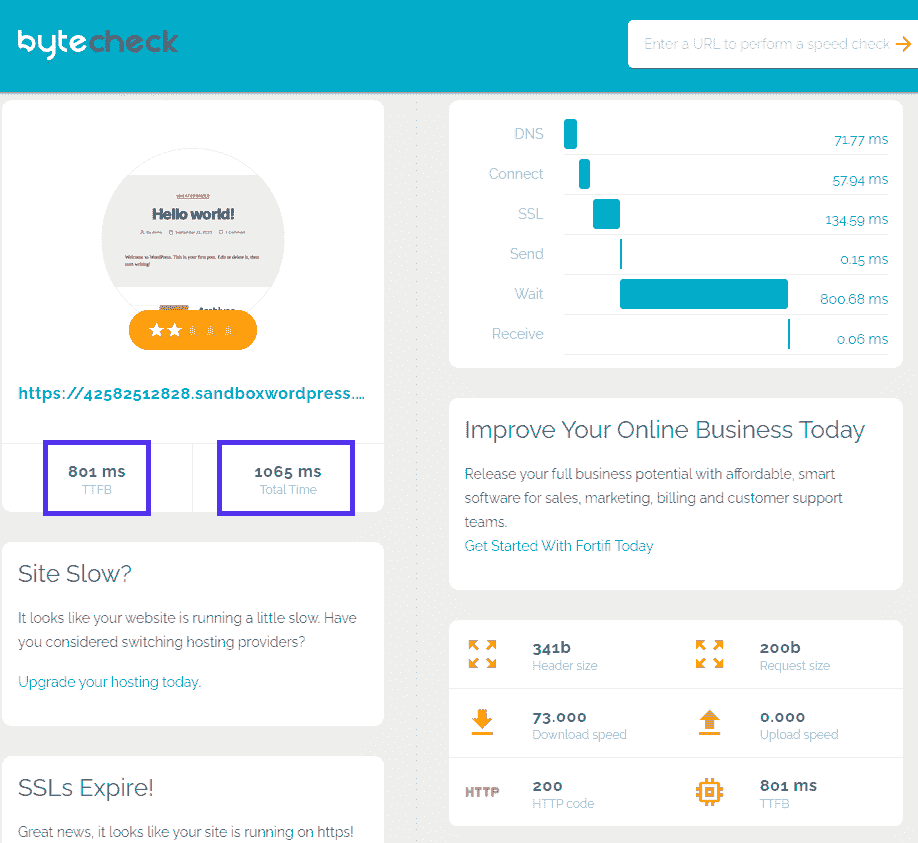

Bytecheck Website Speed Test

[准备好一劳永逸的知道 WooCommerce 哪个主题最快？⚡️点击查看结果...👇 点击推文](https://twitter.com/intent/tweet?url=https%3A%2F%2Fkinsta.com%2Fblog%2Ffastest-woocommerce-theme%2F&via=kinsta&text=Ready+to+know+once+and+for+all+which+WooCommerce+theme+is+the+fastest%3F%E2%9A%A1%EF%B8%8F+Click+to+see+the+results...%F0%9F%91%87&hashtags=Ecommerce%2CFastestThemes)

## 测试和分析了 23 个最快的 WooCommerce 主题

选择过程包括组织 50 个最受欢迎的 WooCommerce 主题，以可靠性和性能著称。我们还查看了用户评分和评论来精简列表。如果一个主题有数百条评论，但平均只有两三颗星，我们就把它从列表中删除。

我们意识到不太受欢迎(或较新)的主题也值得一试。所以我们浏览了 WordPress 主题库，找到了更多独特的 WooCommerce 主题，这些主题是现代的，包含了许多有益的特性。

由于该批中既有众所周知的主题，也有未被发现的主题，我们决定排除 GTmetrix PageSpeed 或 Pingdom 得分低于 80 的主题。

之后有 20 多个主题符合要求。这些是最快的 WooCommerce 主题。我们的测试显示，尽管每个主题都能提供快速的结果，但并非所有主题都是平等的。

看看下面。

### 兰花商店

[兰花商店](https://wordpress.org/themes/orchid-store/) WooCommerce 主题展现了现代网上商店灵活时尚的一面。它已经准备好整合 WooCommerce 和其他各种[电子商务插件](https://kinsta.com/blog/wordpress-ecommerce-plugins/)。

兰花商店主题的伟大之处在于，您可以从标准的在线商店模板开始，但它具有为其他行业(如体育用品店和家具店)修改它所需的设置和演示。

WordPress 定制器是定制主题的主要方式，但它也是完全 widget 化的，可以与一些知名的页面构建器一起工作。

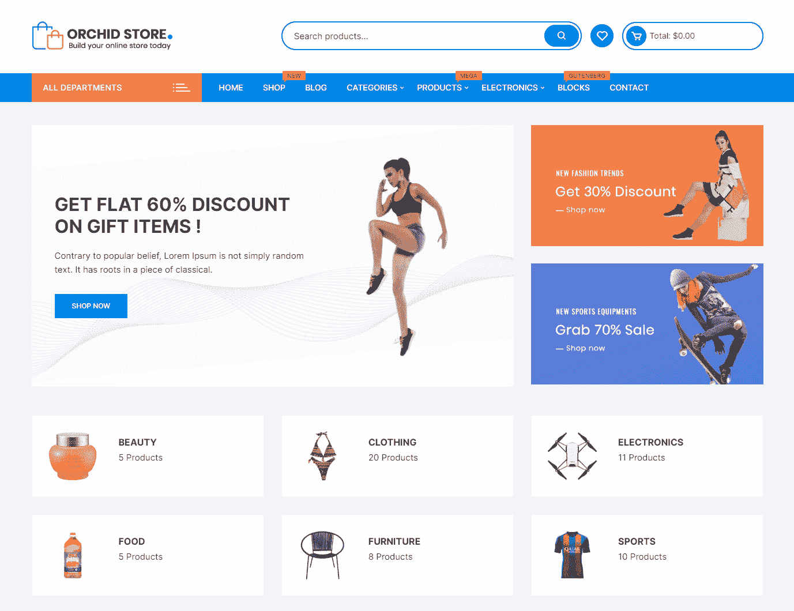

Orchid Store

主题开发者 ThemeBeez 提供了几个演示来尝试一个简单的定制体验，当网站发布时，它最终在所有设备上都看起来很棒。

Elementor 与兰花商店配合得很好，因此您可以从那里利用 WooCommerce 元素。你也可以利用兰花商店附带的东西，如大型菜单生成器和愿望清单工具。

#### 定价

兰花商店主题可以免费下载。

一个专业版的单点许可售价为 49 美元。你也可以支付额外的费用购买多个许可证或开发者许可证。

#### 显著特征

*   完全兼容 WooCommerce 和其他 WooCommerce 插件，如 WooCommerce 会员、订阅和 YITH 愿望列表。
*   一个内置的大菜单，用于在菜单中添加大列表，合并视觉效果和许多下拉菜单。
*   电子商务小工具库。
*   愿望清单支持帮助人们保存物品以备后用。
*   快速查看按钮，这样用户就不必直接进入实际的产品页面来查看更多信息。
*   支持 Elementor，市场上最好的页面生成器之一。
*   多语言和翻译工具，使翻译您的网站和在其他市场销售变得容易。
*   快速[变色](https://kinsta.com/blog/website-color-schemes/)设置，以匹配您的品牌。
*   主菜单旁边的特殊菜单。使用它来显示产品类别或其他菜单链接。
*   围绕主页的外观和感觉改变的三个演示。
*   一个横幅和滑块部件，用于发布公告或列出促销活动。
*   一个促进转化的行动号召小部件。
*   几个图标可供选择，并添加到您的标题区。例如，您可以更改购物车和愿望列表图标的外观。

### 最快 WooCommerce 主题分析

兰花商店提供了一个相当理想的设计，它的移动性能在我们的测试中非常突出。结果与兰花商店有点混合，但总的来说，这是一个坚实的主题，具有体面的速度优势。

#### GTMetrix 速度测试

*   页面速度得分: 97%
*   **YSlow 评分:** 88%
*   **满载时间:** 5.1s
*   **总页面大小:** 352KB
*   请求数: 34

#### Pingdom

*   **性能等级:** 86
*   **加载时间:**1.02 毫秒
*   **页面大小:** 373.8KB
*   请求数: 34

#### PageSpeed Insights 测试(仅限移动设备)

*   **总分:** 71
*   **第一张图片或文字:** 3.8s
*   **速度指数(所有内容的可见人群):** 4.7s
*   **完全互动的时间:**5.2 秒

#### 字节检查 TTFB 测试

*   **到第一个字节的时间:**599 毫秒
*   **总时间:**889 毫秒
*   **总标题尺寸:** 517b

#### 测试结论

兰花商店赢得了 PageSpeed 分数测试，击败了 GTMetrix 评估中的所有其他主题。当平均所有四个性能分数时，它也最终排在第二位。它提供了 97 分的页面速度，这是唯一一个超过 T2 94 分的主题。除此之外，YSlow、Pingdom 和 Google Pagespeed 的移动评分都达到了人们所期望的最高水平。

奇怪的是，在页面加载时间方面，兰花商店正好相反。当我们对加载时间测试进行平均时，它在后五名中结束，GTMetrix 加载时间刚刚超过五秒。TTFB 看起来不错，Pingdom 加载时间也不错。更不用说，兰花商店主题拥有最快的移动速度指数。只是 GTMetrix 加载时间在加载时间结果中拖累了它。也许它与一个插件相冲突，或者只是在那个测试中遇到了麻烦，因为其他测试都提供了顶级的结果。

### 主题烧烤店

eStore 主题提供了一个干净、极简的网上商店设计，用来吸引顾客，把注意力吸引到网站的某些区域，而不是用太多的盒子把它弄得乱七八糟。不过，它仍然支持几个[小工具](https://kinsta.com/blog/wordpress-widgets/)和[横幅区](https://kinsta.com/blog/banner-ad-sizes/)。它还提供了一个漂亮的标题模块，带有交互式购物车图标、收藏夹按钮等等。

eStore 主题来自 ThemeGrill，这是一个广受 WordPress 开发者欢迎的网站。其他一些 ThemeGrill 电子商务主题也可用，但我们发现 eStore 在我们的测试中速度最快。至于定制，你可以从四个 eStore 演示中选择，其中一个侧重于时尚，而另一个则有技术设计。

eStore

eStore 主题在移动设备上看起来很可爱，并允许对主页和购物区进行大量定制。它以其速度和轻量级的构建而闻名，所以很高兴看到这一赞誉与我们的测试结果相符。除此之外，你从 ThemeGrill 得到的任何主题都有一流的客户支持，在你为客户或你自己开发网站的过程中指引你前进。

#### 定价

eStore 主题可以免费下载。你也可以购买 69 美元的 eStore Pro T1，它可以为你提供一年的高级支持、更新，以及页眉、WooCommerce 和排版的高级工具。

随着许可证数量的增加，价格也会上涨。ThemeGrill 还出售 99 美元的所有主题计划，可以让你获得开发者制作的所有主题。

#### 显著特征

*   一个光滑的主页，带有放置英雄图像、横幅和按钮的模块。
*   一个带有交互式按钮的可定制标题，一个强菜单和一个消息横幅。
*   四个演示，要么以默认的 eStore 布局开始你的设计，要么创建一些利基，如技术或服装店。
*   颜色、部件和排版的定制工具。
*   一键演示导入选项，用于启动您的入门网站，并从 ThemeGrill 不断增长的演示库中进行挑选。
*   完全兼容 WooCommerce，拥有专为转换而设计的时尚购物车。
*   一个购物车图标菜单区域，您可以自定义并添加其他元素。
*   购物车的多种布局。
*   主页顶部的商店通知信息。
*   用于调整产品目录和建立产品库的快速可视化设置。
*   与 Gutenberg、Beaver Builder 和 Elementor 等最流行的页面构建器集成。
*   一个粘性菜单，功能很像一个大菜单，允许多个下拉和扩展。
*   升级到 premium 计划时，可获得额外的 WooCommerce 功能和拖放模块。

### 最快 WooCommerce 主题分析

作为一个严格基于电子商务的主题，eStore 结合了简单性和功能性，同时也向我们展示了拥有一个快速运行的大型在线商店并非不可能——即使没有世界上运行速度最快的 WordPress 主机。

#### GTMetrix 速度测试

*   页面速度得分: 94%
*   **YSlow 评分:** 89%
*   **满载时间:** 4.3s
*   **总页面大小:** 599KB
*   **请求:** 55

#### Pingdom

*   **性能等级:** 82
*   **加载时间:**1.05 秒
*   **页面大小:** 635.8KB
*   **请求:** 55

#### PageSpeed Insights 测试(仅限移动设备)

*   **总分:** 59
*   **第一张图片或文字:** 3.2s
*   **速度指数(所有内容的可见人群):** 5.3s
*   **完全互动的时间:**6.8 秒

#### 字节检查 TTFB 测试

*   **到达第一个字节的时间:**582 毫秒
*   **总时间:**892 毫秒
*   **总标题尺寸:** 510b

#### 测试结论

eStore 主题以其全面的高性能得分给人留下了深刻的印象。在平均性能得分方面，它进入了前 10 名，成为了最快的 WooCommerce 主题之一。PageSpeed、Google Mobile 和 YSlow 评分看起来都不错。它唯一欠缺的地方是 Pingdom 的分数，但不是太多。

加载时间略有不同，但 eStore 似乎仍然是一个实用的选择，尤其是如果你正在寻找一个主要提供电子商务功能的主题。GTMetrix 的加载时间超过了 4 秒，但其他一切，从 Pingdom 加载时间到移动速度指数都很好。

### 阿斯特拉

Astra 是 WordPress 上最受欢迎的主题之一，拥有超过一百万的下载量。主题可以定制和个性化，以适应任何网站。

Astra 附带了 150 多个预制模板，这些模板是由 Elementor、Beaver Builder 和 [Gutenberg](https://kinsta.com/blog/gutenberg-wordpress-editor/) 等流行的页面生成器构建的。每个模板都是针对特定行业或网站的，包括时装设计师、珠宝商、产品公司、瑜伽老师等等。前往 Astra 的网站查看所有的[这些模板](https://wpastra.com/starter-templates/)。

Astra

最重要的是，基础主题本身只有 50KB。这使得它可以快速加载，这对销售产品至关重要。毕竟，客户[不想等待你的站点加载](https://kinsta.com/learn/page-speed/)。Astra 与 [WooCommerce](https://kinsta.com/blog/woocommerce-tutorial/) 配合得非常好，是 WordPress 最受推荐的电子商务主题之一。

说到设计，Astra 是无止境可定制的。您可以使用拖放界面创建页眉和页脚，控制颜色和字体，并使用不同的布局，如网格、列表或砖石。默认情况下，Astra 中的一切都针对移动设备进行了优化。

**定价**

Astra 主题[免费下载](https://wordpress.org/themes/astra/)。高级计划起价 59 美元，包括 100 多个入门模板、一对一支持、无限制的网站使用和其他功能。高级计划包括更多模板，访问 Convert Pro 或 Scheme Pro 等其他插件，以及 SkillJet Academy 的免费会员资格，SkillJet Academy 是一个网站设计课程库。

**显著特征**

*   文件大小只有 50KB 意味着你的网站将在半秒钟内加载。
*   [反应灵敏](https://kinsta.com/blog/responsive-web-design/)，移动友好，并针对移动销售进行了优化。
*   [SEO 优化](https://kinsta.com/blog/wordpress-seo/)在谷歌搜索结果中最大化你的产品列表。
*   超过 150 种预制模板，适用于各种类型的业务。这些模板适用于流行的页面生成器，如 Beaver Builder 和 Elementor。
*   转换就绪结账减少了[购物车废弃](https://kinsta.com/blog/shopping-cart-abandonment/)。
*   使用高安全性标准清理代码，确保您客户的交易 100%安全。
*   通过[分页](https://kinsta.com/blog/wordpress-pagination/)或无限滚动显示您的产品。
*   在非画布侧边栏中添加产品搜索过滤器。
*   快速查看让客户无需打开新页面即可预览产品。
*   下拉购物车窗口可快速查看添加到购物车的所有产品。
*   高度可定制的结账流程可增强用户体验。

### 最快 WooCommerce 主题分析

Astra 是最轻量级的 WordPress 主题之一。无论您添加多少额外的功能，它的模块化本质都确保了它保持原样。难怪它会出现在这个名单上。让我们看看它的表现如何。

#### GTMetrix 速度测试

*   页面速度得分: 93%
*   **YSlow 评分:** 91%
*   **满载时间:** 1.1s
*   **总页面大小:** 350KB
*   **请求:** 37

#### Pingdom

*   **性能等级:** 90
*   **加载时间:**1.44 秒
*   **页面大小:** 365.5KB
*   **请求:** 37

#### PageSpeed Insights 测试(仅限移动设备)

*   **总分:** 79
*   **第一张图片或文字:** 2.6s
*   **速度指数(所有内容的可见人群):** 4.4s
*   **完全互动的时间:**3.8 秒

#### 字节检查 TTFB 测试

*   **到达第一个字节的时间:**48 毫秒
*   **总时间:**48 毫秒
*   **总割台尺寸:** 496b

#### 测试结论

Astra 在所有测试中的表现都令人惊讶。值得注意的是，它的谷歌移动性能得分为 79 分，是所有测试的 WooCommerce 主题中最高的。这使得它成为最快的 WooCommerce 主题之一(而且是免费的)。

Astra 主题在网页加载时间方面也保持稳定。它的 TTFB 为**48 毫秒**是所有产品中最快的。虽然它的 GTMetrix 得分仅次于其他主题，如 Orchid 和 GeneratePress，但在平均所有性能得分时，它仍进入了前 5 名。

### 卡登斯

在测试[最快的 WordPress 主题](https://kinsta.com/blog/fastest-wordpress-theme/)时，Kadence 主题作为推荐引起了我们的注意。它提供了高端的性能和多种可视化构建器来定制你的网站的标题和几乎所有的其他元素。

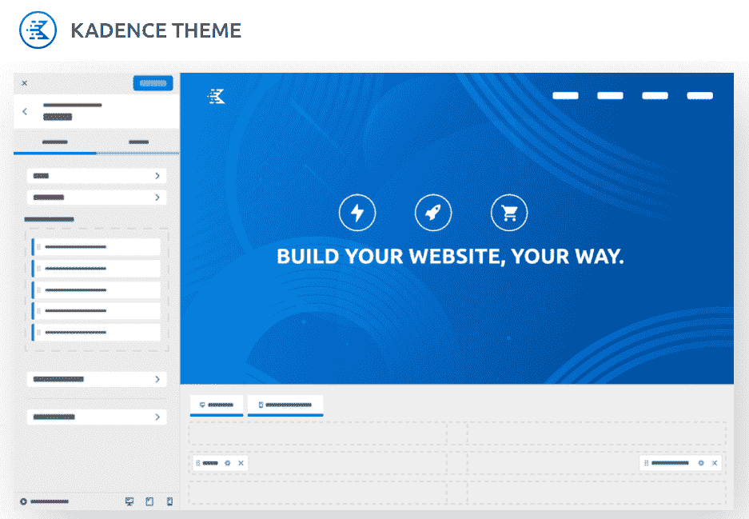

Kadence theme

这个主题为 WooCommerce 提供了支持和几个演示，可以用最少的设计工作来启动你的在线商店。每个模板都考虑到了 WooCommerce 的功能，但是有些提供了电子商务特有的设计元素，比如购物车和产品 T2 画廊，如下图所示。

Kadence Shop Demo

#### 定价

核心主题是免费的。高级版本的终身费用为 259 美元，偶尔可以打折到一半左右。它包括支持无限的网站和终身客户支持。

还有终身会员资格，包括其他附加组件和插件。

#### 显著特征

*   一个 WooCommerce 插件，带有自定义块，用于创建在线商店。
*   用于切换商店的窗口小部件区域。
*   向购物车中添加单个商品的 AJAX 特性。
*   当产品被放入购物车时自动打开的边车。
*   一个用于整个网站的拖放构建器，以及一个专门为标题制作的构建器。
*   多列和[下拉菜单](https://kinsta.com/knowledgebase/wordpress-dropdown-menu/)用于生成大型菜单式导航。
*   提供完整在线商店设计的入门模板，包括一个用于所有类型购物的模板和一个用于销售在线课程的模板。
*   [面包屑](https://kinsta.com/blog/wordpress-breadcrumbs/)引导顾客完成购物过程。

### 最快 WooCommerce 主题分析

Kadence 是一个多功能的主题，完全支持 WooCommerce，拥有稳定的性能分数和可观的加载时间。

#### GTMetrix 速度测试

*   页面速度得分: 94%
*   **YSlow 评分:** 89%
*   **满载时间:** 4.1s
*   **总页面大小:** 465KB
*   请求数: 42

#### Pingdom

*   **性能等级:** 86
*   **加载时间:**1.86 秒
*   **页面大小:** 492.6KB
*   请求数: 42

#### PageSpeed Insights 测试(仅限移动设备)

*   **总分:** 60
*   **第一张图片或文字:** 2.9s
*   **速度指数(所有内容的可见人群):** 7.2s
*   **完全互动的时间:**5.6 秒

#### 字节检查 TTFB 测试

*   **到达第一个字节的时间:**640 毫秒
*   **总时间:**880 毫秒
*   **总标题尺寸:** 510b

#### 测试结论

Kadence 主题在 GTmetrix PageSpeed 评分中遥遥领先，其 YSlow 评分也没什么可嗤之以鼻的。移动结果也相当不错。

Kadence 的加载时间相对于这个列表中的其他游戏来说比较慢，但是它仍然足够快，可以被认为是一个快速的主题。它的移动速度指数也可以这么说。

### 斯托里维尔

[StoreVilla](https://wordpress.org/themes/storevilla/) 通过在线商店和内置定制工具，为珠宝、时尚和生活品牌等行业提供优雅易用的设计流程。这个 WooCommerce 主题有大量的追随者，下载数以千计，开发人员友好的界面非常适合 [SEO](https://kinsta.com/blog/wordpress-seo/) 、定制和[响应](https://kinsta.com/blog/responsive-web-design/)。它由 AccessPress 公司销售，该公司是一家经验丰富的开发人员，拥有 100 多个插件和 60 个主题。

StoreVilla

至于 StoreVilla 主题的整体设计，它具有一个时尚的菜单和标题区域，带有交互式元素，如购物车图标和愿望列表。有一个区域包括商店联系信息以提供支持，还有一个可编辑的搜索/过滤字段，带有一个下拉列表和搜索字段，供客户查找产品。

相当多的[滑块](https://kinsta.com/blog/wordpress-slider/)和横幅与主题打包在一起，你甚至可以在主页上定制几个产品类别和图库。它还充满了边栏，网格和格式选项，以包装内容的主页，包括一个大页脚链接到条款和条件以及其他几十个页面。

#### 定价

StoreVilla 主题可以免费下载。高级版售价 55 美元。它包括主题的终身权利和一年的高级支持和升级。

终身计划的价格为 299 美元，包含所有 AccessPress 主题的计划的价格为 99 美元。

#### 显著特征

*   一键演示数据将您的网站变成一个在线商店，只需点击一个按钮。
*   高级颜色和排版选项，使网站的外观与您的品牌相匹配。
*   无限的滑块和横幅，由内置滑块模块或与滑块旋转的集成制成。
*   主题默认设计中包含的高级产品搜索框，就在过滤工具旁边。
*   为联系人信息和导航菜单提供可编辑区域的智能标题。您可以从三种页眉布局中进行选择。
*   超过 15 个小工具，突出产品在您的主页和侧边栏。
*   一个独特的水平标签功能，以更有组织的方式在页面侧面展示 WooCommerce 收藏。
*   向您的客户展示特别优惠和交易的部分。
*   包含拖放产品列表页面的小部件。
*   自定义 CSS 模块，为开发人员提供扩展当前主题构建所需的灵活性。
*   内置面包屑帮助用户浏览你的网站。

### 最快 WooCommerce 主题分析

毫无疑问，StoreVilla WooCommerce 主题是可供选择的更注重功能的在线商店主题之一。然而，有太多的移动部件可能会降低网站的速度。我们来看看测试结果。

#### GTMetrix 速度测试

*   页面速度得分: 94%
*   **YSlow 评分:** 86%
*   **满载时间:**3.8 秒
*   **总页面大小:** 627KB
*   **请求:** 59

#### Pingdom

*   **性能等级:** 83
*   **加载时间:**. 97 秒
*   **页面大小:** 666.3KB
*   **请求:** 59

#### PageSpeed Insights 测试(仅限移动设备)

*   **总分:** 54
*   **第一张图片或文字:** 3.7s
*   **速度指数(所有内容的可见人群):** 6.1s
*   **完全互动的时间:**6.9 秒

#### 字节检查 TTFB 测试

*   **到第一个字节的时间:**689 毫秒
*   **总时间:**944 毫秒
*   **总标题尺寸:** 510b

#### 测试结论

StoreVilla 凭借其 PageSpeed 得分表现强劲，最终以 90+的成绩成为顶级竞争者。谷歌手机测试的分数处于该领域的中间，不算优秀，但也不算最差。事实上，所有其他的性能测试，从 YSlow 到 Pindgom，都将 StoreVilla 作为一个普通的主题，与其他快速 WordPress 主题相比。

随着加载时间测试的进行，前景有所改善，看看 StoreVilla 主题如何在所有加载时间得分的平均值中排名前 10。GTMetrix 加载时间一般，但优于 Pingdom 加载时间，TTFB 结果也可以接受。移动速度指数显示了一点令人担忧的原因，但它与该分析中的大多数其他主题相差不远。

### 购物岛

ShopIsle 是 ThemeIsle 和 CodeInWP 的开发者提供的一个主题。该公司拥有忠实的会员基础和一系列以速度和直观著称的主题。

ShopIsle 主题是该品牌的几个在线商店模板之一，具有专门为 WooCommerce 设计的界面。灵活的主题在它的默认演示中包括以下内容:英雄图像、菜单、购物车图标、[搜索栏](https://kinsta.com/blog/wordpress-search/)和侧边栏过滤器。您还可以找到覆盖在产品展示区顶部的各种交互式动画按钮。

ShopIsle Pro

ShopIsle 的开发者为所有类型的在线商店推荐这个主题，也是制作一个单页网站的一种方式。这个主题提供了一个视差效果和一些其他的动画元素，可以在不降低网站速度的情况下增加网站的创造力。事实上，它集成了几个页面生成器，似乎是一个建立电子商务商店的优秀解决方案。

#### 定价

ShopIsle 有免费版本可供下载。高级版售价 69 美元，商务版和机构版分别为 99 美元和 199 美元。

#### 显著特征

*   支持像 SiteOrigin、Beaver Builder 和 Elementor 这样的页面生成器。
*   边栏过滤器，用于按价格、产品类别等对列表进行分类。
*   一个反应灵敏的大菜单，带有子大菜单，可以填入产品信息和其他内容。
*   一分钟的配置和演示设置过程。
*   自定义背景以[添加与您的品牌相匹配的媒体项目](https://kinsta.com/blog/wordpress-media-library/)。
*   一个实时定制者来实时查看你的网站。
*   翻译就绪文件，将您的业务扩展到其他国家，并对您的产品列表进行本地化。
*   按钮动画和视差元素增加了你的设计的趣味，但不会降低它的速度。
*   与 WooCommerce 完全集成，包括购物车和搜索栏的交互式按钮。
*   各种布局，如适用于常规网站和电子商务网站的单页设计。

### 最快 WooCommerce 主题分析

如前所述，ThemeIsle 在设计 WordPress 主题时考虑到了速度。主题通常是轻量级的，并且包含了不会影响性能的交互元素和动画。我们测试了一些 ThemeIsle 主题，ShopIsle 表现最佳。这实际上是一个 WooCommerce 主题，也是我们正在关注的。

#### GTMetrix 速度测试

*   页面速度得分: 92%
*   **YSlow 评分:** 85%
*   **满载时间:** 3.1s
*   **总页面大小:** 796KB
*   **请求:** 62

#### Pingdom

*   **性能等级:** 83
*   **加载时间:**2.20 秒
*   **页面大小:** 840.4KB
*   **请求:** 62

#### PageSpeed Insights 测试(仅限移动设备)

*   **总分:** 41
*   **第一张图片或文字:** 3.9s
*   **速度指数(所有内容的可见人群):** 8.4s
*   **完全互动的时间:**8.2 秒

#### 字节检查 TTFB 测试

*   **到第一个字节的时间:**526 毫秒
*   **总时间:**765 毫秒
*   **总标题尺寸:** 510b

#### 测试结论

尽管在大多数性能得分上令人印象深刻，但 ShopIsle 在谷歌移动测试中表现不佳，在平均四个性能得分时，它在结果列表中排名垫底。然而，我们应该记住，其他三个分数一点也不差。

同样，在加载时间测试中，ShopIsle 最终以平均总得分垫底。然而，不要让这愚弄了你。ShopIsle 在 GTMetrix 和 TTFB 测试中发布了不错的加载时间。不幸的是，Pingdom 测试本来可以做得更好，移动速度指数是所有被评估主题中最差的。

### AccessPress 商店

AccessPress Store 主题是市场上最快的 WooCommerce 主题之一，它体现了许多开发者认为的功能亮点。

这是因为主页上有一长串可点击的按钮和交互式项目，使用了几十个小部件和可定制的模块来实现最终的设计体验。甚至看一下滑块就能看出这些年来这个设计给人留下了多么深刻的印象。您可以将小部件排列到页脚、侧栏和主页中，同时还可以为您的产品构建图库，供客户添加到内置的愿望列表中。

AccessPress Store Theme

即使拥有所有这些特性，AccessPress Store 在性能领域也大放异彩。加载时间是业内最好的，在性能得分方面，它尽最大努力不表现出太多弱点。

#### 定价

AccessPress 商店主题的免费版本已经推出。高级主题售价 55 美元。

#### 显著特征

*   一个优化的主页，在小部件空间的帮助下，为您的公司打造一个完全独特的外观。
*   如果你正在经营一个 B2B 在线商店，那么就需要一个客户标识部分。
*   推荐书和团队部分，为你的商店增加额外的个性化元素，推动更多销售。
*   几个选项卡显示不同部分的产品和类别。
*   令人惊叹的[结账页面](https://kinsta.com/blog/woocommerce-one-page-checkout/)不仅可定制，还针对销售进行了优化。
*   相当多的小部件专注于电子商务设计领域，例如显示最近添加到您商店的产品的小部件。
*   用于宣布促销活动或发布公司新闻的网页横幅。
*   超过 14 个其他部件放在你的主页上，让它成为你自己的。
*   一个有四种布局的[博客](https://kinsta.com/blog/best-blogging-platform/)。
*   几个特定于 WooCommerce 的设置，比如 WooCommerce 存档布局的选项。
*   为你的销售增加紧迫感的宣传片。
*   丰盛的菜单。
*   为您的客户提供高级产品和内容搜索。
*   [YouTube 整合](https://kinsta.com/blog/embed-youtube-video-wordpress/)将视频添加到您的主页，并可能添加到您的产品页面。

### 最快 WooCommerce 主题分析

功能列表很棒。这些评论站得住脚。我们知道 AccessPress Themes 在业内是一个受人尊敬的名字。但是 AccessPress 商店主题的速度结果呢？

#### GTMetrix 速度测试

*   页面速度得分: 93%
*   **YSlow 评分:** 85%
*   **满载时间:** 3.3s
*   **总页面大小:** 741KB
*   请求数: 61

#### Pingdom

*   **性能等级:** 82
*   **加载时间:**1.40 秒
*   **页面大小:** 778.8KB
*   请求数: 61

#### PageSpeed Insights 测试(仅限移动设备)

*   **总分:** 54
*   **第一个图像或文本:** 4.1s
*   **速度指数(所有内容的可见人群):** 6.2s
*   **完全互动的时间:**6.9 秒

#### 字节检查 TTFB 测试

*   **到第一个字节的时间:**676 毫秒
*   **总时间:**939 毫秒
*   **总标题尺寸:** 510b

#### 测试结论

来自 GTMetrix、YSlow 和 Pingdom 的性能分数都显示 AccessPress Store 是一个快速可靠的主题。谷歌速度测试分数最终低于预期。平均下来，AccessPress 商店最终位于主题列表的中间。

在加载时间测试方面，AccessPress Store 看起来像是一个赢家。当查看来自 GTMetrix、Pingdom 和 TTFB 测试的加载时间时，它是前 10 名竞争者和亮点。同样，移动速度负载测试是 AccessPress Store 唯一稍有失误的地方。然而，当你把它与其他主题相比时，它仍然高于平均水平。

### hello 元素或

Hello Elementor 以提供空白画布而闻名，因为它使用了极简的界面和设计模块。这个宝石是由 Elementor 的开发人员构建的，Elementor 是另一个非常受欢迎的页面生成器。就像页面生成器一样，Hello Elementor 宣扬多功能性、速度和轻量级文件。

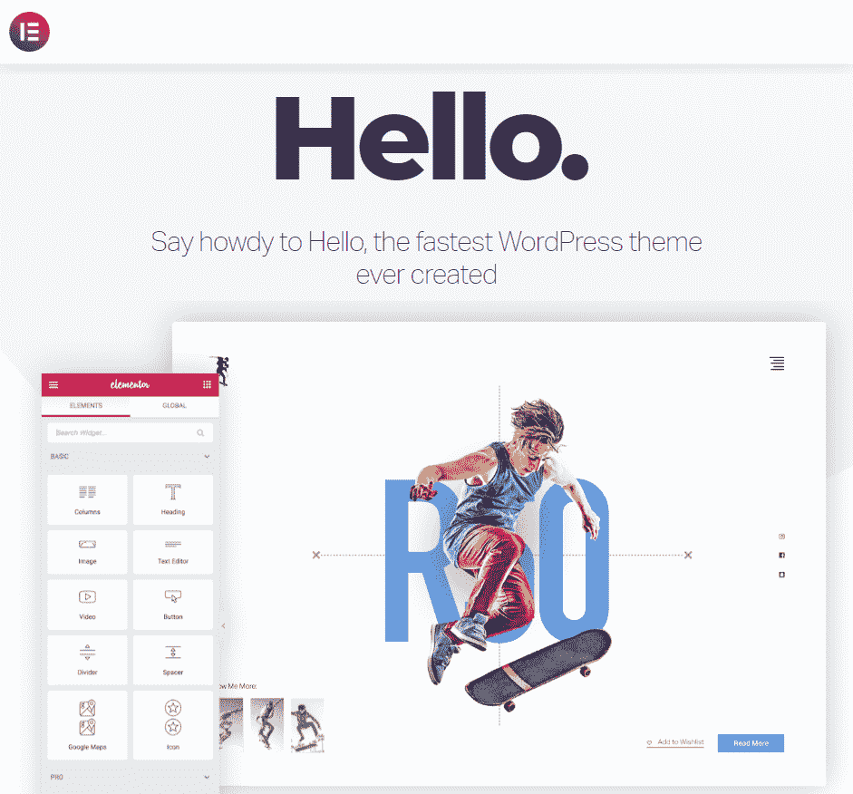

Hello Elementor

标准主题与 Elementor builder 结合得最好，它是制作关注一两个元素的登录页面的重要工具。这是一个转换客户的极好的解决方案，WooCommerce 的集成使它更加特别。

虽然 Hello Elementor 没有太多的电子商务演示，但有一些是为独特的市场提供的，就像下面的卖书演示。

Bookspot demo

#### 定价

你好元素是免费的。要获得 pro widgets、模板和 WooCommerce builder，您必须升级到每年 49 美元的个人计划。当您添加更多站点时，可以使用其他计划。

#### 显著特征

*   一个圆滑的设计，与令人难以置信的 Elementor 页面生成器直接集成。
*   支付 WooCommerce Builder 的选项，它是 Elementor 页面生成器的一部分，包含制作商店的模块。
*   超过 15 种商店小配件。
*   支持动态内容和自定义字段。
*   超过 80 种基本和高级小工具，可用于您的在线商店或网站的标准部分。
*   超过 300 个模板，其中许多都具有在线商店的工具和设计。
*   市场、书店等的价格表和独特的销售模板。

### 最快 WooCommerce 主题分析

Hello Elementor 一直在互联网上看到一些最好的速度评级。甚至我们自己的 WordPress 主题速度评估也显示 Hello Elementor 是性能的首选主题之一。让我们看看它如何与 WooCommerce 保持一致。

#### GTMetrix 速度测试

*   页面速度得分: 94%
*   **YSlow 评分:** 90%
*   **满载时间:**2.9 秒
*   **总页面大小:** 435KB
*   请求: 41

#### Pingdom

*   **性能等级:** 86
*   **加载时间:** 1s
*   **页面大小:** 461.3KB
*   请求: 41

#### PageSpeed Insights 测试(仅限移动设备)

*   **总分:** 75
*   **第一张图片或文字:** 2.6s
*   **速度指数(所有内容的可见人群):** 5.0s
*   **完全互动的时间:**5.1 秒

#### 字节检查 TTFB 测试

*   **到达第一个字节的时间:**595 毫秒
*   **总时间:**1143 毫秒
*   **请求大小:** 200b
*   **总标题尺寸:** 510b

#### 测试结论

对于性能分数，Hello Elementor 最终获得了所有四个分数的最高平均分。Hello Elementor 的伟大之处在于它提供了最好的谷歌移动评分，最终比榜单上的其他主题都强得多。YSlow、Pingdom 和 GTMetrix 的得分也很高。

至于加载时间，Hello Elementor 在平均所有四次测试的结果时获得了第二名。它的 TTFB 非常快，Pingdom 和 GTMetrix 的加载时间证明了 Hello Elementor 是 WooCommerce 主题世界中的速度大师。

### 店面

[店面](https://woocommerce.com/Storefront/)主题是 WooCommerce 开发者自己搭建的默认框架。该品牌提供了几个[子主题](https://kinsta.com/blog/wordpress-child-theme/)来配合框架，这被认为是通过 WordPress 建立在线商店的一个很好的起点。

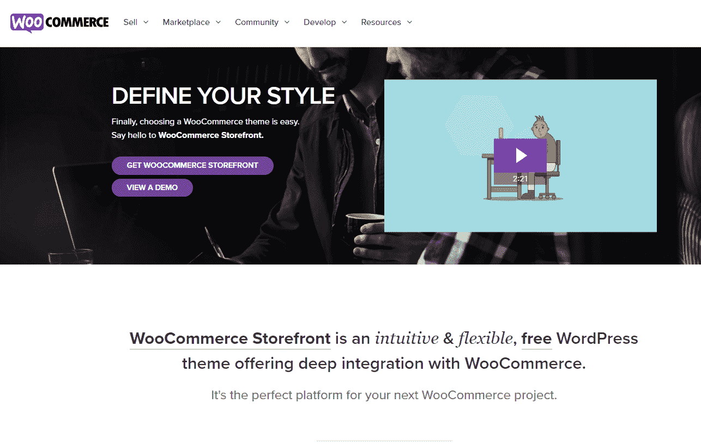

Storefront

正如您可能会想到的，Storefront 主题与 WooCommerce 集成得相当好，它提供了各种显示选项来调整设计和定制从购物车到产品展示区的一切。

以电子商务为重点的主页包括几个选项，用于销售项目和产品评级，使该主题非常适合练习您的开发技能或从头开始建立一个定制商店。

#### 定价

免费。你必须为一些儿童主题付费。它们通常卖 40 美元左右。

#### 显著特征

*   不同行业的儿童主题和演示的不错的集合。一些主题为熟食店、专卖店、家居店和精品店提供设计。
*   与 WooCommerce 和您可以添加到 WooCommerce 的各种扩展顺利集成。
*   一个基于网格的系统，有助于组织您的产品和围绕设计元素移动。
*   用于更改颜色、字体等的可视化定制程序。
*   只迎合网店的主页。您可以找到产品展示区、特价商品和特色产品的功能。
*   产品类别显示和评级。

### 最快 WooCommerce 主题分析

我们一直认为店面主题是启动网上商店最快的框架之一。它既轻巧又干净，没有太多会拖累它的设计元素。

它仍然很快，但没有预期的那么好，至少与列表中的其他相比是这样。

#### GTMetrix 速度测试

*   页面速度得分: 93%
*   **YSlow 评分:** 88%
*   **满载时间:**3.2 秒
*   **总页面大小:** 632KB
*   请求数: 54

#### Pingdom

*   **性能等级:** 83
*   **加载时间:**1.02 秒
*   **页面大小:** 670.2KB
*   请求数: 54

#### PageSpeed Insights 测试(仅限移动设备)

*   **总分:** 23
*   **第一张图片或文字:** 4.2s
*   **速度指数(所有内容的可见人群):** 7.1s
*   **完全互动的时间:**9.1 秒

#### 字节检查 TTFB 测试

*   **到达第一个字节的时间:**710 毫秒
*   **总时间:**967 毫秒
*   **总标题尺寸:** 510b

#### 测试结论

要注意的第一个分数是整体移动分数。店面主题以那个竞技场最差的分数结束。Pingdom 的性能分数也相对较低，尽管 YSlow 和 PageSpeed 的分数看起来不错。

Storefront 在加载时间方面的表现要好得多，在 GTMetrix 上的加载时间排名中位列前五。Pingdom 和 TTFB 加载时间看起来不错，但是移动速度指数引起了关注。

### 生成 Press

在任何关于轻量级、快速主题的对话中，[generate 代表](https://generatepress.com/)主题，并且有充分的理由。GeneratePress 不仅看起来吸引人和现代，而且当安装在空白的 WordPress 网站上时，它提供了令人印象深刻的速度测试。

然而，我们也想看看这个主题在与其他插件，包括 WooCommerce 和无数产品一起使用时，它的加载时间保持得如何。

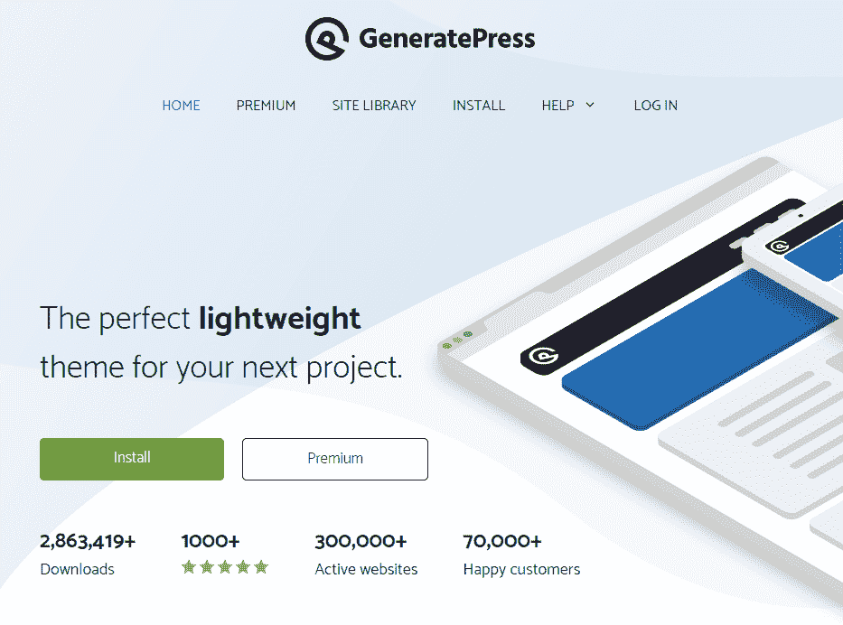

GeneratePress

基本的 GeneratePress 主题作为一个框架，为开发人员提供了页面生成器集成和大量的钩子和过滤器。定制选项似乎无穷无尽，拥有完整的布局控制和插件兼容性。

网站库迎合所有类型的企业，为服装店和类似亚马逊的商店提供博客模板、企业主页和电子商务主题。

Merch demo

#### 定价

GeneratePress 是免费的。高级版本包括无限制的网站支持和对模板库的完全访问，售价为每年 49.95 美元，对于年度高级会员来说，这是一个相当便宜的价格。

#### 显著特征

*   安装在 GeneratePress 框架主题上的多个演示，其中许多包含电子商务设计和购物车按钮。
*   布局控制主题在平板电脑和台式机等设备上的显示方式。
*   页面生成器选项，控制您的设计模块，从产品图片到主页图库，无所不包。
*   钩子和过滤器来扩展开发者可用的定制选项的数量。
*   WooCommerce 商店的附加颜色和版式选项。
*   用于构建画布外菜单项和移动导航的高级菜单。
*   全幅背景，以高分辨率的方式展示您的产品，而不会降低网站的速度。

### 最快 WooCommerce 主题分析

在过去的测试中，我们发现 GeneratePress 是互联网上最快的主题之一。因此，运行相同的测试很有趣，但在后台运行不同的媒体类型和完整的电子商务功能。

#### GTMetrix 速度测试

*   页面速度得分: 94%
*   **YSlow 评分:** 88%
*   **满载时间:**2.7 秒
*   **总页面大小:** 516KB
*   请求: 51

#### Pingdom

*   **性能等级:** 84
*   **加载时间:**1.01 秒
*   **页面大小:** 550.5KB
*   请求: 51

#### PageSpeed Insights 测试(仅限移动设备)

*   **总分:** 62
*   **第一张图片或文字:** 3.3s
*   **速度指数(所有内容的可见人群):** 5.1s
*   **完全互动的时间:**5.2 秒

#### 字节检查 TTFB 测试

*   **到达第一个字节的时间:**631 毫秒
*   **总时间:**911 毫秒
*   **请求大小:** 200b
*   **总标题尺寸:** 536b

#### 测试结论

GeneratePress 在平均所有性能得分时最终进入前 10 名。此外，每一个人的成绩都是值得尊敬的。手机测试是唯一可能引发一些问题的测试。

另一方面，当有 WooCommerce、网站内容和各种其他插件时，GeneratePress 的加载时间超过了大多数其他主题。GTMetrix 加载时间是最快的，Pingdom 是最快的之一，TTFB 和 mobile speed index 都是领跑者。

### 购物车

与列表中的许多多功能主题不同， [ShoppingCart](https://wordpress.org/themes/shoppingcart/) 主题只有一个目的，那就是提供一个功能丰富的在线商店。

它的后台和前台界面都提供了时尚的设计、媒体项目和小部件来发布你的产品。该主题充满了小部件和横幅，允许管理员分享销售信息，并通过主页画廊顶级产品循环。

Shopping Cart theme

ShoppingCart 提供了多种布局，您可以集成您的社交媒体按钮，让客户在脸书和 Twitter 上关注您。有一个演示导入和配置过程，你可以从一些类似的电子商务演示中进行选择。

#### 定价

基本 ShoppingCart 主题是免费的。

个人和商业计划分别为 59 美元和 79 美元。甚至还有售价 99 美元的开发者选项。

#### 显著特征

*   一个主题和插件库来增加你的设计机会和扩展基本的主题功能。
*   放置横幅广告、促销信息和产品链接的几个位置。
*   文章和页面的多种布局。
*   [社交图标](https://kinsta.com/blog/social-media-image-sizes/)放在你的主页或商店上。
*   独特的商店设计(优质产品)，如杂志网站、圣诞商店和超市。
*   内容丰富的标题，带有搜索栏、大型菜单和购物车按钮等项目。

### 最快 WooCommerce 主题分析

ShoppingCart 主题是为电子商务设计的。考虑到像 ShoppingCart 这样的媒体密集型主题经常出现问题，我们很有兴趣看看移动速度测试的结果如何。

#### GTMetrix 速度测试

*   页面速度得分: 93%
*   **YSlow 评分:** 88%
*   **满载时间:**4.8 秒
*   **总页面大小:** 601KB
*   请求数: 54

#### Pingdom

*   **性能等级:** 83
*   **加载时间:**1.03 秒
*   **页面大小:** 638KB
*   请求数: 54

#### PageSpeed Insights 测试(仅限移动设备)

*   **总分:** 56
*   **第一张图片或文字:** 3.2s
*   **速度指数(所有内容的可见人群):** 5.9s
*   **完全互动的时间:**6.8 秒

#### 字节检查 TTFB 测试

*   **第一个字节的时间:**679 毫秒
*   **总时间:**991 毫秒
*   **总标题尺寸:** 510b

#### 测试结论

ShoppingCart 主题显示了可观的 PageSpeed、YSlow 和 Pingdom 分数。拉低其平均值的主要原因是谷歌移动测试。

加载时间测试显示，在平均分数时，ShoppingCart 处于中间位置，Pingdom 和 TTFB 的加载时间仍然很快。同样，与本文中的其他主题相比，这个主题在移动速度指数方面有点困难。

### OceanWP

默认情况下，OceanWP 为各行各业提供了一个快速而强大的多用途模板。此外，OceanWP 还有专为 WooCommerce 打造的免费和优质电子商务演示。

无论你是在标准的 OceanWP 主题中加入自己的设计元素，还是利用在线商店演示，这个主题都有你在线销售所需的工具。

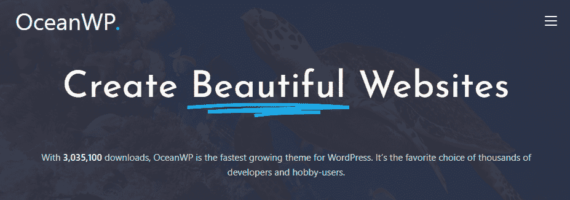

OceanWP

在本文中，三个在线商店演示使用产品展示区、横幅和购物车图标，将您的 OceanWP 主题变成了一个成熟的电子商务商店。

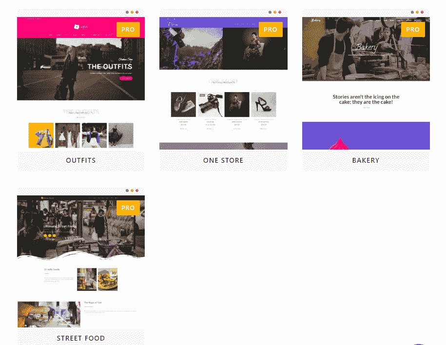

OceanWP demo

#### 定价

核心的 OceanWP 主题是免费使用的。一些电子商务演示也是免费的。

OceanWP 的高级版本和高级演示的价格从一个站点 39 美元起。以 79 美元和 129 美元的价格获得更多功能和站点支持，所有这些都必须每年更新。

个别扩展的价格各不相同，但通常在 30 美元左右浮动。

#### 显著特征

*   几个 WooCommerce 支持的演示，让你的主题看起来完全像一个在线商店，所有这些都不需要你做太多的工作。
*   电子商务必需品，如结账模块和产品类别集合。
*   一个本地购物车弹出窗口，当一个商品被添加到购物车时显示出来。
*   当用户滚动页面时，一个“添加到购物车”按钮会随着页面一起浮动。
*   过滤器保持在一边，以便您可以尽可能多地利用场景，只在需要时显示过滤器。
*   无需进入实际产品页面即可查看产品详情的快速查看选项。
*   弹出登录、Instagram 集成和白色标签等各种扩展。
*   与最流行的拖放构建器集成，如 Visual Composer 和 Elementor。

### 最快 WooCommerce 主题分析

OceanWP 作为一个快速的 WordPress 主题在整个互联网上被提及。我们已经对其进行了测试，并证明了这一点，但现在是时候评估附加了 WooCommerce 的流行主题了。

## 注册订阅时事通讯

### 想知道我们是怎么让流量增长超过 1000%的吗？

加入 20，000 多名获得我们每周时事通讯和内部消息的人的行列吧！

[Subscribe Now](#newsletter)

#### GTMetrix 速度测试

*   页面速度得分: 94%
*   **YSlow 评分:** 89%
*   **满载时间:**5.0 秒
*   **总页面大小:** 649KB
*   **请求:** 59

#### Pingdom

*   **性能等级:** 83
*   **加载时间:**1.09 秒
*   **页面大小:** 686.9KB
*   **请求:** 59

#### PageSpeed Insights 测试(仅限移动设备)

*   **总分:** 58
*   **第一个图像或文本:** 3.1s
*   **速度指数(所有内容的可见人群):**5.7 秒
*   **完全互动的时间:**6.7 秒

#### 字节检查 TTFB 测试

*   **到达第一个字节的时间:**690 毫秒
*   **总时间:**872 毫秒
*   **请求大小:** 200b
*   **总标题尺寸:** 536b

#### 测试结论

当你检查性能分数时，OceanWP 看起来是一个可靠的选择，因为与安装了 WooCommerce 的其他主题相比，YSlow 和 GTMetrix 的分数仍然保持领先。mobile 和 Pingodom 的得分也相当不错。

OceanWP 在加载时间领域遇到了一点麻烦。这绝对不是一个缓慢的主题，但在我们的测试中，OceanWP 的 GTMetrix 加载时间处于倒数第五位。OceanWP 的移动速度测试似乎也不太顺利。TTFB 和 Pingdom 加载时间看起来都不错。

要了解更多信息，你可以在这里看看我们的 [OceanWP 评论。](https://kinsta.com/blog/oceanwp/)

### 购物者

购物优化者 一直被认为是发展最快的网络商务主题之一。由 CommerceGurus 建造，它的唯一重点是 WooCommerce，它的设计考虑了速度和转换。

它实现了 Baymard 在转换主题上的大部分研究，包括信任徽章、不受干扰的结账和一键下单等功能。

在设计自己的页面时，部署了轻量级的 Elementor 页面生成器，允许用户轻松创建漂亮的布局。定制器中还有数百个选项，允许买家快速更改字体、颜色和设置，并立即看到结果。

它附带了一个名为 CommerceKit 的独特插件，由相同的开发人员构建，增加了更多的附加功能。CommerceKit 中的模块包括 Ajax 搜索、倒计时、快速产品图库、订单提升、等待列表和愿望列表。

Shoptimizer

#### 定价

Shoptimizer 的零售价通常为 99 美元，但经常以 49 美元的折扣价出售。这包括 12 个月的更新和支持。将你的执照延期一年将花费 49 美元。

#### 显著的特征

*   专为 WooCommerce 打造的主题，专注于速度和转化率。
*   可以显示产品和常规内容结果的即时搜索建议。
*   产品页面和收银台的倒计时器。
*   内置等待列表，允许您收集脱销产品的客户详细信息。
*   动态库存栏显示鼓励销售几乎售罄的项目。
*   单一产品 AJAX 添加到购物车，加快购买过程。
*   比核心的 WooCommerce 快得多的定制产品图库。
*   信任徽章可以显示在关键的行动号召按钮旁边。
*   不受干扰的结帐页面，加快转换速度。
*   结帐页面的一键式订单冲击可以增加平均订单价值。

### 最快 WooCommerce 主题分析

Shoptimizer 为用户提供了很多功能和在线商店的自由度。让我们看看这个主题在我们的速度测试中表现如何。

#### GTMetrix 速度测试

*   页面速度得分: 93%
*   **YSlow 评分:** 86%
*   **满载时间:** 1.5s
*   **总页面大小:** 482KB
*   请求数: 54

#### Pingdom

*   **性能等级:** 84
*   **加载时间:**873 毫秒
*   **页面大小:** 775.8KB
*   **请求:** 62

#### PageSpeed Insights 测试(仅限移动设备)

*   **总分:60**
*   **第一张图片或文字:** 3.7s
*   **速度指数(所有内容的可见人群):** 7.1s
*   **完全互动的时间:**5.6 秒

#### 字节检查 TTFB 测试

*   **到达第一个字节的时间:**49 毫秒
*   **总时间:**49 毫秒
*   **总标题尺寸:** 498b

#### 测试结论

你将很难找到一个比 Shoptimizer 主题更好的速度和控制的整体主题。它在所有的速度测试中表现良好，在大多数领域都达到或超过标准。这绝对值得一看，并使一个伟大的案件成为你的选择主题。

### shopyy

Shopay 为您的电子商务设计提供了 10 多种小工具。多种布局确保您可以做出独特的设计，而一键演示导入则可以将数据从一个站点传输到另一个站点。

这是一个只适用于电子商务的主题，Gutenberg 和 Page Builder 的集成使得设计一个漂亮的商店变得更加容易。

更重要的是，这个主题有一个颜色和字体的可视化设计器，你可以集成 YITH Wishlist 插件，用一个 Wishlist 管理工具扩展你的 WooCommerce 设计。

ShoPay

#### 定价

Shopay 是免费的。高级版售价为每年 59.99 美元。

#### 显著特征

*   调整主页的各种布局，使其更适合不同的业务类型。
*   全面的 WooCommerce 集成，包括产品展示区和独特购物车的选项。
*   流畅的响应能力，在移动设备上以漂亮的格式呈现您的购物车和产品目录。
*   一个内置的定制程序，显示实时预览，并给你多种设置。
*   电子商务商店演示，以改善您的网站外观或彻底改变它。

### 最快 WooCommerce 主题分析

Shopay 的外观与 Amazon 相似，使用易于转换的主页和强大的标题字段。有了各种各样的小部件和专栏，看到它们如何组合起来提供快速的结果是很有趣的。

#### GTMetrix 速度测试

*   页面速度得分: 94%
*   **YSlow 评分:** 86%
*   **满载时间:** 3.5s
*   **总页面大小:** 761KB
*   **请求:** 62

#### Pingdom

*   **性能等级:** 84
*   **加载时间:**1.19 秒
*   **页面大小:** 804.5KB
*   **请求:** 62

#### PageSpeed Insights 测试(仅限移动设备)

*   **总分:** 49
*   **第一张图片或文字:** 3.7s
*   **速度指数(所有内容的可见人群):** 7.2s
*   **完全互动的时间:**8.5 秒

#### 字节检查 TTFB 测试

*   **到达第一个字节的时间:**592 毫秒
*   **总时间:**933 毫秒
*   **总标题尺寸:** 510b

#### 测试结论

Shopay 主题在平均性能得分中排在倒数 10 名，但它似乎仍然适用于大多数得分。PageSpeed 的结果是一流的，Pingdom 的分数也不差。

当我们查看页面加载时间时，情况类似。GTMetrix 加载时间很长，Pingdom 和 TTFB 时间看起来也不错。移动速度指数是这个主题有点动摇的地方，但不会太多。

### 流行的

Apollo13Themes 团队的多功能 WordPress 主题，提供了各种演示、导入工具和定制选项，所有这些都融合在一起，带来了非凡的设计体验，无论你试图构建的是什么类型的网站。

你可以创建一个[网上商店](https://kinsta.com/blog/ecommerce-platforms/)、[生活博客](https://kinsta.com/blog/how-to-monetize-a-blog/)，或者任何类型的商业网站，而不需要[操作任何代码](https://kinsta.com/knowledgebase/edit-wordpress-code/)，因为这些都是通过可视化和拖放构建器完成的。

演示允许你立即把默认的 Rife 模板变成完全不同的东西。一个例子是 [WooR demo](https://rifetheme.com/woor/) ，这是一个 WooCommerce 解决方案，它在主页上显示特色产品，快速“添加到购物车”按钮，以及漂亮的英雄横幅，用于转化客户。

虽然没有必要实现一个演示来让 WooCommerce 在一个流行的网站上工作，但它无疑使这个过程变得更加容易。

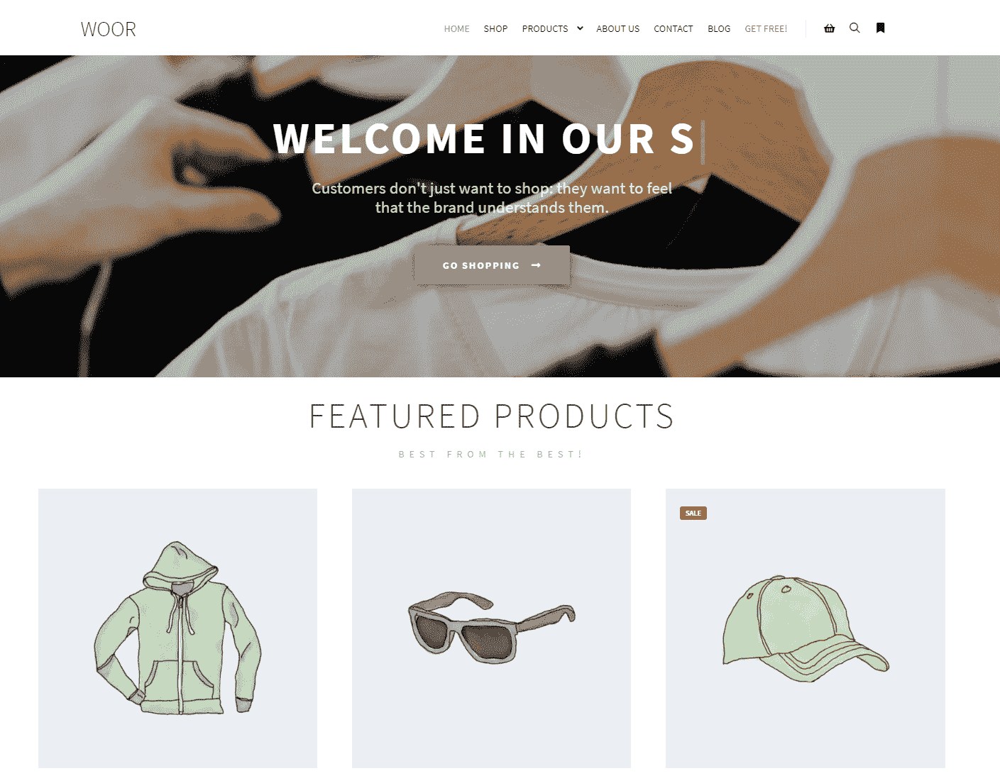

Woor demo

至于你通常在其他地方找不到的一些其他特殊功能，Rife 包括一个支持 [YouTube 视频](https://kinsta.com/blog/embed-youtube-video-wordpress/)和图像的[响应滑块](https://kinsta.com/blog/wordpress-slider/)。它还有一个突出团队成员或产品的帖子网格，文字效果为您的排版添加了一点文字动画，以吸引用户的注意力。

最重要的是，Rife 与 Elementor 和 WPBakery 兼容。主题本身没有拖放界面，但是集成确保了您的开发过程包含可拖动的模块。

#### 定价

Rife 的核心主题可以免费下载。

个人许可证的费用是每年 39 美元，但是除了在线支持之外，不包括任何客户支持。个人许可证和支持费用为每年 69 美元。这两个计划都提供了高级功能和额外的设计。

最后，无限计划是每年 249 美元，让你可以在许多网站上访问 Rife 主题。开发商通常对此计划有折扣。

#### 显著特征

*   与核心主题完全兼容。
*   几个演示，包括一个即时添加电子商务元素，如购物车，愿望清单和产品画廊。
*   一个垂直标题和盾牌和徽章的选项，主要是有一个有趣的标志介绍。
*   一个巨大的菜单，与菜单重叠，提供了一个即时的方式来放置数百个产品类别和单个产品在您的菜单上。
*   高级媒体支持，如照片打样、媒体管理和灯箱设置。
*   对 Elementor 和 WPBakery 的页面生成器支持。
*   超过 40 种设计可以整合到您的网站中，包括页面、帖子和登录页面轮廓。
*   几十种标题变化供您选择，例如居中的徽标、全角标题和可选菜单。
*   专业摄影功能-如滑块和滚动条元素-有效地销售照片。

### 最快 WooCommerce 主题分析

Rife 有一个很棒的设计，一组可靠的演示，如果你愿意付费的话，还有不错的客户支持。这似乎也是一个相当轻量级的主题，所以看看下面的内容，看看它是否能通过我们的性能测试。

#### GTMetrix 速度测试

*   页面速度得分: 93%
*   **YSlow 评分:** 89%
*   **满载时间:** 3.5s
*   **总页面大小:** 819KB
*   **请求:** 58

#### Pingdom

*   **性能等级:** 83
*   **加载时间:**1.12 秒
*   **页面大小:** 860.8KB
*   **请求:** 58

#### PageSpeed Insights 测试(仅限移动设备)

*   **总分:** 49
*   **第一张图片或文字:** 3.3s
*   **速度指数(所有内容的可见人群):** 7.5s
*   **完全互动的时间:**8.1 秒

#### 字节检查 TTFB 测试

*   **到达第一个字节的时间:**614 毫秒
*   **总时间:**914 毫秒
*   **总标题尺寸:** 510b

#### 测试结论

Rife 接近性能测试平均值的中间值和加载时间的下限。但是，如果我们更仔细地观察结果，就会开始清楚这个主题的优势和需要改进的地方。

首先，Rife 的 PageSpeed 得分为 93，与顶级竞争者相当。它的 Pingdom 得分也是 89 分。Pingdom 的 83 分与测试中的其他分数相比是平均的，较低的 Google Pagespeed 分数使其看起来移动速度不是最大的，至少在与这组主题匹配时是这样。

至于加载时间，Pingdom 加载时间相当不错，TTFB 看起来也不错。移动速度指数在慢端，GTMetrix 加载时间大致一般，但还不错。总体而言，Rife 主题表现良好，但在移动设备上有一些轻微的减速。

### 精品店

[精品店](https://dessign.net/boutique-woocommerce-theme/)是一个时尚现代的[电子商务主题](https://kinsta.com/blog/woocommerce-themes/)，它提供了大量的空白和强大的标题，用于添加社交媒体渠道、大型菜单和商店公告。

该主题不是一个多用途的解决方案，而是一个电子商务专用的选项，它与优雅和面向转换的元素一起为那些经营服装网店的人提供一个平滑的外观和时尚的格式。

是的，精品主题有能力转化为其他类型的行业，如珠宝，技术，生活方式品牌。

Boutique

主页上有简单产品目录的选项，这些产品目录使用动画和中性色来突出您的产品。页脚也提供了一个极简的设计，有小部件区域来插入你的隐私声明，运输信息，或[电子邮件订阅表格](https://kinsta.com/blog/wordpress-forms/)。甚至产品页面本身也清理了所有的杂物，只显示基本的东西，比如描述和照片。

#### 定价

标准主题是免费的。高级版售价 49 美元。这是一次性费用，包括支持和更新。

作为另一种选择，你可以为开发者提供的所有主题支付 99 美元。

#### 显著特征

*   XML 演示内容，让您的设计朝着正确的方向开始。
*   一个简单的主页滑块，包括按钮、文本和图片。
*   一个居中的标志点和一个优雅的标题，链接你的社交媒体账户。
*   易于使用和理解的下拉菜单。
*   几个主页部件，以公告，促销和产品为特色。
*   带有轻量级、不分散注意力的动画的产品图库。
*   可自定义的页脚模块。
*   产品页面保持简单，但仍然包括客户评论。

### 最快 WooCommerce 主题分析

精品店的功能集尽可能小，设计看起来是轻量级和简洁的格式。毫无疑问，它作为一个快速 WooCommerce 主题出现在这个列表中，但它与其他主题相比如何呢？

#### GTMetrix 速度测试

*   页面速度得分: 91%
*   **YSlow 评分:** 79%
*   **满载时间:**2.8 秒
*   **总页面大小:** 586KB
*   **请求:** 59

#### Pingdom

*   **性能等级:** 81
*   **加载时间:**1.98 秒
*   **页面大小:** 624KB
*   **请求:** 59

#### PageSpeed Insights 测试(仅限移动设备)

*   **总分:** 47
*   **第一张图片或文字:** 4.4s
*   **速度指数(所有内容的可见人群):** 7.1s
*   **完全互动的时间:**6.4 秒

#### 字节检查 TTFB 测试

*   **到达第一个字节的时间:**587 毫秒
*   总时间:828 毫秒
*   **总标题尺寸:** 510b

#### 测试结论

精品最终在性能分数方面处于低端。话虽如此，PageSpedd 评分还是在 90 以上。然而，精品受到 YSlow、Pingdom 和谷歌移动性能分数的影响，将其推向了后面。

你的新 WooCommerce 网站需要顶级、快速、安全的主机服务吗？Kinsta 提供超快的服务器和来自 WooCommerce 专家的 24/7 世界级支持。[查看我们的计划](https://kinsta.com/plans/?in-article-cta)

当进行加载时间测试时，精品主题有更好的结果。最终，Boutique 成为了排名中间的产品，展示了最快的 GTMetrix 加载速度和可观的 TTFB。较高的结果来自 Pingdom 和移动速度加载时间。

### Zakra 在线商店

Zakra 是一个多用途的 WordPress 主题，拥有成千上万的用户，它为构建多种类型的网站提供了一个设计良好的基础设施，具有简单的定制工具和与其他演示一起工作的轻量级框架。

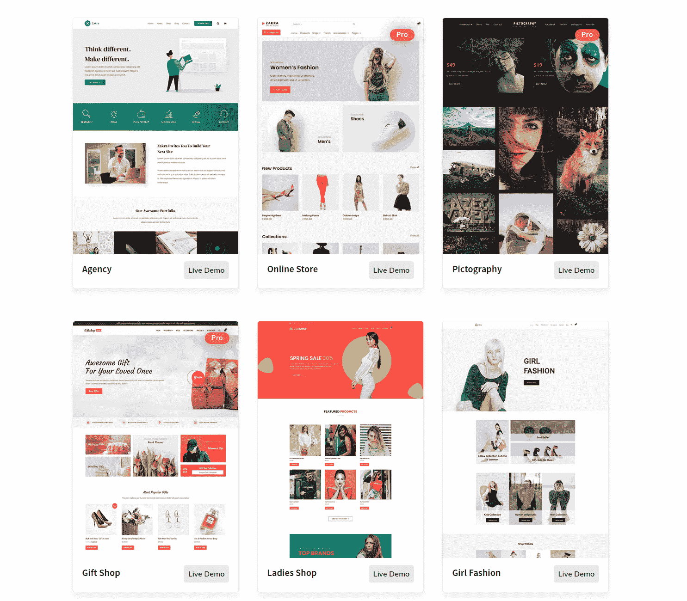

Zakra demos

WooCommerce 集成的特点是响应性在线商店页面和深度设计选项，如购物车模块和标题定制。页面生成器功能包括与流行生成器的集成，而 [AMP-ready](https://kinsta.com/blog/disable-google-amp/) 配置承诺在移动设备上有更快的速度。

用户可以将标准的 Zakra 主题转换成一个在线商店，但是当你安装一个为电子商务制作的入门模板时，真正的力量就来了。在 Zakra 库中找到几十个模板，包括六个电子商务图库、作品集和[购物车工具](https://kinsta.com/blog/shopping-cart-abandonment/)。

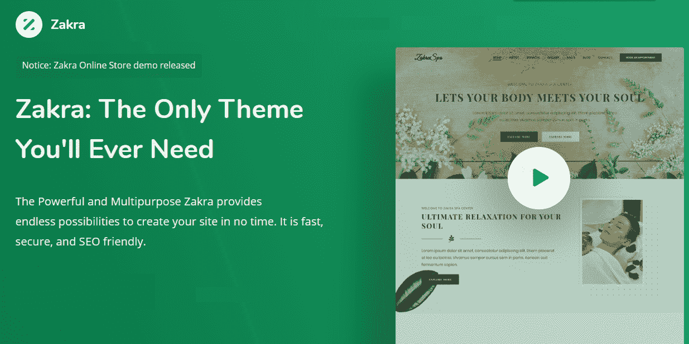

Zakra

#### 定价

Zakra 有一个免费的核心版本和一个每年 49 美元的专业选项。涵盖了一个地点。

增加更多的站点会增加价格。

#### 显著特征

*   几个预建主页和博客的入门演示，包括电子商务网站的选项。
*   拖放集成，允许连接到 Gutenberg 和 Elementor，仅举几例。
*   动态、可定制的页眉和页脚，以及用于小部件和菜单的高级定制选项。
*   来自可视化构建器的 WooCommerce 元素样式。
*   已经为主题优化的产品目录和小部件。
*   WooCommerce 专用的[侧栏](https://kinsta.com/blog/wordpress-dynamic-sidebars-widgets/)和布局。
*   可插入任何产品页面的相关产品模块。
*   菜单样式和工具，以扩大规模，实现类似于一个巨大的菜单。

### 最快 WooCommerce 主题分析

Zakra 拥有常规博客、商业网站和电子商务的各种功能。演示是轻量级的，适合销售不同的项目。至于速度，看看下面…

#### GTMetrix 速度测试

*   页面速度得分: 94%
*   **YSlow 评分:** 90%
*   **满载时间:**7.9 秒
*   **总页面大小:** 536KB
*   **请求:** 49

#### Pingdom

*   **性能等级:** 85
*   **加载时间:**1.26 秒
*   **页面大小:** 567.2KB
*   **请求:** 48

#### PageSpeed Insights 测试(仅限移动设备)

*   **总分:** 59
*   **第一张图片或文字:** 2.8s
*   **速度指数(所有内容的可见人群):** 8s
*   **完全互动的时间:**4.9 秒

#### 字节检查 TTFB 测试

*   **到达第一个字节的时间:**2726 毫秒
*   **总时间:**3013 毫秒
*   **请求大小:** 200b
*   **总标题尺寸:** 510b

#### 测试结论

当平均所有四个性能分数时，Zakra 最终在所有测试的主题中排名前五。特别是移动测试，很快产生了结果，表明 Zakra 在较小的设备上表现出色。

出于某种原因，加载时间测试出了问题。要么 Zakra 的加载时间明显比其他竞争对手差，要么可能是主题中有什么东西与我安装的其他插件冲突。不管怎样，Zakra 在线商店产生了最差的 GTMetrix 和 TTFB 加载时间。Pingdom 加载时间还不错，但是移动速度指数测试的分数也很低。

### 从不

Neve 是另一个广泛使用的 WordPress 主题，吸引了开发者的大量关注。该主题与流行的页面生成器相结合，并呈现一个轻量级和通用的设计过程，以轻松配置美丽的设计。

ThemeIsle 开发人员在干净的代码和质量支持方面享有很高的声誉。

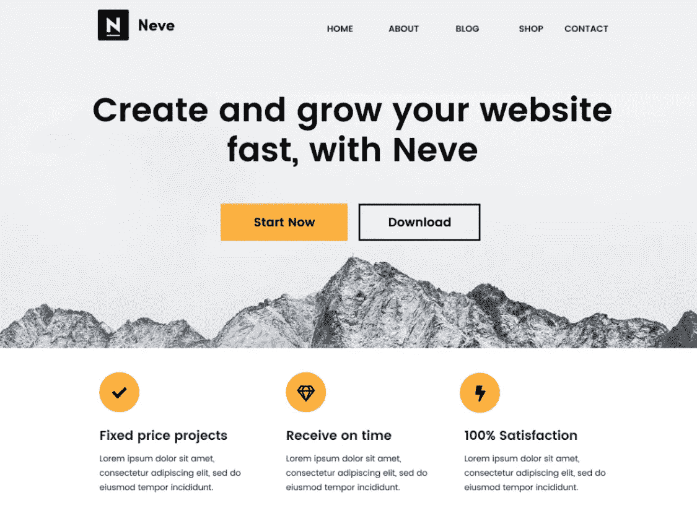

Neve

就其本身而言，Neve 与 WooCommerce 集成在一起，允许您在站点上放置商店和购物车。

然而，它还提供了几个免费和优质的演示和儿童主题，在几分钟内推出一个令人惊叹的商店展示。

My Shop demo

#### 定价

Neve 没有免费下载选项。

[高级版](https://themeisle.com/themes/neve/)起价为每年 59 美元，包括定制布局——如 WooCommerce 演示——高级支持和几个助推器。

ThemeIsle 网站上还出售其他几款带有附加功能和附件的计划。

#### 显著特征

*   一个完整的电子商务店面演示。
*   子主题和其他演示内容来填充您用 Neve 构建的在线商店。
*   支持成功的拖放构建器，如 Beaver Builder 和 Elementor。
*   Elementor Booster 引入了七个新的设计模块，其中一些是为在线商店准备的。
*   页眉和页脚的自定义布局。
*   一个高级的标题设计器，具有改进的样式、社交按钮等等。
*   WooCommerce Booster pack 用于设计产品展示区，并围绕这些系列的大小和位置等元素进行更改。

### 最快 WooCommerce 主题分析

Neve 在一些领域处于领先地位，并为其他主题开发者提供了一个基准来努力开发快速、轻量级的主题。WooCommerce 演示肯定会让它慢一点，但这是高质量的托管和优化解决不了的问题。

#### GTMetrix 速度测试

*   页面速度得分: 94%
*   **YSlow 评分:** 90%
*   **满载时间:** 3.3s
*   **总页面大小:** 460KB
*   **请求:** 44

#### Pingdom

*   **性能等级:** 86
*   **加载时间:**1.08 秒
*   **页面大小:** 487.7KB
*   **请求:** 44

#### PageSpeed Insights 测试(仅限移动设备)

*   **总分:** 66
*   **第一张图片或文字:** 2.7s
*   **速度指数(所有内容的可见人群):** 5.1s
*   **完全互动的时间:**4.9 秒

#### 字节检查 TTFB 测试

*   **到达第一个字节的时间:**606 毫秒
*   **总时间:**894 毫秒
*   **请求大小:** 200b
*   **总标题尺寸:** 510b

#### 测试结论

Neve 的 WooCommerce 测试证实了我们在测试常规 WordPress 主题时发现的数据。从来没有高质量的页面加载时间，尤其是移动速度。

Neve 在所有性能评分类别中也表现强劲，看看 PageSpeed、YSlow 和 Pingdom 测试都得到了高分。

### 美德

WooCommerce 主题拥有好评如潮的评论，时尚的主页设计，以及装载了精彩功能的多功能定制程序。这个主题实际上来自 Kadence 主题开发者，所以很明显这些人知道如何制作一个快速模板。

Virtue 和标准 Kadence 主题的主要区别在于，Virtue 直接面向电子商务店主。它包含了令人印象深刻的购物车和产品展示区的功能组合，并且主题足够简单，因此一些类型的企业可以在他们的网站上使用它。

例如，我们可以看到它被用于户外运动，男装，或手表店。它确实有一点男性化的外观，但你也可以改变颜色，以适应你自己的品牌。

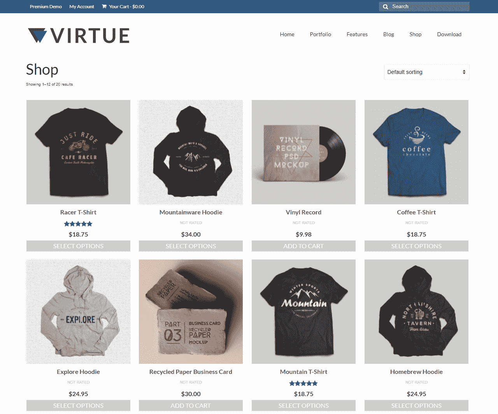

Virtue

凭借完美的响应元素和对 Kadence builder 块的访问，您不会在虚拟设计环境中出错。其他一些亮点包括盒装布局和可定制的页眉布局，非常适合移动您的徽标或为您的产品添加多个菜单。

#### 定价

美德有免费版。

它还提供每年 75 美元的[高级选项](https://www.kadencewp.com/product/virtue-premium-theme/)。这包括一年的支持和更新。

#### 显著特征

*   添加无限滚动、短码和高级图标的独特设置。
*   直接链接到[谷歌分析](https://kinsta.com/blog/how-to-use-google-analytics/)。
*   一个[粘性标题](https://kinsta.com/blog/sticky-header/)选项。
*   几个高级小工具，其中许多与 WooCommerce 配合得非常好。
*   一个巨大的菜单来添加尽可能多的产品类别链接。
*   为你的网站带来社会证明的推荐帖子。
*   一键式演示导入程序，只需点击一个按钮，即可将您的网站转变为在线商店。
*   一个高级滑块，可以使你的文本动画化，并包括其他高级项目的功能，如视差滚动和背景视频。
*   一个强大的选项面板，提供了站点布局样式和标题选项，让您的站点更上一层楼。
*   为您的博客提供多个列表和网格样式[。](https://kinsta.com/learn/blogging-tips/)
*   有用的 WooCommerce 特性，如自定义标签、布局样式和按钮样本。
*   一个完全可定制的标题布局，具有修改徽标和菜单的工具。
*   如果您不想使用宽屏配置，可以使用盒装布局。

### 最快 WooCommerce 主题分析

美德拥有可负担性和设计实力。它的速度测试有一些优点和缺点，我们将在下面讨论。

#### GTMetrix 速度测试

*   页面速度得分: 76%
*   **YSlow 评分:** 90%
*   **满载时间:**3.2 秒
*   **总页面大小:** 1210KB
*   **请求:** 50

#### Pingdom

*   **性能等级:** 86
*   **加载时间:**1.20 秒
*   **页面大小:** 1300KB
*   **请求:** 50

#### PageSpeed Insights 测试(仅限移动设备)

*   **总分:** 56
*   **第一张图片或文字:** 2.3s
*   **速度指数(所有内容的可见人群):**6.8 秒
*   **完全互动的时间:**7.5 秒

#### 字节检查 TTFB 测试

*   **到第一个字节的时间:**849 毫秒
*   **总时间:**1102 毫秒
*   **总标题尺寸:** 510b

#### 测试结论

从性能得分开始，Virtue 在 GTMetrix 中的 PageSpeed 结果最差。然而，YSlow 和 Pingdom 测试结果良好。总的来说，相当低的 PageSpeed 分数，加上不太出色的谷歌移动结果，拉低了美德的平均性能结果，使其接近小组的底部。

美德弥补了页面加载时间中不一致的性能分数。它排在前十名，GTMetrix 和 Pingdom 的时间也相当快。TTFB 和移动速度结果在我们的测试组中并不领先。

### 网上商店

[网店](https://wordpress.org/themes/online-shop/)主题没有最原始的名字，但是很直奔主题，有点像主题的设计和界面。主页上绝对不缺少功能或可定制的模块，但很明显这个主题是为网上商店设计的。

你可以移动窗口小部件，并快速添加一个标题，叠加到你知道并喜欢使用的流行在线市场。以页眉为例。你不一定要使用这些设置，但是主题至少给了你添加联系人信息、愿望列表按钮和社交媒体按钮的选项。

您甚至可以添加商店营业时间和位置链接，以便人们找到任何实体店的方向。

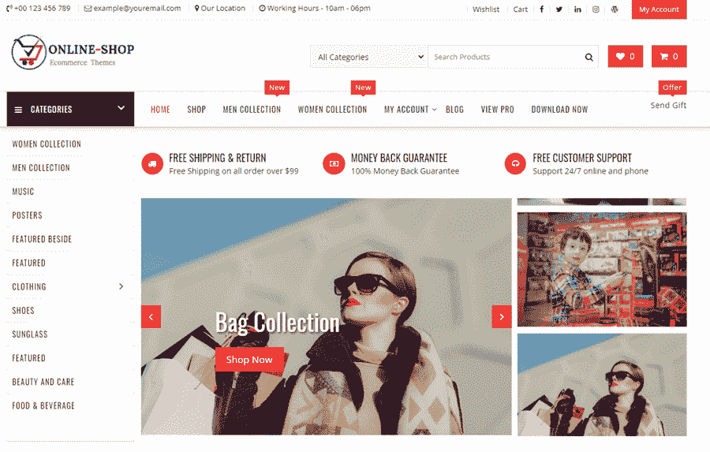

Online-Shop

网上商店包括多个菜单，这些菜单要么相互补充，要么添加到主菜单上。你可以用各种各样的主页插件和定制工具创建任何类型的在线商店。

例如，我们已经看到了主题用于服装店和科技商店的例子。主题附带一个滑块，对于一些人来说，这就是你所需要的。然而，你也可以选择结合更强大的滑块插件，如滑块革命。

#### 定价

网店主题有免费下载版本。pro 版提供两种价格，个人许可 55 美元，开发者许可 99 美元。

#### 显著特征

*   一键式演示导入，从您在演示中看到的设计开始。
*   超过九个部件添加到侧栏和网站的其他部分，其中许多是电子商务的意思。
*   页面生成器集成插件，如页面生成器和网站起源。
*   无限的滑块，可以在网站的任何页面。
*   一个时尚的特色产品区，旨在吸引客户并促使他们购买产品。
*   用于添加您的地址和联系信息的标题定制区域。社交媒体栏也在那里，让你链接到你的品牌最受欢迎的社交账户。
*   链接到其他页面的标题图像和视频点，可以在用户登录您的网站时播放。
*   广告区，如果你也想展示广告。

### 最快 WooCommerce 主题分析

网上商店主题在设计能力方面很成功，但是它能与最快的 WooCommerce 主题相抗衡吗？看看下面的速度结果。

#### GTMetrix 速度测试

*   页面速度得分: 94%
*   **YSlow 评分:** 86%
*   **满载时间:** 3.3s
*   **总页面大小:** 655KB
*   **请求:** 55

#### Pingdom

*   **性能等级:** 82
*   **加载时间:**1.07 秒
*   **页面大小:** 692.9KB
*   **请求:** 55

#### PageSpeed Insights 测试(仅限移动设备)

*   **总分:** 52
*   **第一张图片或文字:** 3.7s
*   **速度指数(所有内容的可见人群):** 7.4s
*   **完全互动的时间:**6.3 秒

#### 字节检查 TTFB 测试

*   **到第一个字节的时间:**636 毫秒
*   **总时间:**885 毫秒
*   **总标题尺寸:** 510b

#### 测试结论

在线商店是性能分数测试中最完美的平均主题之一。突出的结果包括相当高的 PageSpeed 分数和相当高的 Pingdom 等级。YSlow 比其他分数低一点，谷歌移动分数是在线商店主题表现最差的部分。

尽管仍处于该领域的中间，但在线商店在加载时间测试中为大狗提供了一些令人印象深刻的竞争。在线商店的 GTMetrix 加载时间徘徊在三秒左右，使其成为最大的竞争者。TTFB 和 Pingdom 加载时间都很快。

然而，从谷歌的移动速度指数来看，网上商店是加载最慢的网站之一。

### 商店

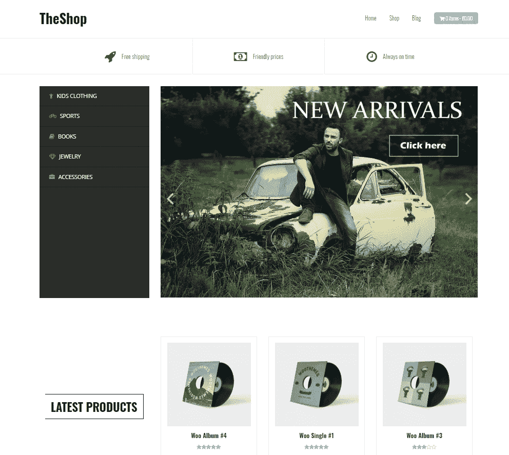

The Shop theme

作为一个完整的电子商务解决方案，商店与 WooCommerce 兼容。这个主题简单而轻便，利用一个基本的滑块和文本框来显示促销和产品信息。

您可以在网站上插入多个菜单，并在主页的几个区域中包含一系列产品。如果你链接到补充的扩展，还有很多选项可以显示博客文章和产品评论。

商店主题是从 aThemes 免费下载的。没有高级版本，但有一些扩展来扩展你的设计。

除了主页的各种选项外，商店主题还有各种品牌颜色选项和调整字体的工具。这种简单的设置只需要几分钟，并且 aThemes 支持团队以及时提供帮助而闻名。

更不用说，aThemes 提供了大量的教程视频来指导你的设计过程。最后，该主题提供了几个页面模板，可以在您的主页上使用，并快速生成适合您业务的布局。总的来说，商店的主题坚持简约，设计时尚，并能快速交付给用户。

#### 定价

这家商店完全免费。它有一个扩展，页脚信用插件，价格为 5 美元。

#### 显著特征

*   全力支持 WooCommerce。
*   自定义主页，可选择添加横幅、产品图库等。
*   两个菜单相互补充，作为两个独立的实体运行。你可以在标题的顶部放置一个，在标题的下方放置一个，比如一个用于主页，另一个用于产品类别。
*   滑块创建一个简单和圆滑的标题图像，支持多张照片在滑块和文本和按钮呼吁行动。
*   一个简单的配置过程来安装主题并获得合适的演示元素。
*   页面模板来设置你的主页，如主题演示和扩展全幅和其他格式的页面。
*   颜色选项，以立即改变您的整个配色方案或修改个别颜色。您可以选择要更改的特定颜色，如标题或描述。
*   [谷歌字体](https://kinsta.com/blog/best-google-fonts/)支持，可访问超过 600 种字体，使您的字体设计符合您的品牌。
*   几个博客选项来格式化博客文章并在你的主页上显示文章列表。
*   [翻译就绪的](https://kinsta.com/blog/wordpress-multilingual/)工具，根据客户的语言调整您的语言。
*   通过 WordPress Live Customizer 定制选项，提供预览修改和快速设置。
*   文本横幅和图标。
*   支持产品评论。
*   页脚学分的扩展，允许您自定义一小部分页脚。

### 最快 WooCommerce 主题分析

当谈到极简主义时，商店主题就抓住了这一点。主题看起来变化很快，有很多空白，并且没有前端或后端功能的混乱。这可能是这个主题如此快速的部分原因。让我们看看它与其他主题相比如何。

#### GTMetrix 速度测试

*   页面速度得分: 83%
*   **YSlow 评分:** 87%
*   **满载时间:** 3.5s
*   **总页面大小:** 1640KB
*   **请求:** 55

#### Pingdom

*   **性能等级:** 82
*   **加载时间:**1.60 秒
*   **页面大小:** 1700KB
*   **请求:** 55

#### PageSpeed Insights 测试(仅限移动设备)

*   **总分:** 46
*   **第一张图片或文字:** 3.4s
*   **速度指数(所有内容的可见人群):** 7.5s
*   **完全互动的时间:**8.9 秒

#### 字节检查 TTFB 测试

*   **到达第一个字节的时间:**644 毫秒
*   **总时间:**913 毫秒
*   **总标题尺寸:** 510b

#### 测试结论

当平均出所有的性能分数时，商店主题接近最后的点结束。这可能是因为 PageSpeed 分数是这次测试中少数几个低于 90 分的分数之一。它仍处于 80 年代，但在这方面没有其他产品好。YSlow 测试没问题，Pingdom 测试结果也没问题。然而，谷歌手机测试也处于低端。

总的来说，商店在装载时间测试中取得了更好的结果。话虽如此，最终还是排在了后五名。GTMetrix 加载时间相当不错。Pingdom 的加载时间比这个列表中的许多其他文件都要慢。移动速度指数也相当缓慢。TTFB 的结果相当不错。

### 流行

Vogue 的设计散发出一种平静和简单的感觉。该主题以其优雅的字体和中性的颜色为珠宝、[时尚](https://kinsta.com/blog/how-to-start-a-fashion-blog/)和生活品牌提供了一种配置。

它甚至有一些独特的工具，比如滚动的社交媒体标签，可以链接到你所有的社交页面。标题看起来简单明了，但充满了包括你的社交按钮和联系信息的区域。

提供了一个幻灯片，用于展示您的产品图片。你也可以在幻灯片上放置按钮和链接，引导人们到你网站的其他地方。

Vogue

Vogue 只迎合在线店主，因为它是为与 WooCommerce 合作而建立的，并有交互式购物车图标和产品展示区。有四种标题布局可供选择，并有一个完全响应的设计供用户在较小的设备上查看网站。

Vogue 主题作为一个多功能主题进行营销，但它主要表现为在线商店。颜色设置非常适合你的品牌，整体简洁的设计一定会让你的眼睛看起来更有神。这是一个稳定而快速的解决方案，具有开发人员正在寻找的轻量级设计。你甚至可以访问[开发者挂钩](https://kinsta.com/blog/wordpress-hooks/)和选项来整合额外的功能。

#### 定价

Vogue 有免费版本供你下载。[高级版](https://kairaweb.com/wordpress-theme/vogue/)售价 25 美元。

#### 显著特征

*   带有内置 SEO 工具的自定义 WooCommerce 设计。
*   像开发者挂钩和自定义 [CSS](https://kinsta.com/blog/wordpress-css/) 框这样的可扩展元素。
*   支持最先进的页面生成器。
*   多种页脚布局添加重要信息。
*   几个博客布局。
*   多个标题布局，区域包括社交媒体按钮和联系信息。
*   全彩设置，以改变一种或所有的颜色。
*   一个时髦的菜单，可以选择打开粘性导航。
*   WooCommerce 的下拉列表，以及移除 WooCommerce 购物车等项目的设置。
*   发布公告或显示商店信息的顶部栏。
*   一个[短码](https://kinsta.com/blog/wordpress-shortcodes/)来添加滑块到你网站上的任何页面。
*   用于合并文本和按钮的滑块定制工具。
*   独特的 WooCommerce 功能，用于设置每行或每页的产品数量。
*   选项来设置你的 WooCommerce 页面为全幅或把它们放在侧边栏。
*   图像缩放、灯箱和产品边框。

### 最快 WooCommerce 主题分析

《Vogue》主题的简单性使其脱颖而出。再加上内置的 WooCommerce 工具，很明显，许多网店店主可以从 Vogue 这样的主题中受益。作为一个极简主义的主题,《Vogue》提供了快速的表演时间，但与其他主题进行比较是很重要的。

#### GTMetrix 速度测试

*   页面速度得分: 93%
*   **YSlow 评分:** 84%
*   **满载时间:**3.7 秒
*   **总页面大小:** 894KB
*   **请求:** 60

#### Pingdom

*   **性能等级:** 81
*   **加载时间:**1.01 秒
*   **页面大小:** 942.2KB
*   **请求:** 60

#### PageSpeed Insights 测试(仅限移动设备)

*   **总分:** 51
*   **第一张图片或文字:** 3.7s
*   **速度指数(所有内容的可见人群):** 7.2s
*   **完全互动的时间:**6.6 秒

#### 字节检查 TTFB 测试

*   **到达第一个字节的时间:**647 毫秒
*   **总时间:**899 毫秒
*   **总标题尺寸:** 510b

#### 测试结论

在我们的性能测试中，我们将 Vogue 归类为中等偏下水平的竞争者之一。分数是全面稳定的，PageSpeed、YSlow 和 Pingdom 分数都很好。但《Vogue》的主题与谷歌移动测试的分数有些矛盾，所以这让它在排名中进一步下滑。

加载时间测试非常相似，GTMetrix 和 TTFB 的加载时间表现强劲，但比其他产品稍弱。它真的超越了 Pingdom 的分数。然而，Vogue 在移动速度指数较慢的情况下，其平均值有所下降。

### 伍斯蒂菲

Woostify 体现了 WooCommerce 的本质，它提供了高功能的主页，几个演示设计，一个带有公告区和各种交互按钮的标题。

例如，您可以在标题中实现用户、愿望列表和购物车图标，同时还可以添加一个搜索栏，方便人们查找产品。滑块图像很大，加粗，并带有用于标题文本和按钮的工具。

Woostify 是一个轻量级和用户友好的主题，以速度为中心。这个主题还提供了与流行的页面构建器的集成，比如 SiteOrigin 和 Visual Composer 等等。除了 WooCommerce，它的一些主要插件包括 [bbPress](https://kinsta.com/knowledgebase/bbpress/) 和 [Yoast](https://kinsta.com/blog/yoast-seo/) 。

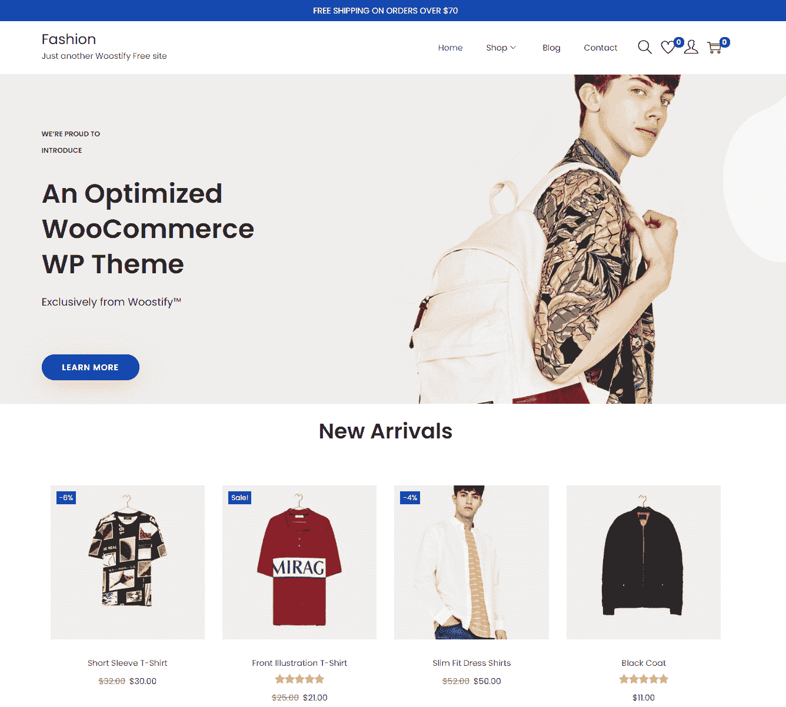

Woostify

Woostify 主题在速度测试中表现出色有几个原因。

首先，开发人员不使用任何 jQuery，但他们坚持使用 JavaScript。因此，没有理由先加载庞大的库，因为主题不是用大型 CSS 框架构建的。

你也可以期待主题跟上 WordPress 编码标准和 [PHP 支持](https://kinsta.com/blog/php-versions/)。从现场定制设置到悬停风格和购物车布局，与市场上的许多其他 WooCommerce 主题相比，Woostify 是一颗宝石。这是一个免费的主题，有许多高级功能，如果需要，你仍然可以选择升级。

#### 定价

Woostify 有一个免费版本。

在一个网站上，[高级主题包](https://woostify.com/pricing/)售价为 39 美元。这包括一年的支持和更新。他们也有无限期和终身计划，花费更多。

高级版提供了相当多的附加软件，除了标准的高级费用之外，没有必要支付额外的费用。一些附加组件包括标题生成器、大菜单和快速查看。

#### 显著特征

*   与 Beaver Builder 和 Elementor 等顶级页面生成器集成。
*   支持 bbPress、 [BuddyPress](https://kinsta.com/blog/wordpress-forum-plugins/#buddypress) 等热门插件。
*   产品页面和列表样式来调整这些区域对客户的外观。
*   在一定程度上可定制的多步骤结账。
*   悬停样式和购物车布局，以进一步调整您的网站的外观。
*   WordPress Live 定制器中的功能和简单设置。
*   支持两个流行的产品愿望清单插件。您还会看到一个产品意愿列表图标。
*   添加到所有产品页面的视频库。
*   增强产品属性的产品样本。
*   把你的网站变成多供应商市场的选择。你必须集成一个插件，但功能是存在的。
*   几个免费的预建演示，为您的在线商店找到完美的设计。多种标题样式，挂钩和过滤器，以自定义每个方面。
*   各种高级附加组件，如粘性购物车按钮、销售通知和尺寸指南。

### 最快 WooCommerce 主题分析

我们知道 Woostify 拥有令人难以置信的 WooCommerce 工具。我们知道它足够轻便和简单，可以作为高性能主题给人留下深刻印象。唯一的问题是它如何经得起我们的测试，以及它与其他主题相比处于什么位置。

#### GTMetrix 速度测试

*   页面速度得分: 94%
*   **YSlow 评分:** 87%
*   **满载时间:** 3.3s
*   **总页面大小:** 645KB
*   **请求:** 59

#### Pingdom

*   **性能等级:** 82
*   **加载时间:**4.91 秒
*   **页面大小:** 684KB
*   **请求:** 59

#### PageSpeed Insights 测试(仅限移动设备)

*   **总分:** 58
*   **第一张图片或文字:** 2.8s
*   **速度指数(所有内容的可见人群):** 6.2s
*   **完全互动的时间:**6.8 秒

#### 字节检查 TTFB 测试

*   **到第一个字节的时间:**629 毫秒
*   **总时间:**917 毫秒
*   **总标题尺寸:** 510b

#### 测试结论

Woostify 取得了最好的成绩，平均成绩使其向中场靠拢。PageSpeed 的分数令人印象深刻。YSlow 的分数还不错，Pingdom 的分数看起来也不错。虽然它不是最差的，但我们认为在查看了谷歌移动速度测试后，Woostify 可以对移动性能进行一点改进。

Woostify 在加载时间测试中跌至底部。这几乎完全是因为 Pingdom 加载时间比平均时间短。它的 TTFB 非常棒，还有它的 GTMetrix 加载时间。甚至移动速度指数也不差。出于某种原因，它在通过 Pingdom tester 发送时出现了问题。

[And the winner is.... 🏆 See which WooCommerce theme passed rigorous testing to come out as the fastest option out there 💥Click to Tweet](https://twitter.com/intent/tweet?url=https%3A%2F%2Fkinsta.com%2Fblog%2Ffastest-woocommerce-theme%2F&via=kinsta&text=And+the+winner+is....+%F0%9F%8F%86++See+which+WooCommerce+theme+passed+rigorous+testing+to+come+out+as+the+fastest+option+out+there+%F0%9F%92%A5&hashtags=Ecommerce%2COnlineStore)

## 最快的 WooCommerce 主题选项排名

有了这些数字，它有助于以更直观的格式呈现结果。下图是来自 GTMetrix、Pingdom 和 PageSpeed Insights 的主要性能得分。我们通过平均所有四个分数并按顺序列出这些主题平均值来组织图表。

通过这种方式，您可以看到哪一个整体性能得分最高和最低。

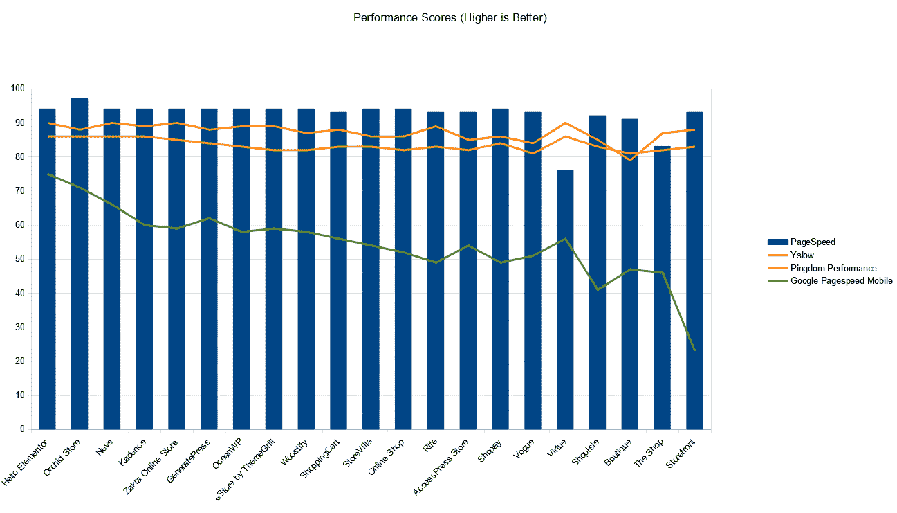

Performance Score Chart

#### 外卖食品

*   兰花商店是唯一一个来自 GTMetrix 的 PageSpeed 评分高于 94%的 WooCommerce 主题。
*   这个列表中的大多数主题都有相似的 PageSpeed 分数，通常在 92-95 左右。
*   仅有的两个低于 90 页面速度分数的主题包括商店和美德。
*   YSlow 的顶级玩家包括 Virtue、Hello Elementor、Neve 和 Zakra。
*   精品店的 YSlow 评分最差。
*   最好的 Pingdom 评分来自于兰花店、Hello Elementor、Neve、Kadence 和 Virtue。
*   《精品店》和《时尚》的平民化得分最低。
*   Hello Elementor 和兰花商店获得了最佳 Google PageSpeed 移动测试。
*   Storefront 获得了 Google PageSpeed 移动测试的最后一名——遥遥领先。

#### 最高平均分

*   hello 元素或
*   兰花商店
*   从不

#### 最低平均分

*   店面
*   商店
*   精品店

下面的图表做了同样的事情，从类别中平均出所有四个结果，除了这次是加载时间。通过这种方式，我们可以了解哪些主题在特定的加载时间测试中表现良好，同时还可以将所有主题汇总起来进行最终评估和排名。

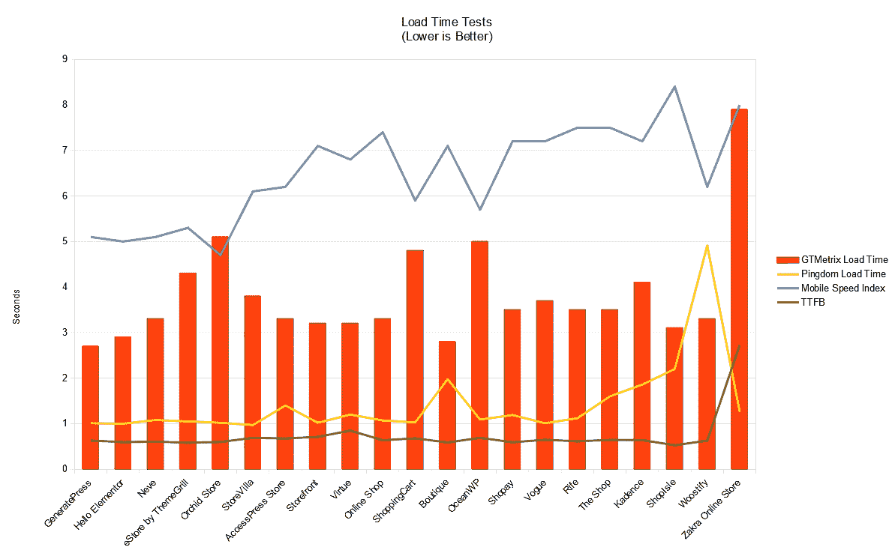

Load Time Test Chart

#### 外卖食品

*   GeneratePress 达到了最快的 GTMetrix 加载时间，Boutique 和 Elementor 紧随其后。
*   Zakra Online 提供了最慢的 GTMetrix 加载时间。兰花商店和 OceanWP 也是垫底的。
*   StoreVilla 给出了最快的 Pingdom 加载时间。
*   Woostify 的 Pingdom 加载时间最慢。
*   兰花商店提供了最快的移动速度指数。
*   ShopIsle 显示了最慢的移动速度指数。
*   然而，ShopIsle 拥有最快的 TTFB。
*   Zakra Online 发的最慢的 TTFB。

#### 最快平均加载时间

*   生成 Press
*   hello 元素或
*   从不

#### 最慢平均加载时间

*   Zakra 在线商店
*   伍斯蒂菲
*   购物岛

你好，Elementor 和 Neve 在分数和加载时间上都是表现最好的。兰花商店是一个混合包，具有一流的性能得分，较慢的加载时间，更好的移动得分。除了在移动设备上，ShopIsle 在大多数类别中都表现良好。

总的来说，有一些惊喜(比如店面没有保持良好)和大量的预期结果(比如 Hello Elementor 或 outshining the field)。此外，很高兴看到专门为 WooCommerce 制作的主题提供快速评分，如精品店和兰花店。

### 最快的 WooCommerce 主题选项-完整的结果

以下是评估中列出的每个 WooCommerce 主题的最终结果。我们对主要的加载时间指标进行了平均，并从第一名到最后一名对主题进行了排序。我们又做了同样的事情——平均表现分数——来排列主题。

#### 平均加载时间排名(从最快的开始，以秒为单位)

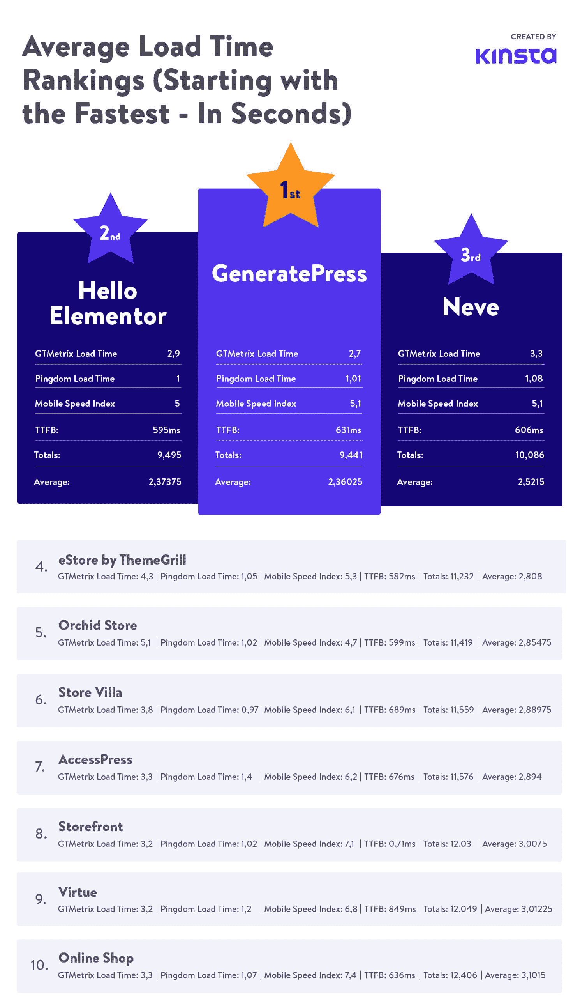

WooCommerce themes – Average Load Time Rankings

11.  购物车–3.10
12.  精品——3.12
13.  ocean WP–3.12
14.  shopay–3.12
15.  时尚——3.14
16.  rife–3.18
17.  商店-3.31
18.  卡登斯–3.45
19.  购物岛——3.56 英镑
20.  伍斯提夫——3.76
21.  Zakra 在线商店–4.97 英镑

#### 平均绩效得分排名(从最高分开始，满分为 100 分)

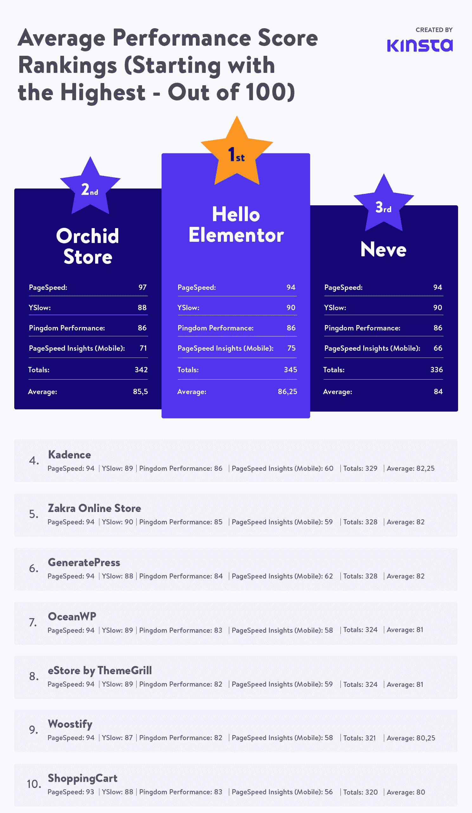

WooCommerce themes – WooCommerce themes – Average Load Time

11.  store villa–79.25 英镑
12.  网上商店–78.50 英镑
13.  里弗–78.50 英镑
14.  AccessPress 商店–78.50 英镑
15.  购物——78.25 英镑
16.  时尚——77.25 英镑
17.  美德-77.00
18.  购物岛–75.25 英镑
19.  精品——74.50 英镑
20.  商店——74.50 英镑
21.  店面–71.75 英镑

仅此而已，多好的旅程啊！

现在轮到你了:你使用了哪些 WooCommerce 主题？我们的清单上少了什么？欢迎在评论中分享你喜欢的其他快速 WooCommerce 主题！

* * *

让你所有的[应用程序](https://kinsta.com/application-hosting/)、[数据库](https://kinsta.com/database-hosting/)和 [WordPress 网站](https://kinsta.com/wordpress-hosting/)在线并在一个屋檐下。我们功能丰富的高性能云平台包括:

*   在 MyKinsta 仪表盘中轻松设置和管理
*   24/7 专家支持
*   最好的谷歌云平台硬件和网络，由 Kubernetes 提供最大的可扩展性
*   面向速度和安全性的企业级 Cloudflare 集成
*   全球受众覆盖全球多达 35 个数据中心和 275 多个 pop

在第一个月使用托管的[应用程序或托管](https://kinsta.com/application-hosting/)的[数据库，您可以享受 20 美元的优惠，亲自测试一下。探索我们的](https://kinsta.com/database-hosting/)[计划](https://kinsta.com/plans/)或[与销售人员交谈](https://kinsta.com/contact-us/)以找到最适合您的方式。**