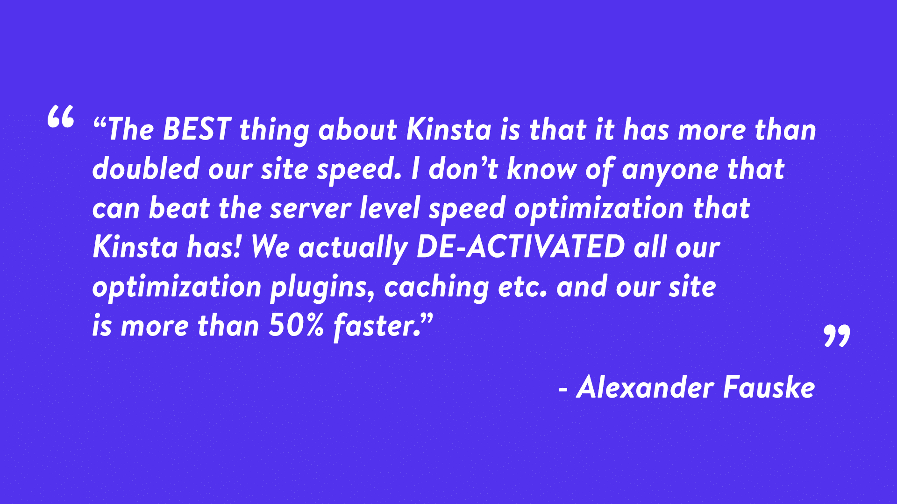
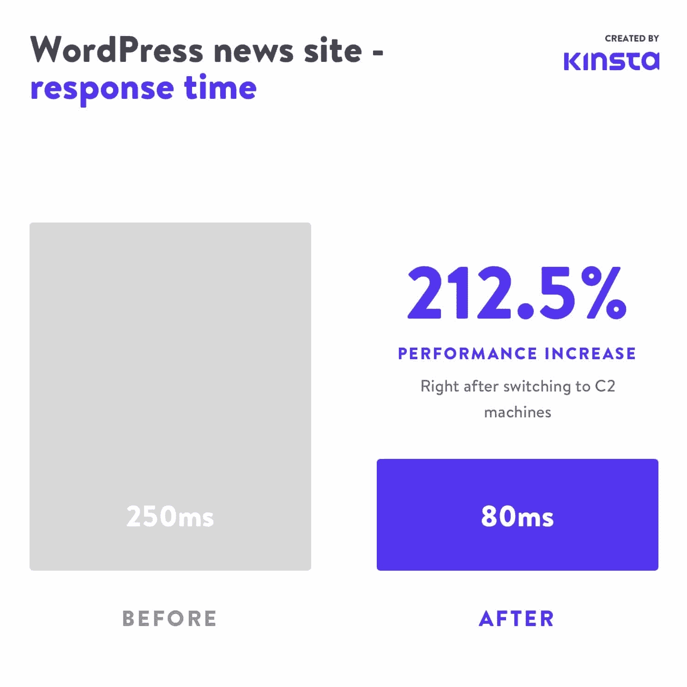
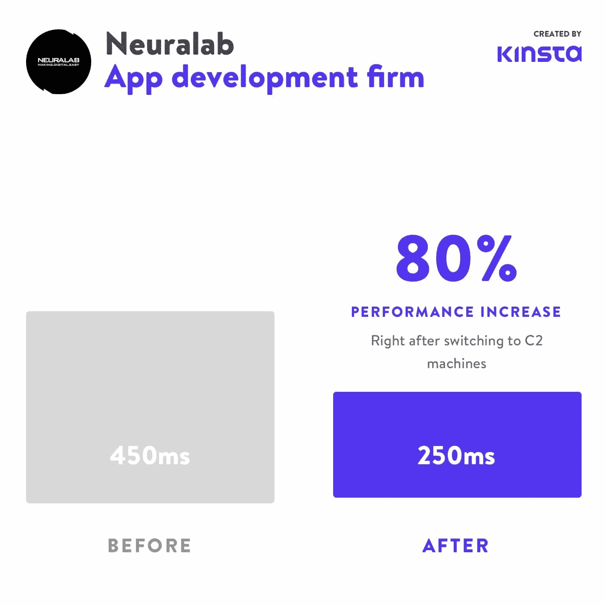
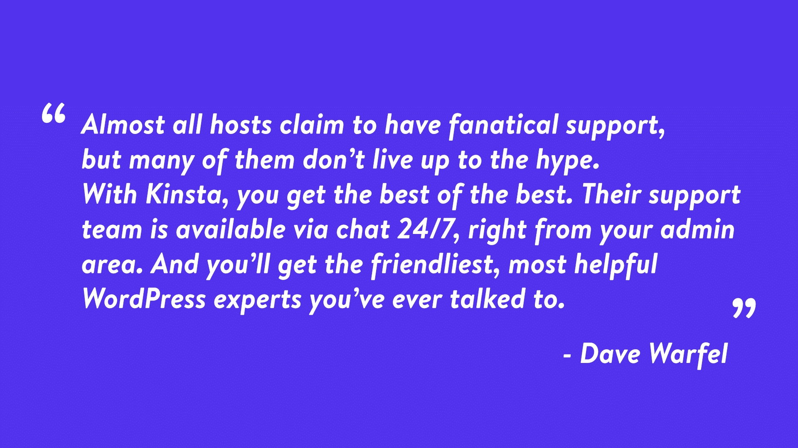

# 金斯塔如何设计最快的 WordPress 托管体验

> 原文：<https://kinsta.com/blog/fastest-wordpress-hosting/>

2016 年，我们的团队着手让 Kinsta 已经高性能的 [WordPress 主机](https://kinsta.com/wordpress-hosting/)运行得更快。[那段旅程](https://kinsta.com/blog/managed-wordpress-hosting-in-the-google-cloud/)以我们将我们的整个基础设施从多家供应商迁移并整合到谷歌云平台(GCP)而告终。

今天回想起来，那个选择在让我们建立世界上最快的 WordPress 托管平台中发挥了巨大的作用。

在本文中，我们将深入探讨 Kinsta 的愿景，以及我们为什么选择 Google 云平台作为我们的基础设施提供商。具体来说，你将了解 Kinsta 如何使用计算优化的 C2 虚拟机、高级流量路由和定制的[容器化托管栈](https://kinsta.com/knowledgebase/shared-vps-dedicated-hosting/)将 WordPress 的性能提升到一个新的水平。

系好安全带。

## 谷歌云平台和虚拟机

[谷歌云平台](https://kinsta.com/blog/google-cloud-hosting/)提供多种虚拟机(VM)。把虚拟机想象成数据中心里的一台计算机，完全配备了 CPU、RAM、 [SSD 存储](https://kinsta.com/blog/what-is-ssd/)和快速互联网连接。

与普通计算机一样，虚拟机有不同的配置。在 GCP，虚拟机被分为不同的家族。

具体来说:

> Kinsta 把我宠坏了，所以我现在要求每个供应商都提供这样的服务。我们还试图通过我们的 SaaS 工具支持达到这一水平。
> 
> <footer class="wp-block-kinsta-client-quote__footer">
> 
> 
> 
> <cite class="wp-block-kinsta-client-quote__cite">Suganthan Mohanadasan from @Suganthanmn</cite></footer>

[View plans](https://kinsta.com/plans/)

*   N1、N2 和 E2 虚拟机是适用于各种工作负载的通用机器，但它们并未针对任何单一任务进行优化。它们在 web 服务器、商业应用程序和小型数据库中很受欢迎。
*   M1 和 M2 的机器为内存密集型用例加载了 RAM，如大型内存中 SQL 和 NoSQL 数据库以及内存中数据分析。
*   C2 机器是“计算优化”的虚拟机，专为电子设计自动化、高性能游戏和其他像 WordPress 这样的 CPU 密集型工作负载而设计。这些是谷歌云平台最快的服务器，也是我们在 Kinsta 这里实现的。

## 金斯塔如何使用谷歌云平台

在我们提供最快的 [WordPress 托管体验](https://kinsta.com/wordpress-hosting/)的愿景中，谷歌的 C2 虚拟机发挥了关键作用，但这并不是唯一重要的方面(更多内容见下文)。

与通用的 N1 虚拟机相比，我们对 C2 虚拟机配置进行了基准测试，发现它比 WordPress 快 [200%。](https://kinsta.com/blog/boosting-wordpress-performance/)

让我们给你一个简单的例子，计算优化的虚拟机如何直接影响 WordPress 网站的速度。

WordPress 核心、[插件](https://kinsta.com/best-wordpress-plugins/)和[主题](https://kinsta.com/blog/fastest-wordpress-theme/)是用一种叫做 [PHP](https://kinsta.com/knowledgebase/what-is-php/) 的编程语言编写的。代码由 [PHP workers](https://kinsta.com/blog/php-workers/) 执行，PHP workers 是后台进程，执行各种任务，从调用数据库来生成网站页面，到为 WooCommerce 商店发送订单确认。

简单来说，PHP 工作人员是你的 WordPress 站点的引擎。

对 WordPress 站点的未缓存请求需要由 PHP 工作人员处理。由于 CPU 性能直接影响 PHP 工作人员处理代码的速度，谷歌 C2 虚拟机中的超高速 CPU 直接影响你的 WordPress 站点的[速度](https://kinsta.com/learn/speed-up-wordpress/)。

### 是什么让金斯塔快速？

Kinsta hosting 的核心是一个容器化的托管栈，由定制实现的 [LXD](https://kinsta.com/knowledgebase/what-you-should-know/#platform) 、 [Nginx](https://kinsta.com/knowledgebase/what-is-nginx/) 、 [MariaDB](https://kinsta.com/blog/mariadb-vs-mysql/) 和[最新版本的 PHP](https://kinsta.com/blog/php-benchmarks/) 提供支持。我们的软件栈专门针对谷歌云平台上的高性能 WordPress 主机进行了调整，随着更新更快的解决方案的出现，我们会不断调整和优化它。

在基础设施方面，我们利用谷歌的 C2 虚拟机和[高级层网络](https://kinsta.com/blog/google-cloud-network/)，通过尽可能避免公共互联网管道，提供低延迟和[快 30-50%的流量路由](https://kinsta.com/blog/google-cloud-network/#google-premium-tier-network)。

相比之下，**大多数其他 WordPress 主机**使用**更便宜的**和[不太安全的](https://kinsta.com/secure-wordpress-hosting/)光纤，以牺牲网络速度为代价。

通过将我们独特的主机栈与谷歌最快的虚拟机、流量路由和我们团队的深入经验相结合，Kinsta 能够充分利用谷歌云平台的性能，为我们的客户提供真正注重性能的 WordPress 主机体验。

然而，有这么多“注重性能”的 WordPress 主机，你可能会认为像 GCP 的 C2 机器这样的顶层虚拟机和高级层流量路由将是标准。

不幸的是，**在今天的 WordPress 托管环境中，**并非如此。

[Kinsta is on a mission to offer the fastest hosting experience possible… and it all starts with Google Cloud Platform’s lightning fast C2 machines ⚡️Click to Tweet](https://twitter.com/intent/tweet?url=https%3A%2F%2Fkinsta.com%2Fblog%2Ffastest-wordpress-hosting%2F&via=kinsta&text=Kinsta+is+on+a+mission+to+offer+the+fastest+hosting+experience+possible%E2%80%A6+and+it+all+starts+with+Google+Cloud+Platform%E2%80%99s+lightning+fast+C2+machines+%E2%9A%A1%EF%B8%8F&hashtags=GoogleCloud%2CManagedHosting)

[T2】](https://kinsta.com/plans/?utm_source=blog&utm_medium=fastest_hosting_banner&utm_campaign=wp_hosting)

## 由谷歌云平台支持的托管提供商

Kinsta 不是唯一一个使用谷歌云平台(GCP)的 WordPress 主机。然而，**我们是唯一一家为所有客户**使用计算优化的 C2 虚拟机和谷歌超高速高级层网络**的主机。**

### 金士塔 vs 场地

2020 年 5 月， [SiteGround](https://kinsta.com/siteground-alternative/) 宣布将六个数据中心的谷歌云平台基础设施上托管的站点升级到 N2 虚拟机。在 SiteGround 的新闻稿中，他们表示从 N1 迁移到 N2 虚拟机将使 CPU 性能提高 40%。

相比之下，Kinsta 支持 [35 个数据中心位置](https://kinsta.com/knowledgebase/best-data-center/)，12 个区域的[C2 虚拟机速度快 200%。这意味着除了托管在更快的服务器上，你还可以有策略地将你的网站放在更接近目标受众的地方！](https://kinsta.com/blog/boosting-wordpress-performance/#available-regions-for-c2-instances)

### Kinsta vs WP 引擎

2019 年 8 月，WP Engine 宣布支持计算优化的 C2 虚拟机。然而，**只有以 290 美元/月**起的专用计划的客户才能在 [WP 引擎](https://kinsta.com/wp-engine-alternative/)上访问高性能 C2 虚拟机。

在 Kinsta，**所有客户都托管在 C2 虚拟机上**。无论你是在[起步计划还是企业计划](https://kinsta.com/plans/)，无论你的预算有多大，你都可以利用谷歌云平台最快的服务器，获得最快的 WordPress 托管体验。

### 计算优化的 C2 虚拟机有多快？

在我们深入了解 Kinsta 的与众不同之处之前，请查看一些客户站点在迁移到运行我们定制软件堆栈的 C2 虚拟机后的性能比较。

## 注册订阅时事通讯

### 想知道我们是怎么让流量增长超过 1000%的吗？

加入 20，000 多名获得我们每周时事通讯和内部消息的人的行列吧！

[Subscribe Now](#newsletter)

一个高流量的 WordPress 新闻网站每分钟处理数百个 PHP 请求，通过切换到 C2 机器，他们的响应时间从 250 毫秒减少到 80 毫秒——这在性能上增加了**212.5%**！

A 212.5% increase in performance after switching to C2.

[Matthew Woodward 的](https://www.matthewwoodward.co.uk/)热门在线营销和 SEO 博客的响应时间从 750 毫秒下降到 385 毫秒——这是一个 **94.8%的性能提升**！

Neuralab saw a 80% performance increase after moving to C2.

自迁移到 C2 虚拟机以来，我们看到了许多成功案例，这些只是其中的三个。最棒的是，**我们的客户不需要做任何事情**来利用这些性能提升——没有优化插件，没有网站代码的改变，也没有隐藏成本。

## 在速度方面，是什么让 Kinsta 与众不同

所以，现在你可能想知道为什么 Kinsta 能够为每个人提供谷歌云平台最快的服务器，而我们的竞争对手却只能在昂贵的定制计划中使用较慢的服务器或 C2 可用性。

答案出奇的简单: [Kinsta 是一家私人控股公司](https://kinsta.com/blog/bootstrapping-startup/)，**将客户体验放在首位。**为了深入了解 Kinsta 将我们的整个客户群转移到 C2 VMs 的决定，我采访了我们的首席执行官 Mark Gavalda。

### 金斯塔的 DNA

据 Mark 称，迁移到计算优化的 C2 虚拟机的决定在很大程度上受到了他所谓的“Kinsta DNA”的影响。

自 2013 年 Kinsta 成立以来:

> “不管成本如何，我们一直使用最高质量的材料和人员。这种面向客户的策略想到的两个最明显的领域是[多语言支持](https://kinsta.com/help/multilingual-support/)和基础设施。
> 
> 出色的支持一直是 Kinsta 的特色之一。尽管我们自 2013 年以来取得了巨大的增长，[我们的 24/7/365 客户支持团队](https://kinsta.com/kinsta-support/)已经能够在 2022 年保持**不到 2 分钟的响应时间**和 **97%的客户满意度**。"

看看我们的一些客户对他们在 Kinsta 上的 [WordPress 托管体验有什么看法！](https://kinsta.com/kinsta-reviews/)

使用我们灵活的 Google Cloud powered 基础设施提升你的 WordPress 网站的功能。查看我们的计划。

### 金斯塔的 C2 VMs 之旅

在我们迁移到高性能 C2 虚拟机之前，我们使用 GCP 的通用 N1 虚拟机通过谷歌的高级层网络进行路由。虽然 N1 虚拟机已经为我们提供了不错的性能，但谷歌推出的 C2 虚拟机很早就引起了我们的兴趣。事实上，当 C2 虚拟机处于“alpha 测试”阶段时，马克曾去过谷歌的苏黎世办公室一睹其风采。

一开始是爱…线！

马克带着一个奇异的想法离开了他在 C2 的第一次邂逅:

> “我们必须为所有 Kinsta 客户使用这些机器，无论成本如何。”

对我们来说，GCP 计算优化的 C2 虚拟机的定义特性是**无与伦比的单线程性能**。根据马克的说法，

> “大多数与 WordPress 相关的工作负载都是单线程的，所以我们不能使用几十个 CPU 来并行处理一个任务。”

因此，拥有最好的单线程性能对于托管 WordPress 站点来说是极其重要的。

经过大量的基准测试，我们发现，与采用 2.2 GHz CPUs 的 N1 虚拟机相比，C2 的 3.8 GHz 全核持续睿频 CPU“有效地将单个虚拟机在任何给定时间可以处理的工作量增加了一倍”。在基准测试之后，我们立即联系了 Google Cloud 以获取更多关于 C2 可用性的信息。

### C2 实例的可用区域

在 2020 年初，我们完成了将整个基础设施迁移到受支持地区的 C2 虚拟机(见下文)。这意味着无论你在北美、欧洲还是亚洲，总有一个配备 C2 的地区离你很近。

随着谷歌云使 C2 虚拟机在其他地区可用，我们将继续把我们的基础设施迁移到 C2 的机器上。

1.  台湾彰化县(东亚 1)
2.  香港(东亚 2)
3.  日本东京(亚洲东北部 1)
4.  日本大阪(亚洲东北部 2)
5.  韩国首尔(东北亚 3)
6.  印度孟买(亚洲南部 1)
7.  印度德里(亚洲-南方 2)
8.  新加坡裕廊西(东南亚 1)
9.  印度尼西亚雅加达(东南亚 2)
10.  澳大利亚墨尔本(澳大利亚东南部 2)
11.  比利时圣吉斯兰(欧洲-西方 1)
12.  英国伦敦(欧洲-西方 2)
13.  德国法兰克福(欧洲-西方 3)
14.  荷兰 Eemshaven(欧洲-西方 4)
15.  瑞士苏黎世(欧洲-西方 6)
16.  加拿大蒙特利尔(北美-东北 1)
17.  加拿大多伦多(北美-东北 2)
18.  巴西圣保罗(南美-东方 1)
19.  美国爱荷华州康瑟尔布拉夫斯(美国中部 1)
20.  美国南卡罗来纳州蒙克斯角(美国东部 1)
21.  美国弗吉尼亚州阿什本(美国东部 4)
22.  美国俄亥俄州哥伦布市(美国东部 5 区)
23.  美国俄勒冈州达拉斯市(美国西部 1)
24.  美国加利福尼亚州洛杉矶(美国西部 2)
25.  美国犹他州盐湖城(美国西部 3)
26.  美国内华达州拉斯维加斯(美国西部 4)

多亏了谷歌灵活的虚拟机设计和我们令人难以置信的工程和系统管理团队，从 N1 到 C2 的过渡是无缝的。后 C2 时代，[的客户反应非常好](https://kinsta.com/blog/boosting-wordpress-performance/#performance-results-were-seeing-on-clients-sites)，我们确信，无论成本如何，转向谷歌最快的服务器是我们客户的最佳选择。用马克的话说——“没有回头路”！

#### 为所有计划提供最快的托管体验(现在和未来)

> “无论代价如何，速度是我们永远不会妥协的东西”。—金斯塔公司首席执行官马克·加瓦尔达

说到技术，未来是广阔的。Kinsta 热衷于 WordPress 主机领域的创新，我们总是从改善客户体验、满意度和性能的角度来评估[最新技术](https://kinsta.com/knowledgebase/what-you-should-know/)。用马克的话说:

> “我们的团队与谷歌云密切合作，以确保我们尽快测试新产品，所以你可以肯定我们非常关注最新的基础设施进步。”

五年后，C2 虚拟机可能不再是 WordPress 最快的服务器了。如果您的站点托管在 Kinsta，您就不必担心这一点，因为我们已经让"[免费将您的站点迁移到最新的服务器上了](https://kinsta.com/knowledgebase/wordpress-migrations/)。

[⚡️ Ultra-fast C2 machines 🚦 premium traffic routing, and ✨ a custom containerized hosting stack- just a few of the ways Kinsta is making managed hosting faster than ever ⬇️Click to Tweet](https://twitter.com/intent/tweet?url=https%3A%2F%2Fkinsta.com%2Fblog%2Ffastest-wordpress-hosting%2F&via=kinsta&text=%E2%9A%A1%EF%B8%8F+Ultra-fast+C2+machines+%F0%9F%9A%A6+premium+traffic+routing%2C+and+%E2%9C%A8+a+custom+containerized+hosting+stack-+just+a+few+of+the+ways+Kinsta+is+making+managed+hosting+faster+than+ever+%E2%AC%87%EF%B8%8F&hashtags=GoogleCloudPlatform%2CC2)

## 摘要

凭借其广泛的虚拟机选择、超高速网络和系统管理员友好的功能，谷歌云平台正在迅速成为一个受欢迎的基础设施提供商。尽管 Kinsta 不是唯一使用谷歌云平台的主机，**我们是唯一在所有计划中提供 C2 机器的主机**。

有了 Kinsta，无论你是入门计划还是完全定制计划，你的 WordPress 网站都可以访问 GCP 最快的计算优化服务器。具体来说，从第一天起，您就可以充分利用谷歌云的 C2 虚拟机和高级层网络。

欲了解更多信息，请查看我们的 [C2 基准测试](https://kinsta.com/blog/boosting-wordpress-performance/)！

展望未来，我们的目光聚焦于创新和迭代，目标是打造世界上最好最快的 WordPress 托管体验。

我们有许多项目和功能正在开发中，所以请确保[订阅我们的时事通讯](https://kinsta.com/wordpress-newsletter/),了解 Kinsta 和 WordPress 的最新消息！

* * *

让你所有的[应用程序](https://kinsta.com/application-hosting/)、[数据库](https://kinsta.com/database-hosting/)和 [WordPress 网站](https://kinsta.com/wordpress-hosting/)在线并在一个屋檐下。我们功能丰富的高性能云平台包括:

*   在 MyKinsta 仪表盘中轻松设置和管理
*   24/7 专家支持
*   最好的谷歌云平台硬件和网络，由 Kubernetes 提供最大的可扩展性
*   面向速度和安全性的企业级 Cloudflare 集成
*   全球受众覆盖全球多达 35 个数据中心和 275 多个 pop

在第一个月使用托管的[应用程序或托管](https://kinsta.com/application-hosting/)的[数据库，您可以享受 20 美元的优惠，亲自测试一下。探索我们的](https://kinsta.com/database-hosting/)[计划](https://kinsta.com/plans/)或[与销售人员交谈](https://kinsta.com/contact-us/)以找到最适合您的方式。