# 2022 年 16 个最快的 WordPress 主题(基于彻底的测试)

> 原文：<https://kinsta.com/blog/fastest-wordpress-theme/>

寻找最快的 WordPress 主题似乎是一个注定要失败的事业。你应该测试你感兴趣的每一个主题并比较毫秒加载时间的差异来找到最轻量级的 WordPress 主题吗？

你如何解释开发者和他们的在线演示在主机速度上的变化？如果测试工具产生相互矛盾的结果怎么办？

认为 WordPress 的普通用户会一直测试想要的主题的性能是不现实的。去除外界因素很难，要考虑的 [WordPress 主题](https://kinsta.com/knowledgebase/what-is-a-wordpress-theme/)太多了。

这就是我们为你工作的原因。

使用四个不同的速度测试，每个主题一个新的安装，每个主题的速度测试使用相同的服务器，我们能够**将最快的 WordPress 主题缩小到一个候选列表**。

此外，我们比较了其中的佼佼者，以显示他们中的哪些人在不同情况下表现出色，哪些人的表现得分最高，速度最快。

如果你也想自己进行一些测试，请务必查看我们关于如何进行速度测试的指南。

反而对 Woocommerce 主题感兴趣？看看我们策划的[最快的 WooCommerce 主题列表](https://kinsta.com/blog/fastest-woocommerce-theme/)(基于测试)。

让我们开始吧！

## 我们如何测试最快的 WordPress 主题候选

我们的搜索从我们过去遇到的主题开始，以及基于受欢迎程度、高下载量和高质量评论的[最佳 WordPress 主题](https://kinsta.com/best-wordpress-themes/)。

> Kinsta 把我宠坏了，所以我现在要求每个供应商都提供这样的服务。我们还试图通过我们的 SaaS 工具支持达到这一水平。
> 
> <footer class="wp-block-kinsta-client-quote__footer">
> 
> 
> 
> <cite class="wp-block-kinsta-client-quote__cite">Suganthan Mohanadasan from @Suganthanmn</cite></footer>

[View plans](https://kinsta.com/plans/)

我们从 WordPress 知识库中添加到候选列表中，以识别隐藏的宝石、更新的主题和高评级的选项，这些选项可能是我们在之前的收藏中遗漏的。

如果你遇到一个快速的 WordPress 网站，你可以用我们的[主题检测工具](https://kinsta.com/tools/what-is-my-ip/wordpress-theme-detector/)找出它使用了什么主题。如果这个主题不在我们下面的列表中，一定要在评论中告诉我们！

速度测试过程是这样的:

1.  在空白的 WordPress 沙盒上安装并激活主题。这允许在 [WordPress hosting](https://kinsta.com/wordpress-hosting/) 中实现标准化，并且不会使其他插件或网站文件复杂化。
2.  让主题保持原样，不添加[媒体](https://kinsta.com/blog/wordpress-media-library/)、[菜单](https://kinsta.com/blog/wordpress-menu-plugins/)、页面或帖子。我们还想省去任何演示内容，不分配一个水平起点的主页。
3.  通过 [GTmetrix 速度测试](https://kinsta.com/blog/gtmetrix-speed-test/)运行主题的网站。
4.  通过 [Pingdom 速度测试](https://kinsta.com/blog/pingdom-speed-test/)运行主题。
5.  通过 [PageSpeed Insights 测试](https://kinsta.com/blog/google-pagespeed-insights/)运行主题，评估移动和桌面速度。
6.  通过字节检查 TTFB 测试运行该主题(如果您想更深入地了解该主题，我们有关于如何减少 TTFB(到第一个字节的时间)的完整指南[)。](https://kinsta.com/blog/ttfb/)

### 信息

所有的主题测试都是在 2022 年 2 月做的。

每种测试工具都有它的好处。我们已经概述了我们的指标的含义，以及为什么它们对于更好地理解评估至关重要。

至于为什么我们使用四种工具，每一种都有不同的标准和结果，所以我们想确保一种工具不会比另一种工具给出更好或更差的结果。此外，一些工具专注于具体细节，如移动速度、页面大小或第一个网站元素出现的速度。

这里是我们使用的测试工具的总结。

[速度优化是一场你用慢主题赢不了的硬仗。看看最快的 WordPress 主题是如何相互叠加的！📊🥇 点击推文](https://twitter.com/intent/tweet?url=https%3A%2F%2Fkinsta.com%2Fblog%2Ffastest-wordpress-theme%2F&via=kinsta&text=Speed+optimization+is+a+tough+game+you+can%27t+win+with+a+slow+theme.+Check+out+how+the+fastest+WordPress+themes+stack+against+each+other%21+%F0%9F%93%8A%F0%9F%A5%87&hashtags=sitespeed%2CTTFB)

### **GTmetrix**

[GTmetrix](https://kinsta.com/blog/gtmetrix-speed-test/) 拿一个网站，分解速度和优化。这是一个检查[性能问题](https://kinsta.com/blog/debugging-wordpress-performance/)和主题是否被不必要的文件弄得太乱的极好工具。

自 2020 年 11 月起，GTmetrix 由 Lighthouse 提供支持，并采用了新的报告设计。新设计包括基于新的性能和结构得分的更新的 GTmetrix 等级。

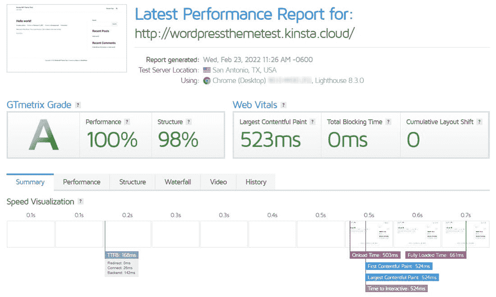

GTmetrix.

*   **GTmetrix 等级:**绩效和结构得分的加权等级。该等级考虑了网站的原始性能和用户体验的实际性能。
*   **性能分数:**gt metrix 在测试期间获得的灯塔性能分数。越高越好。
*   **结构评分:**基于 Lighthouse 审计和 GTmetrix 自己的定制审计。在理想情况下，它几乎与性能分数相同。
*   **网络重要指标:**它们是由谷歌建立的[指标，是用户感知表现的关键。这些关键指标包括最大内容油漆(LCP)、总阻塞时间(TBT)和累积布局偏移(CLS)。](https://kinsta.com/blog/core-web-vitals/)

### Pingdom

Pingdom 类似于 GTmetrix，但我们喜欢同时运行两者，因为它们提供的指标略有不同，如果两者之间出现任何重大差异，可以作为一种“制衡”的情况。

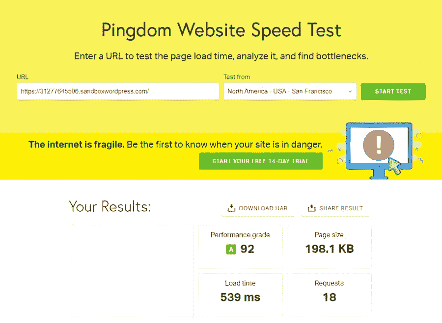

Pingdom.

*   **绩效等级:**这是一个累积等级，满分为 100 分。目标是获得尽可能高的分数。影响得分的一些因素包括内容大小、错误、重定向、请求等。
*   **加载时间:【Pingdom 加载安装了主题的整个网站所需的时间。越低越好。**
*   **页面大小:**你整个站点文件的大小。主题对此影响很大。越低越好。
*   **请求:**向用户发送主题和站点内容的服务器请求数。越少越好。

### 页面速度**洞察力**

Google PageSpeed Insights 擅长展示用户体验是拥有一个 [fast WordPress 主题](https://kinsta.com/best-wordpress-themes/#fast)的最关键部分。它关注内容显示给用户的速度，同时也揭示了主题中导致交付速度慢的方面。

我们同时使用移动和桌面测试进行测量，因为它能提供更好的整体情况。

以下是需要了解的主要数据点:

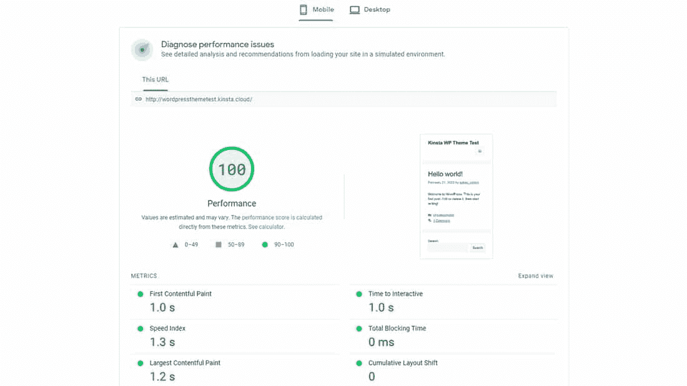

PageSpeed Insights.

*   **表现得分:** [此分满分为 100 分](https://kinsta.com/blog/google-pagespeed-insights/)。这里的详细描述了性能评分[，包括速度指数、内容交付时间和空闲时间。](https://web.dev/performance-scoring/)
*   **第一个内容绘画:**你的主题和网站显示第一个内容项目所花费的时间。越低越好。
*   **最大内容绘画:**你的主题和网站显示最大内容项目所花费的时间。越低越好。
*   **速度指标**:每个内容项向用户呈现所经过的时间。同样，较低是理想的。
*   **互动时间:**互动性不同于可视性。本质上，这意味着按钮可能是可见的，但是用户可能还不能点击它。所以，这个计时应该比速度指数长，但是我们仍然想要一个更低的数字。
*   **总阻塞时间:** 等待下载开始所花费的时间，通常是因为样式表和脚本等其他资产具有更高的优先级。
*   **累积布局偏移:**衡量页面的视觉稳定性。页面内容是否意外移动或跳转，尤其是在初始加载期间？一个<0.1 的 CLS 分数被认为是好的，而> 0.25 被认为是差的。

### 字节**检查**

一个 [TTFB 测试](https://kinsta.com/blog/ttfb/#measure-ttfb)(首字节测试时间)测量浏览器完成一个 HTTP 请求需要多长时间，最终从服务器向用户发送一个字节的数据。

本质上，它是说最微小的信息传递需要多长时间。主机在传递第一个字节中扮演着重要的角色，所以选择最快的 WordPress 主机解决方案是必要的，但是一个笨拙的主题也会带来问题。

下面是我们在使用[bytecheck.com](https://www.bytecheck.com/)进行测试时看到的情况:

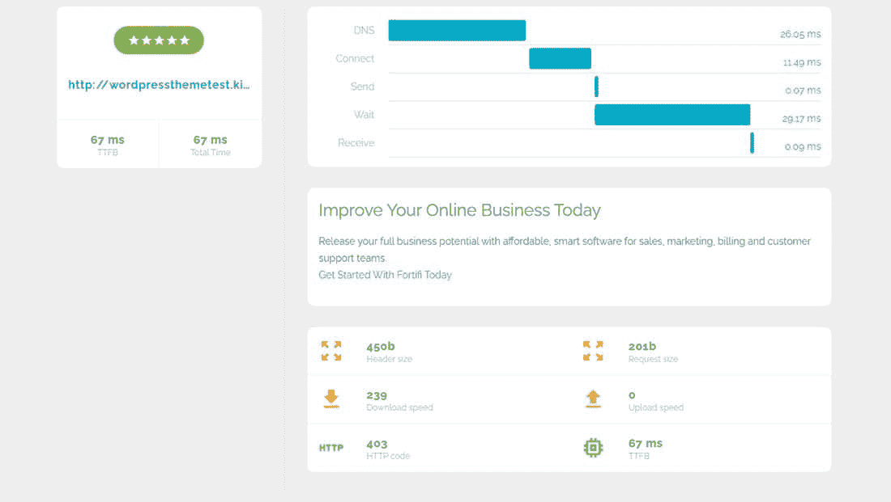

Byte Check.

*   **到达第一个字节的时间:**理想情况下，TTFB 是一个非常短的周期(以毫秒计)。它反映了数据的第一个字节从服务器传到用户手中需要多长时间。
*   总时间:总时间可能包含其他因素，但我们发现在我们的测试中它总是相同的。我们认为主机的变化会改变这个数字。
*   **请求大小:**理想情况下，请求大小是通过 [HTTP 请求](https://kinsta.com/blog/make-fewer-http-requests/)发送的数据大小。我们的测试揭示了所有主题的相同请求大小。
*   总头文件大小:这很重要，因为在某些情况下，头文件的大小经常会拖累主题。以字节计算，它是你的主题/网站标题的总文件大小。我们的测试显示，所有主题的标题大小都相同。

现在测试方法和工具已经很清楚了，是时候看看我们的结果，找到最快的 WordPress 主题(有数据支持)。

**注:**主题排列不分先后。阅读他们各自的测试结果和结论，了解他们的表现。你也可以[跳到最后一部分](https://kinsta.com/blog/fastest-wordpress-theme/#the-fastest-wordpress-themes-ranked)查看所有结果的汇总表格。

## 1.你好元素师

如果你熟悉[元素或页面构建器](https://kinsta.com/blog/wordpress-page-builders/#elementor)，你就会知道不使用任何代码来构建一个 WordPress 站点是多么的快速和简单。Elementor 是[拖放页面生成器](https://kinsta.com/blog/wordpress-page-builders/)世界中的佼佼者，所以毫不奇怪，同样的开发者已经开发出了一个快速和通用的主题，叫做 [Hello Elementor](https://wordpress.org/themes/hello-elementor/) 。

Hello Elementor.

这一主题被宣传为快速灵活。正如你所想，它与 Elementor 和许多其他插件结合得很好，如 [WooCommerce](https://kinsta.com/blog/woocommerce-tutorial/) 、[高级定制字段](https://kinsta.com/blog/advanced-custom-fields/)、 [Yoast](https://kinsta.com/blog/yoast-seo/) 等等。

移动设计在测试中表现良好，并提供了一个流畅的界面，所以你的访问者不会被浮华的菜单或文本所迷惑。这个主题让你从一张相对空白的石板开始，但是 Elementor 的力量开始发挥作用，为任何行业设计你需要的东西。

### **定价**

Hello Elementor 主题可以免费下载。

Elementor 页面构建器是免费的，额外的模板、小工具和元素构建器需要付费(每年 49 美元起)。

### **显著特征**

*   Hello Elementor 主题集成了 Elementor，它是最简单的页面生成器之一。
*   基本设计和主题文件简单明了，允许极快的速度和干净的界面。
*   有了 Elementor 集成，你可以用主题和页面生成器创建任何网站。
*   Hello Elementor 附带的一些页面构建器元素包括[视频](https://kinsta.com/blog/video-hosting/)、标题、间隔、[谷歌地图](https://kinsta.com/blog/wordpress-google-maps/)、[作品集](https://kinsta.com/blog/wordpress-portfolio-plugins/)、帖子等等。
*   Hello Elementor 内置了快速[设计登陆页面](https://kinsta.com/blog/wordpress-landing-page-plugins/)的工具。
*   该主题集成了 WooCommerce、Yoast 和 WPML 等流行插件。
*   你会收到一个针对所有设备的漂亮的[响应式设计](https://kinsta.com/blog/responsive-web-design/)。
*   在 RTL 支持中心的帮助下，创建[多语言](https://kinsta.com/blog/wordpress-multilingual/)和[翻译网站](https://kinsta.com/blog/how-to-translate-a-website/)。
*   Hello Elementor 拥有强大的追随者和坚实的支持资源，让您可以轻松地[寻求帮助](https://kinsta.com/blog/wordpress-support/)并在线查找文章。

### **最快的 WordPress 主题分析**

当谈到页面速度和轻量级文件时，Hello Elementor 是一个值得关注的 WordPress 主题。分数反映了这一点。

#### **GTmetrix**

*   **性能得分:** 100%
*   **结构得分:** 96%
*   **最大含量涂料(LCP):** 727ms
*   **总阻塞时间(TBT):**0 毫秒
*   **累计布局偏移(CLS):** 0
*   **满载时间:**897 毫秒

#### **Pingdom**

*   **性能等级:** 92
*   **页面大小:** 127.40 KB
*   **加载时间:**771 毫秒
*   **请求:** 14

#### **PageSpeed Insights(移动版)**

*   **表现得分:** 93
*   **第一次内容油漆:** 2.5s
*   **速度指数:** 2.7s
*   **大容量涂料(LCP):** 2.6s
*   **互动时间(TTI):**2.5 秒
*   **总阻塞时间(TBT):**50 毫秒
*   **累计布局偏移(CLS):** 0

#### **PageSpeed Insights(桌面)**

*   **表现得分:** 99
*   **第一次内容油漆:** 0.7s
*   **速度指数:** 0.7s
*   **大容量涂料(LCP):** 0.8s
*   **互动时间(TTI):**0.7 秒
*   **总阻塞时间(TBT):**0 毫秒
*   **累计布局偏移(CLS):** 0

#### **字节检查 TTFB 测试**

*   **到第一个字节的时间:**59 毫秒
*   **总时间:**59 毫秒
*   **割台尺寸:** 450b
*   **请求大小:** 201b

### **测试结论**

Hello Elementor 的 GTmetrix 性能得分非常惊人。它的 Pingdom 等级有点不太理想。它以前在谷歌的 PageSpeed Insights 中得分很高，但那些闪电般的加载时间现在变得有点慢了。它的 TTFB 测试完全在竞争对手的范围之内。

最后，我们只看到来自 Pingdom 的 12 个请求。当你向一个网站添加内容时，这种情况会改变，但这是一个很好的起点。我们喜欢看到服务器和用户之间的交流减少。

## **2。**的名称

ThemeIsle 公司以创建快速灵活的主题和插件而闻名，其中许多都是免费升级的。在我们的测试中， [Neve 主题](https://themeisle.com/themes/neve/)凭借其多功能设计和易于定制的布局，在 ThemeIsle 中表现最快。

我们也喜欢 Neve，因为它可以很好地与 woo commerce(WordPress 最流行的在线商店插件)配合使用。看到一些以电子商务为重点的主题拥有轻量级的文件和顶级的性能得分，这令人欣慰。

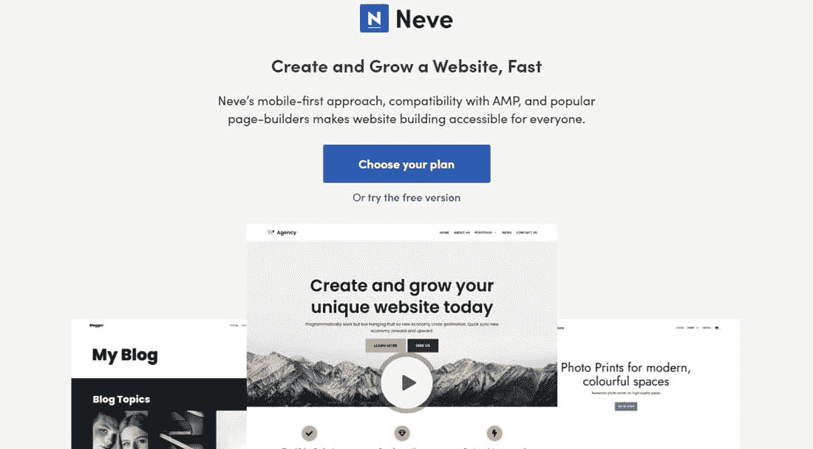

Neve.

Neve 与 Elementor 和许多其他顶级页面生成器一起工作。这是一个轻量级的、移动优先的 WordPress 主题。可靠的更新和支持也是 ThemeIsle 品牌的支柱。

你还会发现可靠的[编码](https://kinsta.com/blog/code-review-tools/)和灵活的结构，以确保你可以建立任何你想要的网站。很高兴看到 ThemeIsle 列出了目前运行 Neve 主题的网站，让你了解主题的可能性，并为你自己的网站获得灵感。

### **定价**

Neve 主题是免费下载的,，[高级版起价 49 美元](https://themeisle.com/themes/neve/#pricing)。

付费主题提供了额外的功能，如标题和博客推广，自定义布局，以及对主题网站的无限支持和更新。

### **显著特征**

*   Neve 主题侧重于在手机和平板电脑上实现更快加载和更强大体验的移动界面。
*   与流行的[页面生成器](https://kinsta.com/blog/wordpress-page-builders/)集成。
*   主题[与 AMP](https://kinsta.com/blog/google-amp/) 兼容，用于生成用户优先的界面。
*   测试和文件大小显示了一个快速、轻量级的 WordPress 主题。
*   页眉和页脚区域提供自定义设计。
*   您可以使用全角和内含版本的设置来调整站点布局。
*   从来没有一个定制演示库可以在几分钟内推出一个漂亮的网站。这些类别包括电子商务、极简、博客、娱乐、旅游等等。
*   有些演示是专为某些页面构建者制作的。
*   WooCommerce Booster 工具实现了额外的电子商务元素，如[高级图库](https://kinsta.com/blog/wordpress-photo-gallery-plugins/)、结账模块和账单详情。
*   博客加速器功能通过[缩略图](https://kinsta.com/blog/regenerate-thumbnails/)、布局和元数据元素扩展了您的[博客选项](https://kinsta.com/learn/blogging-tips/)。
*   页眉助推器对于添加[社交按钮](https://kinsta.com/blog/wordpress-social-media-plugins/)、联系信息和[面包屑](https://kinsta.com/blog/wordpress-breadcrumbs/)非常有用。
*   如果[经营一家代理机构](https://kinsta.com/blog/wordpress-agency/)，您可以生成自定义布局并加入白色标签。
*   该主题的高级版本提供了 Elementor 页面生成器升级、博客加速器和“滚动到顶部”功能，以及许多其他升级。

### **最快的 WordPress 主题分析**

如果你想提高你的移动速度，Neve 是另一个值得关注的黄金主题。请求很少，文件大小也很理想。

#### **GTmetrix**

*   **性能得分:** 100%
*   **结构得分:** 99%
*   **最大含量涂料(LCP):** 487ms
*   **总阻塞时间(TBT):**0 毫秒
*   **累计布局偏移(CLS):** 0
*   **满载时间:**1000 毫秒

#### **Pingdom**

*   **性能等级:** 98
*   **页面大小:** 43.20 KB
*   **加载时间:**586 毫秒
*   请求: 6

#### **PageSpeed Insights(移动版)**

*   **绩效得分:** 100
*   **第一个内容油漆:** 1.0s
*   **速度指数:** 1.2s
*   **大容量涂料(LCP):** 1.0s
*   **互动时间(TTI):**1.0 秒
*   **总阻塞时间(TBT):**0 毫秒
*   **累计布局偏移(CLS):** 0

#### **PageSpeed Insights(桌面)**

*   **绩效得分:** 100
*   **第一个内容油漆:** 0.3s
*   **速度指数:** 0.6s
*   **大容量涂料(LCP):** 0.4s
*   **互动时间(TTI):**0.3 秒
*   **总阻塞时间(TBT):**0 毫秒
*   **累计布局偏移(CLS):** 0

#### **字节检查 TTFB 测试**

*   **到达第一个字节的时间:**51 毫秒
*   **总时间:**52 毫秒
*   **割台尺寸:** 450b
*   **请求大小:** 201b

### **测试结论**

Neve 是一个超级性能优化的轻量级 WordPress 主题，几乎超越了所有竞争对手。它在 PageSpeed Insights 测试(移动和桌面)中获得了 100 分。此外，它还产生了高 98 平多姆等级。它的请求数量只有 6 个，是所有测试主题中最低的，页面大小也是倒数第二。它的装载时间也是同类产品中最好的。

最终，Neve 不仅受欢迎，设计精良，而且功能多样，拥有超快的运行速度。

## **3。**阿斯特拉

Astra 主题不仅迅速流行起来，而且在我们的测试中，当主题被激活并表现良好时，它会快速移动。Astra 的全部意义在于，一旦你[把它安装在 WordPress](https://kinsta.com/blog/how-to-install-a-wordpress-theme/) 上，就有一个预制好的网站准备好了。

这是通过多个行业的演示完成的，您可以定制主题的大部分元素，而不必接触代码。

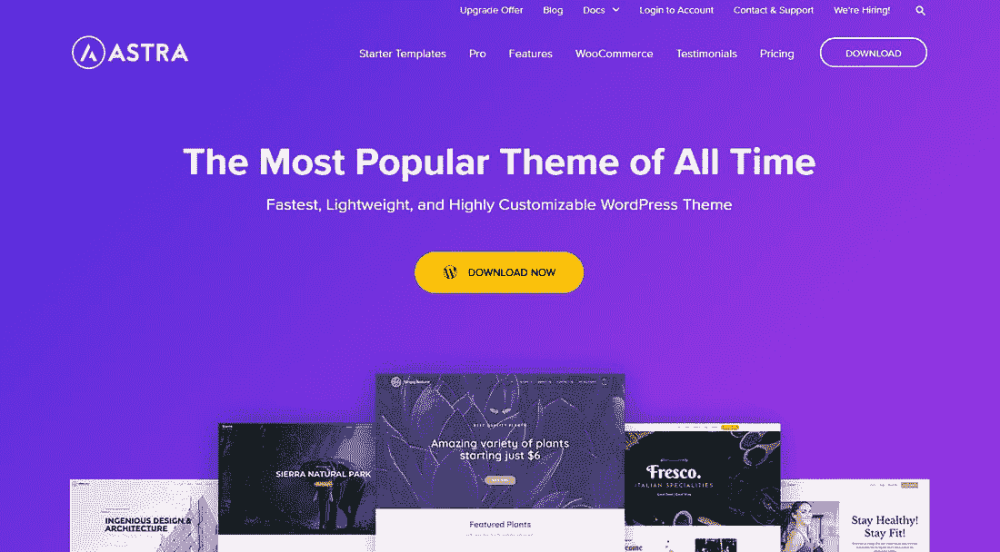

Astra.

页面构建器与主题集成在一起，你可以将主题与 WooCommerce、 [LearnDash](https://kinsta.com/blog/wordpress-membership-plugins/#4-learndash--starting-at-159) 和 Yoast 等第三方插件链接起来。随着[钩子和过滤器](https://kinsta.com/blog/wordpress-hooks/)，翻译设置和演示，如果你对快速设置感兴趣，Astra 主题是一个必须尝试的。

### **定价**

有一个免费主题和一个高级版本。Astra Pro 的上市价格为 49 美元。基本捆绑包每年 169 美元，增长捆绑包每年 249 美元，但我们经常看到该公司的折扣。

### **显著特征**

*   户外探险、宠物护理、有机商店、定制印刷公司等设计都有漂亮的预建演示。
*   该主题集成了高端页面构建器，如古腾堡、Brizy、Elementor 和 T2 海狸构建器。事实上，有些演示是专门为那些构建者制作的。
*   布局设置包括调整标题、添加侧栏和调整单页布局。
*   通过定制器控制你的博客的整体设计。
*   这个主题为 WooCommerce 提供了独特的设置，这在普通主题中是找不到的。
*   钩子和过滤器是扩展功能的理想选择。
*   你可以把主题翻译成各种语言。
*   该主题有一个巨大的菜单和移动标题功能。
*   高级站点布局包括填充、全幅和盒装页面选项。

### **最快的 WordPress 主题分析**

有许多演示的多用途主题能提供一流的速度吗？你打赌它能。

#### **GTmetrix**

*   **性能得分:** 100%
*   **结构得分:** 98%
*   **最大含量涂料(LCP):** 649ms
*   **总阻塞时间(TBT):**0 毫秒
*   **累计布局偏移(CLS):** 0
*   **满载时间:** 857 毫秒

#### **Pingdom**

*   **性能等级:** 98
*   **页面大小:** 51.10 KB
*   **加载时间:**531 毫秒
*   请求: 6

#### **PageSpeed Insights(移动版)**

*   **绩效得分:** 100
*   **第一幅内容丰富的画:** 1.1s
*   **速度指数:** 1.5s
*   **大容量涂料(LCP):** 1.2s
*   **互动时间(TTI):** 1.1s
*   **总阻塞时间(TBT):**0 毫秒
*   **累计布局偏移(CLS):** 0

#### **PageSpeed Insights(桌面)**

*   **绩效得分:** 100
*   **第一个内容油漆:** 0.3s
*   **速度指数:** 0.4s
*   **大容量涂料(LCP):** 0.3s
*   **互动时间(TTI):**0.3 秒
*   **总阻塞时间(TBT):**0 毫秒
*   **累计布局偏移(CLS):** 0

#### **字节检查 TTFB 测试**

*   **到达第一个字节的时间:**47 毫秒
*   **总时间:**48 毫秒
*   **割台尺寸:** 450b
*   **请求大小:** 201b

### **测试结论**

就所有四项测试的得分而言，Astra 表现优异。分数是 100、98、100 和 100——在每个方面都接近完美！

请求是 6 个，页面大小相对较小，这意味着没有垃圾会影响开箱即用的主题。总的来说，Astra 即使在实现其较大的演示项目时也表现良好，这很好，因为它们看起来都很漂亮。

## **4。**发电报

从所有四个测试来看， [GeneratePress](https://kinsta.com/blog/generatepress-vs-astra/#generatepress) 是最快的 WordPress 主题之一。这是一个时尚的小包装中的多功能主题，拥有与多个页面生成器的集成，WooCommerce 支持，以及各种侧边栏和[小部件](https://kinsta.com/blog/wordpress-widgets/)位置。

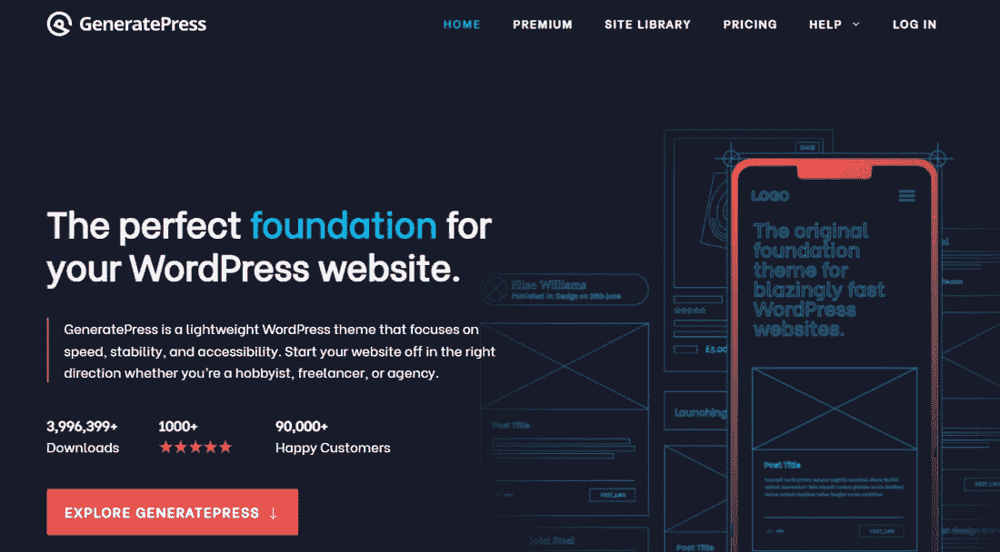

GeneratePress.

评分和评论显示 GeneratePress 拥有令人难以置信的追随者。您可以下载免费版本，或者选择将您的[功能升级到高级版本](https://generatepress.com/premium/)。

高级主题附带了额外的排版、演示、颜色等模块。我们特别喜欢原始主题文件和演示文件有多小。这表明它不会拖累你的网站或者在服务器上引起问题。

### **定价**

有一个免费版本可以下载。高级主题售价 59 美元。如果您需要持续的支持和更新，可以每年升级一次。还有[一次性终身支付](https://generatepress.com/pricing/)可用。

### **显著特征**

*   根据我们的测试，这个主题速度快，文件小。
*   它兼容许多 WordPress 插件，如 WooCommerce、page builders 和 T2 bbPress。
*   它有各种各样的主题颜色和排版选项可供定制。
*   钩子和过滤器可以用来扩展你网站的功能。
*   主题是 20 多种语言的翻译就绪。
*   在移动标题、粘性导航等的帮助下制作一个高级站点菜单。
*   博客功能比其他主题更先进，因为它使用无限滚动、列控制和图像调整设置。
*   你可以给你的主题的几个部分添加背景。
*   只需点击一个按钮，即可导入和导出所有主题选项。

### **最快的 WordPress 主题分析**

在测试过程中，GeneratePress 表现良好。页面加载速度之快令人惊叹。

#### **GTmetrix**

*   **性能得分:** 100%
*   **结构得分:** 99%
*   **最大含量涂料(LCP):** 546ms
*   **总阻塞时间(TBT):**0 毫秒
*   **累计布局偏移(CLS):** 0
*   **满载时间:**688 毫秒

#### **Pingdom**

*   **性能等级:** 98
*   **页面大小:** 38.80 KB
*   **加载时间:**559 毫秒
*   请求: 6

#### **PageSpeed Insights(移动版)**

*   **绩效得分:** 100
*   **第一个内容油漆:** 1.0s
*   **速度指数:** 1.3s
*   **大容量涂料(LCP):** 1.2s
*   **互动时间(TTI):**1.0 秒
*   **总阻塞时间(TBT):**0 毫秒
*   **累计布局偏移(CLS):** 0

#### **PageSpeed Insights(桌面)**

*   **绩效得分:** 100
*   **第一个内容油漆:** 0.3s
*   **速度指数:** 0.4s
*   **大容量涂料(LCP):** 0.4s
*   **互动时间(TTI):**0.3 秒
*   **总阻塞时间(TBT):**0 毫秒
*   **累计布局偏移(CLS):** 0

#### **字节检查 TTFB 测试**

*   **到第一个字节的时间:** 54
*   总时间: 54
*   **割台尺寸:** 450b
*   **请求大小:** 201b

### **测试结论**

最小的文件大小显示了它在 GeneratePress 测试中的优势。该主题在所有方面都接近满分。其要求也是最低的。

这种速度上的成功延续到了 PageSpeed Insights 测试，因为我们可以看到另一个几乎完美的分数和[快速加载时间](https://kinsta.com/blog/ttfb/)。与竞争对手相比，其 TTFB 测试也表现出色。

需要更多细节在 Astra 和 GenertePress 之间选一个？请务必查看我们的 [GeneratePress 与 Astra](https://kinsta.com/blog/generatepress-vs-astra/) 的深入对比。

## **5。** OceanWP

默认情况下, [OceanWP 主题](https://wordpress.org/themes/oceanwp/)具有小企业和机构的专业外观。它还包括公司和行业的创意演示，如健身俱乐部、鞋店和巧克力公司。你可以浏览网站上的几十个主题，看看哪个最适合你，然后再选择这个主题。

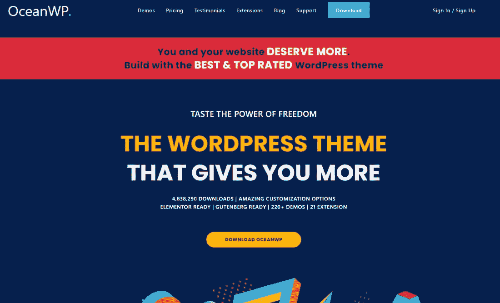

OceanWP.

虽然是一个快速的主题，但 OceanWP 在我们的速度测试中表现不佳，我们将在下面概述。然而，当您实现演示时，主题性能仍然很稳定。

OceanWP 有相当多的扩展，增加了它的可扩展性。例如，你可以添加一个[粘性标题](https://kinsta.com/blog/elementor-sticky-header/)和一个 [Instagram feed](https://kinsta.com/blog/wordpress-instagram-plugin/) 。Woo 弹出菜单是一个不错的选择，白色标签也是一个额外的扩展。

### **定价**

OceanWP 有免费版本供大家下载。

高级版本主要是一个附加站点和持续支持的扩展包。对于代理商来说，起价为每年 43 美元，最高可达每年 127 美元。

### **显著特征**

*   你可以从一长串独特漂亮的演示中挑选一个来设计你的网站。其中一些包括工作室，服装，和活动演示。
*   这是一个[完全响应的主题](https://kinsta.com/blog/web-design-best-practices/#mobile-responsiveness)，在较小的设备上看起来很好，性能也很好。许多主题声称这一点，但并没有实现。
*   主题中内置了翻译工具。
*   OceanWP 主题支持 WooCommerce，[把你的网站变成一个在线商店](https://kinsta.com/blog/wordpress-ecommerce-plugins/)。
*   OceanWP 的一些 WooCommerce 特性包括一个本地购物车弹出窗口、一个浮动的购物车栏和一个快速视图。
*   这个主题很适合流行的页面生成器，比如 King Composer、Elementor 和 Beaver Builder。
*   您可以从许多扩展中进行选择，如弹出通知、Instagram 集成和全屏滚动工具。

### **最快的 WordPress 主题分析**

一开始，OceanWP 似乎比其他的要慢一些，但是这并不意味着你应该忽略它。需要关注的主要领域是移动速度。但是，再次，速度很好，但它看起来有点慢，当与最好的相比。

#### **GTmetrix**

*   **性能得分:** 99%
*   **结构得分:** 95%
*   **最大含量涂料(LCP):** 782ms
*   **总阻塞时间(TBT):**0 毫秒
*   **累计布局偏移(CLS):** 0
*   **满载时间:**990 毫秒

#### **Pingdom**

*   **性能等级:** 91
*   **页面大小:** 303.60 KB
*   **加载时间:**749 毫秒
*   **请求:** 19

#### **PageSpeed Insights(移动版)**

*   **表现得分:** 88
*   **第一个内容油漆:** 3.0s
*   **速度指数:** 3.2s
*   **大容量涂料(LCP):** 3.0s
*   **互动时间(TTI):**3.1 秒
*   **总阻塞时间(TBT):**70 毫秒
*   **累计布局偏移(CLS):** 0.001

#### **PageSpeed Insights(桌面)**

*   **表现得分:** 97
*   **第一次内容油漆:** 0.9s
*   **速度指数:** 1.0s
*   **大容量涂料(LCP):** 1.0s
*   **互动时间(TTI):**0.9 秒
*   **总阻塞时间(TBT):**0 毫秒
*   **累计布局偏移(CLS):** 0

#### **字节检查 TTFB 测试**

*   **到第一个字节的时间:**59 毫秒
*   **总时间:**59 毫秒
*   **割台尺寸:** 450b
*   **请求大小:** 201b

### **测试结论**

OceanWP 的 GTmetrix 性能得分很高，但其 Pingdom 和 PageSpeed Insight 得分低于竞争对手。不过 91，88，97 的分数还是比市面上绝大多数的主题要好，是最快的 WordPress 主题选项之一。

[TTFB 测试](https://kinsta.com/blog/ttfb/#what-is-ttfb)还算体面。

有了 OceanWP，你可能会发现移动设备的加载速度稍慢。希望这在未来会有所改善，使其成为所有设备上的顶级速度主题。

## **6\.** Zakra

Zakra 主题来自 ThemeGrill 的人们，提供了一个具有无限可能性和快速界面的多用途解决方案。该主题是一个快速和安全的选项，有超过 40 个演示，为您的网站创建一个独特的外观。

我们的测试证实，速度的说法事实上是正确的，因为它产生的速度符合行业中的顶级表现。

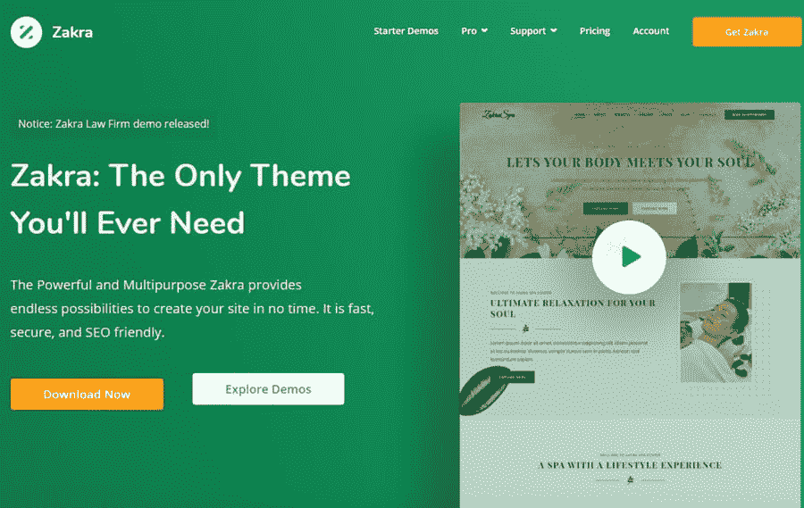

Zakra.

Zakra 是一个具有强大功能的免费主题，但真正的定制能力在高级版本中可用，具有高级标题、WooCommerce 工具和[博客选项](https://kinsta.com/blog/best-blogging-platform/)。

我们最喜欢 Zakra 的一点是，与许多在线免费主题相比，它是如何被很好地记录和支持的。有教程来回答关键问题，如果你找不到什么，可以联系客户支持代表。

### **定价**

免费版当然是免费的。

高级主题售价为每年 69 美元，更高的价格支持在更多网站上安装。你也可以选择每月计划。

### **显著特征**

*   核心主题提供了一个快速可靠的构建，为小型企业生成时尚的网站。
*   从一个集中展示牙医和婚礼主题的演示库中选择。
*   该主题与 Gutenberg 和其他一些页面生成器兼容。
*   它对搜索引擎优化友好，在移动设备上也很好看。
*   由于有多个顶部标题栏、透明标题选项和几个按钮，标题模块功能多样且富有创意。
*   你可以编辑整个菜单，而不需要坚持标准的菜单设置。这包括移动菜单、[下拉菜单](https://kinsta.com/knowledgebase/wordpress-dropdown-menu/)和主菜单定制。
*   借助砖石布局和网格设计来调整你的博客风格。
*   制作多页脚布局，为全角页脚或按钮提供更多列和选项，以便滚动到页面顶部。
*   该主题打包了数百种排版选项。
*   侧栏非常灵活。

### **最快的 WordPress 主题分析**

我们喜欢 Zakra 的设计和速度。尤其是当涉及到移动速度和较低的请求计数时。

#### **GTmetrix**

*   **性能得分:** 100%
*   **结构得分:** 98%
*   **最大含量涂料(LCP):** 523ms
*   **总阻塞时间(TBT):**0 毫秒
*   **累计布局偏移(CLS):** 0
*   **满载时间:**661 毫秒

#### **Pingdom**

*   **性能等级:** 96
*   **页面大小:** 58.90 KB
*   **加载时间:**519 毫秒
*   **请求:** 10

#### **PageSpeed Insights(移动版)**

*   **表现得分:** 99
*   **第一个内容油漆:** 1.5s
*   **速度指数:** 1.8s
*   **大容量涂料(LCP):** 1.6s
*   **互动时间(TTI):**1.5 秒
*   **总阻塞时间(TBT):**0 毫秒
*   **累计布局偏移(CLS):** 0

#### **PageSpeed Insights(桌面)**

*   **绩效得分:** 100
*   **第一次内容油漆:** 0.5s
*   **速度指数:** 0.7s
*   **大容量涂料(LCP):** 0.5s
*   **互动时间(TTI):**0.5 秒
*   **总阻塞时间(TBT):**0 毫秒
*   **累计布局偏移(CLS):** 0

#### **字节检查 TTFB 测试**

*   **到达第一个字节的时间:**60 毫秒
*   **总时间:**60 毫秒
*   **割台尺寸:** 450b
*   **请求大小:** 201b

### **测试结论**

Zakra 测试显示了全面的稳定分数，其中 GTmetrix 性能分数和满载时间是显著的成功。第一个主题项目出现并开始互动需要不到 2 秒的时间。总的来说，它在本文中处于中间位置。

## 7 .**。**自定义

自定义主题是另一个可以考虑的最快的 WordPress 主题选项，主要是因为我们的速度测试呈现了出色的结果，但也因为主题有改变网站每个部分的设置。

快速的性能归功于主题文件的优化和轻量级特性。同时，定制方面通过页眉和页脚构建器、演示导入以及与页面构建器的集成来完成。

Customify.

PressMaximum 开发人员提供了一个免费主题下载的网站，并补充了一组网站演示以供导入。这些类别包括投资组合、电子商务、小企业和[非营利网站](https://kinsta.com/blog/wordpress-for-nonprofits/)的选项。

您还可以找到主要为 Beaver Builder 和 Elementor 制作的演示，这是市场上最流行的两个页面生成器。PressMaximum 网站上的客户支持和文档是高质量的，您可以升级到主题的专业版，以获得无数的高级功能。

专业功能包括透明标题，不同的博客布局和自定义字体。

### **定价**

核心版是免费的。

[Pro 升级版](https://pressmaximum.com/customify/pro-upgrade/)起价为每年 59 美元，提供一整年的更新和支持。商业捆绑包支持三个站点，每年 89 美元，代理捆绑包支持无限站点，每年 129 美元。

此外，续订折扣通常每年都会提供。

### **显著特征**

*   Customify 主题是一个多功能主题，可以灵活地设计任何类型的网站。
*   它集成了像 Beaver Builder 和 Elementor 这样的顶级页面构建器，最大限度地减少了对代码的需求。
*   该主题集成了许多必备插件，如 OrbitFox、Yoast、 [BuddyPress](https://kinsta.com/blog/wordpress-forum-plugins/#buddypress) 和 bbPress。
*   WooCommerce 的整合非常顺利，添加了其他元素，增强了任何电子商务商店的功能。
*   您可以无限制地接收页脚和页眉生成器。
*   这个主题的速度和轻量级的特性提高了它的搜索引擎优化。
*   您会收到自定义菜单、灵活的标题和多个要调整的列。
*   您可以在仪表板中导入演示。这些演示涵盖了从在线服装店到律师网站的各个行业。
*   为移动设备提供了唯一的报头。
*   您可以对网站的移动版本进行编辑，而无需调整桌面版本上的项目。
*   该主题有无限的[排版设置](https://kinsta.com/blog/wordpress-fonts/)和独特的页面和帖子布局。
*   专业版提供粘性标题功能。
*   有多个附加功能，可以拥有多个标题、大型菜单和高级样式。
*   无限滚动和滚动到顶部功能增加了它的易用性。
*   这是一个开发人员友好的主题，允许高级挂钩和代码定制。
*   一些高级构建器和“助推器”与 Pro 版本一起提供，包括 WooCommerce 助推器、WC 产品画廊、滑块附件和电子商务商店的画布过滤器。

### **最快的 WordPress 主题分析**

定制也很难被击败。你会发现这个主题的加载时间不到 2 秒。

#### **GTmetrix**

*   **性能得分:** 100%
*   **结构得分:** 98%
*   **最大含量涂料(LCP):** 617ms
*   **总阻塞时间(TBT):**0 毫秒
*   **累计布局偏移(CLS):** 0

#### **Pingdom**

*   **性能等级:** 97
*   **页面大小:** 145.90 KB
*   **加载时间:**974 毫秒
*   **请求:** 8

#### **PageSpeed Insights(移动版)**

*   **表现得分:** 98
*   **第一个内容油漆:** 1.6s
*   **速度指数:** 2.0s
*   **大容量涂料(LCP):** 1.6s
*   **互动时间(TTI):**1.6 秒
*   **总阻塞时间(TBT):**100 毫秒
*   **累计布局偏移(CLS):** 0.001

#### **页面速度洞察(桌面)**

*   **绩效得分:** 100
*   **第一次内容油漆:** 0.5s
*   **速度指数:** 0.7s
*   **大容量涂料(LCP):** 0.5s
*   **互动时间(TTI):**0.5 秒
*   **总阻塞时间(TBT):**0 毫秒
*   **累计布局偏移(CLS):** 0

#### **字节检查 TTFB 测试**

*   **到达第一个字节的时间:**52 毫秒
*   **总时间:**52 毫秒
*   **割台尺寸:** 450b
*   **请求大小:** 201b

### **测试结论**

下面是另一个高分的发电站主题。然而，在 100 毫秒时，它的总阻塞时间是所有测试主题中最差的。很高兴看到这些请求与其他快速 WordPress 主题选项一致，并且页面大小不是一个大问题。

## **8。**二十个**二十个**

Twenty Twenty 是每个 WordPress 版本安装的默认主题。这个主题每年都会发布一个新版本，从技术上来说它们是不同的，因为你仍然可以安装[2019](https://kinsta.com/blog/twenty-nineteen-theme/)和其他过去的主题版本。

这个 WordPress 默认主题是由 WordPress 社区的一个现有主题组成的，它主要关注于与 Gutenberg builder 的良好集成。默认的 WordPress 主题(不管是哪一年的)一直是最快的 WordPress 主题选项之一，因为它有纤细的文件结构，可靠的代码，而且它被认为是最好的。

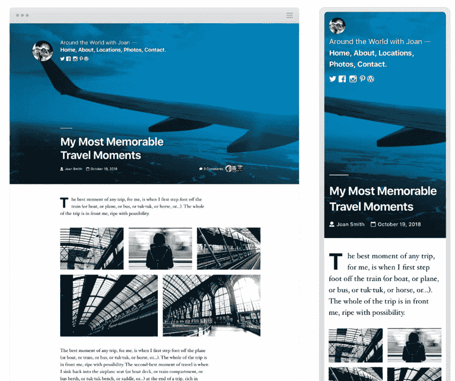

Twenty Twenty.

Twenty Twenty WordPress 主题在速度测试中表现强劲，正如预期的那样。该主题以其页面生成器的灵活性和无尽的布局而闻名，尤其是对于博客而言。

对于那些试图建立个人或专业博客的人来说，这是一个很受欢迎的选择，有越来越先进的排版选项、格式设置和背景颜色。

将它与 Gutenberg 或 Elementor 这样的页面生成器结合起来，就可以知道你的主题在速度上不会引起任何问题。

### **定价**

所有过去、现在和未来的默认 WordPress 主题，包括 Twenty Twenty，都是完全[免费使用](https://wordpress.org/themes/twentytwenty/)。

### **显著特征**

*   Twenty Twenty 以每年接近 100 秒的稳定速度分数而自豪。文件大小和请求也非常低。
*   这个主题是为 WordPress 的最新版本设计的，所以它经常被吹捧为与 WordPress 完美集成，消除了你可能在第三方主题中发现的速度和冲突问题。
*   [Twenty Twenty 以卓别林](https://kinsta.com/blog/twenty-twenty-theme/#intro)为原型，主题灵活性高，支持极致定制。
*   您将获得独特的工具，如编辑器样式、字体、颜色和无限滚动。
*   Gutenberg 的块编辑器支持主要是在那里，但也有可能与页面生成器集成，如 Elementor 和 Beaver Builder。
*   该主题已为移动设备准备就绪，具有令人惊叹的属性和高度用户友好的元素，可适应每种设备大小。
*   你可以用这个主题快速制作登陆页面。
*   它提供了广泛的排版选项。
*   博客界面和定制工具是一流的，有布局、边栏、排版调整和更多选项。
*   内容编辑器提供了在发布前所做更改的实时视图。

### **最快的 WordPress 主题分析**

220 是世界上最快的主题吗？不，但是很接近了。很高兴看到 WordPress 的一个默认主题不仅仅是为了展示。

## 注册订阅时事通讯

### 想知道我们是怎么让流量增长超过 1000%的吗？

加入 20，000 多名获得我们每周时事通讯和内部消息的人的行列吧！

[Subscribe Now](#newsletter)

#### **GTmetrix**

*   **性能得分:** 100%
*   **结构评分:** 97%
*   **最大含量涂料(LCP):**651 毫秒
*   **总阻塞时间(TBT):**0 毫秒
*   **累计布局偏移(CLS):** 0
*   **满载时间:**1000 毫秒

#### **Pingdom**

*   **性能等级:** 97
*   **页面大小:** 66 KB
*   **加载时间:**323 毫秒
*   **请求:** 7

#### **PageSpeed Insights(移动版)**

*   **绩效得分:** 100
*   **第一幅内容丰富的画:** 1.1s
*   **速度指数:** 1.4s
*   **大容量涂料(LCP):** 1.3s
*   **互动时间(TTI):** 1.1s
*   **总阻塞时间(TBT):**0 毫秒
*   **累计布局偏移(CLS):** 0.003

#### **PageSpeed Insights(桌面)**

*   **绩效得分:** 100
*   **第一个内容油漆:** 0.4s
*   **速度指数:** 0.5s
*   **大容量涂料(LCP):** 0.5s
*   **互动时间(TTI):**0.5 秒
*   **总阻塞时间(TBT):** 0
*   **累计布局偏移(CLS):** 0.001

#### **字节检查 TTFB 测试**

*   **到达第一个字节的时间:**78 毫秒
*   **总时间:**78 毫秒
*   **割台尺寸:** 450b
*   **请求大小:** 201b

### **测试结论**

尽管 Twenty Twenty 主题并不是许多开发者的首选，但由于其“股票 WordPress 主题”的名声，我们仍然喜欢看到自动化开发者为想要免费主题的用户保留并改进这一瑰宝。

100，97，100，100 看起来是一个胜利的分数组合，页面大小更是令人印象深刻。令人惊讶的是，它在 GTmetrix 中获得了最差的加载时间，但在 Pingdom 中获得了最佳加载时间。

TTFB 测试似乎比我们预期的要高一点，但这没什么可强调的。这使得 Twenty Twenty 成为一个可靠的 WordPress 主题。

## **9。**反应灵敏

响应主题以极快的速度出现。这也是一个值得为任何行业建立网站的主题。博客功能脱颖而出，它的 40 多个演示网站文件可供您安装完整的网站功能，包括[旅游网站](https://kinsta.com/blog/how-to-start-a-travel-blog/)，小企业展示，以及[作品集](https://kinsta.com/blog/portfolio-website/)。

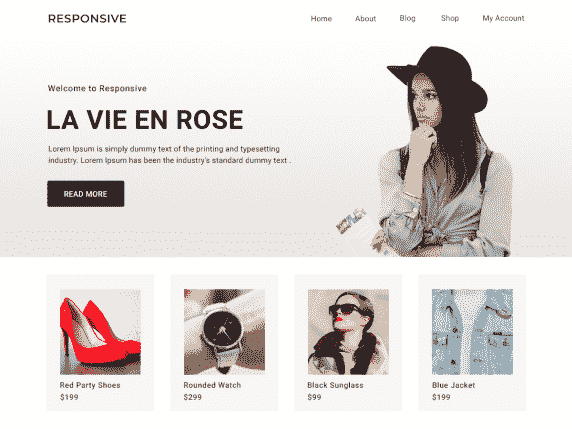

Responsive.

这些演示是为 Gutenberg 和 Elementor 准备的，它们都可以在移动设备上很好地运行，并且具有干净的代码和低调的文件，不会与[插件](https://kinsta.com/best-wordpress-plugins/)冲突。

### **定价**

核心的响应式主题是完全免费的，甚至对于大多数演示来说也是如此。

不过有一个 [Pro 版](https://cyberchimps.com/responsive-go-pro/)。他们在一个网站上以每年 47 美元的价格出售他们的个人计划。商业计划书的价格是每年 67 美元，专业版是每年 97 美元。一些额外的功能包括自动更新，交互式传送带，视频教程，价格表和投资组合部件。

### **显著特征**

*   速度测试产生持续的高分，主题中内置了 SEO 元素来补充速度。
*   这是一个响应式主题，在所有设备上都很好看。
*   您可以集成流行的页面生成器。一些演示是为 Elementor 和 Gutenberg 制作的，但它们也与视觉作曲家、Brizi、Divi 等一起工作。
*   集成像 WooCommerce 和 WPML 这样的顶级插件。
*   创建一个与 BuddyPress 和 bbPress 流畅集成的社区网站。
*   主题是完全可定制的，按钮、颜色和布局与您的品牌相匹配。
*   主题突出了定制排版的机会，有样式选项、[系统字体](https://kinsta.com/blog/how-to-change-font-in-wordpress/)和[谷歌字体](https://kinsta.com/blog/best-google-fonts/)。
*   相当多的 WooCommerce 选项被嵌入到主题中，比如自定义布局、颜色和产品图片的快速浏览。
*   专业版为 WooCommerce 提供了无限的颜色选项、页眉/页脚布局和扩展工具。

### **最快的 WordPress 主题分析**

Responsive 的页面加载速度惊人地快。考虑到主题的名称，移动结果很有趣。

#### **GTmetrix**

*   **性能得分:** 100%
*   **结构得分:** 96%
*   **最大含量涂料(LCP):** 560ms
*   **总阻塞时间(TBT):**0 毫秒
*   **累计布局偏移(CLS):** 0
*   **满载时间:**865 毫秒

#### **Pingdom**

*   **性能等级:** 95
*   **页面大小:** 132.40 KB
*   **加载时间:**629 毫秒
*   请求: 11

#### **PageSpeed Insights(移动版)**

*   **表现得分:** 98
*   **第一幅内容丰富的画:** 1.9s
*   **速度指数:** 2.4s
*   **大容量涂料(LCP):** 2.0s
*   **互动时间(TTI):**1.9 秒
*   **总阻塞时间(TBT):** 10ms
*   **累计布局偏移(CLS):** 0.001

#### **PageSpeed Insights(桌面)**

*   **表现得分:** 99
*   **第一次内容油漆:** 0.6s
*   **速度指数:** 0.8s
*   **大容量涂料(LCP):** 0.7s
*   **互动时间(TTI):**0.6 秒
*   **总阻塞时间(TBT):**0 毫秒
*   **累计布局偏移(CLS):** 0

#### **字节检查 TTFB 测试**

*   **到达第一个字节的时间:**53 毫秒
*   **总时间:**53 毫秒
*   **割台尺寸:** 450b
*   **请求大小:** 201b

### **测试结论**

虽然不是最好的，但很高兴看到一个名为 Responsive 的主题在 PageSpeed Insights 移动测试中表现良好。对于移动设备上的主题来说,[加载时间](https://kinsta.com/blog/wordpress-caching-plugins/)还不错，在桌面上它们会进一步改善。

对于这些分数没有什么可担心的，因为请求很低，加载时间很快，页面大小一点也不不足。

## 10。悉尼

来自 aThemes 的悉尼主题是为需要快速简约设计的小企业和 T2 自由职业者设计的。该主题与 Elementor 兼容，提供了完整的布局控制，并且在我们的速度测试中表现良好。

对于那些需要保持网站低成本，但又担心最终产品无用的小企业主来说，悉尼是一个真正的福音。悉尼通过提供简单的网站建设过程和广泛的设置来扩展其已经强大的布局，从而挽救了这些企业主。

Sydney.

悉尼是一个响应式主题，在较小的设备上看起来不错。它还允许在主题定制器中通过快速设置更改来定制博客和首页。

我们喜欢谷歌字体访问，以及自定义元素或块。这个列表还包括:视差背景、[滑动图片标题](https://kinsta.com/blog/wordpress-slider/)和[社交按钮](https://kinsta.com/blog/wordpress-social-media-plugins/)。悉尼更像是一个免费赠送的高级主题。这很好，因为你几乎可以免费获得高级功能，但在专业版中有更多值得期待的。

### **定价**

作为一个免费的主题下载，Sydney 还提供了一个价格为 69 美元的专业版。

专业主题包括额外的网页模板，你选择的标题，以及许多其他功能，以扩展你的网站建设过程。同样值得一提的是，专业版为您提供了持续的支持和主题更新。

### **显著特征**

*   该主题在速度测试中表现良好，具有小文件大小和 SEO 以及以移动为中心的方法。
*   主题是为适应不同的语言做好翻译准备。Live Customizer 非常适合实时查看更改并在发布前进行预览。
*   几个社交媒体按钮允许链接到您的社交账户。
*   该主题包括一个添加视差背景的设置，这是一个简单的方法来给图像添加视觉效果，而不会因为一些沉闷的东西而减慢你的站点。
*   相当多的自定义元素或块带有悉尼主题。
*   主题选项通过颜色、字体和博客布局设置最大化了您的定制机会。
*   aThemes 客户支持团队受到高度重视，在线文档也是一流的。
*   升级到专业版时，您会得到不同的页面模板和元素块。例如，premium Elementor 块包括时间表、[价格表](https://kinsta.com/blog/wordpress-pricing-table-plugins/)和新员工部分。
*   WooCommerce 的一些特性是悉尼主题所独有的。例如，主题提供了[结账模块](https://kinsta.com/learn/woocommerce-guide/#optimize-checkout-process)和产品预览工具。
*   您可以通过点击按钮将视频添加到您的网站标题中。
*   页脚[联系表格](https://kinsta.com/blog/wordpress-contact-form-plugins/)也是悉尼独有的，允许你从潜在客户或顾客那里收集信息。

### **最快的 WordPress 主题分析**

Sydney 在这个列表中不是表现最好的，但它仍然值得一提，因为它的分数高，请求数低，文件小。

#### **GTmetrix**

*   **性能得分:** 100%
*   **结构得分:** 98%
*   **最大含量涂料(LCP):** 502ms
*   **总阻塞时间(TBT):**0 毫秒
*   **累计布局偏移(CLS):** 0
*   **满载时间:**655 毫秒

#### **Pingdom**

*   **性能等级:** 97
*   **页面大小:** 63.90 KB
*   **加载时间:**660 毫秒
*   **请求:** 7

#### **PageSpeed Insights(移动版)**

*   **表现得分:** 99
*   **第一个内容油漆:** 1.6s
*   **速度指数:** 2.1s
*   **大容量涂料(LCP):** 1.6s
*   **互动时间(TTI):**1.6 秒
*   **总阻塞时间(TBT):**70 毫秒
*   **累计布局偏移(CLS):** 0

#### **PageSpeed Insights(桌面)**

*   **绩效得分:** 100
*   **第一个内容油漆:** 0.4s
*   **速度指数:** 0.7s
*   **大容量涂料(LCP):** 0.5s
*   **互动时间(TTI):**0.4 秒
*   **总阻塞时间(TBT):**0 毫秒
*   **累计布局偏移(CLS):** 0

#### **字节检查 TTFB 测试**

*   **到达第一个字节的时间:**52 毫秒
*   **总时间:**52 毫秒
*   **割台尺寸:** 450b
*   **请求大小:** 201b

### **测试结论**

悉尼在各方面都得到了不错的分数，把它放在这里作为最快的 WordPress 主题选项之一。它的 PageSpeed 分数与顶级性能的分数相当，100%的 GTmetrix 性能分数没有什么可嘲笑的。

总的页面大小也很小，请求也是第二少的。

总的来说，悉尼是一个有很多用途的固体主题。这只是一个额外的收获，你可以在主题中得到一个组织整齐的文件系统，以获得更快的速度。

## 11.空白画布

空白画布(Blank Canvas)是单页网站的免费极简主义主题。这是 Seedlet 的一个子主题，Automattic 的另一个免费主题。

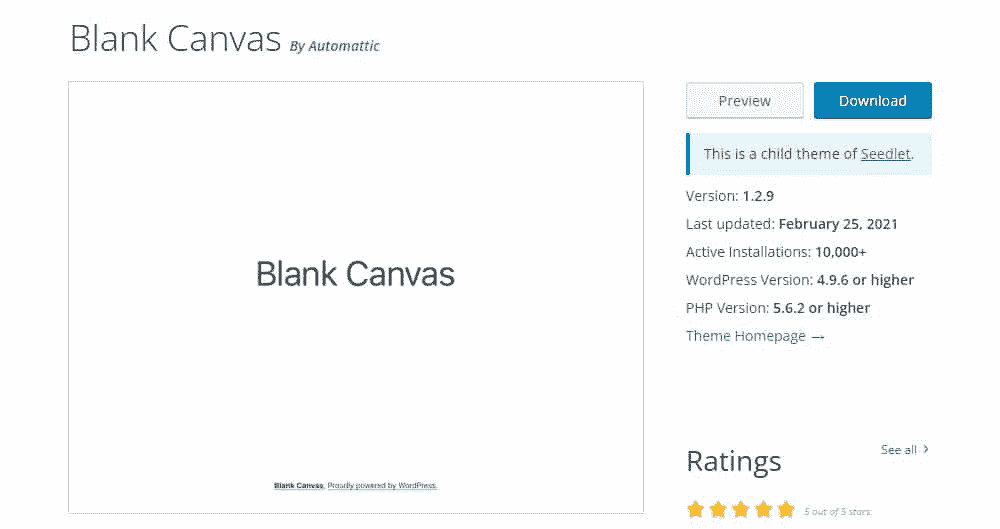

Blank Canvas.

默认情况下，它的文章和页面布局是完全空白的——没有标题、导航菜单或小部件。你在 WordPress 编辑器中设计的页面和你在前台看到的是一样的。因此，它不包括任何演示。

### **定价**

空白画布是 Automattic 的免费主题。你可以使用它的个人和专业网站，无需任何许可。

### **显著特征**

*   顾名思义，Blank Canvas 就是一块空白的画布，可以满足您所有的定制需求。
*   默认情况下没有任何多余的东西，甚至没有页眉、导航菜单、页脚或其他小部件。
*   如果你打算从头开始制作你的主题，从空白画布开始会有很大的帮助。
*   默认样式依赖于简单的无衬线字体和微妙的蓝色高光。

### **最快的 WordPress 主题分析**

空白画布在我们所有的速度测试中表现异常出色。让我们看看它是如何坚持的！

厌倦了你的 WordPress 站点缓慢的主机？我们提供超快的服务器和来自 WordPress 专家的 24/7 世界级支持。[查看我们的计划](https://kinsta.com/plans/?in-article-cta)

#### **GTmetrix**

*   **性能得分:** 100%
*   **结构得分:** 94%
*   **最大含量涂料(LCP):** 405ms
*   **总阻塞时间(TBT):**0 毫秒
*   **累计布局偏移(CLS):** 0
*   **满载时间:**516 毫秒

#### **Pingdom**

*   **性能等级:** 92
*   **页面大小:** 58.30 KB
*   **加载时间:**541 毫秒
*   **请求:** 10

#### **PageSpeed Insights(移动版)**

*   **表现得分:** 99
*   **第一个内容油漆:** 1.6s
*   **速度指数:** 1.9s
*   **大容量涂料(LCP):** 1.8s
*   **互动时间(TTI):**1.6 秒
*   **总阻塞时间(TBT):**0 毫秒
*   **累计布局偏移(CLS):** 0

#### **PageSpeed Insights(桌面)**

*   **绩效得分:** 100
*   **第一次内容油漆:** 0.5s
*   **速度指数:** 0.7s
*   **大容量涂料(LCP):** 0.6s
*   **互动时间(TTI):**0.5 秒
*   **总阻塞时间(TBT):**0 毫秒
*   **累计布局偏移(CLS):** 0

#### **字节检查 TTFB 测试**

*   **到达第一个字节的时间:**67 毫秒
*   总时间:67 毫秒
*   **割台尺寸:** 450b
*   **请求大小:** 201b

### **测试结论**

Blank Canvas 在 GTmetrix 测试中表现出色，几乎超越了所有指标。然而，它的结构得分是所有得分中最低的。它的 Pingdom 评分为 90+，但仍低于竞争对手。同样，它的其他分数也很优秀，但没什么好讨论的。

## 12.去

GoDaddy 将自己标榜为“一个创新的、古腾堡第一的 WordPress 主题”，在很多方面都是如此。它的主要焦点是帮助用户在古腾堡积木的帮助下建立简单的商业网站。

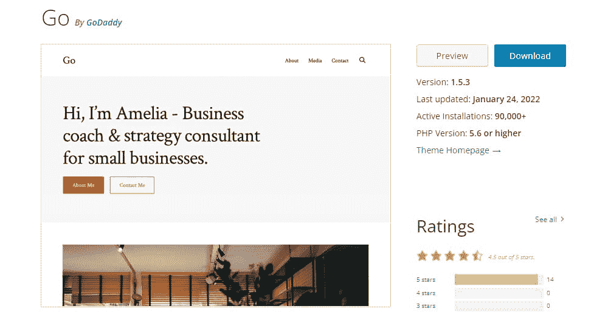

Go.

Go 的真正强大之处在于基于块的 [CoBlocks 页面构建器插件](https://wordpress.org/plugins/coblocks/)，它可以帮助你一次一个块地创建网站。在撰写本文时，它提供了 37 个不同用途的模块，如作者简介、石工画廊、服务、价格表、地图、社交分享、活动、常见问题解答等等。

你也可以从它的各种演示中选择一个来立即设置你的基本站点。

### **定价**

Go 作为免费主题下载提供，完全免费使用。

### **显著特征**

*   对于那些想使用 WordPress 块编辑器作为页面生成器的人来说，Go 主题是理想的。
*   该主题带有大量定制选项，以提供额外的灵活性。
*   Go 展示了它的伙伴 CoBlocks 页面生成器插件，它是 WordPress 的块编辑器和其他全功能页面生成器之间的中间地带。
*   该主题使用最少的 JavaScript 和 PHP 代码，严重依赖 HTML 和 CSS。

### **最快的 WordPress 主题分析**

对于一个快速的 WordPress 站点，Go 可以作为你的首选策略吗？是时候一探究竟了！

#### **GTmetrix**

*   **性能得分:** 100%
*   **结构得分:** 99%
*   **最大含量涂料(LCP):** 546ms
*   **总阻塞时间(TBT):**0 毫秒
*   **累计布局偏移(CLS):** 0
*   **满载时间:**712 毫秒

#### **Pingdom**

*   **性能等级:** 94
*   **页面大小:** 139.40 KB
*   **加载时间:**520 毫秒
*   请求数: 12

#### **PageSpeed Insights(移动版)**

*   **表现得分:** 94
*   **第一个内容油漆:** 2.4s
*   **速度指数:** 2.4s
*   **大容量涂料(LCP):** 2.5s
*   **互动时间(TTI):**2.4 秒
*   **总阻塞时间(TBT):**0 毫秒
*   **累计布局偏移(CLS):** 0.003

#### **PageSpeed Insights(桌面)**

*   **表现得分:** 99
*   **第一次内容油漆:** 0.7s
*   **速度指数:** 0.8s
*   **大容量涂料(LCP):** 0.7s
*   **互动时间(TTI):**0 毫秒
*   **总阻塞时间(TBT):**0 毫秒
*   **累计布局偏移(CLS):** 0

#### **字节检查 TTFB 测试**

*   **到达第一个字节的时间:**65 毫秒
*   **总时间:**65 毫秒
*   **割台尺寸:** 450b
*   **请求大小:** 201b

### **测试结论**

Go 产生了很高的 GTmetrix 性能分数。然而，它的 Pingdom 性能等级和 PageSpeed Insights 移动评分在竞争中处于低端。该主题的 TTFB 也是第二差的，但仍低于 70 毫秒。因此，它在我们的测试中赢得了一席之地。

## 13.赫斯缇雅

来自 Neve 的制作者，[赫斯缇雅](https://themeisle.com/themes/hestia/)是来自 Themeisle 的另一个独特主题。这是一个现代的单页主题，旨在帮助您为任何企业建立一个网站。

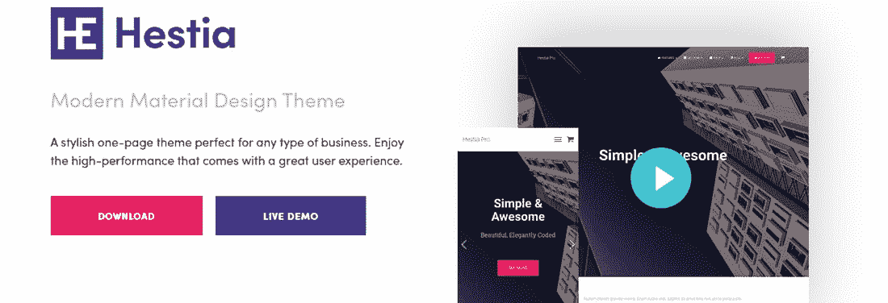

Hestia.

赫斯缇雅从一开始就是为性能和用户体验而构建的。它还支持 WooCommerce，因此您可以快速、轻松地建立并运行您的在线商店。

### **定价**

赫斯缇雅是一个高级主题，但你可以访问他们的网站，进行主题的试驾。

它的个人执照每年 80 美元，而营业执照每年 150 美元(通常是打折的)。如果你计划在多个网站上使用它，你也可以选择它的代理计划，费用为 347 美元/年。

商业计划包括起步点和优先支持。赫斯缇雅的代理计划包括上述所有内容，并增加了白标和实时聊天支持。

### **显著特征**

*   赫斯缇雅是翻译和 RTL 准备好了，所以你可以建立一个多种语言的网站。这个主题的每个元素都可以用插件翻译(Weglot 插件官方支持)。你也可以使用任何 RTL 语言。
*   该主题是搜索引擎优化友好的，因为它带有搜索引擎优化就绪的结构和干净，优化的代码。这意味着谷歌会喜欢你的网站。
*   您可以使用它的实时定制器来微调您的网站的外观，并立即看到变化。
*   赫斯缇雅包括视频教程来指导你建立你的 WordPress 网站。
*   该主题支持几乎所有主要的页面生成器，包括新的 WordPress 编辑器 Gutenberg。
*   赫斯缇雅包括一个反应灵敏，用户友好的大菜单。使用它，您可以轻松地安排和组织您的子菜单内容。此外，您可以完全控制菜单的设计和结构。
*   作为一个高级主题，它附带了一些有用的功能，如一键更新和支持。

### **最快的 WordPress 主题分析**

赫斯缇雅能勇敢地面对它兄弟 Neve 吗？让我们检查它的统计数据！

#### **GTmetrix**

*   **性能得分:** 100%
*   **结构得分:** 95%
*   **最大含量涂料(LCP):** 665ms
*   **总阻塞时间(TBT):**0 毫秒
*   **累计布局偏移(CLS):** 0.01
*   **满载时间:**883 毫秒

#### **Pingdom**

*   **性能等级:** 92
*   **页面大小:** 218.30 KB
*   **加载时间:**564 毫秒
*   **请求:** 18

#### **PageSpeed Insights(移动版)**

*   **表现得分:** 88
*   **第一个内容油漆:** 3.0s
*   **速度指数:** 3.0s
*   **大容量涂料(LCP):** 3.0s
*   **互动时间(TTI):**3.0 秒
*   **总阻塞时间(TBT):**0 毫秒
*   **累计布局偏移(CLS):** 0.007

#### **PageSpeed Insights(桌面)**

*   **表现得分:** 99
*   **第一次内容油漆:** 0.8s
*   **速度指数:** 0.8s
*   **大容量涂料(LCP):** 0.9s
*   **互动时间(TTI):**0.8 秒
*   **总阻塞时间(TBT):**0 毫秒
*   **累计布局偏移(CLS):** 0.011

#### **字节检查 TTFB 测试**

*   **到达第一个字节的时间:**54 毫秒
*   **总时间:**54 毫秒
*   **割台尺寸:** 450b
*   **请求大小:** 201b

### **测试结论**

赫斯缇雅在 GTmetrix 性能测试中获得了满分 100 分。然而，它的 Pingdom 等级 92 比竞争对手低一点。甚至它的要求也偏高。它的 PageSpeed Insights 移动测试也没什么好谈的。

与我们测试过的最快的主题之一 Neve 相比，赫斯缇雅还差得远。然而，当你考虑到大部分的主题时，它仍然是一个引人注目的作品，在我们的列表中赢得一席之地。

## 14.大众外汇

PopularFX 是一个简单而强大的主题，几乎可以构建任何类型的网站。它配有一个页面生成器，可以快速方便地可视化构建网站。

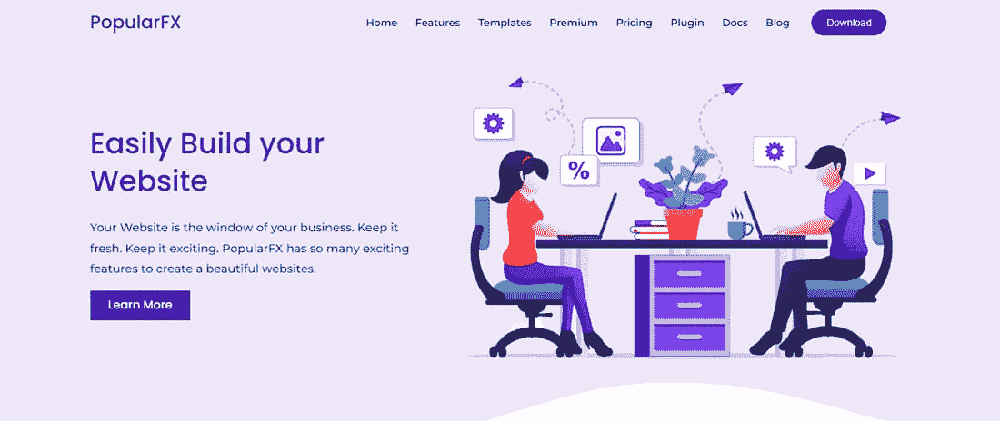

PopularFX.

这是一个完全响应的主题，集成了谷歌字体和先进的排版功能。他们的网站包括多个模板，帮助您快速发现和设置各种网站。

### **定价**

作为免费主题下载，PopularFX 还提供了一个起价为 59 美元/年(个人许可)的 [Pro 版本](https://athemes.com/theme/sydney-pro/)。专业和商业执照的费用分别为 89 美元/年和 249 美元/年。

专业主题包括更多的模板，Pagelayer Pro，50 多个专业部件，以及一年的支持和主题更新。

### **显著特征**

*   流行的 FX 包括拖放功能，通过拖动部件来帮助你设计你的页面。
*   该主题包括在线编辑，通过点击任何文本来添加/删除文本。
*   PopularFX 允许您为页面元素添加视觉效果。您可以将它设置为在所述元素可见时触发。
*   该主题包括修订控制，帮助您撤销，重做，或恢复旧版本的主题。
*   PopularFX 通过它的几个小部件完全可定制，帮助你设计具有不同选项的页面，如字体颜色、大小、动画、间距等。

### **最快的 WordPress 主题分析**

PopularFX 经得起更流行的 WordPress 主题吗？让我们来了解一下！

#### **GTmetrix**

*   **性能得分:** 100%
*   **结构评分:** 97%
*   **最大含量涂料(LCP):** 527ms
*   **总阻塞时间(TBT):**0 毫秒
*   **累计布局偏移(CLS):** 0
*   **满载时间:**638 毫秒

#### **Pingdom**

*   **性能等级:** 96
*   **页面大小:** 79.10 KB
*   **加载时间:**980 毫秒
*   **请求:** 8

#### **PageSpeed Insights(移动版)**

*   **表现得分:** 99
*   **第一个内容油漆:** 1.8s
*   **速度指数:** 1.8s
*   **大容量涂料(LCP):** 1.8s
*   **互动时间(TTI):**1.8 秒
*   **总阻塞时间(TBT):**0 毫秒
*   **累计布局偏移(CLS)** : 0

#### **PageSpeed Insights(桌面)**

*   **绩效得分:** 100
*   **第一次内容油漆:** 0.5s
*   **速度指数:** 0.8s
*   **大容量涂料(LCP):** 0.5s
*   **互动时间(TTI):**0.5 秒
*   **总阻塞时间(TBT):**0 毫秒
*   **累计布局偏移(CLS):** 0

#### **字节检查 TTFB 测试**

*   **到达第一个字节的时间:**61 毫秒
*   **总时间:**61 毫秒
*   **割台尺寸:** 450b
*   **请求大小:** 201b

### **测试结论**

PopularFX 获得了令人印象深刻的 100% GTmetrix 性能分数。它的 PageSpeed Insights 性能得分 99 和 100 也非常出色。主题的 Pingdom 等级也高于平均水平。如果您喜欢使用拖放窗口小部件，请尝试一下 PopularFX！

## 15.二十点二十一分

二十个二十一个是 WordPress 5.6 的默认主题。像它的前身一样，这是一个极简主义的主题，作为一个高度可定制的空白画布。

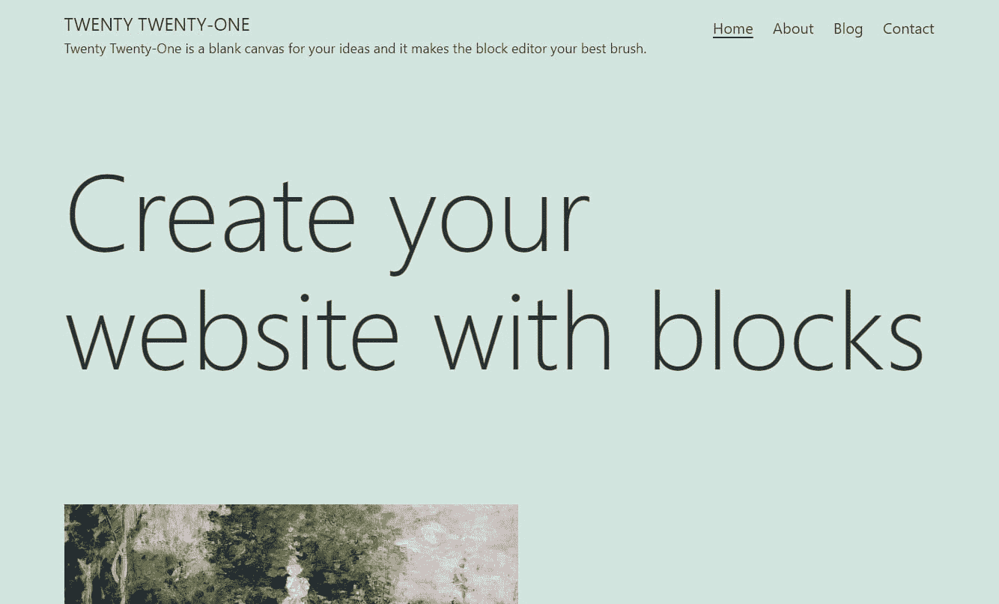

Twenty Twenty-One.

这个主题支持几个特性，包括自动链接、响应嵌入、自定义背景等等。

#### **定价**

221 是一个免费的 WordPress 主题。

#### **显著特征**

*   主题充当你的站点的空白画布，块编辑器作为它的画笔。
*   包括新的块模式，以创建更有影响力的布局。
*   221 包括完整的块编辑器支持。
*   您可以设置自定义背景颜色，包括符合 AAA 标准的一系列预选调色板。
*   支持黑暗模式。
*   您可以在页脚的网站内容下方添加小部件。
*   使用块编辑器来添加内容到您的主页很容易。
*   你可以从网站后端添加网站标志和社交图标。

有关其功能的完整列表，请访问我们的[深度 221 主题帖子](https://kinsta.com/blog/twenty-twenty-one-theme/)。

### **最快的 WordPress 主题分析**

221 有大鞋子要穿。会吗？让我们看看！

#### **GTmetrix**

*   **性能得分:** 100%
*   **结构得分:** 99%
*   **最大含量涂料(LCP):** 550ms
*   **总阻塞时间(TBT):**0 毫秒
*   **累计布局偏移(CLS):** 0
*   **满载时间:**670 毫秒

#### **Pingdom**

*   **性能等级:** 97
*   **页面大小:** 56.70 KB
*   **加载时间:**667 毫秒
*   **请求:** 7

#### **PageSpeed Insights(移动版)**

*   **绩效得分:** 100
*   **第一次内容丰富的绘画:** 1.3s
*   **速度指数:** 1.7s
*   **大容量涂料(LCP):** 1.5s
*   **互动时间(TTI):**1.3 秒
*   **总阻塞时间(TBT):**0 毫秒
*   **累计布局偏移(CLS):** 0

#### **PageSpeed Insights(桌面)**

*   **绩效得分:** 100
*   **第一个内容油漆:** 0.4s
*   **速度指数:** 0.5s
*   **大容量涂料(LCP):** 0.5s
*   **互动时间(TTI):**0.4 秒
*   **总阻塞时间(TBT):**0 毫秒
*   **累计布局偏移(CLS):** 0

#### **字节检查 TTFB 测试**

*   **到达第一个字节的时间:**42 毫秒
*   **总时间:**42 毫秒
*   **割台尺寸:** 450b
*   **请求大小:** 201b

### **测试结论**

221 名副其实，在所有测试中都表现出色。它在我们测试的所有主题中得分最高。其 99%的 GTmetrix 结构分数是最高的，其完美的 PageSpeed Insights 分数在移动和桌面上都是最高的。它的 TTFB 只有 42 毫秒，非常出色。

## 16.二十点二十二分

[二十二十二](https://kinsta.com/blog/twenty-twenty-two-theme/)是与 [WordPress 5.9](https://make.wordpress.org/core/5-9/) 一起推出的默认 WordPress 主题。它被设计成一个灵活的、轻量级的、可定制的默认主题，为测试块、模式和模板提供了一个极好的平台。

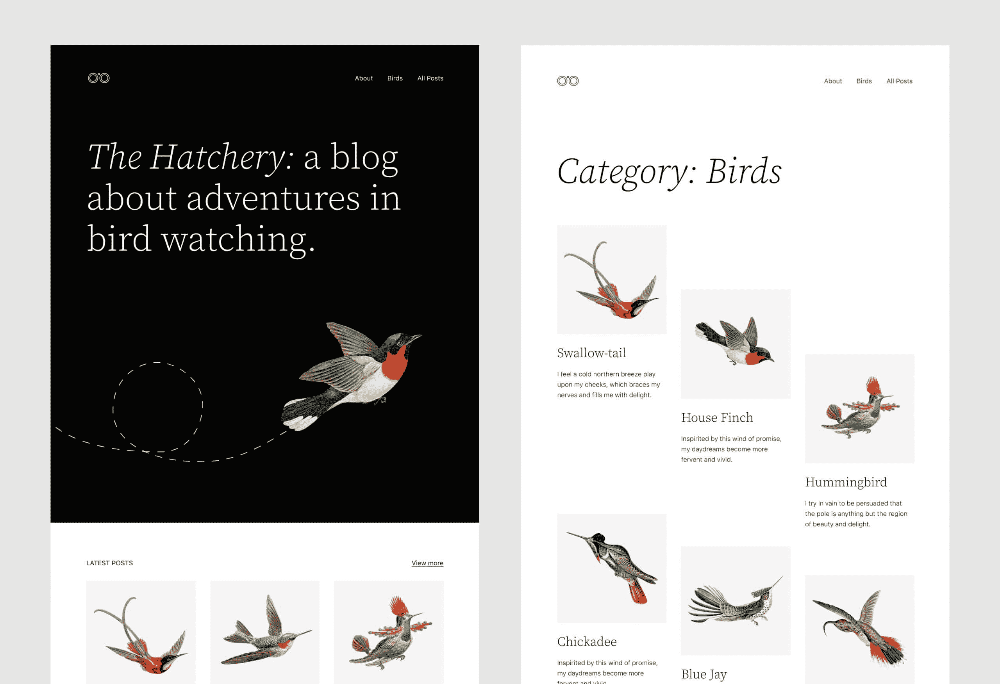

Twenty Twenty-Two.

这个主题非常适合探索 WordPress 5.9 的新特性，比如全站点编辑、全局样式、导航块和更新的图库。

### **定价**

222 是一个免费的 WordPress 主题。

### **显著特征**

*   鸟类的多样性和多功能性激发了主题的风格。
*   Twenty Twenty 2 的排版轻巧而有力，其调色板的灵感来自大自然。
*   像鸟一样，主题的布局元素轻轻地放在网页上。
*   它是为 WordPress 5.9 中引入的完整站点编辑功能而构建的。每一页都可以根据您的需要进行定制。
*   包括几十种新的积木图案，等等。

### **最快的 WordPress 主题分析**

像 2221 一样，2222 会辜负它的前辈吗？还是不会？让我们看看！

#### **GTmetrix**

*   **性能得分:** 99%
*   **结构得分:** 98%
*   **最大含量涂料(LCP):** 577ms
*   **总阻塞时间(TBT):**0 毫秒
*   **累计布局偏移(CLS):** 0.07
*   **满载时间:**661 毫秒

#### **Pingdom**

*   **性能等级:** 97
*   **页面大小:** 504.90 KB
*   **加载时间:**730 毫秒
*   **请求:** 8

#### **PageSpeed Insights(移动版)**

*   **表现得分:** 74
*   **第一幅内容丰富的画:** 1.1s
*   **速度指数:** 1.5s
*   **大容量涂料(LCP):** 4.1s
*   **互动时间(TTI):** 1.2s
*   **总阻塞时间(TBT):**40 毫秒
*   **累计布局偏移(CLS):** 0.523

#### **PageSpeed Insights(桌面)**

*   **表现得分:** 86
*   **第一个内容油漆:** 0.4s
*   **速度指数:** 0.4s
*   **大容量涂料(LCP):** 0.5s
*   **互动时间(TTI):**0.4 秒
*   **总阻塞时间(TBT):**0 毫秒
*   **累计布局偏移(CLS):** 0.875

#### **字节检查 TTFB 测试**

*   **到达第一个字节的时间:**53 毫秒
*   **总时间:**53 毫秒
*   **割台尺寸:** 450b
*   **请求大小:** 201b

### **测试结论**

2022 主题以 gt metrix 99%的性能得分和 98%的结构得分开始。然而，其 564.90 KB 的页面大小是所有测试主题中最大的，在所有测试中排名垫底。除了 Pingdom，它在所有速度测试中得分最低。

除了分数，它的大多数其他统计数据，如 PageSpeed Insights 速度指数和请求，仍然很突出。如果你计划在你的网站上使用这个最新的默认 WordPress 主题，确保[优化它以获得更好的性能](https://kinsta.com/learn/speed-up-wordpress/)。

## 最快的 WordPress 主题排名

| **主题** | **GTmetrix 得分** | **乒坛等级** | **PageSpeed Insights(移动版)** | **PageSpeed Insights(桌面)** | **TTFB** |
| **阿斯特拉** | 100% | Ninety-eight | One hundred | One hundred | 47 毫秒 |
| **空白画布** | 100% | Ninety-two | Ninety-nine | One hundred | 67 毫秒 |
| **自定义** | 100% | Ninety-seven | Ninety-eight | One hundred | 52 毫秒 |
| **GeneratePress** | 100% | Ninety-eight | One hundred | One hundred | 54 毫秒 |
| **出发** | 100% | Ninety-four | Ninety-four | Ninety-nine | 65 毫秒 |
| **Hello Elementor** | 100% | Ninety-two | Ninety-three | Ninety-nine | 59 毫秒 |
| **赫斯缇雅** | 100% | Ninety-two | Eighty-eight | Ninety-nine | 54 毫秒 |
| **名称** | 100% | Ninety-eight | One hundred | One hundred | 51 毫秒 |
| **OceanWP** | 99% | Ninety-one | Eighty-eight | Ninety-seven | 59 毫秒 |
| **PopularFX** | 100% | Ninety-five | Ninety-eight | Ninety-nine | 53 毫秒 |
| **反应灵敏** | 100% | Ninety-five | Ninety-eight | Ninety-nine | 53 毫秒 |
| **二十二十** | 100% | Ninety-seven | One hundred | One hundred | 78 毫秒 |
| **二十二十一** | 100% | Ninety-seven | One hundred | One hundred | 78 毫秒 |
| **二十二十二** | 99% | Ninety-seven | Seventy-four | Eighty-six | 53 毫秒 |
| **Zakra** | 100% | Ninety-six | Ninety-nine | One hundred | 60 毫秒 |

你可能已经注意到上面的**主题没有特定的顺序**。然而，有必要看看它们在速度和性能测试中的比较。

虽然不可能清楚地知道哪个主题最快(一个主题在一个测试中可能是第一，但在另一个测试中可能是第七)，但我们可以根据收集的信息对它们进行排序。

### **最快** WordPress **主题(对比)**

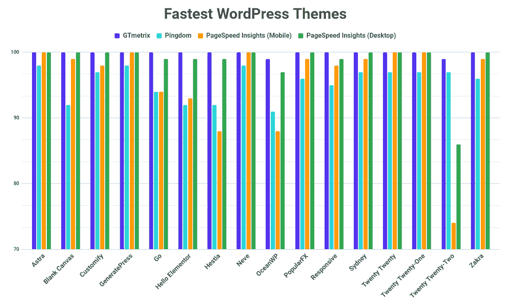

Fastest WordPress themes compared.

这可能有助于获得速度结果的可视化。第一个图表在 X 轴上突出显示了所有最快的主题，比较了四个测试工具的最终得分。每一个都以 100 为尺度。

#### 外卖食品

*   GTmetrix 性能得分因主题而异，但差别不大。都在 99 以上。
*   在所有测试的主题中，222 主题的累积得分最差。下一个表现最差的是 OceanWP。
*   虽然还不错，但赫斯缇雅、Hello Elementor、Blank Canvas 和 OceanWP 的 Pingdom 评分最低。
*   Astra、GeneratePress、Neve、Twenty Twenty 和 Twenty Twenty One 是唯一在 PageSpeed Insights 移动测试中获得 100 分的公司。
*   Twenty Twenty、OceanWP 和赫斯缇雅的 PageSpeed Insights 移动评分较低，Go 和 Hello Elementor 也略低于表现最好的公司。

在下图中，我们将比较加载时间，所有时间都以毫秒为单位。记住，越低越好。

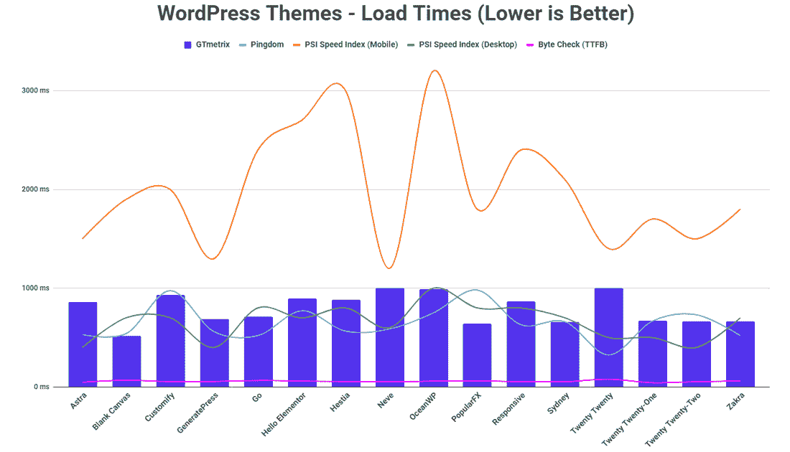

Load times chart for the fastest WordPress themes.

#### 外卖食品

*   空白画布产生了最快的 GTMetrix 完全加载时间。GeneratePress，Sydney，PopularFX，Twenty 21，Twenty 22，Zakra 也不甘落后。
*   Twenty Twenty 赢得了 Pingdom 加载时间之战，而 PopularFX 则以相当大的差距输掉了这场战斗。
*   Neve 拥有最快的 PageSpeed Insights(移动)速度指数，紧随其后的是 GeneratePress。OceanWP 在这里产生了最慢的结果。
*   从图上看，很难说所有的主题在他们的 TTFB 之战中都表现不错。然而，TTFB 最慢的主题是 Twenty Twenty，而 TTFB 最快的主题是 Twenty Twenty One。
*   总的来说，GeneratePress、Astra、Neve、220 和 222 在所有测试中加载速度最快。

我们测试了一些速度最快的 WordPress 主题，并比较了我们收集的结果。轻量级和优化的主题是至关重要的，但你不应该忘记选择一个[注重性能的托管解决方案](https://kinsta.com/wordpress-hosting/)来确保你的网站从一开始就成功。Kinsta 非常重视速度和优化。这就是为什么我们将 [代码缩小功能](https://kinsta.com/help/kinsta-cdn-code-minification) 内置到 [MyKinsta 仪表盘](https://kinsta.com/mykinsta/) 中。客户可以选择为他们的 CSS 和 JavaScript 文件选择自动缩减代码，无需手动操作就可以加速他们的网站。

现在轮到你了:谈到速度，你最喜欢的主题是什么？我们想看看你的推荐！

* * *

### 常见问题

#### WordPress 最快的主题是什么？

根据我们的测试，GeneratePress、Astra、Neve 和 Twenty Twenty 被认为是最快的 WordPress 主题。

#### 最快的免费 WordPress 主题是什么？

根据我们的全面测试，GeneratePress、Astra 和 Twenty Twenty 被认为是最快的免费 WordPress 主题。

#### 是什么让 WordPress 主题变得快速？

WordPress 主题的表现取决于许多因素。其中一些关键因素包括坚持最佳编码实践、生成更少的 HTTP 请求、优化页面大小、尽可能少使用 JS(尤其是呈现阻塞)以及拥有结构良好的主题目录。

#### 如何让我的 WordPress 主题更快？

WordPress 主题的表现取决于多种因素。首先，您可以[优化图像](https://kinsta.com/blog/optimize-images-for-web/)，启用缓存，添加 CDN，并减少整体页面大小、HTTP 请求和外部服务

#### 我如何检查 WordPress 主题的速度？

使用[网站速度测试工具](https://kinsta.com/blog/website-speed-test/)来检查 WordPress 主题的速度。我们推荐使用 [GTmetrix](https://kinsta.com/blog/website-speed-test/#gtmetrix) 、 [Pingdom](https://kinsta.com/blog/website-speed-test/#1-pingdom) 和 [PageSpeed Insights](https://kinsta.com/blog/google-pagespeed-insights/) 。

#### 我如何优化我的 WordPress 主题？

优化 WordPress 主题有很多方法，从选择一个[快速 WordPress 主机提供商](https://kinsta.com/)到使用速度和图像优化插件，使用 CDN，启用缓存，通过有效使用视频和避免太多第三方脚本来减少页面的整体大小。

为了快速简单地提升整体优化，也可以考虑缩减代码。Kinsta 已经在 [MyKinsta 仪表板](https://kinsta.com/mykinsta/)中内置了一个[代码缩小功能](https://kinsta.com/help/kinsta-cdn-code-minification)，允许客户通过简单的点击实现 CSS 和 JavaScript 的自动缩小。

* * *

让你所有的[应用程序](https://kinsta.com/application-hosting/)、[数据库](https://kinsta.com/database-hosting/)和 [WordPress 网站](https://kinsta.com/wordpress-hosting/)在线并在一个屋檐下。我们功能丰富的高性能云平台包括:

*   在 MyKinsta 仪表盘中轻松设置和管理
*   24/7 专家支持
*   最好的谷歌云平台硬件和网络，由 Kubernetes 提供最大的可扩展性
*   面向速度和安全性的企业级 Cloudflare 集成
*   全球受众覆盖全球多达 35 个数据中心和 275 多个 pop

在第一个月使用托管的[应用程序或托管](https://kinsta.com/application-hosting/)的[数据库，您可以享受 20 美元的优惠，亲自测试一下。探索我们的](https://kinsta.com/database-hosting/)[计划](https://kinsta.com/plans/)或[与销售人员交谈](https://kinsta.com/contact-us/)以找到最适合您的方式。