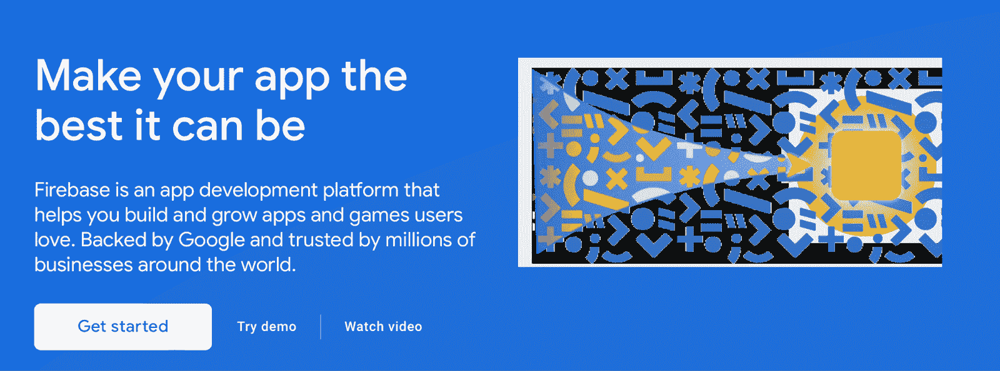
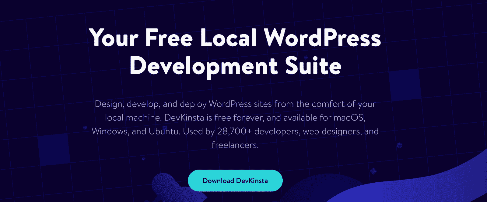
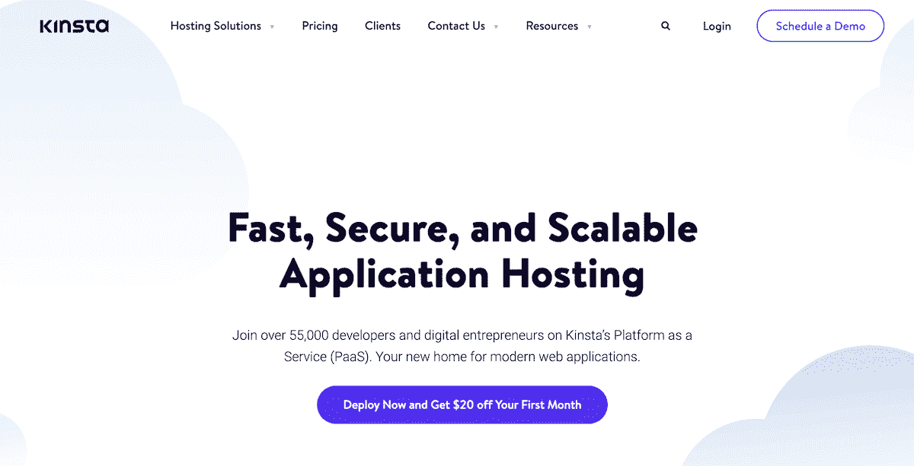
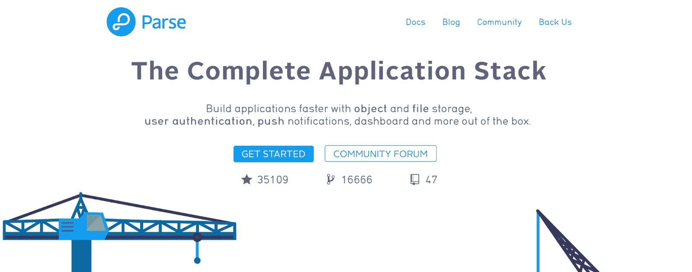
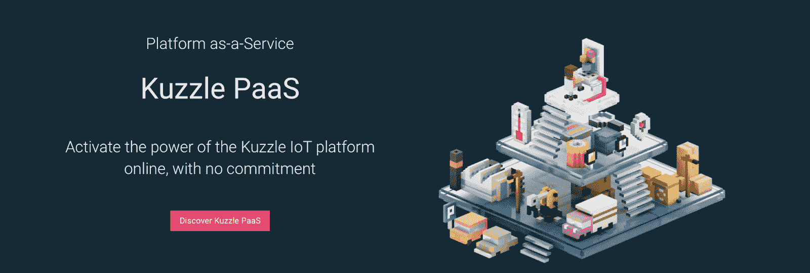
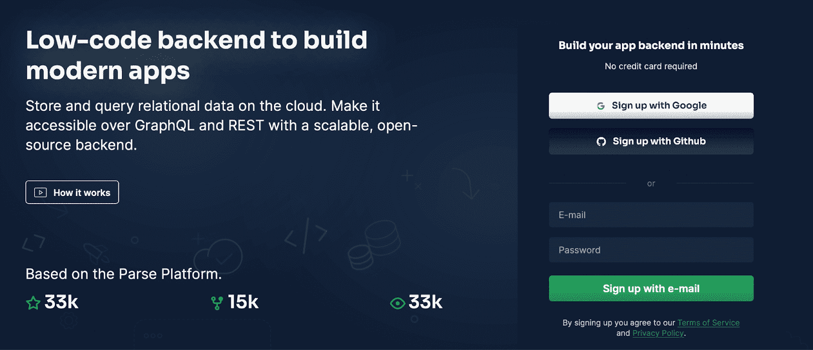
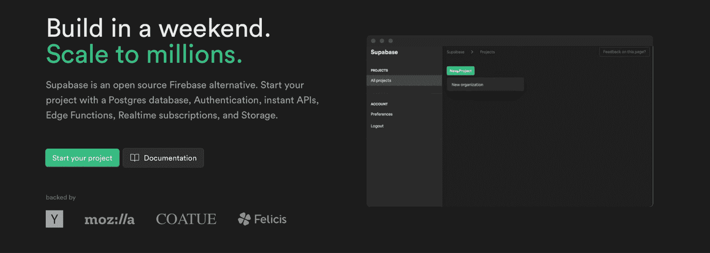
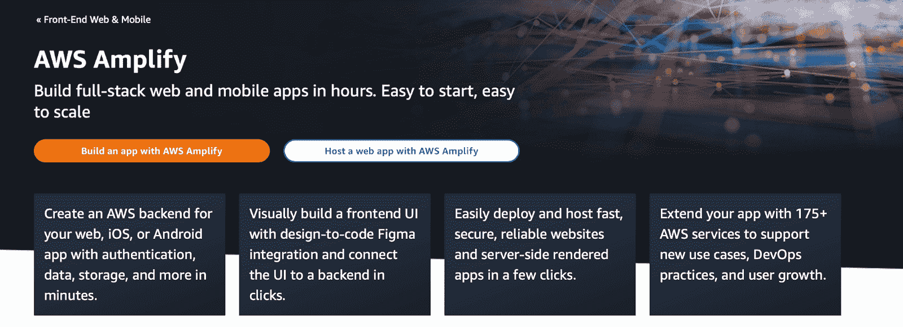
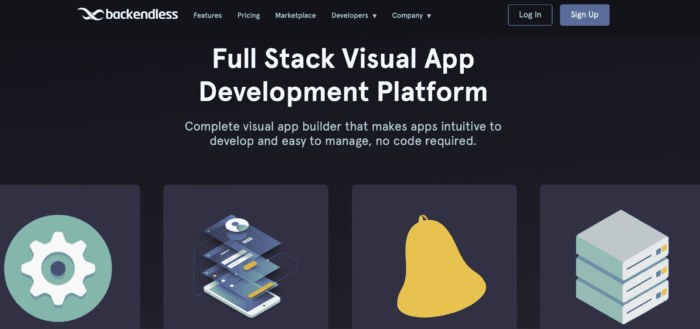

# 最佳的 Firebase 替代方案(7 个选项)

> 原文：<https://kinsta.com/blog/firebase-alternatives/>

Firebase 通常是人们想到的第一个无需大量编码就能开发移动和网络应用的平台。然而，尽管它提供了许多有用的功能，Firebase 并不是开源的。这意味着您对应用程序开发几乎没有控制权。

幸运的是，有一些优秀的 Firebase 替代产品可以提供更多的定制和控制。例如，您可以访问更多的托管选项，使用多个数据库，并轻松扩展您的应用。

在这篇文章中，我们将仔细看看使用 Firebase 的缺点。然后，我们将讨论为什么您可能会考虑切换到不同的解决方案。最后，我们将探索 7 种最佳的 Firebase 替代方案。我们开始吧！

## 使用 Firebase 进行应用程序开发的缺点

Firebase 是一个开发平台，可以帮助您构建和发展应用程序和游戏。它由谷歌支持，被 Duolingo、Wattpad、Trivago 和《纽约时报》等公司使用:

Firebase

您可以使用该平台个性化您的入职流程，[提高用户参与度](https://kinsta.com/blog/wordpress-social-media-plugins/)，并添加新的功能类型。然而，尽管 Firebase 有很多优点，但它也有很多缺点，这使得它不再是一个有吸引力的开发平台。

> Kinsta 把我宠坏了，所以我现在要求每个供应商都提供这样的服务。我们还试图通过我们的 SaaS 工具支持达到这一水平。
> 
> <footer class="wp-block-kinsta-client-quote__footer">
> 
> 
> 
> <cite class="wp-block-kinsta-client-quote__cite">Suganthan Mohanadasan from @Suganthanmn</cite></footer>

[View plans](https://kinsta.com/plans/)

[Not a fan of Firebase... or just looking for something open-source? 🔥 Read more here 🚀Click to Tweet](https://twitter.com/intent/tweet?url=https%3A%2F%2Fkinsta.com%2Fblog%2Ffirebase-alternatives%2F&via=kinsta&text=Not+a+fan+of+Firebase...+or+just+looking+for+something+open-source%3F+%F0%9F%94%A5+Read+more+here+%F0%9F%9A%80&hashtags=WebDev%2CDevelopment)

### 1.供应商锁定

有了供应商锁定，您对应用程序的源代码几乎没有控制权。这不仅会让开发者感到沮丧，还会让风险投资家和天使投资人不愿意为你的初创公司提供资金。

此外，由于 Firebase 是一个闭源平台，可伸缩性可能会受到限制。因此，您最好找一个能够提供更多灵活性的开源框架。

### 2.费用

对于 Firebase，免费计划仅适用于小型应用程序。一旦您的应用程序增长，服务器成本可能会大幅增加，这可能会超出您的预算。

由于 Firebase 不提供固定价格的结构，您将根据应用程序的[服务器资源](https://kinsta.com/blog/wordpress-server-requirements/)付费。你也不能设定每月的最高预算。因此，如果你不小心的话，你很快就会欠下一大笔账单。

### 3.主办；主持

Firebase 由谷歌支持，所以你只能使用[谷歌云平台](https://kinsta.com/google-cloud-hosting/)。对于复杂的应用程序，这并不总是理想的。这意味着您不能在专用实例上运行您的应用程序或定制您的服务器设置。

### 4.数据库ˌ资料库

Firebase 使用闭源 NoSQL 数据库。它提供非常有限的查询和索引功能。因此，很难完成某些任务，比如迁移数据(使用 SQL 数据库更容易)。

更重要的是，你不能执行操作来获取活跃用户，也不能使用批量操作来更新文档。这些限制使得 Firebase 的效率和直观性不如预期。

## 为什么您应该考虑改用 Firebase 替代产品

虽然 Firebase 是一个受欢迎的平台，但它并不像它应该的那样用户友好或灵活。以下是您应该考虑使用 Firebase 替代产品的主要原因:

*   **托管选项。有了 Firebase，你只能使用谷歌云平台。然而，使用开源平台，您可以将应用程序部署到您选择的任何云解决方案中。**
*   **灵活性。有了许多 Firebase 的替代品，您可以完全控制您的代码，而没有供应商锁定的风险。**
*   **持续改进。**采用开源框架的 Firebase 替代方案将定期接受审查，以确保其符合安全标准。此外，您可以经常访问各种错误修复和其他改进，以使您的应用程序受益。
*   用户友好性。正如我们所讨论的，使用 Firebase 进行编码和应用程序开发不是很直观或高效。通过切换到开源平台，你通常可以更快地编辑代码。
*   **可达性。**开源 Firebase 替代品可以免费下载并公开访问。
*   **可扩展性。**通过切换到开源 Firebase 替代方案，您可以获得更大的灵活性。此外，您可以获得更多稳定性支持，帮助您扩展应用程序。

此外，在开发应用程序时，您可以从使用开发平台或本地环境中受益。在这里，您可以测试更改，而不会影响您的生活环境。DevKinsta 是一个很好的选择:

DevKinsta

我们的套件是由 Docker 支持的[，它具有更低的资源占用和接近本机的性能。您可以利用本地数据库工具在本地系统上开发主题、插件和自定义网站。然后，当您准备好上线时，您可以将您的应用程序直接推送到 Kinsta。](https://kinsta.com/knowledgebase/what-is-docker/)

## 最佳 Firebase 替代方案(7 大选项)

现在你知道为什么你应该考虑切换到 Firebase 的替代品，这里有 7 个顶级选择来帮助你为你的应用选择最好的平台！

### 1.金斯塔

Kinsta

您的应用程序开发应该得到最好的一切。这正是当您选择加入超过 55，000 名其他开发者和数字企业家的 [Kinsta 的平台即服务(PaaS)](https://kinsta.com/application-hosting/) 时所得到的。

Kinsta 在五大洲提供 26 个酒店。每个地方都有运行在谷歌顶级网络上的最快的谷歌 C2 机器。无论您是 CTO、工程师还是开发人员，Kinsta 都能提供一个稳固的基础设施，它可以快速设置、经过测试、可靠并且随时可以扩展。

所有你喜欢的框架都被支持。这包括 [PHP](https://kinsta.com/help/php-example-application/) 、 [Node.js](https://kinsta.com/help/nodejs-example-application/) 、Ruby、 [Java](https://kinsta.com/help/java-example-application/) 、Python、 [GO](https://kinsta.com/help/go-example-application/) 、 [Scala](https://kinsta.com/help/scala-example-deployment/) 。Kinsta 让你能够从 2 个不同的构建选项中进行选择。您可以自动设置您的容器映像，它们将确定正确的构建包，或者您可以使用您自己的定制 docker 文件。

它们提供了一个定制的仪表板，用户可以在其中跟踪部署、运行时、构建时和带宽使用情况。

Kinsta 为易于使用的现代 web 应用程序提供了一个新家。只需连接您的 GitHub 帐户并选择一个存储库。您可以自动或手动部署您的应用程序，并分别构建、扩展和运行您的流程。

#### 特征

*   只需点击一下鼠标，即可获得全天候全球实时聊天支持。
*   谷歌 C2 机器和溢价层网络准备扩大任何网络应用。
*   以提供同类最佳防火墙、DDoS 保护和 SSL 的 Cloudflare 集成为后盾。
*   设置后，支持自定义 SSL，轻松将流量路由到域。
*   直接从 GitHub 部署。
*   应用程序以最高效率运行，因为 Kinsta 通过 GKE (Google Kubernetes 引擎)管理它们机器之间的分布。
*   使用 PHP、Node.js、Ruby、Java、Python、GO 和 Scala 构建。

#### 定价

Kinsta 使用基于资源的定价模型。您可以完全控制以任何方式构建和运行应用程序。因为他们的定价是基于使用量的，你只需为你使用的东西付费。定价简单、透明且可预测。

### 2.从语法上分析

Parse

Parse 是开发预算有限的应用程序的最流行的框架之一，因为它是开源和免费的。更好的是，它易于实现和使用，可以在任何云上运行，并且您可以使用 Node 在本地测试和开发您的应用程序。

自托管也是可能的，因为您可以在自己的服务器上下载并运行 Parse。此外，Parse 有一个专门的开发人员社区，使您能够从专家支持和快速故障排除中受益。

#### 特征

*   使用 [MongoDB](https://kinsta.com/blog/mongodb-vs-mysql/) 或 [PostgreSQL](https://kinsta.com/knowledgebase/what-is-postgresql/) 数据库(而不是只有一个带有 Firebase 的 NoSQL 数据库)
*   通过社交登录和电子邮件通知提供简单的身份验证流程(无需使用第三方)
*   使您能够以最少的努力创建端到端的[graph QL](https://kinsta.com/blog/wordpress-revolution-with-graphql/)API

#### 定价

免费。

## 注册订阅时事通讯

### 想知道我们是怎么让流量增长超过 1000%的吗？

加入 20，000 多名获得我们每周时事通讯和内部消息的人的行列吧！

[Subscribe Now](#newsletter)

### 3.库兹尔

Kuzzle

[Kuzzle](https://kuzzle.io/) 以缩短上市时间而闻名(TTM)，声称[将 TTM 提高了 40%](https://kuzzle.io/wp-content/uploads/2020/03/Kuzzle_Actility_LoRaWAN_partnership.pdf)。它提供了一个可扩展的服务器，非常适合快速增长的应用程序。您还可以从多协议 API、管理控制台、地理围栏和快速搜索中受益。

此外，您可以在内部和内部网上进行扩展，包括任何云服务、Linux 或 Docker 基础架构以及物联网硬件。因此，Kuzzle 是一个灵活的解决方案，使您能够以最适合自己的方式工作。

#### 特征

*   访问实时查询订阅。
*   受益于实时发布/订阅引擎，提供更好的用户界面(UI)。
*   使用集群模式在两个以上节点的集群中配置 Kuzzle，以实现高可用性和大规模部署。

#### 定价

你可以免费下载 Kuzzle 后端，或者订阅 Kuzzle 托管和管理的平台。付费计划每月起价 80 美元。

### 4.Back4App

Back4App

Back4App 基于 Parse 平台，但作为 Firebase 的“低代码”替代产品上市。它的界面像电子表格一样组织，使其直观且易于使用。

它还提供了比 Firebase 更多的数据库，因此您不会局限于一家供应商。相反，您可以找到更多选项来实现快速数据同步和更新。此外，您可以获得全面管理的服务，包括 24/7 支持、 [CDN](https://kinsta.com/blog/wordpress-cdn/) 和[内置缓存](https://kinsta.com/blog/wordpress-cache/)以获得更快的性能。

#### 特征

*   将 GraphQL 和 [Rest API](https://kinsta.com/blog/wordpress-rest-api/) 用于所有数据库操作
*   提供实时查询功能，使您能够执行实时同步并为用户提供最新数据
*   使用关系数据库，使得查询关系数据、执行地理查询和聚合函数变得容易

#### 定价

Back4app 每月 25K 次请求免费，250MB 数据和 1GB 文件存储。付费计划每月起价 25 美元。

Struggling with downtime and WordPress problems? Kinsta is the hosting solution designed to save you time! [Check out our features](https://kinsta.com/features/)

### 5.Supabase

Supabase

Supabase 称自己是一个“开源 Firebase 的替代品”。它依赖于关系数据库，使用 PostgreSQL 实现功能和可伸缩性。您可以执行复杂的查询或文本搜索。另外，您可以使用**轻松导入数据。sql** 文件。

更好的是，使用 Supabase，您可以灵活地在本地机器、云服务提供商或 Docker 容器中托管您的应用程序。

#### 特征

*   与谷歌、苹果和脸书等第三方认证服务集成(并支持 SAML 等企业登录)
*   访问实时数据库监听器
*   利用了一个 JavaScript 库和 API

#### 定价

Supabase 对两个 500MB 数据库和 1GB 文件存储的项目是免费的。付费计划每月起价 25 美元。

### 6.AWS 放大器

AWS Amplify development

[AWS Amplify](https://aws.amazon.com/amplify/) 是亚马逊的云平台服务。它提供了一组工具，您可以一起使用或单独使用。您可以使用 Amplify Auth 快速设置安全认证。同时，由于 AWS 的原生授权功能，您可以控制谁可以访问您的应用程序。

更重要的是，AWS Amplify 特别适合人工智能/机器学习。此外，对于入职流程、实时协作和有针对性的推送通知来说，这是一个很好的框架。该平台的一个独特功能是，您可以通过设计到编码 [Figma 集成](https://kinsta.com/blog/figma-vs-sketch/)可视化地构建您的前端 UI。

#### 特征

*   支持多种框架，如 [JavaScript](https://kinsta.com/knowledgebase/what-is-javascript/) 、 [Vue](https://kinsta.com/blog/vue-js/) 、 [Next.js](https://kinsta.com/knowledgebase/next-js/) 、Angular 以及 iOS、Flutter、Android、React Native 等移动平台
*   支持您使用超过 175 项服务扩展您的应用，以支持新的使用案例、开发运维实践和用户增长
*   允许您将应用程序连接到新的或现有的 [AWS 后端](https://kinsta.com/blog/google-cloud-vs-aws/)

#### 定价

您可以访问免费层，其中包括每月 1000 分钟的构建时间和 5GB 的存储空间。免费计划在一年后到期，然后你将不得不按需付费。

### 7.无尽的

Backendless

[Backendless](https://backendless.com/) 是一个可视化的 app 开发平台。由于它是无代码的，它使用一个可视化的前端构建器来创建后端逻辑，使开发和管理应用程序变得容易。

您还可以访问更多的托管选项，包括云托管、自托管和专用服务器。更好的是，Backendless 是一个完全灵活和可定制的选项，以三种形式提供云代码。例如，您可以使用云代码计时器、API 事件处理程序和 API 服务来定制您的后端解决方案。

#### 特征

*   使用易于管理和使用的可扩展 API。
*   访问结合了 SQL 和 NoSQL 精华的动态数据库。
*   利用跨平台的 SQL 驱动的条件交付。

#### 定价

免费计划仅在完成 Backendless 任务时可用。或者，你可以[通过 Backendless marketplace 解锁访问](https://backendless.com/how-to-unlock-free-plan/)。另一方面，付费计划的起价是每月 25 美元。

[While it offers many useful features, Firebase isn’t open source... so if you're looking for other options, start here ✅Click to Tweet](https://twitter.com/intent/tweet?url=https%3A%2F%2Fkinsta.com%2Fblog%2Ffirebase-alternatives%2F&via=kinsta&text=While+it+offers+many+useful+features%2C+Firebase+isn%E2%80%99t+open+source...+so+if+you%27re+looking+for+other+options%2C+start+here+%E2%9C%85&hashtags=WebDev%2CDevelopment) ## 摘要

虽然 Firebase 是一个成熟的平台，使您能够开发和启动您的应用程序，但它有一些限制。它的闭源特性意味着你无法控制你的应用程序的源代码，并且在托管选项上没有多少自由。

这就是为什么找到一个提供更多灵活性和控制的 Firebase 替代方案是一个好主意。例如，你可以通过 Backendless 这样的平台访问三种主机(包括一个专用服务器)。同时，您可以使用 Supabase 访问 SQL 数据库，从而执行复杂的查询和文本搜索。

DevKinsta 是我们的免费开发工具套件，可帮助您构建、测试和部署应用。它为开发定制站点、插件、主题等提供了一个本地环境。此外，您还可以从开源数据库中受益，并将其部署到 Kinsta 在全球的数据中心之一。立即开始使用 Kinsta 的快速、安全且可扩展的应用程序托管，[第一个月可节省 20 美元](https://kinsta.com/signup/?product_type=app-db)。

* * *

让你所有的[应用程序](https://kinsta.com/application-hosting/)、[数据库](https://kinsta.com/database-hosting/)和 [WordPress 网站](https://kinsta.com/wordpress-hosting/)在线并在一个屋檐下。我们功能丰富的高性能云平台包括:

*   在 MyKinsta 仪表盘中轻松设置和管理
*   24/7 专家支持
*   最好的谷歌云平台硬件和网络，由 Kubernetes 提供最大的可扩展性
*   面向速度和安全性的企业级 Cloudflare 集成
*   全球受众覆盖全球多达 35 个数据中心和 275 多个 pop

在第一个月使用托管的[应用程序或托管](https://kinsta.com/application-hosting/)的[数据库，您可以享受 20 美元的优惠，亲自测试一下。探索我们的](https://kinsta.com/database-hosting/)[计划](https://kinsta.com/plans/)或[与销售人员交谈](https://kinsta.com/contact-us/)以找到最适合您的方式。