# 2022 年 12 个最佳火狐扩展和插件

> 原文：<https://kinsta.com/blog/firefox-extensions/>

你是否在寻找 Firefox 扩展来帮助你将你的浏览器体验提升到一个新的水平？不要再看了。

扩展和附件可以改善你的浏览体验，帮助你做从管理你的密码到记录你的屏幕的一切事情。

如果 Firefox 缺少任何功能，您可以通过扩展添加您需要的功能。

本文将分解如何安装和管理扩展。它还将展示各种类别中 Firefox 可用的最佳扩展和插件。

请继续阅读，了解如何充分利用您的 Firefox 浏览体验。

## 什么是 Firefox 扩展(也称为 Firefox 附加组件)？

火狐扩展，以前被称为火狐插件，是在网络浏览器中运行以扩展其功能的小程序。

例如，Privacy Badger 是一个扩展，你可以安装到 Firefox 上，以阻止不可见的跟踪脚本跟踪你在网上的一举一动。

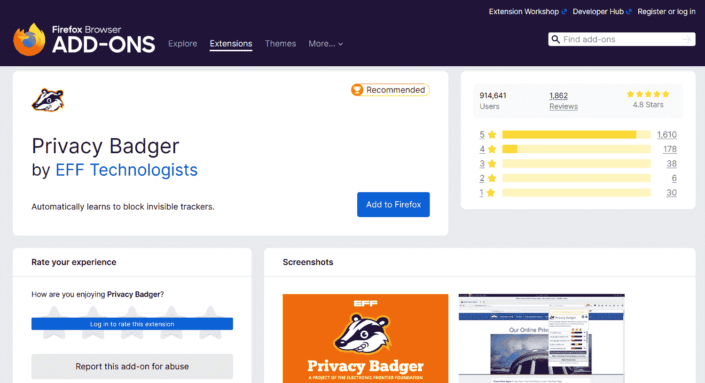

Privacy Badger extension.

通过将它安装并添加到 Firefox，您添加了额外的功能并改变了您的浏览体验。

所有种类的扩展都可以为你的 Firefox 浏览器添加不同的功能。

例如，你可以用它们来截屏、重新排列火狐标签、检查语法、在每个网站上设置黑暗模式等等。

如果你想从 Firefox 中得到一点额外的东西，并且你正在考虑更换浏览器，Firefox 扩展可能会代替你的工作。

这些扩展和插件可以在公共的 [Firefox 扩展库](https://addons.mozilla.org/en-US/firefox/extensions/)和其他在线位置获得。

你可以很容易地从 Firefox 中下载并安装它们，只需点击几下——稍后会详细介绍。

[您是否正在寻找 Firefox 扩展来帮助您将浏览器体验提升到一个新的水平？👀不要再看了。💪 点击推文](https://twitter.com/intent/tweet?url=https%3A%2F%2Fkinsta.com%2Fblog%2Ffirefox-extensions%2F&via=kinsta&text=Are+you+looking+for+Firefox+extensions+to+help+you+take+your+browser+experience+to+the+next+level%3F+%F0%9F%91%80+Look+no+further.+%F0%9F%92%AA&hashtags=Firefox%2CFireFoxTips)

## 火狐扩展安全吗？

只要你采取适当的预防措施，安装和使用 Firefox 扩展通常是安全的。

独立的第三方开发 firefox 扩展，但最流行的扩展在 Mozilla 接受每个新版本之前都要经过安全测试。因此，虽然流行的扩展通常是安全的，但您应该采取一些预防措施。

每一个提交到官方 Firefox 附加目录的扩展都会被扫描，但并不是所有的扩展都会被手工检查。

甚至 Mozilla 自己也建议要注意扩展请求什么权限。

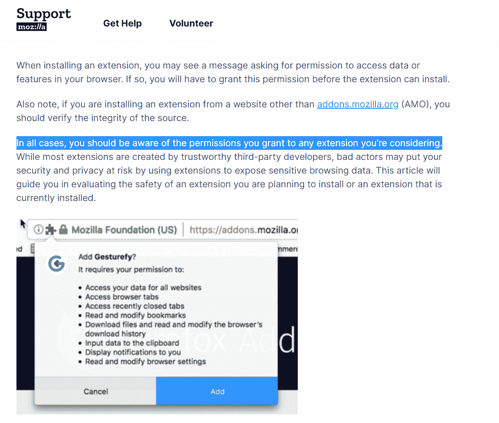

Firefox extension permission guidelines.

Mozilla 还建议用户在安装插件之前问自己几个问题，包括是否信任背后的开发者或品牌。

但是 Firefox 扩展并没有带来额外的风险。例如， [Chrome 扩展](https://kinsta.com/blog/best-chrome-extensions/)也有同样的问题。

由可靠品牌和开发人员开发的主要扩展通常是安全的，而一些不太为人所知的扩展可能会带来一定程度的风险。

如果 Mozilla 在一个附加组件上贴了一个标签，警告“这个附加组件没有被 Mozilla 主动监控”，你应该 100%确定它来自一个有信誉的来源。

只要你遵循上面概述的预防措施，你就不会因为 Firefox 扩展而面临任何额外的风险。

## 如何安装和删除 Firefox 扩展

要安装火狐扩展，需要去[官方火狐扩展库](https://addons.mozilla.org/en-US/firefox/extensions/)。您可以用其他方式安装扩展，但是它们可能会有一些风险，除非发行者是 100%可信任的。

从那里，你可以搜索一个特定的扩展或者浏览类别，直到你找到一个你感兴趣的。

您可以在主页上立即找到这些类别，并通过点击您感兴趣的类别来探索它们。

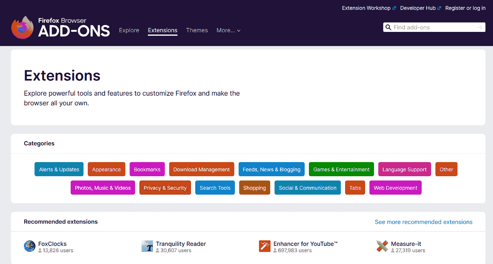

Firefox Extensions library.

如果您有特定的功能或用途，也可以使用任何关键字搜索新的附加组件。

例如，如果您想要更好地控制所有打开的标签，您可以搜索“标签管理”

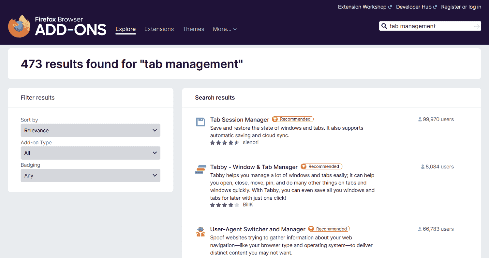

Firefox extension search results.

然后，您可以按相关性、大多数用户、最高评级、趋势等过滤结果。这使得快速找到您想要的浏览器扩展类型变得很容易。

找到喜欢的扩展后，单击结果打开扩展页面。您可以在此页面上查看该加载项的评级以及有关其功能的更多信息。

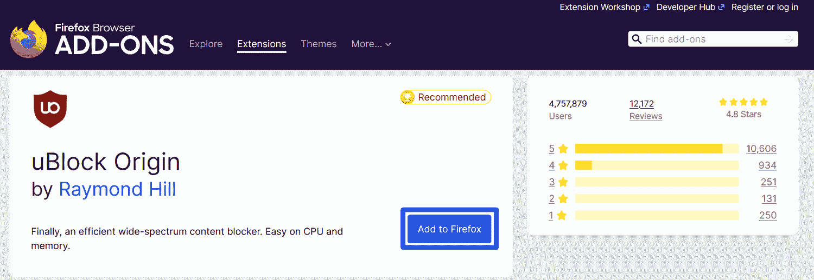

Click on the Add to Firefox button.

点击这个按钮会在 Firefox 中触发一个提示，询问你是否想要添加扩展，并解释它所请求的权限。

如果您对权限满意，请点按“添加”这将正式将新的 Firefox 插件添加到您的浏览器中。

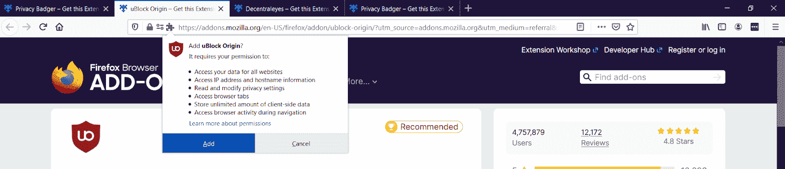

Firefox extension permissions popup box.

现在，您应该会在浏览器的右上角看到成功安装的消息。

Firefox extension installation message.

您已经成功安装了 Firefox 扩展。要使用或查看新功能，您可能需要刷新标签或关闭并重新打开 Firefox。

现在您已经了解了如何安装扩展，让我们来看看如何管理和卸载它们。毕竟，你不希望浏览器超载大量你不需要的扩展。

### 管理和卸载 Firefox 扩展

安装和卸载扩展时管理它们是使用扩展的重要部分。

特定的 Firefox 插件可能会使用相当多的 RAM 和 CPU，这取决于它们的用途。为了让 Firefox 浏览器保持轻便并在您的电脑上以最佳状态运行，您应该只保留您经常使用的扩展。

要查看你所有的 Firefox 扩展，你需要打开你的插件库。你可以打开菜单点击“附加组件”链接，使用 **Ctrl / Cmd + Shift + A** 键盘快捷键，或者在[地址栏](https://kinsta.com/knowledgebase/what-is-a-url/)中输入“关于:附加组件”。

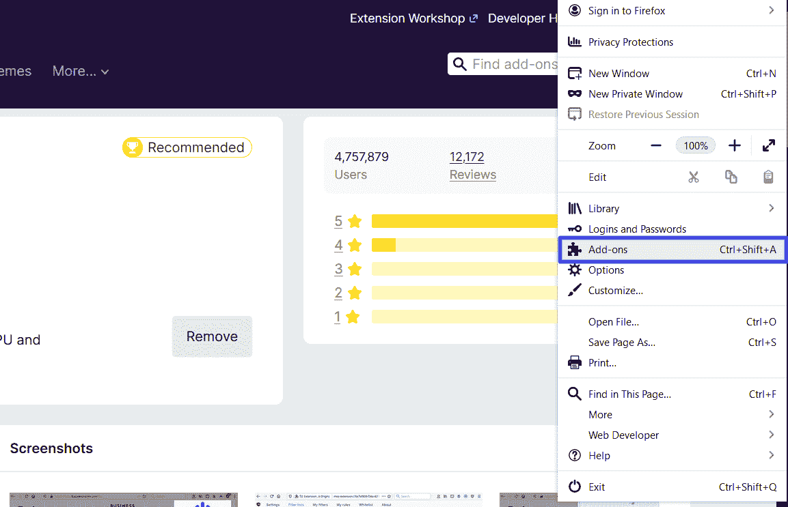

Firefox add-ons in the menu.

这将打开一个标题为“管理您的扩展”的页面在这里，您可以看到您曾经安装的每个加载项。

要卸载扩展，请单击要删除的扩展上的菜单链接，然后选择“删除”选项。

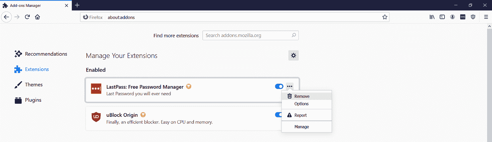

Remove Firefox extension.

默认情况下，所有 Firefox 扩展都会在安装时启用。

如果您只是偶尔使用某个扩展，并且希望在不使用时加快浏览体验，您也可以禁用某个扩展，而不是卸载它。

要禁用扩展，请单击蓝色切换按钮，并确保它是灰色而不是蓝色。

### 火狐扩展存储在哪里？

如果你想知道 Firefox 把扩展文件和相关数据存储在电脑的什么地方，这取决于你的操作系统。

在 Windows 中，来自加载项的数据存储在个人用户下的 app data 文件夹中:

`**C** Drive **>** Users **>** USERNAME **>** AppData **>** Roaming **>** Mozilla **>** Firefox **>** Profiles **>** VERSIONNUMBER.default **>** extensions`

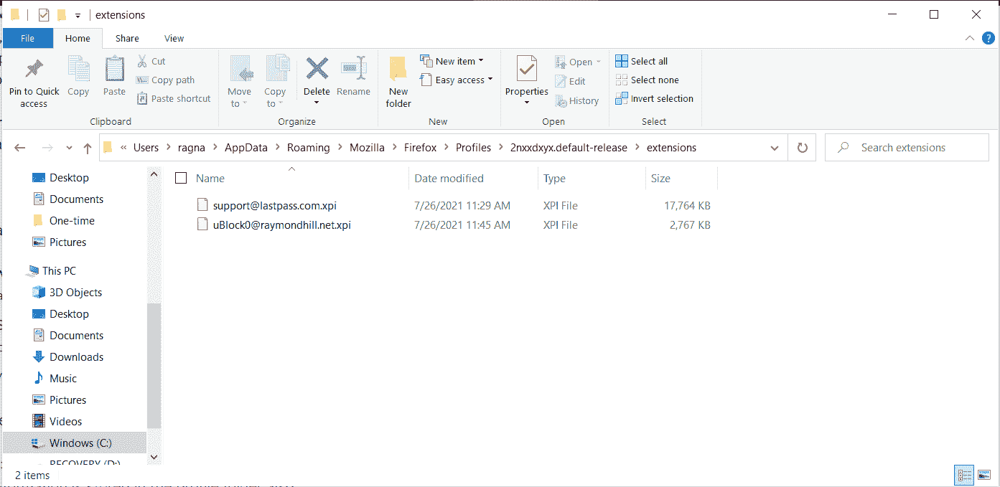

Extensions folder in File Explorer in Windows.

在 Mac 电脑上，您可以在用户的“资源库”文件夹中的类似位置找到附加文件:

`Users/USERNAME/Library/Application Support/Firefox/Profiles/VERSIONNUMBER.default/extensions`

### 重要的

即使找不到该文件夹，也可以按照上一节中的说明删除扩展名和所有相关数据。

普通用户可能不需要找到扩展名的实际文件位置。

这样做的唯一原因是，如果你想高度谨慎，用反恶意软件或反病毒软件扫描新的扩展名文件(除非有一个徽章说 Mozilla 不积极监控它，这不是严格必要的。)

到目前为止，您应该已经准确地理解了如何查找、安装和管理现有的 Firefox 扩展，所以是时候与您分享我们的建议了。

我们编制了一份包含 12 个不同类别的扩展的列表，以帮助您充分利用您的 web 浏览器。

## 12 个最佳火狐扩展

在这一节中，我们将介绍 12 个最好的火狐扩展，从密码管理到网页设计，甚至是护眼。

### 1.密码管理:LastPass

为了管理您的密码，我们推荐使用 [LastPass Firefox 扩展](https://addons.mozilla.org/en-US/firefox/addon/lastpass-password-manager/)。

Lastpass 是一个获奖的[密码管理器](https://kinsta.com/blog/password-managers/)，这个扩展让你的密码既安全又容易获取——这看起来像是一个第 22 条军规，但事实并非如此。

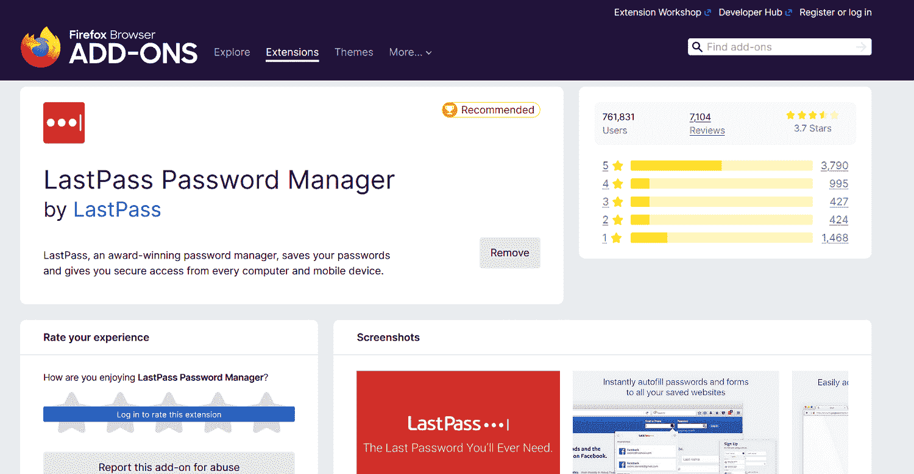

LastPass Password Manager Firefox extension.

它将你的密码安全地锁在安全、加密的服务器上的双因素识别后面。

要访问任何密码，您需要使用您的 LastPass 密码和您的电子邮件地址或手机号码。

**特性:**

*   它在云中安全地存储密码，所以你只需要记住一个。
*   允许在所有设备上访问密码，包括 Android 和 iOS 的原生应用程序。
*   使用军用级加密保护您的密码。

**好处:**

*   永远不要担心忘记密码，再次经历漫长的重置过程。

### 2.广告和追踪器拦截:uBlock 源

[uBlock Origin](https://addons.mozilla.org/en-US/addon/ublock-origin/) 与任何其他[广告拦截器](https://kinsta.com/blog/ad-blockers/)的不同之处在于，它不只是带有一个特定的内置库来拦截东西。

相反，它是一个“广谱内容拦截器”，不仅仅是基本的广告拦截器列表。它还关注于限制 JavaScript 和其他会降低您的体验和使用额外计算机资源的元素。

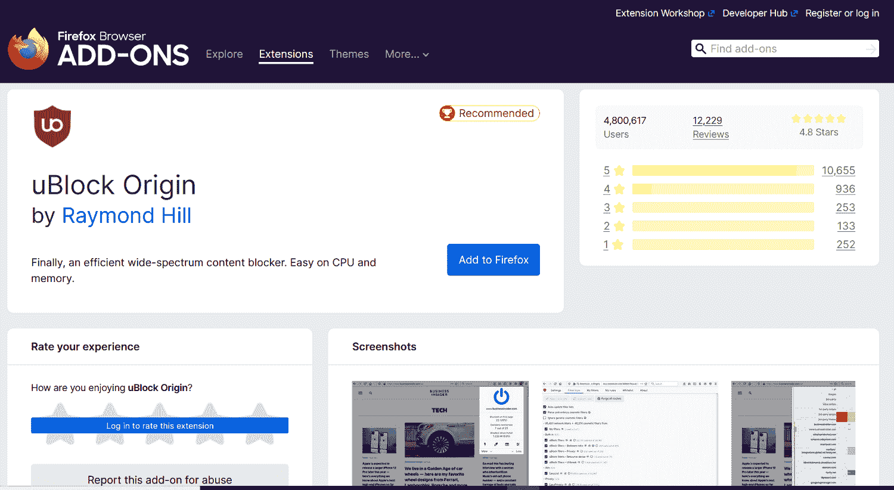

uBlock Origin Firefox Extension.

默认情况下，它带有多个针对在线广告和追踪器的阻止列表，以帮助您享受无广告和无追踪器的在线体验。

**特性:**

*   通过多个最新的广告拦截列表(包括 EasyList)有效拦截广告。
*   阻止追踪器以保护您的在线隐私。

**好处:**

*   享受无广告、无追踪器的浏览体验。
*   通过全面阻止 JavaScript 来提高浏览器和电脑的性能——尽管这可能会干扰某些网站的功能。

### 3.语法和拼写检查:语言工具

如果你在写邮件或网页内容时需要一些语法和拼写方面的帮助，只需看看 [LanguageTool](https://addons.mozilla.org/en-US/firefox/addon/languagetool/) 就行了。

不要担心如何正确使用“他们的”和“那里”这样的词。你会立刻得到正确答案，而不必向谷歌求助。

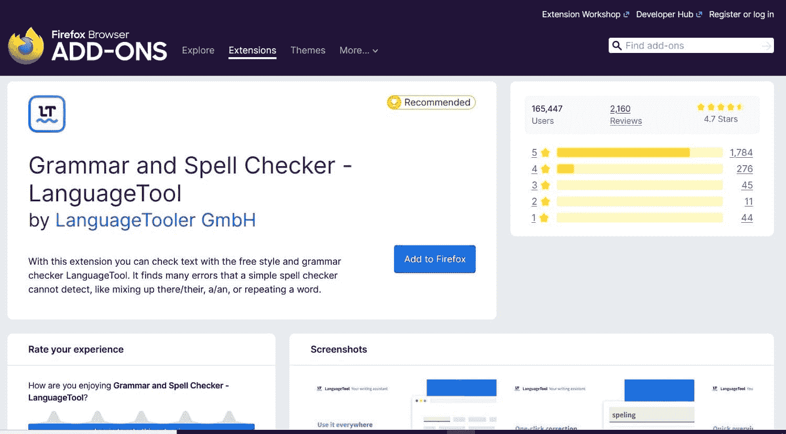

LanguageTool Firefox extension.

如果你的工作依赖电子邮件作为必要的交流方式，这是有益的。

## 注册订阅时事通讯

### 想知道我们是怎么让流量增长超过 1000%的吗？

加入 20，000 多名获得我们每周时事通讯和内部消息的人的行列吧！

[Subscribe Now](#newsletter)

你还可以使用它来确保任何博客或社交媒体帖子的语法正确。

**特性:**

*   在您键入电子邮件、[社交媒体帖子](https://kinsta.com/blog/wordpress-social-media-plugins/)或在浏览器中创建其他在线内容时进行校对和编辑。
*   让您只需点击一下鼠标就可以更正书写中的错误。

**好处:**

*   通过写作学习更好的语法，而不需要聘请老师、阅读枯燥的语法书或上课。
*   不需要注册、帐户或订阅。

### 4.SEO: SEOQuake

如果你正在寻找一个 Firefox 扩展来帮助你提升搜索引擎优化结果，SeoQuake 是一个很好的起点。

这是一个完全免费的插件，让你可以访问你访问的每个页面的许多不同的 SEO 指标。

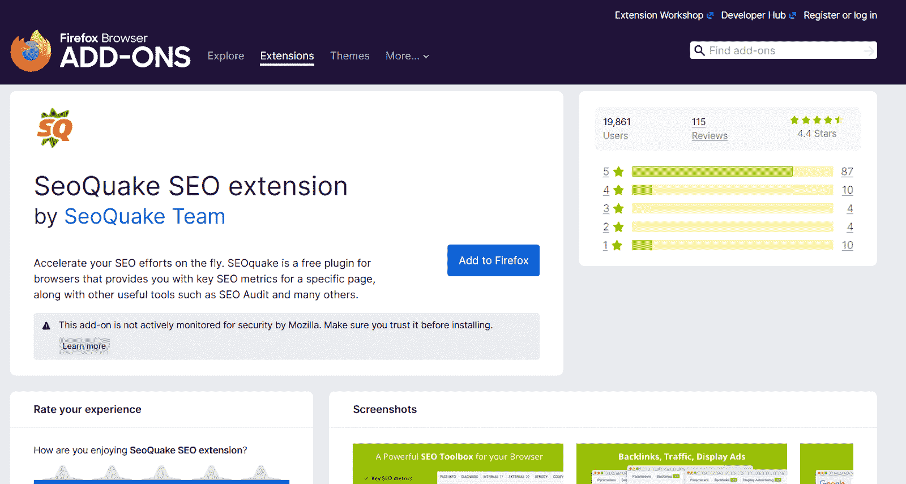

SeoQuake Firefox extension.

如果你有一个 WordPress 网站，你可能也想看看我们推荐的 WordPressSEO 插件列表。他们可以帮助你直接提高你的现场搜索引擎优化，你可以用这些外部数据来提高你的排名。

**特性:**

*   它显示你访问的页面的反向链接、流量、显示广告和其他搜索引擎优化信息。
*   评估您的网站或竞争对手网站的移动可用性。
*   将结果导出为 CSV 格式。
*   提供不同页面的社交分享统计数据。

**好处:**

*   通过对你的关键页面和博客文章进行深入的审核，在竞争中获得优势。

### 5.可读性:宁静阅读器

如果你因为自动播放视频、广告、小工具和其他侵入性媒体内容而难以阅读在线内容，你可以使用[宁静阅读器](https://addons.mozilla.org/en-US/firefox/addon/tranquility-1/)来消除除文本之外的所有内容。

您甚至可以为删除和保留设置自己的自定义规则，为自己打造量身定制的体验。

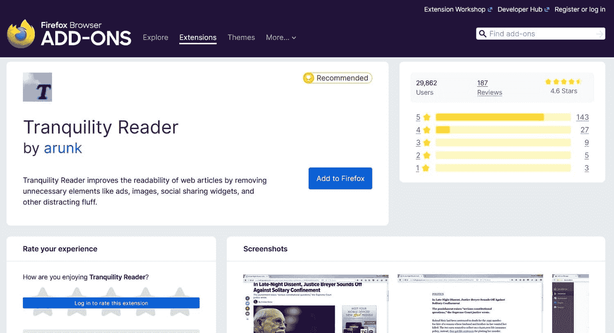

Tranquility Reader Firefox extension.

如果因为小文本或彩色背景而难以阅读，您可以设定自定字体大小、颜色和背景。

您也可以脱机保存内容，以便以后在没有互联网连接的情况下阅读。

**特性:**

*   从在线内容中删除广告、自动播放的视频、社交共享插件、图像等。
*   编辑字体大小、颜色和背景，使其可读性更好。
*   它为您提供了离线保存内容以供日后阅读的选项。

**好处:**

*   不受干扰地阅读你喜欢的博客或在线报纸。
*   创造一种定制的阅读体验，不会让你的眼睛感到疲劳。

### 6.时间管理:番茄钟

如果你第一次在家工作，或者想尝试新的时间管理策略，[番茄时钟是火狐的一个扩展，可能会帮到你。](https://addons.mozilla.org/en-US/firefox/addon/tomato-clock/)

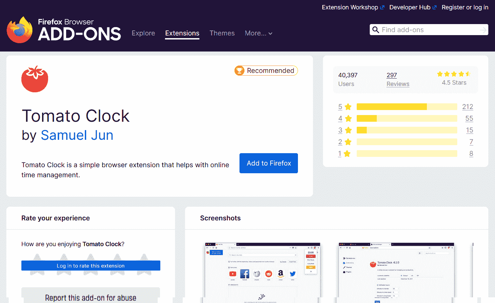

Tomato Clock Firefox extension.

它遵循“番茄工作法”，将你的工作时间分成 25 分钟，然后休息 5 分钟。

这项技术旨在帮助你在短时间内保持高度专注于工作，以避免一整天都筋疲力尽。

您还可以根据您的方法和策略来控制计时器的长度。

**特性:**

*   自动跟踪工作时间，并将您的工作日分为工作和休息时段—默认情况下，工作 25 分钟，休息 5 分钟。
*   允许你自定义定时器到任何长度。

**保险金:**

需要一个给你带来竞争优势的托管解决方案吗？Kinsta 为您提供了令人难以置信的速度、一流的安全性和自动伸缩功能。[查看我们的计划](https://kinsta.com/plans/?in-article-cta)

*   通过更好的时间管理提高您的效率和生产力。

### 7.选项卡管理:树样式选项卡

你厌倦了失去对几十个不同的标签页的控制吗？[树形标签](https://addons.mozilla.org/en-US/firefox/addon/tree-style-tab/)可以帮你控制疯狂。

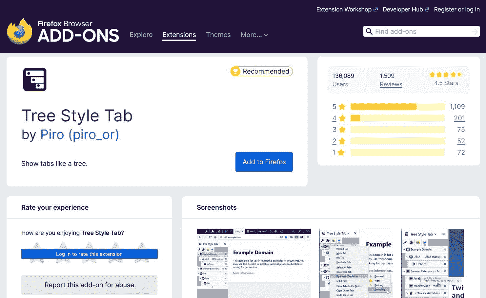

Tree Style Tab Firefox extension.

通过将选项卡排列成可扩展的“树”，你可以在任务之间来回切换时跟踪不同的网站和页面。

该扩展基于搜索活动等巧妙的线索自动创建这棵树，但您可以自己自由编辑它。

**特性:**

*   在新的子选项卡中自动打开每个搜索结果。
*   允许您自由地使用拖放功能来重构树。

**好处:**

*   再次进行网上调查时，不要忘记关键的一页。

### 8.截图:全网页截图(FireShot)

如果你想捕捉整个网页的整页截图，你可以使用 [FireShot 扩展](https://addons.mozilla.org/en-US/firefox/addon/fireshot/)。

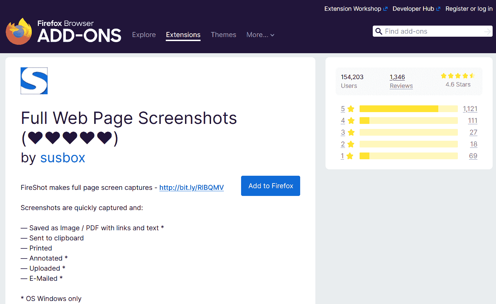

FireShot Firefox extension.

使用该扩展，您可以[捕获、编辑、注释网页截图，并将网页截图](https://kinsta.com/blog/how-to-screenshot-on-mac/)保存为带有链接和文本的图像或 PDF 文件。

这是一种在你的电脑上存储在线研究的简单方法。

**特性:**

*   捕捉部分或整页网页截图。
*   它为您提供了用文本、形状、箭头和图标进行注释的选项。
*   保存为带有链接和文本的图像或 PDF 文件。

**好处:**

*   在竞争对手的在线研究中做有效的笔记，或者用指导性的截图改进你的操作指南。

### 9.安全浏览:Avast 在线安全

如果你想避开危险的在线网站，火狐的 Avast 在线安全扩展可以帮上忙。

它使用一个众包的网站信誉评级库来帮助您避免任何可疑的网站、诈骗或病毒。

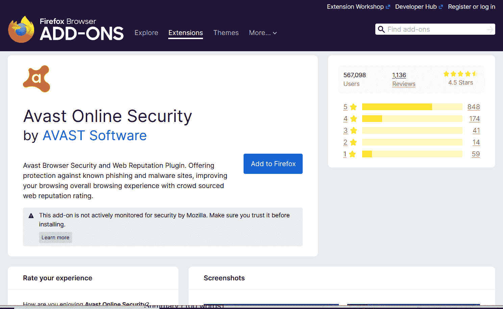

Avast Online Security Firefox extension.

它可以帮助您避开钓鱼网站、[恶意软件](https://kinsta.com/blog/types-of-malware/)等等。如果你关心在线隐私和安全，这是一个很好的扩展——现在谁不关心呢？

**特性:**

*   它可以帮助您避免使用众包数据的已知网络钓鱼诈骗和恶意软件网站。
*   允许您在几秒钟内检查任何网站的评级。
*   它给你选择网站的可信度。

**好处:**

*   利用过去 4 亿多 Avast 用户的经验，最大限度地减少您遭受诈骗和恶意软件的风险。

### 10.护眼:黑暗阅读器

当你在工作日盯着屏幕看的时候，白色背景的页面会伤害你的眼睛吗？谢天谢地，如果一个网站不提供黑暗模式，你不必再忍受这种情况。

有了火狐扩展[黑暗阅读器](https://addons.mozilla.org/en-US/firefox/addon/darkreader/)，你可以打开任何页面的黑暗模式，即使网站没有提供。

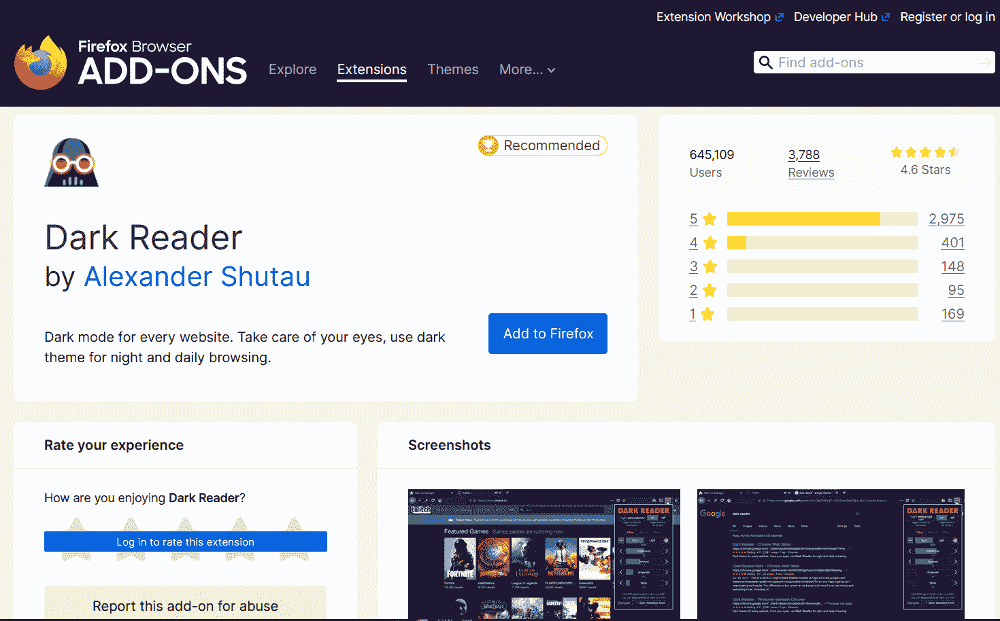

Dark Reader Firefox extension.

这对眼睛来说更容易，特别是如果你在晚上使用浏览器工作或研究的话。

**特性:**

*   它给你选择打开互联网上每个网站的黑暗模式。
*   允许您调整亮度、棕褐色滤镜、字体设置等。

**好处:**

*   使用每个网站的黑暗模式，减少长时间网上冲浪对眼睛的压力。

### 11.网页开发和设计:手写笔

如果你是一名[网页开发者](https://kinsta.com/blog/how-to-become-a-web-developer/)或者网页设计师，[手写笔](https://addons.mozilla.org/en-US/firefox/addon/styl-us/)扩展可以让你的浏览体验更加有趣。

它让你自由地重新设计你最喜欢的网站，使用你个性化的 CSS 样式表。

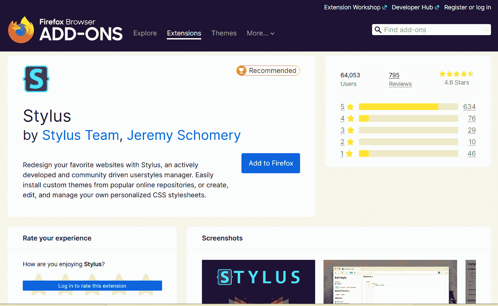

tylus Firefox extension.

感觉博客没有足够的空白空间？可以自己加。不喜欢论坛或 subreddit 上的配色方案？可以换成更适合自己口味的。

手写笔给你创造的自由，使你互动的网页看起来像你想要的样子。

**特性:**

*   允许您创建自定义主题。
*   包括可选布局、颜色和图标选择等高级功能。
*   它给你选择安装来自其他设计者和开发者的主题。
*   只需点击一个按钮，即可备份您的所有设计。

**好处:**

*   让网页看起来像你想要的样子，并且在做的时候更好地设计网页。

### 12.YouTube 体验:YouTube 的增强器

你对普通的 YouTube 用户体验不满意吗？你想要额外的功能，如自动质量选择和使用鼠标滚轮控制音量的能力吗？

YouTube 增强器提供了所有这些甚至更多。

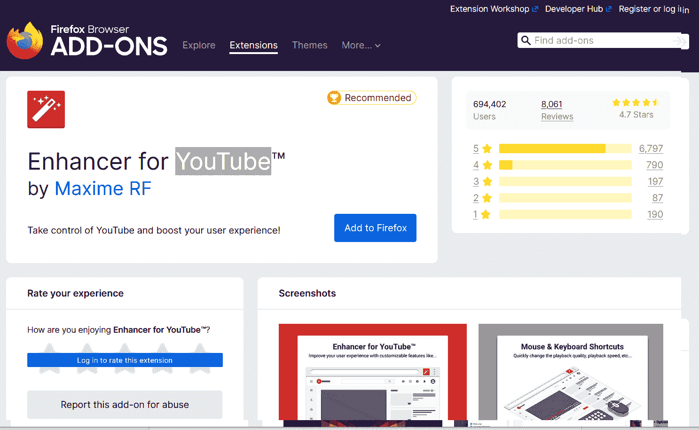

Enhancer for YouTube Firefox Extension.

它让你完全控制自己在 YouTube 上的体验，包括你是否想观看特定频道的广告。无论你是[创建一个 YouTube 频道](https://kinsta.com/blog/how-to-create-a-youtube-channel/)还是在 YouTube 上做一些[视频营销](https://kinsta.com/blog/youtube-seo/)，这个扩展都是一个可靠的扩展。

您可以为键盘和鼠标按钮创建自定义快捷方式，并为自己开发最佳用户体验。

**特性:**

*   允许您为 30 多种不同的功能设置自定义键盘和鼠标快捷键。
*   它让您可以选择您喜欢的视频质量和所有视频的其他设置。

**好处:**

*   体验您自己创造的最佳 YouTube 用户体验。

尽管火狐失去了一些人气，但就浏览器市场份额而言，它仍是世界前三。

当您查看扩展库时，原因就很清楚了——有成千上万的扩展可用于各种目的。我们上面提到的 12 个只是一个起点。

不要害怕自己去搜索图书馆，找到你需要的 Firefox 扩展，让你的生活更轻松。

[If there's any functionality you're missing in Firefox, the chances are that you can add what you need through an extension 😲 See the best options in this guide 👀Click to Tweet](https://twitter.com/intent/tweet?url=https%3A%2F%2Fkinsta.com%2Fblog%2Ffirefox-extensions%2F&via=kinsta&text=If+there%27s+any+functionality+you%27re+missing+in+Firefox%2C+the+chances+are+that+you+can+add+what+you+need+through+an+extension+%F0%9F%98%B2+See+the+best+options+in+this+guide+%F0%9F%91%80&hashtags=Firefox%2CFireFoxTips)

## 摘要

扩展的存在是为了帮助你获得 Firefox 默认不提供的额外功能。您可以混合搭配数千种不同的选项，直到创造出最佳的浏览体验。

希望我们的建议列表能帮助你找到一些你可以改变和改进的地方。使用正确的扩展，您可以保持更安全、更高效，并在线完成更多工作。

在下面的评论区告诉我们一些你最喜欢的火狐扩展。

* * *

让你所有的[应用程序](https://kinsta.com/application-hosting/)、[数据库](https://kinsta.com/database-hosting/)和 [WordPress 网站](https://kinsta.com/wordpress-hosting/)在线并在一个屋檐下。我们功能丰富的高性能云平台包括:

*   在 MyKinsta 仪表盘中轻松设置和管理
*   24/7 专家支持
*   最好的谷歌云平台硬件和网络，由 Kubernetes 提供最大的可扩展性
*   面向速度和安全性的企业级 Cloudflare 集成
*   全球受众覆盖全球多达 35 个数据中心和 275 多个 pop

在第一个月使用托管的[应用程序或托管](https://kinsta.com/application-hosting/)的[数据库，您可以享受 20 美元的优惠，亲自测试一下。探索我们的](https://kinsta.com/database-hosting/)[计划](https://kinsta.com/plans/)或[与销售人员交谈](https://kinsta.com/contact-us/)以找到最适合您的方式。