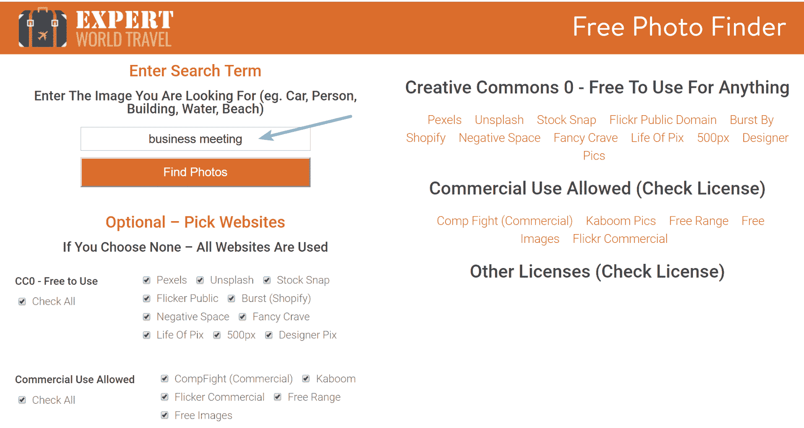
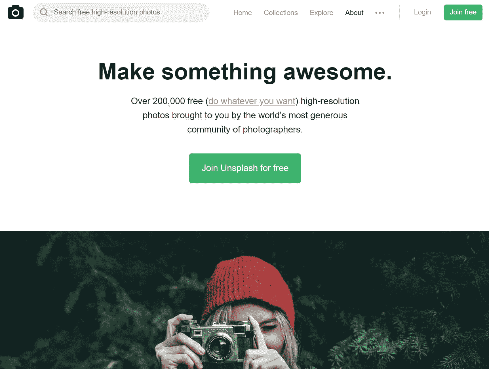
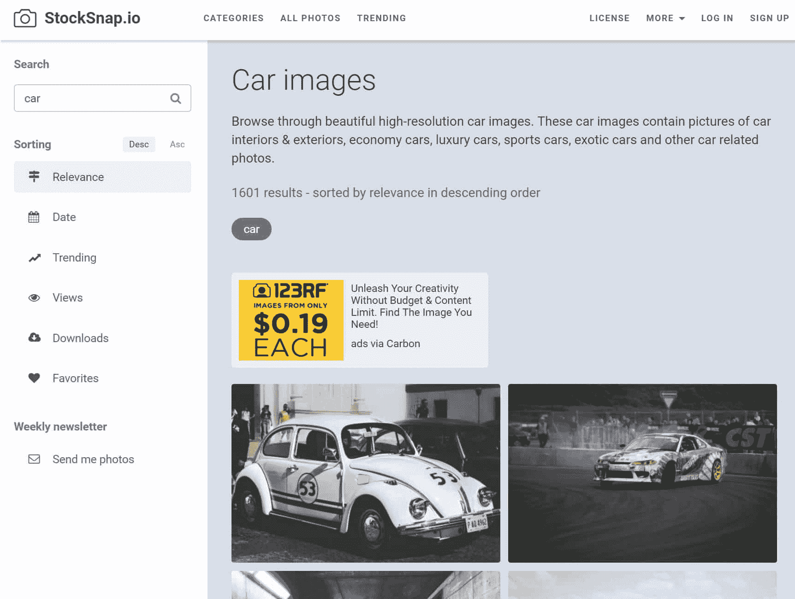
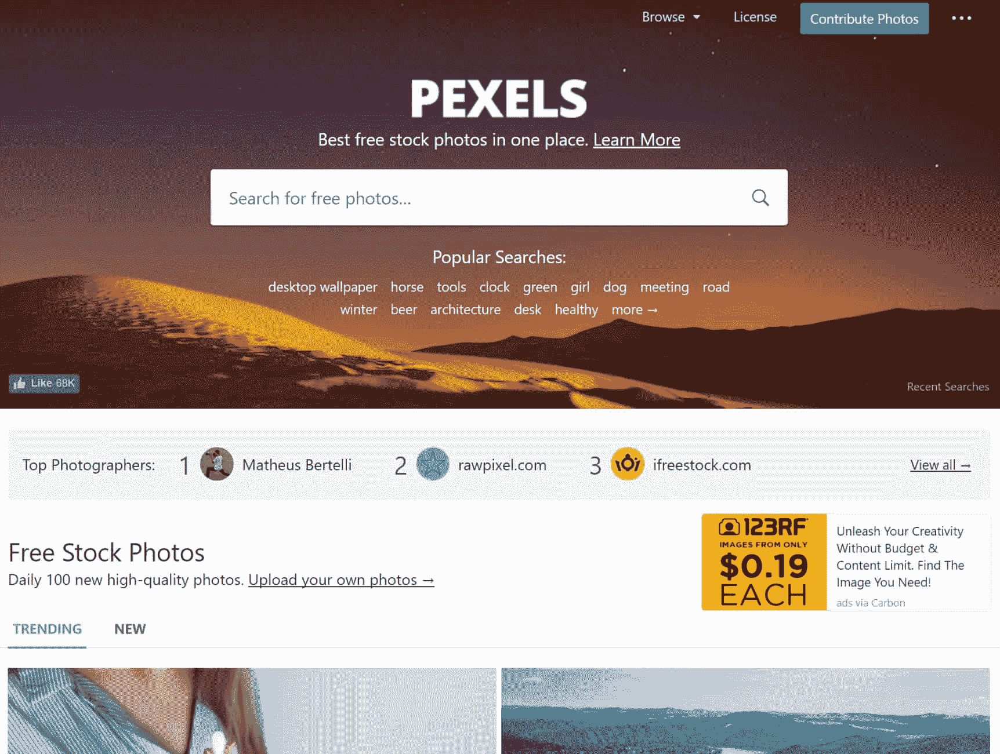
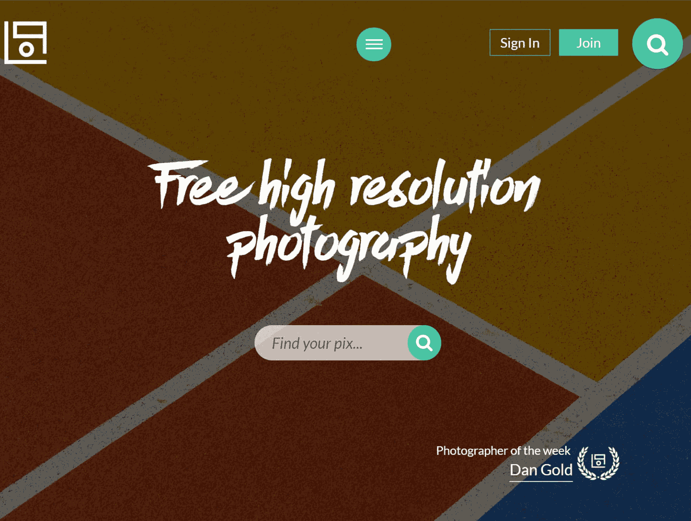
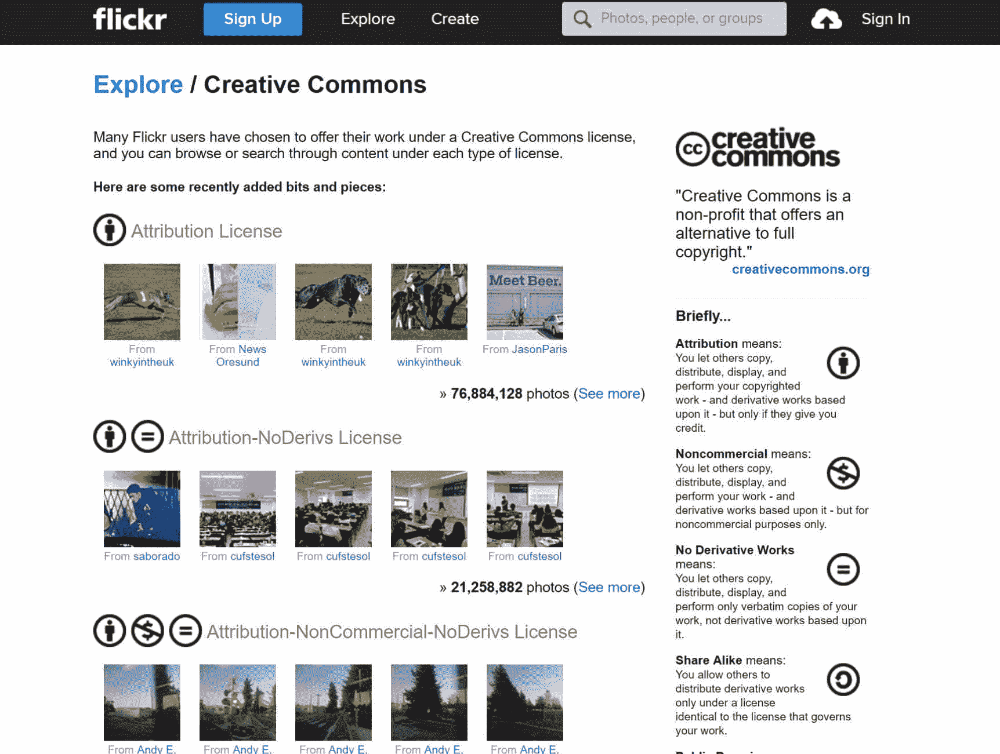
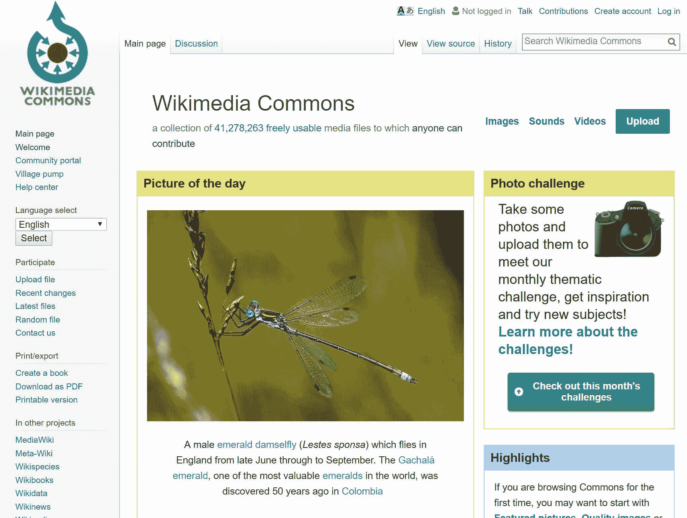
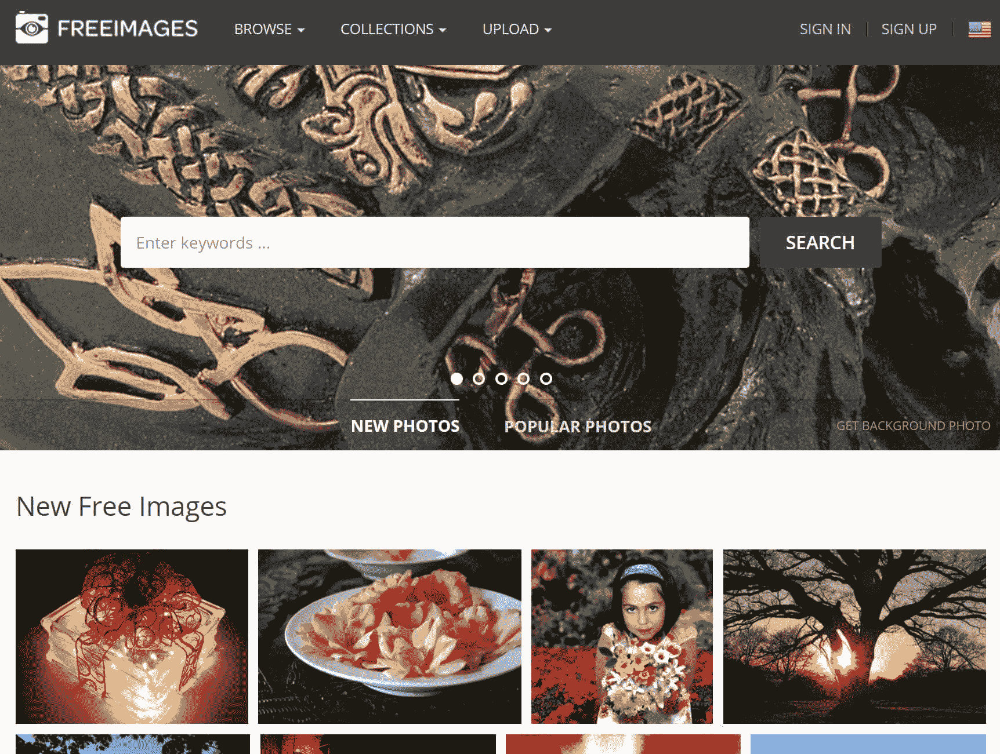
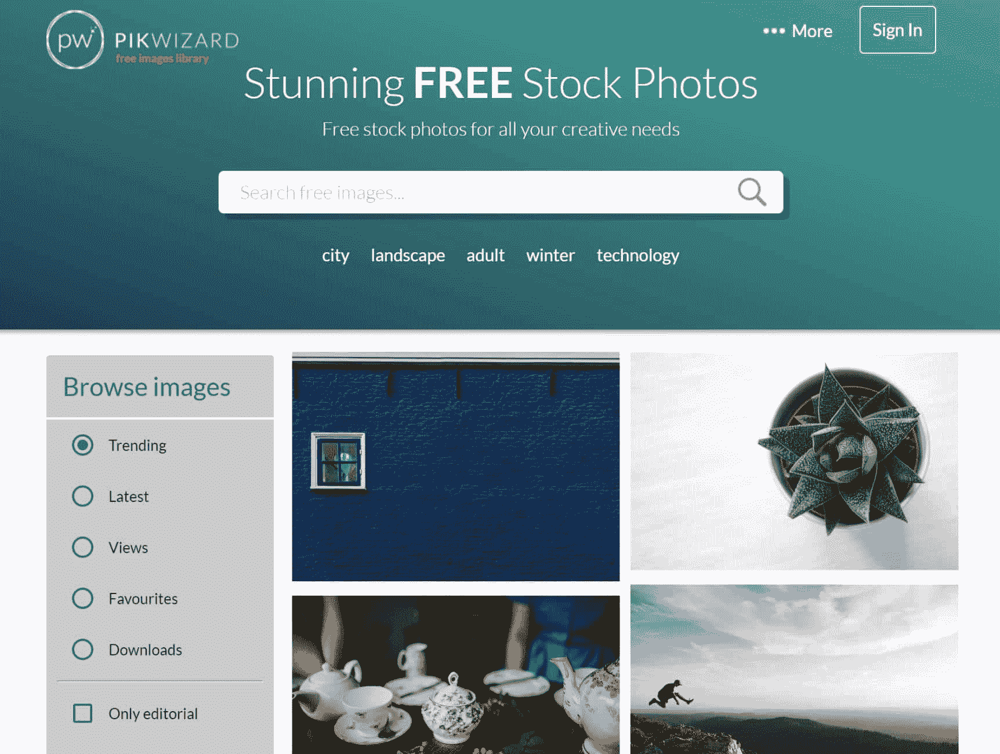
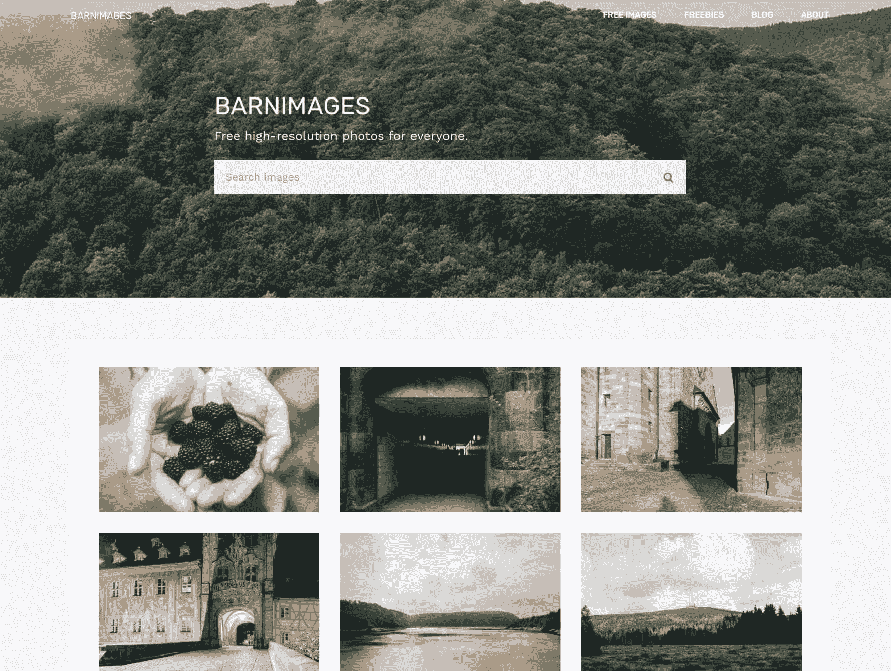

# 为 WordPress 寻找免费图片的 10 个绝佳地点

> 原文：<https://kinsta.com/blog/free-images-for-wordpress/>

就像试图寻找永恒的内容创意一样，找到正确的图像——特别是免费和免版税的图像——可能是一个挑战。当然，这是整个过程中必不可少的一部分。毕竟，没有人想被指责剽窃别人的照片。然而，如果你不知道去哪里找，这会让人头疼。幸运的是，你可以访问几个很棒的网站，为你的 WordPress 博客挑选免费图片。这些网站，就像接下来的网站一样，以用户友好、高效、选择多样而闻名。

## 2022 年在哪里可以找到 WordPress 的免费图片

免版税指的是使用版权材料而无需支付许可费的权利。这并不总是意味着无归因，但它确实意味着无成本！看看这个神奇的工具和下面的 10 个网站，在那里你可以找到免费的免版税图片。这些没有特定的顺序。

*   [免费的照片查找工具](#free-photo-finder-tool)
*   [去飞溅](#unsplash)
*   [StockSnap.io](#stocksnap)
*   [轴](#pexels)
*   [Pix 的寿命](#life-of-pix)
*   [Flickr:知识共享](#flickr)
*   [维基媒体公社](#wikimedia-commons)
*   [Freeimages.com](#freeimages)
*   [PikWizard](#pikwizard)
*   [谷仓图像](#barnimages)

### 1。免费照片查找工具

在我们进入一些伟大的免费照片网站之前，专家世界旅行已经创建了一个非常酷的工具，叫做[免费照片查找器](https://expertworldtravel.com/free-photo-finder/)。它允许你输入你想要的照片的搜索词，然后根据许可证类型(CC0 公共领域，允许商业使用，其他)对所有网站进行排序。当你点击网站时，它会自动填入你的搜索词。非常方便，绝对是你想收藏的！

Free photo finder tool

### 2。不溅

最初是由一个失败的创业公司作为一个副业项目开始的， [Unsplash](https://unsplash.com) 已经成为网络上发展最快的高分辨率照片网站之一。它现在拥有超过 200，000 个免版税、免署名、可用于商业用途的软件。

Unsplash

### 3。StockSnap.io

[StockSnap.io](https://stocksnap.io/) 每周都会增加新的高分辨率图像。StockSnap 上的所有照片都属于知识共享 CC0 许可。这意味着你可以复制、修改、分发网站上的任何照片，甚至是出于商业目的，而无需征得许可。

> Kinsta 把我宠坏了，所以我现在要求每个供应商都提供这样的服务。我们还试图通过我们的 SaaS 工具支持达到这一水平。
> 
> <footer class="wp-block-kinsta-client-quote__footer">
> 
> 
> 
> <cite class="wp-block-kinsta-client-quote__cite">Suganthan Mohanadasan from @Suganthanmn</cite></footer>

[View plans](https://kinsta.com/plans/)

StockSnap.io

### 4。佩克斯

[Pexels](https://www.pexels.com/) 成立于 2014 年，收集了超过 30，000 张照片，可免费用于个人和商业用途。你可以修改、复制和分发照片，而无需征得许可(即无归属)。他们以每月 3000 多张的速度不断添加新照片。

Pexels

### 5。Pix 的生命

Pix 的生活采取了独特的方式。他们的摄影师网络每周都会发布免费的高分辨率照片。如果你想要惊人的照片，这绝对是一个检查出来！当然，它们没有版权限制，可以用于个人和商业用途。摄影师也可以加入并提交自己的作品。

Life of Pix

### 6。Flickr:知识共享

知识共享的概念是对传统版权法有趣的补充。实质上，CC 许可允许图像的创建者授予公众基于他们自己的条件共享和使用他们的作品的许可。结果是图像的创建者和想要使用图像的 WordPress blogger 都有了更大范围的基于共享的灵活性。

## 注册订阅时事通讯

### 想知道我们是怎么让流量增长超过 1000%的吗？

加入 20，000 多名获得我们每周时事通讯和内部消息的人的行列吧！

[Subscribe Now](#newsletter)

Flickr Creative Commons

观看这一过程的最佳方式是[去 Flickr 的知识共享区](https://www.flickr.com/creativecommons/ "go to Flickr’s Creative Comments section")。从那里，您将看到许多可供使用的多功能图像选项。图像本身标有易于理解的符号，用于特定的使用类别，包括:

*   免版税图像
*   仅用于非商业用途
*   需要照片认证
*   不允许衍生作品

### 7。维基媒体共享

可能有一个场合，你只需要使用一张公开的照片。Wikimedia Commons 是 Wikimedia Foundation 的一个项目，是这类图片的绝佳来源，因为这个网站上的大多数照片、图画和插图都属于公共领域。

Wikimedia Commons

也就是说，这里有些图片确实包含知识共享许可，要求在使用图片时提供适当的照片授权。正因为如此，你应该在把它发布到你的 WordPress 博客上之前确保阅读附属细则。

Struggling with downtime and WordPress problems? Kinsta is the hosting solution designed to save you time! [Check out our features](https://kinsta.com/features/)

### 8。Freeimages.com

当要在一个专门提供免版税图片的网站上找到你想要的东西时，分类是王道。这就是 freeimages.com 的这项特殊服务如此吸引人的原因，因为它的高质量图片是由几个特定的搜索指标分开的，所以你可以很容易地得到一张完美的图片。此外，这些类别将允许你快速找到可能深埋在类似网站的图片。

Freeimages

### 9.皮克巫师

PikWizard 是一个较新的网站，但它包含了数千张令人惊叹的免费照片。他们网站上的一切都是**免费的个人和商业使用**，不需要署名。无论你是博客写手还是企业，他们的高质量图片都可以为你的网站锦上添花。

PikWizard

### 10.谷仓图像

Barnimages 于 2015 年 3 月由两位来自拉脱维亚的摄影师 Igor Trepeshchenok 和 Roman Drits 创办。他们每周都会添加免费图片。与您可能已经熟悉的集合相比，Barnimages 不是另一个聚合器。每张照片都是由网站所有者或他们所尊重的同事拍摄的。

您可以将 Barnimages 上发布的任何免费图片用于**商业和非商业目的**。

Barnimages

## 摘要

有时候，一张图片比任何文字能告诉你更多的东西。当然，如果你经营一个 WordPress 博客，你就会知道为了让你发布的内容生动起来，图片的使用是多么重要。你在哪里为你的 WordPress 站点找到免费图片？我们很想在下面的评论中听到它。

* * *

让你所有的[应用程序](https://kinsta.com/application-hosting/)、[数据库](https://kinsta.com/database-hosting/)和 [WordPress 网站](https://kinsta.com/wordpress-hosting/)在线并在一个屋檐下。我们功能丰富的高性能云平台包括:

*   在 MyKinsta 仪表盘中轻松设置和管理
*   24/7 专家支持
*   最好的谷歌云平台硬件和网络，由 Kubernetes 提供最大的可扩展性
*   面向速度和安全性的企业级 Cloudflare 集成
*   全球受众覆盖全球多达 35 个数据中心和 275 多个 pop

在第一个月使用托管的[应用程序或托管](https://kinsta.com/application-hosting/)的[数据库，您可以享受 20 美元的优惠，亲自测试一下。探索我们的](https://kinsta.com/database-hosting/)[计划](https://kinsta.com/plans/)或[与销售人员交谈](https://kinsta.com/contact-us/)以找到最适合您的方式。